# 0139: Improving The `useQuery` API

> Consolidated exploration and staged plan for turning `useQuery` into xNet's universal read API across local reads, remote reads, realtime sync, streaming, materialized views, pagination, query planning, and arbitrary-scale application reads.

**Date:** 2026-06-02  
**Status:** Exploration  
**Scope:** `@xnetjs/react`, `@xnetjs/data-bridge`, `@xnetjs/data`, `@xnetjs/query`, `@xnetjs/hub`, SQLite-backed storage, database views, app docs, and future query docs  
**Primary goal:** create a powerful and easy-to-use read API that keeps the simple current `useQuery(Schema, ...)` ergonomics while scaling into local-first, remote-capable, streaming, realtime, paginated, materialized, and federated reads.

---

## 🎯 Problem Statement

`useQuery` is the public read hook most developers will reach for first. Today it is already a stable root export in `@xnetjs/react`, but the surrounding codebase has grown beyond what the hook currently advertises:

- `QueryDescriptor` already knows about `search`, `spatial`, and `materializedView`.
- `NodeStore.query()` can delegate to storage-level `queryNodes()`.
- SQLite storage can push down scalar filters, system ordering, FTS candidates, R-Tree candidates, pagination in safe cases, adaptive indexes, parity checks, and materialized view reads.
- Database hooks already return `total`, `hasMore`, and `loadMore`.
- Hub services already model remote search/database reads with totals, cursors, `hasMore`, and query timing.
- Existing explorations already sketched pagination, graph queries, Datalog-style queries, join planning, and SQLite automatic indexing.

The gap is no longer "xNet has no query substrate." The gap is that the public React API does not yet integrate that substrate into one clear product model.

The new `useQuery` direction should answer one question:

> How can a developer write one small, typed query and trust xNet to return the best current local answer immediately, keep it live, optionally stream better remote answers, paginate at scale, materialize hot views, and expose enough metadata to build excellent UI without knowing which engine did the work?

---

## Executive Summary

The recommendation is a **layered universal read API**, not a replacement of the current hook.

1. Preserve the existing stable overloads:
   - `useQuery(Schema)`
   - `useQuery(Schema, id)`
   - `useQuery(Schema, options)`
2. Promote already-existing descriptor capabilities into the public hook options:
   - `search`
   - `spatial`
   - `materializedView`
   - query plan/debug metadata
3. Add first-class result metadata:
   - `status`, `isLoading`, `isFetching`, `isLive`, `source`
   - `totalCount`, `hasMore`, `pageInfo`
   - `completeness`, `staleness`, `sync`
   - `plan` in development/devtools paths
4. Make pagination a first-class object model:
   - keep `limit` / `offset` for compatibility
   - add cursor-style `page: { first, after }`
   - add `useInfiniteQuery` as a thin convenience wrapper over the same descriptor runtime
5. Separate **view query** from **sync shape**:
   - local view query: what the component renders now
   - sync shape: what data should be pulled/subscribed to keep that view fresh
6. Make remote reads progressive:
   - local-first snapshot by default
   - optional hub/federated refresh
   - optional streaming deltas for search, large result sets, and AI-assisted query flows
7. Keep advanced joins/aggregates behind a canonical query AST:
   - rooted object queries remain the 80% API
   - relation includes, aggregates, query sets, and `useFind` can arrive later without fragmenting the runtime
8. Update docs in phases:
   - immediately document the current stable API and roadmap link
   - after implementation, add dedicated pages for pagination, materialized views, remote reads, streaming, and query planning diagnostics

The most important design constraint: `useQuery` should feel declarative and small at the call site, while the runtime behind it becomes much more capable.

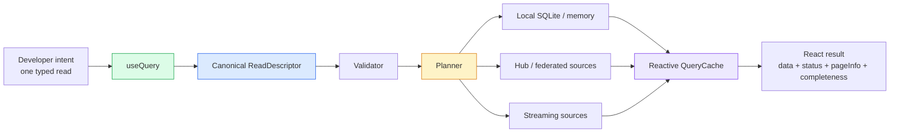

---

## 🧩 Prior Exploration Integration

This document consolidates the existing query-related explorations rather than replacing them.

| Exploration                                                                                                                                     | What It Contributes                                                                                                                                       | What Changes In This Consolidation                                                                                              |
| ----------------------------------------------------------------------------------------------------------------------------------------------- | --------------------------------------------------------------------------------------------------------------------------------------------------------- | ------------------------------------------------------------------------------------------------------------------------------- |
| [0002 React Hooks API Analysis](./0002_[x]_REACT_HOOKS_API_ANALYSIS.md)                                                                         | Identified `useQuery`, `useMutate`, and document hooks as the developer-facing center; called out property flattening and list-query needs                | Treats the hook shape as the stable base, but updates current state to include DataBridge descriptors and SQLite query pushdown |
| [0013 React Hooks Simplification](./0013_[x]_REACT_HOOKS_SIMPLIFICATION.md)                                                                     | Simplified the public API around core hooks                                                                                                               | Keeps `useQuery` as the read primitive and avoids adding too many top-level hooks                                               |
| [0018 React Hooks API v2](./0018_[x]_REACT_HOOKS_API_V2.md)                                                                                     | Proposed better loading/error states, optimistic writes, query invalidation, and auto-updating query results                                              | Keeps the state model, but maps it onto `useSyncExternalStore` and `DataBridge` cache semantics                                 |
| [0037 useQuery Pagination](./0037_[_]_USEQUERY_PAGINATION.md)                                                                                   | Designed `totalCount`, `hasMore`, page helpers, cursor pagination, and `useInfiniteQuery`                                                                 | Updates it for the current reality that query descriptors, `countNodes`, and storage pushdown already exist                     |
| [0042 Unified Query API](./0042_[_]_UNIFIED_QUERY_API.md)                                                                                       | Explored object queries, helper operators, includes, relation traversal, Datalog-style `useFind`, and aggregation                                         | Uses it as the long-term semantic direction, but keeps most advanced surfaces behind a canonical AST and later planner work     |
| [0106 Join Queries, Multi-Type Aggregates, And A Typed Query Planning API](./0106_[_]_JOIN_QUERIES_MULTI_TYPE_AGGREGATES_QUERY_PLANNING_API.md) | Clarified one AST, multiple authoring surfaces, validation, planning, and rooted-vs-pattern query layering                                                | Becomes the recommended architecture for relation, aggregate, multi-root, and saved query work                                  |
| [0108 useQuery Upgrade Timing](./0108_[_]_USEQUERY_UPGRADE_TIMING_AND_INTEGRATION_SEQUENCING.md)                                                | Recommended narrow pagination metadata now and broader query language later                                                                               | Updated here because SQLite `queryNodes`, FTS, R-Tree, materialized views, and descriptor options have since advanced           |
| [0123 SQLite Node Store Read Scaling](./0123_[x]_SQLITE_NODE_STORE_READ_SCALING_AND_AUTOMATIC_INDEXING.md)                                      | Shows the concrete read-scaling substrate: scalar property indexes, SQL candidate plans, adaptive indexes, FTS, R-Tree, materialized views, parity checks | This exploration promotes that substrate into the public hook and docs plan                                                     |

### Consolidated Thesis

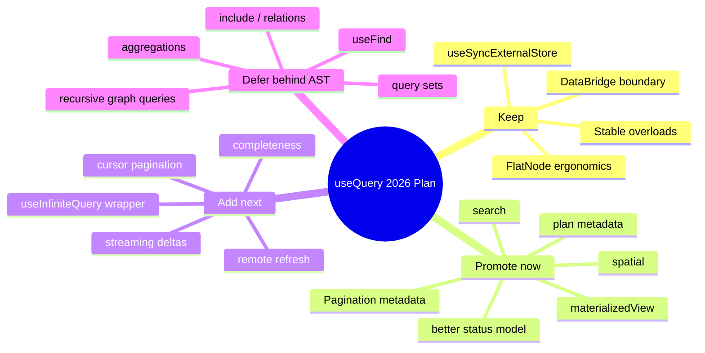

---

## 🔎 Current State In The Repository

### Public React Hook

`packages/react/src/hooks/useQuery.ts` currently exposes:

```ts
useQuery(TaskSchema)
useQuery(TaskSchema, taskId)
useQuery(TaskSchema, {
  where: { status: 'todo' },
  orderBy: { createdAt: 'desc' },
  limit: 20,
  offset: 0,
  spatial: { ... }
})
```

Observed strengths:

- Overloads are simple and memorable.
- Results are flattened through `FlatNode<P>`.
- `useSyncExternalStore` gives React-safe subscriptions.
- Query identity uses `createQueryDescriptor()` and `serializeQueryDescriptor()`.
- `reload()` delegates to `bridge.reloadQuery(descriptor)`.
- Devtools instrumentation already tracks descriptors.

Observed gaps:

- `QueryFilter` in the hook does not expose `search` or `materializedView`, even though `@xnetjs/data-bridge` and `@xnetjs/data` support them.
- `QueryListResult` does not expose total count, `hasMore`, page info, source, sync/completeness metadata, or plan metadata.
- `error` is always structurally present, but bridge query load errors often collapse into empty result sets at the bridge layer.
- Dependency stability still relies partly on stringified option fragments in the hook.
- Pagination is available as input, but not reflected as an ergonomic result model.

### DataBridge And QueryCache

`packages/data-bridge/src/types.ts` already defines a richer `QueryOptions` / `QueryDescriptor` than the public React hook exposes:

- `nodeId`
- `where`
- `includeDeleted`
- `orderBy`
- `limit`
- `offset`
- `spatial`
- `search`
- `materializedView`

`packages/data-bridge/src/query-cache.ts` already provides:

- synchronous snapshots for `useSyncExternalStore`
- per-query subscriber sets
- stable query IDs
- LRU eviction
- schema-scoped cache enumeration

The bridge can already apply precise deltas for unbounded descriptors and request reloads for bounded descriptors.

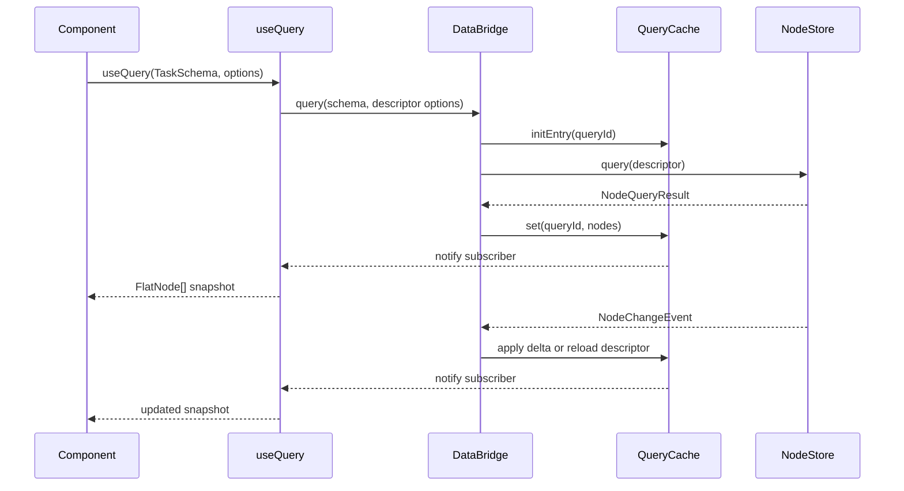

### NodeStore And SQLite

`NodeStore.query(descriptor)` now supports storage-level pushdown when the store is not encrypted and does not have an auth evaluator attached. Otherwise it uses a fallback candidate load, decrypts/filter-readable nodes, and applies descriptor semantics in JavaScript.

`SQLiteNodeStorageAdapter.queryNodes(descriptor)` already supports a serious query plan:

- scalar equality pushdown through `node_property_scalars`
- system-field ordering and pagination pushdown
- FTS candidates when SQLite FTS5 exists
- R-Tree candidates when SQLite R-Tree exists
- materialized result ID lists
- adaptive index hints
- query diagnostics and plan metadata
- parity checks against descriptor semantics

That means the API can grow without demanding an immediate storage rewrite.

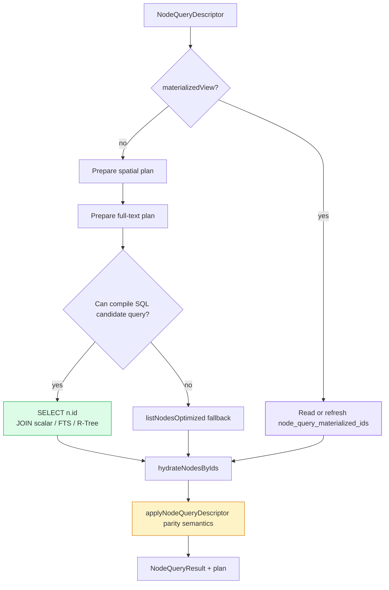

### Remote And Hub Reads

Hub code is more specialized today, but it shows the shape of future remote reads:

- `packages/hub/src/services/query.ts` handles FTS-style search with `limit`, `offset`, authorization filtering, `total`, and `took`.
- `packages/hub/src/services/database-query.ts` returns database rows with `total`, `cursor`, `hasMore`, `source`, and `queryTime`.
- `packages/data/src/database/query-router.ts` already reasons about `local`, `hub`, and `hybrid` execution based on dataset size, search, filter complexity, and hub connectivity.

The useQuery plan should reuse this idea, but with a Node query descriptor and a progressive result model.

### Current Documentation

`packages/react/README.md` documents the stable short-form `useQuery` API. It does not yet describe:

- pagination metadata
- search/spatial/materialized query options
- remote query routing
- streaming
- completeness
- plan diagnostics
- when to use `useQuery` vs database hooks vs hub search hooks

Because `@xnetjs/react` is stable in the lifecycle matrix, docs should avoid promising unimplemented options. The immediate docs update should link this exploration as the roadmap, then implementation phases should update public docs as features land.

---

## 🌐 External Research

### React: External Store Integration

React's [`useSyncExternalStore`](https://react.dev/reference/react/useSyncExternalStore) is the official hook for subscribing to external stores. It requires a subscribe function and cached snapshots. This supports xNet's current direction: keep query reactivity in `DataBridge` / `QueryCache`, then bind React with `useSyncExternalStore`.

**Implication:** `useQuery` should continue to be a thin React binding over a stable external-store query runtime, not a hook full of bespoke loading and subscription code.

### TanStack Query: Fetch Lifecycle And Infinite Queries

TanStack Query's [infinite query docs](https://tanstack.com/query/latest/docs/framework/react/guides/infinite-queries) expose `data.pages`, `pageParams`, `fetchNextPage`, `hasNextPage`, and separate next-page loading flags. TanStack Query also has an experimental [`streamedQuery`](https://tanstack.com/query/latest/docs/reference/streamedQuery) helper that reduces AsyncIterable chunks into query data with `append`, `reset`, or `replace` refetch modes.

**Implication:** xNet should expose explicit infinite-scroll and stream states instead of making components reverse-engineer them from `loading`.

### TanStack DB: Collections, Live Queries, And Query-Driven Sync

TanStack DB positions collections as typed data sets populated from many sources, live queries as reactive results, and derived collections as materialized views. Its docs describe eager, on-demand, and progressive sync modes, plus query-driven sync and sub-millisecond live queries. Source: [TanStack DB overview](https://tanstack.com/db/latest/docs/overview).

**Implication:** xNet should separate "data loaded into local collections/store" from "live query over those collections" and should support eager, on-demand, and progressive read modes.

### Electric: Shapes And Subset Snapshots

Electric's [Shapes guide](https://electric.ax/docs/sync/guides/shapes) defines a shape as a subset of Postgres data to sync. It distinguishes the synced shape from subset snapshots used for pagination/search/progressive loading. The docs also show `ShapeStream`, materialized `Shape`, and `shape.subscribe()`.

**Implication:** xNet should model `sync` separately from `page` and `where`. A view may render a narrow paginated subset while a broader sync shape keeps surrounding data warm.

### PowerSync: Sync Streams And React Hooks

PowerSync's [React hooks](https://docs.powersync.com/client-sdks/frameworks/react) describe live query results, connectivity status, and Suspense. Its [Sync Streams](https://docs.powersync.com/usage/sync-streams) let clients subscribe to parameterized streams and let `useQuery` wait for streams before querying local SQLite.

**Implication:** xNet should support query-coupled sync subscriptions: a component can say "run this local query, but ensure this remote shape is subscribed or has reached first sync."

### Zero: Typed Query Language, Paging, Relationships, And Planning

Zero's [ZQL docs](https://zero.rocicorp.dev/docs/zql) show a TypeScript query builder with `where`, `orderBy`, `limit`, `start()` paging, `one()`, relationships, nested relationship queries, relationship filters, and query plan inspection.

**Implication:** xNet's long-term relation-aware `useQuery` should be typed, planner-backed, and inspectable. Cursor paging should be based on ordered rows/nodes, not just numeric offsets.

### LiveStore: Instant Queries And Fine-Grained Reactivity

LiveStore's [React integration](https://docs.livestore.dev/reference/framework-integrations/react-integration/) emphasizes fine-grained reactivity, instant synchronous query results, transactional state transitions, and React integration.

**Implication:** xNet should aim for synchronous local snapshots whenever local data is present, with `loading` reserved for missing initial data or explicit remote wait modes.

### RxDB: Reactive Query Optimization

RxDB's [RxQuery docs](https://rxdb.info/rx-query.html) describe cached and de-duplicated query results and EventReduce for fast real-time updates. RxDB's [replication docs](https://rxdb.info/replication.html) frame sync around local-first offline reads and resumable replication.

**Implication:** xNet should invest in incremental result maintenance and query-level deduplication, especially for hot views and repeated `useQuery` subscribers.

### Relay And GraphQL Cursor Connections

Relay's [Connections docs](https://relay.dev/docs/v18.0.0/guided-tour/list-data/connections/) define a slice of a list plus page info, with opaque cursors. The [GraphQL Cursor Connections Spec](https://relay.dev/graphql/connections.htm) standardizes `edges`, `cursor`, and `pageInfo`.

**Implication:** xNet should borrow the metadata model, not necessarily the GraphQL result shape. `pageInfo` is a clear contract for arbitrary scale, realtime-friendly pagination.

### Materialize: Streaming Relation Changes

Materialize's [`SUBSCRIBE`](https://materialize.com/docs/sql/subscribe/) streams updates from tables, views, materialized views, or `SELECT` statements, with updates that describe insertions/deletions over logical time.

**Implication:** xNet streaming should prefer deltas with progress metadata over "firehose of complete arrays" for large reads.

### Replicache: Speculative Local State And Server Pokes

Replicache's [sync model](https://doc.replicache.dev/concepts/how-it-works) separates push, pull, rebase, and poke. Pokes are contentless hints that tell clients to pull soon; speculative local state is rebased over canonical server updates.

**Implication:** xNet remote reads do not need every remote event to carry full query data. A hub can send query invalidation hints and the bridge can decide when to refresh or stream.

---

## Key Findings

1. The current codebase already has the core read-scaling substrate. The public hook is behind the lower layers, not ahead of them.
2. `useQuery` should remain the stable read front door. The answer is not a new top-level hook for every read mode.
3. Pagination must become result metadata, not just input options. Components need `pageInfo`, `hasMore`, and loading-more state.
4. `search`, `spatial`, and `materializedView` are near-term API promotions because descriptor/runtime support already exists.
5. Remote reads should be progressive. Local snapshots should usually render first, with remote/federated reads improving completeness.
6. Sync shape and view query are different concepts. xNet should model both so arbitrary-scale reads do not require syncing arbitrary-scale data up front.
7. Streaming needs a delta/progress protocol. Large or federated reads should not repeatedly ship full arrays.
8. Relation includes, aggregates, and Datalog-style pattern queries are still the right long-term direction, but they need a canonical AST, validation layer, and planner before becoming public stable API.
9. Documentation must be phased. The React README should stay accurate today, while exploration/plan docs can describe the future surface.

---

## 🧭 Design Principles

1. **Keep the easy path easy.** The common case remains `const { data } = useQuery(TaskSchema)`.
2. **One canonical descriptor.** Every authoring surface normalizes into a serializable descriptor/AST that can be cached, stored, shared, validated, planned, and debugged.
3. **Local-first by default.** Read from local storage immediately when possible, then sync/refresh/stream better data if requested.
4. **Make incompleteness explicit.** Local-first does not mean "pretend local is complete." Results need `completeness`, `source`, and `staleness`.
5. **Separate sync shape from view query.** A component's filter/page is not always the remote subscription boundary.
6. **Pagination is not an afterthought.** Pagination changes result type and invalidation behavior. It should be a first-class contract.
7. **Realtime uses deltas where possible.** Unbounded simple queries can apply deltas; bounded ordered queries need reload or ordered-window repair.
8. **Materialize hot views.** Stable, repeated, expensive views should cache ordered node IDs and expose cache state.
9. **Remote reads are progressive.** Remote/hub/federated reads should augment local data, not block basic UI unless the caller asks.
10. **Docs follow implementation phases.** The public README should remain accurate, while explorations and future docs describe the roadmap.

---

## Proposed Public API

### Keep Today's Calls

```tsx
const { data: tasks } = useQuery(TaskSchema)
const { data: task } = useQuery(TaskSchema, taskId)
const { data: openTasks } = useQuery(TaskSchema, {
  where: { status: 'open' },
  orderBy: { updatedAt: 'desc' },
  limit: 50
})
```

### Expand Options Conservatively

```ts
type QueryMode = 'local' | 'local-then-remote' | 'remote' | 'live' | 'stream'
type QuerySourcePreference = 'auto' | 'local' | 'hub' | 'federated'

type UseQueryOptions<P> = {
  where?: Partial<InferCreateProps<P>>
  includeDeleted?: boolean
  orderBy?: QueryOrderBy<P>

  // Existing compatibility pagination
  limit?: number
  offset?: number

  // Recommended pagination model
  page?: {
    first?: number
    after?: string
    last?: number
    before?: string
    count?: 'exact' | 'estimate' | 'none'
  }

  // Already supported lower in the stack
  search?: string | { text: string; fields?: Array<'title' | 'content'> }
  spatial?: QuerySpatialFilter
  materializedView?:
    | string
    | {
        viewId: string
        maxAgeMs?: number
        forceRefresh?: boolean
      }

  // Future remote/progressive controls
  mode?: QueryMode
  source?: QuerySourcePreference
  sync?: QuerySyncShape<P> | false
  stream?: QueryStreamOptions

  // Future result shaping
  select?: readonly string[]
  include?: QueryInclude<P>

  // Devtools and diagnostics
  debug?: boolean | { plan?: boolean; parity?: boolean }
}
```

### Return A Richer Result

```ts
type UseQueryResult<TData> = {
  data: TData
  error: Error | null

  status: 'idle' | 'loading' | 'local' | 'syncing' | 'streaming' | 'success' | 'error'
  isLoading: boolean
  isFetching: boolean
  isRefreshing: boolean
  isStreaming: boolean
  isLive: boolean

  source: 'local' | 'hub' | 'federated' | 'hybrid' | 'memory'
  completeness: {
    state: 'complete' | 'partial' | 'unknown'
    reason?: 'local-scope' | 'sync-pending' | 'remote-unavailable' | 'auth-filtered'
    syncedThrough?: number
  }
  staleness: {
    updatedAt: number | null
    stale: boolean
    maxAgeMs?: number
  }

  pageInfo?: {
    totalCount: number | null
    countMode: 'exact' | 'estimate' | 'none'
    hasMore: boolean
    hasNextPage: boolean
    hasPreviousPage: boolean
    startCursor?: string
    endCursor?: string
    loadedCount: number
  }

  materialized?: {
    viewId: string
    cacheHit: boolean
    generatedAt: number
    invalidatedAt?: number
    rowCount: number
  }

  plan?: QueryPlanSummary

  reload: () => void
  refresh: () => Promise<void>
  fetchNextPage?: () => Promise<void>
  fetchPreviousPage?: () => Promise<void>
}
```

The exact names can be refined during implementation. The critical point is that "loading" becomes a derived convenience, not the entire state model.

---

## Example Code

### Local Live Query

```tsx
const {
  data: tasks,
  status,
  isLive
} = useQuery(TaskSchema, {
  where: { status: 'open' },
  orderBy: { updatedAt: 'desc' }
})
```

### Full-Text Search

```tsx
const {
  data: results,
  isFetching,
  plan
} = useQuery(PageSchema, {
  search: { text: searchText, fields: ['title', 'content'] },
  orderBy: { updatedAt: 'desc' },
  page: { first: 20, count: 'estimate' },
  debug: { plan: true }
})
```

### Spatial Viewport Query

```tsx
const cards = useQuery(CanvasCardSchema, {
  spatial: {
    kind: 'window',
    rect: viewport.visibleWorldRect,
    fields: { x: 'x', y: 'y', width: 'width', height: 'height' },
    overscan: 600
  },
  orderBy: { updatedAt: 'desc' }
})
```

### Materialized Saved View

```tsx
const backlog = useQuery(TaskSchema, {
  where: { status: 'open' },
  orderBy: { priority: 'desc', updatedAt: 'desc' },
  page: { first: 100, count: 'exact' },
  materializedView: {
    viewId: `task-view:${viewId}`,
    maxAgeMs: 30_000
  }
})
```

### Progressive Remote Read

```tsx
const query = useQuery(TaskSchema, {
  where: { projectId },
  orderBy: { updatedAt: 'desc' },
  page: { first: 50 },
  mode: 'local-then-remote',
  source: 'auto',
  sync: {
    name: 'project-tasks',
    params: { projectId },
    waitForFirstSync: false,
    ttlMs: 10 * 60_000
  }
})

if (query.completeness.state === 'partial') {
  // Show a subtle sync indicator, not a full-page spinner.
}
```

### Streaming Query

```tsx
const feed = useQuery(ActivitySchema, {
  where: { workspaceId },
  orderBy: { createdAt: 'desc' },
  mode: 'stream',
  stream: {
    reducer: 'ordered-list',
    maxBufferedItems: 500,
    progress: true
  }
})
```

### Infinite Query Convenience Wrapper

```tsx
const {
  data: tasks,
  fetchNextPage,
  pageInfo,
  isFetchingNextPage
} = useInfiniteQuery(TaskSchema, {
  where: { status: 'open' },
  orderBy: { updatedAt: 'desc' },
  pageSize: 50,
  source: 'auto'
})
```

Implementation note: `useInfiniteQuery` should compile to the same descriptor runtime as `useQuery`. It is a convenience wrapper, not a separate query engine.

---

## Result Lifecycle

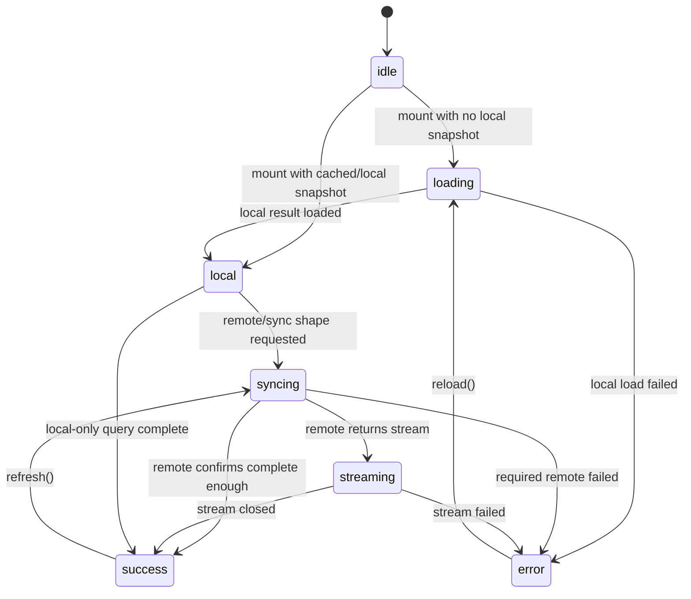

### Status Semantics

| State       | Meaning                                                                                  |
| ----------- | ---------------------------------------------------------------------------------------- |
| `idle`      | Hook is mounted but disabled or waiting on required args                                 |
| `loading`   | No usable local/cached snapshot yet                                                      |
| `local`     | Local snapshot is available; remote completeness may still be unknown                    |
| `syncing`   | A sync shape or remote refresh is active                                                 |
| `streaming` | AsyncIterable or remote delta stream is open                                             |
| `success`   | The current requested mode has reached its completion condition                          |
| `error`     | The required source failed; optional remote failure can instead set partial completeness |

---

## View Query Vs Sync Shape

The biggest conceptual upgrade is separating two things that are easy to conflate.

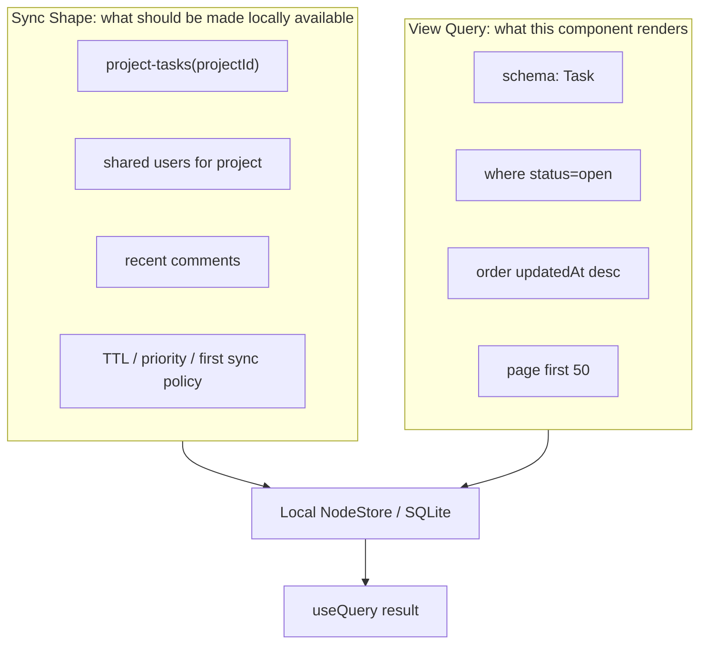

Examples:

- A sidebar may render only the first 20 pages, but sync the latest 200 recently touched pages.
- A canvas may render the viewport plus overscan, but sync neighboring regions opportunistically.
- A search page may stream hub results, but only materialize selected result IDs locally.
- A database view may render `page: { first: 100 }`, but materialize the full ordered ID list for stable scrolling.

This maps directly to Electric "shapes" and PowerSync "streams" without forcing xNet to adopt their exact API.

---

## Pagination Model

### Compatibility

Keep:

```ts
useQuery(TaskSchema, { limit: 20, offset: 40 })
```

Add:

```ts
useQuery(TaskSchema, {
  orderBy: { updatedAt: 'desc' },
  page: { first: 20, after: cursor, count: 'estimate' }
})
```

### Cursor Encoding

Cursor pagination should be based on the full stable order key:

```ts
type QueryCursor = {
  schemaId: string
  order: Array<{ field: string; direction: 'asc' | 'desc'; value: unknown }>
  nodeId: string
  version: 1
}
```

The final tie-breaker should always be `nodeId`, even when the developer does not specify it. This prevents duplicate or missing rows when multiple nodes share the same order value.

### Page Info

```ts
type PageInfo = {
  totalCount: number | null
  countMode: 'exact' | 'estimate' | 'none'
  hasMore: boolean
  hasNextPage: boolean
  hasPreviousPage: boolean
  startCursor?: string
  endCursor?: string
  loadedCount: number
}
```

### Realtime Pagination Behavior

| Query Shape                 | Update Strategy                                                                                              |
| --------------------------- | ------------------------------------------------------------------------------------------------------------ |
| unbounded, no offset/limit  | Apply descriptor delta in memory                                                                             |
| bounded by `limit`/`offset` | Reload or repair window because one insert/delete can shift boundaries                                       |
| cursor page                 | Repair page when changed node is inside page; refresh boundary when node may enter/leave before/after cursor |
| materialized view page      | Invalidate/refresh ordered ID materialization, then read page IDs                                            |
| remote/federated page       | Remote source returns `pageInfo`; local cache stores enough cursor metadata to resume                        |

---

## Materialized Views

`SQLiteNodeStorageAdapter` already has materialized ordered ID lists. The public API should make this capability intentional.

### Use Cases

- saved database/table views
- search result sets
- canvas viewport clusters
- dashboard panels
- activity feeds
- expensive relation-backed views after the AST/planner lands

### Recommended Public Contract

```tsx
const result = useQuery(TaskSchema, {
  where: { status: 'open' },
  orderBy: { updatedAt: 'desc' },
  materializedView: {
    viewId: 'workspace:abc:open-tasks',
    maxAgeMs: 60_000
  },
  page: { first: 50 }
})

result.materialized
// {
//   viewId,
//   cacheHit,
//   generatedAt,
//   invalidatedAt?,
//   rowCount
// }

result.plan?.materializedRefreshReason
// 'missing' | 'descriptor-changed' | 'invalidated' | 'expired' | 'force-refresh'
```

### Storage Model

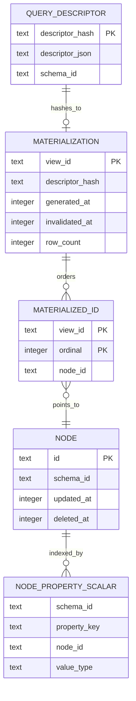

### Important Constraints

- Materialized views cache ordered node IDs, not full node snapshots.
- Materialized views must be invalidated by relevant node changes.
- `maxAgeMs` is a freshness hint, not a correctness guarantee.
- Encrypted/auth-filtered stores bypass storage materialization until there is a per-subject encrypted materialization design.
- View IDs must be caller-controlled but namespaced to avoid collisions.

---

## Streaming Reads

Streaming should exist for result sets that are large, remote, generated, or continuously changing.

### Stream Event Shape

```ts
type QueryStreamEvent<T> =
  | { type: 'snapshot'; rows: T[]; cursor?: string; totalCount?: number }
  | { type: 'insert'; row: T; index?: number }
  | { type: 'update'; row: T; previousIndex?: number; index?: number }
  | { type: 'delete'; id: string; previousIndex?: number }
  | { type: 'progress'; syncedThrough?: number; complete?: boolean }
  | { type: 'reset'; reason: string }
  | { type: 'error'; error: string }
```

The first Phase 5 implementation exports `QueryStreamEvent`, `QueryStreamState`, and pure reducer helpers from `@xnetjs/data-bridge`. The reducer contract uses Node snapshots, insert/update/delete deltas, reset events, progress events, and recoverable/non-recoverable errors.

The follow-up bridge implementation adds an optional `remoteNodeQueryClient.stream(request, observer)` contract. `MainThreadBridge` starts streams when `mode: "stream"` or `mode: "live"` queries gain subscribers, reduces incoming stream events into `QueryCache`, resets snapshots to loading on reconnect resets, stops the stream when the final subscriber unsubscribes, and falls back to one-shot remote `query()` when the client does not expose a stream transport. Devtools stream timelines and hub-side auth/verification enforcement remain open.

### Reducer Modes

| Reducer        | Behavior                                        |
| -------------- | ----------------------------------------------- |
| `replace`      | Replace data on every snapshot                  |
| `append`       | Append chunks to current data                   |
| `ordered-list` | Maintain stable order by descriptor order       |
| `delta`        | Apply insert/update/delete deltas               |
| custom reducer | Caller supplies reducer for specialized streams |

### Streaming Architecture

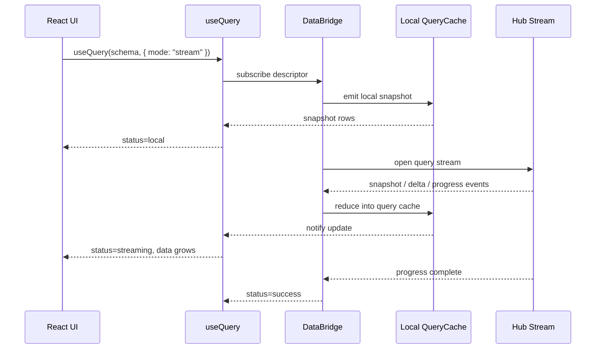

### What Should Stream First

1. Remote full-text search results
2. Federated query result merges
3. Activity feeds
4. Large materialized view refreshes
5. AI-assisted query generation/explanation results

---

## Remote And Federated Reads

`useQuery` should not become "always remote." It should become "source-aware."

### Source Modes

| Source      | Meaning                                                                                     |
| ----------- | ------------------------------------------------------------------------------------------- |
| `local`     | Query only the local NodeStore                                                              |
| `hub`       | Query a specific trusted hub                                                                |
| `federated` | Query multiple hubs and merge                                                               |
| `hybrid`    | Use local snapshot plus remote completion/refresh                                           |
| `auto`      | Planner decides based on descriptor, local cardinality, connectivity, auth, and cache state |

### Query Routing Inputs

```ts
type QueryRoutingContext = {
  descriptor: ReadDescriptor
  localRowCount?: number
  hasHubConnection: boolean
  hasFederationPeers: boolean
  requiresFullTextSearch: boolean
  requiresRelationExpansion: boolean
  pageSize: number
  userPreference: QuerySourcePreference
  authScope: string
}
```

### Remote Read Flow

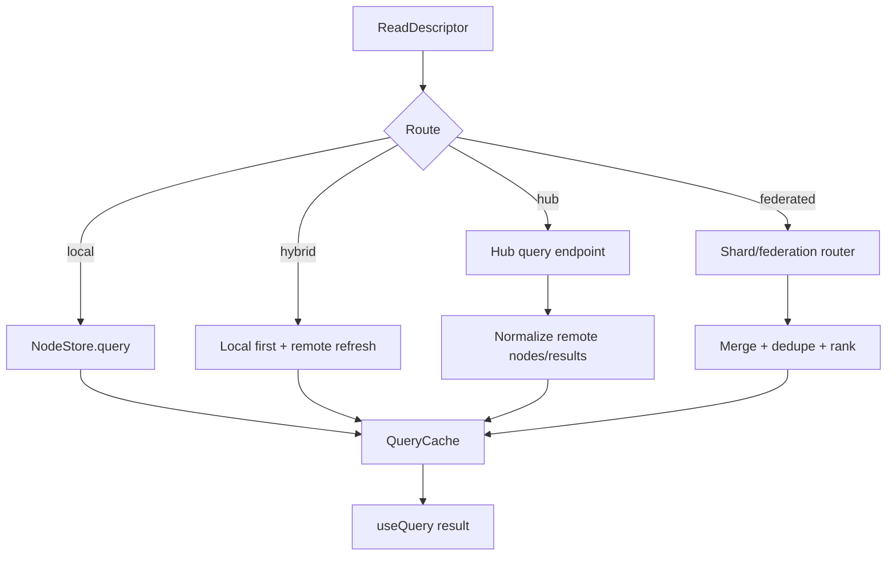

### Remote Read Contract Requirements

- All remote responses must include source metadata.
- Remote results must be authorized before surfacing.
- Remote nodes should be verified or marked unverified.
- Local and remote results must dedupe by node ID and schema.
- Federated results need stable merge ordering.
- Remote errors should not erase valid local snapshots unless `mode: 'remote'` requires remote completion.

### Versioned Remote Node Query Protocol

The Phase 4 foundation now starts with a typed, versioned protocol in `@xnetjs/data-bridge`. Main-thread bridge execution can use an injected `remoteNodeQueryClient` for `mode: 'local-then-remote'` and `mode: 'remote'`; first-party hub transport is still a later step.

```ts
type RemoteNodeQueryRequest = {
  protocol: 'xnet.node-query'
  version: 1
  requestId: string
  descriptor: QueryDescriptor
  mode: 'local-then-remote' | 'remote' | 'live' | 'stream'
  source: 'hub' | 'federated'
  requestedAt: number
  auth?: { bearerToken?: string; ucan?: string; capabilities?: string[] }
  client?: { localSnapshotAt?: number; knownNodeIds?: string[] }
}

type RemoteNodeQueryResponse =
  | {
      type: 'node-query/result'
      requestId: string
      source: 'hub' | 'federated'
      nodes: NodeState[]
      pageInfo: QueryPageInfo
      metadata: QueryMetadata
      completeness: { level: 'complete' | 'partial' | 'unknown'; reason?: string }
      staleness: { level: 'fresh' | 'stale' | 'unknown'; asOf?: number }
      verification: { status: 'verified' | 'unverified' | 'failed' | 'mixed' }
    }
  | {
      type: 'node-query/error'
      requestId: string
      source: 'hub' | 'federated'
      code: 'AUTH_DENIED' | 'REMOTE_UNAVAILABLE' | 'QUERY_UNSUPPORTED' | 'TIMEOUT' | 'UNKNOWN'
      message: string
    }
```

---

## Relation And Aggregate Queries

This exploration recommends **not** cramming joins into `useQuery` before the AST/planner is ready.

Instead:

1. Keep rooted `useQuery(Schema, options)` as the main authoring surface.
2. Add `include` and aggregate options only after there is a canonical query AST.
3. Add `useFind` / pattern queries only as an advanced escape hatch.

### Future Rooted Query

```tsx
const project = useQuery(ProjectSchema, projectId, {
  include: {
    tasks: from(TaskSchema, 'projectId', {
      where: { status: not(eq('done')) },
      orderBy: { updatedAt: 'desc' },
      page: { first: 50 },
      include: {
        comments: from(CommentSchema, 'targetId', { page: { first: 5 } })
      }
    })
  }
})
```

### Future Pattern Query

```tsx
const collaborators = useFind(
  find({
    person: $person,
    commentCount: countDistinct($comment)
  }),
  where(
    match(ProjectSchema, $project, { owner: me.did }),
    match(TaskSchema, $task, { projectId: $project }),
    match(CommentSchema, $comment, { targetId: $task, createdBy: $person })
  ),
  {
    orderBy: { commentCount: 'desc' },
    page: { first: 20 }
  }
)
```

### Why Defer

Relations and aggregates need:

- schema-aware validation
- reverse relation indexes
- authorization-aware expansion
- result type inference
- invalidation graphs
- local/hub pushdown decisions
- saved query serialization
- cycle/depth protections

Those are worth building, but they are a different phase from promoting existing descriptor features and pagination metadata.

---

## Recommended Architecture

### One Engine, Multiple Authoring Surfaces

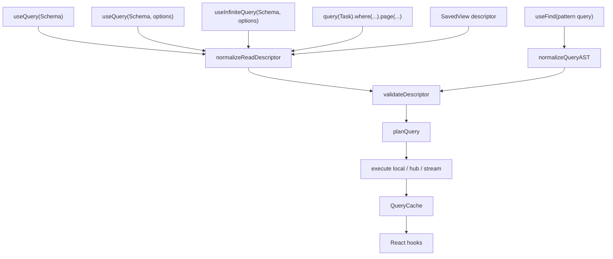

### Planner Stages

```mermaid
flowchart LR
  A["Descriptor"] --> B["Normalize"]
  B --> C["Validate"]
  C --> D["Classify predicates"]
  D --> E["Choose source"]
  E --> F["Choose indexes"]
  F --> G["Execute candidates"]
  G --> H["Hydrate"]
  H --> I["Verify / post-filter"]
  I --> J["Page / materialize"]
  J --> K["Emit snapshot or delta"]
```

### Query Plan Summary

```ts
type QueryPlanSummary = {
  descriptorHash: string
  source: 'local' | 'hub' | 'federated' | 'hybrid' | 'memory'
  strategy: 'storage-query' | 'list-fallback' | 'remote-query' | 'stream'
  candidateNodeCount?: number
  hydratedNodeCount?: number
  returnedNodeCount?: number
  durationMs?: number
  candidateAccelerators?: Array<'scalar-index' | 'fts' | 'rtree' | 'materialized-view'>
  materializedViewId?: string
  cacheHit?: boolean
  warnings?: string[]
}
```

Plan metadata should be:

- visible in devtools by default,
- available in hook results only when `debug` is enabled or in development,
- included in telemetry in aggregated form.

---

## ⚖️ Options And Tradeoffs

### Option A: Minimal Pagination Patch Only

Add `totalCount` and `hasMore` to `useQuery` and stop there.

| Pros                | Cons                                                        |
| ------------------- | ----------------------------------------------------------- |
| lowest risk         | leaves search/spatial/materialized descriptors underexposed |
| backward compatible | does not address remote/streaming/completeness              |
| easy to test        | misses the chance to unify docs and DataBridge plans        |

### Option B: Make `useQuery` A Large Universal Hook Immediately

Add pagination, remote, streaming, includes, joins, aggregates, and materialized views in one public rollout.

| Pros                          | Cons                                          |
| ----------------------------- | --------------------------------------------- |
| compelling feature story      | high contract risk for stable `@xnetjs/react` |
| fewer intermediate docs       | relation/aggregate planner is not ready       |
| can simplify app code quickly | hard to validate and migrate safely           |

### Option C: Layered Universal Read API (Recommended)

Promote implemented descriptor capabilities and metadata now, then add remote/streaming/pagination wrappers, then relation/aggregate AST work.

| Pros                              | Cons                                                            |
| --------------------------------- | --------------------------------------------------------------- |
| builds on current runtime         | requires disciplined phase boundaries                           |
| keeps stable overloads            | some advanced needs wait                                        |
| improves docs without lying       | temporary split between root queries and future pattern queries |
| makes devtools/query plans useful | needs careful result-type naming                                |

### Option D: Adopt TanStack Query / TanStack DB As The Primary Runtime

Wrap xNet NodeStore in an external query library.

| Pros                               | Cons                                                                                   |
| ---------------------------------- | -------------------------------------------------------------------------------------- |
| mature lifecycle vocabulary        | external cache may duplicate xNet's local-first cache                                  |
| strong infinite/streaming patterns | xNet still needs descriptor validation, auth, materialized views, sync, and federation |
| good ecosystem familiarity         | could blur ownership of realtime invalidation semantics                                |

Recommendation: borrow patterns, not the runtime as the primary source of truth.

---

## Recommendation

Choose **Option C: Layered Universal Read API**.

The next implementation plan should stay intentionally narrow for the first release:

- promote descriptor capabilities that already exist below `useQuery`;
- add richer result metadata without breaking current call sites;
- add pagination and infinite-query ergonomics;
- expose materialized view status;
- then add remote, streaming, and advanced AST work in separate release gates.

This path gives xNet a much stronger read API quickly while respecting the stable `@xnetjs/react` contract and avoiding a premature relation/aggregate query-language rollout.

---

## 🗺️ Staged Plan

### Phase 0: Documentation And Contract Alignment

Goal: make the current state and roadmap legible without changing behavior.

- Update `packages/react/README.md` with a roadmap pointer to this exploration.
- Add a future docs outline for:
  - `useQuery` basics
  - pagination
  - search and spatial queries
  - materialized views
  - local vs remote reads
  - streaming
  - query plan debugging
- Keep public docs accurate about what exists today.

### Phase 1: Promote Existing Descriptor Capabilities

Goal: expose what the data layer already supports.

- Add `search` and `materializedView` to `packages/react/src/hooks/useQuery.ts` `QueryFilter`.
- Replace hook-local JSON-string dependency fragments with descriptor serialization as the sole stable dependency key.
- Add result fields:
  - `status`
  - `isLoading`
  - `isFetching`
  - `source`
  - `plan?` behind debug/development
  - `materialized?`
- Extend `DataBridge.query()` snapshots to carry result metadata, not only `NodeState[]`.
- Preserve current `data`, `loading`, `error`, `reload` fields for compatibility.

### Phase 2: Pagination Metadata And Infinite Query Wrapper

Goal: make list reads ergonomic at scale.

- Add `pageInfo` to list results.
- Add `totalCount` and `hasMore` compatibility aliases.
- Add exact vs estimated count modes.
- Implement `limit + 1` or storage count fallback where exact filtered counts are not available.
- Add cursor encoding for ordered descriptors.
- Add `fetchNextPage()` and `fetchPreviousPage()` for cursor-page mode.
- Add `useInfiniteQuery()` as a convenience wrapper over `useQuery`.

### Phase 3: Materialized Views As A Public Feature

Goal: make hot saved views fast and inspectable.

- Promote materialized view metadata from SQLite plan into `useQuery` result metadata.
- Add materialized view invalidation events to bridge/devtools.
- Add docs for view ID naming, max age, force refresh, and per-user/auth caveats.
- Integrate database view materialization docs with the generic Node materialized view API.

### Phase 4: Remote Reads And Sync Shapes

Goal: let `useQuery` cover local and remote reads without sacrificing local-first UX.

- Add `mode` and `source` options.
- Add `sync` shape options.
- Add local-then-remote result progression.
- Add hub query endpoint contracts for Node descriptors.
- Add auth-aware remote result normalization and verification.
- Add federated merge/dedupe/ranking policy.
- Add completeness/staleness metadata.

### Phase 5: Streaming

Goal: support large, remote, and continuously changing reads.

- Add bridge-level stream event protocol.
- Add reducer modes.
- Add streaming query cache updates.
- Add hub SSE/WebSocket endpoint or reuse existing sync channel with query topics.
- Add progress metadata and cancellation.
- Add tests for stream reset, reconnect, and dedupe.

### Phase 6: Canonical AST For Relations, Aggregates, And Query Sets

Goal: land the 0042/0106 vision without destabilizing the current hook.

- Define a canonical query AST separate from current `QueryDescriptor`.
- Add schema-aware runtime validation.
- Add relation include helpers: `follow()` and `from()`.
- Add aggregate helpers: `count`, `sum`, `groupBy`, `having`.
- Add persisted `SavedView` descriptor schema.
- Add `useFind` as an advanced pattern query hook after validation/planning exists.

---

## Implementation Checklist

### Phase 0 Docs

- [x] Add roadmap pointer in `packages/react/README.md`.
- [ ] Add an implementation issue or plan linking this exploration.
- [x] Audit public docs for stale `useQuery` references.
- [x] Keep future API examples in exploration/plan docs until implemented.

### Phase 1 Existing Capability Promotion

- [x] Add `search` to `QueryFilter<P>` in `packages/react/src/hooks/useQuery.ts`.
- [x] Add `materializedView` to `QueryFilter<P>`.
- [x] Route public filter options through `createQueryDescriptor()` without losing fields.
- [x] Use the serialized descriptor as the only query dependency key.
- [x] Extend `QuerySubscription` or add `QuerySnapshot` to include metadata.
- [x] Preserve old `NodeState[] | null` compatibility during migration.
- [x] Surface materialized plan info in devtools query tracker.
- [x] Add unit tests for hook-level `search` descriptor forwarding.
- [x] Add unit tests for hook-level `materializedView` descriptor forwarding.
- [x] Add unit tests proving equivalent option objects do not reload unnecessarily.

### Phase 2 Pagination

- [x] Define `PageInfo`.
- [x] Add `page` options while preserving `limit` / `offset`.
- [x] Add `totalCount` and `hasMore` aliases on list results.
- [x] Add exact count support for descriptor subsets where storage can answer.
- [x] Add estimate mode for hub/federated/search results.
- [x] Add cursor encode/decode utilities with versioning.
- [x] Add stable node ID tie-breaker to cursor order.
- [x] Add `fetchNextPage()` for cursor pages.
- [x] Add `useInfiniteQuery()` wrapper.
- [x] Add tests for insert/delete shifts in bounded windows.
- [x] Add tests for cursor pagination with duplicate sort values.

### Phase 3 Materialized Views

- [x] Add public result metadata for materialized view reads.
- [x] Expose materialized cache hit/miss in query devtools.
- [x] Add invalidation telemetry for materialized views.
- [x] Add docs for `viewId`, `maxAgeMs`, and `forceRefresh`.
- [x] Add tests for stale materialized view refresh.
- [x] Add tests for materialized pagination and reload.
- [x] Add auth/encryption caveat tests or guardrails.

### Phase 4 Remote Reads

- [x] Define Node descriptor request/response protocol for hub reads.
- [x] Add `mode` and `source` query options.
- [x] Add local-then-remote bridge execution.
- [x] Add `completeness` metadata.
- [x] Add `staleness` metadata.
- [ ] Add remote auth filtering and verification status.
- [x] Add federated dedupe and merge policy.
- [ ] Add query router thresholds for Node queries.
- [x] Add tests for local fallback when remote is unavailable.
- [x] Add tests for remote errors preserving local snapshots.

### Phase 5 Streaming

- [x] Define `QueryStreamEvent`.
- [x] Add bridge stream subscription lifecycle.
- [x] Add stream reducers.
- [x] Add cancellation on unmount.
- [x] Add reconnect/reset behavior.
- [x] Add progress events.
- [x] Add tests for snapshot, insert, update, delete, reset, progress, and error events.
- [ ] Add devtools stream event timeline.

### Phase 6 AST And Advanced Queries

- [ ] Define canonical query AST package boundary.
- [ ] Add runtime validator for persisted/shared queries.
- [ ] Add type-safe operator helpers.
- [ ] Add relation include helpers.
- [ ] Add reverse relation index requirements.
- [ ] Add aggregate planning.
- [ ] Add query-set / dashboard aggregate mode.
- [ ] Add `SavedView` node schema.
- [ ] Add `useFind` only after planner validation gates pass.

---

## Validation Checklist

### Compatibility

- [x] Existing `useQuery(Schema)` call sites compile unchanged.
- [x] Existing `useQuery(Schema, id)` call sites compile unchanged.
- [x] Existing `useQuery(Schema, { where, orderBy, limit, offset })` call sites compile unchanged.
- [x] Existing tests in `packages/react/src/hooks/useQuery.test.tsx` pass.
- [ ] Existing database hook tests pass.

### Correctness

- [ ] Query descriptor serialization is canonical for semantically identical options.
- [ ] SQL pushdown results match `applyNodeQueryDescriptor()` parity checks.
- [ ] FTS candidate queries still JS-verify field selection.
- [ ] R-Tree candidate queries still JS-verify geometry.
- [x] Materialized views refresh after relevant invalidation.
- [x] Auth-filtered and encrypted stores do not leak indexed data.
- [ ] Remote reads never surface unauthorized results.

### Performance

- [ ] Unfiltered list query does not hydrate more than needed for paginated system-order pages.
- [ ] Scalar equality queries use `node_property_scalars` on SQLite where available.
- [ ] Search queries use FTS candidates where available.
- [ ] Spatial queries use R-Tree candidates where available.
- [x] Repeated materialized view pages are cache hits.
- [ ] QueryCache does not notify unrelated descriptors.
- [ ] Devtools can show candidate counts and plan duration.

### Realtime

- [ ] Unbounded queries apply insert/update/delete deltas without reload.
- [ ] Bounded queries reload or repair when membership/order boundaries shift.
- [x] Materialized views invalidate on relevant node changes.
- [ ] Remote poke/invalidation triggers refresh without losing local data.
- [ ] Stream events reduce deterministically.

### Documentation

- [x] React README documents current stable API.
- [x] React README links to this exploration until implementation lands.
- [x] Public docs explain local vs remote reads.
- [x] Public docs explain pagination and infinite scroll.
- [x] Public docs explain materialized views.
- [ ] Public docs explain streaming.
- [ ] Public docs explain debug plan metadata.
- [x] Public docs include migration notes from `limit` / `offset` to `page`.

---

## Recommended Next Actions

1. **Do the docs-safe update now.** Add a roadmap note to `packages/react/README.md` that links to this exploration.
2. **Create an implementation plan for Phase 1 and Phase 2 only.** Avoid relation/aggregate work until the AST plan is explicit.
3. **Change the bridge snapshot shape.** This is the key enabling move for metadata, pagination, materialized view status, and remote completeness.
4. **Promote `search` and `materializedView` into `useQuery` options.** These already exist below the hook.
5. **Add pagination metadata without changing old call sites.** Start with `totalCount`, `hasMore`, and `pageInfo`.
6. **Add devtools visibility for query plans.** Developers should see when a query is scanning, using scalar indexes, using FTS/R-Tree, hitting materialization, or falling back.
7. **Write dedicated docs after each phase lands.** Keep future examples out of stable README until implemented.

---

## Open Questions

- Should `useQuery` expose `plan` in development by default, or only through devtools/debug option?
- Should `totalCount` default to `null`, estimate, or exact for filtered queries?
- Should `useInfiniteQuery` return pages or a flattened list by default?
- How should encrypted node stores support search/materialized views without leaking plaintext?
- Should remote hub reads return full node payloads, IDs plus proofs, or search-result summaries?
- How should federated results rank and dedupe when hubs have different freshness?
- What is the minimum AST needed before relation includes can safely ship?
- Should saved query descriptors live in a `SavedView` schema, database view configs, or both?

---

## References

### xNet Code And Docs

- [`packages/react/src/hooks/useQuery.ts`](../../packages/react/src/hooks/useQuery.ts)
- [`packages/data-bridge/src/types.ts`](../../packages/data-bridge/src/types.ts)
- [`packages/data-bridge/src/query-descriptor.ts`](../../packages/data-bridge/src/query-descriptor.ts)
- [`packages/data-bridge/src/query-cache.ts`](../../packages/data-bridge/src/query-cache.ts)
- [`packages/data/src/store/query.ts`](../../packages/data/src/store/query.ts)
- [`packages/data/src/store/store.ts`](../../packages/data/src/store/store.ts)
- [`packages/data/src/store/sqlite-adapter.ts`](../../packages/data/src/store/sqlite-adapter.ts)
- [`packages/hub/src/services/query.ts`](../../packages/hub/src/services/query.ts)
- [`packages/hub/src/services/database-query.ts`](../../packages/hub/src/services/database-query.ts)
- [`packages/data/src/database/query-router.ts`](../../packages/data/src/database/query-router.ts)
- [`packages/react/README.md`](../../packages/react/README.md)
- [`docs/reference/api-lifecycle-matrix.md`](../reference/api-lifecycle-matrix.md)
- [`docs/reference/core-platform-convergence-release-notes.md`](../reference/core-platform-convergence-release-notes.md)

### Prior xNet Explorations

- [0002 React Hooks API Analysis](./0002_[x]_REACT_HOOKS_API_ANALYSIS.md)
- [0013 React Hooks Simplification](./0013_[x]_REACT_HOOKS_SIMPLIFICATION.md)
- [0018 React Hooks API v2](./0018_[x]_REACT_HOOKS_API_V2.md)
- [0037 useQuery Pagination](./0037_[_]_USEQUERY_PAGINATION.md)
- [0042 Unified Query API](./0042_[_]_UNIFIED_QUERY_API.md)
- [0106 Join Queries, Multi-Type Aggregates, And A Typed Query Planning API](./0106_[_]_JOIN_QUERIES_MULTI_TYPE_AGGREGATES_QUERY_PLANNING_API.md)
- [0108 useQuery Upgrade Timing And Integration Sequencing](./0108_[_]_USEQUERY_UPGRADE_TIMING_AND_INTEGRATION_SEQUENCING.md)
- [0123 SQLite Node Store Read Scaling And Automatic Indexing](./0123_[x]_SQLITE_NODE_STORE_READ_SCALING_AND_AUTOMATIC_INDEXING.md)

### External Sources

- React [`useSyncExternalStore`](https://react.dev/reference/react/useSyncExternalStore)
- TanStack Query [Infinite Queries](https://tanstack.com/query/latest/docs/framework/react/guides/infinite-queries)
- TanStack Query [`streamedQuery`](https://tanstack.com/query/latest/docs/reference/streamedQuery)
- TanStack DB [Overview](https://tanstack.com/db/latest/docs/overview)
- Electric [Shapes guide](https://electric.ax/docs/sync/guides/shapes)
- PowerSync [React hooks](https://docs.powersync.com/client-sdks/frameworks/react)
- PowerSync [Sync Streams](https://docs.powersync.com/usage/sync-streams)
- Zero [ZQL docs](https://zero.rocicorp.dev/docs/zql)
- LiveStore [React integration](https://docs.livestore.dev/reference/framework-integrations/react-integration/)
- RxDB [RxQuery](https://rxdb.info/rx-query.html)
- RxDB [Replication](https://rxdb.info/replication.html)
- Relay [Connections](https://relay.dev/docs/v18.0.0/guided-tour/list-data/connections/)
- GraphQL [Cursor Connections Spec](https://relay.dev/graphql/connections.htm)
- Materialize [`SUBSCRIBE`](https://materialize.com/docs/sql/subscribe/)
- Replicache [How it works](https://doc.replicache.dev/concepts/how-it-works)
