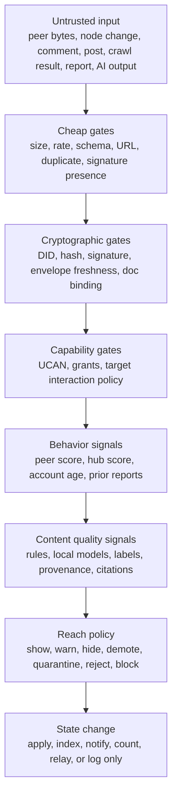
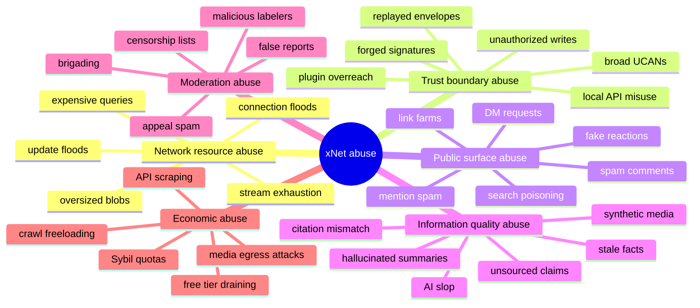
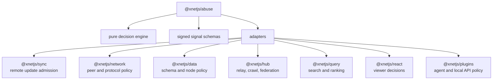
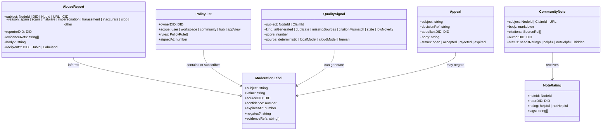
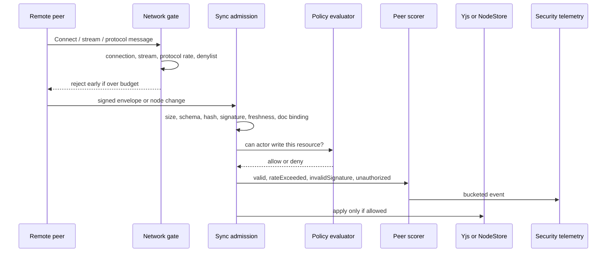
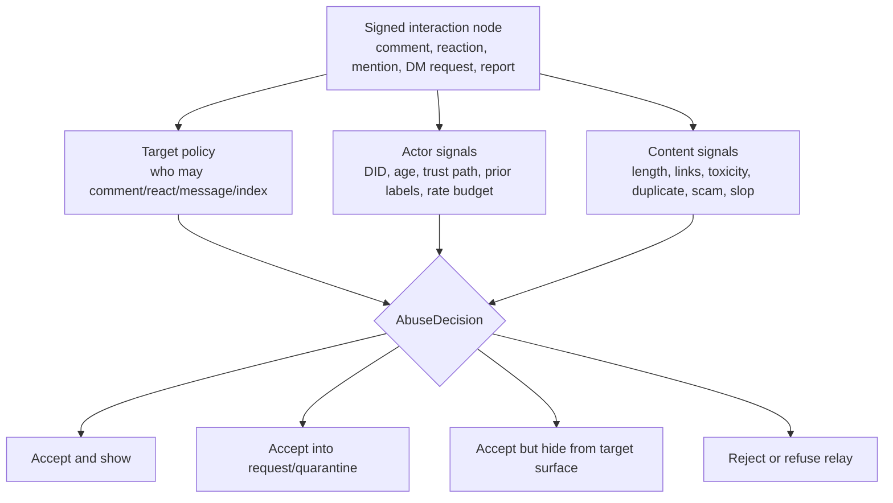
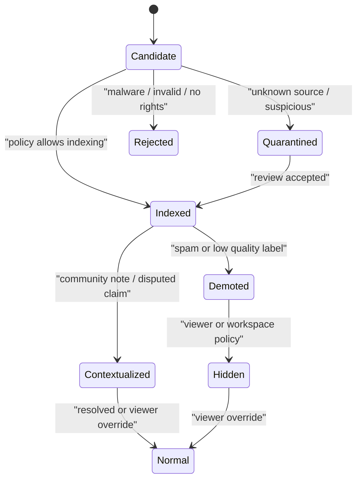
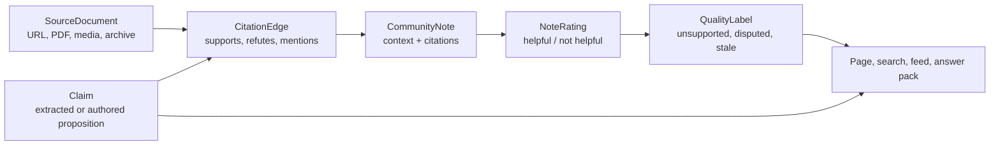
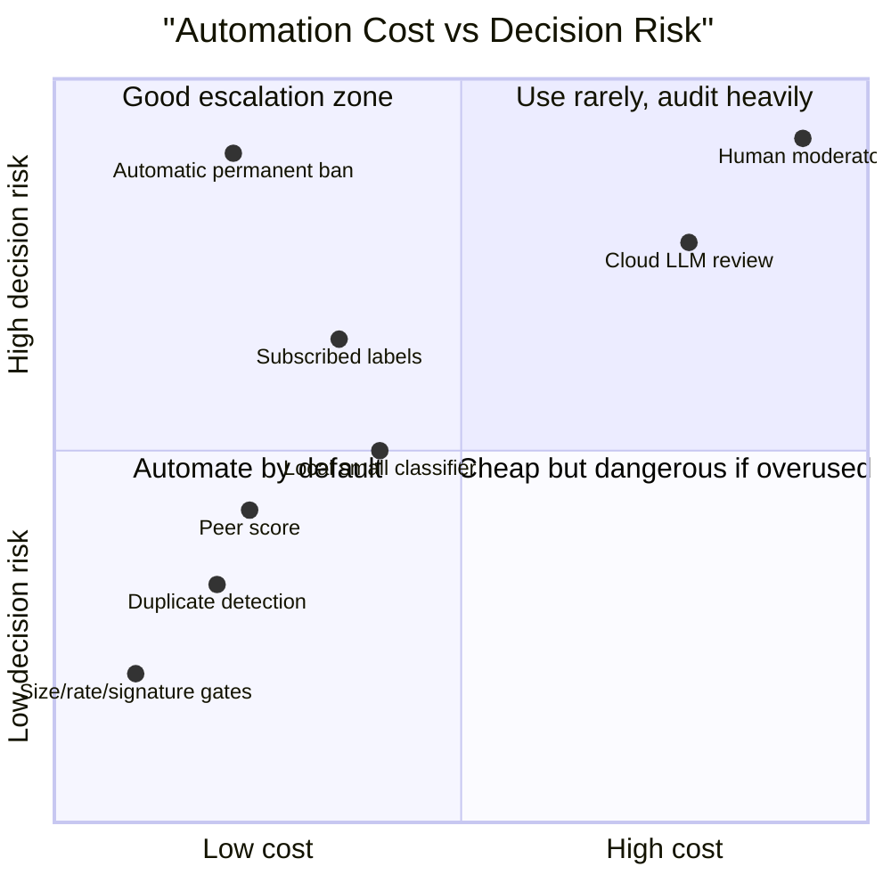
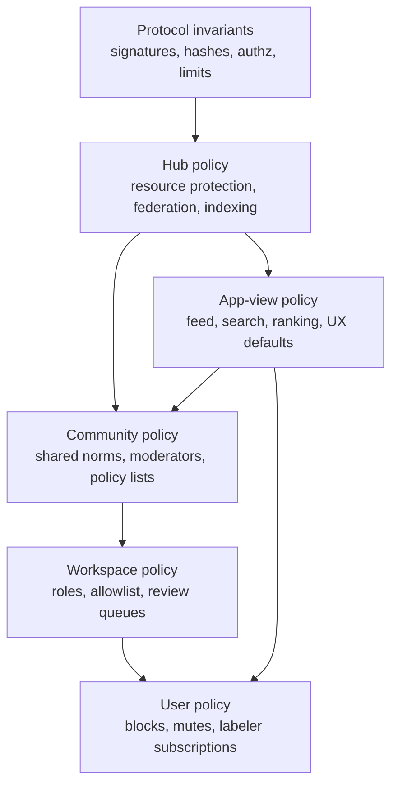

# 0140 - Spam And Abuse Mitigation Automated API Across The Network

> **Status:** Exploration  
> **Date:** 2026-06-02  
> **Tags:** spam, abuse, federation, moderation, local-first, policy, labels, reputation, AI, slop, misinformation, search, social, hubs

## 🧭 Problem Statement

xNet wants to be local-first, easy to self-host, useful in small private groups, and eventually
federated across hubs, public knowledge spaces, search, social surfaces, and agent APIs. That creates
two different abuse problems at once:

1. **Network abuse:** malicious peers, hubs, crawlers, plugins, local API callers, and sync clients can
   waste resources, forge identity, replay data, poison indexes, or flood public surfaces.
2. **Information abuse:** humans or agents can create spam, scams, harassment, AI slop, unsourced
   claims, inaccurate summaries, low-quality generated content, fake engagement, and bad-faith
   reports.

The goal is not to invent one global moderation authority. The goal is:

> Make xNet cheap to run locally, safe to federate, resistant to spam, and able to automate most abuse
> triage without hiding who made which decision or removing user choice.

## Exploration Status

- [x] Inspect existing exploration numbering and create the next filename
- [x] Review prior spam, moderation, federation, security, AI, economics, and Wikipedia-style
      explorations
- [x] Inspect repository implementations for sync security, peer scoring, access control, telemetry,
      comments, crawl, federation, and hub limits
- [x] Research external patterns from libp2p, AT Protocol, Community Notes, MediaWiki, Matrix,
      Mastodon, Nostr, YouTube, C2PA, NIST, and OWASP
- [x] Synthesize an ideal automated abuse API for xNet
- [x] Include mermaid diagrams, recommendations, implementation checklists, validation checklists,
      and example code

## 🔎 Executive Summary

xNet should implement abuse mitigation as a **composable policy API over signed facts**, not as a
single moderation service. The right core abstraction is:

> **Abuse decisions are derived views over evidence. Evidence is signed data. Policy is scoped. Reach
> is separable from existence.**

The recommendation is to add an `@xnetjs/abuse` or `@xnetjs/policy` package that exposes one pure,
auditable decision engine used by sync, network, hub, search, comments, feeds, messages, plugins, and
agent workflows.

The ideal shape:

1. **Private collaboration remains capability-first.** Unknown peers cannot write into private
   graphs. DIDs prove authorship, not trust.
2. **Every network surface runs the same admission pipeline.** Size, rate, signature, freshness,
   doc binding, authz, peer score, and policy checks happen before mutation or fanout.
3. **Moderation data is xNet data.** Reports, labels, policy lists, community notes, appeals, review
   tasks, provenance statements, and model scores are signed nodes that can sync, expire, be negated,
   and be overridden.
4. **Separate speech from reach.** Valid content may exist but be hidden, demoted, excluded from
   counters, quarantined for review, withheld from search, or shown with context.
5. **Use AI as a cascaded signal, not an authority.** Deterministic checks and local lightweight
   classifiers should handle most traffic. Cloud or large local models should be reserved for costly
   ambiguity, appeals, high-reach content, and batch review.
6. **Handle AI slop as quality and provenance, not only "spam."** Generated content, missing
   sources, duplicated summaries, unsupported claims, and citation mismatch should produce labels and
   review queues before they produce hard blocks.
7. **Make economics explicit.** Private sync should not require payment or proof-of-work. Public
   write, search, media, crawl, and feed surfaces need quotas, metering, rate budgets, operator policy,
   and optional paid or invite-based admission.
8. **Make moderation itself abuse-resistant.** Reports, labelers, and community notes can be gamed.
   xNet needs source weighting, diversity-aware agreement, audit logs, counter-labels, appeals, and
   local override.



## 🧱 Current State In The Repository

### What xNet Already Has

The repository already contains substantial anti-abuse infrastructure. The main issue is that it is
spread across packages rather than expressed as one reusable, product-level API.

| Area                          | Repo evidence                                                                                                                                                                                                          | What exists today                                                                                                        | Abuse relevance                                                        |
| ----------------------------- | ---------------------------------------------------------------------------------------------------------------------------------------------------------------------------------------------------------------------- | ------------------------------------------------------------------------------------------------------------------------ | ---------------------------------------------------------------------- |
| Yjs rate and size limits      | [`packages/sync/src/yjs-limits.ts`](../../packages/sync/src/yjs-limits.ts)                                                                                                                                             | 1 MB update cap, 50 MB doc cap, per-second and per-minute update limits                                                  | Stops simple rich-text sync floods                                     |
| Yjs peer scoring              | [`packages/sync/src/yjs-peer-scoring.ts`](../../packages/sync/src/yjs-peer-scoring.ts)                                                                                                                                 | Tracks invalid signatures, oversized updates, rate excess, unsigned updates, unattested client IDs, unauthorized updates | Converts repeated sync abuse into warn/throttle/block actions          |
| Authorized Yjs sync           | [`packages/sync/src/yjs-authorized-sync.ts`](../../packages/sync/src/yjs-authorized-sync.ts)                                                                                                                           | Verifies V2 envelopes, rate limits, authorizes before apply, scores rejections                                           | Strong model for "verify before mutation"                              |
| Yjs signed envelopes          | [`packages/sync/src/yjs-envelope.ts`](../../packages/sync/src/yjs-envelope.ts)                                                                                                                                         | Signed Yjs V1 and V2 envelopes with author, client ID, timestamp, doc ID for V2                                          | Prevents forged authorship and cross-doc replay when used consistently |
| Network peer scoring          | [`packages/network/src/security/peer-scorer.ts`](../../packages/network/src/security/peer-scorer.ts)                                                                                                                   | Reputation-like score from successes, failures, invalid signatures, invalid data, rate violations, IP colocation         | Supports adaptive throttling and disconnect decisions                  |
| Auto-blocking                 | [`packages/network/src/security/auto-blocker.ts`](../../packages/network/src/security/auto-blocker.ts)                                                                                                                 | Event windows trigger temporary blocks through the connection gater                                                      | Turns repeated abuse into operational action                           |
| Connection and stream gating  | [`packages/network/src/security/gater.ts`](../../packages/network/src/security/gater.ts), [`tracker.ts`](../../packages/network/src/security/tracker.ts), [`limits.ts`](../../packages/network/src/security/limits.ts) | Denylists, allowlists, connection counts, stream counts                                                                  | Protects self-hosted nodes from resource exhaustion                    |
| Protocol rate limiting        | [`packages/network/src/security/rate-limiter.ts`](../../packages/network/src/security/rate-limiter.ts)                                                                                                                 | Token buckets per protocol and peer                                                                                      | Applies cost pressure before expensive work                            |
| Workspace access control      | [`packages/network/src/security/access-list.ts`](../../packages/network/src/security/access-list.ts)                                                                                                                   | Global/workspace denylist, IP denylist, allowlist mode, import/export                                                    | Manual and workspace-scoped peer policy                                |
| NodeStore remote verification | [`packages/data/src/store/store.ts`](../../packages/data/src/store/store.ts)                                                                                                                                           | Verifies hash and signature, checks authorization, emits telemetry                                                       | Structured data changes fail closed on tampering                       |
| Auth presets                  | [`packages/data/src/auth/presets.ts`](../../packages/data/src/auth/presets.ts)                                                                                                                                         | Private, public read, collaborative, open, team patterns                                                                 | Good base, but public interaction policy is missing                    |
| Universal comments            | [`packages/data/src/schema/schemas/comment.ts`](../../packages/data/src/schema/schemas/comment.ts)                                                                                                                     | Comment is a schema-agnostic target edge with content, anchors, replies, edit state                                      | Good foundation for public discussion and reports                      |
| Security telemetry            | [`packages/telemetry/src/schemas/security.ts`](../../packages/telemetry/src/schemas/security.ts)                                                                                                                       | Privacy-preserving event names, severity, peer score bucket, action, status                                              | Needed for automated safety observability                              |
| Hub WS/HTTP limits            | [`packages/hub/src/middleware/rate-limit.ts`](../../packages/hub/src/middleware/rate-limit.ts), [`http-rate-limit.ts`](../../packages/hub/src/middleware/http-rate-limit.ts)                                           | Per-connection message rates, message size cap, max connections, per-IP HTTP windows                                     | Protects public hub endpoints                                          |
| Hub relay verification        | [`packages/hub/src/services/relay.ts`](../../packages/hub/src/services/relay.ts), [`node-relay.ts`](../../packages/hub/src/services/node-relay.ts)                                                                     | Yjs relay validates V1 envelopes, Node relay verifies hash/signature                                                     | Important but not yet a full unified pipeline                          |
| Crawler controls              | [`packages/hub/src/services/crawl.ts`](../../packages/hub/src/services/crawl.ts)                                                                                                                                       | Domain cooldowns, blocklist, robots check, crawler reputation, dedupe by CID                                             | Seed of search/crawl abuse control                                     |
| Federation controls           | [`packages/hub/src/services/federation.ts`](../../packages/hub/src/services/federation.ts)                                                                                                                             | Hub DIDs, peer trust levels, schema scopes, per-peer rate limits, signed responses                                       | Seed of federated search trust                                         |
| Electron sync checks          | [`apps/electron/src/data-process/data-service.ts`](../../apps/electron/src/data-process/data-service.ts)                                                                                                               | Signs outgoing updates when possible, rejects unsigned when policy requires, verifies incoming V1 envelopes              | Client-side mutation guard                                             |

### What Is Missing Or Fragmented

Observed gaps:

- No shared `AbuseDecision` or `ModerationDecision` API used by all packages.
- No first-class schemas for `Report`, `ModerationLabel`, `PolicyList`, `CommunityNote`,
  `Appeal`, `ReviewTask`, `ContentProvenance`, or `QualitySignal`.
- Public-read authorization does not distinguish `comment`, `react`, `message`, `mention`,
  `crawl`, `index`, `quote`, or `boost`.
- Hub Yjs relay currently treats V2 envelopes as acceptable on the wire while skipping hub-side
  cryptographic verification, leaving verification to recipients.
- Awareness messages are forwarded in the Electron data process without the same size/rate/security
  treatment as document updates.
- Peer scores, access lists, blocks, and policy decisions are not yet persisted as canonical xNet
  policy data with audit and expiration semantics.
- Search and federation ranking are not label-aware, provenance-aware, or resistant to low-quality
  public graph floods.
- Existing crawler reputation is success/error based, not quality, spam, duplication, source
  reputation, or adversarial-crawler based.
- There is no automated triage queue for suspicious comments, public submissions, reports, AI
  outputs, or crawl results.
- There is no review/appeal workflow for automated mistakes.
- There is no economic abuse budget tying hub quotas, public writes, crawls, API calls, reviews, and
  AI classification costs together.

### Prior Exploration Synthesis

The recent related explorations are unusually aligned:

- [`0129_[_]_HOW_WILL_XNET_HANDLE_SPAM.md`](./0129_[_]_HOW_WILL_XNET_HANDLE_SPAM.md) proposes a
  layered trust firewall and signed moderation nodes.
- [`0130_[_]_MODERATION_PUBLICLY_ACCESSIBLE_COMMENTS_LIKES_MESSAGING.md`](./0130_[_]_MODERATION_PUBLICLY_ACCESSIBLE_COMMENTS_LIKES_MESSAGING.md)
  separates interaction existence from visibility and recommends context-aware moderation decisions.
- [`0134_[_]_BAD_ACTOR_ATTACKS_AND_SECURITY_THREAT_MODEL.md`](./0134_[_]_BAD_ACTOR_ATTACKS_AND_SECURITY_THREAT_MODEL.md)
  frames federation, plugins, sync, search, and AI-assisted attacks as systemic risks.
- [`0132_[_]_ECONOMIC_MODELS_FOR_HOSTING_FEDERATED_HUBS.md`](./0132_[_]_ECONOMIC_MODELS_FOR_HOSTING_FEDERATED_HUBS.md)
  argues for metering, quotas, operator transparency, and service offers before protocol-level
  payments.
- [`0110_[_]_XNET_AS_A_VIABLE_WIKIPEDIA_ALTERNATIVE.md`](./0110_[_]_XNET_AS_A_VIABLE_WIKIPEDIA_ALTERNATIVE.md)
  shows that public knowledge needs citations, review, moderation, and stable publication lanes.
- [`0112_[_]_UNIVERSAL_CLIPPER_AND_AI_KNOWLEDGE_GRAPH_INGESTION.md`](./0112_[_]_UNIVERSAL_CLIPPER_AND_AI_KNOWLEDGE_GRAPH_INGESTION.md)
  recommends staged AI enrichment with preserved provenance.
- [`0117_[_]_ARCHITECTING_DECENTRALIZED_AI_ON_XNET.md`](./0117_[_]_ARCHITECTING_DECENTRALIZED_AI_ON_XNET.md)
  recommends canonical AI state, policy-aware routing, provenance, and staged writes.

The synthesis:

> xNet should not add "moderation" as a UI panel after public sharing exists. It should define a
> reusable abuse policy API now, then route every new public surface through it.

## 🌐 External Research

### libp2p: Abuse Starts As Resource Asymmetry

libp2p frames DoS as an attacker spending less than the victim must spend to respond. Its guidance
emphasizes protocol design, connection limits, resource management, logging, monitoring, connection
gaters, and automated blocking such as fail2ban-style workflows. xNet already mirrors many of these
ideas in `ConnectionGater`, `PeerScorer`, `AutoBlocker`, and rate limiters.

Source: [libp2p DoS Mitigation](https://libp2p.io/docs/dos-mitigation/)

### AT Protocol / Bluesky: Labels Compose Better Than One Moderator

Bluesky describes moderation as stackable: network takedowns, labels from moderation services, and
user controls like mutes and blocks. AT Protocol labels are signed metadata with a source, subject,
value, and lifecycle semantics like expiration and negation. Labelers are declared services tied to a
DID, and users/clients can choose labelers.

This maps well to xNet because xNet can store labels as signed nodes and let users, workspaces, hubs,
and app views choose how to interpret them.

Sources: [Bluesky Labels and Moderation](https://docs.bsky.app/docs/advanced-guides/moderation),
[AT Protocol Label Specification](https://atproto.com/specs/label)

### Community Notes: Accuracy Needs Cross-Perspective Agreement

Community Notes is useful because it does not treat factual context as a single moderator action. X
publishes the contribution data and ranking code, and the note ranking algorithm uses contributor
ratings to decide when a note becomes visible. The strongest lesson is not to copy the exact scoring
model. It is to separate **notes**, **ratings**, **status**, and **display**, and to require agreement
from groups that do not usually agree before high-reach context becomes canonical in the UI.

Sources: [Community Notes introduction](https://communitynotes.x.com/guide/en/about/introduction),
[Community Notes ranking algorithm](https://communitynotes.x.com/guide/en/under-the-hood/ranking-notes),
[Community Notes open-source code](https://communitynotes.x.com/guide/en/under-the-hood/note-ranking-code)

### MediaWiki / Wikipedia: Deterministic Filters Plus Human Review

MediaWiki's AbuseFilter supports actions such as logging, tagging, throttling, warning, and
disallowing edits. Wikimedia's machine-learning stack has also used revision-quality models such as
damaging and good-faith scores through ORES/Lift Wing. Wikipedia's public knowledge model is not
"truth by model." It is verifiability, reliable sources, neutral presentation, revision history,
pending review, and policy enforcement.

Sources: [MediaWiki AbuseFilter actions](https://www.mediawiki.org/wiki/Extension:AbuseFilter/Actions),
[MediaWiki combating vandalism](https://www.mediawiki.org/wiki/Manual:Combating_vandalism/en),
[Wikimedia Lift Wing usage](https://wikitech.wikimedia.org/wiki/Machine_Learning/LiftWing/Usage),
[Wikipedia verifiability summary](https://wikimediafoundation.org/news/2025/10/10/wikimedia-foundation-responds-to-questions-about-how-wikipedia-works/)

### ActivityPub / Mastodon: Federation Needs Instance Policy

ActivityPub has actor inbox/outbox delivery and a `Block` activity. Mastodon adds the operational
reality: moderation is local to a server, and domain-level controls can limit, suspend, or reject
media from whole remote servers when individual moderation is too costly.

For xNet, the equivalent is not just user blocks. It is user, workspace, hub, community, labeler, and
app-view policy with different authority at each scope.

Sources: [W3C ActivityPub](https://www.w3.org/TR/activitypub/),
[Mastodon moderation actions](https://docs.joinmastodon.org/admin/moderation/)

### Matrix: Shared Policy Lists Can Be Ordinary Replicated Data

Matrix community moderation commonly uses policy lists watched by bots such as Mjolnir. Matrix
documentation notes that a ban list can be a regular Matrix room containing hidden moderation events.
xNet can do the same more naturally: policy lists are signed xNet nodes that communities subscribe to.

Source: [Matrix community moderation](https://matrix.org/docs/communities/moderation/)

### Nostr: Reports Are Portable And Subjective

NIP-56 models report events with categories such as spam, illegal, impersonation, nudity, and
profanity. Reports are events that relays and clients may interpret according to local policy.

Source: [NIP-56 Reporting](https://nips.nostr.com/56)

### YouTube: Automation Requires Appeals And Human Escalation

YouTube describes a combined system of automated machine-learning review and human reviewers, with
appeals when automated systems or reviewers make mistakes. This is a warning for xNet: automated
moderation can scale, but it needs explanation, review, and reversal paths.

Sources: [How YouTube reviews content](https://support.google.com/youtube/answer/13304829),
[YouTube enforcement transparency FAQ](https://support.google.com/transparencyreport/answer/9209072)

### C2PA: Provenance Is A Signal, Not Truth

C2PA develops technical standards for certifying source and history of media content. This is directly
useful for AI slop and synthetic media labels, but provenance does not prove that a claim is accurate.
xNet should treat C2PA-like credentials as input to a provenance score, not as final trust.

Source: [C2PA specifications](https://spec.c2pa.org/specifications/)

### AI Risk: Classifiers Need Governance And Security Boundaries

NIST's AI Risk Management Framework emphasizes trustworthiness characteristics such as reliability,
safety, security, accountability, transparency, explainability, privacy, and fairness. OWASP's LLM
Top 10 calls out prompt injection and other LLM application risks. For xNet, this means AI abuse
workers must run in constrained pipelines: staged writes, limited tools, clear provenance, and no
silent canonical mutations from untrusted retrieved content.

Sources: [NIST AI RMF](https://www.nist.gov/itl/ai-risk-management-framework),
[OWASP Top 10 for LLM Applications](https://owasp.org/www-project-top-10-for-large-language-model-applications),
[OpenAI Moderation guide](https://platform.openai.com/docs/guides/moderation)

## 🧨 Abuse Taxonomy For xNet



The key design implication is that one score is not enough. xNet needs separate dimensions:

| Dimension  | Question                          | Example signal                                            | Typical action               |
| ---------- | --------------------------------- | --------------------------------------------------------- | ---------------------------- |
| Admission  | Can these bytes enter the system? | invalid signature, no capability, oversized update        | reject                       |
| Resource   | How much work should we spend?    | peer rate excess, query cost, blob size                   | throttle or require budget   |
| Authorship | Who signed it?                    | DID, key age, domain proof, C2PA signer                   | attribute or verify          |
| Behavior   | How has this actor behaved?       | valid updates, report ratio, block history                | score, watch, throttle       |
| Content    | What does the content look like?  | duplicate text, toxic text, scam links, AI pattern        | label, quarantine, hide      |
| Quality    | Is it useful and supported?       | citation coverage, source reputation, claim contradiction | demote, note, request review |
| Reach      | Where should it appear?           | labels, viewer policy, target policy, hub policy          | show, warn, hide, demote     |
| Review     | What needs human attention?       | ambiguous high-reach content, appealed decision           | queue                        |

## 🧩 Ideal Automated API

### Core Package Shape

Add a package such as `@xnetjs/abuse` with three responsibilities:

1. **Decision engine:** pure functions that derive decisions from facts and policy.
2. **Signal schemas:** signed node schemas for reports, labels, notes, appeals, policy lists, and
   quality/provenance evidence.
3. **Adapters:** package-specific helpers for sync, network, hub, search, React hooks, and agent
   workers.



### Main Decision APIs

| API                              | Used by                                 | Purpose                                                                      |
| -------------------------------- | --------------------------------------- | ---------------------------------------------------------------------------- |
| `decideRemoteMutation(input)`    | sync, data, hub relay                   | Decide whether remote bytes can mutate local state                           |
| `decideTransport(input)`         | network, hub                            | Decide connection, stream, protocol, and query budgets                       |
| `decidePublicInteraction(input)` | comments, reactions, messages, mentions | Decide whether an interaction can be accepted, delivered, notified, or shown |
| `decideReach(input)`             | search, feeds, timelines, public pages  | Decide show/warn/hide/demote/quarantine and counter inclusion                |
| `decideReviewRoute(input)`       | moderation queue, AI workers            | Decide whether deterministic accept is enough or human/AI review is needed   |
| `scoreContentQuality(input)`     | clipper, search, wiki, social           | Score AI slop, citation support, duplication, source coverage, and freshness |
| `explainDecision(decision)`      | UI, devtools, audit logs                | Produce user-safe reasons and operator-safe evidence                         |

### Decision Output

The output should not be a boolean. It should be a structured plan.

```typescript
export type AbuseAdmission = 'accept' | 'reject' | 'quarantine'
export type AbuseVisibility = 'show' | 'warn' | 'blur' | 'hide'
export type AbuseReach = 'normal' | 'demote' | 'exclude'
export type AbuseResource = 'normal' | 'throttle' | 'block-peer' | 'require-budget'

export type AbuseDecision = {
  admission: AbuseAdmission
  visibility: AbuseVisibility
  reach: AbuseReach
  resource: AbuseResource
  notify: boolean
  includeInCounters: boolean
  includeInSearch: boolean
  review:
    | { required: false }
    | { required: true; queue: 'safety' | 'quality' | 'appeal' | 'operator'; priority: number }
  reasons: readonly string[]
  evidenceRefs: readonly string[]
  labelsToEmit: readonly PendingLabel[]
  telemetry: readonly PendingSecurityEvent[]
}
```

### Signal Schemas



## 🚦 Runtime Pipelines

### 1. Remote Mutation Admission

Remote mutation should be the strictest path. If it fails, do not apply bytes and do not forward them
as trusted state.



Concrete improvement:

- Make the `AuthorizedYjsSyncProvider` path the normative pipeline.
- Upgrade hub relay to V2 verification and doc binding instead of accepting V2 envelopes without
  hub-side verification.
- Apply rate/size handling to awareness and state-vector traffic too.
- Persist repeated peer decisions as policy nodes when they cross an operator-defined threshold.

### 2. Public Interaction Admission

Public comments, reactions, mentions, messages, and reports should be accepted only through a target
interaction policy.



Public-read should not imply public-comment, public-message, public-index, or public-amplify.

### 3. Search, Feed, And Discovery Reach

Search and feeds should consume the same labels but make reach decisions, not mutation decisions.



This preserves the local-first principle: users can keep data locally while choosing what to show,
rank, share, or index.

## 🤖 AI Slop And Inaccurate Information

Spam is not only malicious. A federated knowledge network can drown in low-effort generated content
even when every author is "valid."

### Recommended Slop Signals

| Signal                                     | Cheap detector                                               | Expensive detector                      | Action                             |
| ------------------------------------------ | ------------------------------------------------------------ | --------------------------------------- | ---------------------------------- |
| Duplicate or near-duplicate generated text | simhash/minhash, embedding dedupe                            | cluster-level reranking                 | demote, merge, flag                |
| Missing citations                          | schema check, citation count, source links                   | claim extraction with citation coverage | quality warning                    |
| Citation mismatch                          | URL/title/source metadata check                              | claim-source entailment model           | quarantine high-reach claims       |
| Hallucinated references                    | DOI/URL resolver, source existence                           | external source verification worker     | warn or reject in public wiki lane |
| Generated media                            | C2PA metadata, self-labels, watermark checks where available | image/video classifier                  | label, blur, provenance panel      |
| Thin content                               | length, novelty, source density, template reuse              | local small model quality score         | search demotion                    |
| Stale claims                               | timestamp and source freshness                               | retrieval against newer source packs    | context note                       |
| Scam or SEO spam                           | domain reputation, link ratio, redirects                     | classifier plus review                  | reject/demote                      |

### Claim And Note Model

For accuracy, xNet should model claims and context separately from pages or posts.



This is the missing bridge between Wikipedia-style verifiability and Community Notes-style context.
It also helps AI systems: a retrieval answer can cite claims and sources instead of opaque chunks.

### AI Economics

AI moderation should be cascaded by cost:

| Tier                        | Tooling                                                             | Cost          | Use                                               |
| --------------------------- | ------------------------------------------------------------------- | ------------- | ------------------------------------------------- |
| T0 deterministic            | size caps, regexes, URL parsing, duplicate hashes, signature checks | tiny          | every event                                       |
| T1 local statistics         | peer score, rate windows, graph features, source reputation         | tiny          | every event                                       |
| T2 local lightweight models | toxicity/slop classifier, embedding dedupe, language detection      | low           | public comments, crawl results, feeds             |
| T3 cached label services    | subscribed signed labels, policy lists, blocklists                  | low to medium | feeds, search, public pages                       |
| T4 cloud or large local AI  | multimodal review, claim-source entailment, appeal summaries        | high          | high-reach, ambiguous, appealed, or paid contexts |
| T5 human review             | moderators, trusted reviewers, community note ratings               | highest       | policy decisions, appeals, edge cases             |



The important economic rule:

> Let cheap automation decide reversible actions. Require expensive review for irreversible or
> high-reach actions.

## 🏗️ Proposed Architecture

### Policy Scopes



Protocol invariants are non-negotiable. Visibility and reach decisions are scoped and plural.

### Recommended Package Boundaries

| Package            | Responsibility                                                                   |
| ------------------ | -------------------------------------------------------------------------------- |
| `@xnetjs/abuse`    | Decision types, pure policy engine, signal schemas, test fixtures                |
| `@xnetjs/sync`     | Use abuse admission for Yjs and structured remote update pipelines               |
| `@xnetjs/network`  | Feed peer scoring, connection events, and auto-blocks into abuse signals         |
| `@xnetjs/data`     | Register report/label/note/policy schemas and target interaction policies        |
| `@xnetjs/hub`      | Apply abuse decisions to relay, crawl, federation, query, file, and API surfaces |
| `@xnetjs/query`    | Filter/demote/rank by labels, provenance, and quality signals                    |
| `@xnetjs/react`    | Hooks for visible comments, moderation queues, labels, reports, overrides        |
| `@xnetjs/devtools` | Explain decisions, inspect peer scores, labels, and policy sources               |

### Functional Decision Engine

The decision engine should be deterministic and mostly functional. Adapters gather facts; pure
functions decide.

```typescript
type Surface =
  | 'remoteMutation'
  | 'commentThread'
  | 'messageInbox'
  | 'searchIndex'
  | 'feed'
  | 'crawl'
  | 'localApi'

type AbuseFacts = {
  surface: Surface
  signatureValid: boolean
  hashValid: boolean
  authorized: boolean
  overSizeLimit: boolean
  overRateLimit: boolean
  peerScore: number
  localBlocked: boolean
  workspaceBlocked: boolean
  firstContact: boolean
  labels: readonly {
    value: string
    confidence: number
    sourceWeight: number
    expiresAt?: number
  }[]
  quality: {
    duplicateScore: number
    slopScore: number
    citationCoverage: number
    provenanceScore: number
  }
  now: number
}

type Decision = {
  admission: 'accept' | 'reject' | 'quarantine'
  visibility: 'show' | 'warn' | 'blur' | 'hide'
  reach: 'normal' | 'demote' | 'exclude'
  resource: 'normal' | 'throttle' | 'block-peer'
  reviewRequired: boolean
  reasons: string[]
}

const activeLabels = (facts: AbuseFacts) =>
  facts.labels.filter((label) => label.expiresAt === undefined || label.expiresAt > facts.now)

const weightedLabelScore = (facts: AbuseFacts, values: readonly string[]) =>
  activeLabels(facts)
    .filter((label) => values.includes(label.value))
    .reduce((score, label) => score + label.confidence * label.sourceWeight, 0)

export function decideAbuse(facts: AbuseFacts): Decision {
  const reasons: string[] = []

  if (facts.overSizeLimit) {
    return {
      admission: 'reject',
      visibility: 'hide',
      reach: 'exclude',
      resource: 'normal',
      reviewRequired: false,
      reasons: ['over-size-limit']
    }
  }

  if (!facts.hashValid || !facts.signatureValid || !facts.authorized) {
    return {
      admission: 'reject',
      visibility: 'hide',
      reach: 'exclude',
      resource: facts.peerScore < 10 ? 'block-peer' : 'normal',
      reviewRequired: false,
      reasons: ['failed-admission']
    }
  }

  if (facts.localBlocked || facts.workspaceBlocked) {
    return {
      admission: 'accept',
      visibility: 'hide',
      reach: 'exclude',
      resource: 'normal',
      reviewRequired: false,
      reasons: ['blocked-by-policy']
    }
  }

  if (facts.overRateLimit || facts.peerScore < 30) {
    reasons.push('behavioral-risk')
  }

  const abuseScore = weightedLabelScore(facts, ['malware', 'scam', 'spam', 'impersonation'])
  const qualityRisk =
    facts.quality.slopScore * 0.4 +
    facts.quality.duplicateScore * 0.25 +
    (1 - facts.quality.citationCoverage) * 0.2 +
    (1 - facts.quality.provenanceScore) * 0.15

  if (abuseScore >= 1.5) {
    return {
      admission: facts.surface === 'remoteMutation' ? 'reject' : 'accept',
      visibility: 'hide',
      reach: 'exclude',
      resource: facts.peerScore < 20 ? 'throttle' : 'normal',
      reviewRequired: true,
      reasons: [...reasons, 'trusted-abuse-label']
    }
  }

  if (facts.firstContact || abuseScore > 0.5 || qualityRisk >= 0.65) {
    return {
      admission: 'quarantine',
      visibility: 'warn',
      reach: 'demote',
      resource: facts.overRateLimit ? 'throttle' : 'normal',
      reviewRequired: true,
      reasons: [...reasons, facts.firstContact ? 'first-contact' : 'quality-risk']
    }
  }

  if (qualityRisk >= 0.35) {
    return {
      admission: 'accept',
      visibility: 'warn',
      reach: 'demote',
      resource: 'normal',
      reviewRequired: false,
      reasons: [...reasons, 'low-confidence-quality-signal']
    }
  }

  return {
    admission: 'accept',
    visibility: 'show',
    reach: 'normal',
    resource: 'normal',
    reviewRequired: false,
    reasons
  }
}
```

## ⚖️ Options And Tradeoffs

### Option A: Capability-Only Abuse Control

Unknown peers cannot write without grants or UCANs.

**Pros**

- Excellent for private local-first collaboration.
- Cheap and deterministic.
- Already aligned with xNet's architecture.

**Cons**

- Does not solve public comments, search, social feeds, marketplaces, crawlers, or public knowledge.
- Does not classify low-quality authorized content.
- Does not help users share moderation work.

### Option B: Centralized Hub Moderation

Each hub runs a traditional policy engine and removes or blocks content.

**Pros**

- Operationally straightforward.
- Useful for hosted communities.
- Easy to explain to operators.

**Cons**

- Risks recreating a platform authority.
- Users need portability and override.
- Does not compose well across federation.

### Option C: Signed Label And Policy Ecosystem

Reports, labels, notes, and policy lists are signed xNet nodes.

**Pros**

- Composable and local-first.
- Allows community moderation without global truth.
- Fits search, feeds, comments, and AI safety.

**Cons**

- Needs trust UI.
- Labelers can be malicious or low quality.
- Requires conflict, expiration, negation, and appeal semantics.

### Option D: Economic Gates For Public Reach

Apply quotas, paid plans, invite budgets, proof-of-work, or review costs only to public/high-cost
surfaces.

**Pros**

- Makes spam economically harder.
- Protects volunteer and low-cost hubs.
- Aligns with hub hosting economics.

**Cons**

- Can exclude legitimate users.
- Hard to tune globally.
- Must never be required for private local-first use.

### Recommended Blend

Use all four, but at different layers:

- **A** is mandatory for private collaboration and remote mutation.
- **B** is a hub/operator policy, not a protocol truth.
- **C** is the main xNet-native moderation substrate.
- **D** is for public reach and expensive services only.

## ✅ Recommendation

### P0: Make Remote Admission A Protocol Invariant

Define a shared remote admission pipeline and require it for all sync and relay paths:

- reject over-limit payloads before deserialization;
- verify hash/signature/DID/freshness/doc binding before mutation;
- require V2 Yjs envelopes for new public or non-local collaboration paths;
- authorize before `Y.applyUpdate` and before `NodeStore.applyRemoteChange`;
- rate-limit awareness and state-vector traffic;
- feed every violation into peer scoring, auto-blocking, and telemetry.

### P1: Add `@xnetjs/abuse` With Pure Decisions

Start with types and pure functions. Do not wait for UI.

- `AbuseFacts`
- `AbuseDecision`
- `PolicyScope`
- `InteractionPolicy`
- `ReachDecision`
- `QualitySignal`
- `explainDecision()`
- test fixtures for common abuse cases

### P2: Add Signed Moderation And Quality Schemas

Add schemas for:

- `AbuseReport`
- `ModerationLabel`
- `PolicyList`
- `PolicySubscription`
- `CommunityNote`
- `NoteRating`
- `QualitySignal`
- `ContentProvenance`
- `Appeal`
- `ReviewTask`

### P3: Wire Public Surface Policy

Before broad public launch, comments/reactions/messages/search/crawl should ask the abuse API:

- Can this actor submit?
- Should this be visible to this viewer?
- Should it count?
- Should it notify the target?
- Should it be indexed?
- Should it be demoted?
- Should it enter a queue?

### P4: Add Cascaded AI Review

Implement local-first, cost-aware AI review:

- deterministic filters first;
- local lightweight classifiers for high-volume comments and crawl results;
- cloud or large local models only for ambiguity, high-reach content, appeals, and batch review;
- every AI decision emits provenance and is reversible unless paired with policy or human review.

### P5: Make Operator Economics Visible

Every hub should publish:

- service limits;
- moderation policy;
- labeler subscriptions;
- public write quotas;
- crawl and federation budgets;
- appeal/contact policy;
- whether AI review is local, cloud, disabled, or paid;
- usage events for blocked, billable, sponsored, or reciprocal work.

## 🛠️ Implementation Checklist

### Phase 1 - Remote Admission Hardening

- [x] Define a `RemoteAdmissionPipeline` interface shared by sync/network/hub paths.
- [x] Require V2 Yjs envelope verification for hub relay where signed replication is required.
- [x] Reject unknown V2 envelopes at hubs unless a verifier is configured.
- [x] Apply size and rate limits to awareness messages and state-vector messages.
- [x] Connect `YjsPeerScorer` actions to network `AutoBlocker` where possible.
- [x] Persist local and workspace blocks as signed policy data, not only in-memory helpers.
- [x] Add telemetry events for remote mutation rejection reasons with peer hashes and score buckets.

### Phase 2 - Core Abuse Package

- [x] Create `@xnetjs/abuse`.
- [x] Add `AbuseFacts`, `AbuseDecision`, `PolicyScope`, `InteractionPolicy`, and `ReachPolicy` types.
- [x] Add pure `decideRemoteMutation`, `decidePublicInteraction`, and `decideReach` functions.
- [x] Add deterministic explainability with stable reason codes.
- [x] Add fixtures for common abuse, false-positive, and override scenarios.
- [x] Re-export adapters from package-specific entrypoints instead of creating circular deps.

### Phase 3 - Signed Moderation Data

- [x] Add `AbuseReportSchema`.
- [x] Add `ModerationLabelSchema` with expiration, negation, source DID, confidence, evidence refs.
- [x] Add `PolicyListSchema` and `PolicySubscriptionSchema`.
- [x] Add `CommunityNoteSchema` and `NoteRatingSchema`.
- [x] Add `QualitySignalSchema`.
- [x] Add `ContentProvenanceSchema` for source, AI generation, C2PA-like credentials, and tool chain.
- [x] Add `AppealSchema` and `ReviewTaskSchema`.
- [x] Add schema permissions for who may label, review, appeal, or publish policy lists.

### Phase 4 - Public Surface Integration

- [x] Extend target nodes or adjacent policy nodes with public interaction policy.
- [x] Implement `useVisibleComments` and `useModeratedThread`.
- [x] Add policy-filtered reaction and counter APIs.
- [x] Add message request and first-contact quarantine semantics.
- [x] Make search indexing consume labels and quality signals.
- [x] Make crawl ingestion consume domain policy, duplicate signals, source reputation, and slop scores.
- [x] Add devtools panes for policy decisions, peer score, labels, and queue state.

### Phase 5 - AI And Quality Automation

- [ ] Add deterministic duplicate and near-duplicate detection for public/crawled content.
- [ ] Add local classifier adapter interface.
- [ ] Add optional cloud moderation/classification adapter with explicit budget and privacy policy.
- [ ] Add claim extraction and citation coverage scoring for published knowledge pages.
- [ ] Add community-note-style rating and diversity agreement experiments.
- [ ] Add staged write flow for AI-generated moderation or quality labels.
- [ ] Add model/provider provenance to every AI-generated signal.

### Phase 6 - Economic And Operator Controls

- [ ] Add public write budgets by DID, hub, workspace, and surface.
- [ ] Add crawl and federation query cost budgets.
- [ ] Add usage events for blocked, throttled, reviewed, billable, sponsored, and reciprocal work.
- [ ] Add signed hub policy/service offer documents with moderation settings.
- [ ] Add labeler trust settings and subscription limits per workspace/hub.
- [ ] Add appeal/contact metadata for public operators.

## 🧪 Validation Checklist

### Security And Protocol Validation

- [ ] Invalid signatures never mutate Yjs or NodeStore state.
- [ ] Oversized Yjs updates, awareness messages, blobs, and query requests are rejected before
      expensive parsing.
- [ ] Unauthorized remote writes are rejected before mutation and produce telemetry.
- [ ] Hub relay never fans out a sync update before required validation.
- [ ] V2 envelopes are rejected when doc ID, timestamp, author, or signature verification fails.
- [ ] Peer scores recover only after quiet periods and do not grow unbounded.
- [ ] Blocks expire when configured and remain auditable.

### Moderation And Reach Validation

- [ ] Public-read nodes do not automatically permit comments, reactions, messages, crawling, or
      indexing.
- [ ] User, workspace, hub, and app-view policy produce explainable decisions.
- [ ] Labels can expire, be negated, be overridden locally, and be traced to a source DID.
- [ ] Reports cannot directly hide content unless a policy says the reporter/labeler is trusted.
- [ ] Hidden content is excluded from counters and ranking when policy requires it.
- [ ] Appeals can reverse or annotate automated decisions.

### AI And Quality Validation

- [ ] AI-generated moderation labels include model/provider provenance.
- [ ] Local deterministic gates still work when AI providers are unavailable.
- [ ] Cloud AI review is not called for every low-risk event.
- [ ] Prompt-injection text in crawled pages cannot issue graph writes.
- [ ] Claim/citation mismatch scoring is treated as review evidence, not absolute truth.
- [ ] False positives can be overridden by user, workspace, or reviewer policy.

### Operational And Economic Validation

- [ ] A small self-hosted hub can run with AI review disabled and still resist common floods.
- [ ] A community hub can subscribe to shared policy lists without surrendering local override.
- [ ] A public search hub can publish its crawl/index/review budgets.
- [ ] Usage events distinguish free, paid, sponsored, reciprocal, and abuse-blocked work.
- [ ] Abuse queues remain bounded under report spam and crawler spam.
- [ ] Metrics allow operators to see whether automation is saving cost or creating appeal load.

## 🚀 Next Actions

1. **Create `@xnetjs/abuse` as a types-first package.** Start with pure decisions and fixtures, not
   UI.
2. **Harden hub relay around V2 envelopes and awareness limits.** This closes the most concrete
   network admission gap found in current code.
3. **Add moderation signal schemas.** Reports, labels, policy lists, notes, appeals, and quality
   signals should become first-class xNet data.
4. **Add public interaction policy before public comments/reactions.** Keep `Comment` as the edge
   primitive, but do not expose public comment surfaces without target policy and reach decisions.
5. **Prototype label-aware search.** Search is where spam and slop become visible fastest.
6. **Prototype a local-only classifier cascade.** Use deterministic and small-model signals first;
   keep cloud AI optional and budgeted.
7. **Build a devtools abuse panel.** Engineers and operators need to see why decisions happened
   before this can be trusted.

## References

- [libp2p DoS Mitigation](https://libp2p.io/docs/dos-mitigation/)
- [Bluesky Labels and Moderation](https://docs.bsky.app/docs/advanced-guides/moderation)
- [AT Protocol Label Specification](https://atproto.com/specs/label)
- [Community Notes introduction](https://communitynotes.x.com/guide/en/about/introduction)
- [Community Notes ranking algorithm](https://communitynotes.x.com/guide/en/under-the-hood/ranking-notes)
- [Community Notes open-source code](https://communitynotes.x.com/guide/en/under-the-hood/note-ranking-code)
- [MediaWiki AbuseFilter actions](https://www.mediawiki.org/wiki/Extension:AbuseFilter/Actions)
- [MediaWiki combating vandalism](https://www.mediawiki.org/wiki/Manual:Combating_vandalism/en)
- [Wikimedia Lift Wing usage](https://wikitech.wikimedia.org/wiki/Machine_Learning/LiftWing/Usage)
- [Wikimedia Foundation explanation of Wikipedia policies](https://wikimediafoundation.org/news/2025/10/10/wikimedia-foundation-responds-to-questions-about-how-wikipedia-works/)
- [W3C ActivityPub](https://www.w3.org/TR/activitypub/)
- [Mastodon moderation actions](https://docs.joinmastodon.org/admin/moderation/)
- [Matrix community moderation](https://matrix.org/docs/communities/moderation/)
- [NIP-56 Reporting](https://nips.nostr.com/56)
- [How YouTube reviews content](https://support.google.com/youtube/answer/13304829)
- [YouTube enforcement transparency FAQ](https://support.google.com/transparencyreport/answer/9209072)
- [C2PA specifications](https://spec.c2pa.org/specifications/)
- [NIST AI Risk Management Framework](https://www.nist.gov/itl/ai-risk-management-framework)
- [OWASP Top 10 for LLM Applications](https://owasp.org/www-project-top-10-for-large-language-model-applications)
- [OpenAI Moderation guide](https://platform.openai.com/docs/guides/moderation)
- [UCAN Delegation Specification](https://ucan.xyz/delegation/)
