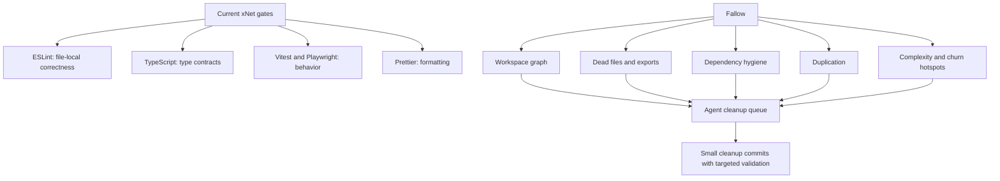
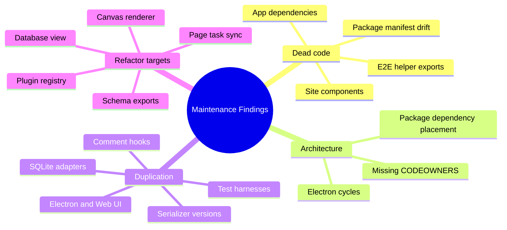
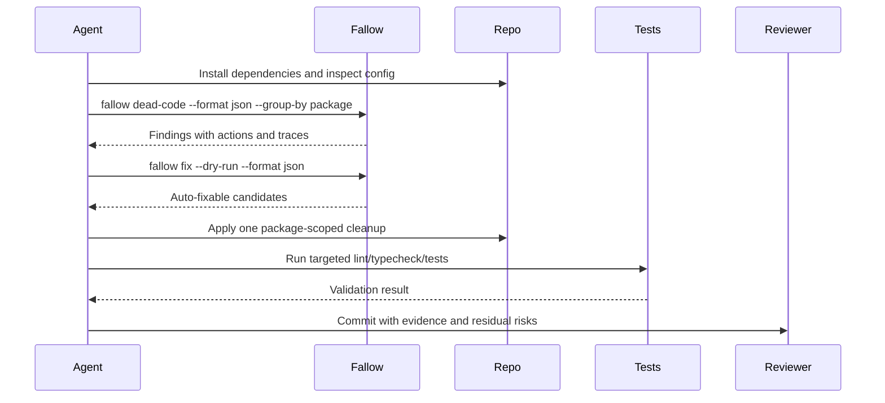
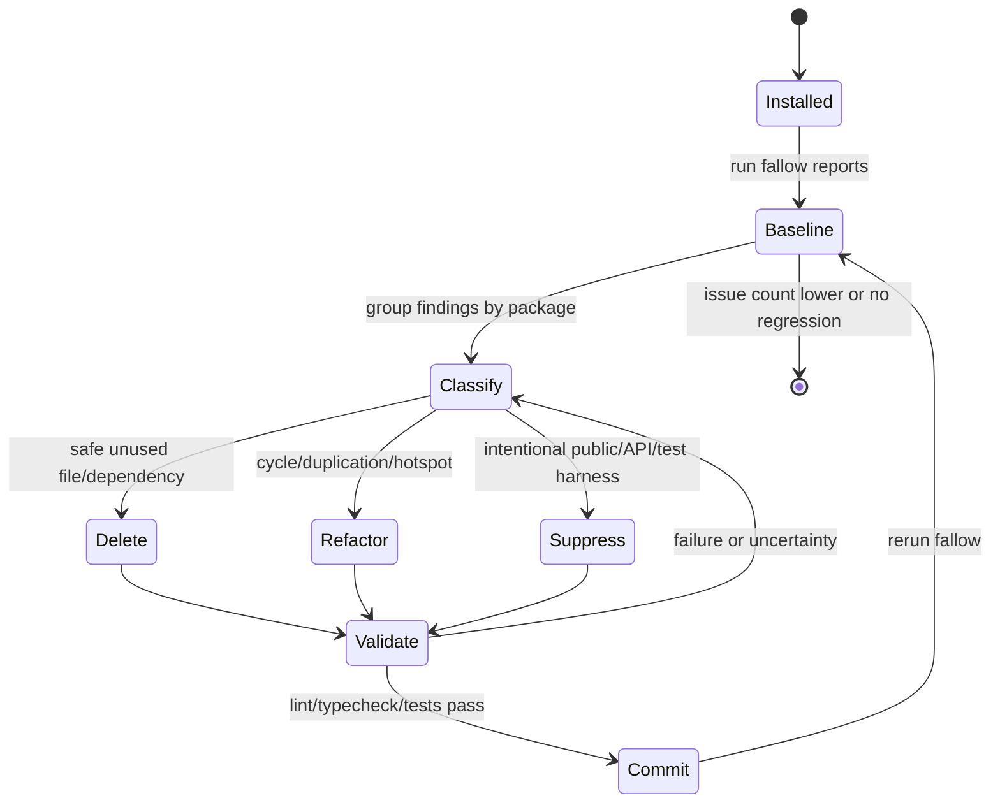
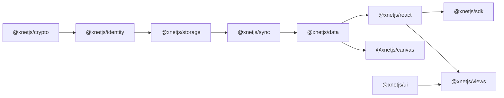
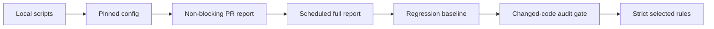

# 0141 - Using Fallow For Codebase Maintenance

> **Status:** Exploration  
> **Tags:** code-maintenance, static-analysis, dead-code, duplication, agents, CI, git-hooks, monorepo  
> **Created:** 2026-06-03  
> **Context:** Evaluate what it would look like for xNet agents to use Fallow to inspect, clean, and keep the repository healthy, and whether adjacent tools or CI/hook changes are worth adding.

## 🧭 Problem Statement

xNet is now large enough that ordinary file-local linting is not enough to answer maintenance questions such as:

- Which exported symbols are truly unused across the workspace?
- Which dependencies are declared in the wrong package, unused, or only used by tests?
- Which copy-pasted implementations are spreading across Electron, Web, and package layers?
- Which files are risky because they combine churn, size, fan-out, and weak test coverage?
- Which cleanup work is safe for an AI agent to do autonomously, and which work needs human/API review?

Fallow is interesting because it is positioned as a deterministic codebase intelligence layer for TypeScript and JavaScript, not as another style linter. This exploration asks what adopting it would look like in xNet, how an agent should use it, what other tools overlap or complement it, and whether it belongs in CI or git hooks.

## Executive Summary

**Recommendation:** add Fallow gradually, starting as a pinned dev dependency plus explicit maintenance scripts and a non-blocking CI/report workflow. Do not immediately add full-repo Fallow checks to pre-commit or pre-push hooks.

The read-only local Fallow runs found useful signals:

- `198` dead-code/dependency/cycle issues in the current run, but with important caveats because `node_modules` is absent in this worktree.
- `2` Electron circular dependencies.
- `12` site files reported as unused.
- `2` unused E2E helper exports.
- `8.2%` duplication across `31,291` duplicated lines.
- Health score `72 B`, with maintainability still good at `91.6`.
- Refactoring targets around schema index exports, plugin registry registration, page task sync, auth validation, schema diffing, DatabaseView, CanvasView, and large Canvas renderer files.

Fallow should be useful for xNet, but the first adoption step should be a calibration pass:

1. Run it after `pnpm install --frozen-lockfile` so dependency resolution is accurate.
2. Add `.fallow/` to root `.gitignore`.
3. Create `.fallowrc.json` with explicit entries/ignores for packages, apps, Storybook, docs site, Expo, test harnesses, and generated files.
4. Baseline current findings instead of failing CI on day one.
5. Let agents work package-by-package with small commits and targeted tests.
6. Promote `fallow audit` to a PR gate only after false positives and intentional public API exports are classified.



## Current State In The Repository

### Observed local tooling

xNet already has meaningful local quality gates:

- Root `package.json` has `lint`, `format:check`, `typecheck`, `test`, `test:coverage`, and integration test scripts.
- ESLint uses `@typescript-eslint`, `react-hooks`, and `eslint-plugin-import`.
- The root ESLint rule `@typescript-eslint/no-unused-vars` is enabled with `argsIgnorePattern: '^_'`.
- Husky hooks are installed.
- Pre-commit skips docs/markdown-only commits, otherwise runs `lint-staged`, `turbo run typecheck --affected`, and `vitest run --changed HEAD --passWithNoTests`.
- Pre-push skips docs-only changes, checks `pnpm install --frozen-lockfile --ignore-scripts`, then runs Prettier, typecheck, and tests.
- Commit messages are checked by commitlint.
- CI uses a shared setup action that runs `pnpm install --frozen-lockfile`.
- CI already ignores docs and markdown-only changes in `.github/workflows/ci.yml`.

This means Fallow should not be justified as a replacement for the current gates. It would fill a different gap: whole-repository graph, dependency, duplication, cycle, and hotspot evidence.

### Repository shape that matters for Fallow

Observed structure:

- `31` package manifests under `packages/`, `apps/`, and `tests/`.
- `26` package/app `src/index.ts` barrel entry points.
- Mixed package styles:
  - publish-managed packages with `dist` `main`, `types`, and `exports`.
  - private packages/apps with `src/index.ts` entry points.
  - app-specific dynamic imports such as `@xnetjs/sqlite/web-proxy` and `@xnetjs/sqlite/expo`.
- Root `tsconfig.json` is strict, but does not enable `noUnusedLocals` or `noUnusedParameters`.
- There is no existing Fallow, Knip, dependency-cruiser, Madge, Biome, Oxlint, or package-publishing lint script in `package.json`.
- There is no root `CODEOWNERS`, so Fallow owner grouping would currently be less useful than package or directory grouping.

### Local Fallow run evidence

I ran Fallow in read-only/reporting mode through `/opt/homebrew/bin/pnpm dlx fallow`.

Important caveat: this worktree did not have `node_modules`, so Fallow warned that dependency resolution would be less accurate. It also warned that `astro/tsconfigs/strict` and `expo/tsconfig.base` were missing from the local resolver context. Treat dependency and unresolved-import findings as preliminary until rerun after `pnpm install --frozen-lockfile`.

Summary from `fallow --summary`:

| Signal                  | Local result | Interpretation                                                         |
| ----------------------- | -----------: | ---------------------------------------------------------------------- |
| Unused files            |         `16` | Some likely real, especially docs site and E2E harness candidates.     |
| Unused exports          |          `2` | Low dead public API count, but entry exports are protected by default. |
| Unused dependencies     |         `12` | Needs rerun with `node_modules`; still useful for manifest triage.     |
| Unused dev dependencies |          `7` | Mostly `react-dom` in UI packages, likely peer/test setup nuance.      |
| Unresolved imports      |        `154` | Mostly because `node_modules` is missing.                              |
| Unlisted dependencies   |          `5` | Worth checking package-local manifests.                                |
| Circular dependencies   |          `2` | Both reported in Electron.                                             |
| Total dead-code issues  |        `198` | Baseline, not immediate fail gate.                                     |
| Clone groups            |        `999` | Needs triage by package and cross-app duplication.                     |
| Duplicated lines        |     `31,291` | `8.2%` duplication rate.                                               |
| Health score            |       `72 B` | Good enough to adopt as trend signal, not immediate blocker.           |
| Maintainability         |       `91.6` | Overall maintainability is still strong.                               |

Notable dead-code/dependency findings from `fallow dead-code --group-by package`:

- `site`: `12` unused Astro/CSS files, including `BeforeAfter.astro`, `DeveloperExperience.astro`, `PluginSystem.astro`, and `docs.css`.
- `tests/e2e`: unused harness files and unused exports in `helpers/test-auth.ts`.
- `apps/electron`: two circular dependencies:
  - `apps/electron/src/data-process/data-service.ts` -> `apps/electron/src/data-process/index.ts` -> `data-service.ts`
  - `apps/electron/src/main/index.ts` -> `apps/electron/src/main/ipc.ts` -> `main/index.ts`
- `apps/electron`: `electron-store` reported as unused.
- `apps/web`: `use-debounce`, `workbox-window`, and `@tanstack/router-devtools` reported as unused.
- `apps/expo`: several Expo/React Native dependencies reported as unused, but these require manual validation because mobile dependencies are often config or platform referenced.
- `packages/storage`: `pako` reported as unused.
- `packages/identity`: `fake-indexeddb` and `nid-webauthn-emulator` reported as unlisted dependencies.
- Many `@testing-library/react` unresolved imports appeared in test files due to missing `node_modules`; these should not drive cleanup until rerun in an installed workspace.

### Installed workspace baseline after implementation

After adding `fallow` as a pinned root dev dependency and running with installed dependencies, the first installed run reported `40` dead-code findings instead of the preliminary `198`. The remaining delta was mostly resolver context from the missing `node_modules` run.

Calibration changed the baseline in three small steps:

| Step                             | Fallow result | What changed                                                                                  |
| -------------------------------- | ------------: | --------------------------------------------------------------------------------------------- |
| First installed run              |    `40` total | Dependencies resolved, but config files were still ignored by the starter config.             |
| Config files included            |    `36` total | `@astrojs/tailwind`, `vite-plugin-pwa`, `workbox-window`, and `tailwindcss-animate` resolved. |
| E2E harness marked dynamic       |    `33` total | `tests/e2e/harness/*.tsx` is now treated as Vite/HTML-loaded runtime code.                    |
| E2E helper exports made internal |    `31` total | `enableTestBypass` and `waitForAuthenticated` are no longer exported dead API.                |

Current calibrated summary from `fallow dead-code --summary --no-cache`:

| Signal                  | Installed result | Classification                                                                   |
| ----------------------- | ---------------: | -------------------------------------------------------------------------------- |
| Unused files            |             `13` | Site cleanup candidates plus one root script candidate.                          |
| Unused exports          |              `0` | Low-risk E2E helper export cleanup is complete.                                  |
| Unused dependencies     |              `9` | Mix of likely removals, platform dependencies, and cross-package manifest drift. |
| Unused dev dependencies |              `1` | `@tanstack/router-devtools` in `apps/web`; verify before removing.               |
| Unlisted dependencies   |              `6` | Mostly package-local test/story dependencies that should move from root scope.   |
| Circular dependencies   |              `2` | Electron import cycles; defer to focused refactors.                              |
| Total dead-code issues  |             `31` | Suitable for report-only CI, not a blocking gate yet.                            |

Initial classification:

| Finding group                                                         | Action class | Next action                                                                                     |
| --------------------------------------------------------------------- | ------------ | ----------------------------------------------------------------------------------------------- |
| `site/src/components/**/*.astro` and `site/src/styles/docs.css`       | Delete       | Delete in a site cleanup batch after rendering the site locally.                                |
| `scripts/collect-core-platform-baselines.ts`                          | Defer        | Confirm whether it is still a manual benchmark utility before deletion.                         |
| `electron-store`, `use-debounce`, `pako`, `@tanstack/router-devtools` | Delete       | Verify package builds/tests, then remove from the owning package manifests.                     |
| `clsx` and `tailwind-merge` in `packages/editor`                      | Delete       | Likely remove from editor; these are used by `packages/ui`, which already declares them.        |
| `expo-file-system`, `expo-splash-screen`, `expo-sqlite`               | Suppress     | Treat as Expo/platform dependencies unless mobile package validation proves otherwise.          |
| `lib0` in `packages/data`                                             | Move/defer   | The observed imports are integration tests; move only after checking package-local test intent. |
| `fake-indexeddb`, `nid-webauthn-emulator` in `packages/identity`      | Move         | Add as `@xnetjs/identity` dev dependencies or test-scoped manifest entries.                     |
| `@testing-library/react`, `@storybook/react-vite` in Electron         | Move         | Add package-local dev dependencies only where tests/stories import them.                        |
| `@tailwindcss/typography` in editor                                   | Move         | Add to `packages/editor` dev dependencies because `tailwind.config.js` imports it.              |
| `y-webrtc` in `packages/react`                                        | Defer        | Check whether this is a mock-only dependency or should be declared where the mock/test imports. |
| Electron cycles in `data-process` and `main`                          | Refactor     | Split shared types/factories from index modules in a focused Electron architecture cleanup.     |

Notable health findings from `fallow health --score --hotspots --targets --file-scores`:

- Score: `72 B`.
- Deductions came mainly from unit size, hotspots, unused dependencies, duplication, coupling, and circular dependencies.
- Large functions include `CanvasV3`, `CanvasView`, `CanvasV2Legacy`, `DatabaseView`, `createSQLiteStorage`, `createDataService`, and devtools seed panel code.
- Hotspots include:
  - `packages/data/src/schema/schemas/index.ts`
  - `packages/hub/src/server.ts`
  - `apps/electron/src/renderer/components/CanvasView.tsx`
  - `apps/electron/src/renderer/components/DatabaseView.tsx`
  - `packages/react/src/hooks/useQuery.ts`
  - `packages/react/src/context.ts`
- Refactoring targets include `packages/plugins/src/registry.ts`, `packages/react/src/hooks/usePageTaskSync.ts`, `packages/data/src/auth/validate.ts`, and `packages/cli/src/utils/schema-diff.ts`.

Notable duplication findings from `fallow dupes --group-by package`:

- Cross-app duplication between Electron and Web:
  - `PluginManager.tsx`
  - `DatabaseView.tsx`
  - `PageView.tsx` / `doc.$docId.tsx`
  - `CanvasView.tsx`
- Shared comment logic duplicated across canvas/react/views:
  - `useCanvasComments.ts`
  - `useComments.ts`
  - `useDatabaseComments.ts`
- Serializer version duplication in `packages/sync/src/serializers/v1.ts`, `v2.ts`, and `v3.ts`.
- SQLite adapter duplication across Electron, memory, web, Expo, web-proxy, and worker adapters.
- Large test duplication in E2E and package tests.



## External Research

### Fallow

Fallow describes itself as TypeScript/JavaScript codebase intelligence for quality, risk, architecture, dependencies, duplication, and cleanup evidence: [fallow-rs/fallow](https://github.com/fallow-rs/fallow).

The [quickstart](https://docs.fallow.tools/quickstart) says a first run can be just `npx fallow`, which runs dead-code, duplication, and health analyses together. It also documents focused commands:

- `fallow dead-code`
- `fallow dupes`
- `fallow health`
- `fallow fix --dry-run`

The [dead-code CLI reference](https://docs.fallow.tools/cli/dead-code) matters for xNet because it supports:

- JSON, SARIF, markdown, compact, Code Climate, GitLab, GitHub PR comment, and review output.
- `--file` for lint-staged style scoping.
- `--changed-since` for PR/change-set scoping.
- `--production` for excluding test/dev files.
- `--group-by package` for monorepo triage.
- regression baselines with `--fail-on-regression`.
- per-issue JSON `actions` with `auto_fixable` flags.
- stale suppression detection.

The [health CLI reference](https://docs.fallow.tools/cli/health) covers health score, complexity, maintainability, hotspots, refactoring targets, and optional coverage inputs. This is useful because xNet has large user-facing components and hot shared hooks where ordinary lint does not prioritize review attention.

The [audit CLI reference](https://docs.fallow.tools/cli/audit) is the best fit for PR gates because it scopes analysis to changed files and returns a pass/warn/fail verdict. Fallow also has a GitHub Action documented in the repository that can handle PR scoping, annotations, SARIF, review comments, and summaries.

Fallow's agent guidance is particularly relevant: the docs recommend `--format json` and MCP integration for structured tool calling, with `fallow fix --dry-run --format json` before applying automatic cleanup.

### Knip

[Knip](https://knip.dev/) is the established comparison point for JS/TS unused files, dependencies, and exports. Its docs emphasize fine-grained entry points and a large plugin ecosystem for frameworks/tools. It is a strong fallback or comparison run if Fallow reports something surprising.

Tradeoff for xNet: Knip is narrower than Fallow for complexity/hotspots/duplication, but it has maturity and broad ecosystem familiarity. If xNet adds only one tool, Fallow covers more maintenance categories. If adopting Fallow finds too many false positives, Knip can serve as an independent dead-code cross-check.

### Unreach

[Unreach](https://unreach.js.org/) focuses on unused packages, imports, exports, files, and related unreachable code. It is worth knowing about, but it appears less directly aligned with xNet's needs than Fallow because xNet also wants duplication, architecture, agent workflow, and CI review evidence.

### dependency-cruiser and Madge

[dependency-cruiser](https://github.com/sverweij/dependency-cruiser/blob/main/doc/rules-reference.md) is valuable if xNet wants explicit architectural boundary rules beyond Fallow's built-in architecture checks. Its rule set can flag circular dependencies, unresolvable imports, dependencies outside `package.json`, forbidden layer crossings, and test-to-production boundary leaks.

[Madge](https://www.npmjs.com/package/madge) is a simpler dependency graph and circular dependency tool. It is easy to run and useful for diagrams, but dependency-cruiser is the stronger option if xNet wants enforceable architecture contracts.

### ESLint, TypeScript, Biome, and Oxlint

The current ESLint setup already catches file-local unused variables. The TypeScript-aware `no-unused-vars` rule is documented by [typescript-eslint](https://typescript-eslint.io/rules/no-unused-vars/), and ESLint's own docs explain why unused declarations are usually refactoring leftovers: [ESLint no-unused-vars](https://eslint.org/docs/latest/rules/no-unused-vars).

Fallow is not a replacement for this. ESLint checks files; TypeScript checks types; Fallow checks the repo graph.

[Biome](https://biomejs.dev/linter) and [Oxlint](https://oxc.rs/docs/guide/usage/linter) are worth tracking for fast linting. They are not the first answer to this specific maintenance question because xNet already has ESLint/Prettier hooks and the gap is graph-level maintenance. They could become useful later if the repo's lint speed becomes painful.

### Package publication hygiene

xNet publishes several `@xnetjs/*` packages. Fallow can flag dead exports and private type leaks, but publish correctness needs package-specific tools too:

- [publint](https://publint.dev/docs/) checks npm package packaging and export shape.
- [Are The Types Wrong CLI](https://www.npmjs.com/package/@arethetypeswrong/cli) checks TypeScript package type resolution issues, especially ESM/export-map problems.
- [Manypkg](https://github.com/Thinkmill/manypkg) checks monorepo package manifest consistency.

These tools are adjacent to Fallow. They are especially relevant before expanding the public npm surface.

## Key Findings

### 1. Fallow is a good match for xNet's current maintenance problems

xNet has enough packages, apps, public exports, tests, and cross-platform duplication that graph-level static analysis is now useful. Fallow's package grouping and changed-file audit modes map well to a pnpm monorepo.

### 2. The first run found signal, but it also exposed setup prerequisites

The local run was still informative, but `node_modules` was absent. Before any cleanup action, the repo should be installed and Fallow should be pinned so every agent gets the same output contract.

Inference: many unresolved `@testing-library/react` entries are likely environment artifacts, not real dependency errors.

### 3. CI adoption should be staged

Fallow should enter CI as report-only or baseline-regression first. Blocking full-repo Fallow immediately would likely create noisy failures from existing findings and public API ambiguity.

### 4. Git hooks should remain fast and focused

The current pre-commit hook already does lint-staged, affected typecheck, and changed tests. Adding a full Fallow run there would be redundant and could punish unrelated commits. A changed-file Fallow hook can be considered later, but only after the configuration and baseline are stable.

### 5. Agents need a triage protocol, not just `fallow fix`

Automated deletion is risky in a library monorepo because unused exports may be public API, framework entrypoints, test harnesses, dynamic imports, or mobile/platform hooks. Fallow's `actions` field and `fix --dry-run` are useful, but agents should classify findings before editing.



## Options And Tradeoffs

### Option A: Do nothing beyond current ESLint/typecheck/tests

**Pros**

- No new dependency.
- No new false positives.
- Hooks stay as they are.

**Cons**

- Does not catch unused files, unused package exports, package-level dependency drift, or cross-package cycles.
- Does not prioritize hotspots.
- Leaves agents dependent on grep and local judgment for repository-wide cleanup.

**Fit for xNet:** insufficient now that the repo has many package boundaries and app variants.

### Option B: Use Fallow only as an ad-hoc agent tool

**Pros**

- Zero committed config initially.
- Agents can run `pnpm dlx fallow` during cleanup tasks.
- Low friction for exploration.

**Cons**

- Different agents may get different versions.
- No stable baseline.
- CI does not prevent regressions.
- Warnings around entrypoints and generated files will be rediscovered repeatedly.

**Fit for xNet:** good for the next cleanup experiment, but not the long-term workflow.

### Option C: Add Fallow as a pinned dev dependency with scripts and config

**Pros**

- Stable CLI and JSON output.
- Central scripts document intended use.
- Config can encode xNet-specific entrypoints, ignores, public exports, and rule severities.
- Agents get a deterministic maintenance loop.

**Cons**

- Adds one more tool to maintain.
- Needs a calibration pass to avoid noisy output.
- Some findings still need human review.

**Fit for xNet:** recommended first implementation.

### Option D: Add non-blocking CI report or SARIF

**Pros**

- Gives PR authors and agents visibility without blocking.
- Builds confidence in findings.
- Creates a history of issue counts and hotspots.
- Lets maintainers tune false positives.

**Cons**

- CI can become noisy if comments are too verbose.
- Non-blocking checks are easy to ignore without ownership.

**Fit for xNet:** recommended after local config exists.

### Option E: Add blocking PR audit or regression gate

**Pros**

- Stops new dead code, new cycles, and new duplication from growing.
- Better than failing on the whole backlog.
- Fits agent-generated changes well.

**Cons**

- Requires stable baseline and rule severity.
- Could block legitimate public API additions unless suppressions/config are disciplined.

**Fit for xNet:** good second phase, not day one.

### Option F: Add Fallow to pre-commit/pre-push hooks

**Pros**

- Fast local feedback.
- Agents committing frequently can self-correct before commit.

**Cons**

- Full-repo run is too broad for pre-commit.
- Pre-push already runs expensive gates.
- False positives would frustrate docs-only or small refactor commits.
- Current local shell PATH issues make hook setup brittle unless scripts use package-manager-managed binaries.

**Fit for xNet:** only add a scoped hook later, and only for changed files or explicit maintenance scripts.

## Recommendation

Adopt Fallow in three phases.

### Phase 1: Local, pinned, calibrated

Add Fallow as a dev dependency, add scripts, add `.fallow/` to root `.gitignore`, and create a config. Run it after a full install and classify initial findings.

Suggested scripts:

```json
{
  "scripts": {
    "code:dead": "fallow dead-code --group-by package",
    "code:dupes": "fallow dupes --group-by package",
    "code:health": "fallow health --score --hotspots --targets --file-scores",
    "code:audit": "fallow audit --changed-since origin/main --format json --quiet",
    "code:fix:preview": "fallow fix --dry-run --format json"
  }
}
```

Suggested starter config:

```json
{
  "$schema": "https://raw.githubusercontent.com/fallow-rs/fallow/main/schema.json",
  "ignorePatterns": [
    "**/dist/**",
    "**/coverage/**",
    "**/storybook-static/**",
    "**/*.generated.ts",
    "**/*.config.{js,cjs,mjs,ts}",
    "patches/**"
  ],
  "rules": {
    "unused-files": "warn",
    "unused-exports": "warn",
    "unused-dependencies": "warn",
    "unlisted-dependencies": "warn",
    "circular-dependencies": "warn",
    "stale-suppressions": "error"
  },
  "duplicates": {
    "mode": "mild",
    "minTokens": 80,
    "minLines": 12
  },
  "production": {
    "deadCode": false,
    "dupes": false,
    "health": true
  }
}
```

Tune this after a real installed run. In particular, confirm how Fallow should treat:

- `site` Astro entrypoints.
- E2E harness files.
- Storybook stories.
- Expo app config and platform dependencies.
- publish-managed package exports.
- root-only dev dependencies used by package tests.
- dynamic imports in SQLite, React, and Electron.

### Phase 2: Agent cleanup queue

Create a maintenance issue or plan that groups findings by package. Start with low-risk candidates:

1. Site unused components and CSS.
2. Manifest-only dependency cleanups after confirming imports.
3. Electron circular dependency breaks.
4. E2E helper export cleanup if tests still pass.
5. Duplication where there is a clear shared abstraction already implied by the codebase.

Avoid starting with public package exports, major component splits, or serializer duplication unless there is a focused refactor plan and tests.

### Phase 3: CI reporting, then gating

Add a report-only GitHub Action first:

```yaml
name: Fallow

on:
  pull_request:
    branches: [main]

permissions:
  contents: read
  pull-requests: write
  security-events: write

jobs:
  audit:
    runs-on: ubuntu-latest
    steps:
      - uses: actions/checkout@v4
        with:
          fetch-depth: 0
      - uses: ./.github/actions/setup
      - uses: fallow-rs/fallow@v2
        continue-on-error: true
        with:
          command: audit
          format: sarif
          annotations: true
          fail-on-issues: false
```

After the baseline is stable:

- fail only on new high-confidence issues;
- or use `fallow audit` verdicts for changed files;
- or use `--fail-on-regression` with a tolerance while the backlog is being burned down.

Do not add a full blocking `fallow` run to pre-commit. If hooks are added later, use changed-file scope:

```json
{
  "lint-staged": {
    "*.{ts,tsx}": ["eslint --fix", "prettier --write", "fallow dead-code --file --format compact"]
  }
}
```

That example needs validation because lint-staged file argument behavior and Fallow's `--file` flag must line up cleanly. It should not be enabled until false positives are understood.

## How An Agent Should Use Fallow To Clean The Repo

An agent cleanup workflow should be evidence-driven and package-scoped.



Concrete agent protocol:

1. Install and normalize:
   - run `pnpm install --frozen-lockfile`;
   - ensure `.fallow/` is ignored;
   - run `pnpm code:dead`, `pnpm code:dupes`, and `pnpm code:health`.
2. Export machine-readable findings:
   - `fallow dead-code --format json --group-by package`;
   - `fallow fix --dry-run --format json`;
   - `fallow health --format json --score --hotspots --targets`.
3. Classify every candidate:
   - `delete`: unused file/dependency/export with no public contract risk;
   - `move`: dependency belongs in another package section;
   - `suppress`: intentional public API, test harness, generated entrypoint, or dynamic runtime hook;
   - `refactor`: cycle, duplication, large function, or hotspot;
   - `defer`: too risky without product or API decision.
4. Use tracing before edits:
   - `fallow dead-code --trace-file path/to/file.ts`;
   - `fallow dead-code --trace path/to/file.ts:exportName`;
   - `fallow dead-code --trace-dependency package-name`.
5. Edit one package or one cleanup class at a time.
6. Validate with targeted commands:
   - package test/typecheck for affected package;
   - root lint if imports/manifests changed;
   - app smoke testing for Electron/Web UI changes;
   - full `pnpm typecheck` and relevant tests before a final cleanup commit.
7. Commit frequently in conventional style:
   - `chore(maintenance): remove unused site components`;
   - `fix(electron): break main process IPC cycle`;
   - `refactor(views): extract shared comment hook helpers`.

Do not let the agent blindly run `fallow fix` across the whole repo. Use `fallow fix --dry-run` first and apply only the auto-fixable subset that is clearly safe.

## Other Tools Worth Using

### Use Fallow first

Fallow covers the widest set of this exploration's concerns:

- unused files/exports/dependencies;
- unlisted dependencies;
- cycles;
- duplication;
- complexity and hotspots;
- JSON output for agents;
- CI and SARIF integration.

### Use Knip as an independent dead-code check

Run Knip if Fallow's dead-code output is disputed or if the team wants an established second opinion before deleting public-looking exports.

Possible script:

```json
{
  "scripts": {
    "code:knip": "knip"
  }
}
```

Do not run both Fallow and Knip as blocking gates initially. That would create duplicate maintenance overhead.

### Use dependency-cruiser for explicit architecture rules

If xNet wants to enforce package-layer boundaries from `crypto -> identity -> storage -> sync -> data -> react -> sdk`, dependency-cruiser is the right dedicated tool.

Example contract concept:



Current AGENTS.md documents this intended package dependency direction. A future dependency-cruiser config could enforce it explicitly.

### Use package publishing lint before npm expansion

For public packages, add a separate packaging lane:

- `publint` for package manifest and published file shape.
- `@arethetypeswrong/cli` for TypeScript export/type resolution.
- `pnpm pack --dry-run` for tarball sanity.
- Changesets status checks for release-managed packages.

This is related to Fallow because deleting or moving exports in a published package is API work, not just cleanup.

### Defer Biome/Oxlint migration

Biome and Oxlint are worth tracking for speed, but they solve a different problem. xNet already has ESLint/Prettier and hook behavior. Replacing those should be a separate exploration, not bundled into Fallow adoption.

## CI And Hook Decision

| Location                       | Recommendation   | Reason                                                                          |
| ------------------------------ | ---------------- | ------------------------------------------------------------------------------- |
| Local ad-hoc command           | Yes immediately  | Best feedback for agents and maintainers.                                       |
| `package.json` scripts         | Yes              | Pins workflow names and avoids one-off `dlx` drift.                             |
| Pre-commit                     | Not full repo    | Current hook is already busy; full graph checks are too broad.                  |
| Pre-commit changed-file scope  | Maybe later      | Useful after config is stable and `--file` behavior is tested with lint-staged. |
| Pre-push                       | Not initially    | Pre-push already runs expensive typecheck/test gates.                           |
| CI report-only                 | Yes after config | Makes findings visible without blocking.                                        |
| CI PR audit gate               | Yes later        | Good once baseline and suppressions are stable.                                 |
| CI full backlog fail           | No               | Would block unrelated changes until cleanup is complete.                        |
| Scheduled maintenance workflow | Yes              | Good place for full `fallow` and `fallow health --trend`.                       |

Recommended CI maturity path:



## Implementation Checklist

- [x] Run `pnpm install --frozen-lockfile` in a clean worktree.
- [x] Add `fallow` as a root dev dependency.
- [x] Add `.fallow/` to root `.gitignore`.
- [x] Add root scripts for `code:dead`, `code:dupes`, `code:health`, `code:audit`, and `code:fix:preview`.
- [x] Run `fallow init` or create `.fallowrc.json`.
- [x] Tune entrypoints and ignore patterns for site, apps, stories, tests, E2E harnesses, generated files, and published package exports.
- [x] Rerun `fallow dead-code --group-by package` after dependencies are installed.
- [x] Classify every initial finding as delete, move, suppress, refactor, or defer.
- [ ] Add a report-only Fallow CI workflow.
- [ ] Burn down low-risk findings package-by-package.
- [ ] Add a regression baseline once the initial finding set is understood.
- [ ] Promote `fallow audit` to a changed-code PR gate.
- [ ] Consider dependency-cruiser only after package boundary rules are written down explicitly.
- [ ] Add `publint` and `@arethetypeswrong/cli` for publish-managed packages in a separate packaging-quality lane.

## Validation Checklist

- [ ] Fallow output is stable across two clean installs.
- [x] `node_modules` absence no longer contributes unresolved import noise.
- [ ] Astro and Expo tsconfig warnings are resolved or intentionally suppressed.
- [x] Fallow does not report E2E harnesses or Storybook-only files as accidental dead code after configuration.
- [ ] Intentional public exports are documented with config or suppressions.
- [ ] `fallow fix --dry-run --format json` reports only understood auto-fix candidates.
- [ ] CI report-only workflow posts useful summaries without excessive comment noise.
- [x] Low-risk cleanup commits reduce Fallow issue count.
- [ ] Targeted package tests pass after each cleanup batch.
- [ ] Root `pnpm lint`, `pnpm typecheck`, and relevant tests pass before merging.
- [ ] Any public package export deletion is treated as an API change and reviewed accordingly.
- [ ] Hook additions are measured for runtime before enabling.

## Example Code

### Agent cleanup script sketch

This is intentionally conservative. It gathers evidence and leaves editing to the agent/human after classification.

```ts
import { execFileSync } from 'node:child_process'
import { writeFileSync } from 'node:fs'

type Command = {
  readonly name: string
  readonly args: readonly string[]
}

const commands: readonly Command[] = [
  { name: 'dead-code', args: ['dead-code', '--format', 'json', '--group-by', 'package'] },
  { name: 'dupes', args: ['dupes', '--format', 'json', '--group-by', 'package'] },
  {
    name: 'health',
    args: ['health', '--format', 'json', '--score', '--hotspots', '--targets']
  },
  { name: 'fix-preview', args: ['fix', '--dry-run', '--format', 'json'] }
]

const runFallow = ({ name, args }: Command): void => {
  const output = execFileSync('fallow', args, {
    encoding: 'utf8',
    stdio: ['ignore', 'pipe', 'pipe']
  })

  writeFileSync(`tmp/fallow-${name}.json`, output)
}

commands.forEach(runFallow)
```

### Cleanup commit template

```md
chore(maintenance): remove unused site components

- Remove Astro components reported unused by Fallow after installed-workspace validation
- Keep shared UI components that are still reachable from app routes
- Rerun Fallow dead-code report and confirm site unused-file count decreased
- Validate site build and root format checks
```

### Suppression policy example

Use suppressions sparingly and with intent. Prefer configuration for whole categories and inline suppressions for narrow, documented exceptions.

```ts
/** @expected-unused Public API reserved for external plugin authors. */
export type XNetPluginMigrationHook = {
  readonly pluginId: string
  readonly run: () => Promise<void>
}
```

## Risks And Unknowns

- **False positives from missing installation:** the first local run had no `node_modules`; rerun before making changes.
- **Public API ambiguity:** xNet packages may export symbols for external consumers not represented inside the monorepo.
- **Framework entrypoints:** Astro, Expo, Storybook, Playwright harnesses, and Electron preload/main boundaries can look unused to static analyzers until configured.
- **Dynamic imports:** SQLite adapters, web workers, plugin loading, and Electron IPC may require explicit entrypoints or suppressions.
- **Duplication is not always bad:** versioned serializers and platform adapters can intentionally duplicate shape while preserving protocol clarity.
- **Agent overreach:** automatic deletion without tests can break product flows even when static evidence looks convincing.
- **CI noise:** annotations can become ignored if every PR receives a long backlog report.

## Next Actions

1. Add Fallow locally and rerun after a full install.
2. Classify the `site`, `apps/electron`, `apps/web`, `tests/e2e`, `packages/storage`, and `packages/identity` findings first.
3. Fix the two Electron circular dependencies in a targeted branch if the cycles are real after rerun.
4. Create a low-risk cleanup PR for unused site files if site build confirms they are unused.
5. Add report-only CI once `.fallowrc.json` stops obvious false positives.
6. Revisit dependency-cruiser after package boundary rules are formalized.
7. Add package publication checks separately from Fallow adoption.

## References

- [Fallow GitHub repository](https://github.com/fallow-rs/fallow)
- [Fallow quickstart](https://docs.fallow.tools/quickstart)
- [Fallow dead-code CLI](https://docs.fallow.tools/cli/dead-code)
- [Fallow health CLI](https://docs.fallow.tools/cli/health)
- [Fallow audit CLI](https://docs.fallow.tools/cli/audit)
- [Fallow migration from Knip](https://docs.fallow.tools/migration/from-knip)
- [Knip](https://knip.dev/)
- [Unreach](https://unreach.js.org/)
- [dependency-cruiser rules reference](https://github.com/sverweij/dependency-cruiser/blob/main/doc/rules-reference.md)
- [dependency-cruiser CLI docs](https://github.com/sverweij/dependency-cruiser/blob/main/doc/cli.md)
- [Madge npm package](https://www.npmjs.com/package/madge)
- [typescript-eslint no-unused-vars](https://typescript-eslint.io/rules/no-unused-vars/)
- [ESLint no-unused-vars](https://eslint.org/docs/latest/rules/no-unused-vars)
- [Biome linter](https://biomejs.dev/linter)
- [Oxlint linter](https://oxc.rs/docs/guide/usage/linter)
- [publint docs](https://publint.dev/docs/)
- [Are The Types Wrong CLI](https://www.npmjs.com/package/@arethetypeswrong/cli)
- [Manypkg](https://github.com/Thinkmill/manypkg)
