# 0141 - Global Businesses And Markets Under Wide xNet Adoption

> **Status:** Exploration  
> **Date:** 2026-06-03  
> **Author:** Codex  
> **Tags:** federation, markets, commerce, collaboration, social, search, video, forge, wiki, internet, society, scenarios

## Problem Statement

What might global businesses, markets, collaboration, social life, and the internet look like if a
product like xNet reached wide adoption?

This is not just a product strategy question. Wide xNet adoption would imply a deeper shift:

- personal and organizational data becomes locally controlled, cryptographically attributable, and
  globally addressable;
- applications become views, workflows, indexes, and policies over portable data;
- hubs, search services, app views, labelers, caches, and business workflows compete as replaceable
  operators instead of owning the canonical data;
- federated search, federated social, federated video, federated software forges, federated
  knowledge bases, and federated commerce all become normal parts of the internet.

The question is how that could actually ripple outward:

- through global markets and business models;
- through small business, creators, open source, public knowledge, and enterprise collaboration;
- through families, friendships, dating, neighborhood networks, and professional relationships;
- through regulation, spam, moderation, trust, governance, and inequality;
- through the technical structure of the web itself.

This document is deliberately scenario-heavy. It should be read as a map of plausible futures, not
as a deterministic forecast.

## Exploration Status

- [x] Inspect existing exploration numbering and create the next exploration file
- [x] Review current xNet repo capabilities relevant to local-first data, hubs, query, federation,
      social primitives, plugins, and authorization
- [x] Review adjacent xNet explorations on decentralized search, social, video, Wikipedia, OSS
      forges, schema federation, abuse mitigation, and hub economics
- [x] Research external protocols, standards, and operating lessons from federated systems
- [x] Synthesize market, collaboration, internet, and social scenarios
- [x] Include mermaid diagrams, implementation and validation checklists, recommendations, example
      code, and references

## Executive Summary

If xNet reached wide adoption, the most important shift would not be "everything is peer-to-peer."
The shift would be:

**Canonical data moves closer to people and organizations, while reach, ranking, workflows,
moderation, compute, hosting, and UX become competitive service layers.**

In today's internet, a platform usually owns the database, the network graph, the marketplace
state, the moderation system, the search ranking, the recommender, the identity surface, and the
business relationship. If users or businesses leave, they often leave behind history, reputation,
audience, operational records, integrations, and sometimes their economic viability.

In a mature xNet-like world, that bundle splits apart:

- A business can own its catalog, invoices, customer relationships, support tickets, compliance
  evidence, product manuals, and collaboration records as signed nodes in its namespace.
- A customer can own preferences, purchase history, credentials, subscriptions, warranties, blocked
  vendors, trust lenses, and social graph edges.
- Marketplaces become queryable app views over shared listing, order, reputation, payment, and
  fulfillment schemas.
- Search engines become a mix of public indexes, private local indexes, community indexes, and
  user-selected ranking lenses.
- Social networks become interchangeable timeline, discovery, moderation, and client layers over
  portable posts, follows, lists, reactions, labels, and profiles.
- Video platforms become metadata and distribution federations, but still require expensive media
  origins, transcoders, caches, labelers, rights workflows, and creator funding.
- GitHub-like forges keep Git for source content but decentralize issues, reviews, releases,
  package trust, mirrors, and project reputation.
- Wikipedia-like knowledge systems become networks of linked, citeable, signed, forkable, and
  reviewable knowledge bases rather than one universal editorial center.

The upside is meaningful:

- lower switching costs;
- less platform lock-in;
- more room for small businesses and local communities;
- more durable public knowledge;
- more credible competition in digital markets;
- better offline and cross-organization collaboration;
- stronger user agency over social identity, work history, and personal data.

The hard part is equally meaningful:

- federation does not eliminate infrastructure costs;
- default app views can recentralize power;
- spam, fraud, and harassment become cross-network problems;
- schema fragmentation can make interoperability weaker than promised;
- reputation portability can become coercive social scoring if not designed carefully;
- moderation and compliance become operating work, not checkboxes;
- global search, video, AI, and large feeds remain expensive reach layers.

The most realistic outcome is not a perfectly flat decentralized web. It is a **layered,
operator-plural web**:

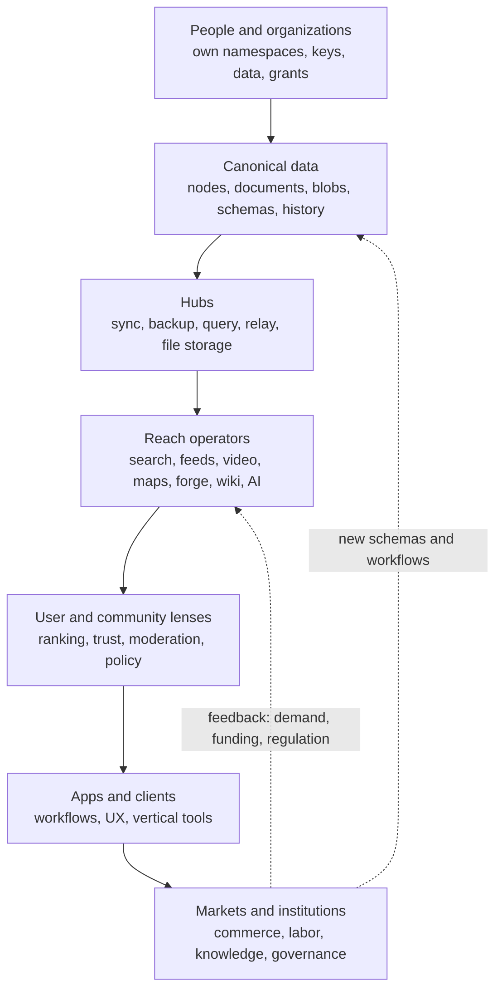

The recommendation is:

**xNet should first become the best portable data and collaboration substrate for real workflows,
then build federated market/search/social layers as replaceable app views.**

Do not begin with "replace Google, Amazon, YouTube, GitHub, Wikipedia, X, and LinkedIn." Begin with
smaller high-trust domains where portability is immediately valuable:

- cross-company project work;
- local service marketplaces;
- open source plugin/package publishing;
- expert-run knowledge bases;
- federated support and warranty records;
- community commerce;
- professional reputation and credential portability;
- creator catalogs with multiple discovery and distribution surfaces.

Those early domains exercise the same primitives the larger future needs, while avoiding the trap
of trying to run planetary infrastructure before the product and trust model are proven.

## Current State In The Repository

### What xNet already is

The root [`README.md`](../../README.md) describes xNet as "decentralized data infrastructure and
application" with local-first, P2P-synced, user-owned data. It also states that xNet is both the
underlying infrastructure and the user-facing app, starting with documents and databases and
expanding through plugins to ERP, MCP integrations, and more.

The architecture already includes many of the primitives that matter for this exploration:

| Layer    | Current repo surface                                                                                          | Why it matters for wide adoption                                                        |
| -------- | ------------------------------------------------------------------------------------------------------------- | --------------------------------------------------------------------------------------- |
| Data     | [`@xnetjs/data`](../../packages/data) with schemas, NodeStore, built-in schemas, Yjs documents                | Canonical portable state can be typed and synced                                        |
| Sync     | [`@xnetjs/sync`](../../packages/sync) with Lamport clocks, Change<T>, hash chains, Yjs security               | Structured and rich-text collaboration can survive offline edits                        |
| Identity | [`@xnetjs/identity`](../../packages/identity) with DID:key and UCAN tokens                                    | Data, grants, and federation need portable cryptographic identity                       |
| Query    | [`@xnetjs/query`](../../packages/query) with local query, MiniSearch, federated router                        | Apps and app views need read/query surfaces over local and remote state                 |
| Hub      | [`@xnetjs/hub`](../../packages/hub) with relay, backup, FTS5, schema registry, federation, sharding, crawling | Hubs are the always-on infrastructure layer for sync, discovery, search, and federation |
| Plugins  | [`@xnetjs/plugins`](../../packages/plugins) with registry, sandbox, schemas, AI generation, MCP server        | Third parties can add workflows over shared data                                        |
| React    | [`@xnetjs/react`](../../packages/react) with useQuery, useMutate, useNode, grants, hub hooks                  | The app-facing runtime can expose data as live, collaborative UX                        |

The repo's own vision doc already frames this as a micro-to-macro continuum: personal notes,
organizational workspaces, and global search/social/data commons are different scales of the same
node, schema, sync, and identity primitives. See [`docs/VISION.md`](../VISION.md).

### The important technical split: canonical state vs derived reach

Across the codebase and existing explorations, the same architectural pattern appears repeatedly:

1. Canonical state should be signed, local-first, user-owned, and syncable.
2. Expensive reach surfaces should be derived and rebuildable.

This pattern is visible in several local sources:

- [`packages/data/src/store/store.ts`](../../packages/data/src/store/store.ts) implements NodeStore
  as event-sourced storage using signed changes, Lamport clocks, and field-level LWW conflict
  resolution.
- [`packages/query/src/search/document.ts`](../../packages/query/src/search/document.ts) extracts
  searchable text and links from Yjs documents, which makes search a derived index over canonical
  content.
- [`packages/hub/src/services/query.ts`](../../packages/hub/src/services/query.ts) indexes document
  metadata and text into hub storage and filters authorized results.
- [`packages/hub/src/services/federation.ts`](../../packages/hub/src/services/federation.ts)
  implements hub-to-hub query federation with UCAN checks, schema exposure, rate limiting, peer
  health, result deduplication, and reciprocal-rank fusion.
- [`packages/core/src/federation.ts`](../../packages/core/src/federation.ts) defines generic query
  federation types such as `DataSource`, `QueryPlan`, `QueryRequest`, and `QueryResponse`.
- [`packages/query/src/federation/router.ts`](../../packages/query/src/federation/router.ts) exposes
  a federated query router interface, but today it only executes local queries and leaves remote
  routing as future work.

That last point matters. The repo has real federation scaffolding, but not yet a complete
production-grade internet-scale federation layer.

### Current social and collaboration substrate

xNet already has universal social primitives that can generalize beyond "social media":

- [`CommentSchema`](../../packages/data/src/schema/schemas/comment.ts) is schema-agnostic and can
  target pages, tasks, database records, canvas objects, or any node.
- [`ReactionSchema`](../../packages/data/src/schema/schemas/reaction.ts) models likes, reposts,
  bookmarks, emoji, and annotations against any target.
- [`StoreAuth`](../../packages/data/src/auth/store-auth.ts) supports grant issuance, revocation,
  UCAN-backed delegation, proof-depth limits, attenuation, and permission checks.

These matter because markets, work, social life, support, dating, families, OSS reviews, and public
knowledge all need variations of the same primitives:

- addressable people and organizations;
- addressable things;
- relationships between them;
- comments and review;
- credentials and grants;
- public and private surfaces;
- history and provenance;
- moderation and policy overlays.

### Existing adjacent explorations

This exploration builds on several local documents:

| Exploration                                                                                                                                                      | Local conclusion this document reuses                                                                                              |
| ---------------------------------------------------------------------------------------------------------------------------------------------------------------- | ---------------------------------------------------------------------------------------------------------------------------------- |
| [`0023_[_]_DECENTRALIZED_SEARCH.md`](./0023_[_]_DECENTRALIZED_SEARCH.md)                                                                                         | Search should be layered from local to workspace to global, with routing and indexes rather than network-wide query flooding.      |
| [`0091_[_]_GLOBAL_SCHEMA_FEDERATION_MODEL.md`](./0091_[_]_GLOBAL_SCHEMA_FEDERATION_MODEL.md)                                                                     | A schema presence index, scoped capabilities, and multi-hub sync policy are missing primitives for app-as-view.                    |
| [`0110_[_]_XNET_AS_A_VIABLE_WIKIPEDIA_ALTERNATIVE.md`](./0110_[_]_XNET_AS_A_VIABLE_WIKIPEDIA_ALTERNATIVE.md)                                                     | Public knowledge needs citations, review, stable publishing, governance, and public-scale discovery.                               |
| [`0115_[_]_ARCHITECTING_FULLY_DECENTRALIZED_GLOBAL_WEB_SEARCH.md`](./0115_[_]_ARCHITECTING_FULLY_DECENTRALIZED_GLOBAL_WEB_SEARCH.md)                             | Global search is plausible only with layered decentralization: peers, community hubs, backbone search fabric, and local reranking. |
| [`0116_[_]_ARCHITECTING_DECENTRALIZED_TWITTER_X_ON_XNET.md`](./0116_[_]_ARCHITECTING_DECENTRALIZED_TWITTER_X_ON_XNET.md)                                         | Social should separate canonical posts/follows from derived timelines, discovery, search, trending, and moderation.                |
| [`0118_[_]_ARCHITECTING_A_DECENTRALIZED_OSS_FORGE_ON_XNET.md`](./0118_[_]_ARCHITECTING_A_DECENTRALIZED_OSS_FORGE_ON_XNET.md)                                     | Do not replace Git first; decentralize the forge control plane around Git.                                                         |
| [`0131_[_]_FEDERATED_DECENTRALIZED_VIDEO_PLATFORM_LIKE_YOUTUBE_OR_INSTAGRAM.md`](./0131_[_]_FEDERATED_DECENTRALIZED_VIDEO_PLATFORM_LIKE_YOUTUBE_OR_INSTAGRAM.md) | Video federation needs metadata, social graph, manifests, transcoders, caches, quotas, and cost controls.                          |
| [`0132_[_]_ECONOMIC_MODELS_FOR_HOSTING_FEDERATED_HUBS.md`](./0132_[_]_ECONOMIC_MODELS_FOR_HOSTING_FEDERATED_HUBS.md)                                             | Hub hosting becomes a service economy: home hubs, community hubs, backbone hubs, media hubs, labelers, and specialist services.    |
| [`0140_[x]_SPAM_AND_ABUSE_MITIGATION_AUTOMATED_API_ACROSS_THE_NETWORK.md`](./0140_[x]_SPAM_AND_ABUSE_MITIGATION_AUTOMATED_API_ACROSS_THE_NETWORK.md)             | Wide federation requires abuse automation, labels, policy distribution, and operator-level defensive tooling.                      |

### Current limitations that constrain the future

Wide adoption would require capabilities that are still partial or absent:

- multi-hub client sync policy is still a roadmap item, not a polished user-facing system;
- the lower-level federated query router is local-only today;
- hub federation is query-oriented, not a complete ActivityPub-style social/activity delivery
  system;
- there is no first-class market, reputation, product listing, order, invoice, credential, or
  organization schema bundle;
- there is no production timeline assembler, recommendation system, global relation index,
  notification generator, or default label ecosystem;
- billing-grade metering and hub operator transparency are not yet present;
- schema compatibility and migration at global ecosystem scale remain largely design work;
- public knowledge publishing, public citation models, public review lanes, and SEO-grade public
  delivery are not built yet;
- video, search, AI, and large feed infrastructure remain expensive derived layers.

Those gaps do not invalidate the vision. They define the path from "xNet as a local-first platform"
to "xNet as a broad internet substrate."

## External Research

### Federated social and protocol plurality

[ActivityPub](https://www.w3.org/TR/activitypub/) is a W3C Recommendation for decentralized social
networking. It defines a client-to-server API and federated server-to-server delivery for creating,
updating, deleting, notifying, and distributing social content. This is the main standard behind
much of the Fediverse.

xNet can learn from ActivityPub's success and limits:

- standardized activities are powerful;
- independently operated servers can interoperate;
- moderation is local and operator-specific;
- the protocol alone does not solve discovery quality, spam, search, onboarding, or media costs.

[AT Protocol](https://atproto.com/specs/atp) takes a different approach. Its official docs
distinguish Personal Data Servers, Relays, and App Views. The
[self-hosting guide](https://atproto.com/guides/self-hosting) says PDS hosting is data-level
infrastructure, while Relays and AppViews are application-level infrastructure and can be bandwidth
or resource intensive.

The lesson for xNet is direct:

**separate data ownership from expensive reach.**

Users and businesses may own canonical state, but search engines, social feeds, market views,
moderation systems, and video apps still need serious infrastructure.

### Federated communication and the cost of public entry points

[Matrix](https://spec.matrix.org/) defines open APIs for decentralized communication over a global
federation of servers. The Matrix spec and homeserver model show that federation can support durable
real-time collaboration, but public entry homeservers still carry large infrastructure and trust and
safety costs.

The Matrix.org Foundation's
[premium homeserver post](https://matrix.org/blog/2025/06/funding-homeserver-premium/) is important
because it describes the real cost of a public federated entry point: infrastructure, SRE, support,
moderation, trust and safety, governance, and ecosystem work. Their
[homeserver pricing page](https://matrix.org/homeserver/pricing/) frames this around user choice of
homeserver and usage limits.

The xNet implication is:

**wide adoption needs sustainable hub economics before it needs exotic payment protocols.**

### Personal data stores and app-as-view

[Solid](https://solidproject.org/) and its personal data store model are relevant because Solid is
explicitly about users controlling data in decentralized stores called Pods and using apps over that
data. The Solid FAQ describes self-hosting Identity and Pod infrastructure and allowing apps to
access data through open, interoperable standards.

xNet differs technically, especially around local-first sync, schemas, CRDTs, and hubs, but Solid is
an important precedent for the social meaning of app-as-view:

- users need to understand where data lives;
- apps need scoped access rather than wholesale ownership;
- identity, storage, and application UX become separable concerns;
- consent UX becomes part of the platform, not just a popup.

### Content addressing, persistence, and storage economics

[IPFS docs](https://docs.ipfs.tech/) describe IPFS as open protocols for content addressing,
routing, and transferring data. The
[persistence docs](https://docs.ipfs.tech/concepts/persistence/) make the key point for xNet:
content addressing does not by itself guarantee that data remains available. Someone has to pin,
host, mirror, pay for, or otherwise keep content online.

This matters for federated video, public knowledge, software releases, invoices, legal records, and
family archives. Content IDs are useful, but the market still needs:

- storage providers;
- retention policies;
- payment models;
- legal/takedown processes;
- backup and migration UX;
- availability receipts.

### Federated video and media costs

[PeerTube ActivityPub documentation](https://docs.joinpeertube.org/api/activitypub) says PeerTube
federation shares video metadata as activities and supports user interactions such as comments
through ActivityPub-compatible activities. That validates the idea of federated YouTube-like
metadata and social state.

It also proves a constraint:

**video federation does not make video cheap.**

Creators, viewers, and operators still need upload sessions, transcoders, adaptive playback,
thumbnails, captions, caches, abuse review, copyright response, bandwidth budgets, and creator
monetization.

### Federated knowledge and open data commons

[Wikibase](https://wikiba.se/) is highly relevant because it explicitly supports collaborative
knowledge bases, linked open data, and federation where data can stay where it is created while
being accessed and referenced elsewhere. Its messaging around different ontologies also matters:
one global ontology rarely fits every community.

[MediaWiki patrolling documentation](https://www.mediawiki.org/wiki/Help:Patrolling) shows that
open public knowledge systems need review workflows, not just editing. Patrolling exists because
open contribution requires anti-vandalism and policy enforcement.

[OpenStreetMap](https://www.openstreetmap.org/about/eng) is another important precedent: a global,
community-maintained data commons that many apps, companies, governments, and communities can reuse.
OSM shows that open collaborative data can become infrastructure, but it also requires community
governance, contributor norms, licensing, and downstream service businesses.

### Digital markets, portability, and competition

The [European Commission Digital Markets Act](https://digital-markets-act.ec.europa.eu/index_en)
targets gatekeeper power in large digital platforms. Commission pages highlight concepts that map
directly to xNet's strategic value: interoperability, data portability, contestability, network
effects, business-user dependence, and lock-in.

The [OECD paper on Data Portability, Interoperability and Competition](https://www.oecd.org/en/publications/data-portability-interoperability-and-competition_73a083a9-en.html)
describes how portability and interoperability can promote competition within and among digital
platforms. The accompanying OECD event page notes that interoperability can preserve network effects
while reducing switching barriers.

The xNet inference is:

**a working data-portable, app-portable, graph-portable platform can operationalize goals regulators
already care about.**

But technology alone is not enough. Regulators, standards bodies, incumbents, and new operators
will fight over defaults, consent, liability, and what counts as "effective" interoperability.

### Search: open crawls, meta-search, peer search, and independent indexes

Several search precedents matter:

- [Common Crawl](https://commoncrawl.org/) maintains an open repository of web crawl data, with
  hundreds of billions of pages spanning many years.
- [SearXNG](https://searxng.org/) is a self-hostable meta-search engine aggregating results from
  many search services without tracking users.
- [YaCy](https://www.yacy.net/) is a peer-to-peer search engine emphasizing shared indexes and no
  central server.
- [Brave Search](https://brave.com/search/) operates an independent search index and uses an opt-in
  Web Discovery Project for privacy-preserving contribution to index quality.

The lessons for xNet:

- crawling can be open and shared;
- query privacy matters;
- independent indexes are possible;
- self-hosted search is valuable but not enough for global quality;
- pure peer-to-peer search struggles with freshness, ranking, spam resistance, and latency;
- user-contributed signals are powerful, but only if they are privacy-preserving and abuse-resistant.

### Decentralized forges and software supply chain trust

[Radicle](https://radicle.dev/) is a peer-to-peer code collaboration stack built on Git where
repositories are replicated across peers and users control data and workflow.

[ForgeFed](https://forgefed.org/spec) defines ActivityPub-compatible vocabulary and behavior for
federated software forges, including forge-related objects and activities.

[Sigstore](https://docs.sigstore.dev/) and the
[OpenSSF SLSA framework](https://openssf.org/press-release/2023/04/19/openssf-announces-slsa-version-1-0-release/)
show that open source distribution increasingly needs provenance, signing, attestations,
transparency logs, and verifiable build integrity.

The xNet inference:

**decentralized GitHub is mostly a collaboration, trust, package, and preservation problem, not a
Git object problem.**

Git is already distributed. The centralized parts are issue state, pull requests, review state,
CI logs, releases, packages, discovery, reputation, security advisories, and social proof.

### Local-first collaboration

The [Ink & Switch local-first essay](https://www.inkandswitch.com/essay/local-first/) argues that
cloud applications made collaboration convenient while moving ownership of data to servers. It
frames local-first software around ownership, offline work, privacy, collaboration, longevity, and
user agency.

[Automerge](https://automerge.org/) is a CRDT library that supports automatic merging of concurrent
changes without requiring a central server. xNet uses Yjs rather than Automerge for rich text, but
the broad research direction is the same: collaboration can be built around replicated local state
rather than a single authoritative cloud database.

The xNet inference:

**local-first is not only a technical feature. It changes the default power relationship between
people, apps, companies, and institutions.**

## Core Thesis

Wide xNet adoption would make the internet less "site-centric" and more "object-centric."

Today, when people talk about the internet, they often mean:

- search on Google;
- social on X, Instagram, TikTok, LinkedIn, Reddit, Facebook;
- video on YouTube;
- code on GitHub;
- knowledge on Wikipedia;
- commerce on Amazon, Shopify, App Store, DoorDash, Airbnb, Etsy, Stripe, Mercado Libre, Alibaba;
- business workflows in Salesforce, Microsoft 365, Google Workspace, Slack, Notion, Jira, Figma,
  Linear, HubSpot, Netsuite, Workday.

Each platform owns a domain-shaped slice of reality.

In a mature xNet world, the internet begins to look more like:

- globally addressable people, organizations, products, services, projects, media, code,
  credentials, citations, places, events, orders, invoices, contracts, posts, datasets, comments,
  decisions, and relationships;
- many apps and services competing to interpret, route, rank, host, present, moderate, verify,
  finance, insure, translate, summarize, and automate those objects;
- user and organization policies determining which surfaces can access which data, under what
  grants, through which hubs, with what retention and visibility.

That is the central mental model shift:

```mermaid
flowchart LR
    subgraph Today["Today: platform-owned reality"]
        Amazon["Amazon owns listings,<br/>orders, reviews, search"]
        GitHub["GitHub owns issues,<br/>PRs, releases, stars"]
        YouTube["YouTube owns videos,<br/>comments, feeds, monetization"]
        LinkedIn["LinkedIn owns profile,<br/>graph, reputation"]
        Google["Google owns search<br/>ranking and intent data"]
    end

    subgraph XNet["Wide xNet adoption: object-owned reality"]
        Listings["Listings"]
        Orders["Orders"]
        Reviews["Reviews"]
        Repos["Repos and issues"]
        Videos["Videos and manifests"]
        Profiles["Profiles and credentials"]
        Indexes["Indexes and lenses"]
    end

    subgraph Services["Competitive service layers"]
        UX["Apps and UX"]
        Rank["Ranking and feeds"]
        Trust["Trust and labels"]
        Host["Hubs and storage"]
        Pay["Payments and escrow"]
        AI["Agents and automation"]
    end

    Today -. "unbundle" .-> XNet
    XNet --> Services
```

The platform does not disappear. It becomes more accountable, replaceable, and specialized.

## Key Findings

### 1. Data lock-in becomes a weaker moat

If xNet works at scale, platforms can no longer rely as heavily on owning:

- your social graph;
- your creator catalog;
- your customer list;
- your product data;
- your reviews;
- your issue tracker;
- your purchase history;
- your knowledge base;
- your private notes;
- your project history.

Those objects can live in user or organization namespaces and be accessed by multiple apps through
grants, policies, schemas, and hubs.

The new moats shift toward:

- best UX;
- best trust and safety;
- best ranking;
- best onboarding;
- best reliability;
- best support;
- best compliance;
- best AI workflows;
- best marketplace liquidity;
- best operator network;
- best vertical domain expertise.

This is healthier than data lock-in, but still creates power centers. A dominant app view could
become the new gatekeeper even if it no longer owns the data.

### 2. "The app" becomes a workflow surface, not the database

If data is canonical below the app, then the same customer, product, task, invoice, credential, or
post can appear in many tools:

- a CRM view;
- an accounting view;
- a support view;
- a project-management view;
- a marketplace listing view;
- a compliance evidence view;
- an AI assistant view;
- a family archive view;
- a public search view.

This makes businesses more modular. It also makes product design harder because users need to
understand permissions and boundaries.

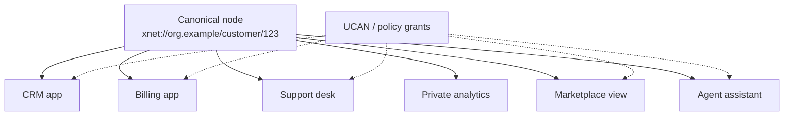

### 3. Markets become federated query graphs

In an xNet commerce world, a market is not necessarily a single website. It can be:

- a query over public listings;
- a set of trust filters;
- a payment/escrow workflow;
- a shipping/fulfillment integration;
- a support/reputation policy;
- a dispute process;
- a discovery/ranking lens;
- a community membership boundary.

A customer might search "local repair technician for 1930s radiators" across:

- municipal licensed contractor registries;
- neighborhood recommendations;
- vendor availability calendars;
- signed work history;
- insurance credentials;
- family/friend trust paths;
- market operators specializing in old homes;
- consumer protection labelers;
- price history from prior jobs.

No single marketplace has to own all of this. But someone has to make the experience coherent.

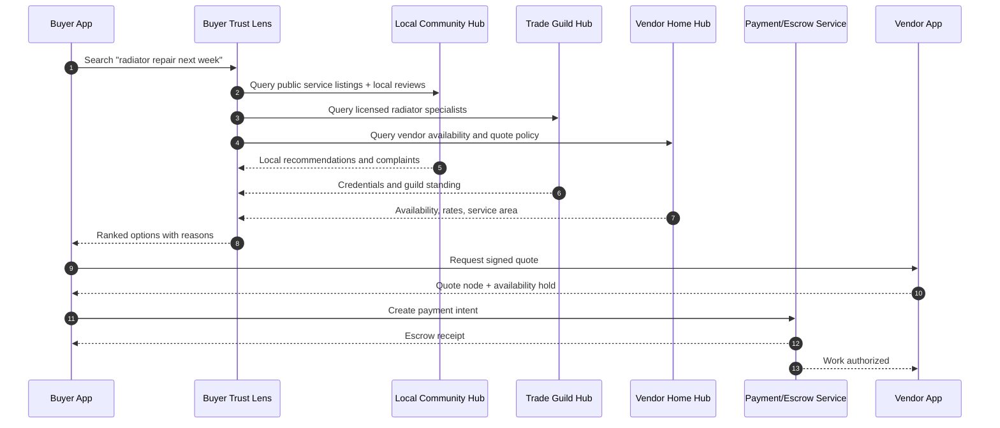

### 4. Business models shift from extraction to service

Today's digital businesses often monetize:

- attention;
- behavioral profiling;
- take-rate over captive transactions;
- API access to data users already created;
- ads targeted through centralized surveillance;
- switching costs;
- forced bundling.

In a federated xNet market, sustainable business models lean more toward:

- hosting and backup subscriptions;
- app view subscriptions;
- search/recommendation quality;
- trust and label services;
- verification and credentialing;
- dispute resolution;
- payment and escrow services;
- compliance workflows;
- AI agents that act under scoped grants;
- creator services;
- media delivery and transcoding;
- business process automation;
- data migration and schema stewardship;
- community membership and governance.

Advertising does not disappear, but it changes. Instead of platform-wide surveillance ads, the more
defensible versions are:

- contextual sponsorship of a public search or market lens;
- user-controlled intent broadcasts;
- opt-in buyer requests;
- community-approved sponsorships;
- local directory placement with transparent ranking;
- creator sponsorships attached to portable catalogs.

### 5. New operator roles appear

Wide adoption creates a layered service economy:

| Role                       | What they do                                                  | Analog today                                            |
| -------------------------- | ------------------------------------------------------------- | ------------------------------------------------------- |
| Home hub operator          | Sync, backup, availability for people and small orgs          | iCloud, Google Drive, hosting provider                  |
| Community hub operator     | Local policy, public discovery, events, community moderation  | Mastodon server, chamber of commerce, Discord admin     |
| Backbone search operator   | Crawl, shard, rank, cache, serve public indexes               | Search engine, CDN, data vendor                         |
| App view operator          | Build high-quality views over shared data                     | Social network app, marketplace app, SaaS app           |
| Trust lens publisher       | Publish ranking, block, allow, reputation, and label policies | Consumer Reports, blocklist, credit bureau, review site |
| Schema steward             | Maintain interoperable schemas and migrations                 | Standards body, schema.org, package maintainer          |
| Verification service       | Verify identity, credentials, licenses, org status            | Notary, CA, KYC vendor, professional board              |
| Dispute resolver           | Resolve transaction, content, and moderation conflicts        | Marketplace support, arbitration, small claims          |
| Media cache/transcoder     | Host video renditions, thumbnails, manifests, range reads     | CDN, YouTube infrastructure, video platform             |
| Forge mirror/archive       | Preserve code, releases, issues, provenance, packages         | GitHub mirror, Software Heritage, package registry      |
| Public knowledge publisher | Curate reviewed public knowledge lanes                        | Journal, encyclopedia, documentation site               |
| AI delegate operator       | Run agents under scoped grants with auditable actions         | Automation platform, assistant platform                 |

This is one of the biggest market shifts: the platform economy fragments into many smaller
infrastructure and trust businesses.

### 6. Search becomes plural

Federated search does not mean there is no Google-like default. It means the default can be
contested.

Possible search modes:

- local private search over your own data;
- family/team/org search over shared workspaces;
- community search over a hub or region;
- vertical search over schemas like products, code, papers, recipes, laws, credentials;
- public web search over crawled pages;
- semantic search over vector indexes;
- market search over listings and availability;
- social search over public posts and profiles;
- reputation-aware search using labels and trust paths;
- AI-assisted search with citations and local context.

The most important change is not that one search engine disappears. It is that users can select,
combine, inspect, and share search lenses.

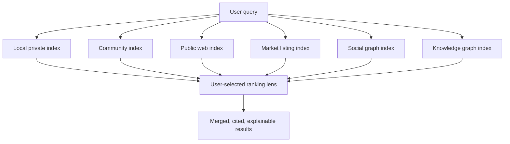

### 7. Social becomes a marketplace of timelines and contexts

A federated social xNet would likely not look like one X/Twitter replacement. It would look like:

- canonical posts, comments, reactions, follows, lists, profiles, labels, and blocks;
- multiple timeline services;
- multiple moderation systems;
- multiple identity contexts;
- multiple discovery and trending operators;
- community-specific norms;
- personal and professional graph separation;
- local-first private groups;
- public posts replicated through hubs;
- relationship-specific visibility and history.

This creates real benefits:

- leave a bad app without losing posts and follows;
- maintain multiple social contexts without starting over;
- use a better client or feed algorithm;
- subscribe to community moderation labels;
- recover from platform collapse;
- preserve family and community archives.

It also creates real problems:

- fragmented virality;
- inconsistent moderation;
- harder harassment response;
- context collapse across apps;
- reputation data being reused in unexpected settings;
- app views competing to become the new default feed.

### 8. Collaboration becomes cross-boundary by default

The biggest business collaboration shift is not multiplayer editing. It is cross-boundary shared
state.

Today, a supplier, customer, contractor, auditor, insurer, lender, regulator, and internal team may
all maintain separate versions of:

- product specs;
- contracts;
- invoices;
- delivery status;
- support tickets;
- compliance evidence;
- warranty records;
- issue reports;
- design files;
- meeting notes;
- decisions.

In an xNet world, each party can keep local-first control while sharing scoped nodes and updates.
The same object can move through organizations without becoming an email attachment or a SaaS
record trapped in one vendor's database.

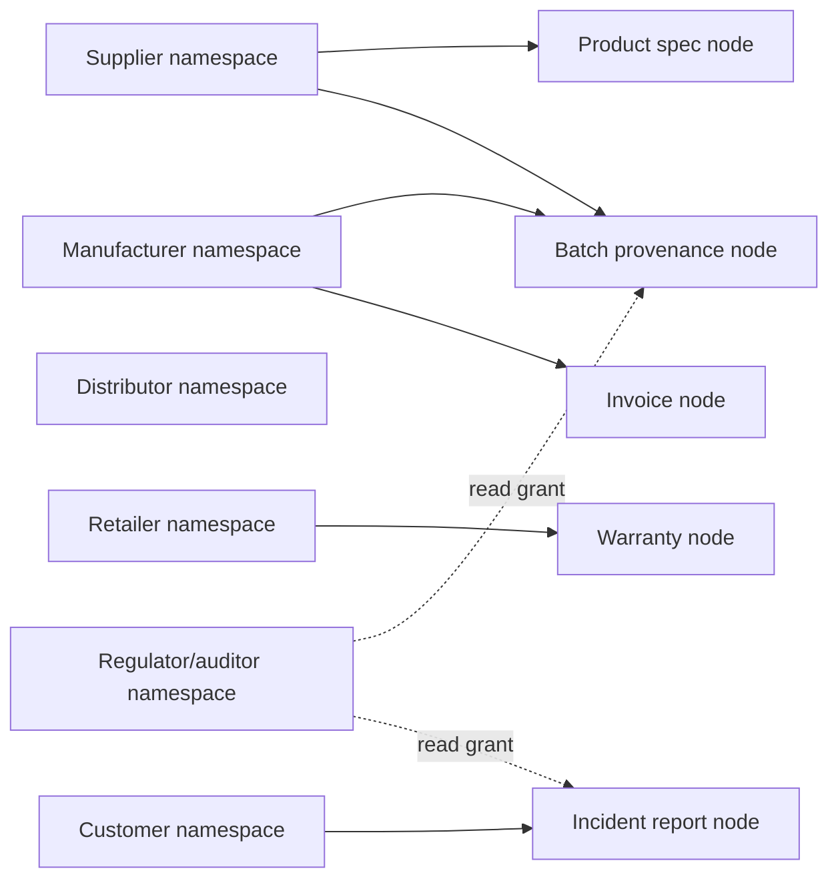

### 9. Enterprise software becomes less all-or-nothing

Enterprise systems are currently sticky because they own process state and integrations:

- CRM;
- ERP;
- HRIS;
- accounting;
- support desk;
- data warehouse;
- document management;
- project management;
- identity;
- analytics.

xNet can make enterprise software more modular. A company might run:

- its canonical organization graph in xNet;
- one vendor for CRM UX;
- another for quoting;
- another for finance;
- another for AI analysis;
- another for compliance evidence;
- another for customer portal;
- another for search;
- internal policies controlling what each sees.

This could lower switching costs and improve auditability. It could also create integration
complexity unless schemas and policy tooling are excellent.

### 10. Small businesses get leverage, but also more responsibility

Federated commerce could help small businesses:

- publish portable catalogs once and appear in many market views;
- avoid being trapped by a single marketplace's rules;
- keep customer relationships;
- carry reputation across platforms;
- use local community trust lenses;
- automate quotes, invoices, warranties, and support across apps;
- join co-op infrastructure instead of buying enterprise SaaS.

But the responsibility shifts too:

- maintain accurate data;
- choose hubs;
- choose trust and moderation policies;
- respond to disputes across app views;
- protect customer data;
- avoid bad schema choices;
- manage revocation and retention.

The likely winning products will hide this complexity without taking ownership back.

### 11. Reputation becomes portable and dangerous

Portable reputation is powerful:

- a plumber can carry verified work history across marketplaces;
- a freelancer can carry project references;
- a developer can carry issue and review history;
- a seller can carry fulfillment performance;
- a buyer can carry payment reliability;
- a researcher can carry citations and peer review;
- a community member can carry stewardship history.

But portable reputation can become coercive:

- blacklists can follow people across domains;
- dating, employment, lending, and housing could misuse unrelated signals;
- old mistakes can become harder to escape;
- algorithmic labels can become de facto social credit;
- communities can inherit biases from shared trust lenses.

xNet should therefore treat reputation as contextual, inspectable, appealable, and permissioned.

### 12. Public knowledge becomes a federation of claims, citations, and review lanes

A federated Wikipedia is not simply Wikipedia with multiple servers. It is likely:

- canonical claim nodes;
- citation nodes;
- article/narrative nodes;
- topic-specific review communities;
- stable published revisions;
- competing editorial policies;
- local language and cultural forks;
- provenance and author attribution;
- public indexes over claims and articles;
- knowledge graph queries;
- "consensus lanes" and "minority interpretation lanes";
- legal and scientific update workflows.

This could be a public knowledge renaissance. It could also produce forked realities if trust,
citations, and review status are not visible.

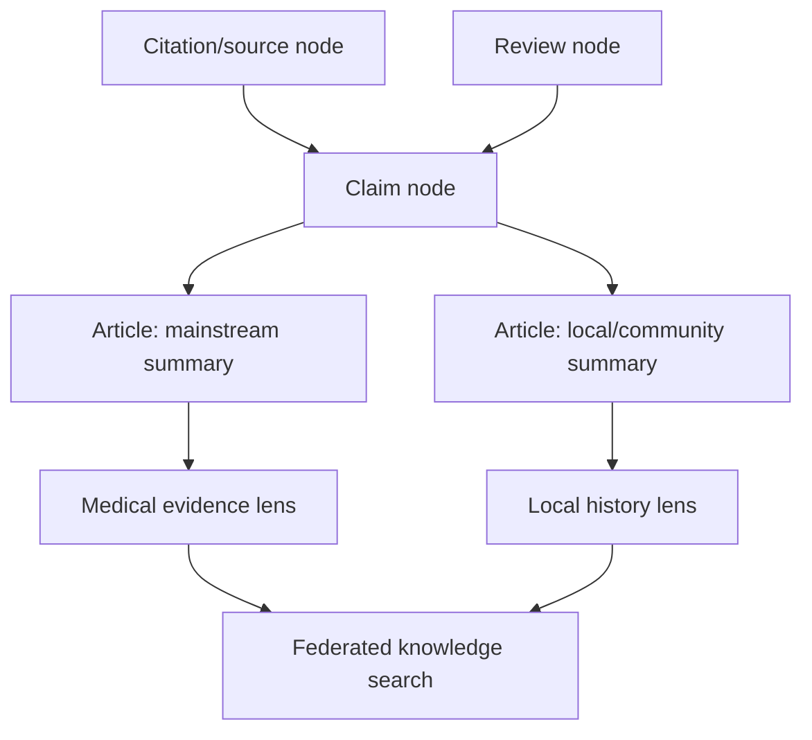

### 13. Video and creators become less platform-dependent, but not infrastructure-free

Federated video can change creator economics:

- creators own their channel metadata, catalog, comments, community, memberships, and sponsorships;
- multiple apps can display the same creator catalog;
- fans can subscribe from different clients;
- media can be mirrored by communities or sponsors;
- creator monetization can happen outside a single recommendation platform;
- takedowns and labels can be local, legal, or community-specific.

But video remains brutal:

- bandwidth;
- transcode cost;
- cache placement;
- recommendation quality;
- copyright;
- child safety;
- harassment;
- spam;
- monetization fraud;
- creator support.

The most likely xNet video outcome is not "everyone hosts YouTube from a laptop." It is "creators
own portable video catalogs and communities, while specialized media hubs compete to distribute and
monetize them."

### 14. Open source becomes less dependent on one forge

A federated GitHub-like layer would change open source:

- issues, PRs, reviews, releases, package metadata, advisories, and funding can become portable;
- projects can move hosts without losing collaboration history;
- contributors can review from their own forge/client;
- package provenance can be signed and mirrored;
- project reputation can be built from verifiable history rather than one platform's stars;
- AI agents can act on scoped repo grants.

The hard parts:

- maintaining coherent review state across forks;
- avoiding supply-chain poisoning;
- preserving CI evidence;
- resolving maintainer authority;
- handling abuse and spam in issues;
- avoiding fragmentation of package namespaces.

### 15. AI agents become delegated actors, not omniscient platform bots

If xNet data is local-first and grant-scoped, AI agents can work differently:

- a personal agent gets a scoped grant to search personal notes, calendar, family plans, and public
  market listings;
- a business agent gets scoped access to inventory, invoices, support, and supplier quotes;
- a software agent gets repo issue/PR/package grants;
- a research agent gets citation and dataset access;
- a dating agent gets only the relationship preferences a user chooses to expose.

This enables useful automation without requiring one company to ingest everything.

The main risks:

- over-broad grants;
- prompt injection against local/private data;
- agents leaking derived summaries;
- opaque autonomous transactions;
- fake agent identities;
- automated spam and manipulation at scale.

### 16. Families and friend groups become real data networks

Today's family and friend collaboration is scattered:

- group chats;
- shared albums;
- Google Docs;
- calendar invites;
- shared notes;
- payment apps;
- school portals;
- health portals;
- family tree sites;
- event apps;
- private social accounts.

xNet could turn this into a controlled family/community data graph:

- shared emergency docs;
- household inventory;
- family calendars;
- caregiving plans;
- school documents;
- medical permissions;
- photos and stories;
- travel plans;
- shared budgets;
- eldercare task lists;
- estate documents;
- private family wiki;
- child data with guardianship transitions.

This is socially significant because the data outlives any one app. The family can switch apps,
change hubs, revoke access, preserve archives, and create relationship-specific boundaries.

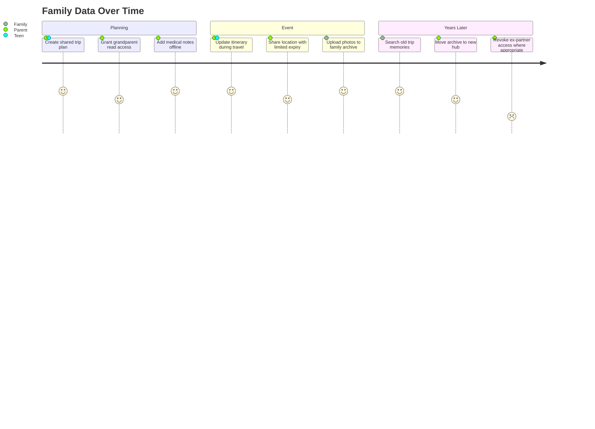

But it can also create hard human problems:

- who controls children's long-term archives;
- what happens after divorce or estrangement;
- how inheritance works for private data;
- how to prevent coercive monitoring;
- how to make revocation understandable;
- how to balance family safety and individual autonomy.

### 17. Dating becomes more portable, contextual, and risky

Dating platforms today own:

- profiles;
- preferences;
- matches;
- messages;
- safety reports;
- reputation;
- verifications;
- social proof;
- payment state.

With xNet, people could carry:

- a portable dating profile;
- verified identity or age credentials without exposing legal identity;
- relationship preferences;
- dealbreakers;
- introduction references;
- block lists;
- safety reports;
- compatibility data;
- consent boundaries;
- event attendance;
- "friends-of-friends" trust paths.

This could make dating less captive to one app and more community-mediated. It could also make
misuse more dangerous:

- stalking via portable identity;
- reputation smearing;
- pressure to disclose more credentials;
- algorithmic desirability scoring;
- cross-app harassment;
- consent drift when data used in one dating context appears elsewhere.

The right xNet design should support contextual identity, narrow grants, expiry, private block
lists, safety labels, and "do not correlate" boundaries.

### 18. Governments and regulators gain tools and lose simple chokepoints

xNet-like federation aligns with regulatory interest in competition, data portability, and
interoperability. It could make it easier to:

- enforce portability;
- audit platform behavior;
- enable competition in digital markets;
- require explainable ranking for regulated contexts;
- support public data commons;
- let citizens hold credentials;
- let businesses switch vendors.

But regulators lose some simple chokepoints:

- no single platform owns all state;
- content is hosted across jurisdictions;
- public/private boundaries are cryptographic and policy-driven;
- app views and hubs may be separate legal entities;
- harmful content may persist in some parts of the federation while hidden in others.

This creates pressure for:

- standard transparency reports;
- legal response APIs;
- jurisdiction-aware hub metadata;
- child-safety and consumer-protection labelers;
- public-interest archiving rules;
- right-to-exit and right-to-delete semantics;
- liability boundaries for app views vs hubs vs users.

### 19. The new inequality is operator capacity

Wide federation can reduce platform lock-in, but it may create a new divide:

- people with good hubs vs people on overloaded free hubs;
- communities with moderation capacity vs communities without it;
- businesses with schema/legal/AI support vs businesses without it;
- creators with media mirrors vs creators stuck on slow origins;
- regions with strong local index operators vs regions invisible to global search;
- languages with strong knowledge graphs vs languages underserved by indexing and AI.

Federation does not automatically democratize outcomes. It creates the possibility of more local
control. Funding, defaults, governance, UX, and education decide who benefits.

## Scenario Map

The most useful way to think about wide xNet adoption is not one future, but many overlapping
possible worlds.

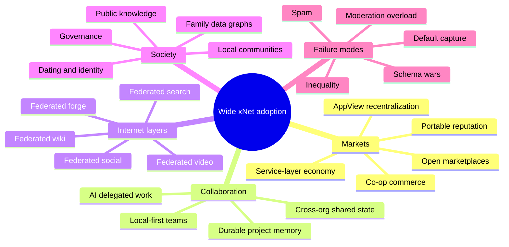

### Scenario 1: Quiet business substrate

xNet does not immediately become a consumer social phenomenon. Instead, it becomes the invisible
data substrate for small teams, consultants, agencies, local businesses, and open source projects.

What changes:

- businesses stop copying CSVs between tools;
- customer records become portable;
- invoices, support tickets, and project docs can move between apps;
- cross-company workspaces become easier;
- AI assistants can operate over local business data without centralizing it;
- consultants and vendors bring their own work history and credentials.

Who wins:

- small businesses;
- vertical SaaS builders;
- managed hub providers;
- schema stewards;
- migration consultants;
- AI workflow vendors.

What can go wrong:

- too much complexity;
- no shared schema consensus;
- enterprises wait for compliance guarantees;
- incumbents wrap xNet data in proprietary UX and re-create lock-in.

### Scenario 2: Open marketplace web

Product and service listings become portable nodes. Marketplaces become ranking, trust,
transaction, and support layers.

What changes:

- sellers publish once and appear across many markets;
- buyers bring trust lenses and preferences;
- reviews and warranties are portable;
- marketplaces compete on discovery, guarantees, dispute resolution, and UX;
- local markets become easier to build;
- "Amazon but for X" becomes less defensible as a data moat.

Who wins:

- merchants with direct customer relationships;
- niche marketplace builders;
- local chambers of commerce;
- consumer-protection labelers;
- payment/escrow services;
- logistics integrators.

What can go wrong:

- fraudulent listings proliferate;
- review portability becomes reputation laundering;
- dominant market app views capture buyer attention;
- sellers face too many policy surfaces;
- price comparison becomes a race to the bottom for some goods.

### Scenario 3: Enterprise interop layer

Large organizations adopt xNet under the language of audit, data portability, vendor risk, and
cross-organization collaboration rather than ideology.

What changes:

- internal systems expose data through xNet-compatible schemas;
- vendors receive scoped grants instead of full database exports;
- compliance evidence becomes structured and queryable;
- M&A integration becomes less painful;
- supply-chain records become verifiable;
- auditors, regulators, and insurers get narrow read grants.

Who wins:

- enterprises with high vendor switching costs;
- regulated industries;
- system integrators;
- compliance app builders;
- cloud providers that offer managed hubs.

What can go wrong:

- enterprise vendors standardize only the minimum;
- permission models become too complex;
- legal departments slow adoption;
- private xNet islands do not federate well.

### Scenario 4: AppView recentralization

Canonical data is portable, but most users still use one or two dominant app views for search,
social, commerce, or video.

What changes:

- users technically can leave;
- alternative app views exist;
- data export/import is less catastrophic;
- regulators point to xNet as contestability infrastructure.

What does not change enough:

- attention still concentrates;
- default rankings still shape society;
- creators still chase one recommender;
- businesses still pay to be visible;
- app view operators still gain political power.

This is a plausible middle future. It is still better than hard data lock-in, but not a full
decentralized utopia.

### Scenario 5: Community co-op internet

Cities, neighborhoods, unions, churches, schools, mutual aid groups, professional guilds, and
co-ops run hubs and app views.

What changes:

- local commerce becomes discoverable without platform capture;
- community moderation and trust are explicit;
- local knowledge bases and directories stay maintained;
- event planning, volunteering, childcare, eldercare, and borrowing networks become data graphs;
- local institutions can preserve archives and continuity.

Who wins:

- communities with organizing capacity;
- local service providers;
- public-interest tech groups;
- municipal digital services;
- cooperative hosting providers.

What can go wrong:

- local politics become data politics;
- exclusionary communities use federation boundaries to discriminate;
- volunteer burnout;
- uneven quality by region;
- moderation disputes become personal.

### Scenario 6: Public knowledge renaissance

xNet becomes a substrate for expert-run, citation-native, federated knowledge bases. Wikipedia
does not disappear, but the public knowledge ecosystem becomes more plural and structured.

What changes:

- topic wikis can publish reviewed claims and citeable revisions;
- scientific communities maintain living knowledge graphs;
- local history archives become searchable;
- multilingual knowledge can fork and merge more naturally;
- AI systems can cite signed claims and source graphs;
- readers can choose review lenses.

Who wins:

- researchers;
- libraries;
- museums;
- educators;
- local historians;
- fact-checkers;
- public knowledge app builders.

What can go wrong:

- consensus fragments;
- bad actors build polished pseudo-knowledge graphs;
- citation spam;
- review bottlenecks;
- AI amplifies poorly labeled claims.

### Scenario 7: Creator media federation

Creators own catalogs, community posts, membership state, sponsorship records, and media manifests.
Media hubs compete to host, transcode, cache, and monetize.

What changes:

- creators can switch media hosts without losing audience metadata;
- fans can use different clients;
- communities can mirror videos they value;
- sponsorships and memberships become portable;
- recommendations can be community-specific.

Who wins:

- mid-tail creators;
- niche communities;
- media infrastructure providers;
- fan-funded archives;
- creator co-ops.

What can go wrong:

- video costs still centralize around large operators;
- copyright and safety liabilities are intense;
- recommender capture persists;
- creator monetization fragments;
- controversial media creates federation conflicts.

### Scenario 8: Federated open source forge

Git remains Git, but project collaboration state becomes portable.

What changes:

- issues, PRs, reviews, releases, package metadata, advisories, and funding records become nodes;
- maintainers can migrate hosts;
- contributors can use different clients;
- package consumers can inspect provenance and mirrors;
- AI coding agents can work through scoped grants.

Who wins:

- open source maintainers;
- foundations;
- package registries;
- developer tool builders;
- security auditors.

What can go wrong:

- spam in issues and PRs;
- package namespace disputes;
- fragmented CI evidence;
- maintainer identity compromise;
- forks with confusing authority.

### Scenario 9: AI delegation economy

People and organizations authorize AI agents through narrow grants. Agents search, negotiate,
schedule, buy, summarize, file, review, and reconcile data across federated markets and workspaces.

What changes:

- intent can be broadcast without revealing full personal profiles;
- agents can compare vendors across open listings;
- businesses expose machine-readable quote policies;
- contracts and invoices can be semi-automated;
- support agents can access just the relevant warranty and incident history;
- code agents can work on repo issues with signed audit trails.

Who wins:

- users with good private data organization;
- agent builders;
- schema designers;
- trust and verification services;
- businesses with machine-readable operations.

What can go wrong:

- agent spam;
- prompt injection;
- invisible overreach;
- adversarial listings optimized for agents;
- accidental purchases;
- delegation UX too hard for normal users.

### Scenario 10: Relationship-centered internet

People use xNet not mainly as a public platform, but as a private and semi-private relationship
system across friends, family, collaborators, caregivers, neighbors, and romantic partners.

What changes:

- relationship histories are not owned by chat platforms;
- shared albums and plans are portable;
- caregiving and family logistics become structured;
- trusted introductions are easier;
- dating can use contextual credentials and consent boundaries;
- group memory persists across app churn.

Who wins:

- families;
- caregivers;
- friend groups;
- private communities;
- people burned by public social platforms.

What can go wrong:

- coercive sharing;
- surveillance by family or partners;
- hard revocation after breakups;
- children's data rights;
- social pressure to make private life machine-readable.

### Scenario 11: Regulatory interoperability layer

Governments begin treating xNet-like protocols as practical infrastructure for data portability and
digital market contestability.

What changes:

- regulated platforms expose bridge schemas;
- app stores and social networks support interoperable data access;
- public procurement favors portable data systems;
- consumer data rights become more actionable;
- business users can migrate operational data more easily.

Who wins:

- competitors to gatekeepers;
- public agencies;
- standards bodies;
- compliance vendors;
- consumers and small businesses.

What can go wrong:

- incumbents shape standards to preserve power;
- compliance APIs become slow or partial;
- privacy and portability obligations conflict;
- jurisdictions fragment the network.

### Scenario 12: Spam and trust arms race

Federation succeeds enough to attract abuse.

What changes:

- fake listings, fake reviews, fake credentials, fake communities, fake packages, and fake videos
  become cheap;
- labelers, trust lenses, identity proofs, rate limits, deposits, and community moderation become
  essential;
- app views compete on safety and quality;
- hubs publish policy and transparency metadata.

Who wins:

- abuse tooling vendors;
- trust lens publishers;
- reputation auditors;
- insurance/escrow services;
- communities with good governance.

What can go wrong:

- newcomers cannot build reputation;
- label cartels form;
- privacy erodes through verification pressure;
- trust services become new gatekeepers;
- the open network becomes unusable without heavy filters.

### Scenario 13: Schema wars

Many groups define incompatible schemas for the same domains: products, events, identities,
credentials, posts, videos, issues, invoices, citations, reviews.

What changes:

- interoperability exists in theory but not in practice;
- app builders spend energy on adapters;
- dominant schemas become power centers;
- migrations and lenses become valuable businesses;
- standards bodies and large operators fight over defaults.

Who wins:

- schema stewards;
- adapter/migration vendors;
- dominant early ecosystems.

What can go wrong:

- fragmentation undermines the whole promise;
- small communities get locked into bad schemas;
- data portability becomes export-only rather than live interop.

### Scenario 14: Local-first dark forest

People adopt xNet partly to retreat from public platforms.

What changes:

- more social and business activity happens in private groups;
- public posts decline for some communities;
- search sees less private content;
- communities rely on invitations and trust paths;
- dating and professional networking become more credentialed and referral-based.

Who wins:

- privacy-focused users;
- families;
- professional guilds;
- invite-only communities;
- local-first app builders.

What can go wrong:

- public knowledge and open discovery weaken;
- echo chambers deepen;
- exclusion becomes easier;
- newcomers without networks lose opportunity.

### Scenario 15: Nation-state and corporate fragmentation

xNet adoption intersects with national data localization, corporate compliance, censorship, and
geopolitical rivalry.

What changes:

- regional hub networks emerge;
- countries require local operators or lawful-access interfaces;
- companies run private federations;
- cross-border grants and retention become policy-heavy;
- public search and social indexes differ by jurisdiction.

Who wins:

- compliance infrastructure providers;
- local cloud providers;
- governments with digital sovereignty goals;
- large enterprises.

What can go wrong:

- censorship;
- incompatible national profiles;
- reduced global collaboration;
- data localization as protectionism;
- surveillance pressure on hubs.

## Ripple Effects By Domain

### Commerce and marketplaces

The largest commercial change is the unbundling of market functions.

Current marketplace bundle:

- identity;
- listings;
- search;
- ads;
- checkout;
- reviews;
- seller tools;
- fulfillment;
- support;
- disputes;
- fraud;
- data analytics;
- customer relationship;
- policy enforcement.

xNet marketplace bundle:

- seller owns catalog and operational data;
- buyer owns profile and preferences;
- market app owns UX and ranking;
- trust lens owns recommendations/labels;
- payment provider owns payment/escrow workflow;
- logistics provider owns shipping events;
- support app owns case management view;
- hub owns availability and query;
- regulator or community owns specific credential checks.

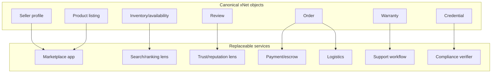

Likely business impacts:

- general-purpose marketplaces lose some lock-in but retain power through buyer attention and
  logistics quality;
- local and vertical markets become easier to launch;
- merchants can run direct relationships while still syndicating to multiple markets;
- reviews become more portable and more contested;
- marketplaces compete on guarantees and curation rather than exclusive data;
- pricing becomes more transparent in many categories;
- fraud detection becomes a federated service layer.

### Labor and professional work

xNet can turn portfolios, credentials, references, work samples, contracts, invoices, and project
history into portable professional graphs.

Possible effects:

- freelancers carry verified work history across platforms;
- employers can request scoped proof rather than scraped profiles;
- gig platforms cannot fully trap worker reputation;
- professional guilds can run credential hubs;
- teams can collaborate across companies without creating accounts in each other's SaaS;
- AI agents can assemble work packets, proposals, and compliance docs.

Risks:

- reputation lock-in shifts from platform to identity;
- workers may feel pressured to disclose too much history;
- reputation labels can encode bias;
- credential systems can exclude informal or marginalized workers;
- employers may demand invasive access grants.

Design implication:

xNet needs contextual, selective, revocable professional identity rather than one universal
reputation score.

### Collaboration and organizations

xNet's collaboration model can be stronger than cloud-only SaaS because it supports:

- offline continuity;
- local ownership;
- cross-org grants;
- event-sourced audit;
- schema-aware workflows;
- document and structured data sync;
- durable project memory;
- app switching.

This can change how organizations collaborate:

- suppliers and customers share a live order/project node rather than duplicating tickets;
- audits become grant-scoped evidence collection rather than zip-file exports;
- consultants bring reusable project templates and schemas;
- M&A integration becomes mapping namespaces and grants rather than extracting data from many SaaS
  APIs;
- work history persists after a vendor contract ends.

### Search and discovery

Search shifts from a default global monopoly to a layered fabric:

- local/private first;
- workspace and community second;
- public web and public xNet objects third;
- vertical indexes and lenses fourth;
- AI synthesis with citations on top.

The strongest xNet search differentiator is not "no one has a big index." It is:

- local/private context can be searched without disclosure;
- public results can be re-ranked by user/community lenses;
- schemas make vertical search much richer;
- results can include provenance, grants, and explanations;
- search providers can compete while using shared public data.

### Social and human relationships

xNet social could reduce hard platform lock-in, but it also increases the importance of context.

Human relationships are not one graph. They are many overlapping graphs:

- family;
- close friends;
- coworkers;
- industry peers;
- neighborhood;
- school;
- dating;
- creator/fan;
- civic;
- religious/community;
- caregiving;
- mutual aid.

xNet should support that multiplicity. A single global graph is too coarse and too dangerous.

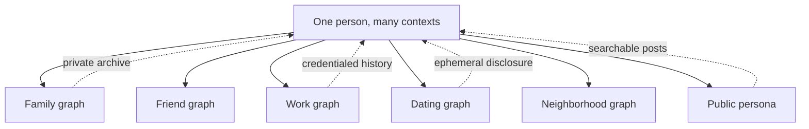

### Public knowledge

Federated Wikipedia-like systems can support:

- domain-specific editorial groups;
- linked claims and citations;
- stable public revisions;
- multilingual and local perspectives;
- machine-readable claims;
- public provenance;
- AI-citable knowledge.

But public knowledge needs institutions, not only software:

- editorial policy;
- review workflows;
- anti-vandalism;
- contributor onboarding;
- dispute resolution;
- licensing;
- public trust;
- funding.

xNet's advantage is that it can make public knowledge more structured, portable, and reviewable. It
cannot shortcut legitimacy.

### Software and infrastructure

Federated GitHub-like systems matter because software increasingly runs society.

xNet can help make code collaboration:

- less dependent on one forge;
- more resistant to platform policy shocks;
- more provenance-aware;
- easier to archive;
- easier to automate through agents;
- better connected to issues, packages, advisories, and funding.

But supply-chain security must be first-class. A decentralized package ecosystem without strong
signatures, provenance, namespace policy, and revocation would be worse than today's centralized
registries.

### Media, creators, and culture

Federated media can make culture less dependent on one recommendation system.

Possible shifts:

- creators own catalog and fan graph;
- fan communities mirror and preserve works;
- creators publish to many apps at once;
- niche curation improves;
- public archives improve;
- sponsorship and memberships become portable.

Risks:

- moderation gaps;
- copyright conflicts;
- harassment;
- expensive media delivery;
- unequal cache access;
- dominant recommendation app views still deciding attention.

### Finance, payments, and contracts

xNet does not need to be a cryptocurrency platform to change commerce.

The more important primitives are:

- signed invoices;
- signed quotes;
- escrow receipts;
- payment intents;
- delivery confirmations;
- warranty records;
- dispute evidence;
- subscription state;
- grant-scoped accounting access;
- audit logs.

Payments can integrate through existing rails while xNet holds the business objects and receipts.

Possible markets:

- escrow providers;
- invoice factoring;
- insurance;
- purchase protection;
- local credit;
- public procurement;
- automated bookkeeping.

Risks:

- financial fraud;
- KYC pressure;
- predatory scoring;
- regulatory fragmentation;
- privacy leaks through transaction graphs.

### Education and credentials

xNet-like infrastructure could make credentials portable:

- diplomas;
- microcredentials;
- apprenticeships;
- licenses;
- continuing education;
- portfolios;
- peer endorsements;
- project evidence.

This helps learners avoid platform lock-in. It also creates risk if credentials become surveillance
or exclusion tools.

The design challenge is to let people prove what they need without exposing everything.

## Options And Tradeoffs

### Option A: Pure peer-to-peer everywhere

**Shape:** every device participates directly in storage, sync, search, routing, and discovery.

Benefits:

- maximum ideological decentralization;
- fewer operator chokepoints;
- strong resilience for small private groups.

Costs:

- unreliable availability;
- weak global search and feeds;
- hard onboarding;
- hard moderation;
- hard mobile/battery constraints;
- hard compliance;
- poor media performance.

Best fit:

- private groups;
- local collaboration;
- small communities;
- disaster/offline environments.

Poor fit:

- global search;
- video;
- high-fanout social;
- public marketplaces;
- enterprise compliance.

### Option B: Layered hub federation

**Shape:** users own local data; hubs provide sync, backup, query, discovery, files, and federation;
specialized operators provide heavy services.

Benefits:

- practical performance;
- user data remains portable;
- operator plurality;
- understandable economics;
- better public services.

Costs:

- hubs become power centers;
- users need to choose or trust operators;
- public hubs need moderation and funding;
- federation policy is complex.

Best fit:

- xNet's current architecture;
- commerce;
- workspaces;
- public knowledge;
- social and search with replaceable app views.

### Option C: AT-style data hosts plus AppViews

**Shape:** canonical data hosts are separate from application-level AppViews, relays, and indexers.

Benefits:

- strong separation of ownership and reach;
- multiple AppViews can compete;
- users can switch AppViews without moving all data;
- useful model for social/search/market UX.

Costs:

- AppViews are expensive and may recentralize;
- relays can be bandwidth-heavy;
- app-specific semantics can fragment;
- data host migration still needs excellent UX.

Best fit:

- social;
- marketplaces;
- public feeds;
- search;
- dating and professional networks.

### Option D: Regulated portability bridge

**Shape:** large incumbents expose enough xNet-compatible interfaces to satisfy competition and data
portability demands.

Benefits:

- faster access to existing platform data;
- regulatory tailwinds;
- users can migrate gradually;
- businesses can avoid rip-and-replace.

Costs:

- incumbents can under-implement;
- APIs can be slow, limited, or unstable;
- legal compliance can dominate product quality;
- standards can become political battlegrounds.

Best fit:

- enterprise data migration;
- consumer data rights;
- app interoperability;
- public procurement.

### Option E: Vertical-first federations

**Shape:** xNet adoption starts in specific domains: local services, open source plugins, research
knowledge bases, farming/food supply chains, creator catalogs, professional credentials.

Benefits:

- easier schema consensus;
- clearer trust model;
- real user value;
- lower scale requirements;
- high-quality app views can emerge.

Costs:

- slower path to broad consumer mindshare;
- many domain-specific products;
- risk of isolated vertical islands.

Best fit:

- near-term xNet strategy.

## Recommendation

xNet should not try to sell "a federated everything internet" as the first product. That is too
abstract, too expensive, and too politically loaded.

The recommended strategy is:

### 1. Win on portable collaboration before global replacement narratives

The near-term wedge should be:

- local-first personal and team work;
- cross-organization collaboration;
- durable work history;
- scoped sharing and revocation;
- search across local and shared data;
- schema-backed workflows;
- plugins and AI agents.

This builds the muscle needed for commerce, social, wiki, and forge layers.

### 2. Make app-as-view concrete

Users and developers need to experience the difference:

- same data in two apps;
- same customer/order/project in multiple workflows;
- app removed without data loss;
- hub moved without app loss;
- lens changed without data migration.

Until this is visceral, the big vision will sound abstract.

### 3. Build reference schemas for federated business objects

Start with a small set of practical schemas:

- Organization;
- Person/Profile;
- ProductListing;
- ServiceListing;
- Availability;
- Quote;
- Order;
- Invoice;
- PaymentIntent;
- DeliveryEvent;
- Warranty;
- SupportTicket;
- Review;
- Credential;
- TrustLabel;
- TrustLens;
- DisputeCase.

Do not attempt to standardize the world at once. Pick one domain and prove the loop.

### 4. Treat lenses as first-class data

Search, feeds, markets, moderation, and trust all need portable policies.

xNet should model lenses as signed, shareable, inspectable nodes:

- search ranking lens;
- market ranking lens;
- social timeline lens;
- block/mute lens;
- allowlist lens;
- product safety lens;
- source credibility lens;
- local community lens;
- family safety lens;
- dating safety lens.

Users should be able to ask "why did I see this?" and "what lens ranked this?"

### 5. Build hub operator transparency before protocol payments

The hub economy exploration already reached the right conclusion: ship metering, quotas, plan
metadata, and operator transparency before inventing protocol-native settlement.

xNet should standardize hub capability metadata:

- storage quota;
- file limits;
- retention policy;
- federation policy;
- moderation policy;
- jurisdiction;
- contact;
- pricing URL;
- uptime history;
- supported schemas;
- supported app views;
- backup/export guarantees.

### 6. Make abuse and trust part of v1 federation

For wide adoption, abuse cannot be an afterthought.

Needed early:

- signed labels;
- reports;
- rate limits;
- operator policy metadata;
- appeal workflows;
- trust lens imports;
- abuse simulation tests;
- spam-resistant public search;
- marketplace fraud controls;
- package provenance checks;
- media takedown workflows.

### 7. Pilot in domains where portability has immediate value

Good pilots:

- xNet plugin marketplace and decentralized package/extension publication;
- local service marketplace for a city or professional guild;
- expert-run public knowledge base with citation and review workflows;
- creator catalog with portable membership and comments;
- cross-company project workspace for contractors and clients;
- regenerative farming/food supply chain provenance;
- open source forge metadata around existing Git repos.

Avoid first:

- general-purpose Twitter replacement;
- general-purpose YouTube replacement;
- global Amazon replacement;
- global Wikipedia replacement;
- global Google replacement.

Those are destination ecosystems, not first proof points.

## Implementation Checklist

- [ ] Define a schema presence index that records which schemas a user/org has data for, where it
      is replicated, and under what policy.
- [ ] Productize multi-hub sync policy so users can place personal, work, public, and community data
      on different hubs.
- [ ] Add hub capability metadata for quotas, supported schemas, federation policy, moderation
      policy, jurisdiction, pricing, contact, and uptime.
- [ ] Make grants and revocation understandable in the app through concrete "who can see/do what"
      explanations.
- [ ] Promote federated query routing from local-only client scaffolding toward multi-hub source
      selection with timeouts, partial results, and explainable provenance.
- [ ] Define a minimal reference schema pack for federated commerce: organization, listing, quote,
      order, invoice, warranty, review, credential, dispute, and trust label.
- [ ] Define a minimal reference schema pack for public knowledge: claim, citation, review,
      article, revision, editorial policy, and publication lane.
- [ ] Define a minimal reference schema pack for forge collaboration: repository, issue, patch,
      review, release, package, advisory, attestation, mirror, and maintainer role.
- [ ] Make lenses first-class signed nodes with clear input data, ranking/label rules, publisher,
      version, and audit trail.
- [ ] Add marketplace/search/social result explanations that show source hubs, ranking lenses,
      labels, and grants involved.
- [ ] Build a small federated market prototype across at least three hubs and two app views.
- [ ] Build a cross-organization collaboration demo where a client, contractor, and auditor share
      scoped nodes without joining one SaaS tenant.
- [ ] Build hub migration UX: move data from one hub to another and prove app continuity.
- [ ] Add abuse simulation fixtures for fake listings, fake reviews, fake credentials, and spam
      comments.
- [ ] Add provenance and signature checks for plugin/package publication before marketplace growth.
- [ ] Add public publishing lanes for stable, citeable revisions of documents and knowledge nodes.
- [ ] Create operator docs for running home hubs, community hubs, search hubs, media hubs, and label
      services.
- [ ] Create user-facing docs explaining app-as-view, hubs, grants, lenses, and migration in normal
      language.

## Validation Checklist

- [ ] A user can create data locally, sync to one hub, migrate to another hub, and keep using the
      same app without data loss.
- [ ] Two apps can operate over the same canonical node data without one app owning the data.
- [ ] A federated query across three hubs returns partial results if one hub is unavailable and
      clearly marks source/provenance.
- [ ] Permission revocation removes access for an active collaborator and prevents stale remote
      query results.
- [ ] A public listing can be discovered through two different marketplace views with different
      ranking lenses.
- [ ] A fake-review attack is caught or downgraded by at least one trust lens and visible in result
      explanations.
- [ ] A business can issue a signed quote, buyer can accept it, payment service can attach a receipt,
      and both sides retain their own local copies.
- [ ] A creator can move media metadata/community state between hubs while preserving catalog
      identity and fan subscriptions.
- [ ] A public knowledge claim can show citation provenance, review status, and stable published
      revision.
- [ ] A forge object can preserve issue/review/release state independent of one Git hosting site.
- [ ] A family/private group can share data with expiring grants and verify revocation behavior.
- [ ] A dating/social profile can expose different fields to different contexts without accidental
      correlation in search.
- [ ] Hub operator metadata is machine-readable and displayed clearly in app onboarding.
- [ ] Abuse reports and moderation labels can cross hubs without granting labelers write access to
      canonical user data.
- [ ] Search and feed results include enough explanation for users to understand which lens or app
      view shaped them.

## Example Code

The following code is illustrative. It sketches how a federated commerce and trust-lens schema pack
could be expressed in xNet style. The exact property imports and schema conventions should be
aligned with the current `@xnetjs/data/schema` entrypoints before implementation.

```typescript
import { defineSchema, text, number, select, relation, person, date } from '@xnetjs/data/schema'

export const OrganizationSchema = defineSchema({
  name: 'Organization',
  namespace: 'xnet://xnet.fyi/market/',
  properties: {
    title: text({ required: true }),
    homepage: text({}),
    publicProfile: text({ multiline: true }),
    operatorHub: text({}),
    verifiedBy: relation({ multiple: true })
  }
})

export const ServiceListingSchema = defineSchema({
  name: 'ServiceListing',
  namespace: 'xnet://xnet.fyi/market/',
  properties: {
    title: text({ required: true }),
    provider: relation({ schema: 'xnet://xnet.fyi/market/Organization' }),
    category: text({ required: true }),
    description: text({ multiline: true }),
    serviceArea: text({}),
    basePrice: number({}),
    currency: select({
      options: [
        { id: 'USD', name: 'USD' },
        { id: 'EUR', name: 'EUR' },
        { id: 'GBP', name: 'GBP' }
      ] as const,
      default: 'USD'
    }),
    availabilityPolicy: relation({}),
    credentials: relation({ multiple: true }),
    publicUntil: date({})
  }
})

export const TrustLabelSchema = defineSchema({
  name: 'TrustLabel',
  namespace: 'xnet://xnet.fyi/trust/',
  properties: {
    target: relation({ required: true }),
    targetSchema: text({}),
    labeler: person({ required: true }),
    labelType: select({
      options: [
        { id: 'verified', name: 'Verified' },
        { id: 'complaint', name: 'Complaint' },
        { id: 'blocked', name: 'Blocked' },
        { id: 'sponsored', name: 'Sponsored' },
        { id: 'needs-review', name: 'Needs review' }
      ] as const,
      required: true
    }),
    reason: text({ multiline: true }),
    evidence: relation({ multiple: true }),
    expiresAt: date({})
  }
})

export const TrustLensSchema = defineSchema({
  name: 'TrustLens',
  namespace: 'xnet://xnet.fyi/trust/',
  properties: {
    title: text({ required: true }),
    publisher: person({ required: true }),
    description: text({ multiline: true }),
    includesLabelsFrom: relation({ multiple: true }),
    rankingPolicy: text({ required: true, multiline: true }),
    version: text({ required: true })
  }
})
```

A market query should stay functional and explicit about partial results:

```typescript
type MarketSource = {
  id: string
  hubDid: string
  estimatedLatencyMs: number
}

type MarketResult = {
  nodeId: string
  title: string
  providerId: string
  sourceHub: string
  labels: string[]
  score: number
}

type MarketQuery = {
  text: string
  category?: string
  serviceArea?: string
  limit: number
}

type MarketQueryOutcome = {
  results: MarketResult[]
  partial: boolean
  failedSources: string[]
}

export async function queryFederatedMarket(input: {
  sources: MarketSource[]
  query: MarketQuery
  route: (source: MarketSource, query: MarketQuery) => Promise<MarketResult[]>
  applyLens: (results: MarketResult[]) => MarketResult[]
}): Promise<MarketQueryOutcome> {
  const settled = await Promise.allSettled(
    input.sources.map(async (source) => ({
      source,
      results: await input.route(source, input.query)
    }))
  )

  const successes = settled.flatMap((item) => (item.status === 'fulfilled' ? [item.value] : []))
  const failedSources = settled.flatMap((item, index) =>
    item.status === 'rejected' ? [input.sources[index]?.id ?? `source-${index}`] : []
  )

  const deduped = new Map<string, MarketResult>()

  for (const success of successes) {
    for (const result of success.results) {
      const existing = deduped.get(result.nodeId)
      if (!existing || result.score > existing.score) {
        deduped.set(result.nodeId, result)
      }
    }
  }

  return {
    results: input.applyLens(Array.from(deduped.values())).slice(0, input.query.limit),
    partial: failedSources.length > 0,
    failedSources
  }
}
```

The key product requirement is not this exact code. It is the contract:

- sources are explicit;
- failed sources are visible;
- ranking/lens logic is separate from retrieval;
- results carry provenance;
- users can understand why something appeared.

## Strategic Architecture For A Federated Everything xNet

The broad system can be modeled as five planes:

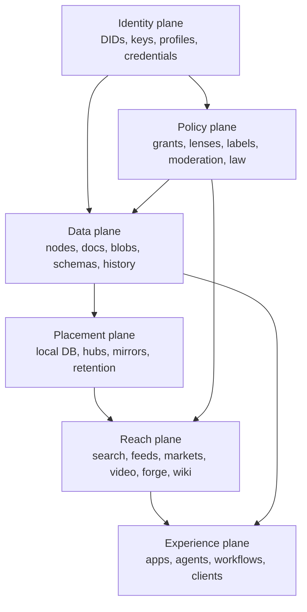

The most important design rule:

**never let the reach plane become the canonical data plane.**

Search, social timelines, marketplace rankings, video recommendations, wiki consensus pages, and
GitHub-like popularity metrics should be derived views. They can be powerful, expensive, and
commercially valuable, but users and organizations need the ability to rebuild, replace, fork, or
exit them.

## Failure Modes To Watch Closely

### Default capture

One app view becomes so good that everyone uses it. It does not own data, but it owns attention,
ranking, and norms.

Mitigation:

- export/import lenses;
- explainable ranking;
- app view switching UX;
- open APIs for competing app views;
- operator transparency;
- public-interest defaults.

### Schema capture

One company or consortium controls critical schemas.

Mitigation:

- open schema governance;
- versioned compatibility;
- migration tools;
- multiple authorities;
- schema linting and review;
- adapters and lenses.

### Trust cartel

A small number of labelers or reputation services define who is safe, visible, employable,
dateable, or commercially credible.

Mitigation:

- contextual labels;
- appeals;
- plural label sources;
- user-visible label provenance;
- legal constraints in high-stakes domains;
- anti-discrimination policy.

### Moderation overload

Public hubs and app views face spam, harassment, fraud, CSAM, scams, and legal requests faster than
they can respond.

Mitigation:

- rate limits;
- signed labels;
- shared abuse intelligence;
- hub policy metadata;
- automated triage;
- community moderation tools;
- funding for trust and safety;
- federation-level emergency brakes.

### Data over-disclosure

Users grant too much access because the UX is unclear.

Mitigation:

- grant previews;
- expiry defaults;
- least-privilege templates;
- audit log;
- "why does this app need this?" explanations;
- one-click revoke;
- sensitive context separation.

### Reputational coercion

People are pressured to make private history portable across work, dating, housing, lending, and
community access.

Mitigation:

- contextual identity;
- selective disclosure;
- zero-knowledge or minimal credentials where appropriate;
- domain boundaries;
- policy restrictions on high-stakes reuse;
- personal safety defaults.

### Infrastructure inequality

Wealthy regions, languages, companies, and creators get better hubs, caches, and indexes.

Mitigation:

- public-good funding;
- co-op hubs;
- open source operator stacks;
- regional index programs;
- language/community grants;
- portable migration away from failing hubs.

## Next Actions

1. Pick one practical pilot domain where xNet can prove app-as-view and federated commerce or
   collaboration without needing planetary scale.
2. Define the minimum schema pack for that pilot and keep it intentionally small.
3. Build a multi-hub demo where two app views operate over the same canonical data.
4. Make lenses visible in the UX early, even if the first lens is simple.
5. Add operator metadata for hubs before public federation expands.
6. Run abuse simulations before inviting broad public write access.
7. Treat public knowledge, search, video, and GitHub-like forge layers as sequential expansions
   after the data, grant, schema, and hub substrate is demonstrably reliable.

## References

### Local xNet references

- [`README.md`](../../README.md)
- [`docs/VISION.md`](../VISION.md)
- [`docs/ROADMAP.md`](../ROADMAP.md)
- [`packages/hub/README.md`](../../packages/hub/README.md)
- [`packages/query/README.md`](../../packages/query/README.md)
- [`packages/plugins/README.md`](../../packages/plugins/README.md)
- [`packages/data/src/store/store.ts`](../../packages/data/src/store/store.ts)
- [`packages/data/src/auth/store-auth.ts`](../../packages/data/src/auth/store-auth.ts)
- [`packages/data/src/schema/schemas/comment.ts`](../../packages/data/src/schema/schemas/comment.ts)
- [`packages/data/src/schema/schemas/reaction.ts`](../../packages/data/src/schema/schemas/reaction.ts)
- [`packages/core/src/federation.ts`](../../packages/core/src/federation.ts)
- [`packages/query/src/federation/router.ts`](../../packages/query/src/federation/router.ts)
- [`packages/query/src/search/document.ts`](../../packages/query/src/search/document.ts)
- [`packages/hub/src/services/query.ts`](../../packages/hub/src/services/query.ts)
- [`packages/hub/src/services/federation.ts`](../../packages/hub/src/services/federation.ts)
- [`0023_[_]_DECENTRALIZED_SEARCH.md`](./0023_[_]_DECENTRALIZED_SEARCH.md)
- [`0091_[_]_GLOBAL_SCHEMA_FEDERATION_MODEL.md`](./0091_[_]_GLOBAL_SCHEMA_FEDERATION_MODEL.md)
- [`0110_[_]_XNET_AS_A_VIABLE_WIKIPEDIA_ALTERNATIVE.md`](./0110_[_]_XNET_AS_A_VIABLE_WIKIPEDIA_ALTERNATIVE.md)
- [`0115_[_]_ARCHITECTING_FULLY_DECENTRALIZED_GLOBAL_WEB_SEARCH.md`](./0115_[_]_ARCHITECTING_FULLY_DECENTRALIZED_GLOBAL_WEB_SEARCH.md)
- [`0116_[_]_ARCHITECTING_DECENTRALIZED_TWITTER_X_ON_XNET.md`](./0116_[_]_ARCHITECTING_DECENTRALIZED_TWITTER_X_ON_XNET.md)
- [`0118_[_]_ARCHITECTING_A_DECENTRALIZED_OSS_FORGE_ON_XNET.md`](./0118_[_]_ARCHITECTING_A_DECENTRALIZED_OSS_FORGE_ON_XNET.md)
- [`0131_[_]_FEDERATED_DECENTRALIZED_VIDEO_PLATFORM_LIKE_YOUTUBE_OR_INSTAGRAM.md`](./0131_[_]_FEDERATED_DECENTRALIZED_VIDEO_PLATFORM_LIKE_YOUTUBE_OR_INSTAGRAM.md)
- [`0132_[_]_ECONOMIC_MODELS_FOR_HOSTING_FEDERATED_HUBS.md`](./0132_[_]_ECONOMIC_MODELS_FOR_HOSTING_FEDERATED_HUBS.md)
- [`0140_[x]_SPAM_AND_ABUSE_MITIGATION_AUTOMATED_API_ACROSS_THE_NETWORK.md`](./0140_[x]_SPAM_AND_ABUSE_MITIGATION_AUTOMATED_API_ACROSS_THE_NETWORK.md)

### External references

- [ActivityPub - W3C Recommendation](https://www.w3.org/TR/activitypub/)
- [AT Protocol specification](https://atproto.com/specs/atp)
- [AT Protocol self-hosting guide](https://atproto.com/guides/self-hosting)
- [AT Protocol sync guide](https://atproto.com/guides/sync)
- [Matrix specification](https://spec.matrix.org/)
- [Matrix.org homeserver pricing](https://matrix.org/homeserver/pricing/)
- [Introducing premium accounts to fund the matrix.org homeserver](https://matrix.org/blog/2025/06/funding-homeserver-premium/)
- [Solid Project](https://solidproject.org/)
- [Solid FAQ](https://solidproject.org/faqs)
- [IPFS docs](https://docs.ipfs.tech/)
- [IPFS persistence docs](https://docs.ipfs.tech/concepts/persistence/)
- [PeerTube ActivityPub documentation](https://docs.joinpeertube.org/api/activitypub)
- [Mastodon: running your own server](https://docs.joinmastodon.org/user/run-your-own/)
- [Mastodon moderation actions](https://docs.joinmastodon.org/admin/moderation/)
- [Wikibase](https://wikiba.se/)
- [MediaWiki patrolling help](https://www.mediawiki.org/wiki/Help:Patrolling)
- [OpenStreetMap about page](https://www.openstreetmap.org/about/eng)
- [European Commission: Digital Markets Act](https://digital-markets-act.ec.europa.eu/index_en)
- [European Commission: DMA and fair/open digital markets](https://commission.europa.eu/strategy-and-policy/priorities-2019-2024/europe-fit-digital-age/digital-markets-act-ensuring-fair-and-open-digital-markets_en)
- [OECD: Data Portability, Interoperability and Competition](https://www.oecd.org/en/publications/data-portability-interoperability-and-competition_73a083a9-en.html)
- [Common Crawl](https://commoncrawl.org/)
- [SearXNG](https://searxng.org/)
- [YaCy](https://www.yacy.net/)
- [Brave Search](https://brave.com/search/)
- [Radicle](https://radicle.dev/)
- [ForgeFed specification](https://forgefed.org/spec)
- [Sigstore documentation](https://docs.sigstore.dev/)
- [OpenSSF SLSA 1.0 release](https://openssf.org/press-release/2023/04/19/openssf-announces-slsa-version-1-0-release/)
- [Ink & Switch: Local-first software](https://www.inkandswitch.com/essay/local-first/)
- [Automerge](https://automerge.org/)
