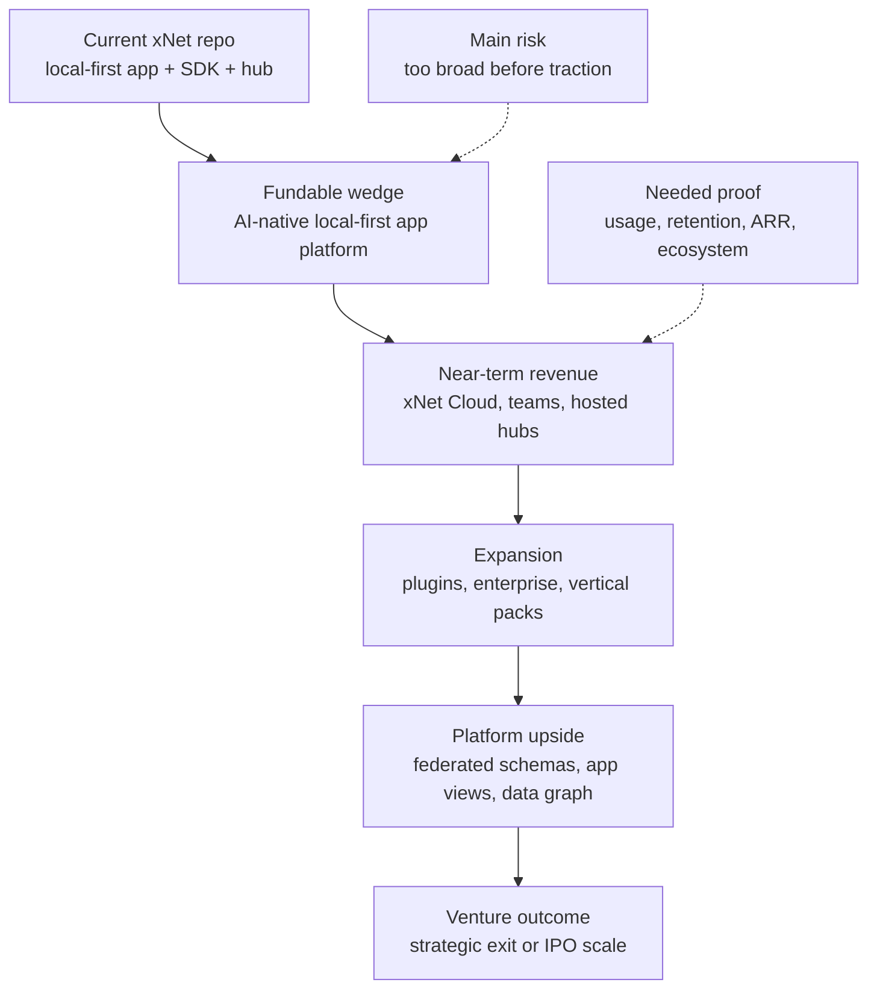
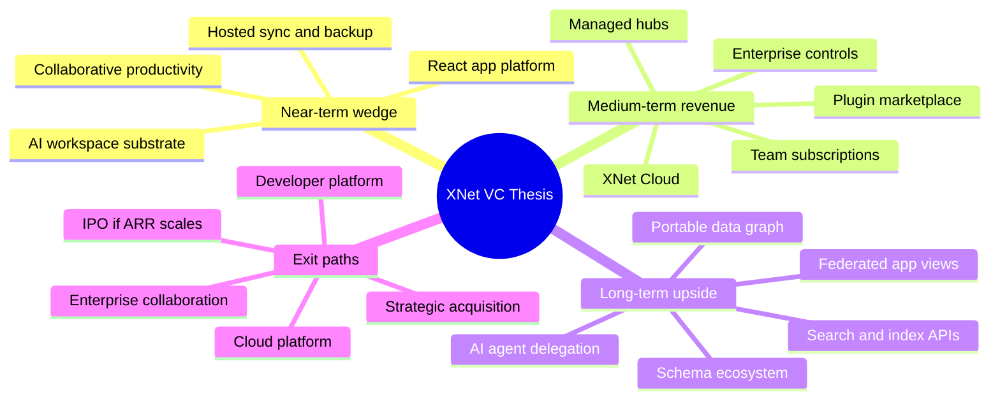
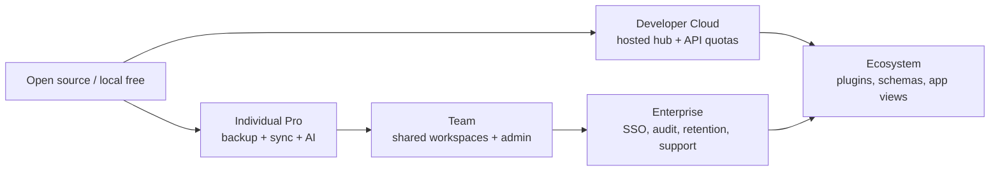
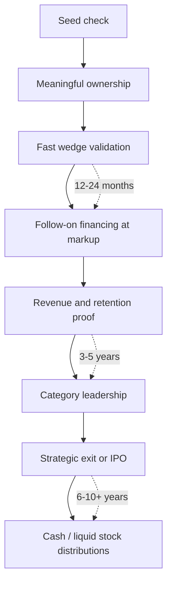
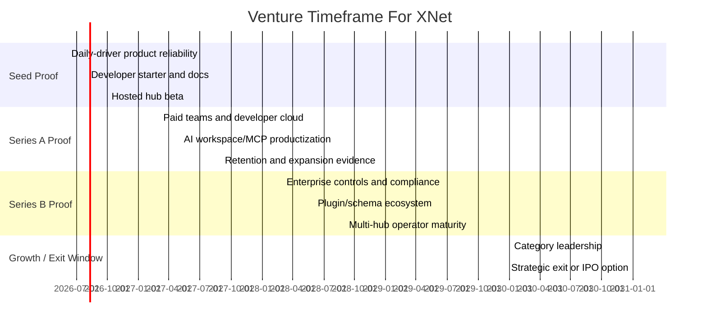
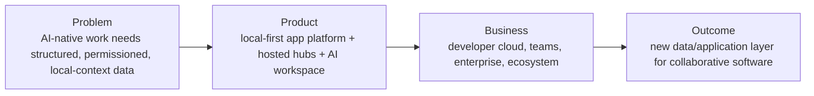

# 0142 - Why Might VCs Invest In xNet?

> **Status:** Exploration  
> **Date:** 2026-06-03  
> **Author:** Codex  
> **Tags:** venture-capital, fundraising, strategy, returns, timelines, developer-tools, ai, local-first, cloud, enterprise, federation

## Problem Statement 💸

Why might venture capitalists invest in xNet? What makes it compelling for venture-scale returns,
and on what timeframes?

This question needs a blunt answer. "A decentralized data layer for a new internet" is interesting,
but not automatically venture-backable. VCs do not fund architecture diagrams. They fund ownership
in a company that might plausibly become worth billions of dollars within a fund return window.

The useful question is narrower:

> Can xNet plausibly become a venture-scale company fast enough to matter for a seed, Series A, or
> early growth investor, while still preserving the long-range local-first and federated internet
> vision?

This exploration evaluates how xNet maps to venture return math, why the timing might be attractive
in 2026, which wedges are most fundable, what evidence investors would need at each stage, and
where the thesis is weak.

This is strategic analysis, not investment advice or a fundraising memo.

## Exploration Status

- [x] Determine next exploration number and create the target filename
- [x] Fast-forward local `main` before writing
- [x] Review current xNet README, vision, roadmap, package lifecycle, hub, React, and plugin docs
- [x] Review adjacent explorations on global xNet adoption, hub economics, developer tooling, AI,
      enterprise readiness, and post-open-source priorities
- [x] Research current VC market mechanics, AI software spend, strategic exits, public software
      multiples, data portability regulation, and federation precedents
- [x] Synthesize a venture thesis, counter-thesis, return model, and staged milestones
- [x] Include mermaid diagrams, checklists, example code, and references

## Executive Summary 🎯

VCs might invest in xNet because it sits at the intersection of several large investable shifts:

1. **AI is forcing every company to reorganize its data layer.** Useful agents need secure,
   structured, permissioned, local/contextual access to work data.
2. **Developer tools and infrastructure can produce very large outcomes.** Strategic buyers have
   paid billions for developer platforms, collaboration systems, automation, integration, and cloud
   infrastructure.
3. **Local-first collaboration is moving from ideology to product need.** Offline, privacy,
   latency, data ownership, and resilience matter more as work becomes AI-assisted and distributed.
4. **Regulators are pushing portability and interoperability.** xNet's user-owned data, schema, and
   hub model lines up with a direction governments already want.
5. **xNet has multiple revenue layers.** Hosted hubs, team subscriptions, developer cloud,
   enterprise controls, plugins, AI workspace services, and future app-view ecosystems can all
   compound.
6. **The repo is unusually broad for an early platform.** It already contains web, Electron, Expo,
   local-first data, sync, schemas, hub, search, plugin, MCP, AI, canvas, editor, views, telemetry,
   history, and package lifecycle machinery.

The best venture framing is not:

> "xNet decentralizes everything."

The best venture framing is:

> **xNet is the local-first, AI-native application platform for building collaborative software
> where users and organizations own the data, developers get React-style primitives, and hosted hubs
> provide the operational cloud layer.**

That gives investors a near-term wedge and long-term upside:

- **Near-term wedge:** developer platform plus hosted sync, backup, search, and AI workspace
  services for collaborative productivity apps.
- **Medium-term expansion:** xNet Cloud for teams, agencies, internal tools, and enterprise data
  workspaces.
- **Long-term platform upside:** federated app views, plugins, AI agents, schema ecosystems, and
  data/network effects around portable work graphs.

The venture case becomes strong only if xNet proves three things quickly:

1. **Product pull:** developers or teams choose xNet because it saves real time or unlocks a product
   they cannot easily build with Firebase, Supabase, Convex, Jazz, Liveblocks, or Notion-style
   stacks.
2. **Revenue pull:** hosted hub or team subscriptions convert users into recurring revenue without
   requiring a giant services motion.
3. **Platform pull:** third-party schemas, plugins, AI workflows, or hub operators create leverage
   beyond one productivity app.

The biggest risk is that xNet is too broad and too early. Venture capital rewards focused
compounding, not maximum surface area. If xNet pitches local-first docs, distributed search,
federated social, video, GitHub, Wikipedia, ERP, AI agents, and enterprise compliance all at once,
investors will hear "scope risk." If xNet pitches a tight wedge with credible expansion options, it
becomes much more investable.



## Current State In The Repository

### What xNet already has

The root [`README.md`](../../README.md) positions xNet as decentralized data infrastructure and an
application: local-first, P2P-synced, user-owned data. It starts with documents and databases, then
expands through plugins to ERP, MCP integrations, and more.

This is not only a whitepaper. The repo includes:

| Surface                    | Current state                                                                               | VC relevance                             |
| -------------------------- | ------------------------------------------------------------------------------------------- | ---------------------------------------- |
| Apps                       | Electron, Web PWA, Expo                                                                     | Product path, not just protocol code     |
| React runtime              | `XNetProvider`, `useQuery`, `useMutate`, `useNode`, identity hooks                          | Clear developer-tool wedge               |
| Data layer                 | schemas, NodeStore, Yjs documents, stable data/store entrypoints                            | Differentiated local-first kernel        |
| Hub                        | signaling, sync relay, backup, files, FTS5, schema registry, federation, sharding, crawling | Hosted revenue and operator layer        |
| Plugins                    | registry, contributions, sandbox, AI script generation, Local API, MCP server               | Marketplace and AI-platform upside       |
| Devtools/history/telemetry | debug panels, audit, undo, time machine, privacy-preserving telemetry                       | Enterprise/developer trust story         |
| Lifecycle docs             | stable/mixed/experimental entrypoint matrix                                                 | Evidence of platform maturity discipline |

[`docs/ROADMAP.md`](../ROADMAP.md) helps the investment case because it shows sequencing discipline.
It says the near-term focus is product reliability, collaboration/trust, and platform clarity, while
deferring planet-scale infrastructure and marketplace-scale plugins until after daily-driver
reliability and multi-hub operator maturity.

### The fundable wedge from local docs

The strongest local strategic document for fundraising is
[`0119_[_]_XNET_AS_A_COMPELLING_WEB_AND_MOBILE_DEVELOPER_TOOL.md`](./0119_[_]_XNET_AS_A_COMPELLING_WEB_AND_MOBILE_DEVELOPER_TOOL.md).
Its main conclusion is that xNet should stop leading with generalized future-internet substrate and
instead become:

> the best way for React and Expo teams to build local-first collaborative productivity SaaS.

That is much more venture-legible than "decentralized internet." It maps to known budgets:
developer tools, collaborative work software, hosted cloud infrastructure, AI-assisted workbenches,
and enterprise knowledge workflows.

### Hub economics already map to venture revenue

[`0132_[_]_ECONOMIC_MODELS_FOR_HOSTING_FEDERATED_HUBS.md`](./0132_[_]_ECONOMIC_MODELS_FOR_HOSTING_FEDERATED_HUBS.md)
argues that hubs should become a layered service economy:

- home hubs for sync, backup, identity availability, and small-file hosting;
- community hubs for public surfaces, moderation, and local discovery;
- backbone hubs for search, crawlers, feed generation, media caches, and public APIs;
- specialist services for label feeds, search verticals, archive pinning, compliance, and creator
  tools.

For a VC, this matters because open-source protocols often struggle with value capture. Hosted hubs
give xNet direct monetization:

- per-user storage and sync plans;
- team workspace subscriptions;
- managed hub hosting;
- query/search/index usage;
- backup retention;
- compliance/admin controls;
- premium AI workspace services;
- marketplace or plugin revenue share later.

### AI integration creates the current-market narrative

[`0138_[x]_AI_DEEP_INTEGRATION_WITH_PAGES_DATABASES_CANVASES.md`](./0138_[x]_AI_DEEP_INTEGRATION_WITH_PAGES_DATABASES_CANVASES.md)
argues that xNet should become both an AI-readable vault and an AI-controllable application.

This is probably the most timely venture angle:

- AI agents need structured, permissioned access to real user and company data.
- xNet already has typed schemas, Local API, MCP direction, pages, databases, canvases, plugins,
  NodeStore, and rich audit/history primitives.
- Local-first data reduces the "upload everything to a model vendor" concern.
- xNet can become a workspace substrate where agents operate through scoped grants and reviewable
  mutation plans.

### Enterprise readiness is plausible but not done

[`0128_[_]_COULD_XNET_EVER_BE_MADE_SOC_2_OR_GDPR_OR_ANY_OTHER_KIND_OF_COMPLIANT_AND_ENTERPRISE_FRIENDLY.md`](./0128_[_]_COULD_XNET_EVER_BE_MADE_SOC_2_OR_GDPR_OR_ANY_OTHER_KIND_OF_COMPLIANT_AND_ENTERPRISE_FRIENDLY.md)
concludes that xNet has strong compliance-relevant primitives but is not yet enterprise compliant.

Positive primitives include DID identity and UCAN delegation, signed changes, hash chains,
schema-level authorization, grant issuance and revocation, content-addressed blobs, encrypted
backups, telemetry consent, and audit/history layers.

Missing pieces include org tenancy, SSO/SCIM, centralized audit event schemas, DSAR workflows,
retention/legal hold, admin controls, evidence automation, DPA/sub-processor apparatus, and
customer-managed keys.

For venture, this means enterprise revenue is plausible but should be staged. It is not the seed
pitch unless a specific enterprise design partner is already pulling.

### Current limitations that matter to investors

Observed limitations:

- Several public packages are marked `Mixed` or `Experimental` in
  [`docs/reference/api-lifecycle-matrix.md`](../reference/api-lifecycle-matrix.md).
- `@xnetjs/react/database`, `@xnetjs/data/database`, `@xnetjs/data/auth`, and
  `@xnetjs/data-bridge` are still converging.
- Multi-hub federation exists in pieces, not yet a complete operator story.
- Expo/mobile parity is not yet the strongest surface.
- Hub economics are not billing-grade yet.
- Planet-scale search/social/video/wiki/forge scenarios are explorations, not current product.

This does not kill the venture case. It means the fundraising story should be stage-appropriate:

- seed: product insight plus kernel plus early usage;
- Series A: repeatable developer/team adoption plus hosted revenue;
- Series B: platform expansion plus enterprise readiness;
- growth: broad ecosystem, net retention, and multi-product revenue.

## External Research

### VC market mechanics in 2026

The current VC market is both hot and selective.

NVCA's Q1 2026 PitchBook-NVCA Venture Monitor says Q1 set new highs for venture dealmaking and
exits, with $267.2B in deal value and $347.3B in exit value. But it also says those headline
numbers are highly concentrated: without the five largest deals and exits, the figures fall sharply,
liquidity is still tight, AI dominates, and many investors still see single-digit IRRs and sub-1x
distributions as the norm. Source:
[PitchBook-NVCA Venture Monitor](https://nvca.org/pitchbook-nvca-venture-monitor/).

NVCA's 2026 Yearbook describes a two-layer venture market: $320B deployed in 2025, 65.4% of deal
value in AI, only $67B in VC fundraising, and 859 active unicorns with aggregate valuation of
$4.34T waiting for liquidity. Source: [2026 NVCA Yearbook](https://nvca.org/2026-nvca-yearbook/).

Implication for xNet:

- Investors have capital for AI/software platform companies.
- They are also more skeptical of broad narratives without evidence.
- A credible xNet pitch needs to show why it can become one of the concentrated winners, not merely
  part of the "interesting infrastructure" crowd.

### Fund return math and timing

Carta's Q4 2025 VC Fund Performance report highlights how top-performing funds pull away from the
median. In the 2019 vintage, Carta reports 90th percentile TVPI at 3.01x, 75th percentile at 1.9x,
median at 1.33x, and 25th percentile at 1.02x. It also reports large dry powder in recent vintages,
including 72% of 2025 vintage capital remaining unspent at year-end. Source:
[Carta Q4 2025 VC Fund Performance](https://carta.com/data/vc-fund-performance-q4-2025/).

Implication for xNet:

- VCs are hunting for outliers because median outcomes are not enough.
- A seed-stage investment has to plausibly return the fund or materially move it.
- xNet needs a credible route to a multi-billion-dollar outcome, even if the first product is
  narrower.

Typical VC fund structures intensify this point. A fund generally invests during the first several
years, then needs exits and distributions over the following years. That means a seed investor in
2026 is usually underwriting meaningful liquidity somewhere in the early-to-mid 2030s, with
extensions possible but not a plan.

### AI software spend is the near-term platform shift

Menlo Ventures' 2025 enterprise AI report estimates companies spent $37B on generative AI in 2025,
up from $11.5B in 2024. It says $19B went to user-facing AI products and software, and coding became
a major departmental AI use case. Source:
[Menlo Ventures State of Generative AI in the Enterprise](https://menlovc.com/perspective/2025-the-state-of-generative-ai-in-the-enterprise/).

Bessemer's State of AI 2025 maps AI roadmaps across infrastructure, developer tools, horizontal AI,
vertical AI, and consumer, and argues AI has created a new mode of software development. Source:
[Bessemer State of AI 2025](https://www.bvp.com/atlas/the-state-of-ai-2025).

Battery Ventures' State of OpenCloud frames AI as a supercycle comparable to mobile and cloud, while
warning that enterprise deployment still has a gap between expectations and reality. Source:
[Battery State of OpenCloud 2024](https://www.battery.com/blog/opencloud-2024/).

Implication for xNet:

- The best time to build a new data/application substrate is when a new compute and UX platform
  changes what software needs from data.
- AI agents need structured data, permissions, local/private context, audit trails, and reliable
  write paths.
- xNet can pitch itself as the substrate that makes AI useful on real work data without handing all
  canonical state to one model provider.

### Developer platforms and collaboration exits can be large

Strategic acquirers have repeatedly paid large prices for developer, collaboration, and
infrastructure platforms:

- Microsoft announced it would acquire GitHub for $7.5B in 2018. Source:
  [Microsoft/GitHub announcement](https://news.microsoft.com/2018/06/04/microsoft-to-acquire-github-for-7-5-billion/).
- IBM announced a $6.4B enterprise value acquisition of HashiCorp in 2024. Source:
  [IBM/HashiCorp announcement](https://newsroom.ibm.com/2024-04-24-IBM-to-Acquire-HashiCorp-Inc-Creating-a-Comprehensive-End-to-End-Hybrid-Cloud-Platform).
- Salesforce announced a $27.7B enterprise value acquisition of Slack in 2020. Source:
  [Salesforce/Slack announcement](https://www.salesforce.com/news/press-releases/2020/12/01/salesforce-definitive-agreement-update/).
- Salesforce announced a $6.5B enterprise value acquisition of MuleSoft in 2018. Source:
  [Salesforce/MuleSoft announcement](https://investor.salesforce.com/news/news-details/2018/Salesforce-Signs-Definitive-Agreement-to-Acquire-MuleSoft/default.aspx).

Implication for xNet:

- Strategic buyers understand the value of developer ecosystems, integration layers, collaboration
  systems, and infrastructure control planes.
- xNet's long-term acquirer universe is not only productivity app companies. It could include cloud
  providers, developer platforms, enterprise collaboration suites, AI platform companies, database
  vendors, security/compliance vendors, and open-source infrastructure buyers.

### Interoperability and portability are regulatory tailwinds

The European Commission describes the Digital Markets Act as a law to make digital markets fairer
and more contestable, with rules for gatekeepers such as search engines, app stores, and messenger
services. Source: [European Commission Digital Markets Act](https://digital-markets-act.ec.europa.eu/index_en).

The OECD paper on Data Portability, Interoperability and Competition says portability and
interoperability measures can promote competition within and among digital platforms. Source:
[OECD Data Portability, Interoperability and Competition](https://www.oecd.org/en/publications/data-portability-interoperability-and-competition_73a083a9-en.html).

Implication for xNet:

- xNet aligns with a policy direction that wants lower switching costs and more competitive digital
  markets.
- This can help enterprise/government adoption and long-term strategic positioning.
- It does not remove the need for product-market fit.

### Federation precedents validate the shape but expose operating costs

Several external precedents support pieces of the xNet model:

- [Solid](https://solidproject.org/) frames user data control around Pods and app interoperability.
- [AT Protocol self-hosting docs](https://atproto.com/guides/self-hosting) distinguish data hosting
  from bandwidth-intensive relays and resource-intensive AppViews.
- [ActivityPub](https://www.w3.org/TR/activitypub/) is a W3C Recommendation for decentralized social
  networking.
- [Mastodon server docs](https://docs.joinmastodon.org/user/run-your-own/) show that self-hosted
  federation still requires moderation, operations, and community management.

Implication for xNet:

- The architecture is not fantasy. The market has seen parts of it.
- The business model must account for operations. Federation does not eliminate cost; it changes
  who pays and who controls policy.

## Key Findings 🔎

### 1. The strongest VC case is platform, not app

xNet can look like several companies:

- a local-first Notion/Airtable/Linear-style app;
- a React developer framework;
- a hosted sync/backup/search cloud;
- a decentralized/federated protocol;
- a plugin marketplace;
- an AI workspace substrate;
- an enterprise data governance system.

The most venture-compelling interpretation is:

> **xNet is a platform company that starts as a developer/productivity tool and compounds into a
> hosted cloud and ecosystem.**

A pure app can be valuable, but it may not justify the technical breadth. A pure protocol can be
important, but may struggle with value capture. A platform wedge with hosted revenue can plausibly
support venture returns.



### 2. xNet needs an expansion path beyond notes

A local-first note app alone is not enough. A good notes/docs product can become a strong business,
but the venture case needs credible expansion into larger budget categories:

- team collaboration;
- internal tools;
- developer applications;
- enterprise knowledge;
- AI agents;
- data governance;
- app backend/platform;
- marketplace/plugin ecosystems;
- hosted infrastructure.

The repo supports this expansion path because it already includes pages, databases, canvas, schemas,
sync, hub, plugins, MCP, AI generation, history, telemetry, search, and vectors.

The risk is that breadth turns into distraction. The fundraising narrative should show expansion
sequence, not simultaneous execution.

### 3. xNet has a plausible "why now"

The "why now" is not decentralization by itself. It is the combination of:

- AI agents needing trustworthy data/action substrates;
- local-first becoming more practical with SQLite/OPFS, CRDTs, and browser capabilities;
- developers wanting fewer backend vendors for collaborative apps;
- enterprises worrying about data exposure to AI platforms;
- regulators pressing for portability and interoperability;
- incumbents bundling more AI into closed work suites;
- open-source developer workflows increasingly mediated by agents.

xNet can position itself as the answer to this problem:

> The AI era needs an application data layer that is local-first, schema-aware, permissioned,
> auditable, and still cloud-operable.

### 4. The near-term business model can be boring, which is good

The most investable revenue is not a future protocol token or speculative network fee. It is:

- xNet Cloud sync/backup/search;
- hosted team workspaces;
- managed hubs;
- developer platform plans;
- enterprise admin/security/compliance plans;
- AI workspace/agent seats;
- plugin marketplace take rate later.

Boring recurring revenue makes the long-range platform vision fundable.



### 5. xNet is unusually attractive to seed investors if the entry price is disciplined

At seed, VCs do not need proof of $100M ARR. They need a huge market, a non-obvious insight, a
strong technical team, early product proof, a wedge that can compound, and asymmetric upside
relative to entry price.

xNet has much of that:

- huge market: collaborative software, developer platforms, AI data layer, cloud services;
- non-obvious insight: user-owned local-first data can be the substrate for AI-native apps;
- technical depth: repo has broad implementation proof;
- early product proof: demo app, Electron, web, hub, packages, docs.

The missing seed proof is adoption intensity:

- repeat users;
- developer installs;
- GitHub stars/forks/contributors;
- npm downloads;
- waitlist or design partners;
- paid hosted hub conversions;
- AI workflow usage.

### 6. Series A investors will need revenue or clear developer pull

By Series A, "vision plus code" is not enough. The company needs one of:

- developer platform adoption with strong retention and usage;
- team SaaS ARR growing quickly;
- enterprise design partners converting into paid pilots;
- open-source distribution showing strong community pull;
- hosted cloud usage growing with a clear usage-based revenue model.

For xNet, the cleanest Series A story is probably:

> Developers are using xNet to build collaborative local-first apps faster than with existing stacks,
> and many of those apps use xNet Cloud for hosted sync, backup, search, and AI workspace services.

### 7. The fund-returner math is plausible but not automatic

A seed VC might invest because a small ownership stake in xNet could be worth enough to return a
fund if xNet becomes a category-defining platform.

Example:

- Seed fund invests $2M at $12M post-money and owns 16.7%.
- Follow-on and dilution reduce final ownership to 8%.
- At a $2B exit, stake is worth $160M.
- At a $5B exit, stake is worth $400M.
- At a $10B exit, stake is worth $800M.

For a $50M seed fund, even the $2B case is meaningful. For a $500M multi-stage fund, xNet needs a
larger exit or the fund must own more over time.

This is why xNet is more compelling to early-stage investors who can get meaningful ownership before
category consensus forms.

### 8. The biggest investor objection is scope

The most likely VC objections:

- "This is too much for one startup."
- "Decentralized products struggle with UX."
- "Who pays?"
- "Where is the wedge?"
- "Why won't incumbents add local-first/AI features?"
- "How do you capture value if users own the data?"
- "Is this protocol, SaaS, developer tools, or productivity?"
- "How long until meaningful revenue?"
- "Can this be enterprise compliant?"
- "Do normal users care?"

The answer is not to argue every future scenario. The answer is to show a narrow operating plan:

1. win developers building collaborative productivity apps;
2. sell hosted sync/backup/search/AI;
3. expand into team workspaces and enterprise controls;
4. let plugins/schemas/federation compound after the wedge works.

## Venture Return Model 📈

### What VCs need to believe

A VC does not need to believe every xNet scenario. They need to believe a specific return path:



The core belief:

> xNet can become one of the few companies that matters in AI-native collaborative application
> infrastructure.

### Simple ownership math

| Scenario               | Exit valuation | Final ownership | Gross proceeds | Why it matters                                       |
| ---------------------- | -------------: | --------------: | -------------: | ---------------------------------------------------- |
| Useful strategic exit  |          $500M |              5% |           $25M | Good angel/pre-seed outcome, not enough for large VC |
| Strong platform exit   |            $2B |              8% |          $160M | Fund-moving for seed/small funds                     |
| Category-defining exit |            $5B |              8% |          $400M | Fund-returning for many early funds                  |
| IPO-scale platform     |          $10B+ |           6-10% |     $600M-$1B+ | Multi-stage venture-scale outcome                    |

The seed case is strong only if investors can believe xNet has a credible path to at least the $2B
to $5B range.

### Timeframe map



### What investors will underwrite at each stage

| Stage    | Round logic                              | Evidence needed                                                  | Weak if                            |
| -------- | ---------------------------------------- | ---------------------------------------------------------------- | ---------------------------------- |
| Pre-seed | Big insight + exceptional build velocity | working demo, credible architecture, founder-market fit          | only diagrams                      |
| Seed     | Product wedge + early pull               | active users, OSS momentum, design partners, hosted beta         | no wedge, no usage                 |
| Series A | Repeatable adoption                      | ARR or usage growth, retention, developer love, cloud conversion | usage without revenue or retention |
| Series B | Scalable GTM and platform expansion      | NRR, enterprise pipeline, ecosystem, compliance path             | services-heavy growth              |
| Growth   | Category leadership                      | large ARR, strong retention, strategic importance                | unclear category                   |
| Exit/IPO | Liquidity                                | public-scale revenue or strategic acquisition value              | no acquirer/market narrative       |

## Investment Theses

### Thesis A: Developer platform for local-first collaborative apps

**Pitch:** xNet is the best way for React/Expo developers to build collaborative productivity apps
with local-first sync, structured data, rich text, canvas, auth, and hosted cloud defaults.

Why VCs like it:

- developer platforms can scale efficiently;
- xNet has a clear package/API story;
- hosted cloud creates recurring revenue;
- AI makes collaborative app development more important;
- technical differentiation is real.

What must be proven:

- time-to-first-app is dramatically better;
- developer docs and starter are excellent;
- hosted hub is reliable;
- real teams build with it;
- pricing converts.

### Thesis B: AI-native workspace substrate

**Pitch:** AI agents need structured, permissioned, auditable access to user and business data. xNet
is the local-first workspace data layer where agents can safely read, plan, and mutate pages,
databases, and canvases.

Why VCs like it:

- AI spend is growing fast;
- data/action layer is a strategic bottleneck;
- xNet has MCP, Local API, plugins, schemas, history, and permissions;
- agent workflows can generate premium revenue;
- secure/private/local context is differentiated.

What must be proven:

- agents produce real productivity improvements;
- users understand and trust grant-scoped AI;
- mutation plans and review UX are safe;
- AI workspace projection integrates with Codex, Claude, and local tools;
- customers pay for it.

### Thesis C: Hosted hub and enterprise cloud

**Pitch:** xNet Cloud monetizes local-first collaboration through sync, backup, search, sharing,
admin, audit, compliance, and managed hubs.

Why VCs like it:

- direct recurring revenue;
- clear expansion from individual to team to enterprise;
- cloud gross margins can be attractive if media/search costs are controlled;
- enterprise controls create higher ACV;
- local-first data minimization is a security/compliance differentiator.

What must be proven:

- users pay for reliability;
- hub unit economics work;
- support burden is manageable;
- enterprise controls are productized;
- sync/security are trusted.

### Thesis D: Open data/application ecosystem

**Pitch:** xNet becomes the substrate for interoperable schemas, app views, plugins, hubs, and
federated business objects.

Why VCs like it:

- huge platform upside;
- network effects around schemas and data;
- aligns with data portability regulation;
- app marketplace and plugin ecosystem can compound;
- strategic value could be very high.

What must be proven:

- near-term wedge works first;
- ecosystem participation creates revenue;
- governance does not stall execution;
- developers and users understand app-as-view;
- value capture is not lost to the protocol.

## Options And Tradeoffs

### Option 1: Raise VC now around the big platform vision

Benefits:

- capital accelerates product, cloud, AI, and developer ecosystem work;
- broad story can attract ambitious seed investors;
- early ownership can be attractive if valuation is reasonable;
- company can hire for design, docs, GTM, and infrastructure.

Costs:

- pressure to grow before product reliability is proven;
- broad narrative can create scope drift;
- venture timelines may conflict with protocol stewardship;
- raising without traction can force unfavorable terms.

Best if investor pull is already strong and there are credible early design partners or usage
metrics.

### Option 2: Bootstrap to clearer product pull, then raise

Benefits:

- stronger terms later;
- less narrative risk;
- more control over open-source/community direction;
- clearer wedge.

Costs:

- slower cloud and product polish;
- competitors may move faster;
- infrastructure work may outstrip solo/small-team capacity;
- less ability to capture AI timing.

Best if current usage is still early and xNet can keep shipping while collecting evidence.

### Option 3: Raise a small strategic seed from aligned investors/operators

Benefits:

- enough capital to finish wedge and hosted cloud;
- less pressure than a large priced seed;
- investors can help with developer tools, open source, AI, or enterprise;
- preserves optionality.

Costs:

- may still require venture-scale expectations;
- could be too little for full cloud/product push;
- investor signaling matters.

Best if xNet needs focused help and runway, not a giant go-to-market machine yet.

### Option 4: Build an open-source foundation plus commercial cloud

Benefits:

- aligns with decentralization ethos;
- builds ecosystem trust;
- commercial entity can monetize hosted cloud, enterprise, and AI;
- clearer governance for protocols and schemas.

Costs:

- complexity in IP, governance, and value capture;
- VCs may worry about foundation/commercial boundaries;
- slower decision-making if premature.

Best if xNet starts getting serious community and operator participation.

## Investor Objections And Responses

| Objection                           | Honest response                                                                                                                                                         |
| ----------------------------------- | ----------------------------------------------------------------------------------------------------------------------------------------------------------------------- |
| "This is too broad."                | Correct. The fundable wedge is local-first AI-native app platform plus hosted cloud. Federation is expansion.                                                           |
| "Who pays?"                         | Individuals and teams pay for sync, backup, search, AI workspace, and reliability. Developers pay for hosted hub/API. Enterprises pay for admin/compliance.             |
| "Why now?"                          | AI agents need permissioned work data; local-first tech is mature enough; regulators push portability; developers are tired of stitching collaboration stacks together. |
| "Why won't incumbents copy it?"     | They can copy features, but their incentives favor owning the data/app bundle. xNet's differentiated bet is app-as-view plus local-first kernel plus open ecosystem.    |
| "Decentralization has bad UX."      | Do not lead with decentralization UX. Lead with reliable local-first product and hosted defaults. Federation appears as migration, sharing, and operator choice.        |
| "Open source weakens capture."      | Open source drives trust and developer adoption; capture comes from hosted cloud, enterprise controls, AI services, and ecosystem operations.                           |
| "Enterprise compliance is missing." | True today. Stage enterprise after team/cloud traction; use existing auth/audit/encryption primitives as base.                                                          |
| "How big can this get?"             | If it wins only notes, not huge enough. If it becomes the app/data layer for AI-native collaborative software, multi-billion outcomes are plausible.                    |

## Recommendation 🧭

### Recommended fundraising posture

If talking to VCs, frame xNet as:

> **the local-first, AI-native application platform for collaborative software, with an open-source
> developer wedge and hosted xNet Cloud revenue.**

Do not lead with:

- decentralized Google;
- federated YouTube;
- replacement for the internet;
- protocol for all data.

Those are long-term optionality, not the first underwriting case.

### Recommended stage narrative

**Seed narrative:**

- The old cloud app stack is wrong for AI-native collaborative software.
- AI needs structured, permissioned, local-context data and reviewable actions.
- xNet has built the kernel: schemas, NodeStore, sync, Yjs documents, hub, plugins, MCP, app
  surfaces.
- The wedge is developer platform plus hosted sync/backup/search for collaborative apps.
- The expansion path is xNet Cloud, team workspaces, AI agents, plugins, enterprise, and federation.

**Series A narrative:**

- Developers and teams are adopting xNet because it cuts build time and enables local-first AI
  workflows.
- Hosted hub/cloud revenue is growing.
- Retention is strong because data, sync, and workflows become core infrastructure.
- Expansion into teams and enterprise is visible.

**Series B narrative:**

- xNet is becoming category infrastructure for AI-native collaborative apps.
- Enterprise controls and ecosystem are compounding.
- Multiple revenue lines have emerged.
- Net retention and usage prove platform pull.

### Recommended company milestones before or during fundraising

1. **Polish one product path.** Make web/Electron daily-driver reliability undeniable.
2. **Ship developer starter.** `create-xnet-app`, hosted demo, docs, templates, deploy path.
3. **Ship xNet Cloud beta.** Paid hosted hub with sync, backup, search, quota, billing, status, and
   migration.
4. **Ship AI workspace integration.** MCP/Local API plus a safe proposal/apply loop for pages,
   databases, and canvases.
5. **Prove one business workflow.** Example: agency/client workspace, open-source plugin forge,
   local service marketplace, or internal tools template.
6. **Instrument metrics.** Activation, retention, sync reliability, hub cost, conversion, usage,
   NPS/developer love.

## Implementation Checklist

- [ ] Write a one-page VC thesis that leads with local-first AI-native app platform, not generic
      decentralization.
- [ ] Build a stage-specific pitch narrative for seed, Series A, and Series B.
- [ ] Define the first fundable wedge: developer platform, team workspace, AI workspace, or hosted
      hub cloud.
- [ ] Add a simple `create-xnet-app` or equivalent starter path with deploy instructions.
- [ ] Publish hosted xNet Cloud pricing hypotheses for individual, team, developer, and enterprise
      plans.
- [ ] Add billing-grade hub usage primitives: account, plan, quota, metering event, invoice line.
- [ ] Add a metrics dashboard covering activation, retention, sync health, cloud usage, and cost.
- [ ] Package an AI workspace demo using MCP/Local API and reviewable mutation plans.
- [ ] Identify 5-10 design partners and map their pain to xNet's wedge.
- [ ] Produce a competitive matrix against Firebase, Supabase, Convex, Jazz, Electric, Liveblocks,
      Notion, Anytype, and AFFiNE.
- [ ] Write a return-path model for seed investors with ownership, dilution, exit valuation, and
      likely timeline assumptions.
- [ ] Define enterprise readiness milestones: org model, SSO, audit, retention, export, support,
      security review packet.
- [ ] Decide open-source/commercial boundary before adding a marketplace or foundation structure.
- [ ] Create a "why now" memo anchored in AI data/action needs, local-first maturity, and portability
      regulation.
- [ ] Prepare objection handling for scope, value capture, competition, compliance, and UX.

## Validation Checklist

- [ ] A new developer can build and deploy a small collaborative app in under 30 minutes.
- [ ] At least 10 external developers build non-trivial demos or apps without direct handholding.
- [ ] At least 3 design partners use xNet weekly for real work.
- [ ] Hosted hub beta converts at least some users to paid plans.
- [ ] Week-4 retention for active users is high enough to indicate workflow pull, not curiosity.
- [ ] Hub gross margin model is credible under expected storage/search/sync usage.
- [ ] AI workspace demo completes useful real tasks with explicit review/apply safety.
- [ ] A team can invite, share, revoke, reconnect, and recover without developer intervention.
- [ ] API docs match the lifecycle matrix and do not oversell experimental surfaces.
- [ ] One vertical workflow has clear ROI: time saved, tool consolidation, offline reliability, or
      AI automation.
- [ ] Investor deck can explain the company in one sentence without mentioning five future products.
- [ ] Seed return model shows a credible fund-moving outcome under reasonable dilution.
- [ ] Series A milestones are measurable: ARR, retention, usage, developer adoption, cloud
      conversion.
- [ ] Top 20 investor objections have short, evidence-backed answers.

## Example Code

The point of this example is not financial precision. It is to make venture assumptions explicit:

- entry valuation;
- check size;
- dilution;
- exit value;
- fund size;
- proceeds;
- fund-return multiple.

```typescript
type VentureOutcomeInput = {
  fundSize: number
  checkSize: number
  postMoneyValuation: number
  exitValuation: number
  futureDilution: number
}

type VentureOutcome = {
  initialOwnership: number
  finalOwnership: number
  grossProceeds: number
  investmentMultiple: number
  fundMultipleContribution: number
}

export function modelVentureOutcome(input: VentureOutcomeInput): VentureOutcome {
  const initialOwnership = input.checkSize / input.postMoneyValuation
  const finalOwnership = initialOwnership * (1 - input.futureDilution)
  const grossProceeds = input.exitValuation * finalOwnership

  return {
    initialOwnership,
    finalOwnership,
    grossProceeds,
    investmentMultiple: grossProceeds / input.checkSize,
    fundMultipleContribution: grossProceeds / input.fundSize
  }
}

const seedCase = modelVentureOutcome({
  fundSize: 50_000_000,
  checkSize: 2_000_000,
  postMoneyValuation: 12_000_000,
  exitValuation: 5_000_000_000,
  futureDilution: 0.5
})

console.log(seedCase)
// {
//   initialOwnership: 0.1667,
//   finalOwnership: 0.0833,
//   grossProceeds: 416_666_667,
//   investmentMultiple: 208.3,
//   fundMultipleContribution: 8.33
// }
```

This is why early-stage VCs might care. If xNet has even a plausible path to becoming a $5B platform
company, disciplined early ownership can change a fund.

But this model also shows the pressure. A $100M exit is excellent for many founders and employees,
but it is not enough for most institutional VC portfolios. If xNet wants VC, it should behave like a
company chasing category scale.

## Practical Pitch Shape

### One-sentence pitch

xNet is the local-first, AI-native application platform for building collaborative software where
users and organizations own their data, developers get React-style primitives, and hosted hubs
provide the operational cloud layer.

### Three-slide logic



### What not to say first

Avoid starting with:

- "new internet";
- "decentralized everything";
- "federated YouTube/GitHub/Wikipedia";
- "protocol for all data";
- "replacement for cloud SaaS."

Those are interesting expansion narratives. They are not a crisp wedge.

### What to say first

Lead with:

- AI agents need structured work data and safe actions.
- Current app data is trapped in cloud silos.
- Developers still assemble sync, auth, collaboration, offline, search, and AI with too many
  vendors.
- xNet gives them local-first data, collaboration primitives, and hosted cloud in one stack.
- The same substrate later supports portable apps, plugins, enterprise, and federation.

## Risks ⚠️

### Product risk

The product may not yet be simple enough for users or developers. The architecture is strong, but
venture returns require adoption, not correctness.

### Scope risk

The repo supports many futures. That is a strength only if execution is sequenced. It is a weakness
if fundraising creates pressure to pursue every future at once.

### Market risk

AI-native app platforms are crowded and fast-moving. xNet must show why local-first and user-owned
data are not just values but practical advantages.

### Value-capture risk

If xNet succeeds as a protocol but not as a cloud/product company, commercial capture may leak to
app views, hub operators, or incumbents.

### Enterprise risk

Enterprise revenue is attractive but expensive. SSO, SOC 2, GDPR, retention, audit, support, and
procurement can consume years if entered too early.

### Infrastructure risk

Hosted hubs, search, media, AI, and federation can become expensive. Unit economics need metering
and plan design before scale.

### Competition risk

Firebase, Supabase, Convex, Jazz, Electric, Liveblocks, Notion, Anytype, AFFiNE, Microsoft, Google,
OpenAI, Anthropic, Atlassian, and Salesforce can each attack pieces of the wedge.

xNet's defense must be integrated architecture plus developer/user trust, not feature checklists.

## Next Actions

1. Choose the fundable wedge: **local-first AI-native app platform**.
2. Produce a short investor memo that separates near-term wedge, medium-term business, and
   long-term federation upside.
3. Build one reference workflow that can make a buyer say "I need this now."
4. Create a return model with seed, Series A, and Series B dilution assumptions.
5. Add a traction dashboard before serious fundraising conversations.
6. Do not pitch broad federation until the wedge has usage and revenue proof.

## References

### Local xNet references

- [`README.md`](../../README.md)
- [`docs/VISION.md`](../VISION.md)
- [`docs/ROADMAP.md`](../ROADMAP.md)
- [`packages/README.md`](../../packages/README.md)
- [`packages/react/README.md`](../../packages/react/README.md)
- [`packages/hub/README.md`](../../packages/hub/README.md)
- [`packages/plugins/README.md`](../../packages/plugins/README.md)
- [`docs/reference/api-lifecycle-matrix.md`](../reference/api-lifecycle-matrix.md)
- [`0105_[_]_WHAT_TO_WORK_ON_NEXT_AFTER_OPEN_SOURCE_LAUNCH.md`](./0105_[_]_WHAT_TO_WORK_ON_NEXT_AFTER_OPEN_SOURCE_LAUNCH.md)
- [`0119_[_]_XNET_AS_A_COMPELLING_WEB_AND_MOBILE_DEVELOPER_TOOL.md`](./0119_[_]_XNET_AS_A_COMPELLING_WEB_AND_MOBILE_DEVELOPER_TOOL.md)
- [`0128_[_]_COULD_XNET_EVER_BE_MADE_SOC_2_OR_GDPR_OR_ANY_OTHER_KIND_OF_COMPLIANT_AND_ENTERPRISE_FRIENDLY.md`](./0128_[_]_COULD_XNET_EVER_BE_MADE_SOC_2_OR_GDPR_OR_ANY_OTHER_KIND_OF_COMPLIANT_AND_ENTERPRISE_FRIENDLY.md)
- [`0132_[_]_ECONOMIC_MODELS_FOR_HOSTING_FEDERATED_HUBS.md`](./0132_[_]_ECONOMIC_MODELS_FOR_HOSTING_FEDERATED_HUBS.md)
- [`0138_[x]_AI_DEEP_INTEGRATION_WITH_PAGES_DATABASES_CANVASES.md`](./0138_[x]_AI_DEEP_INTEGRATION_WITH_PAGES_DATABASES_CANVASES.md)
- [`0141_[_]_GLOBAL_BUSINESSES_AND_MARKETS_UNDER_WIDE_XNET_ADOPTION_FEDERATED_COMMERCE_COLLABORATION_INTERNET_SEARCH_SOCIAL_WIKIPEDIA_YOUTUBE_GITHUB.md`](./0141_[_]_GLOBAL_BUSINESSES_AND_MARKETS_UNDER_WIDE_XNET_ADOPTION_FEDERATED_COMMERCE_COLLABORATION_INTERNET_SEARCH_SOCIAL_WIKIPEDIA_YOUTUBE_GITHUB.md)

### External references

- [PitchBook-NVCA Venture Monitor](https://nvca.org/pitchbook-nvca-venture-monitor/)
- [2026 NVCA Yearbook](https://nvca.org/2026-nvca-yearbook/)
- [Carta Q4 2025 VC Fund Performance](https://carta.com/data/vc-fund-performance-q4-2025/)
- [Menlo Ventures: 2025 State of Generative AI in the Enterprise](https://menlovc.com/perspective/2025-the-state-of-generative-ai-in-the-enterprise/)
- [Bessemer: State of AI 2025](https://www.bvp.com/atlas/the-state-of-ai-2025)
- [Battery Ventures: State of OpenCloud 2024](https://www.battery.com/blog/opencloud-2024/)
- [Microsoft to acquire GitHub for $7.5B](https://news.microsoft.com/2018/06/04/microsoft-to-acquire-github-for-7-5-billion/)
- [IBM to acquire HashiCorp](https://newsroom.ibm.com/2024-04-24-IBM-to-Acquire-HashiCorp-Inc-Creating-a-Comprehensive-End-to-End-Hybrid-Cloud-Platform)
- [Salesforce to acquire Slack](https://www.salesforce.com/news/press-releases/2020/12/01/salesforce-definitive-agreement-update/)
- [Salesforce to acquire MuleSoft](https://investor.salesforce.com/news/news-details/2018/Salesforce-Signs-Definitive-Agreement-to-Acquire-MuleSoft/default.aspx)
- [European Commission Digital Markets Act](https://digital-markets-act.ec.europa.eu/index_en)
- [OECD: Data Portability, Interoperability and Competition](https://www.oecd.org/en/publications/data-portability-interoperability-and-competition_73a083a9-en.html)
- [Solid Project](https://solidproject.org/)
- [AT Protocol self-hosting guide](https://atproto.com/guides/self-hosting)
- [ActivityPub - W3C Recommendation](https://www.w3.org/TR/activitypub/)
- [Mastodon: running your own server](https://docs.joinmastodon.org/user/run-your-own/)
