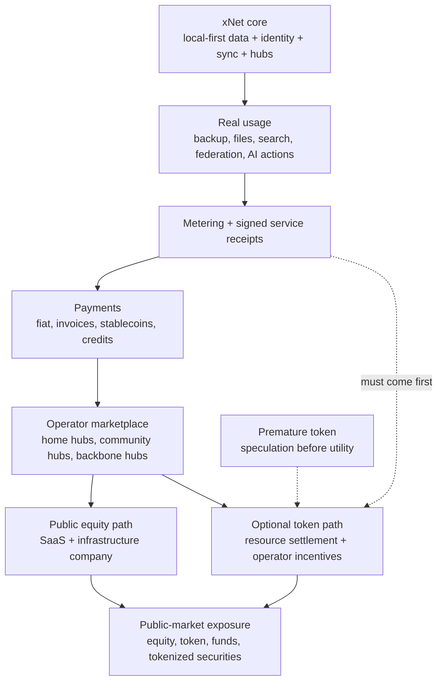
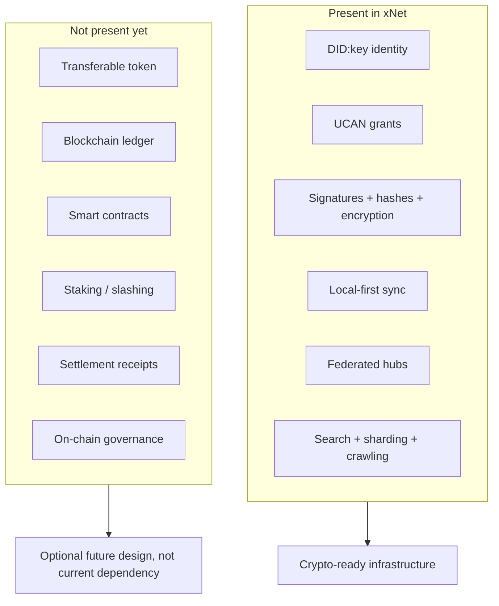
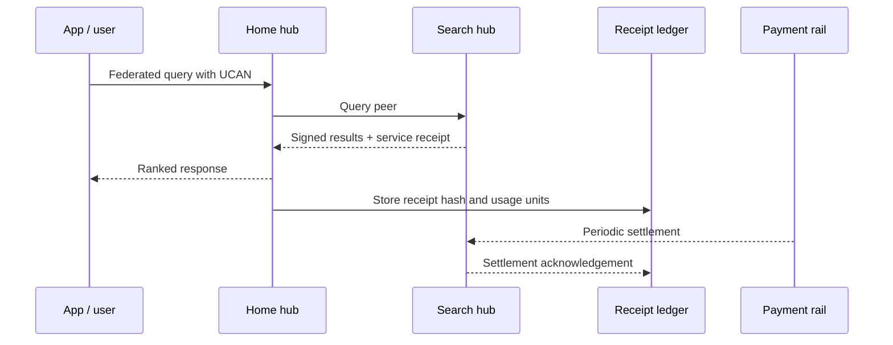
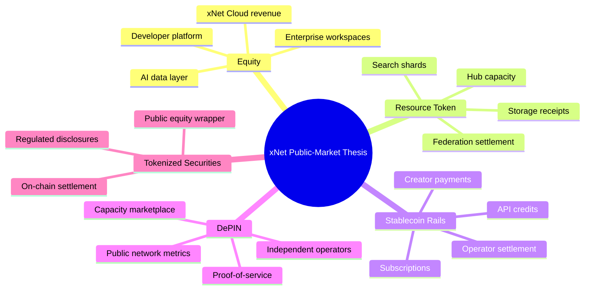
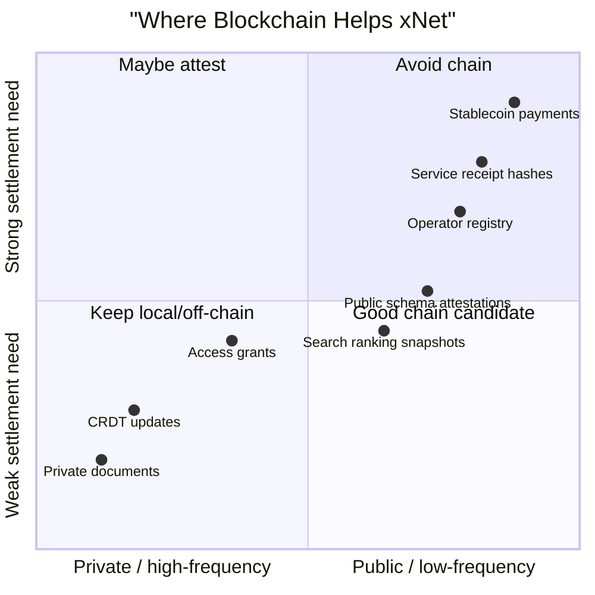
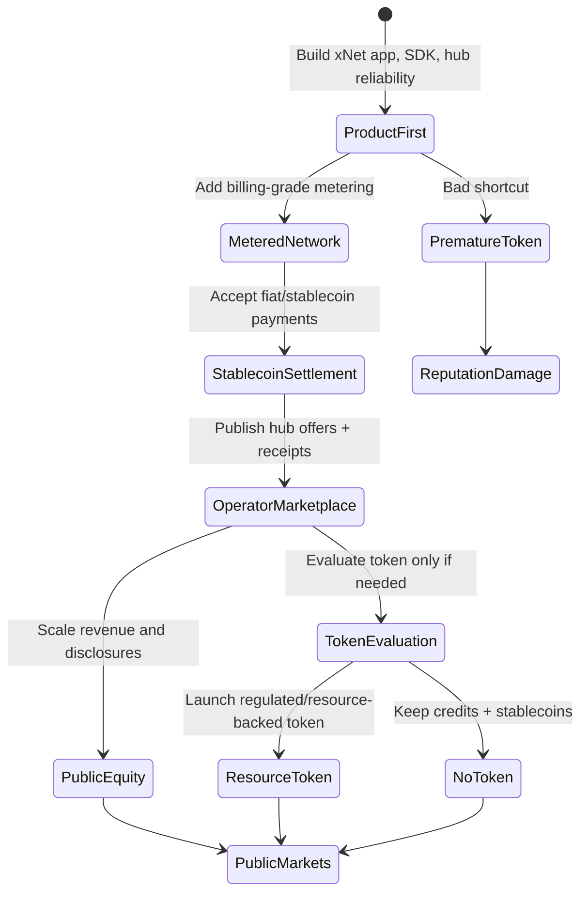

# 0143 - Why Might Public Markets Invest In xNet? Crypto, Web3, And Blockchain

> **Status:** Exploration  
> **Date:** 2026-06-03  
> **Author:** Codex  
> **Tags:** public-markets, crypto, web3, blockchain, depin, tokenization, stablecoins,
> protocol-economics, xnet-strategy

## Problem Statement 🧭

Why might public markets invest in xNet if investors think about crypto, Web3, blockchain, tokens,
DePIN, stablecoins, and tokenized market infrastructure?

This is a different question from "why might venture capital invest?" Venture investors buy
illiquid equity early and underwrite product risk, team risk, and exit risk. Public-market
investors need a liquid exposure, a clear narrative, observable metrics, and a defensible claim on
economic value. In crypto markets, they may also accept tokens as liquid network assets, but that
creates a much harsher design question:

> Can xNet become a useful decentralized resource economy before it becomes a publicly tradable
> story?

This exploration is strategic analysis for xNet. It is not investment advice, legal advice, a token
launch recommendation, or a securities-law conclusion.

## Exploration Status

- [x] Determine the next exploration filename
- [x] Review the xNet README, vision, hub architecture, federation code, NodeStore, auth grants, and
      prior xNet market/economics explorations
- [x] Research current public-market crypto wrappers, token regulation, stablecoin law, DePIN
      economics, decentralized storage, DID/UCAN standards, and crypto accounting context
- [x] Map possible public-market investment paths for xNet
- [x] Compare equity, token, stablecoin, DePIN, and tokenized-security paths
- [x] Include mermaid diagrams, scenarios, checklists, recommendations, example code, and references

## Executive Summary 🎯

Public markets might invest in xNet if xNet becomes one of the few liquid ways to get exposure to a
large shift:

> **user-owned data, federated applications, and AI-era collaboration need an open infrastructure
> layer with cryptographic identity, portable permissions, local-first sync, and service providers
> that can be paid for real work.**

The strongest public-market crypto thesis is not "xNet should put everything on a blockchain." It
is:

> **xNet should keep user data and collaboration off-chain, then use crypto rails only where they
> solve settlement, attribution, operator incentives, verifiable service receipts, and cross-border
> payments better than ordinary SaaS billing.**

That creates five possible public-market paths:

1. **Public equity:** xNet becomes a public software/infrastructure company with xNet Cloud,
   managed hubs, enterprise workspaces, AI data services, and developer platform revenue.
2. **Protocol/resource token:** xNet eventually supports a transferable network asset tied to hub
   capacity, search indexing, storage, relay work, crawling, app-view APIs, or proof-of-service.
3. **DePIN-style network:** xNet hubs become a digital resource network where operators earn for
   providing verifiable infrastructure: storage, sync, search shards, federation routing, media
   caches, and agent execution.
4. **Stablecoin/payment rail:** xNet uses stablecoins and/or non-transferable service credits for
   cross-hub settlement without making the core product depend on a speculative token.
5. **Tokenized public security:** xNet equity, debt, revenue notes, or fund exposure eventually
   trades through regulated tokenized-market infrastructure.

The recommendation is conservative:

> **Do not launch a token now. Make xNet crypto-ready before making it crypto-native.**

The first public-market proof should be boring and auditable:

- metered hub usage;
- signed service receipts;
- operator offer documents;
- transparent network metrics;
- real payment flows;
- migration between hubs;
- clear separation between private user data and public network services;
- legal review before any transferable asset.

If xNet later has a token, the token should exist because the network has a real cross-operator
settlement problem that fiat billing, subscriptions, and stablecoins cannot solve cleanly. A token
should not exist because "public markets like crypto" or because it creates an early liquidity
event.



## Current State In The Repository 🔎

### xNet is crypto-adjacent, not blockchain-native

The root [`README.md`](../../README.md) positions xNet as decentralized data infrastructure and an
application: local-first, P2P-synced, user-owned data. The package graph includes:

- `@xnetjs/crypto` for BLAKE3 hashing, Ed25519 signing, XChaCha20 encryption, and key primitives;
- `@xnetjs/identity` for DID:key generation, UCAN tokens, and passkey storage;
- `@xnetjs/sync` for Lamport clocks, signed `Change<T>`, hash chains, and Yjs security;
- `@xnetjs/data` for schemas, NodeStore, authorization, grants, and encrypted content;
- `@xnetjs/hub` for signaling, sync relay, backup, files, search, federation, sharding, and
  crawling.

That is enough to look familiar to Web3 investors: user-controlled keys, DIDs, capabilities,
verifiable signatures, local-first data, content addressing, and federated services. But xNet does
not currently have:

- a blockchain;
- a token;
- wallets for financial assets;
- smart contracts;
- staking;
- slashing;
- on-chain governance;
- protocol fee settlement;
- token issuance or treasury mechanics;
- proof-of-service receipts;
- legal wrappers for public distribution.

That absence is a strength if xNet uses it intentionally. xNet can avoid putting high-frequency
collaboration, private notes, enterprise documents, and user social data on-chain while preserving
the option to add settlement rails later.



### The hub is the public-market bridge

[`packages/hub/README.md`](../../packages/hub/README.md) describes the hub as a signaling server,
sync relay, backup service, query server, file storage service, schema registry, peer discovery
service, federation gateway, shard participant, and crawler.

That matters for public markets because tokens and public equities need measurable business
activity. A hub can create visible units of work:

| xNet service     | Public-market interpretation                                    | Tokenization fit        |
| ---------------- | --------------------------------------------------------------- | ----------------------- |
| Signaling        | Availability utility                                            | Weak by itself          |
| Sync relay       | Reliability and low-latency collaboration                       | Moderate if metered     |
| Backup           | Durable user-owned storage                                      | Strong SaaS fit         |
| File storage     | Storage and egress cost center                                  | Strong usage-credit fit |
| Full-text search | Query/index infrastructure                                      | Strong API-market fit   |
| Federation       | Cross-hub reach and routing                                     | Strong settlement fit   |
| Sharding         | Distributed index/storage capacity                              | Strong DePIN fit        |
| Crawling         | Public web/index contribution                                   | Strong bounty fit       |
| Metrics          | Public usage proof if made billing-grade and privacy-preserving | Foundational            |
| UCAN auth        | Delegable permission model for users, apps, and operators       | Foundational            |

The best token thesis, if one ever exists, will likely be attached to **hub work**, not to private
user data.

### Federation already has a useful skeleton

[`packages/hub/src/services/federation.ts`](../../packages/hub/src/services/federation.ts) already
does several things that a future settlement layer would need:

- peers have URLs, DIDs, schema exposure rules, trust levels, rate limits, latency limits, health
  state, and last-success timestamps;
- incoming federation queries verify UCAN authorization and capabilities;
- query responses are signed by hub identity;
- peer responses are checked against expected DIDs;
- results are deduplicated and fused with reciprocal rank fusion;
- federation queries are logged with source hub, query text, result count, execution time, and
  timestamp.

That is not a billing ledger, but it is close to a proof boundary. A future xNet could add signed
service receipts without rewriting the architecture:



The key design choice is where the ledger lives. It does not have to be a blockchain at first. It
can begin as signed JSON receipts stored in hubs, invoices, or a clearing service. The chain only
becomes useful if many independent operators need a neutral settlement surface.

### The data layer supports cryptographic claims

[`packages/data/src/store/store.ts`](../../packages/data/src/store/store.ts) documents NodeStore as
event-sourced storage for nodes, using `Change<T>` from `@xnetjs/sync`, Lamport timestamps, signed
changes, hash verification, LWW conflict resolution, sparse updates, and materialized read state.

[`packages/data/src/auth/store-auth.ts`](../../packages/data/src/auth/store-auth.ts) includes a
grant API with UCAN delegation, revocation, proof-depth limits, grant rate limits, attenuation, and
content-key recipient management.

That makes xNet more credible than a generic "data ownership" slogan. The primitives can support:

- user-owned namespace claims;
- delegated app access;
- organization policies;
- agent permissions;
- private data with public attestations;
- verifiable provenance for public artifacts;
- audit trails for regulated teams.

The public-market angle is that xNet can become a trusted substrate for AI and Web3 workflows
without requiring every user action to become a financial transaction.

### Prior explorations already imply the public-market thesis

Three prior documents are especially relevant:

- [`0132_[_]_ECONOMIC_MODELS_FOR_HOSTING_FEDERATED_HUBS.md`](./0132_[_]_ECONOMIC_MODELS_FOR_HOSTING_FEDERATED_HUBS.md)
  argues that hub hosting should become a layered service economy: home hubs, community hubs,
  backbone hubs, and specialist services. Its immediate recommendation is metering, quotas, plan
  metadata, and operator transparency before protocol-level payments.
- [`0141_[_]_GLOBAL_BUSINESSES_AND_MARKETS_IF_XNET_HAS_WIDE_ADOPTION.md`](./0141_[_]_GLOBAL_BUSINESSES_AND_MARKETS_IF_XNET_HAS_WIDE_ADOPTION.md)
  argues that wide adoption shifts canonical data toward users and organizations, while reach,
  ranking, workflows, moderation, compute, hosting, and UX become competitive service layers.
- [`0142_[_]_WHY_MIGHT_VCS_INVEST_IN_XNET_COMPELLING_VENTURE_RETURNS_AND_TIMEFRAMES.md`](./0142_[_]_WHY_MIGHT_VCS_INVEST_IN_XNET_COMPELLING_VENTURE_RETURNS_AND_TIMEFRAMES.md)
  argues that the venture case is strongest when xNet is framed as the local-first, AI-native
  application platform for collaborative software, with hosted hubs as a revenue layer.

The public-market version of the thesis is:

> If xNet becomes a widely used app/data/hub network, public markets may invest because it offers
> liquid exposure to a new internet resource layer: private data ownership plus paid public
> infrastructure.

## External Research 🌐

### Regulated crypto wrappers have become real public-market products

The SEC approved spot bitcoin ETP shares on January 10, 2024, while emphasizing that the action was
limited to ETPs holding bitcoin and did not endorse bitcoin or broader crypto assets. Source:
[SEC statement on spot bitcoin ETP approval](https://www.sec.gov/newsroom/speeches-statements/gensler-statement-spot-bitcoin-011023).

BlackRock's iShares Bitcoin Trust ETF (IBIT) is a concrete example of public-market demand for
regulated crypto exposure. Its product page describes an exchange-traded product that seeks to
reflect bitcoin's price while simplifying custody and operational complexity, and showed more than
$52 billion in net assets as of June 2, 2026. Source:
[iShares Bitcoin Trust ETF](https://www.blackrock.com/us/individual/products/333011/ishare).

Implication for xNet: public markets do not need every investor to self-custody a token. They need
regulated wrappers, disclosure, custody, liquidity, and a narrative that asset allocators can
understand.

### Public crypto equities prove demand, but also volatility dependence

Coinbase's 2025 Form 10-K shows how public markets can value crypto infrastructure as equity. It
reported $1.221 trillion of trading volume in 2025, transaction revenue tied to trading activity,
and subscription/services revenue including stablecoin revenue and blockchain rewards. Source:
[Coinbase 2025 Form 10-K](https://www.sec.gov/Archives/edgar/data/0001679788/000167978826000015/coin-20251231.htm).

Strategy/MicroStrategy's 2025 Form 10-K shows another public-market pattern: a public operating
company can become a proxy for bitcoin exposure. It reported holding approximately 717,131 bitcoins
as of February 13, 2026, while also disclosing concentration and liquidity risks. Source:
[MicroStrategy 2025 Form 10-K](https://www.sec.gov/Archives/edgar/data/1050446/000105044626000020/mstr-20251231.htm).

Implication for xNet: public markets will invest in crypto narratives, but they also punish opaque
or purely reflexive value capture. xNet needs operating metrics that do not depend only on token
price, market volatility, or treasury assets.

### U.S. crypto policy is evolving, but staff statements are not a product plan

SEC materials in 2025 and 2026 show a more active attempt to clarify digital asset market
structure:

- the SEC launched a Crypto Task Force in 2025;
- Chairman Paul Atkins announced "Project Crypto" in July 2025;
- SEC staff published statements on protocol staking, stablecoins, and offerings/registrations in
  crypto asset markets.

Sources:

- [SEC Crypto Task Force](https://www.sec.gov/securities-topics/crypto-task-force)
- [SEC launches Project Crypto](https://www.sec.gov/about/sec-launches-project-crypto)
- [SEC statement on protocol staking](https://www.sec.gov/newsroom/speeches-statements/statement-certain-protocol-staking-activities-052925)
- [SEC statement on stablecoins](https://www.sec.gov/newsroom/speeches-statements/statement-stablecoins-040425)
- [SEC statement on crypto securities offerings and registrations](https://www.sec.gov/newsroom/speeches-statements/cf-crypto-securities-041025)

Implication for xNet: the environment may be more navigable than during peak enforcement
uncertainty, but it is still not safe to treat token issuance as a casual growth tactic. The SEC's
own crypto securities statement exists because some offerings will still require securities-law
disclosure and registration paths.

### Stablecoins now have a clearer U.S. lane

Congress.gov records S.1582, the GENIUS Act, as having become law in the 119th Congress. The summary
states that permitted payment stablecoin issuers must maintain one-to-one reserves using U.S.
currency or similarly liquid assets, disclose redemption policies, publish reserve details monthly,
and are subject to Bank Secrecy Act obligations. Source:
[Congress.gov GENIUS Act summary](https://www.congress.gov/bill/119th-congress/senate-bill/1582).

Implication for xNet: stablecoins are the most practical first crypto rail. They can support
cross-border payments, creator payments, hub subscriptions, API credits, and operator settlement
without requiring xNet to invent a volatile token.

### Europe is forcing crypto into a disclosure and authorization regime

ESMA describes MiCA as a uniform EU market framework for crypto-assets, with measures around
transparency, supervision, registers, white papers, and comparability of information. Source:
[ESMA MiCA overview](https://www.esma.europa.eu/pl/node/201529).

Implication for xNet: a public token strategy cannot be U.S.-only. If xNet wants global public
market participation, issuer disclosures, service-provider obligations, user protection, and
jurisdiction-specific restrictions become product requirements.

### Accounting has become friendlier to crypto asset reporting

FASB ASU 2023-08 moved certain crypto-asset accounting toward fair-value measurement and additional
disclosures because prior cost-less-impairment treatment did not give investors enough useful
information about changes in crypto asset value. Source:
[FASB ASU 2023-08](https://storage.fasb.org/ASU%202023-08.pdf).

Implication for xNet: public companies and institutions have a cleaner accounting path for some
crypto holdings than they did earlier in the cycle. That helps treasury, token, and reserve
disclosure discussions, but it does not solve securities, custody, tax, or governance risk.

### DePIN gives a useful pattern: pay for verifiable resource work

Helium's Data Credit model is a useful reference because it separates volatile network-token value
from predictable usage pricing. Helium docs describe Data Credits as the mechanism by which network
usage is paid, with one Data Credit equal to $0.00001, and note that usage is pinned to USD to
reduce volatility for network users. Source:
[Helium Data Credit docs](https://docs.helium.com/tokens/data-credit/).

Filecoin presents decentralized storage as programmable cloud infrastructure with verifiable
storage, retrieval, and payments. The IPFS persistence docs also make the core economic point:
content addressing does not guarantee persistence; someone must bear the storage cost, and
Filecoin-style deals specify data amount, duration, and cost. Sources:
[Filecoin store data](https://www.filecoin.io/store-data) and
[IPFS persistence docs](https://docs.ipfs.tech/concepts/persistence/).

Arweave uses an endowment model where upload fees fund long-term miner payments for replicated
storage. Source: [Arweave docs](https://docs.arweave.net/learn/what-is-arweave).

Implication for xNet: if xNet ever uses token incentives, the model should be anchored in real
resource work: bytes stored, query results served, index shards maintained, crawls completed, sync
messages relayed, and uptime delivered.

### DID and UCAN make xNet legible to Web3 without chains

W3C made Decentralized Identifiers v1.0 a Recommendation in 2022, and DID Core defines globally
unambiguous identifiers that are not tied to traditional identity roots. Source:
[W3C DID Core](https://www.w3.org/TR/did-core/).

The UCAN specification describes UCAN as a trustless, local-first, user-originated authorization
scheme with public-key-verifiable and delegable capabilities. Source:
[UCAN specification](https://ucan.xyz/specification/).

Implication for xNet: xNet can be Web3-compatible at the identity and authorization layer before it
is blockchain-native at the asset layer. That is valuable because identity and permissioning are
often the missing bridge between real applications and crypto rails.

## Key Findings 💡

### 1. Public markets buy liquid narratives plus measurable value

Public markets may invest in xNet if they can answer four questions:

| Investor question          | xNet answer needed                                                   |
| -------------------------- | -------------------------------------------------------------------- |
| What is the category?      | Local-first AI data platform, decentralized cloud, DePIN, or Web3 OS |
| What is the value capture? | Equity revenue, protocol fees, service credits, or token utility     |
| What metrics prove demand? | ARR, active hubs, paid storage, queries, receipts, operator earnings |
| Why will value compound?   | Network effects, switching costs, developer ecosystem, data gravity  |

The current xNet architecture gives plausible answers, but not yet public-market-grade evidence.

### 2. The best crypto asset would be tied to resources, not vibes

If xNet ever has a token, the strongest design would tie it to measurable service work:

- backup byte-days;
- file byte-days;
- egress and hot-object reads;
- sync relay messages;
- federation queries served;
- search index shard availability;
- crawl tasks completed;
- media transcode/cache work;
- plugin or agent execution;
- schema registry and identity resolution;
- moderation/label-feed work where claims are auditable.

That is what makes a DePIN-style thesis credible. A token that only votes on governance would be a
thin public-market story unless governance controls large cash flows, which would raise different
regulatory and capture risks.



### 3. Token value capture is the hard part

Public crypto markets punish protocols where usage grows but token value does not accrue. xNet
would need a precise answer to one of these mechanisms:

| Mechanism                | How it works                                    | Main risk                                            |
| ------------------------ | ----------------------------------------------- | ---------------------------------------------------- |
| Service credits          | Users buy credits for storage/query/API work    | Non-transferable credits are not investor exposure   |
| Burn-and-mint            | Usage burns credits backed by a volatile asset  | Complex monetary policy and reflexivity              |
| Operator staking         | Operators bond assets to receive tasks/rewards  | Legal, slashing, governance, and centralization risk |
| Protocol fee share       | Fees flow to treasury or token holders          | May look more security-like                          |
| Governance rights        | Token controls protocol parameters and treasury | Capture risk and weak value if no cash flows         |
| Tokenized equity/revenue | Regulated security represents company economics | Disclosure, transfer restrictions, compliance        |

The cleanest early path is **service credits plus off-chain payments**. It proves demand without
turning xNet into a financial product.

### 4. Stablecoins are more useful to xNet than a native token in the first phase

Stablecoins could solve immediate problems:

- global hub subscriptions;
- developer API credits;
- creator payouts;
- cross-hub settlement;
- community sponsorships;
- bounties for crawling, indexing, translation, moderation, and archive pinning;
- agent-to-service payments.

Stablecoins let xNet support Web3 users and global operators while keeping xNet's own core token
question open.

### 5. Blockchain should be used for settlement and attestations, not primary data

The data xNet cares about is often private, mutable, collaborative, high-frequency, legally
sensitive, and user-owned. That is a poor fit for public blockchains.

Good blockchain candidates:

- public operator registry commitments;
- service receipt hashes;
- settlement batches;
- escrow for marketplace tasks;
- proofs of storage/index availability;
- governance over protocol parameters after maturity;
- tokenized securities if regulated;
- stablecoin payments.

Poor blockchain candidates:

- private notes;
- enterprise documents;
- raw social graphs;
- high-frequency CRDT updates;
- personal messages;
- dating/family/friend data;
- deletable or regulated personal data;
- access-control secrets.



### 6. Public-market investors may like xNet because AI makes data ownership investable again

The AI angle matters. As agents become more capable, they need:

- scoped authority to read and mutate private data;
- signed action logs;
- trustworthy user identity;
- portable data models;
- payments to tools and services;
- audit trails for organizations;
- interoperability between apps.

xNet's DID, UCAN, NodeStore, hub, plugin, MCP, and local-first stack can become a substrate where AI
agents operate with verifiable user authority. Crypto markets may frame that as "wallet-native
agent infrastructure." Public software markets may frame it as "AI-native work data platform."
Both can be true if xNet avoids premature financialization.

### 7. xNet has multiple liquid wrappers, not one

Potential public-market wrappers:

| Wrapper                         | What public investors own                     | Likely timeframe        |
| ------------------------------- | --------------------------------------------- | ----------------------- |
| Public common equity            | Company cash flows and platform upside        | Later, after scale      |
| Public debt/convertibles        | Credit exposure to infrastructure company     | Later, after revenue    |
| Utility/resource token          | Network demand for resource settlement        | Only after real usage   |
| Governance token                | Protocol governance influence                 | Weak alone              |
| Security token/tokenized equity | Regulated claim on equity, debt, or revenue   | Later, compliance-heavy |
| ETF/fund exposure               | Basket exposure to crypto/data infra category | After public liquidity  |
| Stablecoin credit system        | Not investor exposure; operating payment rail | Early possible          |

The company does not need to decide today which wrapper wins. It needs to make the underlying
network economically legible.

## Market Scenarios 🧪

### Scenario A: Public equity compounder

xNet first becomes a public-market software company. It sells:

- xNet Cloud for managed hubs;
- team and enterprise workspaces;
- hosted sync, backup, files, search, and app views;
- AI workspace services;
- developer platform plans;
- compliance and audit features;
- marketplace/API revenue.

Crypto remains optional: stablecoin payments, signed receipts, and future tokenized equity. This
is the cleanest path if xNet can become a serious business before a protocol economy emerges.

**Investor thesis:** xNet is an AI-era data cloud with local-first trust and federated expansion.

**Risk:** public software investors may discount decentralization if it limits margins or control.

### Scenario B: DePIN resource network

xNet builds an operator marketplace. Independent operators provide:

- storage;
- backup retention;
- search shards;
- crawlers;
- federation relays;
- media caches;
- app-view APIs;
- agent execution environments.

Operators publish signed offers, users and apps consume services, hubs issue receipts, and a
settlement layer clears payments. A token may eventually coordinate staking, rewards, reputation,
and resource credits.

**Investor thesis:** xNet is decentralized cloud for user-owned data and AI collaboration.

**Risk:** fake usage, subsidy farming, token emissions, and weak proof-of-service can destroy trust.

### Scenario C: Stablecoin-first network without native token

xNet uses fiat and stablecoins for hub payments, creator payouts, bounties, and operator settlement.
Service credits are non-transferable and priced in USD. No transferable native token exists.

**Investor thesis:** xNet captures value through equity and operating revenue, not protocol asset
speculation.

**Risk:** crypto public markets may treat it as less exciting because there is no token beta.

### Scenario D: Tokenized public security

xNet becomes a regulated issuer whose equity, debt, or revenue-linked securities can settle through
tokenized market infrastructure. The token is not a protocol utility token; it is a compliant
public-market security wrapper.

**Investor thesis:** xNet is both a public company and an early adopter of tokenized market rails.

**Risk:** complex compliance, limited market infrastructure maturity, and no protocol-network
upside unless the operating business is strong.

### Scenario E: Premature token launch

xNet launches a transferable token before product-market fit, usage receipts, operator demand, or
legal clarity. The community narrative becomes "price first, product later."

**Investor thesis:** speculative beta to Web3 infrastructure.

**Risk:** the product roadmap gets distorted by liquidity, incentives attract mercenary users, legal
risk increases, serious enterprise/users hesitate, and long-term public markets discount the
company as another underutilized token network.

This is the scenario to avoid.



## Options And Tradeoffs ⚖️

### Option 1: Stay equity-only

xNet ignores native tokenization and focuses on becoming a public software infrastructure company.

**Pros**

- Lowest legal and product distraction.
- Easier enterprise trust story.
- Clear SaaS/infrastructure revenue model.
- Best fit for hosted hub and AI workspace monetization.

**Cons**

- Harder to incentivize independent global operators.
- Less liquid crypto-native community participation.
- Public-market upside depends on company execution, not protocol asset reflexivity.

### Option 2: Use stablecoins and service credits, but no transferable xNet token

xNet accepts stablecoins and uses non-transferable service credits for network usage.

**Pros**

- Solves payments without inventing monetary policy.
- Easier to price storage/search/API work predictably.
- Compatible with fiat billing.
- Can be implemented before token legal complexity.

**Cons**

- Credits are operational, not public-market investment assets.
- Operator incentives may need centralized clearing at first.
- Less powerful for bootstrapping open infrastructure if capital is scarce.

### Option 3: Launch a transferable resource token after metered usage

xNet creates a protocol asset only after service receipts, operator marketplace, and user demand
exist.

**Pros**

- Potentially liquid public-market exposure.
- Can incentivize operators and bootstrap public-good infrastructure.
- Can create a neutral settlement layer for independent hubs.
- Fits DePIN and Web3 infrastructure narratives.

**Cons**

- Regulatory complexity.
- Token design can fail even if product succeeds.
- Speculation can overpower utility.
- Requires anti-Sybil, proof-of-service, governance, treasury, and market-surveillance design.

### Option 4: Tokenize equity or revenue under securities rules

xNet uses blockchain rails for regulated securities rather than a native utility token.

**Pros**

- Honest value capture: investors own a regulated claim.
- Could align with public-market tokenization trends.
- Avoids pretending governance/utility tokens are equity.

**Cons**

- Compliance-heavy.
- Still immature market plumbing.
- Does not solve operator incentives by itself.

### Option 5: Build an xNet chain or L2

xNet creates its own chain, rollup, or appchain for settlement and registry state.

**Pros**

- Maximum control over protocol economics.
- Strong crypto-native narrative.
- Could embed receipts, staking, governance, and credits in one environment.

**Cons**

- Extremely distracting.
- Hard to secure.
- Premature before usage.
- Creates an infra project inside an infra project.
- Likely worse than using existing payment and settlement rails until scale demands otherwise.

## Timeframes ⏱️

| Timeframe    | Public-market milestone                               | What must be true first                                      |
| ------------ | ----------------------------------------------------- | ------------------------------------------------------------ |
| 0-12 months  | Crypto-ready product, no token                        | Reliable app, hub quotas, service metrics, pricing sketches  |
| 12-24 months | Stablecoin/payment pilots and operator receipts       | Paid users, hub plans, signed receipt schema, legal review   |
| 2-4 years    | Operator marketplace and DePIN feasibility            | Independent operators, real settlement needs, anti-fraud     |
| 4-7 years    | Token/security-token decision window                  | Usage scale, regulatory path, public disclosures, governance |
| 7+ years     | Public equity, public token, ETF/fund inclusion paths | Durable revenue or liquid protocol market depth              |

The key point is sequence. Public markets can become interested quickly, but durable public-market
value needs real usage and credible disclosures.

## Recommendation ✅

xNet should pursue a **crypto-ready, product-first** path:

1. **Keep the xNet core off-chain.** Private user data, local-first documents, CRDT updates, and
   enterprise workspaces should remain local/federated, not blockchain-native.
2. **Build billing-grade metering before token design.** Count resource units for storage, sync,
   search, federation, crawling, media, API, and plugin/agent execution.
3. **Introduce signed service receipts.** Each hub should be able to prove what it did, for whom,
   under what capability, at what time, and at what cost unit.
4. **Publish operator offer documents.** Hubs should advertise capabilities, limits, jurisdiction,
   pricing, public policy, uptime targets, accepted schemas, and payment methods.
5. **Use fiat and stablecoins first.** Stablecoins are useful operating rails. A native token should
   wait.
6. **Create a token-readiness gate.** xNet should only revisit a token if there is clear evidence
   that independent operators need a neutral settlement/reputation/incentive asset.
7. **If a token exists, make it resource-grounded.** It should support service credits, operator
   bonds, proof-of-service, settlement, or marketplace collateral, not vague governance.
8. **Separate company economics from protocol economics.** xNet Cloud can be a strong public equity
   business even if the protocol never launches a token.

### Token-readiness gate

xNet should not seriously design a transferable token until these questions have factual answers:

- Are there at least several independent hub operators with meaningful non-subsidized usage?
- Are users or apps paying for cross-operator services?
- Can xNet measure work in privacy-preserving, auditable units?
- Can the network detect fake usage, wash queries, bogus storage, and Sybil operators?
- Is there a legal path for the intended jurisdictions?
- Does token ownership confer utility without implying unmanaged profit promises?
- Can operator incentives work if token price falls 80%?
- Can xNet Cloud remain a trusted enterprise product if the protocol asset is volatile?

If the answer to any of these is "not yet," the correct token answer is "not yet."

## Implementation Checklist 🛠️

- [ ] Define `HubOffer` documents with hub DID, capabilities, quotas, pricing hints, jurisdiction,
      payment methods, moderation policy, schema exposure, uptime target, and contact details.
- [ ] Add billing-grade `UsageEvent` records for backup byte-days, file byte-days, egress, sync
      relay messages, federation queries, search index work, crawl tasks, media cache hits, plugin
      execution, and AI-agent actions.
- [ ] Add idempotent event IDs and privacy-preserving aggregation so usage can be audited without
      leaking private content.
- [ ] Add signed `ServiceReceipt` objects for cross-hub work.
- [ ] Extend federation query logging to emit receipt hashes and resource units.
- [ ] Build a local settlement report that groups receipts by operator DID and service kind.
- [ ] Add a hub dashboard for operator costs, revenue, usage, and abuse pressure.
- [ ] Add fiat billing first: invoices, Stripe-style subscriptions, and manual operator payment
      links.
- [ ] Add stablecoin payment support only after legal review of custody, AML, tax, sanctions, and
      consumer-protection obligations.
- [ ] Create a public registry format for hubs and service offers.
- [ ] Create anti-fraud checks for fake queries, repeated self-dealing, bogus storage claims, crawl
      spam, and synthetic activity.
- [ ] Publish public network metrics that distinguish organic paid usage from subsidized or test
      usage.
- [ ] Commission a token-readiness legal memo before designing any transferable asset.
- [ ] Revisit token economics only after independent operator settlement becomes a real bottleneck.

## Validation Checklist 🔬

- [ ] Verify that no receipt contains private document text, access tokens, secrets, or personal
      data that should remain local.
- [ ] Verify that usage aggregation can be reproduced from raw events without double counting.
- [ ] Verify that receipt signatures bind hub DID, service type, quantity, timestamp, payer,
      resource scope, and hash.
- [ ] Verify that a hub can dispute or reject a receipt before settlement.
- [ ] Verify that service units map to actual infrastructure costs.
- [ ] Verify that operator reports reconcile with invoices or stablecoin transfers.
- [ ] Verify that service credits are not represented as investments in user-facing copy.
- [ ] Verify that public network metrics label subsidized, internal, test, and organic usage
      separately.
- [ ] Verify that the system still works with no blockchain dependency.
- [ ] Verify that adding a payment rail does not weaken xNet's local-first privacy model.

## Example Code: Receipts Before Tokenomics 🧾

The first useful primitive is not a token. It is a signed, auditable unit of service work.

```typescript
type DID = `did:${string}`

type ServiceKind =
  | 'backup-byte-day'
  | 'file-byte-day'
  | 'egress-byte'
  | 'sync-relay-message'
  | 'federation-query'
  | 'search-index-document'
  | 'crawl-task'
  | 'agent-execution-ms'

type ServiceReceipt = {
  readonly id: string
  readonly operatorDid: DID
  readonly payerDid: DID
  readonly service: ServiceKind
  readonly units: number
  readonly unitPriceUsdMicros: number
  readonly resourceScopeHash: string
  readonly issuedAt: number
  readonly expiresAt: number
  readonly previousReceiptHash?: string
  readonly signature: string
}

type SettlementLine = {
  readonly operatorDid: DID
  readonly service: ServiceKind
  readonly units: number
  readonly amountUsdMicros: number
}

const receiptAmount = (receipt: ServiceReceipt): number =>
  receipt.units * receipt.unitPriceUsdMicros

const settlementKey = (receipt: ServiceReceipt): string =>
  `${receipt.operatorDid}:${receipt.service}`

export const aggregateServiceReceipts = (
  receipts: readonly ServiceReceipt[]
): readonly SettlementLine[] => {
  const totals = receipts.reduce((acc, receipt) => {
    const key = settlementKey(receipt)
    const current = acc.get(key) ?? {
      operatorDid: receipt.operatorDid,
      service: receipt.service,
      units: 0,
      amountUsdMicros: 0
    }

    return new Map(acc).set(key, {
      ...current,
      units: current.units + receipt.units,
      amountUsdMicros: current.amountUsdMicros + receiptAmount(receipt)
    })
  }, new Map<string, SettlementLine>())

  return [...totals.values()].sort((left, right) =>
    left.operatorDid === right.operatorDid
      ? left.service.localeCompare(right.service)
      : left.operatorDid.localeCompare(right.operatorDid)
  )
}

export const rejectUnsettleableReceipts = (
  receipts: readonly ServiceReceipt[],
  now = Date.now()
): readonly ServiceReceipt[] =>
  receipts.filter(
    (receipt) =>
      Number.isFinite(receipt.units) &&
      receipt.units > 0 &&
      receipt.unitPriceUsdMicros >= 0 &&
      receipt.issuedAt <= now &&
      receipt.expiresAt > now &&
      receipt.signature.length > 0
  )
```

This shape deliberately prices work in USD micros. That keeps the accounting stable even if the
eventual payment rail is fiat, stablecoin, service credit, or a future protocol settlement asset.

## What Public Markets Would Need To Believe 📈

For public markets to invest aggressively, they would need to believe most of the following:

- xNet can become a default local-first data layer for AI-era applications.
- User-owned data and portable schemas create a durable network effect.
- Hubs can become a large paid infrastructure market.
- Federated search, social, wiki, video, and GitHub-like workflows create demand for public
  indexing and app-view services.
- xNet Cloud can capture company-level revenue even while the protocol remains open.
- Independent operators can earn real revenue without requiring endless subsidies.
- Crypto rails improve settlement and incentives instead of adding noise.
- A token, if any, has clear utility and value accrual.
- The legal/regulatory path is manageable.
- The network can publish metrics that are harder to fake than typical Web3 activity metrics.

## Main Risks 🚧

### Securities and public-offering risk

If xNet sells a token to fund development and markets future appreciation based on team effort, it
may create securities-law risk. Even if the policy environment is more constructive, public token
distribution still needs a careful legal path.

### Token-value mismatch

The product can succeed while the token fails if:

- users pay in fiat/stablecoins and never need the token;
- operators immediately sell rewards;
- governance rights do not matter;
- fees do not accrue to the token;
- credits are too stable to create investment upside;
- speculation outruns utility.

### Fake usage and subsidy farming

DePIN networks can attract operators who optimize for rewards rather than service quality. xNet
would need proof-of-service, reputation, challenge mechanisms, cost-aware pricing, and subsidy caps.

### Privacy leakage

Receipts, metrics, and public registries can accidentally leak sensitive behavior: who queried
what, who stores what, who collaborates with whom, and which organizations are active. xNet must
make receipts content-blind and aggregate carefully.

### Governance capture

On-chain governance can be captured by whales, exchanges, insiders, or short-term speculators. xNet
should not let token governance control private user data, identity rights, or safety-critical
protocol behavior.

### Enterprise trust risk

If xNet becomes known primarily as a speculative token project, serious enterprise customers may
hesitate to adopt it for private work data. The public-market narrative must not poison the
product-market narrative.

### Regulatory fragmentation

MiCA, U.S. securities law, stablecoin rules, sanctions law, tax reporting, custody rules, consumer
protection, and local licensing obligations can all shape what xNet may offer in each jurisdiction.

## Strategic Next Actions 🚀

1. **Write a token-negative operating policy for the next phase.** Make it explicit that xNet will
   not launch a transferable token until usage, metering, and legal gates are met.
2. **Design the service receipt schema.** Start with federation queries, backup byte-days, file
   byte-days, and search index work.
3. **Turn hub metrics into operator accounting.** Keep privacy-preserving telemetry separate from
   billing-grade service accounting.
4. **Create `HubOffer` discovery docs.** Let operators advertise capabilities, pricing, limits, and
   policy before any settlement layer exists.
5. **Pilot fiat/stablecoin payments manually.** Learn the operational workflow before encoding it in
   protocol mechanics.
6. **Publish a public network metrics dashboard.** Separate demo/internal usage from paid organic
   usage.
7. **Commission legal review before token architecture.** Do not treat token design as purely
   technical.
8. **Keep public-market narratives subordinate to product traction.** Public markets can amplify
   real network value, but they cannot substitute for it.

## References 📚

### xNet repository

- [xNet README](../../README.md)
- [xNet Vision](../VISION.md)
- [Hub README](../../packages/hub/README.md)
- [Hub federation service](../../packages/hub/src/services/federation.ts)
- [NodeStore](../../packages/data/src/store/store.ts)
- [Store auth grants](../../packages/data/src/auth/store-auth.ts)
- [Economic Models For Hosting Federated Hubs](./0132_[_]_ECONOMIC_MODELS_FOR_HOSTING_FEDERATED_HUBS.md)
- [Global Businesses And Markets If xNet Has Wide Adoption](./0141_[_]_GLOBAL_BUSINESSES_AND_MARKETS_IF_XNET_HAS_WIDE_ADOPTION.md)
- [Why Might VCs Invest In xNet?](./0142_[_]_WHY_MIGHT_VCS_INVEST_IN_XNET_COMPELLING_VENTURE_RETURNS_AND_TIMEFRAMES.md)

### External research

- [SEC statement on spot bitcoin ETP approval](https://www.sec.gov/newsroom/speeches-statements/gensler-statement-spot-bitcoin-011023)
- [BlackRock iShares Bitcoin Trust ETF](https://www.blackrock.com/us/individual/products/333011/ishare)
- [Coinbase 2025 Form 10-K](https://www.sec.gov/Archives/edgar/data/0001679788/000167978826000015/coin-20251231.htm)
- [MicroStrategy 2025 Form 10-K](https://www.sec.gov/Archives/edgar/data/1050446/000105044626000020/mstr-20251231.htm)
- [SEC Crypto Task Force](https://www.sec.gov/securities-topics/crypto-task-force)
- [SEC launches Project Crypto](https://www.sec.gov/about/sec-launches-project-crypto)
- [SEC statement on protocol staking](https://www.sec.gov/newsroom/speeches-statements/statement-certain-protocol-staking-activities-052925)
- [SEC statement on stablecoins](https://www.sec.gov/newsroom/speeches-statements/statement-stablecoins-040425)
- [SEC statement on crypto securities offerings and registrations](https://www.sec.gov/newsroom/speeches-statements/cf-crypto-securities-041025)
- [Congress.gov GENIUS Act summary](https://www.congress.gov/bill/119th-congress/senate-bill/1582)
- [ESMA MiCA overview](https://www.esma.europa.eu/pl/node/201529)
- [FASB ASU 2023-08](https://storage.fasb.org/ASU%202023-08.pdf)
- [Helium Data Credit docs](https://docs.helium.com/tokens/data-credit/)
- [Filecoin storage overview](https://www.filecoin.io/store-data)
- [IPFS persistence docs](https://docs.ipfs.tech/concepts/persistence/)
- [Arweave docs](https://docs.arweave.net/learn/what-is-arweave)
- [W3C DID Core](https://www.w3.org/TR/did-core/)
- [UCAN specification](https://ucan.xyz/specification/)
