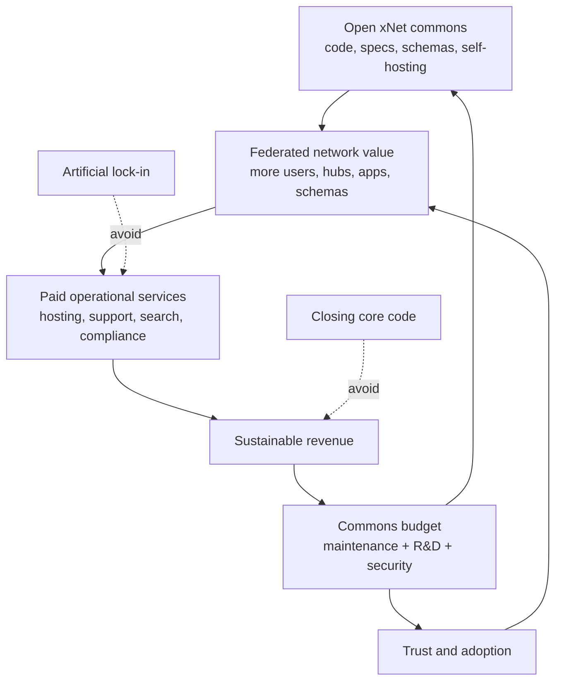
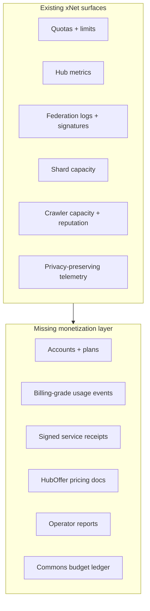
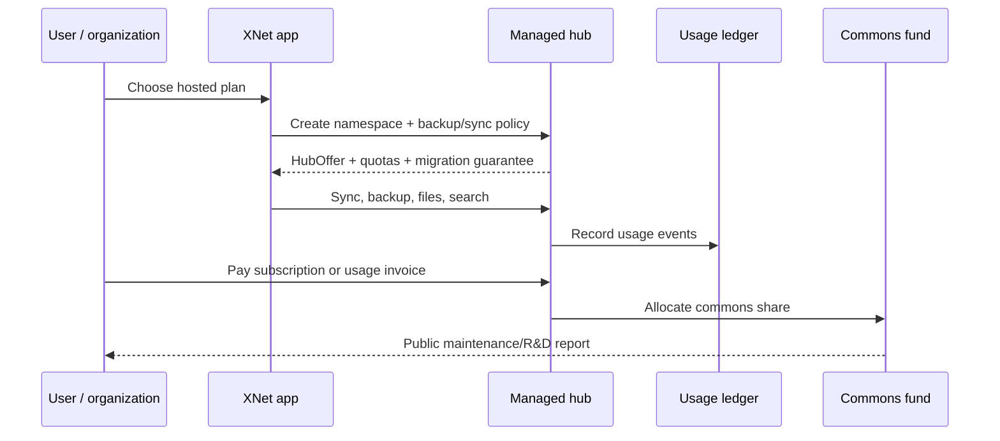
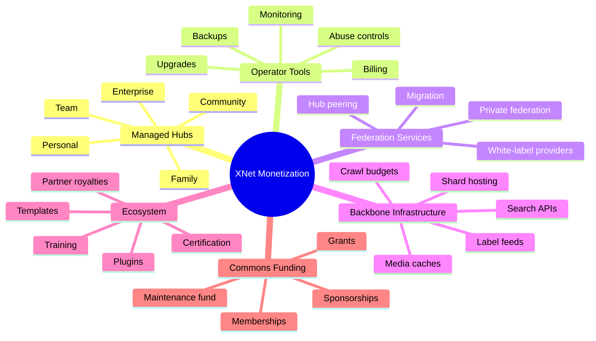
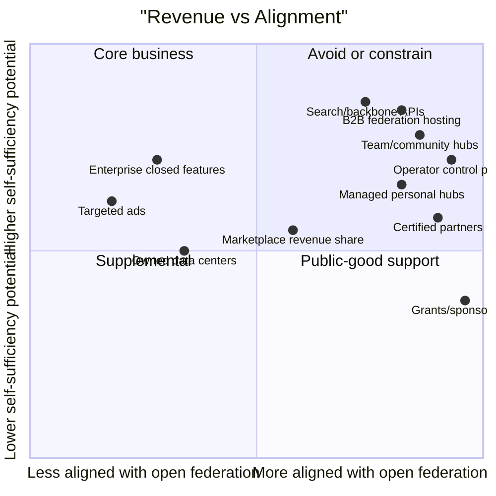
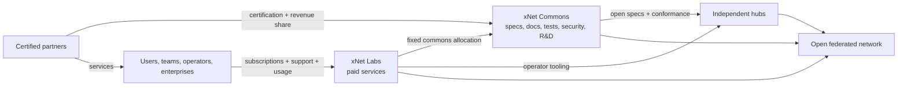
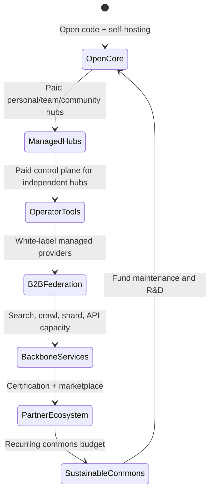

# 0144 - Potential Monetization Routes Aligned With Open Federation

> **Status:** Exploration  
> **Date:** 2026-06-03  
> **Author:** Codex  
> **Tags:** monetization, sustainability, open-source, federation, hubs, hosting,
> search-infrastructure, b2b, foundation, public-good-funding, operator-economics

## Problem Statement 💰

How can xNet become economically self-sufficient while staying aligned with its primary vision:
decentralization, federation, openness, user-owned data, and open source?

The goal is not to maximize profit like the most extractive software platforms. The goal is to fund
the real work:

- maintaining the monorepo;
- fixing security and abuse issues;
- improving the hub and local-first stack;
- funding protocol, schema, federation, and search research;
- supporting documentation, testing, releases, and operator tooling;
- helping the ecosystem grow without turning xNet into the central platform gatekeeper.

The central constraint is:

> xNet should be paid when it creates meaningful operational value for users, developers,
> organizations, hub operators, app-view providers, and the wider network. It should not be paid by
> making federation artificially scarce, locking users into a single host, or closing the commons
> that make xNet worth using.

This document explores monetization routes from personal hub hosting through B2B federation/search
hosting, partner programs, marketplace revenue, support, public-good funding, and the much harder
question of whether xNet should ever move lower into the physical infrastructure/data-center layer.

## Exploration Status

- [x] Compute the next exploration number and use a valid shortened filename
- [x] Review xNet README, roadmap, hub config, backup, file storage, metrics, query, federation,
      sharding, crawl, telemetry, and plugin surfaces
- [x] Review adjacent explorations on hub economics, global adoption, VC investment, and
      crypto/public-market paths
- [x] Research external open-source, federated, hosted-service, partner, grant, and infrastructure
      models
- [x] Map monetization routes against decentralization, federation, open-source alignment, and
      sustainability
- [x] Include mermaid diagrams, implementation and validation checklists, example code, and
      references

## Executive Summary 🎯

xNet's strongest monetization route is **paid operational convenience over open protocol
infrastructure**:

> Keep the software, schemas, protocol surfaces, and self-hosting path open; charge for reliable
> hosting, operations, support, compliance, search/backbone capacity, migration, abuse tooling,
> observability, and managed federation.

The cleanest starting product is **xNet Cloud for managed hubs**:

- personal and family hubs for sync, backup, files, and identity availability;
- team/community hubs for collaboration, moderation, member management, and public surfaces;
- B2B managed hubs for organizations, agencies, associations, schools, local governments, and
  software vendors that want federation without operating infrastructure;
- operator control-plane services for people running their own hubs;
- later, paid backbone services for federated search, crawlers, shard hosting, API/query capacity,
  media caches, and app views.

The key alignment principle is:

> xNet should charge for scarce, valuable work that someone must actually do: uptime, backups,
> storage, bandwidth, search indexing, crawling, moderation tooling, compliance, support,
> migrations, and R&D. It should not charge rent on the right to self-host, fork, interoperate, or
> own data.

Recommended revenue portfolio:

1. **Managed hub hosting:** primary near-term revenue.
2. **Operator control plane:** paid observability, upgrades, backups, abuse controls, billing, and
   federation management for independent hub operators.
3. **B2B federation hosting:** white-label managed hubs for organizations and app providers.
4. **Backbone/search infrastructure:** usage-priced query, crawl, index, shard, and API capacity.
5. **Enterprise support and compliance:** SSO, audit, retention, legal hold, managed keys, SLAs,
   private federation, and professional support.
6. **Partner/certification program:** a Moodle-like ecosystem of certified hosts, integrators, and
   vertical specialists that financially contributes to core.
7. **Marketplace and registry revenue:** optional revenue share for paid plugins, schemas,
   templates, app views, and verified operator listings while preserving sideloading and open
   distribution.
8. **Foundation/public-good funding:** grants, sponsorships, memberships, and directed maintenance
   funds for work that benefits the whole network but is hard to capture commercially.
9. **Physical infrastructure only later:** do not become a data-center provider early. Start with
   cloud/bare-metal portability, then maybe operate strategic regional capacity or pooled
   purchasing once utilization is predictable.

The most important operational recommendation:

> Establish a transparent "commons budget" from revenue: a fixed share of service revenue funds
> open maintenance, security, federation interoperability, documentation, and research.

That gives users and operators a concrete reason to pay xNet even when they could self-host: they
are not paying for permission. They are paying for reliable service and funding the commons they
depend on.



## Current State In The Repository 🔎

### xNet already has monetizable infrastructure surfaces

The root [`README.md`](../../README.md) positions xNet as decentralized data infrastructure and an
application: local-first, P2P-synced, user-owned data. It starts with documents and databases, then
expands through plugins to ERP, MCP integrations, and more.

The architecture already contains the pieces that can become paid service layers:

| Surface                    | Current repo evidence                                                                                                                                  | Monetization interpretation                                             |
| -------------------------- | ------------------------------------------------------------------------------------------------------------------------------------------------------ | ----------------------------------------------------------------------- |
| Hub hosting                | [`packages/hub/README.md`](../../packages/hub/README.md) describes signaling, sync relay, backup, files, search, federation, sharding, and crawling    | Managed xNet Cloud, community hubs, B2B hosted federation               |
| Backup quotas              | [`BackupService`](../../packages/hub/src/services/backup.ts) enforces max quota, max blob size, list/delete, and usage reporting                       | Personal/team backup plans and retention tiers                          |
| File storage quotas        | [`FileService`](../../packages/hub/src/services/files.ts) enforces max file size, max storage per user, content hashing, MIME allowlists, and usage    | File hosting, attachment plans, creator/media storage                   |
| Hub config and demo limits | [`HubConfig`](../../packages/hub/src/types.ts) has default quotas, max connections, max message size, demo quotas, eviction TTLs, and runtime metadata | Plan limits, trial/demo mode, anti-abuse guardrails                     |
| Prometheus-style metrics   | [`Metrics`](../../packages/hub/src/middleware/metrics.ts) exposes counters/gauges/summaries for hub operations                                         | Operator dashboard foundation, but not billing-grade accounting yet     |
| Query and indexing         | [`QueryService`](../../packages/hub/src/services/query.ts) indexes metadata/text and filters authorized results                                        | Paid team search, hosted search APIs, organization/public indexes       |
| Federation                 | [`FederationService`](../../packages/hub/src/services/federation.ts) has peer DIDs, schemas, trust levels, rate limits, timeouts, health, signatures   | Paid/reciprocal federation peering, inter-hub query settlement          |
| Shards                     | [`ShardRegistry`](../../packages/hub/src/services/index-shards.ts) and [`ShardRebalancer`](../../packages/hub/src/services/shard-rebalancer.ts)        | Backbone search hosting, capacity marketplace, distributed indexes      |
| Crawling                   | [`CrawlCoordinator`](../../packages/hub/src/services/crawl.ts) tracks crawler capacity, reputation, crawl history, domain policy, and ingestion        | Paid crawl budgets, public search R&D, third-party crawler incentives   |
| Telemetry                  | [`TelemetryCollector`](../../packages/telemetry/src/collection/collector.ts) is consent-gated and scrubbed                                             | Product insight without privacy-hostile analytics                       |
| Plugins and MCP            | [`@xnetjs/plugins`](../../packages/plugins/README.md) supports registry, sandboxing, AI script generation, Local API, MCP, and webhooks                | Marketplace, paid integrations, AI services, enterprise extension packs |

This is important: xNet does not need to invent monetization from nothing. The code already points
toward paid services that are genuinely useful and genuinely costly.

### What is not present yet

xNet does **not** yet have:

- account plans or subscriptions;
- billing identities linked to DIDs or organizations;
- plan-aware hub quotas;
- usage events with idempotency keys;
- cost attribution by service class;
- signed service receipts between hubs;
- operator-published pricing;
- a public hub registry with economic metadata;
- a hosted control plane for independent operators;
- service-level objectives, incident reporting, or support tiers;
- migration workflows that make switching hosts obvious;
- a foundation or commons-budget mechanism;
- partner certification, marketplace settlement, or revenue share.

The monetization path should therefore start with **accounting and operator transparency**, not
with complicated pricing or ecosystem governance.



### Adjacent explorations already converge on the same answer

This exploration builds on four local documents:

- [`0132_[_]_ECONOMIC_MODELS_FOR_HOSTING_FEDERATED_HUBS.md`](./0132_[_]_ECONOMIC_MODELS_FOR_HOSTING_FEDERATED_HUBS.md)
  concludes that hubs should be a layered service economy and recommends metering, quotas, plan
  metadata, and operator transparency before protocol-level payments.
- [`0141_[_]_GLOBAL_BUSINESSES_AND_MARKETS_UNDER_WIDE_XNET_ADOPTION_FEDERATED_COMMERCE_COLLABORATION_INTERNET_SEARCH_SOCIAL_WIKIPEDIA_YOUTUBE_GITHUB.md`](./0141_[_]_GLOBAL_BUSINESSES_AND_MARKETS_UNDER_WIDE_XNET_ADOPTION_FEDERATED_COMMERCE_COLLABORATION_INTERNET_SEARCH_SOCIAL_WIKIPEDIA_YOUTUBE_GITHUB.md)
  argues that canonical data should stay with users and organizations while reach, ranking,
  workflows, moderation, compute, hosting, and UX become competitive service layers.
- [`0142_[_]_WHY_MIGHT_VCS_INVEST_IN_XNET_COMPELLING_VENTURE_RETURNS_AND_TIMEFRAMES.md`](./0142_[_]_WHY_MIGHT_VCS_INVEST_IN_XNET_COMPELLING_VENTURE_RETURNS_AND_TIMEFRAMES.md)
  frames xNet as a local-first, AI-native application platform with hosted hubs as a revenue layer.
- [`0143_[_]_WHY_MIGHT_PUBLIC_MARKETS_INVEST_IN_XNET_THINK_CRYPTO_AND_WEB3_AND_BLOCKCHAIN.md`](./0143_[_]_WHY_MIGHT_PUBLIC_MARKETS_INVEST_IN_XNET_THINK_CRYPTO_AND_WEB3_AND_BLOCKCHAIN.md)
  recommends making xNet crypto-ready before crypto-native, with stable payments and service
  receipts before any token.

The shared thesis:

> xNet can be economically viable if it captures value from real operational work while leaving the
> protocol commons open and portable.

### Roadmap constraints matter

[`docs/ROADMAP.md`](../ROADMAP.md) explicitly defers planet-scale infrastructure until there is
sustained multi-hub traffic and operator maturity. It also says local-first remains primary: hubs
improve sync/backup but must not be a hard runtime dependency for core editing.

That means monetization should not begin with "paid global decentralized search." It should begin
with:

- making local users safer and more reliable through hosted backup/sync;
- helping teams collaborate;
- helping operators run hubs;
- proving federation in constrained domains;
- then charging for expensive reach layers when demand exists.

## External Research 🌐

### Matrix: public entry hubs become major cost centers

The Matrix.org Foundation announced premium accounts for the public matrix.org homeserver because
the public homeserver and trust-and-safety work had become a large share of Foundation costs. Its
post says the homeserver represented 20% of expenditure, and with trust-and-safety work included,
the total attributable share was nearly 50%. It also frames premium plans as a way to get the
server at least to break-even and reinvest any profit in trust and safety or ecosystem support.
Source:
[Matrix premium accounts announcement](https://matrix.org/blog/2025/06/funding-homeserver-premium/).

Implication for xNet: a default public hub is useful for onboarding, but it cannot be an infinite
free sink. Freemium limits and paid active-user plans can be aligned if they keep the network open
and fund the shared commons.

### AT Protocol: data hosting and app-view infrastructure split cleanly

AT Protocol self-hosting docs distinguish data-level infrastructure such as a PDS from
application-level infrastructure such as Relays and AppViews. Relays are bandwidth-intensive, while
AppViews are resource-intensive because they replicate and index application data. Source:
[AT Protocol self-hosting docs](https://atproto.com/guides/self-hosting).

Implication for xNet: do not price "a hub" as one thing. Price separate service layers: home hub,
community hub, relay/federation, search/app-view, crawler, media cache, enterprise control plane.

### Discourse: open source plus paid hosting can be coherent

Discourse sells official hosting while stating that Discourse is free and open source, can be
self-hosted, and can be migrated between hosts. Its hosted pricing charges for managed community
operations, plugins, support, staff seats, SSO, migration, and enterprise needs. Source:
[Discourse pricing](https://www.discourse.org/pricing).

Implication for xNet: managed hosting can be the main business without betraying open source, if
self-hosting and portability stay first-class.

### Moodle: certified partners can fund core development

Moodle's certified partner network provides hosting, installation, integration, development,
themes, training, support, analytics, and related services. Moodle states that certified partners
financially contribute through royalties, supporting sustainability and core development. Source:
[Moodle certified partner network](https://moodle.com/news/the-certified-moodle-partner-network-a-pledge-of-guarantee/).

Implication for xNet: xNet should eventually certify hosting providers, integrators, plugin
vendors, and vertical app specialists. Certification can fund core while increasing vendor choice,
not reducing it.

### Object storage pricing shows why usage accounting matters

Cloudflare R2 charges for storage and operation classes, with no egress bandwidth fees but still
meaningful read/write operation costs. AWS S3 pricing splits costs across storage, requests, data
retrieval, transfer, replication, management, and transform/query features. Sources:
[Cloudflare R2 pricing](https://developers.cloudflare.com/r2/pricing/) and
[AWS S3 pricing](https://aws.amazon.com/s3/pricing/).

Implication for xNet: "storage" is not one cost. Backup byte-months, object operations, data
retrieval, egress, search queries, cross-region replication, and media cache reads need distinct
meters.

### Open-source funding can support maintenance, but rarely replaces a business model

GitHub Sponsors lets people and organizations financially support open-source maintainers directly.
Open Collective fiscal hosting lets projects accept donations, receive grants, pay expenses, and
avoid forming a separate legal entity immediately. Sources:
[GitHub Sponsors docs](https://docs.github.com/en/sponsors/getting-started-with-github-sponsors/about-github-sponsors)
and [Open Collective fiscal hosting](https://opencollective.com/fiscal-hosting).

Public-interest funding also exists. Sovereign Tech Fellowship funds maintainers, community
managers, and technical writers for critical open-source infrastructure. NLnet's NGI Zero supports
free/libre/open-source software, hardware, open standards, and open data. OTF's FOSS Sustainability
Fund targets maintenance, interoperability, reproducibility, and resilience for internet-freedom
technology. Sources:
[Sovereign Tech Fellowship](https://www.sovereign.tech/programs/fellowship),
[NLnet NGI Zero](https://nlnet.nl/NGI0/), and
[OTF FOSS Sustainability Fund](https://www.opentech.fund/funds/free-and-open-source-software-sustainability-fund/).

Implication for xNet: grants, sponsorships, and memberships can fund public-good work, especially
security, docs, standards, and interoperability. They should support the plan, not be the whole
plan.

### Open source means more than source availability

The Open Source Initiative's definition requires free redistribution, source code availability,
derived works, no discrimination against people/groups, and no discrimination against fields of
endeavor. Source: [Open Source Definition](https://opensource.org/osd).

Implication for xNet: if openness is part of the primary vision, avoid "source available but no
cloud competitors" licensing as the central strategy. Trademark, certification, hosted service
quality, support, and network trust are better alignment levers than restricting use of the code.

### License changes are a cautionary signal

Elastic, Redis, and HashiCorp all changed licensing or distribution models partly in response to
cloud/service-provider value capture. Those moves may be commercially understandable, but they also
created community trust and fork risks. Sources:
[Elastic licensing change](https://www.elastic.co/blog/licensing-change),
[Redis licenses](https://redis.io/legal/licenses/), and
[HashiCorp BSL announcement](https://www.hashicorp.com/ja/blog/hashicorp-adopts-business-source-license).

Implication for xNet: do not make monetization depend on later closing the core. Design revenue
around services that remain valuable even when the code is open.

### Physical data centers are a different business

Data-center operators such as Equinix and Digital Realty are capital-intensive infrastructure
businesses. Equinix has discussed multi-gigawatt capacity expansion and billions allocated through
green bond projects; Digital Realty's 2025 Form 10-K discusses large capital raises and extensive
data-center investment activity. Sources:
[Equinix Q3 2025 results](https://newsroom.equinix.com/2025-10-29-Equinix-Reports-Strong-Third-Quarter-2025-Results)
and
[Digital Realty 2025 Form 10-K](https://www.sec.gov/Archives/edgar/data/1297996/000110465926015365/dlr-20251231x10k.htm).

Implication for xNet: physical data-center ownership is not a near-term aligned move. xNet should
first become portable across clouds, bare metal, home servers, and independent operators. Owning
strategic capacity may make sense later for specific backbone/search workloads, but not before
usage is large and predictable.

## Alignment Principles 🧭

xNet monetization should obey these rules:

1. **Never charge for data ownership.** Users and organizations should own their namespaces, export
   their data, and move hosts.
2. **Never make federation pay-to-interoperate.** Paid peering can exist for expensive services,
   but baseline protocol interoperability should remain open.
3. **Charge for operational work.** Uptime, support, backup, storage, search, crawling, moderation,
   migration, compliance, and abuse handling are valid paid work.
4. **Keep self-hosting real.** The open-source path must be complete enough for competent operators
   to run production hubs.
5. **Make portability visible.** Hosted users should see export, migration, and alternate-provider
   paths.
6. **Keep paid features additive.** Paid services should make xNet easier, safer, faster, or more
   reliable, not make the free protocol artificially worse.
7. **Fund the commons explicitly.** A public maintenance/R&D budget should receive a predictable
   share of service revenue.
8. **Separate product data from business data.** Billing data should not become surveillance.
9. **Avoid ads as infrastructure dependency.** Ads can exist in optional app views, but the protocol
   should not need targeted advertising.
10. **Prefer plural operators.** xNet should help other people run profitable hubs, not just run the
    only hub.

## Key Findings 💡

### 1. Hub hosting is the obvious wedge, but not one product

"Hub hosting" should be a ladder:

| Tier                | Customer                         | Value created                                           | Alignment notes                                          |
| ------------------- | -------------------------------- | ------------------------------------------------------- | -------------------------------------------------------- |
| Personal hub        | Individual                       | Durable backup, sync, share links, identity presence    | Must remain portable and self-hostable                   |
| Family/friends hub  | Household or small group         | Shared spaces, photos/files, lightweight moderation     | Good trust-first adoption path                           |
| Creator hub         | Writer, teacher, media creator   | Public profile, catalog, comments, files, memberships   | Needs quotas, abuse controls, migration                  |
| Team hub            | Small business or project team   | Collaboration, admin, history, permissions              | Strong recurring revenue without global infra first      |
| Community hub       | Club, school, nonprofit, city    | Public/private spaces, moderation, local search         | Needs policy tools and community discounts               |
| B2B managed hub     | Vendor, agency, association      | White-label federation without ops burden               | Strong channel product                                   |
| Enterprise hub      | Larger org                       | SSO, audit, retention, compliance, SLA                  | Higher support cost, higher willingness to pay           |
| Backbone/search hub | Apps, developers, public network | Query, crawl, index, shard, feed, label, cache services | Later, usage-priced, requires billing-grade measurements |

The product should start with personal/team/community managed hubs, then expand into B2B and
backbone services once federation traffic exists.

### 2. The fairest revenue unit is a service offer, not protocol access

A hub offer can say:

- what services are provided;
- what quotas apply;
- what usage is free, paid, reciprocal, sponsored, or blocked;
- what moderation policies apply;
- what uptime/support is promised;
- what export and migration guarantees exist;
- what portion funds the commons.

This gives xNet a way to charge without becoming the federation gatekeeper.



### 3. B2B managed federation may be bigger than consumer hosting

Many organizations will want xNet's data ownership and federation properties without wanting to
operate hubs:

- associations hosting member knowledge graphs;
- open-source projects hosting issues, docs, releases, and contributor records;
- schools and universities hosting student/project data;
- municipalities hosting civic records and local service directories;
- agencies building xNet-powered apps for clients;
- SaaS vendors wanting portable user-owned data as a feature;
- communities wanting a custom policy and identity surface.

This creates a strong service:

> "Your own federated xNet provider, with your domain, your policy, your migration rights, and no
> ops team required."

This is aligned because it creates more independent-looking network endpoints while centralizing
only the operations layer the customer explicitly pays xNet to manage.

### 4. Search and backbone infrastructure are high-value but later-stage

Federated search is expensive because someone must:

- crawl;
- respect robots/policies;
- deduplicate;
- index;
- rank;
- serve queries;
- handle spam and slop;
- cache results;
- expose APIs;
- moderate public surfaces;
- coordinate shards and replicas.

xNet already has crawling, sharding, federation, and query primitives. But billing-grade accounting
is missing. Therefore the route should be:

1. private/team search inside paid hubs;
2. organization/community public search;
3. paid app-view search APIs;
4. backbone search shards;
5. reciprocal or paid federation query settlement;
6. eventually a market of independent search/index operators.

### 5. Paid support is aligned when the code remains open

Users can self-host, but serious operators still pay for:

- incident response;
- upgrade paths;
- security advisories;
- architecture reviews;
- backup/restore drills;
- compliance documentation;
- performance tuning;
- abuse response playbooks;
- federation debugging;
- migration help.

This is a classic open-source business route. The risk is that support revenue alone is lumpy and
labor-intensive, so it should complement managed hosting rather than replace it.

### 6. Partner certification can scale services without centralizing everything

A partner program can certify:

- hosting providers;
- migration specialists;
- compliance consultants;
- vertical app/plugin vendors;
- schools/nonprofit/community operators;
- regional service providers;
- backbone/search operators.

Partners could pay certification fees, contribute a revenue share, sponsor commons work, or fund
specific roadmap areas. In exchange, they get brand trust, compatibility tests, roadmap channels,
security disclosures, and marketplace visibility.

This is one of the best long-term alignment mechanisms because it makes xNet economically stronger
when others succeed.

### 7. Marketplace revenue is useful but should not become a tollbooth

Paid plugins, schemas, templates, app views, and integration packs can fund ecosystem work. But
xNet should preserve:

- sideloading;
- independent registries;
- open plugin manifests;
- free/open listings;
- direct sales by creators;
- exportable plugin data;
- no forced app-store tax for private deployment.

The marketplace should charge for discovery, billing, trust, certification, hosting, and support,
not for permission to build.

### 8. Grants and donations are strategic, not sufficient

Public-good funding can support work that the market underfunds:

- protocol specs;
- interoperability;
- security audits;
- documentation;
- accessibility;
- anti-censorship research;
- reproducible builds;
- open standards work;
- public knowledge infrastructure.

But grants are episodic. xNet should apply for them, but should not depend on them to pay the core
team indefinitely.

### 9. Physical infrastructure is a trap if entered too early

Running data centers means land, power, cooling, hardware procurement, hardware failures,
compliance, networking, physical security, capacity planning, and capital expenditure. That is a
different business from building a local-first federated data platform.

xNet should move down the stack gradually:

| Layer                       | Recommendation                           | Reason                                          |
| --------------------------- | ---------------------------------------- | ----------------------------------------------- |
| Cloud portability           | Do immediately                           | Reduces lock-in and supports many operators     |
| Multi-cloud managed hubs    | Do after first paid hosting              | Improves resilience and customer choice         |
| Bare-metal recipes          | Do soon for serious operators            | Good cost/performance without owning hardware   |
| Pooled operator procurement | Consider when partner network exists     | Helps ecosystem get better pricing              |
| Strategic backbone capacity | Consider after search/backbone demand    | Useful for reliability and margins              |
| Owned data centers          | Avoid until massive predictable workload | Capital-intensive and likely distracts from R&D |

## Monetization Route Map 🗺️



### Route scorecard

| Route                         | Payer                          | Revenue quality | Alignment  | Timing        | Recommendation                                      |
| ----------------------------- | ------------------------------ | --------------- | ---------- | ------------- | --------------------------------------------------- |
| Personal hosted hubs          | Individuals                    | Medium          | High       | Immediate     | Start here, keep export/self-hosting obvious        |
| Team/community hubs           | Teams, communities             | High            | High       | Immediate     | Strong first business line                          |
| B2B white-label federation    | Vendors, agencies, orgs        | High            | High       | Near-term     | Build once hub ops are stable                       |
| Enterprise/private federation | Enterprises                    | High            | Medium     | Mid-term      | Add after collaboration/admin maturity              |
| Operator control plane        | Independent hub operators      | Medium-high     | Very high  | Near-term     | Important for decentralization                      |
| Paid support/SLA              | Operators, enterprises         | Medium          | High       | Immediate     | Offer selectively; avoid services-only trap         |
| Search/backbone APIs          | Apps, developers, orgs         | High            | High       | Later         | Needs metering and traffic first                    |
| Crawler/index bounties        | Search/backbone customers      | Medium          | High       | Later         | Requires anti-fraud and quality scoring             |
| Plugin/schema marketplace     | Developers, organizations      | Medium          | Medium     | Mid-term      | Keep sideloading and open registries                |
| Certification/partners        | Hosts, integrators, vendors    | Medium          | Very high  | Mid-term      | Strong ecosystem-sustaining route                   |
| Training/certification        | Operators and developers       | Low-medium      | High       | Immediate     | Useful supplemental revenue                         |
| Grants/sponsorships           | Foundations, governments, orgs | Low-medium      | Very high  | Immediate     | Fund public-good work, not core payroll alone       |
| Ads/sponsorship in app views  | Sponsors                       | Medium          | Low-medium | Later/limited | Keep outside protocol and user-owned private spaces |
| Data-center ownership         | xNet itself                    | Unclear         | Low early  | Much later    | Defer; use portability and partners first           |



## Hub Hosting Nuances 🏗️

### Personal and family hosting

The product promise:

- your data remains local-first;
- your hub gives always-on sync, backup, sharing, files, and identity reachability;
- you can export or move;
- you can self-host instead;
- payment funds the service and the commons.

Good plan dimensions:

- backup GB-months;
- file GB-months;
- retained versions/snapshots;
- share-link volume;
- number of active devices;
- family members;
- custom domain;
- support level.

Do **not** price per local node or per private document in a way that makes people feel charged for
thinking, writing, or owning data.

### Team and community hosting

The product promise:

- workspace collaboration without SaaS lock-in;
- roles, permissions, audit, history, recovery;
- federation-ready public/private spaces;
- moderation and abuse controls;
- export/migration.

Good plan dimensions:

- members/admins;
- active shared workspaces;
- storage;
- backup retention;
- search index size;
- public traffic;
- moderation tooling;
- support response time.

### B2B managed federation

The product promise:

- run a branded xNet provider on your domain;
- get xNet federation, backup, search, and moderation without staffing a hub SRE team;
- keep policy and customer relationship;
- retain migration rights.

This could be sold to:

- associations;
- schools;
- local governments;
- nonprofits;
- industry networks;
- open-source communities;
- software vendors;
- agencies.

This is probably the best bridge from "one xNet company" to "many federated operators" because it
creates more providers while xNet earns for operations.

### Federated search/backbone hosting

The product promise:

- make public xNet data discoverable without handing the network to one search monopoly;
- let apps buy search/query/crawl capacity;
- let independent operators host shards;
- let users and communities choose ranking and moderation lenses.

Good plan dimensions:

- indexed document count;
- shard byte-days;
- query units;
- crawl tasks;
- recrawl frequency;
- API rate limits;
- result freshness;
- moderation/label feeds;
- private vs public indexes.

This should wait until billing-grade usage accounting exists.

## Operating Model 🧩

The most aligned structure is a two-part model:

1. **xNet Labs** runs paid services: xNet Cloud, managed hubs, B2B federation, support,
   marketplace, operator tooling, and later backbone services.
2. **xNet Commons or Foundation** steward open specifications, public interoperability tests,
   grants, documentation, neutral governance, and a transparent maintenance budget.

This does not need to be heavy on day one. It can begin as a public ledger inside the company:

- revenue by service family;
- direct infrastructure costs;
- maintenance/R&D allocation;
- funded open issues/projects;
- security work funded;
- docs/tests/releases funded;
- grants/sponsorships received.

Later, if the ecosystem grows, a separate foundation can hold trademarks, specs, conformance tests,
and public-good funds.



## Options And Tradeoffs ⚖️

### Option 1: Pure donations/grants

**Description:** xNet remains mostly volunteer/grant funded.

**Pros**

- Strong ideological alignment.
- Low pressure to compromise product values.
- Good for early public-interest work.

**Cons**

- Unpredictable.
- Hard to fund full-time maintenance.
- Hard to sustain expensive infrastructure.
- Grant writing can distract from product work.

**Verdict:** useful supplement, not the main model.

### Option 2: Managed hosting company

**Description:** xNet sells managed hubs and related operational services.

**Pros**

- Directly aligned with real costs.
- Users pay for convenience, reliability, support, and backups.
- Self-hosting can remain open.
- Revenue scales with adoption.

**Cons**

- Risk of default-host centralization.
- Requires serious ops, support, billing, and incident response.
- Margins depend on usage accounting and abuse controls.

**Verdict:** best first route.

### Option 3: Open-core enterprise product

**Description:** Keep core open, charge for enterprise admin/compliance features.

**Pros**

- Familiar B2B model.
- High willingness to pay.
- Can fund R&D quickly if enterprise demand exists.

**Cons**

- Easy to withhold features that communities also need.
- Can pull roadmap away from federation/open-internet needs.
- If too aggressive, weakens trust.

**Verdict:** acceptable only if core federation, security, portability, and self-hosting remain open.

### Option 4: Partner/certification ecosystem

**Description:** Certified hosts and integrators pay fees or revenue share back to xNet Commons.

**Pros**

- Scales service capacity without centralizing all hosting.
- Helps users find trustworthy providers.
- Aligns xNet with partner success.

**Cons**

- Needs trademark governance and compatibility tests.
- Can become pay-to-play if mishandled.
- Revenue arrives later.

**Verdict:** strong mid-term route.

### Option 5: Marketplace revenue share

**Description:** xNet takes a share from paid plugins, app views, schemas, templates, and packaged
solutions.

**Pros**

- Funds ecosystem tooling.
- Helps developers monetize.
- Encourages application diversity.

**Cons**

- Can become an app-store tax.
- Requires payments, review, trust, refunds, disputes.
- Too early before plugin ecosystem maturity.

**Verdict:** useful later, with sideloading and independent registries preserved.

### Option 6: Backbone/search infrastructure business

**Description:** xNet sells query, index, crawl, shard, media-cache, and public API services.

**Pros**

- High value if xNet adoption grows.
- Funds the expensive public-network layers.
- Creates defensible expertise.

**Cons**

- Technically and operationally hard.
- Needs traffic, metering, quality scoring, and abuse controls.
- Can recentralize discovery if xNet is the only serious backbone.

**Verdict:** major long-term route, but not first.

### Option 7: Physical data-center provider

**Description:** xNet owns/leases physical data-center capacity and becomes lower-level
infrastructure.

**Pros**

- Potentially lower unit costs at scale.
- More control over resilience and sovereignty.
- Could serve privacy/sovereign customers.

**Cons**

- Capital-intensive.
- Operationally different business.
- Distracts from software/protocol R&D.
- Hard to keep globally distributed.
- Requires predictable utilization.

**Verdict:** defer. Use cloud/bare-metal portability and partner capacity first.

## Recommended Path ✅

### Phase 1: Self-sufficient managed hubs

Build xNet Cloud around personal/team/community hubs:

- account plans;
- plan-aware quotas;
- billing and invoices;
- export/migration guarantees;
- backup/sync/file usage dashboards;
- basic support;
- transparent commons allocation.

Success metric: hosted revenue pays for ongoing infrastructure, support, and a meaningful share of
maintenance work without weakening self-hosting.

### Phase 2: Operator control plane

Make it easy for other people to run hubs:

- hosted monitoring;
- upgrade orchestration;
- config validation;
- backup verification;
- abuse dashboards;
- federation health;
- public `HubOffer` registry;
- conformance tests;
- optional billing tools.

Success metric: independent hubs increase, and some pay xNet because xNet makes their operations
better.

### Phase 3: B2B federation providers

Sell "your own xNet provider" to organizations:

- managed domain;
- custom policies;
- member/admin controls;
- private/public federation options;
- migration from existing tools;
- support and training.

Success metric: organizations pay because xNet gives them user-owned/federated infrastructure
without hiring a dedicated ops team.

### Phase 4: Backbone/search services

Add usage-priced services:

- search APIs;
- public/community indexes;
- crawler budgets;
- shard hosting;
- query federation settlement;
- label feeds;
- media caches.

Success metric: apps and hubs pay for reach services because the network value exceeds the cost.

### Phase 5: Partner ecosystem and foundation

Formalize:

- certified providers;
- compatibility suites;
- marketplace;
- public commons budget;
- foundation/trademark governance if needed.

Success metric: xNet grows because other providers can build businesses around it, not because xNet
blocks them.



## Pricing And Unit Design 💳

Avoid pricing that feels like charging for thought or ownership. Prefer pricing by operational
cost/value units:

| Service class    | Good billing units                                   | Avoid                              |
| ---------------- | ---------------------------------------------------- | ---------------------------------- |
| Backup           | GB-month, retention windows, restore operations      | charging per local document        |
| Files/media      | GB-month, operation classes, egress/cache tiers      | unlimited "free" media with no cap |
| Sync/relay       | active devices, message volume bands, rooms          | per-keystroke billing              |
| Search           | indexed docs, index GB, query units, freshness tiers | opaque ranking rent                |
| Federation       | query units, peering agreements, reciprocal credits  | pay-to-interoperate baseline       |
| Crawling         | crawl tasks, recrawl frequency, quality tiers        | paying for spammy raw page count   |
| Enterprise       | seats/admins, support level, compliance pack         | withholding basic security         |
| Operator control | hubs managed, metrics retention, backup validation   | locking config behind xNet Cloud   |
| Marketplace      | billing/review/discovery fee                         | forced tax on sideloaded plugins   |

## Example Code: Commons Allocation Ledger 🧾

The business should be able to explain how paid services fund open work. A simple, auditable ledger
can start before any foundation exists.

```typescript
type RevenueSource =
  | 'managed-hub'
  | 'operator-control-plane'
  | 'b2b-federation'
  | 'search-backbone'
  | 'support'
  | 'marketplace'
  | 'training'
  | 'grant'
  | 'sponsorship'

type CommonsArea =
  | 'maintenance'
  | 'security'
  | 'federation'
  | 'documentation'
  | 'research'
  | 'conformance'
  | 'accessibility'

type RevenueEvent = {
  readonly id: string
  readonly source: RevenueSource
  readonly amountUsdCents: number
  readonly directCostUsdCents: number
  readonly occurredAt: number
}

type CommonsAllocation = {
  readonly revenueEventId: string
  readonly area: CommonsArea
  readonly amountUsdCents: number
}

const allocationWeights: Readonly<Record<CommonsArea, number>> = {
  maintenance: 0.32,
  security: 0.2,
  federation: 0.18,
  documentation: 0.1,
  research: 0.1,
  conformance: 0.06,
  accessibility: 0.04
}

const commonsRateBySource: Readonly<Record<RevenueSource, number>> = {
  'managed-hub': 0.12,
  'operator-control-plane': 0.15,
  'b2b-federation': 0.12,
  'search-backbone': 0.18,
  support: 0.08,
  marketplace: 0.25,
  training: 0.05,
  grant: 1,
  sponsorship: 1
}

const netRevenue = (event: RevenueEvent): number =>
  Math.max(0, event.amountUsdCents - event.directCostUsdCents)

export const allocateCommonsBudget = (event: RevenueEvent): readonly CommonsAllocation[] => {
  const commonsPool = Math.round(netRevenue(event) * commonsRateBySource[event.source])

  return Object.entries(allocationWeights).map(([area, weight]) => ({
    revenueEventId: event.id,
    area: area as CommonsArea,
    amountUsdCents: Math.round(commonsPool * weight)
  }))
}

export const summarizeCommonsAllocations = (
  allocations: readonly CommonsAllocation[]
): Readonly<Record<CommonsArea, number>> =>
  allocations.reduce(
    (summary, allocation) => ({
      ...summary,
      [allocation.area]: summary[allocation.area] + allocation.amountUsdCents
    }),
    {
      maintenance: 0,
      security: 0,
      federation: 0,
      documentation: 0,
      research: 0,
      conformance: 0,
      accessibility: 0
    } satisfies Record<CommonsArea, number>
  )
```

This is deliberately simple. The important design principle is not the exact percentages; it is the
public commitment that commercial success funds the open network.

## Implementation Checklist 🛠️

- [ ] Define an alignment policy: what xNet will charge for, what it will never charge for, and how
      self-hosting/federation stay protected.
- [ ] Add plan-aware account and organization models linked to DIDs without making DIDs depend on
      payment.
- [ ] Add billing-grade `UsageEvent` records separate from privacy-preserving telemetry.
- [ ] Add `HubOffer` documents describing capabilities, quotas, pricing, jurisdiction, support,
      migration guarantees, and commons allocation.
- [ ] Add hosted hub plan enforcement for backup GB-months, file storage, max blob size, active
      devices, share links, and search index size.
- [ ] Build user-visible export and migration flows before aggressive paid-host growth.
- [ ] Add an operator dashboard for storage, traffic, query load, crawl load, federation health,
      abuse pressure, and costs.
- [ ] Add public status and incident history for managed hubs.
- [ ] Add a commons allocation ledger and publish a regular maintenance/R&D report.
- [ ] Create a support/SLA product for self-hosters and organizations.
- [ ] Design partner certification requirements and compatibility tests.
- [ ] Design a marketplace that preserves sideloading and independent registries.
- [ ] Add B2B white-label hub provisioning once single-tenant managed hubs are reliable.
- [ ] Add search/backbone pricing only after query/crawl/shard usage is measured correctly.
- [ ] Publish cloud, bare-metal, and home-server deployment recipes so paid hosting is chosen for
      value, not forced by missing docs.

## Validation Checklist 🔬

- [ ] A competent operator can run a production hub without paying XNet.
- [ ] A hosted user can export data and migrate to another hub.
- [ ] Baseline federation works without a paid peering agreement.
- [ ] Paid plans improve reliability, scale, support, compliance, or convenience rather than
      removing artificial limitations.
- [ ] Billing records do not leak private document contents, relationship graphs, or sensitive
      query text.
- [ ] Hub usage costs reconcile with underlying infrastructure costs.
- [ ] Public docs clearly distinguish telemetry from billing-grade metering.
- [ ] The commons budget is traceable from revenue events to funded work.
- [ ] Partner certification is based on objective compatibility/security/support criteria.
- [ ] Marketplace policies allow free plugins, paid plugins, sideloading, and independent
      registries.
- [ ] No core roadmap item needed for federation is withheld solely as an enterprise upsell.
- [ ] Search/backbone pricing cannot be gamed by spam crawls or synthetic queries.
- [ ] Physical infrastructure spending is justified by utilization and reliability data, not
      ideology.

## Strategic Recommendation 🚀

The most aligned business model is:

> **Open-source xNet plus paid xNet Cloud and paid operator services, with a transparent commons
> budget funding the open network.**

Concretely:

1. Start with managed personal/team/community hubs.
2. Build billing-grade usage events and `HubOffer` metadata.
3. Publish a simple commons funding policy before revenue gets complicated.
4. Make export, migration, and self-hosting first-class.
5. Add operator control-plane tooling so independent hubs can thrive.
6. Sell B2B managed federation to organizations that want their own provider.
7. Add search/backbone services only after federation traffic and metering justify them.
8. Build a partner/certification ecosystem so service revenue is plural, not centralized.
9. Use grants and sponsorships for public-good work.
10. Defer physical data-center ownership until xNet has large, stable, predictable infrastructure
    demand.

The healthiest version of xNet is not a company that owns the decentralized web. It is a company
and commons ecosystem that makes the decentralized web easier to use, safer to operate, and
economically worth maintaining.

## References 📚

### xNet repository

- [xNet README](../../README.md)
- [xNet Roadmap](../ROADMAP.md)
- [Hub README](../../packages/hub/README.md)
- [Hub configuration](../../packages/hub/src/types.ts)
- [Backup service](../../packages/hub/src/services/backup.ts)
- [File service](../../packages/hub/src/services/files.ts)
- [Hub metrics middleware](../../packages/hub/src/middleware/metrics.ts)
- [Query service](../../packages/hub/src/services/query.ts)
- [Federation service](../../packages/hub/src/services/federation.ts)
- [Shard registry](../../packages/hub/src/services/index-shards.ts)
- [Shard rebalancer](../../packages/hub/src/services/shard-rebalancer.ts)
- [Crawl coordinator](../../packages/hub/src/services/crawl.ts)
- [Telemetry collector](../../packages/telemetry/src/collection/collector.ts)
- [Telemetry scrubbing](../../packages/telemetry/src/collection/scrubbing.ts)
- [Plugins README](../../packages/plugins/README.md)
- [Economic Models For Hosting Federated Hubs](./0132_[_]_ECONOMIC_MODELS_FOR_HOSTING_FEDERATED_HUBS.md)
- [Global Businesses And Markets Under Wide xNet Adoption](./0141_[_]_GLOBAL_BUSINESSES_AND_MARKETS_UNDER_WIDE_XNET_ADOPTION_FEDERATED_COMMERCE_COLLABORATION_INTERNET_SEARCH_SOCIAL_WIKIPEDIA_YOUTUBE_GITHUB.md)
- [Why Might VCs Invest In xNet?](./0142_[_]_WHY_MIGHT_VCS_INVEST_IN_XNET_COMPELLING_VENTURE_RETURNS_AND_TIMEFRAMES.md)
- [Why Might Public Markets Invest In xNet?](./0143_[_]_WHY_MIGHT_PUBLIC_MARKETS_INVEST_IN_XNET_THINK_CRYPTO_AND_WEB3_AND_BLOCKCHAIN.md)

### External research

- [Matrix premium accounts announcement](https://matrix.org/blog/2025/06/funding-homeserver-premium/)
- [Matrix.org homeserver pricing](https://matrix.org/homeserver/pricing/)
- [AT Protocol self-hosting docs](https://atproto.com/guides/self-hosting)
- [Mastodon running your own server](https://docs.joinmastodon.org/user/run-your-own/)
- [PeerTube architecture](https://docs.joinpeertube.org/contribute/architecture)
- [Discourse pricing](https://www.discourse.org/pricing)
- [Moodle certified partner network](https://moodle.com/news/the-certified-moodle-partner-network-a-pledge-of-guarantee/)
- [Cloudflare R2 pricing](https://developers.cloudflare.com/r2/pricing/)
- [AWS S3 pricing](https://aws.amazon.com/s3/pricing/)
- [GitHub Sponsors docs](https://docs.github.com/en/sponsors/getting-started-with-github-sponsors/about-github-sponsors)
- [Open Collective fiscal hosting](https://opencollective.com/fiscal-hosting)
- [Sovereign Tech Fellowship](https://www.sovereign.tech/programs/fellowship)
- [NLnet NGI Zero](https://nlnet.nl/NGI0/)
- [OTF FOSS Sustainability Fund](https://www.opentech.fund/funds/free-and-open-source-software-sustainability-fund/)
- [Open Source Definition](https://opensource.org/osd)
- [Elastic licensing change](https://www.elastic.co/blog/licensing-change)
- [Redis licenses](https://redis.io/legal/licenses/)
- [HashiCorp BSL announcement](https://www.hashicorp.com/ja/blog/hashicorp-adopts-business-source-license)
- [Equinix Q3 2025 results](https://newsroom.equinix.com/2025-10-29-Equinix-Reports-Strong-Third-Quarter-2025-Results)
- [Digital Realty 2025 Form 10-K](https://www.sec.gov/Archives/edgar/data/1297996/000110465926015365/dlr-20251231x10k.htm)
