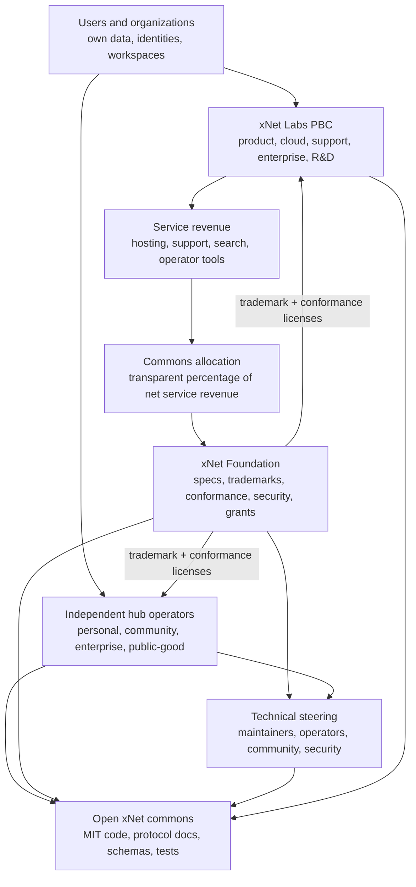
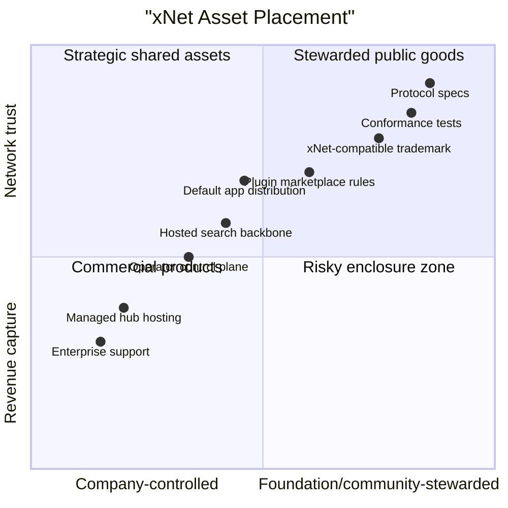
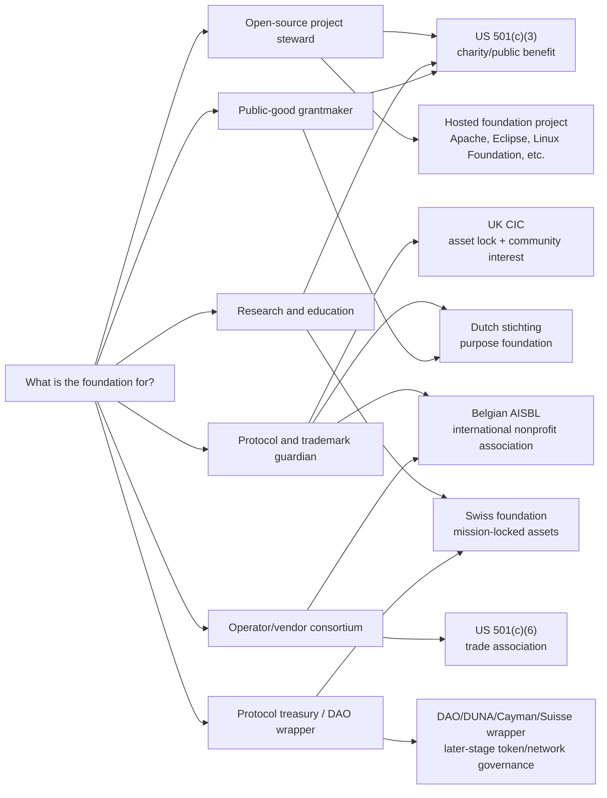
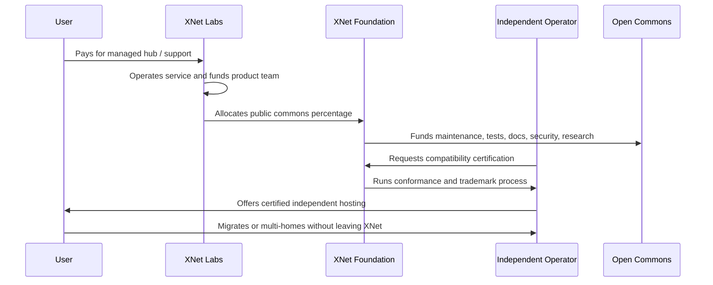
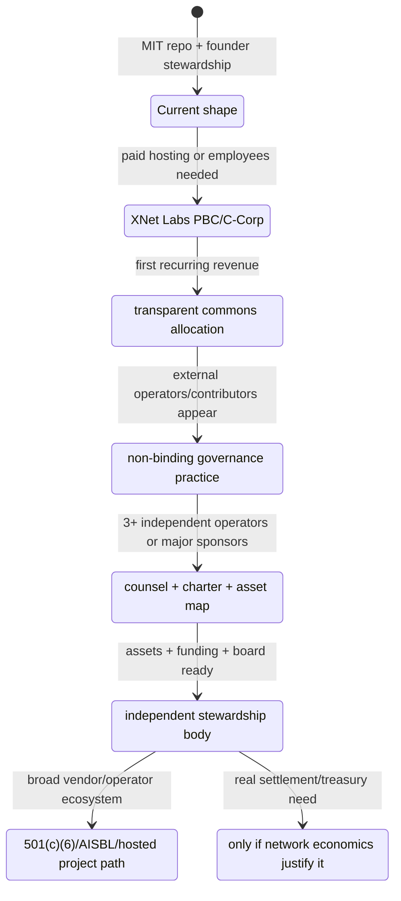

# 0145 - Foundation Models And Legal Organizing Structures For xNet Mission-Aligned Governance

> **Status:** Exploration  
> **Date:** 2026-06-03  
> **Author:** Codex  
> **Tags:** governance, foundation, legal-structure, public-benefit, nonprofit, open-source,
> federation, commons, stewardship, venture, web3, sustainability

## Problem Statement 🏛️

What legal and organizational structure should xNet use if it wants the community to believe that
its incentives are aligned with decentralization, federation, openness, open source, user-owned
data, and long-term public infrastructure?

The question is not only "Delaware C corporation or nonprofit?" It is:

- how xNet can fund serious engineering, maintenance, security, research, hosting, documentation,
  standards, and ecosystem work;
- how xNet can avoid becoming a central gatekeeper over a system whose value depends on federation;
- how users, developers, operators, public institutions, enterprises, and investors can trust that
  xNet will not enclose the protocol commons after adoption;
- how a legal structure can work in the US while staying legible to foreign markets and future
  international communities;
- how to avoid premature governance that slows the project before there is enough ecosystem to
  govern.

This is a strategic product/governance exploration, not legal, tax, securities, or investment
advice. xNet would need experienced counsel before forming, converting, transferring assets,
issuing securities, creating tokens, operating internationally, or making tax-exempt claims.

## Exploration Status

- [x] Compute the next exploration number and use a valid shortened filename
- [x] Review the root README, MIT license, and package-level positioning
- [x] Review recent explorations on VC investment, public-market/crypto paths, and monetization
- [x] Research US charitable, trade-association, public-benefit, and B Corp structures
- [x] Research international foundation and public-interest company patterns
- [x] Research adjacent open-source, federated, and Web3 governance examples
- [x] Map options, failure modes, phased adoption paths, and recommended governance boundaries
- [x] Include mermaid diagrams, checklists, example code, references, and next actions

## Executive Summary 🎯

The best long-term answer is probably **not one entity**.

For xNet, the strongest structure is a staged hybrid:

1. **xNet Labs:** a for-profit operating company, likely a Delaware Public Benefit Corporation
   (PBC) or Delaware C corporation, that builds the product, hires engineers, runs managed hubs,
   sells enterprise/operator services, and raises capital if needed.
2. **xNet Commons Fund:** an early lightweight funding layer, possibly under a fiscal sponsor,
   Open Collective-style host, donor-advised fund, or directed sponsorship program, that receives a
   transparent share of revenue and donations for open maintenance.
3. **xNet Foundation:** a later independent stewardship body that holds or governs protocol
   specifications, conformance tests, trademarks, schemas, security processes, working groups, and
   possibly grants. Depending on the ecosystem, this could be a US 501(c)(3), US 501(c)(6), UK
   Community Interest Company, Dutch stichting, Belgian AISBL, Swiss foundation, or hosted project
   under an existing open-source foundation.
4. **Operator and community governance:** technical steering, hub operator councils, standards
   working groups, compatibility certification, and public reporting that make the foundation real
   instead of symbolic.

Short answer to the entity list:

| Structure                                        | xNet fit                                                                                                                         |
| ------------------------------------------------ | -------------------------------------------------------------------------------------------------------------------------------- |
| **Delaware C corporation**                       | Best for standard venture financing and public-company path; weakest mission signal by itself.                                   |
| **Delaware Public Benefit Corporation**          | Best near-term operating-company default if xNet wants capital flexibility plus explicit mission duties.                         |
| **Certified B Corp**                             | Useful trust signal for a mature company, but certification is not itself a legal entity or community-control mechanism.         |
| **LLC**                                          | Good for early simplicity or small services; weaker for venture-scale financing, public markets, and broad ecosystem legitimacy. |
| **501(c)(3) charity**                            | Good for education, research, public-interest open infrastructure, donations, and grants; awkward as the primary cloud business. |
| **501(c)(6) trade association**                  | Good for an industry/operator consortium; less ideal if xNet's purpose is framed as broad public charity.                        |
| **Foundation-owned for-profit subsidiary**       | Strong mission lock, but complex; can create governance tension if the commercial entity must raise large capital.               |
| **For-profit opco plus independent foundation**  | Most balanced for xNet: economic engine and credible commons stewardship, if asset boundaries are designed well.                 |
| **International foundation/CIC/stichting/AISBL** | Useful if xNet's community becomes global and wants jurisdictional neutrality or EU credibility.                                 |
| **DAO/Web3 foundation wrapper**                  | Potentially useful much later for protocol treasury/operator settlement; risky and unnecessary before real network economics.    |
| **Steward-owned / purpose trust model**          | Powerful long-term mission lock if xNet chooses independence over conventional liquidity; harder for VC-style returns.           |

The strategic recommendation:

> Start as **xNet Labs PBC** or a mission-covenanted Delaware C corporation, create a transparent
> **xNet Commons Fund** immediately, and defer the independent **xNet Foundation** until there is
> enough community, operator, standards, and revenue activity to justify real shared governance.

The strongest eventual model is:



The foundation should not exist as a branding exercise. It becomes credible only when it has real
stewardship rights:

- public protocol and schema governance;
- trademark policy for "xNet-compatible" claims;
- open conformance suites;
- security advisory coordination;
- public grants and maintenance budget;
- technical steering processes;
- conflict-of-interest rules;
- transparent financial reporting;
- credible authority to say "no" to Labs when Labs wants something that harms federation.

## Current State In The Repository 🔎

### xNet is already positioned as open infrastructure plus product

The root [`README.md`](../../README.md) describes xNet as:

> Decentralized data infrastructure and application. Local-first, P2P-synced, user-owned data.

It also states that xNet is both the underlying infrastructure and the user-facing app. The
monorepo includes core cryptography, identity, sync, data, query, network, hub, React SDK, editor,
views, canvas, plugins, telemetry, formula, vectors, web, Electron, Expo, tests, and docs.

The [`LICENSE`](../../LICENSE) is MIT. That is a strong default for open infrastructure: it makes
forking, commercial use, redistribution, and ecosystem adoption easy. It also means legal alignment
cannot rely only on the code license. A future commercial entity could still capture trademarks,
hosted defaults, app distribution, marketplace control, search indexes, certification marks, or
network gateways unless governance is designed intentionally.

### What governance exists today

Current visible state:

| Surface                    | Current state                                                  | Governance implication                                                                  |
| -------------------------- | -------------------------------------------------------------- | --------------------------------------------------------------------------------------- |
| Code license               | MIT                                                            | Strong openness for code; does not govern trademarks, hosting, specs, or defaults.      |
| Brand/trademark policy     | Not visible in the repo                                        | "xNet-compatible" and "official" claims need future rules.                              |
| Foundation entity          | Not visible in the repo                                        | No independent stewardship layer yet.                                                   |
| CLA/DCO policy             | Not visible from reviewed docs                                 | Future contributor IP flow should be decided before major outside contributions.        |
| Protocol/spec governance   | Mostly project-maintainer driven                               | Fine early; risky if xNet becomes a multi-operator protocol.                            |
| Commons funding policy     | Proposed in exploration 0144, not implemented                  | Needs a public policy before monetization becomes complicated.                          |
| Hub/operator certification | Not present                                                    | Needed before "trusted hub," "certified host," or "xNet-compatible" has market meaning. |
| Token/DAO governance       | Explicitly absent in exploration 0143's current-state analysis | A strength for now; xNet can become crypto-ready before becoming crypto-native.         |

### Recent explorations already point toward a hybrid

This document builds directly on the most recent strategic explorations:

- [`0142_[_]_WHY_MIGHT_VCS_INVEST_IN_XNET_COMPELLING_VENTURE_RETURNS_AND_TIMEFRAMES.md`](./0142_[_]_WHY_MIGHT_VCS_INVEST_IN_XNET_COMPELLING_VENTURE_RETURNS_AND_TIMEFRAMES.md)
  names "open-source foundation plus commercial cloud" as an option with strong alignment, while
  warning that it creates IP, governance, and value-capture complexity.
- [`0143_[_]_WHY_MIGHT_PUBLIC_MARKETS_INVEST_IN_XNET_THINK_CRYPTO_AND_WEB3_AND_BLOCKCHAIN.md`](./0143_[_]_WHY_MIGHT_PUBLIC_MARKETS_INVEST_IN_XNET_THINK_CRYPTO_AND_WEB3_AND_BLOCKCHAIN.md)
  recommends making xNet crypto-ready before crypto-native, with metered usage and signed service
  receipts before any transferable asset.
- [`0144_[_]_POTENTIAL_MONETIZATION_ROUTES_ALIGNED_WITH_OPEN_FEDERATION.md`](./0144_[_]_POTENTIAL_MONETIZATION_ROUTES_ALIGNED_WITH_OPEN_FEDERATION.md)
  recommends open-source xNet plus paid xNet Cloud/operator services, backed by a transparent
  commons budget.

Those documents converge on the same core tension:

> xNet needs an economic engine strong enough to fund hard infrastructure work, but the network
> becomes more valuable if users and operators believe the protocol commons cannot be captured.

### xNet has two different asset classes

The cleanest governance boundary is not "open source vs business." It is **commons assets vs
commercial service assets**.

| Commons assets                                                                       | Commercial service assets                                                                |
| ------------------------------------------------------------------------------------ | ---------------------------------------------------------------------------------------- |
| Protocol specifications                                                              | Managed cloud infrastructure                                                             |
| Core schemas and compatibility profiles                                              | Enterprise support and SLAs                                                              |
| Conformance tests                                                                    | Hosted search/backbone capacity                                                          |
| Security advisories and incident coordination                                        | Migration services                                                                       |
| Open SDK/core packages                                                               | Operator control planes                                                                  |
| Trademark rules for compatibility claims                                             | White-label B2B hubs                                                                     |
| Public documentation and reference deployments                                       | Compliance add-ons                                                                       |
| Grant-funded research on federation, search, abuse, privacy, interoperability, trust | Premium UX, integrations, vertical templates, support desks, professional implementation |

The operating company can fund and build both. The foundation should eventually steward the first
column and leave the second column competitive.



The dangerous zone is the middle: assets that create revenue but also create ecosystem trust. For
example, the official hub registry, compatibility trademark, plugin marketplace rules, and
federated search defaults can become choke points even when the code is MIT. Those are the assets
that need the most explicit governance.

## External Research 🌐

### US 501(c)(3): strong public-interest signal, but constrained commercial fit

The IRS describes 501(c)(3) organizations as organizations operated for exempt purposes such as
charitable, religious, educational, scientific, literary, testing for public safety, and similar
purposes. The public benefit can fit parts of xNet: open-source education, security research,
public-interest protocols, privacy infrastructure, digital autonomy, interoperability research,
documentation, and grants.

But a 501(c)(3) is not a free pass to run any business under a nonprofit label:

- it cannot be operated for private shareholder benefit;
- private inurement/private benefit constraints matter;
- political/lobbying rules matter;
- unrelated business income can be taxable;
- if commercial activity dominates, tax-exempt status can become fragile;
- donation/grant cycles may be too unstable to fund a full cloud/product company.

Implication for xNet:

> A 501(c)(3) can be excellent for the **commons**, but it is a poor primary container for a
> fast-moving managed hosting and enterprise services business.

Best fit:

- protocol education;
- open-source maintenance grants;
- security research;
- documentation and training;
- public-interest federation labs;
- accessibility, privacy, and public knowledge work;
- conferences/community events;
- neutral standards stewardship if the exempt purpose is well framed.

Weak fit:

- paid cloud hosting as the dominant activity;
- proprietary enterprise services as the center of gravity;
- investor-backed growth;
- speculative token treasury operations.

Sources: [IRS charitable organizations](https://www.irs.gov/charities-non-profits/charitable-organizations?lang=en),
[IRS Publication 557](https://www.irs.gov/publications/p557/index.html),
[IRS unrelated business income guidance](https://www.irs.gov/publications/p598).

### US 501(c)(6): strong consortium fit, weaker public-charity fit

The IRS describes 501(c)(6) organizations as business leagues, chambers of commerce, real estate
boards, boards of trade, and similar organizations that are not organized for profit and whose net
earnings do not benefit private shareholders or individuals.

For xNet, a 501(c)(6) is plausible if the ecosystem becomes a trade association of:

- hub operators;
- app developers;
- integrators;
- enterprise vendors;
- public institutions;
- data/schema providers;
- search/backbone providers.

It can support standards, certification, industry coordination, events, policy work, and shared
infrastructure that improves a line of business. It is less emotionally compelling than a charity
if the xNet mission is framed as a public digital commons for users.

Implication:

> If xNet becomes an **operator/vendor ecosystem**, 501(c)(6) may fit better than 501(c)(3). If
> xNet becomes a **public-interest open infrastructure project**, 501(c)(3) may fit better.

Source: [IRS business leagues](https://www.irs.gov/charities-non-profits/other-non-profits/business-leagues).

### Delaware Public Benefit Corporation: mission inside a for-profit company

Delaware law defines a public benefit corporation as a for-profit corporation intended to produce a
public benefit and operate in a responsible and sustainable manner. Delaware directors must balance
stockholders' pecuniary interests, the public benefit identified in the certificate of
incorporation, and the interests of those materially affected by the corporation's conduct.

This is a strong near-term fit because xNet may need:

- employees;
- equity compensation;
- venture or strategic capital;
- commercial hosting revenue;
- enterprise contracts;
- international subsidiaries;
- public-market optionality.

But a PBC is still a for-profit company. It does not automatically create open governance, prevent
license changes, force public reporting beyond statutory/reporting requirements, or give the
community control over protocol decisions.

Implication:

> A Delaware PBC is a good operating company for **mission-compatible economics**, not a substitute
> for independent commons governance.

Source: [Delaware Code, Title 8, Chapter 1, Subchapter XV](https://delcode.delaware.gov/title8/c001/sc15/index.html).

### Certified B Corp: useful signal, not a legal structure

B Lab's certification verifies companies against social, environmental, transparency, and
accountability standards. B Lab also has legal accountability requirements based on stakeholder
governance.

But "Certified B Corp" is not the same thing as being a Delaware PBC or a benefit corporation under
state law. Certification is an external certification and brand framework.

Implication:

> xNet can pursue B Corp certification later as a trust signal, but it should not treat B Corp
> certification as the main governance answer.

Sources:
[B Lab certification overview](https://www.bcorporation.net/en-us/certification/),
[B Lab legal requirements](https://www.bcorporation.net/en-us/about-b-corps/legal-requirements/),
[B Lab distinction between Certified B Corp and benefit corporation](https://www.bcorporation.net//en-us/faq/whats-difference-between-certified-b-corp-and-benefit-corporation).

### UK Community Interest Company: strong for protocol guardianship

The UK CIC structure requires a community-interest test and includes an asset lock that prevents
assets from being used for private gain rather than the stated community purpose.

This matters because Matrix uses a CIC structure for the Matrix.org Foundation. Matrix describes
the foundation as a nonprofit UK CIC incorporated to act as the neutral guardian of the Matrix
standard on behalf of the whole community.

Implication:

> A CIC-like model can work well for a federated protocol guardian, especially when neutrality is
> more important than tax-deductible US donations.

Sources:
[GOV.UK CIC guidance](https://www.gov.uk/government/publications/community-interest-companies-how-to-form-a-cic/community-interest-companies-guidance-chapters),
[Matrix.org about Matrix](https://matrix.org/about/).

### Dutch stichting: useful international foundation form

The Netherlands describes a stichting as a foundation with a social, societal, or ideological
purpose. It has legal personality, no members or shareholders, and it may make profit if that
profit is used for the foundation's purpose.

Implication:

> A Dutch stichting is attractive for a neutral protocol/trademark/standards steward where member
> control is not desired, but board design becomes extremely important because there are no members
> to act as a democratic counterweight.

Sources:
[Business.gov.nl stichting guide](https://business.gov.nl/starting-your-business/choosing-a-business-structure/foundation/),
[KVK stichting guide](https://www.kvk.nl/en/rules-and-laws/the-stichting/).

### Swiss foundation: strong mission lock, less flexible as an operating company

Swiss guidance describes foundations as assets dedicated to a specific purpose and subject to
supervision. The Swiss SME portal warns that a foundation is not an ideal legal form for a company.
Swiss foundations are common in parts of the crypto ecosystem, including protocol foundations, but
they should not be treated as a shortcut around securities, tax, governance, or operational issues.

Implication:

> A Swiss foundation can be compelling if xNet becomes a protocol treasury or international
> standards/research foundation, but it is probably not the first operating structure.

Sources:
[Swiss SME portal on foundations](https://www.kmu.admin.ch/kmu/en/home/concrete-know-how/setting-up-sme/starting-business/choosing-legal-structure/foundations.html),
[Geneva legal framework summary](https://www.ge.ch/dossier/philanthropy-portal/practical-steps/key-summary-swiss-and-geneva-legal-framework).

### Belgian AISBL: strong EU consortium pattern

The Eclipse Foundation transitioned to a Belgian AISBL, an international nonprofit association
based in Brussels. Gaia-X is also organized as an international nonprofit association under Belgian
law. This structure can be legible for European industry collaboration, digital sovereignty,
privacy, and multi-member governance.

Implication:

> If xNet becomes a global federation standard with significant European operators, a Belgian AISBL
> or hosted European foundation project may be more credible than a US-only structure.

Sources:
[Eclipse Foundation transition announcement](https://newsroom.eclipse.org/news/announcements/open-source-software-leader-eclipse-foundation-officially-transitions-eu-based),
[Eclipse Foundation Europe](https://www.eclipse.org/europe/),
[Gaia-X association](https://gaia-x.eu/who-we-are/association/).

### Existing open-source foundations show different trust models

Open-source governance examples:

| Example                    | Model                                                                                          | Lesson for xNet                                                                 |
| -------------------------- | ---------------------------------------------------------------------------------------------- | ------------------------------------------------------------------------------- |
| Apache Software Foundation | US 501(c)(3) charity stewarding many open-source projects                                      | Strong neutral charity model for project communities and trademarks.            |
| Python Software Foundation | US 501(c)(3) scientific/educational public charity                                             | Strong fit for language/ecosystem grants, education, packaging, community.      |
| Linux Foundation           | Large neutral open technology consortium ecosystem, commonly understood as a 501(c)(6) pattern | Strong for industry-backed shared infrastructure and standards.                 |
| Mozilla                    | 501(c)(3) foundation with wholly owned taxable subsidiary                                      | Shows nonprofit parent + market-based work can coexist, but governance is hard. |
| Matrix.org Foundation      | UK CIC guardian for federated protocol standard                                                | Directly relevant to xNet's federation/protocol stewardship problem.            |
| Signal Foundation          | 501(c)(3) nonprofit supporting Signal Messenger LLC                                            | Shows nonprofit + LLC can support mission-driven consumer infrastructure.       |
| Ethereum Foundation        | Nonprofit ecosystem supporter, explicitly not the controller/leader of Ethereum                | Useful Web3 lesson: foundation should fund and coordinate, not claim ownership. |

Sources:
[Apache Software Foundation](https://www.apache.org/foundation/index.html),
[Python Software Foundation](https://legacy.python.org/psf/about/),
[Linux Foundation](https://www.linuxfoundation.org/),
[Mozilla Foundation structure](https://wiki.mozilla.org/foundation),
[Mozilla Corporation](https://www.mozilla.org/en-GB/foundation/moco/),
[Matrix.org](https://matrix.org/about/),
[Signal Foundation](https://signalfoundation.org/es/),
[Ethereum Foundation](https://ethereum.org/foundation/).

### Web3 foundation/DAO wrappers are later-stage, not first-stage

Web3 ecosystems often use foundations, Cayman foundation companies, Swiss foundations, DAO LLCs,
or decentralized nonprofit association structures to hold assets, manage governance, and interact
with legal systems. These can make sense when there is a real protocol treasury, decentralized
operator network, token governance system, or cross-border settlement layer.

For xNet today, the risk is premature theater:

- token governance before there are meaningful network services to govern;
- foundations that are controlled by insiders but marketed as decentralized;
- treasury speculation distracting from product-market fit;
- securities/tax/regulatory complexity before xNet has usage;
- community cynicism if "foundation" means "token issuer with a board."

Implication:

> xNet should become **governance-ready** and **crypto-ready** before becoming DAO-native.

Useful later triggers:

- hundreds or thousands of independent operators;
- measurable cross-hub settlement needs;
- public service receipts;
- significant third-party app/view/search providers;
- community grants that need transparent treasury governance;
- strong legal review across securities, tax, commodities, payments, sanctions, and consumer
  protection.

### Steward ownership and purpose trusts are worth keeping on the map

Steward ownership separates control from pure financial extraction: control stays with people
connected to the mission, while profits are reinvested, used for capital costs, shared with
stakeholders, or donated. In the US, some companies use perpetual purpose trusts to preserve
mission over time.

This is not the standard venture path. But if xNet decides that independence and mission lock
matter more than conventional liquidity, steward ownership could be a powerful long-term model.

Implication:

> Steward ownership is a credible "something else entirely" if xNet wants to be durable open
> infrastructure rather than a conventional startup. It is less compatible with VC expectations,
> but more compatible with deep community trust.

Sources:
[Purpose Foundation](https://purpose-economy.org/en/purpose-foundation/),
[Purpose US](https://www.purpose-us.com/).

## Key Findings 🔑

1. **Entity names do not create trust by themselves.** A PBC, B Corp, nonprofit, CIC, foundation,
   or DAO wrapper only matters if meaningful assets, duties, budgets, or veto points sit inside the
   structure.
2. **xNet needs an operating company unless it chooses to remain small.** Managed hubs, enterprise
   support, search/backbone hosting, and paid operator tools are normal commercial activity and
   should not be forced into a charity unless the project wants nonprofit constraints.
3. **The foundation should protect the network boundary, not manage every product decision.** Specs,
   conformance, compatibility marks, registry rules, security processes, and grants are appropriate
   foundation surfaces. Button placement, customer support, and cloud pricing are not.
4. **501(c)(3) is strongest for public-interest research and education.** It can fit open-source
   maintenance, privacy, security, interoperability, and public digital infrastructure, but it is
   not the cleanest home for a cloud business.
5. **501(c)(6), AISBL, and hosted foundation projects become more attractive when operators and
   vendors show up.** If xNet becomes an ecosystem of hosts, app vendors, integrators, and public
   institutions, consortium governance may matter more than charitable framing.
6. **B Corp certification is a later trust layer, not the foundation.** It can help signal values,
   but it does not replace asset placement, trademark policy, governance, or revenue commitments.
7. **International legitimacy should be earned by stakeholder reality.** A UK CIC, Dutch stichting,
   Belgian AISBL, or Swiss foundation can be valuable, but forming one before meaningful non-US
   adoption would add cost before trust.
8. **A crypto/Web3 foundation is premature until there are real service receipts and operator
   economics.** The legal wrapper should follow network utility, not create speculative gravity.
9. **The most credible hybrid is simple to explain.** Labs sells operational value. The Foundation
   protects interoperability. Users can leave. Operators can compete. The commons gets funded.
10. **The hardest future conflict is not open source vs closed source.** It is who controls the
    defaults: official search, official registries, compatibility marks, app distribution, and
    hosted identity/hub onboarding.

```mermaid
mindmap
  root((XNet governance fit))
    Operating company
      Delaware PBC
      Delaware C corp
      LLC
      Steward-owned company
    Commons steward
      501(c)(3)
      CIC
      Dutch stichting
      Swiss foundation
    Ecosystem consortium
      501(c)(6)
      Belgian AISBL
      Hosted foundation project
    Trust overlays
      Certified B Corp
      Public benefit reports
      Commons budget
      Trademark policy
    Later-stage Web3
      Service receipts first
      Stable payments first
      DAO wrapper only if needed
      Token only after real utility
```

## The Core Design Question 🧭

xNet has to decide what the foundation is supposed to protect.

There are at least six different "foundation purposes":

1. **Open-source project steward:** protect code, contributors, releases, governance, and community.
2. **Protocol/standards guardian:** protect specs, compatibility, trademarks, and conformance.
3. **Public-interest research lab:** fund privacy, security, local-first, federation, search, and
   digital autonomy research.
4. **Operator consortium:** coordinate hub operators, shared abuse systems, interop tests,
   settlement, certifications, and service norms.
5. **Public-good grantmaker:** distribute funds to maintainers, security work, docs, translations,
   accessibility, and ecosystem projects.
6. **Token/protocol treasury wrapper:** manage on-chain/off-chain governance, treasury, grants, and
   network incentives.

Each purpose points to a different legal structure:



xNet does not need to decide all of this on day one. It needs to avoid decisions that foreclose the
right later structure.

## Options And Tradeoffs ⚖️

### Option 1: Plain Delaware C corporation

**Model:** xNet is a standard Delaware C corporation. It owns the brand, product, IP, cloud,
marketplace, and commercial contracts.

**Benefits:**

- simplest path for US venture capital;
- familiar equity, option, SAFEs, preferred stock, M&A, and public-market path;
- easiest to move fast;
- can still publish MIT code and operate transparently;
- can later create a foundation, convert to PBC, or donate assets.

**Costs:**

- weakest formal mission signal;
- community may fear future enclosure;
- board duties and investor expectations may push toward financial optimization;
- any "commons budget" is mostly a policy promise unless contractually committed;
- future foundation transfer can be politically and legally harder after value accrues.

**Best if:** xNet needs standard startup financing above all else and is willing to build trust
through license, transparency, governance docs, and later asset transfers.

**xNet verdict:** viable, but not the most aligned default if mission signaling is central.

### Option 2: Delaware Public Benefit Corporation

**Model:** xNet Labs is a Delaware PBC with a specific public benefit in its charter.

Potential public benefit language should be drafted by counsel, but the intent could be:

> To develop and promote open, interoperable, local-first, user-owned data infrastructure that
> enables individuals and organizations to communicate, collaborate, publish, search, and preserve
> information across decentralized and federated networks.

**Benefits:**

- still a for-profit corporation with equity and commercial flexibility;
- stronger alignment signal than a plain C corporation;
- director balancing duties can consider users, operators, open infrastructure, and public benefit;
- good bridge between venture realism and mission;
- compatible with B Corp certification later;
- easier to operate managed hosting than through a charity.

**Costs:**

- still controlled by stockholders and board, not the community;
- public benefit enforcement is limited and depends on stockholders/corporate process;
- can become mission-washing if no operational commitments exist;
- may be less familiar to some investors, though far less unusual than nonprofit control;
- does not by itself protect trademarks, specs, or conformance tests.

**Best if:** xNet expects to build a real business but wants public mission duties in the operating
company from the start.

**xNet verdict:** strongest near-term operating-company default.

### Option 3: Delaware C corporation plus mission covenants

**Model:** xNet is a normal C corporation but uses contractual and governance documents to commit
to open-source and federation principles.

Examples:

- public "xNet Alignment Covenant";
- board-approved commons budget policy;
- trademark neutrality policy;
- open protocol pledge;
- DCO/CLA policy;
- public annual report;
- investor side-letter or charter covenant requiring supermajority approval to close the core
  protocol or revoke self-hosting commitments.

**Benefits:**

- investor familiarity;
- more flexible than PBC if investors resist;
- can still create meaningful constraints if contracts and asset placement are real;
- can convert to PBC later.

**Costs:**

- weaker public signal than PBC;
- covenants are only as strong as their drafting and enforcement;
- may look like promises without legal teeth;
- can be diluted by future financing unless protected.

**Best if:** xNet needs C-corp investor simplicity but still wants to document commitments early.

**xNet verdict:** acceptable fallback if PBC is a financing obstacle.

### Option 4: LLC

**Model:** xNet starts as an LLC, likely manager-managed, with an operating agreement embedding
mission and revenue allocation.

**Benefits:**

- flexible;
- can be simple for early services;
- operating agreement can define unusual governance;
- pass-through tax treatment may be useful in some early cases;
- easier for a small founder-owned project.

**Costs:**

- less standard for VC;
- less obvious for public markets;
- weaker community signal than a foundation/PBC;
- ownership/governance can be opaque;
- conversion later can create tax/legal complexity.

**Best if:** xNet stays small, founder-led, service-oriented, and not venture-backed.

**xNet verdict:** useful only for a small early services wrapper, not ideal for the main long-term
structure.

### Option 5: 501(c)(3) nonprofit owns everything

**Model:** A charitable xNet Foundation owns the code, brand, product, cloud, and operating
activity.

**Benefits:**

- strongest public-interest signal;
- tax-deductible donation path;
- grant eligibility;
- no shareholders demanding extraction;
- strong fit for education, research, accessibility, open-source, privacy, and security work;
- community may trust it more than a startup.

**Costs:**

- hard to run a fast-growing paid cloud business inside the charity;
- private benefit and unrelated business income constraints;
- compensation, contracts, and insider relationships require careful handling;
- raising equity capital is not available in the normal way;
- governance can become slow or grant-driven;
- commercial competitors may benefit from foundation-funded work without helping fund it;
- if a for-profit subsidiary is later created, boundaries become complex.

**Best if:** xNet chooses public-good infrastructure over startup growth and expects donations,
grants, sponsorships, and modest service revenue to fund the work.

**xNet verdict:** strong for a future foundation, weak as the main operating company if xNet needs
managed hubs, enterprise services, and rapid product development.

### Option 6: 501(c)(6) trade association / consortium

**Model:** xNet Foundation is a trade association of operators, vendors, developers, integrators,
institutions, and users.

**Benefits:**

- strong for industry coordination;
- membership dues can fund standards and conformance;
- natural home for operator certification;
- good for hub peering norms, abuse coordination, compatibility test suites, and trademark
  licensing;
- familiar to open-source foundations that serve ecosystems of companies.

**Costs:**

- less public-charity aura;
- may be captured by large vendors;
- individual users may not feel represented;
- donation/grant path is different from 501(c)(3);
- can become politics-heavy if created too early.

**Best if:** xNet has many independent commercial operators and app vendors who need neutral
coordination.

**xNet verdict:** plausible later if the ecosystem becomes operator/vendor-heavy.

### Option 7: Foundation parent with for-profit subsidiary

**Model:** A nonprofit foundation controls a taxable for-profit subsidiary that runs commercial
services.

Examples adjacent to this pattern include Mozilla Foundation/Mozilla Corporation and Signal
Foundation/Signal Messenger LLC.

**Benefits:**

- strong mission lock at the parent;
- for-profit subsidiary can sell services and employ product teams;
- public can see that commercial work serves a nonprofit mission;
- foundation can own key assets and license them to subsidiary.

**Costs:**

- complex governance;
- subsidiary capital raising is hard if nonprofit control limits investor exit/control;
- conflicts between nonprofit purpose and commercial urgency can become severe;
- parent/subsidiary transactions require careful fair-market and private-benefit analysis;
- hard to communicate cleanly;
- failure modes are public and legitimacy-damaging.

**Best if:** xNet prioritizes public mission and can fund growth mostly through revenue,
philanthropy, strategic partnerships, or limited aligned capital rather than conventional VC.

**xNet verdict:** powerful but heavy. Keep as a long-term possibility if xNet wants mission lock
over venture-style scaling.

### Option 8: For-profit opco plus independent foundation

**Model:** xNet Labs is the operating company. xNet Foundation is an independent or semi-independent
steward of specific commons assets and processes.

**Benefits:**

- clean separation of economics and commons;
- Labs can raise capital and move quickly;
- Foundation can govern protocol, specs, trademarks, conformance, security, and grants;
- independent operators and contributors have a credible home;
- avoids forcing all commercial activity into nonprofit constraints;
- can evolve gradually.

**Costs:**

- requires careful IP/trademark/license agreements;
- Labs and Foundation can disagree;
- duplicated admin and governance burden;
- needs real funding;
- if Labs controls the foundation in practice, trust benefit evaporates;
- if Foundation controls too much too early, execution slows.

**Best if:** xNet wants both a serious company and a serious commons.

**xNet verdict:** best long-term target.



### Option 9: Hosted foundation project

**Model:** xNet joins or creates a project under an existing foundation such as Apache, Eclipse,
Linux Foundation, OpenJS, OpenSSF, or another relevant host.

**Benefits:**

- established governance templates;
- credibility;
- legal infrastructure;
- event/sponsorship/membership machinery;
- neutral brand if the host is respected;
- less overhead than creating everything from scratch.

**Costs:**

- less control;
- host rules may not fit xNet's product/protocol blend;
- foundation processes can be slower;
- commercial Labs boundary still needs design;
- not all hosts fit MIT/product/cloud/federation/trademark needs.

**Best if:** xNet becomes strategically important but does not want to build its own foundation
administration.

**xNet verdict:** worth evaluating when third-party operators and institutional partners arrive.

### Option 10: International foundation / CIC / stichting / AISBL

**Model:** xNet creates a non-US public-interest or nonprofit entity for protocol stewardship.

**Benefits:**

- global trust beyond US startup frame;
- better fit for EU public sector, digital sovereignty, privacy, and open standards;
- can avoid "US company owns the decentralized internet layer" perception;
- models like Matrix CIC and Eclipse AISBL are directly relevant.

**Costs:**

- legal complexity;
- fundraising/donation/tax recognition may be fragmented;
- requires international board/admin competence;
- can complicate US commercial operations;
- not necessarily better unless community is truly international.

**Best if:** xNet becomes a cross-border protocol and has meaningful non-US stakeholders.

**xNet verdict:** not first step, but important long-term option.

### Option 11: DAO, DUNA, Cayman foundation company, or crypto foundation

**Model:** xNet uses DAO-like governance and a legal wrapper for treasury, grants, operator
settlement, or token governance.

**Benefits:**

- can map governance to public network participation;
- can coordinate a treasury for protocol grants;
- can support public operator markets;
- may be legible to Web3/public-market investors;
- can make service receipts, settlement, and delegated voting transparent.

**Costs:**

- premature tokens distort priorities;
- governance capture by whales or insiders;
- securities/tax/regulatory risk;
- hard to represent non-token users;
- can repel enterprise/public-sector adopters;
- can become a speculative asset story instead of an infrastructure story.

**Best if:** xNet later has real decentralized network economics that cannot be handled with
ordinary contracts, invoices, stablecoins, and service credits.

**xNet verdict:** prepare data structures for verifiable service receipts; do not create DAO/token
governance now.

### Option 12: Steward-owned company / perpetual purpose trust

**Model:** xNet's operating company is owned or constrained by a purpose trust or steward-ownership
structure, separating control from extractive financial ownership.

**Benefits:**

- deep mission lock;
- stronger independence than PBC;
- profits can be structurally dedicated to purpose;
- community may trust it more than VC ownership;
- succession can be designed around the mission instead of founder liquidity.

**Costs:**

- nonstandard;
- financing is harder;
- liquidity is constrained;
- legal setup is specialized;
- may reduce ability to attract venture-scale capital or employees seeking conventional equity
  upside.

**Best if:** xNet wants durable independence and can fund itself through revenue, grants,
mission-aligned debt, redeemable equity, or patient capital.

**xNet verdict:** keep as a serious long-term path if the project chooses self-sufficiency over
venture-scale outcomes.

## Scenario Map 🗺️

### Scenario A: Startup-first, foundation later

xNet Labs starts as a Delaware PBC, sells managed hubs and enterprise services, raises modest
mission-aligned capital, publishes a commons budget, and creates a foundation only after the
ecosystem has external operators and contributors.

**What works:**

- fast execution;
- clear hiring and fundraising;
- no premature governance overhead;
- foundation can be designed from real ecosystem needs.

**What can go wrong:**

- community distrust if foundation is delayed too long;
- Labs accumulates too much control over defaults, brand, search, and marketplace;
- investors later resist asset transfers;
- "public benefit" looks like branding if no concrete commitments exist.

**Guardrails:**

- form as PBC or publish equivalent mission covenants;
- adopt commons budget before revenue scales;
- draft trademark/open-protocol policies early;
- make migration/self-hosting real;
- define foundation trigger points.

### Scenario B: Foundation-first public infrastructure

xNet forms a 501(c)(3) or CIC-style foundation early and builds xNet as a public-good project.
Commercial services are small, outsourced, or handled by a later subsidiary.

**What works:**

- high mission trust;
- grant/donation path;
- easier public-sector and civil-society story;
- community governance from the beginning.

**What can go wrong:**

- underfunded engineering;
- slow product iteration;
- hard to run reliable managed services;
- dependency on grants and sponsors;
- difficult to compete with well-funded platforms;
- commercial subsidiary complexity appears anyway.

**Guardrails:**

- keep scope narrow;
- fund staff realistically;
- avoid pretending donations alone can fund cloud operations;
- set clear service/subsidiary boundaries.

### Scenario C: Consortium protocol

xNet becomes important to multiple companies, operators, public institutions, and app vendors. A
501(c)(6), AISBL, or hosted foundation project governs standards, conformance, compatibility, and
certification. Labs remains one vendor among many.

**What works:**

- strong for federation;
- operators trust neutrality;
- institutional adoption improves;
- shared costs for tests, docs, security, abuse coordination.

**What can go wrong:**

- large members capture roadmap;
- individual users are underrepresented;
- governance slows technical progress;
- Labs loses ability to maintain product coherence;
- committees favor lowest-common-denominator standards.

**Guardrails:**

- separate product roadmap from protocol standards;
- weighted-but-capped member influence;
- individual maintainer and user seats;
- public conformance criteria;
- conflict-of-interest rules.

### Scenario D: Mozilla/Signal-style nonprofit parent

A nonprofit foundation controls a for-profit subsidiary. xNet commercial work exists, but the
mission parent holds ultimate control.

**What works:**

- strong mission story;
- commercial activity can fund public purpose;
- key assets can remain under nonprofit control.

**What can go wrong:**

- capital constraints;
- parent/subsidiary conflicts;
- public controversy if commercial choices appear to compromise mission;
- complex tax/private-benefit analysis.

**Guardrails:**

- transparent governance;
- independent board competence;
- arm's-length agreements;
- clear compensation and conflict policies;
- avoid over-reliance on one commercial revenue source.

### Scenario E: Web3 protocol foundation

xNet eventually has independent operators, service receipts, stablecoin settlement, and maybe a
protocol resource token. A foundation or DAO wrapper manages grants, treasury, operator incentives,
and public governance.

**What works:**

- public market participation;
- operator incentives;
- transparent grants;
- credible decentralization if network participation is broad.

**What can go wrong:**

- speculative incentives overwhelm product;
- securities/regulatory risk;
- whales or insiders govern the commons;
- non-token users lose voice;
- enterprises and families avoid the network because it feels financialized.

**Guardrails:**

- no token until real settlement need exists;
- use stablecoins/service credits first;
- non-transferable reputation before transferable governance;
- legal review before public asset issuance;
- user and operator representation not reducible to token balances.

### Scenario F: Steward-owned independent infrastructure company

xNet rejects conventional exit pressure. Control is held in trust/steward form; profits fund
mission, product, employees, and commons. Outside capital is patient and capped or redeemable.

**What works:**

- strongest independence;
- deep community trust;
- long-term R&D orientation;
- lower pressure to centralize or extract.

**What can go wrong:**

- slower scaling;
- harder hiring if equity upside is limited;
- less VC interest;
- specialized legal/admin burden.

**Guardrails:**

- design aligned financing early;
- pay competitive salaries;
- publish financial sustainability metrics;
- use debt/revenue-based/patient capital thoughtfully.

## Failure Modes 🚨

### 1. Mission-washed PBC

xNet forms a PBC, writes beautiful public benefit language, then keeps all important rights inside
the company and runs the ecosystem like a normal platform.

**Symptom:** self-hosting technically exists, but official identity, search, marketplace,
certification, and defaults make Labs unavoidable.

**Prevention:** put real assets and processes under public or foundation governance: conformance,
trademark policy, open registry rules, migration tests, and commons budget.

### 2. Premature foundation

xNet creates a foundation before there is a real community, forcing a small product team to serve a
governance structure instead of users.

**Symptom:** lots of meetings, few shipped improvements, no money.

**Prevention:** start with a commons fund and advisory council; trigger foundation formation when
specific thresholds are met.

### 3. Captured foundation

The foundation exists, but the board is effectively Labs, investors, or a small insider group.

**Symptom:** community distrust increases because "foundation" now feels like camouflage.

**Prevention:** independent directors, operator/contributor seats, conflict policies, term limits,
public minutes, and transparent asset agreements.

### 4. Charity trapped in commercial reality

xNet puts everything in a 501(c)(3), then discovers that cloud hosting, enterprise work, and
private benefit constraints make normal operations hard.

**Symptom:** every deal requires legal gymnastics; revenue is taxable or risky; growth stalls.

**Prevention:** keep commercial services in a taxable operating entity and let the charity steward
public-interest work.

### 5. Consortium captured by incumbents

Large cloud providers, enterprises, or operators fund a foundation and steer standards toward their
own interests.

**Symptom:** the protocol remains "open" but favors large operators through compliance complexity,
resource demands, or certification fees.

**Prevention:** cap member influence, protect individual maintainer/user voice, keep conformance
tests open, and publish low-cost operator paths.

### 6. Token-before-network

xNet launches a token or DAO before the network has usage, service receipts, or operator economics.

**Symptom:** roadmap shifts from product and protocol to exchange listings, treasury debates, and
governance theater.

**Prevention:** follow exploration 0143: metering, receipts, operator offers, stable payments, and
legal review first.

### 7. Trademark enclosure

The code is MIT, but the brand and compatibility mark become the real moat.

**Symptom:** forks can exist, but only Labs can plausibly be "real XNet."

**Prevention:** publish a trademark policy that lets compatible independent implementations use
clear compatibility language while protecting users from confusion and abuse.

### 8. No one funds boring maintenance

The foundation funds exciting grants and events, but not CI, release engineering, security,
dependency upgrades, docs, and abuse response.

**Symptom:** public-good code exists but degrades.

**Prevention:** commons budget should reserve explicit percentages for maintenance/security/docs,
not only new research.

## Foundation Trigger Points 📍

xNet should not form every structure immediately. It should define triggers.



Suggested concrete thresholds:

| Trigger                            | Threshold                                                                                | Action                                                                         |
| ---------------------------------- | ---------------------------------------------------------------------------------------- | ------------------------------------------------------------------------------ |
| First meaningful revenue           | More than hobby income from hosting/support                                              | Publish commons allocation policy.                                             |
| Outside contributors               | 10+ recurring non-founder contributors or maintainers                                    | Publish governance, DCO/CLA, maintainer, and security policies.                |
| Independent operators              | 3+ production hubs not run by Labs                                                       | Create operator advisory council and conformance roadmap.                      |
| Marketplace/registry control       | Official plugin/schema/hub registry influences adoption                                  | Move registry rules and compatibility tests toward foundation process.         |
| Enterprise/public-sector adoption  | xNet becomes infrastructure for organizations with switching costs                       | Publish trademark, migration, compatibility, and data-portability commitments. |
| Significant public-good donations  | More than small sponsorships/grants                                                      | Use fiscal sponsor or form foundation.                                         |
| Token/settlement interest          | Real cross-operator settlement volume and signed service receipts                        | Commission legal analysis before any token/DAO wrapper.                        |
| International public-sector demand | EU/UK/public-interest institutions require neutral governance or local legal counterpart | Evaluate CIC, AISBL, stichting, Swiss foundation, or hosted foundation.        |

## Recommended Phased Structure 🧱

### Phase 0: Today - public commitments without entity overhead

Do now:

- keep MIT core;
- publish an `OPEN_GOVERNANCE.md` or `docs/governance/README.md`;
- write an "xNet Alignment Covenant";
- document what will remain open: core protocol, schemas, self-hosting, export/migration,
  conformance tests;
- document what may be commercial: managed hosting, support, compliance, premium operator tools,
  enterprise integrations, hosted search/backbone capacity;
- choose DCO vs CLA before major outside contribution growth;
- draft a trademark and compatibility policy;
- define foundation trigger points;
- create a simple public commons budget policy, even before revenue is large.

This phase does not require creating a nonprofit. It requires making future trust promises concrete
enough that they can be audited.

### Phase 1: Operating company - xNet Labs PBC unless financing requires C-corp

Recommended default:

> Form **xNet Labs, PBC** as the operating company.

If investor constraints make PBC meaningfully harder, use a Delaware C corporation with strong
mission covenants and an explicit conversion/foundation roadmap.

Labs should own and operate:

- managed hubs;
- customer contracts;
- employment;
- cloud infrastructure;
- enterprise support;
- paid operator control plane;
- commercial marketplace services;
- premium product surfaces.

Labs should publicly commit to:

- MIT/open core;
- self-hosting and migration;
- no artificial federation lock-in;
- commons allocation;
- public benefit reporting;
- future foundation triggers.

### Phase 2: Commons funding - start lightweight

Create:

- "xNet Commons Fund";
- transparent allocation formula;
- public ledger of funded work;
- sponsorship categories;
- directed maintenance grants;
- security and documentation budgets.

This can begin under:

- a fiscal sponsor;
- Open Collective-style fiscal host;
- donor-advised structure;
- a temporary Labs-managed restricted fund with public reporting;
- a hosted foundation project if available.

The key is not the wrapper. The key is that users can see:

- revenue came in;
- a percentage went to commons;
- named work was funded;
- outcomes shipped.

### Phase 3: Foundation design - asset map before incorporation

Before creating xNet Foundation, define exactly what it will hold or govern.

Candidate foundation assets:

- `xnet` and `@xnetjs` compatibility marks;
- protocol specifications;
- canonical schema compatibility profiles;
- conformance test suite;
- security advisory process;
- operator certification process;
- public hub registry rules;
- research grants;
- governance process for breaking changes;
- public documentation standards.

Assets Labs may retain:

- app product code if still MIT but commercially developed;
- cloud deployment internals;
- customer contracts;
- enterprise support materials;
- proprietary operational tools if any;
- revenue-generating hosted services;
- employment relationships.

Critical rule:

> Transfer enough to make the foundation meaningful, but not so much that Labs cannot fund and
> operate the product.

### Phase 4: Foundation launch - choose structure based on actual purpose

Choose:

- **501(c)(3)** if the main work is charitable/scientific/educational public open infrastructure;
- **501(c)(6)** if the main work is operator/vendor standards and industry coordination;
- **UK CIC** if the goal is a community-interest protocol guardian with asset lock and a Matrix-like
  frame;
- **Dutch stichting** if the goal is an international purpose foundation without members;
- **Belgian AISBL** if the goal is a European/international member association like Eclipse/Gaia-X;
- **Swiss foundation** if the goal is mission-locked international research/treasury/stewardship;
- **hosted foundation project** if administration and neutrality are better supplied by an existing
  host.

### Phase 5: Mature ecosystem governance

When xNet has many operators and stakeholders:

- create a Technical Steering Committee;
- create working groups for schemas, search, identity, federation, abuse, privacy, compliance,
  accessibility, and security;
- publish compatibility profiles;
- certify independent hosts;
- fund grants;
- publish annual impact and financial reports;
- maintain trademark and conformance rules;
- run transparent elections or appointments with term limits;
- keep Labs as an important vendor, not the only legitimate network actor.

## Legal Structure Decision Matrix 📊

Scored from 1 to 5 for xNet's likely needs. Higher is better except "governance overhead," where
higher means easier/lower overhead.

| Structure                         | Mission trust | Commercial flexibility | VC/public-market fit | Grant/donation fit | International legibility | Low overhead | Overall read                          |
| --------------------------------- | ------------- | ---------------------- | -------------------- | ------------------ | ------------------------ | ------------ | ------------------------------------- |
| Delaware C corp                   | 2             | 5                      | 5                    | 1                  | 4                        | 5            | Strong business, weak trust alone     |
| Delaware PBC                      | 3.5           | 4.5                    | 4                    | 1                  | 4                        | 4            | Best operating-company default        |
| LLC                               | 2             | 4                      | 2                    | 1                  | 2.5                      | 4            | Small/simple, not ideal long term     |
| Certified B Corp overlay          | 3             | 4                      | 3.5                  | 1                  | 4                        | 2.5          | Useful signal, not a structure        |
| 501(c)(3) foundation              | 5             | 1.5                    | 1                    | 5                  | 3.5                      | 2            | Great commons body, weak opco         |
| 501(c)(6) association             | 3.5           | 2.5                    | 1                    | 2                  | 3                        | 2            | Great operator consortium             |
| Foundation parent + subsidiary    | 4.5           | 3                      | 2                    | 4                  | 4                        | 1.5          | Strong but complex                    |
| Opco + independent foundation     | 4.5           | 4.5                    | 4                    | 4                  | 4                        | 2.5          | Best mature target                    |
| UK CIC                            | 4             | 2.5                    | 1.5                  | 2.5                | 3.5                      | 2.5          | Strong protocol guardian              |
| Dutch stichting                   | 4             | 2                      | 1.5                  | 3                  | 4                        | 2            | Strong neutral steward                |
| Belgian AISBL                     | 4             | 2                      | 1.5                  | 2.5                | 4.5                      | 1.5          | Strong EU/international consortium    |
| Swiss foundation                  | 4             | 1.5                    | 1.5                  | 3                  | 4.5                      | 1.5          | Strong mission/treasury steward       |
| DAO/Web3 wrapper                  | 2.5           | 2.5                    | 2.5                  | 1                  | 2.5                      | 1            | Only after real network economics     |
| Steward ownership / purpose trust | 5             | 3                      | 2                    | 2                  | 3                        | 1.5          | Deep mission lock, financing tradeoff |

```mermaid
quadrantChart
    title "Mission Trust vs Commercial Flexibility"
    x-axis "Low mission trust" --> "High mission trust"
    y-axis "Low commercial flexibility" --> "High commercial flexibility"
    quadrant-1 "Ideal long-term zone"
    quadrant-2 "Business-first zone"
    quadrant-3 "Weak fit"
    quadrant-4 "Commons-first zone"
    "C corp": [0.40, 1.00]
    "PBC": [0.70, 0.90]
    "LLC": [0.40, 0.80]
    "501c3": [1.00, 0.30]
    "501c6": [0.70, 0.50]
    "Opco + Foundation": [0.90, 0.90]
    "CIC": [0.80, 0.50]
    "Stichting": [0.80, 0.40]
    "AISBL": [0.80, 0.40]
    "Steward-owned": [1.00, 0.60]
    "DAO wrapper": [0.50, 0.50]
```

## Recommended Governance Boundaries 🧩

### What the foundation should eventually control

The foundation should control or govern:

- protocol specifications;
- conformance test suite;
- compatibility marks;
- public security advisory process;
- operator certification criteria;
- schema compatibility profiles;
- deprecation/breaking-change process;
- grants for public-good work;
- independent technical steering;
- public registry governance if official registries become adoption-critical.

### What Labs should control

Labs should control:

- commercial roadmap;
- managed xNet Cloud;
- customer support;
- enterprise features;
- hiring and compensation;
- commercial pricing;
- infrastructure vendors;
- app UX;
- professional services;
- internal operational tooling.

### What should remain open regardless of structure

This is the promise that should be public:

- users can export data;
- users can migrate hubs;
- independent hubs can federate;
- core protocols and schemas are documented;
- compatibility is testable;
- plugins/schemas can be distributed outside the official marketplace;
- no core network right requires payment to Labs;
- paid services are for reliability, convenience, support, compliance, scale, and operations.

### What should not be foundation-governed too early

Do not put these under committee governance before the product works:

- day-to-day product design;
- every package release;
- app UI decisions;
- customer prioritization;
- pricing experiments;
- hiring;
- infrastructure implementation details.

Premature governance over execution will slow xNet before it has enough adoption to justify the
cost.

## Investor And Market Interpretation 💸

### How VCs might see the hybrid

Positive:

- PBC/Labs keeps investable equity path;
- foundation reduces ecosystem distrust and expands adoption;
- open protocol can increase market size;
- managed cloud remains monetizable;
- foundation can make enterprises and public institutions more comfortable.

Negative:

- investors may worry about IP leakage;
- foundation might constrain future strategic options;
- governance complexity can slow decisions;
- if too much value moves to the foundation, Labs may look less venture-scale.

Best framing:

> Labs monetizes operational value; Foundation protects the standards and trust layer that makes
> the market larger.

### How public markets might see the hybrid

Positive:

- public company path remains possible through Labs/PBC;
- open network metrics can support infrastructure-market narrative;
- foundation governance reduces monopoly/regulatory risk;
- if crypto rails are later added, foundation/treasury separation can be legible.

Negative:

- public investors may discount revenue if key assets sit outside the company;
- complex related-party governance can scare analysts;
- PBC/foundation commitments need clear financial explanation.

Best framing:

> xNet Labs is not giving away the business. It is funding and standardizing the commons that makes
> the business defensible through adoption rather than lock-in.

### How Web3 markets might see the hybrid

Positive:

- foundation plus protocol governance is familiar;
- service receipts and operator markets can become on-chain later;
- open-source/federated design fits crypto-native values.

Negative:

- no token means less early speculation;
- PBC may feel too corporate to some Web3 communities;
- token governance later must not be captured by Labs/investors.

Best framing:

> xNet is building the network and receipts before the token. If a token ever exists, it will be
> because operators need settlement, not because the project needs hype.

## Human Trust Effects 👥

Legal structure will affect how people feel about xNet, not only how money moves.

### Users and families

Families using xNet for documents, photos, planning, health records, caregiving, school, or small
business data will care less about Delaware law and more about:

- can I leave?
- can the company read my data?
- can my data survive if the company dies?
- will features become paywalled after I depend on them?
- can a local/community provider host this instead?

A foundation helps only if it guarantees data portability, self-hosting, open formats, and
continuity of core protocols.

### Developers

Developers will ask:

- will my plugin/schema/app be second-class unless Labs approves it?
- can I build a competing host or app?
- will the license change?
- who controls the package names, trademark, and registry?
- can I trust the roadmap enough to invest years of work?

A foundation helps if it protects conformance, compatibility, and neutral registry rules.

### Hub operators

Operators will ask:

- can I use the xNet name truthfully?
- can I pass compatibility tests without paying rent?
- can Labs change the protocol to favor xNet Cloud?
- can users migrate to me easily?
- can I participate in governance?

A foundation helps if it owns certification criteria and migration/conformance tests.

### Enterprises and public institutions

Organizations will ask:

- is this controlled by one startup?
- can we self-host?
- what happens if xNet Labs is acquired?
- who governs standards?
- can we comply with local rules?
- is there a neutral body we can engage with?

A foundation helps if it is real, independent, and financially sustainable.

### Investors

Investors will ask:

- what assets does Labs own?
- how does Labs capture value?
- can a foundation block business decisions?
- does open governance expand distribution enough to justify the complexity?
- is there a public-market or acquisition path?

The answer has to be crisp:

> Labs sells operations, support, and product velocity. The foundation protects protocol trust so
> the market is bigger than Labs could make alone.

## Example Code: Declarative Structure Scoring 🧪

This is not legal analysis. It is a small TypeScript sketch for making tradeoffs explicit in the
repo's preferred functional/declarative style.

```typescript
type StructureId =
  | 'delaware_c_corp'
  | 'delaware_pbc'
  | 'llc'
  | 'certified_b_corp_overlay'
  | 'foundation_501c3'
  | 'association_501c6'
  | 'opco_plus_foundation'
  | 'uk_cic'
  | 'dutch_stichting'
  | 'belgian_aisbl'
  | 'swiss_foundation'
  | 'dao_wrapper'
  | 'steward_owned'

type Criterion =
  | 'missionTrust'
  | 'commercialFlexibility'
  | 'vcFit'
  | 'grantFit'
  | 'internationalLegibility'
  | 'lowGovernanceOverhead'

type StructureScore = Readonly<Record<Criterion, number>>

type StructureOption = Readonly<{
  id: StructureId
  label: string
  bestWhen: string
  scores: StructureScore
}>

const criteriaWeights = {
  missionTrust: 0.25,
  commercialFlexibility: 0.24,
  vcFit: 0.16,
  grantFit: 0.12,
  internationalLegibility: 0.11,
  lowGovernanceOverhead: 0.12
} satisfies Readonly<Record<Criterion, number>>

const options: readonly StructureOption[] = [
  {
    id: 'delaware_pbc',
    label: 'XNet Labs as Delaware Public Benefit Corporation',
    bestWhen: 'XNet needs a commercial operating company with explicit mission duties.',
    scores: {
      missionTrust: 3.5,
      commercialFlexibility: 4.5,
      vcFit: 4,
      grantFit: 1,
      internationalLegibility: 4,
      lowGovernanceOverhead: 4
    }
  },
  {
    id: 'opco_plus_foundation',
    label: 'XNet Labs plus independent XNet Foundation',
    bestWhen: 'XNet has enough revenue, operators, and contributors to justify shared governance.',
    scores: {
      missionTrust: 4.5,
      commercialFlexibility: 4.5,
      vcFit: 4,
      grantFit: 4,
      internationalLegibility: 4,
      lowGovernanceOverhead: 2.5
    }
  },
  {
    id: 'foundation_501c3',
    label: 'US 501(c)(3) XNet Foundation',
    bestWhen: 'Education, research, public-interest open infrastructure, and grants dominate.',
    scores: {
      missionTrust: 5,
      commercialFlexibility: 1.5,
      vcFit: 1,
      grantFit: 5,
      internationalLegibility: 3.5,
      lowGovernanceOverhead: 2
    }
  },
  {
    id: 'association_501c6',
    label: 'US 501(c)(6) operator/vendor consortium',
    bestWhen: 'Independent operators and vendors need standards, certification, and coordination.',
    scores: {
      missionTrust: 3.5,
      commercialFlexibility: 2.5,
      vcFit: 1,
      grantFit: 2,
      internationalLegibility: 3,
      lowGovernanceOverhead: 2
    }
  },
  {
    id: 'steward_owned',
    label: 'Steward-owned or perpetual-purpose-trust operating company',
    bestWhen: 'Mission lock and independence matter more than conventional venture liquidity.',
    scores: {
      missionTrust: 5,
      commercialFlexibility: 3,
      vcFit: 2,
      grantFit: 2,
      internationalLegibility: 3,
      lowGovernanceOverhead: 1.5
    }
  }
] as const

const scoreOption = (
  option: StructureOption,
  weights: Readonly<Record<Criterion, number>> = criteriaWeights
): number =>
  (Object.keys(weights) as Criterion[]).reduce(
    (total, criterion) => total + option.scores[criterion] * weights[criterion],
    0
  )

export const rankStructures = (
  structureOptions: readonly StructureOption[] = options
): readonly (StructureOption & { weightedScore: number })[] =>
  structureOptions
    .map((option) => ({ ...option, weightedScore: scoreOption(option) }))
    .toSorted((a, b) => b.weightedScore - a.weightedScore)
```

Expected strategic output with these weights:

1. `opco_plus_foundation`
2. `delaware_pbc`
3. `steward_owned`
4. `foundation_501c3`
5. `association_501c6`

That matches the qualitative recommendation: PBC or C-corp-like execution now, opco plus
foundation later, steward ownership as a serious alternate future if xNet chooses independence over
venture liquidity.

## Implementation Checklist 🛠️

- [ ] Ask counsel to compare Delaware C corp, Delaware PBC, LLC, and later foundation pathways for
      xNet's expected fundraising and revenue model.
- [ ] Draft a one-page xNet mission/alignment covenant in plain language.
- [ ] Define a candidate Delaware PBC public benefit purpose.
- [ ] Decide whether Labs should form as PBC immediately or C corp with PBC/foundation trigger
      covenants.
- [ ] Publish what xNet will never charge for: self-hosting, data export, basic federation,
      protocol access, open conformance tests, and open core use.
- [ ] Publish what xNet may charge for: managed hubs, support, compliance, high-scale hosted
      search, operator tooling, enterprise services, marketplace settlement, and migrations.
- [ ] Draft a commons budget policy that allocates a transparent share of service revenue to
      maintenance, security, docs, protocol work, and research.
- [ ] Decide DCO vs CLA before larger outside contribution flows.
- [ ] Draft a trademark and compatibility policy for "xNet," "xNet-compatible," package names, and
      official registries.
- [ ] Create a `docs/governance/` folder with governance, security, trademark, compatibility, and
      commons-funding drafts.
- [ ] Define foundation trigger points in public docs.
- [ ] Create a contributor/maintainer ladder before a foundation exists.
- [ ] Create an operator advisory process once independent hubs appear.
- [ ] Build conformance tests before selling certification.
- [ ] Build migration/export tests before aggressive hosted-cloud growth.
- [ ] Add a public service receipt and usage-reporting roadmap that can support later operator
      settlement.
- [ ] Evaluate fiscal sponsor/Open Collective-style hosting for early commons funds.
- [ ] Evaluate 501(c)(3), 501(c)(6), CIC, stichting, AISBL, Swiss foundation, and hosted foundation
      project pathways only after the asset map and community triggers are clear.
- [ ] Design conflict-of-interest rules for future Labs/Foundation relationships.
- [ ] Publish annual impact/commons reports once revenue exists.

## Validation Checklist 🔬

- [ ] A self-hosted user can run xNet without paying Labs.
- [ ] A hosted user can export and migrate away from XNet Cloud.
- [ ] An independent operator can truthfully advertise compatibility under clear rules.
- [ ] The official brand cannot be used to confuse users, but compatibility claims are allowed.
- [ ] Labs can still fund employees, cloud operations, support, and product development.
- [ ] Commons funding is traceable from revenue to funded work.
- [ ] Foundation-controlled assets are meaningful enough to create trust.
- [ ] Foundation-controlled assets are not so broad that Labs cannot operate.
- [ ] Contributor IP policy is clear before large outside contributions.
- [ ] Public benefit language is concrete enough to guide decisions.
- [ ] No token/DAO wrapper is introduced before real operator settlement exists.
- [ ] Individual users have some governance path, not only companies and token holders.
- [ ] Public-sector and enterprise adopters can understand who controls standards.
- [ ] The structure can survive acquisition pressure, founder departure, investor pressure, or
      revenue stress without silently abandoning the mission.

## Strategic Recommendation 🚀

The recommended path is:

1. **Do not start with a pure nonprofit.** It is too constraining for the managed hub, support,
   enterprise, and infrastructure work xNet likely needs.
2. **Use a mission-aligned operating company.** Prefer Delaware PBC for xNet Labs unless counsel or
   financing constraints point strongly to a standard C corp.
3. **Make the commons budget real early.** Before there is a foundation, publish how revenue funds
   maintenance, security, docs, protocol work, and R&D.
4. **Create governance documents before governance theater.** Trademark, compatibility,
   contributor, security, migration, self-hosting, and commons policies matter more than a legal
   entity name.
5. **Form xNet Foundation when there is something real to steward.** The foundation should launch
   when there are independent operators, contributors, registry pressure, public-good funding, or
   standards adoption.
6. **Choose the foundation type based on actual role.** 501(c)(3) for charity/research/education;
   501(c)(6) or AISBL for consortium; CIC/stichting for neutral protocol stewardship; Swiss/Web3
   foundation only if treasury/protocol economics justify it.
7. **Keep Web3 optional.** Signed service receipts, stable payments, and operator accounting should
   come before tokens, DAO wrappers, or protocol treasuries.
8. **Keep steward ownership alive as a serious alternate future.** If xNet becomes self-sustaining
   and wants to reject conventional exit pressure, a purpose trust/steward-owned model may become
   the most aligned structure.

The plain-language answer:

> xNet should likely be **multiple things**: a serious operating company that can build and fund the
> product, plus a serious commons institution that can protect the protocol from capture. The
> operating company should earn money by doing real operational work. The foundation should make
> sure the network remains open enough that users, developers, operators, families, institutions,
> and markets can trust it for decades.

## References 📚

### Local xNet context

- [Root README](../../README.md)
- [MIT License](../../LICENSE)
- [0142 - Why Might VCs Invest In xNet](./0142_[_]_WHY_MIGHT_VCS_INVEST_IN_XNET_COMPELLING_VENTURE_RETURNS_AND_TIMEFRAMES.md)
- [0143 - Why Might Public Markets Invest In xNet Through Crypto And Web3](./0143_[_]_WHY_MIGHT_PUBLIC_MARKETS_INVEST_IN_XNET_THINK_CRYPTO_AND_WEB3_AND_BLOCKCHAIN.md)
- [0144 - Potential Monetization Routes Aligned With Open Federation](./0144_[_]_POTENTIAL_MONETIZATION_ROUTES_ALIGNED_WITH_OPEN_FEDERATION.md)

### US legal/entity references

- [IRS charitable organizations](https://www.irs.gov/charities-non-profits/charitable-organizations?lang=en)
- [IRS Publication 557 - Tax-Exempt Status for Your Organization](https://www.irs.gov/publications/p557/index.html)
- [IRS Publication 598 - Tax on Unrelated Business Income of Exempt Organizations](https://www.irs.gov/publications/p598)
- [IRS business leagues / 501(c)(6)](https://www.irs.gov/charities-non-profits/other-non-profits/business-leagues)
- [Delaware Code - Public Benefit Corporations](https://delcode.delaware.gov/title8/c001/sc15/index.html)
- [B Lab certification overview](https://www.bcorporation.net/en-us/certification/)
- [B Lab legal requirements](https://www.bcorporation.net/en-us/about-b-corps/legal-requirements/)
- [B Lab FAQ: Certified B Corp vs benefit corporation](https://www.bcorporation.net//en-us/faq/whats-difference-between-certified-b-corp-and-benefit-corporation)

### International structures

- [GOV.UK Community Interest Company guidance](https://www.gov.uk/government/publications/community-interest-companies-how-to-form-a-cic/community-interest-companies-guidance-chapters)
- [Business.gov.nl - Dutch stichting/foundation](https://business.gov.nl/starting-your-business/choosing-a-business-structure/foundation/)
- [KVK - The stichting](https://www.kvk.nl/en/rules-and-laws/the-stichting/)
- [Swiss SME portal - foundations](https://www.kmu.admin.ch/kmu/en/home/concrete-know-how/setting-up-sme/starting-business/choosing-legal-structure/foundations.html)
- [Geneva philanthropy portal - Swiss foundation framework](https://www.ge.ch/dossier/philanthropy-portal/practical-steps/key-summary-swiss-and-geneva-legal-framework)
- [Eclipse Foundation Europe](https://www.eclipse.org/europe/)
- [Eclipse Foundation AISBL transition announcement](https://newsroom.eclipse.org/news/announcements/open-source-software-leader-eclipse-foundation-officially-transitions-eu-based)
- [Gaia-X Association](https://gaia-x.eu/who-we-are/association/)
- [Estonia e-Residency OÜ knowledge base](https://learn.e-resident.gov.ee/hc/en-gb/articles/360000633557-Private-limited-company-O%C3%9C)

### Open-source and federated examples

- [Apache Software Foundation](https://www.apache.org/foundation/index.html)
- [Python Software Foundation](https://legacy.python.org/psf/about/)
- [Linux Foundation](https://www.linuxfoundation.org/)
- [Mozilla Foundation structure](https://wiki.mozilla.org/foundation)
- [Mozilla Corporation](https://www.mozilla.org/en-GB/foundation/moco/)
- [Matrix.org Foundation and governance](https://matrix.org/about/)
- [Signal Foundation](https://signalfoundation.org/es/)
- [Ethereum Foundation](https://ethereum.org/foundation/)

### Steward ownership and alternative ownership

- [Purpose Foundation](https://purpose-economy.org/en/purpose-foundation/)
- [Purpose US](https://www.purpose-us.com/)
