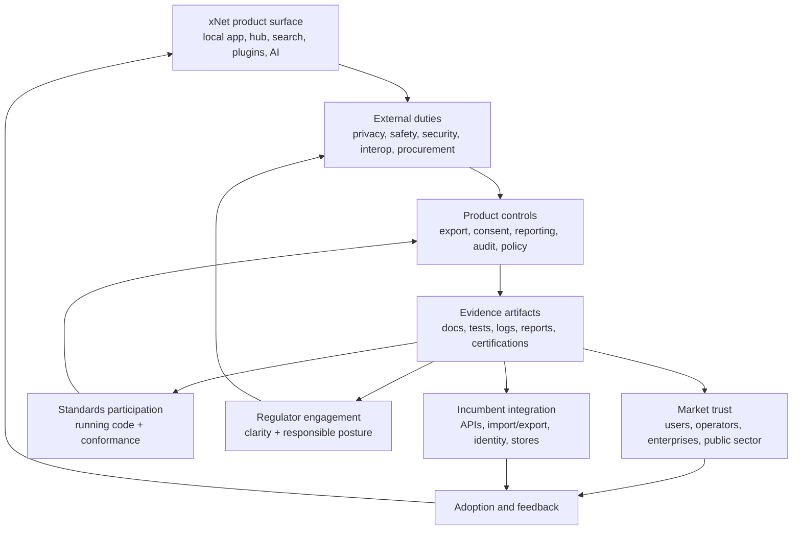
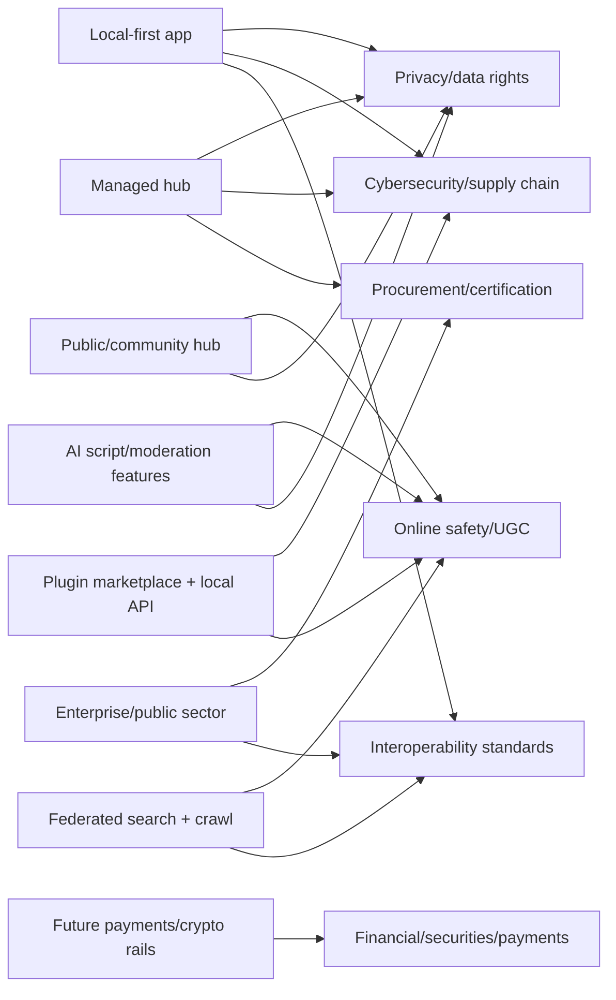
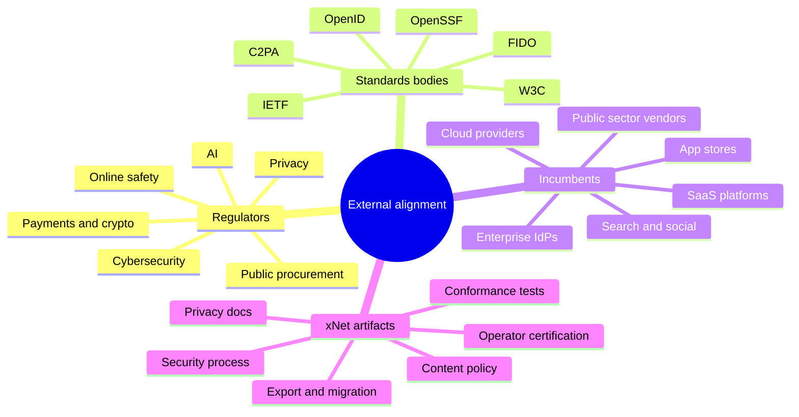
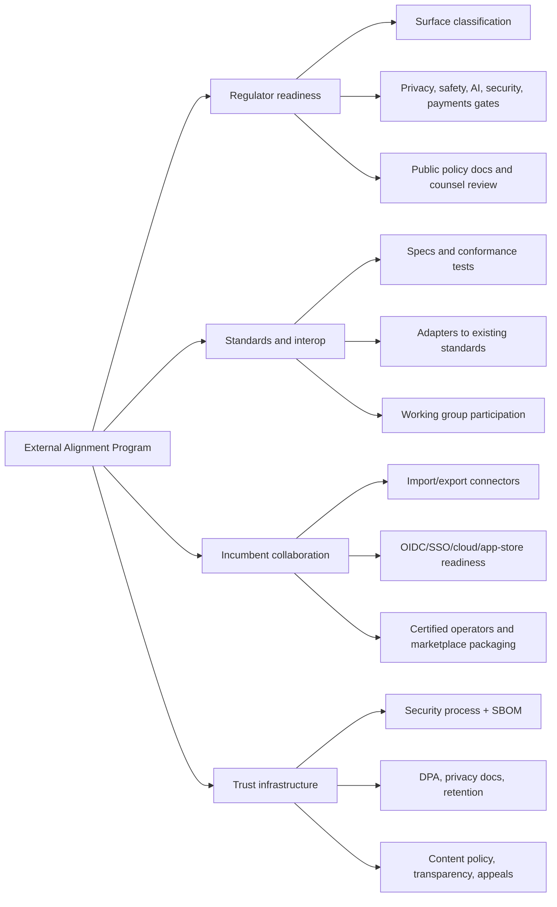
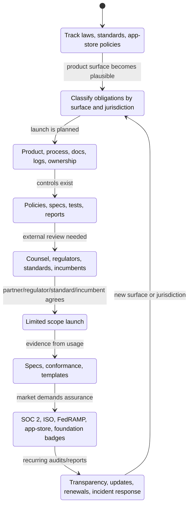

# 0146 - Working With Regulators Standards Bodies And Incumbents For xNet Market Adoption

> **Status:** Exploration  
> **Date:** 2026-06-03  
> **Author:** Codex  
> **Tags:** regulation, standards, incumbents, interoperability, market-adoption, compliance,
> privacy, online-safety, security, procurement, federation, public-policy

## Problem Statement 🧭

How should xNet work with regulators, standards bodies, and incumbents so it can come to market,
grow, and be adopted with minimal friction?

The question is not "how does xNet avoid external reality?" A federated local-first system touches
privacy, cloud services, online safety, app distribution, identity, cybersecurity, open standards,
enterprise procurement, search, crawling, content moderation, AI, payments, and public-sector
trust. External institutions can help xNet become legitimate and interoperable. They can also slow
xNet down through ambiguity, procurement demands, platform policies, standards politics, lobbying,
or compliance obligations that were designed around centralized platforms.

The goal is:

> Turn external pressure into product shape: privacy controls, data portability, abuse handling,
> security process, conformance tests, open standards, operator certification, and credible
> governance.

This is strategic product/governance research, not legal advice. xNet would need qualified counsel,
privacy/security experts, and jurisdiction-specific review before offering regulated services,
serving children, operating public social/search surfaces, launching payments/crypto rails, or
selling into public sector and regulated industries.

## Exploration Status

- [x] Compute the next exploration number and use a valid shortened filename
- [x] Review xNet README, hub, query, identity, telemetry, plugins, abuse, and tradeoff docs
- [x] Review recent explorations on monetization, public markets, foundation models, and abuse
- [x] Research regulators, standards bodies, app stores, procurement regimes, and security guidance
- [x] Map where regulators, standards bodies, and incumbents can help or impede xNet
- [x] Synthesize an external alignment program with phases, risk gates, and concrete artifacts
- [x] Include mermaid diagrams, checklists, recommendations, example code, and references

## Executive Summary 🎯

xNet should treat regulation, standards, and incumbents as **adoption infrastructure**, not only as
constraints.

The core recommendation:

> Build xNet as an open, local-first, user-owned data system that is easy for regulators to
> understand, easy for standards bodies to test, easy for incumbents to integrate with, and hard for
> any single incumbent to capture.

Practical strategy:

1. **Classify xNet surfaces by obligation.** A local-only desktop app, managed personal hub, public
   community hub, federated search index, plugin marketplace, AI script generator, enterprise cloud,
   and future crypto settlement rail are different regulatory products.
2. **Ship trust artifacts early.** Privacy policy, data processing addendum, subprocessors list,
   retention schedule, vulnerability disclosure policy, security contact, export/delete workflows,
   transparency reports, content policy, and law-enforcement request policy should not wait until
   there is a crisis.
3. **Use existing standards where they reduce friction.** xNet can keep DID/UCAN/local-first
   primitives while adding pragmatic bridges for WebAuthn/passkeys, OpenID Connect, OAuth,
   ActivityPub, AT Protocol, Matrix, C2PA, OpenTelemetry, SBOM/SLSA/OpenSSF practices, and
   enterprise identity expectations.
4. **Join standards conversations after there is running code.** xNet should bring conformance
   tests, reference deployments, and measured problems into W3C/IETF/OpenID/FIDO/C2PA/OpenSSF-style
   venues rather than asking committees to bless an unproven design.
5. **Collaborate with incumbents through portability and integration.** The strongest incumbent
   strategy is not direct replacement. It is import/export, sync bridges, enterprise SSO,
   connectors, migration tools, app-store readiness, cloud marketplace packaging, and compatible
   hosted operators.
6. **Avoid surfaces that trigger heavy obligations before the product is ready.** Public social,
   child-directed features, high-scale search, regulated health/finance/education workflows,
   tokenized incentives, and public AI decision systems need explicit gates.
7. **Use a foundation or governance body as a diplomacy layer later.** As exploration 0145 argues,
   the foundation should eventually steward specs, trademarks, conformance, security coordination,
   and public-interest engagement while Labs runs commercial services.

The external alignment loop should look like this:



The main posture:

> xNet should not present itself as "decentralization to avoid rules." It should present itself as
> "decentralization to make user rights, data portability, local resilience, and competition easier
> to enforce."

## Current State In The Repository 🔎

### xNet already has externally relevant surfaces

The root [`README.md`](../../README.md) positions xNet as decentralized data infrastructure and a
user-facing app: local-first, P2P-synced, user-owned data. The repo already includes:

| Surface                     | Repo evidence                                                                                                                                                                    | External relevance                                                                               |
| --------------------------- | -------------------------------------------------------------------------------------------------------------------------------------------------------------------------------- | ------------------------------------------------------------------------------------------------ |
| Local-first app             | Electron, Web, Expo apps; local storage; passkeys; export path in [`apps/web/src/routes/settings.tsx`](../../apps/web/src/routes/settings.tsx)                                   | Privacy, data portability, app stores, accessibility, backup expectations                        |
| Managed/demo hub            | [`packages/hub/README.md`](../../packages/hub/README.md) describes backup, files, search, federation, sharding, crawling                                                         | Cloud service duties, data processing, security, retention, abuse, uptime, support               |
| Federation                  | [`packages/hub/src/services/federation.ts`](../../packages/hub/src/services/federation.ts) supports peer DIDs, schema scopes, trust levels, auth, rate limits                    | Interop, standards, search exposure, cross-border data, operator governance                      |
| Crawling/search             | [`packages/hub/src/services/crawl.ts`](../../packages/hub/src/services/crawl.ts) includes robots checks, blocklists, cooldowns, duplicate/slop/provenance signals                | Robots.txt, copyright/TOS friction, search obligations, source reputation, public indexing trust |
| Query and federated routing | [`packages/query/README.md`](../../packages/query/README.md) covers local search and federated query routing                                                                     | Ranking transparency, data minimization, public search governance if exposed                     |
| Identity and authorization  | [`packages/identity/README.md`](../../packages/identity/README.md) covers `did:key`, UCAN, key bundles, passkey storage                                                          | W3C DID alignment, WebAuthn alignment, enterprise SSO/OIDC gaps, NIST/FIPS expectations          |
| Telemetry                   | [`packages/telemetry/README.md`](../../packages/telemetry/README.md) documents tiered consent, scrubbing, bucketing                                                              | GDPR/CCPA-friendly posture, privacy-by-design, support diagnostic tradeoffs                      |
| Abuse and moderation        | [`packages/abuse/README.md`](../../packages/abuse/README.md) defines pure decision helpers, labels, policy blocks, budgets, appeals, usage events                                | Online safety, DSA-style notice/action, app-store UGC expectations, transparency reports         |
| Plugins and local API       | [`packages/plugins/README.md`](../../packages/plugins/README.md) includes registry, sandboxing, AI generation, MCP, webhooks, local API                                          | Marketplace governance, malware/script safety, AI provider risk, third-party developer policies  |
| Open-source governance      | [`0145`](./0145_[_]_FOUNDATION_MODELS_LEGAL_ORGANIZING_STRUCTURES_FOR_XNET_MISSION_ALIGNED_GOVERNANCE.md) notes missing trademark, foundation, CLA/DCO, and certification policy | Standards credibility, compatibility marks, operator certification, public-interest trust        |

### Current strengths for external alignment

xNet already has unusually regulator-friendly primitives:

- **Local-first storage:** reduces default central data collection.
- **User-owned data posture:** aligns with data portability and user rights narratives.
- **MIT license:** makes interoperability, audit, and independent hosting easier.
- **Passkeys/WebAuthn:** aligns with major platform identity direction.
- **DID and UCAN:** supports decentralized authorization and offline delegation.
- **Explicit telemetry consent:** off-by-default, tiered, scrubbed, and bucketed telemetry is a
  strong privacy posture.
- **Hub quotas, rate limits, and auth:** public service surfaces already have basic operational
  controls.
- **Robots-aware crawling:** search/crawl infrastructure already recognizes external site policy.
- **`@xnetjs/abuse`:** abuse decisions are expressed as reusable pure functions, which is a strong
  base for explainability, audit, and policy variance.
- **Export path:** web settings already include a local JSON export flow.

### Current friction points

Observed or inferred gaps that matter for regulators, standards bodies, incumbents, and enterprise
buyers:

| Gap                                                                                       | Why it matters                                                                                                       |
| ----------------------------------------------------------------------------------------- | -------------------------------------------------------------------------------------------------------------------- |
| No published privacy policy, DPA, subprocessors list, retention schedule, or DSAR process | Managed hubs need clear data-controller/data-processor posture.                                                      |
| Export exists but is technical and browser-local                                          | Data portability needs user-facing, versioned, selective, importable exports.                                        |
| No account deletion or hosted data erasure workflow visible                               | GDPR/CCPA-style deletion rights and app-store account deletion policies need operational support.                    |
| No public vulnerability disclosure policy or security contact visible                     | CISA/NIST/security buyers expect a clear vulnerability intake process.                                               |
| `did:key` only                                                                            | Good for offline simplicity, but enterprise identity often needs OIDC/SAML, key rotation, recovery.                  |
| UCAN over OAuth                                                                           | Good for P2P capability delegation, but less familiar to standards bodies and enterprise IdPs.                       |
| BLAKE3/Ed25519 tradeoff docs note NIST/FIPS gaps                                          | Some regulated/public-sector buyers may require FIPS-validated algorithms/modules.                                   |
| No standards conformance suite yet                                                        | Hard for third-party operators or standards bodies to validate compatibility.                                        |
| No trademark/compatibility policy                                                         | "xNet-compatible" claims need rules before incumbents or hosts use the brand.                                        |
| No formal content policy, notice/action flow, appeals, or transparency report process     | Public hubs and app stores expect UGC moderation mechanisms.                                                         |
| Plugin marketplace safety is not yet an external trust program                            | Script/plugin ecosystems need signing, review, permission manifests, malware response, and takedown.                 |
| No procurement packet                                                                     | Enterprise/public-sector adoption usually needs security, privacy, accessibility, support, and continuity artifacts. |

### Local tradeoffs already matter externally

[`docs/TRADEOFFS.md`](../TRADEOFFS.md) records decisions that create adoption advantages and
compliance friction:

- `did:key` only: self-certifying and offline, but key rotation and enterprise identity are weaker.
- UCAN over OAuth: better for P2P delegation, less familiar to enterprise procurement.
- BLAKE3 + Ed25519: fast and modern, but not NIST/FIPS approved according to the tradeoff doc.
- telemetry: explicit opt-in, progressive tiers, and bucketed reporting; strong trust, less
  diagnostic data.

These should not be reversed casually. But xNet should add compatibility layers where external
markets need them.



## External Research 🌐

### Privacy and data rights: local-first is an advantage if the hosted boundary is clear

GDPR, CCPA-style state privacy laws, app-store privacy policies, and enterprise privacy reviews all
care about who controls data, what is collected, why it is processed, how long it is retained, who
receives it, how users can export/delete it, and how consent works.

xNet's local-first posture helps. But the moment xNet offers managed hubs, public hubs, support
diagnostics, telemetry, hosted search, AI enrichment, or enterprise services, it needs operational
answers:

- controller vs processor roles;
- data processing addendum;
- subprocessors;
- retention and deletion;
- export and migration;
- data residency;
- support access controls;
- breach notification process;
- lawful request handling;
- telemetry consent records.

Relevant sources:
[European Commission GDPR rights](https://commission.europa.eu/law/law-topic/data-protection/reform/rights-citizens_en),
[EDPB controller/processor guidelines](https://www.edpb.europa.eu/our-work-tools/our-documents/guidelines/guidelines-072020-concepts-controller-and-processor-gdpr_en),
[California Privacy Protection Agency CCPA](https://cppa.ca.gov/regulations/consumer_privacy_act.html),
[Google Play User Data policy](https://support.google.com/googleplay/android-developer/answer/10144311).

### EU Data Act and Data Governance Act: xNet can be an interoperability ally

The EU Data Act emphasizes access, use, sharing, cloud switching, and interoperability. The Data
Governance Act introduces governance for data sharing, data intermediation services, and data
altruism organizations.

xNet can align with this direction by making:

- user-controlled export/import real;
- hub migration testable;
- self-hosting first-class;
- data schemas open;
- federation contracts transparent;
- independent operators viable;
- public-interest data commons possible.

This is a major narrative advantage: xNet can make data portability and competition easier in
practice.

Relevant sources:
[European Commission Data Act](https://digital-strategy.ec.europa.eu/en/policies/data-act),
[European Commission Data Governance Act](https://digital-strategy.ec.europa.eu/en/policies/data-governance-act).

### Online safety and platform regulation: public hubs change the category

The EU Digital Services Act applies different obligations to intermediary services, hosting
services, online platforms, and very large online platforms/search engines. The UK Online Safety Act
regime is also relevant for user-to-user and search services. App stores impose their own
moderation/reporting/blocking requirements for user-generated content.

xNet can reduce friction by splitting product modes:

- private local/family/team collaboration;
- invite-only community hubs;
- public publishing hubs;
- public search indexes;
- app-store-distributed clients that display user-generated content.

Public hubs should have:

- clear terms and content policy;
- notice and action;
- report, block, mute, appeal;
- repeat-offender handling;
- transparency reporting;
- abuse contact;
- operator policy disclosures;
- labeling/reach controls;
- child-safety and age-related gates where applicable.

Relevant sources:
[European Commission Digital Services Act](https://digital-strategy.ec.europa.eu/en/policies/digital-services-act-package),
[DSA Transparency Database](https://transparency.dsa.ec.europa.eu/),
[Ofcom Online Safety](https://www.ofcom.org.uk/online-safety/),
[Apple App Review Guidelines](https://developer.apple.com/app-store/review/guidelines/),
[Google Play User Generated Content policy](https://support.google.com/googleplay/android-developer/answer/9876937).

### Cybersecurity: security process is a market-entry requirement

NIST CSF 2.0, CISA Secure by Design, FTC security guidance, OpenSSF/SLSA, FedRAMP, SOC 2, ISO
27001, and the EU Cyber Resilience Act all point in the same direction: secure-by-design, secure
defaults, vulnerability handling, software supply chain integrity, logging, incident response, and
evidence.

xNet's technical base is strong, but market adoption will need artifacts:

- security architecture overview;
- threat model;
- vulnerability disclosure policy;
- security contact;
- SBOMs for releases and Docker images;
- dependency update policy;
- release signing;
- backups and recovery docs;
- incident response plan;
- audit logs for hosted services;
- role-based support access;
- SOC 2 readiness if selling B2B;
- FedRAMP path only if targeting US federal cloud workloads.

Relevant sources:
[NIST Cybersecurity Framework](https://www.nist.gov/cyberframework),
[NIST Privacy Framework](https://www.nist.gov/privacy-framework),
[CISA Secure by Design](https://www.cisa.gov/securebydesign),
[FTC Start with Security](https://www.ftc.gov/business-guidance/resources/start-security-guide-business),
[EU Cyber Resilience Act](https://digital-strategy.ec.europa.eu/en/policies/cyber-resilience-act),
[SLSA](https://slsa.dev/),
[OpenSSF Scorecard](https://securityscorecards.dev/),
[FedRAMP](https://www.fedramp.gov/).

### Identity standards: preserve DID/UCAN, add enterprise bridges

xNet uses `did:key`, UCAN, passkeys/WebAuthn, and local key bundles. This is coherent for
local-first infrastructure. But external adopters will often expect:

- OpenID Connect;
- OAuth 2.0 delegated authorization;
- SAML for older enterprise buyers;
- SCIM for identity lifecycle;
- key rotation and account recovery;
- NIST digital identity assurance mapping;
- FIDO/passkey compatibility;
- FIPS-validated crypto in regulated deployments.

The right answer is not to abandon UCAN. It is to build bridges:

- OIDC login creates or links an xNet DID;
- enterprise IdP issues organization membership claims;
- UCAN remains the local/offline capability format;
- admins can rotate/revoke organization keys;
- enterprise packages can use FIPS-compatible crypto profiles where required.

Relevant sources:
[W3C DID Core](https://www.w3.org/TR/did-core/),
[W3C WebAuthn Level 3](https://www.w3.org/TR/webauthn-3/),
[OpenID Connect Core](https://openid.net/specs/openid-connect-core-1_0.html),
[OAuth 2.0 RFC 6749](https://www.rfc-editor.org/rfc/rfc6749),
[NIST SP 800-63-4](https://pages.nist.gov/800-63-4/),
[FIDO Alliance passkeys](https://fidoalliance.org/passkeys/).

### Federation and social standards: interoperate before standardizing xNet itself

xNet should not ask the world to adopt a new standard before proving the product. It should:

- implement bridges to existing federation protocols where useful;
- publish precise specs for xNet-specific schemas and hub federation;
- provide conformance tests;
- document deltas from ActivityPub, AT Protocol, Matrix, Solid, and WebDAV-like data portability;
- join discussions once the gaps are concrete.

Relevant sources:
[W3C ActivityPub](https://www.w3.org/TR/activitypub/),
[AT Protocol specifications](https://atproto.com/specs/atp),
[Matrix specification](https://spec.matrix.org/latest/),
[Solid specification](https://solidproject.org/TR/protocol),
[IETF participation](https://www.ietf.org/about/participate/).

### Search, crawling, provenance, and AI: public reach brings public responsibilities

Federated search and crawling can help xNet become more useful, but they create friction:

- site owners may object to crawling;
- platforms may restrict API or scraping access;
- copyright and database-right concerns vary by jurisdiction;
- public ranking can be accused of bias or misinformation;
- AI-generated summaries need provenance and citation support;
- minors, health, finance, elections, crisis, and public-safety topics raise scrutiny.

xNet should default to:

- robots.txt compliance;
- source policy and takedown channel;
- crawl rate controls;
- provenance metadata;
- citation coverage scoring;
- opt-out and blocklists;
- transparent ranking factors for public indexes;
- C2PA-style content credential support where media provenance matters.

Relevant sources:
[Robots Exclusion Protocol RFC 9309](https://www.rfc-editor.org/rfc/rfc9309),
[C2PA specifications](https://c2pa.org/specifications/),
[NIST AI Risk Management Framework](https://www.nist.gov/itl/ai-risk-management-framework),
[European Commission AI Act](https://digital-strategy.ec.europa.eu/en/policies/regulatory-framework-ai).

### Standards bodies: bring running code, tests, and humility

Standards bodies can help xNet gain legitimacy, procurement acceptance, and interop. They can also
consume years if approached too early.

Best path:

1. build working xNet interfaces;
2. write implementation-neutral drafts;
3. publish conformance tests;
4. build adapters to existing standards;
5. collect incompatibility evidence;
6. participate in existing groups;
7. propose narrow extensions only where there is a real gap.

The wrong path is declaring "xNet is the new standard" before multiple independent
implementations exist.

Relevant sources:
[W3C Process](https://www.w3.org/policies/process/),
[IETF participation](https://www.ietf.org/about/participate/),
[OpenID Foundation](https://openid.net/foundation/),
[OpenSSF](https://openssf.org/).

### Incumbents: partners, channels, obstacles, and eventual competitors

Incumbents include:

- cloud providers;
- app stores;
- browser vendors;
- enterprise IdPs;
- productivity suites;
- collaboration platforms;
- search/social platforms;
- developer platforms;
- data brokers and SaaS vendors;
- public-sector procurement vendors;
- open-source foundations and standards consortia.

They can help xNet through:

- APIs and import/export;
- app distribution;
- identity integrations;
- cloud marketplace listings;
- startup credits;
- co-selling;
- enterprise procurement channels;
- public datasets;
- compliance templates;
- standards experience;
- trust transfer.

They can slow xNet through:

- API rate limits and policy changes;
- app-store rejections;
- anti-scraping enforcement;
- closed formats;
- patent/trademark threats;
- procurement lock-in;
- lobbying;
- standards capture;
- FUD around decentralization, encryption, moderation, or crypto;
- "security review" delays;
- requiring enterprise features before adoption.

xNet should collaborate without becoming dependent on any one incumbent.

## Key Findings 🔑

1. **Regulatory friction follows product surface, not ideology.** A local private app has a very
   different obligation profile from a public search/social hub.
2. **Local-first is a regulatory advantage only if hosted boundaries are clear.** If users cannot
   tell what is local, what is backed up, what is indexed, and who processes it, local-first will
   not reduce friction.
3. **Standards bodies reward implementation evidence.** xNet should publish specs and conformance
   tests after running code, then participate where xNet exposes real gaps in existing standards.
4. **Incumbents are not one thing.** Apple, Google, Microsoft, AWS, Slack, Notion, Atlassian,
   Salesforce, school districts, local governments, banks, and open-source foundations all create
   different incentives.
5. **The biggest adoption blockers are boring artifacts.** Privacy docs, security contacts, DPA,
   export/delete, incident process, SBOM, content policy, support SLAs, and procurement packets
   matter before abstract decentralization arguments.
6. **Public hubs need DSA/app-store-style moderation primitives early.** `@xnetjs/abuse` is a strong
   start, but xNet still needs productized reporting, blocking, appeals, operator policy, and
   transparency reports.
7. **Enterprise buyers need bridges, not philosophical purity.** OIDC/SAML/SCIM, audit logs, DLP,
   retention, eDiscovery, legal hold, data residency, FIPS profiles, and SOC 2 readiness will matter
   if xNet wants B2B adoption.
8. **Regulators can become allies if xNet frames itself as enforceable user choice.** Data
   portability, local resilience, open schemas, and independent operators map well to competition
   and consumer-protection goals.
9. **The biggest incumbent risk is default capture.** App stores, cloud providers, identity
   providers, and search/social platforms can shape distribution even when code is open.
10. **Foundation governance from exploration 0145 becomes useful here.** A neutral body can steward
    specs, conformance, trademarks, vulnerability coordination, and policy engagement more credibly
    than a single commercial vendor.



## How External Actors Can Help xNet 🤝

### Regulators

Regulators can help by:

- clarifying what category xNet falls into at each surface;
- supporting sandboxes and public-interest pilots;
- validating privacy-by-design and portability claims;
- encouraging incumbent data portability;
- making decentralized operator models legible;
- recognizing open-source maintainers and foundations as part of critical digital infrastructure;
- pushing markets toward interoperability that xNet already wants.

Good collaboration patterns:

- brief regulators before a high-risk launch;
- publish plain-language architecture notes;
- keep logs/evidence for public service operations;
- create a trustworthy law-enforcement request process;
- document why local-first reduces data concentration;
- offer pilots for public-interest data commons, civic knowledge, or local government records.

### Standards bodies

Standards bodies can help by:

- legitimizing xNet interfaces;
- improving interop with existing systems;
- creating procurement-friendly references;
- attracting independent implementers;
- forcing spec clarity;
- exposing where xNet should reuse rather than invent.

Good collaboration patterns:

- publish implementation-neutral specs;
- provide test vectors and conformance suites;
- join relevant working/community groups;
- participate in interop events;
- propose narrow extensions;
- avoid "standardizing" proprietary product defaults.

### Incumbents

Incumbents can help by:

- providing identity integrations;
- supporting import/export and data transfer;
- distributing xNet clients through app stores;
- hosting hubs through cloud marketplace images;
- enabling connectors to existing work systems;
- co-selling to enterprise buyers;
- offering compliance and security review templates;
- validating xNet as a safe integration partner.

Good collaboration patterns:

- start with connectors, not replacement rhetoric;
- build import/export paths for incumbents' formats;
- support enterprise identity and admin models;
- let incumbents run certified hubs;
- create migration tools that reduce customer switching risk;
- pursue public standards where incumbents also benefit.

## How They Can Slow xNet Down 🧱

### Regulatory delay modes

- ambiguous classification of public hubs as hosting, platform, search, cloud, data intermediary, AI
  provider, or communications service;
- data residency and cross-border transfer constraints;
- child-safety and age-assurance requirements;
- content moderation obligations that assume centralized control;
- encryption/backdoor pressure;
- law-enforcement request complexity for encrypted/local-first data;
- sector-specific rules in health, education, finance, employment, housing, and government records;
- payments, money-transmission, securities, commodities, sanctions, and tax issues if xNet adds
  tokens or stablecoin settlement.

### Standards delay modes

- slow committees;
- incumbent capture;
- requirements that overfit centralized systems;
- pressure to support heavy legacy protocols before xNet has product-market fit;
- spec churn;
- disagreements over identity, moderation, search ranking, or data schemas;
- conformance requirements that become expensive enough to exclude small operators.

### Incumbent delay modes

- app-store rejection or review delays;
- API restrictions, pricing changes, or deprecations;
- anti-scraping or anti-crawling enforcement;
- closed/proprietary formats;
- enterprise procurement lock-in;
- marketplace ranking suppression;
- brand/trademark disputes;
- patent assertions;
- FUD that decentralized/local-first means unsafe, unmoderated, noncompliant, or crypto-adjacent;
- using standards bodies to slow or dilute xNet-compatible interoperability.

## Options And Tradeoffs ⚖️

### Option 1: Passive compliance after launch

**Model:** Build first, respond to regulators and incumbents only when blocked.

**Benefits:**

- fastest short-term execution;
- fewer meetings;
- less premature process.

**Costs:**

- app-store/public-hub/enterprise blockers appear late;
- expensive retrofits;
- trust damage after first incident;
- hard to sell to regulated buyers;
- regulators may see xNet as evasive rather than constructive.

**Verdict:** acceptable for narrow local-only prototypes, bad for managed hubs or public surfaces.

### Option 2: Compliance-first enterprise posture

**Model:** Build SOC 2, DPA, enterprise admin, OIDC/SAML, retention, audit, legal hold, and security
program before broad market push.

**Benefits:**

- easier B2B procurement;
- strong trust posture;
- fewer surprises in regulated sectors.

**Costs:**

- slow and expensive;
- can pull xNet toward enterprise SaaS before consumer/community fit;
- may overfit centralized admin assumptions;
- delays public federation experiments.

**Verdict:** use for B2B managed hubs, not the whole project.

### Option 3: Standards-first open protocol

**Model:** Prioritize specs, conformance, working groups, reference implementations, and foundation
governance before commercial push.

**Benefits:**

- interop credibility;
- neutral ecosystem trust;
- better public-sector fit;
- lowers incumbent capture risk.

**Costs:**

- slow;
- product may be underbuilt;
- standards can become political;
- no one funds maintenance unless monetization is clear.

**Verdict:** publish specs and tests early, but do not let standards work outrun real usage.

### Option 4: Incumbent partnership-first

**Model:** Integrate with Microsoft, Google, Apple, Slack, Notion, Atlassian, Salesforce, AWS,
Cloudflare, schools, governments, and cloud marketplaces early.

**Benefits:**

- distribution;
- credibility;
- migration onramps;
- enterprise procurement shortcuts;
- practical compatibility pressure.

**Costs:**

- dependency risk;
- API and app-store policy constraints;
- incumbents can shape roadmap;
- "decentralized" vision may be diluted into another integration layer.

**Verdict:** good if xNet remains portable and multi-provider.

### Option 5: Public-interest/regulatory sandbox path

**Model:** Work with regulators, civic institutions, universities, libraries, local governments, or
public-interest groups on limited pilots.

**Benefits:**

- trust;
- policy clarity;
- legitimacy;
- real public-good use cases;
- less direct competition with incumbents at first.

**Costs:**

- slow procurement;
- custom requirements;
- grant/reporting overhead;
- limited revenue.

**Verdict:** useful for credibility and standards, but not the only go-to-market path.

### Option 6: Foundation diplomacy layer

**Model:** Use a foundation or commons body to engage standards bodies, regulators, operators, and
incumbents while Labs builds commercial products.

**Benefits:**

- neutral voice;
- better standards credibility;
- reduced fear of vendor capture;
- natural home for conformance and trademark policy.

**Costs:**

- governance overhead;
- funding burden;
- possible Labs/Foundation tension;
- premature foundation can slow execution.

**Verdict:** strong later, after the trigger points in exploration 0145.

### Option 7: Web3-adjacent independence

**Model:** Lean into cryptographic proof, user-owned identity, operator markets, stablecoins/tokens,
and community governance to reduce incumbent dependence.

**Benefits:**

- reduces dependence on app stores/cloud/enterprise channels if successful;
- aligns with open network ideology;
- can fund operator infrastructure later.

**Costs:**

- major regulatory risk;
- public perception risk;
- securities/payments/tax complexity;
- can repel enterprises and regulators;
- can distract from product utility.

**Verdict:** stay crypto-ready, not crypto-native, as exploration 0143 recommends.

## Recommended Strategy 🚀

xNet should create a lightweight **External Alignment Program** with four tracks:



### Track 1: Regulator readiness

Build these before broad managed/public launch:

- surface classification memo;
- privacy policy;
- data processing addendum;
- subprocessors list;
- retention/deletion schedule;
- export/import/migration commitment;
- data residency posture;
- security incident response plan;
- vulnerability disclosure policy;
- hosted support access policy;
- law-enforcement request policy;
- DSA-style public-hub notice/action/appeals design;
- AI feature risk register;
- crypto/payments "not yet" policy.

### Track 2: Standards and interop

Near-term:

- publish xNet schema and federation specs as implementation-neutral docs;
- create conformance tests for hubs, schemas, export, and migration;
- document compatibility with DID Core, WebAuthn, OAuth/OIDC bridge, ActivityPub/AT/Matrix bridges,
  robots.txt, C2PA, and OpenSSF/SLSA practices;
- avoid declaring a standard before multiple implementations exist.

Mid-term:

- join W3C/IETF/OpenID/FIDO/C2PA/OpenSSF conversations where xNet has direct relevance;
- run interop events;
- invite independent hub operators to test;
- create compatibility profiles for personal, community, enterprise, public, and search hubs.

### Track 3: Incumbent collaboration

Build onramps:

- Google/Microsoft/Apple import/export where APIs allow;
- Notion/Slack/Atlassian/Salesforce connectors where user value is clear;
- OIDC/SAML/SCIM enterprise bridge;
- cloud marketplace templates for hubs;
- app-store review packet with demo mode, UGC controls, privacy nutrition/data safety answers;
- browser extension/store policy review for clippers;
- data transfer tools that let users leave incumbents without pretending incumbents will help.

Guardrails:

- no exclusive distribution;
- no one cloud dependency;
- no single IdP dependency;
- no closed-format lock-in;
- all connectors must support export and deletion;
- all incumbent APIs should be treated as unstable boundaries.

### Track 4: Trust infrastructure

Build evidence:

- public roadmap for privacy/security/compliance;
- public status page for managed hubs;
- transparency reports;
- security advisories;
- SBOMs and signed releases;
- conformance badges;
- operator policy disclosures;
- audit logs for admin/support actions;
- accessibility statement and WCAG testing plan;
- annual commons and governance report once revenue exists.

## Surface-Specific Adoption Plan 📍

### Local app

Goal: easiest adoption, lowest regulatory load.

Do:

- make local-vs-hosted data flows obvious;
- make export/import polished;
- keep telemetry opt-in;
- support passkeys and recovery;
- prepare app-store privacy and safety metadata;
- add accessibility testing.

Avoid:

- hidden cloud sync;
- default analytics;
- public UGC before reporting/blocking exists.

### Managed personal/team hub

Goal: reliable paid service with clear privacy/security posture.

Do:

- privacy policy, DPA, subprocessors, retention;
- hosted data deletion;
- backup restore and migration;
- security contact;
- incident process;
- support access logging;
- regional hosting disclosure.

Avoid:

- claiming "zero knowledge" unless technically and operationally true;
- enterprise promises before controls exist.

### Public/community hub

Goal: safe federation without pretending every hub has one global policy.

Do:

- content policy;
- report/block/mute/appeal;
- operator disclosures;
- `@xnetjs/abuse` integration;
- transparency reports;
- public contact;
- repeat-offender and spam controls;
- child/minor policy.

Avoid:

- open registration plus public reach before abuse budgets exist;
- "no moderation" positioning.

### Federated search and crawl

Goal: useful discovery with low legal/policy friction.

Do:

- robots.txt compliance;
- crawl rate limits;
- source block/opt-out;
- transparent ranking classes;
- provenance labels;
- citation coverage;
- public takedown channel;
- per-hub index policy.

Avoid:

- scraping behind login;
- indexing private/local content by default;
- AI summaries without citations/provenance.

### Plugin marketplace and local API

Goal: extensibility without malware/ecosystem abuse.

Do:

- signed manifests;
- permission scopes;
- sandbox policy;
- review tiers;
- report/takedown;
- developer identity;
- dependency scanning;
- local API consent grants;
- user-visible permissions.

Avoid:

- one-click arbitrary code with broad local data access;
- marketplace monopoly over side-loaded open plugins.

### Enterprise/public sector

Goal: sell responsibly without rebuilding xNet as conventional SaaS.

Do:

- OIDC/SAML/SCIM bridge;
- admin audit logs;
- data residency;
- retention/legal hold only where needed;
- SOC 2 readiness;
- security packet;
- accessibility conformance;
- FIPS-compatible profile roadmap.

Avoid:

- making enterprise admin control the default consumer/community model;
- promising FedRAMP before there is a federal strategy and budget.

### Future payments/crypto rails

Goal: stay optional.

Do:

- signed service receipts;
- fiat billing first;
- stable payment experiments only with counsel;
- no token until real operator settlement requires it;
- sanctions/KYC/AML/securities analysis before public launch.

Avoid:

- token-first external narrative;
- financialization of core user data.

## Engagement Lifecycle 🔄



## Collaboration Playbooks 🧰

### Regulator briefing playbook

Use when launching public hubs, search, AI features, child-adjacent experiences, public-sector
pilots, or crypto/payment rails.

1. Explain the surface narrowly.
2. Show local-first data flow.
3. Identify who operates what.
4. Explain user rights: export, delete, migrate, self-host.
5. Explain safety controls: report, block, appeal, transparency.
6. Explain security controls: auth, encryption, logs, incident process.
7. Ask for category clarity, not endorsement.
8. Keep a public summary where possible.

### Standards body playbook

Use when xNet has running interop code.

1. Publish implementation-neutral draft.
2. Publish test vectors.
3. Publish conformance harness.
4. Show two independent implementations or operators.
5. Map to existing standards.
6. Identify one narrow gap.
7. Participate in the relevant group.
8. Avoid product marketing in standards venues.

### Incumbent integration playbook

Use for app stores, cloud providers, IdPs, productivity platforms, and SaaS import/export.

1. Start with user benefit.
2. Use official APIs.
3. Build resilient connectors with graceful degradation.
4. Document data scopes and deletion.
5. Avoid exclusive partnerships.
6. Prefer import/export over permanent dependency.
7. Keep side-loading/self-hosting path alive.
8. Track policy/API changes as product risk.

### Public-sector pilot playbook

Use for libraries, universities, local governments, civic archives, public knowledge, and public
data commons.

1. Choose a narrow use case.
2. Keep private data out of scope first.
3. Publish data model and retention.
4. Define accessibility/security requirements.
5. Identify responsible operator.
6. Create export/continuity plan.
7. Document governance and public benefit.
8. Use pilot evidence to improve standards and procurement packet.

## Example Code: Surface-Based External Risk Planner 🧪

This is not legal analysis. It is a product planning sketch that turns xNet surfaces into
engagement work items.

```typescript
type XNetSurface =
  | 'localApp'
  | 'managedHub'
  | 'publicHub'
  | 'federatedSearch'
  | 'crawler'
  | 'pluginMarketplace'
  | 'aiFeatures'
  | 'enterpriseCloud'
  | 'cryptoSettlement'

type ExternalTrack =
  | 'privacy'
  | 'onlineSafety'
  | 'cybersecurity'
  | 'identity'
  | 'standards'
  | 'procurement'
  | 'appDistribution'
  | 'financialRegulation'

type EngagementAction = Readonly<{
  track: ExternalTrack
  priority: 'now' | 'next' | 'later'
  artifact: string
  reason: string
}>

type SurfaceProfile = Readonly<{
  surface: XNetSurface
  actions: readonly EngagementAction[]
}>

const action = (
  track: ExternalTrack,
  priority: EngagementAction['priority'],
  artifact: string,
  reason: string
): EngagementAction => ({ track, priority, artifact, reason })

const surfaceProfiles: readonly SurfaceProfile[] = [
  {
    surface: 'localApp',
    actions: [
      action('privacy', 'now', 'local-vs-hosted data map', 'Users need to know where data lives.'),
      action(
        'appDistribution',
        'now',
        'app-store privacy and UGC review packet',
        'Mobile distribution can block launch.'
      ),
      action(
        'cybersecurity',
        'next',
        'signed releases and SBOM',
        'Trust improves when binaries are verifiable.'
      )
    ]
  },
  {
    surface: 'managedHub',
    actions: [
      action(
        'privacy',
        'now',
        'privacy policy, DPA, subprocessors, retention schedule',
        'Hosted processing creates privacy duties.'
      ),
      action(
        'cybersecurity',
        'now',
        'vulnerability disclosure and incident response policy',
        'Managed infrastructure needs security intake.'
      ),
      action('procurement', 'next', 'SOC 2 readiness packet', 'B2B buyers need evidence.')
    ]
  },
  {
    surface: 'publicHub',
    actions: [
      action(
        'onlineSafety',
        'now',
        'content policy, reporting, blocking, appeals',
        'Public UGC needs operational moderation.'
      ),
      action(
        'onlineSafety',
        'next',
        'transparency report template',
        'Regulators and app stores expect accountability.'
      ),
      action(
        'standards',
        'next',
        'operator policy disclosure schema',
        'Federation works better when hub policies are machine-readable.'
      )
    ]
  },
  {
    surface: 'federatedSearch',
    actions: [
      action(
        'standards',
        'now',
        'federated query conformance tests',
        'Operators need objective compatibility.'
      ),
      action(
        'onlineSafety',
        'now',
        'ranking and takedown policy',
        'Public reach creates public accountability.'
      ),
      action(
        'privacy',
        'next',
        'private-content indexing guardrails',
        'Search must not leak local or restricted data.'
      )
    ]
  },
  {
    surface: 'cryptoSettlement',
    actions: [
      action(
        'financialRegulation',
        'later',
        'payments and securities legal memo',
        'Tokens or settlement rails change the legal category.'
      ),
      action(
        'cybersecurity',
        'later',
        'signed service receipt audit trail',
        'Utility should precede financialization.'
      )
    ]
  }
] as const

export const buildExternalEngagementPlan = (
  enabledSurfaces: readonly XNetSurface[],
  profiles: readonly SurfaceProfile[] = surfaceProfiles
): readonly EngagementAction[] => {
  const enabled = new Set(enabledSurfaces)
  const selected = profiles.filter((profile) => enabled.has(profile.surface))
  const actions = selected.flatMap((profile) => profile.actions)
  const key = (item: EngagementAction): string => `${item.track}:${item.artifact}`

  return Array.from(new Map(actions.map((item) => [key(item), item])).values()).toSorted((a, b) => {
    const priorityOrder = { now: 0, next: 1, later: 2 } satisfies Record<
      EngagementAction['priority'],
      number
    >
    return priorityOrder[a.priority] - priorityOrder[b.priority]
  })
}
```

Example usage:

```typescript
const launchPlan = buildExternalEngagementPlan(['localApp', 'managedHub', 'publicHub'])

console.log(launchPlan.map((item) => `${item.priority}: ${item.artifact}`))
```

This kind of mapping should become a product/release checklist. New surfaces should not launch
until their "now" artifacts exist.

## Implementation Checklist 🛠️

- [ ] Create `docs/governance/external-alignment.md` with surface classifications and launch gates.
- [ ] Draft local-vs-hosted data flow diagrams for users and regulators.
- [ ] Draft privacy policy, DPA, subprocessors list, retention schedule, and deletion policy for
      managed hubs.
- [ ] Turn the web export flow into a versioned export/import/migration contract.
- [ ] Add hosted account deletion and hosted data erasure workflows before paid cloud launch.
- [ ] Publish vulnerability disclosure policy, security contact, and incident response overview.
- [ ] Add SBOM and release-signing roadmap for desktop, web, hub Docker image, and npm packages.
- [ ] Add app-store review packet covering demo mode, UGC controls, privacy labels, support contact,
      and account deletion.
- [ ] Productize `@xnetjs/abuse` into report/block/mute/appeal/transparency UX for public hubs.
- [ ] Add operator policy disclosure documents for hubs.
- [ ] Draft xNet hub federation and schema conformance tests.
- [ ] Draft "xNet-compatible" trademark and certification policy, building on exploration 0145.
- [ ] Build OIDC bridge design without replacing UCAN as the local capability layer.
- [ ] Create standards map: W3C DID/VC/WebAuthn/ActivityPub, IETF/OAuth/robots, OpenID, FIDO,
      C2PA, OpenSSF/SLSA, Matrix/AT Protocol bridges.
- [ ] Create incumbent integration map: app stores, cloud marketplaces, enterprise IdPs, productivity
      suites, search/social import/export, public-sector pilots.
- [ ] Define "do not launch yet" gates for public search, child-directed features, health/finance
      verticals, AI decisions, and crypto settlement.
- [ ] Create a law-enforcement and government-request policy before operating public/managed hubs
      at scale.
- [ ] Create an accessibility conformance plan for app and docs surfaces.
- [ ] Decide when SOC 2 readiness starts and what buyer threshold triggers it.
- [ ] Track relevant regulatory changes quarterly.

## Validation Checklist 🔬

- [ ] A user can tell which data is local, backed up, shared, indexed, or public.
- [ ] A hosted user can export, migrate, and delete data without support intervention.
- [ ] A regulator or enterprise reviewer can identify the operator, processor/controller role,
      contact, retention, security process, and user rights process.
- [ ] A public hub has reporting, blocking, muting, appeal, repeat-abuse, and transparency flows.
- [ ] A mobile app reviewer can use a demo mode and verify UGC controls.
- [ ] An independent operator can run conformance tests without asking Labs for permission.
- [ ] xNet has a published vulnerability disclosure path and can receive private security reports.
- [ ] Release artifacts can produce SBOMs and eventually signed provenance.
- [ ] Standards docs distinguish existing standards from xNet-specific extensions.
- [ ] Incumbent connectors degrade gracefully when APIs change.
- [ ] No public search/crawl surface indexes private or access-controlled data by default.
- [ ] AI-generated content or moderation has provenance and appeal paths.
- [ ] Enterprise identity bridges do not weaken local-first key ownership.
- [ ] No crypto/payment feature launches without legal review and real utility.
- [ ] The foundation/commons roadmap has a clear role in standards, conformance, and public
      engagement.

## Strategic Recommendation 🧩

xNet should align with the external world through **evidence, interfaces, and staged exposure**.

Near-term:

1. Keep the product primarily local/private while managed hubs mature.
2. Publish privacy, security, export, vulnerability, and hosted data policies.
3. Build polished export/import/delete and support-access controls.
4. Prepare app-store and B2B review packets before distribution pushes.
5. Publish hub/schema/federation specs and conformance tests.
6. Add OIDC bridge planning for enterprise without replacing UCAN.
7. Treat public hubs and public search as gated launches, not defaults.

Mid-term:

1. Join targeted standards venues with running code and tests.
2. Build incumbent connectors for import/export and workflow integration.
3. Certify independent operators through objective conformance, not private permission.
4. Start SOC 2 readiness when B2B revenue or regulated buyers justify it.
5. Use public-interest pilots to validate local-first public data commons.

Long-term:

1. Use an xNet Foundation or commons body to steward specs, conformance, trademarks, and public
   policy engagement.
2. Push standards that make user-owned data, local-first sync, and federated operators easier for
   regulators and incumbents to trust.
3. Keep crypto/payment rails optional and utility-driven.
4. Use xNet's open architecture as a policy argument for competition, resilience, and user rights.

The simplest external narrative:

> xNet is not trying to route around regulators, standards, or existing institutions. It is trying
> to make the things they already say they want - portability, competition, privacy, resilience,
> interoperability, security, and user choice - concrete enough to run.

## References 📚

### Local xNet context

- [Root README](../../README.md)
- [Hub README](../../packages/hub/README.md)
- [Query README](../../packages/query/README.md)
- [Identity README](../../packages/identity/README.md)
- [Telemetry README](../../packages/telemetry/README.md)
- [Abuse README](../../packages/abuse/README.md)
- [Plugins README](../../packages/plugins/README.md)
- [Tradeoffs](../TRADEOFFS.md)
- [0140 - Spam And Abuse Mitigation](./0140_[x]_SPAM_AND_ABUSE_MITIGATION_AUTOMATED_API_ACROSS_THE_NETWORK.md)
- [0143 - Public Markets And Crypto/Web3](./0143_[_]_WHY_MIGHT_PUBLIC_MARKETS_INVEST_IN_XNET_THINK_CRYPTO_AND_WEB3_AND_BLOCKCHAIN.md)
- [0144 - Monetization Routes](./0144_[_]_POTENTIAL_MONETIZATION_ROUTES_ALIGNED_WITH_OPEN_FEDERATION.md)
- [0145 - Foundation Models](./0145_[_]_FOUNDATION_MODELS_LEGAL_ORGANIZING_STRUCTURES_FOR_XNET_MISSION_ALIGNED_GOVERNANCE.md)

### Regulators and policy frameworks

- [European Commission Digital Services Act](https://digital-strategy.ec.europa.eu/en/policies/digital-services-act-package)
- [DSA Transparency Database](https://transparency.dsa.ec.europa.eu/)
- [European Commission Data Act](https://digital-strategy.ec.europa.eu/en/policies/data-act)
- [European Commission Data Governance Act](https://digital-strategy.ec.europa.eu/en/policies/data-governance-act)
- [European Commission Cyber Resilience Act](https://digital-strategy.ec.europa.eu/en/policies/cyber-resilience-act)
- [European Commission GDPR citizen rights](https://commission.europa.eu/law/law-topic/data-protection/reform/rights-citizens_en)
- [EDPB controller and processor guidelines](https://www.edpb.europa.eu/our-work-tools/our-documents/guidelines/guidelines-072020-concepts-controller-and-processor-gdpr_en)
- [California Privacy Protection Agency CCPA regulations](https://cppa.ca.gov/regulations/consumer_privacy_act.html)
- [FTC Start with Security](https://www.ftc.gov/business-guidance/resources/start-security-guide-business)
- [FTC Children's Privacy/COPPA](https://www.ftc.gov/business-guidance/privacy-security/childrens-privacy)
- [Ofcom Online Safety](https://www.ofcom.org.uk/online-safety/)
- [NIST Cybersecurity Framework](https://www.nist.gov/cyberframework)
- [NIST Privacy Framework](https://www.nist.gov/privacy-framework)
- [NIST Digital Identity Guidelines SP 800-63-4](https://pages.nist.gov/800-63-4/)
- [NIST AI Risk Management Framework](https://www.nist.gov/itl/ai-risk-management-framework)
- [CISA Secure by Design](https://www.cisa.gov/securebydesign)
- [FedRAMP](https://www.fedramp.gov/)

### Standards and interoperability

- [W3C DID Core](https://www.w3.org/TR/did-core/)
- [W3C Verifiable Credentials Data Model 2.0](https://www.w3.org/TR/vc-data-model-2.0/)
- [W3C WebAuthn Level 3](https://www.w3.org/TR/webauthn-3/)
- [W3C ActivityPub](https://www.w3.org/TR/activitypub/)
- [W3C Process](https://www.w3.org/policies/process/)
- [IETF participation](https://www.ietf.org/about/participate/)
- [OAuth 2.0 RFC 6749](https://www.rfc-editor.org/rfc/rfc6749)
- [Robots Exclusion Protocol RFC 9309](https://www.rfc-editor.org/rfc/rfc9309)
- [OpenID Connect Core](https://openid.net/specs/openid-connect-core-1_0.html)
- [FIDO Alliance passkeys](https://fidoalliance.org/passkeys/)
- [AT Protocol specifications](https://atproto.com/specs/atp)
- [Matrix specification](https://spec.matrix.org/latest/)
- [Solid Protocol](https://solidproject.org/TR/protocol)
- [C2PA specifications](https://c2pa.org/specifications/)
- [OpenSSF](https://openssf.org/)
- [SLSA](https://slsa.dev/)
- [OpenSSF Scorecard](https://securityscorecards.dev/)

### Incumbent distribution and platform policy

- [Apple App Review Guidelines](https://developer.apple.com/app-store/review/guidelines/)
- [Google Play User Data policy](https://support.google.com/googleplay/android-developer/answer/10144311)
- [Google Play User Generated Content policy](https://support.google.com/googleplay/android-developer/answer/9876937)
- [Data Transfer Initiative](https://dtinit.org/)
- [Microsoft Graph documentation](https://learn.microsoft.com/en-us/graph/overview)
- [Slack API documentation](https://api.slack.com/)
