# Future Paid Hub Hosting

> **Status:** Exploration
> **Date:** 2026-06-04
> **Author:** Codex
> **Tags:** hub, hosting, monetization, SaaS, PaaS, cloud, local-first, federation,
> go-to-market, pricing, sales, enterprise, community-indexes

## Problem Statement 💵

Paid hub hosting is probably the most viable near-term way for xNet to create value for the
community while capturing enough revenue to sustain development and growth.

The question is not simply "can xNet charge for hosting?" The better question is:

> What paid hosted product can make local-first xNet dramatically easier for ordinary people,
> useful for teams, credible for communities, and eventually robust enough for enterprise and
> federated index workloads, while preserving self-hosting and open federation?

This exploration scopes the product shape, customer segments, pricing, sales cycles, margins,
market context, growth patterns from adjacent platforms, UX direction, go-to-market sequencing,
and implementation work needed to make hosted hubs a real business line.

## Exploration Status

- [x] Compute the next exploration number and filename.
- [x] Review local hub, sync, backup, file, federation, sharding, metrics, tunnel, settings, and
      sharing surfaces.
- [x] Review adjacent xNet monetization and hub-economics explorations.
- [x] Research current SaaS, PaaS, cloud, and federated-platform pricing and growth patterns.
- [x] Model customer tiers, sales cycles, revenue, gross margin, and operating profit.
- [x] Include Mermaid diagrams, projection graphs, UX sketches, implementation checklists,
      validation checklists, example code, and references.

## Executive Summary 🎯

xNet should package paid hub hosting as a **local-first workspace cloud**, not as raw
infrastructure.

The wedge:

1. **Personal Cloud Hub**: reliable sync, encrypted backup, share links, device recovery, and
   "it just works" availability for people using xNet as a daily workspace.
2. **Home Hosting Assist**: guided self-hosting for people who want sovereignty but not operational
   pain, built around health checks, automatic upgrades, local backups, domain/tunnel setup, and
   remote support.
3. **Team and Community Hubs**: hosted collaboration, member roles, public/community surfaces,
   moderation controls, and searchable shared indexes.
4. **Enterprise Workspaces**: dedicated or isolated hubs with SSO, audit, retention, legal hold,
   private federation, data residency, support, and SLAs.
5. **Federated Index Hubs**: later-stage usage-priced search, crawl, shard, and API infrastructure
   for community indexes, app views, public datasets, and partner operators.

The product should sit between SaaS and PaaS:

| Category                    | User expectation                                       | xNet fit                                            |
| --------------------------- | ------------------------------------------------------ | --------------------------------------------------- |
| Traditional SaaS            | pay per user for a polished app                        | xNet app and team workspaces                        |
| PaaS                        | deploy databases, apps, services, and pay for usage    | hub operators, developers, index hosts              |
| Cloud provider              | buy raw compute, storage, network, and observability   | xNet should consume this, not compete with it early |
| Open-source managed hosting | self-host if desired, pay for convenience and support  | strongest near-term fit                             |
| Federated infrastructure    | choose a provider, move data, interoperate across hubs | strategic differentiation                           |

The strongest near-term revenue path is simple:

> Charge individuals and teams for managed sync, encrypted backup, sharing, recovery, and uptime.
> Keep self-hosting real. Add operator and enterprise layers only after the personal/team path
> proves retention and willingness to pay.

Base-case projection, assuming pragmatic product-led growth and a lean operating model:

| Year | Paid personal users | Team seats | Community hubs | Enterprise accounts |     ARR | Gross profit | Operating profit |
| ---: | ------------------: | ---------: | -------------: | ------------------: | ------: | -----------: | ---------------: |
|   Y1 |               1,200 |        250 |             20 |                   0 |  $0.14M |       $0.09M |          -$0.21M |
|   Y2 |               8,000 |      2,000 |             80 |                   5 |  $1.05M |       $0.74M |          -$0.06M |
|   Y3 |              30,000 |     10,000 |            300 |                  25 |  $4.94M |       $3.71M |           $1.21M |
|   Y4 |              80,000 |     35,000 |            800 |                  90 | $17.92M |      $13.98M |           $7.48M |
|   Y5 |             180,000 |     90,000 |          2,000 |                 250 | $54.16M |      $43.32M |          $27.32M |

These are scenarios, not forecasts. The key early insight is smaller:

> A lean xNet operation can start to sustain development with roughly 5,500 personal subscribers at
> $6/month and 75% gross margin, or with a smaller mix of team and community customers.

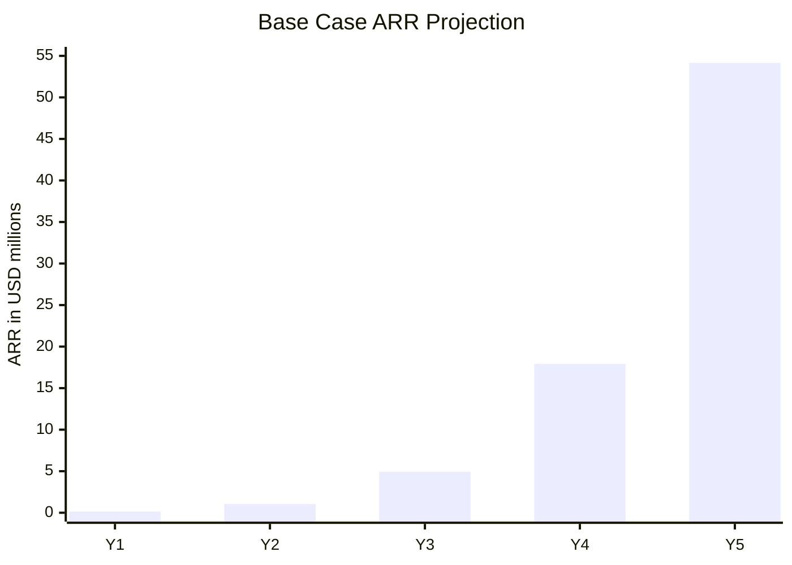

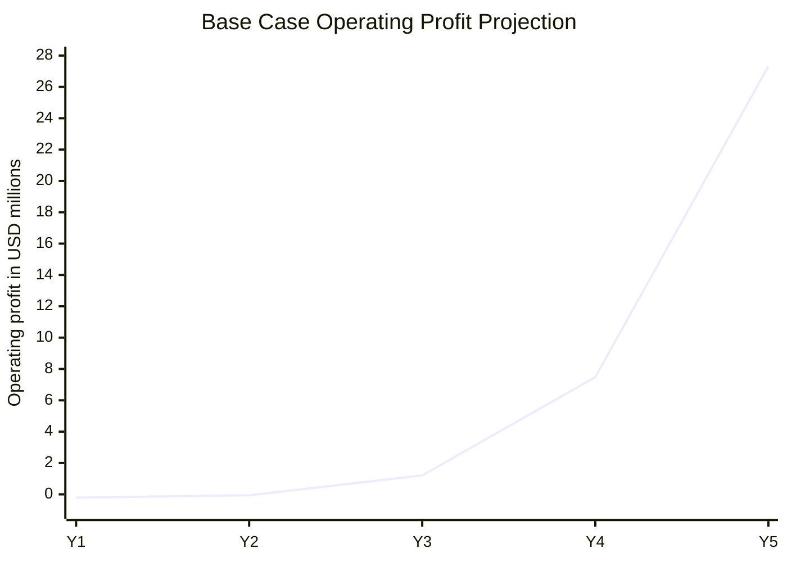

## Current State In The Repository 🔎

### Hub capabilities already exist

The root [`README.md`](../../README.md) positions xNet as decentralized data infrastructure and an
application: local-first, P2P-synced, user-owned data. The hub is already a real package, not just
a future plan.

[`packages/hub/README.md`](../../packages/hub/README.md) describes:

- WebSocket signaling
- Yjs sync relay
- NodeStore change relay
- encrypted backup
- file storage
- schema registry
- full-text search
- awareness and presence
- peer discovery
- UCAN authentication
- rate limiting
- metrics
- federation
- sharding
- crawling

Those map cleanly to paid services:

| Code surface    | Repo evidence                                                                                                            | Paid product implication                                         |
| --------------- | ------------------------------------------------------------------------------------------------------------------------ | ---------------------------------------------------------------- |
| Hub server      | [`packages/hub/src/server.ts`](../../packages/hub/src/server.ts)                                                         | Managed hub runtime and hosted app backend                       |
| Hub config      | [`packages/hub/src/types.ts`](../../packages/hub/src/types.ts)                                                           | Plan limits, quotas, runtime metadata, demo mode                 |
| Backup          | [`packages/hub/src/services/backup.ts`](../../packages/hub/src/services/backup.ts)                                       | Personal/team encrypted backup subscriptions                     |
| Files           | [`packages/hub/src/services/files.ts`](../../packages/hub/src/services/files.ts)                                         | Attachments, media, content-addressed storage                    |
| Search          | [`packages/hub/src/services/query.ts`](../../packages/hub/src/services/query.ts)                                         | Team search, hosted search API, public indexes                   |
| Federation      | [`packages/hub/src/services/federation.ts`](../../packages/hub/src/services/federation.ts)                               | Community and enterprise peering                                 |
| Sharding        | [`packages/hub/src/services/shard-router.ts`](../../packages/hub/src/services/shard-router.ts)                           | Federated index/backbone hosting                                 |
| Metrics         | [`packages/hub/src/middleware/metrics.ts`](../../packages/hub/src/middleware/metrics.ts)                                 | Operator dashboard foundation, not billing-grade yet             |
| Electron tunnel | [`apps/electron/src/main/cloudflare-tunnel-manager.ts`](../../apps/electron/src/main/cloudflare-tunnel-manager.ts)       | Home-hosting assist and secure temporary sharing                 |
| Settings UI     | [`apps/electron/src/renderer/components/SettingsView.tsx`](../../apps/electron/src/renderer/components/SettingsView.tsx) | Natural entry point for hub plan, sync, backup, network controls |
| Share UI        | [`apps/electron/src/renderer/components/ShareButton.tsx`](../../apps/electron/src/renderer/components/ShareButton.tsx)   | Clear paid value: secure links that work outside the LAN         |

### Current plan limits are already close to a free/demo tier

Observed facts from [`packages/hub/src/types.ts`](../../packages/hub/src/types.ts):

- default backup quota is `1GB` per DID;
- max backup blob size is `50MB`;
- max concurrent hub connections default to `1000`;
- demo mode defaults to `10MB` quota, `50` docs, `2MB` max blob, and `24h` inactivity eviction.

Observed facts from services:

- [`BackupService`](../../packages/hub/src/services/backup.ts) enforces quota and blob size.
- [`FileService`](../../packages/hub/src/services/files.ts) defaults to `100MB` max file size and
  `5GB` max storage per uploader.
- [`QueryService`](../../packages/hub/src/services/query.ts) caps result limits and filters
  authorized search results.
- [`FederationService`](../../packages/hub/src/services/federation.ts) has peer registration,
  schema exposure, per-peer rate limits, health fields, signed responses, and UCAN checks.

Inference:

> xNet does not need to invent paid hosting primitives from scratch. It needs account identity,
> billing-grade usage records, plan-aware quotas, better admin UI, and operational maturity.

### Product gaps before paid hosting

The missing commercial layer is still significant:

- no billing account linked to DID, workspace, organization, or operator;
- no subscription state or plan entitlements;
- no usage-event ledger with idempotency;
- no hosted control plane;
- no customer-facing hub usage dashboard;
- no migration path between xNet Cloud, home hub, and third-party hosted hubs;
- no public `HubOffer` metadata for provider capabilities and pricing;
- no SLA, support, data processing agreement, incident, or compliance workflow;
- no enterprise admin surface for SSO, audit, retention, residency, and federation policy;
- no clear separation between "xNet app user", "hub operator", "community admin", and
  "enterprise workspace admin".

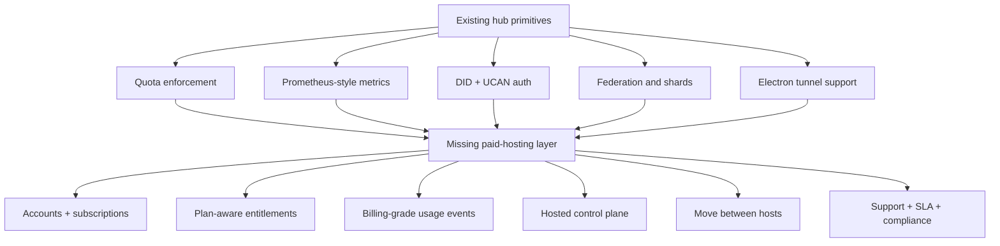

### Adjacent local explorations

This exploration builds on:

- [`0035_[x]_MINIMAL_SIGNALING_ONLY_HUB.md`](./0035_[x]_MINIMAL_SIGNALING_ONLY_HUB.md): explains
  why minimal signaling is not enough for reliability and why relay/TURN-like fallback has real
  cost.
- [`0132_[_]_ECONOMIC_MODELS_FOR_HOSTING_FEDERATED_HUBS.md`](./0132_[_]_ECONOMIC_MODELS_FOR_HOSTING_FEDERATED_HUBS.md):
  argues for layered hub roles: home, community, backbone, media, labeler, crawler.
- [`0144_[_]_POTENTIAL_MONETIZATION_ROUTES_ALIGNED_WITH_OPEN_FEDERATION.md`](./0144_[_]_POTENTIAL_MONETIZATION_ROUTES_ALIGNED_WITH_OPEN_FEDERATION.md):
  recommends managed hub hosting, operator tooling, B2B hosting, enterprise support, partner
  certification, and commons funding.
- [`docs/ROADMAP.md`](../ROADMAP.md): says local-first remains primary and planet-scale
  infrastructure should wait until multi-hub traffic and operator maturity exist.

The new emphasis here is product-market packaging:

> Start with a simple paid workspace cloud. Let the same product grow into home hosting,
> community hubs, enterprise workspaces, and federated index infrastructure.

## External Research 🌐

### Current pricing context

Public pricing in adjacent SaaS/PaaS/cloud products points to three useful patterns:

1. **Per-seat SaaS** for collaboration value.
2. **Usage pricing** for infra cost centers.
3. **Custom enterprise pricing** for procurement, risk, compliance, support, and SLAs.

| Platform      | Current public pattern                                                                                      | Relevance to xNet                                                         |
| ------------- | ----------------------------------------------------------------------------------------------------------- | ------------------------------------------------------------------------- |
| Supabase      | Free, Pro project pricing, Team/Enterprise org tiers on [Supabase pricing](https://supabase.com/pricing)    | Open-source developer infra with hosted convenience and project usage     |
| Vercel        | Free/Hobby, Pro per-user pricing, Enterprise custom on [Vercel pricing](https://vercel.com/pricing)         | Product-led developer platform with enterprise expansion                  |
| Railway       | Usage-based hosted infrastructure on [Railway pricing](https://railway.com/pricing)                         | Simple deploy/operate UX for developers                                   |
| Fly.io        | Pay-as-you-go machines, volumes, transfer, support on [Fly.io pricing](https://fly.io/pricing)              | Rawer infra xNet can run on, not compete with early                       |
| Render        | Free/Hobby through Team/Enterprise hosting on [Render pricing](https://render.com/pricing)                  | Managed deployment UX for apps/services                                   |
| Cloudflare R2 | Storage and operation classes, no egress fee on [R2 pricing](https://developers.cloudflare.com/r2/pricing/) | Useful model for xNet file/blob cost attribution                          |
| Tailscale     | Personal free, per-user paid plans, enterprise custom on [Tailscale pricing](https://tailscale.com/pricing) | Home-lab to enterprise adoption path and secure networking UX             |
| Discourse     | Managed open-source forum hosting on [Discourse pricing](https://www.discourse.org/pricing)                 | Open-source self-hosting plus official hosting can be coherent            |
| Matrix.org    | Freemium homeserver premium plans on [Matrix homeserver pricing](https://matrix.org/homeserver/pricing/)    | Public federated entry hubs need paid limits to avoid becoming cost sinks |

Pricing inference for xNet:

- Personal users understand `$5-$12/month` for reliable sync/backup.
- Small teams understand `$8-$15/seat/month` if collaboration, recovery, admin, and support are
  credible.
- Operators understand usage-based meters if the meters are explicit and inspectable.
- Enterprises understand annual contracts, SSO, audit, data processing terms, support, dedicated
  instances, and SLAs.
- Public community hubs need transparent limits and sponsor/member funding, otherwise they become
  expensive public goods with no owner.

### Federated platforms show where costs appear

Matrix is especially relevant. The Matrix.org Foundation announced premium accounts for the public
matrix.org homeserver because the homeserver and trust-and-safety costs had become material. The
foundation framed premium accounts as a way to get the public entry server closer to break-even and
reinvest in trust and safety. Source:
[Matrix premium accounts announcement](https://matrix.org/blog/2025/06/funding-homeserver-premium/).

AT Protocol's self-hosting docs separate data hosting from Relay and AppView infrastructure.
Relays are bandwidth-intensive and AppViews are resource-intensive because they replicate and index
application-level data. Source: [AT Protocol self-hosting](https://atproto.com/guides/self-hosting).

Mastodon documents the operational and social burden of running a server, including moderation,
rules, email, object storage, and continuity. Source:
[Mastodon run your own server docs](https://docs.joinmastodon.org/user/run-your-own/).

PeerTube architecture shows that federated video still needs API servers, databases, caches,
transcoding workers, object storage, ActivityPub federation, and redundancy. Source:
[PeerTube architecture](https://docs.joinpeertube.org/contribute/architecture).

Implication:

> xNet should never pretend "federated" means "free to operate." Federation changes who can provide
> the service and how users can leave. It does not remove the bill.

### Growth patterns from related platforms

| Platform      | Growth pattern                                                                                      | What likely caused growth                                                                                                                                                                                                            | xNet lesson                                                                             |
| ------------- | --------------------------------------------------------------------------------------------------- | ------------------------------------------------------------------------------------------------------------------------------------------------------------------------------------------------------------------------------------ | --------------------------------------------------------------------------------------- |
| GitHub        | Developer network effects, public repos, pull requests, social coding, then enterprise              | Free public collaboration made the network useful before enterprise procurement. GitHub reported 100M developers in 2023. Source: [GitHub blog](https://github.blog/news-insights/company-news/100-million-developers-and-counting/) | Public/community artifacts and shareable workspaces can be acquisition loops.           |
| Supabase      | Open-source Firebase alternative, Postgres portability, generous free tier, fast developer DX       | It rode existing Postgres trust and Firebase pain while staying self-hostable. Source: [Supabase launch week history](https://supabase.com/blog) and [Supabase pricing](https://supabase.com/pricing)                                | xNet should attach paid hosting to open primitives and credible portability.            |
| Vercel        | Framework-led growth through Next.js, previews, Git integration, templates, and enterprise security | Developers adopted the workflow before buyers bought governance. Source: [Vercel pricing](https://vercel.com/pricing)                                                                                                                | xNet needs one polished "wow" workflow: install app -> sync/backup/share in minutes.    |
| Tailscale     | Bottom-up personal/free use, home labs, developers, then business/enterprise network security       | It made a hard infra task feel like product UX. Source: [Tailscale pricing](https://tailscale.com/pricing)                                                                                                                           | Home hosting can be a growth channel if setup feels safe and boring.                    |
| Discourse     | Open-source community platform with official managed hosting                                        | Clear value is operations, upgrades, plugins, support, and migration, not proprietary lock-in. Source: [Discourse pricing](https://www.discourse.org/pricing)                                                                        | xNet can sell official hosting without closing self-hosting.                            |
| WordPress.com | Open-source ecosystem plus managed hosting convenience                                              | The open project created ecosystem gravity; hosted service monetized convenience. Source: [WordPress.com pricing](https://wordpress.com/pricing/)                                                                                    | xNet should let third-party hosts exist and still win official hosting through quality. |
| Matrix        | Public federated homeserver grew until trust-and-safety and hosting costs needed funding            | Federation's default public entry point can become a burden. Source: [Matrix premium announcement](https://matrix.org/blog/2025/06/funding-homeserver-premium/)                                                                      | xNet demo/default hubs need paid paths and limits from the start.                       |

Synthesis:

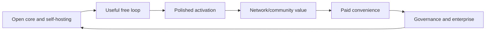

## Key Findings 🧭

### 1. The product should begin as SaaS, become PaaS later

Naive users buy outcomes:

- "my work is backed up"
- "my devices sync"
- "I can share this page"
- "I can recover after losing a laptop"
- "my team can work together"

Operators and enterprises buy controls:

- quotas, logs, backup policy, billing, migration;
- health, alerts, upgrades, data residency;
- federation allowlists, blocklists, peer health;
- SSO, audit, retention, legal hold, SLA.

If xNet leads with "run a federated hub," adoption will skew toward infrastructure hobbyists. If
it leads with "keep your xNet workspace safe and synced," it can acquire normal users and later
graduate them into hosting, teams, communities, and enterprise.

### 2. xNet can price the user-facing product simply while metering cost internally

User-facing pricing should be simple. Internally, xNet needs meters for:

- backup byte-months;
- file byte-months;
- file read operations;
- file egress or cache misses;
- WebSocket connection minutes;
- sync messages and bytes;
- query count and query duration;
- search index size;
- crawl jobs;
- shard storage and query fanout;
- federation queries;
- support and abuse events.

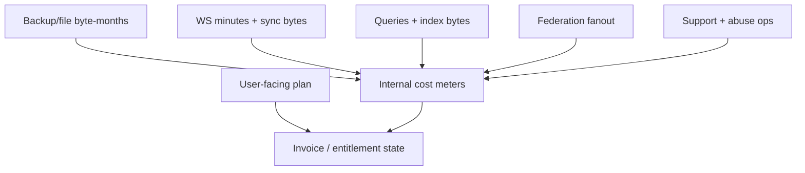

### 3. Storage plans should assume actual usage, not allocated quota

Cloud object storage pricing makes clear that storage, request operations, retrieval, transfer, and
replication can all matter. See [Cloudflare R2 pricing](https://developers.cloudflare.com/r2/pricing/)
and [AWS S3 pricing](https://aws.amazon.com/s3/pricing/).

Gross margin is attractive when most personal users store a few GB and mostly sync text. Margin
collapses if the plan invites heavy public media hosting without usage limits. Therefore:

- Personal plans can include generous-feeling backup quotas because median use should be low.
- File/media plans need stricter limits and overage.
- Public index hubs need usage pricing.
- Video and large attachments should not be quietly bundled into cheap personal tiers.

### 4. Home hosting is a trust feature and a growth loop, not the main revenue line

The Electron app already has Cloudflare tunnel management:
[`apps/electron/src/main/cloudflare-tunnel-manager.ts`](../../apps/electron/src/main/cloudflare-tunnel-manager.ts).

That is strategically useful:

- it gives technical users a credible self-host path;
- it reinforces xNet's data ownership story;
- it creates a bridge from local-only to reachable hub;
- it differentiates xNet from closed SaaS;
- it can become paid support/control-plane revenue.

But naive users should not be forced through home hosting. The default should be:

> "Use xNet Cloud now. You can move to your own hub later."

### 5. Enterprise value is governance, not raw hosting

Enterprise customers will not pay xNet because a Node.js hub can run somewhere. They pay for:

- contractual uptime and support;
- SSO/SCIM and admin lifecycle;
- audit logs and export;
- retention and legal hold;
- data residency and private networking;
- managed upgrades and incident response;
- permission proofs and revocation;
- procurement-friendly security posture;
- optional private federation.

That means enterprise should follow product maturity, not precede it.

### 6. Public federated index hubs are valuable but should come after paid workspace hosting

The hub already contains federation, sharding, query, and crawl primitives. But public index hubs
are harder to monetize early because they combine:

- compute-heavy indexing;
- abuse pressure;
- public-good dynamics;
- unclear buyer identity;
- hard ranking/moderation expectations;
- higher COGS variance.

The practical sequence is:

1. paid personal/team hub hosting;
2. community hub hosting;
3. operator control plane;
4. enterprise/private federation;
5. public index/backbone products.

## Product Shape 📦

### Tier 0: Free Demo Hub

Purpose: remove onboarding friction.

Suggested limits:

- browser/demo data local-first;
- encrypted hub backup with existing demo-mode style limits;
- 10MB storage;
- 24h inactivity eviction;
- no custom domain;
- no SLA;
- upgrade prompts around "keep this workspace."

This mirrors the current demo posture in the root README: local-first browser demo, 10MB hub quota,
and expiry after inactivity.

### Tier 1: Personal Cloud Hub

Purpose: sustain early development through individuals who value safe daily use.

Suggested pricing:

- `$6/month` annual or `$8/month` monthly;
- 25GB encrypted backup;
- 5GB file storage;
- unlimited devices;
- secure share links;
- 30-day version retention;
- email support / community support;
- simple usage dashboard.

Primary buyer:

- independent knowledge workers;
- researchers;
- developers;
- students with serious notes/projects;
- creators who want local-first but not server ops.

Sales cycle: minutes to one day, self-serve.

### Tier 2: Family / Home Lab

Purpose: bridge sovereignty and hosted reliability.

Suggested pricing:

- `$15/month` annual or `$19/month` monthly;
- 5 identities;
- 250GB backup/file pool;
- custom domain/tunnel helper;
- home hub health monitor;
- offsite encrypted snapshots to xNet Cloud;
- guided restore.

Primary buyer:

- home lab users;
- families;
- privacy-conscious users;
- technical users who will advocate for xNet.

Sales cycle: self-serve, one to seven days.

### Tier 3: Team Cloud

Purpose: collaboration and admin without enterprise procurement.

Suggested pricing:

- `$10/user/month` annual or `$12/user/month` monthly;
- minimum `$29/month`;
- shared workspace hub;
- member roles;
- workspace backup;
- team search;
- invite/revoke UX;
- 100GB included storage;
- overage by storage/egress/search class;
- basic audit trail.

Primary buyer:

- small teams;
- agencies;
- open-source maintainers;
- research labs;
- community organizations;
- indie software shops.

Sales cycle: 1 to 6 weeks, product-led with founder support.

### Tier 4: Community Hub

Purpose: public or semi-public shared hub with moderation and discovery.

Suggested pricing:

- `$49/month` starter community;
- `$149/month` growing community;
- `$299+/month` large community;
- public hub profile;
- member management;
- moderation queue;
- public index controls;
- sponsorship/membership payment links;
- optional verified listing.

Primary buyer:

- clubs;
- schools;
- local civic groups;
- open-source communities;
- professional associations;
- cooperatives.

Sales cycle: 2 to 8 weeks, often relationship-led.

### Tier 5: Business / Enterprise Workspace

Purpose: governed collaboration and private federation.

Suggested pricing:

- Business: `$20-$30/user/month`, annual.
- Enterprise dedicated: `$1,500-$10,000/month` platform fee plus user/storage/search terms.
- Custom SLA and support.

Required features:

- SSO/SAML/OIDC;
- SCIM;
- audit export;
- retention policy;
- legal hold;
- private dedicated hub or isolated tenancy;
- admin API;
- region pinning;
- DPA;
- security review;
- incident communication;
- optional private federation.

Primary buyer:

- regulated teams that need local-first control;
- research organizations;
- legal, design, engineering, architecture, field-work, and public-sector teams;
- enterprises experimenting with AI/data ownership.

Sales cycle:

- business teams: 1 to 3 months;
- enterprise: 3 to 9 months;
- public-sector/regulated: 6 to 18 months.

### Tier 6: Federated Index / Backbone Hub

Purpose: usage-priced search, query, shard, crawl, and API infrastructure.

Suggested pricing:

- `$20-$99/month` operator base fee;
- per 1,000 federation queries;
- per GB indexed;
- per GB shard replica;
- crawl credits;
- paid support for high-availability hosts;
- revenue share for certified third-party operators.

Primary buyer:

- app-view operators;
- public dataset operators;
- search/index communities;
- integrators;
- universities;
- large community networks;
- enterprise private-knowledge graph operators.

Sales cycle: usage-led for developers, 3 to 12 months for institutions.

## Pricing And Unit Economics 📊

### Recommended public pricing ladder

| Plan            |           Price | Best for                              | Included value                             | Paid expansion     |
| --------------- | --------------: | ------------------------------------- | ------------------------------------------ | ------------------ |
| Free Demo       |              $0 | trying xNet                           | 10MB, short-lived backup, local-first demo | Personal           |
| Personal        |        $6-$8/mo | one serious user                      | sync, backup, share, recovery              | storage packs      |
| Family/Home Lab |      $15-$19/mo | multiple identities, self-host assist | home hub monitor, offsite backup           | storage/support    |
| Team            | $10-$12/user/mo | small teams                           | roles, invites, search, audit basics       | storage/search     |
| Community       |    $49-$299+/mo | public/semi-public hubs               | moderation, public profile, index controls | members/API        |
| Business        | $20-$30/user/mo | governed workspaces                   | SSO-lite, admin, audit, retention          | support/compliance |
| Enterprise      |          custom | regulated orgs                        | dedicated tenancy, SLA, legal/security     | contract terms     |
| Index/Backbone  |           usage | app and index operators               | query, shard, crawl capacity               | usage and support  |

### Gross margin by workload

| Workload                  | Expected margin if priced well | Margin risk                                        |
| ------------------------- | -----------------------------: | -------------------------------------------------- |
| Personal text sync/backup |                        80%-90% | support burden and long-tail storage               |
| Team collaboration        |                        75%-85% | higher support and admin expectations              |
| Community hub             |                        60%-80% | moderation and abuse operations                    |
| Heavy file/media hosting  |                        40%-70% | storage, egress, hot-object reads                  |
| Enterprise dedicated      |                        55%-80% | support, security reviews, custom work             |
| Federated public index    |                        35%-75% | query fanout, crawlers, abuse, public-good subsidy |

### Sustainability threshold

Assumptions:

- Personal ARPU: `$6/month` = `$72/year`.
- Gross margin: `75%`.
- Lean annual operating budget: `$300,000`.

Formula:

```text
paid_personal_equivalents = operating_budget / (annual_arpu * gross_margin)
paid_personal_equivalents = 300000 / (72 * 0.75) = 5,556
```

Interpretation:

> xNet does not need venture-scale adoption to begin sustaining development. It needs either a few
> thousand committed personal users, or a much smaller mix of teams, communities, and support
> contracts.

### Base-case ARR mix

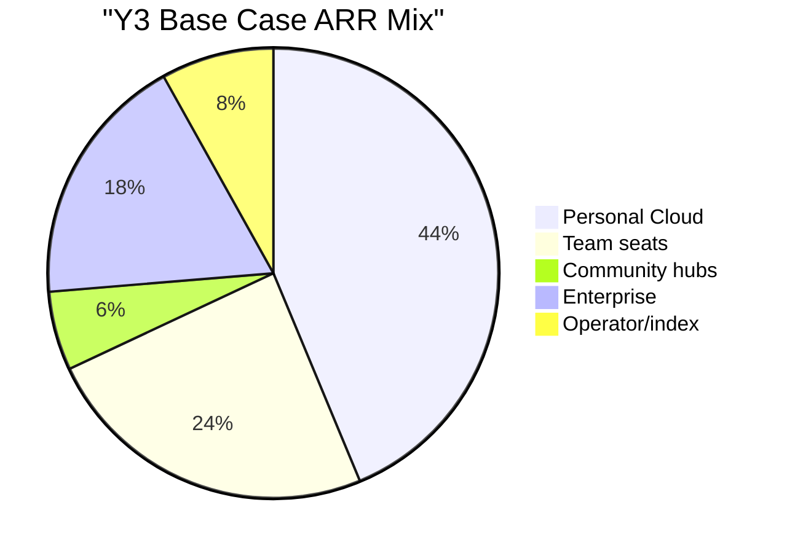

### Scenario model

This is a directional model, not a forecast.

Assumptions:

- Personal average price: `$6/month`.
- Team average price: `$10/seat/month`.
- Community average price: `$79/month`.
- Enterprise ACV grows from `$18k` early to `$90k` by Y5.
- COGS improves from `35%` in Y1 to `20%` in Y5 as operations mature.
- Operating expenses stay intentionally lean through Y2, then expand for support, security,
  enterprise, and platform work.

| Year |     ARR |    COGS | Gross profit | Operating expenses | Operating profit |
| ---: | ------: | ------: | -----------: | -----------------: | ---------------: |
|   Y1 |  $0.14M |  $0.05M |       $0.09M |             $0.30M |          -$0.21M |
|   Y2 |  $1.05M |  $0.31M |       $0.74M |             $0.80M |          -$0.06M |
|   Y3 |  $4.94M |  $1.24M |       $3.71M |             $2.50M |           $1.21M |
|   Y4 | $17.92M |  $3.94M |      $13.98M |             $6.50M |           $7.48M |
|   Y5 | $54.16M | $10.83M |      $43.32M |            $16.00M |          $27.32M |

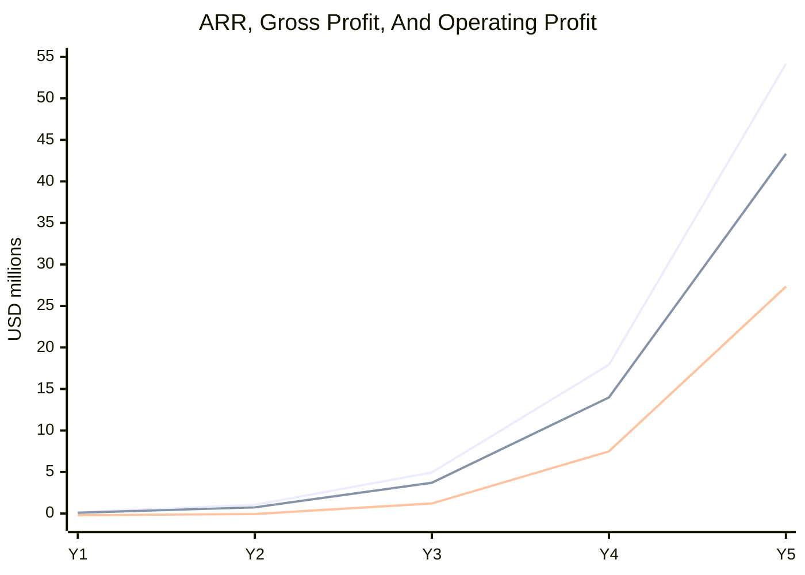

Legend for the chart above, in order: ARR, gross profit, operating profit.

### Low, base, high revenue cases

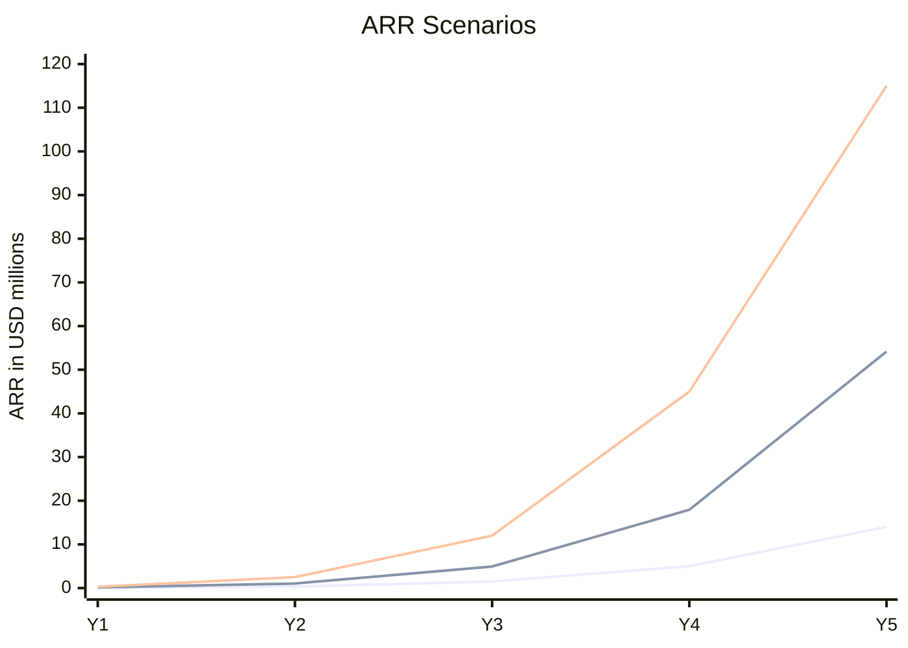

Legend: low, base, high.

Low case:

- xNet remains a niche but healthy local-first tool;
- personal conversion is modest;
- few enterprise deals close;
- enough revenue may sustain a small team but not major expansion.

Base case:

- personal paid sync/backup works;
- teams and communities grow from that base;
- enterprise follows after reliability and admin features mature.

High case:

- xNet becomes the default local-first workspace for a meaningful developer/creator community;
- federation and AI/data-ownership narratives accelerate adoption;
- enterprise/private federation closes earlier.

## Sales Cycles And Customer Segments 🧑‍💼

| Segment            | Buyer                      | Pain                            | Initial offer           | Sales cycle           | CAC shape           | Expansion                                 |
| ------------------ | -------------------------- | ------------------------------- | ----------------------- | --------------------- | ------------------- | ----------------------------------------- |
| Personal           | individual                 | data loss, device sync, sharing | Personal Cloud          | minutes to 1 day      | content/product-led | storage, family, teams                    |
| Home lab           | technical individual       | sovereignty plus reliability    | Home Hosting Assist     | 1 to 7 days           | docs/community      | support, offsite snapshots                |
| Small team         | founder/team lead          | collaboration, backup, search   | Team Cloud              | 1 to 6 weeks          | founder-led PLG     | seats, storage                            |
| Community          | admin/moderator            | shared hub, rules, discovery    | Community Hub           | 2 to 8 weeks          | relationship-led    | member growth, public index               |
| Integrator         | consultant/agency          | client deployments              | Partner/certified host  | 1 to 3 months         | partner motion      | recurring client hubs                     |
| Enterprise         | IT/security/business owner | governance, control, compliance | Business/Enterprise     | 3 to 9 months         | sales-assisted      | seats, dedicated hubs, private federation |
| Institution        | university/public sector   | public-good data, procurement   | federated/community hub | 6 to 18 months        | grants/procurement  | research/index funding                    |
| App/index operator | developer/org              | search/API/backbone capacity    | Index Hub               | usage-led to 6 months | docs/API/community  | query/shard/crawl usage                   |

The sales motion should change by stage:

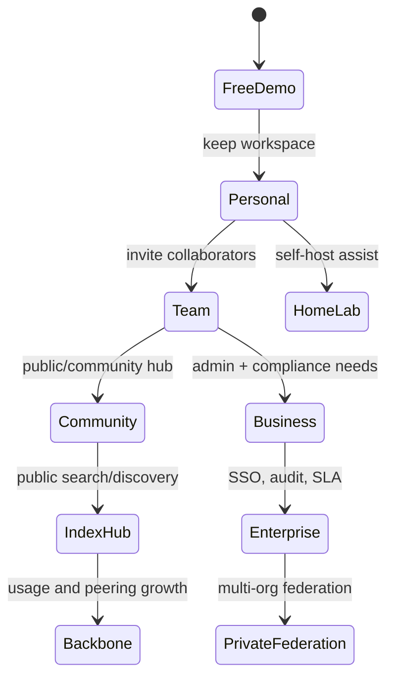

## UX Direction 🧩

### Core UX principle

Do not expose "hub hosting" as the first concept to normal users.

Expose the outcome:

- sync health;
- backup safety;
- sharing reachability;
- recovery confidence;
- member/admin state;
- federation reach.

The hub becomes visible as users need control.

### Personal activation flow

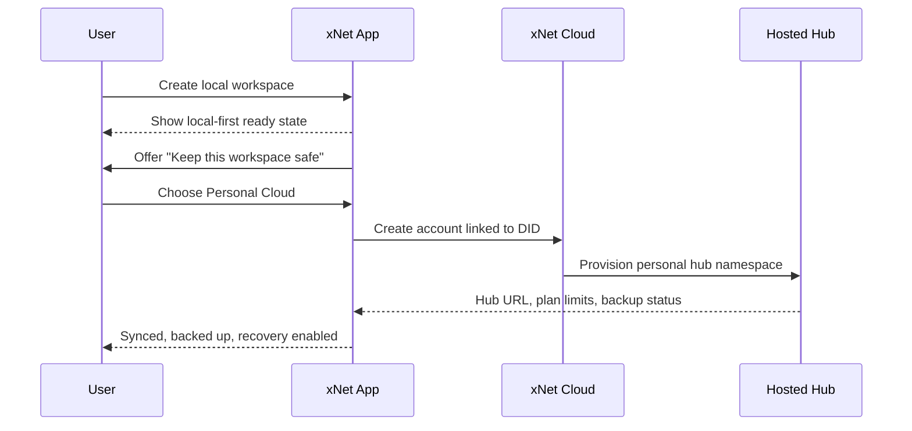

### Naive home hosting flow

The user should never start with DNS, ports, reverse proxies, TLS, or systemd.

Suggested flow:

1. Choose "Host this workspace yourself."
2. Pick where it runs: this Mac, home server, NAS, VPS, Raspberry Pi.
3. App checks prerequisites.
4. App creates hub identity and local config.
5. App chooses reachability path:
   - local network only;
   - Cloudflare Tunnel;
   - Tailscale/private network;
   - custom domain;
   - VPS deploy.
6. App verifies external reachability.
7. App schedules local and offsite encrypted snapshots.
8. App shows "safe to share" only after health checks pass.

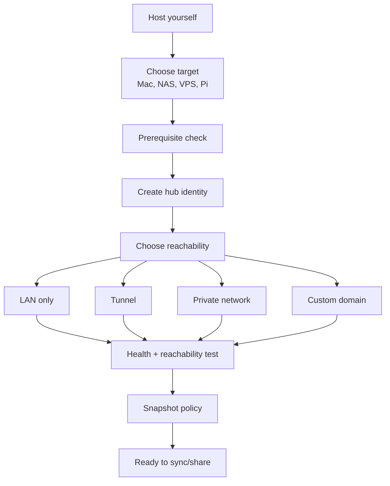

### Personal settings sketch

```text
Settings -> Sync & Backup

Status
  Hub: xNet Cloud Personal
  Sync: Healthy, 3 devices, last update 12s ago
  Backup: Complete, 1.8 GB of 25 GB used
  Recovery: Enabled, recovery key verified

Plan
  Personal Cloud - $6/mo annual
  [Manage plan] [Add storage] [Move to my own hub]

Devices
  MacBook Pro        Active now
  iPhone             4m ago
  Home desktop       2d ago

Sharing
  Secure links       Enabled
  Public reach       xnet-cloud
  Default expiry     30 minutes
```

### Team admin sketch

```text
Workspace Admin -> Overview

Health
  Sync: Healthy
  Backups: 100%
  Search index: Current
  Incidents: None

Members
  14 seats used
  3 pending invites
  2 external guests

Governance
  Roles: Viewer, Editor, Admin
  Audit export: Enabled
  Retention: 90 days
  SSO: Not configured

Usage
  Storage: 42 GB of 100 GB
  Search: 18k queries this month
  Share links: 71 active
```

### Enterprise federation policy sketch

```text
Enterprise Admin -> Federation

Private federation
  Mode: Allowlist only
  Peers: 7
  Default trust: Metadata only
  External indexing: Disabled by default

Peer graph
  acme-research      full trust       healthy
  university-lab     metadata only    degraded latency
  supplier-hub       suspended        policy violation

Controls
  [Add peer] [Rotate hub key] [Export policy] [Run trust audit]
```

### Community index hub sketch

```text
Community Hub -> Public Index

Coverage
  Public docs indexed: 82,441
  Schemas exposed: Events, Guides, Projects, Issues
  Last crawl: 6m ago

Moderation
  Queue: 18 pending
  Spam score threshold: strict
  Blocked hubs: 12

Funding
  Monthly cost estimate: $143
  Supporters: 41
  Sponsored query pool: 64% remaining

Federation
  Peers: 19 healthy, 2 degraded
  Published offer: xnet://community.example/.well-known/xnet-hub.json
```

### UX capability map

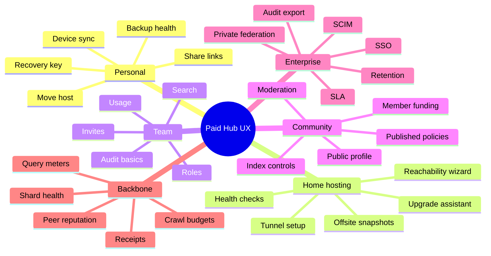

## Landscape Fit 🌍

### What xNet is not

xNet Cloud should not try to be AWS, Fly, Railway, Render, or Vercel in the early phase. Those
platforms sell generic deployment substrate.

xNet should run on those providers, and possibly support one-click deployment through them, but the
paid product is higher-level:

- workspace continuity;
- local-first sync;
- encrypted backup;
- portable hosted identity and data availability;
- trustable sharing;
- federation controls.

### What xNet resembles

The closest category is:

> Open-source managed hosting plus local-first collaboration plus federated data infrastructure.

Comparable patterns:

- Discourse: official hosting around open-source community software.
- WordPress.com: hosted convenience around a vast open ecosystem.
- Supabase: hosted developer convenience around portable open-source/Postgres primitives.
- Tailscale: a hard networking problem made approachable through product UX.
- Matrix/Mastodon/AT Protocol: federation with real operational cost.

### Differentiation

xNet can win a distinct position if it makes these all true:

- local-first editing works without the hub;
- paid hub makes users safer and more collaborative;
- migration between hubs is first-class;
- community/enterprise admins can control policy;
- federation is useful but opt-in and inspectable;
- paid hosting funds open development rather than closing the core.

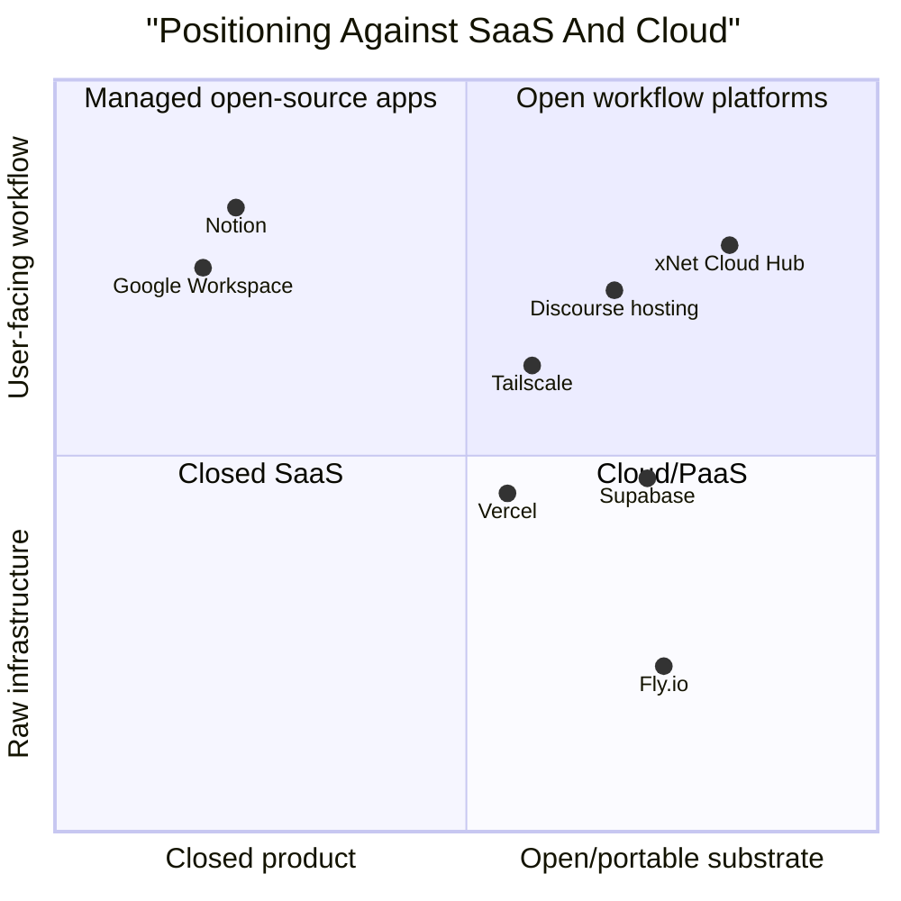

## Go-To-Market 🚀

### Phase 0: Instrument and dogfood paid hosting

Goal: prove the hub can be operated as a product.

Actions:

- create internal xNet Cloud hub for real daily use;
- add billing-grade usage events but do not charge yet;
- add backup/sync health dashboard in the app;
- measure actual storage, sync, query, and support costs;
- publish a transparent "hosted hub limits" page;
- create a waitlist/founder plan.

Success criteria:

- 30 days of reliable personal hub usage;
- restore from backup tested weekly;
- actual COGS per active user understood;
- no critical data-loss defects in dogfooding.

### Phase 1: Personal Cloud founder plan

Goal: convert early believers into paying users.

Offer:

- `$6/month` annual founder plan;
- "keep this workspace safe";
- encrypted backup;
- multi-device sync;
- secure share links;
- restore support;
- public commitment that self-hosting remains available.

Channels:

- local-first communities;
- open-source/developer audience;
- privacy/data-ownership content;
- demos on "lose your laptop, recover your workspace";
- "move from local-only to synced in 2 minutes."

Success criteria:

- 100 paying users;
- 70%+ month-2 retention;
- support load under 15 minutes/user/month;
- median backup restore under 5 minutes.

### Phase 2: Team and community design partners

Goal: prove collaboration and admin value.

Offer:

- Team Cloud;
- Community Hub;
- founder-led onboarding;
- direct support;
- migration/import help;
- active feedback loop.

Channels:

- open-source projects;
- research groups;
- small consultancies;
- community organizers;
- privacy/sovereignty groups;
- local civic/knowledge communities.

Success criteria:

- 10 active teams;
- 5 community hubs;
- weekly active collaboration in at least 50% of accounts;
- invite -> edit -> revoke path proven end-to-end.

### Phase 3: Home hosting assist and operator control plane

Goal: convert sovereignty from an ideology into product UX.

Offer:

- guided home/VPS deployment;
- health monitoring;
- update assistant;
- offsite encrypted snapshots;
- hub directory listing;
- optional paid support.

Channels:

- home lab communities;
- NAS/VPS tutorials;
- privacy communities;
- partner hosting providers.

Success criteria:

- 100 self-hosted hubs registered;
- 80% pass health checks;
- restore/migration path works between xNet Cloud and self-hosted hub.

### Phase 4: Business and enterprise readiness

Goal: sell governance once product usage justifies procurement.

Prerequisites:

- SSO/OIDC;
- audit logs;
- admin console;
- retention/export;
- security documentation;
- incident process;
- DPA;
- roadmap toward SOC 2;
- support runbooks.

Channels:

- design partners with real compliance pain;
- agencies serving regulated teams;
- research institutions;
- legal/engineering/field teams needing local-first control.

Success criteria:

- 5 annual contracts;
- one repeatable security review packet;
- one dedicated hub deployment pattern;
- support and incident process validated.

### Phase 5: Federated index and backbone products

Goal: monetize network-scale infrastructure after there is real demand.

Offer:

- search/query API;
- shard replica hosting;
- crawl credits;
- federation peering support;
- certified operator program;
- public hub registry and `HubOffer` docs.

Success criteria:

- 10 public/community indexes;
- query COGS and abuse profile understood;
- usage pricing covers high-percentile workloads;
- third-party operator economics make sense.

## Recommended Architecture For Paid Hosting 🏗️

### Product architecture

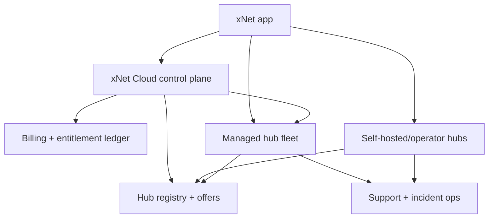

### Hub offer document

Each hub should publish a machine-readable offer, inspired by patterns like Nostr relay info docs
and cloud provider pricing pages. The goal is not protocol-level settlement yet. The goal is
transparent comparison and migration.

Suggested endpoint:

```text
GET /.well-known/xnet-hub.json
```

Offer fields:

- hub DID;
- operator name/contact;
- jurisdiction;
- public URL;
- supported protocols;
- schemas accepted/exposed;
- storage and file limits;
- federation policy;
- moderation policy;
- payment URL;
- plan IDs;
- uptime/SLA claim;
- support channel;
- export/migration support;
- signed timestamp.

### Billing-grade usage events

Prometheus metrics are useful for ops, but billing needs idempotent events:

- event ID;
- subject DID or workspace ID;
- hub DID;
- meter name;
- quantity;
- unit;
- timestamp;
- source service;
- plan ID;
- idempotency key;
- signature/hash.

Those events should feed:

- quota decisions;
- customer usage UI;
- invoices;
- internal COGS analysis;
- abuse controls;
- operator settlement later.

### Migration as anti-lock-in product UX

Paid hosting is aligned with xNet's mission only if users can leave.

Required migration flows:

- xNet Cloud -> self-hosted hub;
- self-hosted hub -> xNet Cloud;
- third-party host -> xNet Cloud;
- xNet Cloud region A -> xNet Cloud region B;
- personal hub -> team hub;
- team hub -> enterprise dedicated hub.

The migration UX should show:

- source hub health;
- destination hub capability match;
- encrypted backup state;
- federation policy differences;
- estimated downtime;
- rollback plan.

## Options And Tradeoffs ⚖️

### Option A: Personal hosted hubs first

Pros:

- fastest path to revenue;
- clear user value;
- minimal enterprise burden;
- aligns with local-first daily-driver roadmap;
- easier to support than public federation.

Cons:

- low ARPU;
- consumer support can be noisy;
- requires excellent activation and trust.

Best use: primary starting path.

### Option B: Home hosting assist first

Pros:

- reinforces sovereignty;
- differentiates xNet;
- builds operator community;
- can create high-trust advocates.

Cons:

- support-heavy;
- fewer users will pay enough;
- setup environments vary widely;
- not enough revenue alone.

Best use: secondary trust and advocacy path.

### Option C: Team/community hubs first

Pros:

- higher ARPU;
- collaboration creates visible value;
- communities can become distribution nodes.

Cons:

- invite, permission, moderation, and support must be good;
- churn risk if collaboration is immature;
- community moderation can become expensive.

Best use: design-partner phase after personal reliability.

### Option D: Enterprise first

Pros:

- high ACV;
- can fund development quickly if deals close;
- clear governance requirements.

Cons:

- long sales cycle;
- compliance burden;
- high opportunity cost;
- product may bend around one customer.

Best use: opportunistic design partners, not primary motion.

### Option E: Federated index/backbone first

Pros:

- directly supports xNet's macro vision;
- strategically differentiated;
- useful for apps and public data.

Cons:

- expensive and abuse-prone;
- unclear early buyer;
- harder to explain;
- risks premature infrastructure buildout.

Best use: later, after hubs have real public/community demand.

## Recommendation ✅

Build **xNet Cloud Hub** in four layers:

1. **Personal Cloud first**: paid sync, encrypted backup, sharing, recovery, and usage dashboard.
2. **Team/community second**: roles, invites, search, admin, moderation, and public hub profile.
3. **Operator/control-plane third**: home/VPS deploy assistant, health checks, upgrades, snapshots,
   registry, and paid support.
4. **Enterprise/backbone fourth**: SSO, audit, retention, dedicated hubs, private federation,
   service receipts, sharded search, crawl/query usage pricing.

The first paid product should be deliberately narrow:

> "Keep your xNet workspace safe, synced, and shareable for $6/month."

Do not make the initial paid product carry the whole future vision. The future vision becomes
credible only after the first workflow is boringly reliable.

## Implementation Checklist 🛠️

### Product foundation

- [ ] Define hosted plan IDs: `demo`, `personal`, `family`, `team`, `community`, `business`,
      `enterprise`, `index`.
- [ ] Add an account model that can link DIDs, workspaces, organizations, and billing customers.
- [ ] Add plan entitlement resolution in the hub.
- [ ] Convert backup/file quotas from config-only to plan-aware limits.
- [ ] Add customer-visible usage summaries for backup, files, sync, search, and share links.
- [ ] Add upgrade prompts around durable value: backup, sync, share, recovery.

### Billing and metering

- [ ] Add idempotent usage-event records.
- [ ] Emit usage events from backup upload/delete.
- [ ] Emit usage events from file upload/download.
- [ ] Emit usage events from sync relay and connection minutes.
- [ ] Emit usage events from query/search.
- [ ] Emit usage events from federation and shard routing.
- [ ] Add plan overage policy, even if overage billing remains disabled initially.
- [ ] Build internal COGS report by customer, plan, meter, and service.

### Hosted control plane

- [ ] Add control-plane service separate from individual hubs.
- [ ] Add hub provisioning.
- [ ] Add hub health reporting.
- [ ] Add hub upgrade orchestration.
- [ ] Add backup restore orchestration.
- [ ] Add customer plan management.
- [ ] Add incident/status surface.

### App UX

- [ ] Replace generic "Network" settings with "Sync & Backup" as the user-facing entry point.
- [ ] Add hub health indicator with "local only", "syncing", "backed up", "action needed" states.
- [ ] Add recovery-key verification UI.
- [ ] Add secure sharing state tied to hub reachability.
- [ ] Add "Move to another hub" migration wizard.
- [ ] Add home-hosting wizard using existing tunnel manager primitives.
- [ ] Add team admin screens: members, roles, usage, audit, invites, billing.
- [ ] Add community screens: public profile, moderation, index policy, funding status.

### Enterprise readiness

- [ ] Add organization model and workspace admin boundaries.
- [ ] Add OIDC/SAML SSO.
- [ ] Add SCIM or minimal user provisioning API.
- [ ] Add audit log export.
- [ ] Add retention policy controls.
- [ ] Add legal hold/export controls.
- [ ] Add data residency metadata.
- [ ] Add support escalation and incident runbooks.
- [ ] Prepare security review packet and DPA templates.

### Federation and operator economy

- [ ] Define `HubOffer` schema.
- [ ] Publish `/.well-known/xnet-hub.json` from every hub.
- [ ] Sign hub offers with hub DID.
- [ ] Add hub registry directory.
- [ ] Add operator dashboard for self-hosted hubs.
- [ ] Add federation policy UI.
- [ ] Add query/shard/crawl usage meters.
- [ ] Add signed service receipts after basic usage events are stable.
- [ ] Design certified host/integrator program only after real operator demand exists.

## Validation Checklist 🧪

### Reliability

- [ ] Restore a personal workspace from hosted backup on a fresh device.
- [ ] Sync three devices through a hosted hub for seven days.
- [ ] Verify offline editing continues when the hub is unavailable.
- [ ] Verify hub reconnect does not duplicate, drop, or corrupt changes.
- [ ] Run disaster recovery drill for hub storage loss.

### Security and trust

- [ ] Confirm encrypted backup payloads cannot be read by the hub.
- [ ] Confirm share-link grant expiry and revocation eject active access.
- [ ] Confirm plan changes cannot escalate permissions.
- [ ] Confirm billing account ownership cannot take over a DID.
- [ ] Confirm support tooling cannot bypass user data encryption.

### Unit economics

- [ ] Measure COGS per active personal user.
- [ ] Measure COGS per GB stored.
- [ ] Measure COGS per 1,000 sync messages.
- [ ] Measure COGS per 1,000 search queries.
- [ ] Measure p95/p99 heavy-user cost.
- [ ] Validate gross margin for personal plan above 75%.
- [ ] Validate community/index plans remain profitable under high-read workloads.

### Product-market

- [ ] Convert 100 founder users to paid Personal.
- [ ] Retain 70%+ of founder users into month 2.
- [ ] Prove 5 users recover on a new device without founder intervention.
- [ ] Onboard 10 teams with active weekly collaboration.
- [ ] Onboard 5 community hubs with public profile and moderation policy.
- [ ] Close 1 annual business/enterprise design partner without custom architecture.

### UX

- [ ] A non-technical user can enable hosted backup in under 2 minutes.
- [ ] A user can understand whether they are local-only, synced, or backed up at a glance.
- [ ] A home-host user can pass reachability checks without reading raw tunnel logs.
- [ ] A team admin can invite, revoke, and audit membership without docs.
- [ ] A community operator can see cost estimate and funding status.
- [ ] An enterprise admin can export audit logs and review federation policy.

## Example Code 💻

The paid-hosting layer should stay declarative: plans and hub offers should be data that the hub,
app, billing system, and registry can all read.

```typescript
/**
 * Example shape for a published hub offer and plan selector.
 */

export type HubMeter =
  | 'backup.gb_month'
  | 'files.gb_month'
  | 'files.read_ops'
  | 'sync.connection_minutes'
  | 'sync.message_mb'
  | 'search.query'
  | 'search.index_gb'
  | 'federation.query'
  | 'crawl.credit'

export type HubPlanId =
  | 'demo'
  | 'personal'
  | 'family'
  | 'team'
  | 'community'
  | 'business'
  | 'enterprise'
  | 'index'

export type HubPlan = {
  id: HubPlanId
  name: string
  monthlyUsd: number | 'custom'
  included: Partial<Record<HubMeter, number>>
  limits: {
    users?: number
    workspaces?: number
    maxBlobMb?: number
    maxFileMb?: number
    sla?: 'none' | 'best-effort' | '99.5' | '99.9' | 'custom'
  }
}

export type HubOffer = {
  version: 1
  hubDid: `did:key:${string}`
  publicUrl: string
  operator: {
    name: string
    contactUrl: string
    jurisdiction?: string
  }
  capabilities: {
    backup: boolean
    files: boolean
    syncRelay: boolean
    search: boolean
    federation: boolean
    sharding: boolean
    crawling: boolean
  }
  plans: HubPlan[]
  termsUrl: string
  privacyUrl: string
  publishedAt: string
  signature: string
}

export type UsageProfile = {
  users: number
  backupGb: number
  fileGb: number
  needsFederation: boolean
  needsSla: boolean
}

export const choosePlan = (plans: HubPlan[], usage: UsageProfile): HubPlan | null => {
  const candidates = plans.filter((plan) => {
    if (typeof plan.monthlyUsd !== 'number') return false
    if (plan.limits.users && usage.users > plan.limits.users) return false
    if ((plan.included['backup.gb_month'] ?? 0) < usage.backupGb) return false
    if ((plan.included['files.gb_month'] ?? 0) < usage.fileGb) return false
    if (
      usage.needsFederation &&
      !['community', 'business', 'enterprise', 'index'].includes(plan.id)
    ) {
      return false
    }
    if (usage.needsSla && !['business', 'enterprise'].includes(plan.id)) return false
    return true
  })

  return candidates.sort((a, b) => Number(a.monthlyUsd) - Number(b.monthlyUsd))[0] ?? null
}
```

Example usage:

```typescript
const selected = choosePlan(offer.plans, {
  users: 8,
  backupGb: 40,
  fileGb: 20,
  needsFederation: false,
  needsSla: false
})

if (selected?.id === 'team') {
  console.log('Recommend Team Cloud')
}
```

## Risks And Mitigations 🚧

| Risk                 | Why it matters                                                  | Mitigation                                                                       |
| -------------------- | --------------------------------------------------------------- | -------------------------------------------------------------------------------- |
| Product ambiguity    | "Hub hosting" can sound like infra, SaaS, backup, or federation | Lead with personal outcome: safe, synced, shareable workspace                    |
| Data-trust gap       | Users must trust hosted backup and sync                         | Keep encryption clear, publish threat model, prove restore, support self-hosting |
| COGS surprises       | Heavy file/media/index users can destroy margin                 | Meter internally from day one and avoid unbounded media bundles                  |
| Support burden       | Personal/home hosting users can consume founder time            | Invest in health checks, diagnostics, clear errors, restore automation           |
| Premature enterprise | Enterprise requirements can overwhelm product                   | Only take design partners that align with core roadmap                           |
| Federation abuse     | Public hubs invite spam, crawling abuse, and policy disputes    | Start with allowlists, community controls, rate limits, and transparent policies |
| Lock-in perception   | Paid hosting can conflict with decentralization story           | Build migration, `HubOffer`, self-hosting, and third-party-host paths early      |
| Pricing too complex  | PaaS-like meters can scare normal users                         | Keep public plans simple and internal meters detailed                            |

## Open Questions ❓

- Should xNet Cloud be a separate brand, or simply "xNet Cloud" inside the app?
- Should the first paid plan include a small amount of support, or support only through community?
- What is the minimum secure account model for linking DIDs to billing without centralizing
  identity?
- Should xNet Cloud use Stripe from the start, or begin with manual founder invoices?
- What is the exact restore UX for users who lose both device and passkey?
- How should home-hosting support be priced without creating unlimited support obligations?
- What data is acceptable in billing events without weakening privacy posture?
- When does the first enterprise security commitment become worth the burden?
- What share of hosted revenue should be explicitly committed to open commons work?

## Next Actions

1. Build a one-page product spec for **Personal Cloud Hub** with exact limits, restore flow, and
   upgrade path.
2. Add a technical plan for plan-aware quotas and billing-grade usage events.
3. Create a settings UX mockup for "Sync & Backup" that replaces the current generic Network
   settings framing.
4. Run a cost model from real hub telemetry for one week of dogfooding.
5. Open a founder-plan waitlist and interview 20 likely paid users before implementing payments.

## References

### xNet repository

- [`README.md`](../../README.md)
- [`docs/ROADMAP.md`](../ROADMAP.md)
- [`packages/hub/README.md`](../../packages/hub/README.md)
- [`packages/hub/src/types.ts`](../../packages/hub/src/types.ts)
- [`packages/hub/src/server.ts`](../../packages/hub/src/server.ts)
- [`packages/hub/src/services/backup.ts`](../../packages/hub/src/services/backup.ts)
- [`packages/hub/src/services/files.ts`](../../packages/hub/src/services/files.ts)
- [`packages/hub/src/services/query.ts`](../../packages/hub/src/services/query.ts)
- [`packages/hub/src/services/federation.ts`](../../packages/hub/src/services/federation.ts)
- [`packages/hub/src/services/shard-router.ts`](../../packages/hub/src/services/shard-router.ts)
- [`packages/hub/src/middleware/metrics.ts`](../../packages/hub/src/middleware/metrics.ts)
- [`apps/electron/src/main/cloudflare-tunnel-manager.ts`](../../apps/electron/src/main/cloudflare-tunnel-manager.ts)
- [`apps/electron/src/renderer/components/SettingsView.tsx`](../../apps/electron/src/renderer/components/SettingsView.tsx)
- [`apps/electron/src/renderer/components/ShareButton.tsx`](../../apps/electron/src/renderer/components/ShareButton.tsx)
- [`0035_[x]_MINIMAL_SIGNALING_ONLY_HUB.md`](./0035_[x]_MINIMAL_SIGNALING_ONLY_HUB.md)
- [`0132_[_]_ECONOMIC_MODELS_FOR_HOSTING_FEDERATED_HUBS.md`](./0132_[_]_ECONOMIC_MODELS_FOR_HOSTING_FEDERATED_HUBS.md)
- [`0144_[_]_POTENTIAL_MONETIZATION_ROUTES_ALIGNED_WITH_OPEN_FEDERATION.md`](./0144_[_]_POTENTIAL_MONETIZATION_ROUTES_ALIGNED_WITH_OPEN_FEDERATION.md)

### External sources

- [Supabase pricing](https://supabase.com/pricing)
- [Vercel pricing](https://vercel.com/pricing)
- [Railway pricing](https://railway.com/pricing)
- [Fly.io pricing](https://fly.io/pricing)
- [Render pricing](https://render.com/pricing)
- [Cloudflare R2 pricing](https://developers.cloudflare.com/r2/pricing/)
- [AWS S3 pricing](https://aws.amazon.com/s3/pricing/)
- [Tailscale pricing](https://tailscale.com/pricing)
- [Discourse pricing](https://www.discourse.org/pricing)
- [WordPress.com pricing](https://wordpress.com/pricing/)
- [Matrix premium accounts announcement](https://matrix.org/blog/2025/06/funding-homeserver-premium/)
- [Matrix homeserver pricing](https://matrix.org/homeserver/pricing/)
- [AT Protocol self-hosting](https://atproto.com/guides/self-hosting)
- [Mastodon: run your own server](https://docs.joinmastodon.org/user/run-your-own/)
- [PeerTube architecture](https://docs.joinpeertube.org/contribute/architecture)
- [GitHub: 100 million developers and counting](https://github.blog/news-insights/company-news/100-million-developers-and-counting/)
