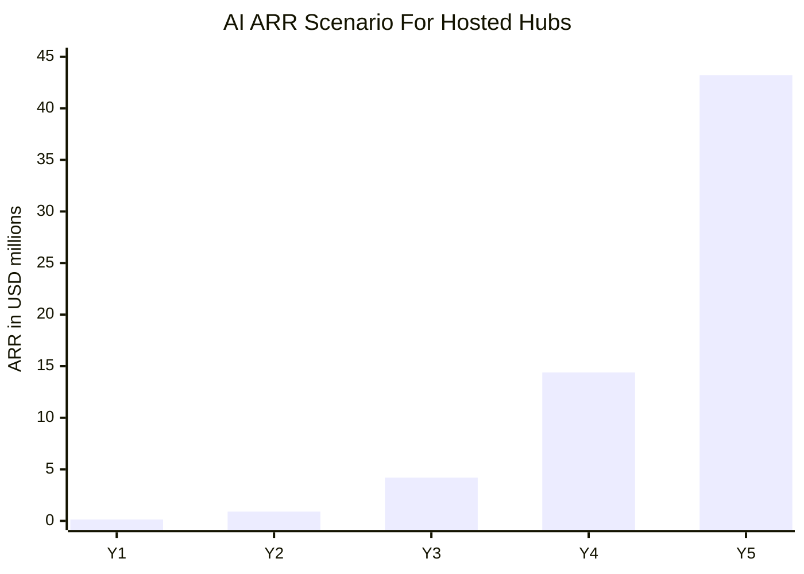
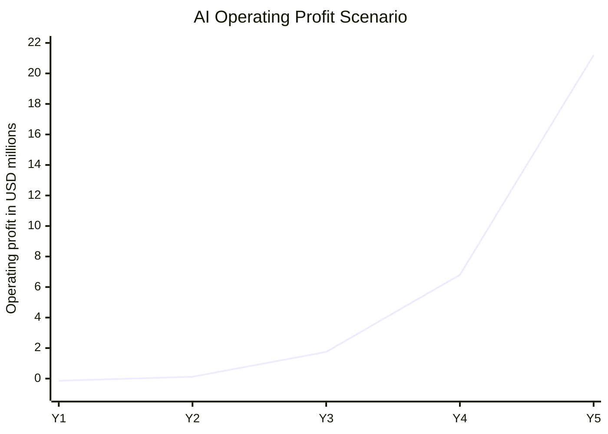
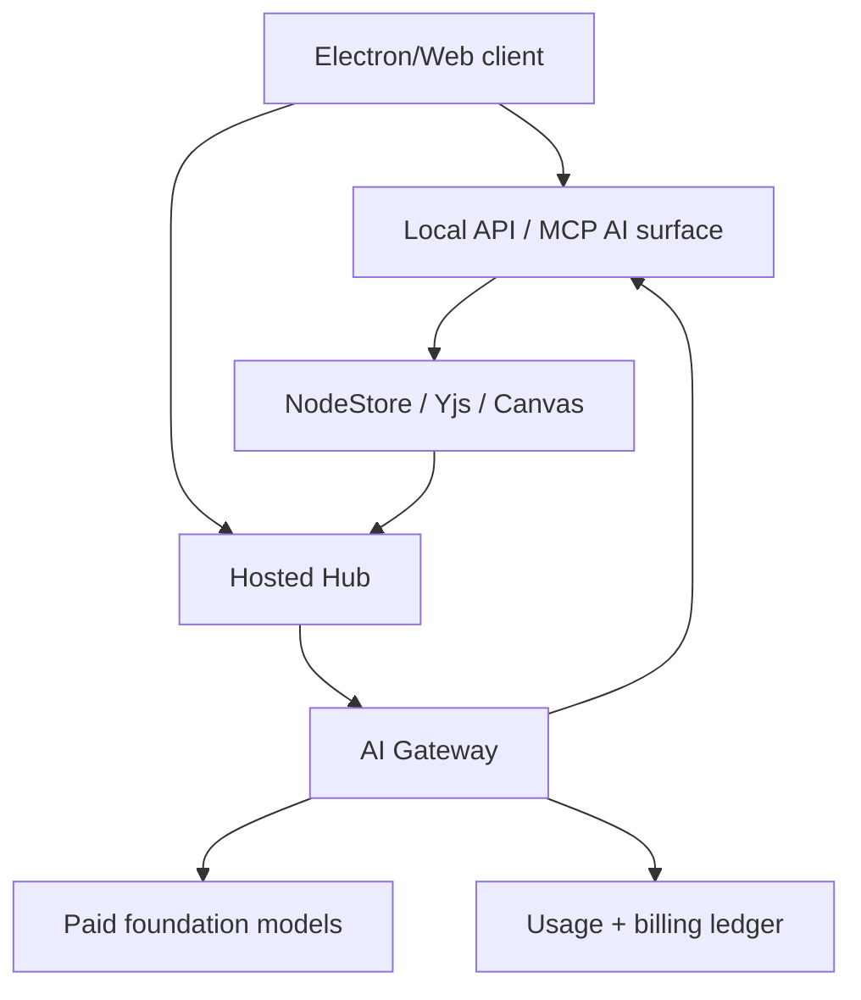
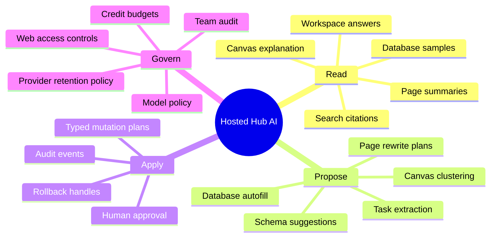
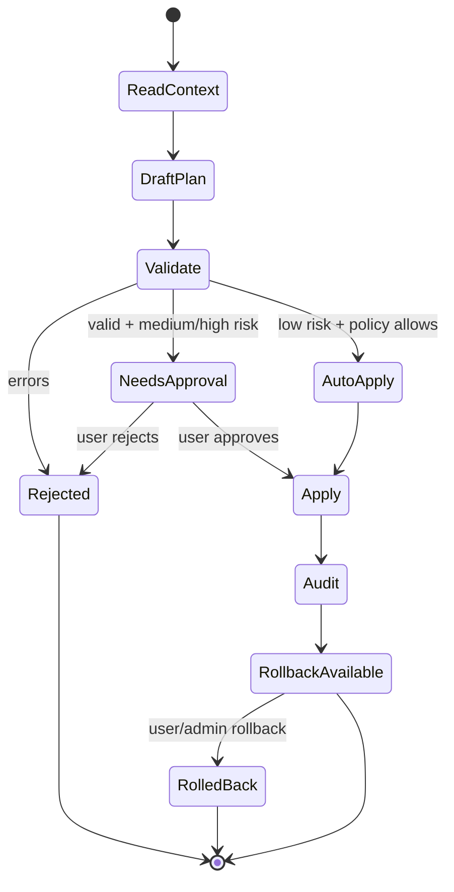
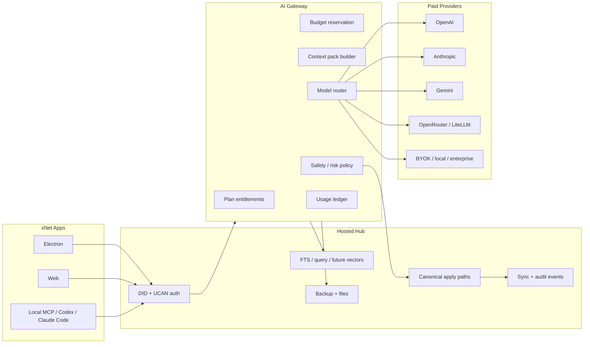
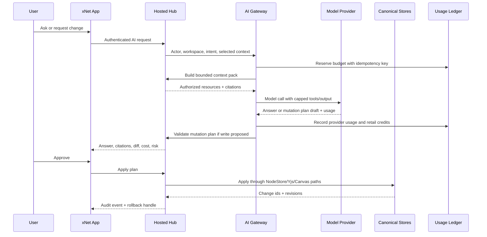
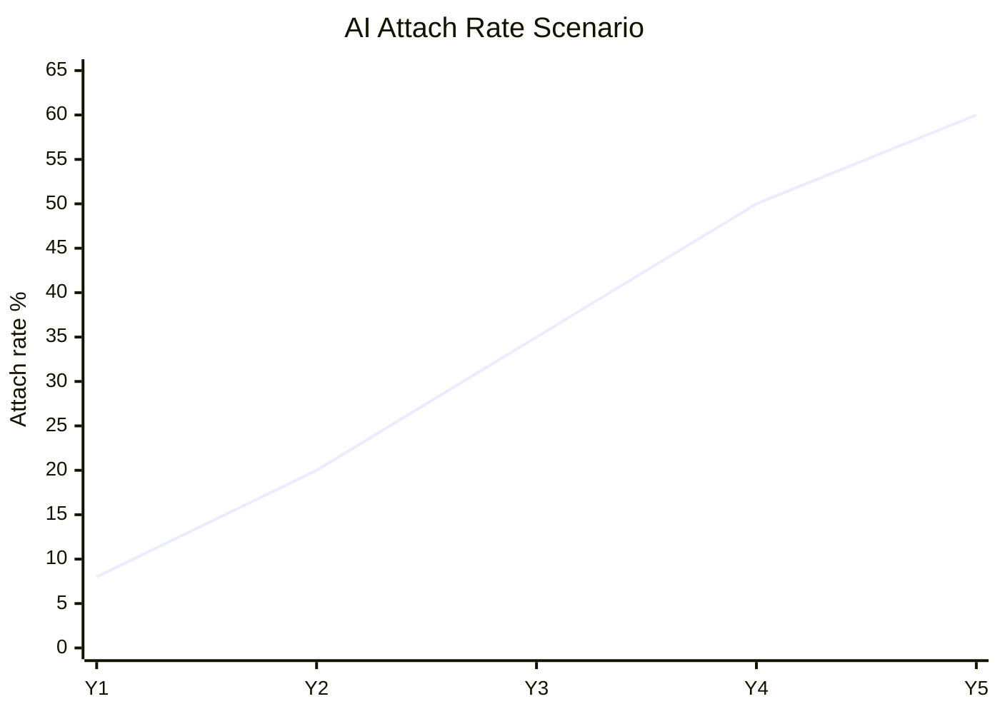
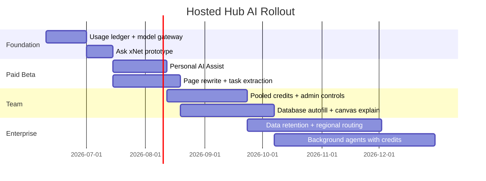

# Hosted Hubs Deep AI Integration With Paid Foundation Models

> **Status:** Exploration  
> **Date:** 2026-06-04  
> **Author:** Codex  
> **Tags:** hosted-hubs, ai, foundation-models, pricing, profitability, agents, knowledge-management, local-first, federation, go-to-market

## Problem Statement 💸

The previous hosted hub exploration argued that paid hub hosting should be packaged as a
local-first workspace cloud: sync, backup, recovery, sharing, search, team administration, and
eventually federation.

This exploration extends that thesis into AI:

> How should hosted xNet hubs offer deep AI integration using paid foundation models while staying
> profitable, safe, operationally maintainable, and competitive with Notion AI, AFFiNE AI, Google
> Workspace Gemini, Microsoft 365 Copilot, ClickUp Brain, Coda AI, Slite, Atlassian Rovo, and the
> broader knowledge-management AI market?

The hard constraint is economic. xNet should not subsidize heavy AI use. Every hosted AI feature
must have a clear gross-margin path through subscriptions, included usage budgets, metered overage,
BYOK platform fees, or enterprise commits.

## Exploration Status

- [x] Review the prior paid hosted hub exploration.
- [x] Review adjacent AI exploration on pages, databases, canvases, Local API, MCP, and agent
      workspace projection.
- [x] Inspect current hub, AI surface, AI provider, Local API, MCP, and workspace exporter code.
- [x] Research current model pricing and competitor AI packaging.
- [x] Model AI unit economics, growth curves, gross margin, operating profit, and break-even
      points.
- [x] Evaluate rogue AI risks and how xNet's persistent/idempotent data model changes the risk.
- [x] Recommend a first wedge, rollout path, implementation checklist, validation checklist, and
      example code.

## Executive Summary 🎯

xNet should add hosted AI as a **profitable AI workspace layer on top of paid hubs**, not as an
unbounded chatbot.

The recommended first wedge is:

> **Hosted AI Context Packs + Reviewable Change Plans**: a paid hub feature that can answer
> questions with citations from pages/databases/canvases, summarize selected context, rewrite a
> page section, extract tasks, autofill database fields, and propose page/database/canvas changes
> through xNet's existing AI mutation-plan lifecycle.

This is the best first wedge because it is high leverage relative to cost and complexity:

- It reuses code already present in `packages/plugins/src/ai-surface/*`,
  `packages/plugins/src/services/local-api.ts`, `packages/plugins/src/services/mcp-server.ts`, and
  `packages/plugins/src/services/ai-workspace-exporter.ts`.
- It uses existing hub search, backup, NodeStore sync, auth, quotas, metrics, and rate limiting as
  the hosted substrate.
- It creates visible value quickly: "ask my workspace", "summarize this page", "turn this meeting
  note into tasks", "update these database rows", "cluster this canvas".
- It avoids the worst early cost traps: autonomous always-on agents, broad web browsing, meeting
  transcription, image/video generation, unrestricted connector crawls, and unlimited frontier
  model usage.
- It is naturally safe: AI writes become typed mutation plans, diffs, approvals, audit events, and
  rollback handles.

The profitable packaging should be:

1. **AI Trial**: limited complimentary calls on hosted hubs, capped by dollars, not vague "fair use".
2. **Personal AI Assist**: add-on or bundled plan around `$12-$15/month`, with a small included AI
   credit budget and hard overage controls.
3. **Team AI Assist**: `$15-$25/seat/month`, pooled credits, admin caps, audit, and workspace-level
   model policy.
4. **AI Automation Credits**: prepaid credits for scheduled/background agents and expensive runs.
5. **BYOK Plus**: user-provided provider keys are allowed, but xNet still charges for orchestration,
   safety, audit, hosted retrieval, and support.
6. **Enterprise AI**: annual commits, dedicated routing, data residency, zero-retention providers,
   SSO, legal/compliance, support SLAs, and custom caps.

The rule:

> xNet should only offer "unlimited" for cheap, bounded operations where COGS has been proven. For
> frontier models, long context, web search, background agents, and connectors, use credits,
> overages, or enterprise commits.

Base-case AI-only projection:

| Year | AI paid users/seats | AI ARR | Direct AI COGS | Gross margin | AI OpEx | Operating profit |
| ---: | ------------------: | -----: | -------------: | -----------: | ------: | ---------------: |
|   Y1 |               1,000 | $0.14M |         $0.04M |          72% |  $0.24M |          -$0.14M |
|   Y2 |               5,500 | $0.90M |         $0.23M |          74% |  $0.55M |           $0.12M |
|   Y3 |              20,000 | $4.20M |         $1.05M |          75% |  $1.40M |           $1.75M |
|   Y4 |              60,000 | $14.4M |         $3.80M |          74% |  $3.80M |           $6.80M |
|   Y5 |             150,000 | $43.2M |        $12.50M |          71% |  $9.50M |          $21.20M |

These are scenarios, not forecasts. The important operating principle is simpler:

> Every AI run needs a cost estimate, budget decision, ledger event, and margin target before it
> leaves xNet for a paid model provider.





## Current State In The Repository 🔎

### The hosted hub already has the right substrate

Observed facts from [`packages/hub/README.md`](../../packages/hub/README.md):

- The hub is a Hono-based standalone server.
- It already supports WebSocket signaling, Yjs sync relay, NodeStore change relay, encrypted
  backup, files, schema registry, FTS5 search, awareness, peer discovery, UCAN authentication,
  rate limiting, metrics, federation, sharding, and crawling.

Observed facts from [`packages/hub/src/types.ts`](../../packages/hub/src/types.ts):

- default backup quota is `1GB` per DID;
- max backup blob size is `50MB`;
- max connections default to `1000`;
- demo mode has reduced quota, document, blob, and eviction limits;
- runtime metadata already captures platform and region.

Inference:

> Hosted AI should not be a separate product bolted beside the hub. It should use hub identity,
> permissions, quota enforcement, search, backup, metrics, and runtime metadata as its control
> surface.

### xNet already has an AI-native local surface

The previous AI exploration identified MCP and Local API as starting points. The current codebase is
already beyond that starting point.

Observed facts:

| Surface              | Code                                                                                                                     | What exists now                                                                                                                         |
| -------------------- | ------------------------------------------------------------------------------------------------------------------------ | --------------------------------------------------------------------------------------------------------------------------------------- |
| AI contract          | [`packages/plugins/src/ai-surface/types.ts`](../../packages/plugins/src/ai-surface/types.ts)                             | risk levels, scopes, resources, tools, mutation plans, validation, audit events, context packs                                          |
| AI service           | [`packages/plugins/src/ai-surface/service.ts`](../../packages/plugins/src/ai-surface/service.ts)                         | workspace resources, search, context packs, page Markdown plans, database queries/mutations, canvas reads/import plans, audit, rollback |
| Local API            | [`packages/plugins/src/services/local-api.ts`](../../packages/plugins/src/services/local-api.ts)                         | `/ai/resources`, `/ai/resource`, `/ai/tools/:name`, `/ai/search`, `/ai/context-pack`, `/ai/mutation-plans/validate`                     |
| MCP server           | [`packages/plugins/src/services/mcp-server.ts`](../../packages/plugins/src/services/mcp-server.ts)                       | exposes AI surface tools/resources to MCP clients                                                                                       |
| Provider layer       | [`packages/plugins/src/ai/providers.ts`](../../packages/plugins/src/ai/providers.ts)                                     | Anthropic, OpenAI-compatible, OpenAI, OpenRouter, Ollama, LM Studio, vLLM, LiteLLM, custom provider types                               |
| Runtime              | [`packages/plugins/src/ai/runtime.ts`](../../packages/plugins/src/ai/runtime.ts)                                         | persistent threads, streaming, approvals, usage events, background jobs, telemetry                                                      |
| Workspace projection | [`packages/plugins/src/services/ai-workspace-exporter.ts`](../../packages/plugins/src/services/ai-workspace-exporter.ts) | managed folder export, manifest, pending plans, conflict artifacts, review index                                                        |

This matters because hosted hub AI can reuse an existing application-level safety contract. The
missing piece is not "how does an AI read or write xNet?" The missing piece is "how does a hosted
operator meter, price, route, govern, and support that safely?"



### Current gaps for hosted paid AI

xNet does **not** yet have:

- a hosted AI gateway with provider secrets, routing policy, retry/fallback, and model metadata;
- billing-grade AI usage events;
- cost estimation before model calls;
- plan entitlements and per-workspace/user budgets;
- hard per-run dollar caps;
- credits, overage, invoices, or prepaid usage;
- centralized model allow/deny policy;
- hosted prompt/context caching;
- data-retention policy by plan/provider;
- admin UI for AI permissions, model policy, web access, connectors, and budgets;
- abuse and runaway-cost detection specifically for AI;
- durable AI audit storage in the hub control plane;
- clear separation between local BYOK AI, xNet-hosted AI, and enterprise-dedicated AI.

### Relationship to prior explorations

This document builds on:

- [`0147_[_]_FUTURE_PAID_HUB_HOSTING.md`](./0147_[_]_FUTURE_PAID_HUB_HOSTING.md): paid hubs as
  local-first workspace cloud.
- [`0138_[x]_AI_DEEP_INTEGRATION_WITH_PAGES_DATABASES_CANVASES.md`](./0138_[x]_AI_DEEP_INTEGRATION_WITH_PAGES_DATABASES_CANVASES.md):
  AI surface, MCP, Local API, managed Markdown/JSON Canvas projection, mutation plans.
- [`0132_[_]_ECONOMIC_MODELS_FOR_HOSTING_FEDERATED_HUBS.md`](./0132_[_]_ECONOMIC_MODELS_FOR_HOSTING_FEDERATED_HUBS.md):
  hub roles, cost centers, usage metering, and the need for non-charitable infrastructure economics.

The new conclusion is:

> Hosted hub AI is economically viable only if xNet treats foundation model calls as a metered
> utility with product value layered above it. The product should sell workflow outcomes, but the
> backend must account for tokens, tools, caching, retries, search, storage, support, and abuse.

## External Research 🌐

### Paid model pricing is volatile and must be routed dynamically

Official model pricing shows why xNet needs a model gateway instead of hardcoding a single
provider.

| Provider          | Current observed pricing pattern                                                                                                                                                                                                                                                                                | xNet implication                                                                                       |
| ----------------- | --------------------------------------------------------------------------------------------------------------------------------------------------------------------------------------------------------------------------------------------------------------------------------------------------------------- | ------------------------------------------------------------------------------------------------------ |
| OpenAI            | GPT-5.5 is listed at `$5.00 / 1M` input and `$30.00 / 1M` output tokens; GPT-5.4 mini at `$0.75 / 1M` input and `$4.50 / 1M` output; Batch API saves 50%; data residency adds a premium. Source: [OpenAI API pricing](https://openai.com/api/pricing/)                                                          | Use strong models only for high-value runs. Use mini/batch/cached context for common actions.          |
| Anthropic         | Claude pricing docs emphasize per-model token pricing, prompt caching, web search at `$10 / 1,000` searches, US-only inference multipliers, and managed-agent session runtime. Source: [Claude API pricing](https://platform.claude.com/docs/en/about-claude/pricing)                                           | Tool use and managed sessions can add hidden costs. Budget every tool call, not just tokens.           |
| Google Gemini API | Paid tier includes context caching, Batch API at 50% cost reduction, and no product-improvement training; Gemini 3.5 Flash lists `$1.50 / 1M` input and `$9.00 / 1M` output, with Batch at half that; Flash-Lite lists lower rates. Source: [Gemini API pricing](https://ai.google.dev/gemini-api/docs/pricing) | Good candidate for low-cost high-volume summarization/classification when quality is sufficient.       |
| OpenRouter        | Pay-as-you-go has a 5.5% platform fee, model/provider routing, budgets, spend controls, and fallback billing only on successful runs. Source: [OpenRouter pricing](https://openrouter.ai/pricing)                                                                                                               | Useful benchmark for routing UX and spend controls; xNet still needs its own safety and data contract. |

The pattern is clear:

- long context is expensive;
- output tokens are usually much more expensive than input tokens;
- search/tool use can dominate costs in agent workflows;
- batch and caching can dramatically improve margins;
- provider prices, model names, and rate limits change frequently.

### Competitor AI packaging has converged on bundling plus credits

| Product                 | Public packaging signal                                                                                                                                                                                                                                                                                                                                                                               | Lesson for xNet                                                                                                                 |
| ----------------------- | ----------------------------------------------------------------------------------------------------------------------------------------------------------------------------------------------------------------------------------------------------------------------------------------------------------------------------------------------------------------------------------------------------- | ------------------------------------------------------------------------------------------------------------------------------- |
| Notion AI               | Notion says AI is included in Business and Enterprise plans; Custom Agents move to Notion credits starting May 4, 2026; Notion Agent can search, create, and edit pages/databases with reviewable plans. Sources: [Notion AI product page](https://www.notion.com/product/ai), [Notion AI help](https://www.notion.com/en-gb/help/notion-ai-faqs)                                                     | Workspace AI is now table stakes. Reviewable plans and agent credits are becoming normal.                                       |
| AFFiNE AI               | AFFiNE advertises multimodal AI at `$8.9/month` billed annually, with cloud plans from free through team pricing. Source: [AFFiNE pricing](https://affine.pro/pricing/?type=cloud)                                                                                                                                                                                                                    | This is the closest direct conceptual competitor: local-ish docs, whiteboard, cloud sync, AI.                                   |
| Google Workspace Gemini | Google started adding Gemini features into Workspace Business and Enterprise subscriptions in January 2025; pricing page lists Starter at `$7`, Standard at `$14`, Plus at `$22` user/month and includes Gemini features by edition. Sources: [Workspace Gemini inclusion](https://support.google.com/a/answer/15756885?hl=en), [Workspace pricing](https://workspace.google.com/pricing?hl=en-GB_us) | Incumbents can bundle AI into the suite and absorb costs through broad ARPU. xNet cannot compete by subsidy.                    |
| Microsoft 365 Copilot   | Copilot Chat is included for eligible Microsoft 365 users; Copilot Business is listed around `$18-$25.20` user/month depending commitment/promo; agents can be metered. Source: [Microsoft 365 Copilot pricing](https://www.microsoft.com/en-us/microsoft-365-copilot/pricing)                                                                                                                        | Microsoft sells deep graph grounding, app integration, security, and compliance. xNet should not fight on Office-suite breadth. |
| ClickUp Brain           | Brain AI is listed at `$9/user/month` annually, Everything AI at `$28/user/month`, and AI Super Credits at `$10 for 10K credits`; ClickUp explicitly says it uses cost-plus pricing. Sources: [ClickUp Brain pricing](https://clickup.com/brain/pricing), [ClickUp AI limits](https://help.clickup.com/hc/en-us/articles/37837088720151-ClickUp-AI-add-on-availability-and-limits)                    | This is the clearest public example of SaaS AI moving to hybrid seats plus credits.                                             |
| Coda AI                 | Coda pools AI credits by Doc Maker and sells extra credits or unlimited AI per Doc Maker. Source: [Coda AI credits](https://help.coda.io/hc/en-us/articles/39555859321357-Coda-AI-credits)                                                                                                                                                                                                            | Pooled workspace credits are understandable for teams.                                                                          |
| Slite                   | Slite Standard is `$8/member/month`, Knowledge Suite is `$20/member/month`, and includes AI search/answers with usage limits. Source: [Slite pricing](https://slite.com/pricing)                                                                                                                                                                                                                      | Knowledge-base AI sells on trusted answers, not just document generation.                                                       |
| Atlassian Rovo          | Rovo is included for eligible paid Atlassian Cloud Standard, Premium, or Enterprise customers, with usage quotas. Source: [Atlassian Rovo licensing](https://www.atlassian.com/licensing/rovo)                                                                                                                                                                                                        | Strong incumbents will include AI in existing paid plans to reduce purchase friction.                                           |

Competitive inference:

> The market is moving from "AI add-on chatbot" to "AI is embedded in the paid workspace, while
> expensive autonomous work is credit-metered."

xNet should match that shape, but differentiate on:

- local-first ownership;
- reviewable, reversible, persistent changes;
- pages + databases + canvases as one AI-editable substrate;
- self-host/BYOK/hosted choice;
- transparent cost controls;
- fine-grained AI capability scopes;
- federation and hub portability.

### Market growth is real, but ROI skepticism is also real

Gartner forecasted worldwide AI spending of `$2.59T` in 2026, up 47% year over year, and describes
growth in both GenAI embedded in software and AI agents across workflows. Source:
[Gartner AI spending forecast](https://www.gartner.com/en/newsroom/press-releases/2026-05-19-gartner-forecasts-worldwide-ai-spending-to-grow-47-percent-in-2026).

IDC previously projected AI spending to grow from `$235B` in 2024 to more than `$630B` by 2028.
Source: [IDC AI and GenAI spending guide overview](https://www.idc.com/resource-center/blog/a-deep-dive-into-idcs-global-ai-and-generative-ai-spending/).

The market can support new entrants, but only if the product is workflow-specific enough to avoid
being another generic chat sidebar. For xNet, that means:

- trusted answers with citations from user-owned knowledge;
- change proposals that actually update the workspace;
- cost transparency;
- local-first and hub portability;
- admin-safe rollout for teams.

## Key Findings

### 1. AI should be attached to hosted hubs, not sold as raw model access

Users do not want to buy "tokens". They want the workspace to:

- answer questions from their notes;
- find the right page or database row;
- summarize and organize messy content;
- draft/refactor pages;
- extract tasks and decisions;
- populate database fields;
- cluster and explain canvas content;
- make safe, reviewable edits.

The backend still needs token-level accounting, but the product should sell outcomes through a
credit budget.



### 2. The first wedge should be bounded, contextual, and reviewable

The highest leverage first wedge is **not** a general autonomous agent. It is a set of bounded
workspace AI actions:

| Wedge feature                           | User value              | Cost risk  | Engineering complexity | Why it should ship early                    |
| --------------------------------------- | ----------------------- | ---------- | ---------------------- | ------------------------------------------- |
| Ask workspace with citations            | Immediate daily utility | Low-medium | Medium                 | Uses search/context packs; read-only safety |
| Summarize selected page/canvas/database | Immediate utility       | Low        | Low-medium             | Easy to cap context and output              |
| Rewrite selected page section           | High utility            | Low-medium | Medium                 | Existing page Markdown plan flow fits       |
| Extract tasks from page into database   | High utility            | Medium     | Medium                 | Demonstrates pages + databases integration  |
| Database autofill/summarize fields      | High team value         | Medium     | Medium                 | Easy to meter per row/cell                  |
| Canvas cluster/explain selected objects | Differentiated          | Medium     | Medium-high            | xNet-specific advantage over doc-only tools |

Do not start with:

- always-on custom agents;
- arbitrary third-party connector crawling;
- unrestricted web research;
- meeting recording/transcription;
- image/video generation;
- autonomous workspace cleanup;
- enterprise-wide semantic index over everything;
- multi-provider model marketplace UX.

Those can follow once the pricing, safety, support, and admin story is proven.

### 3. xNet's data model makes AI safer than ordinary SaaS, but not safe by default

xNet's persistent, signed, idempotent, change-oriented architecture helps:

- NodeStore changes are durable and attributable.
- Yjs document updates can be snapshotted and replayed.
- AI mutation plans can carry base revisions.
- Plans can be validated before apply.
- Audit events and rollback handles already exist in the AI surface.
- UCAN and store auth can constrain read/write capabilities.

But rogue AI remains a real risk:

| Risk                   | Example                                                  | Mitigation                                                                                                   |
| ---------------------- | -------------------------------------------------------- | ------------------------------------------------------------------------------------------------------------ |
| Mass destructive edits | "Clean up my workspace" deletes pages or overwrites rows | plan-only writes, risk scoring, diff previews, max changed nodes per plan, explicit destructive confirmation |
| Silent misinformation  | AI "summarizes" a decision incorrectly                   | citations, generated-content labels, page history, review workflow                                           |
| Permission bleed       | AI answers using content the user cannot access          | server-side auth filtering, per-actor context packs, test fixtures for permission boundaries                 |
| Prompt injection       | External page tells model to exfiltrate private data     | untrusted context boundary, no tool access from external content, web access confirmation                    |
| Runaway cost           | Agent loops over many rows or web searches               | per-run dollar caps, per-feature token budgets, ledger reservation before call                               |
| Data exfiltration      | Model provider receives sensitive workspace content      | plan/provider policy, zero-retention enterprise providers, BYOK, local models for sensitive scopes           |
| Sync conflicts         | AI applies stale patch over human edits                  | baseRevision checks, `allowStale` false by default, merge-aware diffs                                        |
| Workspace poisoning    | AI creates low-quality tags/tasks/summaries at scale     | batch review, quarantine, confidence thresholds, rollback by plan                                            |



### 4. Profit depends more on controls than on model selection

Cheaper models help, but the real margin tools are:

- strict context limits;
- retrieval before long context;
- cached workspace summaries;
- cheap model first, strong model escalation only when needed;
- batch processing for non-interactive jobs;
- per-feature output caps;
- per-run dollar reservations;
- retries/fallback billed only once to the user;
- admin-visible usage and forecast;
- refusal to provide unlimited frontier-model agents.

Illustrative direct model costs:

| Feature                 | Example model class            | Example budget                 | Direct model cost order of magnitude | Retail packaging                |
| ----------------------- | ------------------------------ | ------------------------------ | ------------------------------------ | ------------------------------- |
| Tag/autofill one row    | low-cost model                 | 2k input, 150 output           | `< $0.01`                            | bundled or tiny credit          |
| Answer selected context | mini/flash model               | 12k input, 1k output           | `$0.01-$0.05`                        | included credits                |
| Rewrite page            | mini/strong model              | 20k input, 2k output           | `$0.02-$0.12`                        | included credits with cap       |
| Deep workspace report   | strong model + search          | 100k input, 10k output + tools | `$0.40-$2.00+`                       | explicit paid run               |
| Background agent        | strong model, multi-turn tools | variable                       | `$1-$20+`                            | prepaid automation credits only |

These estimates are deliberately rounded. Actual costs must come from provider-reported usage and a
model-price table that can be updated without app releases.

## Backend Architecture 🧱

### Recommended service shape

Hosted AI should be a control-plane-adjacent gateway, not just another route inside the hub
monolith.



### Runtime sequence



### Required backend primitives

| Primitive                | Purpose                                                       | Initial implementation                                      |
| ------------------------ | ------------------------------------------------------------- | ----------------------------------------------------------- |
| `AiUsageLedger`          | idempotent usage, cost, credit, provider, and margin records  | SQLite table in hub/control plane                           |
| `AiEntitlementService`   | plan limits, seat status, workspace caps, model policy        | Stripe/customer plan sync plus local config                 |
| `AiBudgetReservation`    | prevent model calls that cannot be paid for                   | reserve before call, settle after provider usage            |
| `AiModelPriceCatalog`    | current provider/model prices and routing metadata            | server-fetched config with admin override                   |
| `AiModelRouter`          | choose model by risk, quality, cost, context, provider policy | start with 3-4 named routes: cheap, balanced, strong, local |
| `HostedAiSurfaceService` | remote version of current AI surface against hub-backed data  | extract/shared package or adapter around existing service   |
| `AiPlanStore`            | durable proposed/applied/rejected plans and audit             | hub table keyed by plan id and actor DID                    |
| `AiAdminPolicy`          | workspace controls for web, providers, retention, caps        | team settings UI and signed hub policy                      |

### Keep vector search out of v1 unless FTS is insufficient

Vector search is useful, but it adds:

- embedding model costs;
- background indexing jobs;
- re-indexing on edits;
- storage and migrations;
- privacy reviews;
- ranking/debugging complexity;
- stale embedding invalidation;
- harder billing attribution.

The first wedge can use:

- FTS5 search already in the hub;
- explicit selected context;
- backlinks/references;
- recent nodes;
- page outlines;
- database samples;
- canvas viewport/selection resources;
- cached summaries generated on demand.

Add embeddings after the product proves paid usage and after answer quality is visibly limited by
lexical search.

## UX Direction ✨

### User-facing surfaces

The product should feel like native workspace assistance, not a separate chat app.

| Surface                | Primary action                                                  | Pricing/guardrail UI                         |
| ---------------------- | --------------------------------------------------------------- | -------------------------------------------- |
| Global command/search  | Ask workspace, find cited answers, create context pack          | show estimated credits before long/deep runs |
| Page selection toolbar | rewrite, summarize, extract tasks, translate                    | show diff before apply                       |
| Database view          | autofill selected rows, summarize rows, write formula, classify | show row count, max credits, preview cells   |
| Canvas selection       | explain cluster, group objects, generate outline, create tasks  | show changed object count and plan diff      |
| Activity/audit panel   | inspect AI changes, rollback, approve/reject                    | show actor, model, cost, plan id             |
| Settings/admin         | enable models, caps, web access, BYOK, data retention           | show spend forecast and overage policy       |

The core UX promise:

> AI can help with real workspace work, but every non-trivial write is a reviewable xNet change.

### Budget UX should be explicit

Avoid ambiguous "fair use". Users and admins should see:

- included credits remaining;
- estimated credits before expensive runs;
- actual cost after completion;
- model/provider used;
- why a stronger model was selected;
- overage disabled/enabled;
- per-user and workspace caps;
- "run cheaper" and "run stronger" options.

### Suggested feature names

- **Ask xNet**
- **Reviewable Rewrite**
- **Extract Tasks**
- **Autofill Rows**
- **Explain Canvas**
- **AI Change Review**
- **AI Credits**
- **AI Usage Ledger**

## Pricing And Unit Economics 🧮

### Recommended packaging

| Tier               |                                                  Price | Included usage                        | Overage                        | Gross margin target                       |
| ------------------ | -----------------------------------------------------: | ------------------------------------- | ------------------------------ | ----------------------------------------- |
| Trial              |                         included with hosted hub trial | small fixed dollar budget, no overage | upgrade required               | never more than budgeted acquisition cost |
| Personal AI Assist |                                        `$12-$15/month` | `$3-$4` wholesale AI budget           | prepaid credits or hard stop   | `65-75%` after model COGS                 |
| Team AI Assist     |                                   `$15-$25/seat/month` | pooled `$5-$7` wholesale budget/seat  | workspace-approved credits     | `65-75%`                                  |
| Automation Credits |           `$10` packs, priced from current model costs | no monthly promise                    | required for background agents | `50-70%`, depending provider              |
| BYOK Plus          | `$5-$10/seat/month` or included in higher hosted tiers | user pays provider                    | no model overage to xNet       | high margin, but still support cost       |
| Enterprise AI      |                                          annual commit | custom                                | custom                         | negotiated, minimum margin floor          |

### Why credits should be cost indexed

Credits should not hide economics. A workable approach:

- 1 xNet AI credit = `$0.01` retail.
- Each run has a retail credit cost derived from provider cost, platform multiplier, and feature
  floor.
- Low-cost features can round up to a minimum retail credit for simplicity.
- Expensive autonomous/background runs must display an estimate and require approval.
- Enterprise can negotiate discounts, but not below a gross-margin floor.

Example retail formula:

```text
retail_cost = max(feature_minimum, provider_cost * margin_multiplier + platform_fee)
credits = ceil(retail_cost / 0.01)
```

Recommended starting multipliers:

- read-only cheap tasks: `2.0x` provider cost with tiny minimum;
- write proposal tasks: `2.5x` provider cost;
- web/search/deep research: `2.5x-3.0x` provider and tool cost;
- background agents: `3.0x` provider/tool/runtime cost unless enterprise committed.

### Break-even intuition

If incremental AI OpEx is `$30k/month` and average AI gross profit is:

| Average gross profit per paid AI user | Users needed for `$30k/month` |
| ------------------------------------: | ----------------------------: |
|                            `$4/month` |                         7,500 |
|                            `$6/month` |                         5,000 |
|                            `$9/month` |                         3,334 |
|                           `$12/month` |                         2,500 |

The cleanest path is to sell AI as an add-on to paid hosted hubs, not as a standalone consumer AI
subscription. Hosted hub customers already have the data, identity, sync, search, and willingness to
pay for reliability.

### Scenario table

Assumptions:

- AI attach rate grows as hosted hubs become useful.
- Average AI ARPU starts around `$12/month` and rises with team/automation usage.
- Direct AI COGS includes model calls, routing provider fees, search/tool calls, prompt caching,
  retries, and AI-specific storage/compute.
- AI OpEx includes engineering, support, incident response, provider management, admin/compliance,
  and abuse/cost operations.

| Year | Hosted paid base | AI attach rate | AI paid users/seats | AI ARPU/month | AI ARR | Direct AI COGS | AI OpEx | Operating profit |
| ---: | ---------------: | -------------: | ------------------: | ------------: | -----: | -------------: | ------: | ---------------: |
|   Y1 |           12,500 |             8% |               1,000 |           $12 | $0.14M |         $0.04M |  $0.24M |          -$0.14M |
|   Y2 |           27,500 |            20% |               5,500 |           $14 | $0.90M |         $0.23M |  $0.55M |           $0.12M |
|   Y3 |           57,000 |            35% |              20,000 |           $18 | $4.20M |         $1.05M |  $1.40M |           $1.75M |
|   Y4 |          120,000 |            50% |              60,000 |           $20 | $14.4M |         $3.80M |  $3.80M |           $6.80M |
|   Y5 |          250,000 |            60% |             150,000 |           $24 | $43.2M |        $12.50M |  $9.50M |          $21.20M |



## Options And Tradeoffs ⚖️

### Option A: BYOK-only AI

Users bring OpenAI/Anthropic/Gemini/OpenRouter keys. xNet charges only for hosted orchestration.

Pros:

- low provider billing risk;
- easier for self-hosted users;
- privacy-sensitive teams can choose providers;
- high gross margin on orchestration.

Cons:

- harder onboarding;
- less revenue capture;
- worse support experience;
- provider failures become user confusion;
- no pooled enterprise purchasing leverage.

Verdict:

> Useful as an option, not the main product.

### Option B: Unlimited AI subscription

One monthly price covers all hosted AI.

Pros:

- simple marketing;
- matches user expectation from many SaaS AI add-ons;
- easier purchase.

Cons:

- dangerous COGS exposure;
- heavy users can make cohorts unprofitable;
- encourages vague throttling;
- frontier model price shifts become margin shocks;
- background agents make this untenable.

Verdict:

> Avoid except for proven cheap operations with strict hidden caps.

### Option C: Subscription plus included credits plus overage

Users pay for the feature surface and get included credits. Expensive runs use more credits.

Pros:

- predictable baseline revenue;
- visible usage controls;
- protects gross margin;
- maps well to team admin;
- matches market movement from Notion, ClickUp, Coda, and Microsoft agents.

Cons:

- more billing UX;
- users dislike thinking about credits if not designed carefully;
- requires accurate cost estimates.

Verdict:

> Best default.

### Option D: Pure usage pricing

No AI subscription, only pay per run/credit.

Pros:

- clean unit economics;
- low commitment;
- good for automations and occasional users.

Cons:

- weaker recurring revenue;
- every use feels like a cost decision;
- hard to market as a workspace capability.

Verdict:

> Use for automation credits and overage, not core AI access.

## Recommendation ✅

### Build the profitable first wedge

Ship **xNet AI Assist for Hosted Hubs** in this order:

1. **Read-only Ask xNet**: cited answers from authorized pages, database samples, and canvas
   selections using bounded context packs.
2. **Reviewable page rewrite**: selected page or section rewritten as a Markdown mutation plan with
   diff and rollback.
3. **Task extraction**: selected page text becomes proposed task rows in a database.
4. **Database autofill**: selected rows get proposed summaries/tags/status fields with preview.
5. **Canvas explain/cluster**: selected canvas objects become an explanation or proposed grouping
   plan.
6. **Team controls**: pooled credits, per-user caps, model policy, web access policy, audit.

Do this before:

- custom background agents;
- third-party connectors;
- vector indexing;
- meeting notes;
- image/video;
- enterprise procurement features.

### Why this wedge can compete

Notion and Microsoft will beat xNet on suite breadth. Google will beat xNet on inbox/docs/meet
integration. ClickUp will beat xNet inside project management. AFFiNE is close on docs + canvas.

xNet can win a narrower wedge:

> "The AI workspace where your data remains portable, local-first, syncable, reviewable,
> self-hostable, and reversible."

That positioning matters to:

- technical founders;
- researchers;
- consultants;
- small teams with sensitive knowledge;
- local-first enthusiasts;
- open-source users willing to pay for hosted convenience;
- teams that want AI help but do not want to fully commit to Microsoft/Google/Notion data gravity.

## Timeline And Go-To-Market 🚀

### Phase 0: Pricing-safe prototype - 2 to 4 weeks

- Hosted fake-provider and one real provider behind admin-only feature flag.
- Usage ledger with idempotency keys and cost estimates.
- Ask xNet over selected context and FTS results.
- Hard per-run caps and admin kill switch.
- No autonomous writes.

### Phase 1: Paid beta - 4 to 8 weeks

- Personal AI Assist add-on for existing hosted hub users.
- Page rewrite plans with review and rollback.
- Task extraction into database rows.
- Usage dashboard and prepaid credit purchase.
- Provider fallback and model price catalog.
- Dogfood daily on project notes and exploration docs.

### Phase 2: Team wedge - 8 to 16 weeks

- Team pooled credits and per-user caps.
- Database autofill and row classification.
- Canvas selection explain/cluster.
- AI activity/audit panel.
- Admin controls for web, models, data retention, and BYOK.
- Support playbooks for incorrect edits and billing disputes.

### Phase 3: Growth and enterprise - 4 to 9 months

- Enterprise zero-retention providers and regional routing.
- SSO/SAML integration if hosted hubs already have enterprise auth.
- Dedicated model routing and data residency.
- Background scheduled agents only with explicit credits.
- Optional connectors after permission and cost controls mature.



## Engineering And Maintenance Cost 🛠️

### Build cost

| Area                                 | Complexity  | Notes                                                                                           |
| ------------------------------------ | ----------- | ----------------------------------------------------------------------------------------------- |
| Shared hosted AI surface adapter     | Medium      | Existing AI surface is local-store oriented; hub-backed adapter must preserve auth and limits.  |
| Usage ledger and billing integration | Medium-high | Must be idempotent, auditable, replayable, and robust under retries.                            |
| Model gateway                        | Medium      | Provider APIs are similar but differ in tools, streaming, caching, errors, and usage reporting. |
| Cost estimation                      | Medium-high | Needs price catalog, provider usage normalization, tool costs, caching, and fallback handling.  |
| UI for ask/review/apply              | Medium      | Existing app patterns can host a side panel and diff views.                                     |
| Admin controls                       | Medium      | Required before team rollout.                                                                   |
| Safety testing                       | High        | Permission boundaries, prompt injection, stale writes, and budget abuse need sustained tests.   |
| Support tooling                      | Medium      | Billing disputes, bad answers, rollback, and provider incidents need operator visibility.       |

### Ongoing maintenance

Expect these recurring costs:

- provider API changes and model deprecations;
- price catalog updates;
- quality regressions from model changes;
- prompt/tool schema tuning;
- abuse and runaway spend monitoring;
- billing support;
- privacy/security reviews;
- enterprise questionnaires;
- latency and rate-limit incidents;
- regression testing for permissions and write safety.

Lean maintenance estimate after paid beta:

| Stage      | Engineering | Ops/support                | Monthly non-model infra | Comment                   |
| ---------- | ----------- | -------------------------- | ----------------------- | ------------------------- |
| Prototype  | `0.5-1` FTE | founder/admin              | `$100-$500`             | feature flagged           |
| Paid beta  | `1-1.5` FTE | `0.25` FTE                 | `$500-$2k`              | billing and support begin |
| Team GA    | `2-3` FTE   | `0.5-1` FTE                | `$2k-$10k`              | admin, audit, incidents   |
| Enterprise | `4+` FTE    | dedicated support/security | custom                  | depends on contracts      |

## Potential Issues And Mitigations ⚠️

### Rogue AI workspace damage

xNet has an advantage because changes can be persistent, idempotent, attributable, and reversible.
Still, every hosted AI write should follow these constraints:

- model output is never applied directly;
- write operations become `AiMutationPlan`;
- each plan records actor, risk, required scopes, base revisions, operations, and validation;
- high-risk plans require approval;
- destructive or broad plans require extra confirmation;
- apply produces audit events and rollback handles;
- rollback is available from activity UI;
- AI actors should have their own DID/capability identity, not silently impersonate humans.

### Runaway AI costs

Mitigations:

- reserve credits before the provider call;
- cap input/output/tool counts per feature;
- track retries separately from billable user runs;
- cut off background jobs when budget is exhausted;
- degrade to cheaper models when allowed;
- require explicit approval for deep/expensive runs;
- workspace admins can disable overage.

### Prompt injection and external content

The AI surface already models untrusted external resources with explicit instruction boundaries.
Hosted AI should extend that:

- external web/connectors are separate trust domains;
- external content cannot grant tools;
- web requests require feature/admin permission;
- citations distinguish workspace content from external content;
- provider prompts include stable instruction hierarchy;
- test prompt-injection fixtures before enabling connectors.

### Vendor lock-in and model churn

Use an internal provider abstraction and model route names:

- `cheap-classifier`
- `balanced-assist`
- `strong-reasoning`
- `long-context`
- `local-private`

The UI should not promise exact model names except in advanced settings. The ledger should still
record the actual provider/model for audit and cost.

## Implementation Checklist

- [ ] Extract or adapt `AiSurfaceService` so a hosted hub can serve AI resources against
      authenticated hub-backed data.
- [ ] Add `AiUsageLedger` with idempotent event IDs, provider usage, estimated wholesale cost,
      retail credits, actor DID, workspace id, plan id, and margin fields.
- [ ] Add `AiModelPriceCatalog` with provider/model/tool pricing and server-side update path.
- [ ] Add `AiEntitlementService` for plan, subscription, included credits, overage, and model
      policy.
- [ ] Add `AiBudgetReservation` before provider calls and settlement after usage is known.
- [ ] Add `AiModelRouter` with cheap/balanced/strong/local route names.
- [ ] Add hosted `/ai/*` routes behind DID/UCAN auth and plan entitlements.
- [ ] Implement Ask xNet with bounded context packs from hub search and explicit selected context.
- [ ] Implement page rewrite plans using existing Markdown validation/diff/apply semantics.
- [ ] Implement task extraction as database-row mutation plans.
- [ ] Add AI usage and credit UI in settings.
- [ ] Add AI change review UI for plans, approvals, audit, and rollback.
- [ ] Add workspace admin controls for web access, providers, BYOK, model tiers, and overage.
- [ ] Add provider incident/fallback handling and kill switches.
- [ ] Document AI data-retention and provider-processing policy by plan.

## Validation Checklist

- [ ] Unit test usage ledger idempotency under retries and duplicate provider callbacks.
- [ ] Unit test cost estimation for input/output/cache/search/tool/runtime costs.
- [ ] Unit test entitlement decisions for trial, personal, team, BYOK, and enterprise policy.
- [ ] Integration test Ask xNet with fake model provider and permission-filtered search results.
- [ ] Integration test page rewrite plan validation, approval, apply, audit, and rollback.
- [ ] Integration test database task extraction with row transaction rollback.
- [ ] Safety test stale base revisions with concurrent human edits.
- [ ] Safety test mass-delete and broad-edit plans requiring elevated confirmation.
- [ ] Safety test prompt injection from untrusted external context.
- [ ] Load test common AI paths with context-pack limits and provider timeout behavior.
- [ ] Verify UI displays estimated credits before expensive runs and actual credits after runs.
- [ ] Verify workspace caps stop background jobs before provider calls.
- [ ] Verify exported audit logs include actor, provider/model, cost, plan id, and change ids.

## Example Code

The critical backend primitive is an idempotent ledger entry that separates provider cost from
retail credits. This example is intentionally small and pure at the pricing boundary.

```typescript
/**
 * AI usage pricing helpers for hosted hub model calls.
 */

import type { AiRiskLevel } from '@xnetjs/plugins/ai-surface'

type ModelPrice = {
  provider: string
  model: string
  inputPerMillion: number
  outputPerMillion: number
  cachedInputPerMillion?: number
  webSearchPerThousand?: number
}

type AiUsageInput = {
  eventId: string
  workspaceId: string
  actorDid: string
  feature: 'ask' | 'page.rewrite' | 'task.extract' | 'database.autofill' | 'canvas.explain'
  risk: AiRiskLevel
  price: ModelPrice
  inputTokens: number
  outputTokens: number
  cachedInputTokens?: number
  webSearches?: number
}

type AiUsageCharge = {
  eventId: string
  wholesaleCostUsd: number
  retailCostUsd: number
  retailCredits: number
  grossMarginUsd: number
  marginRatio: number
}

const FEATURE_MINIMUM_USD: Record<AiUsageInput['feature'], number> = {
  ask: 0.02,
  'page.rewrite': 0.05,
  'task.extract': 0.05,
  'database.autofill': 0.03,
  'canvas.explain': 0.05
}

const riskMultiplier = (risk: AiRiskLevel): number => {
  if (risk === 'critical') return 3.0
  if (risk === 'high') return 2.75
  if (risk === 'medium') return 2.5
  return 2.0
}

export const priceAiUsage = (input: AiUsageInput): AiUsageCharge => {
  const uncachedInputTokens = Math.max(0, input.inputTokens - (input.cachedInputTokens ?? 0))
  const inputCost = (uncachedInputTokens * input.price.inputPerMillion) / 1_000_000
  const cachedInputCost =
    ((input.cachedInputTokens ?? 0) *
      (input.price.cachedInputPerMillion ?? input.price.inputPerMillion)) /
    1_000_000
  const outputCost = (input.outputTokens * input.price.outputPerMillion) / 1_000_000
  const webCost = ((input.webSearches ?? 0) * (input.price.webSearchPerThousand ?? 0)) / 1_000

  const wholesaleCostUsd = inputCost + cachedInputCost + outputCost + webCost
  const retailCostUsd = Math.max(
    FEATURE_MINIMUM_USD[input.feature],
    wholesaleCostUsd * riskMultiplier(input.risk)
  )
  const retailCredits = Math.ceil(retailCostUsd / 0.01)
  const roundedRetailCostUsd = retailCredits * 0.01
  const grossMarginUsd = roundedRetailCostUsd - wholesaleCostUsd

  return {
    eventId: input.eventId,
    wholesaleCostUsd,
    retailCostUsd: roundedRetailCostUsd,
    retailCredits,
    grossMarginUsd,
    marginRatio: roundedRetailCostUsd === 0 ? 0 : grossMarginUsd / roundedRetailCostUsd
  }
}
```

An apply path should then require an idempotent reservation before the provider call and a settled
ledger event after usage is known:

```typescript
type AiRunResult<T> = {
  value: T
  usage: {
    provider: string
    model: string
    inputTokens: number
    outputTokens: number
    cachedInputTokens?: number
    webSearches?: number
  }
}

export const runHostedAiWithBudget = async <T>(input: {
  eventId: string
  estimateCredits: number
  reserve: (eventId: string, credits: number) => Promise<boolean>
  run: () => Promise<AiRunResult<T>>
  settle: (eventId: string, charge: AiUsageCharge) => Promise<void>
  priceUsage: (usage: AiRunResult<T>['usage']) => AiUsageCharge
}): Promise<T> => {
  const reserved = await input.reserve(input.eventId, input.estimateCredits)
  if (!reserved) {
    throw new Error('Insufficient AI credits for this run')
  }

  const result = await input.run()
  await input.settle(input.eventId, input.priceUsage(result.usage))
  return result.value
}
```

## References

- [Future Paid Hub Hosting](./0147_[_]_FUTURE_PAID_HUB_HOSTING.md)
- [AI Deep Integration With Pages, Databases, and Canvases](./0138_[x]_AI_DEEP_INTEGRATION_WITH_PAGES_DATABASES_CANVASES.md)
- [Economic Models For Hosting Federated Hubs](./0132_[_]_ECONOMIC_MODELS_FOR_HOSTING_FEDERATED_HUBS.md)
- [`packages/hub/README.md`](../../packages/hub/README.md)
- [`packages/hub/src/types.ts`](../../packages/hub/src/types.ts)
- [`packages/plugins/src/ai-surface/types.ts`](../../packages/plugins/src/ai-surface/types.ts)
- [`packages/plugins/src/ai-surface/service.ts`](../../packages/plugins/src/ai-surface/service.ts)
- [`packages/plugins/src/ai/providers.ts`](../../packages/plugins/src/ai/providers.ts)
- [`packages/plugins/src/ai/runtime.ts`](../../packages/plugins/src/ai/runtime.ts)
- [`packages/plugins/src/services/local-api.ts`](../../packages/plugins/src/services/local-api.ts)
- [`packages/plugins/src/services/mcp-server.ts`](../../packages/plugins/src/services/mcp-server.ts)
- [`packages/plugins/src/services/ai-workspace-exporter.ts`](../../packages/plugins/src/services/ai-workspace-exporter.ts)
- [OpenAI API pricing](https://openai.com/api/pricing/)
- [Claude API pricing](https://platform.claude.com/docs/en/about-claude/pricing)
- [Gemini API pricing](https://ai.google.dev/gemini-api/docs/pricing)
- [OpenRouter pricing](https://openrouter.ai/pricing)
- [Notion AI](https://www.notion.com/product/ai)
- [Notion AI help](https://www.notion.com/en-gb/help/notion-ai-faqs)
- [AFFiNE pricing](https://affine.pro/pricing/?type=cloud)
- [Google Workspace Gemini inclusion](https://support.google.com/a/answer/15756885?hl=en)
- [Google Workspace pricing](https://workspace.google.com/pricing?hl=en-GB_us)
- [Microsoft 365 Copilot pricing](https://www.microsoft.com/en-us/microsoft-365-copilot/pricing)
- [ClickUp Brain pricing](https://clickup.com/brain/pricing)
- [ClickUp AI add-on availability and limits](https://help.clickup.com/hc/en-us/articles/37837088720151-ClickUp-AI-add-on-availability-and-limits)
- [Coda AI credits](https://help.coda.io/hc/en-us/articles/39555859321357-Coda-AI-credits)
- [Slite pricing](https://slite.com/pricing)
- [Atlassian Rovo licensing](https://www.atlassian.com/licensing/rovo)
- [Gartner AI spending forecast, May 2026](https://www.gartner.com/en/newsroom/press-releases/2026-05-19-gartner-forecasts-worldwide-ai-spending-to-grow-47-percent-in-2026)
- [IDC AI and GenAI spending guide overview](https://www.idc.com/resource-center/blog/a-deep-dive-into-idcs-global-ai-and-generative-ai-spending/)

## Next Actions

1. Decide whether the first paid SKU is an AI add-on to hosted hubs or included only in higher
   hosted hub tiers.
2. Implement a fake-provider paid-flow prototype with idempotent usage ledger before connecting a
   real model.
3. Ship Ask xNet over bounded context packs as the first user-visible feature.
4. Add reviewable page rewrite and task extraction only after budget reservations and audit storage
   are working.
5. Keep autonomous/background agents behind prepaid credits until real usage data proves margins.
