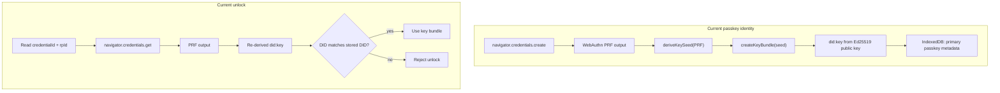
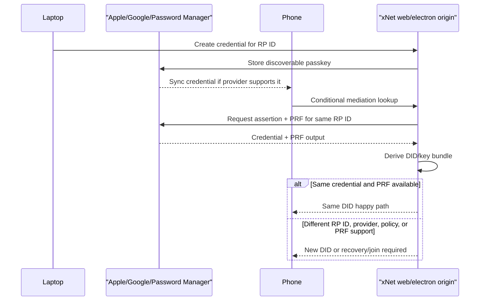
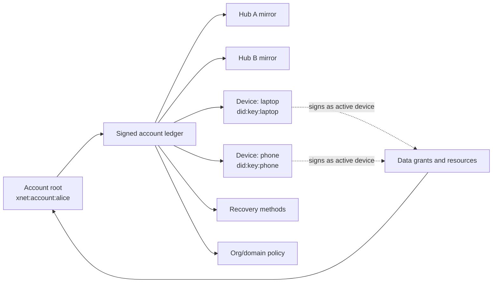
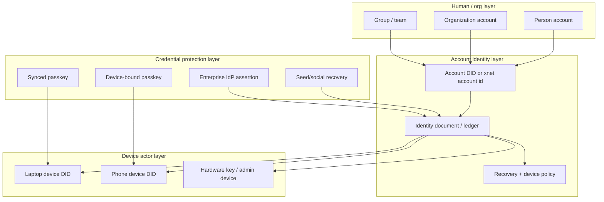
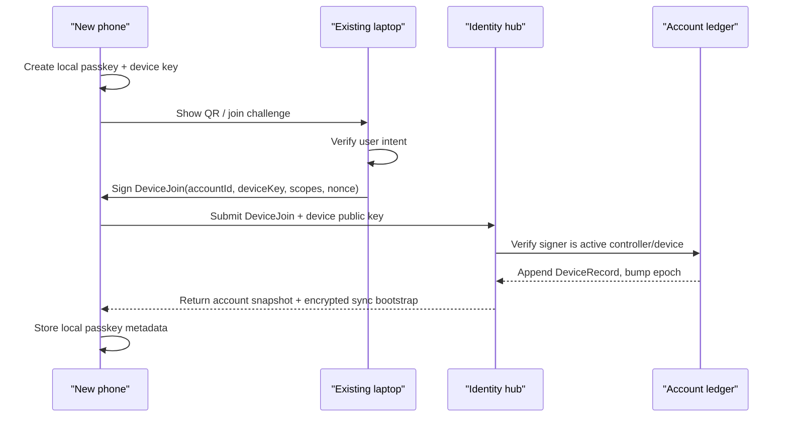
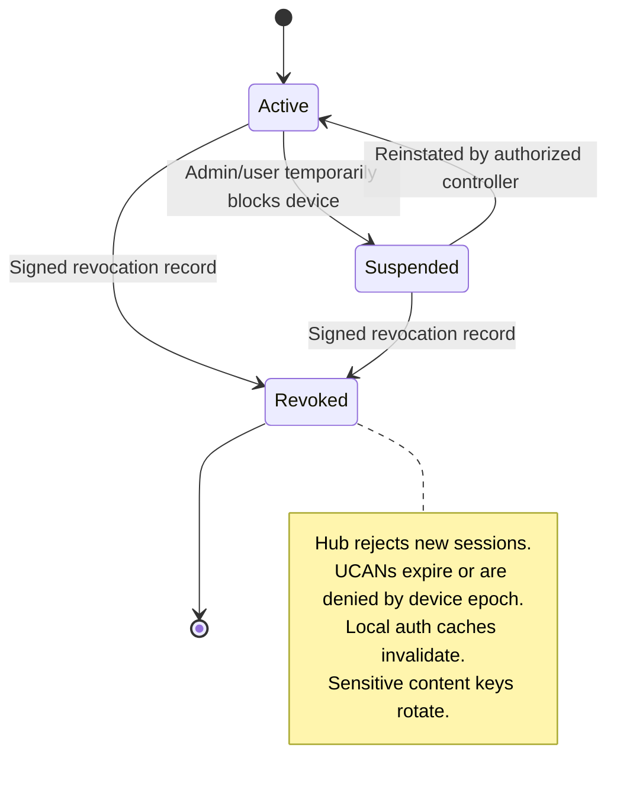
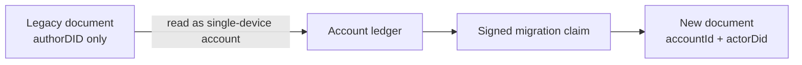
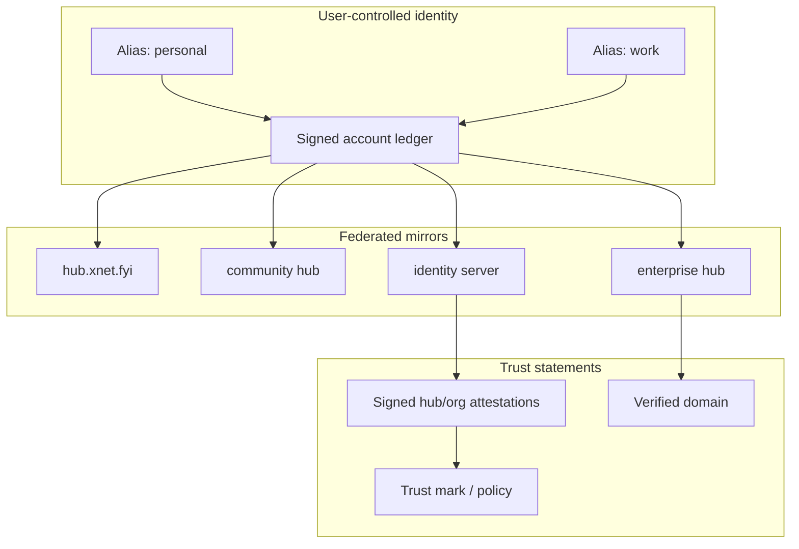
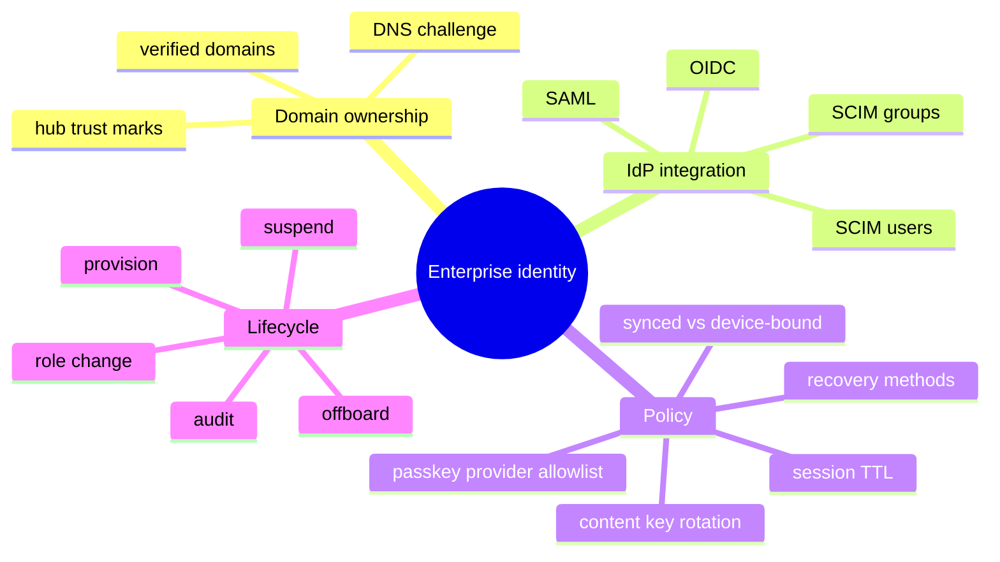

# 0149 - Identity And Account Recovery

> **Status:** Exploration  
> **Date:** 2026-06-04  
> **Author:** Codex  
> **Tags:** identity, passkeys, account-recovery, multi-device, did, ucan, hubs,
> federation, enterprise, scim, oidc

## Problem Statement 🧭

xNet currently treats a DID as the user identity for passkeys, UCAN hub sessions, sync rooms,
backups, sharing grants, and resource recipients. That is simple, but it creates pressure in the
wrong place once a person owns multiple devices, loses a device, joins an enterprise, or wants the
same identity to work across deployments and hubs.

The immediate question is practical:

> If I create an xNet identity on a laptop with a WebAuthn passkey, can I open xNet on my phone and
> become the same person?

The long-term question is broader:

> What identity model lets xNet support multi-device accounts, account recovery, device invalidation,
> federated identity networks, and enterprise domain management without spraying unrelated DIDs
> through every data model?

This exploration answers both. It focuses first on identity across multiple devices, then expands
into recovery, hub-backed identity services, federation, and enterprise management.

## Exploration Status ✅

- [x] Compute the next exploration number and use a valid shortened filename
- [x] Review passkey identity creation, unlock, discovery, storage, and fallback code
- [x] Review seed recovery, key backup, hub UCAN auth, hub backup, discovery, federation, and grant code
- [x] Review prior identity, passkey fallback, onboarding, cross-device sync, and authorization docs
- [x] Research WebAuthn, passkey sync, DID Core, UCAN, OpenID Federation, SCIM, and enterprise passkey policy
- [x] Separate observed implementation facts from standards/platform inferences
- [x] Provide recommended architecture, diagrams, checklists, example code, references, and next steps

## Executive Summary 🎯

Short answer: **a synced passkey can make the laptop-to-phone happy path work, but xNet should not
build long-term account identity on "the same passkey derives the same DID" alone.**

Passkeys are scoped to a WebAuthn relying party ID. Apple iCloud Keychain, Google Password Manager,
Microsoft passkey support, and third-party password managers can sync passkeys across devices, but
sync behavior depends on the credential provider, OS, browser, RP ID, user account, enterprise
policy, and whether the credential is synced or device-bound. WebAuthn gives xNet a credential and
possibly a PRF output. It does not give xNet a durable account ledger, device roster, recovery
policy, revocation feed, or federation model.

The recommended model is:

1. **Stable account identity:** Introduce an account root subject, e.g. `xnet:account:*` or a
   resolvable DID document, that represents the person, workspace, organization, or service account.
2. **Per-device identities:** Each device gets its own signing key and DID/key id. A local passkey
   protects that device key. A synced passkey can be one onboarding path, not the entire identity
   model.
3. **Signed device ledger:** Hubs store and replicate signed account records: active devices,
   recovery methods, revocations, epochs, policy, and hub attestations.
4. **Account-aware authorization:** Data, grants, hub sessions, and recipients resolve a device DID
   back to the stable account subject. Resource ACLs should not need one grant per laptop, phone,
   tablet, or replacement device.
5. **Recovery as device enrollment:** Recovery should add a new device to the account ledger and
   optionally rotate keys. It should not depend on restoring one old device DID forever.
6. **Federated identity mirrors:** Hubs can mirror, cache, and attest signed identity records. Hubs
   should help resolve identity, not own it silently.
7. **Enterprise domain management:** Enterprise identity should sit on top of org/domain nodes,
   verified domains, OIDC/SAML login assurance, SCIM provisioning, groups, policies, and device
   revocation.

### Direct Answers

| User question                                               | Practical answer                                                                                                                                                                                                                                 |
| ----------------------------------------------------------- | ------------------------------------------------------------------------------------------------------------------------------------------------------------------------------------------------------------------------------------------------ |
| Can Apple Passwords share the passkey to my phone?          | Usually yes inside the Apple ecosystem when iCloud Keychain/Passwords is enabled, the device is approved, and xNet uses the same RP ID. Similar sync exists for Google Password Manager and Microsoft/third-party providers, but support varies. |
| Will that make the same xNet DID appear on the phone?       | In the current PRF path, it can if the same credential is discoverable on the same RP ID and returns the same PRF output. That is a happy path, not a complete account model.                                                                    |
| Am I missing the right DID for that token?                  | Current xNet derives the DID from PRF output, stores metadata locally, and uses the DID as the identity. If the phone cannot access the same credential/PRF, it creates or imports a different DID.                                              |
| Can the DID be saved into the password manager?             | xNet can put account hints into WebAuthn user fields, but a passkey manager is not an xNet account ledger. Store the account/device ledger in signed xNet/hub data instead.                                                                      |
| If a new device needs a new DID, how is it the same person? | Add the new device DID to a stable account root with a signed join record from an existing device, recovery key, or enterprise authority.                                                                                                        |
| How do we avoid DID bloat?                                  | Put account IDs and compact device key IDs in data. Resolve device DIDs through the account ledger when verifying signatures and authorization.                                                                                                  |
| How does invalidation work?                                 | Publish signed device revocation records, have hubs reject revoked devices immediately, expire/rotate UCANs, invalidate auth caches, and rotate content keys for sensitive resources.                                                            |
| How should enterprise/domain management work?               | Model organizations/domains as first-class account authorities with verified domains, SCIM users/groups, OIDC/SAML assurance, policy templates, role grants, and device lifecycle controls.                                                      |

## Current Local Architecture 🔍

### Passkey Identity Path

Observed implementation facts:

- `createPasskeyIdentity()` creates a WebAuthn platform credential with `residentKey: 'required'`,
  `userVerification: 'required'`, a default `rpId` of `window.location.hostname`, and the WebAuthn
  PRF extension. It derives a seed from the PRF output and creates a hybrid key bundle
  (`packages/identity/src/passkey/create.ts:25`).
- The WebAuthn `user.id` is random at creation time and explicitly not the DID
  (`packages/identity/src/passkey/create.ts:34`).
- The passkey record stores the derived DID, public keys, credential id, created time, RP ID, and
  mode (`packages/identity/src/passkey/create.ts:87`).
- `unlockPasskeyIdentity()` uses the locally stored credential id and RP ID, asks WebAuthn for the
  PRF output, re-derives the key bundle, and rejects if the derived DID does not match the stored DID
  (`packages/identity/src/passkey/unlock.ts`).
- `deriveKeySeed()` uses a fixed PRF input and HKDF context for deterministic identity derivation
  (`packages/identity/src/passkey/derive.ts`).
- IndexedDB storage is single-identity: database `xnet-identity`, store `passkeys`, key `primary`
  (`packages/identity/src/passkey/storage.ts:7`). The public API says only one identity is supported
  at a time (`packages/identity/src/passkey/storage.ts:130`).



This is elegant for one browser profile on one RP ID. It is fragile as a universal account model
because the identity key is a function of one credential's PRF behavior.

### Synced Passkey Discovery

Observed implementation facts:

- `discoverExistingPasskey()` uses conditional mediation to find a discoverable credential for the
  current RP. The file comment explicitly describes credentials possibly synced via iCloud Keychain
  or Google Password Manager (`packages/identity/src/passkey/discovery.ts:1`).
- `unlockDiscoveredPasskey()` can unlock a discovered credential and construct a `PasskeyIdentity`
  without needing prior local IndexedDB metadata (`packages/identity/src/passkey/discovery.ts:94`).
- `SmartWelcome` calls `discoverExistingPasskey()` and can show "Welcome back"
  (`packages/react/src/onboarding/screens/SmartWelcome.tsx:18`).
- `OnboardingProvider`, however, handles both `AUTHENTICATE` and `CREATE_NEW` by calling
  `manager.create()` (`packages/react/src/onboarding/OnboardingProvider.tsx:99`). That means the UI
  can detect an existing passkey while the provider still runs the create path.

First repair: split "unlock existing discovered passkey" from "create new passkey" in onboarding.



### Fallback and Recovery Helpers

Observed implementation facts:

- The fallback path creates a random key bundle and stores the encryption key next to the encrypted
  bundle in IndexedDB. Prior exploration `0065` correctly calls this insecure against IndexedDB/XSS
  reads.
- `seed-recovery.ts` has deterministic mnemonic-derived keys, encrypted key backup helpers, and
  social recovery share helpers (`packages/identity/src/seed-recovery.ts:1`).
- `createKeyBackup()` encrypts deterministic key material with a backup key derived from the seed
  (`packages/identity/src/seed-recovery.ts:189`).

Interpretation: xNet already has pieces for recovery, but they are not integrated with the
passkey-first account flow. They also recover a DID/key bundle rather than enrolling a device into a
stable account ledger.

### Hub Auth, Backup, Discovery, and Federation

Observed implementation facts:

- Hub UCAN sessions are keyed by `did`, capabilities, and token
  (`packages/hub/src/auth/ucan.ts:11`).
- WebSocket and HTTP hub auth verify UCANs and set the session DID to the token issuer
  (`packages/hub/src/auth/ucan.ts:73`, `packages/hub/src/auth/ucan.ts:128`).
- Hub backup routes can store encrypted key backups for a DID after checking a DID-scoped ownership
  proof (`packages/hub/src/routes/backup.ts:13`, `packages/hub/src/routes/backup.ts:70`).
- Hub peer discovery registers records by DID and requires the authenticated DID to match the peer
  DID unless anonymous mode is enabled (`packages/hub/src/services/discovery.ts`).
- Hub federation currently focuses on hub-to-hub query federation, exposed schemas, hub peer trust,
  and signed query responses (`packages/hub/src/services/federation.ts`).

Interpretation: hubs are a good place to store and replicate account recovery data, but today's hub
APIs are DID-owner APIs. They do not yet define account roots, device rosters, recovery methods,
revocation epochs, enterprise policy, or cross-deployment identity records.

### Data Authorization and Grants

Observed implementation facts:

- `GrantSchema` has `issuer`, `grantee`, `resource`, `actions`, `expiresAt`, `revokedAt`,
  `revokedBy`, `ucanToken`, and proof fields (`packages/data/src/schema/schemas/grant.ts:9`).
- `StoreAuth` can grant, revoke, cascade child grants, and rotate content keys for sensitive
  resources (`packages/data/src/auth/store-auth.ts`).
- Recipient computation and authorization are DID-centric today.

Interpretation: xNet already has a strong authorization substrate. It needs an account subject
resolver so grants target a stable account, group, or org subject while devices act as signing
methods for that subject.

### React App Integration

Observed implementation facts:

- `XNetProvider` accepts a single identity, author DID, signing key, hub URL, and hub options
  (`packages/react/src/context.ts`).
- Hub auth token generation creates broad hub UCANs from the author DID with a 24-hour TTL
  (`packages/react/src/context.ts`).
- `InitialSyncManager` tracks sync progress, but the hub-side "send all state to this new account
  device" flow is not implemented as an account/device protocol (`packages/react/src/sync/InitialSyncManager.ts`).

Interpretation: the app is designed around one active author DID. Moving to account/device identity
requires introducing an account subject and device actor without breaking existing DID-based
documents.

## External Research 🌐

### WebAuthn and Passkey Facts

Observed facts from standards and official docs:

- WebAuthn Level 3 defines discoverable credentials and retains old "resident key" terminology for
  compatibility. xNet's `residentKey: 'required'` choice is aligned with account discovery flows.
- WebAuthn credentials are scoped to the RP ID. A credential created for one RP ID is not a general
  network identity credential.
- WebAuthn Level 3 defines the PRF extension and exposes a single PRF per credential when supported.
  xNet uses that PRF to derive identity key material.
- Apple says iCloud Keychain keeps website/app passwords and passkeys up to date across approved
  Apple devices, with encrypted storage/transmission and escrow recovery controls.
- Google says passkeys are created, saved, and synchronized through a password manager; passkeys made
  with Google Password Manager are synchronized and end-to-end encrypted. Google also notes that the
  password manager is opaque to the relying party until a credential is returned.
- Microsoft Entra distinguishes synced passkeys from device-bound passkeys and exposes enterprise
  policy controls around which passkey types are allowed.
- FIDO is standardizing credential exchange so passkeys and other credentials can move between
  credential managers more safely, but that is password-manager portability, not an app-level
  account/device ledger.

Inference for xNet:

- Synced passkeys are a good bootstrap and return-user experience.
- Device-bound passkeys are a good high-assurance enterprise option.
- Neither synced nor device-bound passkeys replace an application-controlled account ledger because
  they do not encode xNet account membership, device revocation, recovery policy, grants, or
  federation.

### DID, UCAN, Federation, and Enterprise Identity

Observed facts:

- DID Core models DID documents as places to express cryptographic material, verification methods,
  services, and controller relationships. It explicitly has concepts relevant to verification method
  rotation, revocation, recovery, and correlation risks.
- UCAN is a DID-based, public-key verifiable, delegable capability scheme for local-first systems.
  xNet already uses UCANs for hub capabilities.
- OpenID Federation 1.0 defines signed entity statements, metadata policy, trust chains, trust
  anchors, and trust marks for multilateral federation.
- SCIM 2.0 defines REST protocol endpoints and schemas for managing users and groups. It is the
  standard shape enterprises expect for provisioning and deprovisioning.

Inference for xNet:

- Account identity can borrow DID document concepts without requiring every account to be a bare
  `did:key`.
- Hub federation can borrow OpenID Federation's trust-chain vocabulary for hub/operator/org
  attestations.
- Enterprise domain management should integrate with SCIM and OIDC/SAML instead of inventing a new
  enterprise identity lifecycle.

## Key Findings 🧩

### 1. The Current Happy Path Is Real But Narrow

If the same passkey syncs from laptop to phone, the same RP ID is used, PRF is available, and xNet
calls the unlock-discovered path, then xNet can derive the same key bundle and DID on the phone.
That is the cleanest short-term path.

Current blocker: onboarding currently calls create for `AUTHENTICATE`. Fixing that is low risk and
should be done before designing bigger recovery systems.

### 2. RP ID Is a Product Architecture Decision

Current code defaults `rpId` to `window.location.hostname`. That means:

- `localhost`, staging, production, and packaged Electron origins can create different passkeys.
- A hub at `hub.customer.com` and the xNet app at `app.xnet.fyi` are not the same RP unless designed
  as such.
- Cross-deployment identity will not work if every deployment uses its own unrelated RP ID as the
  root identity namespace.

xNet needs a stable RP strategy:

- Consumer web: use a canonical RP ID such as `xnet.fyi` where possible.
- Electron: use the same web origin for WebAuthn or a well-defined native credential bridge.
- Enterprise: allow managed RP IDs/domains, but bind them to an account federation model instead of
  assuming the RP is the global identity.

### 3. DID:key Is Too Low-Level To Be "The Account"

`did:key` is excellent for a public key principal. It is not enough for:

- key rotation;
- multiple device keys;
- revocation;
- account recovery;
- enterprise-managed users;
- groups and domains;
- cross-hub identity attestations;
- privacy-preserving aliases.

The prior identity migration plan already makes this point. This exploration extends it into a
concrete account/device ledger.

### 4. Hubs Are the Right Recovery Substrate, Not the Root Authority

Hubs can:

- store encrypted account backups;
- publish device rosters and revocations;
- validate UCAN admission against account/device state;
- mirror signed identity records across deployments;
- provide social/enterprise recovery workflows;
- serve identity resolver APIs.

Hubs should not:

- silently create or rewrite account identity;
- become the only issuer of user identity;
- make local-first verification impossible when offline;
- require every device to trust one central hub forever.

### 5. Account Recovery Should Add a Device, Not Resurrect a Browser Profile

The wrong target is "restore the exact same WebAuthn credential everywhere." The better target is:

1. prove control of an account root, recovery method, enterprise identity, or existing device;
2. create a fresh passkey/device key on the new device;
3. add that device to the signed account ledger;
4. sync encrypted data and grants;
5. rotate keys if old devices or recovery material are suspected compromised.

### 6. Enterprise Identity Needs Policy and Lifecycle, Not Just Login

For enterprises, the hard problems are not just "can the user sign in." They are:

- domain ownership verification;
- provisioning and deprovisioning users/groups;
- assigning workspace roles;
- requiring device-bound or synced passkeys by group;
- revoking devices quickly;
- auditing admin actions;
- preserving local-first data access without leaving former employees with stale keys.

## Recommended Architecture 🏗️

### Account Root + Device Ledger

Introduce a stable account subject that owns a signed append-only ledger:

- `AccountRecord`: stable account id, controllers, recovery policy, hub mirrors, current epoch.
- `DeviceRecord`: device id/key id, device DID/public key, passkey RP ID, credential id hash,
  capabilities, display label, created/lastSeen, status.
- `RecoveryRecord`: recovery methods such as seed phrase, social shares, hardware key, enterprise
  admin, or backup passkey.
- `RevocationRecord`: revoked device/recovery key, reason, effective time, epoch bump, signed by an
  allowed controller.
- `AttestationRecord`: hub, org, domain, or identity-server statements about the account or device.



The important shift:

- **Account subject** appears in grants, resources, workspace ownership, groups, and sharing.
- **Device actor** appears in signatures, audit logs, hub sessions, and change metadata.
- Verifiers check: "Is this device key currently authorized for this account subject at this epoch?"

### Identity Layers



### New Device Enrollment Modes

Use multiple enrollment paths, all ending in the same operation: **add a new device record to the
account ledger**.



Enrollment modes:

| Mode                    | How it works                                                     | Best for                             | Risk                           |
| ----------------------- | ---------------------------------------------------------------- | ------------------------------------ | ------------------------------ |
| Synced passkey unlock   | Discover same credential and derive same current DID/account key | Same ecosystem, easiest return path  | RP/provider/PRF dependent      |
| Existing-device QR join | New device creates a key; old device signs join                  | Main cross-platform path             | Needs another active device    |
| Recovery phrase         | User proves seed/recovery key and adds device                    | Lost all devices                     | Phishing and user storage risk |
| Social recovery         | Threshold shares authorize device join                           | Consumer recovery without one secret | Complex UX and guardian churn  |
| Hardware recovery key   | Security key signs recovery/join                                 | High assurance users                 | User can lose hardware key     |
| Enterprise IdP/admin    | OIDC/SAML/SCIM authority authorizes device/account               | Managed domains                      | Centralized enterprise control |

### Revocation and Logout

Revocation needs two speeds:

1. **Immediate online denial:** Hubs reject sessions and UCAN invocations from revoked devices.
2. **Eventually consistent local denial:** Local devices sync revocation records, invalidate caches,
   stop accepting signatures from revoked devices after the revocation epoch, and rotate content keys
   where needed.



Logout modes:

- **Local logout:** clear IndexedDB/passkey metadata and cached keys on the current device. The
  device remains valid in the ledger and can re-authenticate.
- **Remove this device:** publish a signed revocation for the current device, clear local storage,
  and close hub sessions.
- **Lost device removal:** an active device, recovery method, or enterprise admin signs a revocation.
- **Emergency account recovery:** revoke all non-recovery devices, rotate account/recovery epoch,
  then enroll a fresh trusted device.

### Account-Aware Hub UCANs

Hub auth should evolve from:

```text
UCAN issuer = did:key:device-or-user
session.did = issuer
```

to:

```text
UCAN issuer = did:key:device
UCAN audience = hub DID / hub URL
UCAN capabilities = hub actions + account scope
UCAN facts = accountId, deviceId, accountEpoch, deviceEpoch
hub session = { accountId, actorDid, deviceId, capabilities }
```

This lets the hub reject tokens from revoked devices even if the UCAN signature is cryptographically
valid.

### Data Model Impact

For new data, prefer:

- `accountId` / `subjectId` for ownership and sharing targets;
- `actorDid` or `deviceId` for audit and signature verification;
- `accountEpoch` / `deviceEpoch` in signed envelopes where replay/revocation matters;
- resolver caches that map active device keys to account subjects.

For existing data, keep DID compatibility:

- Treat old DID authors as single-device accounts.
- Lazily create an account ledger where `accountId = legacy DID` or where the legacy DID is the
  first controller.
- Let migration records assert "legacy DID now belongs to account root X" once the user opts in.



## Federated Identity Network 🌎

The goal is stable identity across the xNet surface area, not just one local deployment.

Recommended model:

1. **Identity records are signed data.** Account ledgers are signed by account controllers and can be
   verified independent of any single hub.
2. **Hubs are mirrors and witnesses.** A hub can store, serve, and attest to identity records, but it
   cannot unilaterally rewrite account membership.
3. **Identity servers are specialized hubs.** They provide high-availability resolution, recovery
   workflows, domain verification, trust marks, and account-directory services.
4. **Federation uses trust metadata.** Hub and org trust can borrow concepts from OpenID Federation:
   entity statements, trust anchors, trust marks, metadata policy, and chains.
5. **Privacy boundaries are explicit.** Account records should support per-context aliases and avoid
   globally leaking every device, deployment, or social connection.



Federation should answer:

- "Where can I resolve this account ledger?"
- "Which hubs have witnessed this account and at what version?"
- "Which org/domain claims this account?"
- "Which devices are active for this account in this context?"
- "Which account aliases are intentionally linked?"

Federation should not require:

- one global xNet login server;
- every deployment to share one WebAuthn RP ID;
- exposing personal device rosters to unrelated peers;
- trusting a hub to rewrite local authorization decisions.

## Enterprise Domain Management 🏢

Enterprise identity should be layered on top of account/device identity, not bolted onto passkey
creation.

### Domain and Organization Objects

Add org/domain records:

- `OrganizationAccount`: org id, display name, verified domains, admins, policy.
- `DomainVerification`: domain, DNS challenge, verifiedAt, verifier, status.
- `ManagedUserBinding`: account id, enterprise subject id, email/domain, status.
- `ManagedGroupBinding`: SCIM/OIDC group id mapped to xNet group nodes.
- `EnterpriseDevicePolicy`: passkey type policy, device posture, allowed providers, recovery rules.
- `AdminActionLog`: append-only audit of provisioning, grants, revocations, and policy changes.



### Enterprise Permission Model

Use the existing authorization direction:

- SCIM groups become xNet group nodes.
- Org roles become schema relation roles or group memberships.
- Grants target account/group/org subjects, not every device DID.
- Device revocation is separate from user deprovisioning.
- Deprovisioning a user revokes org-managed grants, rotates relevant content keys, and optionally
  leaves personal account data alone.

Enterprise policy choices:

| Policy              | Consumer default                    | Enterprise default                            |
| ------------------- | ----------------------------------- | --------------------------------------------- |
| Passkey type        | Synced allowed                      | Configurable: synced or device-bound by group |
| Recovery            | User-managed seed/social/hub backup | Admin-assisted plus user recovery if allowed  |
| Device join         | Existing device or recovery         | Existing device plus IdP/admin policy         |
| Device revocation   | User or recovery controller         | User, security admin, automated compliance    |
| Grants              | User-controlled                     | Org policy plus delegated user grants         |
| Identity visibility | Privacy-preserving aliases          | Directory-visible managed identities          |

## Options and Tradeoffs ⚖️

### Option A: Keep PRF-Derived DID As The Account

The current model remains primary. Synced passkey = same DID; fallback/recovery tries to restore the
same DID.

Pros:

- Simple mental model for the first device.
- Minimal changes to DID-centric data and hub APIs.
- No new account ledger.

Cons:

- RP ID and credential-provider behavior become identity infrastructure.
- Device revocation is awkward because all devices share the same derived key if the passkey syncs.
- New device with a new passkey becomes a new person.
- Enterprise cannot express managed devices, users, and groups coherently.
- Key rotation and compromise recovery remain hard.

Verdict: useful as a compatibility/happy path, not a long-term identity architecture.

### Option B: One Account DID With Mutable Verification Methods

Use a DID document-like account identity. Devices are verification methods under that DID.

Pros:

- Aligned with DID Core vocabulary.
- Natural key rotation and revocation model.
- Clean resolver abstraction.

Cons:

- xNet must choose or implement a DID method with update/recovery semantics.
- DID document privacy and correlation risks must be handled.
- More complex than needed if implemented all at once.

Verdict: good target shape, but can start with an xNet-native account ledger before committing to a
public DID method.

### Option C: xNet Account Ledger With Device DIDs

Create xNet-native account records and signed ledgers. Devices remain DIDs/public keys. Hubs mirror
the ledger.

Pros:

- Fits current local-first data model.
- Avoids forcing a DID method decision now.
- Supports device join, revocation, recovery, and federation.
- Can map to DID documents later.

Cons:

- Requires resolver changes across identity, hub, data, and react packages.
- Needs migration path for legacy DID authors.
- Needs clear privacy design for public vs private account data.

Verdict: recommended near-term architecture.

### Option D: Enterprise IdP As Account Root

For managed domains, trust OIDC/SAML/SCIM as the account authority.

Pros:

- Matches enterprise expectations.
- Strong lifecycle and policy controls.
- Easy offboarding and group sync.

Cons:

- Not local-first enough for consumer/personal accounts.
- Centralizes managed identities under enterprise IdP availability.
- Must handle personal/work account separation.

Verdict: use as an enterprise overlay, not as the universal xNet identity root.

## Recommended Roadmap 🛣️

### Phase 0 - Fix Existing Synced Passkey Login

Goal: make the current happy path actually work.

- [ ] Add an onboarding event/state for unlocking an existing discovered passkey.
- [ ] Have `SmartWelcome` pass the discovered credential or an unlock intent into the provider.
- [ ] Have `OnboardingProvider` call `unlockDiscoveredPasskey()` for `AUTHENTICATE` and
      `manager.create()` only for `CREATE_NEW`.
- [ ] Persist the discovered passkey metadata with `storeIdentity()` after successful unlock.
- [ ] Add tests for "discover existing passkey does not create a new identity."
- [ ] Make RP ID explicit in app config and document dev/staging/prod behavior.

### Phase 1 - Account and Device Schemas

Goal: represent account roots and device rosters as first-class signed data.

- [ ] Add `AccountSchema` for stable account id, controllers, current epoch, recovery policy, and
      hub mirrors.
- [ ] Add `DeviceSchema` for device id, actor DID, public keys, RP ID, credential id hash,
      capabilities, status, createdAt, lastSeenAt, and labels.
- [ ] Add `DeviceJoinSchema` for signed enrollment requests.
- [ ] Add `DeviceRevocationSchema` for signed revocations and epoch bumps.
- [ ] Add `RecoveryMethodSchema` for seed, social, hardware, passkey, and enterprise recovery
      descriptors.
- [ ] Add an account resolver API in `@xnetjs/identity`.

### Phase 2 - Hub Account Registry

Goal: let hubs store and enforce account/device records.

- [ ] Add `AccountRegistryService` to store signed account ledger events.
- [ ] Add routes for account lookup, device join, device revocation, and account backup.
- [ ] Change hub auth sessions to include `accountId`, `actorDid`, `deviceId`, and epochs.
- [ ] Reject hub UCANs whose device id is revoked or whose account epoch is stale.
- [ ] Store encrypted backups by account id, not only owner DID.
- [ ] Publish account ledger updates through existing hub federation mechanisms.

### Phase 3 - Account-Aware Data Authorization

Goal: let grants and policies target people/orgs/groups while devices sign actions.

- [ ] Add subject resolver hooks to `StoreAuth` and authorization evaluator.
- [ ] Allow Grant grantee/issuer fields to resolve account subjects as well as raw DIDs.
- [ ] Store actor DID and account id in relevant change metadata.
- [ ] Invalidate auth caches on account/device revocation events.
- [ ] Rotate content keys when revoked devices had access to sensitive resources.
- [ ] Preserve legacy DID behavior as a single-device account.

### Phase 4 - Recovery Workflows

Goal: support lost-device and new-device recovery without relying on one synced passkey.

- [ ] Existing-device QR join.
- [ ] Recovery phrase device enrollment.
- [ ] Encrypted hub backup keyed by account id.
- [ ] Optional threshold social recovery.
- [ ] Emergency revoke-all-devices flow.
- [ ] Recovery UX that explains local logout vs device removal vs account recovery.

### Phase 5 - Federated Identity Servers

Goal: share stable identity across the network without centralizing identity ownership.

- [ ] Define signed identity bundle format for account ledgers.
- [ ] Add hub identity mirror APIs.
- [ ] Add account discovery through multiple hubs.
- [ ] Add hub/org attestations and trust marks.
- [ ] Add privacy-preserving aliases so users can selectively link contexts.
- [ ] Define conflict handling for concurrent ledger events across hubs.

### Phase 6 - Enterprise Domain Management

Goal: support managed domains, users, groups, devices, and policy.

- [ ] Add organization/domain account schemas.
- [ ] Add DNS domain verification flow.
- [ ] Add SCIM `/Users` and `/Groups` provisioning endpoints or integration package.
- [ ] Add OIDC/SAML login assurance bindings.
- [ ] Map IdP groups to xNet groups and grants.
- [ ] Add admin device revocation and user offboarding flows.
- [ ] Add audit log exports and policy reports.

## Example Code 🧪

These examples are intentionally minimal. They show the shape of the account/device model rather
than final package APIs.

### Account Ledger Types

```typescript
type AccountId = `xnet:account:${string}`
type DeviceId = `xnet:device:${string}`
type DID = `did:key:${string}`

type AccountIdentity = {
  accountId: AccountId
  version: 1
  createdAt: number
  accountEpoch: number
  controllers: DID[]
  recoveryPolicy: RecoveryPolicy
  mirrors: HubMirror[]
}

type DeviceIdentity = {
  accountId: AccountId
  deviceId: DeviceId
  actorDid: DID
  signingPublicKey: Uint8Array
  encryptionPublicKey?: Uint8Array
  passkey?: {
    rpId: string
    credentialIdHash: string
    mode: 'synced' | 'device-bound' | 'unknown'
  }
  scopes: AccountScope[]
  status: 'active' | 'suspended' | 'revoked'
  createdAt: number
  lastSeenAt?: number
  addedBy: DID
  accountEpoch: number
}

type RecoveryPolicy = {
  threshold: number
  methods: RecoveryMethod[]
}

type RecoveryMethod =
  | { type: 'seed'; id: string; publicCommitment: string }
  | { type: 'social'; id: string; threshold: number; guardians: DID[] }
  | { type: 'hardware-key'; id: string; publicKey: Uint8Array }
  | { type: 'enterprise-admin'; id: string; organizationId: string }

type HubMirror = {
  hubDid: DID
  url: string
  lastWitnessedEpoch: number
  attestation?: string
}

type AccountScope = 'account/read' | 'account/write' | 'data/read' | 'data/write' | 'admin'
```

### Device Join Request

```typescript
type DeviceJoinRequest = {
  accountId: AccountId
  device: Omit<DeviceIdentity, 'status' | 'addedBy' | 'accountEpoch'>
  requestedScopes: AccountScope[]
  nonce: string
  expiresAt: number
}

type SignedDeviceJoin = {
  request: DeviceJoinRequest
  signerDid: DID
  signature: Uint8Array
}

export function createDeviceJoinMessage(request: DeviceJoinRequest): Uint8Array {
  return new TextEncoder().encode(
    JSON.stringify({
      type: 'xnet.account.device.join',
      version: 1,
      request
    })
  )
}

export function verifyDeviceJoin(
  join: SignedDeviceJoin,
  account: AccountIdentity,
  activeDevices: DeviceIdentity[],
  verifySignature: (did: DID, message: Uint8Array, signature: Uint8Array) => boolean
): boolean {
  if (join.request.accountId !== account.accountId) return false
  if (join.request.expiresAt < Date.now()) return false

  const signerIsController = account.controllers.includes(join.signerDid)
  const signerIsActiveDevice = activeDevices.some(
    (device) => device.actorDid === join.signerDid && device.status === 'active'
  )

  if (!signerIsController && !signerIsActiveDevice) return false

  return verifySignature(join.signerDid, createDeviceJoinMessage(join.request), join.signature)
}
```

### Device Revocation

```typescript
type DeviceRevocation = {
  accountId: AccountId
  deviceId: DeviceId
  reason: 'lost' | 'logout' | 'compromised' | 'offboarded' | 'policy'
  revokedAt: number
  newAccountEpoch: number
}

type SignedDeviceRevocation = {
  revocation: DeviceRevocation
  signerDid: DID
  signature: Uint8Array
}

export function applyDeviceRevocation(
  devices: DeviceIdentity[],
  signed: SignedDeviceRevocation
): DeviceIdentity[] {
  return devices.map((device) =>
    device.deviceId === signed.revocation.deviceId
      ? {
          ...device,
          status: 'revoked',
          accountEpoch: signed.revocation.newAccountEpoch
        }
      : device
  )
}
```

### Account-Scoped Hub Session

```typescript
type AccountHubSession = {
  accountId: AccountId
  actorDid: DID
  deviceId: DeviceId
  accountEpoch: number
  capabilities: Array<{ with: string; can: string }>
}

export function canUseHubSession(
  session: AccountHubSession,
  device: DeviceIdentity,
  requiredEpoch: number
): boolean {
  if (device.status !== 'active') return false
  if (device.accountId !== session.accountId) return false
  if (device.actorDid !== session.actorDid) return false
  if (device.deviceId !== session.deviceId) return false
  if (session.accountEpoch < requiredEpoch) return false
  return true
}
```

## Validation Checklist 🧾

### Unit Tests

- [ ] PRF passkey create/unlock still derives the same DID on one device.
- [ ] Discovered passkey login calls unlock, not create.
- [ ] New device join verifies active-device signer.
- [ ] Recovery-method join verifies recovery policy threshold.
- [ ] Revoked devices cannot create valid hub sessions.
- [ ] Account resolver maps active device DID to account subject.
- [ ] Grant evaluation accepts account subjects and rejects revoked devices.
- [ ] Legacy DID-only data remains readable.

### Integration Tests

- [ ] Laptop creates account, phone joins via synced passkey when available.
- [ ] Phone joins via QR when passkey is not synced.
- [ ] Lost phone is revoked and cannot reconnect to hub.
- [ ] Revocation propagates through hub federation.
- [ ] Account backup can recover to a new device after all devices are lost.
- [ ] Enterprise SCIM group update changes xNet group membership.
- [ ] Enterprise user offboarding revokes org grants and rotates sensitive content keys.

### Manual Browser/Electron Checks

- [ ] WebAuthn RP ID is stable in production.
- [ ] Dev/staging RP IDs are clearly separated.
- [ ] Electron passkey flow uses the intended origin/RP.
- [ ] Existing-passkey welcome path works before any create prompt.
- [ ] Local logout does not revoke the device unless requested.
- [ ] Remove-device flow clears local storage and publishes revocation.

### Security Review

- [ ] Fallback path does not store usable secret key material next to ciphertext.
- [ ] Account ledger signatures use domain-separated messages.
- [ ] Device join requests include nonce and expiration.
- [ ] Revocation records bump account/device epoch.
- [ ] Hub auth rejects stale epochs and revoked devices.
- [ ] Content key rotation happens for compromised/lost devices.
- [ ] Account aliases avoid accidental cross-context correlation.
- [ ] Enterprise admin actions are audited and exportable.

## Risks and Design Notes ⚠️

### Synced Passkey PRF Compatibility

The design should not assume every synced passkey provider returns identical PRF behavior across all
devices and browsers. The account ledger makes that non-fatal: if the synced PRF path works, use it;
if not, create a new device key and join the account another way.

### Shared Passkey vs Per-Device Revocation

If multiple devices all derive the same xNet signing key from one synced passkey, device-level
revocation is weak. The system can block a hub session from a known device, but the cryptographic
actor is still the same key. Per-device keys solve this.

### Privacy and Correlation

A global account ledger can become a global tracking object if exposed too broadly. Use:

- per-context aliases;
- selective disclosure of device rosters;
- private recovery methods;
- hub-scoped attestations;
- minimal public profile data.

### Enterprise vs Personal Ownership

Enterprises need control over business data and managed devices. Users need personal accounts that
survive job changes. xNet should support both:

- personal account owns personal data;
- org account owns org data;
- managed user binding links a personal or enterprise account into org policy;
- offboarding revokes org grants without destroying personal identity.

### Hub Availability

Device revocation and recovery are strongest online. Local-first clients must still behave sensibly
offline:

- accept signatures valid at the last known account epoch;
- surface "identity state stale" warnings for high-risk actions;
- sync revocations as soon as a hub is reachable;
- use short UCAN TTLs for high-risk enterprise resources.

## Open Questions ❓

- Should the stable account id be an xNet-native URI first, a DID method from day one, or both?
- Should consumer accounts default to a synced passkey primary device plus recovery phrase, or should
  every device always get a distinct device key?
- How much of the account ledger is public, hub-private, or encrypted-to-account?
- How should xNet represent aliases so a person can intentionally separate personal, community, and
  work identities?
- Which hub is allowed to serve account recovery if multiple hubs mirror the same account?
- What should the first enterprise policy surface be: verified domains, SCIM groups, or device
  revocation?

## Recommendation 🧠

Do the work in two layers.

First, fix the immediate synced-passkey path:

1. Use `unlockDiscoveredPasskey()` when a passkey is detected.
2. Store the discovered passkey metadata locally after unlock.
3. Make RP ID an explicit config value and document the consequences.

Second, start the account/device ledger:

1. Add account and device records in `@xnetjs/data`.
2. Teach `@xnetjs/identity` to resolve active device keys to an account subject.
3. Teach hubs to store signed ledger events and reject revoked devices.
4. Migrate grants and recipients toward account subjects while preserving legacy DID behavior.

This gives xNet a clean growth path:

- consumer multi-device accounts work even when passkey sync is imperfect;
- account recovery becomes a controlled device enrollment flow;
- revocation is explicit and auditable;
- hubs can support identity and recovery without becoming a central identity owner;
- federation can grow from signed identity mirrors and trust metadata;
- enterprise domain management can be layered on top with SCIM/OIDC policy.

## References 📚

### Local Code and Docs

- `packages/identity/src/passkey/create.ts` - PRF passkey identity creation and DID derivation.
- `packages/identity/src/passkey/discovery.ts` - conditional mediation and discovered passkey unlock.
- `packages/identity/src/passkey/storage.ts` - single local passkey identity record.
- `packages/identity/src/passkey/fallback.ts` - fallback key bundle storage risk.
- `packages/identity/src/seed-recovery.ts` - seed recovery, encrypted backup, social recovery helpers.
- `packages/hub/src/auth/ucan.ts` - DID-keyed hub UCAN sessions.
- `packages/hub/src/routes/backup.ts` - DID-owned encrypted key backup routes.
- `packages/hub/src/services/discovery.ts` - DID-keyed peer discovery.
- `packages/hub/src/services/federation.ts` - hub-to-hub federation service.
- `packages/data/src/schema/schemas/grant.ts` - current DID-oriented grant schema.
- `packages/data/src/auth/store-auth.ts` - grant, revoke, and content key rotation behavior.
- `packages/react/src/onboarding/OnboardingProvider.tsx` - current create-vs-authenticate behavior.
- `packages/react/src/onboarding/screens/SmartWelcome.tsx` - discovered passkey welcome path.
- `packages/react/src/context.ts` - single author DID and hub token provider integration.
- `docs/explorations/0017_[_]_IDENTITY_MIGRATION_PLAN.md` - prior decoupled identity plan.
- `docs/explorations/0065_[_]_SECURE_PASSKEY_FALLBACK.md` - fallback storage security analysis.
- `docs/explorations/0083_[_]_UNIFIED_AUTHORIZATION_ARCHITECTURE.md` - unified authorization model.
- `docs/explorations/0085_[x]_UNIFIED_AUTHORIZATION_API_V3.md` - implemented authorization API.
- `docs/plans/plan03_9_1OnboardingAndPolish/03-cross-device-sync.md` - prior cross-device sync plan.

### External Standards and Platform Docs

- [Web Authentication: An API for accessing Public Key Credentials Level 3](https://www.w3.org/TR/webauthn-3/)
- [Apple Support: Make passwords and passkeys available across devices with iPhone and iCloud Keychain](https://support.apple.com/guide/iphone/passwords-devices-iph82d6721b2/ios)
- [Google for Developers: Passkey support on Android and Chrome](https://developers.google.com/identity/passkeys/supported-environments)
- [Microsoft Learn: How to enable passkeys in Microsoft Entra ID](https://learn.microsoft.com/en-us/entra/identity/authentication/how-to-authentication-passkeys-fido2)
- [FIDO Alliance: Credential Exchange Specifications overview](https://fidoalliance.org/fido-alliance-credential-exchange-specifications-overview/)
- [W3C DID Core 1.0](https://www.w3.org/TR/did-core/)
- [UCAN Specification](https://ucan.xyz/specification/)
- [OpenID Federation 1.0](https://openid.net/specs/openid-federation-1_0.html)
- [RFC 7644: SCIM Protocol Specification](https://www.rfc-editor.org/rfc/rfc7644)
