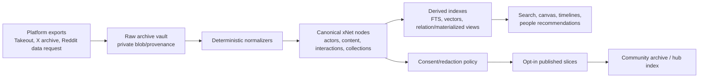
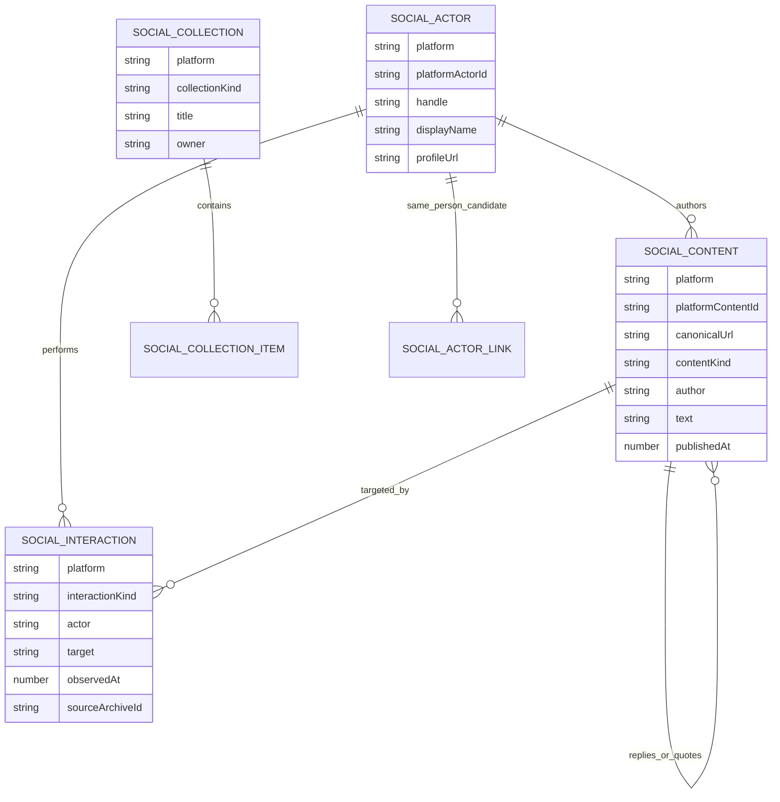
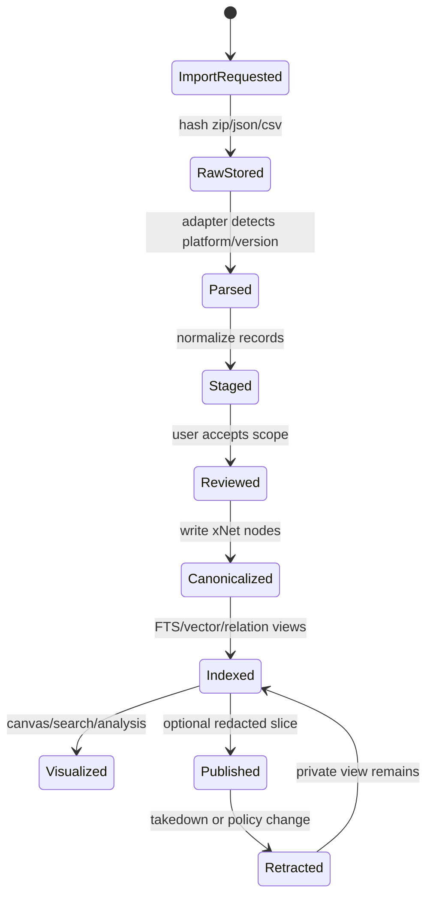
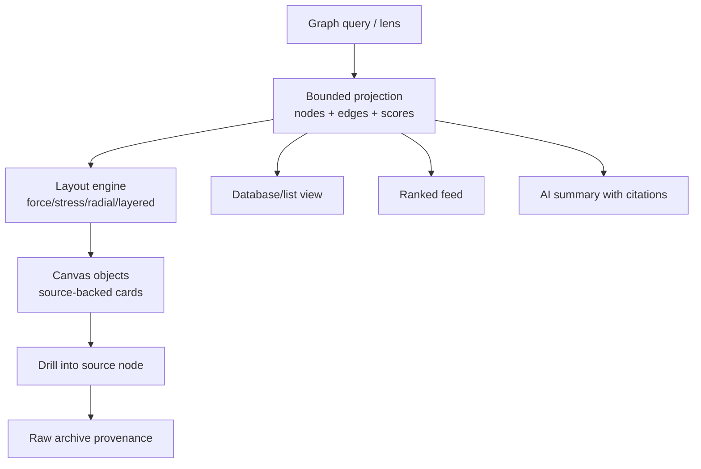
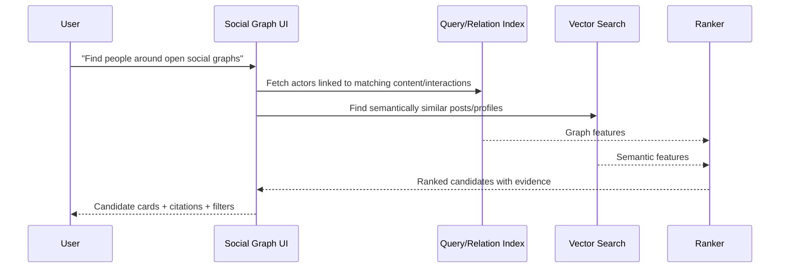
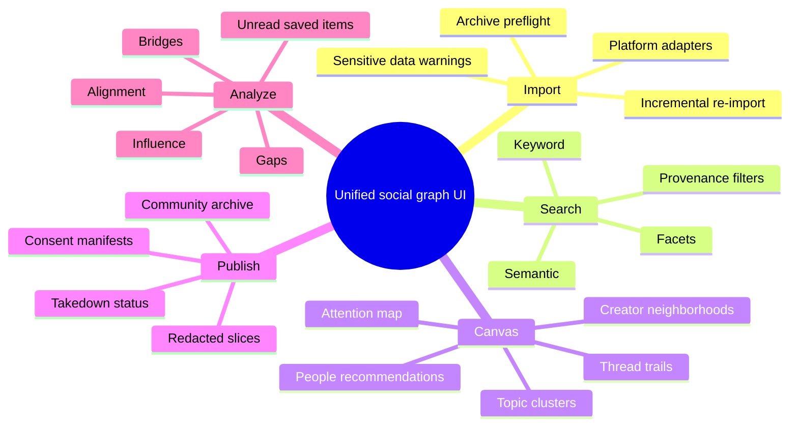
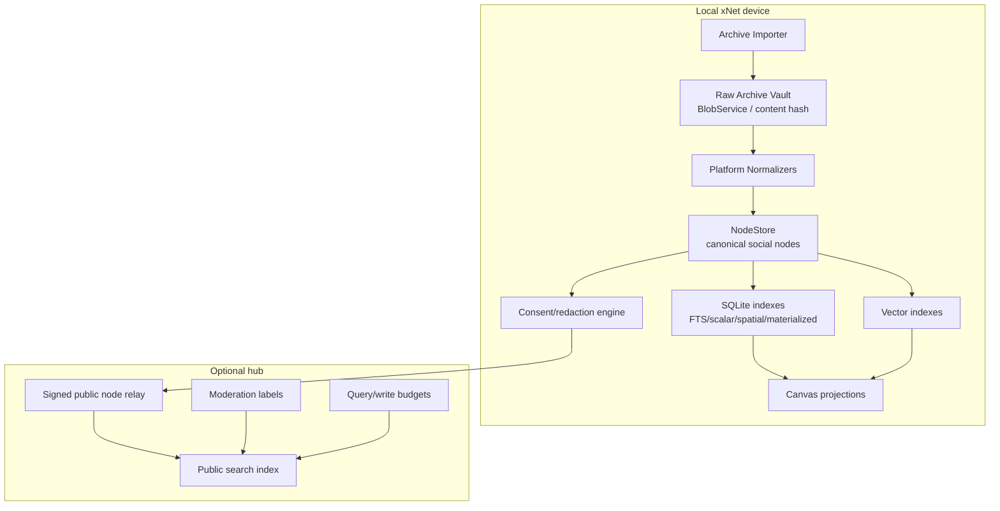

# 0150 - Unified Social Graph

**Status:** Exploration  
**Date:** 2026-06-05  
**Author:** Codex  
**Tags:** social-graph, ingestion, archives, privacy, discovery, recommendations, canvas, search, federation, public-data

## Exploration Checklist

- [x] Determine the next exploration number and filename.
- [x] Inspect xNet's local-first data, canvas, storage, search, hub, vectors, and abuse packages.
- [x] Review prior xNet explorations on universal clipping, decentralized social, moderation, search, and universal canvas.
- [x] Research current platform export/API patterns and open social protocols.
- [x] Explore privacy, public-good, UX, scale, and abuse tradeoffs.
- [x] Produce recommendations, implementation checklist, validation checklist, diagrams, and example code.

## Problem Statement

The idea is to turn scattered platform-specific social data into a local, queryable, explorable social memory:

- YouTube likes, playlists, saved videos, comments, subscriptions, and watch history.
- Instagram likes, saves/bookmarks, posts, comments, and follows.
- TikTok likes, favorites/bookmarks, comments, watch history, and follows.
- X posts, replies, likes, bookmarks, reposts, quotes, lists, DMs, and follows.
- Reddit posts, comments, votes, saved items, subscribed communities, and account history.
- Eventually, open/federated network data that other people opt into publishing.

The product question:

> What would it look like if xNet could ingest a person's social archives and turn them into a self-organizing, searchable, analyzable, infinite-canvas social graph that helps them understand their interests, find aligned people, and surface meaningful content without giving a platform monopoly control over the data?

The hard part is not parsing a Twitter archive. The hard part is deciding:

- what is canonical local truth,
- what can be safely shared,
- what should remain private,
- how to make the graph useful before global adoption,
- how to support community archives without creating a surveillance dataset,
- and how to make recommendations explainable, reversible, and user-controlled.

## Executive Summary

This is viable if it starts as a **local-first personal social archive**, not as a public firehose.

The right architecture is:

1. **Import everything locally as private-by-default xNet nodes.**
2. **Normalize platforms into four canonical families:** actors, content, interactions, and collections.
3. **Keep raw exports as provenance artifacts, then build derived indexes and canvas layouts from them.**
4. **Let users publish narrow, redacted, opt-in slices rather than entire archives by default.**
5. **Use community archives as moderated datasets with explicit consent, versioned redaction, and takedown workflows.**
6. **Treat recommendations as transparent graph queries and embeddings over user-owned data, not as opaque ranking magic.**
7. **Use hubs for expensive discovery/search/ranking only after local import, consent, and abuse controls are solid.**

The strongest first product is not "open Twitter search." It is:

> **A private social-memory workbench that shows what you have paid attention to, who you keep encountering, which topics are recurring, and which people you may want to talk to.**

The public-good version can follow, but only with strong guardrails. A database of everyone's likes/bookmarks/comments can be socially valuable, but it can also expose political, religious, sexual, medical, employment, location, and relationship signals at a depth that platforms often hide behind rate limits, privacy settings, and product friction. Public archives remove that friction. That is powerful and dangerous.



## Current State In The Repository

xNet is unusually well positioned for this because the repo already contains most of the substrate. The missing layer is a social archive model and ingestion/indexing pipeline.

| Surface                              | Existing repo evidence                                                                                                                                                                                                                                                                             | Why it matters                                                                                                         |
| ------------------------------------ | -------------------------------------------------------------------------------------------------------------------------------------------------------------------------------------------------------------------------------------------------------------------------------------------------- | ---------------------------------------------------------------------------------------------------------------------- |
| Schema-backed nodes                  | [`packages/data/src/schema/define.ts`](../../packages/data/src/schema/define.ts), [`packages/data/src/schema/node.ts`](../../packages/data/src/schema/node.ts)                                                                                                                                     | Social data can become typed nodes rather than platform-specific JSON blobs.                                           |
| Relation properties                  | [`packages/data/src/schema/properties/relation.ts`](../../packages/data/src/schema/properties/relation.ts)                                                                                                                                                                                         | Likes, follows, replies, saves, reposts, mentions, authorship, and collection membership are graph edges.              |
| Signed, Lamport-ordered NodeStore    | [`packages/data/src/store/store.ts`](../../packages/data/src/store/store.ts)                                                                                                                                                                                                                       | Imported state can be replayed, synced, audited, and merged without treating platform exports as live truth.           |
| SQLite node storage                  | [`packages/data/src/store/sqlite-adapter.ts`](../../packages/data/src/store/sqlite-adapter.ts)                                                                                                                                                                                                     | The adapter already persists nodes/properties/changes and supports optimized node listing/querying.                    |
| Query pushdown, FTS, spatial indexes | [`packages/data/src/store/query.ts`](../../packages/data/src/store/query.ts), [`packages/data/src/store/sqlite-adapter.ts`](../../packages/data/src/store/sqlite-adapter.ts)                                                                                                                       | Social archive UX needs full-text search, scalar filters, spatial queries, materialized views, and indexed pagination. |
| External references                  | [`packages/data/src/external-references.ts`](../../packages/data/src/external-references.ts), [`packages/data/src/schema/schemas/external-reference.ts`](../../packages/data/src/schema/schemas/external-reference.ts)                                                                             | YouTube, X/Twitter, Instagram, TikTok, GitHub, and generic URLs are already normalized for embed/source-backed use.    |
| Infinite canvas ingestion            | [`packages/canvas/src/ingestion.ts`](../../packages/canvas/src/ingestion.ts), [`packages/canvas/src/ingestors.ts`](../../packages/canvas/src/ingestors.ts)                                                                                                                                         | Importing social items onto a canvas can reuse source-backed object creation and dedupe semantics.                     |
| Canvas graph layout                  | [`packages/canvas/src/layout/index.ts`](../../packages/canvas/src/layout/index.ts)                                                                                                                                                                                                                 | ELK-backed layered, force, radial, stress, tree, and box layouts are a direct fit for social graph projections.        |
| Canvas scale path                    | [`docs/explorations/0135_[x]_REWRITING_THE_INFINITE_CANVAS_FROM_SCRATCH_WITH_LOD_TILES_MINIMAP_WEBGL_COLLABORATIVE_SCALE.md`](./0135_%5Bx%5D_REWRITING_THE_INFINITE_CANVAS_FROM_SCRATCH_WITH_LOD_TILES_MINIMAP_WEBGL_COLLABORATIVE_SCALE.md), [`packages/canvas-core`](../../packages/canvas-core) | Large social graphs need tile/LOD/minimap/WebGL concepts rather than a single DOM pile.                                |
| Vector and hybrid search             | [`packages/vectors/src/search.ts`](../../packages/vectors/src/search.ts), [`packages/vectors/src/hybrid.ts`](../../packages/vectors/src/hybrid.ts)                                                                                                                                                 | Semantic clustering, "people aligned with this topic," and related-content surfacing need vectors plus keyword search. |
| Hub query and discovery              | [`packages/hub/src/services/query.ts`](../../packages/hub/src/services/query.ts), [`packages/hub/src/services/discovery.ts`](../../packages/hub/src/services/discovery.ts)                                                                                                                         | Community archives and public graph search eventually need hosted or federated indexes.                                |
| Signed node relay                    | [`packages/hub/src/services/node-relay.ts`](../../packages/hub/src/services/node-relay.ts)                                                                                                                                                                                                         | If people publish social archive slices, relay must verify signed changes and reject unauthorized mutations.           |
| Abuse/query budgets                  | [`packages/abuse/src/public-write-budget.ts`](../../packages/abuse/src/public-write-budget.ts), [`packages/abuse/src/query-cost-budget.ts`](../../packages/abuse/src/query-cost-budget.ts)                                                                                                         | Public archive search creates scraping, spam, stalking, and expensive-query risks.                                     |
| Moderation and policy lists          | [`packages/abuse/src/policy-blocks.ts`](../../packages/abuse/src/policy-blocks.ts), [`docs/explorations/0130_[_]_MODERATION_PUBLICLY_ACCESSIBLE_COMMENTS_LIKES_MESSAGING.md`](./0130_%5B_%5D_MODERATION_PUBLICLY_ACCESSIBLE_COMMENTS_LIKES_MESSAGING.md)                                           | Shared social datasets need takedowns, labelers, policy lists, and viewer-specific render decisions.                   |

### Important Current Gaps

- No canonical social archive schemas yet.
- No import adapters for Takeout, X archives, Reddit CSV exports, TikTok exports, Instagram/Meta exports, or live APIs.
- No relation index dedicated to graph traversal such as "people I frequently like who also comment on topics I post about."
- No privacy/redaction policy model for archive publication.
- No "source confidence" model for old exports, deleted posts, missing URLs, unavailable videos, or platform ID reuse.
- No durable embedding/vector persistence coupled to NodeStore social content.
- No UI for consent-scoped sharing of imported social records.
- No takedown/appeal process for community archive entries.

## External Research

### Platform Exports And APIs

Official platform export paths exist, but they are inconsistent.

- **Google/YouTube:** Google Takeout lets users export and download data for Google products, including YouTube videos, and create archives for recordkeeping or transfer. Google warns that downloading data does not delete it from Google servers and that some changes may not be included between request and archive creation. YouTube's Data API also exposes methods such as `videos.getRating`, `videos.rate`, and `videos.list`, which means some authenticated rating workflows are API-addressable, but export remains the broader bootstrap path.
- **Meta/Instagram:** Meta moved "Download Your Information" and "Access Your Information" into Accounts Center and says Facebook and Instagram information can be downloaded together or separately. This supports archive-first import, but fidelity and schema details still need empirical testing with real exports.
- **TikTok:** TikTok's official data rights/help material says users can request copies of data that may include account details, watch video history, comment history, and privacy settings. The exact archive contents can vary, so importers should be schema-tolerant.
- **X/Twitter:** X's help page says users can request a `.zip` archive and that the archive includes HTML and JSON files with profile information, posts, DMs, media, followers, following, lists, inferred interests/demographics, and ad interactions.
- **Reddit:** Reddit's help page says a data request may take up to 30 days, and Reddit also exposes some account data through settings, including posts, comments, votes, recent IP addresses, preferences, and authorized applications.

The pattern is clear: a local social graph should begin with **archive importers**, not live APIs. APIs can enrich and refresh later, but exports are the lower-friction path for personal bootstrapping.

### Data Portability Standards

The GDPR right to data portability gives data subjects the right to receive personal data they provided to a controller in a structured, commonly used, machine-readable format when certain conditions apply, and says the right must not adversely affect the rights and freedoms of others. That last clause is crucial for social archives: your data often contains evidence about other people.

The Data Transfer Project goes beyond user-downloaded archives toward direct service-to-service transfer. Its overview emphasizes canonical data models, adapters, strong privacy/security, data minimization, transparency, and respecting data tied to other people. This is nearly the exact external pattern xNet should follow: adapters from platform exports into canonical social data, plus explicit privacy constraints.

### Open Social Protocols

ActivityPub is a W3C Recommendation for decentralized social networking. It defines client-to-server and server-to-server APIs for creating, updating, deleting, and delivering social content. It is relevant because it models social activity as portable, addressable records rather than platform-only events.

AT Protocol is particularly relevant to xNet because it treats a user's data repository as a self-authenticating collection of signed records. Its repository spec defines CAR export as the standard format for repository exports. The lesson is that public social graph data can be portable without collapsing every feed/ranking/index into the user's canonical repository.

Bluesky's moderation documentation is also important. It describes stackable moderation with network takedowns, labels from moderation services, and user controls such as mutes and blocks. Labelers publish policies and labels separately. xNet should copy the separation: public archive records may exist, but each viewer/community/hub needs its own display, search, and recommendation policy.

### Privacy And Abuse Signals

The FTC's 2024 staff report on social media and video streaming services found vast surveillance and recommended data minimization, retention limits, constrained sharing, deletion when data is no longer needed, and clearer privacy policies. That warning applies to open archives too. A public-good social dataset can reproduce the same surveillance dynamics if it normalizes mass collection without user control.

The main implication:

> "Open" should mean portable, inspectable, and user-governed, not automatically world-readable forever.

## Key Findings

### 1. Model The Archive As Four Things

Every platform's social data can be normalized into:

1. **Actors:** people, channels, accounts, bots, communities, organizations.
2. **Content:** posts, videos, comments, replies, media, links, threads.
3. **Interactions:** likes, saves, bookmarks, follows, reposts, quotes, comments, votes, views, shares.
4. **Collections:** playlists, lists, subreddits, saved folders, topics, inferred clusters, user-created boards.



This is better than a platform-shaped import because it supports cross-platform queries:

- "Show creators whose posts I liked on X and whose videos I saved on YouTube."
- "Find people whose comments I replied to more than once."
- "Show topics where I repeatedly saved content but never posted."
- "Find people who post about local-first software, decentralized identity, and AI agents."
- "Compare what I like privately to what I publicly repost."

### 2. Raw Archives Must Remain Separate From Canonical Nodes

Raw exports should be content-addressed provenance, not the main product data model.

Reasons:

- Archive files are inconsistent and change over time.
- Some exports contain sensitive material that should never be indexed.
- Re-import should be idempotent.
- Normalizers will improve over time.
- Users need to inspect what was imported and what was ignored.
- A public archive needs to prove source and transform lineage.



### 3. The Personal Product Can Work Without A Global Network

The useful local experience is already enough:

- full-text search across all posts/likes/bookmarks/comments,
- cross-platform creator and topic rollups,
- "what have I paid attention to lately?",
- "which people keep showing up in my saved content?",
- "which communities influenced this idea?",
- "which accounts do I like but never follow?",
- "which posts did I save but never revisit?",
- local semantic clustering,
- local graph/canvas views,
- AI-assisted but provenance-grounded summaries.

That is important because it avoids dependency on immediate public archive adoption.

### 4. Public Archives Are Useful But Need Consent Granularity

A community archive like "people upload their X archives and make them searchable" can produce real public value:

- deleted-post verification,
- historical research,
- community memory,
- public-interest archiving,
- better search for a specific scene/community,
- decentralized ranking experiments,
- "find people aligned with a topic" discovery.

But the downsides scale quickly:

- likes/bookmarks reveal latent preferences and affiliations,
- private-ish behavior becomes queryable at internet scale,
- third-party names, DMs, handles, and contact data can leak,
- old deleted content can become permanently replayable,
- context collapse can make old interactions look like present endorsement,
- searchable social history can help stalkers, employers, governments, scammers, or hostile communities,
- API rate limits vanish once data is mirrored,
- takedowns are harder once downstream copies exist.

The safe design is not "upload archive, publish everything." It is:

- default private import,
- public preview of what will be published,
- record-class controls,
- actor/content redaction,
- sensitive-category warnings,
- third-party-data stripping,
- publication manifests,
- signed provenance,
- revocation/takedown signaling,
- and community moderation labels.

### 5. The Canvas Should Show Projections, Not The Whole Graph

A user's full social archive could contain millions of nodes and edges. The canvas should not render everything. It should render **query-backed projections**:

- topic clusters,
- creator neighborhoods,
- timeline slices,
- saved-but-unread piles,
- "people to talk to" candidate maps,
- media/thread collections,
- controversial or high-signal subgraphs,
- bridges between communities,
- alignment maps between your posts and others' content.



The right interaction model is:

- search first,
- then inspect graph neighborhoods,
- then pin/cluster/relabel,
- then save a lens,
- then optionally publish a collection or graph slice.

### 6. People Recommendations Need Evidence, Not Vibes

"People I should be talking to" should be explainable:

- shared topics,
- reciprocal interactions,
- repeated co-presence in threads,
- high semantic similarity between their posts and your saved content,
- complementary interests,
- mutual communities,
- recent activity in topics you are exploring,
- "bridge" position between communities,
- explicit user's "I want collaborators for X" intent.

Bad recommendation:

> "You and @person are aligned."

Good recommendation:

> "@person appears in 14 saved threads about local-first sync, wrote 5 posts semantically close to your canvas notes on decentralized search, and is followed by 3 people you frequently bookmark. No direct interaction yet."



### 7. Hubs Should Index Opt-In Slices, Not Personal Exhaust

For large scale, xNet hubs can offer:

- public archive hosting,
- community-specific search,
- actor/content dedupe,
- ranking,
- moderation labels,
- takedown intake,
- abuse/query budgets,
- aggregate public-interest metrics.

But hubs should not need a copy of every user's private archive. They should index:

- public posts,
- user-published likes/bookmarks if explicitly selected,
- redacted interaction edges,
- aggregate topic signals,
- public profile/contact intents,
- signed source manifests,
- and community-approved archive slices.

This preserves the local-first thesis: users can query their own complete archive locally, while hubs serve only the shared layer.

## UX Directions

### 1. Social Inbox Importer

The first UX should feel like importing a database, not connecting an algorithm.

- Drag in an X archive zip, Google Takeout folder, Reddit CSV bundle, or TikTok/Instagram export.
- xNet detects platform and archive shape.
- It shows a preflight summary: counts by record type, sensitive classes, third-party data, DMs, inferred interests, ads, media, unavailable URLs.
- The user chooses what to import and what to index.
- Raw archive stays private and content-addressed.
- Canonical nodes are created with provenance links.

### 2. Social Memory Search

Search should support:

- `from:youtube kind:like local-first`
- `platform:x interaction:bookmark topic:"decentralized search"`
- `creator:@alice saved:true comment:false`
- `before:2024-01-01 has:media privacy:publishable`
- "Show every time I interacted with this person across platforms."

The result view should show:

- source platform,
- interaction kind,
- date observed,
- content availability,
- privacy risk,
- provenance confidence,
- and whether it is private, staged, or published.

### 3. Infinite Canvas Lenses

Canvas templates could include:

- **Attention Map:** topics sized by volume and recency.
- **Creator Neighborhood:** creators connected by shared topics and mutual interactions.
- **Conversation Trail:** a thread/reply/repost lineage across platforms.
- **Saved Media Board:** videos/posts/articles saved but not revisited.
- **People To Talk To:** candidate actors grouped by reason.
- **Community Archive Map:** public archive contributors, topics, and notable bridges.
- **Contradiction Map:** topics where your saved content disagrees or clusters into opposing claims.



### 4. Consent And Publication Review

Before anything becomes public:

- show exact record counts,
- show sample records,
- flag DMs/contact books/inferred ad interests,
- flag third-party handles,
- flag likes/bookmarks as high-sensitivity by default,
- let users publish aggregate signals without raw edges,
- let users exclude actors/domains/topics/date ranges,
- generate a publication manifest,
- and make "published because..." inspectable for every record.

## Options And Tradeoffs

| Option                               | Shape                                                  | Benefits                                            | Costs                                                                 | Verdict                               |
| ------------------------------------ | ------------------------------------------------------ | --------------------------------------------------- | --------------------------------------------------------------------- | ------------------------------------- |
| Private local archive only           | Import and analyze everything locally; no sharing.     | Fastest, safest, immediately useful.                | No public-good dataset; limited discovery outside user's own data.    | Best Phase 1.                         |
| Public all-or-nothing archive upload | User uploads raw archive and it becomes searchable.    | Simple; useful for historical search.               | Severe privacy, third-party data, consent, takedown, and abuse risks. | Do not do this by default.            |
| Redacted opt-in publication slices   | User chooses record classes, scopes, and redactions.   | Preserves public-good value while reducing harm.    | More UX and policy complexity.                                        | Best Phase 2.                         |
| Federated public social graph        | Hubs exchange signed public social records and labels. | Scales discovery and open ranking.                  | Needs moderation, cost controls, spam defenses, and governance.       | Phase 3 after local/import is proven. |
| API-first connectors                 | OAuth/live API ingestion from platforms.               | Fresh data and lower manual friction.               | API fragility, rate limits, scopes, policy issues, platform churn.    | Add after archive importers.          |
| Archive-first connectors             | Parse exported zips/json/csv locally.                  | Works today, user-controlled, rate-limit resistant. | Manual refresh, inconsistent formats.                                 | Best starting point.                  |

## Recommendation

Build a **Social Archive Pack** for xNet in four phases.

### Phase 1: Private Local Social Archive

Implement first-party importers for the lowest-friction archives:

- X archive,
- Reddit data request,
- Google Takeout/YouTube,
- TikTok export,
- Meta/Instagram export.

Create canonical schemas:

- `SocialActor`
- `SocialContent`
- `SocialInteraction`
- `SocialCollection`
- `SocialCollectionItem`
- `SocialArchive`
- `SocialImportRun`
- `SocialPublishManifest`

Keep all imported social data private by default.

### Phase 2: Search, Analysis, And Canvas Lenses

Add:

- local FTS and faceted search,
- vector indexing over public text and user-approved private text,
- relation/materialized views for graph traversal,
- bounded canvas projections,
- "people to talk to" recommendations with evidence,
- topic and attention maps.

### Phase 3: Opt-In Community Archives

Add:

- publication manifests,
- redaction policies,
- public archive contribution review,
- hub-side indexing of only selected records,
- takedown/retraction signaling,
- moderation labels,
- query budgets and anti-scraping controls.

### Phase 4: Open/Federated Discovery

Add:

- public graph lenses,
- hub federation for public slices,
- actor/content dedupe across contributors,
- ranking feeds users can inspect and swap,
- third-party labelers,
- archive research APIs with rate limits and privacy-preserving aggregation.

## Architecture Sketch



### Local Data Flow

1. User imports a platform archive.
2. xNet stores raw archive files as private provenance blobs.
3. Adapter parses source files into staging records.
4. Normalizer dedupes actors/content/interactions.
5. User chooses import/index scope.
6. NodeStore writes canonical social nodes.
7. SQLite FTS/scalar/materialized indexes update.
8. Vector index jobs run locally or with user-approved model settings.
9. UI renders search, tables, feeds, and canvas projections.

### Publication Data Flow

1. User chooses a publication policy.
2. xNet previews exactly what leaves the machine.
3. Redaction strips private classes and selected third-party fields.
4. xNet writes a signed `SocialPublishManifest`.
5. Hub receives selected signed records and manifest.
6. Hub applies moderation labels and query budgets.
7. Public/community search indexes records.
8. Retractions update manifest state and propagate tombstones/labels.

## Data Model

### Canonical Schemas

| Schema                  | Purpose                                             | Key fields                                                                           |
| ----------------------- | --------------------------------------------------- | ------------------------------------------------------------------------------------ |
| `SocialArchive`         | One imported raw archive bundle.                    | platform, account handle, archive hash, importedAt, rawBlobRefs                      |
| `SocialImportRun`       | One parse/normalize/import execution.               | archive, adapterVersion, counts, warnings, status                                    |
| `SocialActor`           | Platform account/person/community/channel.          | platform, platformActorId, handle, displayName, profileUrl, knownDids, confidence    |
| `SocialContent`         | Post/video/comment/reply/media/link.                | platform, platformContentId, url, author, text, mediaRefs, publishedAt, availability |
| `SocialInteraction`     | Like/save/bookmark/repost/comment/vote/view/follow. | platform, kind, actor, target, observedAt, sourceArchive, visibility                 |
| `SocialCollection`      | Playlist/list/saved folder/subreddit/topic cluster. | platform, kind, title, owner, visibility                                             |
| `SocialCollectionItem`  | Item membership and order.                          | collection, target, addedAt, sortKey                                                 |
| `SocialActorLink`       | Same-person or related-actor candidate.             | actors, basis, confidence, reviewed                                                  |
| `SocialPublishManifest` | Consent/redaction/publication manifest.             | includedSchemas, excludedKinds, redactions, destination, status                      |

### Privacy Fields

Every canonical social record should carry:

- `visibility`: `private`, `staged`, `shared`, `public`.
- `sensitivity`: `low`, `medium`, `high`, `restricted`.
- `sourceArchiveId`.
- `sourcePath`.
- `sourceRecordHash`.
- `thirdPartyData`: boolean.
- `publishable`: boolean.
- `redactionState`.
- `deletedOrUnavailable`: boolean.

These are boring fields, but they are what make the difference between a useful personal graph and an accidental surveillance archive.

## Example Code

This example sketches a schema shape and a functional importer pipeline. It uses existing xNet style: named exports, explicit return types, schema-defined nodes, and functional transforms.

```typescript
import type { SchemaIRI } from '@xnetjs/data'
import { defineSchema, text, select, date, relation, checkbox } from '@xnetjs/data'

export const SocialActorSchema = defineSchema({
  name: 'SocialActor',
  namespace: 'xnet://xnet.fyi/',
  properties: {
    platform: select({
      options: [
        { id: 'youtube', name: 'YouTube' },
        { id: 'instagram', name: 'Instagram' },
        { id: 'tiktok', name: 'TikTok' },
        { id: 'x', name: 'X' },
        { id: 'reddit', name: 'Reddit' },
        { id: 'web', name: 'Web' }
      ] as const,
      required: true
    }),
    platformActorId: text({ required: true, maxLength: 500 }),
    handle: text({ maxLength: 500 }),
    displayName: text({ maxLength: 500 }),
    profileUrl: text({ maxLength: 2000 }),
    reviewed: checkbox({ default: false })
  }
})

export const SocialContentSchema = defineSchema({
  name: 'SocialContent',
  namespace: 'xnet://xnet.fyi/',
  properties: {
    platform: text({ required: true, maxLength: 100 }),
    platformContentId: text({ required: true, maxLength: 500 }),
    contentKind: select({
      options: [
        { id: 'post', name: 'Post' },
        { id: 'video', name: 'Video' },
        { id: 'comment', name: 'Comment' },
        { id: 'reply', name: 'Reply' },
        { id: 'link', name: 'Link' }
      ] as const,
      required: true
    }),
    canonicalUrl: text({ maxLength: 2000 }),
    author: relation({ target: SocialActorSchema.schema['@id'] as SchemaIRI }),
    title: text({ maxLength: 500 }),
    text: text({ maxLength: 50000 }),
    publishedAt: date({})
  }
})

export const SocialInteractionSchema = defineSchema({
  name: 'SocialInteraction',
  namespace: 'xnet://xnet.fyi/',
  properties: {
    platform: text({ required: true, maxLength: 100 }),
    interactionKind: select({
      options: [
        { id: 'like', name: 'Like' },
        { id: 'bookmark', name: 'Bookmark' },
        { id: 'save', name: 'Save' },
        { id: 'repost', name: 'Repost' },
        { id: 'comment', name: 'Comment' },
        { id: 'follow', name: 'Follow' },
        { id: 'vote', name: 'Vote' },
        { id: 'view', name: 'View' }
      ] as const,
      required: true
    }),
    actor: relation({ target: SocialActorSchema.schema['@id'] as SchemaIRI, required: true }),
    target: relation({ required: true }),
    observedAt: date({}),
    sourceArchiveId: text({ required: true, maxLength: 500 }),
    publishable: checkbox({ default: false }),
    sensitivity: select({
      options: [
        { id: 'low', name: 'Low' },
        { id: 'medium', name: 'Medium' },
        { id: 'high', name: 'High' },
        { id: 'restricted', name: 'Restricted' }
      ] as const,
      default: 'high'
    })
  }
})

type RawXLike = {
  tweetId: string
  fullText?: string
  expandedUrl?: string
  likedAt?: number
}

type SocialStageRecord =
  | { kind: 'actor'; platformActorId: string; handle?: string }
  | { kind: 'content'; platformContentId: string; url?: string; text?: string }
  | {
      kind: 'interaction'
      interactionKind: 'like'
      targetPlatformContentId: string
      observedAt?: number
    }

export function normalizeXLike(record: RawXLike): SocialStageRecord[] {
  const targetId = `x:status:${record.tweetId}`

  return [
    {
      kind: 'content',
      platformContentId: targetId,
      url: record.expandedUrl ?? `https://x.com/i/status/${record.tweetId}`,
      text: record.fullText
    },
    {
      kind: 'interaction',
      interactionKind: 'like',
      targetPlatformContentId: targetId,
      observedAt: record.likedAt
    }
  ]
}

export function shouldPublishInteraction(input: {
  kind: string
  sensitivity: string
  explicitlySelected: boolean
}): boolean {
  if (!input.explicitlySelected) return false
  if (input.sensitivity === 'restricted') return false
  if (input.kind === 'bookmark' || input.kind === 'view') return false
  return input.sensitivity !== 'high'
}
```

## Risk Register

| Risk                                 | Why it matters                                                                    | Mitigation                                                                                   |
| ------------------------------------ | --------------------------------------------------------------------------------- | -------------------------------------------------------------------------------------------- |
| Publishing sensitive likes/bookmarks | Likes and saves can reveal beliefs, health, identity, relationships, or location. | Private-by-default, high sensitivity defaults, publication preview, aggregate-only sharing.  |
| Third-party privacy leakage          | Archives include other people's handles, DMs, replies, contacts, and media.       | Strip DMs/contact books by default; flag third-party data; publish manifests; takedown flow. |
| Context collapse                     | Old likes or jokes look like current endorsement.                                 | Timestamp-forward UI, "historical interaction" labels, date-range redaction, context cards.  |
| Platform export drift                | Archive schemas change without warning.                                           | Adapter versioning, source file fingerprints, tolerant parsers, staging review.              |
| Deleted/unavailable content          | URLs vanish or content is removed after import.                                   | Availability states, snapshot policy, no automatic republication of removed media.           |
| Public archive scraping              | Removing rate limits can enable mass profiling.                                   | Query budgets, API keys, bulk-export policies, abuse telemetry, anti-enumeration.            |
| Defamation/impersonation             | Fake archives or edited exports can poison public datasets.                       | Raw archive hash, source manifests, signed contributor identity, confidence scores.          |
| Model overreach                      | AI summaries infer too much about people.                                         | Evidence-first recommendations, no unsupported labels, user-controllable ranking.            |
| Storage growth                       | Watch history and media can be huge.                                              | Import class selection, dedupe, content-addressing, snapshot retention policy.               |
| Legal/regulatory ambiguity           | Public datasets may trigger privacy/data protection obligations.                  | Explicit consent, redaction, deletion workflows, legal review before public-hosted archive.  |

## Implementation Checklist

- [ ] Add `SocialArchive`, `SocialImportRun`, `SocialActor`, `SocialContent`, `SocialInteraction`, `SocialCollection`, `SocialCollectionItem`, `SocialActorLink`, and `SocialPublishManifest` schemas in `packages/data`.
- [ ] Add deterministic archive fingerprinting and raw provenance storage through the existing blob/content-addressed path.
- [ ] Build a platform adapter contract with `detect`, `preflight`, `parse`, `normalize`, and `summarizePrivacyRisk` functions.
- [ ] Implement X archive importer first because it has a mature JSON/HTML archive workflow and high product value.
- [ ] Implement Reddit CSV/data-request importer second because posts/comments/votes map cleanly into canonical interactions.
- [ ] Implement YouTube/Google Takeout importer for likes/playlists/subscriptions/watch history with careful privacy defaults.
- [ ] Implement TikTok and Instagram importers after real archive samples confirm file shapes.
- [ ] Add social archive staging UI with record counts, warnings, samples, and import toggles.
- [ ] Add idempotent upsert/dedupe rules keyed by platform, platform record ID, canonical URL, and source hash.
- [ ] Add relation/materialized indexes for actor-content-interaction traversal.
- [ ] Add local search facets for platform, interaction kind, actor, date, sensitivity, publication state, and availability.
- [ ] Add vector indexing jobs with local model defaults and per-record opt-in for sensitive private text.
- [ ] Add bounded canvas projections for attention maps, creator neighborhoods, thread trails, and people recommendations.
- [ ] Add publication manifest and redaction engine before any community archive support.
- [ ] Add hub-side public archive indexing only for selected manifest records.
- [ ] Add takedown/retraction and moderation label handling for public archive records.
- [ ] Add query/write budget integration for public archive endpoints.

## Validation Checklist

- [ ] Importing the same archive twice does not duplicate actors, content, interactions, or collections.
- [ ] Raw archive blobs remain private unless explicitly published.
- [ ] The preflight screen flags DMs, contact books, ad/inferred-interest records, and high-sensitivity interactions.
- [ ] Search returns expected results across platform, interaction kind, actor, date, and text facets.
- [ ] Deleted/unavailable content is marked without breaking graph traversal.
- [ ] Canvas projections stay bounded and do not attempt to render the entire archive.
- [ ] Recommendation cards cite concrete evidence records and never present unsupported claims.
- [ ] Publication preview shows exact record counts and representative samples before sharing.
- [ ] High-sensitivity records are not publishable without explicit override.
- [ ] Third-party fields can be stripped while preserving useful aggregate signals.
- [ ] Public hub search enforces query budgets and anti-enumeration limits.
- [ ] Retractions update local and hub-side publication state.
- [ ] Unit tests cover parser drift, malformed archives, missing files, unknown fields, and duplicate imports.
- [ ] Integration tests cover staged import to NodeStore and query/index results.
- [ ] Manual Electron verification covers import, search, canvas lens creation, and publication preview.

## Open Questions

1. Should likes and bookmarks have separate default sensitivity? My recommendation: bookmarks/saves/views are high by default; likes are high by default for private import and medium only after explicit publication intent.
2. Should xNet store full content snapshots from archives or only references? My recommendation: store references and user-owned text by default; require explicit snapshot retention for media/text authored by others.
3. Should public archives support bulk export? My recommendation: not initially. Provide query APIs with budgeted pagination and research partnerships before raw mirrors.
4. How should identity dedupe work across platforms? My recommendation: use `SocialActorLink` candidates with confidence and user review; never merge actors automatically into one person.
5. How should AI label people? My recommendation: it should not label people directly. It should produce evidence-backed candidate reasons and leave labels to the user.
6. Can this import DMs? My recommendation: yes locally, no publication by default, and likely a separate encrypted/private-message model.

## References

- Google Account Help: [How to download your Google data](https://support.google.com/accounts/answer/3024190?p=endusertakeout)
- Google Developers: [YouTube Data API videos resource](https://developers.google.com/youtube/v3/docs/videos)
- Meta: [Download Your Information and Access Your Information in Accounts Center](https://about.fb.com/news/2023/10/manage-your-information-across-apps/amp/)
- TikTok Help: [Downloading your data](https://support.tiktok.com/en/account-and-privacy/personalized-ads-and-data/downloading-your-data)
- TikTok Help: [Your data rights on TikTok](https://support.tiktok.com/en/account-and-privacy/personalized-ads-and-data/your-data-rights-on-tiktok)
- X Help: [How to download your X archive](https://help.x.com/en/managing-your-account/how-to-download-your-x-archive)
- Reddit Help: [How do I request a copy of my Reddit data and information?](https://support.reddithelp.com/hc/en-us/articles/360043048352-How-do-I-request-a-copy-of-my-Reddit-data-and-information)
- EUR-Lex: [GDPR Article 20, Right to data portability](https://eur-lex.europa.eu/eli/reg/2016/679/oj?locale=EN)
- Data Transfer Project: [Overview and Fundamentals](https://about.fb.com/wp-content/uploads/2018/07/dtp-overview.pdf)
- W3C: [ActivityPub Recommendation](https://www.w3.org/TR/activitypub/)
- AT Protocol: [Personal Data Repositories](https://atproto.com/guides/data-repos)
- AT Protocol: [Repository Specification](https://atproto.com/specs/repository)
- Bluesky: [Labels and moderation](https://docs.bsky.app/docs/advanced-guides/moderation)
- FTC: [Staff report on social media and video streaming surveillance](https://www.ftc.gov/news-events/news/press-releases/2024/09/ftc-staff-report-finds-large-social-media-video-streaming-companies-have-engaged-vast-surveillance)
- xNet exploration: [0112 - Universal Clipper and AI Knowledge Graph Ingestion](./0112_%5B_%5D_UNIVERSAL_CLIPPER_AND_AI_KNOWLEDGE_GRAPH_INGESTION.md)
- xNet exploration: [0116 - Architecting Decentralized Twitter/X on xNet](./0116_%5B_%5D_ARCHITECTING_DECENTRALIZED_TWITTER_X_ON_XNET.md)
- xNet exploration: [0130 - Moderation, Public Comments, Likes, And Messaging On xNet](./0130_%5B_%5D_MODERATION_PUBLICLY_ACCESSIBLE_COMMENTS_LIKES_MESSAGING.md)
- xNet exploration: [0136 - Expanding The Infinite Canvas Into A Universal Media And Planning Surface](./0136_%5Bx%5D_EXPANDING_THE_INFINITE_CANVAS_INTO_A_UNIVERSAL_MEDIA_AND_PLANNING_SURFACE.md)
