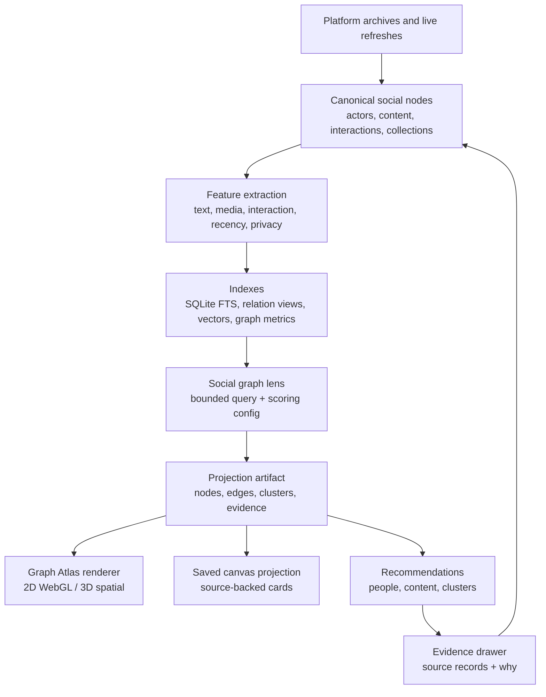
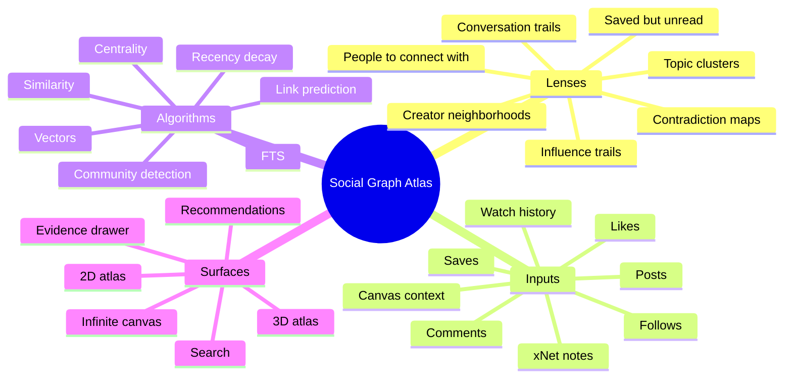
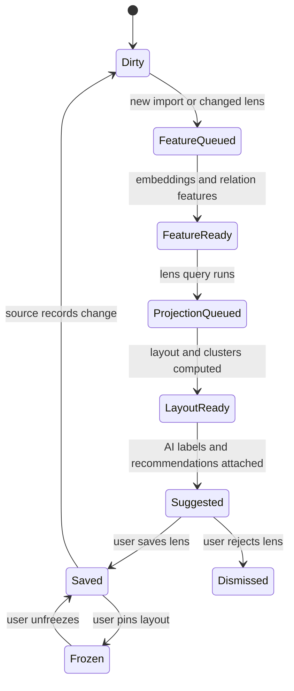
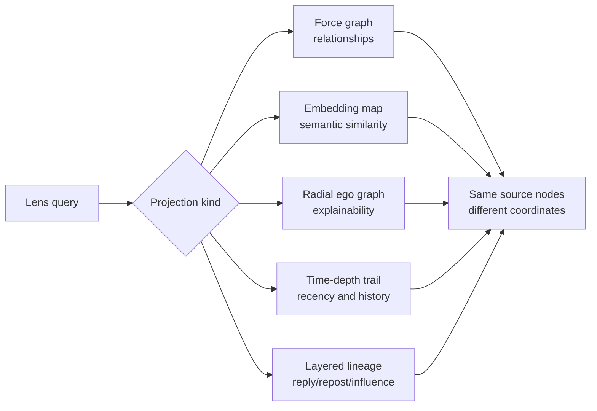
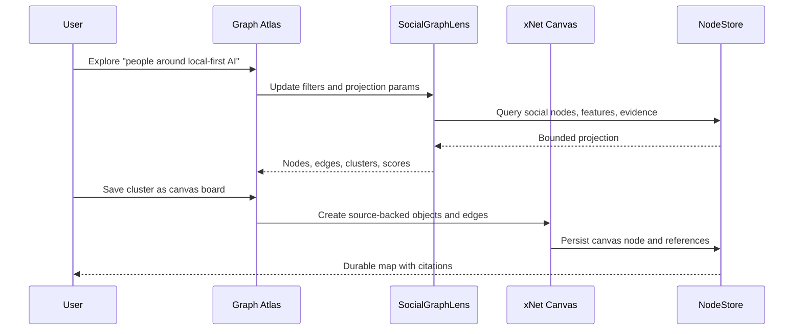
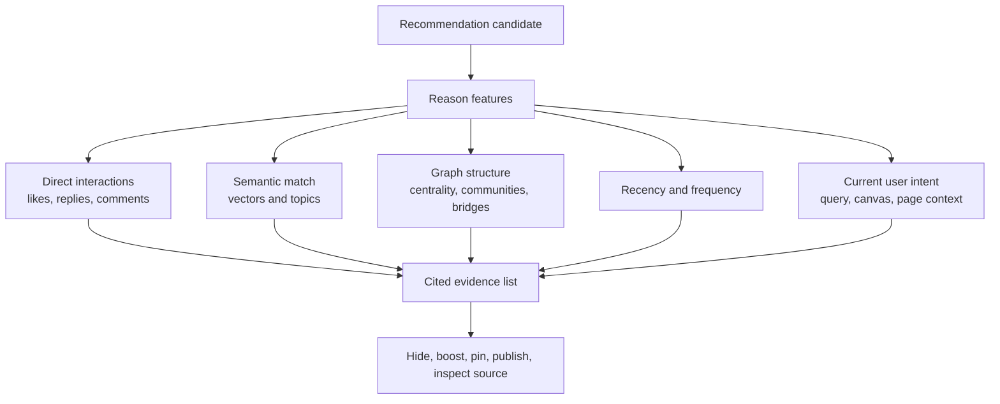
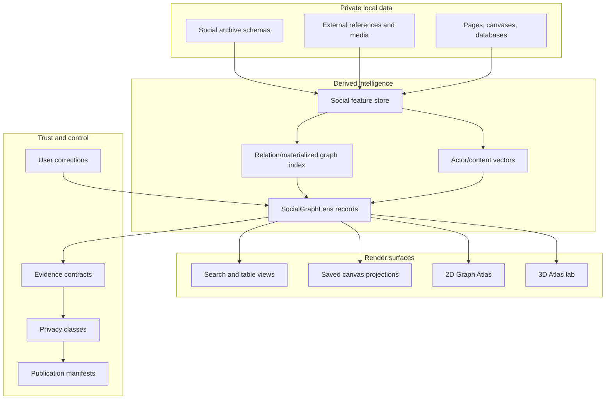

# 0151 - Self-Organizing Social Graph Immersive Recommendation Space

**Status:** Exploration
**Date:** 2026-06-05
**Author:** Codex
**Related:** [0150 - Unified Social Graph](./0150_%5B_%5D_UNIFIED_SOCIAL_GRAPH.md), [0136 - Expanding The Infinite Canvas Into A Universal Media And Planning Surface](./0136_%5Bx%5D_EXPANDING_THE_INFINITE_CANVAS_INTO_A_UNIVERSAL_MEDIA_AND_PLANNING_SURFACE.md), [0138 - AI Deep Integration With Pages, Databases, and Canvases](./0138_%5Bx%5D_AI_DEEP_INTEGRATION_WITH_PAGES_DATABASES_CANVASES.md)

## Exploration Checklist

- [x] Compute the next exploration filename.
- [x] Inspect existing social graph, AI, canvas, data, search, vector, and renderer code paths.
- [x] Research graph visualization, graph analytics, embedding projection, immersive web, spatial audio, data portability, and privacy references.
- [x] Explore force-directed graphs, 3D graph space, infinite canvas, media-rich navigation, algorithms, and AI recommendations.
- [x] Produce recommendations, implementation checklist, validation checklist, mermaid diagrams, example code, and references.

## Problem Statement

The previous unified social graph exploration answered the data and consent question: import likes, saves, comments, posts, follows, bookmarks, watch history, and related platform archives into private canonical xNet nodes, then expose search, analysis, and bounded canvas projections.

This exploration goes deeper into the product idea:

> What would it feel like if every meaningful social interaction across X, YouTube, Instagram, TikTok, Reddit, and the open web became a navigable, self-organizing spatial graph that helps a person discover new content, understand recurring creators and communities, find people they might want to connect with, and move through their own attention history almost like a beautiful multidimensional game?

The hard question is not just "can xNet draw a force graph?" It is:

- how to derive useful graph projections from noisy personal archives,
- how to combine explicit interactions with semantic embeddings and AI labels,
- how to make recommendations explainable,
- how to render media-rich graph neighborhoods without turning the canvas into a slow pile of cards,
- how to support 2D infinite-canvas workflows and 3D spatial exploration without confusing the product,
- and how to keep privacy and consent visible when likes, comments, and follows become queryable evidence.

## Executive Summary

xNet should build this as a **Social Graph Atlas**, not as one giant always-on graph.

The core idea:

1. **Canonical social data remains private NodeStore data.** `0150` is still the foundation.
2. **Graph projections are derived lenses.** A lens is a bounded, versioned, explainable view such as "creator neighborhoods around local-first software" or "people who keep appearing in my saved videos and threads."
3. **The infinite canvas is the durable work surface.** Users save clusters, pin people, annotate evidence, create collections, and turn discoveries into pages, databases, tasks, and canvases.
4. **A dedicated graph-space renderer handles exploration.** It can start as a 2D WebGL projection and later become a 3D/immersive mode.
5. **The graph self-organizes through transparent algorithms.** Community detection, centrality, similarity, embeddings, force layout, UMAP/PCA projections, recency decay, and AI cluster labels all write evidence, not vibes.
6. **3D is a lab mode until 2D is useful.** A beautiful 3D constellation can be compelling, but the durable product value comes from explainable recommendations, saved lenses, and source-backed objects.
7. **Recommendations must cite graph paths and source records.** "You may want to connect with this creator" should always expand into likes, bookmarks, comments, shared topics, mutual communities, and semantic matches.



The recommended product sequence:

- **Phase 1:** Build graph projections and evidence without a new renderer.
- **Phase 2:** Add social graph lenses as source-backed canvas objects and saved views.
- **Phase 3:** Add a performant 2D Graph Atlas renderer for large interactive exploration.
- **Phase 4:** Prototype a 3D Atlas mode with depth, media thumbnails, trails, and optional spatial audio.
- **Phase 5:** Add opt-in public/community graph surfaces only after local privacy controls are robust.

## Current State In The Repository

### What Already Exists

Observed repository facts:

| Area                         | Evidence                                                                                                                                                                                                                                                         | Relevance                                                                                                                        |
| ---------------------------- | ---------------------------------------------------------------------------------------------------------------------------------------------------------------------------------------------------------------------------------------------------------------- | -------------------------------------------------------------------------------------------------------------------------------- |
| Canonical node data          | [`packages/data/src/store/store.ts`](../../packages/data/src/store/store.ts), [`packages/data/src/store/sqlite-adapter.ts`](../../packages/data/src/store/sqlite-adapter.ts)                                                                                     | Imported social records can become signed, Lamport-ordered nodes with SQLite-backed persistence.                                 |
| Query descriptors            | [`packages/data/src/store/query.ts`](../../packages/data/src/store/query.ts)                                                                                                                                                                                     | Supports schema queries, full-text search, spatial filters, materialized views, pagination, and plan metadata.                   |
| Existing social primitives   | [`packages/data/src/schema/schemas/reaction.ts`](../../packages/data/src/schema/schemas/reaction.ts), [`packages/data/src/schema/schemas/comment.ts`](../../packages/data/src/schema/schemas/comment.ts)                                                         | xNet already models universal reactions and comments, but not imported cross-platform archives.                                  |
| External social refs         | [`packages/data/src/external-references.ts`](../../packages/data/src/external-references.ts), [`packages/data/src/schema/schemas/external-reference.ts`](../../packages/data/src/schema/schemas/external-reference.ts)                                           | YouTube, X/Twitter, Instagram, TikTok, Vimeo, Spotify, and generic URLs already normalize into source-backed references.         |
| Vector search                | [`packages/vectors/src/search.ts`](../../packages/vectors/src/search.ts), [`packages/vectors/src/hybrid.ts`](../../packages/vectors/src/hybrid.ts), [`packages/vectors/src/hnsw.ts`](../../packages/vectors/src/hnsw.ts)                                         | `@xenova/transformers` and `usearch` provide local embeddings and HNSW-like nearest-neighbor search.                             |
| Full-text search             | [`packages/query/src/search/index.ts`](../../packages/query/src/search/index.ts)                                                                                                                                                                                 | MiniSearch-backed indexing can provide keyword recall and snippets for source evidence.                                          |
| Canvas source-backed objects | [`packages/canvas/src/types.ts`](../../packages/canvas/src/types.ts), [`packages/canvas/src/ingestion.ts`](../../packages/canvas/src/ingestion.ts)                                                                                                               | Canvas objects already distinguish pages, databases, external references, media, notes, shapes, and groups.                      |
| Canvas semantic edges        | [`packages/canvas/src/edges/relationships.ts`](../../packages/canvas/src/edges/relationships.ts), [`packages/canvas/src/edges/source-semantics.ts`](../../packages/canvas/src/edges/source-semantics.ts)                                                         | Edge relationships can store roles, schema IDs, source node IDs, direction, labels, and properties.                              |
| Layout engine                | [`packages/canvas/src/layout/index.ts`](../../packages/canvas/src/layout/index.ts), [`packages/canvas/src/workers/layout-worker.ts`](../../packages/canvas/src/workers/layout-worker.ts)                                                                         | ELK already supports layered, force, radial, stress, tree, and box layouts, including worker execution.                          |
| Canvas v3 scale path         | [`packages/canvas-core/src/provider.ts`](../../packages/canvas-core/src/provider.ts), [`packages/canvas-core/src/lod.ts`](../../packages/canvas-core/src/lod.ts), [`packages/canvas/src/renderer/CanvasV3.tsx`](../../packages/canvas/src/renderer/CanvasV3.tsx) | The repo already has viewport-interest contracts, LOD tiers, WebGL vector tiles, DOM budgets, thumbnails, and minimap summaries. |
| Spatial indexing             | [`packages/canvas/src/spatial/index.ts`](../../packages/canvas/src/spatial/index.ts)                                                                                                                                                                             | `rbush` supports viewport culling, point queries, range selection, and node hit testing.                                         |
| Preview model                | [`packages/canvas/src/preview/model.ts`](../../packages/canvas/src/preview/model.ts), [`packages/canvas/src/preview/thumbnail-output.ts`](../../packages/canvas/src/preview/thumbnail-output.ts)                                                                 | Media-rich graph nodes can reuse summary/thumbnail/shell/live preview tiers.                                                     |
| Performance instrumentation  | [`packages/canvas/src/performance/frame-monitor.ts`](../../packages/canvas/src/performance/frame-monitor.ts)                                                                                                                                                     | Graph-space prototypes can measure frame time and dropped frames.                                                                |

### Important Gaps

Observed gaps:

- No canonical `SocialActor`, `SocialContent`, `SocialInteraction`, `SocialCollection`, or `SocialGraphLens` schemas exist yet.
- No relation index is specialized for cross-platform graph traversal.
- No graph projection artifact exists as a first-class data model.
- No durable feature store exists for per-actor/per-content embeddings, graph metrics, recency weights, topic labels, or privacy risk.
- No direct dependency currently gives xNet a first-party graph model like Graphology or a dedicated large graph renderer like Sigma.js, Cosmograph, or Three-based force graphs.
- The current canvas can compute layouts, but it should not be asked to render an entire social archive as DOM cards.
- The AI integration work in `0138` has not yet produced social-specific recommendation tools or evidence contracts.

### Inference From The Codebase

The repo is ready for **bounded graph projections** much sooner than it is ready for a global 3D social universe.

That matters because the product can become useful in this order:

1. Import and normalize social records.
2. Generate local features and explainable candidate recommendations.
3. Render small projections in existing canvas.
4. Add a dedicated high-performance graph renderer when projections need more scale or fluidity.
5. Add 3D and game-like navigation once users have valuable things to navigate.

## External Research

### Graph Visualization Libraries

- [D3 force simulation](https://d3js.org/d3-force/simulation) supports named forces such as many-body charge, links, and centering. It is a strong conceptual baseline for small interactive force layouts, but it is not by itself a complete media-rich graph product.
- [react-force-graph](https://github.com/vasturiano/react-force-graph) exposes React bindings for 2D canvas, 3D Three/WebGL, VR, and AR force-directed graphs, using `d3-force-3d` under the hood. It is attractive for a fast 3D prototype.
- [Sigma.js rendering docs](https://v4.sigmajs.org/concepts/rendering/) describe a WebGL renderer designed for smooth performance with tens of thousands of nodes and edges. Its [graph data docs](https://www.sigmajs.org/docs/advanced/data/) state that Sigma uses Graphology as its graph model.
- [Graphology's standard library](https://graphology.github.io/standard-library/) includes graph layouts, ForceAtlas2, no-overlap, metrics such as modularity and centrality, traversal, shortest paths, and graph file formats. This is a strong fit for deterministic graph analytics and worker-side layout.
- [Cytoscape.js](https://js.cytoscape.org/) is an open-source graph theory library for graph analysis and visualization, supports browser and headless usage, and includes interaction gestures and graph algorithms. It is useful for analysis-heavy prototypes but may be less aligned with xNet's custom canvas/LOD renderer ambitions.
- [Cosmograph](https://cosmograph.app/) is explicitly aimed at large network graphs and machine-learning embeddings in the browser, with local-first positioning. Its lower-level [`@cosmos.gl/graph`](https://github.com/cosmosgl/graph) engine describes GPU-accelerated force layout and rendering with computation and drawing on the GPU. This is highly relevant for a future Atlas renderer, but it should be benchmarked and license-reviewed before committing.

### 🧠 Graph Analytics And Recommendation Algorithms

- [Neo4j Graph Data Science algorithms](https://neo4j.com/docs/graph-data-science/current/algorithms/) groups algorithms into centrality, community detection, similarity, path finding, DAG algorithms, node embeddings, and link prediction. xNet does not need Neo4j, but this taxonomy is useful for designing local graph jobs.
- [Neo4j node embedding docs](https://www.neo4j.com/docs/graph-data-science/current/machine-learning/node-embeddings/) frame node embeddings as low-dimensional vector representations used for downstream tasks such as node classification, link prediction, and kNN similarity graph construction. xNet can apply the same concept locally over social actors and content.
- [UMAP documentation](https://umap-learn.readthedocs.io/en/latest/index.html) describes UMAP as dimension reduction for visualization and general nonlinear dimension reduction. It also documents clustering, outlier detection, time-varying data, sparse data, and document embeddings, all relevant to social archive exploration.
- [TensorFlow Embedding Projector](https://projector.tensorflow.org/) is a useful product reference: it lets users project embeddings with UMAP, t-SNE, PCA, custom axes, 2D/3D modes, nearest-neighbor inspection, labels, and search. xNet's Atlas should copy the idea of inspectable projections and nearest-neighbor evidence, not just the look.

### 🕹️ Immersive Interaction, Media, And Spatial Audio

- [Three.js](https://threejs.org/docs/pages/WebGLRenderer.html) remains the standard pragmatic choice when xNet needs custom 3D WebGL rendering rather than a prebuilt force graph.
- [MDN WebXR fundamentals](https://developer.mozilla.org/en-US/docs/Web/API/WebXR_Device_API/Fundamentals) explains that WebXR provides browser APIs for AR/VR device integration, but does not itself render 3D content. WebGL or libraries such as Three.js still do that part.
- [MDN Web Audio spatialization](https://developer.mozilla.org/en-US/docs/Web/API/Web_Audio_API/Web_audio_spatialization_basics) describes `PannerNode` and `AudioListener` for positioning audio relative to a listener. This makes spatial audio plausible for a "media constellation" mode, but it should remain optional and carefully scoped.

### 🔒 Data Portability And Privacy

- [Data Transfer Initiative's DTP overview](https://dtinit.org/docs/dtp-what-is-it) describes common data models and adapters for service-to-service data portability. xNet's importer layer should follow the same adapter-plus-canonical-model pattern.
- The [Irish Data Protection Commission's GDPR Article 20 page](https://www.dataprotection.ie/en/individuals/know-your-rights/right-data-portability-article-20-gdpr) notes that data portability applies only to the extent it does not affect others' rights and freedoms. Social archives often contain other people's handles, comments, DMs, and interaction evidence.
- The [FTC's September 19, 2024 staff report press release](https://www.ftc.gov/news-events/news/press-releases/2024/09/ftc-staff-report-finds-large-social-media-video-streaming-companies-have-engaged-vast-surveillance) says major social and video services engaged in broad data collection, inadequate data minimization and retention, and limited opt-outs for automated systems. xNet should not recreate this as an "open" personal analytics layer.

## Key Findings

### 1. The Product Should Be A Lens System, Not A Single Graph

The phrase "one big database" is right for storage and analysis, but wrong for rendering.

A person may eventually import:

- hundreds of thousands of video views,
- tens of thousands of likes,
- thousands of comments,
- years of posts,
- follower/following lists,
- playlists and saved folders,
- RSS/bookmark history,
- and local xNet pages/canvases referencing the same topics.

The UI should never ask the user to "look at everything." It should offer **lenses**:

- "Creators I keep returning to"
- "People I should talk to about local-first software"
- "Videos I saved but never revisited"
- "Threads that shaped my thinking about decentralized search"
- "Communities that bridge AI agents and cooperative internet infrastructure"
- "Accounts I like across platforms but do not follow"
- "Recurring people in my comments, likes, replies, and saved content"



Each lens should be:

- deterministic enough to refresh,
- versioned enough to compare over time,
- bounded enough to render,
- inspectable enough to trust,
- and editable enough for the user to pin, hide, relabel, or split clusters.

### 2. "Self-Organizing" Means Derived, Refreshable, And User-Correctable

The graph can self-organize through background jobs:

1. Extract content text, metadata, media descriptors, and provenance.
2. Compute or refresh text embeddings.
3. Derive actor embeddings from authored content, liked/saved content, and interaction neighborhoods.
4. Build relation features such as co-like, co-comment, follows, reply chains, shared topics, and repeated appearances.
5. Compute communities, centrality, bridge scores, and near-neighbor sets.
6. Generate candidate lenses and cluster labels.
7. Present them as drafts the user can accept, pin, hide, split, or merge.



This avoids the wrong mental model where AI is an omniscient recommender. The better mental model is:

> xNet proposes graph maps. The user edits the cartography.

### 3. The Graph Needs Multiple Coordinate Systems

No single layout can express this data well. xNet should treat coordinates as projection-specific:

| Coordinate system    | Best for                                                           | Algorithm shape                             | UX feel                      |
| -------------------- | ------------------------------------------------------------------ | ------------------------------------------- | ---------------------------- |
| Force-directed       | Social neighborhoods, creator communities, multi-hop relationships | D3/ELK/Cosmograph/ForceAtlas2-style physics | Organic clusters and bridges |
| Embedding projection | Semantic content clusters, media similarity, topic clouds          | PCA, UMAP, t-SNE, custom axes               | Constellation of meaning     |
| Radial               | One actor/topic as center, explainable near/far rings              | Ego network with weighted distances         | "Why this person?" view      |
| Timeline depth       | Recency, obsession cycles, influence over time                     | Time on z-axis or horizontal axis           | Moving through memory        |
| Layered/directional  | Reply chains, repost lineage, influence trails                     | DAG/layered layout                          | Direction and causality      |
| Canvas coordinates   | User-curated saved map                                             | Manual pinning plus layout assist           | Durable workspace            |



The same content or person can exist in many maps. Coordinates should be a property of the lens, not a property of the canonical node.

### 4. 3D Is Most Valuable When It Adds Meaningful Depth

3D should not be a gimmick. It becomes useful when depth represents something:

- **Time:** old interactions recede, recent ones come forward.
- **Confidence:** speculative links are farther back or translucent.
- **Privacy:** private data lives in a near/personal layer, published data in an outer layer.
- **Semantic scale:** topic galaxies contain creator clusters, which contain content cards.
- **Attention intensity:** repeated interactions pull content toward the user.
- **Directionality:** trails show movement from source content to saved note to public post.

Good 3D interactions:

- fly to a creator neighborhood,
- orbit a topic cluster,
- zoom from cluster to content cards,
- follow a trail of posts, comments, and videos through time,
- pin a person and see nearby communities reorganize,
- turn a cluster into a 2D canvas board,
- spatially preview video/audio thumbnails only when close enough.

Bad 3D interactions:

- a giant hairball of everything,
- labels everywhere,
- autoplay media in space,
- unbounded motion sickness,
- recommendations that disappear when the simulation moves,
- physics that prevents precise selection.

### 5. The Infinite Canvas And The Atlas Should Be Separate But Connected

The current xNet canvas is a durable source-backed surface. It is good for:

- saved maps,
- annotations,
- planning,
- comparison,
- connecting discoveries to pages and databases,
- creating collections,
- and hand-curated arrangement.

The Atlas is an exploratory renderer. It is good for:

- fluid navigation,
- force simulations,
- high-density clusters,
- fast filters,
- 3D depth,
- media constellations,
- and temporary "what if?" layouts.

The bridge:



Recommendation:

- The Atlas should use source IDs and projection IDs.
- The canvas should store stable source-backed cards and semantic edges.
- Saving from Atlas to canvas should be explicit.
- Canvas edits can feed back into lens preferences: pinned, hidden, merged, split, labeled.

### 6. Recommendations Need Evidence Contracts 🔎

The highest-trust recommendation UI is not a feed. It is a card with expandable evidence.

Examples:

- "@alice appears in 18 saved threads about local-first databases, authored 6 posts semantically close to your xNet notes on query planning, and is followed by 4 accounts you frequently bookmark."
- "This YouTube channel clusters with 12 videos you liked about WebRTC, sync, and SQLite; you have not subscribed."
- "This topic is resurfacing: you saved 9 posts and 4 videos about data portability in the last 45 days."
- "This person is a bridge between your decentralized search cluster and your AI agents cluster."

Evidence should include:

- source records,
- interaction kinds,
- dates,
- source platform,
- graph path,
- semantic similarity score,
- privacy class,
- whether the evidence is private-only,
- and user controls to hide a source or reduce a signal.



### 7. Media Makes The Graph Beautiful, But LOD Makes It Usable

The user asked for imagery, audio, video, and maneuverability. The right technical interpretation is:

- Far away: clusters, color fields, density, labels only for major regions.
- Mid distance: creator avatars, media thumbnails, tiny platform badges, count badges.
- Near: source-backed cards with title, preview, excerpt, and evidence chips.
- Focused: full live embed, transcript, comments, AI summary, actions.

This matches existing xNet concepts:

- `CanvasPreviewTier`: `summary`, `thumbnail`, `shell`, `live`
- `CanvasLodTier`: `live-dom`, `shell-dom`, `thumbnail`, `vector-tile`, `raster-tile`
- `CanvasSceneProvider`: viewport interest, budgets, vector/raster tiles, shell/live objects

The Atlas should reuse those ideas even if it uses a different renderer.

### 8. Privacy Is A Product Primitive, Not A Settings Page

Likes, bookmarks, comments, follows, watch history, and saves are behavior traces. They can expose:

- personal interests,
- medical/religious/political topics,
- sexual orientation or relationships,
- professional research,
- location/community ties,
- private disputes,
- third-party identities,
- and inferred intent.

The graph UI should make privacy visible:

- private nodes have a local-only visual treatment,
- high-sensitivity evidence has a warning badge,
- recommendations can be computed locally without being published,
- public/community lenses require a publication manifest,
- "share this cluster" previews exact outgoing records,
- aggregate sharing is available without raw edges,
- and hiding a person/topic removes it from future graph evidence.

## Options And Tradeoffs

| Option                          | Shape                                                                                    | Benefits                                                                     | Costs                                                              | Verdict                                          |
| ------------------------------- | ---------------------------------------------------------------------------------------- | ---------------------------------------------------------------------------- | ------------------------------------------------------------------ | ------------------------------------------------ |
| Extend current canvas only      | Use existing canvas objects, ELK layouts, WebGL tiles, minimap, and source-backed cards. | Fastest path, least dependency risk, immediately saves to durable workspace. | Not ideal for very fluid high-density graph exploration.           | Best first phase.                                |
| Dedicated 2D Graph Atlas        | Add a graph model and WebGL renderer such as Graphology + Sigma or benchmark Cosmograph. | High performance, good graph interactions, clear separation from canvas.     | New dependency and integration surface; persistence bridge needed. | Best second phase after projection model exists. |
| 3D Atlas prototype              | Use react-force-graph/Three/WebGL for spatial depth, media particles, and trails.        | Fast path to a compelling demo and "game-like" feel.                         | Harder accessibility, precision, performance, and product clarity. | Prototype after 2D evidence model works.         |
| Custom Three.js/WebGPU renderer | Build exact xNet visual language and LOD pipeline.                                       | Maximum control over 3D, shaders, media, depth, and interactions.            | Expensive and risky before usage patterns are known.               | Later, only if Atlas becomes strategic.          |
| Cytoscape.js-heavy workbench    | Use Cytoscape.js for analysis and visualization.                                         | Mature graph algorithms, headless support, many layouts.                     | Less aligned with media-rich canvas/LOD aesthetics.                | Useful for internal analysis prototypes.         |
| Hub-scale public graph          | Compute community recommendations over opt-in public slices.                             | Network effects and public-good discovery.                                   | Privacy, moderation, abuse, takedown, and governance burden.       | Phase 5 only.                                    |

## Recommendation

Build the Social Graph Atlas as a layered system:



### Phase 1: Projection Engine Without New Renderer

Add:

- `SocialGraphLens` schema.
- `SocialGraphProjection` artifact type.
- scoring functions for actors, content, clusters, and recommendations.
- evidence contracts.
- relation/materialized queries over imported social nodes.
- vector-backed nearest-neighbor lookup.
- tests using small deterministic fixtures.

Render first as:

- search results,
- database/list views,
- simple canvas boards,
- and diagnostic JSON in devtools.

### Phase 2: Canvas Lenses

Add source-backed canvas templates:

- `Attention Map`
- `Creator Neighborhood`
- `People To Connect With`
- `Saved Media Board`
- `Conversation Trail`
- `Topic Cluster Board`

Use existing canvas capabilities:

- source-backed cards,
- semantic edges,
- LOD previews,
- minimap summaries,
- layout worker,
- and existing WebGL/vector tile path.

### Phase 3: 2D Graph Atlas

Add a dedicated interactive renderer when projections outgrow canvas cards.

Candidate paths:

- **Graphology + Sigma.js:** strong graph model, WebGL rendering, metrics/layout ecosystem.
- **Cosmograph / @cosmos.gl/graph:** strong large-graph and embedding exploration story, likely best for GPU force layout experiments.
- **Existing Canvas v3 renderer extension:** lowest external dependency risk, but more custom graph work.

Decision gate:

- 10k nodes / 50k edges synthetic graph benchmark.
- 1k media thumbnails / 5k links mixed projection benchmark.
- 60 FPS interaction target on desktop, graceful degradation on laptop/mobile.
- ability to preserve xNet source IDs, evidence overlays, privacy styling, and selection semantics.

### Phase 4: 3D Atlas Lab

Prototype only after Phase 3 has useful lenses.

Use 3D for:

- timeline depth,
- topic galaxies,
- creator constellations,
- "fly through saved media",
- source trails,
- and optional spatial audio previews.

Keep it as a lab mode until:

- keyboard navigation works,
- selection is precise,
- motion is comfortable,
- no private evidence leaks through screen recordings or sharing,
- and every 3D object can be traced back to source records.

### Phase 5: Opt-In Public And Community Graphs

Only after local-first privacy controls are strong:

- signed publication manifests,
- exact outgoing-record previews,
- actor/topic/date redaction,
- high-sensitivity warnings,
- aggregate-only publication,
- hub query budgets,
- moderation labels,
- takedown/retraction flows,
- and public recommendation evidence separate from private evidence.

## Product Shape

### The First Screen Should Be A Workbench

For this feature, avoid a landing-page feeling. The first screen should be the tool:

- left rail: lenses, imports, saved maps,
- center: graph/canvas/atlas view,
- right panel: details, evidence, privacy, recommendation controls,
- bottom strip: timeline, filters, media scrubber, or projection parameters.

### 🧭 Navigation Modes

| Mode                  | Interaction                           | Purpose                                             |
| --------------------- | ------------------------------------- | --------------------------------------------------- |
| Search                | Type, filter, sort, inspect           | Find exact records and source evidence.             |
| Canvas                | Pan/zoom, drag cards, annotate        | Save and organize discoveries.                      |
| Atlas 2D              | Fluid pan/zoom, cluster expand, lasso | Explore dense graph neighborhoods.                  |
| Atlas 3D              | Orbit, fly, depth filter, focus trail | Experience multidimensional relationships.          |
| Timeline              | Scrub time, compare periods           | Understand changing interests and recurring people. |
| Recommendation review | Accept, hide, explain, connect        | Turn analysis into action.                          |

### ✨ Beautiful UI Principles

- Use real thumbnails, avatars, media posters, waveform strips, and platform badges when available.
- Use abstract points only at far zoom.
- Let clusters bloom into cards as the user approaches.
- Use directional trails sparingly: reply lines, influence paths, saved-to-note-to-post paths.
- Keep labels stable and sparse.
- Make privacy states visible but not visually noisy.
- Let users pin clusters so physics does not fight intentional organization.
- Prefer calm, precise controls over decorative chrome.

## Implementation Checklist

- [ ] Add canonical social archive schemas from `0150` if they do not exist yet.
- [ ] Add a `SocialGraphLens` schema for saved lens configuration.
- [ ] Add a `SocialGraphProjection` runtime type that contains bounded nodes, edges, clusters, scores, coordinates, and evidence.
- [ ] Add a feature extraction job for social content text, actor profiles, interaction weights, recency, privacy, and provenance.
- [ ] Add vector indexing jobs for content and actor embeddings using `@xnetjs/vectors`.
- [ ] Add relation/materialized views for common graph traversals.
- [ ] Add deterministic recommendation scoring functions with no provider-specific AI dependency.
- [ ] Add evidence contracts for every recommendation and cluster label.
- [ ] Add AI-assisted cluster labels only after deterministic evidence exists.
- [ ] Add canvas templates for attention maps, creator neighborhoods, saved media boards, people recommendations, and conversation trails.
- [ ] Add synthetic graph fixtures for small, medium, and large social graphs.
- [ ] Benchmark existing canvas rendering and ELK layouts on social graph projections.
- [ ] Evaluate Graphology + Sigma.js and Cosmograph/@cosmos.gl/graph in a throwaway prototype before adding direct dependencies.
- [ ] Add a 2D Graph Atlas feature flag after benchmark results are acceptable.
- [ ] Prototype 3D Atlas mode behind a separate lab flag.
- [ ] Add privacy review UI before any public/community graph publication.
- [ ] Add user correction feedback: hide source, pin node, merge/split cluster, rename cluster, reduce signal, mark recommendation irrelevant.

## Validation Checklist

- [ ] Run targeted schema and importer tests for social archive records.
- [ ] Verify projection generation is deterministic for fixed inputs.
- [ ] Verify every recommendation has at least one inspectable evidence item.
- [ ] Verify private-only evidence is never included in public projection exports.
- [ ] Verify high-sensitivity interactions such as likes/bookmarks default to private evidence.
- [ ] Verify graph projections cap node/edge counts and degrade to clusters at high density.
- [ ] Verify canvas saved projections preserve source node IDs and schema IDs.
- [ ] Verify rendering stays responsive with 1k, 10k, and 50k synthetic graph projections.
- [ ] Verify keyboard navigation, reduced-motion mode, color contrast, and non-3D fallback.
- [ ] Verify no media autoplay occurs in graph exploration.
- [ ] Verify spatial audio is opt-in and disabled by default.
- [ ] Verify publication manifests preview exact outgoing records.
- [ ] Verify hidden actors/topics are excluded from future recommendation evidence.
- [ ] Verify Electron manual flow with test auth bypass if UI is implemented.

## Example Code

This sketch shows the intended shape: projection generation is a pure functional pipeline over query results and feature records. Rendering is downstream.

```typescript
import type { NodeId, SchemaIRI } from '@xnetjs/data'

export type SocialGraphLensKind =
  | 'attention-map'
  | 'creator-neighborhood'
  | 'people-to-connect'
  | 'saved-media-board'
  | 'conversation-trail'
  | 'topic-cluster'

export type SocialGraphProjectionSpace = 'canvas-2d' | 'atlas-2d' | 'atlas-3d'

export type SocialGraphLens = {
  id: string
  title: string
  kind: SocialGraphLensKind
  space: SocialGraphProjectionSpace
  query: {
    text?: string
    platforms?: readonly string[]
    interactionKinds?: readonly string[]
    actorIds?: readonly NodeId[]
    since?: number
    until?: number
    limit: number
  }
  weights: {
    interaction: number
    semantic: number
    recency: number
    graph: number
    userPinned: number
  }
  privacy: {
    includePrivateEvidence: boolean
    includePublishableOnly: boolean
    excludedActorIds: readonly NodeId[]
  }
}

export type SocialGraphEvidence = {
  id: string
  sourceNodeId: NodeId
  sourceSchemaId: SchemaIRI
  platform: string
  interactionKind?: string
  occurredAt?: number
  privateOnly: boolean
  summary: string
}

export type SocialGraphProjectionNode = {
  id: string
  sourceNodeId: NodeId
  sourceSchemaId: SchemaIRI
  kind: 'actor' | 'content' | 'cluster' | 'topic'
  label: string
  score: number
  privacy: 'private' | 'staged' | 'shared' | 'public'
  evidenceIds: readonly string[]
  position?: { x: number; y: number; z?: number }
}

export type SocialGraphProjectionEdge = {
  id: string
  sourceId: string
  targetId: string
  kind: 'liked' | 'saved' | 'authored' | 'replied' | 'similar-to' | 'co-appears' | 'bridges'
  weight: number
  directed: boolean
  evidenceIds: readonly string[]
}

export type SocialGraphProjection = {
  lensId: string
  generatedAt: number
  nodes: readonly SocialGraphProjectionNode[]
  edges: readonly SocialGraphProjectionEdge[]
  evidence: readonly SocialGraphEvidence[]
  clusters: readonly {
    id: string
    label: string
    nodeIds: readonly string[]
    score: number
    evidenceIds: readonly string[]
  }[]
}
```

Recommendation scoring should keep feature contributions explicit:

```typescript
export type CandidateFeatureVector = {
  directInteractionCount: number
  savedContentSimilarity: number
  authoredContentSimilarity: number
  sharedCommunityScore: number
  bridgeScore: number
  recencyScore: number
  userPinnedBoost: number
}

export type CandidateScoreBreakdown = CandidateFeatureVector & {
  total: number
}

export function scoreConnectionCandidate(input: {
  features: CandidateFeatureVector
  weights: SocialGraphLens['weights']
}): CandidateScoreBreakdown {
  const { features, weights } = input
  const semantic = (features.savedContentSimilarity + features.authoredContentSimilarity) / 2
  const graph = (features.sharedCommunityScore + features.bridgeScore) / 2

  const total =
    weights.interaction * Math.log1p(features.directInteractionCount) +
    weights.semantic * semantic +
    weights.graph * graph +
    weights.recency * features.recencyScore +
    weights.userPinned * features.userPinnedBoost

  return {
    ...features,
    total
  }
}
```

The rendering boundary should stay separate from scoring:

```typescript
export type GraphAtlasRenderer = {
  renderProjection: (projection: SocialGraphProjection) => void
  focusNode: (projectionNodeId: string) => void
  setHoveredNode: (projectionNodeId: string | null) => void
  setPrivacyMode: (mode: 'all-local' | 'publishable-preview') => void
  dispose: () => void
}

export function selectRenderableProjection(
  projection: SocialGraphProjection,
  options: {
    maxNodes: number
    maxEdges: number
    includePrivateEvidence: boolean
  }
): SocialGraphProjection {
  const allowedEvidenceIds = new Set(
    projection.evidence
      .filter((item) => options.includePrivateEvidence || !item.privateOnly)
      .map((item) => item.id)
  )

  const nodes = projection.nodes
    .filter((node) => node.evidenceIds.some((id) => allowedEvidenceIds.has(id)))
    .sort((left, right) => right.score - left.score)
    .slice(0, options.maxNodes)
  const nodeIds = new Set(nodes.map((node) => node.id))

  const edges = projection.edges
    .filter((edge) => nodeIds.has(edge.sourceId) && nodeIds.has(edge.targetId))
    .filter((edge) => edge.evidenceIds.some((id) => allowedEvidenceIds.has(id)))
    .sort((left, right) => right.weight - left.weight)
    .slice(0, options.maxEdges)

  return {
    ...projection,
    nodes,
    edges,
    evidence: projection.evidence.filter((item) => allowedEvidenceIds.has(item.id))
  }
}
```

## Risks And Unknowns

- **Archive fidelity:** platform exports vary and may omit enough metadata to weaken graph edges.
- **Graph hairballs:** force layouts can look magical in demos and useless with real data unless bounded by lenses.
- **False affinity:** likes and saves are not endorsements; recommendations must preserve context.
- **AI over-labeling:** cluster names generated without evidence can mislead users.
- **Private inference:** even aggregate clusters can reveal sensitive interests.
- **Performance:** media-rich cards, thumbnails, and live embeds can overwhelm rendering if LOD is not strict.
- **3D accessibility:** immersive navigation can be disorienting and must have 2D equivalents.
- **Dependency risk:** large graph renderers may fight xNet's canvas architecture, bundling, Electron constraints, or styling system.
- **Public graph abuse:** opt-in community discovery can become a stalking or scraping surface without strict policy and budgets.

## Next Actions

1. Implement the social archive schemas and private import pipeline from `0150`.
2. Add `SocialGraphLens` and `SocialGraphProjection` as pure TypeScript contracts before choosing a renderer.
3. Build a deterministic fixture of 100 actors, 1,000 content items, and 10,000 interactions.
4. Generate three first lenses: `Creator Neighborhood`, `People To Connect With`, and `Saved Media Board`.
5. Save those projections into existing canvas objects to validate the product value.
6. Benchmark Graphology/Sigma and Cosmograph against the same projection artifact.
7. Prototype 3D only after evidence, privacy, and saved canvas flows are working.

## References

- [0150 - Unified Social Graph](./0150_%5B_%5D_UNIFIED_SOCIAL_GRAPH.md)
- [0136 - Expanding The Infinite Canvas Into A Universal Media And Planning Surface](./0136_%5Bx%5D_EXPANDING_THE_INFINITE_CANVAS_INTO_A_UNIVERSAL_MEDIA_AND_PLANNING_SURFACE.md)
- [0138 - AI Deep Integration With Pages, Databases, and Canvases](./0138_%5Bx%5D_AI_DEEP_INTEGRATION_WITH_PAGES_DATABASES_CANVASES.md)
- [D3 force simulation](https://d3js.org/d3-force/simulation)
- [react-force-graph](https://github.com/vasturiano/react-force-graph)
- [Sigma.js rendering](https://v4.sigmajs.org/concepts/rendering/)
- [Sigma.js graph data](https://www.sigmajs.org/docs/advanced/data/)
- [Graphology standard library](https://graphology.github.io/standard-library/)
- [Cytoscape.js](https://js.cytoscape.org/)
- [Cosmograph](https://cosmograph.app/)
- [@cosmos.gl/graph](https://github.com/cosmosgl/graph)
- [Neo4j Graph Data Science algorithms](https://neo4j.com/docs/graph-data-science/current/algorithms/)
- [Neo4j node embeddings](https://www.neo4j.com/docs/graph-data-science/current/machine-learning/node-embeddings/)
- [UMAP documentation](https://umap-learn.readthedocs.io/en/latest/index.html)
- [UMAP paper](https://arxiv.org/abs/1802.03426)
- [TensorFlow Embedding Projector](https://projector.tensorflow.org/)
- [Three.js WebGLRenderer](https://threejs.org/docs/pages/WebGLRenderer.html)
- [MDN WebXR fundamentals](https://developer.mozilla.org/en-US/docs/Web/API/WebXR_Device_API/Fundamentals)
- [MDN Web Audio spatialization basics](https://developer.mozilla.org/en-US/docs/Web/API/Web_Audio_API/Web_audio_spatialization_basics)
- [Data Transfer Project overview](https://dtinit.org/docs/dtp-what-is-it)
- [GDPR Article 20 data portability overview](https://www.dataprotection.ie/en/individuals/know-your-rights/right-data-portability-article-20-gdpr)
- [FTC social media and video streaming services staff report press release](https://www.ftc.gov/news-events/news/press-releases/2024/09/ftc-staff-report-finds-large-social-media-video-streaming-companies-have-engaged-vast-surveillance)
