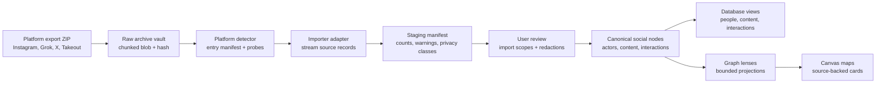
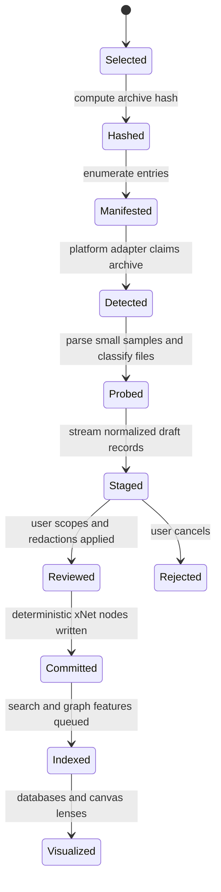
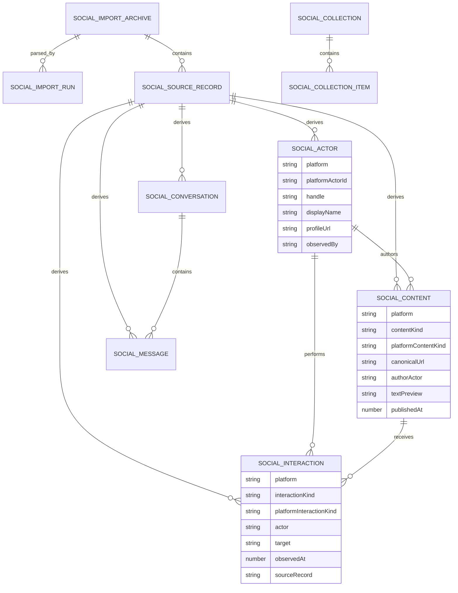
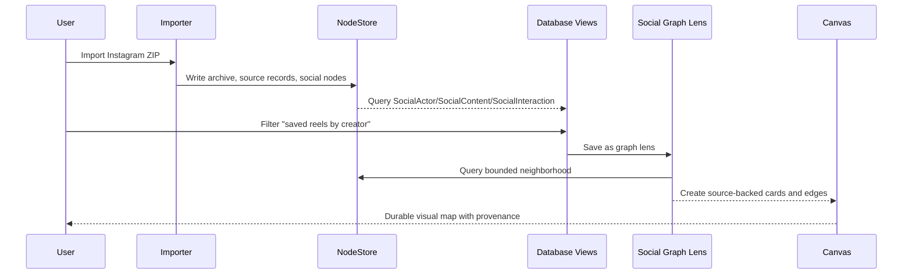
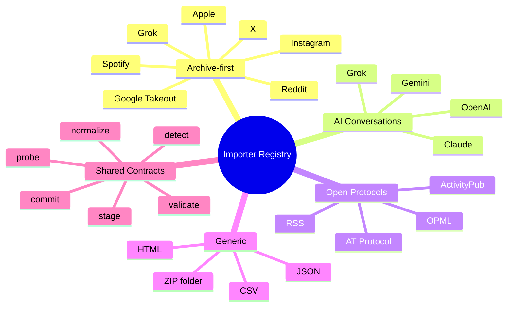
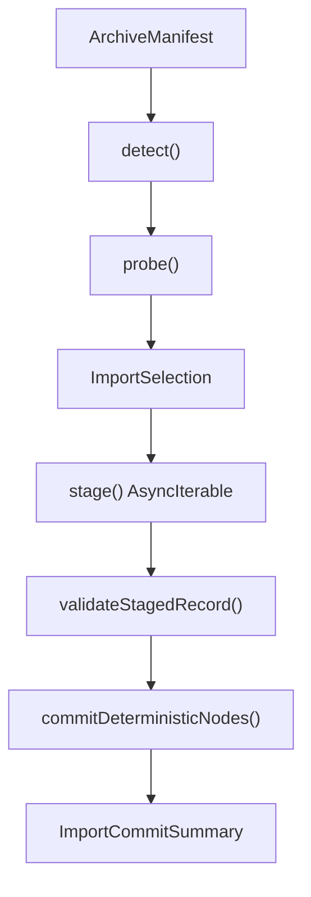

# 0152 - Actual Social Graph Importer

**Status:** Exploration  
**Date:** 2026-06-05  
**Author:** Codex  
**Related:** [0150 - Unified Social Graph](./0150_%5B_%5D_UNIFIED_SOCIAL_GRAPH.md), [0151 - Self-Organizing Social Graph Immersive Recommendation Space](./0151_%5B_%5D_SELF_ORGANIZING_SOCIAL_GRAPH_IMMERSIVE_RECOMMENDATION_SPACE.md), [0030 - Universal Social Primitives](./0030_%5B_%5D_UNIVERSAL_SOCIAL_PRIMITIVES.md)

## Exploration Checklist

- [x] Compute the next exploration filename.
- [x] Read the last two social graph explorations and use them as the starting point.
- [x] Inspect xNet data, database, blob, query, external reference, and canvas source-backed object code.
- [x] Inspect `.exports/grok.zip` and `.exports/instagram.zip` without copying private sample content into this document.
- [x] Research current official export paths and portability patterns for Instagram, Grok, X, Google/YouTube, Reddit, OpenAI, Claude, Spotify, Apple, ActivityPub, AT Protocol, Data Transfer Project, and GDPR portability.
- [x] Explore importer architecture, schema shape, normalization, denormalization, first adapters, future adapters, privacy, database views, canvas projections, and validation.
- [x] Produce recommendations, implementation checklist, validation checklist, diagrams, example code, and references.

## Problem Statement

`0150` established the canonical social graph model: actors, content, interactions, and collections. `0151` established the product surface: graph lenses, explainable recommendations, saved canvas projections, and database/list views.

This exploration turns those ideas into an actual importer plan:

> Build a real importer pipeline for social graph exports, starting with the observed Grok and Instagram archives in `.exports/`, while making room for X, Google/YouTube, Reddit, Claude, OpenAI, Spotify, Apple Music, and anything else that can later provide structured exports.

The design needs to answer several implementation questions:

- How should xNet store raw exports, parsed source records, canonical social entities, and derived graph projections?
- How should the first Instagram and Grok adapters map actual archive files into xNet nodes?
- Should comments, likes, posts, videos, messages, follows, saves, and views use universal schemas or platform-specific schemas?
- What should be normalized for long-term queryability, and what should be denormalized for fast databases, canvases, and graph lenses?
- How can this eventually query across a user's data and friends' opt-in data without turning personal exports into a surveillance dataset?

## Executive Summary 🧭

Build this as a **hybrid canonical importer**, not as a pile of platform-specific tables and not as a lossy universal feed.

The recommended architecture:

1. **Create `packages/social` as the importer and social schema boundary.** It should depend on `@xnetjs/data`, but `@xnetjs/data` should not depend on it.
2. **Store raw exports and source records separately from canonical social nodes.** Raw archives are provenance and re-import material, not the query model.
3. **Normalize into a small canonical spine:** `SocialActor`, `SocialContent`, `SocialInteraction`, `SocialConversation`, `SocialMessage`, `SocialCollection`, `SocialCollectionItem`, `SocialImportArchive`, `SocialImportRun`, and `SocialSourceRecord`.
4. **Keep platform-specific facets on canonical nodes.** For example, an Instagram reel is `SocialContent.contentKind = "post"` or `"video"` plus `platform = "instagram"` and `platformContentKind = "reel"`.
5. **Use denormalized display/search fields deliberately.** Store `platform`, `observedAt`, `canonicalUrl`, `actorHandle`, `targetTitle`, `textPreview`, `privacyClass`, and `sourceArchiveId` on high-volume records so database and graph queries do not require every row to join through raw records.
6. **Do not use xNet-native `CommentSchema` or `ReactionSchema` as the first storage target for imported platform activity.** Imported likes/comments/follows are evidence about external actors and platform accounts, not necessarily signed xNet actions by DIDs. Bridge them later when a user intentionally publishes or converts them.
7. **Start with Instagram and Grok adapters.** Instagram gives broad social edges and media. Grok gives AI conversation/message/media provenance. Together they exercise most importer primitives.
8. **Represent databases and canvases as projections over social nodes.** The typed social graph should be the source of truth; database tables, saved views, and canvas maps should be query-backed lenses or materialized summaries.

The short version:

> Use universal social schemas for the query spine, keep platform semantics as facets, preserve raw records for reprocessing, and build platform adapters as pure record streams that emit deterministic canonical records.



## Current State In The Repository 🔎

### Observed Codebase Facts

| Area                      | Existing code                                                                                                                                                                                                            | Importer implication                                                                                                                 |
| ------------------------- | ------------------------------------------------------------------------------------------------------------------------------------------------------------------------------------------------------------------------ | ------------------------------------------------------------------------------------------------------------------------------------ |
| Typed schemas             | [`packages/data/src/schema/define.ts`](../../packages/data/src/schema/define.ts)                                                                                                                                         | Social schemas can use existing `defineSchema` and type inference.                                                                   |
| NodeStore                 | [`packages/data/src/store/store.ts`](../../packages/data/src/store/store.ts)                                                                                                                                             | Import writes can be deterministic, signed, Lamport-ordered, and replayable.                                                         |
| Query descriptors         | [`packages/data/src/store/query.ts`](../../packages/data/src/store/query.ts)                                                                                                                                             | Basic filters, search, order, pagination, spatial queries, and materialized views already exist.                                     |
| Query AST                 | [`packages/data/src/store/query-ast.ts`](../../packages/data/src/store/query-ast.ts)                                                                                                                                     | Relation includes and aggregate planning are emerging but not yet a full graph traversal engine.                                     |
| Database rows             | [`packages/data/src/schema/schemas/database-row.ts`](../../packages/data/src/schema/schemas/database-row.ts)                                                                                                             | Databases are first-class rows, but social data should not be stored only as ad hoc rows.                                            |
| JSON/CSV import           | [`packages/data/src/database/import/json-parser.ts`](../../packages/data/src/database/import/json-parser.ts), [`packages/data/src/database/import/csv-parser.ts`](../../packages/data/src/database/import/csv-parser.ts) | Existing importers are flat-file table helpers, not nested multi-file archive ETL.                                                   |
| External references       | [`packages/data/src/external-references.ts`](../../packages/data/src/external-references.ts), [`packages/data/src/schema/schemas/external-reference.ts`](../../packages/data/src/schema/schemas/external-reference.ts)   | YouTube, X/Twitter, Instagram, TikTok, Vimeo, Spotify, and generic URLs are already parseable as source-backed refs.                 |
| Media assets              | [`packages/data/src/schema/schemas/media-asset.ts`](../../packages/data/src/schema/schemas/media-asset.ts)                                                                                                               | Platform media can reuse `MediaAssetSchema`, but importer blob limits need attention.                                                |
| Blob service              | [`packages/data/src/blob/blob-service.ts`](../../packages/data/src/blob/blob-service.ts)                                                                                                                                 | Default max upload size is 100 MB; the Instagram sample ZIP is 423 MB, so import needs configurable chunking or entry-level storage. |
| Native comments/reactions | [`packages/data/src/schema/schemas/comment.ts`](../../packages/data/src/schema/schemas/comment.ts), [`packages/data/src/schema/schemas/reaction.ts`](../../packages/data/src/schema/schemas/reaction.ts)                 | Good xNet-native primitives, but imported platform actions need separate provenance and external actor semantics.                    |
| Canvas ingestion          | [`packages/canvas/src/ingestion.ts`](../../packages/canvas/src/ingestion.ts)                                                                                                                                             | Canvas already creates source-backed objects for pages, databases, external references, media, and notes.                            |
| Canvas semantic edges     | [`packages/canvas/src/edges/source-semantics.ts`](../../packages/canvas/src/edges/source-semantics.ts)                                                                                                                   | Social graph canvas projections can start as source-backed cards and semantic edges without canvas owning social schemas.            |

### Observed Export Fixtures

The `.exports/` directory is currently untracked local sample data:

| Archive                  | Size on disk | Notable structure                                                                                                                                                                                                                       | Importer signal                                                                                                                  |
| ------------------------ | -----------: | --------------------------------------------------------------------------------------------------------------------------------------------------------------------------------------------------------------------------------------- | -------------------------------------------------------------------------------------------------------------------------------- |
| `.exports/instagram.zip` |       423 MB | 170 files. Includes messages, comments, liked posts, liked comments, saved posts, saved collections, saved music, reels, reposts, story interactions, follows/followers, profile information, ads/activity logs, and local media files. | Broadest first importer. Needs per-file opt-in, media blob handling, malformed text repair, and private-message safeguards.      |
| `.exports/grok.zip`      |        75 MB | 61 files. Includes auth/billing JSON, many asset-server media entries, and a `prod-grok-backend.json` file with `conversations`, `media_posts`, `projects`, and `tasks`. The backend JSON is about 293 MB uncompressed.                 | Exercises AI conversation import, generated media, citations, attachments, account metadata exclusion, and large JSON streaming. |

Important observed shapes:

- Instagram `liked_posts.json` is an array with 8,827 records in the sample. Records include `fbid`, `label_values`, `media`, and `timestamp`.
- Instagram `following.json` has a `relationships_following` array with 1,807 records in the sample; entries carry `title` and `string_list_data` with `href` and `timestamp`.
- Instagram `followers_1.json` is an array with 74 records in the sample; entries include `title`, `string_list_data`, and `media_list_data`.
- Instagram message files include `participants`, `messages`, `title`, `thread_path`, and per-message fields such as `sender_name`, `timestamp_ms`, `content`, `photos`, `share`, and `reactions`.
- Instagram content in this sample shows mojibake sequences, so the importer should include a text repair pass or at least flag encoding anomalies.
- Grok `prod-grok-backend.json` has top-level `conversations`, `media_posts`, `projects`, and `tasks`; the sample has 766 conversations, 55 media posts, 0 projects, and 1 task.
- Grok conversations contain a `conversation` object and `responses`; responses include `_id`, `conversation_id`, `message`, `sender`, `create_time`, `metadata`, and `model`.
- Grok auth and billing files contain account/session/team/API/billing data. Those are not social graph records and should be excluded by default.

## External Research

Official export and portability references point toward archive-first adapters with canonical models:

- Meta centralizes Facebook and Instagram download/access controls in Accounts Center, and its Instagram help describes exporting Instagram information to a device. Sources: [Meta announcement](https://about.fb.com/news/2023/10/manage-your-information-across-apps/), [Instagram help](https://www.facebook.com/help/181231772500920).
- xAI says Grok users can delete or download data from Grok mobile app or Grok.com data controls, and can submit privacy requests through the xAI privacy portal. It also distinguishes Grok.com/Grok app data from Grok used through X. Source: [xAI Consumer FAQs](https://x.ai/legal/faq/).
- X's help says account archives are downloaded as ZIP files and include machine-readable HTML and JSON files with profile information, posts, DMs, media, followers, following, lists, inferred interests/demographics, and ad interactions. Source: [X Help](https://help.x.com/managing-your-account/how-to-download-your-twitter-archive).
- Google Takeout supports exporting data for Google products, including YouTube videos and account/activity data. Source: [Google Account Help](https://support.google.com/accounts/answer/3024190).
- Reddit supports account data requests through its help flow. Source: [Reddit Help](https://support.reddithelp.com/hc/en-us/articles/360043048352-How-do-I-request-a-copy-of-my-Reddit-data-and-information).
- OpenAI's ChatGPT export flow provides a ZIP containing chat history and other data, with export links expiring after 24 hours. Source: [OpenAI Help](https://help.openai.com/en/articles/7260999-how-do-i-export-my-chatgpt-history-and-data%23.xls).
- Claude exports include user information and chat history for active individual accounts through Settings > Privacy, with email download links that expire after 24 hours. Source: [Claude Help](https://support.claude.com/en/articles/9450526-how-can-i-export-my-claude-ai-data).
- Spotify documents user rights to download a copy of personal data. Source: [Spotify Support](https://support.spotify.com/us/article/data-rights-and-privacy-settings/plain/).
- Apple directs users to the Apple Data and Privacy page for exercising privacy rights, including downloading a copy of data. Source: [Apple Privacy Policy](https://www.apple.com/legal/privacy/en-ww/).
- Data Transfer Project uses common data models plus adapters between services. Source: [Data Transfer Initiative](https://dtinit.org/docs/dtp-what-is-it).
- ActivityPub is a decentralized social networking protocol based on ActivityStreams, with actor, object, inbox, outbox, client-to-server, and server-to-server concepts. Source: [ActivityPub](https://w3c.github.io/activitypub/).
- AT Protocol repositories are self-certifying, content-addressed user repositories, and use CAR v1 for full repository exports. Source: [AT Protocol Repository](https://atproto.com/specs/repository).
- GDPR Article 20 gives a data portability right for structured, commonly used, machine-readable data, but the right must not adversely affect others' rights and freedoms. Source: [GDPR Article 20](https://gdpr-info.eu/art-20-gdpr/).

The pattern is consistent:

> Archive importers should be adapter-driven, source-preserving, privacy-aware, and canonicalized into service-neutral records only after a reviewable staging pass.

## Key Findings

### 1. The Importer Is ETL, Not A Database Upload

The existing database import helpers parse a JSON array or CSV into rows. Social archives are different:

- They are multi-file ZIPs with nested directories.
- One archive can contain account security, billing, DMs, posts, ads, follows, media, generated assets, inferred interests, and logs.
- Large media and large JSON files exceed simple in-memory parse assumptions.
- Different files have different privacy classes.
- The same actor/content can appear in many files under different labels.
- Import logic will evolve as sample archives reveal more shapes.

The importer should therefore have explicit phases:



### 2. Use A Canonical Spine With Platform Facets

The right answer to "standard comment/post schema or platform-specific schema?" is both, but in different layers.

Normalize these concepts:

- `SocialActor`: an external account, channel, person, community, brand, bot, or AI assistant identity.
- `SocialContent`: a post, video, reel, comment, reply, transcript item, link, playlist item, generated image, or AI answer.
- `SocialInteraction`: a like, save, follow, view, vote, reply, repost, share, mention, reaction, prompt, generation, or bookmark.
- `SocialConversation`: a message thread, DM, AI chat, group chat, comment thread, or support conversation.
- `SocialMessage`: a message within a conversation. This should be separately queryable and privacy-gated even though it is content-like.
- `SocialCollection`: a playlist, saved collection, list, subreddit subscription set, album, folder, project, or inferred cluster.

Preserve platform specificity as facets:

- `platform = "instagram" | "grok" | "x" | "youtube" | "reddit" | "openai" | "claude" | "spotify" | "apple" | "generic"`.
- `platformContentKind = "instagram_reel" | "youtube_video" | "x_post" | "reddit_comment" | "grok_response" | ...`.
- `platformInteractionKind = "story_like" | "liked_post" | "saved_collection_item" | "upvote" | "prompted" | ...`.
- `platformPayloadRef = source record ID`, not a giant JSON blob on every canonical node.



### 3. Imported Likes And Comments Are Not Native xNet Reactions And Comments

`ReactionSchema` and `CommentSchema` are for xNet-native actions. They assume xNet actors, DIDs, target relations, and local product semantics.

Imported platform activity is different:

- The actor may be an Instagram handle, a YouTube channel, a Reddit username, or an AI assistant role, not a DID.
- The timestamp may be export-observed, platform-created, modified, or inferred.
- The target content may be missing, deleted, private, or only represented by a URL.
- A "like" can mean like, heart, story reaction, thumbs up, upvote, saved/favorite, or platform-specific emoji.
- Private messages and AI chats should not accidentally appear in public comment/reaction widgets.

Recommendation:

- Store imported activity in `SocialInteraction`.
- Use `interactionKind = "like" | "save" | "follow" | "comment" | "message" | "view" | "vote" | "prompt" | "generation" | ...`.
- Add `platformInteractionKind` for exact source semantics.
- Later, if a user publishes an xNet reaction/comment based on imported evidence, create a new native `ReactionSchema` or `CommentSchema` node that links back to `SocialInteraction` as provenance.

### 4. Messages Need A Special Privacy Boundary

Direct messages, group messages, and AI chats are content, but product behavior should treat them separately from public posts.

`SocialMessage` should be separate from `SocialContent` for three reasons:

1. Message threads often contain third-party private data.
2. Users may want to search messages locally without making them eligible for graph publishing.
3. Graph lenses can summarize relationships without exposing message text by default.

For query unification, messages can share fields with content:

- `textPreview`
- `sentAt`
- `senderActor`
- `conversation`
- `attachments`
- `sourceRecord`
- `privacyClass`

But default database views should keep messages in a separate "Messages" lens with explicit privacy labeling.

### 5. Raw Archives Need Large-File And Reprocessing Support

The Instagram fixture is 423 MB on disk. The Grok backend JSON is about 293 MB uncompressed. The current `BlobService` default max is 100 MB.

Importer storage should support:

- Configurable large archive upload limits.
- Content-addressed raw archive blobs when feasible.
- Entry-level blob storage for media files and large JSON files.
- Streaming ZIP entry iteration.
- Streaming JSON for large arrays/objects.
- `SocialSourceRecord` records that store source path, byte offsets when available, hashes, shape version, privacy class, and parse warnings.
- Re-import by archive hash and adapter version.

### 6. Databases And Canvases Should Be Views Over Typed Social Nodes

Do not turn imported social data into only `DatabaseRow` nodes. That would make import easy at first and painful later.

Better model:

- Social schemas are the source of truth.
- Database UI reads saved views over social schemas: "People", "Content", "Interactions", "Messages", "Collections", "Import Runs".
- Optional materialized database rows can be generated for UX experiments, but must be derived and refreshable.
- Canvas projections create source-backed cards for selected actors/content/collections/lenses.
- Saved graph lenses store query and layout metadata, not copies of every edge.



### 7. Friends' Data Requires Observations, Not Global Truth

Long term, xNet wants a social graph spanning your data and your friends' opt-in data. That should use **observed claims**, not automatic global merges.

For example:

- Alice imports that she follows `@example` on Instagram.
- Bob imports that he saved posts by `@example` on Instagram.
- xNet can infer both refer to a candidate same external actor if the platform and profile URL match.
- xNet should store that as an identity claim with confidence and provenance, not silently merge all personhood across networks.

Recommended identity pieces:

- `SocialActor`: platform-local actor record.
- `SocialIdentityClaim`: "these actor records may refer to the same real-world person/account/entity."
- `observedBy`: DID or workspace that imported/observed the claim.
- `visibility`: private, shared-with-friends, public, or hub-indexed.
- `confidence`: exact platform ID, exact URL, handle-only, name-only, model-inferred.

This preserves query power while respecting GDPR's "rights and freedoms of others" constraint and the social reality that handles, names, and accounts are not always stable.

## First Importers 🧩

### Instagram Importer V1

The Instagram adapter should detect archives by paths such as:

- `your_instagram_activity/messages/.../message_*.json`
- `connections/followers_and_following/following.json`
- `connections/followers_and_following/followers_*.json`
- `your_instagram_activity/likes/liked_posts.json`
- `your_instagram_activity/saved/saved_posts.json`
- `your_instagram_activity/saved/saved_collections.json`
- `your_instagram_activity/comments/post_comments_*.json`
- `your_instagram_activity/media/reels.json`
- `media/reels/...`
- `media/posts/...`

Recommended V1 mapping:

| Source bucket                      | Canonical records                                                                                         | Notes                                                                                    |
| ---------------------------------- | --------------------------------------------------------------------------------------------------------- | ---------------------------------------------------------------------------------------- | -------------------------------------------------------------------- |
| Profile information                | `SocialActor` for self                                                                                    | Mark `isSelf = true`, `observedBy = local DID`; avoid exposing emails/phones by default. |
| Following                          | `SocialActor` per followed handle, `SocialInteraction(kind = "follow")`                                   | Use profile URL as actor key when present.                                               |
| Followers                          | `SocialActor` per follower, inbound `SocialInteraction(kind = "follow")`                                  | Inbound edge confidence may be weaker if only export-observed.                           |
| Liked posts/comments               | `SocialContent` placeholder + `SocialInteraction(kind = "like")`                                          | Target may be URL/media metadata only; preserve source record.                           |
| Saved posts/music/collections      | `SocialCollection`, `SocialContent`, `SocialInteraction(kind = "save")`, `SocialCollectionItem`           | Saved collections become first useful graph lenses.                                      |
| Comments                           | `SocialContent(kind = "comment")`, optional target placeholder, `SocialInteraction(kind = "comment")`     | Separate authored comment content from the act of commenting.                            |
| Reels/posts/media                  | `SocialContent(kind = "post"                                                                              | "video")`, `MediaAsset`                                                                  | Store local media blobs and relate to external refs when URLs exist. |
| Messages                           | `SocialConversation`, `SocialMessage`, `SocialActor`, attachment `MediaAsset`, shared `ExternalReference` | Default privacy class: private or third-party-private.                                   |
| Story interactions                 | `SocialInteraction(kind = "view"                                                                          | "like")`                                                                                 | Often high-volume/low-signal; import behind a separate checkbox.     |
| Ads/activity logs                  | `SocialInteraction` or `SocialSourceRecord` only in V1                                                    | Keep out of default graph unless user enables "attention and ad profile" import.         |
| Account/security/billing-like data | `SocialSourceRecord` only or skipped                                                                      | Not social graph by default.                                                             |

V1 should not try to perfectly reconstruct every Instagram post. It should create enough stable actors, interactions, content placeholders, collections, and message records to power queries:

- "Who do I follow?"
- "Whose posts do I like/save/comment on?"
- "Which saved collections map to recurring topics?"
- "Which people are present in DMs and shared reels?"
- "Which media assets exist locally?"

### Grok Importer V1

The Grok adapter should detect archives by paths such as:

- `ttl/30d/export_data/.../prod-grok-backend.json`
- `ttl/30d/export_data/.../prod-mc-auth-mgmt-api.json`
- `ttl/30d/export_data/.../prod-mc-billing.json`
- `ttl/30d/export_data/.../prod-mc-asset-server/.../content`
- `ttl/30d/export_data/.../prod-mc-asset-server/.../*.webp`

Recommended V1 mapping:

| Source bucket                            | Canonical records                                                         | Notes                                                                                           |
| ---------------------------------------- | ------------------------------------------------------------------------- | ----------------------------------------------------------------------------------------------- | ------------------------------------------------------------------------------------- |
| `conversations[].conversation`           | `SocialConversation`                                                      | `platform = "grok"`, `platformContentKind = "ai_conversation"`, title/created/modified/starred. |
| `responses[].response` sender human      | `SocialMessage(kind = "prompt")`, self `SocialActor`                      | Use deterministic message ID from response `_id`.                                               |
| `responses[].response` sender assistant  | `SocialMessage(kind = "ai_response")`, Grok `SocialActor`                 | Store `model`, parent response relation, text preview, citations as refs.                       |
| `web_search_results` / citation metadata | `ExternalReference`, `SocialInteraction(kind = "cited")`                  | Preserve URL/title/source as evidence, not as endorsed content.                                 |
| `asset_ids` and asset-server content     | `MediaAsset`, `SocialContent(kind = "generated_media"                     | "attachment")`                                                                                  | Hash media, preserve source asset ID, attach to conversation/message when referenced. |
| `media_posts`                            | `SocialContent`, `MediaAsset`                                             | Treat as generated or uploaded media depending on available metadata.                           |
| `projects`                               | `SocialCollection`                                                        | Empty in sample but map projects to conversation collections when present.                      |
| `tasks`                                  | `SocialContent` or `SocialCollectionItem`                                 | The sample has one task; keep experimental until more data arrives.                             |
| auth/session/API/team data               | skipped by default, source-record only if user selects "account metadata" | Not social graph and likely sensitive.                                                          |
| billing data                             | skipped by default                                                        | Not social graph.                                                                               |

Grok is not a "social" platform in the same way Instagram is, but it is part of a user's conversational graph:

- AI conversations are attention history.
- Links and citations connect to public web content.
- Prompts and responses can become source material for pages/canvases.
- Generated media is user-owned creative output with provenance.
- The Grok/X account relationship can connect to X identity later.

## Future Importer Registry

The importer registry should treat every source as an adapter with detection, staging, and canonical mapping. Do not build all adapters now; define the contracts and add fixture-driven adapters as data arrives.

| Platform            | Expected export route            | Likely V1 records                                                                                            | Special risks                                                                          |
| ------------------- | -------------------------------- | ------------------------------------------------------------------------------------------------------------ | -------------------------------------------------------------------------------------- |
| X                   | X archive ZIP with HTML/JSON     | actors, posts, replies, likes, reposts, DMs, lists, media, inferred interests, ads                           | DMs, deleted/suspended account gaps, inferred demographics, huge media.                |
| Google/YouTube      | Google Takeout                   | channels, subscriptions, liked videos, playlists, watch history, comments, uploaded videos                   | Watch history volume, brand account selection, Google account data mixed with YouTube. |
| Reddit              | Reddit data request ZIP/CSV/JSON | users, subreddits, posts, comments, votes, saved items, messages                                             | Vote privacy, deleted content, subreddit/community identity.                           |
| OpenAI              | ChatGPT export ZIP               | conversations, messages, models, attachments, projects when available, memory/profile records when available | Export format changes, missing project mapping, private/prompt-sensitive data.         |
| Claude              | Claude export ZIP                | conversations, messages, model/summary/memory metadata when present                                          | Team/enterprise ownership, incognito/export policies, private code.                    |
| Spotify             | Privacy data export              | tracks, artists, playlists, follows, listening history, saves                                                | Listening history sensitivity, regional export variance.                               |
| Apple Music         | Apple privacy export             | tracks, playlists, library, listening history if available                                                   | Apple data categories vary; media ownership/licensing.                                 |
| TikTok              | Data download                    | videos, comments, likes/favorites, follows, watch history                                                    | High-volume watch history and potentially weak target metadata.                        |
| ActivityPub         | Server export/API                | actors, notes, boosts, likes, follows, collections                                                           | Federated IDs and visibility semantics.                                                |
| AT Protocol/Bluesky | CAR repo export/API              | records, posts, likes, follows, lists, feeds                                                                 | Public repo semantics, deletes without tombstones, blob references.                    |
| Generic             | ZIP/JSON/CSV/HTML folder         | source records, external references, optional user-defined mappings                                          | Requires schema inference and review UI.                                               |



## Options And Tradeoffs

### Option A: Platform-Specific Schemas Only

Create `InstagramPost`, `InstagramLike`, `GrokConversation`, `XPost`, `YouTubeVideo`, and so on.

Pros:

- Very faithful to exports.
- Easy to debug per adapter.
- Fewer arguments about universal fields.

Cons:

- Cross-platform queries become a union nightmare.
- Every database/canvas/recommendation view needs platform-specific logic.
- Harder to query across friends' data.
- Harder to add generic graph analytics.

Use only for platform facets, not the canonical spine.

### Option B: Universal Schemas Only

Collapse everything into `Actor`, `Content`, `Interaction`, and `Collection`.

Pros:

- Best queryability.
- Easy graph analytics.
- Strong conceptual simplicity.

Cons:

- Loses platform nuance.
- Encourages false equivalence between likes, saves, upvotes, favorites, stars, story reactions, and emoji reactions.
- Makes import debugging difficult.
- Tempts over-publication of private data because everything looks uniform.

Use as the spine, but not as the whole record.

### Option C: Hybrid Canonical Spine + Platform Facets

Canonical social nodes carry universal query fields and link to raw source records/platform facets.

Pros:

- Queryable across platforms.
- Preserves provenance and exact platform semantics.
- Supports reprocessing when adapters improve.
- Works for database views and canvas projections.
- Scales to friends' opt-in data with observed claims.

Cons:

- More upfront schema work.
- Requires clear adapter contracts.
- Needs discipline around denormalized fields.

Recommendation: **Option C.**

## Normalization And Denormalization Recommendation ⚖️

Normalize:

- Actors and platform identities.
- Content and messages.
- Interactions/edges.
- Collections and collection membership.
- Source archives, source records, import runs, adapter versions.
- Media blobs and external references.
- Identity claims across platforms and across friends' imported data.

Denormalize:

- `platform`, `sourceArchiveId`, `sourceRecordId`, `adapterVersion`.
- `contentKind`, `interactionKind`, `platformContentKind`, `platformInteractionKind`.
- `canonicalUrl`, `platformUrl`, `platformActorId`, `platformContentId`.
- `actorHandle`, `actorDisplayName`, `targetTitle`, `targetAuthorHandle`.
- `textPreview`, `searchText`, `language`, `mediaKind`.
- `observedAt`, `publishedAt`, `sentAt`, `importedAt`.
- `privacyClass`, `visibility`, `hasThirdPartyData`, `hasSensitiveFields`.
- `confidence` and `sourceReliability`.

This gives xNet a social graph that is easy to query without deleting platform meaning.

Example query goals:

- `SocialInteraction.where({ interactionKind: "save", platform: "instagram" })`
- `SocialContent.search("local first").where({ contentKind: "video" })`
- `SocialActor.where({ platform: "instagram", observedBy: viewerDID })`
- `SocialInteraction.where({ actor: candidateActorId, interactionKind: "follow" })`
- Graph lens: "content saved by me and liked/commented on by friends, grouped by actor and topic."

## Proposed Package Boundary

Create:

```text
packages/social/
  src/
    index.ts
    schemas/
      social-actor.ts
      social-content.ts
      social-interaction.ts
      social-conversation.ts
      social-message.ts
      social-collection.ts
      social-import.ts
      social-identity-claim.ts
    import/
      archive-reader.ts
      adapter.ts
      detector.ts
      staging.ts
      commit.ts
      ids.ts
      privacy.ts
    importers/
      instagram.ts
      grok.ts
      generic-json.ts
    __tests__/
      instagram-fixture.test.ts
      grok-fixture.test.ts
```

Do not make `packages/data` depend on `packages/social`. The data package should remain the generic storage/schema layer.

Application integration can happen in Electron first:

- Import dialog selects a ZIP.
- Adapter detection shows platform and importable buckets.
- User chooses scopes: follows, posts/media, likes/saves, comments, messages, AI conversations, account metadata, ads/activity.
- Staging preview shows counts and privacy warnings.
- Commit writes social nodes.
- Default database views and starter graph lenses are created.

## Adapter Contract

Adapters should be functional streams:

- `detect(manifest) -> confidence`
- `probe(context) -> ImportProbe`
- `stage(context, selection) -> AsyncIterable<StagedSocialRecord>`
- `commit(staged, store) -> ImportCommitSummary`

They should not directly mutate UI state and should avoid loading full archives into memory.



## Example Code

This example is intentionally small and functional. It shows the intended adapter style, not final API surface.

```typescript
type SocialPlatform = 'instagram' | 'grok' | 'x' | 'youtube' | 'reddit' | 'generic'

type PrivacyClass =
  | 'public'
  | 'private'
  | 'third-party-private'
  | 'account-security'
  | 'billing'
  | 'ads'

type ArchiveEntryRef = {
  path: string
  size: number
  sha256: string
}

type StagedSocialRecord =
  | {
      kind: 'actor'
      deterministicId: string
      platform: SocialPlatform
      handle?: string
      displayName?: string
      profileUrl?: string
      source: ArchiveEntryRef
      privacyClass: PrivacyClass
    }
  | {
      kind: 'interaction'
      deterministicId: string
      platform: SocialPlatform
      interactionKind: 'follow' | 'like' | 'save' | 'comment' | 'message' | 'prompt' | 'generation'
      platformInteractionKind: string
      actorId: string
      targetId?: string
      observedAt?: number
      source: ArchiveEntryRef
      privacyClass: PrivacyClass
    }

type InstagramFollowingExport = {
  relationships_following: Array<{
    title: string
    string_list_data: Array<{
      href?: string
      timestamp?: number
    }>
  }>
}

const actorIdForInstagramHandle = (handle: string): string =>
  `social:actor:instagram:${handle.toLowerCase()}`

const interactionId = (parts: readonly string[]): string => `social:interaction:${parts.join(':')}`

export function mapInstagramFollowing(
  source: ArchiveEntryRef,
  selfActorId: string,
  input: InstagramFollowingExport
): StagedSocialRecord[] {
  return input.relationships_following.flatMap((entry) => {
    const handle = entry.title.trim()
    if (!handle) return []

    const actorId = actorIdForInstagramHandle(handle)
    const first = entry.string_list_data[0]
    const observedAt = first?.timestamp ? first.timestamp * 1000 : undefined

    return [
      {
        kind: 'actor',
        deterministicId: actorId,
        platform: 'instagram',
        handle,
        displayName: handle,
        profileUrl: first?.href,
        source,
        privacyClass: 'public'
      },
      {
        kind: 'interaction',
        deterministicId: interactionId(['instagram', selfActorId, 'follows', actorId]),
        platform: 'instagram',
        interactionKind: 'follow',
        platformInteractionKind: 'relationships_following',
        actorId: selfActorId,
        targetId: actorId,
        observedAt,
        source,
        privacyClass: 'public'
      }
    ]
  })
}
```

The full implementation should use schema validators, a deterministic hash-based ID helper, import-run context, and a privacy classifier, but the shape above captures the core idea: adapter functions map platform records into canonical records without side effects.

## Implementation Checklist

- [x] Create `packages/social` with build/test/package exports wired into the monorepo.
- [x] Add social schema definitions for archive, run, source record, actor, identity claim, content, interaction, conversation, message, collection, and collection item.
- [x] Add deterministic ID helpers based on platform, source IDs, normalized URLs, source path, and source record hash.
- [x] Add ZIP archive manifest reader that streams entries and computes hashes without extracting whole archives to the repo.
- [x] Add large-file blob/import storage strategy that handles archives larger than the current 100 MB `BlobService` default.
- [x] Add source record staging with privacy classes, parse warnings, ignored-file reasons, adapter version, and source entry references.
- [x] Add Instagram detector, probe, and V1 staged mappers for profile, follows/followers, likes, saves, comments, media, and messages.
- [x] Add Grok detector, probe, and V1 staged mappers for conversations, responses, citations, media posts, asset references, projects, and tasks.
- [x] Exclude Instagram/Grok account-security, billing, auth, and ad/activity buckets from default import unless explicitly selected.
- [x] Add per-bucket import selection and count summaries.
- [x] Add commit logic that upserts deterministic nodes idempotently into `NodeStore`.
- [x] Add default saved views for People, Content, Interactions, Messages, Collections, and Import Runs.
- [x] Add starter graph lens builders for "people I follow", "saved content by creator", "conversation references", and "AI citations".
- [x] Integrate the importer into Electron first with a staging/review UI.
- [x] Add generated canvas projection command for a selected saved view or graph lens.
- [x] Add fixture sanitization tools so tests can use structural samples without committing private export content.
- [x] Add unit tests for each mapper with sanitized fixtures and malformed/partial records.
- [x] Add import telemetry only for local performance counters by default; never log raw content.

## Validation Checklist

- [x] Run `pnpm --filter @xnetjs/social test` once the package exists.
- [x] Run `pnpm typecheck`.
- [x] Run importer tests against sanitized Instagram fixtures for following, followers, messages, liked posts, saved posts, comments, reels, and media references.
- [x] Run importer tests against sanitized Grok fixtures for conversations, responses, citations, media posts, and asset references.
- [x] Verify re-importing the same archive is idempotent and does not duplicate actors, content, messages, or interactions.
- [x] Verify adapter version changes can re-stage without deleting the raw archive provenance.
- [x] Verify the importer can process a 400 MB+ archive without exhausting memory.
- [x] Verify malformed text/encoding anomalies are flagged and do not crash import.
- [x] Verify private-message buckets are disabled by default or clearly marked before commit.
- [x] Verify account security, billing, API key, session, and payment-like files are not imported into the social graph by default.
- [x] Verify database views can query people, content, interactions, messages, and collections without platform-specific UI code.
- [x] Verify a graph lens can create a bounded canvas projection with source-backed cards and provenance links.
- [x] Run `pnpm --filter xnet-desktop build` after the Electron importer integration.
- [ ] Re-run Electron CDP smoke once the local `better-sqlite3` native binding is rebuilt for arm64 Electron.
- [x] Verify no raw private export fixture data is committed.

## Recommendation

Build the first implementation in three narrow phases:

### Phase 1: Social Import Core

Create `packages/social`, schemas, adapter contracts, archive manifesting, deterministic IDs, source records, privacy classification, and unit tests. Do not build the Electron UI yet except maybe a developer CLI/test harness.

### Phase 2: Instagram And Grok V1

Implement Instagram and Grok adapters using sanitized fixtures derived from `.exports/`. The goal is not perfect fidelity; it is a reliable pipeline that imports actors, content, interactions, conversations, messages, collections, media, and source provenance.

### Phase 3: Product Surfaces

Add Electron import review, default database views, and a "create canvas from social lens" command. Keep graph projections bounded. Do not build a giant social graph renderer yet.

The architectural bet:

> xNet should have one queryable social graph spine, many platform adapters, and many projection surfaces. Raw exports remain private provenance. Platform semantics remain facets. Databases and canvases remain views.

## References

- [0150 - Unified Social Graph](./0150_%5B_%5D_UNIFIED_SOCIAL_GRAPH.md)
- [0151 - Self-Organizing Social Graph Immersive Recommendation Space](./0151_%5B_%5D_SELF_ORGANIZING_SOCIAL_GRAPH_IMMERSIVE_RECOMMENDATION_SPACE.md)
- [Meta: Manage Your Information Across Apps](https://about.fb.com/news/2023/10/manage-your-information-across-apps/)
- [Instagram Help: Review and export a copy of your Instagram information](https://www.facebook.com/help/181231772500920)
- [xAI Consumer FAQs](https://x.ai/legal/faq/)
- [X Help: How to download your X archive](https://help.x.com/managing-your-account/how-to-download-your-twitter-archive)
- [Google Account Help: How to download your Google data](https://support.google.com/accounts/answer/3024190)
- [Reddit Help: Request a copy of Reddit data](https://support.reddithelp.com/hc/en-us/articles/360043048352-How-do-I-request-a-copy-of-my-Reddit-data-and-information)
- [OpenAI Help: Export ChatGPT history and data](https://help.openai.com/en/articles/7260999-how-do-i-export-my-chatgpt-history-and-data%23.xls)
- [Claude Help: Export Claude data](https://support.claude.com/en/articles/9450526-how-can-i-export-my-claude-ai-data)
- [Spotify Support: Data rights and privacy settings](https://support.spotify.com/us/article/data-rights-and-privacy-settings/plain/)
- [Apple Privacy Policy](https://www.apple.com/legal/privacy/en-ww/)
- [Data Transfer Initiative: What is DTP?](https://dtinit.org/docs/dtp-what-is-it)
- [ActivityPub specification](https://w3c.github.io/activitypub/)
- [AT Protocol repository specification](https://atproto.com/specs/repository)
- [GDPR Article 20](https://gdpr-info.eu/art-20-gdpr/)
