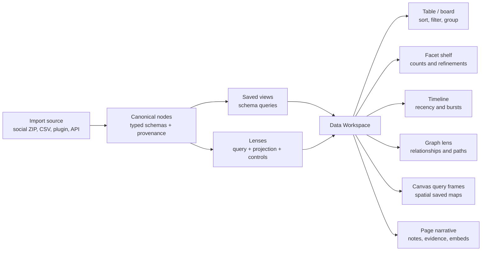
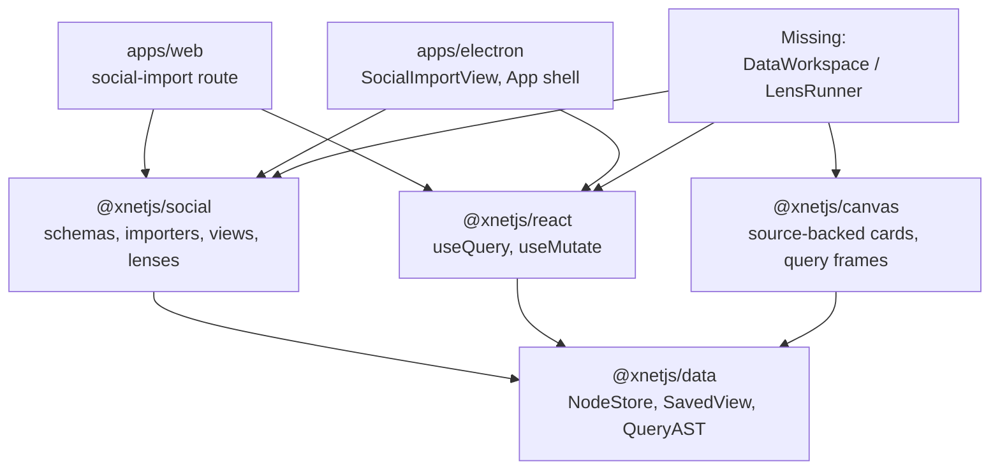
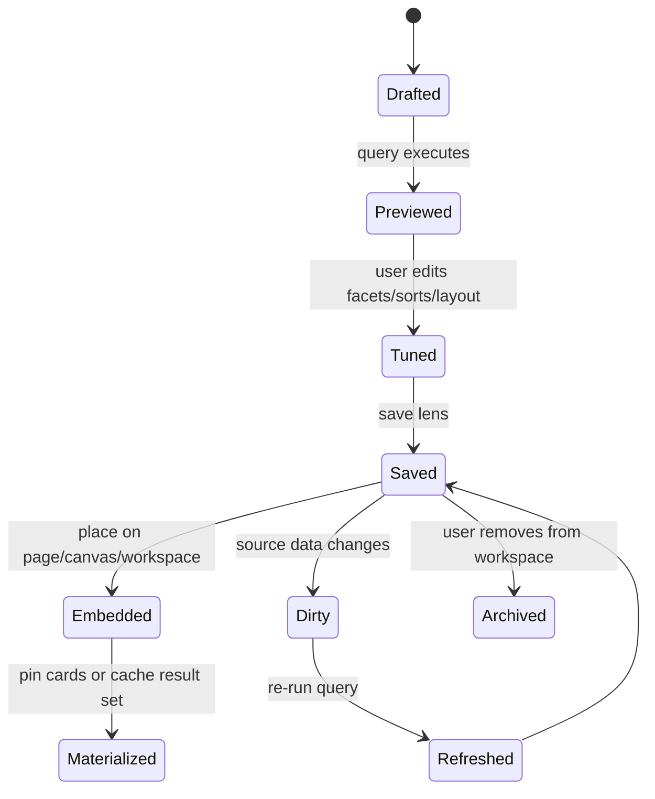
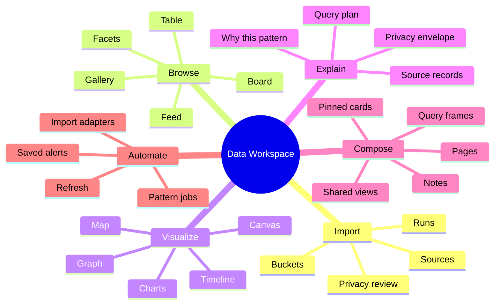
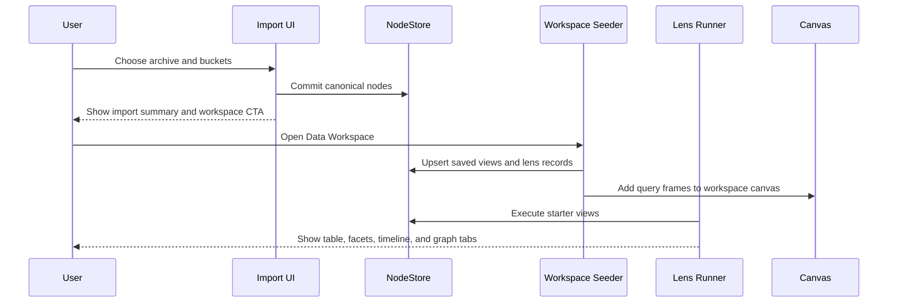
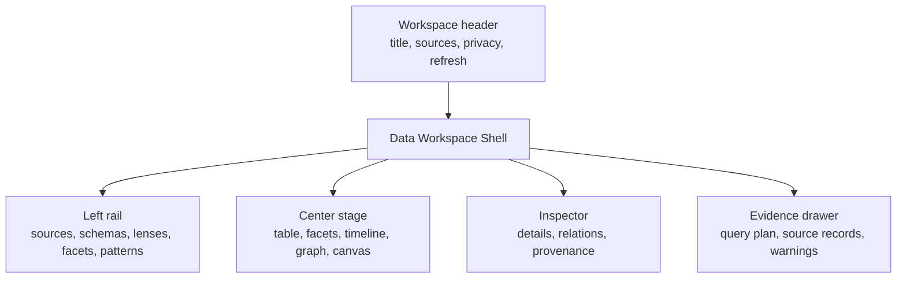
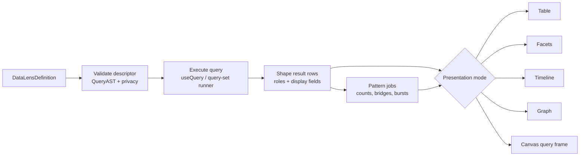

# 0153 - Social Data Workspace UI

**Status:** Exploration  
**Date:** 2026-06-07  
**Author:** Codex  
**Related:** [0150 - Unified Social Graph](./0150_%5B_%5D_UNIFIED_SOCIAL_GRAPH.md), [0151 - Self-Organizing Social Graph Immersive Recommendation Space](./0151_%5B_%5D_SELF_ORGANIZING_SOCIAL_GRAPH_IMMERSIVE_RECOMMENDATION_SPACE.md), [0152 - Actual Social Graph Importer](./0152_%5B_%5D_ACTUAL_SOCIAL_GRAPH_IMPORTER.md)

## Exploration Checklist

- [x] Compute the next exploration number.
- [x] Read the last three social explorations and use them as a jumping-off point.
- [x] Inspect the new social importer, browser import route, Electron import view, saved views,
      graph lenses, canvas projection helpers, database view, and canvas query-frame primitives.
- [x] Research external workspace, database-view, faceted-browse, linked-visualization, browser
      analytics, and graph-visualization patterns.
- [x] Explore a general-purpose data workspace UI that uses social imports as the first seed.
- [x] Produce recommendations, implementation checklist, validation checklist, diagrams, example
      code, and references.

## Problem Statement

The social importer now turns platform exports into canonical xNet social nodes across actors,
content, interactions, conversations, messages, collections, import runs, and source records.
That is useful infrastructure, but the visible product is still thin:

- The user can import archives in Electron and on the web.
- The import result can be committed as canonical social nodes.
- Default saved views, graph lenses, and canvas projection plans exist in `@xnetjs/social`.
- The app does not yet expose a durable post-import workspace where a person can browse, query,
  sort, filter, compare, visualize, annotate, and turn patterns into pages/databases/canvases.

The product question:

> What should xNet's UI look like when imported social data becomes the seed for a more general
> data workspace: one where any internet-derived data can be explored through tables, facets,
> timelines, graphs, canvases, and pages without trapping the user in a social-only dashboard?

The desired long-term feel is not "a Twitter archive viewer." It is closer to:

- a local-first data observatory,
- a database that can become a canvas,
- a canvas that can run queries,
- a page that can hold live lenses,
- and a graph explorer that can explain why a pattern surfaced.

## Executive Summary 🧭

xNet should make the next UI layer a **Data Workspace** system, with social data as the first
high-value dataset.

The core recommendation:

1. **Generalize the import landing from "Social Import" to "Import Sources."** Social archives are
   one importer family; the UI contract should already support future source packages.
2. **After every successful import, offer to create or update a Data Workspace.** The workspace
   should seed saved views, query frames, and starter lenses rather than leave records invisible.
3. **Make saved lenses first-class.** A lens should combine a query, presentation mode, controls,
   privacy envelope, provenance rules, materialization mode, and optional canvas layout.
4. **Use existing xNet surfaces as coordinated views.** Pages tell the story, databases give dense
   sortable inspection, canvases give spatial reasoning, and graph/timeline/facet lenses make
   patterns visible.
5. **Build a generic saved-view runner before a social-only dashboard.** Social `People`,
   `Content`, `Interactions`, `Messages`, `Collections`, and `Import Runs` should be ordinary
   saved schema views that the UI can render for any schema.
6. **Turn canvas query frames into live query containers.** The repo already has query-frame
   metadata and preview rendering. It needs execution, result cards, refresh behavior, and
   drag-to-materialize behavior.
7. **Surface patterns as explainable suggestions, not as opaque recommendations.** Pattern cards
   should cite query counts, graph paths, source records, privacy class, and how to save or dismiss
   the pattern.
8. **Normalize canonical data and denormalize surfaces.** The social graph should stay canonical,
   but view rows, facets, timelines, and projection snapshots should keep display/search fields for
   speed and clarity.

In product language:

> xNet should let a user import their internet, then immediately browse it like a database, move
> through it like a graph, arrange it like a canvas, and write with it like a page.



## Current State In The Repository 🔎

### What The Last Three Explorations Established

Observed from the prior documents:

| Exploration | Relevant conclusion                                                                                                                                            |
| ----------- | -------------------------------------------------------------------------------------------------------------------------------------------------------------- |
| `0150`      | Social archives should normalize into actors, content, interactions, and collections while keeping raw exports as private provenance.                          |
| `0151`      | The graph product should be lens-based: bounded, explainable, refreshable projections rather than one huge graph.                                              |
| `0152`      | The importer should be a hybrid canonical ETL pipeline with platform adapters, source records, default saved views, graph lenses, and canvas projection plans. |

The new implementation now confirms that direction. `@xnetjs/social` exists and already exports the
pieces needed to build the first UI layer.

### Social Importer Package

Observed repository facts:

- [`packages/social/README.md`](../../packages/social/README.md) describes the package as three
  layers: canonical schemas, import contracts, and query affordances.
- [`packages/social/src/schemas/index.ts`](../../packages/social/src/schemas/index.ts) exports the
  canonical schemas for imports, actors, identity claims, content, interactions, conversations,
  messages, collections, and collection items.
- [`packages/social/src/import/core.ts`](../../packages/social/src/import/core.ts) exports
  browser-safe archive detection, staging, privacy selection, telemetry, source-record sanitation,
  and commit helpers.
- [`packages/social/src/importers/index.ts`](../../packages/social/src/importers/index.ts) now
  includes Instagram, Grok, YouTube, X/Twitter, TikTok, Claude, and Reddit adapters.
- [`packages/social/src/views/defaults.ts`](../../packages/social/src/views/defaults.ts) creates
  default saved views for `People`, `Content`, `Interactions`, `Messages`, `Collections`, and
  `Import Runs`.
- [`packages/social/src/lenses/graph-lenses.ts`](../../packages/social/src/lenses/graph-lenses.ts)
  defines starter graph lenses such as `People I Follow`, `Saved Content By Creator`,
  `Conversation References`, and `AI Citations`.
- [`packages/social/src/projection/canvas.ts`](../../packages/social/src/projection/canvas.ts)
  creates bounded source-backed canvas projection plans from resolved social lens records.

Inference:

The data package is not just an importer anymore. It already has the beginnings of a data-workspace
model. The missing piece is a UI/runtime that executes those saved views and projections.

### Current Web Import Surface

Observed in [`apps/web/src/routes/social-import.tsx`](../../apps/web/src/routes/social-import.tsx):

- The route accepts ZIP files in the browser.
- It uses `readBrowserZipArchiveManifest`, `createSocialArchivePreview`,
  `createBrowserZipJsonEntryReader`, `createBrowserZipTextEntryReader`, and `stageSocialArchive`.
- It lists detected buckets, privacy classes, record counts, warnings, and ignored files.
- It supports `includeSensitive` and `includeSourceRecords`.
- It commits staged canonical nodes in batches through `useMutate`.
- It imports all social schemas locally to map staged drafts to actual create/update operations.

Current gap:

After commit, the page only reports created/updated records. It does not register default saved
views, open a workspace, create query frames, navigate to a data home, or make imported records
discoverable from the web home page.

### Current Electron Import Surface

Observed in
[`apps/electron/src/renderer/components/SocialImportView.tsx`](../../apps/electron/src/renderer/components/SocialImportView.tsx):

- Electron has a similar staging/review/commit UI.
- It uses the main-process archive picker and node ZIP readers through IPC.
- The view lives as an overlay state in
  [`apps/electron/src/renderer/App.tsx`](../../apps/electron/src/renderer/App.tsx).
- The command palette includes many canvas and document commands, and `Social Import` is an app
  shell state.

Current gap:

Electron can open the importer, but imported social data still does not appear as first-class
workspace material. The command palette does not yet expose "Open Data Workspace," "Create Lens,"
"Insert Query Frame," or "Open Social People View."

### Existing Data And Canvas Primitives

Observed repository facts:

- [`packages/data/src/schema/schemas/saved-view.ts`](../../packages/data/src/schema/schemas/saved-view.ts)
  defines `SavedViewSchema`, storing a JSON serialized `SavedViewDescriptor`.
- [`packages/data/src/store/query-ast.ts`](../../packages/data/src/store/query-ast.ts) defines
  query ASTs, query sets, aggregates, relation includes, saved view descriptors, validation, and
  aggregate execution over loaded rows.
- [`packages/react/src/hooks/useQuery.ts`](../../packages/react/src/hooks/useQuery.ts) can query a
  schema with filters, sorting, pagination, full-text search, materialized view options, execution
  metadata, and subscription state.
- [`apps/electron/src/renderer/components/DatabaseView.tsx`](../../apps/electron/src/renderer/components/DatabaseView.tsx)
  renders database documents as tables/boards using `@xnetjs/views`, but it is specific to
  `DatabaseSchema` and database rows.
- [`packages/canvas/src/frames/query-frames.ts`](../../packages/canvas/src/frames/query-frames.ts)
  defines query-backed canvas frame metadata: source, schema/database/view IDs, filters, sorts,
  limits, refresh mode, materialization mode, and result summaries.
- [`packages/canvas/src/nodes/CanvasPrimitiveNodeContent.tsx`](../../packages/canvas/src/nodes/CanvasPrimitiveNodeContent.tsx)
  already renders a query-frame preview with a result count and stale state.
- [`packages/canvas/src/ingestion.ts`](../../packages/canvas/src/ingestion.ts) creates
  source-backed canvas nodes for pages, databases, external references, media, notes, and internal
  dragged nodes.

Inference:

xNet already has the structural ingredients for a general data workspace:

- typed node storage,
- saved views,
- schema queries,
- database tables,
- source-backed canvas cards,
- query-frame metadata,
- and a command-driven shell.

The missing implementation is a **view runner** that can execute a saved descriptor and render it
across table, facet, chart, graph, timeline, and canvas surfaces.



## External Research 🌐

### Database Views And Work Surfaces

Notion's database view documentation is a strong product reference because each view has its own
layout, property visibility, filters, sorts, groups, sub-groups, and page-opening behavior such as
side peek, center peek, or full page. Source: [Notion views, filters, sorts and groups](https://www.notion.com/help/views-filters-and-sorts).

Airtable's view documentation highlights a similar model: one underlying table, many views with
different field visibility, filters, groups, sorts, colors, and layouts. Source:
[Airtable views](https://support.airtable.com/docs/en/getting-started-with-airtable-views).

Implication for xNet:

- xNet should not make a separate "social app" that owns its own navigation and data model.
- It should make underlying typed data explorable through many saved views.
- View settings should travel with the lens, not mutate the canonical data.

### Faceted Browsing

Datasette's facet model is directly relevant: a table can expose common values and counts for
chosen columns, and selecting a facet refines the visible rows. Source:
[Datasette facets](https://docs.datasette.io/en/stable/facets.html).

Implication for xNet:

- Every schema view should be able to show a facet shelf.
- Social data should expose facets such as `platform`, `contentKind`, `interactionKind`,
  `privacyClass`, `author`, `conversationKind`, `collectionKind`, and date buckets.
- Facets are a general primitive, useful for invoices, tasks, bookmarks, GitHub issues, CRM rows,
  research notes, music libraries, files, and social archives.

### Coordinated Views And Brushing

Vega-Lite's selection documentation shows selections in one view filtering another view, and
overview/detail views where a brush controls a scale domain. Source:
[Vega-Lite selections](https://vega.github.io/vega-lite-v2/docs/selection.html).

UW's Mosaic work is even closer to the desired architecture: selections become query predicates
that coordinate visualizations and input widgets, with pre-aggregation and optimization for large
interactive data. Sources: [What is Mosaic?](https://idl.uw.edu/mosaic/what-is-mosaic/) and
[Mosaic Selections](https://idl.uw.edu/papers/mosaic-selections).

Implication for xNet:

- The fun part should come from linked interaction, not decorative UI.
- Clicking a creator cluster should filter the table.
- Brushing a timeline should refine the graph.
- Selecting a platform facet should recolor the canvas cards.
- Saving that interaction state should create a lens.

### Browser Analytics

DuckDB-Wasm runs DuckDB in the browser, making local analytical SQL over browser data plausible.
Source: [DuckDB Wasm overview](https://duckdb.org/docs/stable/clients/wasm/overview).

Implication for xNet:

- The first implementation should use NodeStore and existing query hooks.
- For very large imported archives, a future derived analytics engine could materialize columnar
  extracts in a worker and compute facets, histograms, cross-tabs, and graph features locally.
- This should remain derived/cache data, not the canonical store.

### Tables, Faceting, And Virtualization

TanStack Table documents column filtering, global filtering, faceting, grouping, pagination, row
selection, row pinning, sorting, and virtualization as separate table features. Source:
[TanStack Table filter APIs](https://tanstack.com/table/v8/docs/api/features/filters?from=reactTableV7).

Implication for xNet:

- Dense result inspection needs controlled table state, virtualization, column visibility, facets,
  row expansion, and side/inspector panes.
- xNet's existing `@xnetjs/views` table/board surface may be extended, but the key product
  primitive is controlled view state tied to a saved lens descriptor.

### Browser Graph Visualization

Sigma.js uses Graphology as its graph model, and its rendering docs describe WebGL rendering for
smooth performance with tens of thousands of nodes and edges. Sources:
[Sigma graph data](https://www.sigmajs.org/docs/advanced/data/) and
[Sigma rendering](https://v4.sigmajs.org/concepts/rendering/).

Implication for xNet:

- The existing canvas is the right durable workspace.
- A dedicated graph renderer is still useful for large, fluid graph exploration.
- The UI should distinguish "saved canvas map" from "live graph lens." The former is durable and
  editable; the latter is a fast projection over query results.

## Key Findings

### 1. Social Is The Seed, Not The Product Boundary

The importer gives xNet a rich dataset with:

- multiple schemas,
- public and private data,
- source provenance,
- relation edges,
- high-volume rows,
- messages and conversations,
- media references,
- and cross-platform identity ambiguity.

That is exactly the right stress test for a general data workspace. But the UI should avoid naming
every new concept "social." The same machinery should later handle:

- GitHub repositories, issues, commits, PRs, comments, and stars,
- music libraries, artists, albums, playlists, listening history, and favorites,
- browser bookmarks and reading history,
- email, contacts, calendar, and CRM records,
- research papers, citations, highlights, and notes,
- files, folders, tags, and project references,
- local databases, spreadsheets, and imported CSVs.

Recommended naming:

- **Import Source**: any adapter that stages source data into xNet nodes.
- **Data Workspace**: a saved, navigable working area over typed data.
- **Lens**: a saved query plus presentation, controls, and provenance.
- **Projection**: a materialized visual/layout result from a lens.
- **Pattern**: an explainable derived finding that can be saved, dismissed, or opened.

### 2. Lenses Should Be First-Class Product Objects

Current social graph lenses are TypeScript definitions. They should become user-visible objects.

A lens should include:

| Field             | Purpose                                                                               |
| ----------------- | ------------------------------------------------------------------------------------- |
| Query             | Query AST or query set over typed schemas.                                            |
| Result role map   | Defines what rows mean: actor, content, interaction, message, collection, etc.        |
| Presentation mode | Table, board, facets, timeline, graph, canvas, chart, feed, or mixed dashboard.       |
| Controls          | Visible filters, facets, sorts, grouping, search, date range, privacy toggles.        |
| Projection        | Layout axes, graph edge rules, card type, color scale, size scale, clustering config. |
| Privacy envelope  | Highest privacy class, sensitive schema involvement, source-record rules.             |
| Materialization   | Virtual, pinned cards, synced cards, cached result set, or analytics extract.         |
| Provenance        | Import runs, source records, adapter versions, and confidence notes.                  |
| Pattern hooks     | Which counts, clusters, bridges, bursts, or overlaps should be surfaced.              |

This goes beyond `SavedViewSchema`, but it can build on it. A lens can store a `SavedViewDescriptor`
as its query core and add workspace-specific presentation metadata.



### 3. The Best First UI Is A Coordinated Workspace, Not A New Dashboard

A social-only dashboard would be tempting:

- top cards for counts,
- tabs for people/content/messages,
- graph widget,
- import history.

That would be useful, but it would teach the product the wrong thing. xNet already has pages,
databases, and canvases. The stronger design is:

- A **Data Workspace** is a page-like shell that can contain lenses.
- Each lens can open as a dense database-like table, a facet browser, a graph, a timeline, or a
  canvas query frame.
- Results can be dragged between modes.
- A row can become a canvas card.
- A canvas cluster can become a saved lens.
- A lens can be embedded in a page.
- A page can cite the source records behind the lens.



### 4. The First Post-Import Experience Should Be Concrete

After a social import commits, the UI should offer:

1. **Open Data Workspace**
2. **Review Imported Data**
3. **Create Canvas Map**
4. **Close**

`Open Data Workspace` should create or update a workspace with:

- `People`: saved schema view over `SocialActor`.
- `Content`: saved schema view over `SocialContent`.
- `Interactions`: saved schema view over `SocialInteraction`.
- `Messages`: saved schema view over `SocialMessage`, private by default.
- `Collections`: saved schema view over `SocialCollection`.
- `Import Runs`: saved schema view over `SocialImportRun`.
- Starter lenses:
  - `People I Follow`
  - `Saved Content By Creator`
  - `Conversation References`
  - `AI Citations`
- Starter pattern cards:
  - "Most repeated creators"
  - "Saved-but-unrevisited content"
  - "Cross-platform actors"
  - "Conversation links also seen in social content"
  - "Private-message-heavy clusters hidden by default"

The user should see something immediately useful without configuring schemas.



### 5. Data Should Be Visible In Multiple Dimensions

The workspace should let a user pivot the same result set through dimensions:

| Dimension    | Social example                         | General data example                   | UI mode               |
| ------------ | -------------------------------------- | -------------------------------------- | --------------------- |
| Entity       | Creator, account, subreddit, assistant | Company, repo, person, document        | People/table/detail   |
| Content      | Post, video, comment, AI response      | File, issue, note, invoice             | Feed/gallery/table    |
| Relationship | Follow, like, cite, reply, save        | References, depends on, owns, mentions | Graph/canvas          |
| Time         | Liked at, posted at, imported at       | Created, modified, due, published      | Timeline/histogram    |
| Source       | Instagram, Reddit, YouTube, Claude     | GitHub, filesystem, spreadsheet        | Facets/source rail    |
| Privacy      | Public, private, third-party private   | Internal, confidential, shared         | Privacy chips/filter  |
| Confidence   | Exact ID, URL match, inferred identity | Exact key, fuzzy match, AI label       | Inspector/explanation |
| Attention    | Repeated saves, likes, replies         | Open count, edits, comments            | Pattern shelf         |
| Semantics    | Topic, embedding cluster, AI label     | Category, project, tag                 | Cluster graph/chart   |

The UI should treat these as composable controls:

- facet shelf for categorical dimensions,
- timeline brush for time,
- graph neighborhood slider for relation depth,
- query text for full-text search,
- sort controls for ranking,
- privacy toggles for sensitive data,
- "show evidence" for provenance.

### 6. Patterns Should Surface As Query-Backed Suggestions

Patterns should not be magic notifications. They should be saved query suggestions with evidence.

Good first social patterns:

- **Repeated Creators:** actors with many saved/liked/commented targets.
- **Bridge Actors:** actors connected to multiple clusters or platforms.
- **Unrevisited Saves:** saved content with no later view/open/reference.
- **Cross-Source Overlap:** URLs or creators seen in both AI chats and social content.
- **Conversation Gravity:** people or links repeatedly present in private conversations.
- **Attention Bursts:** time windows with unusual save/comment/view activity.
- **Identity Candidates:** same handle/profile URL across platforms, marked as candidates.
- **Privacy Hotspots:** clusters where most evidence is third-party-private.

Each pattern card should answer:

- What changed or stood out?
- How many records support it?
- Which query produced it?
- Which source runs contributed?
- What privacy classes are involved?
- What can the user do: open, save, hide, pin to canvas, write a page, share a redacted view?

### 7. Query Frames Are The Bridge Between Canvas And Databases

Canvas query frames are currently metadata and preview UI. They can become the center of the
general workspace.

A query frame should:

- hold a saved view or lens reference,
- show live result count,
- optionally render top result cards,
- support refresh modes: manual, on-open, live,
- support materialization: virtual, pinned cards, synced cards,
- let the user drag results out into durable cards,
- keep a privacy envelope visible,
- let linked selections from the frame filter sibling frames.

This creates a powerful loop:

1. Search or facet a table.
2. Save it as a lens.
3. Place it as a query frame on a canvas.
4. Drag important rows out as cards.
5. Connect cards and annotate them.
6. Convert the arrangement into a page or a frozen projection.

### 8. The Graph View Should Start Small And Explainable

The existing `createSocialCanvasProjectionPlan` caps projections by default. That is the right
behavior for canvas. A canvas map should be a curated bounded projection, not the full archive.

Recommended graph levels:

| Level             | UI                            |         Scale | Purpose                                          |
| ----------------- | ----------------------------- | ------------: | ------------------------------------------------ |
| Ego graph         | Inline lens graph             |  25-200 nodes | Explain one person/topic/content item.           |
| Canvas projection | Source-backed cards and edges |  25-150 cards | Durable reasoning map.                           |
| Graph atlas       | WebGL graph renderer          |  1k-50k nodes | Fluid exploration and clustering.                |
| Analytics worker  | Derived metrics/cache         | 100k+ records | Facets, histograms, clusters, nearest neighbors. |

Start with ego graphs and canvas projections. Add a Sigma/Graphology or custom WebGL atlas later
when the saved-lens workflow proves valuable.

### 9. Normalize The Core, Denormalize The Surfaces

The canonical social model should remain normalized:

- actors,
- identity claims,
- content,
- interactions,
- conversations,
- messages,
- collections,
- collection items,
- import runs,
- source records.

But UI surfaces should denormalize:

- display title,
- subtitle,
- platform icon/name,
- author handle,
- target title,
- privacy class,
- source archive,
- timestamps,
- relation counts,
- search snippets,
- thumbnail/reference metadata,
- pattern score,
- cluster label.

This is not a contradiction. Canonical nodes preserve correctness and reprocessing. Lens result rows
and projection cards are optimized for fast human inspection.

### 10. Privacy Needs To Be Part Of The Lens Chrome

Social imports contain third-party private records. A beautiful data workspace becomes dangerous if
privacy disappears once data is visualized.

Every lens should show:

- highest privacy class in the current result set,
- whether source records are included,
- whether private messages are included,
- whether third-party-private data is present,
- whether the lens can be shared,
- what would be redacted if exported or published.

Suggested UI behavior:

- Private-message lenses are off by default.
- A graph containing private-message edges should show a privacy chip in the toolbar.
- Canvas cards sourced from sensitive records should have a quiet but visible lock marker.
- Sharing a workspace should force a redaction review.
- Pattern cards with private evidence should show aggregate counts before raw details.

## Options And Tradeoffs

### Option A: Build A Social-Only Dashboard

Build `/social` with tabs for people, content, interactions, messages, and graph.

Benefits:

- Fastest to demo after importer work.
- Easy to tailor labels and affordances to social archives.
- Lower abstraction burden.

Costs:

- Creates a parallel product surface.
- Duplicates database/table/canvas concepts.
- Does not help future imports beyond social.
- Makes social data feel separate from pages, databases, and canvases.

Verdict:

Use only as a temporary route if needed. It should be a thin composition over general data-workspace
primitives, not a bespoke app.

### Option B: Convert Social Data Into Database Rows

Materialize `People`, `Content`, and `Interactions` as actual database documents with rows.

Benefits:

- Reuses current `DatabaseView` quickly.
- Users already understand table/board views.
- Dragging database documents onto canvas already works.

Costs:

- Duplicates canonical social nodes.
- Makes re-import and dedupe harder.
- Forces imported data into row-cell semantics.
- Loses graph identity unless every row links back to canonical nodes.

Verdict:

Do not use as the source of truth. Allow optional generated database documents as derived
workspaces, but prefer saved schema views over canonical social schemas.

### Option C: Build A Generic Saved View Runner

Render `SavedViewSchema` descriptors and `@xnetjs/social` lens descriptors through a shared
`DataWorkspace` UI.

Benefits:

- Works for social, GitHub, music, files, tasks, and future imports.
- Builds directly on QueryAST and `useQuery`.
- Lets databases and canvases become views over typed data.
- Makes query frames executable.

Costs:

- Requires a new runtime layer.
- Current `DatabaseView` is row-document-specific and must be generalized or wrapped.
- QueryAST execution in React may need a new hook for query sets and relation includes.

Verdict:

This is the recommended path.

### Option D: Jump Straight To A WebGL Graph Atlas

Use Sigma.js, Graphology, or another graph renderer to make a large graph exploration mode.

Benefits:

- Visually compelling.
- Great for social graph demos.
- Handles larger graphs than DOM canvas cards.

Costs:

- Does not solve table/facet/query/detail workflows.
- Can become spectacle before utility.
- Requires separate layout, selection, evidence, and privacy plumbing.

Verdict:

Plan it, but do not lead with it. Build graph lenses and evidence first, then add the atlas as one
presentation mode.

## Recommendation ✅

Build **Data Workspace V1** as a general product layer, with social imports as the first seed.

### Product Shape

The first workspace should have:

- **Header:** title, source count, record count, privacy envelope, refresh/import actions.
- **Left rail:** sources, schemas, saved lenses, facets, patterns.
- **Center:** selected lens in table, facet, timeline, graph, canvas, or page mode.
- **Right inspector:** selected row/card details, relationships, provenance, source records, privacy.
- **Bottom drawer:** query plan, import run, warnings, pattern evidence, or batch actions.



### Social Workspace Starter

For the current importer, the first workspace should be:

- **Overview:** import runs, total records, platforms, privacy summary.
- **People:** all social actors with platform, handle, display name, interaction counts.
- **Content:** posts/videos/comments/links/responses with platform, kind, title, author, time.
- **Interactions:** likes/saves/follows/views/citations/comments with source, actor, target, time.
- **Messages:** separate private view, opt-in open.
- **Collections:** playlists, saved folders, projects, lists, subscriptions.
- **Graph:** starter lenses from `createSocialGraphLenses`.
- **Canvas:** query frames for the default views plus one "Saved Content By Creator" projection.

### Generalization Beyond Social

The same `DataWorkspace` should later support:

- `GitHub Workspace`: issues, PRs, commits, repos, contributors, labels, review comments.
- `Music Workspace`: artists, tracks, albums, playlists, listens, likes, skips.
- `Reading Workspace`: bookmarks, articles, highlights, notes, citations, authors.
- `Files Workspace`: documents, folders, tags, projects, references.
- `CRM Workspace`: people, companies, conversations, deals, tasks.

The difference should be importer schemas and starter lenses, not a new UI architecture each time.

## Proposed Architecture

### New General Concepts

```ts
type DataLensPresentation =
  | 'table'
  | 'board'
  | 'facet-browser'
  | 'timeline'
  | 'graph'
  | 'canvas'
  | 'chart'
  | 'feed'

type DataLensDefinition = {
  id: string
  title: string
  description?: string
  savedViewId?: string
  descriptor: SavedViewDescriptor
  presentation: {
    defaultMode: DataLensPresentation
    availableModes: DataLensPresentation[]
    primaryTitleField?: string
    subtitleFields?: string[]
    colorField?: string
    sizeField?: string
    timeField?: string
  }
  controls: {
    facets: Array<{ field: string; label: string; kind: 'value' | 'date' | 'range' }>
    sorts: Array<{ field: string; label: string; direction: 'asc' | 'desc' }>
    searchFields?: string[]
  }
  privacy: {
    maxPrivacyClass?: string
    includeSensitiveDefault: boolean
    shareable: boolean
  }
  materialization: {
    mode: 'virtual' | 'cached' | 'pinned-cards' | 'synced-cards'
    maxResults: number
  }
}
```

This does not need to replace `SavedViewSchema`. It can be a higher-level workspace object that
contains or references a saved view descriptor.

### Runtime Flow



### Relationship To Existing Code

| Existing code               | Proposed use                                                                       |
| --------------------------- | ---------------------------------------------------------------------------------- |
| `SavedViewSchema`           | Persist query descriptors for any schema or query set.                             |
| `QueryAST`                  | Keep as the query contract for saved views and lenses.                             |
| `useQuery`                  | Continue as the schema-query runner. Add a query-AST/query-set wrapper.            |
| `DatabaseView`              | Keep for true database documents; extract reusable table surface for schema views. |
| `@xnetjs/social/views`      | Seed default saved views after social import.                                      |
| `@xnetjs/social/lenses`     | Seed first graph/mixed data lenses.                                                |
| `@xnetjs/social/projection` | Build bounded source-backed canvas projection plans.                               |
| `CanvasQueryFrame`          | Become the canvas-side representation of a saved lens.                             |
| `CanvasView`                | Insert query frames and materialized source-backed result cards.                   |
| Web `/social-import`        | Add post-commit workspace creation and navigation.                                 |
| Electron `SocialImportView` | Add same post-commit workspace action and command-palette entries.                 |

## UX Sketch

### Import Completion

After committing records:

```text
Imported 13,987 records from Reddit

[Open Data Workspace] [Review Imported Data] [Create Canvas Map] [Close]

Privacy: private data included, source records not committed
Views ready: People, Content, Interactions, Messages, Collections, Import Runs
Starter lenses: People I Follow, Saved Content By Creator, Conversation References
```

### Workspace Layout

```text
┌──────────────────────────────────────────────────────────────────────────────┐
│ Social Data Workspace                         7 platforms · 52k records 🔒  │
├───────────────┬───────────────────────────────────────────────┬──────────────┤
│ Sources       │ Lens: Saved Content By Creator                │ Inspector    │
│ Instagram     │ [Table] [Facets] [Timeline] [Graph] [Canvas]  │ Creator      │
│ Reddit        │                                               │ @example     │
│ YouTube       │ Platform  Kind  Title             Author Time │              │
│ Claude        │ IG        save  Reel about...     ...    ...  │ Relations    │
│               │ Reddit    save  Thread about...   ...    ...  │ 42 saves     │
│ Lenses        │ YouTube   like  Video about...    ...    ...  │ 7 comments   │
│ People        │                                               │              │
│ Content       │ Facets: platform, kind, author, privacy       │ Evidence     │
│ Interactions  │ Patterns: repeated creators, overlap, bursts  │ import run   │
└───────────────┴───────────────────────────────────────────────┴──────────────┘
```

The exact styling should follow the current work-focused xNet shell: dense, readable, restrained,
and oriented around repeated use. The "fun" should come from smooth transitions, linked
interactions, satisfying graph/canvas expansion, and pattern discovery, not from oversized hero
sections or ornamental surfaces.

### Interaction Patterns

- Clicking a facet filters all active workspace views.
- Brushing a timeline narrows the table and graph.
- Selecting a graph node opens the inspector and highlights related table rows.
- Dragging a result row into the canvas creates a source-backed card.
- Dragging a lens into the canvas creates a query frame.
- Pinning graph nodes creates durable canvas cards.
- Opening a pattern runs its source query and shows why it was suggested.
- Saving a filtered state creates a new lens.

## Implementation Checklist

### Phase 1: Make Imported Social Data Visible

- [x] Add a post-commit CTA in the web social import route to create/open a workspace.
- [x] Add the same post-commit CTA in Electron `SocialImportView`.
- [x] Upsert default social saved views from `createDefaultSocialSavedViews`.
- [x] Upsert starter social graph lenses from `createSocialGraphLenses`.
- [x] Add a "Data Workspace" entry to the web home page once saved views or import runs exist.
- [x] Add Electron command-palette actions for opening the data workspace and social starter views.

### Phase 2: Build A Generic Saved View Runner

- [x] Add a React hook that executes a `SavedViewDescriptor` or QueryAST node query.
- [x] Add query-set execution for multi-query dashboard lenses.
- [x] Return row roles, schema IDs, page info, plan metadata, and privacy summaries.
- [x] Validate descriptors before execution and show invalid-view diagnostics.
- [x] Add reusable table rendering for schema query results, separate from database-row CRUD.
- [x] Support search, sort, pagination, column visibility, and row expansion.

### Phase 3: Add Facets, Timeline, And Inspector

- [x] Add a facet shelf that computes value counts for selected schema fields.
- [x] Add date-bucket facets and timeline brushing.
- [x] Add a right inspector that can show fields, relations, source records, and import runs.
- [x] Add privacy chips and sensitive-result warnings to the lens toolbar.
- [x] Add "save current filters as lens" from table/facet/timeline state.

### Phase 4: Wire Canvas Query Frames

- [x] Add an app command to insert a saved lens as a canvas query frame.
- [x] Execute query frames and update `queryResultSummary`.
- [x] Render top result cards inside query frames or adjacent to them.
- [x] Let users drag virtual results out as pinned source-backed canvas cards.
- [x] Convert `createSocialCanvasProjectionPlan` output into actual canvas nodes and semantic edges.
- [x] Add refresh behavior for manual, on-open, and live query frames.

### Phase 5: Pattern Surfacing

- [ ] Add a small pattern-definition API over query results and relation counts.
- [ ] Implement first social patterns: repeated creators, bridge actors, cross-source overlap,
      attention bursts, unrevisited saves, and privacy hotspots.
- [ ] Store pattern suggestions as dismissible workspace state.
- [ ] Show evidence counts, source import runs, and privacy envelope for every pattern.
- [ ] Let users open, save, hide, or pin a pattern to canvas.

### Phase 6: Scale And Generalize

- [ ] Move expensive browser archive staging and lens aggregation into workers where needed.
- [ ] Add materialized facet/count caches for high-volume imports.
- [ ] Add a general importer registry UI so future packages can plug into the same flow.
- [ ] Add a graph atlas prototype only after table/facet/canvas lenses are useful.
- [ ] Consider a derived DuckDB-Wasm or columnar analytics cache for large local datasets.

## Validation Checklist

- [ ] Import a small sanitized social fixture in the web UI and confirm the workspace CTA appears.
- [ ] Import a larger archive in Electron and confirm saved views/lenses are upserted idempotently.
- [ ] Verify default views show records for each imported social schema.
- [ ] Verify sensitive/message views remain opt-in and carry privacy indicators.
- [ ] Verify a saved lens can render in table mode with search, sort, and pagination.
- [ ] Verify facet selections update the table and can be saved as a new lens.
- [ ] Verify a timeline brush filters the result set without losing selection state.
- [ ] Verify a graph lens selection opens the same source record in the inspector.
- [ ] Verify a canvas query frame updates result counts and stale state.
- [ ] Verify dragging a result row creates a source-backed canvas card with the correct schema/source.
- [ ] Verify generated canvas projection plans obey node/edge caps and privacy labeling.
- [ ] Run targeted unit tests for view descriptors, lens runtime, pattern definitions, and projection
      insertion.
- [x] Run web and Electron type checks after UI integration.
- [ ] Manually verify the web and Electron flows with browser/Electron automation and then stop all
      dev servers.

## Example Code

### Seeding A Social Workspace After Import

This example sketches the intended integration point after `stageResult` has been committed. It
keeps the UI generic by storing saved views and lens metadata instead of generating social-only
database rows.

```ts
import { SavedViewSchema } from '@xnetjs/data'
import { createDefaultSocialSavedViews } from '@xnetjs/social/views'
import { createSocialGraphLenses } from '@xnetjs/social/lenses'

type WorkspaceSeedOperation =
  | {
      type: 'create-saved-view'
      id: string
      title: string
      description: string
      descriptor: string
      scope: 'user' | 'workspace' | 'database'
    }
  | {
      type: 'create-lens'
      id: string
      title: string
      descriptor: string
      presentation: 'table' | 'facet-browser' | 'timeline' | 'graph' | 'canvas'
    }

export function createSocialWorkspaceSeedOperations(input: {
  workspaceId: string
  pageSize?: number
}): WorkspaceSeedOperation[] {
  const savedViews = createDefaultSocialSavedViews({
    scope: 'workspace',
    pageSize: input.pageSize ?? 100
  }).map((view) => ({
    type: 'create-saved-view' as const,
    id: `${input.workspaceId}:${view.id}`,
    title: view.title,
    description: view.description,
    descriptor: JSON.stringify(view.descriptor),
    scope: view.savedViewProperties.scope
  }))

  const lenses = createSocialGraphLenses({
    scope: 'workspace',
    pageSize: input.pageSize ?? 250
  }).map((lens) => ({
    type: 'create-lens' as const,
    id: `${input.workspaceId}:${lens.id}`,
    title: lens.title,
    descriptor: JSON.stringify(lens.descriptor),
    presentation: 'graph' as const
  }))

  return [...savedViews, ...lenses]
}

export function savedViewCreateOp(
  operation: Extract<WorkspaceSeedOperation, { type: 'create-saved-view' }>
) {
  return {
    type: 'create',
    id: operation.id,
    schema: SavedViewSchema,
    data: {
      title: operation.title,
      description: operation.description,
      descriptor: operation.descriptor,
      scope: operation.scope
    }
  }
}
```

### Executing A Saved Lens

The missing hook can begin as a thin bridge from saved descriptors to existing schema queries, then
grow into query-set, relation-include, aggregate, and materialized execution.

```ts
type UseLensResult<TRecord> = {
  rows: TRecord[]
  totalCount: number | null
  loading: boolean
  privacy: {
    maxPrivacyClass: string | null
    sensitiveCount: number
  }
  plan: {
    strategy?: string
    durationMs?: number
    materializedViewId?: string
  } | null
}

function useLens<TRecord>(lens: DataLensDefinition): UseLensResult<TRecord> {
  // V1 can support single-node queries by mapping the QueryAST descriptor
  // to the existing useQuery schema/filter shape.
  // V2 should execute query sets, relation includes, and aggregates.
  // V3 can add worker-backed facets and graph projections.
  return {
    rows: [],
    totalCount: null,
    loading: false,
    privacy: { maxPrivacyClass: null, sensitiveCount: 0 },
    plan: null
  }
}
```

## Risks And Unknowns

- **QueryAST runtime gap:** The repo has descriptors and validators, but the UI needs a robust
  runner for saved descriptors and query sets.
- **DatabaseView coupling:** Current database UI is document-row-oriented. Extracting a generic
  table surface may require careful boundaries with `@xnetjs/views`.
- **Privacy leakage:** Lens sharing, pattern summaries, graph edges, and canvas cards can reveal
  sensitive information even when message text is hidden.
- **Large browser imports:** Web ZIP staging can be memory-heavy. Workerization and streaming
  constraints need testing against large archives.
- **Over-visualization:** A graph atlas can distract from core query/detail workflows. Keep it as
  one presentation mode.
- **Pattern quality:** Bad recommendations erode trust. Pattern cards must be evidence-first and
  dismissible.
- **Generalization tax:** Going generic is harder than a social dashboard. The payoff is that it
  makes every future importer more valuable.

## Next Actions

1. Implement a minimal post-import workspace seed in the web UI.
2. Persist default social saved views after import and add a route to list them.
3. Build a generic saved-view result surface for schema queries.
4. Add a facet shelf and inspector for social saved views.
5. Wire one social graph lens into a canvas query frame.
6. Only then decide whether the next renderer should be a graph atlas prototype or deeper
   database/canvas integration.

## References

- [0150 - Unified Social Graph](./0150_%5B_%5D_UNIFIED_SOCIAL_GRAPH.md)
- [0151 - Self-Organizing Social Graph Immersive Recommendation Space](./0151_%5B_%5D_SELF_ORGANIZING_SOCIAL_GRAPH_IMMERSIVE_RECOMMENDATION_SPACE.md)
- [0152 - Actual Social Graph Importer](./0152_%5B_%5D_ACTUAL_SOCIAL_GRAPH_IMPORTER.md)
- [`packages/social/README.md`](../../packages/social/README.md)
- [`packages/social/src/views/defaults.ts`](../../packages/social/src/views/defaults.ts)
- [`packages/social/src/lenses/graph-lenses.ts`](../../packages/social/src/lenses/graph-lenses.ts)
- [`packages/social/src/projection/canvas.ts`](../../packages/social/src/projection/canvas.ts)
- [`apps/web/src/routes/social-import.tsx`](../../apps/web/src/routes/social-import.tsx)
- [`apps/electron/src/renderer/components/SocialImportView.tsx`](../../apps/electron/src/renderer/components/SocialImportView.tsx)
- [`packages/data/src/schema/schemas/saved-view.ts`](../../packages/data/src/schema/schemas/saved-view.ts)
- [`packages/data/src/store/query-ast.ts`](../../packages/data/src/store/query-ast.ts)
- [`packages/canvas/src/frames/query-frames.ts`](../../packages/canvas/src/frames/query-frames.ts)
- [Notion views, filters, sorts and groups](https://www.notion.com/help/views-filters-and-sorts)
- [Airtable views](https://support.airtable.com/docs/en/getting-started-with-airtable-views)
- [Datasette facets](https://docs.datasette.io/en/stable/facets.html)
- [Vega-Lite selections](https://vega.github.io/vega-lite-v2/docs/selection.html)
- [UW Mosaic overview](https://idl.uw.edu/mosaic/what-is-mosaic/)
- [Mosaic Selections](https://idl.uw.edu/papers/mosaic-selections)
- [DuckDB Wasm overview](https://duckdb.org/docs/stable/clients/wasm/overview)
- [TanStack Table filter APIs](https://tanstack.com/table/v8/docs/api/features/filters?from=reactTableV7)
- [Sigma graph data](https://www.sigmajs.org/docs/advanced/data/)
- [Sigma rendering](https://v4.sigmajs.org/concepts/rendering/)
