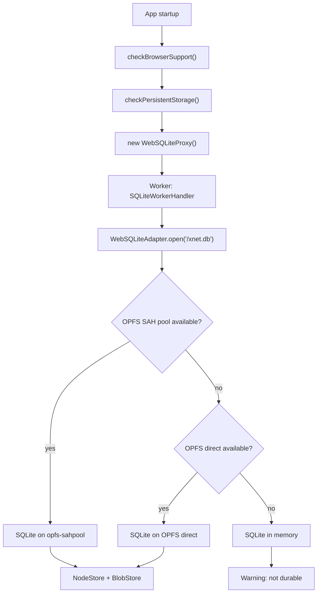
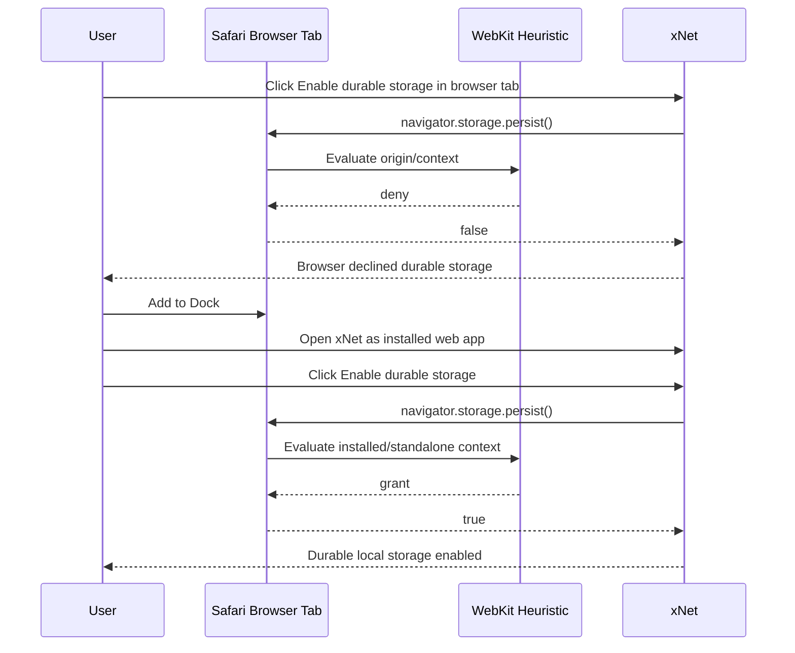
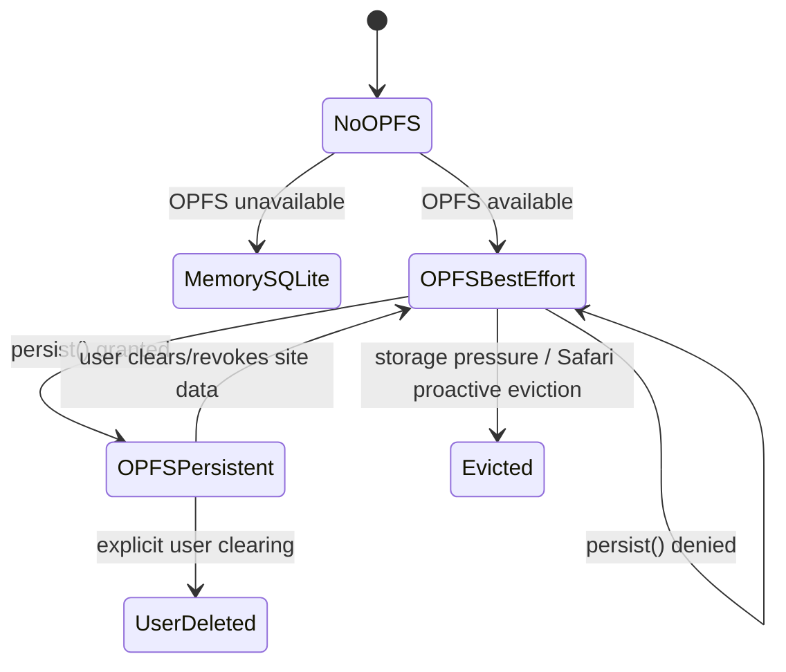
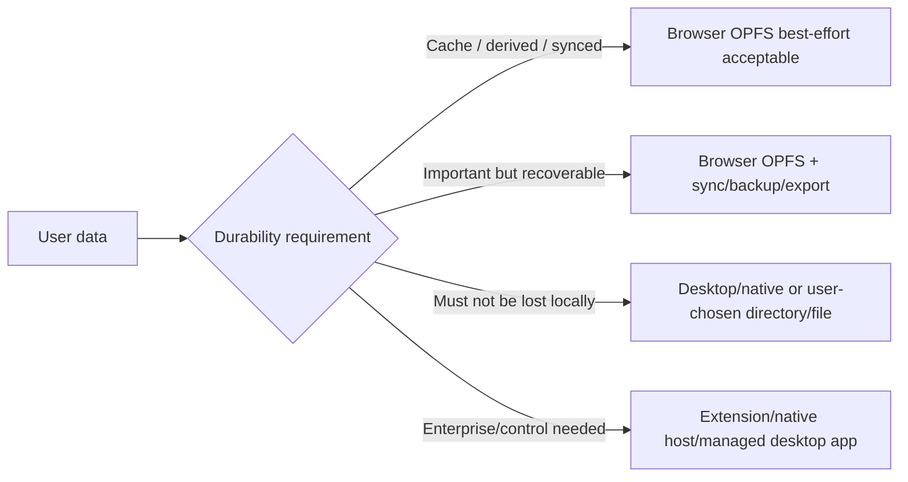

# SQLite OPFS Durable Storage Browser Consistency

## Problem Statement

xNet Web depends on SQLite running in browser storage. The current implementation can open SQLite with OPFS in modern browsers, but browser durable-storage permission is inconsistent. In Safari, clicking **Add to Dock**, reopening the installed web app, and then clicking **Enable durable storage** succeeds. The same request from the normal browser tab can return `false`. Similar silent denial can happen in Chrome/Edge depending on browser heuristics.

The product question is: **can xNet enable durable storage without requiring Add to Dock, and what architecture gives SQLite and local data the most consistent behavior across Safari, Chrome, Firefox, localhost, production, installed PWAs, desktop, and other environments?**

Short answer: **not reliably through the web platform alone.** The standard API is intentionally a request, not a command. Browser vendors decide whether to grant persistent mode. We can improve the timing, UX, diagnostics, installability, and fallbacks, but true guaranteed durability requires either a native shell, browser extension permissions, user-chosen file/directory storage where supported, or server/peer backup.

## Executive Summary

- ✅ **Observed behavior matches WebKit policy.** WebKit says `navigator.storage.persist()` is granted by heuristics such as whether the website is opened as a Home Screen Web App. Add to Dock changes the app context and satisfies that heuristic.
- ✅ **OPFS availability and durable-storage mode are different things.** OPFS can work while the origin remains in best-effort mode. SQLite can store data in OPFS, but the browser may still evict the entire origin under pressure or inactivity.
- ❌ **There is no standards-compliant way to force persistent mode from a normal web page.** `persist()` returns `true` or `false`; Chrome/Safari may silently deny without a user prompt.
- ⚠️ **Production HTTPS helps but does not guarantee success.** Secure context is required, but the grant still depends on browser-specific policy, profile state, engagement, install/bookmark status, private mode, and sometimes standalone/PWA context.
- 🧭 **Best near-term path:** keep SQLite OPFS as the fast local database, make durability state explicit, guide users into install/standalone when the browser requires it, and add a diagnostics/test matrix so we can measure actual browser behavior across deployment targets.
- 🧱 **Best long-term path:** treat browser OPFS as a cacheable local replica, not the only durable copy. Pair it with xNet sync/export/backup. For “must never lose this” local-only workflows, provide Desktop or user-chosen directory/file storage.

## Current State in the Repository

### Web SQLite Stack

The web app initializes storage in [apps/web/src/App.tsx](/Users/crs/Code/xNet/apps/web/src/App.tsx):

- `checkBrowserSupport()` validates Web Workers and OPFS APIs.
- `checkPersistentStorage()` checks durable-storage state without requesting it on startup.
- `WebSQLiteProxy` starts a module worker.
- The worker opens `WebSQLiteAdapter`.
- `SQLiteNodeStorageAdapter` and `SQLiteStorageAdapter` wrap the same SQLite adapter.
- The app displays `StorageWarningBanner` with durability state and recovery guidance.



The web SQLite adapter in [packages/sqlite/src/adapters/web.ts](/Users/crs/Code/xNet/packages/sqlite/src/adapters/web.ts) uses SQLite WASM and attempts these storage modes:

1. `opfs-sahpool`, with a `.xnet-sqlite` pool directory.
2. OPFS direct mode via `sqlite3.oo1.OpfsDb`.
3. In-memory SQLite fallback.

The proxy in [packages/sqlite/src/adapters/web-proxy.ts](/Users/crs/Code/xNet/packages/sqlite/src/adapters/web-proxy.ts) serializes calls through a worker boundary and guards transaction state.

### Durable Storage Support Layer

[packages/sqlite/src/browser-support.ts](/Users/crs/Code/xNet/packages/sqlite/src/browser-support.ts) currently separates:

- `checkPersistentStorage()` for read-only startup checks.
- `requestPersistentStorage()` for explicit user-triggered durable-storage requests.

The return model captures:

- `supported`
- `persisted`
- `granted`
- `requested`
- `requestable`
- `state`
- usage/quota estimates

This was the right correction: web.dev recommends not requesting persistent storage on page load and recommends asking when saving critical data, ideally inside a user gesture.

### Current UX

[apps/web/src/components/StorageWarningBanner.tsx](/Users/crs/Code/xNet/apps/web/src/components/StorageWarningBanner.tsx) now supports:

- primary action: enable/retry durable storage
- secondary action: install app when Chromium exposes `beforeinstallprompt`
- detailed recovery notes
- dismiss

[apps/web/src/App.tsx](/Users/crs/Code/xNet/apps/web/src/App.tsx) detects:

- browser family
- standalone display mode
- PWA install prompt availability

The app now guides Safari users toward Add to Dock/Home Screen and Chromium users toward install/bookmark/engagement. That is pragmatic, but not the same as programmatically guaranteeing durable storage.

## External Research

### Storage Standard

The WHATWG Storage Standard defines local storage buckets as either `best-effort` or `persistent`. A local bucket starts as best-effort. Persistent mode requires the user or browser acting on the user’s behalf to grant the `persistent-storage` permission. The standard explicitly frames `persist()` as a request and describes user-agent involvement, not application control: <https://storage.spec.whatwg.org/>.

Important implications:

- Persistent mode is permission-gated.
- Permission state is per-origin.
- User agents are encouraged to consider visit frequency, recency, bookmarking, and persistent-storage permission when determining quotas.
- An app cannot directly write “make my origin persistent” into browser state.

### MDN: `StorageManager.persist()`

MDN describes `navigator.storage.persist()` as a method that resolves `true` if permission is granted and the bucket becomes persistent, and `false` otherwise. It also notes that the browser may or may not honor the request depending on browser-specific rules. It is only available in secure contexts and not available in Web Workers: <https://developer.mozilla.org/en-US/docs/Web/API/StorageManager/persist>.

### MDN: Quotas and Eviction

MDN’s storage quota guide distinguishes:

- **best-effort storage:** default; persists while below quota and while the browser chooses not to evict.
- **persistent storage:** only evicted when the user clears it.

It also states that Safari and most Chromium browsers automatically approve or deny based on user history and do not show prompts. It documents OPFS as one of the storage mechanisms covered by origin quota/eviction: <https://developer.mozilla.org/en-US/docs/Web/API/Storage_API/Storage_quotas_and_eviction_criteria>.

### web.dev: Persistent Storage

web.dev says the best time to request persistent storage is when saving critical data and ideally inside a user gesture. It specifically says not to ask on page load. It also documents Chromium behavior: Chrome and most Chromium browsers silently grant or deny based on whether the site is considered important. The listed signals include site engagement, install/bookmark status, and notification permission: <https://web.dev/articles/persistent-storage>.

### WebKit Storage Policy

WebKit’s storage policy update explains:

- Safari/WebKit have best-effort and persistent modes.
- Persistent mode excludes the origin from eviction.
- WebKit grants `persist()` based on heuristics, explicitly including whether the website is opened as a Home Screen Web App.
- Installed web apps on Home Screen/Dock get browser-app-like quota behavior.

Source: <https://webkit.org/blog/14403/updates-to-storage-policy/>.

This directly explains the user observation: **Add to Dock did not change xNet’s code path; it changed the WebKit launch context/heuristic, making persistent mode grantable.**

### OPFS and SQLite WASM

MDN describes OPFS as origin-private storage optimized for in-place writes and notes it is subject to browser storage quotas just like other origin-partitioned storage. It also notes synchronous file access APIs are worker-only and suited for high-performance writes such as SQLite: <https://developer.mozilla.org/en-US/docs/Web/API/File_System_API/Origin_private_file_system>.

SQLite’s WASM docs recommend `opfs-sahpool` for apps valuing performance or unable to set COOP/COEP headers, and recommend `opfs` or `opfs-wl` for clients that require multi-tab concurrency. They also state that OPFS provides browser-side persistent storage, but SAH pool has concurrency caveats: <https://sqlite.org/wasm/doc/tip/persistence.md>.

## Key Findings

### 1. Add to Dock Works Because It Satisfies Browser Policy



The grant is not a property of SQLite. It is a browser policy decision about the origin’s default storage bucket.

### 2. OPFS Is Not Equal to Persistent Mode

OPFS means SQLite can store files in the origin’s private filesystem. Persistent mode means the browser promises not to evict that origin automatically. The states are independent:



xNet must expose both:

- `storageMode`: `opfs` vs `memory`
- `durabilityState`: `persistent` vs `best-effort` vs `unknown`

Today it mostly does, but the distinction should become first-class in diagnostics and settings.

### 3. Normal Browser Tabs Cannot Guarantee Durable Storage

For Safari and Chromium, `persist()` is a request routed through browser heuristics. The app cannot show a native permission prompt or override a denial. The only reliable way to change a heuristic is to change signals the browser respects:

- install the app
- bookmark the app
- increase engagement
- request at the right moment
- use a production secure origin
- avoid private/incognito mode

Even then, the result remains browser-specific.

### 4. Cross-Browser Consistency Requires a Tiered Storage Model

Browser-local SQLite should be treated as a fast local replica, not as the sole durable source of truth for all environments.



### 5. Multi-Tab and Multi-Browser Are Separate Problems

- **Multi-tab same browser/profile:** coordinate one SQLite connection, ideally via SharedWorker or BroadcastChannel lease; `opfs-sahpool` itself has concurrency caveats.
- **Multiple browsers:** each browser has a separate storage partition/profile. Durable storage in Safari does not make Chrome durable. Cross-browser consistency requires xNet sync/import/export, not a shared OPFS.
- **Multiple devices:** requires sync/backup.

## Options and Tradeoffs

### Option A: Accept Browser Heuristics, Improve UX and Diagnostics

Keep current web architecture, but make durable storage more explicit and measurable.

Pros:

- Standards-compliant.
- No native install burden.
- Works today across browser support levels.
- Best fit for web-first onboarding.

Cons:

- Cannot guarantee persistence in normal Safari/Chrome tabs.
- Users may still have to install/bookmark/retry.
- Local-only data remains at risk in best-effort mode.

Best for:

- Default web app.
- Synced workspaces.
- Users who can tolerate “local replica plus backup.”

### Option B: Make Installed PWA the Recommended Web Mode

Lean into Add to Dock/Home Screen/Install App as the path for durable local work.

Pros:

- Matches WebKit’s grant heuristic.
- Improves app identity and engagement signals in Chromium.
- Still pure web.

Cons:

- Cannot silently install.
- Install UX differs per browser and OS.
- Some users will resist the step.

Best for:

- Heavy local-first users.
- Social import workflows with hundreds of thousands of rows.
- “xNet as workspace app” positioning.

### Option C: User-Chosen File or Directory Storage

On browsers with File System Access API support, let the user choose a directory or `.xnet` file, then store SQLite there or mirror snapshots there.

Pros:

- User-visible storage is conceptually more durable than opaque origin storage.
- User can back up, move, and inspect the workspace artifact.
- Avoids some browser eviction policies because data lives outside origin-private quota.

Cons:

- Chrome/Edge-oriented; Safari support is limited and different.
- SQLite over user-visible file handles is harder than OPFS and may require a custom VFS, an export snapshot, or periodic backup rather than live DB storage.
- Permission handles can still require reauthorization.

Best for:

- Optional “backup to folder” / “workspace vault” feature.
- Power users.
- Cross-browser migration.

### Option D: Desktop Native Shell as the Durable Storage Tier

Use Electron/Tauri/native app storage for guaranteed local SQLite.

Pros:

- Most reliable local persistence.
- Real filesystem control.
- Better large-import performance and background processing.
- Avoids browser heuristic ambiguity.

Cons:

- Separate app distribution.
- Web and desktop behavior diverge unless carefully abstracted.
- Still needs backup/sync against disk failure/user deletion.

Best for:

- Users treating xNet as a primary knowledge workspace.
- Large social graph imports.
- Offline-first/local-only use.

### Option E: Browser Extension with `unlimitedStorage`

Offer an extension companion for browsers where extension storage permissions can exempt data from normal quotas/eviction.

Pros:

- Can improve durability in Chromium-family browsers.
- Could bridge web app to extension/native host.

Cons:

- Different install and review path.
- Safari/Firefox extension behavior differs.
- More security surface.
- Still not a universal web answer.

Best for:

- Later power-user channel.
- Enterprise deployments.

### Option F: Treat Web SQLite as Cache + Sync Everything Important

Make sync/export/backup the durability contract, not browser persistence.

Pros:

- Works across browsers, devices, and profiles.
- Aligns with xNet’s networked graph direction.
- Makes browser eviction recoverable.

Cons:

- Requires good sync and conflict handling.
- Requires user trust in hub/peer backup.
- Offline-only users need Desktop or local exports.

Best for:

- Long-term xNet architecture.

## Recommendation

### Product Positioning

Use three explicit durability tiers:

| Tier | Label | Meaning | Suggested UX |
| --- | --- | --- | --- |
| 1 | Browser local cache | SQLite is in OPFS but browser can evict it | OK for synced/derived data |
| 2 | Durable browser workspace | `navigator.storage.persisted() === true` | OK for important local work, still export/sync encouraged |
| 3 | Guaranteed local workspace | Desktop/native or user-chosen backup target | Required for local-only critical data |

Do **not** promise “browser SQLite is always durable” across Safari/Chrome. Promise that xNet can detect the browser’s durability state, explain it, and keep data recoverable through sync/export/desktop.

### Engineering Path

1. **Keep current OPFS SQLite path.** It is the right browser storage engine.
2. **Add a storage diagnostics panel/page.** Show OPFS mode, persistent mode, quota, worker mode, browser family, display mode, installability, private-mode suspicion, and last durability request result.
3. **Make installed PWA the recommended web mode for large local data.** Do not hide the fact that Safari may require it.
4. **Add automated browser matrix tests.** Run against normal tab and installed/standalone contexts where automation allows.
5. **Add backup/sync guardrails.** For large imports, warn when committing into best-effort storage without sync/export/backup.
6. **Investigate user-chosen backup directory.** Use it for snapshots/exports first, not live SQLite, unless a robust VFS path exists.
7. **Move towards a single SQLite owner.** SharedWorker or equivalent coordination for multi-tab browser usage.

## Implementation Checklist

- [ ] Add `StorageDiagnostics` model in `@xnetjs/sqlite` with:
  - [ ] `opfsAvailable`
  - [ ] `sqliteStorageMode`
  - [ ] `persistentStorageSupported`
  - [ ] `persisted`
  - [ ] `persistPermissionState` when queryable
  - [ ] `usageBytes`
  - [ ] `quotaBytes`
  - [ ] `browserFamily`
  - [ ] `displayMode`
  - [ ] `isInstalled`
  - [ ] `isPrivateModeLikely`
- [ ] Add a Web Settings > Storage diagnostics view.
- [ ] Record a local event every time `persist()` returns `true`, `false`, or throws.
- [ ] Add browser-specific copy for Safari, Chrome/Edge, Firefox, and unknown browsers.
- [ ] Add a large-import preflight warning when storage is `opfs` but not persisted.
- [ ] Add an export/snapshot option after successful large imports.
- [ ] Add a “backup this workspace” UX using file export first.
- [ ] Explore File System Access directory backup for Chromium.
- [ ] Investigate SharedWorker SQLite ownership for multi-tab consistency.
- [ ] Document Desktop as the guaranteed local-durability path.

## Validation Checklist

- [ ] Safari normal tab on production HTTPS:
  - [ ] `persisted()` before request
  - [ ] `persist()` result
  - [ ] OPFS SQLite mode
  - [ ] quota estimate
- [ ] Safari Add to Dock / installed web app:
  - [ ] same checks
  - [ ] confirm persistent mode survives app restart
- [ ] Chrome normal tab on production HTTPS:
  - [ ] same checks before/after bookmark
  - [ ] same checks before/after PWA install
- [ ] Chrome localhost:
  - [ ] same checks to determine whether localhost is materially worse
- [ ] Firefox:
  - [ ] confirm permission prompt path and persisted result
- [ ] Incognito/private modes:
  - [ ] confirm warning state and cleanup behavior
- [ ] Multi-tab:
  - [ ] open two tabs and confirm one SQLite owner or safe failure
- [ ] Large import:
  - [ ] commit 200k+ records under best-effort mode
  - [ ] commit 200k+ records under persistent mode
  - [ ] confirm no transaction overlap and no memory fallback
- [ ] Eviction simulation:
  - [ ] manually clear site data and verify xNet detects missing DB
  - [ ] recover from export/sync

## Example Code

### Durable Storage Diagnostics Probe

This example is intentionally read-mostly. It checks state first, then only requests persistence from an explicit user action.

```ts
export type BrowserStorageDiagnostics = {
  browserFamily: 'chromium' | 'firefox' | 'safari' | 'other'
  displayMode: 'browser' | 'standalone'
  opfsAvailable: boolean
  persisted: boolean | null
  persistPermissionState: PermissionState | 'unsupported' | 'error'
  usageBytes?: number
  quotaBytes?: number
}

export async function readBrowserStorageDiagnostics(): Promise<BrowserStorageDiagnostics> {
  const storage = navigator.storage
  const estimate = await storage?.estimate?.().catch(() => undefined)

  let persistPermissionState: BrowserStorageDiagnostics['persistPermissionState'] = 'unsupported'

  try {
    const permission = await navigator.permissions?.query?.({
      // Some browsers do not support this PermissionName even when persist() exists.
      name: 'persistent-storage' as PermissionName
    })
    persistPermissionState = permission?.state ?? 'unsupported'
  } catch {
    persistPermissionState = 'error'
  }

  return {
    browserFamily: detectBrowserFamily(),
    displayMode: window.matchMedia('(display-mode: standalone)').matches ? 'standalone' : 'browser',
    opfsAvailable: Boolean(storage?.getDirectory),
    persisted: storage?.persisted ? await storage.persisted().catch(() => null) : null,
    persistPermissionState,
    usageBytes: estimate?.usage,
    quotaBytes: estimate?.quota
  }
}

export async function requestDurabilityFromUserAction(): Promise<boolean> {
  if (!navigator.storage?.persist) return false
  return navigator.storage.persist()
}
```

### Large Import Preflight

```ts
type ImportPreflightDecision =
  | { ok: true; mode: 'persistent' | 'best-effort' }
  | { ok: false; reason: string; action: 'install' | 'backup' | 'desktop' }

export async function evaluateLargeImportPreflight(
  estimatedRecords: number
): Promise<ImportPreflightDecision> {
  const persisted = await navigator.storage?.persisted?.().catch(() => false)

  if (persisted) {
    return { ok: true, mode: 'persistent' }
  }

  if (estimatedRecords < 10_000) {
    return { ok: true, mode: 'best-effort' }
  }

  return {
    ok: false,
    reason:
      'This import is large and the browser has not granted durable storage. Install xNet, enable durable storage, or create a backup before committing.',
    action: 'install'
  }
}
```

## Risks and Unknowns

- **Browser policy churn:** Safari/Chromium can change heuristics without API shape changes.
- **False reassurance:** Quota estimates can be large even when storage remains best-effort.
- **OPFS can still be cleared by user action:** Persistent mode does not survive explicit site-data clearing.
- **Installed PWA is not universal:** Some browsers/environments do not expose install prompts or standalone behavior.
- **File System Access is not cross-browser enough:** Useful as optional backup, not baseline.
- **Large local-only imports are high risk in web-only best-effort mode:** xNet needs backup/sync guardrails.
- **Multi-tab SQLite remains a separate hazard:** `opfs-sahpool` is fast, but the SQLite docs call out concurrency caveats.

## Open Questions

1. Does xNet’s production origin get `persist()` more often in Chrome after install/bookmark than localhost?
2. Does Safari grant persistent mode for a production normal tab after enough interaction, or only after Add to Dock/Home Screen?
3. Can we instrument a real-world grant-rate dashboard without collecting sensitive data?
4. Should large imports require either persistent browser storage, Desktop, or explicit backup?
5. Should xNet Web offer “export after import” automatically when durable storage is not granted?
6. Should xNet Desktop become the recommended route for social archives above a certain size?

## Recommended Next Actions

1. Build the storage diagnostics panel.
2. Add a production browser test matrix.
3. Add large-import durability preflight.
4. Add backup/export flow tied to imports.
5. Explore File System Access backup for Chromium.
6. Explore SharedWorker SQLite ownership.
7. Document the web durability tiers in the app and README.

## References

- WHATWG Storage Standard: <https://storage.spec.whatwg.org/>
- MDN `StorageManager.persist()`: <https://developer.mozilla.org/en-US/docs/Web/API/StorageManager/persist>
- MDN storage quotas and eviction criteria: <https://developer.mozilla.org/en-US/docs/Web/API/Storage_API/Storage_quotas_and_eviction_criteria>
- MDN OPFS guide: <https://developer.mozilla.org/en-US/docs/Web/API/File_System_API/Origin_private_file_system>
- web.dev persistent storage: <https://web.dev/articles/persistent-storage>
- web.dev storage for the web: <https://web.dev/articles/storage-for-the-web>
- WebKit storage policy update: <https://webkit.org/blog/14403/updates-to-storage-policy/>
- SQLite WASM persistent storage options: <https://sqlite.org/wasm/doc/tip/persistence.md>
