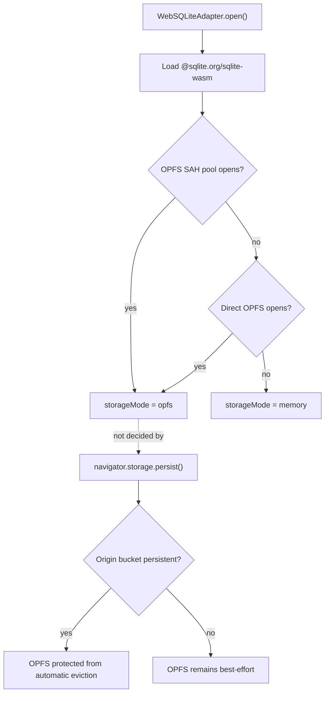
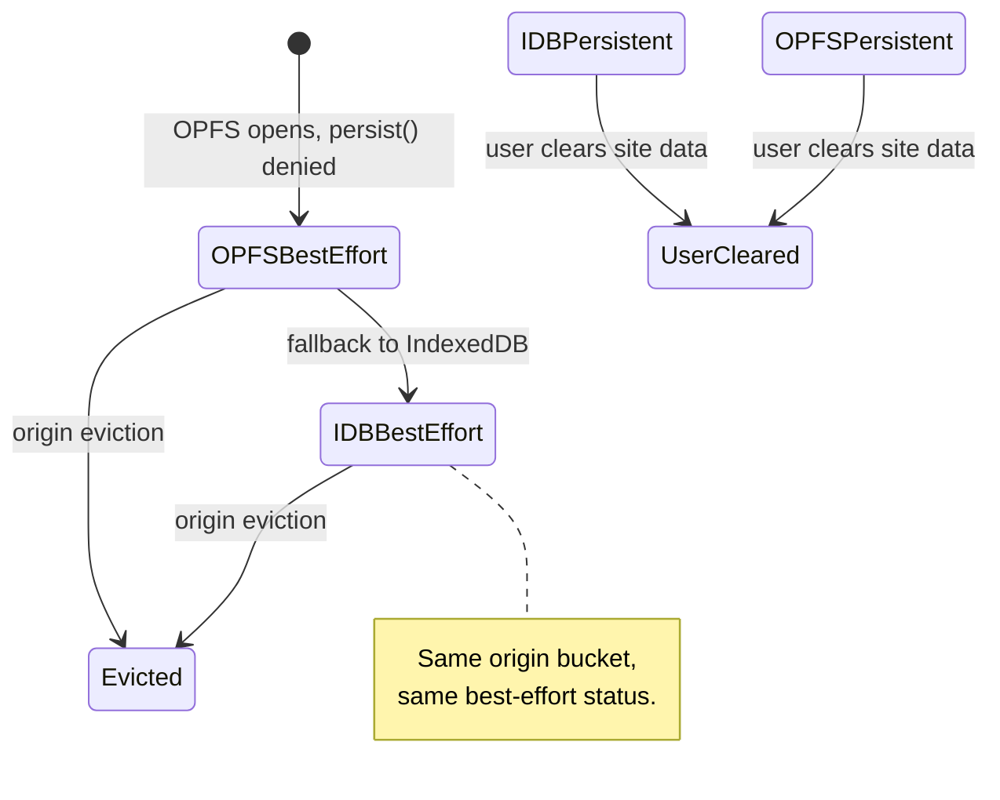
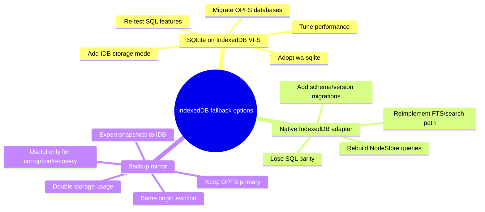

# IndexedDB Fallback When OPFS Persistence Fails

## Problem Statement

The previous exploration concluded that xNet cannot force durable browser storage from a normal web tab. Safari may grant durable storage after **Add to Dock** because WebKit's `navigator.storage.persist()` heuristics treat installed/standalone web apps differently. This raises a natural follow-up question:

**If OPFS-backed SQLite opens successfully but `navigator.storage.persist()` returns `false`, should xNet fall back to IndexedDB to improve durability or browser consistency?**

Short answer: **no, not as a durability fallback.** IndexedDB and OPFS are both origin storage. If persistent mode is denied, moving the same critical SQLite data from OPFS to IndexedDB does not escape origin-level quota and eviction policy. IndexedDB can still be useful as an availability fallback when OPFS is absent or broken, or as an auxiliary metadata/cache layer, but it should not be presented as "more durable than OPFS best-effort."

## Executive Summary

- ✅ **OPFS persist failure is not an OPFS-specific failure.** `persist()` applies to the origin's storage bucket. If denied, both OPFS and IndexedDB remain best-effort.
- ❌ **IndexedDB fallback would not solve the user's warning.** The warning is about browser eviction policy, not whether bytes live in OPFS or IndexedDB.
- ⚠️ **IndexedDB can increase compatibility, not durability.** It is broadly available and works in workers, but browser quota/eviction still applies and Safari/WebKit evicts origin data as a whole.
- 🐢 **SQLite-on-IndexedDB is materially more complex and usually slower.** The official SQLite WASM path xNet uses is OPFS-oriented; IndexedDB VFS support would likely mean adopting or maintaining another VFS/library, such as `wa-sqlite`, or reintroducing a separate non-SQLite IndexedDB storage adapter.
- 🧭 **Best recommendation:** keep OPFS as the primary web SQLite backend; use IndexedDB only for true OPFS-unavailable compatibility or small metadata; invest in diagnostics, backup/export, sync, Desktop/native storage, and user-chosen backup targets for actual durability.

## Current State in the Repository

### Web SQLite Adapter

The live web path is in [packages/sqlite/src/adapters/web.ts](/Users/crs/Code/xNet/packages/sqlite/src/adapters/web.ts):

1. Load `@sqlite.org/sqlite-wasm`.
2. Try `installOpfsSAHPoolVfs({ name: 'opfs-sahpool', directory: '.xnet-sqlite' })`.
3. Open `OpfsSAHPoolDb`.
4. If SAH pool fails, try direct `sqlite3.oo1.OpfsDb`.
5. If direct OPFS fails, use `:memory:`.

The adapter currently reports only:

```ts
getStorageMode(): 'opfs' | 'memory'
```

There is no live `indexeddb` storage mode in the `SQLiteAdapter` interface in [packages/sqlite/src/adapter.ts](/Users/crs/Code/xNet/packages/sqlite/src/adapter.ts), and `@xnetjs/sqlite` does not currently depend on `wa-sqlite`, Dexie, `idb`, or another IndexedDB SQLite VFS package.



The key separation is already visible in the code: `storageMode` is about the SQLite backend; `PersistentStorageStatus` is about the browser's origin durability state.

### Durable Storage Layer

[packages/sqlite/src/browser-support.ts](/Users/crs/Code/xNet/packages/sqlite/src/browser-support.ts) correctly separates:

- `checkPersistentStorage()` for read-only startup status.
- `requestPersistentStorage()` for explicit user-triggered requests.

That layer returns `state: 'granted' | 'not-granted' | 'unsupported' | 'error'` and usage/quota estimates. This is the right abstraction to build on. It should not be interpreted as “OPFS failed.”

### Prior Architecture Notes

[docs/explorations/0072_[x]_INDEXEDDB_TO_SQLITE_MIGRATION.md](</Users/crs/Code/xNet/docs/explorations/0072_[x]_INDEXEDDB_TO_SQLITE_MIGRATION.md>) documents the earlier SQLite-first shift away from IndexedDB because xNet needs ACID transactions, FTS, complex queries, batch import performance, and one schema across platforms.

[docs/explorations/0016_[x]_PERSISTENCE_ARCHITECTURE.md](</Users/crs/Code/xNet/docs/explorations/0016_[x]_PERSISTENCE_ARCHITECTURE.md>) considered OPFS plus IndexedDB fallback, but it predates the current official SQLite WASM OPFS implementation and the newer durable-storage work. The present code has effectively chosen SQLite/OPFS for web and memory fallback for unrecoverable browser storage failures.

## External Research

### Storage Persistence Is Origin-Level

The WHATWG Storage Standard defines persistent mode for a **local storage bucket**, not for a specific storage API. It lists IndexedDB, Cache API, service workers, `localStorage`, and other storage endpoints under the same storage architecture, and says a local bucket can become `persistent` only if the user or user agent grants the `persistent-storage` feature: <https://storage.spec.whatwg.org/>.

web.dev makes the same point operationally: persistent storage protects the site's storage broadly, including Cache API, File System API, IndexedDB, service workers, and related browser storage surfaces: <https://web.dev/articles/persistent-storage>.

### Browser Eviction Deletes Origin Data Together

MDN's quota and eviction guide states that when a browser evicts an origin's data, all of that origin's data is deleted together, not individual storage mechanisms selectively. If the origin used IndexedDB and Cache API, both are deleted: <https://developer.mozilla.org/en-US/docs/Web/API/Storage_API/Storage_quotas_and_eviction_criteria>.

WebKit says the same in its storage policy update: WebKit normally evicts data on an origin basis; origins are excluded from eviction if active or in persistent mode; by default origins are best-effort. WebKit also says `persist()` is granted by heuristics such as whether the site is opened as a Home Screen Web App: <https://webkit.org/blog/14403/updates-to-storage-policy/>.

### OPFS and IndexedDB Share Quota/Eviction Semantics

MDN's OPFS guide explicitly says OPFS is subject to browser storage quota restrictions like other origin-partitioned mechanisms such as IndexedDB, and clearing site storage deletes OPFS: <https://developer.mozilla.org/en-US/docs/Web/API/File_System_API/Origin_private_file_system>.

MDN's IndexedDB guide describes IndexedDB as a low-level transactional client-side database available in workers, but also points readers to browser-specific quota and eviction behavior: <https://developer.mozilla.org/en-US/docs/Web/API/IndexedDB_API>.

### SQLite WASM IndexedDB Support Is Not in xNet's Current Official Path

The SQLite WASM documentation recommends OPFS options, especially `opfs-sahpool`, for high-performance browser persistence and notes concurrency caveats for that VFS: <https://sqlite.org/wasm/doc/tip/persistence.md>.

SQLite's JavaScript VFS documentation says creating a VFS in JavaScript is possible but the OPFS implementation is involved because it wraps asynchronous browser APIs behind SQLite's expectations: <https://sqlite.org/wasm/doc/trunk/vfs.md>.

SQLite's built-in `kvvfs` is localStorage/sessionStorage-oriented, less efficient, and not suitable for xNet's large social imports: <https://sqlite.org/wasm/doc/tip/kvvfs.md>.

`wa-sqlite` is the main relevant ecosystem alternative. It supports JavaScript VFS implementations for IndexedDB and OPFS, including `IDBBatchAtomicVFS`, `IDBMirrorVFS`, and multiple OPFS VFS variants: <https://github.com/rhashimoto/wa-sqlite>.

PGlite is useful as ecosystem evidence rather than a direct xNet replacement. Its docs recommend IndexedDB for browser persistence because its OPFS filesystem has Safari limitations, but its IndexedDB filesystem loads files into memory and flushes changed files back after queries. That design is very different from xNet's SQLite/OPFS setup and highlights the performance/architecture cost of IDB-backed embedded databases: <https://pglite.dev/docs/filesystems>.

## Key Findings

### 1. Falling Back to IndexedDB After `persist()` Fails Does Not Improve Durability



If `navigator.storage.persist()` returns `false`, xNet's default storage bucket has not been marked persistent. IndexedDB would live in that same origin storage policy. The fallback changes the storage API, not the durability permission.

### 2. IndexedDB Is an Availability Fallback, Not a Durability Fallback

IndexedDB could make sense when:

- OPFS APIs are missing.
- OPFS access fails in a browser context where IndexedDB still works.
- A browser bug breaks SQLite's OPFS VFS but IDB remains usable.
- xNet wants a small metadata store independent of SQLite startup.
- xNet wants a recovery marker, last-good export manifest, or import journal pointer.

IndexedDB does **not** make sense when:

- OPFS works but persistent storage is denied.
- The only problem is the durable-storage warning.
- The data set is a large social import and xNet needs fast SQL queries, FTS, joins, and batch writes.

### 3. A SQLite-on-IndexedDB Backend Is Not a Small Patch

There are three possible shapes, each with meaningful cost:



The least disruptive path would be a SQLite-on-IDB VFS, probably through `wa-sqlite`. But xNet currently uses official `@sqlite.org/sqlite-wasm`, so this means either:

- add a second SQLite WASM runtime and adapter;
- replace the official runtime with `wa-sqlite`;
- write/maintain an IndexedDB VFS for the official runtime.

All three options affect packaging, tests, schema compatibility, import performance, and debugging.

### 4. IndexedDB May Be Worse for Large Social Imports

The social importer is already producing hundreds of thousands of records. For that workload, OPFS-backed SQLite has advantages:

- byte-addressable file I/O;
- worker-only synchronous access handles;
- SQL query planning;
- efficient transactions;
- FTS and joins;
- shared schema with Electron/mobile adapters.

IndexedDB is asynchronous and object-store-oriented. SQLite-over-IDB VFS layers can work, but they pay translation overhead. Whole-file or page-flush designs can become expensive for write-heavy imports. A native IDB adapter would avoid SQLite VFS complexity, but would lose the central reason xNet moved to SQLite.

### 5. Duplicating Data Into IndexedDB Could Hurt the Quota Story

A mirror strategy such as “write OPFS SQLite, then snapshot to IndexedDB” may help recover from some SQLite/OPFS file corruption bugs, but it does not protect against origin eviction. It also doubles storage usage, which can make quota pressure more likely.

For large imports, a better backup target is outside the same origin bucket:

- user-downloaded `.xnet` export;
- File System Access directory/file where supported;
- xNet sync to another device or hub;
- Desktop app storage;
- native mobile app storage.

## Options and Tradeoffs

### Option A: Keep OPFS Primary and Do Not Add IndexedDB Fallback for Persist Denial

**What it means:** if OPFS opens but `persist()` is denied, keep using OPFS best-effort and show truthful durability UX.

Pros:

- Correct mental model.
- No duplicate storage engine.
- Keeps SQL, FTS, transaction, and import performance.
- Avoids migration complexity.
- Matches current adapter shape.

Cons:

- Users still see best-effort warning.
- Browser-local-only data remains at eviction risk.
- Does not help older browsers without OPFS.

Best fit: current xNet Web baseline.

### Option B: Add IndexedDB Only When OPFS Is Unavailable

**What it means:** extend `SQLiteAdapter.getStorageMode()` to include `indexeddb`, and use an IDB-backed SQLite VFS or separate IndexedDB adapter only when OPFS cannot open.

Pros:

- Improves availability on weird or older browser contexts.
- Avoids memory-only fallback in more cases.
- Could be useful for small workspaces.

Cons:

- High implementation and test cost.
- Slower for large imports.
- Requires migration/export logic between storage modes.
- Still best-effort unless `persist()` succeeds.
- Could give users false confidence if copy is not very clear.

Best fit: later compatibility project, not a durable-storage fix.

### Option C: Add SQLite-on-IndexedDB via `wa-sqlite`

**What it means:** build a new web adapter using `wa-sqlite` and its IndexedDB VFS options.

Pros:

- Keeps SQL API.
- IndexedDB VFS already exists in ecosystem.
- Broader backend matrix: memory, IndexedDB, multiple OPFS strategies.

Cons:

- Introduces second SQLite WASM implementation or replaces the current one.
- Must verify FTS5, JSON, pragmas, transaction semantics, prepared statements, blobs, and import performance.
- Bundle size and WASM initialization become more complex.
- Harder debugging across browser-specific VFS layers.
- Still same origin durability problem.

Best fit: if OPFS has enough compatibility bugs that memory fallback is unacceptable.

### Option D: Add Native IndexedDB NodeStore Fallback

**What it means:** bypass SQLite and store xNet nodes/changes/blobs directly in IndexedDB.

Pros:

- Uses standard browser API directly.
- Can be simpler for small key-value/object use cases.
- IndexedDB is available in workers.

Cons:

- Reintroduces the storage model xNet intentionally left behind.
- Requires separate query implementation, indexes, migrations, and search behavior.
- Hard to preserve database/canvas/social workspace query power.
- Cross-platform parity suffers.
- Still same origin durability problem.

Best fit: not recommended for primary xNet data.

### Option E: Use IndexedDB for Recovery Metadata Only

**What it means:** store small, redundant metadata in IDB, such as last successful import id, export manifests, durability request history, or pending backup state.

Pros:

- Low complexity.
- Useful even if SQLite initialization fails.
- Can power better recovery UX.
- Avoids duplicating the whole DB.

Cons:

- Does not save the database from origin eviction.
- Must handle IDB unavailability/private mode.
- Needs careful privacy/security treatment.

Best fit: good supporting feature.

### Option F: Use Export/Sync/Desktop as the Durability Fallback

**What it means:** when OPFS is best-effort, continue with OPFS but strongly guide users to backup/sync/install/Desktop depending on import size and risk.

Pros:

- Solves the actual durability problem.
- Keeps OPFS performance.
- Gives users a recovery path outside the origin bucket.
- Aligns with xNet's long-term synced graph model.

Cons:

- Requires product UX work.
- Backup/sync is more visible than a silent backend fallback.
- Desktop recommendation may feel heavier for web-only users.

Best fit: recommended path.

## Recommendation

### Do Not Fallback to IndexedDB Solely Because OPFS `persist()` Fails

The durable-storage warning should stay tied to `navigator.storage.persisted()` rather than storage backend. If OPFS is open and `persist()` is denied, the best response is:

1. Keep SQLite on OPFS.
2. Label storage as `OPFS best-effort`.
3. Offer install/Add to Dock/bookmark/retry guidance.
4. Add large-import preflight and post-import backup/export.
5. Encourage sync or Desktop for data the user cannot afford to lose.

### Add a Separate Compatibility Track for IndexedDB

IndexedDB can be explored later as a fallback for **OPFS unavailable**, not **OPFS not durable**. That exploration should be gated by measured browser failures:

- How often does OPFS fail while IndexedDB works?
- Is memory fallback causing real user data loss before import commit?
- Can an IDB SQLite backend handle 200k+ record imports at acceptable speed?
- Can we migrate data between IDB and OPFS without user confusion?

### Update the Storage Model Language

The UI and API should distinguish:

| Dimension | Values | Meaning |
| --- | --- | --- |
| SQLite backend | `opfs`, `indexeddb`, `memory`, `native`, `expo` | Where the DB engine stores bytes |
| Durability state | `persistent`, `best-effort`, `unsupported`, `unknown` | Browser eviction policy for the origin |
| Recovery state | `synced`, `exported`, `backed-up`, `local-only` | Whether data exists outside the browser bucket |

The current warning conflates less than it used to, but adding this vocabulary will prevent a future IndexedDB fallback from being misread as a durability upgrade.

## Implementation Checklist

- [ ] Keep `OPFS best-effort` as a valid web storage state.
- [ ] Do not route from OPFS to IndexedDB when only `persist()` is denied.
- [ ] Rename or expand `getStorageMode()` docs so `opfs` does not imply durable persistence.
- [ ] Add a `DurabilityState` type separate from SQLite backend mode.
- [ ] Add `RecoveryState` diagnostics for export/sync/backup status.
- [ ] Add large-import preflight copy that says IndexedDB would not improve eviction protection.
- [ ] Add post-import export/snapshot flow for best-effort browser storage.
- [ ] Add an IndexedDB feasibility spike only for OPFS-unavailable environments.
- [ ] If spiking IndexedDB, benchmark `wa-sqlite` IDB VFS against current OPFS SAH pool with 10k, 100k, and 250k record imports.
- [ ] If spiking IndexedDB, test migration between `opfs` and `indexeddb` backends using SQLite `VACUUM INTO` or app-level export/import.
- [ ] Add docs that Desktop/native storage is the guaranteed local durability tier.

## Validation Checklist

- [ ] Safari normal tab: OPFS opens, `persist()` denied, app remains on OPFS and labels it best-effort.
- [ ] Safari Add to Dock: OPFS opens, `persist()` granted, app labels it persistent.
- [ ] Chrome normal tab before install/bookmark: OPFS opens, denied or granted based on heuristic, no IDB fallback unless OPFS fails.
- [ ] Firefox: confirm prompt behavior and ensure denied persistent permission does not change backend.
- [ ] Private/incognito modes: confirm OPFS/IDB failures are treated as availability problems, not durability problems.
- [ ] Large YouTube/Twitter import under OPFS best-effort: show preflight and backup guidance before commit.
- [ ] Forced OPFS failure test: verify app falls to memory today and records a diagnostics event.
- [ ] IndexedDB spike only: compare import duration, query latency, memory usage, bundle size, and database size against OPFS.
- [ ] Origin eviction simulation: clear site data and verify both OPFS and IDB data disappear together.
- [ ] Backup recovery: restore from exported archive after site data clearing.

## Example Code

### Backend Selection Should Not Use `persist()` as an OPFS Failure Signal

```ts
type BrowserSQLiteBackend = 'opfs' | 'indexeddb' | 'memory'
type DurabilityState = 'persistent' | 'best-effort' | 'unsupported' | 'unknown'

type BrowserStorageDecision = {
  backend: BrowserSQLiteBackend
  durability: DurabilityState
  shouldWarn: boolean
  reason: string
}

export async function chooseBrowserSQLiteStorage(): Promise<BrowserStorageDecision> {
  const opfsAvailable = Boolean(navigator.storage?.getDirectory)
  const persisted = await navigator.storage?.persisted?.().catch(() => undefined)

  if (opfsAvailable) {
    return {
      backend: 'opfs',
      durability: persisted === true ? 'persistent' : 'best-effort',
      shouldWarn: persisted !== true,
      reason:
        persisted === true
          ? 'SQLite can use OPFS and the origin is protected from automatic eviction.'
          : 'SQLite can use OPFS, but the origin is still best-effort. IndexedDB would share the same eviction policy.'
    }
  }

  if (typeof indexedDB !== 'undefined') {
    return {
      backend: 'indexeddb',
      durability: persisted === true ? 'persistent' : 'best-effort',
      shouldWarn: true,
      reason:
        'OPFS is unavailable. IndexedDB may keep the app usable, but it does not improve browser eviction protection unless persistent storage is granted.'
    }
  }

  return {
    backend: 'memory',
    durability: 'unsupported',
    shouldWarn: true,
    reason: 'Neither OPFS nor IndexedDB is available. Data will not survive reload.'
  }
}
```

### Large Import Guardrail

```ts
type ImportStorageRisk = 'low' | 'medium' | 'high'

export function evaluateImportStorageRisk(input: {
  backend: BrowserSQLiteBackend
  durability: DurabilityState
  recovery: 'synced' | 'exported' | 'local-only'
  estimatedRecords: number
}): ImportStorageRisk {
  if (input.recovery !== 'local-only') return 'low'
  if (input.durability === 'persistent') return 'low'
  if (input.backend === 'memory') return 'high'
  if (input.estimatedRecords >= 50_000) return 'high'
  return 'medium'
}
```

## Risks and Unknowns

- **Browser bugs can invert the practical answer.** If a specific Safari/Chrome version has OPFS corruption while IndexedDB is stable, an IDB compatibility fallback could be justified for that browser/version.
- **False confidence is the largest product risk.** "Fallback to IndexedDB" sounds safer to many web developers, but for eviction it is the same origin bucket.
- **Performance data is local to workload.** xNet should benchmark real social imports rather than rely on generic VFS claims.
- **Dual backends complicate support.** Every query, migration, import, backup, and recovery path becomes backend-sensitive.
- **Quota pressure could worsen with mirrors.** Copying a large SQLite DB into IDB can double usage and increase failure probability.
- **Private mode behavior varies.** Safari/Firefox/Chromium private contexts can make both OPFS and IndexedDB ephemeral or unavailable.

## Recommended Next Actions

1. Keep OPFS as the primary web SQLite backend when OPFS opens.
2. Update diagnostics to say `OPFS best-effort` rather than implying OPFS equals durable.
3. Add large-import preflight that recommends install, sync, export, or Desktop when persistent storage is denied.
4. Add a post-import export/backup path before investing in IndexedDB fallback.
5. Create a small IndexedDB compatibility spike only for OPFS-unavailable environments.
6. If the spike proceeds, benchmark `wa-sqlite` IDB VFS against current `@sqlite.org/sqlite-wasm` OPFS SAH pool using real social import datasets.
7. Document that the only robust fallback from browser eviction is data outside the origin bucket: sync, export, user-visible file/directory, or native app storage.

## References

- Prior xNet exploration: [SQLite OPFS Durable Storage Browser Consistency](</Users/crs/Code/xNet/docs/explorations/0154_[_]_SQLITE_OPFS_DURABLE_STORAGE_BROWSER_CONSISTENCY.md>)
- xNet SQLite web adapter: [packages/sqlite/src/adapters/web.ts](/Users/crs/Code/xNet/packages/sqlite/src/adapters/web.ts)
- xNet browser support checks: [packages/sqlite/src/browser-support.ts](/Users/crs/Code/xNet/packages/sqlite/src/browser-support.ts)
- xNet IndexedDB to SQLite migration exploration: [docs/explorations/0072_[x]_INDEXEDDB_TO_SQLITE_MIGRATION.md](</Users/crs/Code/xNet/docs/explorations/0072_[x]_INDEXEDDB_TO_SQLITE_MIGRATION.md>)
- WHATWG Storage Standard: <https://storage.spec.whatwg.org/>
- MDN storage quotas and eviction criteria: <https://developer.mozilla.org/en-US/docs/Web/API/Storage_API/Storage_quotas_and_eviction_criteria>
- MDN OPFS guide: <https://developer.mozilla.org/en-US/docs/Web/API/File_System_API/Origin_private_file_system>
- MDN IndexedDB API: <https://developer.mozilla.org/en-US/docs/Web/API/IndexedDB_API>
- web.dev persistent storage: <https://web.dev/articles/persistent-storage>
- WebKit storage policy update: <https://webkit.org/blog/14403/updates-to-storage-policy/>
- SQLite WASM persistent storage options: <https://sqlite.org/wasm/doc/tip/persistence.md>
- SQLite WASM JavaScript VFS notes: <https://sqlite.org/wasm/doc/trunk/vfs.md>
- SQLite WASM key-value VFS: <https://sqlite.org/wasm/doc/tip/kvvfs.md>
- wa-sqlite project: <https://github.com/rhashimoto/wa-sqlite>
- PGlite filesystem docs: <https://pglite.dev/docs/filesystems>
