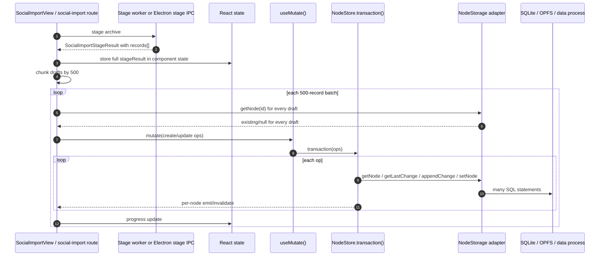
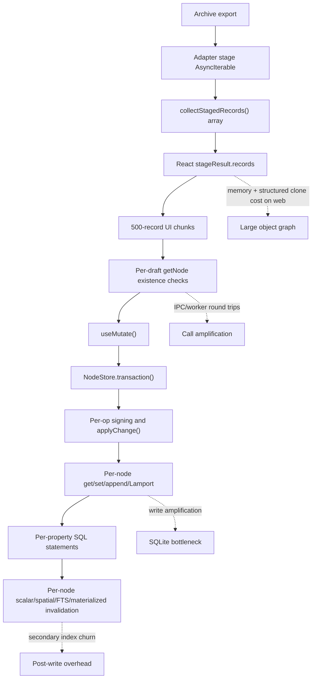
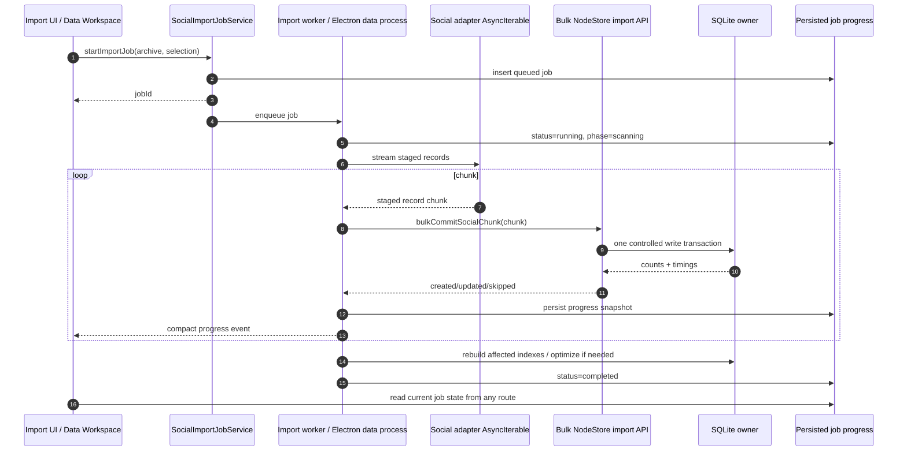
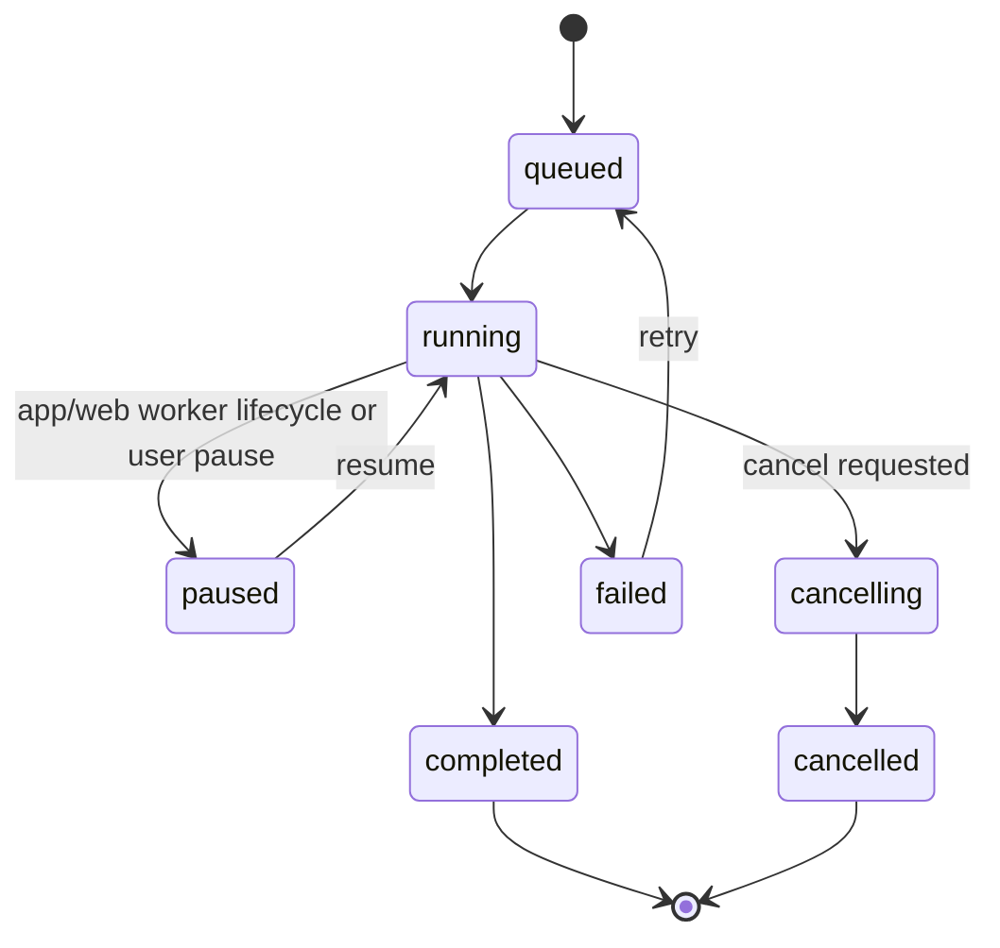
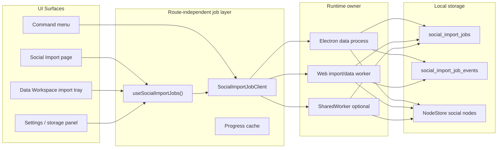
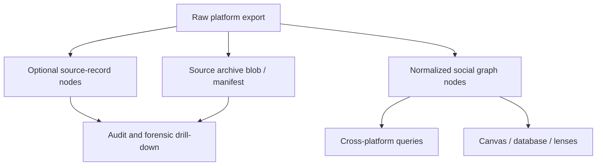

# 0156 - Faster Social Import Commit and Background Import Jobs

## Problem Statement

The social importer now has a much better commit-progress UI, but large imports are still slow enough to feel broken. A YouTube import with roughly 72,738 committed records showed 146 batches at 500 records per batch and an ETA around 11 minutes. The UI can explain that work is happening, but it cannot make the user trust the product if the commit path remains minutes-long for common exports.

The bigger product requirement is also broader than speed: imports should be jobs. A user should be able to start a large social import, navigate away from the import route, open the data workspace, and still see import state, progress, errors, and completion. In Electron, that can continue in the data process. On the web, it can continue while the app/origin is alive, with realistic caveats around page close and browser lifecycle.

## Executive Summary

The current bottleneck is not just SQLite. The commit path is renderer-owned and uses the generic high-level mutation path:

- React route/component holds the staged records and loops through 500-record batches.
- Each draft checks existence with one `getNode` call.
- Each batch calls `mutate()`, which enters `NodeStore.transaction()`.
- `NodeStore.transaction()` loops through each operation, signs one change, applies it, fetches nodes again, emits events, and invalidates auth state.
- Storage application expands into multiple per-node/per-property SQL statements, index syncs, FTS updates, materialized-view invalidations, and IPC/worker crossings.

The first substantial speedup should come from moving import commit into the storage owner and adding import-optimized bulk APIs, not from only changing the spinner or increasing `COMMIT_BATCH_SIZE`.

Recommended direction:

1. Instrument the existing flow with phase timings so we can stop guessing.
2. Add bulk existence and bulk node/change APIs in `@xnetjs/data`.
3. Run social import commit as a persistent job owned by the Electron data process or a long-lived web worker.
4. Stream staged social records directly into chunked bulk writes instead of materializing a huge `records[]` array in React state.
5. Defer expensive secondary index/FTS/materialized-view refreshes during import and rebuild affected slices after each large chunk or at finalization.
6. Persist job progress and summaries so any UI surface can show the same import state.

Expected outcome if implemented well: a 10x class improvement for large imports. The 72k-record example should move from "many minutes" toward under a minute in Electron on typical development hardware, and the 280k-record case should become a bounded background job instead of a route-blocking operation.

## Current Repo State

### Current import flow



Electron and web both use a fixed 500-record UI batch size:

- [`apps/electron/src/renderer/components/SocialImportView.tsx`](../../apps/electron/src/renderer/components/SocialImportView.tsx) defines `COMMIT_BATCH_SIZE = 500` and commits staged drafts from the renderer.
- [`apps/web/src/routes/social-import.tsx`](../../apps/web/src/routes/social-import.tsx) mirrors the same commit structure.

The screenshot's "batch 8 of 146" maps directly to `72,738 / 500 = 145.476`, so the UI batch size is the visible unit of work.

### Renderer-owned commit

Electron commit path:

- Lines 184-203 build `drafts` in React and call local `commitDrafts()`.
- Lines 747-840 chunk drafts, check existence, call `mutate(operations)`, and update progress.
- Lines 793-808 call `window.xnetNodes.getNode(draft.deterministicId)` once for every draft.

Web commit path:

- Lines 196-216 build `drafts` in React and call local `commitDrafts()`.
- Lines 792-887 repeat the same chunk/check/mutate loop.
- Lines 839-855 call `getExisting(draft.deterministicId)` once for every draft.

This makes the UI route the coordinator for hundreds of thousands of operations. Navigation away from that component risks losing the in-memory progress model unless the promise continues to be anchored elsewhere.

### Staging materializes everything

The social package is already streaming-shaped at the adapter layer: importers return an `AsyncIterable<StagedSocialRecord>`. But current orchestration collapses that stream into an array:

- [`packages/social/src/import/stage-archive.ts`](../../packages/social/src/import/stage-archive.ts) calls `collectStagedRecords(...)` at lines 135-148.
- [`packages/social/src/import/staging.ts`](../../packages/social/src/import/staging.ts) implements `collectStagedRecords()` by pushing every record into an array at lines 143-149.
- `stageSocialArchive()` then returns `records: createSocialImportNodeDrafts(stagedRecords)` at line 171.

On web, the stage worker posts that entire result back to the main thread:

- [`apps/web/src/workers/social-import.worker.ts`](../../apps/web/src/workers/social-import.worker.ts) posts `result` at lines 68-73.
- [`apps/web/src/lib/social-import-worker-client.ts`](../../apps/web/src/lib/social-import-worker-client.ts) creates a one-shot worker and terminates it once the response arrives at lines 73-88.

That is good enough for a first importer, but not for massive archives. It introduces:

- high peak memory,
- structured-clone overhead when the worker posts the result,
- route-owned state for long-lived import data,
- no durable job record until after commit finishes.

### NodeStore is correct but not import-optimized

[`packages/data/src/store/store.ts`](../../packages/data/src/store/store.ts) makes `transaction()` semantically rich:

- Lines 670-805 resolve temp IDs, authorize the batch, create a batch id, sign changes, apply each change, persist encrypted snapshots, emit per operation, and invalidate auth state.
- Lines 1083-1199 show `applyChange()` reading materialized state, creating a node when missing, appending a change, setting Lamport time, applying property-level LWW, and calling `storage.setNode()`.

That is the right general-purpose mutation path for user actions, undoable edits, sync correctness, auth checks, and change events. It is not a fast import path for tens or hundreds of thousands of deterministic records.

### SQLite adapter has partial bulk support

[`packages/data/src/store/sqlite-adapter.ts`](../../packages/data/src/store/sqlite-adapter.ts) already contains the basic idea:

- `setNode()` wraps one node write in a transaction at lines 532-544.
- `_setNodeInternal()` upserts a node, deletes removed properties, loops over properties, reads the node back for indexing, syncs scalar/spatial rows, updates FTS, and invalidates materialized views at lines 550-610.
- `importNodes(nodes)` wraps many `_setNodeInternal()` calls in one transaction at lines 925-939.

`importNodes()` reduces transaction overhead, but it still does per-node property loops, per-node readback, per-node index sync, per-node FTS work, and per-node materialized-view invalidation. It is a useful stepping stone, not the final social import path.

### Runtime ownership differs by platform

Electron already routes NodeStore storage through IPC:

- [`apps/electron/src/renderer/main.tsx`](../../apps/electron/src/renderer/main.tsx) configures runtime mode `ipc` with fallback `error` at lines 778-780.
- [`packages/sqlite/src/adapters/electron.ts`](../../packages/sqlite/src/adapters/electron.ts) uses better-sqlite3, WAL, `synchronous = NORMAL`, a statement cache, and exposes `transactionSync()` for performance-critical synchronous batches at lines 52-76 and 169-178.

Web routes storage through worker-capable SQLite:

- [`apps/web/src/App.tsx`](../../apps/web/src/App.tsx) configures runtime mode `worker` with fallback `main-thread` at lines 733-735.
- [`packages/sqlite/src/adapters/web-proxy.ts`](../../packages/sqlite/src/adapters/web-proxy.ts) has `transactionBatch(operations)` at lines 133-148 because callback transactions cannot cross the worker boundary.
- [`packages/sqlite/src/adapters/web.ts`](../../packages/sqlite/src/adapters/web.ts) simulates prepared statements on top of the sqlite3 oo1 API at lines 251-268.

The right import architecture should respect that split:

- Electron: import jobs should run in the data process or a utility process next to SQLite.
- Web: import jobs should run in the long-lived data/import worker, with a route-independent app service as the owner.

## External Research Notes

### SQLite transactions and nested transaction errors

[SQLite transactions](https://www.sqlite.org/lang_transaction.html) document two constraints that matter here:

- Explicit `BEGIN...COMMIT` transactions do not nest; starting `BEGIN` inside an active transaction fails.
- Implicit transactions are automatically started and committed around individual statements when no explicit transaction exists.

This connects directly to the earlier `SQLITE_ERROR: cannot start a transaction within a transaction`. A social import bulk path needs one clear transaction owner. If nested atomic scopes are required, use `SAVEPOINT`, or better, keep the import API below the layer that starts per-node transactions.

### WAL and synchronous settings

[SQLite PRAGMA synchronous](https://www.sqlite.org/pragma.html#pragma_synchronous) documents that `synchronous=NORMAL` in WAL mode avoids syncs during most transaction commits while preserving atomicity and consistency, with durability tradeoffs around power loss. Electron already uses WAL and `synchronous = NORMAL`, which means the slow path is probably not an obvious missing PRAGMA. The bigger issue is write amplification and call amplification.

[SQLite PRAGMA optimize](https://sqlite.org/lang_analyze.html) is the current recommended way to refresh planner statistics periodically or after schema/index changes. It is relevant after large imports, but it will not fix the core write path by itself.

### SQLite WASM and OPFS concurrency

[SQLite WASM persistence docs](https://sqlite.org/wasm/doc/tip/persistence.md) are explicit that browser OPFS does not provide desktop-grade concurrency. The docs advise keeping work in small millisecond-scale chunks, not holding transactions open for significant periods, and handling `SQLITE_BUSY`. They also call out special concurrency caveats for `opfs-sahpool` and WAL in browser environments.

For xNet, that means:

- A single database owner is still the cleanest model.
- Import chunks should be large enough to reduce overhead but small enough to release OPFS locks regularly.
- Web import progress should not assume another tab can write concurrently without coordination.

### Worker message costs

[MDN's Web Workers guide](https://developer.mozilla.org/en-US/docs/Web/API/Web_Workers_API/Using_web_workers) states that data passed between page and worker is copied or transferred, and that most browsers implement message passing with structured clone. [MDN structured clone](https://developer.mozilla.org/en-US/docs/Web/API/Web_Workers_API/Structured_clone_algorithm) describes recursive object copying. [MDN transferable objects](https://developer.mozilla.org/en-US/docs/Web/API/Web_Workers_API/Transferable_objects) describes zero-copy transfer for resources like `ArrayBuffer`.

The current web importer posts a large object graph of staged drafts back to the main thread. Those drafts are ordinary objects, not transferable buffers, so they are copied. The better design is to keep parsed records in the worker/database owner and only post compact progress summaries to the UI.

### Background APIs are not a guaranteed long-import runner

[MDN Background Synchronization API](https://developer.mozilla.org/en-US/docs/Web/API/Background_Synchronization_API) says the API is limited availability and aimed at deferred work in a service worker once network connectivity is available. [MDN Service Worker API](https://developer.mozilla.org/en-US/docs/Web/API/Service_Worker_API) describes service workers as event-driven proxy/cache workers without DOM access, designed for offline and network interception.

That makes service workers useful for update/sync plumbing, but a poor baseline for "keep a 20-minute CPU/storage import running after the user closes the tab" across Safari, Chrome, Firefox, Electron, and localhost.

[MDN SharedWorker](https://developer.mozilla.org/en-US/docs/Web/API/SharedWorker) is more relevant for multi-tab ownership because it can be accessed from several same-origin browsing contexts. It can help route progress to multiple tabs and deduplicate database ownership, but it still has browser lifecycle limits and support considerations.

## Bottleneck Map



The main speed problem is multiplicative:

```text
records * (existence check + change signing + parent lookup + storage reads + node write + property writes + index refresh + event emission)
```

For an import, most of that work can be batched without weakening semantics.

## Design Goals

- Keep deterministic social node IDs and idempotent re-import behavior.
- Preserve NodeStore change-log semantics, signatures, Lamport timestamps, and sync compatibility.
- Avoid nested SQLite transactions.
- Avoid returning massive staged draft arrays to React.
- Support Electron and web with one conceptual import-job API.
- Let users navigate away from the import route and inspect import jobs elsewhere.
- Keep web promises realistic: navigation within the SPA should not cancel an import; closing all pages may pause or stop it depending on browser lifecycle.
- Make progress durable enough to survive renderer refresh/reopen and resume where possible.

## Options and Tradeoffs

| Option                                                           |                 Speed impact |  Complexity | Notes                                                                                                                                          |
| ---------------------------------------------------------------- | ---------------------------: | ----------: | ---------------------------------------------------------------------------------------------------------------------------------------------- |
| Increase `COMMIT_BATCH_SIZE`                                     |                Low to medium |         Low | Reduces progress overhead and some transaction count, but does not remove per-node work. Too large can hold OPFS locks and reduce UI feedback. |
| Batch existence checks                                           |                       Medium |         Low | Replace 72k `getNode` calls with chunked `getExistingNodeIds(ids)`. Good first fix.                                                            |
| Use existing `importNodes()`                                     |                       Medium |      Medium | Avoids one transaction per node but still does per-node indexing/readback. Needs NodeStore bulk change support to preserve change log.         |
| Add bulk NodeStore import transaction                            |                         High | Medium-high | Best semantic path: batch parent lookups, change append, node materialization, and event emission.                                             |
| Direct social SQL import                                         |                    Very high |   High risk | Fastest, but easy to bypass auth/sync/change invariants unless implemented as an internal data-layer primitive.                                |
| Store raw archive + relational sidecar, materialize nodes lazily | Very high for initial import |        High | Great long-term analytics path, but expands the data model and query architecture.                                                             |
| Background job queue                                             |                  UX-critical |      Medium | Does not inherently make writes faster, but makes long writes tolerable and route-independent.                                                 |

## Recommended Architecture

### Target flow



### Import job model



Minimal job shape:

```typescript
export type SocialImportJobStatus =
  | 'queued'
  | 'running'
  | 'paused'
  | 'completed'
  | 'failed'
  | 'cancelled'

export type SocialImportJobPhase =
  | 'probing'
  | 'staging'
  | 'checking'
  | 'writing'
  | 'indexing'
  | 'finalizing'

export type SocialImportJobProgress = {
  jobId: string
  status: SocialImportJobStatus
  phase: SocialImportJobPhase
  platform: string
  archiveName: string
  totalRecords: number | null
  processedRecords: number
  created: number
  updated: number
  skipped: number
  warnings: number
  currentBucketId: string | null
  currentChunk: number
  totalChunks: number | null
  startedAt: number | null
  updatedAt: number
  completedAt: number | null
  error: string | null
}
```

Store this as:

- a NodeStore-backed `SocialImportJob` schema if it should sync/share like other xNet data,
- or an internal SQLite table if it is purely local operational state,
- or both: local job rows for live operational state, then a final `SocialImportRun` node for durable/importable history.

Recommendation: start with an internal local job table plus the existing final `SocialImportRun` node. Syncing live progress is not necessary for v1 and could create noisy changes.

### Bulk NodeStore import primitive

The safe speed path is not "bypass NodeStore"; it is "teach NodeStore how to import many deterministic nodes with fewer trips."

Add storage primitives:

```typescript
export type BulkExistingNodesResult = {
  nodesById: Map<string, NodeState>
  lastChangesByNodeId: Map<string, NodeChange | null>
}

export type BulkImportNodesOptions = {
  deferIndexes?: boolean
  affectedSchemaIds?: readonly string[]
}

export type BulkNodeStorage = NodeStorage & {
  getNodesById(ids: readonly string[]): Promise<Map<string, NodeState>>
  getLastChangesByNodeId(ids: readonly string[]): Promise<Map<string, NodeChange | null>>
  appendChanges(changes: readonly NodeChange[]): Promise<void>
  importNodes(nodes: readonly NodeState[], options?: BulkImportNodesOptions): Promise<void>
  rebuildIndexesForSchemas(schemaIds: readonly string[]): Promise<void>
}
```

Then add an import-specific NodeStore API:

```typescript
export type ImportNodeDraft = {
  id: string
  schemaId: SchemaIRI
  properties: Record<string, unknown>
}

export type ImportNodesProgress = {
  processed: number
  created: number
  updated: number
  skipped: number
  phase: 'checking' | 'writing' | 'indexing'
}

export async function importDeterministicNodes(input: {
  store: NodeStore
  drafts: AsyncIterable<readonly ImportNodeDraft[]>
  chunkSize: number
  onProgress?: (progress: ImportNodesProgress) => void
}): Promise<SocialCommitSummary> {
  // Pseudocode:
  // 1. For each chunk, dedupe by id.
  // 2. Fetch existing nodes and last changes in two bulk reads.
  // 3. Build signed NodeChange objects with one batch id per chunk.
  // 4. Materialize NodeState objects in memory using the same LWW rules.
  // 5. Persist changes + materialized nodes inside one storage-owned transaction.
  // 6. Defer/rebuild secondary indexes for affected schemas.
  // 7. Emit compact progress and optional per-node change events after commit.
  throw new Error('example only')
}
```

This keeps the sync model intact while removing avoidable round trips.

### SQLite write strategy

For Electron:

- Run import chunks in the data process where the better-sqlite3 connection lives.
- Use `transactionSync()` for synchronous prepared statement loops where possible.
- Prepare and reuse statements for:
  - node upsert,
  - property upsert,
  - change append,
  - sync_state update,
  - source/job progress update.
- Insert all changes for a chunk, then all materialized nodes/properties.
- Defer scalar/spatial/FTS/materialized refresh where safe.

For web:

- Run import chunks in the worker that owns SQLite.
- Prefer `transactionBatch()` or a new worker-side command that accepts typed chunk data and performs the transaction inside the worker.
- Do not ship thousands of SQL operation objects through `postMessage()` if a single command with compact chunk data can run worker-local prepared statements.
- Tune chunk size by elapsed I/O time, not only record count. OPFS guidance favors small millisecond-scale lock windows.

Chunking heuristic:

```typescript
const nextChunkSize = (input: {
  previousChunkSize: number
  previousDurationMs: number
  targetDurationMs: number
}): number => {
  if (input.previousDurationMs <= 0) return input.previousChunkSize
  const ratio = input.targetDurationMs / input.previousDurationMs
  const candidate = Math.round(input.previousChunkSize * Math.max(0.5, Math.min(2, ratio)))
  return Math.max(250, Math.min(10_000, candidate))
}
```

Suggested initial targets:

- Electron: chunks around 5k-20k records or 250-750ms write windows.
- Web OPFS: chunks around 1k-5k records or 100-300ms write windows.
- Source records enabled: treat them as lower-priority chunks or store compact source manifests instead of full NodeStore records when possible.

## Background Job Queue Design

### What "background" should mean

| Environment                      | Can continue after route navigation? | Can continue after all app windows/tabs close? | Recommended implementation                             |
| -------------------------------- | ------------------------------------ | ---------------------------------------------- | ------------------------------------------------------ |
| Electron                         | Yes                                  | Usually yes if main/data process remains alive | Data-process job queue with IPC progress subscription  |
| Web SPA, tab open                | Yes                                  | No                                             | App singleton + dedicated worker/database worker       |
| Web, multiple tabs               | Yes, with coordination               | No reliable guarantee                          | SharedWorker when available, BroadcastChannel fallback |
| Web, page closed                 | Not reliably                         | Not reliably                                   | Persist checkpoint and resume on next open             |
| Service Worker / Background Sync | Limited                              | Limited and browser-dependent                  | Use only for resume nudges, not the core importer      |

### Queue ownership

The queue should live outside the route component:



UI contract:

```typescript
export type SocialImportJobClient = {
  start(input: SocialImportStartRequest): Promise<{ jobId: string }>
  pause(jobId: string): Promise<void>
  resume(jobId: string): Promise<void>
  cancel(jobId: string): Promise<void>
  list(): Promise<SocialImportJobProgress[]>
  get(jobId: string): Promise<SocialImportJobProgress | null>
  subscribe(listener: (event: SocialImportJobProgress) => void): () => void
}
```

On Electron, `subscribe()` can be an IPC event stream from the data process. On web, it can be worker messages plus `BroadcastChannel` so another route or tab can hear progress. The authoritative state is still persisted so UI can recover after a reload.

### Resume and checkpoints

The importer should persist:

- archive fingerprint: file name, byte size, archive hash when available,
- adapter id/version,
- selected buckets,
- include-sensitive flag,
- include-source-records flag,
- processed source paths and record offsets when an importer can expose them,
- deterministic IDs already committed,
- counts and warnings,
- last successful chunk.

For Electron, resuming from an archive path is realistic because `archivePath` is available. For browser `File` objects, resuming after full page close is harder because the app may not retain file-system access unless using File System Access handles and permissions. Browser v1 can honestly say "paused; choose the same archive to resume" and use deterministic IDs to avoid duplicates.

## Data Model Considerations

The previous social importer work intentionally normalized platform exports into shared concepts: actor, identity claim, content, interaction, conversation, message, collection, collection item, source record. That still looks right for queryability across X, Instagram, YouTube, TikTok, Claude, ChatGPT, Reddit, and future systems.

Speed improvements should not undo that model. The open question is where to store raw source rows:



Recommendation:

- Keep normalized graph nodes as the primary committed surface.
- Keep source records optional and possibly compressed/manifest-based for very large archives.
- Avoid forcing every raw source row into NodeStore if the row is only useful for audit and can be retrieved from the archive by pointer/hash.
- Add platform-specific properties under normalized schemas rather than splitting every platform into separate `youtubePost`, `instagramPost`, etc. Platform-specific lenses can still render the same normalized `content` node differently.

## Implementation Checklist

### Phase 1 - Measure and low-risk speedups

- [x] Add timing telemetry for stage, existence checks, mutate/storage write/index bucket, and progress updates.
- [x] Add structured-clone timing for browser staging worker payloads.
- [x] Add `getExistingNodeIds(ids)` or `getNodesById(ids)` to the renderer/web commit path.
- [x] Replace per-draft existence checks in Electron and web with one bulk check per chunk.
- [x] Raise or adapt `COMMIT_BATCH_SIZE` only after bulk existence checks land.
- [x] Add import performance metrics to the progress UI: records/sec, write ms/chunk, check ms/chunk, indexing ms/chunk.
- [x] Add a true web storage/worker bulk existence backend instead of the current route-level grouped fallback.
- [x] Add a benchmark fixture for 10k, 72k, 280k, and 1M social-node drafts.
- [x] Confirm the current nested transaction error cannot happen in the new path by having one transaction owner per chunk.

### Phase 2 - Bulk NodeStore import primitive

- [x] Add storage bulk methods for node lookup, last-change lookup, change append, and node import.
- [x] Add `NodeStore.importDeterministicNodes()` or equivalent package-level API.
- [x] Preserve signed `NodeChange` creation, parent hashes, Lamport behavior, and batch ids.
- [x] Bulk materialize node state in memory using existing LWW semantics.
- [x] Add `deferIndexes` / `rebuildIndexesForSchemas` support to SQLite node storage.
- [x] Emit compact import progress events and avoid per-node React invalidation until after chunk commit.
- [x] Add correctness tests comparing generic `transaction()` results against bulk import results for create, update, conflict/LWW, and source-record cases.

### Phase 3 - Route-independent import jobs

- [x] Add `SocialImportJobProgress` and job status types in `@xnetjs/social`.
- [x] Add interim route-independent job progress persistence with localStorage.
- [x] Add local job persistence table or local-only schema for the storage-owned runner.
- [x] Add Electron IPC: start/list/get/cancel/subscribe import jobs.
- [x] Run Electron jobs in the data process or import utility process, not the renderer.
- [x] Add route-independent job progress panels to the web and Electron Data Workspace.
- [x] Add web job client that owns a long-lived worker outside the route component.
- [x] Keep parsed/staged chunks in the worker and post only progress summaries to UI.
- [x] Add `BroadcastChannel` progress fanout for route changes and multi-tab display.
- [x] Add cancel and retry semantics.
- [x] Add honest paused UI for restored browser page-close/reload cases.
- [ ] Add resume semantics for restored browser page-close/reload cases.

### Phase 4 - Streaming stage-to-commit pipeline

- [x] Split `stageSocialArchive()` into preview, summary, and streaming commit paths.
- [ ] Avoid returning `records[]` for large imports.
- [x] Add importer-level progress counts per bucket.
- [ ] Commit chunks as records stream from adapter stage iterables.
- [ ] Persist per-bucket and per-source checkpoint metadata where possible.
- [ ] Support "preview first N records" for UI inspection without materializing the full archive.

### Phase 5 - Optional relational/analytics sidecar

- [ ] Evaluate storing raw social facts in relational tables optimized for analytics.
- [ ] Keep normalized NodeStore nodes for cross-xNet graph traversal.
- [ ] Consider DuckDB/columnar cache only for analytical lenses, not as the canonical import store.
- [ ] Add lazy source-record materialization for audit drill-downs.

## Validation Checklist

- [ ] Baseline current import timings for YouTube, Twitter/X, TikTok, Claude, ChatGPT, Reddit, Grok, and Instagram fixtures.
- [ ] Verify 72k committed records finishes under 60 seconds in Electron after bulk import work.
- [ ] Verify 280k committed records finishes under 3 minutes in Electron or reports stable background progress with no route lock.
- [ ] Verify web OPFS import remains responsive while writing 72k records.
- [ ] Verify browser route navigation away and back shows the same running job.
- [ ] Verify web reload during a job leaves a paused/resumable job record instead of silent loss.
- [ ] Verify Electron window reload does not cancel the data-process job.
- [ ] Verify cancel stops after the current chunk and marks the job cancelled.
- [ ] Verify retry is idempotent through deterministic IDs.
- [ ] Verify re-import updates existing records instead of duplicating nodes.
- [ ] Verify final social database/workspace counts match staged counts.
- [ ] Verify indexes/FTS/social workspace lenses reflect imported data after finalization.
- [ ] Verify OPFS `SQLITE_BUSY` handling under two tabs.
- [ ] Verify durable-storage-not-granted cases still work, but the UI labels the persistence risk separately from import progress.

## Example Implementation Sketch

### Electron job IPC

```typescript
// preload
contextBridge.exposeInMainWorld('xnetSocialImportJobs', {
  start: (request: SocialImportStartRequest) =>
    ipcRenderer.invoke('xnet:social-import-jobs:start', request),
  list: () => ipcRenderer.invoke('xnet:social-import-jobs:list'),
  cancel: (jobId: string) => ipcRenderer.invoke('xnet:social-import-jobs:cancel', { jobId }),
  onProgress: (listener: (progress: SocialImportJobProgress) => void) => {
    const handler = (_event: unknown, progress: SocialImportJobProgress) => listener(progress)
    ipcRenderer.on('xnet:social-import-jobs:progress', handler)
    return () => ipcRenderer.off('xnet:social-import-jobs:progress', handler)
  }
})
```

### Worker-local chunk command

```typescript
type SocialImportWorkerCommand =
  | {
      kind: 'start-job'
      jobId: string
      file: File
      manifest: ArchiveManifest
      selection: ImportSelection
      includeSourceRecords: boolean
    }
  | { kind: 'cancel-job'; jobId: string }
  | { kind: 'list-jobs' }

type SocialImportWorkerEvent =
  | { kind: 'progress'; progress: SocialImportJobProgress }
  | { kind: 'completed'; progress: SocialImportJobProgress }
  | { kind: 'failed'; progress: SocialImportJobProgress }
```

### Storage-owned chunk transaction

```typescript
async function commitImportChunk(input: {
  storage: BulkNodeStorage
  drafts: readonly ImportNodeDraft[]
  authorDID: DID
  signingKey: Uint8Array
  now: number
}): Promise<{ created: number; updated: number }> {
  const uniqueDrafts = [...new Map(input.drafts.map((draft) => [draft.id, draft])).values()]
  const ids = uniqueDrafts.map((draft) => draft.id)
  const existing = await input.storage.getNodesById(ids)
  const parents = await input.storage.getLastChangesByNodeId(ids)
  const batchId = createBatchId()

  const changes = uniqueDrafts.map((draft, index) =>
    signImportChange({
      draft,
      parent: parents.get(draft.id) ?? null,
      batchId,
      batchIndex: index,
      batchSize: uniqueDrafts.length,
      authorDID: input.authorDID,
      signingKey: input.signingKey,
      now: input.now
    })
  )

  const nodes = materializeImportNodes({
    drafts: uniqueDrafts,
    changes,
    existing
  })

  await input.storage.withWriteTransaction(async () => {
    await input.storage.appendChanges(changes)
    await input.storage.importNodes(nodes, { deferIndexes: true })
    await input.storage.setLastLamportTime(/* chunk lamport */)
  })

  return {
    created: uniqueDrafts.filter((draft) => !existing.has(draft.id)).length,
    updated: uniqueDrafts.filter((draft) => existing.has(draft.id)).length
  }
}
```

The important bit is ownership: `withWriteTransaction()` belongs to the storage owner and lower-level calls must not start their own `BEGIN`.

## Recommendation

Build this in two parallel tracks:

1. **Immediate performance patch:** add bulk existence checks, commit timing telemetry, and slightly larger/adaptive batches. This should noticeably reduce the current 72k-record wait with limited risk.
2. **Real import architecture:** introduce storage-owned social import jobs and a bulk NodeStore import primitive. This is the path that makes imports both fast and navigable.

Do not put the job queue only in React. It should be a runtime service with persisted progress, cancellation, retry, and a compact subscription API. The import route becomes one viewer/controller of the job, not the job owner.

Also do not make service workers the foundation for long-running web imports. They are useful around install/offline/update behavior, but not reliable enough as the main cross-browser import runner. For web, promise "continues while xNet is open; resumes after reopen when possible." For Electron, promise stronger background behavior because xNet owns the data process lifecycle.

## References

- [SQLite transactions](https://www.sqlite.org/lang_transaction.html)
- [SQLite PRAGMA synchronous](https://www.sqlite.org/pragma.html#pragma_synchronous)
- [SQLite ANALYZE / PRAGMA optimize](https://sqlite.org/lang_analyze.html)
- [SQLite WASM persistent storage and OPFS](https://sqlite.org/wasm/doc/tip/persistence.md)
- [MDN: Using Web Workers](https://developer.mozilla.org/en-US/docs/Web/API/Web_Workers_API/Using_web_workers)
- [MDN: Structured clone algorithm](https://developer.mozilla.org/en-US/docs/Web/API/Web_Workers_API/Structured_clone_algorithm)
- [MDN: Transferable objects](https://developer.mozilla.org/en-US/docs/Web/API/Web_Workers_API/Transferable_objects)
- [MDN: Background Synchronization API](https://developer.mozilla.org/en-US/docs/Web/API/Background_Synchronization_API)
- [MDN: Service Worker API](https://developer.mozilla.org/en-US/docs/Web/API/Service_Worker_API)
- [MDN: SharedWorker](https://developer.mozilla.org/en-US/docs/Web/API/SharedWorker)
