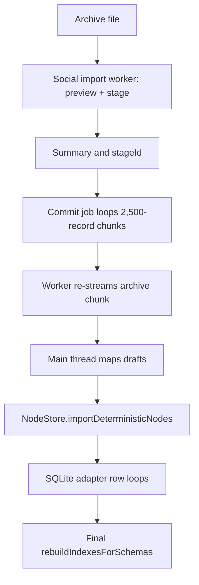
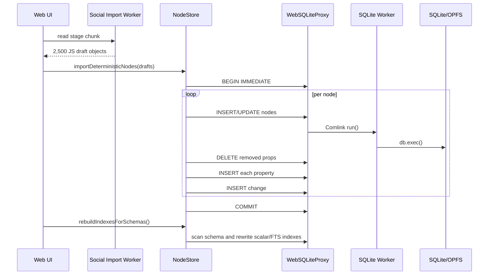
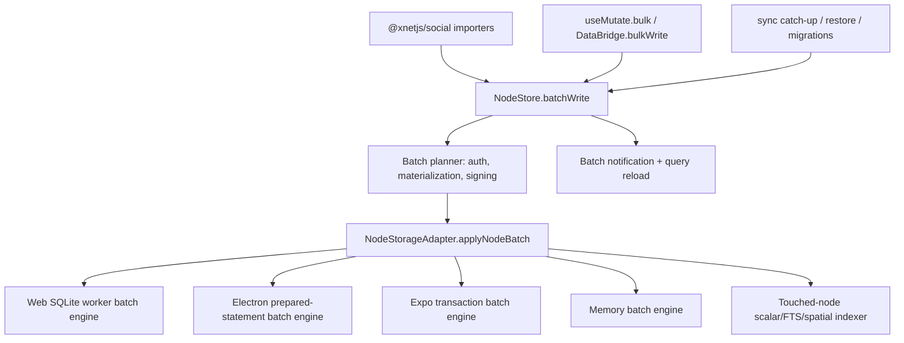
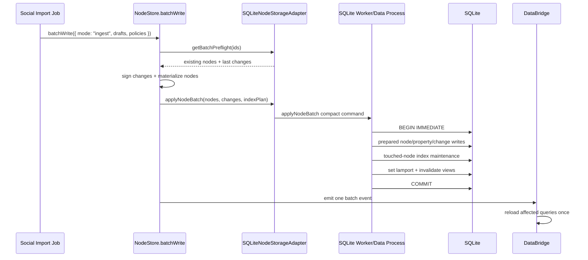
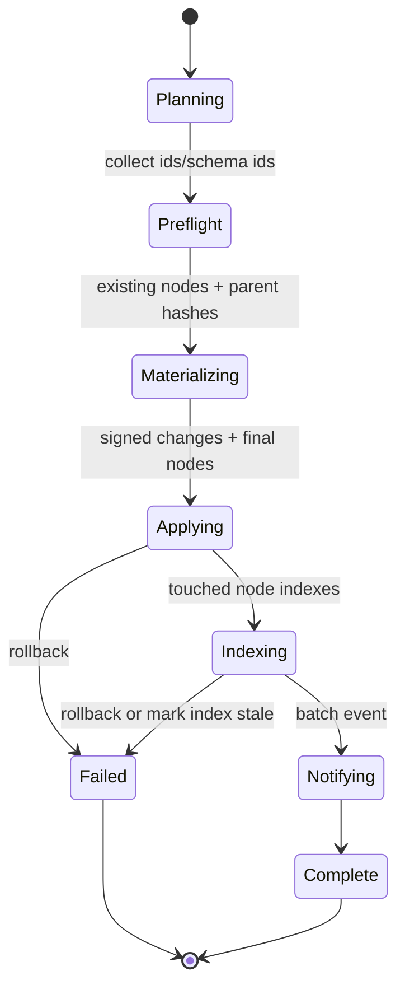
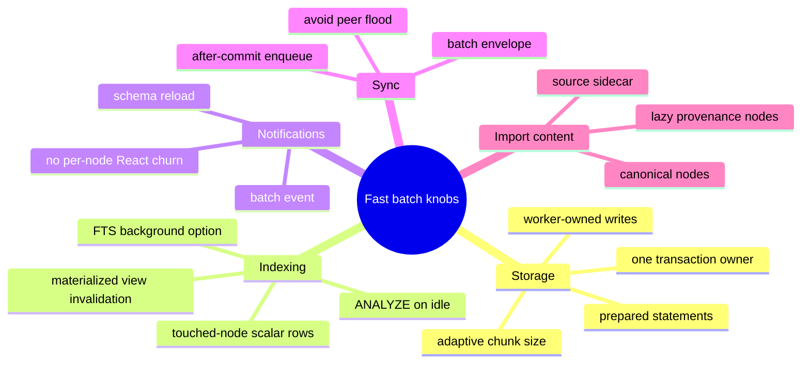

# Implementing Fast Batch Writes

## Problem Statement

xNet now has social importers that can stage large archives from YouTube, Twitter/X, TikTok, Claude, Reddit, ChatGPT, Instagram, Grok, and other sources. The current social import UX is usable, but commit speed still falls apart on large archives because xNet has logical batch semantics without a fully composed physical bulk-write system.

The immediate goal is to make social import commits dramatically faster. The broader goal is to turn that work into a general batch transaction system that can also support sync catch-up, migrations, AI/database bulk edits, restore/import flows, and future background jobs.

## Executive Summary

- ✅ xNet already has important batch concepts: `NodeStore.transaction()`, `NodeStore.importDeterministicNodes()`, `NodeStorageAdapter.withTransaction()`, optional `appendChanges()` / `importNodes()`, and SQLite `transactionBatch()`.
- ⚠️ These concepts do not currently compose into one high-throughput path. Social import still performs many row-by-row writes, per-record signed change creation, per-record notifications, and whole-schema index rebuilds.
- 🧱 The key missing primitive is a storage-owned node batch apply operation: NodeStore should prepare signed changes and materialized nodes once, then storage should apply nodes, properties, changes, lamport state, and touched-node indexes inside one adapter-owned fast path.
- 🚀 For web, the fastest architecture is not "send more SQL statements through Comlink." It is "send a compact batch command to the SQLite worker and execute prepared/reused statements inside that worker."
- 🧊 Many expensive features can be paused or coalesced during ingest: per-node query notifications, per-node devtools/history events, eager secondary index writes, materialized view refreshes, adaptive index maintenance, sync upload, and optional source-record nodeization. Core authorization, signing, atomicity, and crash consistency should not be silently disabled.

## Current State In The Repository

### Social Import Commit Path

Observed files:

- [`apps/web/src/lib/social-import-job-client.ts`](../../apps/web/src/lib/social-import-job-client.ts)
- [`apps/web/src/workers/social-import.worker.ts`](../../apps/web/src/workers/social-import.worker.ts)
- [`apps/web/src/routes/social-import.tsx`](../../apps/web/src/routes/social-import.tsx)
- [`apps/electron/src/main/social-import-ipc.ts`](../../apps/electron/src/main/social-import-ipc.ts)
- [`apps/electron/src/data-process/data-service.ts`](../../apps/electron/src/data-process/data-service.ts)

The web commit path batches at `COMMIT_BATCH_SIZE = 2500`, reads staged chunks from the social import worker, maps drafts into deterministic node import drafts, then calls:

```ts
store.importDeterministicNodes(batchDrafts, { deferIndexes: true })
```

After all chunks finish, the route calls:

```ts
store.rebuildIndexesForSchemas(schemaIds)
```

This is better than the early importer path because index maintenance is deferred, but the physical writes are still mostly row-by-row.

The social import worker makes a deliberate memory tradeoff:

- staging scans the archive once to produce summaries,
- commit re-streams the archive to produce chunks,
- this avoids holding hundreds of thousands of drafts in memory,
- but commit pays archive read/JSON/draft construction again.



### NodeStore Batch Semantics

Observed files:

- [`packages/data/src/store/store.ts`](../../packages/data/src/store/store.ts)
- [`packages/data/src/store/types.ts`](../../packages/data/src/store/types.ts)
- [`packages/data/src/store/memory-adapter.ts`](../../packages/data/src/store/memory-adapter.ts)
- [`packages/data/src/store/sqlite-adapter.ts`](../../packages/data/src/store/sqlite-adapter.ts)

`NodeStore.transaction()` already creates one logical batch:

- resolves temp IDs,
- authorizes the full operation list,
- creates one `batchId`,
- ticks Lamport once,
- emits changes after the storage transaction.

`NodeStore.importDeterministicNodes()` is a special importer path:

- accepts stable deterministic IDs,
- creates signed `NodeChange` records,
- materializes final `NodeState` in memory,
- calls storage `importNodes(nodes, { trustMaterializedState: true, deferIndexes })`,
- appends changes,
- sets lamport time,
- emits one event per changed node.

This is good logical batching. The weak point is that storage still receives generic node and change loops rather than a fused batch apply command.

### SQLite Storage Path

Observed files:

- [`packages/data/src/store/sqlite-adapter.ts`](../../packages/data/src/store/sqlite-adapter.ts)
- [`packages/sqlite/src/adapter.ts`](../../packages/sqlite/src/adapter.ts)
- [`packages/sqlite/src/adapters/web-proxy.ts`](../../packages/sqlite/src/adapters/web-proxy.ts)
- [`packages/sqlite/src/adapters/web-worker.ts`](../../packages/sqlite/src/adapters/web-worker.ts)
- [`packages/sqlite/src/adapters/web.ts`](../../packages/sqlite/src/adapters/web.ts)
- [`packages/sqlite/src/adapters/electron.ts`](../../packages/sqlite/src/adapters/electron.ts)
- [`packages/sqlite/src/schema.ts`](../../packages/sqlite/src/schema.ts)

`SQLiteNodeStorageAdapter.importNodes()` has a `transactionBatch()` fast path, but it is narrowly gated:

- requires `db.transactionBatch`,
- requires `trustMaterializedState === true`,
- rejects `deferIndexes === true`,
- rejects spatial tables.

Social import uses `deferIndexes: true`, so it does not use this path. Even more importantly, `NodeStore.importDeterministicNodes()` runs inside `storage.withTransaction()`. The transaction-scoped adapter maps:

```ts
importNodes: (nodes, options) => this.importNodesInternal(nodes, options)
appendChanges: (changes) => this.appendChangesInternal(changes)
```

That avoids nested transactions but also bypasses the public `importNodes()` fast path. The result is:

- one `nodes` upsert per node,
- one property cleanup delete per node,
- one `node_properties` upsert per property,
- one `changes` insert per change,
- one or more scalar/FTS/index writes later,
- one event per node.

On web, each `db.run()` through `WebSQLiteProxy` is a Comlink call into the SQLite worker. The proxy comments correctly say callback transactions cannot cross the worker boundary and recommend `transactionBatch()`, but social import is not getting an equivalent worker-local fused path.

### DataBridge And React Mutation APIs

Observed files:

- [`packages/data-bridge/src/types.ts`](../../packages/data-bridge/src/types.ts)
- [`packages/data-bridge/src/main-thread-bridge.ts`](../../packages/data-bridge/src/main-thread-bridge.ts)
- [`packages/data-bridge/src/worker-bridge.ts`](../../packages/data-bridge/src/worker-bridge.ts)
- [`packages/data-bridge/src/worker/data-worker.ts`](../../packages/data-bridge/src/worker/data-worker.ts)
- [`packages/react/src/hooks/useMutate.ts`](../../packages/react/src/hooks/useMutate.ts)

`useMutate().mutate([...])` is a transaction-shaped API, but it is not a high-throughput ingest API:

- `MainThreadBridge` can reach direct `NodeStore.transaction()`.
- `WorkerBridge` exposes only create/update/delete/restore one at a time.
- The hook explicitly notes worker bridge transactions are sequential, not truly atomic.
- `DataBridge` has no general bulk write method.

This matters because social import currently has to pierce through the route into direct `store.importDeterministicNodes()`. A future general solution should make batch writes callable through the same runtime boundary as other data operations.

### Current Notification Behavior

`MainThreadBridge` and `DataWorker` already detect bulk-ish change sets:

```ts
events.length > BULK_STORE_CHANGE_RELOAD_THRESHOLD ||
  events.some((event) => (event.change.batchSize ?? 1) > BULK_STORE_CHANGE_RELOAD_THRESHOLD)
```

That is useful, but NodeStore still emits one event per changed node. Consumers then coalesce after the fact. A true batch transaction system should emit a batch event first-class and let callers decide whether they need per-node detail.

### Indexing Shape

`node_property_scalars` is optimized for query lookup:

```sql
PRIMARY KEY (schema_id, property_key, node_id)
CREATE INDEX idx_prop_scalars_text
  ON node_property_scalars(schema_id, property_key, value_text, node_id)
```

But touched-node incremental reindexing frequently wants:

```sql
DELETE FROM node_property_scalars WHERE node_id IN (...)
```

There is no direct `node_id` index on `node_property_scalars` today. The adapter already deletes scalar rows by `node_id` in several places, so a fast batch system should add:

```sql
CREATE INDEX IF NOT EXISTS idx_prop_scalars_node
  ON node_property_scalars(node_id);
```

Similarly, `getLastChangesByNodeId()` asks for the newest change for each node. The schema has separate `idx_changes_node` and `idx_changes_lamport` indexes, but repeated large imports would benefit from:

```sql
CREATE INDEX IF NOT EXISTS idx_changes_node_lamport
  ON changes(node_id, lamport_time DESC, hash);
```

That aligns with SQLite's documented guidance that multi-column indexes help queries with multiple connected constraints and ordering terms.

## External Research

### SQLite Transactions

SQLite's own FAQ says the common "SQLite inserts are slow" failure mode is really "too many transactions." It notes that many inserts should be surrounded with `BEGIN ... COMMIT` so the transaction commit cost is amortized across all inserts. Source: [SQLite FAQ](https://sqlite.org/faq.html#q19).

xNet already wraps batches in transactions. The remaining issue is that xNet still executes many small statements through platform boundaries and does not yet use the fastest adapter-specific loop.

### SQLite Prepared Statements

SQLite documents prepared statements as compiled byte-code programs created with `sqlite3_prepare_v2()` / `sqlite3_prepare_v3()`. Source: [SQLite prepare docs](https://sqlite.org/c3ref/prepare.html) and [prepared statement object docs](https://www.sqlite.org/c3ref/stmt.html).

Implication for xNet:

- Electron/better-sqlite3 should reuse prepared statements inside hot batch writers.
- Web sqlite-wasm should execute repeated SQL from the SQLite worker, not through a main-thread proxy call per row.
- `transactionBatch([{ sql, params }, ...])` is a useful escape hatch, but a typed `applyNodeBatch()` worker command avoids structured-cloning huge SQL operation arrays.

### SQLite Transaction Nesting And Write Locks

SQLite transactions started with `BEGIN...COMMIT` do not nest; nested behavior requires savepoints. It also supports multiple readers but one writer. Source: [SQLite transaction docs](https://sqlite.org/lang_transaction.html).

This lines up with the earlier browser error:

```txt
SQLITE_ERROR: cannot start a transaction within a transaction
```

Batch writes should have a clear single owner of transaction scope. NodeStore should not start a transaction and then ask a lower layer to start another `BEGIN`.

### SQLite Query Planning And Composite Indexes

SQLite's query planner documentation explains why multi-column indexes can avoid wasted binary searches when a query constrains multiple terms. Source: [SQLite query planner](https://www.sqlite.org/queryplanner.html).

This applies to:

- `changes(node_id, lamport_time DESC)` for last-change lookup,
- `node_property_scalars(node_id)` for touched-node deletion,
- possible covering/index additions for common workspace queries after import.

### SQLite Wasm And OPFS

SQLite's wasm persistence docs say OPFS is worker-thread-only and that clients prioritizing performance over concurrency should use `opfs-sahpool`. Source: [SQLite wasm persistent storage docs](https://sqlite.org/wasm/doc/trunk/persistence.md).

xNet already uses a SQLite worker and OPFS SAH pool where available. The architecture should lean into that: keep the fastest SQLite write loop inside the worker that owns OPFS rather than bouncing millions of operations across Comlink.

### Structured Clone, Transferables, And Comlink

MDN documents structured clone as the algorithm used to transfer data between workers via `postMessage()`, and it copies complex JavaScript objects. Source: [MDN structured clone](https://developer.mozilla.org/en-US/docs/Web/API/Web_Workers_API/Structured_clone_algorithm).

MDN also documents transferable objects such as `ArrayBuffer`, where ownership moves across threads instead of copying bytes. Source: [MDN transferable objects](https://developer.mozilla.org/en-US/docs/Web/API/Web_Workers_API/Transferable_objects).

Comlink's README says parameters, return values, and object properties are copied by structured clone by default, and `Comlink.transfer()` is needed to transfer instead of copy. Source: [Comlink README](https://github.com/googlechromelabs/comlink#comlinktransfervalue-transferables-and-comlinkproxyvalue).

Implication for xNet:

- Do not send millions of `{ sql, params }` objects if a compact semantic batch command can be sent instead.
- Prefer worker-owned parsing/writing or compact columnar batches for massive imports.
- Use transferables for large binary payloads where possible; ordinary JS object graphs will be copied.

## Key Findings

### 1. The Bottleneck Is Write Amplification, Not Just Import Parsing

The importer parser/stager matters, but the most expensive path is the generic NodeStore + SQLite write path:



For social data, one canonical record can easily become 10-25 SQL statements after properties, changes, indexes, and cleanup. At 280k records, that can become millions of small statements.

### 2. `transactionBatch()` Is Not Enough By Itself

`transactionBatch()` reduces main-thread/worker round trips when the caller can create one operation array. But for social import:

- current code bypasses it,
- generating massive arrays of SQL strings and params creates memory and clone overhead,
- it still runs one SQL operation at a time in the worker,
- it cannot easily include preflight reads, materialization, writes, indexes, and notifications as one semantic operation.

Recommendation: keep `transactionBatch()` as a generic SQLite escape hatch, but build a typed `applyNodeBatch()` above it.

### 3. Whole-Schema Reindexing Is The Wrong Long-Term Default

`deferIndexes: true` was a good first speedup because it removed per-node index work from the hot loop. But final `rebuildIndexesForSchemas()` scales with the entire database for each affected schema, not the import size.

That means the 10th YouTube import gets slower because it reindexes the prior 9 imports too.

Preferred model:

- during batch write, pause eager index writes,
- collect touched node IDs and final materialized states,
- delete scalar/FTS rows for touched nodes,
- insert new scalar/FTS rows for touched nodes using prepared statements,
- invalidate materialized views once per schema,
- optionally run `ANALYZE` or adaptive index maintenance later.

### 4. NodeStore Events Are Too Granular For Ingest

NodeStore currently emits one event per changed node. DataBridge coalesces large sets after receipt, but every event still gets allocated, emitted, and potentially observed.

Batch import should produce:

```ts
type NodeBatchChangeEvent = {
  type: 'batch'
  batchId: string
  nodeIds: readonly NodeId[]
  schemaIds: readonly SchemaIRI[]
  created: number
  updated: number
  changes: readonly NodeChangeSummary[]
}
```

Then interested systems can choose:

- reload schema queries,
- inspect compact summaries,
- lazily fetch full nodes,
- opt into per-node events for small batches only.

### 5. Batch Writes Need A Policy Surface

"Fast" is not one behavior. It is a set of choices:

- Should indexes be eager, touched-node batched, whole-schema deferred, or background?
- Should query subscribers receive per-node deltas, schema reloads, or silence until commit?
- Should sync broadcast per change immediately or enqueue after commit?
- Should source records become nodes now or be stored as raw provenance sidecars?
- Should adaptive indexes and `ANALYZE` run immediately or on idle?

These should be explicit batch policies rather than hidden importer-specific hacks.

## Recommended Architecture

Add a first-class batch transaction stack with three layers:

1. **NodeStore batch API**: creates signed changes, materializes nodes, applies auth policy, and emits a batch event.
2. **NodeStorageAdapter batch API**: applies materialized nodes + changes + index work in one storage-owned transaction.
3. **SQLite adapter batch engines**: use the fastest platform path:
   - Electron: prepared statements inside better-sqlite3 transaction.
   - Web: typed worker command that executes inside the SQLite worker.
   - Expo: explicit transaction with prepared statements where available.
   - Memory: map/set updates inside a cloned transaction context.



### Proposed Runtime Flow



### Batch Lifecycle



## API Shape

### NodeStore

```ts
export type NodeBatchWritePolicy = {
  indexMode: 'eager' | 'touched' | 'defer-schema' | 'background'
  notificationMode: 'per-node' | 'batch' | 'silent'
  syncMode: 'immediate' | 'after-commit' | 'paused'
  materializedViewMode: 'invalidate' | 'refresh' | 'skip'
  sourceRecordMode?: 'nodes' | 'sidecar' | 'skip'
}

export type DeterministicNodeBatchInput = {
  kind: 'deterministic-import'
  drafts: readonly DeterministicNodeImportDraft[]
  policy?: Partial<NodeBatchWritePolicy>
}

export type NodeBatchWriteResult = {
  batchId: string
  created: number
  updated: number
  nodeIds: readonly NodeId[]
  schemaIds: readonly SchemaIRI[]
  changeCount: number
  timings: {
    preflightMs: number
    materializeMs: number
    applyMs: number
    notifyMs: number
  }
}

class NodeStore {
  async batchWrite(input: DeterministicNodeBatchInput): Promise<NodeBatchWriteResult> {
    // v1 delegates social imports here.
  }
}
```

### NodeStorageAdapter

```ts
export type ApplyNodeBatchInput = {
  batchId: string
  nodes: readonly NodeState[]
  changes: readonly NodeChange[]
  lastLamportTime: number
  indexMode: 'eager' | 'touched' | 'defer-schema' | 'background'
  affectedSchemaIds: readonly SchemaIRI[]
}

export type ApplyNodeBatchResult = {
  nodeRowsWritten: number
  propertyRowsWritten: number
  changeRowsWritten: number
  scalarRowsWritten: number
  ftsRowsWritten: number
}

export interface NodeStorageAdapter {
  getBatchPreflight?(ids: readonly NodeId[]): Promise<{
    nodesById: Map<NodeId, NodeState>
    lastChangesByNodeId: Map<NodeId, NodeChange>
  }>

  applyNodeBatch?(input: ApplyNodeBatchInput): Promise<ApplyNodeBatchResult>
}
```

### DataBridge

```ts
export type BulkMutateInput =
  | {
      kind: 'deterministic-import'
      drafts: readonly DeterministicNodeImportDraft[]
      policy?: Partial<NodeBatchWritePolicy>
    }
  | {
      kind: 'operations'
      operations: readonly TransactionOperation[]
      policy?: Partial<NodeBatchWritePolicy>
    }

export interface DataBridge {
  bulkWrite?(input: BulkMutateInput): Promise<NodeBatchWriteResult>
}
```

This lets importers, AI tools, migrations, and sync restore all call one composable interface.

## Performance Tradeoffs

### Batch Size

| Choice                | Benefits                             | Costs                                 | Recommendation                                  |
| --------------------- | ------------------------------------ | ------------------------------------- | ----------------------------------------------- |
| 500 records           | frequent progress, low memory        | too many transactions                 | keep only for very constrained devices          |
| 2,500 records         | current compromise                   | still many batches at 280k+           | acceptable fallback                             |
| 5k-25k adaptive       | fewer transactions and notifications | longer locks, more memory             | recommended with progress inside storage worker |
| one giant transaction | maximum amortization                 | long lock, high memory, poor recovery | only for explicit offline/import mode           |

Recommendation: implement adaptive chunking based on observed `applyMs`, memory pressure, and UI progress cadence. A good starting policy:

- start at 5,000 canonical nodes,
- grow toward 20,000 if apply time is under 2 seconds,
- shrink if apply time exceeds 8 seconds or the browser reports memory pressure,
- always commit at bucket boundaries when possible to improve resumability.

### Index Policy

| Policy         | Query correctness after batch | Import speed                    | Notes                                      |
| -------------- | ----------------------------- | ------------------------------- | ------------------------------------------ |
| `eager`        | immediate                     | slowest                         | good for small user actions                |
| `defer-schema` | correct after final rebuild   | medium initially, slow at scale | current social-import shape                |
| `touched`      | immediate for touched nodes   | fast                            | recommended default                        |
| `background`   | eventually correct            | fastest foreground              | requires clear UI state and query fallback |

Recommendation: make `touched` the default for imports. Use `background` only for optional FTS/adaptive indexes where stale search is acceptable for a short time.

### Notification Policy

| Policy     | UI behavior                            | Cost   | Use case             |
| ---------- | -------------------------------------- | ------ | -------------------- |
| `per-node` | fine-grained deltas                    | high   | small edits          |
| `batch`    | one batch summary and schema reload    | low    | imports/migrations   |
| `silent`   | no live updates until explicit refresh | lowest | internal repair jobs |

Recommendation: social import should use `batch` notifications. DataWorkspace should show progress from the job queue, then reload affected schema lenses once per committed chunk or once after final commit.

### Sync Policy

| Policy         | Network behavior                     | Cost   | Risk                 |
| -------------- | ------------------------------------ | ------ | -------------------- |
| `immediate`    | broadcast each change as produced    | high   | floods peers and hub |
| `after-commit` | enqueue batch after local commit     | medium | recommended          |
| `paused`       | no automatic sync until user resumes | low    | may surprise users   |

Recommendation: queue sync after each storage commit, but coalesce upload/broadcast into batch envelopes where the sync layer supports it.

### Source Records

Source records are valuable provenance but expensive as first-class nodes. For social import, they can add tens of thousands of records and amplify every bottleneck.

Recommendation:

- default to canonical graph nodes only,
- store raw source records in a provenance sidecar keyed by deterministic source ID,
- create source-record nodes lazily when users inspect provenance or opt into full archival mode.



## Features To Pause Or Coalesce During Fast Batch Writes

### Safe To Pause Or Coalesce By Default

- **Per-node query cache deltas**: replace with one schema reload per batch.
- **Per-node React notifications**: emit one batch event.
- **Materialized view refresh**: invalidate once and refresh lazily.
- **Adaptive index creation/maintenance**: run after import on idle.
- **FTS updates**: batch touched nodes or run as a background index job.
- **Devtools timeline detail**: record one batch event with sampled examples.
- **Sync upload/broadcast**: enqueue after local commit and coalesce.
- **Source-record nodeization**: sidecar by default, nodes on demand.
- **Archive re-read during commit**: optionally stream directly from staging worker into batch writer.

### Pause Only Behind Explicit Policy

- **Durability reductions** such as `PRAGMA synchronous=OFF`: not safe by default. Current web adapter uses `synchronous=NORMAL`; keep that default unless the user explicitly opts into an unsafe "scratch import" mode.
- **Foreign key checks**: could speed controlled bulk loads, but xNet's graph storage depends on referential cleanup. Do not disable initially.
- **Authorization checks**: can be bulk preflighted, but should not be skipped for general writes.
- **Per-change signatures**: expensive but central to xNet sync/audit. Do not remove in v1. Explore batch envelope signatures later only if sync semantics are redesigned.
- **Encryption**: never disable automatically. Encrypted stores should skip plaintext indexes rather than weakening encryption.

## Options And Tradeoffs

### Option A: Patch Social Import Only

Add a route-specific faster import command for social imports.

Pros:

- fastest to implement,
- smallest surface area,
- directly improves current UX.

Cons:

- duplicates future migration/sync/AI bulk needs,
- social import keeps special access to direct `NodeStore`,
- does not solve `useMutate` / DataBridge batch gap.

Verdict: useful as a spike, not the final architecture.

### Option B: General `NodeStore.batchWrite()` + Storage `applyNodeBatch()`

Create a reusable data-layer batch primitive.

Pros:

- helps social import, sync catch-up, restore, migrations, AI bulk edits,
- gives one place for policies and performance metrics,
- works with DataBridge and future runtimes,
- preserves NodeStore semantics.

Cons:

- larger implementation,
- requires careful tests for parity with `transaction()` and `importDeterministicNodes()`,
- storage adapters need capability-based fallback.

Verdict: recommended.

### Option C: SQLite-Layer SQL Operation Batching Only

Expand `transactionBatch()` and teach callers to use it more often.

Pros:

- clear storage optimization,
- helpful for simple SQL batches.

Cons:

- still clones huge SQL operation arrays on web,
- does not understand NodeStore semantics,
- hard to batch preflight, materialization, index policies, and notifications.

Verdict: keep as a fallback, but not enough for social import scale.

### Option D: Unsafe Bulk Loader

Skip signatures, indexes, sync, and durability; write raw nodes only.

Pros:

- fastest possible local ingestion.

Cons:

- breaks xNet's event-sourced/signed model,
- weakens sync/audit semantics,
- dangerous if mixed with normal data.

Verdict: not appropriate for default product behavior. Could be a developer-only benchmark mode.

## Recommendation

Build Option B in phases, using social import as the first consumer.

### Phase 1: Instrument And Lock Baselines

Add metrics around:

- archive streaming time,
- draft mapping time,
- auth/preflight time,
- signing/materialization time,
- storage apply time,
- index maintenance time,
- notification/query reload time,
- SQL operation counts,
- Comlink request counts on web.

Use existing social benchmark record counts:

- 10k,
- 72,738,
- 280k,
- 1M.

### Phase 2: Add Storage-Owned `applyNodeBatch()`

Add optional `NodeStorageAdapter.applyNodeBatch()` and `getBatchPreflight()`.

`NodeStore.importDeterministicNodes()` should prefer:

1. `storage.getBatchPreflight(ids)`,
2. materialize/sign in NodeStore,
3. `storage.applyNodeBatch({ nodes, changes, indexMode: 'touched' })`,
4. emit one batch event.

Fallback remains existing `withTransaction()` + `importNodes()` + `appendChanges()`.

### Phase 3: Implement SQLite Batch Engines

Electron:

- use better-sqlite3 prepared statements,
- run one synchronous transaction body,
- reuse statement cache for hot imports.

Web:

- add a typed Comlink method on `SQLiteWorkerHandler`, e.g. `applyNodeBatch(input)`,
- execute the full batch in the SQLite worker,
- avoid `WebSQLiteProxy.run()` per row,
- avoid giant `{ sql, params }` arrays where practical.

Expo:

- implement explicit transaction fallback first,
- use prepared statements if stable in Expo's API.

Memory:

- implement transactional clone/commit for parity tests.

### Phase 4: Touched-Node Indexing

Add schema migrations:

```sql
CREATE INDEX IF NOT EXISTS idx_prop_scalars_node
  ON node_property_scalars(node_id);

CREATE INDEX IF NOT EXISTS idx_changes_node_lamport
  ON changes(node_id, lamport_time DESC, hash);
```

Add batch index operations:

- delete scalar rows for touched IDs,
- insert scalar rows from final node state,
- delete/update FTS rows for touched IDs,
- spatial rows only when spatial tables/configs exist,
- invalidate materialized views once per schema.

### Phase 5: DataBridge And Hook Ergonomics

Add:

- `DataBridge.bulkWrite()`,
- `WorkerBridge.bulkWrite()` RPC,
- `MainThreadBridge.bulkWrite()`,
- `useMutate().bulk()` for app authors,
- social import route uses DataBridge where possible, direct store only as fallback.

### Phase 6: Optional Source Sidecar

Add provenance sidecar storage:

- raw source record chunks keyed by source deterministic ID,
- archive/run metadata nodes still created,
- source-record nodes lazy-created for inspection.

This can reduce social import write volume without sacrificing provenance.

## Implementation Checklist

- [ ] Add batch metrics types and counters for social import commit phases.
- [ ] Add SQL/Comlink operation counting in dev mode for web SQLite imports.
- [ ] Add `NodeBatchWritePolicy`, `NodeBatchWriteResult`, and `NodeStore.batchWrite()` types.
- [x] Add `NodeStorageAdapter.getBatchPreflight()` optional capability.
- [x] Add `NodeStorageAdapter.applyNodeBatch()` optional capability.
- [x] Refactor `NodeStore.importDeterministicNodes()` to use `applyNodeBatch()` when available.
- [x] Preserve existing fallback behavior for memory/test adapters.
- [ ] Add `NodeBatchChangeEvent` or equivalent batch notification shape.
- [ ] Update MainThreadBridge and DataWorker cache invalidation to consume batch events directly.
- [x] Add SQLite migrations for `idx_prop_scalars_node` and `idx_changes_node_lamport`.
- [ ] Implement Electron `applyNodeBatch()` with prepared statements inside one transaction.
- [ ] Implement web `SQLiteWorkerHandler.applyNodeBatch()` to run inside the SQLite worker.
- [x] Implement SQLite touched-node scalar index maintenance.
- [x] Implement SQLite touched-node FTS maintenance.
- [x] Coalesce materialized-view invalidation to once per affected schema.
- [ ] Add `DataBridge.bulkWrite()` and worker RPC support.
- [ ] Add `useMutate().bulk()` or a dedicated `useBulkMutate()` hook.
- [ ] Move web social import to the new bulk path.
- [ ] Move Electron social import to the same bulk path.
- [ ] Add optional source-record sidecar design behind a feature flag.
- [ ] Add import policy controls for index, notification, sync, and source-record behavior.
- [ ] Update docs in `packages/social/README.md` and data/react package docs.

## Validation Checklist

- [ ] Unit test `NodeStore.batchWrite()` parity with `transaction()` for creates, updates, deletes, and duplicate IDs.
- [ ] Unit test `importDeterministicNodes()` parity with existing behavior.
- [ ] Unit test LWW behavior when existing properties have newer Lamport timestamps.
- [ ] Unit test parent hash chaining for duplicate deterministic IDs in one batch.
- [ ] Unit test rollback leaves no partial nodes, properties, changes, scalar rows, or FTS rows.
- [ ] Unit test touched-node scalar rows match whole-schema rebuild output.
- [ ] Unit test touched-node FTS rows match whole-schema rebuild output.
- [ ] Unit test materialized views invalidate once per schema.
- [ ] Unit test batch notifications cause one schema reload rather than per-node churn.
- [ ] Browser benchmark YouTube/TikTok-style 10k import before/after.
- [ ] Browser benchmark 72,738 canonical records before/after.
- [ ] Browser benchmark 280k records with source records disabled.
- [ ] Browser stress test 1M synthetic records in chunks.
- [ ] Electron benchmark same record counts.
- [ ] Verify OPFS storage remains persistent and no corruption after cancelled import.
- [ ] Verify resume after crash/cancel starts at the last committed chunk.
- [ ] Verify foreground UI remains responsive during web import.
- [ ] Verify query results are correct immediately after touched-node index commit.
- [ ] Verify sync/hub upload is coalesced and does not flood per-node updates.
- [ ] Verify durable-storage warning and storage recovery paths still work.

## Example Code

### NodeStore Batch Apply Sketch

```ts
async function importDeterministicNodesFast(
  store: NodeStore,
  storage: NodeStorageAdapter,
  drafts: readonly DeterministicNodeImportDraft[],
  policy: Partial<NodeBatchWritePolicy> = {}
): Promise<NodeBatchWriteResult> {
  const indexMode = policy.indexMode ?? 'touched'
  const notificationMode = policy.notificationMode ?? 'batch'
  const ids = Array.from(new Set(drafts.map((draft) => draft.id)))

  const preflight = storage.getBatchPreflight
    ? await storage.getBatchPreflight(ids)
    : {
        nodesById: await readNodesById(storage, ids),
        lastChangesByNodeId: await readLastChangesByNodeId(storage, ids)
      }

  const planned = await store.planDeterministicImportBatch({
    drafts,
    existingNodes: preflight.nodesById,
    lastChanges: preflight.lastChangesByNodeId
  })

  if (storage.applyNodeBatch) {
    await storage.applyNodeBatch({
      batchId: planned.batchId,
      nodes: planned.nodes,
      changes: planned.changes,
      lastLamportTime: planned.lastLamportTime,
      indexMode,
      affectedSchemaIds: planned.affectedSchemaIds
    })
  } else {
    await storage.withTransaction?.(async (tx) => {
      await tx.importNodes?.(planned.nodes, {
        trustMaterializedState: true,
        deferIndexes: indexMode !== 'eager'
      })
      await tx.appendChanges?.(planned.changes)
      await tx.setLastLamportTime(planned.lastLamportTime)
    })
  }

  store.emitBatchChange({
    mode: notificationMode,
    batchId: planned.batchId,
    nodeIds: planned.nodeIds,
    schemaIds: planned.affectedSchemaIds,
    created: planned.created,
    updated: planned.updated
  })

  return planned.summary
}
```

### Web SQLite Worker Command Sketch

```ts
class SQLiteWorkerHandler {
  async applyNodeBatch(input: SerializedApplyNodeBatchInput): Promise<ApplyNodeBatchResult> {
    if (!this.adapter) throw new Error('Database not open')

    return this.adapter.transaction(async () => {
      const statements = getNodeBatchStatements(this.adapter)
      let propertyRowsWritten = 0
      let scalarRowsWritten = 0

      for (const node of input.nodes) {
        statements.upsertNode.run(nodeMetaParams(node))
        statements.deleteRemovedProperties.run(deleteRemovedPropertyParams(node))

        for (const property of node.properties) {
          statements.upsertProperty.run(propertyParams(node, property))
          propertyRowsWritten += 1
        }
      }

      for (const change of input.changes) {
        statements.insertChange.run(changeParams(change))
      }

      if (input.indexMode === 'touched') {
        statements.deleteScalarRowsForNodeIds.run(input.nodeIds)
        for (const node of input.nodes) {
          for (const scalar of scalarRowsForNode(node)) {
            statements.insertScalarRow.run(scalar)
            scalarRowsWritten += 1
          }
        }
      }

      statements.setLastLamport.run(input.lastLamportTime)
      for (const schemaId of input.affectedSchemaIds) {
        statements.invalidateMaterializations.run(Date.now(), schemaId)
      }

      return {
        nodeRowsWritten: input.nodes.length,
        propertyRowsWritten,
        changeRowsWritten: input.changes.length,
        scalarRowsWritten,
        ftsRowsWritten: 0
      }
    })
  }
}
```

This example is intentionally semantic. The implementation should avoid passing method callbacks across Comlink; the full batch command should execute in the SQLite worker/data process that owns the database.

## Expected Performance Impact

These are estimates to validate, not guarantees:

- Removing per-statement Comlink calls on web should be the largest single win, plausibly 3x-10x on large imports.
- Replacing whole-schema rebuilds with touched-node indexing should make later imports scale with the new chunk size rather than total historical data.
- Composite indexes should reduce preflight time as the change log grows.
- Batch notifications should reduce React/query churn and make large imports feel calmer.
- Source sidecar mode can reduce write volume by the source-record ratio of each archive, often tens of percent.

The target should be framed as relative improvement first:

- 5x faster than the current web canonical social import baseline,
- stable record/sec as prior imports accumulate,
- no corruption or partial commit after cancellation,
- no lost sync/audit semantics in the default mode.

## Risks And Unknowns

- **Web sqlite-wasm statement reuse**: current `WebSQLiteAdapter.prepare()` is simulated on the oo1 API. The worker command may need lower-level sqlite-wasm APIs or accept `db.exec()` loops as v1.
- **Structured clone cost**: sending `NodeState[]` and `NodeChange[]` is still object-heavy. A v2 could use columnar arrays or worker-local import materialization.
- **Auth semantics**: bulk authorization must match current per-operation behavior exactly.
- **Encrypted stores**: plaintext indexes are disabled when node content is encrypted. Batch policies must preserve that behavior.
- **FTS correctness**: background FTS must mark search as stale or fall back to non-FTS query behavior until caught up.
- **Long transactions**: very large batches can hold write locks too long. Adaptive chunking and progress callbacks are required.
- **Multi-tab web behavior**: `opfs-sahpool` prioritizes performance over concurrency. Long batch writes should surface clear progress and retry behavior.

## Next Actions

1. Add measurement around current social import write phases and SQL/Comlink counts.
2. Implement `applyNodeBatch()` in `SQLiteNodeStorageAdapter` for Electron/memory first, where debugging is simpler.
3. Add touched-node scalar indexing plus the required node-id and change-log composite indexes.
4. Add the web SQLite worker `applyNodeBatch()` command and route social import through it.
5. Add DataBridge bulk write ergonomics after the storage path proves itself.

## References

### Repository References

- [Social import speed exploration 0156](./0156_[x]_THIS_LOADING_UX_IS_BETTER_BUT_STILL_PAINFULLY_SLOW_EXPLORE_HOW_WE_MIGHT_DRAMATICALLY_IMPROVE_THE_SOCIAL_IMPORT_SPEED.md)
- [Web social import job client](../../apps/web/src/lib/social-import-job-client.ts)
- [Web social import worker](../../apps/web/src/workers/social-import.worker.ts)
- [Electron social import IPC](../../apps/electron/src/main/social-import-ipc.ts)
- [Electron data service import path](../../apps/electron/src/data-process/data-service.ts)
- [NodeStore](../../packages/data/src/store/store.ts)
- [NodeStorageAdapter types](../../packages/data/src/store/types.ts)
- [SQLiteNodeStorageAdapter](../../packages/data/src/store/sqlite-adapter.ts)
- [SQLite adapter interface](../../packages/sqlite/src/adapter.ts)
- [Web SQLite proxy](../../packages/sqlite/src/adapters/web-proxy.ts)
- [Web SQLite worker](../../packages/sqlite/src/adapters/web-worker.ts)
- [SQLite schema](../../packages/sqlite/src/schema.ts)
- [DataBridge types](../../packages/data-bridge/src/types.ts)
- [React useMutate](../../packages/react/src/hooks/useMutate.ts)

### External References

- [SQLite FAQ: INSERT is really slow](https://sqlite.org/faq.html#q19)
- [SQLite transaction documentation](https://sqlite.org/lang_transaction.html)
- [SQLite prepared statement compilation](https://sqlite.org/c3ref/prepare.html)
- [SQLite prepared statement object](https://www.sqlite.org/c3ref/stmt.html)
- [SQLite query planner](https://www.sqlite.org/queryplanner.html)
- [SQLite wasm persistent storage and OPFS](https://sqlite.org/wasm/doc/trunk/persistence.md)
- [MDN structured clone algorithm](https://developer.mozilla.org/en-US/docs/Web/API/Web_Workers_API/Structured_clone_algorithm)
- [MDN transferable objects](https://developer.mozilla.org/en-US/docs/Web/API/Web_Workers_API/Transferable_objects)
- [Comlink transfer/proxy docs](https://github.com/googlechromelabs/comlink#comlinktransfervalue-transferables-and-comlinkproxyvalue)
