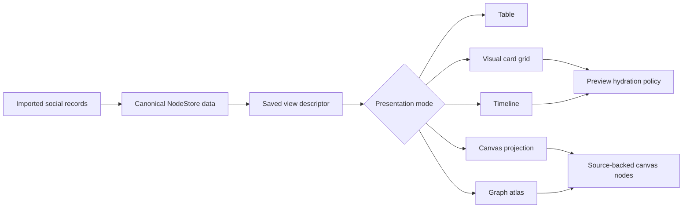
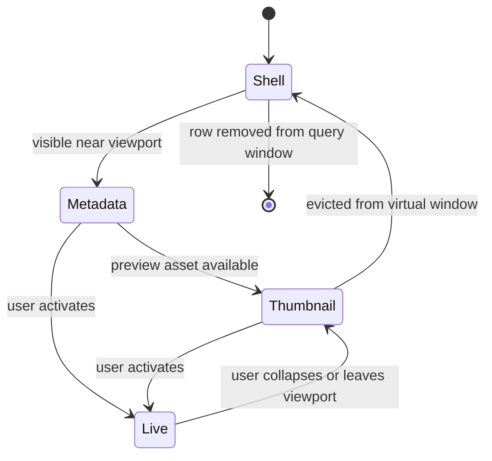
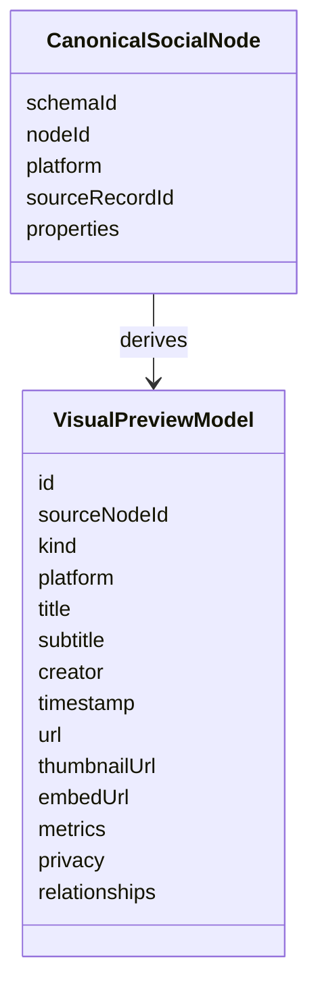
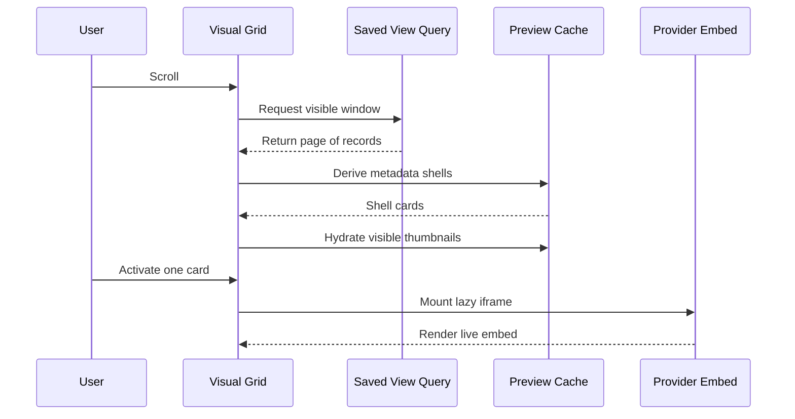
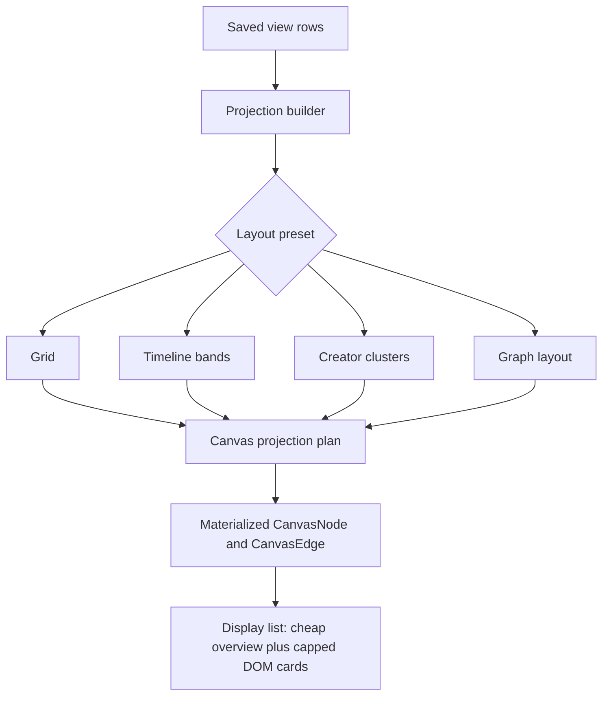
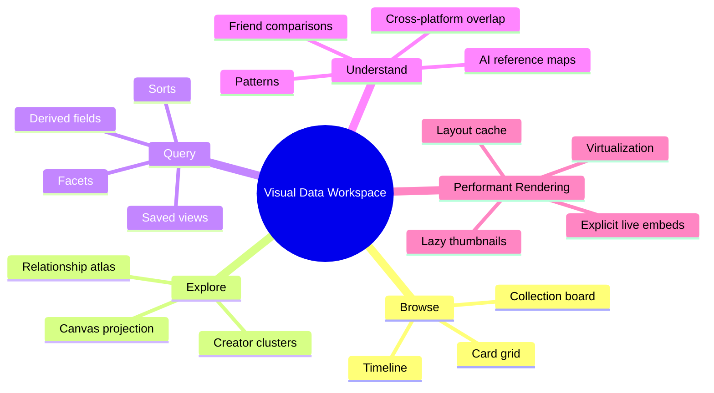
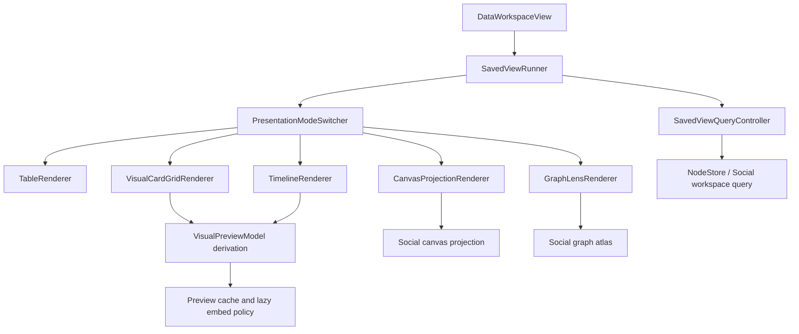
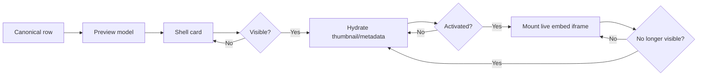

# More Visual Data Workspace

## Problem Statement

xNet now imports a meaningful social graph from multiple exports, and the data workspace can query and inspect that data. The current experience is still mostly tabular and summary-oriented. That is useful for verification, but it does not yet feel like a compelling way to browse, compare, or rediscover large personal archives of videos, posts, saves, chats, comments, channels, creators, playlists, subreddits, and AI references.

The product opportunity is to make the data workspace more visual without making it slow. Social records should be visible through multiple lenses: virtualized embedded-card grids, timelines, source-backed canvases, graph maps, creator clusters, collections, and pattern workspaces. The same architecture should generalize beyond social imports into the broader xNet data workspace.

## Executive Summary

The strongest path is to add a visual renderer layer to saved views, not a separate one-off social page.

- Use saved view descriptors as the query and lens contract.
- Use presentation modes (`table`, `cards`, `timeline`, `canvas`, `graph`) as the UX switch.
- Render rich previews from a normalized `VisualPreviewModel` derived from canonical nodes.
- Keep provider embeds lazy and explicit: thumbnail or metadata shell first, live iframe only when visible and activated.
- Use virtualized list/grid renderers for high-volume browsing.
- Use source-backed canvas projections for bounded spatial exploration, not as a replacement for canonical storage.
- Reuse existing canvas display-list culling, external reference cards, embed parsing, social graph lenses, and saved layout presets.

The first useful implementation should be:

1. A visual card grid renderer inside `SavedViewRunner`.
2. A timeline renderer for date-oriented saved views.
3. An "open as canvas" path that materializes a bounded, source-backed projection for the current saved view.
4. Layout presets for creator clusters, date lanes, content-type lanes, and graph relationships.

## Current State In The Repository

### Data Workspace UI

`apps/web/src/components/DataWorkspaceView.tsx` is already the main web entry point for social/data browsing. It renders:

- social metrics
- active social import job progress
- graph atlas summaries
- pattern suggestions
- saved view cards and `SavedViewRunner`

`apps/web/src/routes/data.tsx` mounts the workspace route. The page is already the correct place to expose visual workspace modes because it is the user's current "data home."

### Saved Views And Presentation Modes

`packages/social/src/workspace/defaults.ts` seeds the default social workspace. The important existing seam is that saved views already advertise presentation modes:

- schema-backed views support `table`, `facet-browser`, `timeline`, and `canvas`
- graph lenses support `graph`, `canvas`, `table`, and `facet-browser`

That means the data model already says "this view can be rendered in multiple ways." The UI just needs to turn that into concrete, fast renderers.

### Social Graph Lenses

`packages/social/src/lenses/graph-lenses.ts` defines high-level lenses such as:

- people I follow
- saved content by creator
- conversation references
- AI citations

`packages/social/src/lenses/atlas.ts` groups those lenses into an atlas. This is a good product primitive: a user should be able to choose a lens, then pick the visual layout that makes that lens intelligible.

### Canvas Projection

`packages/social/src/projection/canvas.ts` already creates a bounded projection plan for social data. It emits source-backed canvas node drafts such as:

- `external-reference`
- source node ID
- source schema ID
- platform
- privacy
- group key
- social kind

`packages/canvas/src/projection/materialize.ts` turns projection plans into `CanvasNode[]` and `CanvasEdge[]`. This means visual social canvases do not need to duplicate imported records. They can stay as projections over canonical data.

### Canvas Performance Foundation

`packages/canvas/src/store.ts` has spatial lookup through `getVisibleNodes(viewport)`.

`packages/canvas/src/renderer/display-list.ts` already separates:

- visible DOM nodes
- cheap overview nodes
- selected nodes that must stay interactive

The current display list has a DOM-node cap and viewport buffer. That is exactly the strategy needed for heavy social previews: only a small number of expensive rendered cards should exist as DOM at once.

### Existing Layout Engine

`packages/canvas/src/layout/index.ts` already uses ELK through a dynamic import. Supported saved layout plans include:

- grid
- swimlane
- kanban
- timeline
- dependency map
- org chart

`packages/canvas/src/layout/saved-layouts.ts` can generate stable positions from field mappings. This is a strong starting point for social layouts like creator clusters, date lanes, platform lanes, and collection boards.

### Existing Embed Infrastructure

`packages/data/src/external-references.ts` parses external references for several providers, including YouTube, Spotify, Twitter/X, Instagram, TikTok, Figma, CodeSandbox, Vimeo, and Loom.

`packages/editor/src/extensions/embed/EmbedNodeView.tsx` already uses `IntersectionObserver` to delay iframe work until an embed is close to the viewport.

`packages/editor/src/components/CanvasExternalReferenceCard.tsx` already has a compact-to-live lifecycle for external references. It can render a provider shell first, then mount the live embed when interaction and render mode allow it.

This is the right preview model for social data too.

### Existing Virtualization

`packages/views` already depends on `@tanstack/react-virtual` and has virtualized table infrastructure. A visual card grid can reuse that dependency and pattern rather than adding a new virtualization stack.

## External Research

### TanStack Virtual

[TanStack Virtual](https://tanstack.com/virtual/latest/docs/introduction) is a headless virtualization library for lists and grids. It is useful here because xNet needs control over markup, card layout, selection state, preview activation, and provider-specific shells.

The key fit: the workspace can render tens of thousands of social records while only mounting the rows or grid cells that are actually visible.

### Intersection Observer

[MDN's Intersection Observer API](https://developer.mozilla.org/en-US/docs/Web/API/Intersection_Observer_API) describes a browser-native way to observe whether an element intersects a viewport or ancestor. This is the right mechanism for moving a card from "metadata shell" to "thumbnail hydrated" without tying hydration to scroll handlers.

### Lazy Iframes

[MDN's iframe reference](https://developer.mozilla.org/en-US/docs/Web/HTML/Reference/Elements/iframe) documents `loading="lazy"` for deferring iframe loading until the browser estimates that it is near the viewport. xNet should still keep explicit activation for most social embeds, but `loading="lazy"` should remain the default for any iframe that does mount.

### Lazy Loading And Content Visibility

[MDN's lazy loading guide](https://developer.mozilla.org/en-US/docs/Web/Performance/Guides/Lazy_loading) frames lazy loading as deferring non-critical resources until needed.

[web.dev's content-visibility guidance](https://web.dev/articles/content-visibility) explains how `content-visibility` can let the browser skip off-screen rendering work. This is useful for long timeline sections and expandable preview cards, especially when virtualization is not enough on its own.

### ELK Layout

[elkjs](https://github.com/kieler/elkjs) brings Eclipse Layout Kernel algorithms to JavaScript. The [ELK algorithm reference](https://eclipse.dev/elk/reference/algorithms.html) includes layered, force, radial, tree, stress, and box-style layouts. xNet already uses ELK, so visual workspaces should first exploit that existing layout engine before adding another graph layout dependency.

### D3 Force

[D3 force](https://d3js.org/d3-force) provides force-directed graph simulation. It can produce engaging live graph layouts, but it also adds a continuous simulation loop and interaction complexity. It is a good later option for exploratory relationship graphs, while ELK is the better first choice for deterministic saved layouts.

## Key Findings

### 1. The Primary Product Primitive Should Be A Visual Saved View

Saved views should remain the user-facing object. A saved view says:

- what data to query
- which filters and facets apply
- which derived columns or normalized fields exist
- which presentation modes are valid
- which visual layout is preferred

The renderer should be swappable. The same "YouTube history" view could render as a table, a visual card grid, a timeline, or a canvas.



### 2. Rich Social Browsing Needs A Two-Tier Preview Model

The UI should not load every YouTube, Instagram, TikTok, Reddit, Spotify, or X embed while scrolling. That will be slow, noisy, and often blocked by providers.

Each record should first render as a compact preview:

- provider icon
- title
- creator
- timestamp
- thumbnail if available
- key relationship context
- privacy/source metadata

Then it can hydrate into a richer state:

- oEmbed or metadata-enriched preview
- transcript/snippet/comment context
- live provider iframe only if selected or activated



### 3. Canvas Should Be A Spatial Workspace, Not The Only Browser

Canvas is ideal when the user wants to reason spatially:

- clusters
- relationship maps
- creator neighborhoods
- reference webs
- collections
- annotated discoveries

It is less ideal as the only way to scan 200,000 rows. High-volume browsing should use virtualized grid/timeline views. Canvas should receive bounded projections, sampled clusters, or selected subsets.

### 4. The Existing Canvas Display List Is A Major Advantage

The display list can keep heavy DOM cards limited while still drawing overview shapes for context. Social cards can use the same split:

- overview nodes: cheap rectangles, icons, labels, heat colors
- DOM nodes: selected or nearby rich cards
- live embeds: explicit activation only

### 5. Layout Is A Lens Setting

Layout should belong to the lens/view state, not the raw data. A YouTube record does not have one true visual position. Its useful position changes by task:

- by date watched
- by creator
- by playlist
- by topic cluster
- by platform
- by relationship to another person
- by whether it came from the user's data or a friend's shared data

### 6. A Normalized Preview Contract Can Avoid Schema Lock-In

Social schemas should remain platform-specific where needed, but visual browsing should derive a shared preview shape:



This preserves importer fidelity while giving the UI a common rendering contract.

## Visual Workspace Views

### 1. Visual Card Grid

The visual card grid is the highest-value first renderer. It should feel like a fast media browser rather than a spreadsheet.

Good for:

- liked videos
- watch history
- saved posts
- Reddit comments/posts
- TikTok videos
- Spotify tracks/playlists
- AI chat links and citations

Behavior:

- virtualized rows or lanes
- compact cards by default
- provider-specific thumbnail or preview shell
- hover actions for open, pin, add to canvas, hide, group, inspect
- optional live embed activation
- sort by date, creator, platform, title, interaction type
- group by creator, platform, source export, collection, or day



### 2. Scrollable Timeline

The timeline should be more than a chronological table. It should support zoom, grouping, and visual density.

Good for:

- history imports
- comments over time
- AI chats by date
- liked/saved content sessions
- "what was I into this month?"

Layouts:

- day/month/year zoom
- lanes by platform
- lanes by creator
- lanes by content type
- stacked density histogram above detailed cards
- jump-to-date mini-map

Performance approach:

- virtualize time buckets
- render aggregate buckets first
- expand a bucket into cards only when opened
- keep thumbnail/live embed policy identical to the grid

### 3. Canvas Projection

The canvas view should be an exploratory workspace created from a saved view or graph lens.

Good for:

- mapping creators and saved content
- arranging references around an AI conversation
- comparing interests between the user's archive and a friend's archive
- pinning discoveries into a curated board
- turning a filtered dataset into a research space

Layout presets:

- creator cluster
- platform lanes
- date bands
- collection board
- radial graph around selected person or item
- relationship graph
- search result scatter



### 4. Creator Cluster Map

A creator cluster map would show people/channels/accounts as anchors, with content orbiting around them.

Good for:

- YouTube subscriptions and watch history
- Instagram follows and posts
- Reddit subreddit/author activity
- TikTok creators
- X follows and liked posts

Possible interactions:

- click a creator to isolate their cluster
- lasso several creators to compare
- show "most watched", "most saved", "most commented", or "most referenced"
- color by platform or relationship type
- size by activity volume

### 5. Relationship Graph / Atlas

The graph atlas should expose social lenses as visual maps. It can start deterministic with ELK and later add interactive force layouts for smaller selected graphs.

Good for:

- people I follow
- shared creators across imports
- AI conversation references
- content connected by comments, likes, saves, or mentions

Important limit:

- graph views should always be bounded, sampled, or clustered by default
- "show all 200,000 nodes" should not be a default action

### 6. Collection Board

Many social platforms have collection-like concepts:

- YouTube playlists
- Spotify playlists
- Reddit saved posts
- Instagram collections
- TikTok favorites
- Apple Music library/playlists

A collection board can render columns or swimlanes by collection, then cards inside each collection. This maps naturally to existing canvas swimlane/kanban layout ideas.

### 7. Conversation And Reference Map

AI imports from Claude, ChatGPT/OpenAI, and Grok are different from feeds. They are threads that cite or mention the outside internet.

A useful view:

- conversation thread in one lane
- referenced links/content as cards in adjacent lanes
- generated artifacts or files as nodes
- repeated references clustered across chats
- timeline overlay for when ideas recur

### 8. Pattern Workspace

The data workspace already surfaces pattern suggestions. Those suggestions should become launchable visual lenses:

- "You watched many videos from the same creator this month"
- "This channel appears in both YouTube history and ChatGPT links"
- "These Reddit topics recur in Claude conversations"
- "These artists exist in Spotify and YouTube Music"

The pattern result should open as a filtered visual view, not just a text explanation.



## Data Model Direction

### Keep Platform-Specific Canonical Records

Imported data should preserve platform-specific fidelity. A YouTube history row, Instagram saved item, Reddit comment, and Claude chat message are not identical. Their raw structures, privacy considerations, timestamps, and missing fields differ.

Canonical storage should retain:

- source platform
- source export
- source file or path
- source record ID or deterministic import ID
- raw or normalized properties
- importer version
- provenance

### Derive Shared Visual And Query Shapes

The UI should not need to know every platform schema. It should derive shared shapes:

- `VisualPreviewModel`
- `ActorSummary`
- `ContentSummary`
- `InteractionSummary`
- `CollectionSummary`
- `ReferenceSummary`

That gives us shared browsing semantics without flattening away important platform-specific data.

### Denormalize For Speed At The Projection Layer

Some data should be denormalized into query/projection caches:

- preview title/subtitle/thumbnail/embed URL
- creator display name
- primary timestamp
- platform and kind
- relationship counts
- layout coordinates
- cluster IDs

These should be recomputable from canonical data and keyed by descriptor hash/importer version. They are performance artifacts, not authoritative records.

## Options And Tradeoffs

| Option                                                        | Shape                                                           | Pros                                                        | Cons                                                               | Recommendation                     |
| ------------------------------------------------------------- | --------------------------------------------------------------- | ----------------------------------------------------------- | ------------------------------------------------------------------ | ---------------------------------- |
| A. Add renderer tabs to `SavedViewRunner`                     | Table, cards, timeline, canvas, graph modes for each saved view | Smallest product jump, reuses current route and saved views | Requires careful renderer contracts                                | Do first                           |
| B. Build a separate `/data/visual` route                      | Dedicated immersive visual workspace                            | Freer layout and navigation                                 | Risks duplicating query, filter, and saved view logic              | Consider later                     |
| C. Convert every visual view into a persisted canvas          | Canvas becomes the universal view                               | Strong spatial model, easy manual curation                  | Bad fit for high-volume feeds; may create too many persisted nodes | Avoid as default                   |
| D. Use ephemeral canvas projections with optional persistence | Canvas can preview data and persist only user-curated boards    | Preserves canonical data, keeps canvas powerful             | Needs projection lifecycle and cache discipline                    | Do with A                          |
| E. Add D3 force graphs immediately                            | Rich interactive graphs                                         | Fun and expressive for small graphs                         | Performance and determinism risk for large datasets                | Later, after deterministic layouts |

## Recommendation

### Architecture

Create a visual saved-view rendering layer that sits below `DataWorkspaceView` and above the concrete table/grid/timeline/canvas renderers.



### Phase 1: Visual Cards

Add `cards` as a concrete presentation mode in the web data workspace. Start with the social saved views that already have content-like records:

- YouTube history
- YouTube playlists
- Reddit saved/posts/comments
- TikTok videos
- Instagram content
- AI references

Use virtualization immediately. The baseline acceptance criterion should be smooth scrolling through 50,000 records with only visible cards mounted.

### Phase 2: Timeline

Add a timeline renderer that uses the same preview card but groups by time. The first version can be a virtualized bucket list:

- month bucket
- day bucket
- cards within expanded bucket

The key feature is fast orientation: users should quickly see spikes, gaps, and sessions.

### Phase 3: Projection Canvas

Add "Open as canvas" for a saved view. It should:

- query a bounded subset or clustered summary
- create a projection plan
- materialize source-backed nodes
- use a selected layout preset
- render with existing canvas culling
- offer "save this canvas" only when the user wants persistence

### Phase 4: Lens Layouts

Add saved-view layout settings:

```ts
type VisualWorkspaceLayout =
  | { kind: 'grid'; groupBy?: string; sortBy?: string }
  | { kind: 'timeline'; timeField: string; laneBy?: string }
  | { kind: 'cluster'; groupBy: string; sizeBy?: string }
  | { kind: 'graph'; lensId: string; algorithm: 'layered' | 'radial' | 'force' | 'stress' }
  | { kind: 'collection-board'; collectionField: string }
```

This keeps the visual surface general-purpose while making social data useful immediately.

## Performance Strategy

### Rendering Budget

Use strict render budgets:

- at most one query page ahead of the viewport
- at most a small number of live embeds
- cap DOM-heavy canvas nodes
- render non-visible cards as cheap placeholders or nothing
- cache layout and preview derivations by view descriptor hash

### Preview Hydration Pipeline



### Layout Budget

Large layouts should be hierarchical:

1. Aggregate all records into clusters.
2. Render cluster nodes first.
3. Expand a cluster on zoom or click.
4. Lay out only the expanded cluster in detail.

For example, 200,000 YouTube history records should not become 200,000 canvas nodes. They should become creator/date/topic clusters first, with drill-down into selected clusters.

### Browser Constraints

Safari, Chrome, and Firefox differ in storage persistence behavior, iframe behavior, and performance profiles. The visual workspace should assume:

- OPFS and SQLite may be fast but not always persist-granted.
- iframes may be heavy or blocked by provider policy.
- scrolling must remain smooth even when metadata calls fail.
- provider previews need fallback shells.

## Example Code

### Shared Preview Contract

```ts
export type VisualPreviewKind =
  | 'content'
  | 'actor'
  | 'interaction'
  | 'message'
  | 'collection'
  | 'reference'

export type VisualPreviewModel = {
  id: string
  sourceNodeId: string
  sourceSchemaId: string
  kind: VisualPreviewKind
  platform: string
  title: string
  subtitle?: string
  creator?: {
    id?: string
    label: string
    url?: string
  }
  timestamp?: string
  url?: string
  thumbnailUrl?: string
  embedUrl?: string
  privacy?: 'private' | 'shared' | 'public' | 'unknown'
  metrics?: Record<string, number>
  relationships?: Array<{
    kind: string
    targetNodeId: string
    label?: string
  }>
}
```

### Renderer Contract

```ts
export type VisualSavedViewRendererMode = 'table' | 'cards' | 'timeline' | 'canvas' | 'graph'

export type VisualSavedViewRendererProps = {
  viewId: string
  mode: VisualSavedViewRendererMode
  rows: readonly unknown[]
  totalCount: number
  loadMore: () => Promise<void>
  derivePreview: (row: unknown) => VisualPreviewModel | null
  onOpenSourceNode: (nodeId: string) => void
  onOpenCanvasProjection: (options: { layout: VisualWorkspaceLayout }) => void
}
```

### Virtualized Card Grid Sketch

```tsx
import { useMemo, useRef } from 'react'
import { useVirtualizer } from '@tanstack/react-virtual'

type VisualCardGridProps = {
  previews: readonly VisualPreviewModel[]
  columnCount: number
  estimateCardHeight: number
  onActivatePreview: (preview: VisualPreviewModel) => void
}

export function VisualCardGrid({
  previews,
  columnCount,
  estimateCardHeight,
  onActivatePreview
}: VisualCardGridProps) {
  const parentRef = useRef<HTMLDivElement | null>(null)
  const rows = useMemo(
    () =>
      Array.from({ length: Math.ceil(previews.length / columnCount) }, (_, rowIndex) =>
        previews.slice(rowIndex * columnCount, rowIndex * columnCount + columnCount)
      ),
    [columnCount, previews]
  )

  const virtualizer = useVirtualizer({
    count: rows.length,
    getScrollElement: () => parentRef.current,
    estimateSize: () => estimateCardHeight,
    overscan: 4
  })

  return (
    <div ref={parentRef} className="h-full overflow-auto">
      <div className="relative" style={{ height: `${virtualizer.getTotalSize()}px` }}>
        {virtualizer.getVirtualItems().map((virtualRow) => (
          <div
            key={virtualRow.key}
            className="absolute grid w-full gap-3"
            style={{
              gridTemplateColumns: `repeat(${columnCount}, minmax(0, 1fr))`,
              transform: `translateY(${virtualRow.start}px)`
            }}
          >
            {rows[virtualRow.index]?.map((preview) => (
              <SocialPreviewCard
                key={preview.id}
                preview={preview}
                onActivate={() => onActivatePreview(preview)}
              />
            ))}
          </div>
        ))}
      </div>
    </div>
  )
}
```

### Source-Backed Canvas Projection Sketch

```ts
export type OpenVisualCanvasInput = {
  viewId: string
  previews: readonly VisualPreviewModel[]
  layout: VisualWorkspaceLayout
  maxNodes?: number
}

export function createVisualCanvasProjection({
  viewId,
  previews,
  layout,
  maxNodes = 200
}: OpenVisualCanvasInput) {
  const boundedPreviews = previews.slice(0, maxNodes)

  return {
    id: `visual-projection:${viewId}:${layout.kind}`,
    source: { kind: 'saved-view', viewId },
    nodes: boundedPreviews.map((preview, index) => ({
      id: `projection-node:${preview.sourceNodeId}`,
      type: 'external-reference' as const,
      sourceNodeId: preview.sourceNodeId,
      sourceSchemaId: preview.sourceSchemaId,
      title: preview.title,
      url: preview.url,
      metadata: {
        platform: preview.platform,
        kind: preview.kind,
        timestamp: preview.timestamp
      },
      position: estimateInitialPosition({ index, preview, layout })
    })),
    edges: derivePreviewEdges(boundedPreviews, layout)
  }
}
```

## Implementation Checklist

- [ ] Add a visual renderer mode switcher to `SavedViewRunner`.
- [x] Define a shared `VisualPreviewModel` in the social or views package.
- [x] Add social preview derivation for content, actor, interaction, message, collection, and reference rows.
- [ ] Build a virtualized `VisualCardGrid` using the existing `@tanstack/react-virtual` dependency path.
- [ ] Reuse provider parsing from `packages/data/src/external-references.ts` for embed URLs and preview shells.
- [ ] Add an explicit live-embed activation policy with a small global live-embed cap.
- [ ] Build a virtualized timeline renderer with month/day buckets and expandable card groups.
- [ ] Add saved-view layout settings for grid, timeline, cluster, graph, and collection board modes.
- [ ] Add "Open as canvas" from a saved view, backed by source-node projection rather than copied records.
- [ ] Add social layout presets: creator cluster, platform lanes, content-type lanes, date bands, and collection board.
- [x] Cache preview derivations and layout results by saved view descriptor hash and importer version.
- [ ] Add lightweight empty, loading, and partial-provider-failure states for visual modes.
- [ ] Add keyboard navigation and selection behavior shared across visual grid, timeline, and canvas projection.

## Validation Checklist

- [ ] Import large YouTube, Reddit, TikTok, Instagram, Claude, and ChatGPT fixture archives.
- [ ] Verify a 50,000-record saved view scrolls smoothly in card mode on Chrome, Safari, and Firefox.
- [ ] Verify live iframes are not mounted for off-screen cards.
- [ ] Verify no more than the configured live-embed cap is active at once.
- [ ] Verify timeline bucket expansion does not fetch or render all records at once.
- [ ] Verify canvas projections preserve source node IDs and can open row inspectors for canonical records.
- [ ] Verify canvas DOM-node caps still hold with social external reference cards.
- [ ] Verify graph layouts are bounded, clustered, or sampled by default.
- [ ] Verify provider failures fall back to metadata shells without breaking scroll.
- [ ] Verify private/local data is not sent to external providers unless the user activates a live embed.
- [ ] Profile import-generated workspaces in browser performance tools before and after visual mode activation.

## Risks And Open Questions

- Provider embeds may be inconsistent, blocked, or heavy. xNet should treat live embeds as optional enrichments, not the base experience.
- Social exports may lack stable thumbnail URLs. The preview model needs provider shells and cached metadata fallback.
- Cross-person social graphs need explicit privacy and provenance treatment before friend data is visually mixed.
- Very large graph views need clustering and sampling. Direct node-link graphs do not scale to full archives.
- The visual renderer contract should avoid depending on one platform schema, or future importers will create UI churn.
- If layout caches become stale, users may see confusing positions. Cache keys need importer version, view descriptor hash, layout mode, and relevant field mappings.

## Suggested First Milestone

Build a "Visual" tab in the existing data workspace for saved views:

1. Query the same rows as the table view.
2. Derive `VisualPreviewModel` objects.
3. Render them in a virtualized card grid.
4. Keep live embeds explicit and capped.
5. Add a simple "Open as canvas" action for the visible/filter-bounded subset.

That milestone would immediately make social imports feel more alive while preserving the existing data workspace architecture.

## References

- [TanStack Virtual introduction](https://tanstack.com/virtual/latest/docs/introduction)
- [TanStack Virtual API](https://tanstack.com/virtual/latest/docs/api/virtualizer)
- [MDN: Intersection Observer API](https://developer.mozilla.org/en-US/docs/Web/API/Intersection_Observer_API)
- [MDN: iframe element](https://developer.mozilla.org/en-US/docs/Web/HTML/Reference/Elements/iframe)
- [MDN: Lazy loading](https://developer.mozilla.org/en-US/docs/Web/Performance/Guides/Lazy_loading)
- [web.dev: content-visibility](https://web.dev/articles/content-visibility)
- [elkjs repository](https://github.com/kieler/elkjs)
- [Eclipse ELK documentation](https://eclipse.dev/elk/documentation.html)
- [Eclipse ELK algorithms](https://eclipse.dev/elk/reference/algorithms.html)
- [D3 force](https://d3js.org/d3-force)
