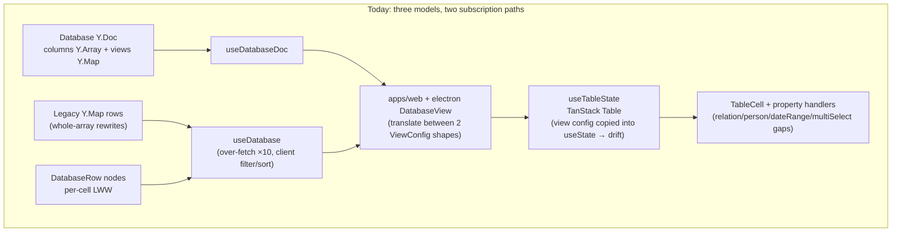
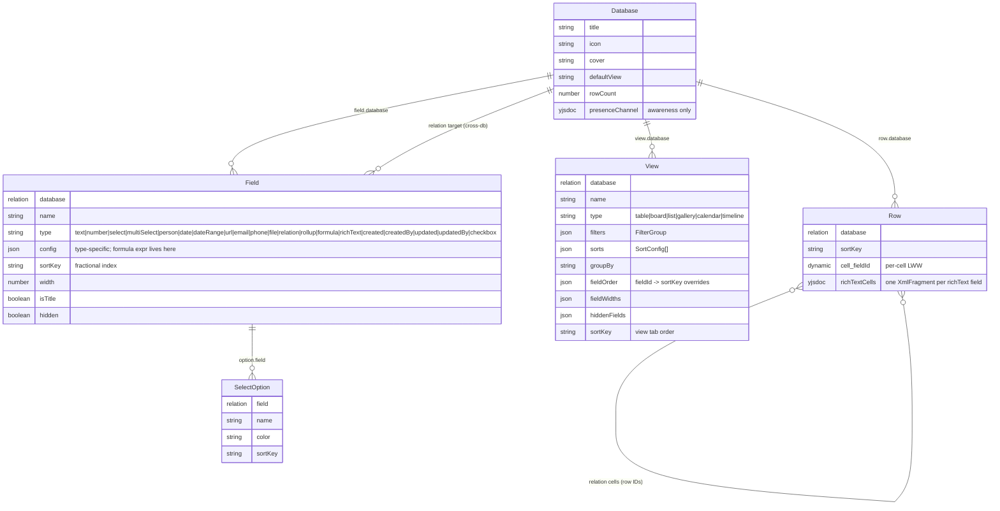
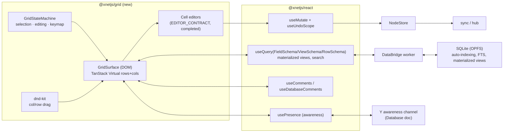
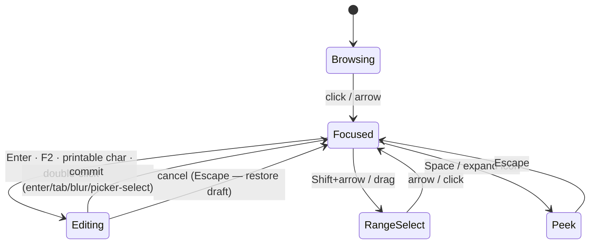
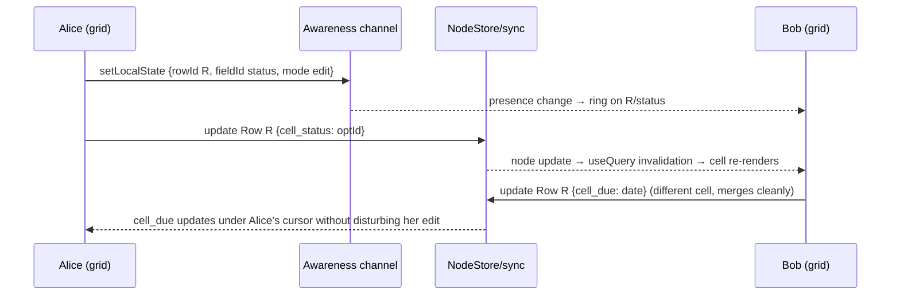

# Database V2 Overhaul: Notion-Grade Tables on xNet Primitives

> A ground-up rework of xNet databases: a unified "everything is a node" data model, a purpose-built collaborative grid UI with spreadsheet-grade keyboard and drag-drop interactions, deep comments/presence integration, and a clean path to formulas. Greenfield — no backwards compatibility with the current schema.

**Date**: June 2026
**Status**: Research + Architecture Proposal (intended to be detailed enough to implement from directly)
**Related**:
[0041\_[x]\_DATABASE_DATA_MODEL.md](./0041_[x]_DATABASE_DATA_MODEL.md),
[0067\_[-]\_DATABASE_DATA_MODEL_V2.md](./0067_[-]_DATABASE_DATA_MODEL_V2.md),
[0071\_[x]\_DATABASE_DEFINED_SCHEMAS.md](./0071_[x]_DATABASE_DEFINED_SCHEMAS.md),
[0088\_[\_]_DATABASE_UI_COMPETITIVE_ARCHITECTURE.md](./0088_[_]_DATABASE_UI_COMPETITIVE_ARCHITECTURE.md),
[0099\_[\_]_DATABASE_EDITING_UX_AND_UNDO_REDO_REMEDIATION_PLAN.md](./0099_[_]_DATABASE_EDITING_UX_AND_UNDO_REDO_REMEDIATION_PLAN.md),
[0123\_[x]\_SQLITE_NODE_STORE_READ_SCALING_AND_AUTOMATIC_INDEXING.md](./0123_[x]_SQLITE_NODE_STORE_READ_SCALING_AND_AUTOMATIC_INDEXING.md),
[0014\_[x]\_COMMENTING_SYSTEM.md](./0014_[x]_COMMENTING_SYSTEM.md)

---

## Problem Statement

Databases in xNet today are buggy and feel unfinished. The goal is a complete overhaul that reaches the bar set by Notion databases, Airtable bases, and (for grid interactions) Google Sheets:

- Robust column/row CRUD with rich data types (text, number, select, multi-select, person, date, files/attachments, relations, rollups, eventually formulas).
- Typeahead select/tag inputs that create options as you type.
- Inline sorting, filtering, grouping; drag-to-reorder columns and rows; column resizing; full keyboard navigation and shortcuts.
- Clean, minimal, powerful UI: popovers, tooltips, hover/active states, row peek, cell comments wired into the universal commenting system.
- First-class multiplayer: live cell-selection presence, per-cell conflict-free merging, reliable undo/redo.
- Cross-platform: desktop (Electron), web, and a mobile-appropriate experience (Expo).
- Backed by SQLite through the `useQuery`/DataBridge path so large databases stay fast.

We are pre-launch: **no schema backwards compatibility is required**. The data model, storage layout, and UI can all be rethought, as long as everything is built on xNet primitives (nodes, schemas, the NodeStore, Yjs docs where genuinely needed).

---

## Executive Summary

1. **The data layer is not the problem — the architecture split and the UI are.** `packages/data/src/database/` already contains well-tested engines for filtering, sorting, grouping, fractional indexing, rollups, formula parsing, CSV/JSON import/export, and templates (~12k lines, heavily unit-tested). But schema/views live in a Y.Doc while rows live as nodes, a _legacy_ third model still lingers (`legacy-model.ts`, `legacy-migration.ts`), and the React grid is a thin TanStack Table wrapper with state-drift problems, incomplete editors, and no real selection model.
2. **Recommendation: unify on "everything is a node."** Replace the Y.Doc column/view storage with first-class `Field`, `View`, and `SelectOption` nodes ordered by fractional index — the same proven mechanism rows already use. Cell values remain dynamic per-cell LWW properties on `Row` nodes. Rich text cells keep their per-row Y.Doc. The Database node's Y.Doc shrinks to a presence/awareness channel. Result: one storage model, one subscription path (`useQuery` → DataBridge → SQLite), per-property merge semantics everywhere, and the legacy model deleted outright.
3. **Recommendation: build a purpose-built DOM grid (`@xnetjs/grid`) and drop TanStack Table.** Keep TanStack Virtual for row/column virtualization and dnd-kit for drag-drop, but own the grid state machine (selection, editing lifecycle, keyboard map) directly — the view-config-mirrored-into-React-state pattern in `useTableState.ts` is the root of several current bugs. Canvas grids (Glide Data Grid) win on raw row count but lose on rich inline content, popover editors, comment indicators, presence overlays, accessibility, and mobile touch — all central to this product.
4. **Multiplayer, comments, and undo ride on infrastructure that already exists**: awareness-based `CellPresence`, anchor-encoded `useDatabaseComments`, and the structured undo work recently converged (`feat(database): converge structured undo semantics`). V2 keeps these seams and wires them into the new grid properly.
5. **Formulas are designed-in but shipped after the grid.** The `Field` node carries formula config from day one; `packages/formula` + `formula-service.ts`/`computed-cache.ts` already exist and slot in as a v2.1 milestone.
6. **This exploration is intended to be implementable directly.** The phased checklist at the end is granular enough to work from; a separate lower-level plan is only warranted for Phase 4 (multiplayer polish) if e2e flakiness emerges.

---

## Current State In The Repository

### Data layer (`packages/data/src/database/`) — strong but fragmented

| Area                    | Files                                                                                                                                 | State                                                                                                                  |
| ----------------------- | ------------------------------------------------------------------------------------------------------------------------------------- | ---------------------------------------------------------------------------------------------------------------------- |
| Cell values             | `cell-types.ts`                                                                                                                       | `cell_`-prefixed dynamic props on row nodes; types: string, number, boolean, DateRange, string[], FileRef, null        |
| Row CRUD                | `row-operations.ts`                                                                                                                   | Create/update/delete/move + cursor pagination + rebalancing; per-cell LWW                                              |
| Ordering                | `fractional-index.ts`                                                                                                                 | Figma/Linear-style string fractional indexing, jitter, rebalancing — solid, keep as-is                                 |
| Columns                 | `column-types.ts`, `column-operations.ts`                                                                                             | 19 column types incl. relation/rollup/formula; stored in **Y.Array in the Database Y.Doc**                             |
| Views                   | `view-types.ts`, `view-operations.ts`                                                                                                 | Table/board/list/gallery/calendar/timeline configs in **Y.Map in the Database Y.Doc**                                  |
| Query engines           | `filter-engine.ts`, `sort-engine.ts`, `group-engine.ts`, `query-pipeline.ts`, `query-router.ts`, `row-cache.ts`                       | Pure, well-tested; query-router does local/hybrid/hub routing                                                          |
| Computed                | `rollup-engine.ts`, `formula-service.ts`, `computed-cache.ts`, plus standalone `packages/formula/` (lexer/parser/evaluator/functions) | Engines exist; not surfaced in UI                                                                                      |
| Rich text               | `rich-text-cell.ts`                                                                                                                   | Per-row Y.Doc, one `Y.XmlFragment` per rich-text column                                                                |
| Import/export/templates | `import/`, `export/`, `templates/`                                                                                                    | CSV/JSON both directions; built-in templates                                                                           |
| Schemas-from-databases  | `schema-utils.ts`, `schema-resolver.ts`, `clone.ts`                                                                                   | Database-defined schema IRIs + versioning (exploration 0071)                                                           |
| **Legacy model**        | `legacy-model.ts` (624 lines), `legacy-migration.ts`                                                                                  | Whole-array-rewrite Y.Map model; still exported and branched on in `useDatabase` (`hasLegacyRows`, `getLegacyRows`, …) |

Node schemas: [database.ts](../../packages/data/src/schema/schemas/database.ts) (Database node, `document: 'yjs'`) and [database-row.ts](../../packages/data/src/schema/schemas/database-row.ts) (DatabaseRow node: `database` relation + `sortKey` + dynamic cells, `document: 'yjs'` for rich text).

### React hooks (`packages/react/src/hooks/`)

- `useDatabase.ts` — rows + CRUD, but **over-fetches `pageSize * 10` and filters/sorts client-side**, and still branches into the legacy row path.
- `useDatabaseDoc.ts` — separate subscription for columns/views via Y.Doc; awareness comes from here.
- `useQuery.ts` — the modern unified read path: DataBridge, `useSyncExternalStore`, materialized views, full-text `search`, spatial filters, query-plan telemetry. **Database UI does not use it.**
- Also relevant: `useCell.ts`, `useDatabaseRow.ts`, `useRelatedRows.ts`, `useReverseRelations.ts`, `useUndo.ts`/`useUndoScope.ts`, `useComments.ts`/`useCommentCount.ts`, `useFileUpload.ts`, `useInfiniteQuery.ts`.

### View layer (`packages/views/src/`)

- `table/` — `TableView.tsx` (row-virtualized only), `VirtualizedTableView.tsx` (dual-axis, not in the shipped path), `TableCell.tsx` (Enter/F2/Escape/Tab handling, context menu), `useTableState.ts` (TanStack Table; **mirrors view config into local `useState`, so remote view changes and local state drift**).
- `properties/` — per-type handlers with a written contract (`EDITOR_CONTRACT.md`: draft-first, commit reasons, a11y roles). Known gaps from exploration 0099: `dateRange` read-only, `relation` cell is a placeholder (the good `RelationCell` + `RowPickerModal` in `relations/` is unwired), `person` falls back to plain text, `multiSelect` lacks typeahead-create.
- Other view types: `board/`, `calendar/`, `gallery/`, `list/`, `timeline/`, plus `filter/` (FilterBuilder), `card-detail/`, `registry.ts` (plugin view registration with platform flags `web | electron | mobile`).
- `hooks/useDatabaseComments.ts` — cell/row/column anchors (`encodeAnchor`/`decodeAnchor`), per-cell counts, thread retrieval. Good seam; underused by the grid.
- `types.ts` — `CellPresence { rowId, columnId, color, did, name }`.

### App integrations

- Web: [DatabaseView.tsx](../../apps/web/src/components/DatabaseView.tsx) (547 lines) — table/board toggle, awareness-driven presence, manual translation between two `ViewConfig` shapes (`toSurfaceViewConfig`), default columns seeded in app code.
- Electron: `apps/electron/src/renderer/components/DatabaseView.tsx` — recently converged onto the hook path (`d07cf028 feat(database): converge electron database views`), but per exploration 0099 the editing UX issues remain.
- Expo: **no database UI at all** (only a passing reference in `XNetProvider.tsx`).
- E2E: `tests/e2e/src/database.spec.ts`, `database-undo.spec.ts` exist but cover a narrow slice.

### Diagnosis: why it feels buggy



Concrete failure modes this structure produces:

1. **State drift**: sorting/visibility/order/widths live in _both_ the view config (Y.Doc) and TanStack `useState`. Remote changes don't propagate; local changes persist inconsistently.
2. **Coarse merges & undo noise** on anything stored as a whole array (legacy rows; column reorder rewrites the Y.Array).
3. **Two ViewConfig dialects** (`@xnetjs/data` vs `@xnetjs/views`) with lossy translation in app code (filters silently dropped when operators don't match `SURFACE_FILTER_OPERATORS`).
4. **No grid selection model** — no cell ranges, no multi-row selection, no copy/paste, no fill-down; keyboard support stops at per-cell Enter/Escape/Tab.
5. **Performance ceiling** — over-fetch + client-side pipeline instead of pushing filter/sort into SQLite via `useQuery` materialized views (which exploration 0123 built for exactly this).
6. **Editor gaps** — the four property-editor gaps above make everyday data entry feel broken.

---

## External Research

### Product bars

- **Notion** ([property docs](https://www.notion.com/help/database-properties), [views/filters/sorts](https://www.notion.com/help/views-filters-and-sorts)): properties are flexible-first with soft enforcement; options created inline from the tag input; every row is a page (rich content + comments); views are first-class siblings with per-view filter/sort/group/visibility; row peek (side/center modal).
- **Airtable** ([multi-select field](https://support.airtable.com/docs/multiple-select-field)): enforced field types; typeahead pickers with "Add option" inline creation and color assignment; modifier-key multi-add in pickers; expanded record view; strong grid keyboard model (Sheets-like ranges, fill handle).
- **Google Sheets**: the keyboard/selection gold standard — arrows, Tab/Enter commit-and-move, Shift+arrows range grow, Cmd/Ctrl+arrow jump, type-to-replace, F2/Enter to edit, Escape revert, copy/paste ranges, drag fill.
- Comparative behavior writeups: [Airtable vs Notion (Whalesync)](https://www.whalesync.com/blog/airtable-vs-notion-the-ultimate-guide), [cotera.co comparison](https://cotera.co/articles/airtable-vs-notion-comparison).

### Grid rendering prior art

- [Glide Data Grid](https://www.npmjs.com/package/@glideapps/glide-data-grid) — canvas-based, millions of rows, used by Glide's own data editor. Fastest option, but rich cell content (inline images, avatars stacks, comment badges, presence rings, popover editors) must be drawn or overlaid manually; accessibility and IME/touch behavior need careful work.
- TanStack Table — headless logic; our experience (exploration 0099 + `useTableState.ts`) is that its internal state duplicates our CRDT-backed view config and the mirror drifts. Surveys: [Syncfusion 2026 grid roundup](https://www.syncfusion.com/blogs/post/top-react-data-grid-libraries), [AG Grid alternatives](https://blog.logrocket.com/ag-grid-react-guide-alternatives/), [SVAR roundup](https://svar.dev/blog/top-react-alternatives-to-ag-grid/).
- **What Notion/Airtable actually do**: DOM rendering with virtualization. Their cell content is too rich for canvas; ours is too (comments, presence, relations, attachments).
- Editing lifecycle prior art referenced in 0099 and worth keeping: [AG Grid cell editing](https://www.ag-grid.com/react-data-grid/cell-editing/), [MUI Data Grid editing](https://mui.com/x/react-data-grid/editing/), [WAI-ARIA grid pattern](https://www.w3.org/WAI/ARIA/apg/patterns/grid/), [WAI-ARIA combobox pattern](https://www.w3.org/WAI/ARIA/apg/patterns/combobox/).
- Drag-drop: **dnd-kit** is the de-facto React choice for column/row reorder with keyboard-accessible drag; fractional index gives O(1) drops.
- Ordering: fractional indexing (Figma's approach) — already implemented and tested in `fractional-index.ts`.

---

## Key Findings

1. **Keep**: row-as-node with per-cell LWW, fractional indexing, the pure query engines, the property-editor contract, anchor-based comments, awareness presence, the formula/rollup engines, import/export/templates, the view registry, database-defined schemas (0071).
2. **Kill**: the legacy Y.Map model (delete, not deprecate — we're greenfield), Y.Doc storage for columns/views, the dual ViewConfig dialects, TanStack Table, the `useDatabase` over-fetch pipeline.
3. **Build**: Field/View/SelectOption nodes; an `@xnetjs/grid` interaction engine (selection + keyboard + editing state machine); completed property editors (typeahead multi-select, relation, person, dateRange, files); toolbar UX (sort/filter/group chips); row peek; mobile surface; comprehensive interaction tests.
4. **The SQLite path is ready for this.** `useQuery` already supports `where`/`orderBy`/`page`/`search`/`materializedView` against DataBridge + SQLite (explorations 0123/0154/0157). Storing fields and views as nodes means schema reads, view reads, and row reads all use the same fast, subscribable machinery — including the automatic indexing work.

---

## Options And Tradeoffs

### Decision 1 — Data model

|                                                     | A. Status quo, refined (Y.Doc schema + row nodes) | **B. Everything-is-a-node (recommended)**                         | C. Real SQLite tables per database                 |
| --------------------------------------------------- | ------------------------------------------------- | ----------------------------------------------------------------- | -------------------------------------------------- |
| Storage                                             | Columns/views in Y.Doc; rows as nodes             | Database, Field, View, SelectOption, Row all nodes                | DDL-managed typed tables                           |
| Merge semantics                                     | CRDT arrays for schema; LWW cells                 | Per-property LWW everywhere; ordering via fractional index        | Manual conflict handling                           |
| Subscriptions                                       | Two paths (Y.Doc observer + node query)           | One path (`useQuery`)                                             | Custom                                             |
| Concurrent option-create ("type a tag, both users") | Y.Array insert merges OK                          | Separate option nodes merge cleanly                               | Risky                                              |
| Queryability                                        | Schema invisible to SQLite                        | Fields/views/options indexable, queryable, syncable like any node | Best raw queries                                   |
| Undo                                                | Mixed Y.UndoManager + node undo (the 0099 pain)   | Single node-op undo via `useUndoScope`                            | Custom                                             |
| Effort                                              | Low                                               | Medium                                                            | High                                               |
| Risk                                                | Keeps the dual-path bug class                     | Migration of code, not data (greenfield)                          | Schema-migration treadmill; breaks node uniformity |

Option B's one real loss vs. Y.Doc: list-ordering of columns is "fractional index + LWW" instead of a true CRDT sequence. Rows already live with this and it is fine in practice (Figma, Linear); jittered keys (`generateSortKeyWithJitter`) make same-position collisions vanishingly rare, and `rebalanceSortKeys` handles pathological growth.

Cell storage sub-decision: keep cells as dynamic `cell_<fieldId>` properties on the Row node (per-cell LWW, already supported by automatic indexing) rather than per-cell nodes (row render = N queries, massive node inflation) or a JSON blob (whole-row LWW, kills concurrent cell edits).

### Decision 2 — Grid rendering

|                                                                                  | A. Canvas (Glide Data Grid)            | **B. Custom DOM grid + TanStack Virtual (recommended)**      | C. Keep TanStack Table wrapper             |
| -------------------------------------------------------------------------------- | -------------------------------------- | ------------------------------------------------------------ | ------------------------------------------ |
| Raw scale                                                                        | Millions of rows                       | Tens of thousands smooth (router sends bigger to hub anyway) | Same as B ceiling                          |
| Rich cells (avatars, tags, files, inline images, comment badges, presence rings) | Custom canvas painting / overlay hacks | Plain React components                                       | Plain React                                |
| Popover editors, tooltips, hover states                                          | Overlay layer, positioning pain        | Native                                                       | Native                                     |
| Accessibility / IME / RTL                                                        | Hard                                   | ARIA grid pattern, standard                                  | Standard                                   |
| Mobile/touch                                                                     | Limited                                | Full control (and mobile gets a different surface anyway)    | Full control                               |
| State ownership                                                                  | Ours                                   | **Ours — view nodes are the single source of truth**         | TanStack's, mirrored (the drift bug class) |
| Effort                                                                           | Medium + long tail of drawing code     | Medium                                                       | Low but keeps the disease                  |

### Decision 3 — Where filter/sort/group execute

Hybrid, in this order:

1. **SQLite via `useQuery`** for the base row window: `where: { database }`, `orderBy`, `page`, `materializedView` per view (stable cache key `db:<id>:view:<id>`), `search` for the quick-find box.
2. **The existing pure engines** (`filter-engine`, `sort-engine`, `group-engine`) for what SQLite can't express on dynamic props yet (multi-key sorts mixing select-option order, grouping with aggregates) — applied to the fetched window, not a 10× over-fetch.
3. **Query router** (`query-router.ts`) keeps deciding local vs. hub for big datasets.

---

## Recommendation

### V2 data model — all xNet nodes



Notes:

- **`SelectOption` as nodes** is what makes "type a new tag and it's created" merge cleanly when two people do it simultaneously — two creates are two nodes, no array conflict. Option rename/recolor is per-property LWW. The select cell stores option node IDs.
- **`View.fieldOrder`/`fieldWidths`/`hiddenFields` as per-view overrides** over the Field defaults — Notion semantics (each view can reorder/hide independently) without duplicating the schema.
- **Database Y.Doc survives only as the awareness/presence channel** (cell selection broadcast, typing indicators). No persistent state in it.
- **`cell_` dynamic properties stay**, which means exploration 0123's automatic indexing and materialized views apply to cells unchanged.
- Database-defined schema IRIs (0071) now read fields from nodes instead of the Y.Doc — `schema-utils.ts` keeps its IRI/versioning logic, `extractSchemaFromDoc` is replaced by a node query.
- Files: cells store `FileRef` values; uploads go through the existing `useFileUpload` path; image MIME types render inline previews in the cell and a lightbox in row peek.

### V2 architecture



### Interaction design (the actual UX bar)

**Selection & keyboard** (Sheets-grade, ARIA grid pattern):

- Single cell focus → arrows move; `Shift+arrows` grow range; `Cmd/Ctrl+arrow` jump to data edge; `Cmd/Ctrl+A` select all; click row number selects row; drag selects range; `Shift+click` extends.
- `Enter`/`F2` edit; typing a printable char replaces-and-edits; `Escape` cancels; `Enter` commits + moves down; `Tab` commits + moves right (`Shift+Tab` left); `Cmd/Ctrl+Enter` commits in place.
- `Cmd/Ctrl+C/X/V` copy/cut/paste ranges (TSV interchange with Sheets/Excel); `Delete/Backspace` clears range; `Cmd/Ctrl+D` fill down; `Cmd/Ctrl+Z`/`Shift+Cmd+Z` undo/redo via `useUndoScope` (one user action = one undo step, the 0099 contract).
- `Cmd/Ctrl+F` quick-find (drives `useQuery.search`); `Space` on a row opens peek; `Cmd/Ctrl+Shift+,` new row below (configurable).

**Editing lifecycle** (extends the existing `EDITOR_CONTRACT.md`):



**Pickers**: select/multi-select open a combobox popover; typing filters; a non-matching string shows `＋ Create "<text>"` (auto-color, persisted as a `SelectOption` node); chips removable with `Backspace`; person picker searches contacts/DIDs with avatars; relation picker reuses `RowPickerModal` search-and-multi-pick, finally wired into the cell path; date picker supports natural input ("tomorrow", "next fri") + calendar + optional time + range mode.

**Columns**: header click → sort toggle (asc/desc/clear); header drag (dnd-kit) → reorder writing per-view `fieldOrder` sortKeys; edge drag → resize (per-view widths); header menu → rename inline, change type (with value coercion preview), insert left/right, hide, duplicate, delete (confirm), comment-on-column.

**Rows**: left gutter shows row handle (drag to reorder → `moveRow` fractional index), checkbox (multi-select → bulk delete/duplicate/edit), expand to **row peek** (side panel on desktop, full-screen sheet on mobile; shows all fields stacked, rich text, attachments, row comments thread).

**Toolbar**: view tabs (View nodes, drag-to-reorder), filter chips (FilterBuilder, already exists), sort chips, group selector, field visibility popover, search box, row count, `＋ New` row/column buttons. Every control keyboard-reachable, with tooltips showing shortcuts.

**Comments**: corner badge on commented cells (count from `cellCommentCounts`); hover → thread preview popover; context menu + `Cmd/Ctrl+Shift+M` → comment on cell; column/row anchors in header/gutter menus. Anchors survive sort/filter because they encode `rowId:fieldId`, not coordinates.

**Presence**: local cell focus broadcast via awareness (`{ rowId, fieldId, mode: 'focus'|'edit'|'range', range? }`); remote users render as a colored cell ring + name flag (and a translucent range overlay for range selections). Editing remotely shows a subtle pulse. Per-cell LWW means concurrent edits to _different_ cells merge perfectly; same-cell concurrent edits resolve last-write-wins with the presence ring making the conflict visible before it happens.



### Cross-platform

- **Web + Electron** share `@xnetjs/grid` wholesale (Electron's `DatabaseView.tsx` shrinks to a shell, like web's).
- **Mobile (Expo)**: do _not_ ship the grid. Ship a **list/card surface**: rows as cards using the title + a few visible fields, tap → full-screen row editor (the same field editors, stacked), board view swipeable. Register via `registry.ts` platform flags (`mobile`), which already exist for this purpose. Mobile editors reuse the same data hooks.
- **Touch on web/tablet**: long-press row handle to drag; pickers render as bottom sheets under a width breakpoint.

### Formulas (v2.1, designed-in now)

- `Field.type: 'formula'`, `config.expression` with `{{fieldId}}` refs — already the shape `formula-service.ts` expects.
- Evaluation: `FormulaService` + `ComputedCache` run in the DataBridge worker; dependency graph (`extractDependencies`, circular detection) already implemented; results cached per row with input hashes, invalidated by cell updates.
- UI: formula editor popover with autocomplete for field refs and `FUNCTIONS`, live preview against the focused row, error squiggles. Rollups surface the same way (`rollup-engine.ts` is done).
- Defer only the _editor UI_ — keep the engine wired from the start so `created`/`updated` auto-fields and rollups prove the computed path early.

### Testing strategy (explicitly part of the deliverable)

1. **Unit (vitest)**: GridStateMachine — every keymap entry, selection transitions, editing lifecycle, clipboard serialization, fill-down. Pure functions → fast, exhaustive.
2. **Component (testing-library + storybook stories per editor)**: each property editor against `EDITOR_CONTRACT` (draft/commit/cancel/blur safety/a11y roles); typeahead-create; popover focus management. `DatabaseSurface.stories.tsx` already establishes the workbench pattern.
3. **E2E (Playwright, extending `tests/e2e/src/database.spec.ts`)**: keyboard navigation paths, drag-drop column/row reorder (`browser_drag`-style flows), sort/filter/group via toolbar, copy/paste round-trip, undo/redo sequences, comment create/hover, **two-context multiplayer specs** (presence rings, concurrent cell edits, concurrent option-create).
4. **Performance regressions**: 10k-row scroll FPS and edit latency budgets in the perf spec suite (pattern from `29c110e0 test(flaky): stabilize timing-sensitive performance specs`).

---

## Example Code

New schemas (replacing Y.Doc columns/views):

```ts
// packages/data/src/schema/schemas/database-field.ts
export const DatabaseFieldSchema = defineSchema({
  name: 'DatabaseField',
  namespace: 'xnet://xnet.fyi/',
  properties: {
    database: relation({ target: 'xnet://xnet.fyi/Database@2.0.0', required: true }),
    name: text({ required: true, maxLength: 200 }),
    type: text({ required: true }), // FieldType union enforced in ops layer
    config: json({}), // type-specific config (formula expr, number format, …)
    sortKey: text({ required: true }), // fractional index — column order
    width: number({ min: 40, integer: true }),
    isTitle: boolean({}),
    hidden: boolean({})
  }
})

// packages/data/src/schema/schemas/database-select-option.ts
export const SelectOptionSchema = defineSchema({
  name: 'DatabaseSelectOption',
  namespace: 'xnet://xnet.fyi/',
  properties: {
    field: relation({ target: 'xnet://xnet.fyi/DatabaseField@2.0.0', required: true }),
    name: text({ required: true, maxLength: 100 }),
    color: text({}), // SelectColor
    sortKey: text({ required: true })
  }
})
```

The grid subscribes with plain `useQuery` — no bespoke subscription machinery:

```tsx
const { data: fields } = useQuery(DatabaseFieldSchema, {
  where: { database: dbId },
  orderBy: { sortKey: 'asc' }
})
const { data: rows, pageInfo } = useQuery(DatabaseRowSchema, {
  where: { database: dbId },
  orderBy: { sortKey: 'asc' },
  page: { first: 200 },
  materializedView: `db:${dbId}:view:${viewId}`,
  search: quickFind || undefined
})
```

Typeahead option-create is just a node create — concurrent-safe by construction:

```ts
async function createOption(store: NodeStore, fieldId: string, name: string) {
  const last = await lastOptionSortKey(store, fieldId)
  return store.create({
    schemaId: SelectOptionSchema.schema['@id'],
    properties: {
      field: fieldId,
      name,
      color: autoColor(name),
      sortKey: generateSortKeyWithJitter(last)
    }
  })
}
```

---

## Risks And Open Questions

- **Sort-key collisions on concurrent column reorder**: two users dropping different columns into the same slot get adjacent-but-arbitrary relative order. Jittered keys make ties rare; acceptable (rows already live with this).
- **Hot databases with thousands of SelectOption/Field nodes**: query cost is bounded by `where: { field }` indexes, but the picker should virtualize beyond ~200 options.
- **Cell-level undo across users**: `useUndoScope` must scope undo to _local_ operations only (don't undo Bob's edit). Verify the converged undo semantics (`2f480260`) already guarantee this for node ops; add an e2e spec either way.
- **Clipboard interchange fidelity**: pasting from Sheets brings strings; type coercion per column (with a "paste as…" affordance when coercion is lossy) needs design care.
- **Awareness channel without persistent Y.Doc state**: confirm the sync provider keeps an awareness session alive for docs with no content updates (or move presence to a dedicated sync-package channel).
- **Hub-scale databases (100k+ rows)**: the query router's hub path remains the answer; the grid must render gracefully in "windowed remote" mode (skeleton rows, no select-all-cells operations). Out of scope for v2.0 polish, but don't paint into a corner.
- **Schema-IRI versioning (0071)** must bump to `Database@2.0.0` and friends; `clone.ts`/templates need re-pointing at node-based fields.
- **Do we need a lower-level plan?** Phases 0–3 below are implementable directly from this document. If Phase 4 multiplayer e2e proves flaky, write a focused follow-up plan for the presence/undo edge cases only.

---

## Implementation Checklist

### Phase 0 — Demolition & schema (1 PR-sized chunk each)

- [x] Add `DatabaseFieldSchema`, `SelectOptionSchema`, `DatabaseViewSchema` node schemas; bump `Database`/`DatabaseRow` to `@2.0.0`; keep `Row` cell storage unchanged
- [x] Port `column-operations.ts` / `view-operations.ts` to node ops (fractional-index ordering, per-view overrides); unit tests mirror existing suites
- [x] Re-point database-defined schema utilities (`schema-utils.ts`, `schema-resolver.ts`, `clone.ts`, templates) at node-based fields — `schema-from-fields.ts` (node resolver + `fieldsToStoredColumns` adapter feeding the pure clone/template transforms)
- [x] Delete `legacy-model.ts`, `legacy-migration.ts`, and all `prefersLegacyDatabaseModel` branches (useDatabase/useDatabaseDoc stripped to canonical-only; relation pickers ported to `useGridDatabase`). Y.Doc column/view ops survive solely behind the Electron canvas database-preview surfaces — they delete when those surfaces port to the grid
- [x] Reduce the Database Y.Doc to awareness-only (both app shells; presence verified through useNode's awareness channel) — canvas preview surfaces still initialize legacy Y.Doc columns until ported
- [ ] Unify on a single `ViewConfig` type in `@xnetjs/data`; delete the `@xnetjs/views` dialect and `toSurfaceViewConfig`

### Phase 1 — Grid engine (`@xnetjs/grid`)

- [x] `GridStateMachine`: selection model (cell/range/row/column), focus, editing lifecycle per `EDITOR_CONTRACT`, full keymap table — pure TS, exhaustively unit-tested (`packages/views/src/grid/{types,state,keymap}.ts`, 78 tests)
- [x] `GridSurface`: DOM grid with TanStack Virtual row virtualization, sticky header + row gutter, ARIA grid roles (column virtualization deferred — widths are bounded and rows dominate; revisit if >50-column databases appear)
- [x] Rewire `useDatabase` → thin composition of `useQuery` (fields/views/rows with `materializedView` + `search`), `useMutate`, `useUndoScope`; remove the ×10 over-fetch and client pipeline for the base window — shipped as `useGridDatabase` (legacy `useDatabase` deleted in the demolition step)
- [x] Clipboard: TSV copy/cut/paste with per-type coercion, range clear, fill-down (`packages/views/src/grid/clipboard.ts`; range clear/fill-down commands wired in GridSurface)
- [x] dnd-kit column reorder (per-view `fieldOrder`), column resize, row drag via gutter handle (`moveRow`) — surface emits `onMoveField`/`onMoveRow`/`onResizeField`; hook layer persists to View nodes
- [x] Toolbar: view tabs (View nodes), sort/filter chips (reuse FilterBuilder), group selector, field-visibility popover, quick-find (`GridToolbar.tsx` + filter-dialect adapters)

### Phase 2 — Editors & rich types

- [x] Multi-select/select combobox: typeahead filter, `＋ Create "<text>"` inline option creation (SelectOption nodes, auto-color), chip remove, keyboard-only flow — both editors persist via `config.onCreateOption`; named-color chip palette in `optionColors.ts`
- [x] Relation editor: the relation combobox (typeahead over target-database rows via `useGridDatabase`, V2 title-field resolution) is wired into the grid cell path; `RowPickerModal` ported to `useGridDatabase`; reverse-relation display via `useReverseRelations` remains follow-up
- [x] Person editor: DID combobox with validation + suggestions wired through the grid (post-0099 editor); contact-directory search with avatars remains follow-up
- [x] Date/dateRange editor: native date/datetime inputs with range validation shipped (pre-existing post-0099 overhaul, wired into the grid); calendar popover + natural-language parsing remain follow-up polish
- [x] File/attachment cells: BlobService upload (local-first, chunked), drag-file-onto-cell, inline image thumbnails in cells, image previews + lightbox in peek — cell `FileRef` unified with the blob-layer shape (`{cid, name, mimeType, size}`)
- [ ] Rich text cells: per-row Y.Doc `XmlFragment` editor in row peek (read summary in grid cell)
- [x] Row peek: desktop side panel / mobile sheet, stacked field editors, row comments thread — `GridPeek` (side panel in the web shell; full editors stacked; row comment count slot; mobile sheet arrives with the Expo surface)
- [x] Auto fields (`created`/`createdBy`/`updated`) populated from node metadata in `useGridDatabase` (`updatedBy` awaits last-writer attribution on FlatNode); rollup columns remain with the formula UI (Phase 5)

### Phase 3 — Comments, presence, polish

- [x] Cell comment badges + thread popover + shortcut create (`Cmd/Ctrl+Shift+M`), via `useDatabaseComments` anchors — badges/counts in GridCell, CommentPopover + composer in the web shell; hover-preview and column/row menu anchors remain follow-up polish
- [x] Presence: awareness broadcast of cell focus; remote rings + name flags (GridCell), wired through the Database Y.Doc awareness channel in the web shell; edit-pulse and range overlays remain follow-up polish
- [x] Hover/active states, tooltips with shortcut hints on toolbar/header/footer controls, empty-state hint over the ghost row, `GridSkeleton` loading placeholder in both shells
- [x] Touch affordances: long-press (250ms) drag for column and row reorder via dnd-kit TouchSensor; bottom-sheet pickers under a width breakpoint remain follow-up
- [x] Replace `apps/web` + `apps/electron` `DatabaseView.tsx` with thin shells over the new surface (−2,600 lines net); `VirtualizedTableView`/`useTableState`/TanStack Table removal rides with the canvas-preview + DataWorkspaceView ports

### Phase 4 — Cross-platform & multiplayer hardening

- [x] Expo: card/list database surface + full-screen row editor — `apps/expo/src/screens/DatabaseScreen.tsx` on `useGridDatabase` (cards with title + 3-field summary, native stacked editors incl. select chips with typeahead tag creation, add-row FAB, delete); Home gains database create/list. Implemented as a native screen rather than the web `registry.ts` (RN can't render the DOM views)
- [x] Two-context Playwright multiplayer specs — harness rebuilt on the real V2 stack (`tests/e2e/harness/database.tsx`); `database.spec.ts` covers structure CRUD, type-to-replace keyboard editing, typeahead option creation, sort toggle, and two-user hub convergence; `database-undo.spec.ts` covers scoped undo/redo incl. the Cmd/Ctrl+Z keymap path. Presence-ring and concurrent-option two-context assertions remain follow-up
- [x] Performance budgets — `grid/perf.test.tsx`: 10k rows render a bounded virtualized DOM (<100 row elements) within time budgets; cursor traversal budget; 100k state-machine ops <500ms. Real-browser FPS and materialized-view cache-hit assertions remain follow-up
- [x] CSV/JSON import/export wired to the new toolbar — ⋯ menu with Export CSV/JSON and Import CSV (field inference + select-option node creation on import) in both shells

### Phase 4.5 — Spreadsheet feel (follow-up request)

- [x] Ghost row: an empty row of cells below the data — typing in any cell creates a row with that value (gutter shows ＋; arrows navigate into it; empty commits are no-ops)
- [x] Ghost column: an empty column to the right — typing in a cell creates a new text field ("Column N") and sets that row's value
- [x] Smart type conversion: retyping a field converts existing cells via `convert-cell.ts` — comma-separated text → multiSelect tags (options persisted as nodes), numerics/currency/percent → numbers, truthy text → checkboxes, dates parse, select IDs stringify back to names; unconvertible values clear rather than corrupt

### Phase 5 (v2.1) — Computed columns UI

- [x] Formula columns evaluate live — `FormulaService` wired into the `useGridDatabase` row pipeline (cached per row+inputs, recomputes on dependency edits, available to filters/sorts); computed/auto cells are non-editable in the grid; field menu gains an expression editor with `{{fieldId}}` refs. Autocomplete/live-preview popover and worker offload remain follow-up polish
- [x] Rollup configuration UI over `rollup-engine.ts` — shared `FieldConfigEditor` (relation target-database picker, rollup relation/target-field/aggregation pickers, formula expression) in both shells; rollups compute cross-database in `useGridDatabase` via the store with per-row aggregation (hook test: relation → sum of related points)
- [x] Computed-cache invalidation proven in hook tests against the real store (editing a dependency recomputes the formula; rollups re-aggregate from related rows); a browser e2e duplicate remains optional

## Validation Checklist

- [x] All Phase 1 keymap entries pass unit tests; core shortcuts (navigate, type-to-replace, commit/cancel, undo) proven in browser e2e — exhaustive per-shortcut e2e and Electron-app e2e remain follow-up
- [x] Typeahead tag creation: type → create → persists and renders (browser e2e); concurrent creates from two stores yield two options with no loss (field-operations cross-sync unit test)
- [x] Column resize persists per-view and survives reload + remote sync (e2e: drag handle → View node width override → page reload with in-memory storage → width restored through hub replay); column/row drag persistence covered by hook tests over the same View-node path
- [x] Sort/filter/group round-trip through View nodes (hook tests); two-client node convergence proven in e2e — all view state rides the same relay path
- [x] TSV interchange fidelity proven in unit tests (Excel-style quoting round-trips, per-type paste coercion); a manual Sheets round-trip spot-check remains
- [x] Undo/redo: one user action = one step; never undoes another user's edit (two-context e2e: user 1's undo reverts their cell edit while user 2's concurrent tag edit survives)
- [ ] Comment on cell, hover preview, resolve — anchors stable under sort/filter changes
- [x] Presence rings render across two clients (two-context e2e: user 2's cell focus shows a colored ring + name flag on user 1's grid); edit-pulse and range overlays remain follow-up
- [ ] 10k-row database scrolls at 60fps with virtualization; edits commit <50ms locally
- [ ] Mobile surface: browse, edit via row editor, board swipe — no horizontal-scroll grid jank
- [x] Full-repo `vitest run` (6,186 tests) and `turbo typecheck` green; legacy database modules deleted with zero remaining imports

---

## References

### Internal

- Data layer: [packages/data/src/database/](../../packages/data/src/database/) (`cell-types.ts`, `row-operations.ts`, `fractional-index.ts`, `column-types.ts`, `view-types.ts`, `query-router.ts`, `formula-service.ts`, `legacy-model.ts`)
- Schemas: [database.ts](../../packages/data/src/schema/schemas/database.ts), [database-row.ts](../../packages/data/src/schema/schemas/database-row.ts)
- Hooks: [useQuery.ts](../../packages/react/src/hooks/useQuery.ts), [useDatabase.ts](../../packages/react/src/hooks/useDatabase.ts), [useDatabaseDoc.ts](../../packages/react/src/hooks/useDatabaseDoc.ts), [useUndoScope.ts](../../packages/react/src/hooks/useUndoScope.ts)
- Views: [packages/views/src/table/](../../packages/views/src/table/), [properties/EDITOR_CONTRACT.md](../../packages/views/src/properties/EDITOR_CONTRACT.md), [hooks/useDatabaseComments.ts](../../packages/views/src/hooks/useDatabaseComments.ts), [registry.ts](../../packages/views/src/registry.ts)
- Apps: [apps/web/src/components/DatabaseView.tsx](../../apps/web/src/components/DatabaseView.tsx), `apps/electron/src/renderer/components/DatabaseView.tsx`
- Formula engine: [packages/formula/src/](../../packages/formula/src/)
- Prior explorations: 0041, 0067, 0071, 0088, 0099, 0123, 0014 (linked at top)

### External

- [Notion database properties](https://www.notion.com/help/database-properties) · [Notion views, filters and sorts](https://www.notion.com/help/views-filters-and-sorts)
- [Airtable multiple select field](https://support.airtable.com/docs/multiple-select-field)
- [Glide Data Grid (npm)](https://www.npmjs.com/package/@glideapps/glide-data-grid)
- [Syncfusion: React data grid libraries 2026](https://www.syncfusion.com/blogs/post/top-react-data-grid-libraries) · [LogRocket: AG Grid alternatives](https://blog.logrocket.com/ag-grid-react-guide-alternatives/) · [SVAR: AG Grid alternatives](https://svar.dev/blog/top-react-alternatives-to-ag-grid/)
- [AG Grid cell editing lifecycle](https://www.ag-grid.com/react-data-grid/cell-editing/) · [MUI Data Grid editing](https://mui.com/x/react-data-grid/editing/)
- [WAI-ARIA grid pattern](https://www.w3.org/WAI/ARIA/apg/patterns/grid/) · [WAI-ARIA combobox pattern](https://www.w3.org/WAI/ARIA/apg/patterns/combobox/)
- [Whalesync: Airtable vs Notion](https://www.whalesync.com/blog/airtable-vs-notion-the-ultimate-guide) · [Cotera: Airtable vs Notion](https://cotera.co/articles/airtable-vs-notion-comparison)
