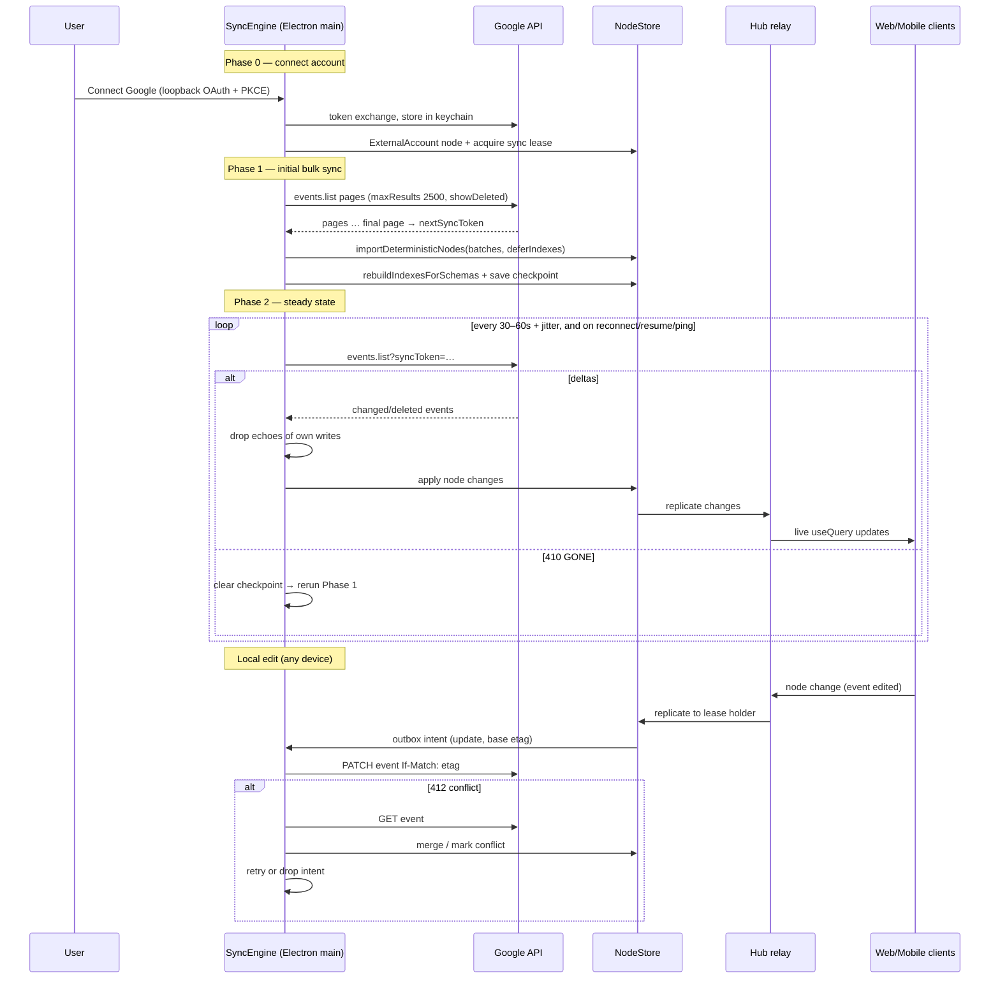
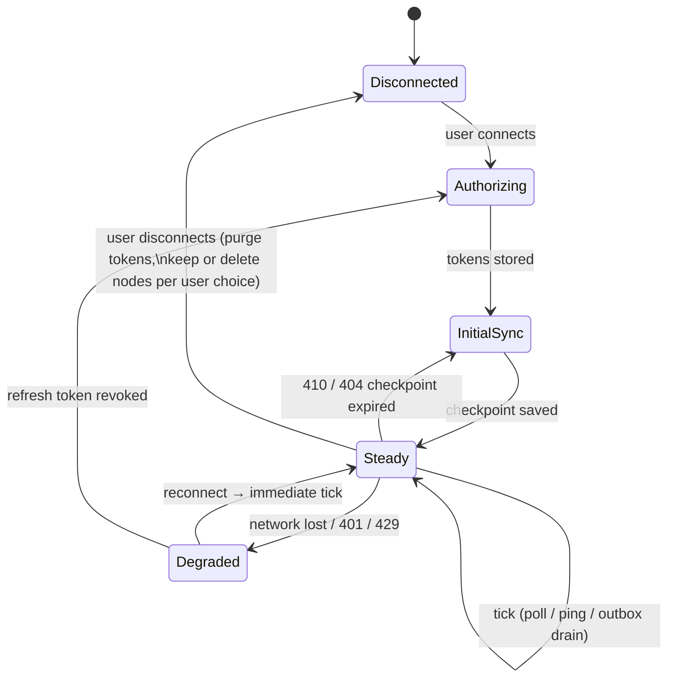
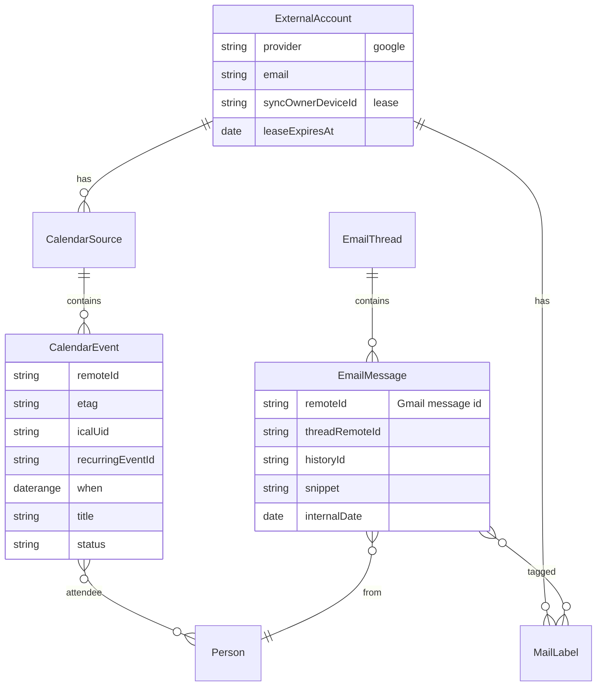

# Local-First Google Workspace Sync (Calendar → Gmail → Drive/Docs/Sheets)

## Problem Statement

xNet should hold a user's Google Workspace data — starting with Google
Calendar, then Gmail, then Docs/Drive/Sheets — as first-class local
nodes, synced bidirectionally:

- **Initial sync**: a bulk import/export pass that reconciles the local
  node store with the remote Google account.
- **Continuous sync**: after the initial pass, changes flow in near
  real time. Every reconnect triggers a reconciliation sync, and remote
  changes on Google's side trigger a sync as soon as we can observe
  them.
- **Local-first**: ideally the whole engine runs on the user's devices
  with no hub server in the loop. A hub-assisted mode and/or an
  Electron-resident sync agent are acceptable fallbacks where Google's
  APIs make serverless push impossible.

Today the repo has **no Google, OAuth, IMAP, iCal, or calendar-sync
code at all** (grep confirms) — this is greenfield, but it lands on top
of infrastructure that was built for exactly this shape of problem.

## Executive Summary

- **Reuse the social-import architecture, upgraded from one-shot import
  to a long-lived bidirectional sync engine.** A new package
  (`packages/gsuite` → `@xnetjs/gsuite`) mirrors `packages/social`:
  per-product adapters, dedicated schemas, deterministic node imports,
  saved-view/lens defaults.
- **Run the sync agent in the Electron main process** (Node access,
  `better-sqlite3`, background lifecycle, OS keychain via
  `safeStorage`). Web and mobile clients get Google data "for free"
  through the existing node-change replication (`@xnetjs/sync` +
  `@xnetjs/hub` relay) — they never talk to Google directly.
- **No public endpoint is required** for the core loop:
  - _Calendar_: incremental polling with `syncToken` (30–60 s with
    jitter; well within the 600 req/min/user quota). Google Calendar
    push requires a public HTTPS webhook, so true push is hub-optional.
  - _Gmail_: near-real-time without a server via **Cloud Pub/Sub pull
    subscription** (poll the subscription; no webhook needed) or
    **IMAP IDLE** as a trigger, with `history.list(startHistoryId)` as
    the actual delta fetch.
- **Hub-assisted push is an optional accelerator, not a dependency.**
  The hub (`packages/hub`, deployed via `railway.toml`) can host
  `events.watch` / `changes.watch` webhook channels and forward "sync
  now" pokes over the existing WebSocket — payload-free, so the hub
  never sees calendar/email content.
- **One device owns each Google account connection** (a "sync owner"
  lease stored as a node) so two devices never double-write to Google.
  Reconciled data replicates to other devices via normal xNet sync.
- **Conflict policy**: Google is the system of record for remote
  writes — use ETag `If-Match` (Calendar) and re-fetch on 412/409;
  locally, per-property LWW with Lamport timestamps (already the node
  store's native semantics) resolves cross-device races.
- **OAuth reality check**: Calendar scopes are _sensitive_ (manageable
  verification); Gmail scopes are _restricted_ (CASA assessment, $0
  self-serve → ~$15–75 k assessed, 2–6 months) — but the documented
  **personal-use exemption** and 100-user testing mode make a
  bring-your-own-OAuth-client model the right default for a local-first
  app.

## Current State In The Repository

### What exists and is directly reusable

| Capability                                                         | Where                                                                                                   | Relevance                                                 |
| ------------------------------------------------------------------ | ------------------------------------------------------------------------------------------------------- | --------------------------------------------------------- |
| Node store w/ per-property LWW, Lamport time, signed changes       | `packages/data/src/store/store.ts`, `packages/sync/src/change.ts`                                       | Local conflict resolution comes for free                  |
| Deterministic bulk import w/ deferred indexes                      | `NodeStore.importDeterministicNodes()` (`packages/data/src/store/store.ts`), proven in exploration 0157 | Initial bulk sync of 10k+ events / 100k+ messages         |
| Adapter/importer pattern w/ registry + platform availability flags | `packages/social/src/importers/registry.ts`, `packages/social/src/importers/*.ts`                       | Template for `gcal.ts`, `gmail.ts`, `gdrive.ts` adapters  |
| Import job orchestration (web worker + Electron IPC paths)         | `apps/web/src/workers/social-import.worker.ts`, `apps/electron/src/main/social-import-ipc.ts`           | Template for sync-job lifecycle + progress UI             |
| Schema definition system (`defineSchema`, relations, json fields)  | `packages/data/src/schema/schemas/*.ts`                                                                 | New `CalendarEvent`, `EmailThread`, … schemas             |
| Multi-platform SQLite                                              | `packages/sqlite/src/adapters/` (electron / web-worker / web-proxy / expo / memory)                     | Same store everywhere; sync agent writes once             |
| Hub relay + node replication + subscriptions                       | `packages/hub/src/services/relay.ts`, `node-relay.ts`, `database-subscriptions.ts`                      | Fan-out of synced nodes to other devices                  |
| Live query path                                                    | `packages/react/src/hooks/useQuery.ts`, `packages/data-bridge/`                                         | Calendar/email UI updates reactively as sync writes land  |
| Calendar & timeline view components                                | `packages/views/src/` (calendar, timeline)                                                              | Rendering synced events needs no new view engine          |
| Saved views / lenses / projections over canonical nodes            | `packages/data/src/schema/schemas/saved-view.ts`, `packages/social/src/lenses/`, exploration 0158       | "Inbox", "Today", "This week" as lenses, zero duplication |
| Electron main-process service management                           | `apps/electron/src/main/data-process-manager.ts`, `service-ipc.ts`                                      | Host the long-lived sync agent                            |
| Cloudflare tunnel IPC (existing!)                                  | `apps/electron/src/main/cloudflare-tunnel-ipc.ts`                                                       | Optional: expose a local webhook endpoint without a hub   |

### What does not exist

- Any OAuth flow, token storage, or Google API client.
- Any outbox / remote-write queue (the social pipeline is import-only,
  one-directional).
- Any external-account / sync-state bookkeeping schema.
- Any background scheduler (watch-channel renewal, poll loops,
  reconnect detection).

### Related explorations

- `0159_[_]_DATABASE_V2_OVERHAUL_NOTION_GRADE_TABLES.md` — the
  everything-is-a-node model this sync writes into.
- `0157_[x]_IMPLEMENTING_FAST_BATCH_WRITES.md` — batch write path used
  for the bulk phase.
- `0152_[x]_ACTUAL_SOCIAL_GRAPH_IMPORTER.md` /
  `0153_[x]_SOCIAL_DATA_WORKSPACE_UI.md` — adapter + workspace UI
  patterns to mirror.
- `0158_[x]_WHAT_MIGHT_THE_DATA_WORKSPACE_LOOK_LIKE_IF_IT_WAS_MORE_VISUAL.md`
  — lenses/projections that calendar + email lenses should follow.

## External Research

### Google Calendar API sync mechanics

- **Incremental sync**: `events.list` returns `nextSyncToken` on the
  last page of a full sync; pass it as `syncToken` thereafter to get
  only deltas (deletions always included). Query params must match the
  initial call exactly or you get HTTP 400. Forbidden with `syncToken`:
  `q`, `timeMin`/`timeMax`, `orderBy`, `updatedMin`, etc.
- **Token invalidation**: HTTP **410 GONE** → wipe + full resync. TTL
  is undocumented (community: weeks of inactivity).
- **Push** (`events.watch`): webhook channels, default TTL 7 days, no
  auto-renewal, **requires a publicly reachable HTTPS endpoint with a
  valid cert** — impossible purely on-device without a tunnel. Google
  documents push as "not 100% reliable"; you must still poll-reconcile.
- **Quota**: 600 requests/min/user, 10 k/min/project. A 30–60 s poll
  per calendar with jitter is negligible.
- **Writes**: ETag + `If-Match` → 412 Precondition Failed on conflict.
  Recurring events are the hairy part: instances carry
  `recurringEventId` + `originalStartTime`; "this and following" edits
  are a destructive two-call split that resets downstream exceptions;
  there is an open Google bug where recurrence-rule updates return 200
  but silently no-op.
- **CalDAV alternative** (`apidata.googleusercontent.com/caldav/v2/…`):
  RFC 6578 `sync-collection` with a **29-day** sync token, OAuth-only
  since March 2025, no push, no free-busy/VTODO. Viable but strictly
  worse than the REST API for our purposes.

### Gmail API sync mechanics

- **Incremental sync**: `users.history.list(startHistoryId)` returns
  message adds/deletes/label changes. historyIds are valid "at least
  one week, often longer"; expiry surfaces as HTTP **404** → full
  resync via `messages.list` + batched `messages.get`.
- **Push**: `users.watch` publishes `{emailAddress, historyId}` to a
  **Cloud Pub/Sub topic**. Crucially, a **pull subscription** lets a
  local app poll Pub/Sub for notifications with _no public endpoint_.
  Watches expire after 7 days; Google recommends renewing daily.
- **Quota**: 6,000 units/min/user (`history.list` = 2, `messages.get`
  = 20, `messages.send` = 100). Batch ≤ 50/call recommended (hard max
  100); batching saves HTTP overhead, not quota. ~50 concurrent
  requests per mailbox before 429s.
- **IMAP alternative**: `imap.gmail.com:993` with OAuth (Basic Auth
  dead since March 2025). Gmail's `X-GM-EXT-1` exposes `X-GM-MSGID`
  (= API message id), `X-GM-THRID`, `X-GM-LABELS`. **IDLE is
  supported** → a zero-server real-time trigger. CONDSTORE yes,
  QRESYNC no. JMAP: not supported by Google.

### OAuth for a local-first app

- Desktop flow: loopback redirect (`http://127.0.0.1:{port}`) + PKCE
  (S256); Google explicitly treats desktop client secrets as
  non-confidential.
- **Calendar scopes = sensitive** → standard verification (~4–6
  weeks). **Gmail scopes = restricted** → CASA Tier 2 security
  assessment (self-serve free but slow, or $15–75 k via assessor,
  annually renewed).
- **Testing mode**: hard cap of 100 users, but the documented
  personal-use exemption ("you are the only user… or a few users known
  personally to you") means an indie/local-first deployment can ship
  with a bring-your-own-client-ID or testing-mode client indefinitely.

### Prior art

- **lieer** (Gmail REST → local Maildir + notmuch tags): the closest
  local-first Gmail engine; historyId checkpointing, label↔tag
  translation table, deliberately limited remote writes.
- **mbsync/isync** + `goimapnotify`: IMAP UID-based sync triggered by
  IDLE — the "poke then delta-sync" pattern we adopt.
- **vdirsyncer**: CalDAV sync-collection against Google; works, but
  collection discovery is flaky with Workspace accounts.
- **Thunderbird**: IMAP+OAuth for Gmail, CalDAV for Calendar — proof
  that protocol-level access is sustainable, but it forgoes
  API-only data (full label model fidelity, send-as drafts, etc.).
- **ElectricSQL / PowerSync / Zero / Automerge**: none ship Google
  connectors; they solve DB↔DB replication, not API↔local. The right
  composition is exactly what xNet already has: a Google→local adapter
  in front, CRDT-ish node replication behind.

## Key Findings

1. **The "no hub server" goal is achievable for the entire read path.**
   Calendar via syncToken polling, Gmail via Pub/Sub _pull_ or IMAP
   IDLE. The only thing a hub buys is webhook-grade latency for
   Calendar (and Drive later) — worth offering, not worth requiring.
2. **An Electron-resident sync agent is the natural home.** It needs
   long-lived timers, raw TCP (IMAP IDLE), an OS keychain, and batch
   SQLite writes — all main-process strengths, and the repo already has
   the IPC/process-manager scaffolding (`data-process-manager.ts`).
   Browser-only operation degrades gracefully to
   foreground-only polling (the Gmail/Calendar REST APIs are
   CORS-enabled), but token custody and background sync make web a
   second-class sync _host_ — it remains a first-class sync _consumer_.
3. **"Every reconnect triggers a sync" is structurally trivial** with
   checkpoint tokens: the incremental call (`syncToken` /
   `startHistoryId` / `pageToken`) _is_ the reconcile. The engine just
   needs `online`/`resume` events to schedule an immediate tick.
4. **Bidirectionality needs an outbox, not a smarter importer.** Local
   edits enqueue intents (create/update/delete + base ETag); a pusher
   drains the queue with `If-Match`, and 412s downgrade to
   fetch-merge-retry. The social pipeline's one-way design is the right
   skeleton but must grow this second leg.
5. **Multi-device safety requires a single writer per Google account.**
   Without a lease, two Electron instances would both poll (fine) and
   both push local edits (duplicate events, double sends). A `sync
owner` lease node with heartbeat + takeover handles it.
6. **Echo suppression is the classic trap.** Our own write to Google
   comes back in the next delta. Track the post-write `etag`/`id` in
   the mapping row and drop incoming changes that match what we just
   wrote, rather than re-applying (which would bump Lamport time and
   ping-pong across devices).
7. **Gmail's restricted-scope verification is the biggest non-technical
   risk** to distributing this broadly. Calendar-first is not just a
   product choice; it's the path that avoids CASA until the engine is
   proven.
8. **Docs is the odd one out**: no delta API at all — change detection
   via Drive `changes.list` (whose page tokens conveniently never
   expire), then full-document refetch. Drive/Sheets fit the same
   checkpoint pattern as Calendar/Gmail; Docs content sync should be
   metadata-first, content-on-demand.

## Options And Tradeoffs

### A. Where does the sync agent run?

| Option                                                                          | Real-time path                                                                | Pros                                                                                                                                        | Cons                                                                                                          |
| ------------------------------------------------------------------------------- | ----------------------------------------------------------------------------- | ------------------------------------------------------------------------------------------------------------------------------------------- | ------------------------------------------------------------------------------------------------------------- |
| **A1. Electron main process (per-device agent, leased)**                        | Cal: poll 30–60 s · Gmail: Pub/Sub pull or IMAP IDLE                          | True local-first; tokens never leave device (`safeStorage`/keychain); reuses data-process + IPC scaffolding; offline writes queue naturally | Sync pauses when no leased device is awake; needs lease protocol; per-device OAuth client setup               |
| **A2. Hub-hosted sync worker**                                                  | Webhooks (`events.watch`, Pub/Sub push, `changes.watch`)                      | Best latency; always on; one OAuth client                                                                                                   | Hub holds Google tokens + plaintext content → breaks the local-first/E2E posture; hub becomes mandatory infra |
| **A3. Hybrid: A1 agent + hub as dumb webhook bell**                             | Hub receives content-free channel pings, forwards "sync now" over existing WS | Push latency without hub seeing data or holding tokens; degrades to pure polling when hub absent                                            | Channel registration/renewal complexity; hub must map channel→peer                                            |
| **A4. Local webhook via Cloudflare tunnel** (`cloudflare-tunnel-ipc.ts` exists) | Webhooks straight to device                                                   | No hub at all, real push                                                                                                                    | Tunnel reliability/cert lifecycle; fiddly for non-technical users; still needs renewal daemon                 |

**Verdict**: A1 as the foundation, A3 as an opt-in accelerator. A2
contradicts the product's local-first identity; A4 is a fun lab option
the existing tunnel IPC makes cheap to prototype later.

### B. Protocol choice per product

| Product  | REST API                                            | Protocol alternative                                    | Verdict                                                                                              |
| -------- | --------------------------------------------------- | ------------------------------------------------------- | ---------------------------------------------------------------------------------------------------- |
| Calendar | syncToken deltas, ETag writes, rich recurring model | CalDAV (29-day sync-token, no push, fewer features)     | **REST.** CalDAV adds nothing we need and loses write fidelity                                       |
| Gmail    | historyId deltas, full label model, batch gets      | IMAP (IDLE!, X-GM-\* ids/labels, CONDSTORE, no QRESYNC) | **REST for data, optional IMAP IDLE as a wake-up trigger only.** Avoids maintaining two full mappers |
| Drive    | `changes.list` w/ non-expiring page token           | —                                                       | REST, trivially                                                                                      |
| Docs     | full-doc `documents.get` only                       | export formats via Drive                                | Metadata via Drive; content lazily                                                                   |
| Sheets   | ranged `values.get`                                 | —                                                       | Metadata via Drive; ranges on demand                                                                 |

### C. Data modeling: dedicated schemas vs. user-visible Databases

- **C1. Dedicated node schemas** (`CalendarEvent`, `EmailThread`,
  `EmailMessage`, `Label`, `ExternalAccount`, `SyncState`, `RemoteLink`
  in `packages/gsuite/src/schemas/`), with default SavedViews/lenses on
  top — exactly how `packages/social/src/schemas/` models Actor /
  Content / Conversation.
- **C2. Map into Database/DatabaseRow** (a "Calendar" database whose
  rows are events, per `packages/data/src/schema/schemas/database-row.ts`).
  Tempting for instant table UX, but cell ids are per-database
  (`cell_<fieldId>`), users can mutate/delete fields the sync depends
  on, and email threads don't fit rows at all.

**Verdict**: C1. Canonical typed nodes; the Database UX can project
over them later (the 0158 projection machinery exists for this).
Sync-plumbing state (tokens, checkpoints, per-item remote mapping)
should be **local-only tables, not replicated nodes** — except the
account identity + lease, which other devices must see.

### D. Conflict policy

| Approach                                                            | Notes                                                                                                                                                                                                                                          |
| ------------------------------------------------------------------- | ---------------------------------------------------------------------------------------------------------------------------------------------------------------------------------------------------------------------------------------------- |
| **Google-authoritative with optimistic local writes (recommended)** | Local edit applies instantly (LWW node write) + outbox intent. Push with `If-Match`; on 412, refetch remote, merge per-property where disjoint, surface a conflict marker where not. Remote deltas apply unless they're echoes of our own push |
| Local-authoritative                                                 | Force-push local state; loses edits made in Google UI — wrong for a sync, right only for an "export" feature                                                                                                                                   |
| Three-way merge w/ base snapshots                                   | Store last-synced base per item; enables true field-level merge. Worth it for Calendar event fields in v2; overkill for v1                                                                                                                     |

## Recommendation

Build `packages/gsuite` (`@xnetjs/gsuite`) housing schemas, per-product
adapters, and a platform-agnostic `SyncEngine`; host it in the Electron
main process behind the existing process-manager/IPC patterns; ship
Calendar read-only → Calendar two-way → Gmail read → Gmail
modify/send, with hub-assisted push as a later opt-in.

### Target architecture

```mermaid
flowchart LR
  subgraph Google
    GCAL[Calendar API]
    GMAIL[Gmail API]
    PUBSUB[Cloud Pub/Sub topic]
    GDRIVE[Drive changes.list]
  end

  subgraph Device A — Electron, holds sync lease
    AGENT[gsuite SyncEngine\nmain process]
    OUTBOX[(Outbox queue)]
    MAP[(RemoteLink map\n+ checkpoints, local-only)]
    STORE[(NodeStore / SQLite)]
    KEY[OS keychain\nsafeStorage tokens]
    AGENT --- OUTBOX
    AGENT --- MAP
    AGENT -->|importDeterministicNodes /\nnode writes| STORE
    KEY --> AGENT
  end

  subgraph Hub — optional
    RELAY[node-relay / WS]
    BELL[webhook bell\ncontent-free pings]
  end

  subgraph Other devices
    WEB[Web PWA]
    MOBILE[Expo]
  end

  GCAL <-->|poll syncToken · ETag writes| AGENT
  GMAIL <-->|history.list · batch get · send| AGENT
  GMAIL -->|users.watch| PUBSUB
  PUBSUB -->|pull subscription poll| AGENT
  GDRIVE -->|phase 3| AGENT
  GCAL -.->|events.watch webhook| BELL
  BELL -.->|sync-now ping| AGENT
  STORE <-->|existing change replication| RELAY
  RELAY <--> WEB
  RELAY <--> MOBILE
```

### Sync lifecycle



### Engine state machine (per account × product)



### Schema sketch



`Person` should unify with the social `Actor` schema
(`packages/social/src/schemas/actor.ts`) by email address rather than
introducing a parallel people table.

### Phasing

1. **Phase 1 — Calendar, read-only** (validates OAuth, checkpointing,
   bulk import, polling loop, reconnect-sync, multi-device fan-out;
   sensitive-scope verification only).
2. **Phase 2 — Calendar, two-way** (outbox, ETag/If-Match, echo
   suppression, lease enforcement, recurring-event guardrails: v1
   supports editing single instances + whole series, explicitly defers
   "this and following").
3. **Phase 3 — Gmail, read + label changes** (historyId engine, Pub/Sub
   pull or IMAP IDLE trigger, batch hydration, label↔node mapping;
   bring-your-own-client / testing-mode while unverified).
4. **Phase 4 — Gmail send/draft/archive** (send via outbox with
   idempotent draft-then-send, careful 100-unit quota budgeting).
5. **Phase 5 — Drive metadata + Sheets ranges + Docs
   metadata-with-lazy-content**, all keyed off `changes.list`.
6. **Phase 6 (opt-in) — hub webhook bell** for push-grade latency.

## Example Code

Adapter surface, mirroring the social registry pattern:

```ts
// packages/gsuite/src/engine/types.ts
export interface CheckpointStore {
  get(accountId: string, resource: string): Promise<string | null>
  set(accountId: string, resource: string, token: string): Promise<void>
  clear(accountId: string, resource: string): Promise<void>
}

export interface ProductAdapter {
  id: 'gcal' | 'gmail' | 'gdrive'
  /** Page through everything; emit deterministic node drafts in batches. */
  fullSync(ctx: SyncContext, emit: (batch: NodeDraft[]) => Promise<void>): Promise<Checkpoint>
  /** Apply deltas since checkpoint. Throws CheckpointExpired on 410/404. */
  incrementalSync(ctx: SyncContext, checkpoint: Checkpoint): Promise<Checkpoint>
  /** Drain one outbox intent; resolve conflicts via refetch-merge. */
  pushIntent(ctx: SyncContext, intent: OutboxIntent): Promise<PushResult>
  /** Optional realtime trigger (Pub/Sub pull loop, IMAP IDLE). */
  realtime?(ctx: SyncContext, onPoke: () => void): RealtimeHandle
}
```

The Calendar incremental tick, with the rules the research surfaced:

```ts
// packages/gsuite/src/adapters/gcal.ts (sketch)
async incrementalSync(ctx, checkpoint) {
  let pageToken: string | undefined;
  let syncToken = checkpoint.token;
  do {
    const res = await ctx.fetchJson('calendars/primary/events', {
      syncToken, pageToken, maxResults: 2500,
      // NOTE: param set must exactly match the initial full-sync call
    });
    if (res.status === 410) throw new CheckpointExpired('gcal');
    const drafts = res.items
      .filter((e) => !ctx.echo.isOwnWrite('gcal', e.id, e.etag))
      .map(mapEventToNodeDraft);
    await ctx.applyIncremental(drafts); // includes status:'cancelled' → delete
    pageToken = res.nextPageToken;
    if (res.nextSyncToken) syncToken = res.nextSyncToken;
  } while (pageToken);
  return { token: syncToken };
}
```

## Risks And Open Questions

- **Gmail restricted-scope verification.** Distribution beyond ~100
  testing users requires CASA. Mitigations: Calendar-first, BYO OAuth
  client ID for power users, `gmail.readonly`-only initially (still
  restricted, but smaller assessment surface). Decide before Phase 3
  whether to fund an assessment.
- **Pub/Sub requires a GCP project.** Even the pull-subscription path
  needs a topic + the `gmail-api-push` service account grant. For BYO
  clients this is real setup friction; IMAP IDLE needs nothing extra
  and may be the better default trigger.
- **Sync lease edge cases.** Laptop lid closes mid-push; takeover must
  not replay drained outbox intents. Intents need idempotency keys
  (e.g. client-generated event ids for inserts — Calendar accepts a
  caller-supplied `id`).
- **Recurring events.** The silent no-op bug on recurrence updates and
  the destructive "this and following" split argue for conservative v1
  write support + post-write read-back verification.
- **Initial Gmail sync scale.** 100k-message mailboxes at 20 units ×
  message against 6,000 units/min/user → hours of hydration. Needs
  metadata-first hydration (headers/snippets), lazy body fetch, and a
  resumable job (the social import job UI pattern in
  `apps/web/src/lib/social-import-job-client.ts` is the template).
- **Web-only users** (no Electron, no hub): is foreground-only polling
  while a tab is open an acceptable degraded mode, or do we say
  Google sync requires desktop/hub? Recommend the latter, stated
  clearly in UI.
- **Token custody on Expo**: out of scope for the agent role (mobile is
  a consumer), but confirm `expo-secure-store` plans if that changes.
- **Privacy posture of the hub bell**: even content-free pings reveal
  _activity timing_ to the hub. Document it; keep it opt-in.
- **Deletion semantics**: when a user disconnects an account, do nodes
  persist (now-stale copies) or purge? Needs a product decision +
  cascade implementation.

## Implementation Checklist

### Phase 0 — Foundation

- [ ] Create `packages/gsuite` package (`@xnetjs/gsuite`) with schema, adapter, and engine directories mirroring `packages/social`
- [ ] Define schemas: `ExternalAccount`, `CalendarSource`, `CalendarEvent`, plus local-only checkpoint/outbox/remote-link SQLite tables
- [ ] Implement loopback OAuth + PKCE flow in Electron main (`apps/electron/src/main/gsuite-auth-ipc.ts`), tokens in `safeStorage`
- [ ] Implement `CheckpointStore` and `RemoteLink` map (local-only tables, not replicated nodes)
- [ ] Implement sync-owner lease (node with heartbeat TTL + takeover) and enforce single pusher per account

### Phase 1 — Calendar read-only

- [ ] `gcal` adapter `fullSync`: paged `events.list` (`maxResults=2500`, `showDeleted=true`, `singleEvents=false`) → `importDeterministicNodes` with deferred indexes
- [ ] `gcal` adapter `incrementalSync`: syncToken loop, 410 → full resync, cancelled → node delete
- [ ] Poll scheduler with jitter + immediate tick on `online`/resume/wake events
- [ ] Sync job UI (progress, errors, resync button) following the social import job pattern
- [ ] Default SavedViews/lenses: "Today", "This Week", calendar + timeline views over `CalendarEvent`
- [ ] Verify replication: events appear live on web/mobile via hub relay with no Google code on those platforms

### Phase 2 — Calendar two-way

- [ ] Outbox table + drain loop with idempotency keys (caller-supplied event ids on insert)
- [ ] ETag `If-Match` writes; 412 → refetch, per-property merge, conflict marker node state
- [ ] Echo suppression via post-write etag recording in `RemoteLink`
- [ ] Recurring-event write guardrails (single instance + whole series only; read-back verification after recurrence edits)

### Phase 3 — Gmail read

- [ ] Schemas: `EmailThread`, `EmailMessage`, `MailLabel`; unify senders/recipients with social `Actor` by email
- [ ] `gmail` adapter full sync: `messages.list` + batched metadata `messages.get` (≤50/batch), resumable job, lazy body hydration
- [ ] `gmail` incremental: `history.list(startHistoryId)`, 404 → resync from newest message
- [ ] Realtime trigger: IMAP IDLE (default) and/or Pub/Sub pull subscription (BYO GCP); `users.watch` renewal cron (daily)
- [ ] Inbox/label lenses + thread view

### Phase 4 — Gmail write

- [ ] Label add/remove + archive/trash via outbox
- [ ] Draft-then-send pipeline with quota budgeting (100 units/send)

### Phase 5 — Drive/Docs/Sheets

- [ ] `gdrive` adapter on `changes.getStartPageToken`/`changes.list` (`includeRemoved=true`)
- [ ] Drive file metadata nodes + `ExternalReference` integration; Docs/Sheets content lazy-fetch on open

### Phase 6 — Optional hub push bell

- [ ] Hub endpoint hosting `events.watch`/`changes.watch` channels, renewal, channel→peer mapping, content-free "sync now" ping over existing WS

## Validation Checklist

- [ ] Initial sync of a 5k-event calendar completes with deferred-index batch writes and correct event count vs. Google UI
- [ ] Edit an event in Google web UI → appears locally within one poll interval; delete propagates as node delete
- [ ] Edit an event locally → appears in Google web UI; the echoed delta does not re-apply (no Lamport bump ping-pong observed on a second device)
- [ ] Concurrent edit (local + Google UI) on the same event → 412 path exercised, disjoint fields merged, overlapping field resolves with conflict surfaced
- [ ] Kill network mid-sync, restore → engine performs immediate reconcile tick from checkpoint; no duplicates
- [ ] Force 410 (let token expire or simulate) → full resync rebuilds state with no duplicate nodes (deterministic ids by remoteId)
- [ ] Two devices online: only the lease holder calls Google; lease takeover after holder goes offline does not replay drained outbox intents
- [ ] Web client with zero Google code shows live calendar updates via hub replication
- [ ] Gmail: new mail arrives → IMAP IDLE/Pub/Sub poke → message node visible locally in seconds; label change in Gmail UI syncs as label edge change
- [ ] Gmail historyId 404 path recovers without re-downloading already-hydrated bodies
- [ ] Quota: steady-state per-user consumption measured at < 5% of Calendar (600/min) and Gmail (6,000 units/min) limits
- [ ] Disconnect account purges tokens from keychain and applies the chosen node retention policy

## References

- Google Calendar sync guide — https://developers.google.com/workspace/calendar/api/guides/sync
- Calendar push notifications — https://developers.google.com/workspace/calendar/api/guides/push
- Calendar quotas — https://developers.google.com/workspace/calendar/api/guides/quota
- Recurring events guide — https://developers.google.com/workspace/calendar/api/guides/recurringevents
- CalDAV v2 developer guide — https://developers.google.com/workspace/calendar/caldav/v2/guide
- Gmail sync guide (historyId) — https://developers.google.com/gmail/api/guides/sync
- Gmail push (Pub/Sub, users.watch) — https://developers.google.com/workspace/gmail/api/guides/push
- Gmail quotas — https://developers.google.com/workspace/gmail/api/reference/quota
- Gmail IMAP extensions (X-GM-EXT-1) — https://developers.google.com/workspace/gmail/imap/imap-extensions
- OAuth 2.0 for native apps — https://developers.google.com/identity/protocols/oauth2/native-app
- Restricted scope verification (CASA) — https://developers.google.com/identity/protocols/oauth2/production-readiness/restricted-scope-verification
- Sensitive scope verification — https://developers.google.com/identity/protocols/oauth2/production-readiness/sensitive-scope-verification
- Drive changes guide — https://developers.google.com/workspace/drive/api/guides/manage-changes
- lieer (local-first Gmail via REST) — https://github.com/gauteh/lieer
- vdirsyncer (CalDAV) — https://github.com/pimutils/vdirsyncer
- isync/mbsync — https://isync.sourceforge.io/
- RFC 7162 (CONDSTORE/QRESYNC) — https://datatracker.ietf.org/doc/html/rfc7162
- Internal: explorations 0152, 0153, 0156, 0157, 0158, 0159 (`docs/explorations/`)
