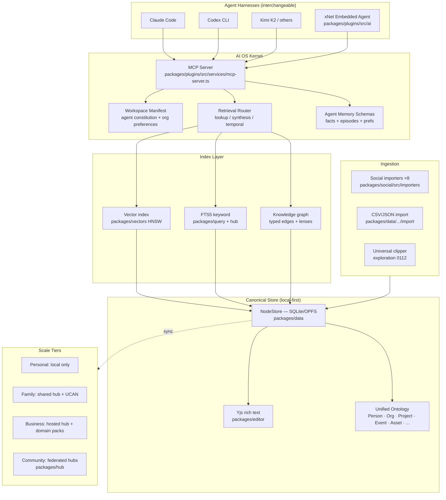
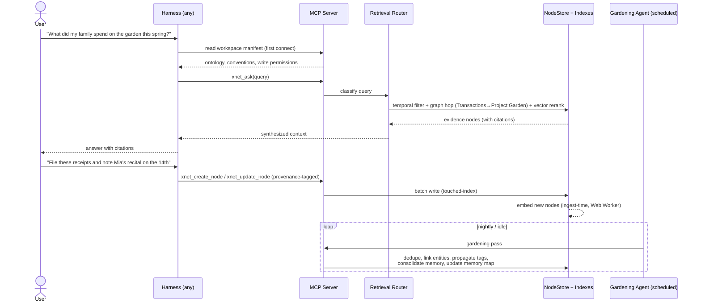
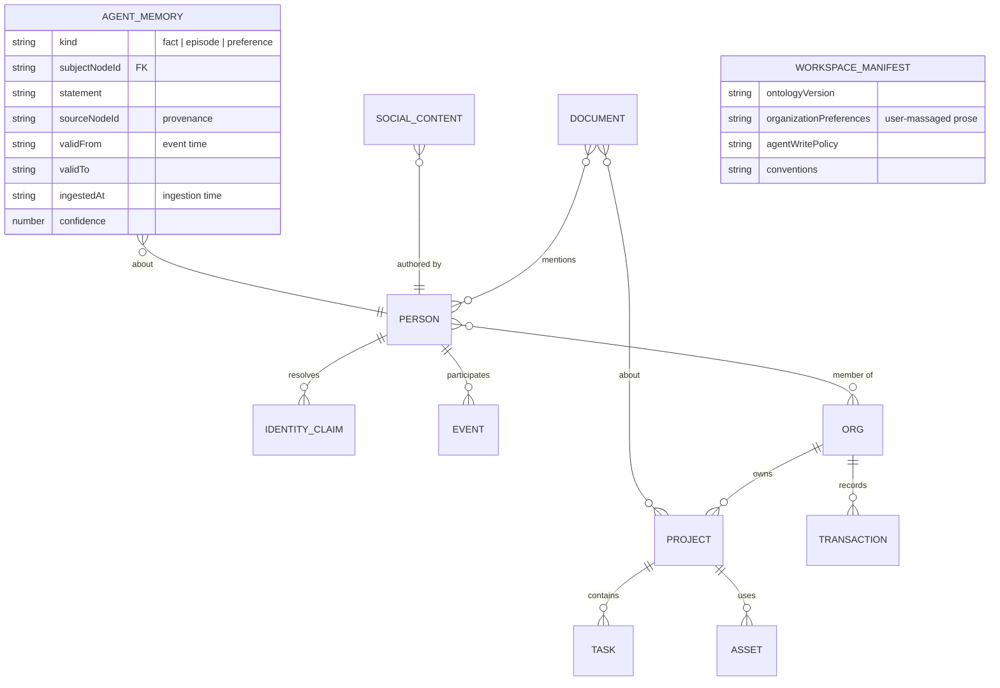
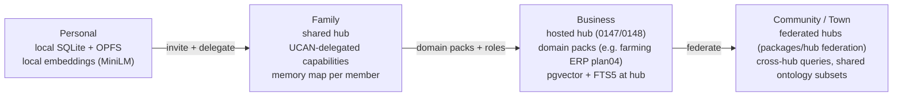

# xNet As An AI Operating System

## Problem Statement

xNet should eventually function as an **AI operating system** — at the scale of a
person, a family, a business, or an entire community/town. The vision:

- **Ingest everything.** Social exports, notes, transcripts, images, AI chat
  histories, business records — any dataset a person or org accumulates.
- **Organize automatically.** The AI files things into databases, documents,
  canvases, folders, and graph relationships behind the scenes, while the user
  can "massage" the organization in any direction they prefer.
- **Answer anything.** Run AI (RAG, embeddings, vector + graph retrieval) over
  the whole corpus so you can ask questions about your life, your family, your
  business, or your town — the way Tesla's in-house Warp ERP lets employees ask
  questions about any domain Tesla has data on (factories, cars, robots).
- **Agent as the primary interface.** You talk to an agent continuously; it both
  _writes to_ the OS (organizing, updating) and _reads from_ it (querying,
  answering) — a two-way feedback loop.
- **Harness-agnostic.** Claude Code, Codex, Kimi K2, or any other agent harness
  should be able to plug in and operate the same workspace.

The proof-of-concept this idea grew from: people running Claude Code over an
Obsidian vault as a "personal AI OS," crossed with company-scale AI-native ERPs
like Tesla Warp. This exploration maps that vision onto what xNet already has,
surveys prior art, and recommends a concrete architecture and sequencing.

## Executive Summary

xNet is **much closer to this vision than it might appear**. The repository
already contains nearly every load-bearing component of an AI OS:

| AI OS requirement       | Already in the repo                                                                                                                                           |
| ----------------------- | ------------------------------------------------------------------------------------------------------------------------------------------------------------- |
| Universal ingestion     | 8 social/AI-platform importers (`packages/social/src/importers/`), CSV/JSON import (`packages/data/src/database/import/`), fast batch writes (10k+ nodes/sec) |
| Structured organization | Notion-grade databases (V2, exploration 0159), pages, canvases, views (`packages/data`, `packages/views`, `packages/canvas`, `packages/editor`)               |
| Semantic retrieval      | `packages/vectors/` — embeddings (all-MiniLM-L6-v2), HNSW index, hybrid keyword+vector search                                                                 |
| Agent integration       | MCP server over stdio (`packages/plugins/src/services/mcp-server.ts`), local HTTP API, script sandbox, AI workspace exporter                                  |
| Multi-scale deployment  | Local-first SQLite + optional hub with federation/sharding (`packages/hub/`), UCAN/DID auth for sharing                                                       |

What's **missing** is not components but **orchestration and doctrine**:

1. **A unified ontology** — first-class typed objects (Person, Project, Event,
   Asset, Transaction…) with explicit edges, which every AI query and MCP tool
   operates on. External research is unanimous: Palantir, Glean, Tesla Warp,
   and the Obsidian-vault pattern all succeed because of the object model, not
   the chat interface. _The ontology is the kernel._
2. **A workspace manifest** — the xNet equivalent of `CLAUDE.md`/`AGENTS.md`: a
   per-workspace document any connecting harness reads first, defining the
   schema, organization conventions, and what the agent may write vs. read.
3. **A retrieval router** — classify queries as lookup (vector), synthesis
   (graph), or temporal ("as of March") and route to the right index. Hybrid
   vector+graph beats either alone for "questions about your life."
4. **Agent memory schemas** — persistent memory, fact extraction, and an
   organization-feedback loop so the AI's filing improves over time.
5. **RAG, not fine-tuning.** Industry consensus (51% RAG vs 9% fine-tuning in
   production) and personal-corpus dynamics both say: invest in retrieval, not
   custom model training. "Custom embeddings" yes; "custom training" no (for now).

**Recommended path:** harden the MCP server into the canonical agent interface
(Phase 1), formalize the ontology + workspace manifest (Phase 2), build the
hybrid retrieval router on the existing vectors package (Phase 3), add agent
memory + auto-organization loops (Phase 4), then scale tiers via the hub
(Phase 5). Each phase ships independently useful value.

## Current State In The Repository

xNet is a local-first monorepo: apps (Electron, Web PWA, Expo) over ~21 SDK
packages, with an optional Railway-deployed hub (`railway.toml`,
`packages/hub/`).

### Ingestion — already broad and fast

- `packages/social/src/importers/` — complete adapters for **Instagram, X,
  TikTok, YouTube, Reddit, Claude, OpenAI/ChatGPT, and Grok** archives. ZIP →
  manifest detection → bucket selection → staging → canonical nodes.
- Canonical social model: `SocialActor`, `SocialContent`, `SocialInteraction`,
  `SocialConversation`/`SocialMessage`, `SocialCollection`,
  `SocialIdentityClaim`, plus optional `SocialSourceRecord` provenance.
- `packages/data/src/database/import/` — CSV/JSON import/export with smart type
  conversion; import runs in a Web Worker.
- Explorations 0156/0157 proved fast batch writes (`indexMode: 'touched'`,
  10k+ nodes/sec) — ingestion at "all of your data" scale is solved in principle.

### Organization surfaces — the "Notion equivalent" exists

- `packages/data/src/database/` + exploration 0159 (Database V2): everything-
  is-a-node model, 19 column types, formulas/rollups, materialized views with
  SQLite pushdown, per-cell LWW merge.
- `packages/editor/` — TipTap + Yjs collaborative editor with wikilinks,
  backlinks, slash commands, embeds, comments.
- `packages/canvas/` — infinite canvas with R-tree spatial indexing, ELK.js
  auto-layout, WebGL tiles for 100k+ node scenes.
- `packages/views/` — Table, Board, Gallery, Timeline, Calendar, List.
- `packages/social/src/lenses/` and `packages/social/src/projection/` — graph
  lenses and canvas projection plans over imported social graphs.

### AI/retrieval — more exists than expected

- `packages/vectors/` — embedding models (`embedding.ts`, default
  all-MiniLM-L6-v2, 384-dim), HNSW ANN index (`hnsw.ts`), `SemanticSearch` and
  `HybridSearch` (keyword + vector score fusion) (`hybrid.ts`, `search.ts`).
- `packages/plugins/src/services/mcp-server.ts` — a working **MCP server**
  (JSON-RPC over stdio) exposing query/mutation/resource/graph/workspace tools
  generated from the schema registry.
- `packages/plugins/src/services/ai-workspace-exporter.ts` — exports structured
  workspace data (schemas, nodes, summaries, links) as RAG context.
- `packages/plugins/src/ai/` — `generator.ts` + `providers.ts` (Anthropic,
  OpenAI, Ollama adapters) for AI script generation; `packages/plugins/src/sandbox/`
  validates and executes generated scripts safely (acorn AST checks).
- `packages/plugins/src/services/local-api.ts` — local HTTP API; webhook
  emitter for external automation.
- `packages/abuse/src/ai-provenance.ts`, `citation-coverage.ts` — provenance
  and citation tracking for AI-generated content.

### Multi-scale substrate — personal → community is already the deployment model

- Local-first: SQLite (OPFS on web via sqlite-wasm, better-sqlite3 on
  Electron, expo-sqlite on mobile) — `packages/sqlite/`, `packages/storage/`.
- `packages/sync/` — Lamport clocks, per-property LWW, Yjs CRDT for rich text.
- `packages/hub/` — backup, FTS5 query service, file storage, schema registry,
  **hub-to-hub federation and sharding**, UCAN/DID capability auth. This is the
  natural seam for family hubs, business hubs, and community/town hubs.
- `packages/network/` — libp2p + WebRTC P2P.

### ERP precedent

- `docs/plans/plan04GlobalFarmingERP/` — a 13-stage domain ERP (farming) with
  planned MCP tools (`11-ai-integrations.md`): photo ID, soil interpretation,
  guild design. This is the template for "domain packs" in the AI OS.

### Most relevant prior explorations

- `0138` AI deep integration with pages/databases/canvases (Claude Code + MCP) — complete.
- `0159` Database V2 overhaul — the unified node data model.
- `0112` Universal clipper & AI knowledge-graph ingestion — proposal.
- `0148`/`0147`/`0144` — hosted hubs with deep AI integration, monetization.
- `0150`/`0151` — unified social graph, self-organizing recommendation space.
- `0152`/`0153`/`0156`/`0157` — social import + workspace UI + speed.

### Gap analysis

| Gap                                                                                   | Severity   | Notes                                                                   |
| ------------------------------------------------------------------------------------- | ---------- | ----------------------------------------------------------------------- |
| No unified cross-domain ontology (social model ≠ page/task schemas ≠ farming schemas) | High       | Identity resolution exists only inside social (`SocialIdentityClaim`)   |
| No RAG orchestration / retrieval router                                               | High       | Pieces exist (vectors, FTS5, graph) but nothing composes them per-query |
| No workspace manifest for connecting harnesses                                        | Medium     | MCP tools exist but agents get no "constitution"                        |
| No agent memory / organization-feedback schemas                                       | Medium     | Can be plain schemas + MCP tools                                        |
| Vectors package not wired into the main app data flow                                 | Medium     | Embeddings aren't generated at ingest time                              |
| No temporal ("as-of") query model                                                     | Low–Medium | Sync layer has Lamport clocks; not exposed for queries                  |

## External Research

### 1. Obsidian + Claude Code: the grassroots personal AI OS

The dominant community pattern: point an agent harness at a markdown vault.
Conventions that emerged (Imhoff, Okhlopkov, MindStudio et al., 2025):

- **`CLAUDE.md`/`AGENTS.md` as the agent's constitution** — folder layout, note
  templates, write permissions, style rules. Without it the agent is "a smart
  intern with no map."
- **Agent-legible structure** — flat predictable paths beat human-pretty taxonomies.
- **Provenance rules** — AI-generated content is dated and attributed; human
  notes are never overwritten.
- **Gardening agents** — periodic re-index, archive, tag-propagation passes.
- **Dual store** — markdown = canonical truth; a separate semantic index = cache.

**Takeaway:** the minimal AI OS kernel is a _text document the agent reads
first_, plus a canonical-store/semantic-index split. Both map directly onto xNet.

### 2. Tesla Warp ERP

Built in-house from 2012 (~25 engineers, C#/.NET, four months for v1) because
Tesla's direct-sales model didn't fit SAP. Centralizes supply chain, inventory,
sales, finance, HR, OTA-update logistics. The "ask any domain" capability is a
newer AI layer (Grok integration, "Digital Optimus," 2026) **on top of** Warp —
not a rewrite. **Takeaway:** Tesla spent years getting a clean, owned data model
before the AI layer became possible. Domain modeling first; AI layer second.

### 3. Personal AI memory systems

- **Letta/MemGPT** — OS-paging metaphor: context window = RAM, archival = disk;
  the agent pages memory via tool calls. Requires adopting its runtime.
- **Zep/Graphiti** (arXiv:2501.13956) — temporal knowledge graph: episode
  subgraph (raw, lossless) → semantic entity subgraph → community subgraph.
  **Bi-temporal edges** (event time vs. ingestion time) enable "what was true
  about X in March?" Scored 71.2% on LongMemEval vs Mem0's 49.0%.
- **Mem0** — hybrid vector + graph + history-log store with automatic fact
  extraction/dedup; the most drop-in pattern; beats OpenAI memory by ~26%.
- **Khoj** — open-source self-hosted personal AI over PDFs/markdown/Notion
  exports; closest live analog to single-user xNet.
- **ChatGPT memory "Dreaming"** — background consolidation during idle periods
  plus a user-visible **memory map**; the right UX for memory legibility.

**Takeaway:** adopt Mem0's hybrid (vector + graph + log) as the memory schema;
layer Graphiti-style bi-temporal metadata for as-of queries (critical for the
business/ERP tier); copy the memory-map UX for trust.

### 4. Local-first RAG stacks

- **sqlite-vec** — pure-C vector search anywhere SQLite runs, including WASM;
  full on-device pipelines proven on a Raspberry Pi Zero.
- **Transformers.js** — all-MiniLM-L6-v2 (~22MB, 384-dim) embeds in 8–12ms on
  WASM; WebGPU helps large models but WASM suffices for small embedders.
- **LanceDB** — embedded columnar vector DB, ideal for Electron/native.
- **pgvector** — the standard for a multi-user server deployment (hub tier).

**Takeaway:** the browser-native stack (Transformers.js + sqlite-vec/HNSW over
OPFS) is feasible _today_ — and xNet's `packages/vectors/` already implements
most of it. Abstract the vector backend so local (HNSW/sqlite-vec) and hub
(pgvector/FTS5) share one query interface.

### 5. GraphRAG and hybrid retrieval

- Vector RAG wins **local lookups** ("who wrote the memo about X?").
- Graph RAG wins **global/multi-hop synthesis** ("why has my productivity
  dropped this month?" — connects calendar + tasks + journal). arXiv:2506.05690:
  87.9–90.9% evidence recall on multi-hop vs near-zero for vector RAG.
- **Microsoft GraphRAG** — LLM entity extraction + Leiden communities +
  pre-generated summaries; originally ~$33K to index a large corpus.
  **LazyGraphRAG** (2025) defers summarization to query time: 0.1% of the
  indexing cost, comparable quality.
- **LightRAG** (EMNLP 2025) — graph + vector dual-mode without community
  clustering; the practical open-source choice.

**Takeaway:** build the graph structure cheaply at ingest (xNet already has
typed edges); do LLM-heavy summarization lazily at query time; route queries by
type.

### 6. MCP as the harness-agnostic integration layer

Notion ships an official hosted MCP server; Obsidian has 64+ community servers;
**Anytype** (local-first, E2E-encrypted — xNet's closest architectural cousin)
ships **no native AI at all**, just an official MCP server, and is fully
relevant in the agent ecosystem. Tana and Capacities ship MCP servers too.

**Takeaway:** MCP is the answer to "integrate with Claude Code / Codex / Kimi
K2." One server, every harness. xNet already has one — it needs to become the
flagship interface, not a plugin service.

### 7. AI-native ERP: the semantic-layer convergence

Every serious "ask your business anything" product converges on the same move:
a **governed ontology between raw data and the model**.

- **Palantir Foundry/AIP** — the Ontology is "a digital twin of the
  organization"; AI queries ontology objects, never raw SQL; **permissions are
  properties of ontology objects**, so the AI respects access control for free.
- **Glean** — knowledge graph of people/documents/tools/projects as triplets;
  permissions-aware retrieval; fine-tunes **embedding models** (not LLMs) per
  enterprise.
- **Microsoft Fabric/Copilot** — Copilot queries the semantic model, not SQL.

**Takeaway:** _the ontology is the product._ Permissions-as-ontology-properties
is exactly what xNet's UCAN/DID capability model can express — a major
differentiator at family/community scale.

### 8. Fine-tuning vs RAG for personal corpora

Menlo Ventures 2024: 51% of enterprise deployments use RAG vs 9% fine-tuning.
RAG wins on currency (your data changes daily), debuggability, cost, and no
catastrophic forgetting. Fine-tuning helps only for style/format or (per UC
Berkeley RAFT) teaching a small model _how to use your retrieval tools_.
**Takeaway:** "custom embeddings and RAG" — yes. "Custom training" — defer
until the retrieval pipeline is mature, and even then only RAFT-style.

## Key Findings

1. **xNet's gap is orchestration, not components.** Ingestion, storage, views,
   vectors, MCP, sandboxing, sync, and federation all exist. Nothing composes
   them into a query-answering, self-organizing loop.
2. **Every successful AI OS is ontology-first.** Palantir, Glean, Warp, and even
   the Obsidian vault pattern (CLAUDE.md defines the object model in prose).
   xNet has three disjoint ontologies today (social, workspace, farming-plan);
   unifying them is the single highest-leverage move.
3. **MCP makes "harness-agnostic" nearly free.** Anytype proves a local-first,
   privacy-focused workspace can participate fully in the agent ecosystem with
   an MCP server alone. xNet's existing server needs tool-surface polish,
   a manifest convention, and first-run docs — not a rewrite.
4. **Hybrid retrieval with a router is the proven shape.** Vector for lookup,
   graph for synthesis, temporal for as-of. xNet has the vector and graph
   halves; the router and ingest-time embedding are the new work.
5. **The two-way feedback loop = memory schemas + gardening agents.** Agent
   writes are ordinary node mutations through MCP; "the AI organizes for you"
   is a scheduled gardening pass plus an organization-preference document the
   user can edit ("massage") directly.
6. **Scale tiers fall out of the hub architecture.** Personal = local-only;
   family = shared hub + UCAN delegation; business = hosted hub + domain packs;
   community = federated hubs. No new sync machinery required.
7. **Trust requires provenance and legibility.** AI-filed content must be
   attributed (`packages/abuse/src/ai-provenance.ts` exists for this) and the
   memory/organization state must be inspectable (memory-map UX).

## Options And Tradeoffs

### Option A — Harness-first ("Anytype model")

xNet ships **no embedded agent**. It becomes the best-possible MCP substrate:
polished tool surface, workspace manifest, ingest-time embeddings, retrieval
tools. Users bring Claude Code / Codex / Kimi K2.

- **Pros:** smallest scope; rides harness improvements for free; zero
  inference cost to xNet; perfectly aligned with local-first ethos; the proven
  Obsidian/Anytype pattern.
- **Cons:** non-technical family/community users won't run a CLI harness; no
  control over the conversational UX; "constantly talking to an agent" requires
  someone else's front-end.

### Option B — Embedded agent over MCP (xNet ships its own chat surface)

xNet adds a built-in conversational agent (Anthropic/OpenAI/Ollama via the
existing `packages/plugins/src/ai/providers.ts`) that consumes the **same MCP
tool surface** external harnesses use. One tool surface, two consumers.

- **Pros:** approachable for families/communities; xNet controls the loop
  (auto-organization, memory consolidation); still fully harness-agnostic
  because the tool surface is shared; local models via Ollama preserve privacy.
- **Cons:** inference cost/key management; agent-loop engineering (though the
  script sandbox + generator are a head start); more UI surface to maintain.

### Option C — Full custom AI runtime (training, custom models, own agent framework)

Custom-trained models on user corpora, bespoke agent orchestration, xNet-native
fine-tuning pipelines.

- **Pros:** maximal differentiation in theory.
- **Cons:** contradicted by the research consensus (RAG ≥ fine-tuning for
  dynamic personal corpora); enormous cost; stale weights vs. living data;
  forecloses riding frontier-model progress. **Rejected** except possibly
  RAFT-style retrieval-tool tuning much later.

### Retrieval sub-options

|                                     | Vector-only RAG            | Graph-only                           | **Hybrid + router (recommended)**               |
| ----------------------------------- | -------------------------- | ------------------------------------ | ----------------------------------------------- |
| Simple lookups                      | ✅ great                   | ⚠️ ok                                | ✅ great                                        |
| Multi-hop "about my life" synthesis | ❌ near-zero recall        | ✅ 88–91% recall                     | ✅                                              |
| As-of/temporal queries              | ❌                         | ⚠️ needs bi-temporal edges           | ✅ with temporal metadata                       |
| Ingest cost                         | low                        | high if eager (GraphRAG ~$33K class) | low — lazy summarization (LazyGraphRAG pattern) |
| Repo readiness                      | `packages/vectors/` exists | typed edges + lenses exist           | router is new work                              |

### Organization sub-options (who files things?)

1. **Manual-first, AI-assist** — user files; AI suggests. Safe but doesn't
   deliver the vision.
2. **AI-first, user-massage (recommended)** — AI files everything per an
   editable _organization-preferences document_; every AI filing is provenance-
   tagged and reversible (time-machine undo via `packages/history/`); gardening
   passes consolidate.
3. **AI-only** — opaque; breaks trust; rejected.

## Recommendation

**Option B reached through Option A** — build the harness-first substrate
(Phases 1–3), then add the embedded agent as a second consumer of the same
surface (Phase 4), then scale tiers (Phase 5). Hybrid retrieval with a router;
AI-first/user-massage organization; RAG over fine-tuning throughout.

### Target architecture



### The agent loop (two-way feedback)



### Unified ontology + memory (sketch)



Key design points:

- **Ontology as schemas, edges as relations.** Extend the existing schema
  registry (`packages/data/src/schema/`) with core cross-domain types; promote
  `SocialIdentityClaim`-style identity resolution to ontology level so an
  Instagram follower, a contact, and a family member can be the same `Person`.
- **Permissions on ontology objects** via the existing UCAN/DID layer — the
  Palantir trick, but decentralized: the agent can only retrieve what the
  asking identity can see. This is what makes family/community tiers safe.
- **Bi-temporal metadata** (`validFrom`/`validTo`/`ingestedAt`) on memory and
  key edges, enabling "as-of" queries — the Graphiti pattern, and table stakes
  for the business/ERP tier.
- **Workspace manifest** is a real document node (editable in the normal
  editor — the "massage" affordance) that the MCP server serves to every
  connecting harness as its first resource.
- **Lazy graph summarization** (LazyGraphRAG pattern): never run a $-heavy
  eager indexing pass; summarize communities at query time and cache.

### Scale tiers



## Example Code

### 1. Workspace manifest (the agent's constitution)

```ts
// packages/data/src/schema/schemas/workspace-manifest.ts
export const WorkspaceManifestSchema = defineSchema({
  id: 'xnet://WorkspaceManifest',
  properties: {
    ontologyVersion: { type: 'text' },
    // Prose the user edits to "massage" organization — read by every agent.
    organizationPreferences: { type: 'richText' },
    agentWritePolicy: { type: 'select', options: ['suggest', 'autofile-reversible', 'autofile'] },
    pinnedSchemas: { type: 'multiSelect' }, // what the agent should know first
    gardeningSchedule: { type: 'text' } // cron-ish, e.g. 'nightly'
  }
})
```

### 2. Retrieval router as the flagship MCP tool

```ts
// packages/plugins/src/services/retrieval-router.ts
type QueryClass = 'lookup' | 'synthesis' | 'temporal' | 'structured'

export async function xnetAsk(query: string, asOf?: string): Promise<Evidence[]> {
  const cls = classifyQuery(query, asOf) // cheap heuristic + small model
  switch (cls) {
    case 'lookup': // vector + keyword fusion
      return hybridSearch.search(query, { keywordWeight: 0.3, vectorWeight: 0.7 })
    case 'structured': // ontology traversal, no LLM
      return queryEngine.run(toQueryAST(query))
    case 'temporal': // bi-temporal edge filter first
      return temporalFilter(asOf!, await graphRetrieve(query))
    case 'synthesis': // LightRAG-style dual mode,
      return lazyGraphSummarize(
        // summaries computed at query
        await graphRetrieve(query), // time and cached (LazyGraphRAG)
        await hybridSearch.search(query)
      )
  }
}
```

### 3. Ingest-time embedding hook (wiring `packages/vectors` into batch writes)

```ts
// packages/data/src/database/import/embed-on-ingest.ts
nodeStore.onBatchCommitted(async (batch) => {
  const texts = batch.nodes.map(extractEmbeddableText).filter(Boolean)
  const vectors = await embedWorker.embed(texts) // all-MiniLM in a Web Worker
  await vectorIndex.addBatch(batch.nodes.map((n, i) => [n.id, vectors[i]]))
})
```

### 4. Provenance-tagged agent writes

```ts
// every MCP mutation stamps provenance — existing packages/abuse primitives
await store.update(nodeId, props, {
  provenance: {
    actor: 'agent',
    model: session.model,
    harness: session.client,
    at: now(),
    reversible: true
  } // surfaces in memory-map UI,
}) // undoable via packages/history
```

## Risks And Open Questions

- **Privacy at scale.** Family/community tiers aggregate intimate data. UCAN
  capabilities answer authorization, but inference is a separate leak surface:
  if the agent uses a cloud model, retrieved context leaves the device. Need a
  per-workspace inference policy (local-only Ollama vs. cloud) in the manifest.
- **Trust in auto-organization.** If the gardening agent mis-files or merges
  two people wrongly, users lose confidence fast. Mitigations: reversible-by-
  default writes, provenance badges, memory-map UI, identity merges always
  suggest-first.
- **Embedding cost/latency on huge corpora.** A full social archive can be
  hundreds of thousands of nodes. MiniLM at ~10ms/item is hours of background
  work — needs progress UX, prioritization (recent/important first), and
  possibly hub-side embedding for paying tiers.
- **Graph extraction quality.** LLM entity extraction over personal data is
  noisy. The lazy approach bounds cost, but precision/recall on identity
  resolution needs evaluation before auto-merge is enabled.
- **MCP surface stability.** Tool schemas become a public API for every
  harness; versioning discipline needed (ontologyVersion in the manifest).
- **Query classification errors.** A mis-routed query gives a confidently
  wrong answer. Start with heuristics + user-visible "searched via X" labels.
- **Open question:** should the embedded agent (Phase 4) live in the apps or as
  a separate `packages/agent`? Leaning package — both Electron and web consume it.
- **Open question:** does the community tier need cross-hub _retrieval_ (query
  federation exists) or also cross-hub _embedding spaces_? Defer until a real
  community deployment exists.
- **Open question:** how do Database V2 rows participate in retrieval — embed
  per-row, per-cell, or per-view-summary? Prototype per-row first.

## Implementation Checklist

### Phase 1 — MCP substrate (harness-first, "Anytype-grade")

- [ ] Audit and polish the MCP tool surface in `packages/plugins/src/services/mcp-server.ts` (naming, descriptions, compact responses sized for context windows)
- [ ] Add `WorkspaceManifest` schema + MCP resource served on connect; document the convention for Claude Code/Codex/Kimi setup (a `docs/` quickstart per harness)
- [ ] Stamp provenance on every MCP mutation (reuse `packages/abuse/src/ai-provenance.ts`); make agent writes reversible via `packages/history`
- [ ] Ship an `xnet mcp` CLI entry (via `packages/cli`) so `claude mcp add xnet -- xnet mcp` works in one line

### Phase 2 — Unified ontology

- [ ] Define core cross-domain schemas: Person, Org, Project, Event, Asset, Transaction, Place (extend `packages/data/src/schema/schemas/`)
- [ ] Promote identity resolution from `packages/social` (`SocialIdentityClaim`) to ontology level; suggest-first merge UI
- [ ] Map existing social/page/task/database schemas onto the ontology (adapters, not migrations)
- [ ] Attach UCAN capability checks to ontology object retrieval (permissions-aware tools)
- [ ] Add bi-temporal fields (`validFrom`/`validTo`/`ingestedAt`) to memory and key relation edges

### Phase 3 — Hybrid retrieval

- [ ] Wire `packages/vectors` into ingest: embed-on-batch-commit in a Web Worker, with backfill job + progress UX
- [ ] Implement the retrieval router (`xnet_ask` MCP tool): lookup / structured / temporal / synthesis classification
- [ ] Implement lazy graph summarization over typed edges + lenses (LightRAG/LazyGraphRAG pattern), with summary caching as nodes
- [ ] Evidence-with-citations response format (reuse `citation-coverage.ts`)
- [ ] Vector backend abstraction: local HNSW (existing) now; hub-side pgvector/FTS5 path later

### Phase 4 — Agent memory + auto-organization

- [ ] `AgentMemory` schema (fact/episode/preference, confidence, provenance, bi-temporal) + MCP read/write tools
- [ ] Gardening agent: scheduled pass (dedupe, entity linking, tag propagation, memory consolidation) using the script sandbox
- [ ] Memory-map UI: inspect/edit/delete what the AI believes (ChatGPT memory-map pattern)
- [ ] Embedded agent surface (`packages/agent` + chat UI in apps) consuming the same MCP tool surface; provider choice incl. local Ollama; per-workspace inference policy (local-only vs cloud)

### Phase 5 — Scale tiers

- [ ] Family tier: shared-hub onboarding flow, per-member capability delegation, per-member memory scoping
- [ ] Business tier: domain-pack convention (farming ERP plan04 as the pilot) — schemas + lenses + MCP tools per domain
- [ ] Hub-side retrieval: FTS5 + pgvector behind the same router for hosted tiers (explorations 0147/0148)
- [ ] Community tier: federated `xnet_ask` across hubs (existing federation in `packages/hub`), shared ontology subsets

## Validation Checklist

- [ ] **Harness round-trip:** from a fresh checkout, `claude mcp add xnet` then ask Claude Code "what's in my workspace?" — agent reads the manifest and answers correctly; repeat with Codex CLI
- [ ] **Ingest→ask:** import a real social archive, then ask a cross-platform question ("who do I follow on both Instagram and X?") — answered with citations via the structured route
- [ ] **Synthesis:** a multi-hop question spanning ≥3 schemas ("what was I working on when I posted most about gardening?") retrieves correct evidence (target: graph route recall ≫ vector-only baseline on a 20-question eval set)
- [ ] **Temporal:** "as of <date>" question returns period-correct facts after later edits
- [ ] **Two-way loop:** agent files 10 dictated items per the manifest's organization preferences; user edits the preferences prose; next 10 items follow the new convention
- [ ] **Reversibility:** every agent write shows provenance and is undoable in one step from the memory-map/history UI
- [ ] **Permissions:** a family member with limited capabilities asks a question whose evidence they cannot see — answer excludes it
- [ ] **Performance:** embed backfill of a 100k-node workspace completes in background without blocking UI; `xnet_ask` lookup route p50 < 500ms locally
- [ ] **Privacy:** with inference policy = local-only, no network egress during ask/garden cycles (verified by network inspection)

## References

### Internal

- `docs/explorations/0138_*` — AI deep integration (Claude Code + MCP)
- `docs/explorations/0159_[_]_DATABASE_V2_OVERHAUL_NOTION_GRADE_TABLES.md`
- `docs/explorations/0112_*` — universal clipper & knowledge-graph ingestion
- `docs/explorations/0144_*`, `0147_*`, `0148_*` — hubs, hosting, monetization
- `docs/explorations/0150_*`–`0153_*`, `0156_*`, `0157_*` — social graph + import
- `docs/plans/plan00Setup/09-ai-mcp-interface.md`, `docs/plans/plan04GlobalFarmingERP/`
- `packages/vectors/`, `packages/plugins/src/services/mcp-server.ts`, `packages/plugins/src/ai/`, `packages/social/`, `packages/hub/`

### External

- Obsidian + Claude Code pattern: stefanimhoff.de/agentic-note-taking-obsidian-claude-code · okhlopkov.com/second-brain-obsidian-claude-code · mindstudio.ai/blog/build-ai-second-brain-claude-code-obsidian
- Tesla Warp: warp.tesla.com · grokipedia.com/page/warp-erp-system
- Memory systems: arXiv:2501.13956 (Zep/Graphiti) · mem0.ai/blog/state-of-ai-agent-memory-2026 · github.com/khoj-ai/khoj · openai.com/index/chatgpt-memory-dreaming
- Local-first RAG: github.com/asg017/sqlite-vec · alexgarcia.xyz/blog/2024/sqlite-vec-stable-release · github.com/lancedb/lancedb · sitepoint.com/webgpu-vs-webasm-transformers-js
- GraphRAG: microsoft.com/en-us/research/blog/lazygraphrag-setting-a-new-standard-for-quality-and-cost · arXiv:2506.05690 (when to use graphs in RAG) · LightRAG (EMNLP 2025)
- MCP ecosystem: developers.notion.com/docs/mcp · github.com/anyproto/anytype-mcp · github.com/aaronsb/obsidian-mcp-plugin · chatforest.com/guides/mcp-personal-knowledge-management-pkm
- Semantic layer / AI-native ERP: palantir.com/platforms/aip · glean.com/blog/the-definitive-guide-to-ai-based-enterprise-search-for-2025
- RAG vs fine-tuning: Menlo Ventures 2024 State of GenAI · arXiv:2505.15179 · UC Berkeley RAFT
