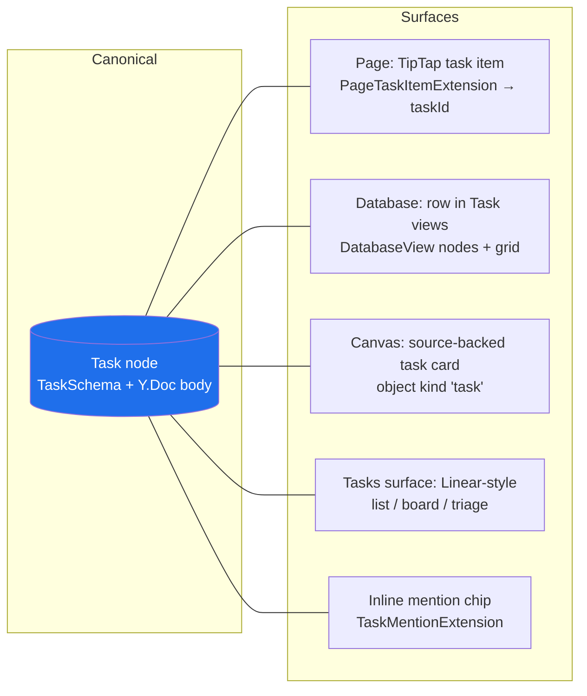
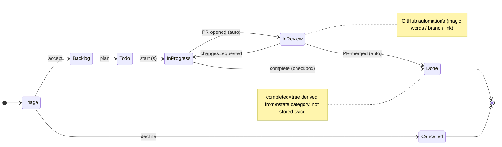
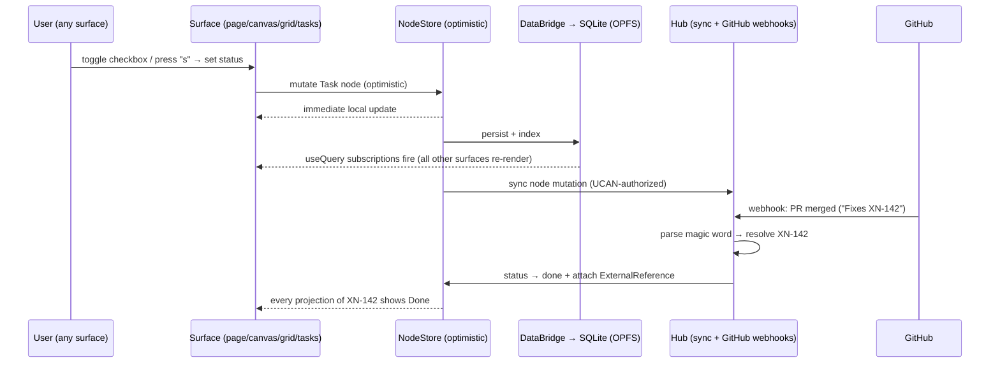
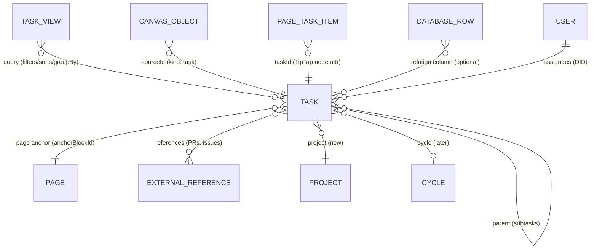

# Linear-Style Tasks As A Portable Cross-Surface Primitive

## Problem Statement

We want xNet to support Linear-grade task and project management — fast,
keyboard-first, GitHub-aware, with rich-text task descriptions — without
becoming "a Linear clone bolted onto a knowledge tool." The defining
constraint is portability: a task should be **one entity** that renders and
edits natively in every surface xNet already has:

- **Pages** — as a checklist item inside a rich text document
- **Databases** — as a row in a table/board/list/calendar/timeline view
- **Canvases** — as a card on the infinite canvas, connectable by edges
- **A dedicated triage/issues surface** — a Linear-style keyboard-driven
  list with workflow states, priorities, cycles, and a command palette

Completion status, title, due date, assignees, priority, and description
must stay consistent no matter which surface you touch them from. The user
should be able to do real project planning from _any_ view without
wondering "is this the real task or a copy?"

## Executive Summary

xNet is unusually well positioned for this. The data model groundwork
already exists and was explicitly designed for it:

- `TaskSchema` (`packages/data/src/schema/schemas/task.ts`) is already a
  rich node type: title, completed, status, priority, dueDate, assignees,
  parent (subtasks), page anchor, sortKey, source, external references,
  and a collaborative Y.Doc body for the description.
- Exploration **0103** already committed to the "one canonical Task node,
  many surface projections" model, and partial implementation exists:
  `PageTaskItemExtension` bridges TipTap checklist items to Task nodes,
  `usePageTaskSync` reconciles them, and `useTasks` queries them.
- Exploration **0159** (database v2) delivers the Notion-grade grid,
  per-cell LWW rows, and first-class `DatabaseView` nodes that a task
  database surface needs.
- Explorations **0135/0136** (canvas v3) define source-backed canvas
  objects — exactly the mechanism a canvas task card needs.

What's missing is not a data model — it's **convergence and a product
layer**: (1) unifying the three half-connected task representations
(TipTap task items, the canvas-local `ChecklistNodeComponent`, and
Task nodes) onto the single node-backed primitive; (2) a Linear-style
**Tasks surface** (saved views over Task nodes with board/list/triage
modes); (3) a **global keyboard/command system** (single-key shortcuts,
contextual mini-palettes, `g`-chords) that today only exists piecemeal in
the grid keymap and Cmd+K search; and (4) **GitHub integration** that
upgrades the existing `ExternalReference` + smart-reference chips into a
bidirectional link (branch names, magic words, auto-close on merge).

Recommended path: **Option B — Task stays a first-class node type with
surface projections** (continuing 0103), rendered through a shared
`TaskChip`/`TaskCard`/`TaskRow` component family, queried through the
same `useQuery`/DataBridge path the v2 grid uses, plus a new `TaskView`
saved-view node and a workspace-level command/shortcut registry.

## Current State In The Repository

### The Task node already exists and is rich

`packages/data/src/schema/schemas/task.ts` defines `TaskSchema` with:

| Property                 | Type                                    | Notes                                       |
| ------------------------ | --------------------------------------- | ------------------------------------------- |
| `title`                  | text                                    | required                                    |
| `completed`              | checkbox                                | quick-toggle boolean                        |
| `status`                 | select                                  | todo / in-progress / done / cancelled       |
| `priority`               | select                                  | low / medium / high / urgent                |
| `dueDate`                | date                                    |                                             |
| `assignee` / `assignees` | person (DID)                            | legacy single + multiple                    |
| `parent`                 | relation → Task                         | subtasks                                    |
| `page`                   | relation → Page                         | host page anchor                            |
| `anchorBlockId`          | text                                    | block-level anchor inside the page          |
| `sortKey`                | text                                    | fractional index for cross-view ordering    |
| `source`                 | select                                  | page / database / canvas / automation / api |
| `references`             | relation → ExternalReference (multiple) | GitHub PRs etc.                             |
| —                        | `document: 'yjs'`                       | collaborative rich-text description         |

This is already most of Linear's issue model. Notably it has the two
things Linear's model lacks that we need for portability: a **page
anchor** (so a task knows which document block hosts it) and a
**source** discriminator.

### Surface-by-surface inventory

- **Pages / editor** (`packages/editor/`): TipTap with Yjs collaboration
  (`packages/editor/src/components/RichTextEditor.tsx`). Existing pieces:
  - `TaskList`/`TaskItem` checkbox blocks, with
    `packages/editor/src/extensions/page-tasks/` (`PageTaskItemExtension`)
    storing a `taskId` on each item — the page↔node bridge.
  - `packages/react/src/hooks/usePageTaskSync.ts` reconciles editor items
    with Task nodes (create on add, update completion/title on change).
  - `packages/editor/src/extensions/task-metadata/` —
    `TaskMentionExtension`, `TaskDueDateExtension`.
  - `packages/editor/src/extensions/task-view-embed/` — embed a task
    query inline in a page.
  - `packages/editor/src/extensions/smart-reference/` — GitHub/Figma/etc.
    URL chips backed by `ExternalReferenceSchema`
    (`packages/data/src/schema/schemas/external-reference.ts`).
  - Slash palette (`packages/editor/src/extensions/slash-command/`).
- **Databases** (`packages/views/`, post-0159): DOM grid with a pure
  reducer state machine (`packages/views/src/grid/state.ts`), a
  Sheets-grade keymap (`packages/views/src/grid/keymap.ts`), view config
  as first-class `DatabaseView` nodes
  (`packages/data/src/schema/schemas/database-view.ts` — table | board |
  list | gallery | calendar | timeline, filters/sorts/groupBy/field
  overrides), and the modern query path
  `useQuery` → DataBridge worker → SQLite/OPFS
  (`packages/react/src/hooks/useGridDatabase.ts`).
- **Canvas** (`packages/canvas/`, `packages/canvas-core/`): object kinds
  `page | database | external-reference | media | shape | note | group`
  (`packages/canvas-core/src/types.ts`). There is a
  `ChecklistNodeComponent` (`packages/canvas/src/nodes/checklist-node.tsx`)
  that stores `ChecklistItem[]` **locally in canvas data — not backed by
  Task nodes**. This is the biggest divergence from the portable model.
- **Aggregation panels**: `packages/react/src/components/PageTasksPanel.tsx`
  (per-page task tree) and `apps/web/src/components/MyTasksPanel.tsx`
  (assigned-to-me), both over `packages/react/src/hooks/useTasks.ts`
  (filters: page, assignee, statuses, parent, due-date buckets).
- **Keyboard / commands**: Cmd+K global search
  (`apps/web/src/components/GlobalSearch.tsx`), the grid keymap, the
  editor slash palette, and a plugin `ShortcutManager`
  (`packages/plugins/src/shortcuts.ts`, `"Mod-Shift-K"`-style bindings).
  There is **no app-wide command registry**, no single-key contextual
  shortcuts, no `g`-chord navigation.
- **Identity & sync**: assignees are DIDs (`packages/identity/`), person
  cells already render DID comboboxes
  (`packages/views/src/properties/person.tsx`); sync is Yjs + node
  mutations over UCAN-authorized providers (`packages/sync/`). Comments
  already demonstrate the universal-anchor pattern we want for tasks
  (`packages/data/src/schema/schemas/commentAnchors.ts` — text, cell,
  row, canvas-object, node anchors).

### Prior explorations that constrain this design

- `0103_[-]_TASKS_EMBEDDED_IN_PAGES_BACKED_BY_NODES_…` — chose the
  canonical-node + projections model; phase 1 (page-embedded node-backed
  tasks) is partially shipped, phases 2–3 (saved views, canvas cards,
  notifications) are not.
- `0159_[_]_DATABASE_V2_OVERHAUL_NOTION_GRADE_TABLES.md` — the grid,
  per-cell LWW, and view-node architecture the Tasks surface should ride
  on rather than reinvent.
- `0136_[x]_EXPANDING_THE_INFINITE_CANVAS…` — prescribes that task cards
  on canvas be **source-backed objects** with multiple render modes
  (card / inline / mini / detail), like page and database objects.



## External Research

### Linear's architecture — what actually makes it feel fast

- **In-memory object graph + IndexedDB**: the whole workspace's issues
  load into memory; every read (filter, count, palette search) is a
  synchronous local lookup. Persisted snapshot + op log makes cold start
  fast and offline work possible.
- **Delta sync**: server keeps a per-workspace sequence number; clients
  receive only deltas over WebSocket and catch up with one diff request
  after offline. Field-level last-write-wins; no CRDTs.
- **Optimistic mutations**: UI updates instantly, mutation queued,
  rollback on (rare) rejection.
- **Keyboard model**: single letters for the core verbs (`c` create,
  `e` edit, `s` status, `a` assign, `p` priority, `l` label, `t` triage),
  `g`-chords for navigation (`g i` issues, `g p` projects), Cmd+K
  palette, and crucially **contextual mini-palettes** — pressing `s` on a
  focused issue opens an in-place status picker, keeping you in keyboard
  flow.
- Sources: Tuomas Artman's "Scaling the Linear Sync Engine" talks,
  devtools.fm ep. 17, linear.app/blog.

xNet's analog already exists: `useQuery` → DataBridge → local SQLite
(OPFS) **is** the local object store; Yjs handles the rich-text/canvas
layers. We don't need a new sync engine — we need to make sure the Tasks
surface reads exclusively from the local store and mutates optimistically,
which is already the NodeStore pattern.

### Portable task primitives — what works and what fails elsewhere

| Tool               | Model                                                                           | Lesson                                                                                                |
| ------------------ | ------------------------------------------------------------------------------- | ----------------------------------------------------------------------------------------------------- |
| **Notion**         | Inline to-do blocks ≠ database rows; structurally incompatible                  | The seam between "doc content" and "record" is the core failure mode. Don't ship two task models.     |
| **Tana**           | Supertags: tag any outline node `#task` → it gains schema and becomes queryable | Most elegant solution: the same node is prose _and_ record. Context changes the render, not the data. |
| **Anytype**        | Everything is an Object with typed Relations; Sets = global type views          | True portability works; cost is abstraction overload for casual users.                                |
| **AFFiNE**         | Docs and edgeless canvas share one Yjs block tree; same block renders in both   | Closest precedent for doc↔canvas duality; proves the Yjs-backed shared-entity approach works.         |
| **Obsidian Tasks** | Parse `- [ ]` markdown everywhere, query globally                               | Zero-schema capture is loved; markdown-as-source-of-truth is brittle (renames, scale, no relations).  |
| **Craft**          | Task blocks in docs + read-mostly aggregate view                                | Aggregate views must be fully editable or they feel broken.                                           |
| **Amie**           | Scheduling is a property of the task, not a separate calendar entity            | Avoids the todo↔calendar sync problem; relevant for our calendar/timeline views.                      |

### Transclusion pitfalls (Roam, Logseq, Notion synced blocks)

1. **Origin confusion** — users can't tell which occurrence is "real."
   Notion's peer-synced blocks satisfy neither the "copy" nor the
   "original + mirrors" mental model. Fix: there are no copies, ever —
   every render site edits the same node; offer an "open original /
   open full task" affordance.
2. **Deletion semantics** — removing a task from a surface must be
   **unlink**, not delete; "done" is a state change, not removal.
   Hard-delete becomes archive + tombstone chips at old render sites.
3. **Staleness** — every render site must be reactively bound (we get
   this for free from `useQuery` subscriptions).

### Linear's GitHub integration — the mechanics worth copying

- **Human-readable identifier** (`TEAM-123`) on every issue; pattern-match
  it in branch names, commit messages, PR titles/bodies.
- **Copy branch name** button generates `user/team-123-slug`; webhook on
  push auto-links the branch.
- **Magic words**: `Fixes/Closes/Resolves TEAM-123` → link + auto-close on
  merge; `Ref TEAM-123` → link only. PR opened → status "In Review"; PR
  merged → "Done"; PR closed → revert. Draft PRs inert.
- CI checks and review states mirrored onto the issue.
- xNet already has the receiving half: `ExternalReferenceSchema` nodes
  (provider/kind/refId/title/embedUrl) and the GitHub smart-reference
  provider. Missing: stable short task identifiers, the hub-side webhook
  receiver, and status automation.

### Libraries

- **cmdk** (pacocoursey/cmdk) — headless command palette; the standard.
- **tinykeys** or **react-hotkeys-hook** — chord support (`g i`) and
  scope handling so single-key shortcuts never fire inside inputs.
- **@dnd-kit** — board/kanban drag-drop (pairs with TanStack Virtual,
  which the grid already uses).

## Key Findings

1. **The hard architectural decision was already made (0103) and it's the
   right one.** One canonical Task node, many projections, matches Tana/
   Anytype/AFFiNE's winning pattern and the comments-anchor precedent
   already in the codebase. Nothing in the research argues for reversal.
2. **The model is ~90% built; the seams are the problem.** Three task
   representations exist today: node-backed page task items (bridged),
   the canvas-local checklist (not bridged), and ad-hoc checkbox columns
   in user databases (not Task nodes at all). Convergence, not invention,
   is the work.
3. **The Tasks surface should be views over Task nodes, reusing the v2
   database machinery** — `DatabaseView`-style saved-view nodes, the grid
   state machine, board/list/calendar renderers — rather than a parallel
   "issues" stack. Linear's table _is_ a filtered, grouped database view.
4. **Speed is a query-path discipline, not a new engine.** Linear-feel =
   all reads from local SQLite via DataBridge, optimistic node mutations,
   and prefetching the task working set at startup. The legacy
   `useDatabase` two-subscription path (deprecated per 0159) must not be
   used for tasks.
5. **Keyboard-first needs a workspace-level command registry.** Shortcut
   logic is currently siloed (grid keymap, editor slash menu, plugin
   ShortcutManager). Linear-style UX needs one registry with scopes
   (global / surface / focused-entity), single-key verbs, `g`-chords, and
   contextual mini-palettes — all surfaces register into it, including
   plugins via the existing contributions system.
6. **GitHub integration is high-leverage and mostly additive**: short IDs
   - hub webhook + magic-word parsing + status automation, layered on the
     existing `ExternalReference` and smart-reference plumbing.
7. **Workflow states need to grow, carefully.** Linear separates
   `completed` boolean thinking from a workflow-state machine with
   categories (backlog/unstarted/started/completed/cancelled) and
   per-team custom states. `TaskSchema.status` is a fixed four-option
   select today; project-scoped custom states are wanted but must keep
   `completed` derivable so checkboxes stay one-tap everywhere.



## Options And Tradeoffs

### Option A — Tasks as a system database (Task = DatabaseRow in a special database)

Make "Tasks" a built-in database; tasks are `DatabaseRow` nodes with
reserved fields; pages/canvases embed rows.

- ✅ Maximum reuse of the 0159 stack — views, grid, filters all free.
- ✅ One editing surface to maintain.
- ❌ Breaks the existing `TaskSchema` node + `useTasks` + page-task bridge
  (a migration with no user-facing payoff).
- ❌ Tasks become workspace-scoped _rows of a container_, complicating
  "task lives in a page" and per-task Y.Doc descriptions (rows do have
  per-row Y.Docs, but anchoring and `parent` trees get awkward).
- ❌ Couples task semantics (workflow automation, GitHub sync) to the
  generic database machinery.

### Option B — Task stays a first-class node; surfaces are projections (continue 0103) ✅

Task nodes remain canonical. Each surface holds only a reference
(`taskId`) plus surface-local layout (position on canvas, block anchor in
page, sortKey in views). Saved **TaskView** nodes (a sibling of
`DatabaseView`) define the Linear-style surface. The v2 grid/board/list
renderers are generalized to accept "node collections," not just
database rows.

- ✅ Continuity with 0103, `usePageTaskSync`, `PageTaskItemExtension`,
  `useTasks` — no migration, only convergence.
- ✅ Matches the comments precedent (universal node + per-surface anchors).
- ✅ Tasks keep their own schema evolution path (workflow states, cycles,
  projects) without entangling generic databases.
- ⚠️ Requires generalizing view renderers to query node collections —
  but 0159's `useQuery`-based path already returns nodes, so this is a
  parameterization, not a rewrite.
- ⚠️ Users may still want task-like columns in their own databases (see
  Option C escape hatch below).

### Option C — Supertag-style: any node/row can "become a task"

Tana-style: a `task` facet attachable to any node (page, row, canvas
note), granting status/due/assignee and global queryability.

- ✅ The most conceptually unified end-state; capture anywhere.
- ❌ Requires a mixin/facet system the schema layer doesn't have;
  query semantics ("all tasks") now span heterogeneous schemas.
- ❌ Big lift in indexing, UI, and permissions for speculative payoff.
- 💡 **Partial adoption**: support "convert to task" / "promote row to
  task" commands, and let user databases add a `relation → Task` column.
  This delivers most of the felt flexibility without the facet system.

### Option D — Embed a dedicated issues module (Linear-clone stack, separate store)

A standalone issues subsystem with its own store and UI, linked to
documents by URL-style references.

- ✅ Fastest path to a Linear lookalike screen.
- ❌ Recreates Notion's two-model failure — the exact thing the user is
  asking us to avoid. Rejected.

### Cross-cutting choice: where does "checklist in a database cell" fit?

Two sub-options for tasks inside database _rows_ (not the Tasks database):
(1) rich-text cells already support TipTap content per-row Y.Doc
(`packages/data/src/schema/schemas/database-row.ts`) — enable the
task-item extension inside them so row documents get node-backed
checklists too; (2) a `relation → Task (multiple)` column with an inline
checklist cell renderer. Recommend **both eventually, (2) first** — it's
queryable and cheap, while (1) rides on the page-task bridge once it's
hardened.

## Recommendation

**Option B, in four workstreams**, ordered so each ships standalone value:

1. **Converge the primitive.** Make every surface render the same Task
   node: replace the canvas-local checklist's storage with Task-node
   backing (new canvas object kind `task`, per 0136's source-backed
   pattern), harden `usePageTaskSync` (the Yjs↔node reconciliation is the
   trickiest seam — see Risks), and add `TaskChip` / `TaskRow` /
   `TaskCard` shared components in `packages/ui` so render treatment is
   consistent and unmistakably "this is one live object."
2. **Ship the Tasks surface.** A `TaskViewSchema` saved-view node
   (type: list | board | triage | calendar | timeline; filters, sorts,
   groupBy — mirroring `DatabaseViewSchema`), rendered by generalized
   v2 view components over `useQuery`. Includes a Triage inbox (tasks
   with `status=triage` or unassigned `source=automation/api`), My Tasks,
   and per-project views. Workflow-state upgrade: add state _categories_
   so `completed` is derived and custom states become possible later.
3. **Build the keyboard layer.** A workspace `CommandRegistry`
   (extending `packages/plugins/src/shortcuts.ts` patterns) with scopes
   (global → surface → focused entity), cmdk-based palette unified with
   `GlobalSearch`, single-key verbs on a focused task (`c`, `e`, `s`,
   `a`, `p`, `d` due-date), `g`-chords, and contextual mini-palettes
   (status/assignee/priority pickers that open in place). All surfaces —
   grid, editor, canvas, tasks — register commands rather than owning
   key handling.
4. **GitHub integration.** Add a short human identifier to tasks
   (workspace prefix + counter, e.g. `XN-142`, stored as an indexed
   property), a hub-side GitHub App webhook receiver
   (`packages/hub`), magic-word + branch-name parsing that attaches
   `ExternalReference` nodes to tasks, and status automation
   (PR opened → in-review state; merged → done; reverts on close).
   The editor's smart-reference chips then show live PR state inside
   task descriptions for free.





A note on scope discipline: do **not** start with cycles, sprints,
estimates, or SLAs. Linear's felt quality comes from speed + keyboard +
one coherent primitive; projects/cycles are additive once the primitive
is everywhere.

## Example Code

New saved-view schema (sibling of `DatabaseViewSchema`):

```ts
// packages/data/src/schema/schemas/task-view.ts
export const TaskViewSchema = defineSchema({
  name: 'TaskView',
  namespace: 'xnet://xnet.fyi/',
  properties: {
    name: text({ required: true, maxLength: 200 }),
    type: select({
      options: [
        { id: 'list', name: 'List' },
        { id: 'board', name: 'Board' },
        { id: 'triage', name: 'Triage' },
        { id: 'calendar', name: 'Calendar' },
        { id: 'timeline', name: 'Timeline' }
      ] as const,
      default: 'list'
    }),
    filters: json({}), // FilterGroup, same shape as DatabaseView
    sorts: json({}), // SortConfig[]
    groupBy: text({}), // e.g. 'status' | 'assignee' | 'priority'
    project: relation({ target: 'xnet://xnet.fyi/Project@1.0.0' as const })
  }
})
```

Canvas task object, following the source-backed pattern from 0136:

```ts
// packages/canvas-core/src/types.ts (addition)
export interface TaskObject extends CanvasObjectBase {
  kind: 'task'
  sourceId: string // Task node id — canonical record
  renderMode: 'card' | 'mini' | 'detail'
  // position/size live here; title/status/assignee NEVER duplicated
}
```

Command registry sketch with scopes and chords:

```ts
// packages/plugins/src/commands.ts (new, generalizing shortcuts.ts)
registry.register({
  id: 'task.setStatus',
  title: 'Change status…',
  scope: 'task-focused', // global | surface:<id> | task-focused
  key: 's', // single key, suppressed in inputs
  run: (ctx) => ctx.openMiniPalette(StatusPicker, ctx.focusedTaskId)
})
registry.register({
  id: 'nav.tasks',
  scope: 'global',
  key: 'g t', // tinykeys-style chord
  run: (ctx) => ctx.navigate('/tasks')
})
```

Hub-side magic-word parsing:

```ts
// packages/hub/src/integrations/github/magic-words.ts
const CLOSES = /\b(?:fix(?:es|ed)?|close[sd]?|resolve[sd]?)\s+([A-Z]{1,5}-\d+)/gi
const REFS = /\b(?:ref(?:s|erences)?)\s+([A-Z]{1,5}-\d+)/gi

export function parseTaskLinks(text: string) {
  return {
    closes: [...text.matchAll(CLOSES)].map((m) => m[1].toUpperCase()),
    refs: [...text.matchAll(REFS)].map((m) => m[1].toUpperCase())
  }
}
```

## Risks And Open Questions

- **Yjs↔node reconciliation is the hardest seam.** `usePageTaskSync`
  must handle: task item deleted in the editor while the node was edited
  elsewhere; concurrent title edits (Y.Text vs node property — which
  wins?); a task item cut/pasted to another page (anchor migration vs
  duplicate-node creation). Needs an explicit reconciliation spec +
  property-based tests, not incremental patching.
- **Title duality.** The title lives as a node property _and_ as the
  TipTap item's text content. Recommend: editor text is authoritative
  while a page hosts the task; node property is a mirror updated by the
  bridge; tasks created elsewhere write the property and the bridge
  materializes text. Document this invariant.
- **Deletion semantics** must be specified before the canvas work:
  unlink-from-surface vs archive vs hard-delete, and tombstone rendering
  for dangling `taskId` references (Roam's broken-ref lesson).
- **Status model migration.** Moving from fixed 4-option select to
  category-based states (and later per-project custom states) needs a
  schema version bump and a `completed`-derivation rule; old clients must
  degrade gracefully.
- **Working-set scale.** Linear loads the whole workspace graph; our
  equivalent is "is the SQLite task index + useQuery fast enough for
  10k tasks across board groupings?" Benchmark before building triage.
- **Single-key shortcuts vs text editing.** Most of xNet's surfaces are
  text-editable; single-key verbs need a rigorous focus model (only when
  a task entity is focused and no editor has focus) or they'll misfire —
  this is the most common failure mode in Linear imitators.
- **Identifier collisions** for `XN-142`-style IDs in a local-first,
  multi-writer world: counters need hub-side allocation (or per-device
  ranges) to avoid duplicate short IDs minted offline.
- **Open question**: do Projects become nodes now (recommended: yes, a
  thin `ProjectSchema` with name/icon/status/lead) or do we overload
  pages as projects?

## Implementation Checklist

### Phase 1 — Converge the primitive

- [x] Write the Yjs↔node reconciliation spec for page tasks (title
      authority, deletion, cross-page moves) and add property-based tests
      around `usePageTaskSync` (`docs/specs/PAGE_TASK_RECONCILIATION.md`;
      claim-or-create path + randomized convergence tests)
- [x] Add `TaskChip`, `TaskRow`, `TaskCard` shared components to
      `packages/ui` with consistent live-state rendering and an
      "open task" affordance (`packages/ui/src/composed/tasks/`, incl.
      status/priority icons, due-date urgency, tombstones)
- [x] Add canvas object kind `task` (source-backed, render modes
      card/mini) in `packages/canvas-core/src/types.ts` + renderer in
      `packages/canvas/src/nodes/` (`task-node.tsx` binds the canonical
      Task node via `useNode`; kind wired through ingestion, LOD colors,
      minimap, default sizes)
- [x] Migrate `ChecklistNodeComponent` items to Task-node backing
      (one-time conversion of existing canvas checklist data —
      `ensureChecklistTaskIds` + `useCanvasTaskSync` over a new
      `canvas` host relation on `TaskSchema`; shared
      `useTaskProjectionSync` core behind page + canvas syncs)
- [x] Specify and implement deletion semantics: unlink vs archive vs
      delete + tombstone chip for dangling `taskId` (spec'd in
      `docs/specs/PAGE_TASK_RECONCILIATION.md`; archives via projection
      sync, tombstone + restore in `TaskChip`/`TaskCard`)
- [x] Add `relation → Task (multiple)` column renderer with inline
      checklist cell in `packages/views/src/properties/` (new `tasks`
      column type: live TaskChip cells, inline checklist editor with
      create/toggle/unlink writing through to Task nodes)

### Phase 2 — Tasks surface

- [ ] Add `TaskViewSchema` + `ProjectSchema` to
      `packages/data/src/schema/schemas/`
- [ ] Generalize v2 list/board renderers to accept Task node collections
      via `useQuery` (no legacy `useDatabase` path)
- [ ] Build the Tasks surface in `apps/web`: My Tasks, Triage inbox,
      per-project views; board drag-drop via @dnd-kit updating
      status/sortKey
- [ ] Upgrade status model: state categories with derived `completed`;
      schema version bump + migration
- [ ] Benchmark 10k-task board/list rendering through DataBridge

### Phase 3 — Keyboard layer

- [ ] Build workspace `CommandRegistry` with scopes + chords (tinykeys)
      in `packages/plugins`, migrating `ShortcutManager` consumers
- [ ] Unify Cmd+K: merge `GlobalSearch` with a cmdk-based command palette
      (search + actions + task quick-create)
- [ ] Single-key verbs + contextual mini-palettes (status/assignee/
      priority/due) on focused tasks across grid, tasks surface, canvas
- [ ] `g`-chord navigation (`g t` tasks, `g i` inbox, …) and a `?`
      shortcut-help overlay

### Phase 4 — GitHub integration

- [ ] Short task identifiers (`XN-142`): hub-allocated counters, indexed
      property, shown in all task renderers; "copy branch name" action
- [ ] GitHub App + webhook receiver in `packages/hub` (push, PR, review,
      check events)
- [ ] Magic-word + branch-name parsing → attach `ExternalReference`,
      drive status automation (open→in-review, merge→done, close→revert)
- [ ] Surface PR/CI/review state on `TaskCard`/`TaskRow` via the existing
      smart-reference metadata path

## Validation Checklist

- [ ] Create a task in a page checklist; it appears in My Tasks, a Task
      board, and as a canvas card — toggling completion in any one
      updates all others live (two browsers, collaborative session)
- [ ] Concurrent edit test: title edited in page editor while status
      changed from the board on another client — both converge, no
      duplicate nodes (reconciliation property tests pass in CI)
- [ ] Deleting a task's host page leaves the task archived/reachable;
      dangling references render tombstones, never crash
- [ ] Keyboard-only run-through: create, retitle, set status/priority/
      assignee/due, navigate views — zero pointer use; single-key verbs
      never fire while any text editor has focus
- [ ] Offline: create/edit tasks offline, reconnect, deltas converge;
      short IDs minted offline don't collide after sync
- [ ] GitHub: branch `crs/xn-142-fix-grid` + PR with `Fixes XN-142` →
      task auto-links, moves to in-review on open and done on merge
- [ ] Perf: 10k tasks — board group-by-status renders < 150 ms, palette
      search results < 50 ms, all reads from local SQLite (no network in
      the query path)

## References

- Repo: `packages/data/src/schema/schemas/task.ts`,
  `packages/editor/src/extensions/page-tasks/`,
  `packages/react/src/hooks/{useTasks.ts,usePageTaskSync.ts,useGridDatabase.ts}`,
  `packages/views/src/grid/`, `packages/canvas/src/nodes/checklist-node.tsx`,
  `packages/canvas-core/src/types.ts`, `packages/plugins/src/shortcuts.ts`,
  `packages/data/src/schema/schemas/{database-view.ts,external-reference.ts,commentAnchors.ts}`
- Prior explorations: 0103 (node-backed page tasks), 0159 (database v2),
  0135/0136 (canvas v3), 0041 (row-as-node, per-cell LWW)
- Linear sync engine: Tuomas Artman, "Scaling the Linear Sync Engine";
  devtools.fm ep. 17 — https://www.devtools.fm/episode/17;
  https://linear.app/blog/how-we-built-linear
- Linear GitHub integration docs: https://linear.app/docs/github
- Local-first software (Kleppmann et al., Ink & Switch):
  https://www.inkandswitch.com/local-first/
- Prior art: https://tana.inc (supertags), https://doc.anytype.io
  (objects/sets), https://affine.pro + https://github.com/toeverything/AFFiNE
  (doc↔edgeless shared blocks), https://obsidian-tasks-group.github.io/obsidian-tasks/,
  https://www.craft.do, https://www.amie.so, https://height.app
- Libraries: https://github.com/pacocoursey/cmdk,
  https://github.com/jamiebuilds/tinykeys,
  https://github.com/JohannesKlauss/react-hotkeys-hook,
  https://github.com/clauderic/dnd-kit
