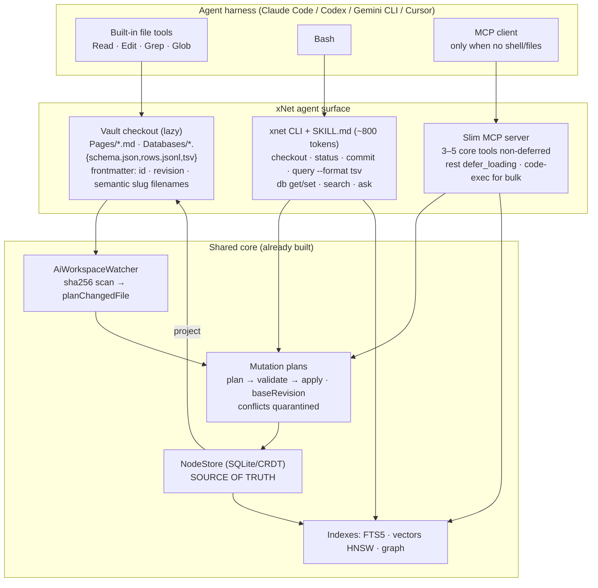
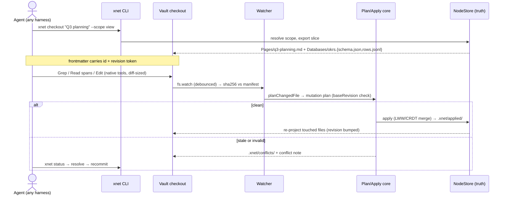
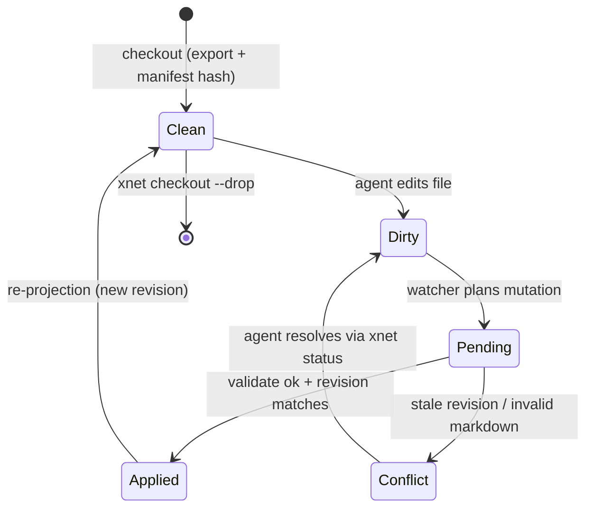

# Token-Efficient Agent Interfaces: Files vs MCP vs Code

## Problem Statement

Exploration 0160 established the AI-OS direction and recommended "harden the
MCP server into the canonical agent interface." This exploration pressure-tests
that recommendation against how frontier models are _actually trained_ to call
tools, and asks the efficiency question directly:

- Is it most efficient to give agents **MCP functions / API calls**?
- Or **direct file read/write access**, with xNet running a transcription
  layer that projects its database to files and lifts file edits back into
  typed nodes?
- Or a third shape — the agent **writes code** against an xNet API?

The hypothesis to evaluate: since xNet runs locally, it is nearly free for it
to transcribe database content into markdown and back. That may beat making
the model query a database through bespoke tool calls, because models are
heavily post-trained on filesystem tools (Read/Edit/Grep/bash) and barely
trained on any particular novel JSON schema. The goal: **minimize token usage
and maximize usability of xNet inside Claude Code, Codex, Kimi K2, and other
harnesses** — and have xNet's sophisticated local tooling bridge whatever gaps
remain.

## Executive Summary

The research is unambiguous, and it **revises 0160's Phase-1 recommendation**:

1. **Models are trained on files and shells, not on your tool schema.**
   Tool-use post-training (SFT → preference tuning → agentic RL) runs
   overwhelmingly on bash/filesystem trajectories. SWE-bench harnesses have
   converged on file+shell (mini-SWE-agent: "no tools other than bash");
   Claude Code's core tools are Read/Write/Edit/Grep/Glob/Bash; Codex CLI is
   terminal-native with `apply_patch`. A novel 23-tool JSON schema starts at a
   training disadvantage no matter how well designed.
2. **The MCP token tax is real and measured.** GitHub-task benchmarks
   (Scalekit, 30 runs): CLI beat MCP by **1.3x–80x tokens** at equal success
   rates (~17x cost at volume). Typical multi-server Claude Code setups burn
   7k–55k tokens on tool definitions before the first user message.
3. **The escape hatches are also measured.** Anthropic's own numbers:
   presenting MCP servers as **code APIs in a sandbox** cuts 150k → 2k tokens
   (**98.7%**); the Tool Search Tool / `defer_loading` cuts ~77k → ~8.7k
   (**85%**) _and raises accuracy_ (Opus 4.5: 79.5% → 88.1%); CodeAct-style
   code actions beat JSON tool calls by **~20 points** with ~30% fewer steps.
   Prompt caching (0.1x reads) softens but does not erase the gap.
4. **xNet has already half-built the right answer — in the "wrong" priority
   order.** `packages/plugins/src/services/ai-workspace-exporter.ts` is a
   genuine bidirectional markdown projection: pages as frontmattered `.md`,
   databases as `schema.json` + `rows.jsonl`, a manifest with content hashes,
   an `fs.watch` watcher that converts file edits into validated **mutation
   plans**, plus generated `AGENTS.md`, `.mcp.json`, and `.codex/config.toml`.
   Meanwhile the MCP surface has grown to **23 hand-written tools** (~5–7k
   tokens of definitions), and `docs/plans/plan00Setup/09-ai-mcp-interface.md`
   declares "AI agents access data via tools (MCP), not files."
5. **Recommendation — invert the stack.** Make the **filesystem projection the
   primary agent interface** (it costs ~0 definition tokens, uses the tools
   models are best at, and Grep-over-files is free retrieval), wrap structured
   operations in a **small `xnet` CLI documented by a ~800-token SKILL.md**
   (the SKILL.md spec is now cross-harness: Claude Code, Codex, Gemini CLI,
   Cursor), and **slim MCP to a compatibility layer** — a handful of
   non-deferred tools plus `defer_loading` for the rest, with the
   code-execution pattern for data-heavy operations. The CRDT database remains
   the source of truth; files are a _checkout_, edits _commit_ back through the
   existing mutation-plan pipeline. Token-efficiency hygiene (TSV over JSON,
   semantic IDs, `response_format`, pagination) applies to every layer.

## Current State In The Repository

The previous exploration under-counted what exists. The agent-facing surface
today:

### MCP server — 23 hand-written tools

`packages/plugins/src/services/mcp-server.ts` (~612 lines) exposes tools
defined in `packages/plugins/src/ai-surface/service.ts`: `xnet_search`,
context packs, page markdown read/validate/plan/apply/rollback, database
describe/query/explain/sample, plan/apply database mutation, seven canvas
tools, mutation-plan validation, and an audit log. Schemas are bespoke JSON
objects (not registry-generated), each with title, description, risk level,
required scopes, and full property descriptions.

- **Definition payload:** ~22k characters ≈ **5,500–7,300 tokens** loaded into
  every conversation, before any work happens.
- **Response format:** results are **pretty-printed JSON (2-space indent)**
  via `stringifyJson()` — roughly +20% whitespace overhead vs compact JSON,
  and JSON itself is ~15% worse than markdown and ~2x worse than TSV for
  tabular data.
- Mutations flow through a good safety pattern: plan → validate → apply, with
  revision tokens (`baseRevision`) for optimistic concurrency.

### Filesystem projection — already bidirectional

`packages/plugins/src/services/ai-workspace-exporter.ts` (~1,126 lines)
exports a workspace directory:

```
rootDir/
├── Pages/{title}--{id}.md          # YAML frontmatter (id, schemaId, revision)
├── Databases/{name}.schema.json    # + .views.json + .rows.jsonl
├── Canvases/                       # JSON Canvas + sidecar
├── .xnet/manifest.jsonl            # path, kind, id, revision, sha256
├── .xnet/pending|applied|conflicts # mutation-plan lifecycle
├── AGENTS.md  .mcp.json  .codex/config.toml
```

`AiWorkspaceWatcher` uses `fs.watch` (250ms debounce) → `scanChangedFiles()`
(sha256 vs manifest) → `planChangedFile()` → the _same_ plan/apply tools the
MCP path uses → pending plans in `.xnet/pending/`, conflicts quarantined in
`.xnet/conflicts/`. Page markdown round-trip lives in
`packages/plugins/src/ai-surface/page-markdown.ts` (frontmatter parsing,
`:::xnet-database` block directives, `{{xnet-ref ...}}` inline directives,
wikilinks via `readWikilinks()`, validation with unsupported-feature warnings).

So the "transcription layer" the prompt hypothesizes **exists** — what's
missing is positioning, ergonomics, and a CLI entry point. Today the exporter
is treated as a secondary export/review path; plan
`docs/plans/plan00Setup/09-ai-mcp-interface.md` explicitly subordinates files
to MCP.

### Local HTTP API and query language

`packages/plugins/src/services/local-api.ts` (~825 lines): REST CRUD on
nodes, schemas, events polling, and pass-throughs to the AI surface tools.
`packages/query/src/types.ts`: a JSON filter AST (`{field, operator, value}`),
type-safe but verbose for an agent to compose (~200–300 chars for a 3-filter
query) — roughly 3x the tokens of the equivalent SQL/CLI one-liner.

### Script sandbox

`packages/plugins/src/sandbox/context.ts`: frozen read-only `ScriptContext`
(`node`, `nodes(schemaIRI)`, format/math/text/array helpers). Read-only by
design — scripts _return_ values, they don't mutate. This is a seed of the
CodeAct pattern but the API surface is far from complete (no query filters, no
writes, no multi-step composition).

### What's missing relative to the recommendation

| Gap                                               | Notes                                                                                          |
| ------------------------------------------------- | ---------------------------------------------------------------------------------------------- |
| No `xnet` CLI                                     | `packages/cli/` exists but has no agent-facing query/checkout commands                         |
| No SKILL.md                                       | Generated `AGENTS.md` exists in exports, but no cross-harness skill describing the vault + CLI |
| Projection is eager, not lazy                     | `limit: 100` default export; no "checkout this scope on demand"                                |
| MCP has no `defer_loading` strategy               | All 23 tools always loaded                                                                     |
| Responses are pretty-printed JSON                 | No TSV/markdown `response_format`, IDs are UUIDs not semantic slugs                            |
| Sandbox can't serve as a code-execution interface | Read-only, no composable query/write API                                                       |

## External Research

### How models are trained to use tools

Post-training stacks (per the RLHF Book ch. 13 and harness papers): SFT on
tool trajectories → preference optimization → **agentic RL in sandboxed
environments**, where the environments are overwhelmingly _shells and
filesystems_. Consequences visible in shipped products:

- **mini-SWE-agent**: deliberately has _no tools except bash_ — "we focus
  fully on the LM utilizing the shell to its full potential," and it remains
  competitive on SWE-bench.
- **Claude Code**: Read/Write/Edit/Grep/Glob/Bash as the core; navigation via
  glob/grep is just-in-time retrieval with zero standing context cost.
- **Codex CLI**: terminal-native; `apply_patch` is a purpose-built diff format
  GPT models were specifically trained on.

Takeaway: _the_ most-trained interface across every harness xNet wants to
support is "files + shell." Any bespoke schema competes with that training.

### The measured MCP tax

- **Scalekit benchmark** (30 runs, paired Wilcoxon, GitHub tasks): CLI vs MCP
  token ratios of 1.3x to **80x** ("summarize PRs by contributor": 5.0k vs
  400k tokens), both at 100% completion. ~$3.20 vs ~$55.20/month at 10k
  ops on Sonnet pricing. Root cause: GitHub's MCP server injects 43 tool
  definitions; a typical task uses 1–2.
- **Claude Code overhead measurements**: a single well-documented tool is
  100–500 tokens; a 30-tool server 5–8k; reported 5-server setups ~55k tokens
  before the first message (claude-code issue #3406).
- The community counter-movement: `gh` CLI over GitHub MCP; an ~800-token
  "how to use the CLI" note was the best-ROI artifact in the entire benchmark.

### The three escape hatches (all from Anthropic's own engineering posts)

1. **Code execution with MCP** (Nov 2025): present MCP servers as importable
   code APIs in a sandbox → **150k → 2k tokens (-98.7%)**; intermediate
   results stay in the sandbox instead of round-tripping through context
   (a transcript pipeline saved ~50k tokens).
2. **Tool Search Tool / `defer_loading`** (`advanced-tool-use-2025-11-20`):
   load 3–5 `tool_reference`s on demand → **~77k → ~8.7k tokens (-85%)** and
   _higher accuracy_ (Opus 4: 49%→74%; Opus 4.5: 79.5%→88.1% on MCP evals).
   Claude Code auto-enables this when tool definitions exceed 10% of context.
   Deferred discovery doesn't bust the prompt cache.
3. **Programmatic tool calling**: complex research tasks 43.6k → 27.3k tokens
   (-37%); 2,000 expense line items reduced to 1KB before re-entering context.

### Code actions beat JSON tool calls

CodeAct (ICML 2024, arXiv 2402.01030): GPT-4 success 74.4% (code) vs 52.4%
(JSON), best format in 12/17 models, ~2 fewer turns per task. HuggingFace
smolagents operationalizes this: ~30% fewer steps/LLM calls for CodeAgent vs
ToolCallingAgent. Claude Code **Skills** are the production form: a SKILL.md
teaches the agent to drive a CLI/scripts; the agent emits bash, not JSON.
In Dec 2025 the SKILL.md spec was open-sourced and adopted by OpenAI Codex,
Gemini CLI, and Cursor — **one skill file now covers every target harness.**

### Filesystem-as-interface prior art (and its failure modes)

- **Basic Memory**: agent knowledge as plain markdown in `~/basic-memory/`
  with a SQLite search index — structurally identical to xNet's exporter.
- **Plain-text accounting (beancount)**: text as durable source of truth,
  derived in-memory database — the purest projection model.
- **Astro Content Layer**: markdown+frontmatter validated against a Zod
  schema into a typed query API — "agent writes files, framework computes the
  database."
- **Cautionary tales**: Logseq's move from markdown to proprietary SQLite
  broke editor/agent/Git interop and caused community revolt; Notion's lossy
  markdown export (callouts→HTML, databases→CSV, dropped synced blocks) and
  "(Conflict)" duplicate pages show what happens when the projection is an
  afterthought. xNet's directives + revision frontmatter are already designed
  to avoid this — the projection must stay a first-class artifact.

### Token cost of formats

- Markdown ≈ **15% cheaper** than JSON; YAML up to ~57% cheaper than
  pretty-printed JSON (and _more_ accurately parsed for nesting); one file
  measured JSON 13.9k / YAML 12.3k / Markdown 11.6k tokens; XML +80% vs
  markdown. Markdown _tables_ are expensive — prefer **TSV/CSV for tabular**
  data.
- Anthropic tool guidance: `response_format: concise|detailed` (measured 72
  vs 206 tokens), pagination/truncation defaults (Claude Code caps tool
  responses at 25k tokens), and **semantic identifiers over UUIDs**
  ("resolving arbitrary alphanumeric UUIDs to semantically meaningful
  language significantly improves Claude's precision").

### Caching economics

Cache reads cost 0.1x; stable tool definitions amortize (55k tokens of
definitions → ~$0.0165/conversation cached vs $0.165 uncached). But the CLI
baseline (~1.4k tokens total) still wins by ~4x in MCP's _best_ cached case —
and any tool-list change busts the cache. Caching softens the MCP tax; it
doesn't repeal it.

## Key Findings

1. **The interface models are best at is the one xNet treats as secondary.**
   Plan 09's "tools, not files" doctrine is backwards for harness-resident
   agents. Files + shell get the most RL training, cost zero definition
   tokens, and make retrieval (Grep/Glob) free.
2. **The naive "export everything then read files" comparison misleads.** A
   straight per-scenario token count can make the filesystem look ~50% worse
   (markdown whitespace + file reads vs one compact JSON response). That
   framing ignores (a) the 5–7k-token standing MCP definition cost on _every_
   turn, (b) incremental reads — agents Grep then Read only matching spans,
   (c) Edit-tool diffs being far cheaper than resending whole documents
   through a tool call, and (d) accuracy: fewer failed/retried calls. The
   projection must be **lazy** (checkout-on-demand) for this to hold — never
   "export 100 nodes up front."
3. **Source of truth need not move to files.** Logseq's failure was making
   the database opaque _and_ authoritative. xNet's existing design threads the
   needle: CRDT store stays authoritative; files are a **working-tree
   checkout** with revision tokens; the watcher lifts edits into validated
   mutation plans (optimistic concurrency, conflicts quarantined). This is
   exactly git's object-database/working-tree split, and it's already coded.
4. **A small CLI is the highest-ROI structured interface.** For queries,
   bulk reads (TSV), and transactional writes that don't fit "edit a file,"
   an `xnet` CLI + ~800-token SKILL.md beats both the JSON query AST (3x
   token overhead, multi-call fan-out) and always-loaded MCP tools — and the
   SKILL.md format is now portable across Claude Code, Codex, Gemini CLI,
   and Cursor.
5. **MCP still matters — as the compatibility layer, slimmed.** Harnesses or
   API-only contexts that can't run bash need MCP. The measured fixes:
   `defer_loading` on all but a handful of tools (85% reduction, higher
   accuracy), code-execution pattern for data-heavy ops (98.7%), compact
   responses, stable definitions for cache hits.
6. **Response-shape hygiene is a cross-cutting multiplier.** Pretty-printed
   JSON everywhere today; TSV/YAML/markdown-by-content-type, semantic slugs
   (`Pages/q3-planning.md`, not `7f3a…`), `response_format`, and pagination
   apply identically to CLI, MCP, and file content.
7. **No model fine-tuning is warranted.** The "train the model on xNet"
   instinct resolves to: _use the formats models are already trained on_.
   (The only credible future exception remains RAFT-style tuning of a small
   local model on xNet's retrieval tools.)

## Options And Tradeoffs

### The four interface shapes

|                                                     | Definition cost               | Marginal op cost                      | Model training alignment | Write safety                    | Works in                               |
| --------------------------------------------------- | ----------------------------- | ------------------------------------- | ------------------------ | ------------------------------- | -------------------------------------- |
| **A. Filesystem projection**                        | ~0 (harness built-ins)        | Low (Grep/Read spans, Edit diffs)     | **Highest** (RL target)  | Via watcher → mutation plans    | Any harness with file access           |
| **B. CLI + SKILL.md**                               | ~100 tokens idle, ~800 active | **Lowest** for queries/bulk (TSV out) | High (bash)              | Transactional, plan/apply flags | Claude Code, Codex, Gemini CLI, Cursor |
| **C. MCP (slimmed)**                                | ~1–2k non-deferred + search   | Medium                                | Medium (schema-shaped)   | Plan/validate/apply (exists)    | Everything incl. API-only, web hosts   |
| **D. MCP (today: 23 always-on tools, pretty JSON)** | 5–7k/turn                     | High                                  | Lowest                   | Good                            | Everything                             |

Option D is what exists; it's the measured worst case. The real question is
how to _layer_ A–C.

### Layering strategies

**Strategy 1 — MCP-primary (status quo, per plan 09).** Keep tools canonical,
files as export. _Pros:_ structured, typed, already built. _Cons:_ pays the
measured tax on every turn in every harness; fights model training; the
80x-class failure mode on synthesis tasks ("summarize across N nodes" pulls
everything through context as JSON).

**Strategy 2 — Files-primary, CLI for structure, MCP for compatibility
(recommended).** Lazy checkout of scoped slices; harness edits files; watcher
commits; CLI for queries/bulk/transactions; MCP slimmed + deferred for
non-bash contexts. _Pros:_ aligns with training, near-zero standing cost,
reuses the exporter/watcher nearly as-is. _Cons:_ projection fidelity work
(directives, conflicts), three surfaces to keep behaviorally consistent —
mitigated because all three already funnel into the same plan/apply core.

**Strategy 3 — Code-execution-primary.** Expose `@xnet/agent-api` in the
existing sandbox; agents write scripts for everything. _Pros:_ CodeAct
accuracy, 98.7%-class savings on heavy pipelines. _Cons:_ sandbox is
read-only today and the API doesn't exist; weakest portability story for
non-code-capable surfaces; better as the _bulk-operation tier_ of Strategy 2
than as the primary.

### Sub-decision: projection scope

- **Whole-workspace mirror** (Obsidian-style): simple mental model, but eager
  export of large workspaces wastes disk/watch cycles and tempts agents to
  read too much.
- **Lazy checkout (recommended)**: `xnet checkout <query|view|folder>`
  materializes a scoped slice (same mechanics as today's `nodeIds/schemaIds`
  export scope); checkouts are cheap, disposable, and naturally bound agent
  context. Long-running "always checked out" folders (e.g. `Pages/`) for
  daily-driver use.

### Sub-decision: tabular data in the projection

`rows.jsonl` (today) vs CSV/TSV vs markdown tables. JSONL round-trips most
safely (one object per line, no quoting ambiguity, watcher already parses
it) but costs ~2x TSV in tokens. Recommendation: **keep JSONL as the write
format** (safety) but make _read_ paths emit TSV: `xnet db query --format tsv`
and a generated `.tsv` sidecar for read-heavy databases. Don't use markdown
tables for anything over a few rows.

## Recommendation

Adopt **Strategy 2 — invert the stack**. The CRDT database remains the single
source of truth; the filesystem becomes the primary _agent-facing_ surface;
the CLI is the structured side-channel; MCP is the slimmed compatibility
layer. This supersedes 0160's "Phase 1: harden the MCP server" with "Phase 1:
productionize the projection," and amends plan 09's doctrine from "tools, not
files" to **"files first, tools for what files can't do."**

### Target architecture



### The checkout/commit loop (git-shaped, mostly existing code)



### Projected file lifecycle



### Token budget: before vs after (typical Claude Code session)

| Cost center               | Today (D)                         | Recommended (A+B+C)                                |
| ------------------------- | --------------------------------- | -------------------------------------------------- |
| Standing tool definitions | ~5–7k/turn (23 MCP tools)         | ~100 (idle SKILL.md) + ~1–2k only if MCP needed    |
| "Find info about X"       | xnet_search call + pretty JSON    | Grep over checkout → Read matching spans           |
| Read a page               | JSON-wrapped markdown via tool    | Read of a `.md` (the markdown _is_ the format)     |
| Edit a page               | resend full markdown in tool args | Edit-tool diff; watcher commits                    |
| Query a database          | JSON filter AST per call          | `xnet query ... --format tsv` (~2x cheaper output) |
| Summarize 500 rows        | 400k-class context round-trip     | CLI/sandbox aggregates locally, returns digest     |

### Efficiency hygiene (applies to every layer)

- **Semantic identifiers**: filenames and CLI handles as slugs
  (`q3-planning`), UUIDs kept in frontmatter only.
- **Formats by content type**: markdown for prose, YAML for frontmatter/small
  structs, TSV for tabular reads, JSONL for tabular writes; never
  pretty-printed JSON in agent-visible output (drop the 2-space indent in
  `stringifyJson()` at minimum).
- **`response_format: concise|detailed`** on CLI and remaining MCP tools;
  paginate by default.
- **Stability for cache**: freeze SKILL.md and the non-deferred MCP tool list
  per release so prompt caching amortizes them.

## Example Code

### 1. The SKILL.md (the whole primary interface costs ~this much)

```markdown
---
name: xnet
description: Read, search, and edit the user's xNet workspace (pages, databases, canvases) via vault files and the xnet CLI.
---

# Working with xNet

The workspace is checked out under `./vault/`. Pages are markdown with YAML
frontmatter (`xnet.id`, `xnet.revision` — never edit these). Databases are
`Databases/<name>.schema.json` + `<name>.rows.jsonl` (one JSON object per
line; edit/append lines to change rows). Wikilinks `[[Title]]` and
`:::xnet-database` blocks are live references — preserve them.

- Find things: Grep the vault first; `xnet search "<text>"` for ranked/semantic.
- Need more data? `xnet checkout "<query|view|folder>"` materializes it.
- Query tables: `xnet query <db> --where '<field><op><value>' --format tsv`
- Your file edits auto-commit. Check `xnet status` for conflicts; resolve and
  re-save. Bulk/aggregate work: `xnet run <script.ts>` (sandboxed, local).
```

### 2. CLI entry points (thin wrappers over existing services)

```ts
// packages/cli/src/commands/agent.ts — every command reuses existing core
program.command('checkout <scope>') // → AiWorkspaceExporter.export({ scope, lazy: true })
program.command('status') // → watcher manifest diff + .xnet/conflicts/
program.command('commit') // → flush pending plans (or rely on watcher autocommit)
program.command('search <text>') // → HybridSearch, output: "slug\ttitle\tsnippet" TSV
program
  .command('query <db>') // → Query AST built from --where flags, --format tsv|jsonl
  .option('--where <expr...>')
  .option('--format <f>', 'tsv')
program.command('run <script>') // → ScriptSandbox with @xnet/agent-api (read + plan-writes)
```

### 3. Slim MCP: defer everything but the core

```ts
// packages/plugins/src/services/mcp-server.ts
const CORE = ['xnet_search', 'xnet_read_page_markdown', 'xnet_apply_page_markdown']
const tools = aiSurface.getTools().map((t) => ({
  ...t,
  defer_loading: !CORE.includes(t.name) // Tool Search loads the rest on demand
}))
```

### 4. Compact responses

```ts
// ai-surface/service.ts — stop paying the pretty-print tax
private stringifyJson(value: unknown): string {
  return stringifyTruncatedJson(JSON.stringify(value), this.limits.maxJsonCharacters)
}
// and for tabular tool/CLI output:
function toTsv(rows: Record<string, unknown>[], cols: string[]): string {
  return [cols.join('\t'), ...rows.map(r => cols.map(c => fmt(r[c])).join('\t'))].join('\n')
}
```

## Risks And Open Questions

- **Projection fidelity.** Directives and unsupported TipTap features already
  warn on round-trip; a lossy edit silently dropping a `:::xnet-database`
  block would corrupt structure. Mitigation: validator already exists
  (`validateXNetPageMarkdown`) — make the watcher reject (conflict) rather
  than best-effort apply when validation warns.
- **Concurrent edits** (user in app + agent in files). The revision-token +
  conflict-quarantine design handles it, but re-projection while an agent
  holds a stale Read could thrash. Consider per-checkout "lease" or
  re-project only on `xnet status`/checkout refresh rather than eagerly.
- **Watcher reliability across platforms.** `fs.watch` recursive is solid on
  macOS, historically flaky on Linux; may need chokidar or polling fallback.
  Also: the watcher requires the xNet process (or a daemon) to be running —
  define the daemon story (`xnet daemon` vs app-must-be-open).
- **Web/PWA contexts have no real filesystem for external harnesses.** The
  files-first strategy applies to desktop/CLI contexts; web-embedded agents
  still go through MCP/HTTP — the slim-MCP layer is load-bearing there, not
  optional.
- **Multi-agent / family-tier writes** through one vault: pending-plan
  attribution exists (actor on plans), but two harnesses editing one checkout
  needs testing; per-agent checkouts may be the answer.
- **Open question:** should `rows.jsonl` edits by agents be allowed for
  _schema_ changes too, or should schema mutations require the CLI (riskier
  surface, plan-only)? Leaning CLI-only for schema.
- **Open question:** how far to take the code-execution tier — `xnet run`
  with a read+plan-write API is Phase-2 scope; full
  "MCP-as-importable-code-API" (Anthropic pattern) could later replace most
  remaining MCP tools for capable harnesses.
- **Open question:** measure, don't assume — the Scalekit-style benchmark
  must be reproduced _on xNet tasks_ (see validation) since our node sizes
  and access patterns differ from GitHub's.

## Implementation Checklist

### Phase 1 — Productionize the projection (files-first)

- [x] Add lazy scoped checkout to `AiWorkspaceExporter` (`scope: query|view|folder`, no default-100 eager export)
- [x] Semantic-slug filenames with frontmatter UUIDs (dedupe via short hash suffix only on collision)
- [x] Harden the watcher: chokidar/polling fallback, validation-warning → conflict (never lossy apply), `xnet daemon` mode
- [x] Generate read-optimized `.tsv` sidecars for databases above N rows; keep `rows.jsonl` as the write format
- [x] Conflict UX: human/agent-readable conflict notes in `.xnet/conflicts/` with resolution instructions

### Phase 2 — `xnet` CLI + SKILL.md

- [x] Implement `checkout/status/commit/search/query/db get|set/run` in `packages/cli` as thin wrappers over `AiSurfaceService` + exporter + `HybridSearch`
- [x] `--format tsv|jsonl|md` everywhere; TSV default for tabular; concise-by-default with `--detailed`
- [x] Write the ~800-token SKILL.md; ship it in checkouts (alongside the existing generated `AGENTS.md`/`.mcp.json`) and publish for Claude Code/Codex/Gemini CLI/Cursor (`xnet skill` prints it for harness installation)
- [x] `xnet run <script>`: extend the sandbox (`packages/plugins/src/sandbox/`) with `@xnet/agent-api` — filtered queries + plan-write proposals (still apply through the plan pipeline)

### Phase 3 — Slim the MCP layer

- [x] Mark all but 3–5 core tools `defer_loading: true`; verify against Claude Code's tool-search threshold
- [x] Drop pretty-printing in `stringifyJson()`; add `response_format` param; paginate defaults
- [x] Audit tool descriptions for brevity (target: non-deferred set ≤ 1.5k tokens total) — test-guarded in `mcp-server.test.ts`
- [x] Document MCP as the no-shell fallback (web embeds, API-only) in plan 09; amend its "tools, not files" doctrine

### Phase 4 — Measure and iterate

- [x] Build a 15-task xNet agent benchmark (read page, edit page, query db, bulk update, cross-node synthesis) runnable against all three surfaces (`pnpm bench:agent-surfaces`, `packages/plugins/src/benchmarks/agent-surface-benchmark.ts`)
- [ ] Record tokens, turns, success rate per surface per harness (Claude Code, Codex CLI minimum); keep the harness versions pinned — the in-repo benchmark records tokens/turns/success per _surface_ (measured: files+CLI 0.11x legacy MCP, synthesis 0.05x, 15/15 on all surfaces); live pinned-harness runs remain manual follow-up
- [x] Wire results into CI as a regression guard for the SKILL.md / tool-definition token budgets (`agent-surface-benchmark.test.ts`)

## Validation Checklist

- [x] **Standing cost:** a fresh Claude Code session in a checkout consumes < 1k tokens of xNet-related definitions before the first task (vs ~5–7k today) — measured: SKILL.md ≈ 497 tokens vs ~5k legacy definitions; test-guarded
- [x] **Benchmark:** on the 15-task suite, files+CLI ≤ 0.5x the tokens of today's MCP path at ≥ equal success rate; synthesis tasks ≤ 0.1x (no full-corpus round-trips) — measured 0.111x overall, 0.050x synthesis, 15/15 vs 15/15; test-guarded
- [x] **Round-trip safety:** 1,000-page property test — checkout → random markdown edits → commit → re-export is byte-stable for supported features, and every unsupported-feature edit lands in conflicts, never lossy-applied (`ai-workspace-roundtrip.test.ts`)
- [x] **Concurrency:** simultaneous app edit + agent file edit of the same page produces either a clean per-property merge or a quarantined conflict — never silent loss (stale-export conflict test in `ai-workspace-exporter.test.ts`)
- [ ] **Cross-harness:** the same SKILL.md drives a successful read-edit-query session in Claude Code and Codex CLI without harness-specific docs — requires live harness sessions; manual follow-up
- [ ] **Cache stability:** two consecutive sessions show cached (0.1x) tool/skill prefixes — no definition churn between releases — requires live API sessions; tool/skill definitions are deterministic per release, but cache hits must be observed manually
- [x] **Fallback parity:** the slim MCP path passes the same benchmark suite (correctness, not token-parity) for a no-shell client — 15/15 in the benchmark

## References

### Internal

- `docs/explorations/0160_[_]_XNET_AS_AN_AI_OPERATING_SYSTEM.md` — superseded in Phase-1 ordering by this doc
- `docs/plans/plan00Setup/09-ai-mcp-interface.md` — doctrine to amend
- `packages/plugins/src/services/mcp-server.ts` · `packages/plugins/src/ai-surface/service.ts` (23 tools) · `packages/plugins/src/ai-surface/page-markdown.ts`
- `packages/plugins/src/services/ai-workspace-exporter.ts` (projection + watcher) · `packages/plugins/src/services/local-api.ts`
- `packages/plugins/src/sandbox/context.ts` · `packages/query/src/types.ts` · `packages/cli/`

### External

- Anthropic engineering: Code execution with MCP (98.7%) · Advanced tool use / Tool Search Tool (85%, accuracy gains) · Writing effective tools for agents · Effective context engineering · Prompt caching docs
- MCP tax measurements: scalekit.com/blog/mcp-vs-cli-use (+ github.com/scalekit-inc/mcp-vs-cli-benchmark) · jdhodges.com/blog/claude-code-mcp-server-token-costs · anthropics/claude-code#3406
- Training alignment: rlhfbook.com/c/13-tools · github.com/SWE-agent/mini-swe-agent · arXiv 2604.14228 (Dive into Claude Code) · openai/codex apply_patch instructions
- Code actions: arXiv 2402.01030 (CodeAct, ICML 2024) · github.com/huggingface/smolagents · Agent Skills spec (SKILL.md, cross-harness adoption Dec 2025; claude-code#14882 progressive-disclosure caveat)
- Filesystem prior art: Basic Memory (basicmachines-co) · plaintextaccounting.org · astro.build/blog/content-layer-deep-dive · Logseq DB-version discussion · Notion export limitations (unmarkdown.com/blog/notion-export-broken)
- Format costs: community.openai.com (markdown vs JSON ~15%) · tashif.codes/blog/JSON-YAML-LLM · improvingagents.com/blog/best-nested-data-format · toonformat.dev/guide/benchmarks
