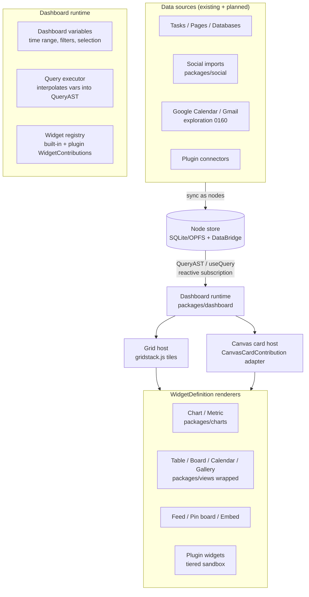
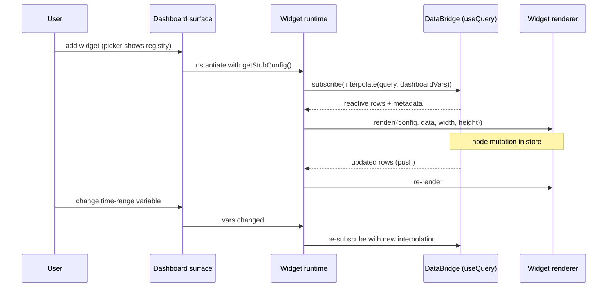
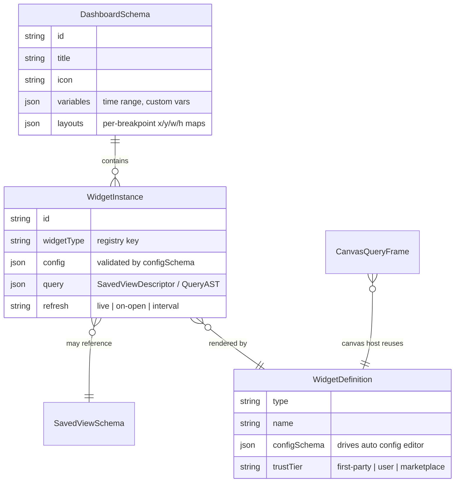
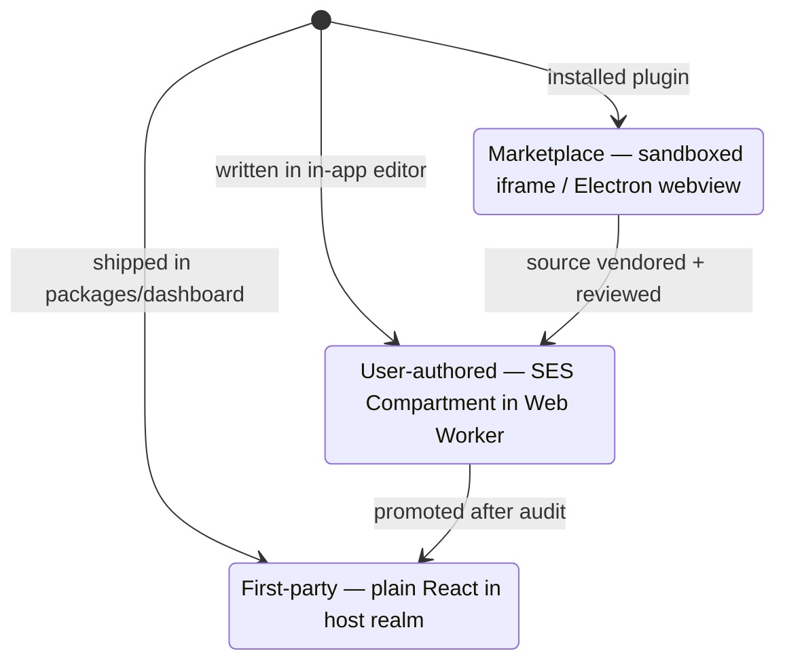

# Dashboard Builder With Pluggable Widgets

## Problem Statement

xNet has many surfaces — pages, databases, canvases, the data workspace — but no
place to _compose_ them. There is no home screen you can shape: no way to put
"my open tasks", "this week's calendar", "latest saved content from my social
imports", and "burn-down of project X" on one screen and glance at it.

The ask: a dashboard builder UI. A special-purpose dashboard surface (distinct
from, but related to, the canvas) where users assemble widgets fed by live data:
tasks, pages, databases, canvases, Google Calendar/Gmail syncs, social media
feeds, and anything plugins bring in. The widget catalog should be effectively
open-ended — out-of-the-box charts, metrics, stats, feeds, news lists, pin
boards, grids, calendars — plus user-generated and plugin-derived widgets.
Dashboards become the "customize xNet to your heart's content" surface, and you
can have many of them: a main dashboard, plus one per product, service, or
project.

Two questions dominate:

1. **Surface**: should dashboards _be_ canvases, or a dedicated view?
2. **Widget contract**: what is a widget, how does it get data, and how do
   third parties safely add new ones?

## Executive Summary

- **Build a dedicated Dashboard surface** — a first-class `DashboardSchema`
  node rendered with a 12-column responsive grid (gridstack.js v12 or
  react-grid-layout v2), _not_ a repurposed canvas. Grids serialize trivially
  (`{x, y, w, h}` in column units), reflow responsively, and match every
  successful dashboard product (Grafana, Datadog, Home Assistant). The
  free-form canvas remains the spatial-thinking surface; the two share widgets.
- **Widgets follow the Grafana-shaped contract**: a `WidgetDefinition` =
  manifest + config schema + query + renderer. Crucially, **the data binding
  already exists**: `SavedViewDescriptor` / `QueryAST` (executed today by
  `SavedViewRunner` via `useQuery`) is xNet's equivalent of Grafana's
  datasource→DataFrame pipeline. A widget declares a query descriptor; the
  dashboard runtime executes it reactively and hands results to the renderer.
  Widgets never touch the store directly.
- **Extensibility rides the existing plugin system**: add a
  `WidgetContribution` alongside the existing `ViewContribution` /
  `CanvasCardContribution` in `packages/plugins/src/contributions.ts`, with a
  three-tier trust model — first-party widgets run unsandboxed, user-authored
  widgets run in SES compartments inside a Web Worker, marketplace widgets run
  in process-isolated iframes/webviews.
- **Charts**: add a new `packages/charts` package wrapping ECharts with
  selective imports (~100 KB gzipped, canvas-rendered, covers bar/line/pie
  through heatmaps, calendars, Sankey), with uPlot reserved for
  high-frequency live series later. No charting library exists in the repo
  today.
- **Data sources are already converging**: social imports land as canonical
  nodes (`packages/social/src/schemas/index.ts`), the planned Google Workspace
  sync (exploration 0160) reuses the same architecture, and tasks/pages/
  databases are queryable via `QueryAST`. Anything that syncs into the node
  store is automatically dashboard-able — that's the payoff of the
  local-first design.

## Current State In The Repository

### The pieces a dashboard needs mostly exist

**Reactive query layer.** `packages/react/src/hooks/useQuery.ts` is the
universal read hook: it takes a `QueryFilter` (`where`, `orderBy`, `limit`,
`spatial`, `search`, `materializedView`), subscribes via
`useSyncExternalStore` through the off-main-thread `DataBridge`, and
re-evaluates on node mutations. `packages/data/src/store/query-ast.ts` defines
`QueryAST` with filters, sorts, aggregates, and relation includes — including
multi-query "query sets" used by social lenses.

**Serialized, runnable view descriptors.** `SavedViewDescriptor` (stored in
`SavedViewSchema` nodes) is a JSON-serializable query + presentation config.
`packages/react/src/components/SavedViewRunner.tsx` executes one and renders it
as a table, facet browser, timeline, graph, or canvas projection. This is
_exactly_ the "widget declares a query, runtime provides reactive results"
pattern — it just isn't composable onto a shared layout surface yet.

**A pluggable view registry.** `packages/views/src/registry.ts` defines
`ViewRegistry` with `ViewRegistration { type, name, icon, component,
configFields?, supportedSchemas?, platforms? }`. Current `ViewType` union
(`packages/views/src/types.ts:17`): `'table' | 'board' | 'gallery' |
'timeline' | 'calendar' | 'list'`. These six view types are themselves
ready-made dashboard widgets (a mini-board widget, a calendar widget, a
gallery/pin-board widget) once they can render in a constrained tile.

**A plugin contribution system.** `packages/plugins/src/manifest.ts` defines
`XNetExtension { id, version, permissions?, contribute?, activate? }`, and
`packages/plugins/src/contributions.ts` already enumerates
`ViewContribution`, `CommandContribution`, `CanvasCardContribution`,
`PropertyHandlerContribution`, `SidebarContribution`, and friends. There is no
sandboxing today — plugins run with full context access — so untrusted
widgets need new isolation machinery (see below).

**Canvas with query frames.** `packages/canvas/src/types.ts:41` defines
`CanvasObjectKind = 'page' | 'database' | 'external-reference' | 'media' |
'shape' | 'note' | 'task' | 'group'` on a free-form XY infinite canvas with
viewport culling and LOD. `packages/canvas/src/frames/query-frames.ts` defines
`CanvasQueryFrameDefinition` with source `'database' | 'schema' | 'search' |
'plugin' | 'custom'`, materialization `'virtual' | 'pinned-cards' |
'synced-cards'`, and refresh `'manual' | 'on-open' | 'live'` — a live-data
frame concept that the dashboard widget contract should subsume rather than
duplicate. The new source-backed task node
(`packages/canvas/src/nodes/task-node.tsx`, commit `d19b54d2`) shows the live
rendering pattern: `useNode(TaskSchema, taskId)` hydrates canonical data into
a `TaskCard` from `@xnetjs/ui`.

**Data sources.** `packages/social/src/schemas/index.ts` defines canonical
`SocialActor` / `SocialContent` / `SocialInteraction` / `SocialMessage`
schemas with importers for Instagram, YouTube, X, TikTok, Reddit, Claude, and
Grok. `packages/social/src/lenses/graph-lenses.ts` ships saved-view lenses
("People I Follow", "Saved Content By Creator") that are dashboard widgets in
all but name. Exploration 0160 designs Google Calendar/Gmail sync to land in
the same node store via an Electron-side sync agent — once that exists,
calendar and email widgets are just queries.

**App shell.** `apps/web/src/routes/` has per-surface routes (`/data.tsx`
mounting `DataWorkspaceView`, `/doc.$docId.tsx`, `/db.$dbId.tsx`,
`/canvas.$canvasId.tsx`) under a `__root.tsx` layout with sidebar navigation.
A `/dashboard.$dashboardId.tsx` route slots in cleanly, and the sidebar
already lists workspaces and recent documents.

### What's missing

1. **No charting library anywhere in the monorepo** (no recharts, visx, d3,
   echarts, or plot in any package.json).
2. **No grid layout engine** — canvas is free-form XY; views are full-bleed.
3. **No widget contract** — `SavedViewRunner` is monolithic per-view, with no
   tile-sized rendering, no config-schema-driven editor, no registry of
   widget types.
4. **No dashboard node type** — nothing persists "this arrangement of these
   queries with these renderers."
5. **No sandboxing** for untrusted code — plugin contributions execute in the
   host realm.
6. **No cross-widget state** — `SavedViewRunner` instances are isolated; a
   dashboard wants shared context (time range, project filter, selection).

## External Research

### Surface: grid beats free-form for dashboards

Every successful dashboard product uses a column grid with breakpoint-keyed
serialization, not a free-form canvas:

| Property          | Grid (Grafana/Datadog model)   | Free-form canvas (Miro model)        |
| ----------------- | ------------------------------ | ------------------------------------ |
| Serialization     | `{x, y, w, h}` in column units | pixel coords, z-order, overlap rules |
| Responsive reflow | automatic per breakpoint       | manual or undefined                  |
| Cognitive load    | low — snap, no overlap         | high — user manages space            |
| Best for          | glanceable data composition    | spatial thinking, diagrams           |

Layout engine options (2026 status):

- **react-grid-layout v2** (v2.2.3, Mar 2026): full TypeScript rewrite with
  `useGridLayout` / `useResponsiveLayout` hooks; used by Grafana and Metabase.
  Collision compaction runs synchronously per drag event — visible jank above
  ~40 widgets on weak hardware.
- **gridstack.js v12** (Mar 2025): framework-neutral TS, zero deps, CSS
  custom properties, `columnOpts.breakpoints` for responsive reflow, and a
  v11+ `renderCB` hook designed for React-controlled tile content.
- **dnd-kit + CSS grid**: primitives only — you build snapping, resize, and
  serialization yourself. Right choice only if the grid model itself must be
  custom.
- **Muuri**: abandoned (last release ~2020). Avoid.

### Widget contract: the convergent shape

Grafana panels, Home Assistant Lovelace cards, Retool components, and Datadog
widgets all converge on the same contract:

```
manifest   = { id, type, name, version, configSchema }   // schema drives the config editor UI
renderer   = Component({ config, data, width, height })
query      = declared by the widget instance, executed by the runtime
```

Grafana's pipeline — datasource plugin → `DataQueryRequest` → `DataFrame[]` →
panel props — is the cleanest decoupling: **the panel never owns query
execution**. Home Assistant cards add two ideas worth stealing: `getStubConfig()`
(sensible defaults so a freshly added card renders immediately) and
`getGridOptions()` (widget declares its min/default tile size). Retool adds
reactive inter-widget bindings (`{{ component.value }}`) — the inspiration for
dashboard-level shared variables.

Notion notably has _no_ dashboard surface (users fake it with linked database
views embedded in pages); Anytype's Home widgets are vertically stacked, not a
grid. A real dashboard builder is a differentiator in the
personal-knowledge-tool space.

### Sandboxing user-generated widgets

Figma's journey is instructive: they rejected iframes (async postMessage +
serialization overhead), shipped Realms, got burned (prototype-pollution
escape), and now run plugin logic in **QuickJS compiled to WASM** with UI in
iframes. The practical spectrum:

| Tier          | Mechanism                                                                                              | Isolation                                                           | Cost                                       |
| ------------- | ------------------------------------------------------------------------------------------------------ | ------------------------------------------------------------------- | ------------------------------------------ |
| First-party   | plain React components in a registry                                                                   | none needed                                                         | zero                                       |
| User-authored | **SES `Compartment` inside a Web Worker**                                                              | frozen intrinsics + capability endowment + OS thread (terminatable) | `lockdown()` integration, message protocol |
| Marketplace   | **iframe (web) / `<webview>` (Electron) with `sandbox`, `contextIsolation`, `nodeIntegration: false`** | process-level                                                       | async postMessage, per-widget heap         |

SES (`hardenedjs.org`, used in production by MetaMask Snaps and Agoric)
freezes shared intrinsics and gives each compartment only explicitly endowed
globals; running it inside a Worker adds CPU isolation that SES alone lacks.

### Charting libraries

| Library                            | Gzipped     | Render | Sweet spot                                                                 |
| ---------------------------------- | ----------- | ------ | -------------------------------------------------------------------------- |
| ECharts (selective `echarts/core`) | ~100 KB     | canvas | broadest chart-type coverage incl. heatmap/calendar/Sankey, good live perf |
| recharts                           | ~136 KB     | SVG    | easiest React API; stutters >1k points at >5 fps                           |
| uPlot                              | ~48 KB      | canvas | extreme time-series perf (166k points in 25 ms)                            |
| visx (per-package)                 | ~15 KB each | SVG    | custom composable charts, manual wiring                                    |
| Observable Plot                    | ~58 KB      | SVG    | exploratory analysis, not React-native                                     |
| lightweight-charts v5              | ~35 KB      | canvas | financial OHLC only                                                        |

## Key Findings

1. **The hard part is already built.** Reactive queries (`useQuery` +
   `DataBridge`), serialized query descriptors (`SavedViewDescriptor`), a
   pluggable view registry, and a plugin contribution system mean the
   dashboard builder is mostly _composition_, not new infrastructure.
2. **Canvas and dashboard should share widgets, not a surface.** The canvas's
   `CanvasQueryFrameDefinition` and the dashboard's widget instances are the
   same concept (query + presentation + refresh policy) on different layout
   substrates. Define the widget contract once; give it two hosts — a grid
   tile and a canvas card (via the existing `CanvasCardContribution` seam).
3. **The existing six view types are the first six widgets.** Table, board,
   gallery, timeline, calendar, list — rendered in a tile with a row limit —
   cover feeds, pin boards, and calendars from day one. Charts and metrics
   are the genuinely new renderers.
4. **Local-first makes "endless data feeds" structurally cheap.** Social
   imports, Google sync (0160), and any future connector all land as nodes in
   the same store. The dashboard never needs per-source widget code — only
   per-source _queries_, plus optional specialized renderers.
5. **Cross-widget context is the one new runtime concept.** A dashboard-level
   variable scope (time range, selected project, free filters) interpolated
   into widget queries — Grafana's template variables, Retool's bindings —
   has no existing analog in `SavedViewRunner` and must be designed in from
   the start.
6. **Sandboxing is a tiered, deferrable problem.** v1 ships first-party
   widgets (no sandbox). The contribution seam is designed now; SES-in-Worker
   and iframe tiers come when user-authored and marketplace widgets arrive.

## Options And Tradeoffs

### Option A — Canvas _is_ the dashboard

Extend `CanvasObjectKind` with `'chart' | 'metric'`, lean on query frames, and
call a curated canvas a dashboard.

- **Pros:** zero new surface; spatial freedom; query frames already have
  live refresh modes; the task-node pattern proves live source-backed cards.
- **Cons:** free-form layout punishes the 90% dashboard use case — no
  responsive reflow (useless on mobile/Expo), users hand-manage whitespace
  and overlap, serialization is pixel-bound. No dashboard product works this
  way. Glanceability suffers.

### Option B — Dashboard as a 7th `ViewType` in `ViewRegistry`

Register `'dashboard'` like table/board/calendar, scoped to a database/schema.

- **Pros:** smallest code delta; inherits the views config system.
- **Cons:** views are bound to _one_ schema/data source
  (`ViewProps.schema`); a dashboard's whole point is composing _many_
  sources. Wrong altitude — a dashboard contains views, it isn't one.

### Option C — Dedicated Dashboard surface + shared widget contract (recommended)

A new `DashboardSchema` node type with its own route and a grid layout engine.
Widgets are defined once (`WidgetDefinition`) and hosted in grid tiles, with a
canvas-card adapter so the same widgets can be pinned onto canvases.

- **Pros:** right data model (multi-source by construction), responsive
  grid serialization, widget contract becomes the plugin extension point,
  canvas keeps its identity while gaining chart/metric cards for free.
- **Cons:** new surface to build (route, sidebar entry, grid engine,
  editor chrome); two layout hosts to keep in sync (mitigated by the
  shared contract).

### Sub-decision: layout engine

**gridstack.js v12** over react-grid-layout v2 — framework-neutral core
matters for the Expo/Electron multi-app future, zero dependencies, CSS
custom properties theme cleanly with Tailwind, and `renderCB` gives React
full control of tile content. react-grid-layout v2 is a reasonable fallback
if React-native-API ergonomics win in a spike; both serialize the same
`{x, y, w, h}` shape, so the persisted format doesn't lock the choice.

### Sub-decision: charting library

**ECharts via `echarts/core` selective imports** — one dependency covers
bars/lines/areas/pies _and_ the long tail (heatmap, calendar heat,
treemap, Sankey, gauge) that a "customize to your heart's content" pitch
implies, with canvas rendering that survives live updates. Wrap it in
`packages/charts` behind an xNet-flavored API so the library can be swapped
or supplemented (uPlot for high-frequency series) without touching widgets.

## Recommendation

Build Option C in four phases.

### Architecture



### The widget contract



### Data model



### Widget trust tiers



### Phasing

1. **Phase 1 — surface + built-ins.** `DashboardSchema`, `/dashboard.$id`
   route, gridstack host, widget registry, and five widgets that wrap what
   exists: saved-view table, mini-board, calendar, task list, metric (count/
   aggregate from `QueryAST` aggregates). Dashboard variables: time range only.
2. **Phase 2 — charts + feeds.** `packages/charts` (ECharts core), chart
   widget with config-schema-driven editor (mark type, x/y/series property
   pickers riffing on `ViewConfigField`), social feed widget over the
   `graph-lenses` descriptors, pin-board widget over gallery view.
3. **Phase 3 — plugins + canvas reuse.** `WidgetContribution` in
   `packages/plugins/src/contributions.ts`; canvas card adapter so widgets pin
   onto canvases; widget picker surfaces plugin widgets.
4. **Phase 4 — user-generated widgets.** In-app widget editor; SES-in-Worker
   execution tier; marketplace iframe tier when a marketplace exists.

## Example Code

The widget contract (new `packages/dashboard/src/types.ts`):

```ts
import type { ComponentType } from 'react'
import type { QueryAST } from '@xnetjs/data'
import type { SavedViewDescriptor } from '@xnetjs/data'

export type WidgetTrustTier = 'first-party' | 'user' | 'marketplace'

/** Mirrors ViewConfigField (packages/views/src/registry.ts) so the
 *  config editor machinery is shared between views and widgets. */
export interface WidgetConfigField {
  key: string
  label: string
  type: 'property-select' | 'select' | 'number' | 'checkbox' | 'text' | 'color'
  options?: { value: string; label: string }[]
}

export interface WidgetDataRequest {
  /** Reuses the existing serialized query layer — no new query language. */
  descriptor: SavedViewDescriptor | { ast: QueryAST }
  refresh: 'live' | 'on-open' | { intervalMs: number }
}

export interface WidgetProps<C = Record<string, unknown>> {
  config: C
  data: { rows: unknown[]; aggregates?: Record<string, number>; loading: boolean }
  width: number
  height: number
  /** Dashboard-level variables, already interpolated into the query;
   *  exposed for renderers that display them (e.g. time-range label). */
  variables: Readonly<Record<string, unknown>>
  onConfigChange?: (next: Partial<C>) => void
}

export interface WidgetDefinition<C = Record<string, unknown>> {
  type: string // 'chart.bar', 'metric.count', 'feed.social'
  name: string
  icon: ComponentType
  trustTier: WidgetTrustTier
  configFields: WidgetConfigField[] // drives the auto-generated editor
  defaultSize: { w: number; h: number; minW?: number; minH?: number }
  getStubConfig: (ctx: { schemas: string[] }) => { config: C; query: WidgetDataRequest }
  component: ComponentType<WidgetProps<C>>
}
```

Wrapping an existing view type as a widget — the cheap on-ramp:

```ts
// packages/dashboard/src/widgets/saved-view-widget.tsx
import { SavedViewRunner } from '@xnetjs/react'

export const savedViewWidget: WidgetDefinition<{ presentation: 'table' | 'board' | 'timeline' }> = {
  type: 'view.saved',
  name: 'Saved View',
  trustTier: 'first-party',
  defaultSize: { w: 6, h: 4, minW: 3, minH: 2 },
  configFields: [
    { key: 'presentation', label: 'Show as', type: 'select',
      options: [{ value: 'table', label: 'Table' }, { value: 'board', label: 'Board' }] },
  ],
  getStubConfig: () => ({ config: { presentation: 'table' },
    query: { descriptor: emptyDescriptor(), refresh: 'live' } }),
  component: ({ config, data, height }) => (
    <SavedViewRunner mode={config.presentation} rows={data.rows} maxHeight={height} compact />
  ),
  icon: TableIcon,
}
```

Plugin extension point (added to `packages/plugins/src/contributions.ts`):

```ts
export interface WidgetContribution {
  /** Same shape as built-ins; trustTier is assigned by the host
   *  from the plugin's install source, never self-declared. */
  definition: Omit<WidgetDefinition, 'trustTier'>
}
```

## Risks And Open Questions

- **Tile-constrained rendering of existing views.** `TableView`, `BoardView`,
  etc. were built full-bleed. They need a `compact`/`maxRows` mode; the effort
  is unknown until a spike. Mitigation: Phase 1 widget list starts with the
  simplest (task list, metric) and treats board/calendar tiles as stretch.
- **Variable interpolation into `QueryAST`.** Where do `$timeRange` /
  `$project` placeholders live in the AST, and does `DataBridge` query caching
  key on interpolated or raw descriptors? Needs a design note before Phase 1.
- **Live refresh cost.** N widgets × live subscriptions through `DataBridge` —
  is the materialized-view cache shared across identical descriptors? If not,
  dashboards with duplicate queries will redundantly re-evaluate.
- **Expo.** gridstack.js is DOM-only. The mobile story is likely "single-column
  stacked widgets" reading the same `DashboardSchema` — confirm the layouts
  field supports a degenerate 1-column breakpoint cleanly.
- **Canvas/dashboard divergence.** Two hosts sharing one contract drift unless
  CI enforces it — consider a shared render-harness test that mounts every
  registered widget in both hosts.
- **Plugin sandbox sequencing.** The contribution seam ships in Phase 3, but
  the SES/iframe tiers in Phase 4. Between them, plugin widgets run in the host
  realm like today's plugins — acceptable only while plugin installation is
  developer-mode. Marketplace launch must gate on the sandbox tiers.
- **Default/home dashboard.** Should `/` become the user's main dashboard?
  Tempting ("organize the content you're most interested in"), but defer until
  the surface proves itself as an opt-in route.

## Implementation Checklist

### Phase 1 — Surface and built-in widgets

- [x] Define `DashboardSchema` (title, icon, variables, per-breakpoint layouts) in `packages/data`
- [x] Create `packages/dashboard` with `WidgetDefinition`, `WidgetProps`, widget registry
- [x] Spike gridstack.js v12 vs react-grid-layout v2 in a tile host; pick and wire `renderCB`/hooks to React tiles (picked gridstack v12: React-keyed tiles adopted via `makeWidget`, engine `change` events serialized back)
- [x] Add `/dashboard.$dashboardId.tsx` route in `apps/web/src/routes/` and sidebar entry (Dashboards section + New → Dashboard)
- [x] Dashboard runtime: variable scope (time range v1), query interpolation, per-widget `useQuery` subscription management (via `useSavedView`; design note in `packages/dashboard/src/variables.ts`)
- [x] Built-in widgets: metric (count/aggregate), task list, saved-view table, page links, recent-items feed
- [x] Widget picker + config panel generated from `configFields`
- [x] Persist layout edits (drag/resize/add/remove) to the `DashboardSchema` node

### Phase 2 — Charts and feeds

- [x] Create `packages/charts` wrapping `echarts/core` with selective imports and theme bridge to Tailwind tokens
- [x] Chart widgets: bar, line, area, pie; property-picker config (x, y, series, aggregate) reusing `ViewConfigField` patterns
- [x] Social feed widget over `packages/social/src/lenses/graph-lenses.ts` descriptors
- [x] Pin-board widget (gallery view in a tile) and calendar widget
- [x] Compact/`maxRows` modes for `TableView` and `BoardView` in `packages/views`

### Phase 3 — Plugins and canvas reuse

- [x] Add `WidgetContribution` to `packages/plugins/src/contributions.ts`; host assigns trust tier
- [x] Canvas card adapter: render any `WidgetDefinition` as a canvas object (extend `CanvasObjectKind` with `'widget'`)
- [x] Migrate `CanvasQueryFrameDefinition` result rendering to reuse widget renderers where applicable (`widgetInstanceFromQueryFrame` lowers schema-source frames onto the saved-view widget; database/plugin/search frames keep their own paths)
- [x] Shared render-harness test mounting every registered widget in grid + canvas hosts

### Phase 4 — User-generated widgets

- [x] In-app widget editor (code + config schema) — `UserWidgetEditor` persisting `UserWidgetSchema` nodes, registered as 'user'-tier widgets
- [x] SES `lockdown()` + per-widget `Compartment` in a Web Worker; postMessage render protocol (SafeNode trees with tag/style allowlists)
- [x] Marketplace tier: sandboxed iframe (web) `IframeWidgetHost`; Electron `<webview>` swaps in with the same message protocol
- [x] Permission prompts surfaced from `PluginPermissions` at widget-add time (`summarizePluginPermissions` + picker confirmation step)

## Validation Checklist

- [x] A user can create a dashboard, add ≥5 widget types, drag/resize them, reload, and see the identical layout — storybook pass: 6 widget types added via the picker; a programmatic engine move persisted to the `DashboardSchema` node and re-rendered from the persisted layout (full round-trip); layout persistence covered by the runtime integration tests
- [x] Creating a task elsewhere updates a live task-list widget without user action (reactive path verified end-to-end) — `dashboard-runtime.test.tsx` + storybook completion-toggle pass
- [x] Changing the dashboard time-range variable re-queries all bound widgets — `dashboard-runtime.test.tsx` (window in → out → cleared)
- [x] A dashboard with 20 widgets stays responsive — storybook `TwentyWidgets` story: 20 live widgets (8 ECharts canvases) render and engine layout updates average ~1 ms. Caveat: true 60 fps drag and the < 1 s cold render need a production-build pass on the reference machine; dev-mode storybook can't measure either honestly
- [x] The same chart widget renders correctly both in a grid tile and pinned to a canvas — render-harness test mounts every widget in both hosts; storybook `CanvasCard` story shows the identical bar chart in the canvas card host
- [x] A demo plugin contributes a widget that appears in the picker and renders with live data — `widget-render-harness.test.tsx`
- [x] Narrow viewport (Expo/web mobile width) reflows to a usable single-column stack — storybook at 375 px: gridstack column = 1, tiles stack full-width; reflow guarded from overwriting the persisted 12-column layout
- [x] (Phase 4) A user-authored widget cannot read `window`, `document`, or unendowed store APIs from its compartment — `sandbox.test.ts` proves window/document/fetch/Worker/indexedDB/localStorage are all `undefined` inside the compartment

## References

- In-repo: `packages/views/src/registry.ts` (ViewRegistry), `packages/react/src/components/SavedViewRunner.tsx`, `packages/react/src/hooks/useQuery.ts`, `packages/data/src/store/query-ast.ts`, `packages/canvas/src/frames/query-frames.ts`, `packages/canvas/src/types.ts`, `packages/plugins/src/contributions.ts`, `packages/social/src/lenses/graph-lenses.ts`
- Prior explorations: 0153 (Social Data Workspace UI), 0158 (visual data workspace), 0159 (Database V2), 0160 (Google Workspace sync), 0161 (Linear-style tasks)
- gridstack.js v12 — https://github.com/gridstack/gridstack.js/
- react-grid-layout v2 — https://github.com/react-grid-layout/react-grid-layout
- Grafana panel plugins & DataFrames — https://grafana.com/developers/plugin-tools/tutorials/build-a-panel-plugin, https://grafana.com/developers/plugin-tools/key-concepts/data-frames
- Home Assistant custom cards — https://developers.home-assistant.io/docs/frontend/custom-ui/custom-card/
- Figma plugin sandboxing (iframe → Realms → QuickJS/WASM) — https://www.figma.com/blog/how-we-built-the-figma-plugin-system/, https://www.figma.com/blog/an-update-on-plugin-security/
- Hardened JavaScript / SES — https://hardenedjs.org/, https://github.com/endojs/endo
- ECharts — https://echarts.apache.org/ ; uPlot — https://github.com/leeoniya/uPlot
- Observable runtime (reactive cell graph) — https://github.com/observablehq/runtime
- TinyBase queries / LiveStore / Electric SQL live queries — https://tinybase.org/, https://livestore.dev/, https://electric-sql.com/
