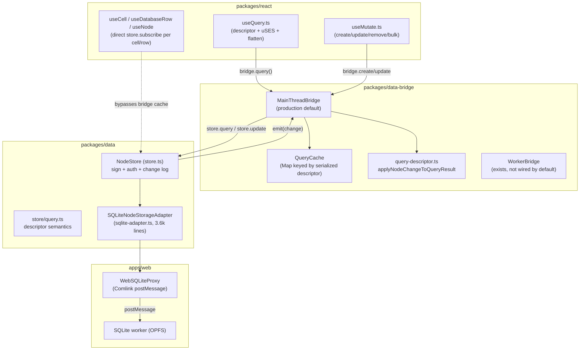
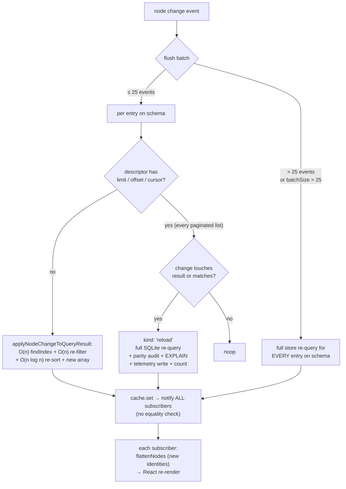
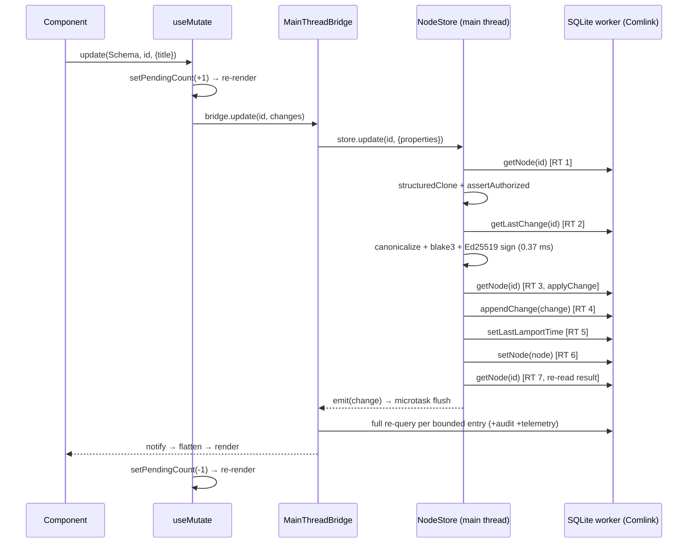

# Query And Mutation Hot Path Performance

## Problem Statement

`useQuery` and `useMutate` are the highest-traffic APIs in xNet. Every list,
sidebar, grid cell, task row, and canvas widget reads through
`useQuery` → DataBridge → QueryCache → NodeStore → SQLite, and every edit
writes back through the mirror path. As node counts and active-query counts
grow, interactions that should be sub-millisecond (toggling a checkbox,
typing in a cell) trigger cascading full re-queries, redundant verification
scans, and app-wide re-renders.

This exploration traces the actual hot paths as they exist today, measures
them, ranks the bottlenecks by impact, and recommends a phased plan to
dramatically improve interactive performance.

## Executive Summary

The single most expensive behavior in the platform today is **invalidation
by re-execution**: any query with `limit`, `offset`, or a cursor (which
includes every paginated list — the documented, recommended pattern) is
fully re-run against storage on _every_ matching node change
([query.ts:709](../../packages/data/src/store/query.ts) →
`nodeQueryDescriptorNeedsBoundedReload`). The always-mounted Sidebar alone
holds three such queries, so a single keystroke that updates a page title
re-queries SQLite three times.

The second most expensive behavior is **hidden per-query overhead in the
SQLite adapter**: with default options, every compiled query also runs a
parity audit that re-lists the _entire schema_ and re-executes the query in
JS for comparison (`DEFAULT_QUERY_VERIFICATION.enabled = true`,
[sqlite-adapter.ts:277](../../packages/data/src/store/sqlite-adapter.ts)),
plus an `EXPLAIN QUERY PLAN`, an index enumeration, and a telemetry
**write** (`INSERT ... ON CONFLICT`) — per read.

Third: **the React layer destroys object identity on every update**.
`flattenNodes` rebuilds every `FlatNode` on each notification, and
`QueryCache.set` notifies subscribers unconditionally with no equality
check, so memoized children re-render even when their data did not change.

Measured on this machine (M-series, Node 23, memory adapter — browser adds
a Comlink worker hop per storage call):

| Metric                           |       Value | Meaning                                             |
| -------------------------------- | ----------: | --------------------------------------------------- |
| `query-update-fanout-10000`      | **5.94 ms** | one update, ONE subscribed bounded query, 10k nodes |
| `query-update-fanout-1000`       |     1.39 ms | same at 1k nodes (scales ~linearly)                 |
| `database-create-row`            |     5.59 ms | single row create end-to-end                        |
| canonicalize+blake3+Ed25519 sign |     0.37 ms | per change, main thread                             |
| flatten 1000-node list           |     0.53 ms | per subscriber, per notification                    |
| descriptor build + serialize     |       ~1 µs | per `useQuery` render (negligible)                  |
| structuredClone (20-prop node)   |       ~3 µs | negligible                                          |

A 60 fps frame budget is 16 ms. One update against one 10k-node bounded
query already burns 37% of a frame _before_ React renders anything — and
real screens hold 5–15 active queries.

The recommendation, in one line: **make changes flow _through_ cached
results instead of re-executing queries, and make identical data produce
identical object identities.** Concretely: (1) gate the per-query
audit/diagnostics behind a debug flag, (2) extend incremental delta
application to bounded queries with an overfetch buffer, (3) add structural
sharing + per-node flatten caching in the React layer, (4) coalesce the
7-round-trip write path, and (5) finish the worker-bridge story so the main
thread only receives final snapshots.

## Current State In The Repository

### Architecture map



Production wiring ([context.ts:603](../../packages/react/src/context.ts),
[App.tsx:457-480](../../apps/web/src/App.tsx)): `NodeStore` runs on the
**main thread** with no auth evaluator and no content cipher; storage is
`SQLiteNodeStorageAdapter` over `WebSQLiteProxy`, so **every storage call
is an async postMessage round trip** to the SQLite worker. The
`MainThreadBridge` is the default bridge
([context.ts:141](../../packages/react/src/context.ts)); `WorkerBridge`
and `worker/data-worker.ts` exist but are not the default path.

### Read path anatomy (useQuery)

[useQuery.ts](../../packages/react/src/hooks/useQuery.ts) per render:

1. Builds a canonical descriptor and serializes it
   (`createQueryDescriptor` + `JSON.stringify`). With the dominant calling
   convention — inline filter literals, e.g.
   [Sidebar.tsx:81](../../apps/web/src/components/Sidebar.tsx),
   [useGridDatabase.ts:229-250](../../packages/react/src/hooks/useGridDatabase.ts)
   — the filter object identity changes every render, so the descriptor
   memo recomputes every render. **Measured at ~1 µs, this is noise** —
   but the unstable `descriptor`/`filter` identities also churn the
   `reload` callback and `pageInfo` memo downstream.
2. Subscribes via `useSyncExternalStore` against a `QueryCache` entry
   shared across components by serialized-descriptor key (good
   deduplication, [query-cache.ts:174](../../packages/data-bridge/src/query-cache.ts)).
3. On every snapshot change, re-flattens the **entire** result list
   (`flattenNodes`, [useQuery.ts:390](../../packages/react/src/hooks/useQuery.ts)) —
   every node gets a brand-new object identity, in every subscribed
   component, regardless of which node changed.
4. Reads `subscription.getMetadata?.()` outside the subscription contract
   ([useQuery.ts:357](../../packages/react/src/hooks/useQuery.ts)) — a
   metadata-only `setMetadata` notification re-runs render via notify, but
   if `getSnapshot` identity is unchanged React bails out and the metadata
   update is silently dropped.

### Query execution anatomy (NodeStore → SQLite)

[store.ts:617](../../packages/data/src/store/store.ts) `query()`:

- **Pushdown path** (no cipher, no auth evaluator — the production case):
  delegates to `SQLiteNodeStorageAdapter.queryNodes`
  ([sqlite-adapter.ts:882](../../packages/data/src/store/sqlite-adapter.ts)).
  This path is well-built (compile to SQL → select ids → batched
  hydration), **but per call it also runs, with default options**:
  - `auditQueryParity` ([sqlite-adapter.ts:2816](../../packages/data/src/store/sqlite-adapter.ts)):
    for schemas ≤ 1000 nodes (`DEFAULT_QUERY_VERIFICATION = { enabled:
true, maxNodes: 1000 }`), it `countNodes`, **lists the entire schema**,
    re-applies the descriptor in JS, and diffs the two result sets. The
    optimized path executes the slow path too, on every query.
  - `collectCompiledQueryDiagnostics`
    ([sqlite-adapter.ts:2746](../../packages/data/src/store/sqlite-adapter.ts)):
    `EXPLAIN QUERY PLAN` + full index enumeration, per query.
  - `recordQueryTelemetry` ([sqlite-adapter.ts:2674](../../packages/data/src/store/sqlite-adapter.ts)):
    an `INSERT ... ON CONFLICT` **write** into `query_descriptor_stats`,
    per read query. Reads are never write-free.
- **Fallback path** (cipher or auth evaluator configured, or descriptor
  unsupported): `listNodes` for the **whole schema**, decrypt every node,
  per-node auth check, then JS filter/sort/slice
  ([store.ts:633-660](../../packages/data/src/store/store.ts)). Any future
  enabling of encryption-at-rest or row-level auth silently degrades every
  query to a full scan. A `where` clause also disables system-list
  pushdown in the fallback (`canPushSystemListQuery`,
  [store.ts:712](../../packages/data/src/store/store.ts)).

### Invalidation anatomy — the core problem

[main-thread-bridge.ts:835-969](../../packages/data-bridge/src/main-thread-bridge.ts):
store changes are microtask-batched, then for **each cache entry on the
changed schema**:



The killers, specifically:

- `nodeQueryDescriptorNeedsBoundedReload`
  ([query.ts:709](../../packages/data/src/store/query.ts)) — `limit`
  present → reload. `page.first` maps to `limit`
  ([query.ts:577](../../packages/data/src/store/query.ts)), so the
  _recommended_ pagination option opts every list into re-execution.
  Affected today: Sidebar's three queries (limit + orderBy,
  [Sidebar.tsx:81-92](../../apps/web/src/components/Sidebar.tsx)), the grid
  row query (`limit: pageSize`,
  [useGridDatabase.ts:244-250](../../packages/react/src/hooks/useGridDatabase.ts)),
  all eight DataWorkspaceView count probes
  ([DataWorkspaceView.tsx:246-267](../../apps/web/src/components/DataWorkspaceView.tsx)).
  **Editing one cell in a grid full re-queries the row set** (and its
  materialized view path), plus the parity audit, per keystroke burst.
- `handleStoreBatchChange`
  ([main-thread-bridge.ts:928](../../packages/data-bridge/src/main-thread-bridge.ts))
  — batch events reload **every** entry on the schema unconditionally,
  even entries whose results cannot have changed.
- For unbounded queries, the incremental path still re-filters and
  re-sorts the **entire** array per change
  (`applyQueryDescriptor`,
  [query-descriptor.ts:128-166](../../packages/data-bridge/src/query-descriptor.ts)),
  and search filters re-tokenize every node's text — including a TipTap
  tree walk — per evaluation
  ([query.ts:544-565](../../packages/data/src/store/query.ts)).
- `QueryCache.set` ([query-cache.ts:169-216](../../packages/data-bridge/src/query-cache.ts))
  notifies unconditionally. A reload that returns identical data still
  produces a new array → new flatten → full re-render fan-out.

The existing baseline captures this end-to-end:
`query-update-fanout-10000` = **5.94 ms** for ONE update with ONE
subscribed query ([collect-core-platform-baselines.ts:155](../../scripts/collect-core-platform-baselines.ts)),
on the memory adapter. The browser path adds Comlink round trips and OPFS
I/O, and real screens multiply by active-query count.

### Write path anatomy (useMutate → store.update)



Seven storage round trips, a main-thread signing operation, and two
bookkeeping re-renders — per single-property update
([store.ts:387-458](../../packages/data/src/store/store.ts),
[store.ts:1862-1893](../../packages/data/src/store/store.ts),
[useMutate.ts:263-272](../../packages/react/src/hooks/useMutate.ts)).
Published OPFS-in-worker figures put small SQLite ops at ~1.4–1.5 ms each
(see External Research), so seven sequential hops is plausibly **~10 ms of
storage I/O alone** in the browser before invalidation or rendering —
consistent with the 5.6 ms `database-create-row` baseline on the much
faster memory adapter.
`useMutate`'s header comment promises "Immediate local updates (bridge
updates UI subscribers synchronously)" — but the cache only updates after
the full persistence path completes and the change event flushes. There is
no optimistic apply.

Note the `bulk` path is already good: exploration 0157 added storage-owned
batch writes (`bulkWrite` → `batchWrite`), and `database-create-row` style
flows that use transactions amortize correctly. The problem is the
_singular_ update — the most common interactive operation.

### Per-cell subscription fan-out

[useCell.ts:92](../../packages/react/src/hooks/useCell.ts),
[useDatabaseRow.ts:142](../../packages/react/src/hooks/useDatabaseRow.ts),
and [useNode.ts:1094](../../packages/react/src/hooks/useNode.ts) each
attach a listener to the **global** `store.subscribe` feed and filter by
nodeId inside the callback. A 50×8 grid mounts 400 listeners; every change
event anywhere in the store invokes all 400 callbacks. Dispatch is
O(listeners), not O(affected).

### What is already good

- Query deduplication by canonical serialized descriptor — N components
  sharing one query share one cache entry and one storage execution.
- Microtask batching of change events before invalidation.
- Single-change incremental apply for unbounded queries (no storage hit).
- Batched id-hydration with bind-parameter chunking in the SQLite adapter.
- LRU eviction with subscriber-aware retention in QueryCache.
- The benchmark harness (`pnpm bench:core-platform`) already measures the
  exact fan-out this exploration targets.

## External Research

Findings from a survey of local-first/reactive-query systems (URLs in
References):

### Incremental view maintenance in JS

The theory is unambiguous: an incremental algorithm beats re-execution by
O(|DB|/|ΔDB|) (DBSP paper) — for single-row mutations against 10k-node
result sets, that is three to four orders of magnitude. Four production
systems apply this in JavaScript:

- **RxDB EventReduce**: a finite-state-machine approach — 18 boolean
  _state functions_ about the event and current result (`isInsert`,
  `wasResultsEmpty`, `sortParamsChanged`, `changedDocumentIsInResults`, …)
  and 16 _action functions_ (`insertFirst`, `replaceExisting`,
  `insertAtSortPosition`, `doNothing`, `runFullQueryAgain`). All 2^18
  state combinations are precomputed into a truth table compressed to a
  binary decision diagram. Their benchmark: **~94% of randomized write
  events resolve without re-executing the query** (higher on real
  workloads), with up to 12× faster display updates after writes. Scope
  limitation: single-collection queries only — which matches xNet's
  per-schema descriptors exactly. The `doNothing` action is also what
  enables returning an identical array reference (see render section).
- **Rocicorp Zero (ZQL)**: "Materialize-style streaming SQL embedded in
  the browser." Queries hydrate once against the local replica, then stay
  registered; writes propagate as row-level diffs (add/remove/edit)
  through operator pipelines — O(delta) work per affected query. Its
  ancestor library Materialite claimed an order of magnitude over
  in-memory SQLite _even for queries that can't be incrementally
  maintained_. Queries have TTLs (~10 min default) so recently-used
  windows stay warm.
- **ElectricSQL D2TS + TanStack DB**: `@electric-sql/d2ts` is a pure
  TypeScript differential dataflow library (map/filter/join/reduce/
  distinct over multisets with multiplicities) — the engine behind
  TanStack DB's live queries, making it the most broadly deployed JS
  differential dataflow runtime. TanStack DB's headline benchmark:
  **updating one row in a sorted 100,000-item collection takes ~0.7 ms**
  on an M1 Pro — the same shape of operation that costs xNet 5.9 ms at
  10k nodes today. Optimistic mutations apply to collections immediately;
  durability is async.
- **WatermelonDB**: two observation modes — _simple_ (evaluate the
  changed record against the query predicate in JS, no DB hit; used when
  the predicate is safely evaluable) and _reloading_ (full re-query for
  joins/subqueries). xNet's unbounded-query delta path is already
  WatermelonDB-simple; the gap is that bounded queries never qualify.
- **LiveStore** (contrast): event-sourced SQLite where reactive queries
  re-execute via trigger-based change tracking — architecturally closest
  to xNet's current reload path, and the approach the IVM systems above
  exist to avoid.

### React subscription patterns at scale

`useSyncExternalStore` compares `getSnapshot` results with `Object.is` —
so the *only* way to suppress a re-render is to return the same reference
when data is unchanged. TanStack Query v5 layers three mechanisms on top,
all absent in xNet today:

1. **Structural sharing** (`replaceEqualDeep`): deep-compare new vs old
   result; reuse old sub-tree references wherever deeply equal, so
   unchanged items keep identity and `React.memo` children skip.
2. **Tracked properties**: the result object is a Proxy recording which
   fields the component actually read; updates to unread fields (e.g.
   `isFetching`) don't re-render. (Caveat: rest-destructuring defeats it.)
3. **`notifyManager` batching**: all observer notifications queue during a
   batch and flush together in one microtask → one render cycle even when
   an invalidation touches 50 queries.

Zustand/Redux selector practice agrees: selector + shallow equality, so an
unchanged slice returns the previous reference.

### SQLite WASM / OPFS and the worker boundary

Concrete numbers (RxDB's storage benchmark): OPFS-in-worker small write
≈ **1.54 ms**, small read ≈ **1.41 ms**; in-memory WASM SQLite ≈ 0.17 ms
write. postMessage baseline round trip ≈ 0.5 ms, structured-clone cost
scaling with payload (32 MB clone ≈ 300 ms vs ≈ 6.6 ms as a Transferable).
Practical guidance across sqlite-wasm/Notion writeups: batch statements
per message, move logic into the worker, return only final results — or
diffs, which stay naturally small. Notion's production architecture
(SharedWorker routing all tabs' queries to the one dedicated worker
holding the OPFS handle, WASM lazily initialized ≈ 500 ms off the critical
path) yielded 20% faster navigation overall. xNet's write path currently
does the opposite of this guidance: 7 hops per update, full row sets per
invalidation.

### Ed25519 signing

`@noble/ed25519` signs at ~**137 µs/op** (M4; our measured 0.37 ms
includes canonical JSON + blake3 on an older M-series). Not a per-edit
bottleneck — but synchronous on the main thread, 3–5× slower on median
phones, and hostile in bulk (1000 signs ≈ 370 ms of jank). WebCrypto
Ed25519 is now in all engines (Chrome 137+, May 2025) and runs in native
code. Prior art consensus: sign in the worker, and batch-sign — one
compound signed change per flush window rather than one signature per
keystroke-level change.

### Write batching / coalescing

The standard local-first pattern is **optimistic in-memory apply now,
durable persistence on a 50–200 ms debounce window with a max-wait
ceiling**, coalescing multiple changes to the same object per flush
(classic write-behind). Automerge's own benchmark shows a large editing
trace applying "in about 1 second" as a single transaction versus far
longer as per-keystroke transactions; Yjs makes the same recommendation
via `doc.transact()`. xNet's `useCell` already debounces at 300 ms at the
UI layer — the store should provide the same guarantee underneath.

## Key Findings

Ranked by expected impact on interactive latency:

| #   | Finding                                                                                | Where                                                                                                                                                                                               | Cost today                                                          | Expected win                                                         |
| --- | -------------------------------------------------------------------------------------- | --------------------------------------------------------------------------------------------------------------------------------------------------------------------------------------------------- | ------------------------------------------------------------------- | -------------------------------------------------------------------- |
| 1   | Bounded queries (`limit`/`page`) fully re-execute on every matching change             | [query.ts:709](../../packages/data/src/store/query.ts), [main-thread-bridge.ts:898-924](../../packages/data-bridge/src/main-thread-bridge.ts)                                                       | 5.9 ms × active bounded queries, per update (10k nodes)             | 10–50× on edit-heavy screens (grids, sidebar)                        |
| 2   | Parity audit + EXPLAIN + index listing + telemetry write on every query, by default    | [sqlite-adapter.ts:277,882,2674-2865](../../packages/data/src/store/sqlite-adapter.ts)                                                                                                              | ~2–5× per-query multiplier for ≤1000-node schemas; a write per read | 2–5× on every query, one-line-ish fix                                |
| 3   | No structural sharing; full re-flatten per subscriber per change; unconditional notify | [useQuery.ts:360-404](../../packages/react/src/hooks/useQuery.ts), [query-cache.ts:195](../../packages/data-bridge/src/query-cache.ts)                                                              | 0.53 ms/1000 nodes/subscriber + full child re-render fan-out        | eliminates most wasted renders                                       |
| 4   | Single update = 7 worker round trips + main-thread sign + 2 pending re-renders         | [store.ts:387-458,1862-1893](../../packages/data/src/store/store.ts), [useMutate.ts:263](../../packages/react/src/hooks/useMutate.ts)                                                               | ~5.6 ms create on memory adapter; worse over Comlink                | 3–5× write latency; perceived latency → sub-ms with optimistic apply |
| 5   | Batch events (>25 changes) reload every query on schema unconditionally                | [main-thread-bridge.ts:84,865-936](../../packages/data-bridge/src/main-thread-bridge.ts)                                                                                                            | N full re-queries per bulk op                                       | bounded by delta size instead                                        |
| 6   | Per-cell/per-row global store subscriptions                                            | [useCell.ts:92](../../packages/react/src/hooks/useCell.ts), [useDatabaseRow.ts:142](../../packages/react/src/hooks/useDatabaseRow.ts), [useNode.ts:1094](../../packages/react/src/hooks/useNode.ts) | O(cells) callback invocations per change                            | O(1) dispatch via nodeId index                                       |
| 7   | Cipher/auth config silently disables all SQL pushdown                                  | [store.ts:621](../../packages/data/src/store/store.ts)                                                                                                                                              | full scan + per-node auth per query                                 | design constraint to fix before enabling E2EE                        |
| 8   | Worker bridge exists but unused; all query/sign/invalidate work on main thread         | [context.ts:141](../../packages/react/src/context.ts), [worker/data-worker.ts](../../packages/data-bridge/src/worker/data-worker.ts)                                                                | main-thread jank under load                                         | frees the UI thread entirely                                         |

Non-findings (measured, honest): descriptor build + JSON serialization per
render (~1 µs) and `structuredClone` per write (~3 µs) are noise; devtools
instrumentation is correctly null in production; the QueryCache LRU and
dedup design is sound.

## Options And Tradeoffs

### A. Fixing invalidation-by-re-execution (finding 1)

| Option                                                    | How                                                                                                                                                                                                             | Pros                                                                                                                                                                                    | Cons                                                                                                        |
| --------------------------------------------------------- | --------------------------------------------------------------------------------------------------------------------------------------------------------------------------------------------------------------- | --------------------------------------------------------------------------------------------------------------------------------------------------------------------------------------- | ----------------------------------------------------------------------------------------------------------- |
| A1. Overfetch buffer + delta (recommended)                | Bridge fetches `limit + K` (K≈25) rows, keeps them as the entry's working set, applies deltas in memory, slices `limit` for subscribers; re-query only when buffer underflows or an ambiguous transition occurs | Removes ~all re-queries for the common cases (in-place update, insert-into-window, remove-with-spare); contained in `query-descriptor.ts`/`main-thread-bridge.ts`; RxDB-proven approach | Slightly more memory per entry; cursor (`after`) queries need care; correctness matrix must be tested hard  |
| A2. Full EventReduce-style decision table                 | Port/adapt RxDB's event-reduce truth table over (op × in-result × sort-impact × limit)                                                                                                                          | Maximal coverage (~94% verified), proven library; `doNothing` action gives reference-stable no-op results for free                                                                      | Bigger lift; xNet sort semantics (nodeId tiebreak, null ordering) must match exactly; license/port overhead |
| A3. Adopt `@electric-sql/d2ts` differential dataflow      | Register each active descriptor as a D2TS pipeline over a per-schema collection; feed store change events as +1/−1 multiset deltas                                                                              | Real IVM engine, MIT TS library, battle-tested via TanStack DB (~0.7 ms single-row update in a sorted 100k collection); handles joins later (relations!)                                | New dependency and mental model; descriptor semantics (search/spatial/cursor) need custom operators; operator state memory per query                |
| A4. SQL-level materialized views with incremental refresh | Push windows into `materialized_query` tables refreshed by rowid deltas                                                                                                                                         | Moves work off JS entirely                                                                                                                                                              | Highest complexity; SQLite WASM has no native IVM; still crosses worker per refresh                         |

### B. Per-query adapter overhead (finding 2)

| Option                          | How                                                                                                                                        | Pros                                                   | Cons                                                                       |
| ------------------------------- | ------------------------------------------------------------------------------------------------------------------------------------------ | ------------------------------------------------------ | -------------------------------------------------------------------------- |
| B1. Flip defaults (recommended) | `queryVerification.enabled: false` and diagnostics/EXPLAIN behind `xnet:query:debug`; sample telemetry (e.g., 1-in-50 queries or dev-only) | Immediate 2–5× per-query win; zero architecture change | Lose always-on parity safety net — keep it in CI/integration tests instead |
| B2. Async audit                 | Run parity audit post-response on idle callback                                                                                            | Keeps the net in production                            | Still pays the full-schema scan, just later; complexity                    |

### C. React identity churn (finding 3)

| Option                                                     | How                                                                                                                                                                     | Pros                                                                                                       | Cons                                                                                                                                                 |
| ---------------------------------------------------------- | ----------------------------------------------------------------------------------------------------------------------------------------------------------------------- | ---------------------------------------------------------------------------------------------------------- | ---------------------------------------------------------------------------------------------------------------------------------------------------- |
| C1. WeakMap flatten cache + array reuse (recommended)      | `WeakMap<NodeState, FlatNode>` so unchanged `NodeState` references reuse their flat object; if every element mapped to its previous identity, return the previous array | O(changed) flatten work; unchanged rows keep identity → `React.memo` rows stop re-rendering; no API change | Requires bridge deltas to preserve unchanged `NodeState` references (they already do for the `set` path; reloads need result-merging — pair with A1) |
| C2. TanStack-style `replaceEqualDeep` after every snapshot | Deep-compare new vs old, graft old identities                                                                                                                           | Works even when references break (reloads)                                                                 | O(result) deep compare per update; treats symptom not cause                                                                                          |
| C3. Equality short-circuit in `QueryCache.set`             | Skip notify when data is shallow-equal (element-wise reference equality)                                                                                                | Stops no-op render cascades after reloads with identical data                                              | Needs C1/A1 to make references stable enough to ever be equal                                                                                        |

C1 + C3 together, with A1 preserving references, is the coherent set.

### D. Write path (finding 4)

| Option                                              | How                                                                                                                                                   | Pros                                                            | Cons                                                                |
| --------------------------------------------------- | ----------------------------------------------------------------------------------------------------------------------------------------------------- | --------------------------------------------------------------- | ------------------------------------------------------------------- |
| D1. Single-op transaction reuse (recommended first) | Route `store.update` through the same storage-owned write pattern as `batchWrite`: one worker message doing read-modify-write-append-clock atomically | 7 round trips → 1–2; transactional by construction              | Adapter API addition (`applySignedChange`-style op)                 |
| D2. Optimistic cache apply                          | Bridge applies the change to affected cache entries synchronously (it already has `applyNodeChangeToQueryResult`), then persists; reconcile on error  | Perceived latency → sub-ms; matches the useMutate doc comment   | Rollback path needed; temp-id flows already exist for creates       |
| D3. Off-thread + batched signing                    | Sign in the SQLite (or data) worker (or WebCrypto Ed25519, native in all engines since Chrome 137); sign one compound change per flush window instead of per change | Removes 0.37 ms × N from main thread; bulk imports stop janking; signature count drops by the batch factor | Key material handling moves to worker (already crosses for storage); compound-change format touches sync protocol |

### E. Structural (findings 6–8)

- **E1. NodeId-indexed subscription dispatch**: store keeps
  `Map<nodeId, Set<listener>>` alongside the global set; `useCell`-class
  hooks register per-node. O(1) dispatch. Small, local, high value for
  grids.
- **E2. Worker-resident NodeStore (the existing "later phases" plan)**:
  move NodeStore + bridge invalidation into `data-worker.ts`; main thread
  holds a thin cache of final snapshots. This is the end-state that makes
  every other cost invisible to the UI thread — but it's a migration, not
  a fix, and A–D are prerequisites for it to be fast _in_ the worker too.

## Recommendation

Phase the work so each step lands independently and is verified by the
existing benchmark harness plus new fan-out benches:

1. **Phase 0 — stop paying for diagnostics (days):** B1. Flip
   `DEFAULT_QUERY_VERIFICATION.enabled` to false (keep it on in vitest
   integration suites), gate `collectCompiledQueryDiagnostics` behind the
   debug flag, sample `recordQueryTelemetry`. Re-run
   `bench:core-platform`; expect `database-create-row` and fan-out to drop
   immediately.
2. **Phase 1 — incremental bounded queries (1–2 weeks):** A1 overfetch
   buffer in the bridge + delta application for limited/ordered queries;
   kill the unconditional reload in `handleStoreBatchChange` by routing
   batches through grouped deltas with a much higher reload threshold.
   Target: `query-update-fanout-10000` < 0.5 ms. If the hand-rolled delta
   matrix grows past simple windows (relations/joins, aggregations), stop
   and adopt `@electric-sql/d2ts` (A3) rather than reinventing
   differential dataflow case by case.
3. **Phase 2 — identity-stable React layer (days):** C1 WeakMap flatten
   cache + previous-array reuse in `useQuery`; C3 equality short-circuit
   in `QueryCache.set`; fix `getMetadata` reactivity by folding metadata
   into the subscribed snapshot or versioning it; make `useMutate` pending
   state lazy (subscribe-on-read) so unused `isPending` costs zero
   renders.
4. **Phase 3 — one-round-trip writes (1 week):** D1 single-message
   read-modify-write in the SQLite adapter; D2 optimistic apply in the
   bridge with rollback; D3 move signing off the interactive path.
5. **Phase 4 — worker-resident data layer (exploration + migration):** E2,
   building on the existing `WorkerBridge`/`data-worker.ts` skeleton, with
   binary snapshot transfer (`utils/binary-state.ts` already exists).
   Follow Notion's shape: one worker owns the OPFS handle and runs
   store + invalidation; the main thread receives **diffs, not result
   arrays** (postMessage cost scales with payload — diffs stay naturally
   small). Sequence after Phases 0–3 since they all apply inside the
   worker too.

E1 (nodeId dispatch index) can land any time; it is independent.

## Example Code

Phase 1 sketch — bounded-query working set in the bridge:

```ts
// query-cache entry gains a working set larger than the visible window
interface CacheEntry {
  data: NodeState[] | null // visible window (sliced to limit)
  workingSet: NodeState[] | null // limit + OVERFETCH rows, descriptor-ordered
  // ...
}

const OVERFETCH = 25

function applyChangeToBoundedResult(input: {
  descriptor: QueryDescriptor // has limit L
  workingSet: NodeState[] // sorted, length ≤ L + OVERFETCH
  nodeId: string
  nextNode: NodeState | null
}): QueryResultDelta {
  const { descriptor, workingSet, nodeId, nextNode } = input
  const limit = descriptor.limit!
  const idx = workingSet.findIndex((n) => n.id === nodeId)
  const matches = matchesQueryDescriptor(descriptor, nextNode)

  // Case 1: irrelevant change — node not in working set and doesn't match
  if (idx < 0 && !matches) return { kind: 'noop' }

  // Case 2: removal/unmatch — drop and re-slice; reload only on underflow
  if (idx >= 0 && !matches) {
    const next = workingSet.filter((n) => n.id !== nodeId)
    return next.length >= limit
      ? { kind: 'set', data: next } // buffer absorbs the loss
      : { kind: 'reload' } // genuinely unknown next row
  }

  // Case 3: in-place update or insert — re-sort the small working set
  const merged =
    idx >= 0
      ? workingSet.map((n) => (n.id === nodeId ? nextNode! : n))
      : insertSorted(workingSet, nextNode!, descriptor) // O(log n) position
  // beyond-window inserts that sort after the buffer are noops
  return { kind: 'set', data: merged.slice(0, limit + OVERFETCH) }
}
```

Phase 2 sketch — identity-preserving flatten in `useQuery`:

```ts
const flatCache = new WeakMap<NodeState, FlatNode<never>>()

function flattenNodeCached<P extends Record<string, PropertyBuilder>>(
  node: NodeState
): FlatNode<P> {
  const hit = flatCache.get(node)
  if (hit) return hit as FlatNode<P>
  const flat = flattenNode<P>(node)
  flatCache.set(node, flat as FlatNode<never>)
  return flat
}

// in the list memo: reuse the previous array when nothing changed
const prevRef = useRef<FlatNode<P>[]>([])
const data = useMemo(() => {
  const next = rawData.map((n) => flattenNodeCached<P>(n))
  const prev = prevRef.current
  const same = next.length === prev.length && next.every((f, i) => f === prev[i])
  if (same) return prev
  prevRef.current = next
  return next
}, [rawData])
```

Phase 3 sketch — pending state without forced re-renders:

```ts
// Module-level pending store shared by all useMutate instances
const pendingStore = {
  count: 0,
  listeners: new Set<() => void>(),
  subscribe(cb: () => void) {
    /* add/remove */
  },
  getSnapshot: () => pendingStore.count
}

export function useMutate(): UseMutateResult {
  // components that never destructure isPending never subscribe
  const isPending = () => useSyncExternalStore(pendingStore.subscribe, pendingStore.getSnapshot) > 0
  // ... create/update/remove mutate pendingStore.count without setState
}
```

## Risks And Open Questions

- **Delta-correctness for bounded queries** is the classic source of
  subtle bugs (RxDB ships a generated truth table for a reason). The
  parity audit we are disabling in production is exactly the right
  validation harness for this work — keep it enabled in CI and add a
  randomized property test (random ops vs. re-executed ground truth).
- **Cursor (`after`) pagination** interacts with overfetch buffers; v1 can
  keep reload semantics for cursor pages (rare in hot paths) and only
  upgrade `limit`-only windows.
- **Reference stability across reloads**: when a reload does happen, the
  fresh `NodeState` objects break the WeakMap flatten cache. Merging
  reload results against the previous working set by `(id, updatedAt)` to
  reuse unchanged references would preserve identity; measure whether it
  pays for itself.
- **Optimistic apply + auth failure**: a rejected write must roll back
  cache entries; the temp-id machinery (`tempids.ts`) covers creates but
  update rollback needs the `previousNode` snapshot the store already
  clones.
- **Telemetry loss**: sampling `query_descriptor_stats` weakens adaptive
  indexing's signal (it needs `minHits: 20`). Counting hits in memory and
  flushing periodically preserves the signal without a write per read.
- **Does anything depend on parity metadata?** `plan.parityCheck` is
  surfaced through query metadata; devtools may display it. Gate, don't
  delete.
- **Worker-resident store (Phase 4)** changes `bridge.nodeStore`
  availability on the main thread — `useMutate.mutate()` transactions and
  several hooks reach for it directly; an async transaction API must come
  first.

## Implementation Checklist

Phase 0 — adapter overhead:

- [ ] Default `queryVerification.enabled` to `false`; enable explicitly in vitest/integration suites
- [ ] Gate `collectCompiledQueryDiagnostics` behind `xnet:query:debug`
- [ ] Make `recordQueryTelemetry` sample (or buffer in memory and flush on idle), preserving adaptive-index hit counting
- [ ] Re-run `pnpm bench:core-platform` and commit updated baselines

Phase 1 — incremental bounded queries:

- [ ] Add working-set (limit + overfetch) storage to `QueryCache` entries
- [ ] Implement `applyChangeToBoundedResult` in `query-descriptor.ts` with the underflow→reload fallback
- [ ] Route `handleStoreChange`/`handleStoreChangeSet` bounded entries through the delta path
- [ ] Replace `handleStoreBatchChange`'s unconditional reload with grouped delta application + raised reload threshold
- [ ] Property-test deltas against re-executed ground truth (reuse parity-audit comparator)
- [ ] Add `query-update-fanout` benches for bounded queries at 1k/10k/50k and multi-query fan-out (10 active queries)

Phase 2 — React identity stability:

- [ ] WeakMap flatten cache + previous-array reuse in `useQuery`
- [ ] Element-wise reference-equality short-circuit in `QueryCache.set` before notify
- [ ] Fold metadata into the subscribed snapshot (or version it) so metadata-only updates render reliably
- [ ] Rework `useMutate` pending tracking to subscription-on-read (no setState when `isPending` unused)
- [ ] Stabilize `descriptor`/`reload`/`pageInfo` against inline-filter identity churn (key memos on `queryKey` only)

Phase 3 — write path:

- [ ] Add single-message read-modify-write op to the storage adapter (reuse `batchWrite` transaction plumbing)
- [ ] Optimistic cache apply in `MainThreadBridge.update/create/delete` with rollback from `previousNode`
- [ ] Move change signing off the interactive path (worker or WebCrypto), batch for bulk flows
- [ ] Bench: `database-update-row` end-to-end and perceived (cache-visible) latency separately

Phase 4 — worker-resident data layer:

- [ ] Write a follow-up exploration for migrating NodeStore into `data-worker.ts` (async transaction API, snapshot transfer via `binary-state.ts`, devtools story)

Independent:

- [ ] NodeId-indexed listener dispatch in `NodeStore.subscribe` consumers (`useCell`, `useDatabaseRow`, `useNode`)

## Validation Checklist

- [ ] `pnpm bench:core-platform`: `query-update-fanout-10000` drops from ~5.9 ms to < 0.5 ms
- [ ] New multi-query fan-out bench (10 bounded queries, 10k nodes): single update < 2 ms total
- [ ] `database-create-row` < 2 ms (memory adapter) after Phase 0 + 3
- [ ] React Profiler on the grid (50×8): editing one cell re-renders only that row/cell, not the table
- [ ] Sidebar does not re-query (verify via `plan` strategy counters / query debugger) while typing in a page title
- [ ] Parity property tests green: 10k randomized op sequences, delta results === re-executed results, per descriptor shape (limit, orderBy, where, mixed)
- [ ] No regression in `pnpm test` (store, bridge, react hook suites)
- [ ] Devtools query panel still shows plans when `xnet:query:debug` is set

## References

- [packages/react/src/hooks/useQuery.ts](../../packages/react/src/hooks/useQuery.ts), [useMutate.ts](../../packages/react/src/hooks/useMutate.ts) — the hooks under study
- [packages/data-bridge/src/main-thread-bridge.ts](../../packages/data-bridge/src/main-thread-bridge.ts), [query-cache.ts](../../packages/data-bridge/src/query-cache.ts), [query-descriptor.ts](../../packages/data-bridge/src/query-descriptor.ts) — invalidation core
- [packages/data/src/store/query.ts](../../packages/data/src/store/query.ts), [store.ts](../../packages/data/src/store/store.ts), [sqlite-adapter.ts](../../packages/data/src/store/sqlite-adapter.ts) — execution core
- [scripts/collect-core-platform-baselines.ts](../../scripts/collect-core-platform-baselines.ts) — benchmark harness used for the numbers above
- Exploration 0156/0157 — import-speed and batch-write predecessors to this doc
- RxDB EventReduce — https://github.com/pubkey/event-reduce (94% of randomized events resolved without re-exec; 18 state functions × 16 actions compiled to a BDD)
- Rocicorp Zero / ZQL — https://zero.rocicorp.dev/docs/reading-data ; Materialite ancestry — https://github.com/vlcn-io/materialite and https://vlcn.io/blog/the-march-to-reactivity
- ElectricSQL D2TS (TypeScript differential dataflow) — https://github.com/electric-sql/d2ts
- TanStack DB (live queries on D2TS; ~0.7 ms single-row update in sorted 100k collection) — https://tanstack.com/blog/tanstack-db-0.1-the-embedded-client-database-for-tanstack-query
- TanStack Query render optimizations (`replaceEqualDeep`, tracked properties, `notifyManager`) — https://tanstack.com/query/v5/docs/framework/react/guides/render-optimizations
- WatermelonDB observation modes — https://watermelondb.dev/docs/Query
- LiveStore architecture — https://docs.livestore.dev/evaluation/how-livestore-works/
- DBSP paper (IVM speedup is O(|DB|/|ΔDB|)) — https://arxiv.org/pdf/2203.16684
- RxDB browser-storage benchmark (OPFS-worker ≈1.5 ms small ops; memory WASM ≈0.17 ms) — https://rxdb.info/articles/localstorage-indexeddb-cookies-opfs-sqlite-wasm.html
- Notion's WASM SQLite architecture (SharedWorker + single OPFS owner; 20% faster navigation) — https://www.notion.com/blog/how-we-sped-up-notion-in-the-browser-with-wasm-sqlite
- postMessage / structured-clone cost analysis — https://surma.dev/things/is-postmessage-slow/
- @noble/ed25519 benchmarks (~137 µs/sign on M4) — https://github.com/paulmillr/noble-ed25519
- WebCrypto Ed25519 ships in Chrome 137 — https://developer.chrome.com/blog/chrome-137-beta
- Automerge 2.0 batching benchmark — https://automerge.org/blog/automerge-2/
