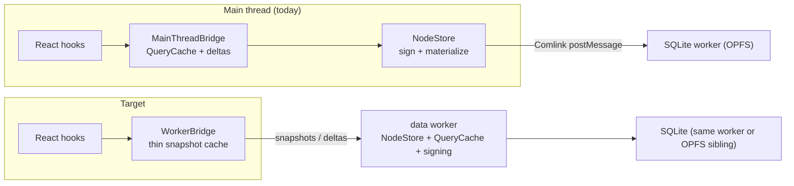

# Worker Resident Data Layer

## Problem Statement

Exploration 0163 made the query/mutation hot paths cheap, but every
remaining cost — query compilation, delta application, change signing,
invalidation bookkeeping — still executes on the main thread, interleaved
with React rendering and input handling. The web app today runs
`NodeStore` on the main thread over a Comlink proxy to the SQLite worker,
so each storage call is already paying a postMessage hop while the
CPU-bound coordination stays UI-side.

This exploration plans the end-state sketched as Phase 4 of 0163: move
`NodeStore` + bridge invalidation into a dedicated data worker so the main
thread only receives final query snapshots.

## Current State In The Repository

What already exists:

- [worker-bridge.ts](../../packages/data-bridge/src/worker-bridge.ts) —
  a `DataBridge` implementation that proxies `query`/`create`/`update`/
  `delete`/`bulkWrite` over Comlink, maintains a main-thread snapshot map,
  and subscribes to per-query deltas.
- [worker/data-worker.ts](../../packages/data-bridge/src/worker/data-worker.ts)
  — a worker-side `NodeStore` host with query subscriptions, per-query
  delta computation (`applyNodeChangeToQueryResult`), a Y.Doc pool with
  zero-copy `transfer()` for updates, and bulk-write support. It still
  predates 0163: it only supports `MemoryNodeStorageAdapter`, uses the old
  25-event reload threshold, and has no bounded working sets.
- [worker/worker-types.ts](../../packages/data-bridge/src/worker/worker-types.ts)
  — the Comlink API contract (`DataWorkerAPI`, `QueryDelta`,
  `WorkerSubscription`).
- [utils/binary-state.ts](../../packages/data-bridge/src/utils/binary-state.ts)
  — binary NodeState encoding for snapshot transfer.
- 0163 already moved the expensive primitives into shareable modules: the
  bounded delta engine and identity-preserving merge live in
  `query-descriptor.ts` (pure functions, worker-safe), singular writes go
  through `getBatchPreflight` + `applyNodeBatch`, and `NodeStore` accepts
  an async `changeSigner`.

What blocks flipping the default today:

1. **`bridge.nodeStore` escape hatch.** `useMutate.mutate()` calls
   `bridge.nodeStore.transaction(...)` directly
   ([useMutate.ts:417](../../packages/react/src/hooks/useMutate.ts)), and
   `XNetProvider` hands the store to SyncManager, search indexing, and
   devtools ([context.ts](../../packages/react/src/context.ts)).
   `WorkerBridge.nodeStore` is `null`, so any consumer that reaches for it
   silently loses functionality. An async `bridge.transaction(ops)` API
   (proxied to the worker) must land first.
2. **Storage residency.** The web app's SQLite lives behind
   `WebSQLiteProxy` in its own worker. The data worker must either (a)
   talk to that worker directly via a forwarded `MessagePort`, or (b) own
   SQLite itself (OPFS handles are per-context; sync-access handles
   require a dedicated worker anyway). (b) is the clean end-state; (a) is
   the incremental step.
3. **Y.Doc/SyncManager coupling.** `acquireDoc` in `MainThreadBridge`
   delegates to the main-thread SyncManager. The worker has its own doc
   pool, but WebRTC/WebSocket sync providers and awareness currently live
   on the main thread.
4. **Devtools and instrumentation** read query plans and store state
   synchronously in places; they need an async/event-driven feed.

## Options And Tradeoffs

| Option                                             | How                                                                                                                    | Pros                                                       | Cons                                                                             |
| -------------------------------------------------- | ---------------------------------------------------------------------------------------------------------------------- | ---------------------------------------------------------- | -------------------------------------------------------------------------------- |
| A. Incremental port-forwarding (recommended first) | Data worker hosts NodeStore + cache; storage calls forward to the existing SQLite worker via transferred `MessagePort` | No storage rewrite; lands behind a config flag; reversible | Still two hops for storage (data worker → sqlite worker), though off-main-thread |
| B. Consolidated worker                             | One worker owns SQLite (OPFS sync handles) AND NodeStore/cache                                                         | Single hop; sync access handles are faster than async OPFS | Bigger migration; Electron/Expo need different wiring                            |
| C. Stay main-thread, keep optimizing               | 0163 already made hot paths sub-ms                                                                                     | Zero migration risk                                        | Bulk imports, signing bursts, and large reloads still jank the UI                |

## Recommendation

Phase the migration so each step is independently shippable and gated by
a provider flag (`config.bridge: 'main-thread' | 'worker'`):

1. **Close the API gaps (main-thread-safe):** add async
   `DataBridge.transaction(ops)` and migrate `useMutate.mutate()` and
   other `bridge.nodeStore` consumers to bridge-level APIs. Ship while
   still on `MainThreadBridge`.
2. **Modernize the worker internals:** port 0163's machinery into
   `data-worker.ts` — bounded working sets + delta engine, batch-change
   hydration with the raised threshold, identity-preserving reload merge,
   the singular-write fast path (the worker's store gets them for free via
   `NodeStore`), and `createWebCryptoChangeSigner` as the default signer
   in the worker.
3. **Storage forwarding:** teach `WorkerBridge.initialize` to transfer a
   `MessagePort` connected to the SQLite worker; implement a
   `PortSQLiteAdapter` in the data worker (same protocol WebSQLiteProxy
   speaks today).
4. **Snapshot transport:** per-query deltas already exist; add binary
   snapshot transfer via `binary-state.ts` for initial loads above a size
   threshold, with `transfer()` to avoid copies.
5. **Sync/doc story:** keep SyncManager on the main thread initially
   (docs acquired main-thread as today); move change-log sync into the
   worker as a follow-up once the storage port exists.
6. **Flip the default for web** behind telemetry comparing
   `query-update-fanout` and input-latency traces; Electron keeps the
   main-thread bridge (its data process already isolates storage).

## Risks And Open Questions

- **Two caches, one truth:** the worker holds the authoritative
  QueryCache; the main thread holds passive snapshots. Optimistic applies
  (0163 phase 3) must run on the worker and round-trip one postMessage
  (~0.1–0.3 ms) before paint — still well under a frame, but the
  "synchronous optimistic apply" property changes to "next-microtask".
  Measure whether a main-thread optimistic overlay is needed.
- **Devtools** need a worker event feed; `plan.parityCheck` and query
  debugger panels currently assume same-thread access.
- **SharedWorker vs dedicated worker** for multi-tab: OPFS sync handles
  are exclusive; multi-tab web likely needs a SharedWorker or Web Locks
  arbitration. Today's app has the same constraint via the SQLite worker.
- **Serialization overhead:** structuredClone of large snapshots can eat
  the savings; binary-state transfer and delta-only updates are the
  mitigation (measure at 10k/50k nodes).

## Implementation Checklist

- [x] Add `DataBridge.transaction(ops)` (async) and migrate
      `useMutate.mutate()` off `bridge.nodeStore`
- [x] Inventory and migrate remaining `bridge.nodeStore` consumers
      (SyncManager wiring, search indexing, devtools) to bridge APIs or
      provider-level access — inventory found `useMutate.mutate()` was the
      only `bridge.nodeStore` consumer (now on `bridge.transaction`);
      SyncManager, hub search indexing, devtools, and the undo hooks all
      use the provider-owned store via `XNetContext`/`useNodeStore`. The
      escape hatch is now `@deprecated` on the interface.
- [x] Port 0163 bounded working sets, batch hydration, and reload
      identity-merge into `data-worker.ts` (host class extracted to
      `data-worker-host.ts` for direct test coverage; reload threshold
      raised to 250 to match MainThreadBridge)
- [ ] Default `createWebCryptoChangeSigner` inside the worker
- [ ] `PortSQLiteAdapter` + `MessagePort` forwarding from
      `WorkerBridge.initialize`
- [ ] Binary snapshot transfer for initial loads (`binary-state.ts`)
- [ ] Worker-side optimistic apply; measure perceived latency vs
      main-thread overlay
- [ ] Devtools event feed from the worker
- [ ] Flag-gated rollout on web + bench comparison (fanout, input latency,
      bulk import jank)

## References

- [Exploration 0163 — query and mutation hot path performance](0163_%5Bx%5D_QUERY_AND_MUTATION_HOT_PATH_PERFORMANCE.md) — predecessor; phases 0–3 landed
- [packages/data-bridge/src/worker-bridge.ts](../../packages/data-bridge/src/worker-bridge.ts), [worker/data-worker.ts](../../packages/data-bridge/src/worker/data-worker.ts), [worker/worker-types.ts](../../packages/data-bridge/src/worker/worker-types.ts) — existing skeleton
- [packages/data-bridge/src/utils/binary-state.ts](../../packages/data-bridge/src/utils/binary-state.ts) — snapshot encoding
- SQLite WASM OPFS sync access handles — https://sqlite.org/wasm/doc/trunk/persistence.md
