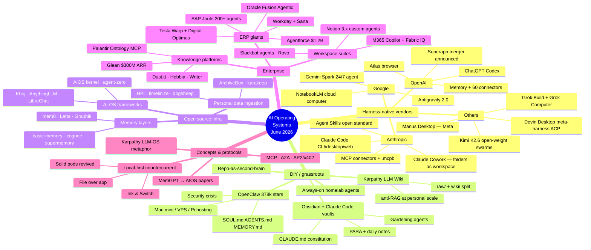
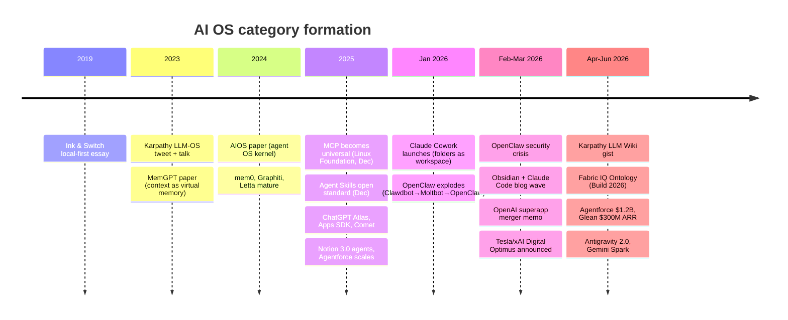
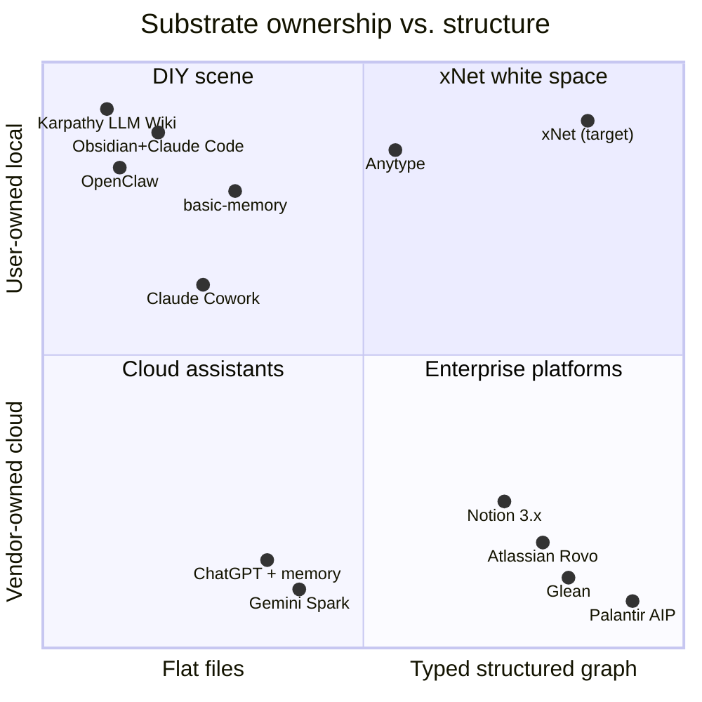
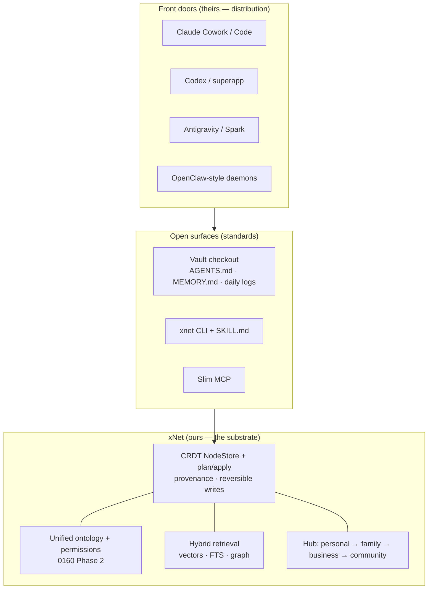

# The AI Operating Systems Landscape: A Survey

## Problem Statement

Explorations 0160 (xNet as an AI operating system) and 0161 (token-efficient
agent interfaces) defined xNet's direction and its agent-interface doctrine.
What neither did is map the **competitive and prior-art landscape in full**:
who else is building "AI operating systems," what shapes they take, what
substrates they bet on, and where xNet's actual white space is.

This exploration is that map. It covers, as of June 2026:

- **Harness-native products** — Claude Code/Cowork, ChatGPT Codex/Atlas,
  Gemini/Antigravity, Manus, Devin Desktop.
- **The grassroots/DIY scene** — Obsidian vaults + Claude Code, OpenClaw on
  Mac minis and VPSs, GitHub-repo-as-second-brain, Karpathy's LLM Wiki.
- **Open source** — a ~40-repo GitHub scan across AI-OS frameworks, memory
  layers, personal-data ingestion, and self-hosted assistant stacks.
- **Enterprise** — Notion AI, Linear AI, SAP Joule, Salesforce Agentforce,
  Microsoft Fabric IQ, Glean, Palantir, Tesla Warp/Digital Optimus.
- **The conceptual frame** — Karpathy's LLM-OS metaphor, the MemGPT/AIOS
  academic line, analyst takes on who owns the agent layer.

Personal use is the primary lens (per 0160's sequencing); the business tier
is surveyed because the same architectural patterns recur there at scale.

## Executive Summary

Five findings dominate the survey:

1. **"AI OS" has crystallized into four distinct shapes**, distinguished by
   _substrate_ (where the data lives) and _who runs the loop_:
   **(a) harness-over-folders** (Claude Cowork, Claude Code, OpenClaw — local
   files, vendor or OSS loop), **(b) cloud-memory platforms** (ChatGPT +
   memory + connectors, Gemini Spark — proprietary store, vendor loop),
   **(c) workspace-with-agents** (Notion 3.x, Atlassian Rovo, Asana — vendor
   store with a structured graph, agents as workspace members), and
   **(d) ontology-first enterprise platforms** (Palantir, Glean, Fabric IQ,
   SAP Joule — governed semantic layer, permissioned agents). xNet is the
   only project surveyed that spans (a), (c), and (d) in one local-first
   system.
2. **The grassroots scene has converged on xNet's exact substrate thesis.**
   OpenClaw (~378k GitHub stars, the fastest-growing repo of the cycle), the
   Obsidian+Claude Code blog wave, Karpathy's LLM Wiki gist, basic-memory,
   memU, and agent-zero all independently arrived at: plain markdown files as
   memory, a constitution file (CLAUDE.md/AGENTS.md/SOUL.md), dated daily
   logs, cron/heartbeat "gardening" passes, and git as history. This is a
   massive validation of 0161's files-first recommendation — and it means
   xNet's differentiation cannot be the substrate alone.
3. **What the DIY scene lacks is exactly what xNet has.** Flat markdown
   vaults have no typed schemas, no real databases, no views, no sync/CRDT
   merge, no permissions, and no UI for non-terminal users. OpenClaw's
   security record (40k+ exposed instances, prompt-injection waves, malicious
   skills on its marketplace) shows what happens when capability outruns
   structure. The gap in the personal market is a system that is
   _agent-legible like a vault_ but _structured like Notion_ and _safe by
   construction_ — xNet's precise shape.
4. **Enterprise convergence is unanimous: the ontology/semantic layer is the
   product.** Microsoft shipped Fabric IQ Ontology, Atlassian opened the
   Teamwork Graph, Glean tripled to $300M ARR on a permission-aware knowledge
   graph, Salesforce's Agentforce passed $1.2B annualized revenue, and
   Palantir remains the archetype. Permissions-aware retrieval and
   agent-as-assignee are now table stakes. This re-confirms 0160's Phase 2
   (unified ontology) as the highest-leverage long-term investment.
5. **The contested real estate is the "front door"** — the shell the user
   talks to. OpenAI is merging ChatGPT+Codex+Atlas into a desktop superapp
   and reportedly fast-tracking an AI phone; analysts frame it as the new
   Windows. The countercurrent (local-first, file-over-app, Solid pods,
   prompt-injection critiques of cloud agents) argues the user's context
   should live in user-owned files. xNet should not fight for the front door;
   it should be the **best home for the data and structure behind every front
   door** — reachable from any harness via files, CLI, and MCP (0161's
   layering), with trust properties no cloud platform can match.

## Current State In The Repository

This exploration is a landscape survey; the repository inventory in
exploration 0160 (ingestion via `packages/social/src/importers/`, databases
in `packages/data/`, vectors in `packages/vectors/`, MCP server in
`packages/plugins/src/services/mcp-server.ts`, filesystem projection in
`packages/plugins/src/services/ai-workspace-exporter.ts`, hub federation in
`packages/hub/`) and the interface analysis in 0161 remain accurate. What
this survey adds to those documents:

- A competitive frame for **where xNet sits** among ~60 products/projects.
- External proof points for decisions already taken (files-first per 0161;
  ontology-first per 0160).
- A catalog of **adoptable conventions** (OpenClaw's memory-file taxonomy,
  Karpathy's raw/wiki split, agent-as-assignee) and **avoidable failures**
  (OpenClaw's exposure surface, Logseq's substrate betrayal, Reor's demise).

## External Research

### Map of the territory

### 1. Harness-native products (the vendor "personal AI OS" race)

**Anthropic** made the clearest folders-as-workspace bet:

- **Claude Cowork** (launched Jan 12, 2026; GA on all paid plans by
  mid-2026): "Claude Code power for knowledge work." Users grant per-folder
  read/write permission; the agent plans, runs code in an isolated VM,
  organizes files, builds spreadsheets/reports. A Projects feature (~April 2026) gives each workspace its own files, instructions, and memory.
  Interface = Skills + MCP connectors + plugins.
  ([anthropic.com/product/claude-cowork](https://www.anthropic.com/product/claude-cowork))
- **Claude Code** desktop was rebuilt (April 2026) around parallel session
  management; **Routines** (May 2026) added scheduled/webhook-triggered cloud
  executions. Memory is plain markdown (`CLAUDE.md`, `~/.claude/`);
  **Agent Skills** became an open standard (Dec 2025,
  [agentskills.io](https://agentskills.io)) since adopted by Codex, Gemini
  CLI, Cursor, and xAI.
- Claude consumer memory rolled to all tiers (March 2026), with a
  "Memory Files" update in development — multiple structured topic-organized
  memory documents, i.e. the CLAUDE.md pattern productized.

**OpenAI** bet on proprietary memory + cloud connectors + the browser:

- **Codex** (cloud agent + CLI, 88k+ stars) is the only local-file OpenAI
  surface; **Atlas** (Chromium browser with agent mode, browser memories)
  explicitly cannot touch the filesystem. **Pulse** does proactive daily
  briefings from memory + connected apps.
- March 2026: leaked Fidji Simo memo confirmed OpenAI is merging
  **Atlas + ChatGPT desktop + Codex into one desktop superapp** — its
  explicit harness-as-OS answer
  ([the-decoder.com](https://the-decoder.com/openai-plans-to-merge-chatgpt-codex-and-atlas-browser-into-a-single-desktop-superapp/)).
  Ming-Chi Kuo reports a 2027 **AI phone with its own OS** is being
  fast-tracked.

**Google** bet on its own cloud: **Gemini Spark** (24/7 background personal
agent over Gmail/Calendar/Drive), **NotebookLM** notebooks that now each get
their own cloud computer, and **Antigravity 2.0** (desktop agent platform
replacing Gemini CLI for individuals from June 18, 2026; notably
multi-vendor — runs Claude and GPT-OSS models too).

**Others:** **Manus Desktop** (Meta-acquired, ~$2B) moved a general agent
onto the laptop; **Devin Desktop** (ex-Windsurf) became a _meta-harness_
running Codex/Claude/OpenCode agents side by side via the open Agent Client
Protocol; **Grok Computer** (full desktop control) is in early access;
**Kimi K2.6** ships open weights built for 12-hour autonomous sessions and
300-sub-agent swarms — an open-weight engine for self-hosted harnesses.

The community pattern on top of all this: "Claude Code as life OS" posts
(RonOS, Hannah Stulberg's life-admin series, dozens of Cowork-over-Obsidian
tutorials) are concentrated overwhelmingly on the Claude harness, operating
over plain local folders.

### 2. The DIY scene (grassroots personal AI OS)

**Obsidian vault + Claude Code** is the dominant pattern, now with a mature
convention set documented across a Feb–Apr 2026 blog wave (Imhoff, Okhlopkov,
Reitz, Nest, eferro): a root `CLAUDE.md`/`AGENTS.md` constitution; PARA or
PARA-hybrid folders; daily notes as the append-only event log; YAML
frontmatter + wikilinks as the graph; raw human notes never edited by the
agent; voice capture via Telegram bots; scheduled gardening passes. Starter
kits abound (claude-obsidian, second-brain-starter, COG-second-brain,
obsidian-vault-gardener — see References).

**Karpathy's LLM Wiki** (April 2026 gist, 16M+ views) legitimized the
pattern's most radical claim: at personal scale, **skip RAG entirely** —
keep `raw/` (immutable sources) + `wiki/` (LLM-maintained pages) +
`CLAUDE.md` (schema) and just read the files into context
([gist](https://gist.github.com/karpathy/442a6bf555914893e9891c11519de94f)).

**OpenClaw** (Clawdbot → Moltbot → OpenClaw, ~378k stars) is the defining
event of the category — an always-on, self-hosted agent living in WhatsApp/
Telegram/Discord/iMessage with shell, browser, and cron access:

- **Memory model**: pure markdown — `SOUL.md` (personality), `AGENTS.md`
  (procedures), `MEMORY.md` (durable facts, loaded every session),
  `memory/YYYY-MM-DD.md` daily logs (today + yesterday auto-loaded, older
  files via hybrid vector+keyword search), `HEARTBEAT.md` (periodic
  autonomous tasks), with a pre-compaction "silent flush" that persists
  context to disk ([docs.openclaw.ai/concepts/memory](https://docs.openclaw.ai/concepts/memory)).
- **Hosting culture**: Mac mini M4 (most popular; only path to iMessage),
  Raspberry Pi 5 + NVMe, or $5–6 VPSs (Hetzner/DigitalOcean 1-click);
  systemd daemon via `openclaw onboard --install-daemon`.
- **Use cases** (from Ask HN threads): supervisor agents coordinating 5–20
  Claude Code instances from a phone; a Telegram bot interviewing 50+
  relatives to archive family stories; small-business job scheduling +
  LaTeX proposals + invoicing; newsletter digests from 200+ sources.
- **The security crisis is the cautionary tale**: 40k+ exposed control
  panels (SecurityScorecard), extracted API keys and chat histories,
  prompt-injection via fake system-message blocks and link previews,
  hundreds of malicious skills on its ClawHub marketplace, a national
  CNCERT warning — and Anthropic banning OpenClaw from Claude subscription
  plans. The community response: Tailscale-only gateways, read-only tool
  surfaces, pre-authorized cron routines instead of free-running shells.

**Always-on agents beyond OpenClaw**: Okhlopkov's "always-on Claude Code"
Hetzner setup formalized a **brain/body split** (immutable daemon vs
agent-editable `CLAUDE.local.md` + memory, `CRONTAB.md` parsed every 60s,
two-tier memory with an Obsidian vault synced via git); homelab posts
converge on constrained access ("structured questions, not SSH").

**Casualty list**: Reor (dedicated local AI-notes app, 8.6k stars) was
archived March 2026; dogsheep is frozen; Logseq's move from markdown to a
proprietary database caused community revolt. Dedicated AI-notes apps are
being eaten by generic harnesses over plain files.

### 3. GitHub open-source scan (~40 repos cataloged)

The most significant repos by bucket (full table in References):

| Repo                                                                              | Stars | What it is                                      | Substrate               |
| --------------------------------------------------------------------------------- | ----- | ----------------------------------------------- | ----------------------- |
| [openclaw/openclaw](https://github.com/openclaw/openclaw)                         | ~378k | Always-on personal agent                        | Markdown workspace      |
| [mem0ai/mem0](https://github.com/mem0ai/mem0)                                     | ~58k  | Universal agent memory layer (+ OpenMemory MCP) | Vector + graph + KV     |
| [Mintplex-Labs/anything-llm](https://github.com/Mintplex-Labs/anything-llm)       | ~61k  | Local-first agentic RAG workspace               | SQLite + LanceDB        |
| [khoj-ai/khoj](https://github.com/khoj-ai/khoj)                                   | ~35k  | Self-hosted "AI second brain" over your files   | Postgres + pgvector     |
| [getzep/graphiti](https://github.com/getzep/graphiti)                             | ~27k  | Temporal knowledge graphs for agent memory      | Neo4j/FalkorDB          |
| [supermemoryai/supermemory](https://github.com/supermemoryai/supermemory)         | ~27k  | Memory API; local mode                          | Vector + KV             |
| [letta-ai/letta](https://github.com/letta-ai/letta)                               | ~23k  | MemGPT lineage; self-editing tiered memory      | Postgres                |
| [topoteretes/cognee](https://github.com/topoteretes/cognee)                       | ~18k  | Knowledge-graph memory engine (ECL pipelines)   | Graph + vector          |
| [agent0ai/agent-zero](https://github.com/agent0ai/agent-zero)                     | ~18k  | File-transparent personal agent runtime         | Prompt/memory as files  |
| [agiresearch/AIOS](https://github.com/agiresearch/AIOS)                           | ~6k   | The academic agent-OS kernel (COLM 2025)        | Layered managers        |
| [basicmachines-co/basic-memory](https://github.com/basicmachines-co/basic-memory) | ~3.2k | Markdown+MCP memory, Obsidian-compatible        | Markdown + SQLite index |
| [karlicoss/HPI](https://github.com/karlicoss/HPI)                                 | ~1.6k | Typed Python API over _all_ your personal data  | Normalized exports      |

Cross-cutting observations from the scan:

- **Substrate convergence on plain files.** The winners of the cycle
  (OpenClaw, basic-memory, memU, agent-zero, the LLM-Wiki cluster) store
  memory as human-readable markdown; vector DBs are demoted to disposable
  indexes over files. SQLite is the second-place substrate (timelinize,
  AnythingLLM, karakeep, dogsheep).
- **MCP is the universal integration path** — nearly every memory layer and
  knowledge tool ships an MCP server as its primary agent interface.
- **Personal-data ingestion is the under-built layer.** HPI and timelinize
  are the only serious attempts at a unified personal-data API, and both are
  single-maintainer projects. (xNet's eight social importers +
  CSV/JSON pipeline in `packages/social/src/importers/` and
  `packages/data/src/database/import/` are competitive with anything found.)

### 4. Enterprise ("ask your business anything")

The numbers say this category is real revenue, not vision decks:
**Agentforce $1.2B annualized (+205% YoY)**; **Glean $300M ARR** (tripled in
15 months) on a permission-aware knowledge graph with an MCP gateway;
**15M paid M365 Copilot seats**; Notion at ~$600M ARR with >50% from
AI-enabled customers; ServiceNow targeting $1B Now Assist ACV; consolidation
(ServiceNow–Moveworks $2.85B, Workday–Sana $1.1B, the Grammarly→Superhuman
rollup) shows incumbents buying "front doors to work."

Architectural convergence across every serious player:

1. **Ontology/semantic layer first** — Palantir Ontology (the archetype, now
   with **Ontology MCP** exposing objects/actions as tools), Microsoft
   **Fabric IQ Ontology** (Build 2026), Atlassian **Teamwork Graph** (opened
   to third parties), Glean Knowledge Graph, SAP business semantics,
   Asana Work Graph.
2. **Permissions-aware retrieval** — user-level ACL enforcement on every
   query (Glean), agent identity (Microsoft Agent 365/Entra), ontology
   actions with built-in permissioning (Palantir, Oracle).
3. **Agent-as-assignee** — Jira work items assignable to agents with audit
   logs (GA, Team '26); Linear's delegation model (human stays assignee,
   agent is contributor); GitHub Mission Control; Notion custom agents on
   triggers/schedules.
4. **MCP everywhere** — donated to the Linux Foundation (Dec 2025), 97M+
   monthly SDK downloads, 10k+ public servers; Forrester expects 30% of
   enterprise app vendors to ship MCP servers in 2026.
5. **The contrarian**: Tesla/xAI's **Digital Optimus** ("Macrohard," March 2026) rejects APIs entirely — Grok as a System-2 conductor over a
   screen-video+keyboard System-1 model that drives GUIs like a human.
   Unshipped; treat claims skeptically.

### 5. The conceptual frame

- **Karpathy's LLM OS** (Nov 2023 tweet; June 2025 "Software 3.0" YC talk)
  is the shared vocabulary: LLM = CPU, context window = RAM, embeddings =
  filesystem, tools = peripherals; "we're in the 1960s time-sharing era" —
  chat is the terminal, personal computing hasn't happened yet; "build Iron
  Man suits, not Iron Man robots" (autonomy sliders).
- **The academic line** takes the metaphor literally: MemGPT
  (arXiv:2310.08560) introduced OS virtual-memory paging for context;
  "LLM as OS, Agents as Apps" (arXiv:2312.03815) and AIOS (arXiv:2403.16971,
  COLM 2025) built actual kernels with schedulers, context managers, and
  access control; 2026 papers add demand paging and context virtualization.
- **The analyst line** takes it economically: Stratechery's "OpenAI's
  Windows Play" (apps live _inside_ ChatGPT via the MCP-based Apps SDK);
  a16z's "agentic interface" (the system of record loses primacy to workflow
  engines); Sequoia's agent economy (persistent identity, protocols, trust);
  and the "context is the moat" discourse — with New America's important
  counterpoint that MCP must keep **context portable rather than a
  proprietary moat**.
- **The sovereignty countercurrent** is xNet's ideological home: Ink &
  Switch local-first (2019) and malleable software (2025); Steph Ango's
  "file over app" (now with official Obsidian Agent Skills); Berners-Lee's
  Solid pods re-pitched for agents; and the brutal prompt-injection record
  of cloud agent platforms (OpenAI conceding injection is "unlikely to ever
  be fully solved") as the practical argument for user-owned substrates.
- **Protocol stack forming**: MCP (tools/context) + A2A (agent-to-agent) +
  AP2/x402 (payments with signed user-intent mandates), with **agent
  identity as the unsolved kernel problem** ("when the agent calls a tool,
  the human user's identity disappears").

### Timeline of the category

## Key Findings

1. **xNet's two prior bets are now externally validated at scale.** The
   files-first interface (0161) is the convention the entire grassroots
   scene converged on independently (OpenClaw, LLM Wiki, basic-memory,
   Obsidian vaults); the ontology-first kernel (0160) is the convention the
   entire enterprise segment converged on (Palantir → Fabric IQ → Teamwork
   Graph → Glean). xNet sits at the intersection nobody else occupies:
   **agent-legible files over a typed, permissioned, syncable graph**.
2. **The personal market's gap is structure + safety, not capability.**
   Vaults are flat (no schemas, views, databases, merge semantics);
   OpenClaw is maximally capable and maximally dangerous (the "lethal
   trifecta": private data + untrusted content + exfiltration channels).
   No surveyed personal product offers typed data, reversible agent writes,
   capability-scoped permissions, _and_ plain-file agent access. That
   combination is xNet's pitch in one sentence.
3. **Memory conventions have standardized — adopt, don't invent.** The
   field-tested taxonomy is: constitution file (SOUL.md/CLAUDE.md/AGENTS.md),
   durable-facts file (MEMORY.md), dated append-only daily logs, periodic
   consolidation (heartbeat/gardening), pre-compaction flush. 0160's
   `WorkspaceManifest` and `AgentMemory` schemas should explicitly mirror
   this taxonomy so any harness (and any user coming from OpenClaw or an
   Obsidian vault) finds familiar shapes.
4. **Ingestion is a defensible moat in the personal segment.** The OSS scene
   has memory layers in abundance (mem0, Graphiti, cognee, supermemory…)
   but almost no serious personal-data ingestion (HPI and timelinize are
   single-maintainer). xNet's importer suite + 10k-nodes/sec batch writes is
   rare and worth marketing as such.
5. **Don't fight for the front door; be reachable from every front door.**
   OpenAI's superapp/phone, Google's Spark, and Anthropic's Cowork will own
   conversational shells. The durable position for xNet is the
   substrate-and-structure layer those shells operate _on_ — via vault
   checkout (any file-capable harness), CLI/skills (terminal harnesses), and
   slim MCP (everything else), exactly 0161's layering. Anytype proved a
   local-first workspace participates fully in the agent ecosystem this way.
6. **Security posture is a feature, not a tax.** OpenClaw's crisis created
   the first mass audience that _understands_ why plan/validate/apply,
   provenance-tagged reversible writes, capability scoping, and local-only
   inference matter. xNet already has the plan/apply pipeline
   (`packages/plugins/src/ai-surface/`), UCAN/DID capabilities, and history
   undo — the survey says to lead with them.
7. **Watch agent identity and A2A.** Cross-agent protocols (A2A, AP2) and
   delegated-authority standards are 2026–27 battlegrounds. xNet's UCAN/DID
   layer is a head start on exactly the "whose authority does this agent
   carry" problem the enterprise world is just discovering.

## Options And Tradeoffs

### Where the surveyed players sit

Given the landscape, xNet's strategic options:

### Option A — Compete as a harness (build the front door)

Ship xNet's own always-on agent product (OpenClaw-shaped, but safe).

- **Pros:** the front door captures the relationship; OpenClaw proved demand
  for always-on personal agents.
- **Cons:** competes head-on with Anthropic/OpenAI/Google shipping velocity
  and with a 378k-star OSS incumbent; front doors are where the capital is
  concentrated; contradicts 0160's harness-agnostic principle. **Rejected**
  as primary strategy (an embedded agent remains Phase 4 of 0160 — a
  _consumer_ of the surface, not the strategy).

### Option B — Compete as a memory/RAG layer

Position xNet against mem0/Graphiti/basic-memory as the memory backend
agents plug into.

- **Pros:** clear category, MCP-shaped, low UI burden.
- **Cons:** crowded (six well-funded OSS players), commoditizing, and throws
  away xNet's actual differentiators (databases, views, canvases, sync,
  multi-scale hub). **Rejected.**

### Option C — The structured, safe, local-first substrate (recommended)

Position xNet as **"the workspace your agents work in"**: vault-grade
agent legibility (0161's files-first projection) + Notion-grade structure +
enterprise-grade ontology/permissions (0160's kernel) + the only credible
personal→family→business→community scaling story (hub federation). Be
reachable from every harness; own none.

- **Pros:** occupies the empty quadrant; every finding in this survey points
  here; both prior explorations already build toward it; the OpenClaw
  security crisis is a tailwind for "safe by construction."
- **Cons:** a positioning that depends on harness vendors continuing to
  support open surfaces (files, skills, MCP) — mitigated by all three being
  open standards with massive adoption; requires excellent onboarding so
  the structure doesn't feel heavier than a flat vault.

### Sub-option: conventions compatibility

Within Option C, how compatible should xNet's projection be with the
de facto DIY conventions?

1. **Invent xNet-native conventions** — clean but alien to the millions of
   users trained on CLAUDE.md/MEMORY.md/daily-notes shapes.
2. **Adopt the community taxonomy (recommended)** — the workspace manifest
   projects as `AGENTS.md`; agent memory projects as `MEMORY.md` + dated
   daily logs; gardening = scheduled routines. An Obsidian-vault or OpenClaw
   migrant should feel at home in an xNet checkout, and a generic
   vault-trained agent should be productive in one with zero instruction.

## Recommendation

**Adopt Option C explicitly as doctrine, and mine the survey for concrete
sequencing adjustments to 0160/0161:**

1. **Keep 0161's Phase 1 (productionize the file projection) as the active
   priority** — the survey shows the file conventions war is over and files
   won; ship the checkout/commit loop while the pattern is peaking.
2. **Make the projection community-convention-compatible**: emit `AGENTS.md`
   (already done), plus `MEMORY.md` + `memory/YYYY-MM-DD.md` projections of
   agent-memory schemas when they land (0160 Phase 4), so xNet checkouts are
   drop-in legible to vault-trained agents and OpenClaw migrants.
3. **Lead marketing/docs with safety**: "everything an agent does in xNet is
   typed, provenance-tagged, permission-scoped, and one-click reversible" —
   the OpenClaw crisis made this the most legible differentiator in the
   personal segment.
4. **Add an "import your second brain" path**: Obsidian-vault and OpenClaw-
   workspace importers (markdown + frontmatter + wikilinks → pages and typed
   nodes) alongside the existing social importers. The migration audience
   exists now and matches xNet's exact pitch.
5. **Hold the line on no-front-door**: the embedded agent (0160 Phase 4)
   stays a consumer of the shared surface; meanwhile verify xNet works
   beautifully _from_ Claude Code, Cowork, Codex, and Antigravity — those
   are distribution, not competition.
6. **Track, don't build yet**: A2A/AP2 and agent-identity standards (UCAN
   maps well; revisit when the standards stabilize), and per-row/temporal
   memory patterns from Graphiti (already reflected in 0160's bi-temporal
   recommendation).

### How the layers of the landscape map onto xNet

## Risks And Open Questions

- **Platform dependency inversion.** If harness vendors close their open
  surfaces (e.g., Cowork restricting folder access, skills becoming
  vendor-locked), the "reachable from every front door" strategy weakens.
  Mitigation: the three-surface layering (files/CLI/MCP) means no single
  closure is fatal; MCP's Linux Foundation governance reduces the risk.
- **The structure tax.** Vault users chose flat files partly because schemas
  feel like work. If xNet's typed layer isn't optional-feeling (AI-first
  filing per 0160, progressive structure), migrants will bounce. Open
  question: can a vault import start 100% flat and _earn_ structure
  gradually via gardening passes?
- **OpenClaw association risk.** "Personal AI OS" now carries security
  connotations in the press. Leading with safety positioning is the
  mitigation, but messaging needs care to avoid sounding like the same
  category.
- **Speed of category collapse.** Reor died in ~18 months; Gemini CLI lasted
  a year. Survey facts have short half-lives — re-run this scan in ~6
  months before major positioning decisions.
- **Open question:** should xNet ship an OpenClaw _channel adapter_ (xNet as
  OpenClaw's memory/workspace backend) as a growth wedge, or is the
  security association too costly?
- **Open question:** does the Karpathy anti-RAG argument (just read files at
  personal scale) change 0160's Phase 3 priority? Likely answer: hybrid —
  grep-over-checkout is the lookup path (free, per 0161), with vectors/graph
  reserved for synthesis and scale tiers — but worth validating with the
  0161 benchmark suite.

## Implementation Checklist

- [ ] Adopt Option C ("structured, safe, local-first substrate; reachable
      from every front door") as written doctrine in
      `docs/plans/plan00Setup/09-ai-mcp-interface.md` alongside 0161's
      files-first amendment
- [ ] Extend the projection's generated artifacts to the community taxonomy:
      `AGENTS.md` (exists) + `MEMORY.md` + `memory/YYYY-MM-DD.md` once agent-
      memory schemas (0160 Phase 4) land
- [ ] Build an **Obsidian vault importer** (markdown + frontmatter +
      wikilinks → pages, typed nodes, links) in `packages/social/src/importers/`
      style; follow with an OpenClaw-workspace importer (SOUL/MEMORY/daily
      logs → manifest + memory schemas)
- [ ] Validate xNet checkouts against the major harnesses as they ship:
      Claude Code, Claude Cowork (folder permission flow), Codex CLI,
      Antigravity — document a quickstart per harness
- [ ] Write the safety-differentiator doc/marketing page: provenance-tagged
      reversible writes, plan/validate/apply, UCAN scoping, local-only
      inference policy — explicitly contrasted with the flat-vault and
      OpenClaw failure modes
- [ ] Add a recurring (quarterly) landscape re-scan task; key watch items:
      OpenAI superapp ship, Cowork folder-API changes, A2A/AP2 stabilization,
      agent-identity standards, OpenClaw's security trajectory
- [ ] Evaluate Graphiti's bi-temporal edge model against 0160's
      `AgentMemory` design before implementing Phase 4 (adopt their schema
      learnings, not their stack)

## Validation Checklist

- [ ] A vault-trained agent (Claude Code with no xNet-specific instructions)
      dropped into an xNet checkout successfully reads, searches, and edits
      content using only community conventions (AGENTS.md + files)
- [ ] An existing Obsidian vault (1k+ notes) imports with links/frontmatter
      intact, and round-trips back out without loss
- [ ] Side-by-side demo: the same destructive prompt-injection attempt that
      compromises a flat-vault/OpenClaw setup is caught by xNet's
      plan/validate/apply + capability scoping (recorded as a test)
- [ ] Quickstarts verified green against current versions of Claude Code,
      Cowork, and Codex CLI
- [ ] The doctrine doc reviewed and the positioning sentence ("the workspace
      your agents work in") adopted in README/site copy

## References

### Internal

- `docs/explorations/0160_[_]_XNET_AS_AN_AI_OPERATING_SYSTEM.md` — vision + phases
- `docs/explorations/0161_[x]_TOKEN_EFFICIENT_AGENT_INTERFACES.md` — interface doctrine
- `packages/plugins/src/services/ai-workspace-exporter.ts` · `packages/plugins/src/services/mcp-server.ts` · `packages/social/src/importers/` · `packages/vectors/` · `packages/hub/`
- `docs/plans/plan00Setup/09-ai-mcp-interface.md` — doctrine file to amend

### Harness-native products

- Claude Cowork: anthropic.com/product/claude-cowork · support.claude.com/en/articles/13345190 · fastcompany.com/91474357
- Claude Code desktop/Routines: claude.com/blog/claude-code-desktop-redesign · infoq.com/news/2026/05/anthropic-routines-claude · anthropic.com/news/claude-code-on-the-web
- Agent Skills standard: anthropic.com/engineering/equipping-agents-for-the-real-world-with-agent-skills · agentskills.io · github.com/anthropics/skills
- OpenAI: developers.openai.com/codex/pricing · openai.com/index/introducing-chatgpt-atlas · the-decoder.com/openai-plans-to-merge-chatgpt-codex-and-atlas-browser-into-a-single-desktop-superapp · openai.com/index/introducing-chatgpt-pulse · developers.openai.com/apps-sdk
- Google: developers.googleblog.com/an-important-update-transitioning-gemini-cli-to-antigravity-cli · antigravity.google/blog/google-io-2026 · gemini.google/overview/agent/spark · techcrunch.com/2026/06/08/notebooklms-new-update · jules.google
- Others: apidog.com/blog/whats-new-in-devin-2026 (Devin Desktop/ACP) · codersera.com/blog/manus-ai-2026-status-meta-block-desktop-app · x.ai/news/grok-build-cli · marktechpost.com (Kimi K2.6) · perplexity.ai/comet
- Personal-OS usage posts: ronforbes.com/blog/build-your-personal-ai-assistant-with-claude-code · hannahstulberg.substack.com/p/claude-code-for-everything-finally · kevinvankerckhoven.com/blog/how-i-actually-use-obsidian-with-claude-code-and-cowork · sidbharath.com/blog/ultimate-guide-claude-cowork

### DIY scene

- Obsidian+Claude Code: stefanimhoff.de/agentic-note-taking-obsidian-claude-code · okhlopkov.com/second-brain-obsidian-claude-code · kennethreitz.org/essays/2026-03-06-obsidian_vaults_and_claude_code · whytryai.com/p/claude-code-obsidian · eferro.net/2026/04/how-i-use-claude-code-to-maintain.html · mindstudio.ai/blog/build-ai-second-brain-claude-code-obsidian
- Karpathy LLM Wiki: gist.github.com/karpathy/442a6bf555914893e9891c11519de94f
- OpenClaw: github.com/openclaw/openclaw · docs.openclaw.ai/concepts/memory · digitalocean.com/resources/articles/what-is-openclaw · cnbc.com/2026/02/02/openclaw-open-source-ai-agent-rise-controversy-clawdbot-moltbot-moltbook.html · news.ycombinator.com/item?id=47783940 (Ask HN: who is using OpenClaw)
- OpenClaw security: kaspersky.com/blog/openclaw-vulnerabilities-exposed/55263 · infosecurity-magazine.com/news/researchers-40000-exposed-openclaw · thehackernews.com/2026/03/openclaw-ai-agent-flaws-could-enable.html · imperva.com/blog/compromise-openclaw-with-prompt-injections-in-message-objects
- Hosting: docs.openclaw.ai/install/hetzner · docs.openclaw.ai/install/digitalocean · pchojecki.medium.com (hardware setups) · techradar.com/pro/best-hardware-options-for-deploying-openclaw
- Always-on Claude Code: okhlopkov.com/always-on-ai-agent-server-setup · buttondown.com/nazarin/archive/how-i-built-a-self-managing-homelab-using-claude · github.com/jmagar/claude-homelab
- Moltbook: moltbookai.org · builtin.com/articles/what-is-moltbook-openclaw
- Starter kits: github.com/AgriciDaniel/claude-obsidian · github.com/coleam00/second-brain-starter · github.com/huytieu/COG-second-brain · github.com/intelligence401/obsidian-vault-gardener · github.com/eugeniughelbur/obsidian-second-brain

### Open source scan

- AI-OS frameworks: github.com/openclaw/openclaw · github.com/agiresearch/AIOS · github.com/letta-ai/letta · github.com/khoj-ai/khoj · github.com/Mintplex-Labs/anything-llm · github.com/open-webui/open-webui · github.com/danny-avila/LibreChat · github.com/lobehub/lobehub · github.com/leon-ai/leon · github.com/reorproject/reor (archived) · github.com/e2b-dev/E2B · github.com/rivet-dev/agent-os · github.com/BAI-LAB/MemoryOS · github.com/agent0ai/agent-zero · github.com/kortix-ai/suna · github.com/OpenHands/OpenHands
- Memory layers: github.com/mem0ai/mem0 · github.com/getzep/graphiti · github.com/getzep/zep · github.com/supermemoryai/supermemory · github.com/topoteretes/cognee · github.com/NevaMind-AI/memU · github.com/basicmachines-co/basic-memory · github.com/CaviraOSS/OpenMemory · github.com/Mirix-AI/MIRIX · github.com/neuml/txtai
- Personal data: github.com/karlicoss/HPI · github.com/timelinize/timelinize · github.com/dogsheep · github.com/perkeep/perkeep · github.com/ArchiveBox/ArchiveBox · github.com/karakeep-app/karakeep
- Vault/file-first: github.com/MarkusPfundstein/mcp-obsidian · github.com/cyanheads/obsidian-mcp-server · github.com/brianpetro/obsidian-smart-connections · github.com/logancyang/obsidian-copilot · github.com/swarmclawai/swarmvault · github.com/shannhk/llm-wikid · github.com/hesreallyhim/awesome-claude-code · github.com/bilalonur/awesome-llm-os
- Automation stacks: github.com/n8n-io/n8n · github.com/activepieces/activepieces · github.com/windmill-labs/windmill · github.com/home-assistant/core · github.com/Significant-Gravitas/AutoGPT · github.com/huginn/huginn

### Enterprise

- Notion: notion.com/releases/2026-02-24 · notion.com/blog/introducing-custom-agents · sqmagazine.co.uk/notion-statistics
- Slack/Salesforce: salesforce.com/news/press-releases/2026/01/13/slackbot-announcement · cnbc.com/2026/05/27/salesforce-crm-q1-earnings-report-2027.html · salesforce.com/agentforce/agentexchange
- Microsoft: azure.microsoft.com (Build 2026 Fabric IQ) · learn.microsoft.com/en-us/fabric/data-science/data-agent-microsoft-365-copilot · aibusinessweekly.net/p/microsoft-copilot-statistics
- Atlassian: siliconangle.com/2026/05/06/atlassian-opens-teamwork-graph-pushes-rovo-agentic-execution-team-26 · deviniti.com (Rovo stats)
- Linear: linear.app/changelog/2026-03-24-introducing-linear-agent · linear.app/docs/agents-in-linear
- GitHub: github.com/features/copilot/agents · github.blog (Mission Control)
- SAP: news.sap.com/2026/05/new-joule-studio-enterprise-scale-agentic-development · news.sap.com/2026/05/sap-sapphire-sap-unveils-autonomous-enterprise
- Oracle/Workday/ServiceNow: oracle.com/news (Fusion Agentic Applications) · investor.workday.com (Sana from Workday) · businesswire.com (ServiceNow–Moveworks close)
- Tesla/xAI: cnbc.com/2026/03/11/musk-unveils-joint-tesla-xai-project-macrohard.html · grokipedia.com/page/warp-erp-system
- Glean/Palantir/Dust: glean.com/press/glean-surpasses-300m-arr · glean.com/blog/introducing-glean-mcp-gateway · palantir.com/docs/foundry/ontology-mcp/overview · dust.tt/blog/mcp-and-enterprise-agents-building-the-ai-operating-system-for-work
- Others: sacra.com/c/hebbia · writer.com · attio.com/next-gen · clay.com/blog/100m-arr · hubspot.com/products/artificial-intelligence/breeze-ai-agents

### Concepts & protocols

- Karpathy: x.com/karpathy/status/1723140519554105733 (LLM OS tweet) · ycombinator.com/library/MW-andrej-karpathy-software-is-changing-again · latent.space/p/s3
- Academic: arXiv:2310.08560 (MemGPT) · arXiv:2312.03815 (LLM as OS, Agents as Apps) · arXiv:2403.16971 (AIOS, COLM 2025) · arXiv:2507.13334 (context engineering survey)
- Analysts: stratechery.com/2025/openais-windows-play · a16z.com/podcast/big-ideas-2026-the-agentic-interface · inferencebysequoia.substack.com/p/the-agent-economy-building-the-foundations · newamerica.org/oti/briefs/ai-agents-and-memory
- Sovereignty: inkandswitch.com/essay/local-first · inkandswitch.com/essay/malleable-software · stephango.com/file-over-app · techcrunch.com/2025/10/25/the-glaring-security-risks-with-ai-browser-agents · openai.com/index/hardening-atlas-against-prompt-injection
- Protocols: blog.modelcontextprotocol.io/posts/2026-mcp-roadmap · cloud.google.com (AP2 announcement) · scworld.com (MCP identity crisis) · macrumors.com/2026/05/05/openai-fast-tracking-ai-phone-2027
