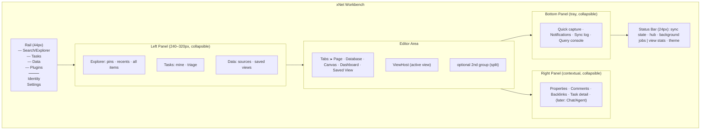
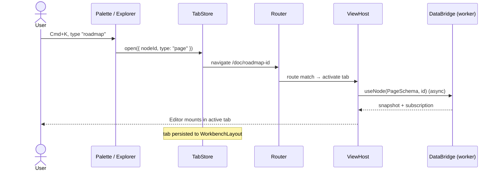
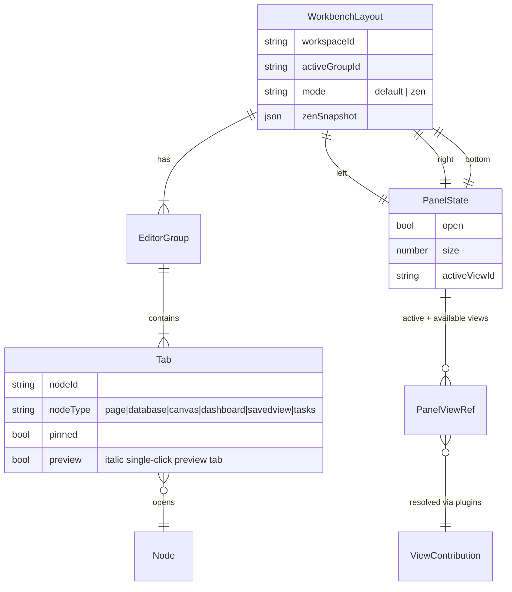

# Minimal Workbench Shell Redesign

## Problem Statement

xNet's UI grew view-by-view: a 52px header, a 260px left sidebar listing
documents by type, and a single content area that swaps between routes
(`/doc/$docId`, `/db/$dbId`, `/canvas/$canvasId`, `/tasks`, `/data`,
`/dashboard/$dashboardId`). Each surface — pages, databases, canvases, tasks,
dashboards, the data workspace — is individually capable, but the shell around
them is an afterthought. There are no tabs, no right panel, no bottom panel, no
status bar, no focus mode, and no consistent way to see two things at once or
drag content between surfaces that aren't simultaneously visible.

The ask: redesign the main app from scratch as a **workspace you live in all
day** — the way you live in VS Code, Slack, or a terminal running Claude Code.
Clean-slate on UI conventions; keep the primitives (pages, databases, canvases,
tasks, dashboards, saved views). The visual language should be radically
minimal — black on white, white on black — and should evoke simplicity,
elegance, refinement, clarity, quickness, lightness. The interaction model must
scale _down_ to "just me and one document" and _up_ to "three panels open,
five tabs, dragging a database row onto a canvas."

## Executive Summary

- **Adopt a VS Code-style workbench with fixed, named regions** — Rail
  (icon strip), Left Panel, Editor Area (tabbed, splittable), Right Panel
  (contextual), Bottom Panel (tray), Status Bar. Fixed regions beat free
  docking for all-day predictability: after one day, you always know where
  things are. Build on `react-resizable-panels` (a `ResizablePanel` primitive
  already exists in `packages/ui`); defer Dockview-style free docking.
- **Everything opens as a tab.** Pages, databases, canvases, dashboards, task
  boards, and saved views all become tabs in the editor area, backed by a
  `ViewHost` registry that maps node type → existing view component. The
  existing views (`DatabaseView`, `CanvasView`, `Editor`, `TasksView`,
  `DataWorkspaceView`) are kept nearly as-is; only the shell around them is
  rewritten. URLs keep working — the router drives the active tab.
- **Monochrome by design, not by accident.** Rebuild `packages/ui/src/theme/
tokens.css` as a single APCA-tuned gray ramp: ink on paper (light), paper on
  near-black `#0A0A0A` (dark — not pure `#000`, which kills elevation).
  Hierarchy comes from hairline borders, background dimming, and type
  weight/size — never drop shadows, almost never color. One restrained accent
  for focus/selection; hue is reserved for user data (status dots, charts),
  not chrome. Linear's principle: _structure should be felt, not seen_.
- **Keyboard-first with one palette.** Upgrade `GlobalSearch` (Cmd+K) into a
  cmdk-based universal palette: quick-open for nodes, `>` prefix for commands,
  shortcuts displayed inline (passive training, the Linear/Superhuman trick).
  The existing `CommandRegistry` in `packages/plugins` becomes the single
  source of truth for every action in the app.
- **One drag model.** Generalize the existing `CANVAS_INTERNAL_NODE_MIME` into
  an `application/x-xnet-node` payload carried by every draggable entity
  (sidebar item, tab, database row, task, canvas card, block). Drops create
  _references_, not copies (Muse's "excerpting" model): row → canvas makes a
  source-backed card, page → page makes a reference chip, anything → tab bar
  opens a tab, anything → edge of editor area opens a split.
- **Zen by default, density on demand.** Every region except the editor area
  collapses; Cmd+. toggles focus mode (chrome hidden, state preserved). The
  default first-run layout is deliberately spare — rail + editor + status bar
  — and the workspace _grows_ as you open panels, instead of starting busy.

## Current State In The Repository

### Shell

- `apps/web/src/App.tsx` (~850 lines) — storage init (OPFS SQLite via
  `WebSQLiteProxy`), identity/onboarding, worker-runtime flag from 0164, then
  `RouterProvider`. Orthogonal to the redesign; keep.
- `apps/web/src/routes/__root.tsx` (~113 lines) — the entire current shell:
  fixed 52px `<header>` (logo, `GlobalSearch`, hub status, theme toggle, DID
  snippet) + flex row of `<Sidebar>` and `<main>`. This is the file the
  redesign replaces.
- `apps/web/src/components/Sidebar.tsx` (~433 lines) — collapsible sections
  per node type (Pages, Databases, Canvases, Dashboards), 20-item pagination,
  "New" menu, drag-to-canvas via `CANVAS_INTERNAL_NODE_MIME`, an embedded
  `MyTasksPanel`. Functional but type-siloed; rewrite as a Left Panel view.
- Routing is TanStack Router, file-based (`apps/web/src/routeTree.gen.ts`).
  One route = one full-screen view; no concept of multiple open documents.
- **No status bar, no bottom panel, no right panel, no tabs, no focus mode.**
  Comments already render in a right-side sidebar _inside_ the page view
  (`apps/web/src/routes/doc.$docId.tsx`, ~739 lines) — evidence that a real
  shared Right Panel is wanted.

### Content views (the keepers)

| Surface        | Component                                                                                  | Size        | Verdict                                                      |
| -------------- | ------------------------------------------------------------------------------------------ | ----------- | ------------------------------------------------------------ |
| Pages          | `apps/web/src/components/Editor.tsx` + `routes/doc.$docId.tsx`                             | ~100 + ~739 | Keep; extract comments/properties into Right Panel           |
| Databases      | `apps/web/src/components/DatabaseView.tsx` + `packages/react/src/hooks/useGridDatabase.ts` | ~722 + 29KB | Keep; hook is the optimized critical path                    |
| Canvases       | `apps/web/src/components/CanvasView.tsx`                                                   | ~1570       | Keep; fold its ad-hoc toolbars into shell idioms             |
| Tasks          | `apps/web/src/components/TasksView.tsx`                                                    | ~393        | Keep; also surfaces as Left Panel view + Bottom Panel triage |
| Dashboards     | `apps/web/src/components/DashboardView.tsx`                                                | ~65 (stub)  | Build per 0162, inside the new shell from day one            |
| Data workspace | `apps/web/src/components/DataWorkspaceView.tsx` + `SavedViewRunner`                        | ~1046       | Keep; saved views become first-class tabs                    |

### Design system

- `packages/ui/src/theme/tokens.css` — HSL CSS variables, light
  (`0 0% 100%` bg / `0 0% 9%` text) and dark (`0 0% 7%` bg / `0 0% 95%`
  text), plus semantic blue/red/green/orange. Already _nearly_ monochrome;
  the redesign makes that intentional and removes decorative hue.
- `packages/ui/src/theme/ThemeProvider.tsx` — class-based light/dark/system
  with localStorage persistence. Keep.
- `packages/ui` primitives: Button, Command, Tabs, Sheet, ScrollArea, Menu,
  **ResizablePanel**, Popover, Tooltip, etc., on Radix/Base UI + Tailwind.
  The shell can be assembled almost entirely from existing primitives.

### Commands, plugins, data

- `packages/plugins/src/commands.ts` + `shortcuts.ts` — a real
  `CommandRegistry` with key chords, wired into `GlobalSearch` (Cmd+K) and
  `WorkspaceCommands`. Light today; becomes the backbone.
- `packages/plugins/src/contributions.ts` — `ViewContribution`,
  `CommandContribution`, `SidebarContribution`, `CanvasCardContribution`,
  `WidgetContribution`. The shell must render these, which means the new
  regions need stable contribution points (the VS Code "containers vs items"
  model).
- Data access is fully hook-based (`useQuery`, `useMutate`, `useNode` in
  `packages/react/src/hooks/`) over the `DataBridge`; 0164's worker-resident
  layer means the shell must assume **async-only** data access. Undo/redo via
  `packages/history`. Selection state is per-view with no global model.

### Prior explorations that constrain this one

- **0153 / 0158** — saved views (`SavedViewDescriptor` + `SavedViewRunner`)
  are the unit of "a query rendered some way"; presentation modes are
  query-level metadata. The shell should treat a saved view as openable
  content, equal to a page.
- **0161** — one canonical Task node projected into pages, databases,
  canvases, and `TasksView`. Explicitly missing: global task keyboard
  commands — which the new palette/shortcut layer supplies.
- **0162** — dashboards are a dedicated grid surface with widgets bound to
  `SavedViewDescriptor`s; widgets arrive via `WidgetContribution`.
- **0164** — all data access async; no `bridge.nodeStore` escape hatches in
  new shell code.
- **0160 (AI OS)** — chat, video, and agent surfaces are coming; the shell
  must have a place for them _now_ (Right Panel views and Bottom Panel tray)
  so they don't force another redesign later.

## External Research

### The workbench model (VS Code, Zed)

VS Code's UI is six named regions — Activity Bar, Primary Sidebar, Secondary
Sidebar, Editor Groups, Panel, Status Bar — documented in the
[user interface docs](https://code.visualstudio.com/docs/getstarted/userinterface)
and the [UX guidelines](https://code.visualstudio.com/api/ux-guidelines/overview).
Two load-bearing ideas:

1. **Containers vs items.** Extensions contribute _items_ (views, commands,
   status entries) into fixed _containers_; they cannot invent new chrome.
   This is why a decade of extensions hasn't dissolved VS Code's coherence.
2. **Constrained, not free-form.** Panels resize and views move between
   sidebars, but regions are fixed. Users have asked for free docking for
   years ([vscode#118692](https://github.com/microsoft/vscode/issues/118692));
   the team holds the line because predictability is the feature. The status
   bar even encodes scope spatially: workspace-level info on the left,
   file-level on the right.

Zed ([Between Editors and IDEs](https://zed.dev/blog/between-editors-and-ides))
pushes the same philosophy further: hide functionality until needed (their
Tesla-door-handle metaphor), treat performance as architecture, auto-disable
slow extensions. **Zen Mode** (Cmd+K Z) is the canonical escape hatch — all
chrome gone, one gesture in, one gesture out, no state loss.

### Monochrome that feels premium (Linear, iA, Vercel, shadcn)

Linear's two design retrospectives
([redesign part II](https://linear.app/now/how-we-redesigned-the-linear-ui),
[a calmer interface](https://linear.app/now/behind-the-latest-design-refresh))
are the best documentation of making near-monochrome feel expensive:

- LCH color space so grays are _perceptually_ uniform; their theme collapsed
  from 98 variables to three (base, accent, contrast).
- **"Structure should be felt, not seen"** — borders softened to whispers,
  the sidebar dimmed several notches below content so the work dominates.
- Fewer icons, smaller icons, surgical alignment. The things users "feel
  after a few minutes" are spacing and alignment, not features.

shadcn/ui demonstrates the same with 1px light-gray borders instead of
shadows; Vercel's [Geist](https://vercel.com/geist/introduction) shows
monochrome + mono type as a brand position ("monochrome precision");
iA Writer ([perfect writing font](https://ia.net/topics/in-search-of-the-perfect-writing-font))
argues monospace signals _work in progress_ — right for data and IDs, wrong
for prose. Berkeley Mono's adoption (Perplexity, US Graphics) shows mono as a
credibility signal in technical products.

What separates "premium monochrome" from "unfinished gray": pixel-accurate
alignment, a disciplined 3-role type scale (UI sans, prose sans, data mono),
hairline borders at low contrast, and elevation via _dimming_ rather than
shadow stacks.

### Pure black vs near black

OLED true-black saves 5–20% power but flattens elevation — every surface at
`#000` looks like the same surface
([Android Authority](https://www.androidauthority.com/true-black-dark-mode-1003537/),
[XDA](https://www.xda-developers.com/amoled-black-vs-gray-dark-mode/)).
Material, VS Code, and Linear all use near-black (`#121212`-ish) so panels
can be 3–5 lightness points apart. WCAG ratios overestimate dark-mode
contrast by up to 200–250%; [APCA](https://git.apcacontrast.com/documentation/APCA_in_a_Nutshell.html)
Lc values are the correct design tool: Lc 90 body text, Lc 75 minimum body,
Lc 45 large headings, Lc 30 placeholders, Lc 15 hairlines.

### Layout libraries

- [react-resizable-panels](https://github.com/bvaughn/react-resizable-panels)
  — constrained panel groups, tiny, the engine behind shadcn's Resizable.
  Right for fixed-region shells.
- [Dockview](https://dockview.dev/) — zero-dep full docking (floating panels,
  popout windows, drag-anywhere tabs, layout serialization). The best
  free-docking option _if_ we ever want it; overkill for v1.
- Golden Layout / FlexLayout / react-mosaic — older or more opinionated;
  no advantage over the two above for this design.

### Command palette

[cmdk](https://cmdk.paco.me/) is the de facto standard (Linear, Vercel,
Raycast web). Patterns worth copying: instant focus on open, fuzzy match,
shortcuts rendered beside items (Linear's
[keyboard-first training loop](https://gunpowderlabs.com/2024/12/22/linear-delightful-patterns)),
recents weighted first, Escape restores prior focus.
[Superhuman](https://blakecrosley.com/guides/design/superhuman) targets 50ms
perceived latency — "the difference between fast and feels-like-thought."

### Heterogeneous drag-and-drop

Notion standardized the six-dot handle + insertion-line model. Ink & Switch's
[Muse research](https://www.inkandswitch.com/muse/) contributes two ideas we
adopt: the **shelf** (a temporary holding area for content in transit between
contexts) and **excerpting** (dragging creates a first-class _reference_ with
a wormhole back to its source, never a copy).
[tldraw](https://tldraw.dev/) shows canvases can host arbitrary live DOM —
which xNet's canvas already does with query frames and provider embeds.

## Key Findings

1. **The redesign is a shell rewrite, not an app rewrite.** Every expensive
   surface (canvas, grid, editor, saved-view runner) survives intact. The
   files actually being replaced — `__root.tsx` (113 lines) and `Sidebar.tsx`
   (433 lines) — are small. The work is in the new layout state model, tabs,
   panels, tokens, and keyboard layer, not in porting views.
2. **xNet already has the skeleton of every subsystem the workbench needs**:
   a command registry with chords, a Cmd+K palette, plugin contribution
   points (including `SidebarContribution`), a `ResizablePanel` primitive, a
   theme provider, drag MIME types, and async data hooks. Nothing is started
   from zero; everything is promoted from "feature of one view" to "property
   of the shell."
3. **Fixed regions are the right call.** The strongest prior art
   (VS Code) deliberately refuses free docking, and the complaint traffic it
   generates is dwarfed by the predictability it buys. xNet's content types
   map cleanly onto regions; Dockview-class docking can be revisited if real
   demand appears.
4. **Tabs are the missing primitive.** Almost every "complicated scenario"
   in the brief — drag between surfaces, multiple files, transitions between
   focused and multi-panel work — reduces to "more than one document open at
   once." Tabs + one optional split deliver 90% of it; the full editor-group
   grid can wait.
5. **The current tokens are 80% of the way to the target visual language.**
   Backgrounds and text are already neutral HSL grays. The remaining 20% —
   removing decorative hue, an APCA-tuned ramp, hairline borders, dimmed
   chrome, a real type scale with a mono role — is what makes it feel
   designed rather than default.
6. **Contextual UI is currently trapped inside views.** Comments live inside
   the page route; canvas has private toolbars/property panels; the grid has
   its own config popovers. A shared Right Panel (contextual to the active
   tab) and Bottom Panel give this UI a home and make the views themselves
   _simpler_ than they are today.
7. **Future surfaces (chat, agents, video, plugins) need slots now.** The
   VS Code containers/items lesson: define the contribution points
   (rail items, panel views, status items, palette commands, widgets) before
   third parties arrive, or coherence is unrecoverable.

## Options And Tradeoffs

### Option A — Restyle in place

Keep header + sidebar + routed single view; apply the monochrome token
overhaul, typography, and polish.

- **Pros:** cheapest; zero interaction-model risk; ships in days.
- **Cons:** delivers none of the brief's UX goals — no tabs, no panels, no
  side-by-side, no focus mode, no home for chat/agents. The "workspace you
  live in" remains a website you visit.

### Option B — Fixed-region workbench (recommended)

New shell: Rail, collapsible Left/Right/Bottom panels on
`react-resizable-panels`, tabbed editor area with one optional split, status
bar, Zen mode, palette upgrade, unified drag. Views mount unchanged through a
`ViewHost` registry.

- **Pros:** the VS Code-validated model for all-day apps; predictable;
  contribution points fall out naturally; incremental (regions ship one at a
  time behind the existing route system); keeps every expensive view.
- **Cons:** real work in layout state, tab/session persistence, and
  keyboard-focus management across panels; tabs change the navigation mental
  model and need careful URL integration.

### Option C — Full docking workbench (Dockview)

Everything in B, plus drag-anywhere tabs, floating panels, popout windows.

- **Pros:** maximum power-user flexibility; layout serialization built in.
- **Cons:** cognitively expensive (users must remember what they built);
  fights the minimal aesthetic; harder to make plugin contributions
  predictable; VS Code's own history argues against it. Revisit later — B's
  region model doesn't preclude swapping the editor area onto Dockview.

### Sub-decision: navigation model in the Left Panel

|              | Type-siloed lists (today) | Unified explorer + quick-open                                                 |
| ------------ | ------------------------- | ----------------------------------------------------------------------------- |
| Mental model | "Where are my databases"  | "Everything is a node; search, recents, pins"                                 |
| Scales to    | dozens of nodes           | thousands of nodes                                                            |
| Prior art    | early Notion              | VS Code (Explorer + Cmd+P), Linear                                            |
| Verdict      | retire                    | **adopt**: pinned section, recents, then an All Items tree filterable by type |

### Sub-decision: dark mode base

True black `#000` maximizes the "white on black" brief and OLED battery but
destroys layering. **Recommendation:** near-black `#0A0A0A` base with
elevation steps (`#111`, `#161616`) and hairlines; ship an optional
"True Black" theme variant where all surfaces collapse to `#000` and
hairlines alone carry structure — it's a one-token override under the new
ramp, and OLED users get their wish.

### Sub-decision: where do tasks live?

Tasks are a projection, not a place (0161). In the new shell they get three
homes: a Left Panel **Tasks view** (my tasks, triage), full **TasksView as a
tab** (board/list), and the Bottom Panel **tray** for quick capture and
notifications. No change to the data model.

## Recommendation

Build Option B: the **xNet Workbench**.



### The regions, precisely

1. **Rail** — 44px icon strip, monochrome line icons, no labels. Top: Search
   (opens palette), Explorer, Tasks, Data, Plugins (contributed rail items
   slot here). Bottom: identity avatar (DID), settings. Replaces both the
   header's nav role and the sidebar's section headers. Clicking the active
   rail item toggles the Left Panel — the VS Code muscle memory.
2. **Left Panel** — one view at a time, chosen by the rail. The Explorer
   view replaces `Sidebar.tsx`: Pinned, Recent, then All Items (unified,
   type-filterable, virtualized). Every row drags.
3. **Editor Area** — tab bar + `ViewHost`. Tabs are persistent per
   workspace (restored on reload), middle-click closes, drag to reorder,
   drag _out_ to the left/right edge to create the second group. Cmd+click
   in Explorer opens without focusing (background tab). The router stays
   authoritative: navigating to `/doc/x` activates (or opens) its tab, so
   deep links, back/forward, and old bookmarks all keep working.
4. **Right Panel** — _contextual_: its content is supplied by the active
   tab's view via a `useContextPanel` contribution (page → properties,
   comments, backlinks; database → row detail, field config; canvas →
   selection inspector; task → task detail). This is where the doc route's
   embedded comments sidebar moves, and where chat/agent surfaces will dock.
5. **Bottom Panel** — the tray: quick task capture, notifications, sync
   activity (surfacing what the status bar summarizes), and a query console
   for power users (run a `QueryAST`, get a table — the "terminal" of a data
   workspace).
6. **Status Bar** — 24px, mono type. Left = workspace scope: sync state,
   hub connection, background jobs (import progress), worker-runtime flag.
   Right = view scope: word count / row count / zoom %, theme toggle.
   Ambient, glanceable, never modal.

### Layout state machine

```mermaid
stateDiagram-v2
    [*] --> Default
    Default: Default — rail + editor + status (panels closed)
    Working: Working — any combination of panels open
    Zen: Zen — editor only, all chrome hidden
    Default --> Working: open panel (rail click / Cmd+B / Cmd+J / Cmd+\\)
    Working --> Default: close panels
    Working --> Zen: Cmd+.
    Default --> Zen: Cmd+.
    Zen --> Working: Cmd+. / Esc Esc (restores exact prior layout)
    note right of Zen
        Layout snapshot saved on entry;
        restored bit-for-bit on exit.
    end note
```

Panel sizes, open/closed state, active left view, open tabs, and active tab
persist to localStorage per workspace (a `WorkbenchLayout` document), so the
app reopens exactly as you left it — table stakes for an all-day tool.

### Opening content (sequence)



### Shell state model



### Visual language

**Tokens.** One gray ramp per mode, named by role and tuned by APCA Lc, in
`packages/ui/src/theme/tokens.css`:

| Role                            | Light     | Dark      | APCA target |
| ------------------------------- | --------- | --------- | ----------- |
| `--surface-0` editor bg         | `#FFFFFF` | `#0A0A0A` | —           |
| `--surface-1` panels/sidebar    | `#FAFAFA` | `#111111` | —           |
| `--surface-2` tray/status/hover | `#F4F4F4` | `#161616` | —           |
| `--ink-1` primary text          | `#111111` | `#EDEDED` | ≥ Lc 90     |
| `--ink-2` secondary text        | `#555555` | `#9A9A9A` | ≥ Lc 60     |
| `--ink-3` placeholder/disabled  | `#8F8F8F` | `#5C5C5C` | ≥ Lc 30     |
| `--hairline` borders            | `#E5E5E5` | `#222222` | ~ Lc 15     |
| `--accent` focus/selection only | `#111111` | `#EDEDED` | —           |

Chrome (panels, rail, tray) sits on `--surface-1/2` with `--ink-2` text —
_dimmer than the work_, per Linear. The editor area is the only `--surface-0`
region. No shadows anywhere except the modal scrim. Semantic red/green
survive only as 6px status dots and chart hues — data may have color; chrome
may not. The "True Black" variant overrides three surface tokens to `#000`.

**Type.** Three roles: UI sans (Inter, 13px base, tight tracking), prose sans
(Inter, 16px in the editor), data mono (Geist Mono or Berkeley-class, for IDs,
table cells of numeric/code fields, the status bar, the query console).
Weight and size carry all hierarchy.

**Motion.** 120–150ms ease-out panel slides and tab transitions; zero motion
on data updates. Quickness is the aesthetic: palette opens in one frame,
focus lands before the animation finishes.

**Keyboard map (core).** Cmd+K palette · Cmd+P quick-open (same palette,
node mode) · Cmd+B left panel · Cmd+\ right panel (matching the comments
toggle habit) · Cmd+J bottom tray · Cmd+. zen · Cmd+T new page · Cmd+W close
tab · Ctrl+Tab next tab · Cmd+1/2 focus editor group. Every command in the
registry, every registry entry in the palette, every palette row showing its
chord.

### Migration path (no big bang)

The shell ships as a new `Workbench` component replacing `__root.tsx`'s
layout while routes stay untouched — each phase is independently shippable
and the old sidebar can remain behind a flag (`xnet:shell=workbench`) during
rollout, mirroring the 0164 flag pattern.

## Example Code

**Shell skeleton** (`apps/web/src/workbench/Workbench.tsx`):

```tsx
import { Panel, PanelGroup, PanelResizeHandle } from 'react-resizable-panels'
import { useWorkbench } from './state'

export function Workbench({ children }: { children: React.ReactNode }) {
  const wb = useWorkbench() // zustand store, persisted per workspace
  if (wb.mode === 'zen') return <ZenSurface>{children}</ZenSurface>
  return (
    <div className="flex h-dvh flex-col bg-surface-1 text-ink-1">
      <div className="flex min-h-0 flex-1">
        <Rail />
        <PanelGroup direction="horizontal" autoSaveId={`wb:${wb.workspaceId}:h`}>
          {wb.left.open && (
            <>
              <Panel defaultSize={18} minSize={12} maxSize={32}>
                <PanelViewHost slot="left" activeViewId={wb.left.activeViewId} />
              </Panel>
              <PanelResizeHandle className="w-px bg-hairline" />
            </>
          )}
          <Panel>
            <PanelGroup direction="vertical" autoSaveId={`wb:${wb.workspaceId}:v`}>
              <Panel>
                <EditorArea>{children}</EditorArea> {/* tab bar + router outlet */}
              </Panel>
              {wb.bottom.open && (
                <>
                  <PanelResizeHandle className="h-px bg-hairline" />
                  <Panel defaultSize={25} minSize={10}>
                    <PanelViewHost slot="bottom" activeViewId={wb.bottom.activeViewId} />
                  </Panel>
                </>
              )}
            </PanelGroup>
          </Panel>
          {wb.right.open && (
            <>
              <PanelResizeHandle className="w-px bg-hairline" />
              <Panel defaultSize={20} minSize={14} maxSize={36}>
                <ContextPanel /> {/* fed by the active tab via useContextPanel */}
              </Panel>
            </>
          )}
        </PanelGroup>
      </div>
      <StatusBar />
    </div>
  )
}
```

**Tab model + view registry** (`apps/web/src/workbench/tabs.ts`):

```ts
export interface WorkbenchTab {
  id: string
  nodeId: string
  nodeType: 'page' | 'database' | 'canvas' | 'dashboard' | 'savedview' | 'tasks'
  pinned: boolean
  preview: boolean // single-click opens preview tab; edit or double-click promotes
}

// Maps a tab to the existing, unmodified view component.
export const VIEW_HOSTS: Record<WorkbenchTab['nodeType'], ViewHostEntry> = {
  page: { component: PageView, toRoute: (id) => `/doc/${id}` },
  database: { component: DatabaseView, toRoute: (id) => `/db/${id}` },
  canvas: { component: CanvasView, toRoute: (id) => `/canvas/${id}` },
  dashboard: { component: DashboardView, toRoute: (id) => `/dashboard/${id}` },
  savedview: { component: SavedViewTab, toRoute: (id) => `/view/${id}` },
  tasks: { component: TasksView, toRoute: () => `/tasks` }
}
```

**Unified drag payload** (`packages/ui/src/dnd/node-transfer.ts`):

```ts
export const XNET_NODE_MIME = 'application/x-xnet-node'

export interface NodeTransfer {
  nodeId: string
  nodeType: string
  sourceContext: 'explorer' | 'tab' | 'grid-row' | 'canvas-card' | 'task' | 'block'
}

export function setNodeTransfer(e: DragEvent, t: NodeTransfer) {
  e.dataTransfer?.setData(XNET_NODE_MIME, JSON.stringify(t))
  e.dataTransfer?.setData('text/plain', `xnet://${t.nodeType}/${t.nodeId}`) // degrade gracefully
}
// Drops are reference-creating, never copying:
//   → canvas: source-backed card    → page: reference chip/embed block
//   → tab bar: open as tab          → editor edge: open in split
//   → database relation cell: link  → bottom tray: add to shelf
```

**Token excerpt** (`packages/ui/src/theme/tokens.css`):

```css
:root,
.light {
  --surface-0: #ffffff;
  --surface-1: #fafafa;
  --surface-2: #f4f4f4;
  --ink-1: #111111;
  --ink-2: #555555;
  --ink-3: #8f8f8f;
  --hairline: #e5e5e5;
  --accent: #111111;
}
.dark {
  --surface-0: #0a0a0a;
  --surface-1: #111111;
  --surface-2: #161616;
  --ink-1: #ededed;
  --ink-2: #9a9a9a;
  --ink-3: #5c5c5c;
  --hairline: #222222;
  --accent: #ededed;
}
.dark[data-variant='true-black'] {
  --surface-0: #000000;
  --surface-1: #000000;
  --surface-2: #0a0a0a;
}
```

## Risks And Open Questions

- **Focus management across regions** is the hardest engineering problem:
  Escape, Cmd+W, and arrow keys must do the right thing whether focus is in
  the grid, the canvas, the palette, or a panel. Needs a shell-level focus
  ring (an ordered list of focusable regions) and per-view focus traps.
  Budget real time here.
- **Tabs × Yjs documents:** N open tabs = N live Y.Doc subscriptions.
  Background tabs should downgrade to snapshot-only (no awareness, no live
  decoration) and rehydrate on focus; otherwise memory and sync chatter grow
  with tab count. Interacts with 0164's worker runtime — verify subscription
  cost in worker mode.
- **URL ↔ tab-session divergence:** two sources of truth (router history,
  tab store) can disagree after restore. Decision needed: router is
  authoritative, tab store is a _view_ of history (recommended), with
  back/forward moving between tabs rather than within an opaque stack.
- **Canvas inside a resizable split** — `CanvasView` (1570 lines) assumes
  full-bleed sizing in places; viewport math and culling need a resize-aware
  pass.
- **Right Panel contention:** comments, properties, backlinks, and (later)
  chat all want the same panel. Accordion vs tabs-within-panel vs "last one
  wins"? Recommendation: panel-local tabs, max ~4, contributed not hardcoded
  — but validate with use.
- **How minimal is too minimal?** A 44px icon rail with no labels has a
  discoverability cost for new users. Mitigations: first-run tour, tooltips
  with chords, and the palette as universal fallback. Watch onboarding drop-off.
- **Electron/Expo divergence** (`apps/electron`, `apps/expo`): the workbench
  is desktop-web-first. Mobile gets rail→bottom-nav (a `BottomNav` primitive
  already exists in `packages/ui`) and single-tab behavior; defer.
- **Open:** do dashboards (0162) eventually become the _default_ tab (the
  "home" of the workspace)? The shell shouldn't decide this — it just needs
  a configurable startup tab.

## Implementation Checklist

Phase 0 — Foundations

- [x] Rebuild `packages/ui/src/theme/tokens.css` as the role-named monochrome
      ramp (surface/ink/hairline/accent), APCA-checked, with `true-black`
      variant; migrate Tailwind config mappings
- [x] Establish the 3-role type scale (UI sans / prose sans / data mono) and
      add the mono font asset
- [x] Sweep `packages/ui` primitives for shadow/hue usage; replace with
      hairline + dimming idioms

Phase 1 — Shell skeleton

- [x] Create `apps/web/src/workbench/` with `Workbench.tsx`, `Rail`,
      `StatusBar`, `PanelViewHost`, and a persisted zustand `useWorkbench`
      store (layout, panel sizes, mode, zen snapshot)
- [x] Replace `__root.tsx` layout with `Workbench` behind a
      `xnet:shell=workbench` flag; old shell remains the fallback
- [x] Status bar v1: sync state, hub connection, background jobs (left);
      view stats + theme toggle (right)
- [x] Zen mode (Cmd+.) with layout snapshot/restore

Phase 2 — Tabs

- [x] Tab store + tab bar in the editor area; router-authoritative
      activation; session persistence and restore
- [x] Preview-tab semantics (single click = preview, edit promotes), pin,
      reorder, middle-click close, Ctrl+Tab cycling
- [x] One optional split (second editor group) via drag-to-edge and ⌘⇧\
- [x] Background-tab subscription downgrade for Y.Doc-backed views
      (background tabs are unmounted entirely — zero live subscriptions)

Phase 3 — Panels

- [x] Left Panel: Explorer view (pinned / recent / all-items virtualized
      tree, type filters) replacing `Sidebar.tsx`; Tasks view; Data view
- [x] Right Panel: `useContextPanel` contribution API; move page comments
      and properties out of `doc.$docId.tsx`; database row detail; canvas
      selection inspector; task detail
- [x] Bottom Panel tray: quick capture, notifications, sync activity, query
      console (QueryAST → table)

Phase 4 — Keyboard & palette

- [ ] Rebuild `GlobalSearch` on cmdk: node quick-open + `>` command mode,
      recents-first, chords rendered per row
- [ ] Register the full core keyboard map in `CommandRegistry`; shell-level
      focus ring and per-region focus traps
- [ ] Palette latency budget: open + focused < 50ms

Phase 5 — Drag everywhere

- [ ] `XNET_NODE_MIME` transfer module in `packages/ui`; adopt in Explorer,
      tabs, grid rows, tasks, canvas cards, editor blocks
- [ ] Reference-creating drop handlers: canvas card, page chip, relation
      link, tab open, split open
- [ ] Shelf (Muse-style holding area) in the bottom tray for multi-step moves

Phase 6 — Extensibility & flip

- [ ] Contribution points for rail items, panel views, status items, palette
      commands; wire `SidebarContribution`/`WidgetContribution` through
- [ ] Mount `DashboardView` (0162 build-out) and `DataWorkspaceView` as
      first-class tabs; configurable startup tab
- [ ] Remove the flag, delete the old shell, update `docs/`

## Validation Checklist

- [ ] Cold start to interactive editor < 1.5s; palette opens focused < 50ms;
      panel toggles < 1 frame of layout jank (measure with the perf harness
      from 0163)
- [ ] Layout, tabs, and active view survive reload bit-for-bit (including
      zen-mode exit restoring the prior layout)
- [ ] Deep links (`/doc/x`, `/db/y`), back/forward, and old bookmarks behave
      identically to the current shell
- [ ] Every shell action reachable by keyboard alone; a full
      open-edit-comment-triage session completed without the mouse
- [ ] APCA spot-checks: body ≥ Lc 75, secondary ≥ Lc 60, hairlines ≈ Lc 15 in
      both modes; WCAG AA still passes for compliance
- [ ] Drag matrix passes: explorer→canvas, grid-row→canvas, task→page,
      page→relation cell, anything→tab-bar, anything→split-edge — all create
      references, never copies
- [ ] 10 open tabs (2 canvases, 3 pages, 3 databases, dashboard, tasks):
      memory stable, background tabs idle (no live Y.Doc traffic), in both
      main-thread and worker runtimes
- [ ] Existing e2e suites for pages/databases/canvases/tasks pass unmodified
      under the workbench flag
- [ ] First-run experience: a new user creates a page, opens a second item in
      a tab, and finds the palette without instruction (hallway test ≥ 4/5)

## References

- VS Code — [User Interface](https://code.visualstudio.com/docs/getstarted/userinterface) ·
  [UX Guidelines](https://code.visualstudio.com/api/ux-guidelines/overview) ·
  [Custom Layout](https://code.visualstudio.com/docs/configure/custom-layout) ·
  [free-docking request #118692](https://github.com/microsoft/vscode/issues/118692)
- Zed — [Between Editors and IDEs](https://zed.dev/blog/between-editors-and-ides)
- Linear — [How we redesigned the Linear UI](https://linear.app/now/how-we-redesigned-the-linear-ui) ·
  [A calmer interface](https://linear.app/now/behind-the-latest-design-refresh) ·
  [Delightful patterns (Gunpowder Labs)](https://gunpowderlabs.com/2024/12/22/linear-delightful-patterns)
- iA — [In Search of the Perfect Writing Font](https://ia.net/topics/in-search-of-the-perfect-writing-font)
- Vercel — [Geist](https://vercel.com/geist/introduction) · [shadcn/ui](https://ui.shadcn.com/)
- Layout — [react-resizable-panels](https://github.com/bvaughn/react-resizable-panels) ·
  [Dockview](https://dockview.dev/) ·
  [npm trends comparison](https://npmtrends.com/dockview-vs-flexlayout-react-vs-golden-layout-vs-rc-dock)
- Palette — [cmdk](https://cmdk.paco.me/) ·
  [Superhuman speed](https://blakecrosley.com/guides/design/superhuman)
- Drag/canvas — [Ink & Switch: Muse](https://www.inkandswitch.com/muse/) ·
  [tldraw](https://tldraw.dev/) ·
  [Notion editing basics](https://www.notion.com/help/writing-and-editing-basics) ·
  [Figma multiplayer](https://www.figma.com/blog/how-figmas-multiplayer-technology-works/)
- Contrast — [APCA in a Nutshell](https://git.apcacontrast.com/documentation/APCA_in_a_Nutshell.html) ·
  [true-black tradeoffs](https://www.androidauthority.com/true-black-dark-mode-1003537/)
- Internal — explorations 0153, 0158, 0159, 0160 (AI OS), 0161, 0162, 0163,
  0164; `apps/web/src/routes/__root.tsx`; `apps/web/src/components/Sidebar.tsx`;
  `packages/ui/src/theme/tokens.css`; `packages/plugins/src/contributions.ts`
