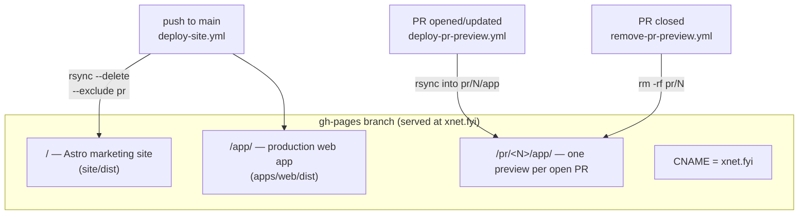
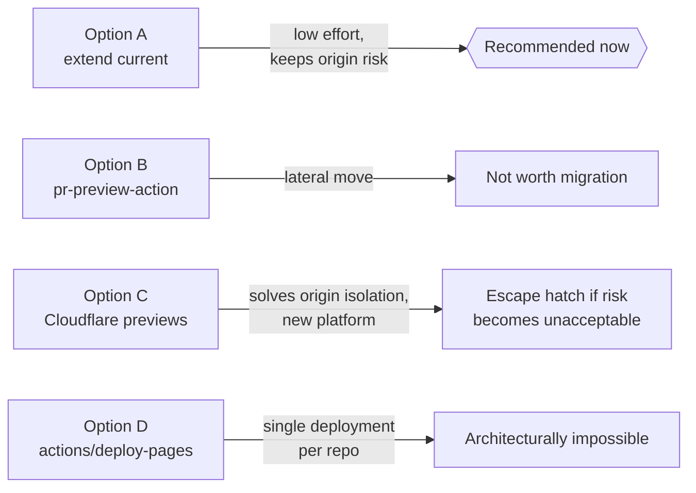
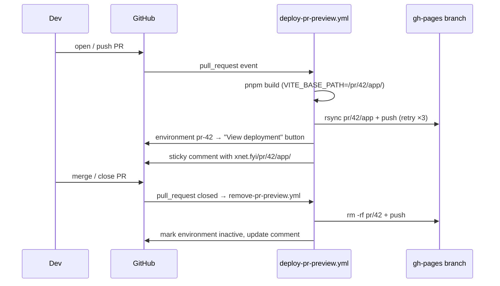
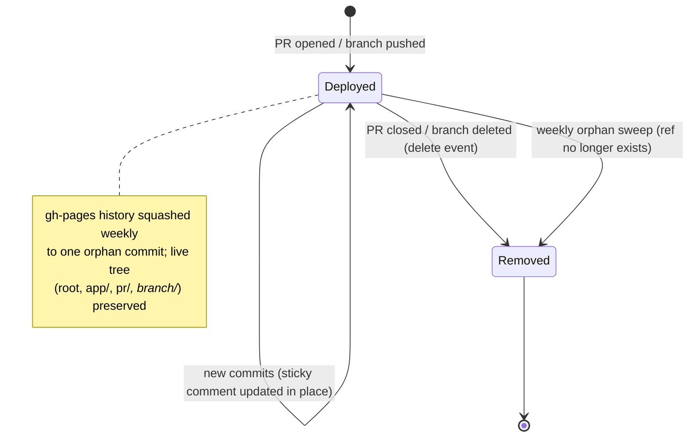

# Per-PR And Per-Branch GitHub Pages Preview Deploys

## Problem Statement

PRs should automatically link to live review servers — a deployed copy of the
React app per PR (and ideally per branch) hosted on GitHub Pages, without
disturbing the existing production deployment for `main`. When a PR is opened,
automation should attach the preview link to the PR so reviewers can click
straight into a running build.

## Executive Summary

> **Status (2026-06-12): the current deployment workflow is buggy and needs
> work — implementation of the fixes below is in progress.** The defects are
> concrete, not hypothetical: the preview workflows push to `gh-pages` with no
> retry, so any two concurrent writers (two PR updates, or a merge firing
> `remove-pr-preview` alongside `deploy-site`) race and one run fails with a
> rejected push — the same failure class that broke the production deploy
> twice on 2026-06-12 before commit `7decfc3c` added a retry loop to
> deploy-site.yml only. On top of that, `gh-pages` history grows without bound
> (every deploy commits a full set of hashed bundles), and previews share
> production's browser-storage origin (see the security finding below). The
> Implementation Checklist tracks the fixes.

**The core ask is already implemented and live on `main`.** Commit `ceef02d4`
("ci(pages): add branch-backed PR previews") shipped
[deploy-pr-preview.yml](../../.github/workflows/deploy-pr-preview.yml), which
builds the web app for every PR push, publishes it to
`https://xnet.fyi/pr/<number>/app/` on the `gh-pages` branch, and posts a
sticky comment with the link. [remove-pr-preview.yml](../../.github/workflows/remove-pr-preview.yml)
deletes the preview when the PR closes. The production deploy
([deploy-site.yml](../../.github/workflows/deploy-site.yml)) excludes `pr/`
from its `rsync --delete`, so the two coexist safely.

What remains is the delta, in descending value-per-effort:

1. **Native PR deployment links** — add an `environment:` block so GitHub
   renders its own "View deployment" button in the PR UI alongside the sticky
   comment. ~5 lines.
2. **Per-branch previews** — a new `push`-triggered workflow deploying every
   non-`main` branch to `branch/<safe-name>/app/`, with cleanup on the
   `delete` event and a periodic orphan sweep. Branch names need sanitizing
   (`feat/foo` → `feat-foo`).
3. **Hardening the existing system** — the preview deploy lacks the push-retry
   loop the production deploy has (two concurrent PR previews can race and
   fail), and `gh-pages` accumulates a full copy of every hashed bundle in
   history forever (GitHub recommends ≤1 GB repos; a periodic history squash
   fixes this).
4. **A real security finding** — previews at `xnet.fyi/pr/N/app/` share an
   _origin_ with production `xnet.fyi/app/`. The passkey identity store
   (`xnet-identity` IndexedDB database,
   [storage.ts:7](../../packages/identity/src/passkey/storage.ts)) is readable
   and writable by any preview build. A buggy or malicious PR build can corrupt
   or read production user data. Mitigation options below.

Recommendation: keep the current gh-pages-subdirectory architecture (Option A),
add the four items above incrementally, and treat a move to Cloudflare Pages
(Option C) as the escape hatch if origin isolation ever becomes a hard
requirement.

## Current State In The Repository

### The gh-pages tree today



### Workflow inventory

| Workflow                                                               | Trigger                                    | What it does                                                                                                                                                   |
| ---------------------------------------------------------------------- | ------------------------------------------ | -------------------------------------------------------------------------------------------------------------------------------------------------------------- |
| [deploy-site.yml](../../.github/workflows/deploy-site.yml)             | push to `main` (site/app/package paths)    | Builds Astro site + web app (`VITE_BASE_PATH=/app/`), rsyncs to gh-pages root with `--exclude pr`, retries push 3× to survive races with preview pushes        |
| [deploy-pr-preview.yml](../../.github/workflows/deploy-pr-preview.yml) | `pull_request` opened/synchronize/reopened | Builds web app with `VITE_BASE_PATH=/pr/<N>/app/`, rsyncs into `pr/<N>/app/`, posts/updates a sticky comment (`<!-- xnet-pr-preview -->` marker) with the link |
| [remove-pr-preview.yml](../../.github/workflows/remove-pr-preview.yml) | `pull_request` closed                      | Deletes `pr/<N>/` from gh-pages, updates the sticky comment                                                                                                    |
| [undeploy-site.yml](../../.github/workflows/undeploy-site.yml)         | manual                                     | Replaces the whole site with an offline placeholder                                                                                                            |

Key plumbing that makes per-path deploys possible:

- [vite.config.ts:9](../../apps/web/vite.config.ts) — `const basePath = process.env.VITE_BASE_PATH || '/'`, so any subdirectory works as a mount point.
- [App.tsx:48](../../apps/web/src/App.tsx) — `VITE_USE_HASH_ROUTER === 'true'` switches to hash routing, sidestepping GitHub Pages' lack of SPA rewrites (plus the `404.html` copy as a belt-and-braces fallback).
- Concurrency groups are already partitioned correctly: production uses `pages-production` (`cancel-in-progress: false`), previews use `pages-preview-<N>` per PR — a lesson learned the hard way per the comment in deploy-site.yml ("a 'Remove PR Preview' run fired by the same merge cancelled the production deploy").
- Fork PRs are excluded (`if: github.event.pull_request.head.repo.full_name == github.repository`), which is the correct security posture — see Risks.

### Known gaps in the current implementation

1. **No push retry in the preview workflows.** deploy-site.yml retries its push
   3× because "a preview workflow can push gh-pages between our fetch and
   push" — but deploy-pr-preview.yml and remove-pr-preview.yml have no such
   loop. Two PRs updating simultaneously (or a preview racing the production
   deploy) will fail one run with a rejected push. Per-PR concurrency groups
   don't protect across _different_ PRs. Adding branch previews multiplies the
   writers and makes this race more frequent.
2. **No native deployment record.** The sticky comment works, but GitHub's
   built-in "View deployment" button (driven by the Deployments API /
   `environment:` key) is free and renders in the PR header and timeline.
3. **gh-pages history grows without bound.** Every deploy commits a full set of
   content-hashed JS bundles. The live tree stays small, but the git history
   keeps every version of every bundle. GitHub soft-limits repos at 1 GB;
   projects deploying several times daily have hit multi-GB pack files within
   a year.
4. **Same-origin storage sharing** (see Risks — this is the most important
   finding in this document).

## External Research

### Prior art for Pages-hosted PR previews

- **[rossjrw/pr-preview-action](https://github.com/rossjrw/pr-preview-action)**
  (v1.8.1) — does almost exactly what our custom workflow does: git-worktree
  checkout of `gh-pages`, copy into an umbrella `pr-preview/pr-<N>/` directory,
  push, sticky comment (via `marocchino/sticky-pull-request-comment`, with QR
  codes since v1.8), cleanup on `closed`. PR-only — no branch previews. No fork
  support in v1.x for the same token-permission reason we skip forks. Our
  hand-rolled version is functionally equivalent, so adopting it would be a
  lateral move.
- **[JamesIves/github-pages-deploy-action](https://github.com/JamesIves/github-pages-deploy-action)** —
  general-purpose primitive with `target-folder:` and `clean-exclude:`; would
  replace our worktree/rsync shell with maintained code, but comments and
  cleanup remain DIY.
- **[peaceiris/actions-gh-pages](https://github.com/peaceiris/actions-gh-pages)** —
  `destination_dir` + `keep_files: true` covers subdirectory deploys, but
  `keep_files` is incompatible with `force_orphan` (its history-bloat fix), so
  it can't solve our growth problem while hosting multiple previews.
- **[rajyan/preview-pages](https://github.com/rajyan/preview-pages)** — the
  rare action with explicit per-_branch_ support (`branch/<name>/` on push
  events), validating the layout proposed below.

### Why the "official" Pages deploy can't do this

`actions/deploy-pages` (the artifact-based deployment GitHub now defaults to)
allows exactly **one live deployment per repository** — each invocation
atomically replaces the entire published site with one uploaded artifact.
There is no subdirectory targeting. Hosting N previews that way would mean
rebuilding and re-uploading production + all previews as a single artifact on
every push. The branch-based approach (push to `gh-pages`, Pages serves the
branch) is the only sane way to multiplex previews on Pages — which is what we
already do.

### GitHub Pages limits that bound the design

| Constraint          | Value                                                                                                                           | Relevance                                                    |
| ------------------- | ------------------------------------------------------------------------------------------------------------------------------- | ------------------------------------------------------------ |
| Published site size | 1 GB hard                                                                                                                       | Web app dist is a few MB; dozens of previews fit comfortably |
| Repository size     | 1 GB soft (pushes may be refused ~5 GB)                                                                                         | The binding constraint — history bloat, not live tree size   |
| Bandwidth           | 100 GB/month soft                                                                                                               | Not a concern at current traffic                             |
| Builds              | 10/hour soft — **branch-publish mode only when Jekyll builds run**; with `.nojekyll` pushes it's effectively just a static sync | We have `.nojekyll`; not a concern                           |

### GitHub Deployments API / environments

Declaring `environment: { name: pr-<N>, url: <preview-url> }` on the deploy job
makes GitHub create a deployment record, show "View deployment" in the PR UI,
and list the environment under the repo's Environments tab. Transient
environments can be marked inactive on PR close. This is purely additive to the
sticky comment.

### Alternatives off GitHub Pages

| Platform               | Free previews                             | Auto PR link        | Auto cleanup      | Catch                                                     |
| ---------------------- | ----------------------------------------- | ------------------- | ----------------- | --------------------------------------------------------- |
| GitHub Pages (current) | Unlimited                                 | DIY (done)          | DIY (done)        | History bloat; same-origin previews                       |
| Cloudflare Pages       | Unlimited; `<branch>.<project>.pages.dev` | Native              | Native            | 500 builds/month; previews on `pages.dev`, not `xnet.fyi` |
| Netlify                | Unlimited URLs                            | Native              | Native            | 2026 credit model (~300 credits/mo) burns fast            |
| Vercel                 | Unlimited                                 | Native              | Native            | **No org repos on the free Hobby plan**                   |
| Firebase Hosting       | 7 concurrent channels (free)              | Via official action | Expiring channels | 7-channel hard limit is blocking                          |

Cloudflare Pages is the standout alternative: zero workflow code, _and_ every
preview gets its own subdomain → its own origin → full storage isolation from
production. The cost is a second hosting platform and preview URLs living off
the `xnet.fyi` domain.

## Key Findings

1. **PR previews + auto-linked comments already work.** The remaining ask is
   branch previews, the native deployment button, and hardening.
2. **The branch-subdirectory architecture is the correct one for Pages** — the
   official artifact-based deploy fundamentally cannot host multiple previews.
3. **Previews share production's origin.** `xnet.fyi/pr/42/app/` and
   `xnet.fyi/app/` see the same IndexedDB. The identity package hardcodes
   `DB_NAME = 'xnet-identity'`
   ([storage.ts:7](../../packages/identity/src/passkey/storage.ts)), so a PR
   preview with a schema-migration bug can corrupt the production database of
   anyone who opens the preview, and preview code can read production session
   material. (The session `CryptoKey` is non-extractable, which limits
   exfiltration but not misuse-in-place.)
4. **gh-pages history is the real capacity limit**, not the live tree. A
   periodic squash-to-orphan-commit workflow keeps the full multi-preview tree
   while resetting history to one commit.
5. **Concurrent writers race.** Production already defends with a retry loop;
   previews don't. Branch previews add writers, so the retry (or a global
   serialized "publish to gh-pages" lock) becomes mandatory.
6. **Per-branch previews are cheap to build but potentially expensive to run**:
   every push to every branch triggers a full `pnpm build` + web build. With
   heavy worktree/agent branch usage (`claude/...` branches), an unfiltered
   trigger could burn significant Actions minutes for previews nobody opens.
   PRs are the natural review surface; branch previews should be opt-in by
   branch-name pattern or label.

## Options And Tradeoffs

### Option A — Extend the current system (incremental)

Keep the hand-rolled gh-pages workflows; add `environment:`, branch previews,
push retries, and a history-squash cron.

- ✅ No new platforms, no migration, production path untouched
- ✅ Previews stay on `xnet.fyi` (CNAME already wired)
- ✅ Each piece lands independently
- ❌ Same-origin storage risk remains (mitigable in-app, below)
- ❌ We continue to own ~200 lines of deploy shell

### Option B — Replace custom workflows with rossjrw/pr-preview-action

- ✅ Maintained code, QR codes, deployment-wait logic
- ❌ Functional wash with what we have; loses our path layout (`pr/N/app/`
  would become `pr-preview/pr-N/`), breaking existing links
- ❌ Still PR-only — branch previews would stay custom anyway
- ❌ Migration risk to a working production pipeline for no new capability

### Option C — Previews on Cloudflare Pages, production stays on GitHub Pages

- ✅ Zero workflow code for previews; native PR links; native branch deploys
- ✅ **Origin isolation per preview** — fully solves the storage-sharing risk
- ✅ Unlimited bandwidth, generous free tier (500 builds/month)
- ❌ Second platform to operate; previews live on `*.pages.dev`
- ❌ Build config duplicated (Cloudflare builds, not our CI)
- ❌ Doesn't reuse the `VITE_BASE_PATH` work already done

### Option D — Official `actions/deploy-pages` artifact flow

Rejected: one live deployment per repo, no subdirectories. Architecturally
incapable of multiplexed previews.



## Recommendation

**Option A**, landed as four independent changes, in this order:

1. **Native deployment links** — add `environment:` to the preview job. Tiny,
   immediate UX win on every PR.
2. **Hardening** — factor the production deploy's fetch/worktree/push retry
   loop into a shared composite action (`.github/actions/publish-gh-pages`)
   used by all four workflows; previews get the retry for free and the shell
   lives in one place.
3. **Branch previews, opt-in** — new `deploy-branch-preview.yml` on `push` for
   branches matching `preview/**` (or any branch when a `workflow_dispatch` is
   fired with a branch input), deploying to `branch/<safe-name>/app/`; cleanup
   on the `delete` event plus a weekly orphan sweep. Opt-in via naming keeps
   Actions costs proportional to actual use; widen the filter later if
   desired. Production's rsync gains `--exclude branch`.
4. **History squash cron** — weekly workflow that rewrites `gh-pages` to a
   single orphan commit of the current tree.

In parallel, file the storage-isolation issue: at minimum, namespace IndexedDB
database names by deploy scope (a `VITE_STORAGE_SCOPE` build arg threaded into
`packages/identity` and other `indexedDB.open()` call sites) so previews
_accidentally_ corrupting production data becomes impossible. If the threat
model ever includes _malicious_ PR code running against real users, move
previews to per-subdomain hosting (Option C).

### Preview lifecycle after this work





## Example Code

### 1. Native deployment link (add to `deploy-preview` job)

```yaml
jobs:
  deploy-preview:
    if: github.event.pull_request.head.repo.full_name == github.repository
    runs-on: ubuntu-latest
    environment:
      name: pr-${{ github.event.pull_request.number }}
      url: https://xnet.fyi/pr/${{ github.event.pull_request.number }}/app/
```

### 2. Branch preview workflow (sketch)

```yaml
name: Deploy Branch Preview

on:
  push:
    branches: ['preview/**'] # opt-in by naming convention; widen later
  workflow_dispatch: # or deploy any branch on demand

concurrency:
  group: pages-branch-${{ github.ref_name }}
  cancel-in-progress: true

jobs:
  deploy-branch-preview:
    runs-on: ubuntu-latest
    steps:
      - uses: actions/checkout@v4
      - uses: ./.github/actions/setup

      - name: Compute safe branch slug
        id: slug
        run: echo "slug=${GITHUB_REF_NAME//\//-}" >> "$GITHUB_OUTPUT"

      - name: Build packages
        run: pnpm build

      - name: Build web app preview
        run: pnpm --filter xnet-web build
        env:
          VITE_BASE_PATH: /branch/${{ steps.slug.outputs.slug }}/app/
          VITE_USE_HASH_ROUTER: 'true'

      - name: Publish to gh-pages
        uses: ./.github/actions/publish-gh-pages # shared retry-loop action
        with:
          source: apps/web/dist
          target: branch/${{ steps.slug.outputs.slug }}/app
```

Cleanup on branch deletion (`delete` fires on the default branch's workflow
file, so this works for any deleted branch):

```yaml
on:
  delete:

jobs:
  cleanup:
    if: github.event.ref_type == 'branch'
    runs-on: ubuntu-latest
    steps:
      - uses: actions/checkout@v4
      - name: Remove branch preview
        env:
          REF: ${{ github.event.ref }}
        run: |
          slug="${REF//\//-}"
          # worktree checkout of gh-pages, rm -rf "branch/$slug", commit, push (retry)
```

Production deploy gains one flag and one mkdir:

```bash
rsync -a --delete --exclude .git --exclude pr --exclude branch \
  /tmp/xnet-pages-root/ /tmp/xnet-gh-pages/
mkdir -p /tmp/xnet-gh-pages/pr /tmp/xnet-gh-pages/branch
```

### 3. History squash cron (sketch)

```yaml
name: Squash gh-pages History
on:
  schedule:
    - cron: '17 6 * * 0' # weekly
  workflow_dispatch:

jobs:
  squash:
    runs-on: ubuntu-latest
    steps:
      - uses: actions/checkout@v4
        with: { ref: gh-pages }
      - run: |
          git config user.name "github-actions[bot]"
          git config user.email "41898282+github-actions[bot]@users.noreply.github.com"
          git checkout --orphan gh-pages-squashed
          git add -A
          git commit -m "deploy(site): squash gh-pages history"
          git push --force origin gh-pages-squashed:gh-pages
```

(Needs the same retry-against-concurrent-writers care as every other gh-pages
writer; the shared composite action should serialize via the
`pages-production` concurrency group or a re-fetch-and-replay loop.)

## Risks And Open Questions

- **Same-origin storage (highest severity).** All previews and production share
  the `https://xnet.fyi` origin; `xnet-identity` IndexedDB and any other
  client-side stores are common to all of them. Risks: accidental schema
  corruption by preview builds, and (if previews are shared publicly) hostile
  PR code reading production state. Mitigation now: build-time DB-name
  namespacing. Mitigation later: per-subdomain previews (requires leaving
  GitHub Pages for previews — wildcard subdomains aren't supported there).
- **Concurrent gh-pages writers.** More preview workflows = more push races.
  The shared publish action with retry is the fix; without it, branch previews
  will produce flaky red ✗ runs.
- **Fork PRs get no preview** (correct for security — `pull_request_target`
  with untrusted build scripts is the classic "pwn request" vector; the safe
  artifact + `workflow_run` two-stage pattern exists if outside contributions
  ever matter here).
- **Branch-name collisions after sanitization.** `feat/foo` and `feat-foo`
  both slug to `feat-foo`. Acceptable for a single-maintainer repo; note it.
- **Orphaned branch previews.** The `delete` event doesn't fire in every
  deletion path; the weekly sweep (compare `branch/*` dirs against live refs
  via the API) is the backstop.
- **Actions cost of unfiltered branch previews.** Each push = full monorepo
  build. Open question: after a few weeks of opt-in usage, is widening to all
  branches worth it, or do PR previews cover ~all review needs?
- **Stale preview links in merged PRs.** The sticky comment is rewritten to
  "Preview removed" on close — already handled.

## Implementation Checklist

- [x] Add `environment: { name: pr-<N>, url: ... }` to the `deploy-preview` job in [deploy-pr-preview.yml](../../.github/workflows/deploy-pr-preview.yml)
- [x] Mark the `pr-<N>` environment inactive from [remove-pr-preview.yml](../../.github/workflows/remove-pr-preview.yml) on close
- [x] Extract a `.github/actions/publish-gh-pages` composite action (worktree checkout → rsync to target dir → commit → push with 3× refetch-retry), adopt it in all gh-pages-writing workflows
- [x] Add `deploy-branch-preview.yml` (opt-in trigger: `preview/**` branches + `workflow_dispatch`), deploying to `branch/<slug>/app/` with `VITE_BASE_PATH` set accordingly
- [x] Add `remove-branch-preview.yml` on the `delete` event (branch refs only, slugified path)
- [x] Add `--exclude branch` to the production rsync in [deploy-site.yml](../../.github/workflows/deploy-site.yml) (`mkdir -p branch` turned out unnecessary — git does not track empty directories)
- [ ] Add weekly `squash-gh-pages.yml` history-squash workflow
- [ ] Add weekly orphan sweep: delete `pr/*` dirs with no open PR and `branch/*` dirs with no live ref
- [ ] Thread a `VITE_STORAGE_SCOPE` (e.g. `pr-42`) build arg into IndexedDB database names — starting with `DB_NAME` in [packages/identity/src/passkey/storage.ts](../../packages/identity/src/passkey/storage.ts) — so previews never open production databases
- [ ] Document the preview URL scheme (`/pr/<N>/app/`, `/branch/<slug>/app/`) in the repo docs

## Validation Checklist

- [ ] Open a test PR → GitHub shows a "View deployment" button linking to `https://xnet.fyi/pr/<N>/app/`, and the sticky comment still appears
- [ ] Push to the PR twice in quick succession alongside a `main` push → all three gh-pages writers succeed (retry loop absorbs races)
- [ ] Push a `preview/test` branch → `https://xnet.fyi/branch/preview-test/app/` serves the app with working hash routing and assets (no 404s on hashed bundles)
- [ ] Delete the branch → preview directory removed from gh-pages
- [ ] Merge/close the test PR → `pr/<N>/` removed, environment shows inactive, comment updated
- [ ] Production deploy after all of the above → root site and `/app/` updated, `pr/` and `branch/` untouched
- [ ] Run the squash workflow → gh-pages becomes a single commit, live site byte-identical before/after (compare `git rev-parse gh-pages^{tree}`)
- [ ] With storage scoping in place: open a preview and production in the same browser → `indexedDB.databases()` shows distinct database names; logging into the preview does not touch `xnet-identity`

## References

- [rossjrw/pr-preview-action](https://github.com/rossjrw/pr-preview-action) — closest prior art to the existing custom workflow
- [JamesIves/github-pages-deploy-action](https://github.com/JamesIves/github-pages-deploy-action) — `target-folder` / `clean-exclude` primitives
- [peaceiris/actions-gh-pages](https://github.com/peaceiris/actions-gh-pages) — `destination_dir` / `keep_files` / `force_orphan`
- [rajyan/preview-pages](https://github.com/rajyan/preview-pages) — per-branch preview prior art
- [GitHub Pages usage limits](https://docs.github.com/en/pages/getting-started-with-github-pages/github-pages-limits)
- [actions/deploy-pages](https://github.com/actions/deploy-pages) — why the artifact flow is single-deployment
- [GitHub Deployments REST API](https://docs.github.com/en/rest/deployments/deployments) / [deploying to an environment](https://docs.github.com/en/actions/how-tos/write-workflows/choose-what-workflows-do/deploy-to-environment)
- [Cloudflare Pages preview deployments](https://developers.cloudflare.com/pages/configuration/preview-deployments/) and [limits](https://developers.cloudflare.com/pages/platform/limits/)
- [Keeping your GitHub Actions safe: preventing pwn requests](https://securitylab.github.com/resources/github-actions-preventing-pwn-requests/) — fork-PR preview security
- Repo history: `ceef02d4` ("ci(pages): add branch-backed PR previews"), `7decfc3c` ("fix(ci): repair production site deploy and Railway hub builds")
