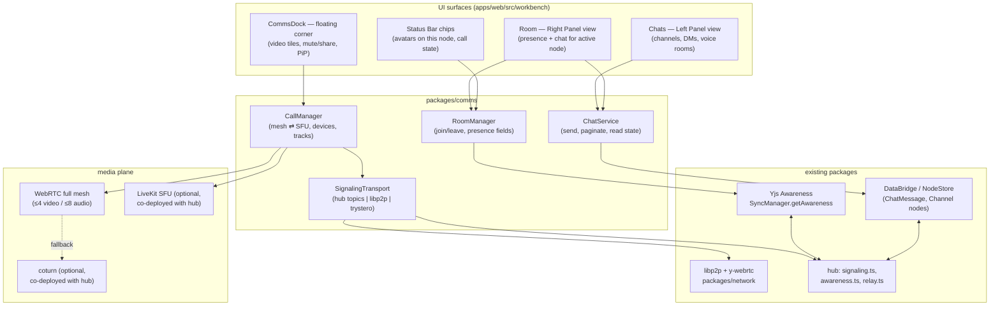
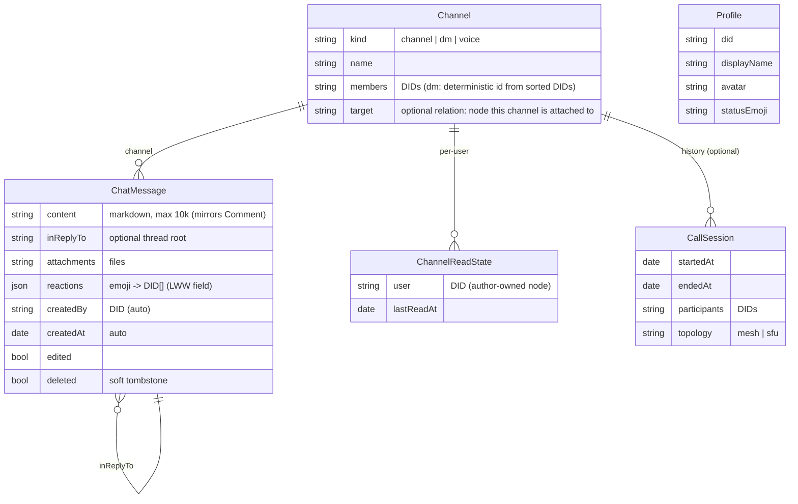
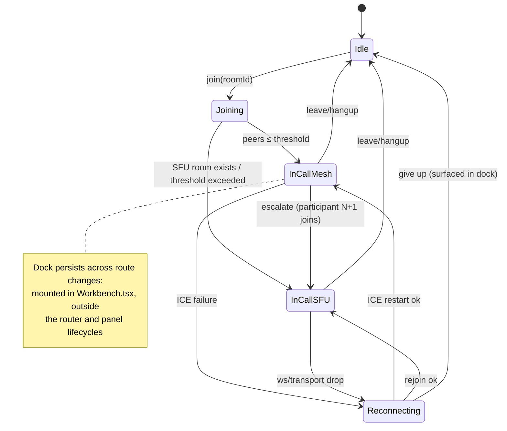

# Real-Time Communications: Chat, Presence, and Calls

## Problem Statement

xNet today is a place where people _edit together_ but cannot _talk to each
other_. Comments exist (`packages/data/src/schema/schemas/comment.ts`,
`packages/ui/src/composed/comments/`) but they are asynchronous, anchored
annotations — different in kind from a live conversation, a quick voice ping,
or a screen share. The ask:

- **Chat everywhere** — Slack/Zulip-style channels, one-on-one DMs, and an
  ambient "chat with whoever is looking at this document/database/page right
  now," reachable from anywhere in the app.
- **Calls everywhere** — 1:1 audio calls, 1:1 video, group calls inside a
  channel, group calls inside a document, screen sharing, and Discord-style
  drop-in voice rooms that sit open and let people wander in and out.
- **Corner-dock UX** — chat panels and video tiles that follow you around the
  workspace (Slack-huddle / picture-in-picture style), not modal meeting
  windows that take over the screen.
- **As decentralized as possible** — works without a hub server where
  physics allows; degrades gracefully to hub-assisted where it doesn't.
  WebRTC for media, the existing sync protocol for everything it can carry.

The exploration: design a communication layer that feels native to the
workbench, reuses the sync/identity/awareness machinery that already exists,
and stays honest about where a server genuinely helps (NAT traversal, large
group calls, offline message delivery).

## Executive Summary

- **More is already built than it appears.** The hub already ships a
  y-webrtc-compatible signaling broker
  (`packages/hub/src/services/signaling.ts` — `subscribe`/`publish` topics
  over WebSocket), an awareness/presence service with TTL cleanup
  (`packages/hub/src/services/awareness.ts`), and a Yjs relay. The client
  already has libp2p with WebRTC transport (`packages/network/src/node.ts`),
  a y-webrtc provider (`packages/network/src/providers/ywebrtc.ts`), and a
  per-document Yjs Awareness API (`SyncManager.getAwareness(nodeId)` in
  `packages/react/src/sync/sync-manager.ts`). Canvas presence
  (`packages/canvas/src/presence/canvas-presence.ts`) proves the ephemeral
  presence pattern end-to-end. Real-time comms is mostly _composition_, not
  _invention_.
- **Model chat messages as Nodes, not as CRDT logs.** Follow the Comment
  pattern: each message is a small signed Node (`ChatMessage`) related to a
  `Channel` node, synced through the existing `Change<T>` protocol
  (`packages/sync/src/change.ts`) and queried with `useQuery`. This sidesteps
  the well-documented CRDT-chat tombstone blowup (Y.Array chat logs grow
  without bound) and gets offline delivery, signing, and federation for free.
  Pagination by `createdAt` plus the 0163 hot-path work handles unbounded
  channels.
- **One primitive: every node can host a Room.** A Room is the ephemeral
  real-time envelope around any node ID — presence ("who is here"), typing,
  ephemeral cursor chat, and call membership all ride Yjs Awareness on that
  node's room. A `Channel` is just a node whose _primary content_ is chat; a
  document chat is the same Room machinery pointed at a Page node; a
  Discord-style voice room is a `Channel` with `kind: 'voice'`. DMs are
  channels with `kind: 'dm'` and a deterministic ID derived from the member
  DIDs. Group-call-in-a-document falls out for free.
- **Tiered call topology: mesh first, SFU when big.** Full-mesh WebRTC
  handles 1:1 and small groups (≤4 video / ≤8 audio) with zero media
  infrastructure — signaling rides the hub's existing pub/sub topics, or
  libp2p/local discovery when hubless. Above the mesh ceiling, escalate to an
  optional self-hosted **LiveKit** SFU co-deployed with the hub (Apache-2.0,
  single Go binary, first-party SDKs, built-in E2EE). This is exactly the
  road Matrix walked (full mesh → MatrixRTC + LiveKit), and we can skip their
  detour. A **coturn** TURN server co-deploys with the hub because ~15–30% of
  WAN peer pairs cannot hole-punch.
- **UI: four surfaces, one dock.** (1) A _Chats_ Left Panel view listing
  channels/DMs with unread badges and live voice-room occupancy; (2) a
  _Room_ Right Panel view showing presence + live chat for the node in the
  active tab; (3) a floating **CommsDock** — the Slack-huddle corner widget
  with video tiles and mute/share controls that persists across navigation
  (mounted in `apps/web/src/workbench/Workbench.tsx` outside the router);
  (4) Status Bar presence chips via the existing `useStatusBarItem()` hook.
  All four plug into containers 0166 already built.
- **Decentralization is a spectrum, and we sit on the good end.** LAN-only
  (no hub): mDNS + libp2p discovery, mesh calls, awareness over y-webrtc —
  everything works. WAN without hub: signaling via any y-webrtc-compatible
  broker or future DHT; mesh calls work for most peer pairs, no TURN
  fallback. WAN with hub: full experience including TURN relay, offline
  message queueing, and (optionally) SFU group calls. Only the _biggest
  rooms_ and _worst NATs_ need centralized help — which matches the physics.

## Current State In The Repository

### Transport and sync — the rails are laid

- `packages/sync/src/change.ts` — `Change<T>` is the universal signed unit of
  sync: `id`, `payload`, `hash`/`parentHash` chain, `authorDID`, `signature`,
  `wallTime`, `lamport`. Chat messages serialized as Changes inherit
  signing, ordering, and offline queueing.
- `packages/sync/src/yjs-limits.ts` — rate/size enforcement already includes
  `MAX_YJS_AWARENESS_UPDATE_SIZE` and `MAX_YJS_UPDATES_PER_SECOND`; presence
  spam is pre-mitigated.
- `packages/react/src/sync/sync-manager.ts` — client orchestrator: tracks
  Y.Docs per node (`track`/`acquire`), exposes **`getAwareness(nodeId)`**,
  handles offline queueing and multi-hub fan-out.
  `packages/react/src/sync/connection-manager.ts` manages the hub WebSocket
  with reconnect and UCAN refresh; `node-pool.ts` LRU-caches Y.Docs.
- `packages/network/src/node.ts` — libp2p node with WebRTC + TCP + mDNS;
  `packages/network/src/providers/ywebrtc.ts` — y-webrtc provider for P2P doc
  sync (peer events: `getConnectedPeers`, `onPeersChange`).
  `packages/network/src/protocols/sync.ts` already defines an `awareness`
  message type alongside `sync-request`/`sync-response`/`update`.
- `packages/hub/src/server.ts` (Hono + `ws`) with services that map 1:1 onto
  comms needs:
  - `services/signaling.ts` — **y-webrtc-compatible pub/sub broker**
    (`subscribe`/`unsubscribe`/`publish` over topics, with a
    `MessageInterceptor` hook for auth/rate limiting). This is a generic
    signaling plane: WebRTC offer/answer for _calls_ can ride the same
    topics as doc-sync peer discovery, with zero new server code.
  - `services/awareness.ts` — persists awareness entries (24h TTL, hourly
    cleanup, ≤100 users/room, per-peer rate limiting, `clientUserMap` of
    Yjs clientID → DID).
  - `services/relay.ts` — signed Yjs update forwarding.
- Security plumbing that comms inherits: connection gating, rate limiting,
  peer scoring (`packages/network/src/security/`), UCAN capability tokens
  (`packages/identity/src/ucan.ts`, `packages/hub/src/auth/ucan.ts`,
  `packages/hub/src/auth/capabilities.ts` — add a `call/*` capability beside
  `hub/*`, `query/*`, etc.).

### Presence — proven on canvas, not yet app-wide

`packages/canvas/src/presence/canvas-presence.ts` wraps Yjs Awareness with a
typed state shape (`cursor`, `selection`, `viewport`, `activity`, `user`),
~30fps cursor throttling, and deterministic user colors. What's missing is
**app-level** presence: no "user X is viewing node Y," no typing indicators,
no online/idle status, no "user X is in a call." All of those are new
_fields_ on the existing awareness machinery, not new machinery.

### Comments — the persistence pattern to copy, not extend

`packages/data/src/schema/schemas/comment.ts` models comments as plain Nodes:
polymorphic `target` relation, flat `inReplyTo` threading, markdown
`content`, `resolved` state, `createdBy` DID — **no Y.Doc**. The UI lives in
`packages/ui/src/composed/comments/` (`CommentBubble`, `CommentPopover`,
`CommentsSidebar`). Chat should copy the storage shape (small immutable-ish
Nodes, queried and paginated) but _not_ be merged with comments: comments are
anchored, resolvable annotations; chat is a time-ordered conversation.
Both stay first-class.

### Identity — self-sovereign and ready

`packages/identity/src/` provides DID:key (Ed25519 + ML-DSA hybrid bundles),
UCAN tokens, and seed/social recovery (exploration 0149). Every chat message
arrives signed by `authorDID`; call signaling messages can be signed the same
way. There is **no user profile schema yet** — a small `Profile` node
(display name, avatar, status emoji) is a prerequisite for a humane roster.

### UI shell — 0166 built the containers

`apps/web/src/workbench/Workbench.tsx` has fixed regions with a registry
(`apps/web/src/workbench/PanelViewHost.tsx`,
`apps/web/src/workbench/views/register.ts` — `registerPanelView(slot, view)`
for `left`/`right`/`bottom` slots), a Status Bar with `useStatusBarItem()`
(`apps/web/src/workbench/StatusBar.tsx`), router-driven tabs
(`apps/web/src/workbench/tabs.ts`), and Zustand state
(`apps/web/src/workbench/state.ts`). The comms surfaces are _views to
register_, plus one new floating layer for the call dock. The
worker-resident data layer (0164, `packages/data-bridge/src/worker/
data-worker-host.ts`) means high-frequency message inserts and presence churn
won't jank the main thread, and 0163's query hot path makes "render the last
50 messages of a 100k-message channel" a solved problem.

### Prior explorations that constrain this one

- `0166_[x]_MINIMAL_WORKBENCH_SHELL_REDESIGN.md` — fixed regions; comms must
  be panel views + one floating dock, not new chrome.
- `0164_[x]_WORKER_RESIDENT_DATA_LAYER.md` — async-only data access; chat
  writes go through `DataBridge.transaction`.
- `0163_[x]_QUERY_AND_MUTATION_HOT_PATH_PERFORMANCE.md` — windowed queries
  over large collections are fast; chat history rides this.
- `0149_[_]_IDENTITY_AND_ACCOUNT_RECOVERY.md` — DID/key-bundle identity that
  signs every message and call intent.

## External Research

### Group call topologies: where mesh stops

| Topology  | How it works                                            | Practical ceiling                | Infra cost       |
| --------- | ------------------------------------------------------- | -------------------------------- | ---------------- |
| Full mesh | every peer ↔ every peer; N(N−1)/2 connections           | **4–6 video**, ~10–15 audio-only | zero             |
| SFU       | each peer uploads once; server forwards encoded streams | 100–500/room per node            | one media server |
| MCU       | server decodes, composites, re-encodes                  | high server cost, +100–200ms     | rarely worth it  |

The mesh math: a 4-person 720p call costs each peer ~1.5 Mbps up / 4.5 Mbps
down; at 6 people downstream hits 7.5 Mbps and upstream CPU runs N−1
parallel encodes. Benchmarks repeatedly find video mesh degrading at 4–6
participants (~70–100% CPU at 9 participants even at minimum resolution).
Audio-only (Opus at 32–64 kbps, ~24× lighter than 720p video) stretches to
roughly 10–15 peers. Compounding risk: if each P2P link has a ~10% NAT
failure rate, a 6-person mesh has ~41% odds of at least one broken link.
SFUs fix all three (upload once, decode few, one NAT path to a public
server) at the price of a server. Simulcast (2–3 encoded layers, SFU picks
per subscriber) is the standard quality-adaptation mechanism.

### Self-hostable SFUs

| SFU         | Runtime                  | License    | Self-host                              | SDKs                                   | Notes                                                                       |
| ----------- | ------------------------ | ---------- | -------------------------------------- | -------------------------------------- | --------------------------------------------------------------------------- |
| **LiveKit** | Go (Pion), single binary | Apache-2.0 | Docker/binary; Redis only for clusters | first-party Web/iOS/Android/RN/Flutter | simulcast+SVC, insertable-streams E2EE, what Element Call adopted (MSC4195) |
| mediasoup   | C++ core, Node control   | ISC        | library, BYO signaling                 | TS client only                         | maximal control, weeks-to-first-call                                        |
| Jitsi JVB   | JVM + Prosody + Jicofo   | Apache-2.0 | multi-service stack                    | lib-jitsi-meet                         | proven at scale, operationally heavy                                        |
| Galène      | Go, single binary        | MIT        | trivial                                | browser only                           | great for small audio rooms, thin SDK story                                 |
| ion-sfu     | Go                       | MIT        | —                                      | —                                      | **abandoned** (last release 2021); succeeded by LiveKit                     |

Cloudflare Realtime (hosted SFU + TURN, ~$0.05/GB after 1 TB/month free) is
a viable zero-ops fallback for hosted hubs, but conflicts with self-hosting.

### Decentralized calling prior art

- **Matrix → MatrixRTC**: started 1:1 P2P, scaled groups via full mesh,
  broke at 4+, redesigned as MSC4143: _signaling over the existing sync
  protocol_ (room events / to-device messages), media via pluggable backend
  — in practice LiveKit. The architecture lesson is direct: **your sync
  layer is your signaling layer; only media needs new transport.**
- **Keet / Holepunch**: Hyperswarm DHT discovery + distributed hole-punching;
  fully P2P calls without TURN in more cases than STUN alone. Proof that a
  DHT can replace the signaling server, at latency cost.
- **Jami**: OpenDHT (Kademlia) carries SIP-style signaling; ICE + coturn
  fallback. Same conclusion.
- **Discord**: proprietary SFU per voice channel, Opus 64–384 kbps,
  client-side mixing (per-user volume sliders), voice-activity-gated
  forwarding. The _product_ lesson: persistent rooms you drift in and out
  of, visible occupancy in the sidebar, no ringing ceremony.
- **NAT reality**: STUN alone connects ~70–85% of residential peer pairs;
  **~15–30% need a TURN relay** (worse behind symmetric/enterprise NAT).
  coturn is the standard self-hosted answer and handles thousands of
  concurrent relays per core. A hubless deployment on a LAN needs neither
  (host candidates + mDNS).

### Signaling over sync channels

- **y-webrtc** (already patched/vendored in this repo) uses a dumb
  WebSocket pub/sub broker for room-based peer discovery; SDP/ICE ride
  the topics, then CRDT data flows P2P. Our hub _already implements this
  exact broker protocol_ in `services/signaling.ts`.
- **Trystero** (Apache-2.0, active) signals over Nostr relays, BitTorrent
  trackers, MQTT, or IPFS — zero owned infrastructure. A
  `y-webrtc-trystero` adapter exists. This is the credible "hub is down,
  WAN signaling still works" escape hatch.
- **Yjs Awareness protocol**: per-client ephemeral JSON keyed by clientID,
  30s timeout, heartbeat refresh, full-snapshot on join, last-writer-wins
  per entry, deliberately not a CRDT. This is the industry-standard model
  (Figma and Linear keep presence in memory, never in the document) and is
  exactly what `CanvasPresenceManager` already does.

### Local-first chat persistence

The naive design — one Y.Doc per channel with a `Y.Array` of messages —
accumulates tombstones forever; million-message channels balloon to GBs.
Mitigations in the wild: shard one CRDT doc per channel per time window,
snapshot + compact closed windows. Matrix avoids CRDTs entirely: a signed
event DAG per room, merged topologically — i.e., _chat is an append-only
log of signed events, not a collaboratively-edited document_. xNet's
`Change<T>` chain **is** a signed event log, which is why message-as-Node is
the natural fit and the tombstone problem never arises (edits are
last-writer-wins field updates on a single small node; deletes are status
flips or true tombstone nodes — bounded either way).

### E2EE building blocks (phase-later, design-now)

- **Media**: WebRTC Insertable Streams / Encoded Transform — frame-level
  AES-GCM the SFU can't read; supported in Chrome/Firefox 117+/Safari
  15.4+; LiveKit ships it with worker-side crypto and codec-aware clear
  headers. Mesh calls are already transport-encrypted (DTLS-SRTP) peer to
  peer.
- **Chat**: MLS (RFC 9420) gives O(log N) group key rotation with forward
  secrecy and post-compromise security; Apple/Google are shipping it; Matrix
  is migrating from Megolm toward it (MSC4244). xNet already encrypts Yjs
  state (`packages/sync/src/yjs-authorization.ts`); channel-content
  encryption can extend that pattern before full MLS.

### UI prior art worth stealing

- **Slack Huddles**: audio-first one-click join; call lives in a floating
  mini window or docks to a persistent bar; **call state survives
  navigation** — ambient, never modal.
- **Discord**: voice channels in the sidebar with live occupant avatars;
  presence is spatial ("I am _in_ that room"), not session-based.
- **Figma**: cursor chat (`/` opens an ephemeral bubble at the cursor, no
  history) and pulsing avatar audio rings — presence embedded in the work
  surface itself.
- **Notion**: avatar stack on the page header — minimum-viable presence.
- **Gather/Teamflow**: client-side spatial audio via Web Audio `GainNode`
  per stream — a reminder that with mesh or SFU alike, _mixing is local_,
  so per-person volume and spatial effects are UI-layer features.

## Key Findings

1. **The hub's signaling service is already the right shape.** y-webrtc's
   broker protocol (topic subscribe/publish) is sufficient for call
   signaling; `call:{roomId}` topics need only an interceptor for UCAN
   checks. No new server protocol is required for mesh calls.
2. **Presence is a field-addition problem.** `SyncManager.getAwareness()`
   plus the hub `AwarenessService` already move ephemeral state; we need a
   typed app-level presence schema (`viewing`, `status`, `typing`,
   `call`) and one well-known workspace presence room.
3. **Message-as-Node beats message-in-CRDT for xNet specifically.** The
   repo's own comment system, the Change<T> signed chain, the 0163 query
   path, and the Matrix event-DAG precedent all point the same way. Rich
   _composition_ (a draft being typed) can still use Y.Text locally; the
   _sent message_ is a frozen node.
4. **Mesh-then-SFU is the consensus endgame.** Matrix, Element Call, and
   every local-first calling effort converged on: P2P for small, SFU for
   big, signaling over the app's existing realtime channel. Choosing
   LiveKit now avoids re-walking Matrix's full-mesh dead end while keeping
   the SFU strictly optional.
5. **The decentralization budget is spent exactly where physics demands.**
   Text chat, presence, and small calls: fully P2P-capable. TURN (~15–30%
   of WAN pairs) and >6-person video: genuinely need a server. The
   architecture should make the server an _amplifier_, not a dependency.
6. **0166's shell has ready-made homes** for every surface except the
   floating call dock, which must mount above the workbench (outside
   panel/tab lifecycle) so calls survive navigation — the single most
   important UX property per Slack/Discord prior art.

## Options And Tradeoffs

### A. Chat persistence model

| Option                                | How                                                                                   | Pros                                                                                              | Cons                                                                                                 |
| ------------------------------------- | ------------------------------------------------------------------------------------- | ------------------------------------------------------------------------------------------------- | ---------------------------------------------------------------------------------------------------- |
| **A1. Message-as-Node** (recommended) | `ChatMessage` schema, one node per message, relation to `Channel`; sync via Change<T> | reuses comments pattern, signed, offline-queued, queryable, no tombstone blowup, federation-ready | ordering needs lamport+wallTime sort; high-frequency sends need batching (`DataBridge.transaction`)  |
| A2. Y.Doc per channel (Y.Array log)   | messages appended to a shared CRDT                                                    | trivially realtime, typing/edit merge for free                                                    | unbounded tombstones, full-doc load to read anything, no per-message signing, contradicts repo norms |
| A3. Hybrid windowed CRDT              | Y.Doc per channel-month, snapshot+compact                                             | bounds growth                                                                                     | most complex; we get the same bound from A1 with none of the machinery                               |

A1 also unifies storage semantics: a chat message, a comment, and a task are
all just Nodes with different schemas — search, backlinks, and agents
(0161's files-first interfaces) see chat history without special cases.

### B. Call topology

| Option                                                                 | Pros                                                              | Cons                                                                            |
| ---------------------------------------------------------------------- | ----------------------------------------------------------------- | ------------------------------------------------------------------------------- |
| B1. Mesh only                                                          | zero infra, max decentralization                                  | hard ceiling ~4 video; group calls in big channels impossible                   |
| B2. SFU only                                                           | one code path, scales                                             | hub becomes mandatory for _every_ call — fails the brief                        |
| **B3. Tiered: mesh ≤ threshold, optional LiveKit above** (recommended) | 1:1/small fully P2P; big rooms possible when hub operator opts in | two media paths to maintain; escalation mid-call is a real (solvable) edge case |

### C. Signaling plane

| Option                                           | Pros                                              | Cons                                                   |
| ------------------------------------------------ | ------------------------------------------------- | ------------------------------------------------------ |
| **C1. Hub pub/sub topics** (recommended default) | already implemented, UCAN-gateable, one hop       | requires hub reachable                                 |
| C2. libp2p gossip / direct streams               | hubless on LAN (mDNS) and between connected peers | WAN bootstrap still needs _some_ rendezvous            |
| C3. Trystero (Nostr/BitTorrent)                  | zero owned infra, true hub-down fallback          | third-party relay dependence, latency, privacy surface |

These are not exclusive: define a `SignalingTransport` interface and
implement C1 first, C2 for LAN, C3 as an opt-in resilience layer.

### D. Where chat lives in the UI

| Option                                       | Pros                                                                                                                                | Cons                                                         |
| -------------------------------------------- | ----------------------------------------------------------------------------------------------------------------------------------- | ------------------------------------------------------------ |
| D1. Chat as editor tabs only                 | reuses tabs, deep-linkable                                                                                                          | chat dies when you switch tabs — fails "ambient" requirement |
| **D2. Panels + floating dock** (recommended) | Chats list in Left Panel, per-node Room in Right Panel, calls in a floating corner dock; channel can _also_ open as a tab for focus | one new floating layer to build                              |
| D3. Separate chat window/app                 | full Slack clone freedom                                                                                                            | shatters the workbench premise                               |

## Recommendation

Build a layered **comms stack** in a new `packages/comms`, with UI surfaces
registered into the 0166 workbench. One new concept — the **Room** — and
three new schemas (`Channel`, `ChatMessage`, `Profile`; plus optional
`CallSession` for history).



### The Room abstraction

`RoomManager.join(nodeId)` attaches the local user to the awareness room for
that node and merges app-level presence fields. The same call works for a
`Channel`, a `Page`, a `Database`, a `Dashboard` — "everyone viewing this
thing" is one code path. Presence state shape (extends the
`CanvasPresence` precedent):

- `user: { did, name, color, avatar }`
- `viewing: nodeId` (also broadcast to the workspace presence room)
- `status: 'active' | 'idle' | 'dnd'`
- `typing?: { channelId, until }`
- `call?: { roomId, audio: boolean, video: boolean, screen: boolean }`

The **workspace presence room** is one well-known room ID per workspace
(`presence:{workspaceId}`) carrying the roster — who is online, what each
person is viewing, who is in which call. This powers the Chats panel
occupancy dots and "jump to where Alice is."

### Data model



Notes:

- **DM discovery**: derive the DM channel ID deterministically —
  `dm:` + hash of the sorted participant DIDs — so both sides materialize
  the _same_ node without coordination and duplicate-channel races can't
  happen.
- **Document chat**: a `Channel` with `target` pointing at the node gives
  per-document _persistent_ chat; _ephemeral_ "talk to whoever's here now"
  needs no channel at all (awareness-only cursor-chat, Figma-style).
- **Read state**: each user authors their own `ChannelReadState` node, so
  unread counts sync across devices without write contention.
- **Reactions**: LWW map field on the message node — adequate at chat scale,
  no CRDT needed.

### Call flow

```mermaid
sequenceDiagram
    participant A as Alice (client)
    participant H as Hub signaling topic call:{roomId}
    participant B as Bob (client)
    participant L as LiveKit (optional)

    A->>H: subscribe call:{roomId}; publish announce{did, media, sdp-offer}
    Note over A: also sets awareness call:{roomId, audio:true}
    B-->>B: sees Alice's call presence in Room panel / sidebar dot
    B->>H: subscribe; publish answer{sdp} (signed, UCAN-gated)
    H->>A: relay answer
    A<<->>B: DTLS-SRTP media, full mesh (STUN, coturn fallback)
    Note over A,B: participants ≤ mesh ceiling → stay P2P

    participant C as +4 more join
    C->>H: announce
    A->>H: publish escalate{livekitRoom, reason: ">mesh ceiling"}
    A->>L: connect with hub-minted JWT (UCAN → call/* capability)
    B->>L: connect
    C->>L: connect
    Note over A,L: mesh links torn down; SFU simulcast takes over.<br/>If no SFU configured: room is full at mesh ceiling (clear UX message).
```

Discord-style voice rooms are `kind: 'voice'` channels whose call room is
_always open_: joining the channel joins the call; occupancy is just call
presence rendered in the Chats panel. No ringing — presence _is_ the invite.

### Call dock lifecycle



### Decentralization ladder

| Deployment          | Discovery/signaling                        | Chat                                       | Presence                     | Calls                                    |
| ------------------- | ------------------------------------------ | ------------------------------------------ | ---------------------------- | ---------------------------------------- |
| LAN, no hub         | mDNS + libp2p                              | P2P via y-webrtc/libp2p sync               | y-webrtc awareness           | mesh, host candidates (no TURN needed)   |
| WAN, no hub         | trystero (Nostr/BT) or any y-webrtc broker | P2P when peers co-online; no offline queue | works while connected        | mesh; ~15–30% of pairs fail without TURN |
| WAN + hub           | hub topics                                 | + offline delivery via relay/store         | + AwarenessService snapshots | + coturn fallback                        |
| WAN + hub + LiveKit | hub topics                                 | same                                       | same                         | + group calls beyond mesh ceiling        |

### Phasing

1. **Presence** (1–2 weeks of surface area): `packages/comms` RoomManager,
   workspace presence room, avatars in Status Bar + Right Panel roster,
   "viewing" indicators in the Chats/Explorer sidebar.
2. **Chat** : `Channel`/`ChatMessage`/`Profile`/`ChannelReadState` schemas,
   ChatService with windowed queries, Chats Left Panel view, Room Right
   Panel view, channel-as-tab route, typing indicators via awareness.
3. **1:1 + small-group calls**: CallManager with mesh topology, signaling
   over hub topics (`MessageInterceptor` for UCAN), CommsDock floating UI,
   device pickers, screen share track, coturn in hub deploy docs.
4. **Voice rooms + SFU escalation**: `kind: 'voice'` channels, LiveKit
   co-deploy (hub mints JWTs from UCAN `call/*`), mesh→SFU escalation,
   simulcast tuning.
5. **Hardening + E2EE**: insertable-streams media encryption, channel
   content encryption via the `yjs-authorization.ts` pattern, MLS
   evaluation, trystero fallback signaling, mobile (apps/expo) audit.

## Example Code

### Channel and message schemas (mirrors `comment.ts`)

```ts
// packages/data/src/schema/schemas/channel.ts
export const ChannelSchema = defineSchema({
  name: 'Channel',
  version: '1.0.0',
  properties: {
    name: { type: 'text', maxLength: 120 },
    kind: { type: 'select', options: ['channel', 'dm', 'voice'] },
    members: { type: 'person', multiple: true }, // DIDs; empty = open
    target: { type: 'relation' }, // optional: node this chat is attached to
    archived: { type: 'checkbox' }
  }
})

// packages/data/src/schema/schemas/chat-message.ts
export const ChatMessageSchema = defineSchema({
  name: 'ChatMessage',
  version: '1.0.0',
  properties: {
    channel: { type: 'relation', required: true },
    content: { type: 'text', multiline: true, maxLength: 10_000 },
    inReplyTo: { type: 'relation' }, // flat threads, like Comment
    attachments: { type: 'file', multiple: true },
    reactions: { type: 'text' }, // JSON LWW map: emoji -> DID[]
    edited: { type: 'checkbox' },
    deleted: { type: 'checkbox' } // soft tombstone
  }
})
```

### Room presence on top of the existing awareness API

```ts
// packages/comms/src/room-manager.ts
export function createRoomManager(sync: SyncManager, me: LocalUser) {
  const join = (nodeId: string) => {
    const awareness = sync.getAwareness(nodeId) // existing API
    awareness.setLocalStateField('user', me.card)
    awareness.setLocalStateField('viewing', nodeId)
    return {
      setTyping: (channelId: string) =>
        awareness.setLocalStateField('typing', { channelId, until: now() + 4000 }),
      setCall: (call: CallPresence | null) => awareness.setLocalStateField('call', call),
      onRoster: (cb: (peers: PeerPresence[]) => void) => subscribeAwareness(awareness, cb), // wraps awareness 'change' events
      leave: () => awareness.setLocalState(null)
    }
  }
  // workspace-wide roster rides one well-known room
  const workspace = () => join(`presence:${me.workspaceId}`)
  return { join, workspace }
}
```

### Call signaling over the hub's existing pub/sub broker

```ts
// packages/comms/src/signaling/hub-transport.ts
// The hub's signaling.ts already speaks {subscribe|unsubscribe|publish}.
// Calls reuse it verbatim with a dedicated topic namespace.
export function hubSignaling(conn: HubConnection, roomId: string): SignalingTransport {
  const topic = `call:${roomId}`
  conn.send({ type: 'subscribe', topics: [topic] })
  return {
    send: (
      msg: CallSignal // announce | offer | answer | ice | leave | escalate
    ) => conn.send({ type: 'publish', topic, data: sign(msg, me.keyBundle) }),
    onMessage: (cb) => conn.onTopic(topic, (data) => verify(data) && cb(data)),
    close: () => conn.send({ type: 'unsubscribe', topics: [topic] })
  }
}
```

### Registering the UI surfaces (0166 contribution points)

```ts
// apps/web/src/workbench/views/register.ts (additions)
registerPanelView('left', { id: 'chats', title: 'Chats', component: ChatsPanel })
registerPanelView('right', { id: 'room', title: 'Room', component: RoomPanel })

// apps/web/src/workbench/Workbench.tsx — floating layer, OUTSIDE router/panels,
// so an active call survives tab switches and route changes:
//   <WorkbenchRegions />
//   <CommsDock />   // fixed bottom-right; video tiles, mute/cam/share/leave
```

## Risks And Open Questions

- **Channel access control.** Membership on the `Channel` node is advisory
  until enforced: the hub relay must filter who can subscribe to a channel's
  changes and `call:` topics (the `MessageInterceptor` + UCAN capability
  checks), and private channels likely need encrypted content
  (`yjs-authorization.ts` pattern) so the hub itself can't read them. This
  is the largest unscoped piece.
- **Escalation mid-call.** Mesh→SFU handover requires renegotiating every
  participant simultaneously; the pragmatic v1 is "room locks at mesh
  ceiling unless SFU is configured," with handover polished later.
- **Notifications when offline.** A DM to an offline peer syncs on their
  next connect, but _push_ (mobile/desktop) implies a hub-side notifier and
  per-user delivery state — out of scope here, needs its own exploration.
- **Profile bootstrapping.** No `Profile` schema exists; DIDs alone make a
  hostile roster UI. Small, but a hard prerequisite for Phase 1.
- **Message volume vs. node-per-message.** At Slack-scale traffic
  (~thousands of messages/day/workspace) node counts are fine given 0163,
  but bulk history import (e.g., a Slack export via the 0150 social-import
  path) should batch via `DataBridge.transaction` and may motivate a
  per-channel index.
- **Awareness room size.** Hub `AwarenessService` caps rooms at ~100 users;
  the workspace presence room hits this first in large workspaces — needs
  pagination or sharding eventually.
- **Expo/mobile parity.** `react-native-webrtc` and LiveKit's RN SDK exist,
  but mesh + libp2p behavior on mobile networks (CGNAT, background
  suspension) is unvalidated.
- **E2EE depth.** Insertable-streams media encryption and MLS for chat are
  designed-for but not designed-out here; Megolm-style interim (shared
  symmetric key per channel, rotated on membership change) may be the
  right stopgap.

## Implementation Checklist

### Phase 1 — Presence

- [x] Create `packages/comms` with `RoomManager` over `SyncManager.getAwareness()`
- [x] Define app-level presence fields (`user`, `viewing`, `status`, `typing`, `call`) and a typed wrapper (pattern: `packages/canvas/src/presence/canvas-presence.ts`)
- [x] Add `Profile` schema + minimal profile editor (name, avatar, status)
- [x] Workspace presence room (`presence:{workspaceId}`) wired through hub `AwarenessService`
- [x] Status Bar avatar chips for the active node via `useStatusBarItem()` — (count chip; avatar stack deferred)
- [x] Right Panel roster section ("here now") for the active tab's node

### Phase 2 — Chat

- [x] `Channel`, `ChatMessage`, `ChannelReadState` schemas registered in `packages/data/src/schema/registry.ts` — (`ChannelReadState` superseded by 0168's `InboxState`)
- [x] `ChatService`: send (via `DataBridge.transaction`), windowed history queries (paginate by `createdAt`), edit/delete (LWW + soft tombstone), reactions — (reactions ride the existing `Reaction` schema; dedicated UI deferred)
- [x] Deterministic DM channel IDs from sorted member DIDs
- [x] Chats Left Panel view (channels, DMs, unread badges) — `registerPanelView('left', …)`
- [x] Room Right Panel view: live chat + roster for active node; per-document channels via `target`
- [x] Channel-as-tab route (`/channel/$channelId`) for focused reading
- [x] Typing indicators over awareness; unread counts from `ChannelReadState` — (unread counts from `InboxState` watermarks)
- [ ] Hub relay topic authorization for private channels (`MessageInterceptor` + UCAN)

### Phase 3 — Calls (mesh)

- [x] `SignalingTransport` interface; hub pub/sub implementation over `call:{roomId}` topics (signed payloads) — (signals ride the authenticated hub WS; per-signal signing deferred)
- [x] `CallManager`: mesh PeerConnections, device selection, mute/cam toggles, screen-share track, ICE restart — (device picker and ICE restart deferred)
- [x] `CommsDock` floating UI in `Workbench.tsx` (outside router): tiles, controls, drag corner, collapse-to-pill — (drag/collapse deferred)
- [x] Call presence (`call` awareness field) rendered in rosters and the Chats panel
- [x] coturn deployment recipe alongside hub; STUN/TURN config surfaced in hub settings — (recipe in `docs/deployment/REALTIME_CALLS.md`; settings UI deferred)
- [x] Mesh ceiling enforcement (≤4 video / ≤8 audio) with clear "room full" UX
- [x] `call/*` UCAN capability in `packages/hub/src/auth/capabilities.ts`

### Phase 4 — Voice rooms + SFU

- [x] `kind: 'voice'` channels: join-channel = join-call, occupancy in sidebar (Discord model)
- [ ] LiveKit co-deploy option for the hub; hub endpoint mints LiveKit JWTs from UCAN
- [ ] CallManager SFU path (livekit-client) + mesh→SFU escalation
- [ ] Optional `CallSession` history nodes
- [ ] LAN/hubless signaling path (libp2p/mDNS) validated for mesh calls

### Phase 5 — Hardening

- [ ] Insertable-streams E2EE for SFU media; verify mesh DTLS-SRTP posture
- [ ] Encrypted private-channel content (extend `yjs-authorization.ts` approach)
- [ ] Trystero (or equivalent) fallback signaling behind a flag
- [ ] Expo/mobile call support audit (`react-native-webrtc` / LiveKit RN)
- [ ] Figma-style ephemeral cursor chat on canvas (awareness-only, no history)

## Validation Checklist

- [ ] Two browsers, no hub, same LAN: presence roster and mesh audio call work (mDNS/libp2p path)
- [ ] Two browsers via hub: DM created from either side resolves to the same deterministic channel node; messages survive one side going offline and reconnecting (offline queue replay)
- [ ] Presence: closing a tab removes the peer from rosters within the awareness timeout (~30s); typing indicator expires without a clear event
- [ ] Chat history: 100k-message seeded channel renders last page < 100ms and scroll-back paginates smoothly (0163 hot path)
- [ ] Mesh call: 4 participants with video — CPU and bandwidth within budget; 5th video joiner is refused (or escalated when SFU configured) with clear UX
- [ ] TURN: force-block UDP/host candidates and confirm calls connect via coturn relay
- [ ] SFU: 10-participant audio room on self-hosted LiveKit; join/leave churn doesn't drop the room
- [ ] CommsDock persists across tab switches, route changes, and zen mode; audio never interrupts
- [ ] Private channel: non-member client cannot receive channel changes or subscribe to its `call:` topic (relay-enforced)
- [ ] All chat/presence writes flow through the worker data layer with no main-thread jank (0164 invariant; verify with a 50-msg/s synthetic burst)
- [ ] Unread badges sync across two devices for the same DID via `ChannelReadState`

## References

### Codebase

- `packages/hub/src/services/signaling.ts`, `awareness.ts`, `relay.ts` — hub realtime services
- `packages/react/src/sync/sync-manager.ts`, `connection-manager.ts` — client sync/awareness orchestration
- `packages/network/src/node.ts`, `providers/ywebrtc.ts`, `protocols/sync.ts` — libp2p + WebRTC transport
- `packages/canvas/src/presence/canvas-presence.ts` — presence pattern precedent
- `packages/data/src/schema/schemas/comment.ts` — message-as-Node precedent
- `packages/sync/src/change.ts`, `yjs-limits.ts`, `yjs-authorization.ts` — signed sync, limits, encryption
- `packages/identity/src/ucan.ts`, `packages/hub/src/auth/capabilities.ts` — capability auth
- `apps/web/src/workbench/Workbench.tsx`, `views/register.ts`, `StatusBar.tsx` — UI contribution points
- Explorations: `0149` (identity), `0163` (query hot path), `0164` (worker data layer), `0166` (workbench shell)

### External

- WebRTC mesh limits: [bloggeek.me — How many users can fit in a WebRTC call?](https://bloggeek.me/how-many-users-webrtc-call/); [trembit.com — P2P room limits](https://trembit.com/blog/how-many-participants-can-we-place-in-one-webrtc-peer-2-peer-room/)
- SFUs: [LiveKit](https://docs.livekit.io/reference/internals/livekit-sfu/) ([E2EE](https://docs.livekit.io/transport/encryption/)); [mediasoup](https://mediasoup.org/); [Jitsi Videobridge](https://github.com/jitsi/jitsi-videobridge); [Galène](https://galene.org/); [ion-sfu (abandoned)](https://github.com/ionorg/ion-sfu); [Cloudflare Realtime pricing](https://developers.cloudflare.com/realtime/sfu/pricing/)
- MatrixRTC: [MSC4143 / FOSDEM 2024 slides](https://archive.fosdem.org/2024/events/attachments/fosdem-2024-2876-matrixrtc-the-future-of-matrix-calls/slides/22881/MatrixRTC_FOSDEM24_NcGvvs5.pdf); [Element Call](https://github.com/element-hq/element-call); [lk-jwt-service](https://github.com/element-hq/lk-jwt-service)
- P2P prior art: [Holepunch/Keet](https://tether.io/news/tether-bitfinex-and-hypercore-launch-holepunch-a-platform-for-building-fully-encrypted-peer-to-peer-applications/); [Jami](https://jami.net/); [Berty/Wesh](https://berty.tech/docs/protocol/); [Discord voice architecture](https://sysdesign.wiki/systems/discord/)
- Signaling/presence: [y-webrtc](https://github.com/yjs/y-webrtc); [Trystero](https://github.com/dmotz/trystero); [Yjs Awareness](https://docs.yjs.dev/api/about-awareness); [Figma multiplayer](https://www.figma.com/blog/how-figmas-multiplayer-technology-works/)
- NAT/TURN: [STUN/TURN/ICE overview + relay rates](https://www.nihardaily.com/168-webrtc-nat-traversal-understanding-stun-turn-and-ice); [coturn](https://github.com/coturn/coturn)
- E2EE: [RFC 9420 (MLS)](https://www.rfc-editor.org/rfc/rfc9420.html); [WebRTC Insertable Streams](https://webrtchacks.com/true-end-to-end-encryption-with-webrtc-insertable-streams/); [Matrix MLS direction (MSC4244)](https://github.com/matrix-org/matrix-spec-proposals/blob/travis/msc/mls/00-core/proposals/4244-rfc9420-mls-for-matrix.md)
- UX prior art: [Slack Huddles redesign](https://slack.com/blog/productivity/a-redesigned-slack-built-for-focus); [Figma audio](https://help.figma.com/hc/en-us/articles/1500004414622-Use-audio-to-chat-with-your-team) and [cursor chat](https://help.figma.com/hc/en-us/articles/4403130802199-Use-cursor-chat-in-Figma-Design); [Teamflow spatial audio](https://help.teamflowhq.com/article/150-how-to-use-rooms)
- CRDT chat pitfalls: [local-first CRDT patterns 2025](https://debugg.ai/resources/local-first-apps-2025-crdts-replication-edge-storage-offline-sync); [Matrix event DAG analysis](https://arxiv.org/pdf/2011.06488)
