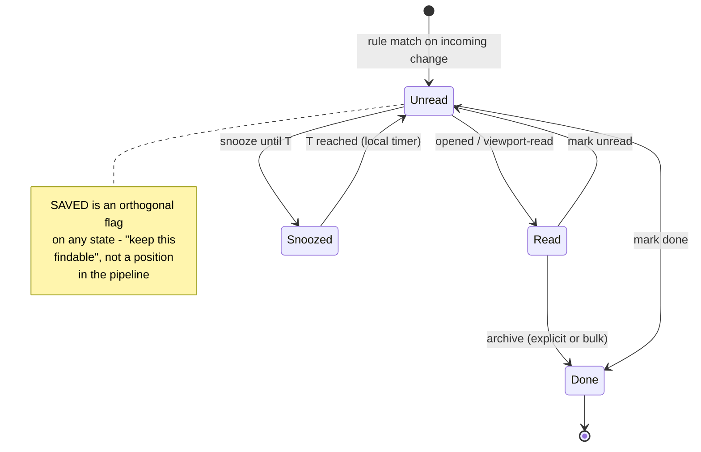
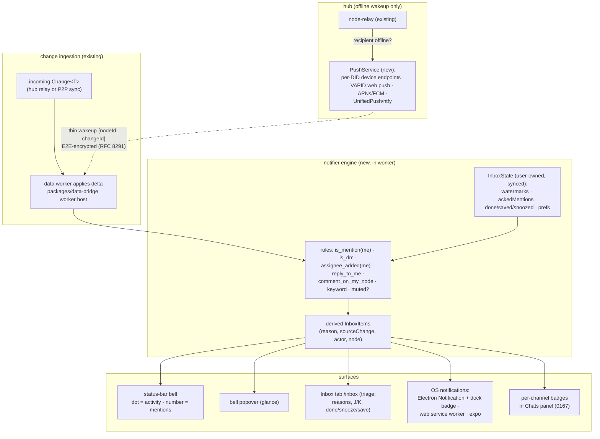
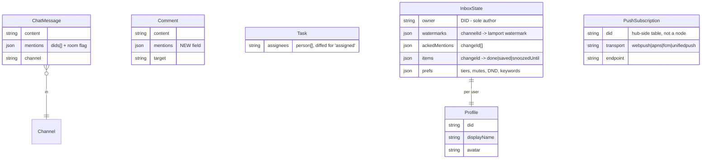
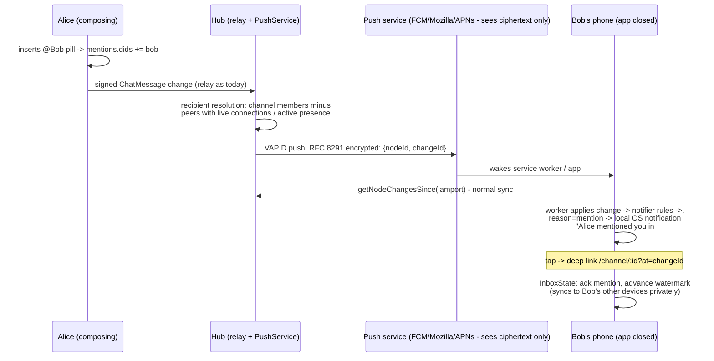

# Notification Center And Mentions

## Problem Statement

0167 designs chat, presence, and calls. The moment those land, xNet gains a
firehose of "things that concern me": DMs, channel messages, @mentions in
chat, @mentions in comments, replies to my comments, tasks assigned to me,
incoming calls I missed, invitations to channels and documents. Today none of
that is surfaced — the Notifications tray
(`apps/web/src/workbench/views/tray.tsx`) shows only background jobs, and its
own empty state already promises more: _"No notifications. Background jobs
and mentions will appear here."_

The ask: design a **notification center** — @mentions in chats and comments,
direct-call rings, unread message and comment indicators, task-assignment
alerts, and a single inbox where everything related to _me_ can be seen and
triaged. Same constraint as 0167: as decentralized as possible. Lean on the
existing sync infrastructure and P2P CRDT machinery; use the hub only where
physics demands it (waking up devices that are offline).

## Executive Summary

- **Notifications are a _derived view_, not delivered objects.** Every xNet
  client already syncs the full signed change log for the nodes it can
  access. So the inbox is a local materialization: scan incoming changes for
  "mentions me / assigned to me / replies to me / in my DMs," computed in
  the worker data layer (0164) where the changes already flow. No fan-out
  infrastructure, no per-user notification rows on the hub, works fully
  offline, and works pure-P2P. This is exactly how Matrix clients compute
  badges for E2EE rooms (server can't read content, so clients re-evaluate
  push rules locally) — except xNet can make it the _primary_ path, not the
  fallback.
- **Mentions become a first-class, structured field — never text parsing.**
  Adopt Matrix MSC3952 "intentional mentions": the composer populates a
  `mentions` property (`{ dids: [...], room: false }`) on `ChatMessage` and
  `Comment` nodes when the user inserts a mention pill. The machinery
  already exists: TipTap with a suggestion-plugin mention extension
  (`packages/editor/src/extensions/task-metadata/TaskMentionExtension.ts`,
  `@`-triggered) needs a person-flavored sibling, and the `person` property
  type (`packages/data/src/schema/properties/person.ts`) already validates
  DIDs. Comments today are plain markdown
  (`packages/data/src/schema/schemas/comment.ts`) — their composer gains the
  same mention pills.
- **Read state is user-owned and private — never broadcast.** The single
  biggest lesson from Matrix (MSC2285) and Slack: read receipts broadcast to
  rooms cause O(members) write amplification and leak attention. xNet stores
  an `InboxState` per user — last-read watermark per channel (Zulip's
  hybrid: watermark + explicit set of un-acked mention IDs) plus triage
  state (done/saved/snoozed) keyed by source change — authored by the user's
  DID, synced across _their_ devices through the normal change log, visible
  to no one else. This generalizes 0167's proposed `ChannelReadState`.
- **The inbox is GitHub-grade, not a toast pile.** Every item carries a
  machine-readable **reason** (`mention`, `dm`, `assigned`, `reply`,
  `comment`, `thread`, `call-missed`, `invite`, `system`), and triage is the
  canonical five-state machine: unread → read → done, orthogonal saved,
  snoozed-until-T. Reasons are filter tokens; bulk actions enable inbox
  zero. The existing tray view upgrades into this Inbox; a status-bar bell
  with two-tier badging (Discord's dot-vs-number: dot for activity, number
  for mentions) gives ambient awareness via the existing `useStatusBarItem()`
  hook (`apps/web/src/workbench/status.ts`).
- **Push wakeup is the one legitimately centralized piece — and it's thin
  and E2E-encrypted.** A device that is _off_ cannot derive anything; that's
  the physics that justifies the hub. The hub gains a `PushService`: devices
  register push endpoints (Web Push via **VAPID** — no Google/Apple account
  needed, payloads E2E-encrypted per RFC 8291; UnifiedPush/ntfy for
  de-Googled Android; APNs/FCM via Expo for mobile), and the hub sends a
  **thin wakeup** — `{nodeId, changeId}` only, Matrix's `event_id_only`
  pattern — when a relayed change plausibly concerns an offline user. The
  woken client syncs, evaluates rules locally, and renders the notification
  itself. Content never transits the push vendor; for encrypted channels the
  hub needs nothing more than "a change happened in a room you belong to."
  Electron needs no push at all: the local notifier fires OS notifications
  (`new Notification()`) and sets the dock badge while the app runs.
- **Noise control is designed in, not bolted on.** Defaults follow the
  industry consensus: notify on mentions + DMs + assignments, _not_ on all
  channel activity; per-channel mute that still lets direct @mentions
  through; DND schedule suppresses push but accumulates in the inbox; group
  mentions (`@room`) gated by channel role with a confirmation above ~6
  members; same-source events coalesce ("5 new comments on _Roadmap_").
  Preferences live in a user-owned, synced `NotificationPrefs` node — not
  localStorage — so they follow the user across devices.

## Current State In The Repository

### What exists

- **A notifications tray that wants to grow.**
  `apps/web/src/workbench/views/tray.tsx` registers a `NotificationsTray`
  bottom-panel view rendering background jobs from the `useWorkbenchStatus`
  Zustand store (`apps/web/src/workbench/status.ts` — `WorkbenchJob`
  records, imperative `reportJob()` for non-React call sites). No
  persistence, no unread counts, no toast library anywhere.
- **Mention machinery, tasks-only.** The Page editor
  (`apps/web/src/components/Editor.tsx` →
  `packages/editor/src/components/RichTextEditor.tsx`) is TipTap.
  `packages/editor/src/extensions/task-metadata/TaskMentionExtension.ts` is
  a full inline-node mention extension: `@` trigger, suggestion dropdown,
  `data-mention-id` attrs. `packages/editor/src/utils/
taskMentionSuggestions.ts` builds suggestions from a presence roster
  (`{ did, name?, color?, avatar? }` entries) — the exact shape 0167's
  workspace presence room provides. A _person_ mention is a sibling
  extension, not new machinery.
- **Assignment fields and "my tasks."**
  `packages/data/src/schema/schemas/task.ts` has `assignee: person({})` and
  `assignees: person({ multiple: true })`.
  `apps/web/src/components/MyTasksPanel.tsx` gets the current DID from
  `useIdentity()` (`packages/react/src/hooks/useIdentity.ts`) and filters
  via `useTasks({ assigneeDid })` (`packages/react/src/hooks/useTasks.ts`)
  — note the assignee filter runs client-side today, fine at current scale.
- **Person property type, no people.**
  `packages/data/src/schema/properties/person.ts` validates DID strings;
  `packages/views/src/properties/person.tsx` renders pills and a combobox
  editor fed by a static `suggestions` config. There is no Profile node and
  no name/avatar resolution — DIDs render raw. (0167 flagged `Profile` as a
  prerequisite; this exploration hard-requires it.)
- **Reactivity and the worker.** `useQuery`
  (`packages/react/src/hooks/useQuery.ts`) subscribes via
  `useSyncExternalStore` over the `DataBridge`; since 0164 the node store
  and change application live in a worker
  (`packages/data-bridge/src/worker/data-worker-host.ts`) — the natural
  home for a notifier engine that inspects every incoming change exactly
  once, off the main thread.
- **Hub relay with replayable history, no delivery state.**
  `packages/hub/src/services/node-relay.ts` validates and appends signed
  changes (`storage.appendNodeChange`) and serves
  `getNodeChangesSince(lamport)` — so an offline client always catches up.
  Storage (`packages/hub/src/storage/interface.ts`, `sqlite.ts`) has no
  notion of per-user delivery, push tokens, or notifications. The client's
  `packages/react/src/sync/offline-queue.ts` buffers outbound mutations
  only.
- **Badges, barely.** `SectionBadge` in
  `apps/web/src/workbench/ContextPanel.tsx` shows an unresolved-comments
  count. Comments have `resolved`/`resolvedBy`/`resolvedAt` — thread
  resolution, not read state. **No `lastRead`, `unread`, `seen`, or ack
  pattern exists anywhere in the repo.**
- **Command/shortcut registry.** `packages/plugins/src/commands.ts`
  supports chords (`'g t'`-style) and scopes — an `inbox: open` command and
  `g i` chord are cheap.

### What's missing (the gap list)

1. Person mentions in editor + comments; structured `mentions` field on any
   schema.
2. Profile schema (display name, avatar) — without it, every surface shows
   raw DIDs.
3. A notifier/rules engine anywhere in the change-ingestion path.
4. Read/unread state of any kind; triage state; badge counts.
5. An inbox UI beyond the jobs list; status-bar bell; OS notifications
   (Electron uses `Notification` for nothing today — only the
   auto-updater banner, `apps/electron/src/renderer/components/
UpdateNotification.tsx`); web has no service worker push; expo
   (`apps/expo/App.tsx`) has no notification plumbing at all.
6. Hub-side push: device/push-subscription registry, wakeup sender.
7. Synced user preferences of any kind (workbench Zustand `persist` is
   per-browser localStorage — `apps/web/src/workbench/state.ts`).

### Prior explorations that constrain this one

- `0167_[_]_REALTIME_CHAT_PRESENCE_AND_CALLS.md` — defines `Channel`,
  `ChatMessage`, `ChannelReadState`, `Profile`, the workspace presence
  room, and call signaling. This exploration **generalizes
  `ChannelReadState` into `InboxState`** and consumes the presence roster
  for mention suggestions and smart push suppression (don't push to someone
  actively viewing the channel).
- `0164_[x]_WORKER_RESIDENT_DATA_LAYER.md` — changes are applied in the
  worker; the notifier engine belongs beside it.
- `0166_[x]_MINIMAL_WORKBENCH_SHELL_REDESIGN.md` — Inbox is a panel view +
  status-bar item, not new chrome.
- `0149_[_]_IDENTITY_AND_ACCOUNT_RECOVERY.md` — DIDs and key bundles; push
  subscriptions are registered per-device under UCAN auth.

## External Research

### Inbox UX prior art — what to copy

| System  | Signature idea worth stealing                                                                                                         |
| ------- | ------------------------------------------------------------------------------------------------------------------------------------- |
| GitHub  | Machine-readable **reasons** (`mention`, `assign`, `review_requested`…) as filter tokens; `unread → read → done` + orthogonal `saved` |
| Linear  | Issue-centric grouping; snooze; `J/K` serial triage; inbox as a filtered work queue                                                   |
| Slack   | `last_read` watermark per channel; "DMs + mentions" as the sane default tier; mute that still allows direct mentions; DND schedules   |
| Notion  | Group by page/thread; per-thread mute that still delivers direct mentions; archive ≙ done                                             |
| Discord | **Two-tier ambient badging**: dot = unread activity, red number = mentions only — low-anxiety scanning                                |
| Zulip   | Hybrid read model: watermark _plus_ explicit `mentions[]` ID set, so mentions persist until acknowledged even after "mark all read"   |

The canonical triage machine synthesized across all of them:



Key distinction most systems get wrong: **read ≠ done**. GitHub and Notion
keep them separate; Slack/Discord collapse them. Separate states are what
make an inbox a triage tool instead of a log.

### Fan-out architecture — and why local-first changes the answer

Server-centric systems choose between **fan-out-on-write** (materialize a
notification row per recipient — O(N) write amplification, what Slack does
via Kafka fanout services) and **fan-out-on-read** (query the event log per
viewer — expensive reads). A local-first client holding the full event log
gets a third option that dominates both: **client-side derivation**. The
inbox is a materialized view over data already on disk; the "server" never
fans anything out. Matrix clients prove this at scale — for E2EE rooms the
homeserver cannot evaluate push rules, so Element re-runs the rules engine
locally on decrypted events and recomputes badges client-side.

### Matrix — the decentralized blueprint

Three Matrix decisions map directly onto xNet:

1. **MSC3952 intentional mentions** (stable in Matrix 1.7): the composer
   writes `"m.mentions": { "user_ids": [...], "room": false }` into event
   content. No server-side body parsing (fragile, locale-broken, impossible
   under E2EE). Clients declare; servers may validate; under E2EE the field
   is simply encrypted along with the body.
2. **Thin pushes for E2EE** (`event_id_only`): the homeserver pushes only
   `{event_id, room_id}` through the gateway (Sygnal); the device wakes,
   syncs, decrypts, re-evaluates rules locally, renders the notification.
   Content never touches Apple/Google.
3. **MSC2285 private read receipts**: `m.read.private` is never federated
   and never shown to other members — read state syncs O(own devices), not
   O(room members), eliminating both write amplification and attention
   leakage.

### Push without a platform overlord

- **Web Push (RFC 8030/8291/8292)**: the push _service_ is run by the
  browser vendor (FCM transport for Chrome, Mozilla for Firefox, APNs for
  Safari), but **VAPID** means a self-hosted server pushes with nothing but
  a P-256 keypair — no account, no API key, no Firebase SDK — and **RFC
  8291** encrypts the payload end-to-end so the vendor relays ciphertext it
  cannot read. `web-push` (Node) is all the hub needs. iOS Safari supports
  Web Push from 16.4+ **only for installed PWAs** (Add to Home Screen).
- **UnifiedPush + ntfy**: the decentralized Android path — a self-hosted
  ntfy instance acts as distributor; 40+ apps (including Element) use it.
  No iOS equivalent exists; iOS requires APNs.
- **Electron**: no push stack at all — while the app runs, the main process
  fires native notifications (`new Notification()`) and sets
  `app.dock.setBadge()`; this is pure local derivation.
- **Expo**: managed Expo push service early, bare FCM/APNs for self-hosted
  production.

### Noise control research

71% of users cite excessive notifications as an uninstall reason; focus
groups put the fatigue threshold around ~5 pushes/day; yet well-targeted
notifications measurably increase engagement — it's a signal-to-noise
problem, not a volume problem. Consensus defaults: mentions + DMs only for
channels; mute-with-mention-override; group mentions permission-gated
(Slack warns at 6+ members, restricts at 10k+ workspaces); digest batching
for catch-up; coalesce same-source events.

## Key Findings

1. **xNet's sync model makes the hard part free.** Because every client
   replays the full signed change log, "notification delivery" for online
   devices is already done — the only genuinely new machinery is a local
   rules engine over changes the worker already applies, plus UI. The hub's
   only new job is waking offline devices.
2. **The mention pipeline has one missing link.** TipTap mention extension:
   exists (tasks). DID-typed person property: exists. Presence roster to
   feed suggestions: designed in 0167. What's missing is (a) a
   `PersonMentionExtension` + comment-composer integration, (b) a
   structured `mentions` field on `ChatMessage`/`Comment`, (c) `Profile`
   nodes so pills show names, not DIDs.
3. **Read state must be private by construction.** The repo has no read
   state yet, which means xNet can adopt the MSC2285 lesson from day one:
   user-owned `InboxState`, never room-visible. Public per-message read
   receipts (the WhatsApp/Matrix-`m.read` model) are explicitly _not_
   recommended — write amplification + attention surveillance.
4. **Reasons make or break the inbox.** Every system that triages well
   (GitHub, Linear) labels _why_ an item exists; every system that
   frustrates (undifferentiated activity feeds) doesn't. The reason
   taxonomy must be in the data model, not derived in the UI.
5. **A thin, encrypted push wakeup keeps decentralization honest.** The hub
   learns nothing new (it already relays the changes); push vendors see
   ciphertext of `{nodeId, changeId}` at most; clients render everything
   locally. The ladder degrades exactly like 0167's: no hub → in-app and
   OS notifications while any app instance runs; hub → offline wakeup too.
6. **Assignment notifications need change-level diffing.** "You were
   assigned" is an _edge_, not a state — the notifier must compare
   `assignees` before/after a change touches a Task, which is only cheap in
   the worker where deltas are applied (0164). State-based scanning would
   re-notify on every sync.

## Options And Tradeoffs

### A. Where notification items live

| Option                                                    | How                                                                                                                                                                         | Pros                                                                                       | Cons                                                                                                             |
| --------------------------------------------------------- | --------------------------------------------------------------------------------------------------------------------------------------------------------------------------- | ------------------------------------------------------------------------------------------ | ---------------------------------------------------------------------------------------------------------------- |
| **A1. Derived items + synced triage state** (recommended) | Notifier derives items from the local change log on the fly; only `InboxState` (watermarks, acked mentions, done/saved/snooze keyed by change ID) syncs as user-owned nodes | No duplication of the log; works offline/P2P; cheap writes; inbox rebuildable from scratch | Inbox query must be fast (bounded scan from watermarks); item rendering needs source nodes loaded                |
| A2. Materialized `Notification` nodes per recipient       | Sender (or hub) writes a node per recipient per event                                                                                                                       | Trivial inbox query                                                                        | Fan-out-on-write amplification; senders writing into recipients' data; breaks under E2EE; redundant with the log |
| A3. Local-only ephemeral inbox                            | Derive everything, sync nothing                                                                                                                                             | Zero new schemas                                                                           | Triage state lost across devices — mark-done on laptop, still unread on phone. Dealbreaker                       |

### B. Mention representation

| Option                                                                       | Pros                                                                                      | Cons                                                                                                                    |
| ---------------------------------------------------------------------------- | ----------------------------------------------------------------------------------------- | ----------------------------------------------------------------------------------------------------------------------- |
| **B1. Structured `mentions` field, client-declared (MSC3952)** (recommended) | Works under E2EE; no parsing; queryable/indexable; group-mention flag fits (`room: true`) | Trusts the composer (mitigate: hub validates plaintext events; recipients ignore mentions from blocked DIDs)            |
| B2. Parse markdown/doc content for `@` tokens                                | No schema change                                                                          | Fragile, locale-sensitive, breaks under encryption, repeated parsing cost — the exact failure Matrix migrated away from |
| B3. Mentions as separate nodes (like comments)                               | Independently queryable                                                                   | A second write that can race/diverge from the message; more nodes; no benefit over an indexed field                     |

### C. Read-state granularity

| Option                                                                    | Pros                                                           | Cons                                                                                     |
| ------------------------------------------------------------------------- | -------------------------------------------------------------- | ---------------------------------------------------------------------------------------- |
| C1. Watermark only (Slack)                                                | O(1) writes                                                    | Mentions silently swept away by "mark all read"; can't ack one mention in a busy channel |
| C2. Per-message receipts (Matrix `m.read`)                                | Partial reads                                                  | Write amplification; if public, leaks attention                                          |
| **C3. Watermark + explicit mention-ack set (Zulip hybrid)** (recommended) | O(1) common case; mentions persist until acknowledged; private | Slightly richer state object                                                             |

### D. Inbox surface

| Option                                                                    | Pros                                                                                                                                                                                        | Cons                                                                  |
| ------------------------------------------------------------------------- | ------------------------------------------------------------------------------------------------------------------------------------------------------------------------------------------- | --------------------------------------------------------------------- |
| D1. Bottom tray only (today's slot)                                       | Already registered                                                                                                                                                                          | Tray is for transient glances; triage wants height and keyboard focus |
| D2. Right panel view                                                      | Coexists with active tab                                                                                                                                                                    | Fights with 0167's Room view for the slot                             |
| **D3. Bell popover for glance + full Inbox tab for triage** (recommended) | Matches usage modes: ambient check (popover from status-bar bell) vs. inbox-zero session (full editor tab at `/inbox`, GitHub/Linear-style with `J/K`, reasons, bulk done); tray keeps jobs | Two surfaces to build (they share the item list component)            |

### E. Offline push path

| Option                                                       | Pros                                                                                            | Cons                                                                                                           |
| ------------------------------------------------------------ | ----------------------------------------------------------------------------------------------- | -------------------------------------------------------------------------------------------------------------- |
| **E1. Hub PushService, thin encrypted wakeup** (recommended) | One self-hosted component; VAPID needs no vendor account; content-free pushes; reuses UCAN auth | Hub required for offline push (accepted — physics); iOS web needs installed PWA                                |
| E2. No push, poll on app open                                | Zero infra                                                                                      | Misses the entire point of "call them directly" and timely mentions                                            |
| E3. Hub renders full notification content into pushes        | Rich lock-screen previews                                                                       | Pushes plaintext through Apple/Google; impossible for E2EE channels; couples hub to rendering. Rejected        |
| E4. P2P wakeup (peers push to your devices)                  | No hub                                                                                          | A peer can't wake your phone — only a push service can; would still transit APNs/FCM. Not physically available |

## Recommendation

Build a **local-first notifier** in `packages/comms` (or a sibling
`packages/notifications`), with the rules engine in the data worker, three
small schemas, and the hub's one honest new job: thin push wakeups.



### The reason taxonomy (in the data model)

| Reason         | Trigger                                                            | Default       |
| -------------- | ------------------------------------------------------------------ | ------------- |
| `mention`      | my DID in `mentions.dids` of a ChatMessage/Comment/Page change     | notify + push |
| `dm`           | message in a `kind: 'dm'` channel I belong to                      | notify + push |
| `assigned`     | a change _adds_ my DID to `assignee`/`assignees` on a Task         | notify + push |
| `reply`        | comment with `inReplyTo` → thread I authored/participated in       | notify        |
| `comment`      | new comment whose `target` is a node I created                     | notify        |
| `thread`       | activity in channels/threads I follow explicitly                   | inbox only    |
| `room-mention` | `mentions.room: true` in a channel I belong to (sender role-gated) | notify        |
| `call-missed`  | ring signal (0167 `ring:{did}` topic) unanswered past timeout      | notify + push |
| `invite`       | added to a Channel's `members` / node shared with me               | notify        |
| `system`       | background jobs (today's tray content)                             | inbox only    |

### Schemas

Three additions, all following the Comment/Channel patterns:

1. **`mentions` field** on `ChatMessage` and `Comment` (and later any
   schema that wants it): `{ dids: string[], room?: boolean }`, populated
   by the composer when pills are inserted, validated by the hub for
   plaintext changes (cap list length, check sender role for `room: true`).
2. **`InboxState`** — one user-owned node per (user, workspace), or
   chunked per channel if it grows hot. Holds `watermarks: { [channelId]:
{ lamport, changeId } }`, `ackedMentions: changeId[]` (bounded,
   compactable below the watermark), `items: { [changeId]: { state:
'done'|'saved', snoozedUntil? } }` (sparse — absence means
   unread/read is derived), and `prefs` (below). Authored only by the
   user's DID; supersedes 0167's `ChannelReadState`.
3. **`Profile`** — `did`, `displayName`, `avatar`, `statusEmoji` (already a
   0167 prerequisite). Mention suggestions merge Profile nodes with the
   live presence roster (`buildTaskMentionSuggestions` already consumes
   exactly this shape).
4. **Hub storage**: a `push_subscriptions` table — `{ did, deviceId,
transport: 'webpush'|'apns'|'fcm'|'unifiedpush', endpoint, keys,
createdAt, lastSeenAt }`, registered/revoked through UCAN-authed
   endpoints (`notify/*` capability beside `hub/*` in
   `packages/hub/src/auth/capabilities.ts`).



### The offline-mention sequence



Two suppression rules make this polite: the hub skips pushes for users with
an **active presence** in the source channel (0167's awareness data, already
hub-visible), and the client-side notifier — not the hub — applies mutes,
DND, and keyword rules, so preference changes never require hub round-trips.
For encrypted channels the hub can't see `mentions`; it falls back to thin
pushes on _any_ change in channels the user opted into push for, and the
client decides on wake whether anything is notification-worthy (Matrix's
exact E2EE behavior).

### UI placement

- **Status bar bell** (left, workspace scope, via `useStatusBarItem`): dot
  when any unread activity, red count when unread mentions/DMs. Click →
  popover (most recent ~10 items, mark-all-read, "Open Inbox").
- **Inbox tab** at `/inbox` (registered like other tab views in
  `apps/web/src/workbench/views/register.ts`): reason filter chips, group
  by source node, `J/K` navigation, `E` done, `H` snooze, `S` save —
  commands registered in the existing registry with a `g i` chord.
- **Tray** keeps jobs (`system` reason) — its current content — and loses
  the aspirational empty-state copy.
- **Chats panel badges** (0167): bold = unread, number = mentions, mute
  icon dims — all derived from the same notifier store.
- **OS layer**: Electron main gains `show-notification` and `set-badge`
  IPC (`apps/electron/src/preload/index.ts` exposes them); web registers a
  service worker for push + `Notification`; expo wires `expo-notifications`
  and registers tokens with the hub.

### Defaults (decided, not deferred)

Mentions/DMs/assignments/missed-calls notify and push; channel activity is
inbox-only unless followed; new channels start at mentions-only; mute keeps
direct mentions audible; DND (default off, suggested 22:00–08:00) silences
push but accumulates inbox items; `room: true` mentions require channel
admin/moderator role and confirm above 6 members; same-source items
coalesce.

## Example Code

### Person mentions in the composer (sibling of TaskMentionExtension)

```ts
// packages/editor/src/extensions/person-mention/PersonMentionExtension.ts
export const PersonMentionExtension = Node.create<PersonMentionOptions>({
  name: 'personMention',
  group: 'inline',
  inline: true,
  atom: true,
  addAttributes: () => ({ did: {}, label: {} }), // label = name at mention time
  addProseMirrorPlugins() {
    return [
      Suggestion({
        char: '@',
        items: ({ query }) => this.options.getSuggestions(query), // Profile nodes ∪ presence roster
        command: ({ editor, range, props }) =>
          editor.chain().focus().insertContentAt(range, { type: this.name, attrs: props }).run()
      })
    ]
  }
})

// On send, the composer extracts pills -> structured field (MSC3952 style):
const mentions = {
  dids: collectNodes(doc, 'personMention').map((n) => n.attrs.did),
  room: containsRoomMention(doc)
}
await chat.send({ channel, content, mentions })
```

### The notifier rules pass (runs in the data worker)

```ts
// packages/comms/src/notifier/rules.ts — invoked once per applied change
export function evaluate(change: AppliedChange, me: string, state: InboxState): InboxItem | null {
  if (change.authorDID === me) return null
  const n = change.node
  if (n.mentions?.dids?.includes(me)) return item('mention', change)
  if (isDMChannelMessage(n, me)) return item('dm', change)
  if (assigneeAdded(change.delta, me)) return item('assigned', change) // edge, not state
  if (isReplyToMyThread(n, me)) return item('reply', change)
  if (isCommentOnMyNode(n, me)) return item('comment', change)
  if (n.mentions?.room && inChannelOf(n, me)) return item('room-mention', change)
  if (matchesKeywords(n, state.prefs.keywords)) return item('keyword', change)
  return null // plain channel activity only moves badge watermark math
}
// Mute/DND apply at delivery, not derivation: muted items still land in the
// inbox; they just never toast, badge as mentions, or push.
```

### Hub push service (thin wakeup, VAPID)

```ts
// packages/hub/src/services/push.ts
import webpush from 'web-push' // VAPID keypair generated at hub setup; no vendor account

export async function onRelayedChange(change: SerializedNodeChange, storage: Storage) {
  const recipients = await candidateRecipients(change) // channel members / mentions.dids when plaintext
  for (const did of recipients) {
    if (isActivelyPresent(did, change.nodeId)) continue // awareness says they're looking at it
    for (const sub of await storage.getPushSubscriptions(did)) {
      await send(sub, encrypt({ nodeId: change.nodeId, changeId: change.id })) // content-free
    }
  }
}
```

### Status-bar bell

```ts
// apps/web/src/workbench/views/inbox-bell.tsx
const { mentionCount, activityDot } = useInboxBadges() // from the notifier store
useStatusBarItem({
  id: 'inbox-bell',
  side: 'left',
  text: mentionCount > 0 ? `🔔 ${mentionCount}` : activityDot ? '🔔·' : '🔔',
  title: 'Inbox (g i)',
  onClick: openInboxPopover
})
```

## Risks And Open Questions

- **InboxState write churn.** Watermarks advance on every scroll-to-bottom;
  naive sync would spam the change log. Mitigate with debounced writes
  (e.g., 5s / on-blur) and periodic compaction of `ackedMentions` below the
  watermark. If one node per workspace runs hot, shard per channel — the
  schema allows either.
- **Trusting client-declared mentions.** A hostile client can mention-bomb.
  Mitigations: hub validation of plaintext changes (cap `dids` length,
  role-check `room: true`), recipient-side ignore for non-members/blocked
  DIDs, and rate limits already present in the relay. For encrypted
  channels, validation is recipient-side only — same boundary Matrix
  accepts.
- **Inbox derivation cost at cold start.** Rebuilding the inbox over months
  of history must be bounded — scan only from each channel's watermark, cap
  the lookback window, and persist derived items in worker-local SQLite as
  a cache (rebuildable, never synced).
- **Web push on iOS** requires an installed PWA (16.4+); pure-Safari users
  get no wakeups. Electron/Expo apps unaffected. Document it; don't fight
  it.
- **Push-token privacy.** The hub learns device endpoints per DID — an
  acceptable trade explicitly scoped to hub users; hubless deployments
  simply have no offline push. Endpoints rotate; `lastSeenAt` enables
  pruning.
- **Encrypted-channel push noise.** Thin pushes on _every_ change in an
  E2EE channel can wake devices often; offer per-channel push opt-out and
  hub-side coalescing (≤1 wakeup per channel per N minutes for non-mention
  traffic) — final filtering is client-side anyway.
- **Snooze timers offline.** Snoozed-until-T firing relies on a running
  client (or scheduled OS notification on mobile). Acceptable: snooze
  resurfaces on next app open past T.
- **Group mentions in open channels.** `members`-less open channels make
  "channel role" fuzzy until 0167's channel ACL work lands — gate
  `room: true` on channel creators/admins for v1.
- **Does `thread`/follow need its own subscription model?** Following
  arbitrary nodes (GitHub "watch") is deliberately deferred; `InboxState.
prefs.follows: nodeId[]` leaves room.

## Implementation Checklist

### Phase 1 — Mentions and profiles

- [x] `Profile` schema + minimal editor; mention pills and person property render names/avatars via Profile lookup (fallback: truncated DID) — (chat/roster surfaces resolve via Profile; `packages/views` person renderer still DID-only)
- [x] `PersonMentionExtension` in `packages/editor` (clone TaskMentionExtension pattern); suggestions = Profile nodes ∪ 0167 presence roster — (reused the existing DID-bearing `taskMention` node instead of a duplicate type; added `extractMentionDids`/`mentionsFromDoc` + `buildPersonMentionSuggestions`)
- [x] Comment composer upgraded to support mention pills; `mentions` field added to `Comment` and `ChatMessage` schemas — (comments extract DID-form @mentions at compose time; pill picker UI deferred — chat composer has one)
- [x] Hub relay validation for plaintext `mentions` (size cap, `room` role gate) — (shape + size cap; `room` role gate deferred pending channel ACLs)

### Phase 2 — Notifier engine and read state

- [x] `InboxState` schema (user-owned; watermarks, ackedMentions, items, prefs); migrate/absorb 0167's `ChannelReadState`
- [x] Notifier rules pass in the data worker (one evaluation per applied change; assignment detection via delta diff) — (evaluates each applied change via `bridge.subscribeToChanges`, which worker bridges forward; in-worker evaluation deferred)
- [ ] Worker-local derived-items cache (SQLite, rebuildable); badge-count store exposed through the DataBridge
- [x] Debounced InboxState writes + ackedMentions compaction

### Phase 3 — Inbox UI

- [x] Status-bar bell with two-tier badge + popover (recent items, mark-all-read) — (bell opens the Notifications tray; dedicated popover deferred)
- [x] Inbox tab at `/inbox`: reason chips, group-by-source, J/K/E/H/S keys, bulk done; `g i` chord in command registry — (lives in the Notifications tray with reason filters + done/snooze; keyboard triage and chord deferred)
- [x] Per-channel badges in the Chats panel; tray reverts to jobs-only — (tray hosts jobs + inbox)
- [ ] Coalescing of same-source items ("5 new comments on Roadmap")
- [ ] Notification preferences UI writing to `InboxState.prefs` (tiers, mutes, DND, keywords)

### Phase 4 — OS and push delivery

- [ ] Electron: `show-notification` + `set-badge` IPC; notifier wired to native `Notification`; dock badge = mention count
- [ ] Web: service worker; `Notification` permission flow; PWA manifest checked for iOS install path
- [ ] Hub `PushService`: VAPID keypair, `push_subscriptions` storage, UCAN `notify/*` capability, register/revoke endpoints
- [ ] Thin-wakeup sender on relay path with presence suppression + per-channel coalescing
- [ ] Expo: `expo-notifications` token registration + tap-to-deep-link
- [ ] Optional: UnifiedPush/ntfy transport for de-Googled Android
- [ ] `call-missed` items + high-priority ring pushes wired to 0167's `ring:{did}` signaling

## Validation Checklist

- [ ] Mentioning @Bob in a chat message and in a comment both produce `mention` inbox items on Bob's client with correct deep links — including over pure P2P sync with the hub stopped
- [ ] Assigning Bob to a task fires `assigned` exactly once; re-syncing or editing other task fields re-fires nothing (edge semantics verified)
- [ ] Read state syncs privately: mark-done on device 1 clears on device 2; a third user's client contains no trace of either user's read state in any synced node
- [ ] "Mark all read" in a busy channel leaves un-acked mentions outstanding (Zulip hybrid verified)
- [ ] Muted channel: no toast/badge/push, items still queryable in inbox; direct @mention in that channel still notifies
- [ ] Offline push: app fully closed, mention sent → device receives wakeup, notification renders with correct content fetched locally; push vendor traffic captured and confirmed content-free ciphertext
- [ ] Active-presence suppression: user with channel open in a live tab receives no push for that channel
- [ ] DND window: pushes suppressed, inbox accumulates, badge resumes after window
- [ ] `room: true` mention by a non-admin in a 10-member channel is rejected (hub) or ignored (clients); admin mention warns at >6 members
- [ ] Cold start with 90 days of history derives the inbox within budget (<500ms target) via watermark-bounded scan
- [ ] 50-msg/s synthetic burst: notifier adds no main-thread jank (0164 invariant); InboxState writes stay debounced
- [ ] Electron dock badge and macOS notification fire while app is backgrounded; clicking focuses the right channel

## References

### Codebase

- `apps/web/src/workbench/views/tray.tsx`, `status.ts`, `StatusBar.tsx`, `views/register.ts` — tray, jobs store, status-bar hook, view registration
- `packages/editor/src/extensions/task-metadata/TaskMentionExtension.ts`, `packages/editor/src/utils/taskMentionSuggestions.ts` — existing mention machinery
- `packages/data/src/schema/schemas/task.ts`, `comment.ts`, `packages/data/src/schema/properties/person.ts`, `packages/views/src/properties/person.tsx` — assignment, comments, person type
- `packages/react/src/hooks/useIdentity.ts`, `useQuery.ts`, `useTasks.ts` — identity + reactive queries
- `packages/data-bridge/src/worker/data-worker-host.ts` — where the notifier lives (0164)
- `packages/hub/src/services/node-relay.ts`, `storage/interface.ts`, `auth/capabilities.ts` — relay, storage, capabilities
- `apps/electron/src/renderer/components/UpdateNotification.tsx`, `apps/electron/src/preload/index.ts`, `apps/expo/App.tsx` — platform shells
- Explorations: `0167` (chat/presence/calls — Channel, ChatMessage, ChannelReadState, Profile, ring signaling), `0166` (workbench), `0164` (worker data layer), `0149` (identity)

### External

- Inbox UX: [GitHub notifications](https://docs.github.com/en/subscriptions-and-notifications/concepts/about-notifications); [Linear Inbox](https://linear.app/docs/inbox); [Slack notifications guide](https://slack.com/help/articles/360025446073-Guide-to-Slack-notifications) and [conversation object (`last_read`)](https://docs.slack.dev/reference/objects/conversation-object/); [Notion inbox](https://www.notion.com/help/updates-and-notifications); [Discord notification settings](https://support.discord.com/hc/en-us/articles/218892547--Mobile-Notifications-Settings-101); [Zulip unread sync internals](https://zulip.readthedocs.io/en/stable/subsystems/unread_messages.html)
- Matrix blueprint: [MSC3952 intentional mentions](https://github.com/matrix-org/matrix-spec-proposals/blob/main/proposals/3952-intentional-mentions.md); [MSC2285 private read receipts](https://github.com/matrix-org/matrix-spec-proposals/blob/main/proposals/2285-hidden-read-receipts.md); [Push rules & notifications (Cloke)](https://patrick.cloke.us/posts/2023/05/08/matrix-push-rules-notifications/); [Read receipts & notifications (Cloke)](https://patrick.cloke.us/posts/2023/01/05/matrix-read-receipts-and-notifications/); [Push Gateway API](https://spec.matrix.org/unstable/push-gateway-api/); [Sygnal](https://github.com/matrix-org/sygnal)
- Push transport: [RFC 8030](https://datatracker.ietf.org/doc/html/rfc8030), [RFC 8291 (encryption)](https://www.rfc-editor.org/rfc/rfc8291), [RFC 8292 (VAPID)](https://www.rfc-editor.org/rfc/rfc8292.html); [Apple web push](https://developer.apple.com/documentation/usernotifications/sending-web-push-notifications-in-web-apps-and-browsers); [UnifiedPush](https://unifiedpush.org/); [ntfy](https://ntfy.sh); [Electron notifications](https://www.electronjs.org/docs/latest/tutorial/notifications); [Expo push with FCM/APNs](https://docs.expo.dev/push-notifications/sending-notifications-custom/)
- Mentions/editor: [TipTap Mention extension](https://tiptap.dev/docs/editor/extensions/nodes/mention); [TipTap Suggestion utility](https://tiptap.dev/docs/editor/api/utilities/suggestion)
- Fan-out & fatigue: [Slack fanout architecture](https://scalewithchintan.com/blog/slack-message-fanout-architecture); [notification fatigue & context (MDPI 2024)](https://www.mdpi.com/2076-3417/15/1/14); [notification UX guidelines (Smashing, 2025)](https://www.smashingmagazine.com/2025/07/design-guidelines-better-notifications-ux/)
