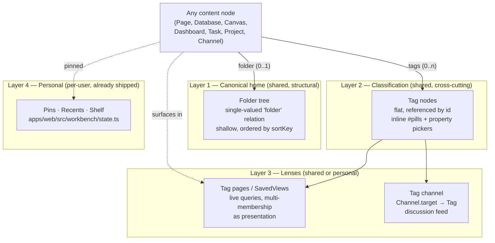
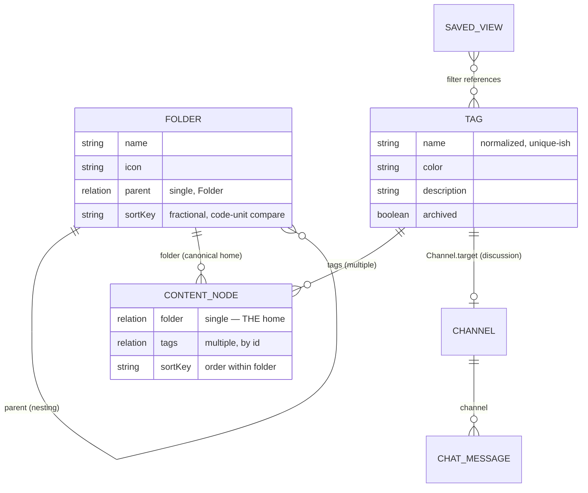
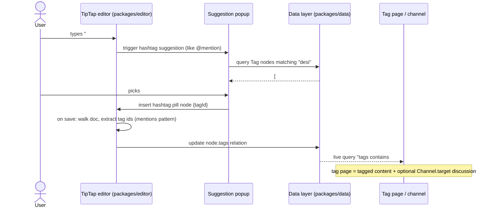

# Content Organization: Folders, Tags, and Hashtag Channels

## Problem Statement

xNet now has a healthy population of content types — Pages, Databases,
Canvases, Dashboards, Tasks, Projects, Channels — but no way to _organize_
them. The Explorer (`apps/web/src/workbench/views/Explorer.tsx`) is a single
flat, virtualized list filtered by type, with client-side pins and recents.
There are no folders, no tags, no categories. Every workspace becomes a
junk drawer at ~50 nodes.

The ask: design the organizational layer. Candidate mechanisms include
folders (hierarchy, canonical location), tags/hashtags (flat, cross-cutting,
possibly inline in content the way Obsidian and Bear do it), categories, and
the intriguing idea that **a hashtag could be a channel** — a place where
tagged content and conversation about it accumulate. Survey how Google
Drive, Notion, Linear, GitHub, Slack, Obsidian, Bear, and Tana handle
hierarchy and taxonomy; keep the result as simple as possible; prioritize
tools users wield themselves over automatic organization.

## Executive Summary

- **Ship both folders and tags, but give each one a narrow, distinct job.**
  Decades of personal-information-management research (Malone, Barreau &
  Nardi, Bergman, Civan) and every mass-market tool converge on the same
  three-layer stack: **(1)** one canonical home per item (folder), **(2)** a
  small cross-cutting classification layer (tags), **(3)** saved views as
  the bridge that delivers multi-membership without breaking the
  "where does it live?" mental model. Folders answer _where it belongs_;
  tags answer _what it relates to_; views answer _show me everything that…_.
- **Folders are nearly free in the current data model.** A `Folder` schema
  plus a single-valued `folder` relation on organizable content nodes —
  child-points-to-parent, exactly like `Task.parent` and
  `ChatMessage.channel` (`packages/data/src/schema/schemas/task.ts`,
  `channel.ts`) — gives a tree with single canonical location _enforced by
  the data model_, ordered by the existing fractional `sortKey` machinery
  (`packages/data/src/database/fractional-index.ts`). Google Drive removed
  multi-parent folders in 2020 at enormous migration cost; we get that
  lesson for free by making the relation single-valued.
- **Tags are nodes, and hashtags are structured references — never parsed
  text.** This follows the structured-mentions invariant from exploration
  0168 (`packages/editor/src/utils/mentions.ts`): an inline `#tag` in a
  page, comment, or chat message is a TipTap pill node referencing a `Tag`
  node by id, extracted into a structured `tags` relation on save. Because
  the reference is by id, renaming a tag renames it everywhere — the single
  biggest defense against tag rot that text-based systems (Obsidian,
  Bear) can't offer.
- **"Hashtag as channel" works today with zero new schema.** `Channel.target`
  already attaches a channel to any node
  (`packages/data/src/schema/schemas/channel.ts:45`). A tag's detail page is
  a live query of everything tagged plus an optional attached discussion
  channel. A tag becomes a _feed_: content + conversation. This is the
  Slack/Zulip "channel as topic container" insight grafted onto a
  tag system, without forcing all content to live inside channels.
- **Keep it deliberately small.** No nested tags, no folder ACLs, no
  multi-parent anything, no auto-classification in v1. Linear's whole brand
  is that constraint beats flexibility at scale, and the literature shows
  optional taxonomy goes unused (Apple's tags, 12 years old, still niche).
  The personal pinning layer already exists (`apps/web/src/workbench/state.ts`)
  and stays as-is.

## Current State In The Repository

### The substrate is already organization-shaped

| Capability                                               | Where                                                                                       | Relevance                                                                                                                      |
| -------------------------------------------------------- | ------------------------------------------------------------------------------------------- | ------------------------------------------------------------------------------------------------------------------------------ |
| Universal node model (`id`, `schemaId`, open properties) | `packages/data/src/schema/node.ts`                                                          | Folders and Tags are just two more schemas                                                                                     |
| Typed relations, single or multiple                      | `packages/data/src/schema/properties/relation.ts`                                           | Containment (`folder`) and classification (`tags`) are relation properties                                                     |
| Fractional sort keys, O(1) insert, base-62               | `packages/data/src/database/fractional-index.ts`                                            | Manual ordering inside a folder; **compare by code units only** (`compareSortKeys` in `sort-engine.ts`), never `localeCompare` |
| Child-points-to-parent containment precedent             | `Task.parent`, `Task.project`, `ChatMessage.channel` in `packages/data/src/schema/schemas/` | Avoids CRDT conflicts on a giant `children` array; ordering lives on the child's own `sortKey` (same as `DatabaseRow`)         |
| Membership-edge precedent (multi-membership)             | `SocialCollectionItemSchema` in `packages/social/src/schemas/collection.ts`                 | The pattern for _non-canonical_ groupings — playlists/collections, not homes                                                   |
| Channels attachable to any node                          | `Channel.target` in `packages/data/src/schema/schemas/channel.ts`                           | Tag pages can host discussion with no schema change                                                                            |
| Structured mentions (pills, never text parsing)          | `packages/editor/src/extensions.ts`, `packages/editor/src/utils/mentions.ts`                | The exact template for inline `#hashtag` pills                                                                                 |
| Wikilinks `[[page]]`                                     | `packages/editor/src/extensions.ts`                                                         | Proof the editor supports inline reference nodes with suggestion popups                                                        |
| Saved/filtered views as nodes                            | `saved-view.ts`, `task-view.ts`, `database-view.ts` in `packages/data/src/schema/schemas/`  | The "smart folder" layer already exists                                                                                        |
| Type filtering in the sidebar                            | `apps/web/src/workbench/views/explorer-filter.ts`                                           | "Categories" are already covered by type; tags need not re-do this                                                             |
| Pins, recents, shelf (client-side Zustand)               | `apps/web/src/workbench/state.ts`                                                           | The personal layer; persisting it later must respect the `VITE_STORAGE_SCOPE` invariant for new client stores                  |
| Full-text search (hub SQLite FTS5)                       | `packages/data/src/database/query-router.ts`                                                | Indexes `schemaIri` + `title` today; tag names need to join the index                                                          |
| Per-node authorization via Grants                        | `packages/data/src/schema/schemas/grant.ts`                                                 | Permissions are per-node/schema, _not_ per-container — folders should not pretend to carry ACLs in v1                          |

### What does not exist

- No `Folder`, `Tag`, or `Workspace` node type (workspace exists only as a
  permission-path concept in `packages/core/src/permissions.ts`).
- No hashtag editor extension, no `tags` property on any schema.
- No hierarchy in the Explorer — pins, recents, then a flat type-filtered list.
- Database multi-select options (`database-select-option.ts`) are scoped to
  one database, like Notion's — they are _fields_, not workspace taxonomy,
  and should stay that way.

## External Research

### How the well-known tools do it

- **Google Drive** — strict folder tree. Until 2020 a file could have
  multiple parent folders; Google removed this ("every item will have
  exactly one location") because multi-parenting broke ownership,
  permissions, and sync, replacing it with shortcut pointers. Cross-cutting
  needs are served by Starred, and (in paid tiers) admin-defined typed
  labels. The ML-curated Priority/Workspaces feature shipped 2019, was
  deprecated 2024 — a cautionary tale for "smart" organization layers.
- **Notion** — no folders; the page tree _is_ the hierarchy, and location
  doubles as the permission boundary (teamspaces at the top). No global
  tags: classification lives in database properties (select/multi-select),
  scoped to one database. Chronic complaints: sprawl, pages buried at
  depth, and _no way to tag arbitrary pages across the workspace_.
- **Linear** — fixed shallow hierarchy (workspace → team → project →
  issue), no folders, and labels as the only cross-cutting mechanism, with
  **single-select label groups** turning tags into lightweight enums. Their
  philosophy: "flexible software lets everyone invent their own workflows,
  which eventually creates chaos as teams scale."
- **GitHub** — the cleanest separation of concerns: repos are hard
  containers (home + permissions), labels are flat per-repo classification,
  Projects are cross-cutting saved views with their own fields. Top
  complaint: labels don't span repos, so taxonomies diverge.
- **Slack** — channels are the only container; taxonomy is faked with
  naming conventions (`#proj-`, `#help-`) and personal sidebar sections.
  Proof that _convention plus flat namespace_ scales socially but rots
  without enforcement, and that personal hierarchy over shared flat
  structure is a good split.
- **Obsidian** — folders + inline `#tags` + `[[links]]` coexist with zero
  enforcement. Community consensus after years of debate: folders for
  "where it belongs," tags for "what status/kind," links for "how it
  connects." The cost is decision paralysis for new users — three
  overlapping systems and no defaults.
- **Bear** — no folders at all; nested `#tag/subtag` _is_ the folder tree.
  Elegant, but most users just rebuild a rigid tree out of nested tags, and
  organizational metadata lives inside note text.
- **Tana** — supertags: a tag is simultaneously a type, a schema (fields),
  and a template. The most powerful design in the market and the most
  overwhelming; there is a genre of "use Tana without supertags" content.
  (xNet already has real schemas — we don't need tags to be types.)
- **Apple Notes / Finder** — folders + tags + Smart Folders (saved
  searches presented as folders). The cleanest mainstream hybrid and a
  chronic adoption failure: optional tagging layered on default folders
  goes mostly unused. **Default structure gets used; optional taxonomy
  doesn't.**

### What the research literature says

- People **navigate rather than search**, even when search is excellent
  (Barreau & Nardi 1995; Teevan et al. 2004 "orienteering" — ~61% of
  directed retrieval used no keyword search). A browse structure cannot be
  replaced by good search; search complements it.
- When offered both, users **strongly prefer folders** for storing _and_
  retrieving, and even tag users mostly apply a single tag per item
  (Bergman et al. 2013). People _say_ they like multi-classification but
  don't maintain it — the canonical "tags don't get maintained" result.
- Users build **broad, shallow hierarchies**; depth costs retrieval time
  (Bergman 2010). Retrieval suffers most in structures _someone else_
  organized (Bergman 2014) — shared structure should be simple, personal
  structure layered on top.
- Neither pure model wins; the recommendation since Civan et al. 2008 is a
  **synthesis**: folders' reminding/navigation virtues plus limited,
  structured multi-classification.
- Freeform folksonomies reliably develop synonym sprawl, misspellings, and
  private vocabularies. Every successful mitigation constrains the
  vocabulary: Linear's label groups, GitHub's org-seeded defaults, Drive's
  admin labels, Notion's database-scoped selects, Slack's "keep your prefix
  dictionary under 15."

## Key Findings

1. **The winning pattern is a stack, not a choice.** Folders vs tags is a
   false dichotomy; every durable tool ships _canonical home + constrained
   classification + saved views + personal pins_. xNet already has two of
   the four layers (saved views, pins).
2. **Single canonical location must be enforced by the model, not by
   convention.** Google's 2020 retreat from multi-parenting is the
   strongest industry datapoint. A single-valued `folder` relation makes
   the invariant structural.
3. **Tag-by-reference beats tag-by-text.** Because xNet tags can be nodes
   referenced by id (the mention-pill pattern), renames propagate
   everywhere instantly and merges are tractable — eliminating the two
   biggest folksonomy failure modes. Obsidian and Bear cannot do this;
   we can.
4. **"Hashtag as channel" is the differentiator, and it's cheap.**
   `Channel.target` already exists. A tag page that shows tagged content
   _plus_ a discussion thread turns taxonomy into a social surface — closer
   to how people actually rally around topics (Slack channels, Twitter
   hashtags) than any file-manager tag pane.
5. **Categories need no new mechanism.** Type filtering
   (`explorer-filter.ts`) already covers "show me all Databases"; database
   select fields cover Notion-style local categories. Adding a third global
   mechanism would violate the simplicity goal.
6. **Auto-organization should wait.** Drive's Priority page (ML-curated)
   was deprecated; the research shows users distrust structures they didn't
   build. Cheap assists (tag autocomplete ranking, "recently used folder"
   defaults) are fine; auto-filing is not.

## Options And Tradeoffs

|                             | A: Folders only                                            | B: Tags only (Bear)                         | C: Folders + referenced tags (recommended)       | D: Channel-first (Slack)                                               | E: Views only (Notion)                               |
| --------------------------- | ---------------------------------------------------------- | ------------------------------------------- | ------------------------------------------------ | ---------------------------------------------------------------------- | ---------------------------------------------------- |
| Mental model                | "Where does it live?" — universally understood             | One mechanism for both jobs                 | Two mechanisms, two clearly distinct jobs        | "Everything is a conversation"                                         | "Everything is a database"                           |
| Cross-cutting grouping      | None (item in one place only)                              | Excellent                                   | Excellent (tags + saved views)                   | Per-channel only                                                       | Excellent but heavyweight                            |
| Risk of rot                 | Deep stale trees                                           | Synonym sprawl, tag graveyards              | Low: id-referenced tags rename/merge cleanly     | Channel sprawl, zombie channels                                        | Database/sprawl, buried pages                        |
| Fit to existing code        | `parent` pattern exists                                    | Mention-pill pattern exists                 | Both patterns exist                              | Channels exist but forcing docs _into_ channels fights `target` design | SavedView exists but no global tag property to query |
| Social/conversational angle | None                                                       | None                                        | Tag pages can host channels via `Channel.target` | Native                                                                 | None                                                 |
| Simplicity for v1           | Highest                                                    | High                                        | Medium — but each half is small                  | Medium                                                                 | Low                                                  |
| Literature verdict          | Users prefer it but ask for cross-cutting layer eventually | Users don't maintain tags as sole mechanism | The Civan 2008 synthesis                         | Convention-dependent                                                   | Location-permission coupling causes sprawl           |

**Why not B:** Bergman's results are blunt — tag-only systems fight how
people actually file. Bear works because it's single-user notes; xNet is a
multi-surface, multi-user workspace.

**Why not D:** xNet channels were deliberately designed (exploration 0167)
so that _channels attach to content_, not the reverse. Inverting that to
make channels the container would re-architect comms for an organizational
problem folders solve more simply.

**Why not E:** Notion's model couples location to permissions and still
leaves users begging for workspace-wide tags. xNet's grants are per-node
already; we don't need the page tree to do double duty.

**Within option C, one sub-decision matters — how containment is stored:**

|                       | Child holds `folder` relation (chosen)                    | Folder holds `children` list               | Membership edge nodes        |
| --------------------- | --------------------------------------------------------- | ------------------------------------------ | ---------------------------- |
| CRDT behavior         | Concurrent moves = last-writer-wins on one small property | Concurrent edits conflict on one hot array | Clean, but allows duplicates |
| Single-home invariant | Structural (single-valued relation)                       | Must be validated                          | Must be validated            |
| Precedent             | `Task.parent`, `ChatMessage.channel`                      | none                                       | `SocialCollectionItem`       |
| Ordering              | Child's own `sortKey` (same as `DatabaseRow`)             | Array order                                | Edge `sortKey`               |

The membership-edge pattern stays reserved for what it already does:
_non-canonical_ collections (playlists, social imports) where
multi-membership is the point.

## Recommendation

**Ship option C in three thin phases: folders first, tags second, tag
channels third.** One home, many lenses.



### The data model



Design rules, each traceable to a research finding:

1. **Every item has at most one folder; no folder ⇒ it appears in
   "Unfiled".** No orphans (the pure-graph failure mode), no
   multi-parenting (the Drive lesson). Moving = writing one property.
2. **Folders are shallow by nudge, not by law.** The UI indents to ~4
   levels comfortably and stops making deeper nesting attractive
   (Bergman 2010). No hard limit in the schema.
3. **Folders carry zero permissions in v1.** Grants stay per-node. A
   folder is navigation, not a security boundary — say so in the UI. (Open
   question below for v2.)
4. **Tags are flat, lowercase-normalized on create, and autocomplete-first**:
   typing `#` surfaces existing tags before offering "create new" — the
   cheapest anti-sprawl mechanism known to work (GitHub default labels,
   Slack prefix dictionaries).
5. **Inline hashtags follow the mentions invariant exactly**: pills in
   TipTap referencing Tag ids, extracted by walking the document
   (`extractMentionDids` precedent in `packages/editor/src/utils/mentions.ts`)
   into the node's structured `tags` relation. Raw `#text` in content is
   never parsed server-side. Hashtags therefore work in pages, comments,
   and chat messages on day one; Tasks and Database rows get a tag _picker_
   (same Tag nodes) since their titles are plain text.
6. **The tag page is the payoff**: a live query of all tagged nodes
   (grouped by type, using the existing query layer) plus — phase 3 — an
   attached channel for discussion. Tagging something is, socially,
   _posting it to the topic_.

### The hashtag flow



### What we deliberately do not build

- **Nested tags** — Bear shows they just become a second folder tree.
  Revisit only if flat tags demonstrably sprawl.
- **Tags-as-schemas (Tana supertags)** — xNet has real schemas; tags stay
  dumb labels.
- **Auto-filing / ML curation** — Drive Priority died; assists only
  (autocomplete ranking by recency/frequency, default folder = last used).
  A later "suggested tags" affordance can rank by content similarity, but
  always as a one-tap suggestion the user confirms.
- **A third "category" mechanism** — type filters and database select
  fields already cover it.

## Example Code

New schemas, in repo idiom (cf. `channel.ts`, `collection.ts`):

```ts
// packages/data/src/schema/schemas/folder.ts
import type { InferNode } from '../types'
import { defineSchema } from '../define'
import { created, createdBy, relation, text } from '../properties'

/**
 * FolderSchema - canonical container (exploration 0169).
 *
 * Containment is stored on the CHILD as a single-valued `folder`
 * relation (see Task.parent precedent) — one home per node, enforced
 * structurally. Folders nest via their own `parent`. Folders carry no
 * permissions; Grants remain per-node.
 */
export const FolderSchema = defineSchema({
  name: 'Folder',
  namespace: 'xnet://xnet.fyi/',
  properties: {
    name: text({ required: true, maxLength: 120 }),
    icon: text({ maxLength: 80 }),
    /** Parent folder; empty = top level */
    parent: relation({ target: 'xnet://xnet.fyi/Folder@1.0.0' }),
    /** Order among siblings — fractional index, code-unit compare */
    sortKey: text({ maxLength: 500 }),
    createdAt: created(),
    createdBy: createdBy()
  },
  document: undefined
})
export type Folder = InferNode<(typeof FolderSchema)['_properties']>
```

```ts
// packages/data/src/schema/schemas/tag.ts
import type { InferNode } from '../types'
import { defineSchema } from '../define'
import { checkbox, created, createdBy, text } from '../properties'

/**
 * TagSchema - flat, workspace-wide label (exploration 0169).
 *
 * Content references tags BY ID via a `tags` relation; inline #hashtags
 * are editor pills extracted like mentions (never parsed from text).
 * Renaming a tag therefore renames it everywhere. `name` is normalized
 * lowercase on create; uniqueness is enforced at creation UI + an
 * eventual merge tool, not by the schema.
 */
export const TagSchema = defineSchema({
  name: 'Tag',
  namespace: 'xnet://xnet.fyi/',
  properties: {
    name: text({ required: true, maxLength: 80 }),
    color: text({ maxLength: 30 }),
    description: text({ maxLength: 500 }),
    archived: checkbox({ default: false }),
    createdAt: created(),
    createdBy: createdBy()
  },
  document: undefined
})
export type Tag = InferNode<(typeof TagSchema)['_properties']>
```

Organizable content schemas (Page, Database, Canvas, Dashboard, Project,
Channel) each gain two properties:

```ts
// added to e.g. packages/data/src/schema/schemas/page.ts properties
/** Canonical home; empty = Unfiled (exploration 0169) */
folder: relation({ target: 'xnet://xnet.fyi/Folder@1.0.0' }),
/** Workspace-wide labels, referenced by id */
tags: relation({ target: 'xnet://xnet.fyi/Tag@1.0.0', multiple: true }),
```

(Task already has `sortKey`; Page/Database/etc. gain `sortKey` for ordering
within their folder, mirroring `DatabaseRow`.)

Hashtag extraction mirrors `extractMentionDids`:

```ts
// packages/editor/src/utils/hashtags.ts (sketch)
export function extractTagIds(doc: ProseMirrorNode): string[] {
  const ids = new Set<string>()
  doc.descendants((node) => {
    if (node.type.name === 'hashtag' && typeof node.attrs.tagId === 'string') {
      ids.add(node.attrs.tagId)
    }
  })
  return [...ids]
}
```

And the phase-3 tag channel needs nothing new at all:

```ts
// Attaching discussion to a tag — existing Channel schema, existing target relation
createNode(ChannelSchema, { name: `#${tag.name}`, kind: 'channel', target: tag.id })
```

## Risks And Open Questions

- **Schema migration breadth.** Adding `folder`/`tags`/`sortKey` touches
  every organizable schema. The lens/migration system
  (`packages/data/src/schema/lens.ts`) handles versioning, but each schema
  bump needs a migration path and the hub index may need re-publishing.
  Mitigation: optional properties, additive change, single PR per phase.
- **Tag name collisions across peers.** Two offline users create `#design`
  independently → two Tag nodes with one name. Options: dedupe-on-sight in
  the picker (show one, merge later), or deterministic tag ids derived from
  normalized name (like `dmChannelId` in `@xnetjs/comms`). The
  deterministic-id route is tempting but freezes renames; **recommend
  picker-level dedupe + a merge tool**, and treat tag merge as a v1.1 item.
- **Folder ⇄ permission expectations.** Users coming from Drive/Notion will
  assume putting a node in a shared folder shares it. It will not. The UI
  must message this clearly; a v2 could auto-issue Grants on folder move,
  but that's a deliberate security design, not a checkbox.
- **Unfiled overload.** If most content stays Unfiled, the folder layer
  failed. Watch the ratio; assists (default folder = folder of the view
  you created the node from) directly attack this.
- **Hashtags in chat messages** add a `tags` extraction step to the message
  composer; keep the structured-mentions rule (never parse text) and the
  flat-threading model intact.
- **Search integration.** Hub FTS indexes `schemaIri` + `title`
  (`packages/data/src/database/query-router.ts`); tag names must flow into
  the index metadata so searching "design" finds tagged nodes. Needs a small
  `index-update` payload extension.
- **Does Folder appear in the Explorer type filter?** Recommend no — folders
  _are_ the structure, not items within it.

## Implementation Checklist

### Phase 1 — Folders (the home)

- [ ] Add `FolderSchema` (`packages/data/src/schema/schemas/folder.ts`) + register in `schemas/index.ts`
- [ ] Add optional `folder` relation + `sortKey` to Page, Database, Canvas, Dashboard, Project, Channel schemas (with lens migrations)
- [ ] Explorer: render folder tree above the flat list — expand/collapse, indent capped visually at ~4 levels, "Unfiled" section for homeless nodes
- [ ] Drag-and-drop move (reuse existing NodeTransfer drag machinery in `Explorer.tsx`); reorder siblings via `generateSortKey` between neighbors
- [ ] Create/rename/delete folder (delete ⇒ children move to parent or Unfiled, never cascade-delete content)
- [ ] Breadcrumb in tab header showing folder path
- [ ] "Move to folder…" command in the node context menu / command palette
- [ ] Default-folder assist: creating a node while a folder is open files it there

### Phase 2 — Tags (the labels)

- [ ] Add `TagSchema` + register; lowercase-normalize `name` on create
- [ ] Add `tags` multi-relation to the same organizable schemas + Task + ChatMessage + Comment
- [ ] TipTap `hashtag` pill extension with `#` suggestion popup (clone the mention extension pattern in `packages/editor/src/extensions.ts`); autocomplete lists existing tags before "create new"
- [ ] `extractTagIds` in `packages/editor/src/utils/hashtags.ts` + wire into page/comment/chat save paths (mirror mention extraction)
- [ ] Tag picker component in `packages/ui` for Tasks and Database rows (and remember the dual export list when adding to `packages/ui`)
- [ ] Tag browse: sidebar "Tags" section listing tags by usage count; tag detail page = live query of tagged nodes grouped by type
- [ ] Include tag names in hub FTS `index-update` metadata
- [ ] Tag management: rename (propagates by reference), archive, and a merge tool (re-point `tags` relations, archive loser)

### Phase 3 — Tag channels & lenses (the bridge)

- [ ] "Start discussion" on a tag page → create Channel with `target: tagId`, render chat inline on the tag page
- [ ] Hashtag pills in chat messages link to the tag page
- [ ] SavedView support for tag filters ("smart folder": pin a saved tag query into the sidebar)
- [ ] Optional: notification on activity in tags you follow (reuse InboxState patterns from 0168)

## Validation Checklist

- [ ] Schema unit tests: folder nesting, cycle prevention on `parent` (a folder cannot be its own ancestor), tag name normalization
- [ ] `extractTagIds` tests mirroring `mentions.ts` tests: pills extracted, raw `#text` in prose ignored
- [ ] Sort: sibling reorder uses `compareSortKeys` (code-unit), verified against the fractional-index test suite
- [ ] e2e (Playwright): create folder → drag page in → appears nested → survives reload (worker-resident data layer round-trip)
- [ ] e2e: type `#` in a page → pick existing tag → tag page lists the page; rename the tag → pill text updates everywhere
- [ ] Concurrent-move test: two clients move the same node to different folders → converges to one home, no duplicates
- [ ] Perf: tag-page query over 10k nodes stays within the 0163 hot-path budgets
- [ ] Unfiled ratio observable: count of homeless nodes exposed in dev tooling
- [ ] UX check: sharing messaging — moving a node into a folder visibly does _not_ change who can see it

## References

### Internal

- `packages/data/src/schema/node.ts`, `types.ts`, `properties/relation.ts` — node/relation substrate
- `packages/data/src/schema/schemas/` — `channel.ts`, `chat-message.ts`, `task.ts`, `saved-view.ts`, `database-select-option.ts`
- `packages/data/src/database/fractional-index.ts`, `sort-engine.ts`, `query-router.ts`
- `packages/social/src/schemas/collection.ts` — membership-edge precedent
- `packages/editor/src/extensions.ts`, `packages/editor/src/utils/mentions.ts` — pill + extraction precedent
- `apps/web/src/workbench/views/Explorer.tsx`, `explorer-filter.ts`, `apps/web/src/workbench/state.ts`
- Explorations: 0153 (workspace UI), 0159 (database v2), 0161 (tasks), 0166 (workbench shell), 0167/0168 (comms & inbox)

### External

- Google Drive single-location migration: https://workspace.google.com/blog/product-announcements/simplifying-google-drives-folder-structure-and-sharing-models ; https://workspaceupdates.googleblog.com/2020/08/expanding-shortcuts-google-drive.html
- Notion structure & teamspaces: https://www.notion.com/help/intro-to-workspaces ; https://www.notion.com/help/guides/structure-sidebar-focused-work-teamspaces
- Linear method & labels: https://linear.app/method/introduction ; https://linear.app/docs/labels ; https://www.figma.com/blog/the-linear-method-opinionated-software/
- GitHub labels/topics/projects: https://docs.github.com/en/issues/using-labels-and-milestones-to-track-work/managing-labels ; https://docs.github.com/en/issues/planning-and-tracking-with-projects/learning-about-projects/about-projects ; cross-repo labels ask: https://github.com/github/roadmap/issues/276
- Slack channel conventions & sections: https://slack.com/help/articles/217626408-Create-guidelines-for-channel-names ; https://slack.com/resources/using-slack/how-to-organize-your-slack-channels
- Obsidian folders/tags/links debate: https://forum.obsidian.md/t/folders-vs-linking-vs-tags-the-definitive-guide-extremely-short-read-this/78468 ; https://forum.obsidian.md/t/a-guide-on-links-vs-tags-in-obsidian/28231/37 ; MOCs: https://obsidian.rocks/maps-of-content-effortless-organization-for-notes/
- Bear nested tags: https://blog.bear.app/2017/08/bear-tips-organize-notes-with-tags-and-infinite-nested-tags/
- Tana supertags: https://outliner.tana.inc/knowledge-graph
- Apple Notes/Finder smart folders & tags: https://support.apple.com/en-us/102288 ; https://support.apple.com/guide/mac-help/tag-files-and-folders-mchlp15236/mac
- Malone 1983 (filing vs piling): https://www.semanticscholar.org/paper/b08de5e5f8463310a02b3f047bf57ab1d7980a82
- Barreau & Nardi 1995 (finding & reminding): https://www.semanticscholar.org/paper/baceefac11c911fa0b3387553c704a065b8a7e1d
- Teevan et al. 2004 (orienteering): https://www.microsoft.com/en-us/research/publication/perfect-search-engine-not-enough-study-orienteering-behavior-directed-search/
- Bergman et al. — folders vs tags preference (2013): https://onlinelibrary.wiley.com/doi/abs/10.1002/asi.22906 ; attitudes vs behavior: https://asistdl.onlinelibrary.wiley.com/doi/10.1002/meet.14505001029 ; folder depth (2010): https://onlinelibrary.wiley.com/doi/10.1002/asi.21415 ; shared structures (2014): https://asistdl.onlinelibrary.wiley.com/doi/abs/10.1002/asi.23147
- Civan et al. 2008 (folders vs tags, "devil is in the details"): https://kftf.ischool.washington.edu/rerecentpublicationaboutplanner/Civan%20et%20al,%202008,%20Better%20to%20organize%20bv%20folders%20or%20by%20tags.pdf
- Folksonomy pathologies: https://en.wikipedia.org/wiki/Folksonomy ; file-management research survey (Dinneen & Julien 2020): https://asistdl.onlinelibrary.wiley.com/doi/10.1002/asi.24222
