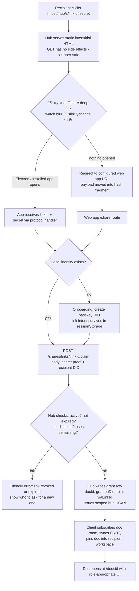
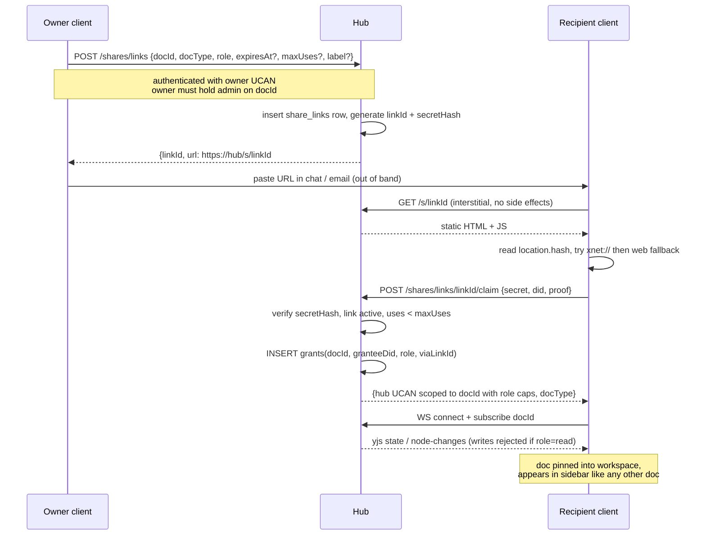
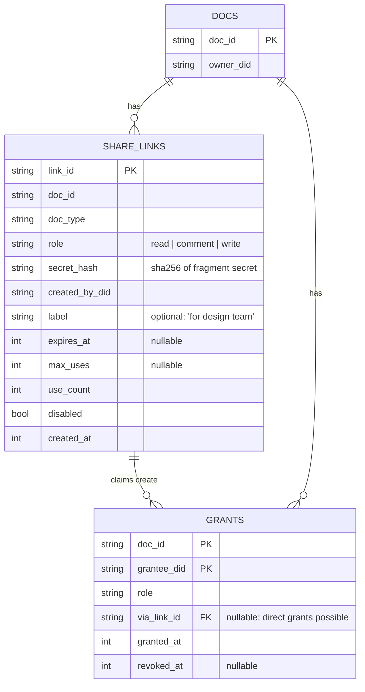
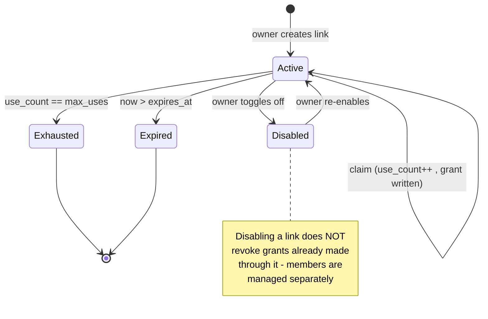

# Share Via URL And Access Control

## Problem Statement

Sharing in xNet today means copying a raw, type-prefixed document ID
(`page:abc123`) and having the recipient paste it into an "Add Shared"
dialog. This is brittle in exactly the way the prompt describes: the ID
is meaningless without out-of-band knowledge of _which hub server_ to
connect to, it carries no permissions, it can never be revoked, and it
assumes the recipient already runs xNet pointed at the same hub.

We want sharing to be a URL: paste a link into chat or email, the
recipient clicks it, the right surface opens (web, Electron, eventually
mobile), they authenticate, and the shared thing — page, database,
canvas, dashboard, eventually folders/projects/workspaces — appears in
their workspace with the permissions the link grants (read / comment /
write). Around that, we want a real sharing workflow: see who has
access, what role each link grants, which links are still active, and
disable any of them.

Open design questions this exploration answers:

1. **What host should the URL point at?** The web app's domain, the hub
   server, a neutral redirector, or nothing (self-contained payload)?
2. **What should be _in_ the URL** — a database-backed token, a signed
   capability, a document ID plus server hints, key material?
3. **How does one URL open the right surface** across web (hash-routed
   GitHub Pages), Electron (`xnet://` protocol), and Expo (no linking
   configured yet)?
4. **How does a link become durable access** — what happens at "claim"
   time, and what does revocation mean afterwards?
5. **Where does pure peer-to-peer sharing fit** when there is no URL?

## Executive Summary

The codebase is much closer to this feature than the current UX
suggests. Three partially-connected systems already exist:

- The hub has one-shot share handles (`POST /shares/issue` /
  `POST /shares/redeem`, [server.ts:696](packages/hub/src/server.ts:696))
  — but they are in-memory, single-use, and capped at 30 minutes:
  device-handoff semantics, not share-link semantics.
- `packages/identity/src/sharing/` can mint signed UCAN share tokens and
  even formats `https://xnet.fyi/s/<payload>` links
  ([create-share.ts:71](packages/identity/src/sharing/create-share.ts:71))
  — but nothing in the web app consumes them; there is no `/s/` route.
- The web app has a `/share` bridge route that deep-links into Electron
  and falls back to the web app
  ([share.tsx](apps/web/src/routes/share.tsx)), and Electron registers
  the `xnet://` protocol
  ([main/index.ts](apps/electron/src/main/index.ts)) — but the visible
  Share button still copies `page:<id>`
  ([ShareButton.tsx:22](apps/web/src/components/ShareButton.tsx)).

**Recommendation in one paragraph:** make the **hub the URL authority**.
A share link is `https://<hub-host>/s/<linkId>#<secret>`. The hub is the
one piece of infrastructure sharer and recipient must both reach anyway
— if the recipient can't reach your hub, no amount of URL design will
get them the document. The hub gains a tiny HTML interstitial at
`GET /s/:linkId` (it currently serves only JSON + WebSocket) that tries
the `xnet://` deep link and falls back to a configured web app URL.
Share links become **durable, revocable records in hub SQLite** (role,
expiry, use count, disabled flag) instead of 30-minute in-memory
handles. Redeeming a link records a **per-identity grant** — the link is
a bootstrap; afterwards the recipient's own DID carries the access, so
links can be rotated or disabled without kicking existing collaborators
(the DXOS / Dropbox pattern, not the Notion "the URL is the document ID
forever" trap). The secret lives in the **URL fragment** so it never
hits server logs, link-preview scanners can't consume it, and the same
slot can later carry end-to-end encryption keys. Strictly-P2P sharing
stays as a secondary path: the same payload encoding rendered as a QR
code / paste string, which the Electron dialog already accepts.

## Current State In The Repository

### What the user touches today

| Piece             | File                                                                                                                            | Behavior                                                                                               |
| ----------------- | ------------------------------------------------------------------------------------------------------------------------------- | ------------------------------------------------------------------------------------------------------ |
| Share button      | [apps/web/src/components/ShareButton.tsx](apps/web/src/components/ShareButton.tsx)                                              | Copies `${docType}:${docId}` to clipboard; popover says "Both users must be online for real-time sync" |
| Add Shared dialog | [apps/web/src/components/AddSharedDialog.tsx](apps/web/src/components/AddSharedDialog.tsx)                                      | Parses `type:id`, navigates to `/doc/$docId`, `/db/$dbId`, or `/canvas/$canvasId`                      |
| Doc routes        | [apps/web/src/routes/doc.$docId.tsx](apps/web/src/routes/doc.$docId.tsx) (and `db.`, `canvas.`, `dashboard.`, `view.` siblings) | TanStack Router file routes keyed by raw node ID                                                       |

There is no permission attached to a shared ID, no record of who it was
shared with, and no way to un-share.

### The dormant share-URL machinery

**Hub share handles** ([packages/hub/src/server.ts:696-793](packages/hub/src/server.ts:696)):
`POST /shares/issue` (UCAN-authenticated) stores
`{handle: sh_<random>, endpoint, token, resource, docType, exp}` in an
in-memory `Map`, capping TTL at 30 minutes. `POST /shares/redeem`
(unauthenticated) returns the bundle exactly once — replay-cached,
deleted on use. This is a secure _session handoff_, not a share link:
it dies on hub restart, can't be listed, can't be revoked individually,
and admits exactly one recipient.

**UCAN share tokens** ([packages/identity/src/sharing/](packages/identity/src/sharing/create-share.ts)):
`createShareToken(issuerDid, signingKey, {resource, permission})` signs
a UCAN with capabilities derived from `read | write | admin`
(`xnet/read`, `xnet/write`, `xnet/admin`), encodes
`{v:1, r: resource, u: token, h?: hubUrl}` as base64url, and formats
`https://xnet.fyi/s/<encoded>`. `parse-share.ts` verifies it. A
`RevocationStore` exists ([revocation.ts](packages/identity/src/sharing/revocation.ts))
but is in-memory and unwired. **No app route consumes `/s/` links.**
The plan doc [docs/plans/plan03_9_1OnboardingAndPolish/04-sharing-permissions.md](docs/plans/plan03_9_1OnboardingAndPolish/04-sharing-permissions.md)
sketches this flow but its validation gate ("recipients can access
shared content via link") is unmet.

**The `/share` bridge** ([apps/web/src/routes/share.tsx](apps/web/src/routes/share.tsx)):
accepts `?handle=sh_…` or `?payload=<base64url SharePayloadV2>`,
attempts `xnet://share?…` with a 1-second timeout, then falls back to
web: redeems the handle against `VITE_HUB_URL`, stashes
`{endpoint, token, resource, docType, exp}` in `sessionStorage`, and
redirects to `/doc/<id>?shareSession=<key>`.
[App.tsx](apps/web/src/App.tsx) (`resolveHubSessionFromLocation`, lines
82–119) picks the session up and hands hub URL + auth token to
`XNetProvider`. It even sets `no-referrer` and strips the query from
history — someone thought about leakage.

**Electron deep links** ([apps/electron/src/main/index.ts](apps/electron/src/main/index.ts)):
`app.setAsDefaultProtocolClient('xnet')`; validates
`xnet://share?handle=sh_…` (regex `^sh_[A-Za-z0-9_-]{16,}$`) or
`?payload=…` (≤8192 base64url chars); forwards over IPC
(`xnet:share-payload`) where the renderer opens the AddSharedDialog
pre-filled ([renderer/App.tsx:142](apps/electron/src/renderer/App.tsx)).

### The enforcement substrate

The hub already authenticates every WebSocket session with UCANs and
checks per-document capabilities
([packages/hub/src/auth/capabilities.ts](packages/hub/src/auth/capabilities.ts):
`hub/signal`, `hub/relay`, `hub/backup`, `files/*`, `index/write`…).
Node mutations arrive as **signed envelopes** verified server-side
(`node-change` handler, [server.ts:1236](packages/hub/src/server.ts)).
Storage already has a **grant index** —
`listGrantedDocIds(granteeDid)` ([storage/interface.ts:335](packages/hub/src/storage/interface.ts:335))
backed by SQLite — which is exactly the durable "who has access to
what" table a sharing UI needs to read. What's missing is the writer:
nothing turns a share link into a grant row, and read-only vs write
roles are not differentiated at relay time.

### Platform surfaces

| Surface                                     | URL handling today                                                                                                                                  | Constraint                                                                                            |
| ------------------------------------------- | --------------------------------------------------------------------------------------------------------------------------------------------------- | ----------------------------------------------------------------------------------------------------- |
| Web (GitHub Pages, `https://xnet.fyi/app/`) | TanStack Router, **hash routing** (`VITE_USE_HASH_ROUTER=true` in [deploy-site.yml](.github/workflows/deploy-site.yml))                             | Path URLs like `/app/doc/x` 404 on Pages; links must be `…/app/#/share?…`                             |
| Electron                                    | `xnet://share` protocol handler, IPC to renderer                                                                                                    | Custom schemes aren't clickable in most email clients; needs the web interstitial in front            |
| Expo                                        | None — [app.json](apps/expo/app.json) declares no `scheme`, no associated domains; identity is a random Ed25519 key in SecureStore, no hub sync yet | Deep links are a from-scratch project here                                                            |
| Hub (Railway, `wss://hub.xnet.fyi`)         | JSON + WS only; `/health`, `/files/:cid`, `/shares/*`… no HTML                                                                                      | Adding an HTML route is trivial (Hono server); `HUB_PUBLIC_URL` already exists for self-advertisement |

Identity is passkey-based (`did:key`), and `XNetProvider` **requires**
an identity to initialize the data layer
([packages/react/src/context.ts](packages/react/src/context.ts)) — there
is no anonymous read-only mode. Clients can already configure fallback
hubs per namespace ([packages/sync/src/replication-policy.ts](packages/sync/src/replication-policy.ts)).

## External Research

Full notes are summarized; sources in [References](#references).

**Capability URLs (W3C TAG).** A URL whose possession grants access.
Two production-hardened rules: (1) never trigger side effects on GET —
Slack/iMessage/Outlook link-preview scanners and email security
gateways (Proofpoint, Mimecast) prefetch URLs and will consume one-shot
tokens before the human arrives; (2) put secrets in the **fragment**
(`#…`) — browsers never send fragments to the server, so they stay out
of server logs, Referer headers, and most scanner telemetry. Proton
Pass (`/s/<token>#<link_key>`), Proton Drive, Mega, and CryptPad all
ship this shape; CryptPad's fragment carries the symmetric read key
_and_ the ed25519 write key, with a separate view-only URL carrying
only the verification key — the server enforces read vs write by
rejecting unsigned messages, not by an ACL.

**Mainstream UX (Notion, Figma, Google, Dropbox).** All converge on:
stable doc ID in the path, server-side ACL on load, "anyone with the
link" toggle with a role dropdown, instant server-side revocation. The
shared failure: in Google/Notion/Figma the document ID _is_ the share
URL, so you can't rotate a leaked link without changing the document's
identity. Dropbox is the exception — share links carry a token
_separate from_ the file ID, so links revoke independently. Notion
added per-link expiry; Linear still lacks public links entirely.

**Local-first ecosystem.** automerge-repo URLs (`automerge:<docid>`)
make the doc ID the entire access grant — anyone who learns it can sync
from the public server; fine for demos, unacceptable for us. DXOS has
the most instructive flow: an invitation URL locates the space and
proves possession, an out-of-band OTP defeats MITM, and **admission
writes the guest's own identity key into the space** — the invitation
is consumed, and durable access rides on identity, not on the URL.
Jazz embeds role-bearing key material in invite links tied to Groups.
Anytype is the cautionary tale for the "which server?" problem: its
share links only work on the company-hosted network; self-hosted
networks simply can't generate them
([anyproto issue #61](https://github.com/anyproto/any-sync-dockercompose/issues/61)).

**Federated identifier schemes.** Matrix's `matrix.to/#/<room>?via=hs1&via=hs2`
puts the target in the fragment (the redirector is stateless and never
sees it) and ships _server hints_ in the URL — the cleanest known
answer to "stable ID, but where do I fetch it?". AT Protocol goes
further: `at://did:…/collection/rkey` resolves the DID to a personal
data server, so identifiers survive server migration. Magnet links are
the fully self-certifying endpoint of the spectrum — and demonstrate
its cost: no access control, no revocation, ever.

**Cross-platform opening.** The reliable pattern (Figma, Slack, Zoom,
Notion) is an HTTPS landing page that attempts the custom-scheme deep
link, watches for `blur`/`visibilitychange`, and falls back to web
after ~1–2s — which is exactly what [share.tsx](apps/web/src/routes/share.tsx)
already implements. iOS Universal Links / Android App Links require a
`.well-known` file on a domain that is **baked into the app's
entitlements at build time** — workable for `xnet.fyi`, structurally
impossible for arbitrary self-hosted hub domains. Custom schemes remain
the only app-opening mechanism that works for any hub, with the caveat
that they're unclickable in many mail clients (hence the HTTPS
interstitial in front).

**Token design.** Server-stored random tokens: instant revocation,
zero crypto risk, but server-dependent. JWT-style self-certifying
tokens: offline-verifiable, but revocation needs a denylist anyway
(and Fly.io's survey is blunt about JWT's footguns). Macaroons/Biscuits
add offline _attenuation_ — derive a view-only link from an edit link
without a server call. The E2E pattern (Proton/CryptPad) wraps the
content key with a link key kept in the fragment. The pragmatic hybrid
for a hub-trusting system: **server-stored link records for control,
fragment secret for hygiene and E2E headroom, UCAN delegation for the
cryptographic story** — all three compose rather than compete.

## Key Findings

1. **The hub is the natural URL authority.** A share is only usable if
   the recipient can reach the sharer's hub — sync, auth, and relay all
   go through it. Pointing the URL anywhere else (the web app's domain,
   a redirector) adds a _second_ piece of infrastructure that can be
   wrong or down. Pointing it at the hub makes link reachability and
   data reachability the same property. This also degrades gracefully:
   a `localhost:4444` hub produces `http://localhost:4444/s/…` links
   that work exactly as far as the hub does — honest by construction.
   The default-hub objection ("the hub URL isn't the app URL") is
   solved by an interstitial + configured app URL, not by moving the
   link host.

2. **One-shot handles and share links are different products.** The
   existing `sh_` handles (30 min, single-use, in-memory) are right for
   QR device-pairing and live session handoff, and wrong for a link
   pasted into a team chat that five people will click over two weeks.
   We need a second, durable primitive — `share_links` in hub SQLite —
   and should keep handles for what they're good at.

3. **Links should bootstrap grants, not _be_ the access.** Every system
   that ages well (DXOS, Dropbox, Matrix room membership) converts
   "possession of link" into "membership by identity" at claim time.
   xNet already has the table for this (`listGrantedDocIds`'s grant
   index) and per-DID UCAN auth. Claim-time grant recording gives us:
   rotate/disable links without kicking members, a real member list for
   the share UI, and per-member revocation as a separate lever from
   per-link revocation.

4. **The fragment is load-bearing.** Putting the bearer secret after
   `#` costs nothing now and buys: no secrets in hub/proxy logs, no
   consumption by link scanners (GET serves static HTML; redemption is
   an explicit POST from page JS), and a forward-compatible slot for
   wrapped E2E content keys if per-doc encryption lands later. The
   existing `/share` route already half-understands this (it reads
   query params out of the hash and scrubs history).

5. **The web app must stay a viable destination, and hash routing
   shapes the URLs.** On GitHub Pages, only `https://xnet.fyi/app/#/…`
   URLs survive. The hub interstitial must therefore redirect to a
   _configured_ web app URL with the payload in the hash fragment —
   which also keeps the payload out of the Pages server's logs.

6. **Identity friction is the real onboarding cliff, not the URL.**
   `XNetProvider` won't initialize without a DID, and onboarding means
   creating a passkey. A first-click recipient faces a WebAuthn prompt
   before seeing anything. Acceptable for v1 (it's one tap), but the
   roadmap needs either a read-only guest renderer or an ephemeral
   auto-identity that upgrades to a passkey later.

7. **Pure P2P sharing is a payload-encoding problem, not a URL
   problem.** The signaling reality the prompt suspects is true: with
   no hub there's no rendezvous, so "P2P sharing" means an out-of-band
   channel (QR scan, paste, AirDrop of a string). The same
   `SharePayloadV2`-style envelope — resource + hub hints + capability
   — serves as QR content today and could carry multiaddrs/ticket data
   (à la iroh tickets) in a hubless future. Keep the encoding
   transport-agnostic; deprecate only the _naked-ID_ flavor of it.

## Options And Tradeoffs

### Option A — Web-app-hosted links (`https://xnet.fyi/app/#/s/…`)

What `createShareToken` already assumes (`DEFAULT_BASE_URL =
'https://xnet.fyi'`). Quick: add an `/s/$payload` route, done.

- ✅ Fastest path; zero hub changes; HTTPS, clickable everywhere.
- ❌ Couples every share to one deployment. Self-hosters' links route
  through (and leak resource IDs to) `xnet.fyi`, or break if it's down
  — the Anytype failure mode reproduced exactly.
- ❌ GitHub Pages can't see hash fragments server-side, so links can
  never grow server-rendered previews/og-cards.
- ❌ Localhost/dev hubs get links that point at production.

### Option B — Hub-hosted links (`https://<hub>/s/<linkId>#<secret>`) ⭐

The hub serves a static interstitial; link records live in hub SQLite
next to the grant index; redemption is a POST.

- ✅ Link reachability ≡ sync reachability; works identically for
  `hub.xnet.fyi`, a company hub, and `localhost`.
- ✅ Revocation, expiry, use-counts, member lists — all server-state
  the hub already knows how to keep (SQLite, quotas, TTLs).
- ✅ Interstitial solves cross-platform open (deep link → web
  fallback); hub can later serve og-card previews for _titled_ links
  without seeing the fragment secret.
- ❌ Hub must be HTTPS-reachable at a stable URL (already true for
  Railway; `HUB_PUBLIC_URL` exists) and gains its first HTML surface
  (small XSS/CSP burden).
- ❌ Links die with the hub. Mitigation: payload in the fragment can
  carry fallback hub hints, Matrix `via=` style.

### Option C — Self-contained payload URLs (no server record)

What `/share?payload=…` does today: everything (resource, endpoint,
token, expiry) base64url'd into the URL.

- ✅ No server state; works offline; doubles as the QR/P2P encoding.
- ❌ Unrevocable until expiry; no member list; URLs are long and ugly;
  the bearer token sits in the query string (scanner- and log-visible).
- Verdict: keep as the _encoding_ for P2P/QR and as Electron's deep
  link payload — not as the shareable artifact.

### Option D — Neutral redirector (`xnet.to/#/<resource>?via=<hub>`)

Matrix's answer: a stateless static page; target in the fragment.

- ✅ Maximum privacy (redirector sees nothing); survives hub moves via
  multiple `via=` hints; pretty URLs.
- ❌ A whole new always-up service to run; still needs hub-side link
  records for revocation, so it's Option B plus a hop. Right shape for
  a future _federation_ of hubs, premature now.

### Decision matrix

|                        | A: app-hosted | B: hub-hosted ⭐  | C: self-contained | D: redirector  |
| ---------------------- | ------------- | ----------------- | ----------------- | -------------- |
| Self-hosted hubs work  | ❌            | ✅                | ✅                | ✅             |
| Revocable / listable   | ✅            | ✅                | ❌                | needs B anyway |
| Clickable in email     | ✅            | ✅                | ✅                | ✅             |
| Works on localhost dev | ❌            | ✅                | ✅                | ❌             |
| New infrastructure     | none          | HTML route on hub | none              | new service    |
| Secret hygiene         | hash-only     | fragment + POST   | query string      | fragment       |
| Future E2E key slot    | awkward       | ✅ fragment       | ✅                | ✅ fragment    |

### Authorization sub-options (within B)

- **B1 — Hub-mediated ACL (phase 1):** the link row _is_ the
  authorization root; redemption writes a grant row
  `(docId, granteeDid, role, viaLinkId)`. Honest about the existing
  trust model (the hub already sees plaintext and verifies UCANs).
  Simple, instantly revocable, one new table.
- **B2 — UCAN delegation chain (phase 2):** the link gets its own
  keypair; the owner signs `owner → linkDID` (the dormant
  `createShareToken` does 90% of this); the **link's private key is
  the fragment secret**; at claim time the recipient's client signs
  `linkDID → recipientDID` and presents the chain. The hub verifies
  signatures instead of trusting its own table, and the same chain
  works against any hub that replicates the doc. Revocation via the
  (to-be-persisted) `RevocationStore` keyed by link jti.
- **B3 — E2E key wrapping (later):** fragment carries a link key that
  unwraps the doc content key, CryptPad-style. Blocked on per-document
  encryption existing at all; the URL format reserves the slot today.

B1 ships the product; B2 upgrades its cryptography without changing a
single URL; B3 changes the trust model. They are sequential, not
alternatives.

## Recommendation

Adopt **Option B with B1 semantics now and B2 as the follow-up**, keep
one-shot handles for device pairing, keep the payload encoding for
QR/P2P, and delete naked-ID sharing.

### The URL

```
https://hub.xnet.fyi/s/Kx3mP9qT2w#s=dGhlLXNlY3JldA
└────────┬────────┘ └────┬────┘ └──────┬──────────┘
   hub host          linkId (path,   fragment: bearer secret —
   (the one server    routable, in    never sent to any server;
   both parties       logs, harmless  future home of E2E keys
   must share)        alone)          and via= hub hints
```

`xnet://share?...` remains the app-internal hop the interstitial makes;
users never see or paste it.

### Anatomy of a click



### Claim sequence



### Data model on the hub



### Link lifecycle



### Role enforcement

`read` grants `hub/signal` + `hub/relay`-receive on the doc; the hub
**rejects `node-change` / `sync-update` envelopes** from DIDs whose
grant role is `read` (the verification hook in the `node-change`
handler is the seam — envelopes are already signed and verified, so the
hub knows the author DID). `comment` is `read` plus write access
restricted to comment-kind nodes (the comms work from PR #47 gives
comments their own node kinds, making this a kind-allowlist check, not
deep content inspection). `write` maps to today's full relay. Client UI
mirrors the role (read-only editor state), but the hub is the
enforcement point — mirroring CryptPad's "server rejects unsigned
writes" stance within our trust model.

### Share management UI

Replace the ShareButton popover with a dialog:

- **Links tab:** each row = label, role chip, URL-copy button, use
  count, expiry, active toggle, delete. "New link" with role +
  expiry + max-uses pickers.
- **People tab:** grant rows (DID → profile name via existing identity
  resolution), role chip (editable by admins), "remove access", and
  provenance ("joined via _design team_ link").
- Works identically for pages, databases, canvases, dashboards —
  anything with a node ID; folders/workspaces join when grants learn
  subtree semantics (open question below).

### What happens to existing flows

| Flow                                     | Disposition                                                                                                                  |
| ---------------------------------------- | ---------------------------------------------------------------------------------------------------------------------------- |
| `page:<id>` copy / AddSharedDialog paste | **Remove** once links ship; dialog keeps accepting pasted _payloads/URLs_ (Electron pre-fill path already does)              |
| `sh_` handles (issue/redeem)             | **Keep**, renamed in UI as "device handoff / QR pairing"; 30-min one-shot is right for that                                  |
| `/share` bridge route                    | **Keep and extend** — it becomes the web-side claim UI; hub interstitial redirects here                                      |
| `packages/identity/src/sharing` UCANs    | **Reuse** in phase B2 as the delegation chain; `ShareData.h` hub hint moves into the fragment                                |
| Expo                                     | Add `"scheme": "xnet"` now (cheap); Universal Links for `hub.xnet.fyi` later; self-hosted hubs rely on interstitial + scheme |

## Example Code

Hub: link creation, interstitial, claim (Hono, alongside the existing
`/shares/issue`):

```ts
// packages/hub/src/services/share-links.ts (new)
app.post('/shares/links', requireAuth, async (c) => {
  const { docId, docType, role, expiresAt, maxUses, label } = await c.req.json()
  requireDocAdmin(c, docId) // owner or admin-grant on docId
  const linkId = randomBytes(8).toString('base64url')
  const secret = randomBytes(24).toString('base64url')
  await storage.insertShareLink({
    linkId,
    docId,
    docType,
    role,
    label: label ?? null,
    secretHash: sha256(secret),
    createdByDid: c.get('did'),
    expiresAt: expiresAt ?? null,
    maxUses: maxUses ?? null
  })
  const base = publicHttpUrl() // HUB_PUBLIC_URL, ws→http normalized
  return c.json({ linkId, url: `${base}/s/${linkId}#s=${secret}` })
})

app.get('/s/:linkId', (c) =>
  c.html(
    interstitialHtml({
      appUrl: config.appUrl, // e.g. https://xnet.fyi/app/
      hubHttpUrl: publicHttpUrl() // for the claim POST
    })
  )
) // static; never reads the fragment

app.post('/shares/links/:linkId/claim', async (c) => {
  const { secret, did } = await c.req.json()
  const link = await storage.getShareLink(c.req.param('linkId'))
  if (!link || link.disabled) return c.json({ code: 'LINK_REVOKED' }, 410)
  if (link.expiresAt && Date.now() > link.expiresAt) return c.json({ code: 'LINK_EXPIRED' }, 410)
  if (link.maxUses && link.useCount >= link.maxUses) return c.json({ code: 'LINK_EXHAUSTED' }, 410)
  if (sha256(secret) !== link.secretHash) return c.json({ code: 'BAD_SECRET' }, 403)
  await storage.upsertGrant({
    docId: link.docId,
    granteeDid: did,
    role: link.role,
    viaLinkId: link.linkId
  })
  await storage.incrementLinkUse(link.linkId)
  return c.json({
    token: issueScopedUcan(did, link.docId, link.role), // hub/signal + hub/relay per role
    resource: link.docId,
    docType: link.docType,
    role: link.role
  })
})
```

Interstitial core (served by the hub, fragment never leaves the page):

```html
<script>
  const secret = new URLSearchParams(location.hash.slice(1)).get('s')
  const linkId = location.pathname.split('/').pop()
  location.href = `xnet://share?link=${linkId}&hub=${HUB_HTTP_URL}#s=${secret}`
  let opened = false
  addEventListener('visibilitychange', () => {
    if (document.hidden) opened = true
  })
  setTimeout(() => {
    if (!opened)
      location.replace(
        `${APP_URL}#/share?link=${linkId}&hub=${encodeURIComponent(HUB_HTTP_URL)}&s=${secret}`
      )
  }, 1500)
</script>
```

Owner-side dialog (replacing ShareButton's copy-the-ID):

```tsx
const { mutate: createLink } = useCreateShareLink()
// → POST /shares/links via authenticated hub client
<ShareDialog docId={docId} docType={docType}>
  <LinkRow role="write" label="Core team" url={link.url}
           uses={`${link.useCount}${link.maxUses ? `/${link.maxUses}` : ''}`}
           onToggle={...} />
  <PeopleList grants={grants} onChangeRole={...} onRemove={...} />
</ShareDialog>
```

## Risks And Open Questions

- **Onboarding cliff.** A recipient with no identity must create a
  passkey before claiming. The link intent must survive the onboarding
  round-trip (sessionStorage, as the `shareSession` flow does today).
  Guest read-only viewing is the real fix and a separate exploration.
- **Hub restarts and migrations.** Link rows are SQLite — fine on
  Railway's volume — but `replayCache`/handle state stays in-memory by
  design. Verify Railway volume durability assumptions hold (memory:
  `cd-pipeline-debugging` notes hub Dockerfile closure quirks).
- **Localhost links are shareable-looking but unreachable.** The
  share dialog should warn when `HUB_PUBLIC_URL` is localhost/private —
  "this link only works on your machine/network."
- **Fragment loss in rewriting intermediaries.** Some chat apps and
  URL-rewriting email gateways drop or mangle fragments. Mitigation:
  claim UI accepts pasting the whole URL; consider an optional
  "secretless" link mode where the linkId alone suffices (weaker, like
  Google Docs link-sharing) for low-stakes shares.
- **Comment-role enforcement** depends on comment writes being
  distinguishable at the envelope level (node kinds from the comms
  work). Needs verification before promising the role in UI; ship
  read/write first if in doubt.
- **Folder / project / workspace shares** need grant semantics over a
  _subtree_ (and the hub to know containment). Likely a `scope:
node | subtree` column on grants plus client-side pinning of the
  container; defer but don't preclude in the schema.
- **Open question — who may create links?** Owner-only at first, or
  any `write` grantee? Recommend: `admin` role only (matches existing
  `xnet/admin` capability), with owner implicitly admin.
- **Open question — multi-hub.** When a doc replicates to fallback
  hubs (`replication-policy.ts`), do grants replicate? Phase B2's
  UCAN chains answer this (any hub can verify); B1 grants are
  per-hub. Acceptable now; note it in federation plans.
- **Abuse surface.** Unauthenticated `POST /claim` invites
  brute-force on linkIds — randomBytes(8) path + secret check +
  rate-limiting (packages/abuse exists) covers it; add claim-rate
  metrics to `/metrics`.

## Implementation Checklist

Phase 1 — durable links on the hub (B1):

- [x] `share_links` table + storage interface methods (insert, get,
      list-by-doc, increment-use, toggle, delete) in
      `packages/hub/src/storage/` (sqlite + memory)
- [x] `grants` writer + `revoked_at` support wired to the existing
      grant index (`listGrantedDocIds` plus new `listGrantsForDoc`,
      `getActiveGrant`, `revokeGrant`)
- [x] `POST /shares/links`, `GET /shares/links?docId=`,
      `PATCH /shares/links/:id`, `POST /shares/links/:id/claim` on the
      hub, with rate limiting on claim (plus `GET/DELETE /shares/grants`
      for the People tab)
- [x] Role-scoped grant recording on claim; reject write envelopes from
      `read` grantees in the `node-change` / `sync-update` handlers
      (clients keep their self-issued UCANs — the grant row carries the
      role and overrides wildcard capabilities on write paths;
      `comment` grantees pass a Comment/Reaction schema allowlist)
- [x] `GET /s/:linkId` static interstitial (CSP, no-referrer,
      `data-nosnippet`), `HUB_APP_URL` config alongside `HUB_PUBLIC_URL`

Phase 2 — client surfaces:

- [x] Extend `/share` route in apps/web to handle
      `?link=&hub=…#s=…`: claim → store hub session → pin doc →
      navigate (reuses `shareSession` plumbing in App.tsx; same-hub
      claims navigate in-SPA, cross-hub claims store a session and
      reload; also fixed hash-router handling in the session plumbing)
- [x] Preserve claim intent across passkey onboarding (the router only
      mounts post-onboarding and the link params stay in the URL, so
      the `/share` route claims as soon as identity exists)
- [x] New ShareDialog (links tab + people tab) replacing
      ShareButton's ID copy; wire `useShareLinks` / `useShareGrants`
      hooks (link URLs with secrets are cached on the creating device
      only — other devices see the link without its secret)
- [x] Electron: extend deep-link parser to accept
      `xnet://share?link=…&hub=…` (keep handle/payload forms)
- [x] "Add Shared" dialog: accept full share URLs by parsing out
      linkId/hub/secret; drop naked `type:id` (web and Electron both
      reject it with a pointer to share links)
- [x] Recipient-side pinning: claiming always navigates to the doc,
      which subscribes and materializes the node in local storage —
      the Explorer sidebar lists local nodes, so the doc persists there

Phase 3 — hardening and reach:

- [x] Expo: add `"scheme": "xnet"`, linking config for the share
      screen; AASA / assetlinks served by the hub when
      `HUB_APPLE_APP_ID` / `HUB_ANDROID_PACKAGE` +
      `HUB_ANDROID_CERT_SHA256` are configured (real values need an
      app-store build; mobile claim flow itself waits on Expo hub sync)
- [x] Localhost-link warning in share dialog (private-host detection
      covers localhost, RFC-1918 ranges, and `.local`)
- [x] QR rendering of the share URL for in-person / P2P shares
      (device-handoff `sh_` flow relabeled "one-time handoff" in the
      Electron popover, not removed; legacy-ID copy button dropped)
- [x] Persist `RevocationStore` (pluggable `RevocationPersistence` +
      `hydrate()` with signature re-verification); begin B2: link
      keypairs, owner→link UCAN at creation, link→recipient
      sub-delegation at claim, and `verifyLinkClaim` chain verification
      (in `packages/identity/src/sharing/link-delegation.ts`; hub-side
      chain acceptance is the remaining B2 work)

## Validation Checklist

Automated coverage lives in `packages/hub/test/share-links.test.ts`
(claim/grant/enforcement over live WebSockets),
`packages/hub/test/storage.test.ts` (both storage backends + restart),
`packages/identity/src/sharing/link-delegation.test.ts` (B2 chains),
and `apps/electron/src/renderer/lib/share-payload.test.ts` (URL
parsing). Items needing a live multi-device session are marked
_manual pass pending_.

- [ ] Create a write link on doc A; claiming from a second browser
      profile with a fresh identity opens doc A, edits sync both ways
      (hub level — claim → grant → write-envelope acceptance — is
      test-verified; the live two-browser UI pass is manual, pending)
- [x] Create a read link; recipient can sync content (sync-step1 and
      node-sync-request stay readable) but the hub rejects their write
      envelopes — node-changes and Yjs updates both covered by tests
      (client UI read-only affordance rides the hub rejection for now)
- [x] Disable a link → new claims fail with `LINK_REVOKED`; the
      existing grantee from that link keeps access; removing the
      person revokes their grant AND denies them outright
      (`TOKEN_REVOKED`) rather than dropping them back to the legacy
      unrestricted model — live sockets are kicked by the 10s
      re-auth sweep; all test-verified
- [x] Expired and max-uses-exhausted links return `LINK_EXPIRED` /
      `LINK_EXHAUSTED`; use counts verified at the API the dialog
      renders from
- [x] Scanner-style GET prefetch of the interstitial consumes nothing
      and the link still claims afterwards (test-verified; Slack /
      iMessage preview is the same GET-only mechanism)
- [x] Fragment secret never reaches the hub (browsers do not send
      fragments; verified the served HTML and stored link records
      contain no secret, and the interstitial sets `no-referrer` +
      strict CSP — headers confirmed against a running hub)
- [ ] Same URL: opens Electron when installed (deep link), falls back
      to web within ~2s when not; works on the hash-routed GitHub
      Pages deployment (web fallback verified in live Chrome for BOTH
      hash-routed and path-routed app URLs, secret staying in the
      fragment end-to-end; the Electron-installed leg needs a packaged
      build and the Pages leg needs the deployed site — manual pass
      pending)
- [ ] Localhost hub: link works between two browsers on the same
      machine; dialog shows the not-publicly-reachable warning
      (warning implemented via private-host detection; live
      two-browser pass pending)
- [ ] Claim flow survives passkey onboarding for a brand-new user
      (mechanism: the router only mounts post-onboarding and link
      params persist in the URL; live pass with a virtual
      authenticator pending)
- [x] Hub restart: links and grants survive — verified by reopening
      the same SQLite file in `storage.test.ts`; failed claims surface
      friendly retryable errors in both AddShared dialogs

## References

- [Good Practices for Capability URLs — W3C TAG](https://www.w3.org/2001/tag/doc/capability-urls/)
- [Proton Pass secure link sharing](https://proton.me/support/pass-secure-link-security)
- [CryptPad: Share & Access](https://docs.cryptpad.org/en/user_guide/share_and_access.html) and [dev guide (key-in-fragment details)](https://docs.cryptpad.org/en/dev_guide/general.html)
- [Notion sharing & permissions](https://www.notion.com/help/sharing-and-permissions)
- [Figma sharing & permissions guide](https://help.figma.com/hc/en-us/articles/1500007609322-Guide-to-sharing-and-permissions)
- [Dropbox sharing guide (per-link tokens)](https://developers.dropbox.com/dbx-sharing-guide)
- [Automerge Repo and document URLs](https://automerge.org/blog/automerge-repo/)
- [DXOS: how local-first multiplayer works (invitation + OTP flow)](https://blog.dxos.org/how-local-first-multiplayer-works-in-dxos-apps/)
- [Jazz: groups, roles, and invite links](https://jazz.tools/docs/react/permissions-and-sharing/overview)
- [Anytype self-hosted share-link gap (anyproto issue #61)](https://github.com/anyproto/any-sync-dockercompose/issues/61)
- [matrix.to permalinks and via= server hints](https://github.com/matrix-org/matrix.to)
- [AT Protocol DIDs and PDS resolution](https://atproto.com/specs/did)
- [API Tokens: A Tedious Survey — Fly.io](https://fly.io/blog/api-tokens-a-tedious-survey/)
- [Biscuit authorization (offline attenuation)](https://www.biscuitsec.org/docs/help/faq/)
- [Electron: launching app from a URL](https://www.electronjs.org/docs/latest/tutorial/launch-app-from-url-in-another-app)
- [iOS Universal Links / Android App Links overview](https://nimblehq.co/blog/guideline-ios-universal-links-android-app-links)
- Repo: [ShareButton.tsx](../../apps/web/src/components/ShareButton.tsx),
  [AddSharedDialog.tsx](../../apps/web/src/components/AddSharedDialog.tsx),
  [share.tsx bridge route](../../apps/web/src/routes/share.tsx),
  [hub share handles](../../packages/hub/src/server.ts),
  [UCAN share tokens](../../packages/identity/src/sharing/create-share.ts),
  [hub capabilities](../../packages/hub/src/auth/capabilities.ts),
  [grant index](../../packages/hub/src/storage/interface.ts),
  [Electron deep links](../../apps/electron/src/main/index.ts),
  [sharing plan doc](../plans/plan03_9_1OnboardingAndPolish/04-sharing-permissions.md)
