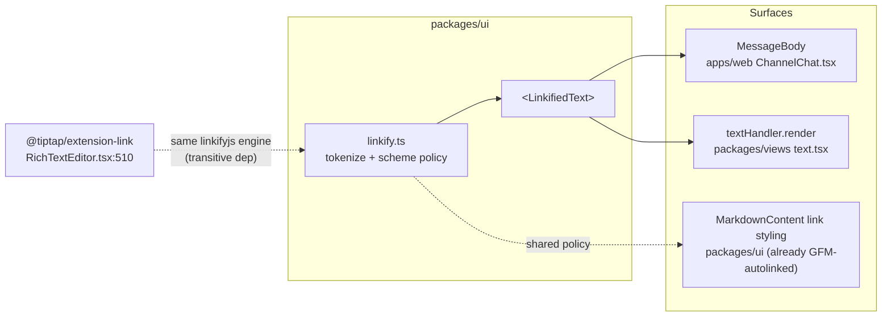
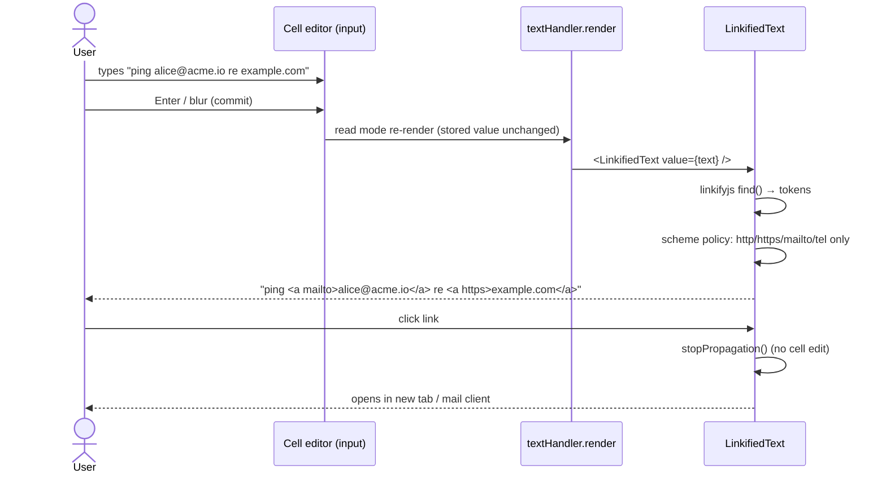
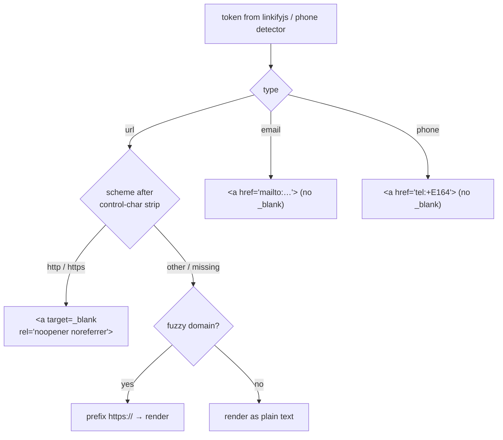

# Automatic Link Enrichment

URLs, email addresses, and phone numbers typed into plain text — table cells,
chat messages, comments — should become clickable links when the text is
displayed, without the user doing anything special.

## Problem Statement

Today, linkable content is only clickable where the user has explicitly opted
into a typed surface:

- A **URL/email/phone column** in a database renders a clickable link — but the
  same URL pasted into an ordinary **text cell** renders as dead text.
- A URL pasted into a **page document** becomes a link (TipTap autolink) — but
  the same URL typed into a **chat message** renders as dead text.
- **Comments** linkify bare URLs (via GFM autolink literals) — chat messages,
  which look nearly identical to users, do not.

The inconsistency is the bug. Users expect "anything linkable becomes a link"
uniformly: type `example.com`, `alice@acme.io`, or `+1 415 555 0100` into a
cell, comment, or message; once committed, it should be clickable. Addresses
are a stretch goal (and, as the research below shows, one worth deliberately
skipping).

## Executive Summary

- **Two of the five text surfaces already linkify.** Page documents configure
  `@tiptap/extension-link` (autolink defaults on), and comments use
  `react-markdown` + `remark-gfm`, whose autolink literals cover bare URLs,
  `www.` domains, and emails. The gaps are **chat messages** and **table/grid
  text cells** — both render plain `<span>{value}</span>` today.
- **The detection engine is already in the dependency tree.** `linkifyjs@4.3.2`
  ships as a transitive dependency of `@tiptap/extension-link` (see
  `pnpm-lock.yaml`). Adopting it directly costs ~0 extra bytes and guarantees
  the editor and the read-only renderers agree on what counts as a link.
- **Recommended architecture: render-time linkification of stored plain
  text.** Never store markup. A small shared `<LinkifiedText>` component in
  `packages/ui` tokenizes text with linkifyjs and emits real React elements
  (no `dangerouslySetInnerHTML`), with a strict scheme allowlist
  (`http/https/mailto/tel`) and the repo's existing
  `target="_blank" rel="noopener noreferrer"` + `stopPropagation()` link
  conventions.
- **Phone numbers are a deliberate, lazy-loaded phase 2.** No mainstream SaaS
  app (Slack, Notion, Airtable) detects phones in free text — only OS vendors
  do. Doing it credibly requires `libphonenumber-js` (~145 kB min build);
  regex-only detection false-positives on dates, prices, and IDs.
- **Addresses: skip detection entirely.** No browser-viable library can find
  addresses in free text (libpostal is a 1.8 GB server-side model and lists
  free-text extraction as a non-goal). The pragmatic substitute is an explicit
  "Open in Maps" action on selected text — zero detection, zero false
  positives.

## Current State In The Repository

### Surface inventory

| Surface          | Renderer                                                                                                             | Linkifies today?                                                                                                  |
| ---------------- | -------------------------------------------------------------------------------------------------------------------- | ----------------------------------------------------------------------------------------------------------------- |
| Page documents   | `packages/editor/src/components/RichTextEditor.tsx` — `Link.configure(...)` at line 510                              | ✅ autolink (TipTap default) + `RichLinkExtension` / `SmartReferenceExtension` / `EmbedExtension` for pasted URLs |
| Comments         | `packages/ui/src/components/MarkdownContent.tsx` (used by `packages/ui/src/composed/comments/CommentBubble.tsx:156`) | ✅ GFM autolink literals (URL, `www.`, email) — no phones                                                         |
| Chat messages    | `MessageBody` in `apps/web/src/comms/ChannelChat.tsx:52`                                                             | ❌ plain `<span className="whitespace-pre-wrap …">{message.content}</span>`                                       |
| Table text cells | `textHandler.render` in `packages/views/src/properties/text.tsx:53`                                                  | ❌ plain `<span>{value}</span>`                                                                                   |
| Grid text cells  | `packages/views/src/grid/GridCell.tsx` → same property handler                                                       | ❌ same                                                                                                           |
| Typed columns    | `packages/views/src/properties/url.tsx`, `email.tsx`, `phone.tsx`                                                    | ✅ but only for explicitly typed columns                                                                          |

### The typed-column handlers define the house link style

`packages/views/src/properties/url.tsx:50` is the existing convention every
auto-detected link should match:

```tsx
<a
  href={value}
  target="_blank"
  rel="noopener noreferrer"
  className="text-blue-600 dark:text-blue-400 hover:underline truncate"
  onClick={(e) => e.stopPropagation()}
>
```

`email.tsx` renders `mailto:` and `phone.tsx` renders `tel:` the same way. The
`stopPropagation()` matters: cell links must not trigger cell edit or row
selection. `MarkdownContent.tsx:48` uses the same `target`/`rel` pair for
comment links.

### Property handler architecture (where cell rendering happens)

`packages/views/src/table/TableCell.tsx` and
`packages/views/src/grid/GridCell.tsx` both delegate to
`handler.render(value, config)` per property type
(`packages/views/src/properties/index.ts`). Read mode goes through
`render()`; edit mode swaps in the handler's editor component (a plain
`<input type="text">` for text — `text.tsx:11`). This split means
linkification in `render()` automatically gives the exact UX the feature
asks for: **while editing you see raw text; on commit (blur/Enter) the cell
re-renders read-mode with clickable links.** No on-type magic, no undo
problem — the stored value is untouched.

### Chat messages: structured tokens vs. render decoration

The 0169 content-organization work established an invariant for hashtags,
quoted verbatim from `ChannelChat.tsx:61`:

> `/** Chips rendered from the message's structured tags — never parsed text (0169). */`

Hashtags and @mentions are **composer-declared, structured data** (see
`apps/web/src/comms/hashtag-composer.ts` and
`apps/web/src/comms/mention-composer.ts`) because they reference workspace
entities whose identity must be pinned at compose time (a tag rename must not
re-bind old messages). Links are different in kind: a URL's meaning is fully
contained in its text, so **render-time parsing is correct for links even
though it's forbidden for tags/mentions**. No schema change, no composer
change — `MessageBody` just renders tokens instead of one span. The
distinction is worth a code comment when implemented, so the two precedents
don't look contradictory.

### The engine is already here

```
pnpm-lock.yaml:
  '@tiptap/extension-link@3.16.0': dependencies: linkifyjs: 4.3.2
```

`@tiptap/extension-link` is configured in the page editor
(`RichTextEditor.tsx:510`, currently `openOnClick: false` + styling only,
inheriting `autolink: true`, `linkOnPaste: true`, and the default scheme
validation). Promoting `linkifyjs` to a direct dependency of `packages/ui`
adds no new code to the bundle the app already ships.

### Where a shared utility lands

`packages/views` and `apps/web` both already depend on `@xnetjs/ui`
(`packages/views/package.json`, `apps/web/package.json`), and comments live
_in_ `packages/ui`. So `packages/ui` is the natural home:

- `packages/ui/src/utils/linkify.ts` — tokenizer + policy (pure logic,
  testable without DOM)
- `packages/ui/src/components/LinkifiedText.tsx` — the React renderer

Note the **dual export list** convention in `packages/ui` (both export
surfaces must list new components — established during the task-editing work,
PR #46).



## External Research

### Library comparison

| Library             | Size (min/gzip)        | Detects                                     | Fuzzy (`example.com`)    | React story                                                                      | Maintenance                                                                   |
| ------------------- | ---------------------- | ------------------------------------------- | ------------------------ | -------------------------------------------------------------------------------- | ----------------------------------------------------------------------------- |
| **linkifyjs** 4.3.3 | 19.3 / 10.4 kB, 0 deps | URL, email (+plugins: hashtag, mention, IP) | ✅                       | Official `linkify-react` builds real React elements; `find()` returns raw tokens | Active (May 2026); 11.8 M weekly DLs; **already a transitive dep via TipTap** |
| linkify-it 5.0.1    | 11.5 / 4.2 kB          | URL, email                                  | ✅ (`fuzzyLink` default) | Tokens only, no renderer                                                         | Active (markdown-it engine)                                                   |
| Autolinker.js 4.1.5 | 48.6 / 20.2 kB         | URL, email, **phone**, hashtag, mention     | ✅                       | HTML-string default; `parse()` gives matches                                     | Slower cadence (May 2025)                                                     |
| anchorme 3.0.8      | 21.9 / 10.0 kB         | URL, email, IP, file paths                  | ✅                       | HTML-string output                                                               | Dormant (Apr 2024)                                                            |

Autolinker is the only one with phone detection, but it's regex-based with
unspecified coverage — see the phone section for why that's not good enough.

### Phone numbers: the hard part

- `libphonenumber-js` provides exactly the needed API:
  `findPhoneNumbersInText(text, { defaultCountry })` →
  `[{ number, startsAt, endsAt }]`. The `min` metadata build is ~145 kB total
  (65 kB code + 80 kB metadata) — roughly **10–15× the bytes of the entire
  URL/email engine**.
- Regex-only detection is a false-positive machine. Google's own
  `PhoneNumberMatcher` ships dedicated rejection patterns for slash-separated
  dates ("3/10/2011"), timestamps, citation page ranges ("211-227 (2003)"),
  currency-prefixed numbers, and digit runs embedded in words — that's the
  bar for doing it without a numbering-plan database.
- Industry behavior is unambiguous: **iOS (NSDataDetector) and Gmail detect
  phones in free text; Slack, Notion, and Airtable do not.** Notion routes
  phone interactivity through a typed database property; Airtable's phone
  field isn't even click-to-dial on desktop. OS vendors do it because they
  own the dialer and locale context; web apps consistently punt.

### Timing models in prior art

| Product       | When linkification happens                          | Escape hatch                 |
| ------------- | --------------------------------------------------- | ---------------------------- |
| Google Sheets | On commit (Enter/blur)                              | Ctrl+Z removes just the link |
| Slack         | At send time                                        | Link button for custom text  |
| Notion        | On paste, with a menu (link/bookmark/embed/mention) | Dismiss option               |
| Linear        | On paste (auto-embed for known apps)                | "Keep as link" / Esc         |
| Gmail, iOS    | Render time, read-only surfaces                     | n/a (text unchanged)         |

Pattern: **as-you-type** enrichment only happens in rich editors with undo;
**cells** enrich on commit; **read-only message display** enriches at render
time. Our plan maps onto this exactly: TipTap autolink for pages (already
on), read-mode rendering for cells and chat.

### Security best practices

- **Scheme allowlist, not blocklist** (OWASP XSS cheat sheet): allow
  `http`, `https`, `mailto`, `tel`; reject everything else. Strip
  Unicode whitespace/control characters before checking the scheme
  (defeats `jav\tascript:` smuggling) — TipTap's `isAllowedUri` does this.
- **Render-time beats stored markup.** Two TipTap incidents are the citable
  evidence: CVE-2025-14284 (`javascript:` hrefs via link commands,
  `@tiptap/extension-link` < 2.10.4 — we're on 3.16.0, unaffected) and the
  June 2025 link-popover incident, where a UI component set hrefs directly
  and skipped `editor.commands.setLink()` validation entirely. Lesson:
  validation must live at one chokepoint every write path goes through.
  Storing plain text and linkifying at render means a detection bug is fixed
  by redeploying the renderer, not by migrating poisoned data — and
  detection improvements apply retroactively to old messages.
- **`rel="noopener noreferrer"`** on `target="_blank"` links (already the
  repo convention); consider adding `nofollow ugc` for user-generated
  content if these surfaces ever render publicly (shared pages — PR #52).
  `mailto:`/`tel:` links don't navigate, so they don't need `target="_blank"`.
- **IDN homographs** (`pаypal.com` with Cyrillic "а"): fuzzy linkifiers will
  link them. Browsers mitigate at display time with punycode policies; don't
  try to out-engineer that. A hover tooltip showing the resolved host is a
  cheap optional hardening.

### Addresses: why we skip them

- No reliable cross-locale grammar exists for postal addresses. The state of
  the art, **libpostal**, is a C library with a ~1.8 GB statistical model,
  server-side only — and its README lists _"extracting addresses from free
  text"_ as an explicit **non-goal** (it parses strings already known to be
  addresses).
- The only credible free-text detectors are OS-scale (Apple's
  `NSDataDetector`) or cloud-scale (Gmail's server-side pipeline). Cloud
  geocoding APIs validate a candidate string; they don't find the span.
- False positives are uniquely embarrassing ("123 reasons to upgrade" → map
  pin). The 90% substitute with zero detection risk: **select text → "Open in
  Maps"** → `https://maps.google.com/maps/search/?api=1&query=<encoded>`.

## Key Findings

1. **The gap is two surfaces, not five.** Pages and comments already linkify;
   only chat `MessageBody` and the `text` property handler need work. Both
   are single-component changes once a shared renderer exists.
2. **linkifyjs is the zero-cost engine.** Already in the lockfile via TipTap;
   official React renderer produces elements, not HTML strings; one engine
   means pages and read surfaces agree on what is a link.
3. **Render-time linkification of stored plain text is the only architecture
   that fits this repo.** Messages are nodes with plain `content`; cells
   store plain values; converting on save would mutate user data and create
   a persisted-XSS class of bugs. Render-time also matches the existing
   0169 structured-vs-parsed split: entity references (tags, mentions) are
   structured; self-describing tokens (links) are render decoration.
4. **The read/edit split in property handlers gives the requested UX for
   free.** Editing shows raw text; committing re-renders read mode with
   links. No timing logic, no undo machinery.
5. **Phones are a real cost decision, not a regex.** ~145 kB lazy-loadable
   chunk and a locale heuristic, or skip like Slack/Notion/Airtable do.
   Detection should be confined to surfaces where it adds value (chat,
   cells), and the typed `phone` column already covers the deliberate case.
6. **Addresses are out.** Offer "Open in Maps" on selection if demand
   appears; never auto-detect.

## Options And Tradeoffs

### Option A — Shared render-time linkifier in `packages/ui` (recommended)

Promote `linkifyjs` to a direct dependency; add `linkify.ts` (tokenize +
scheme policy) and `<LinkifiedText>`; use it in `MessageBody` and
`textHandler.render`.

- ✅ One engine, one security policy, one styling convention across surfaces
- ✅ No schema/data changes; works retroactively on all existing content
- ✅ ~0 added bundle bytes for URL+email
- ➖ Tokenization cost on every render — needs `useMemo`/module-level cache
  for long message lists (virtualized lists already bound the visible set)

### Option B — Convert text to links at save time (stored markup)

Composer/cell-commit rewrites `example.com` → markdown/HTML link in the
stored value.

- ✅ Render stays dumb
- ❌ Mutates user data; "I typed X, it saved Y"
- ❌ Persisted-XSS risk class (the TipTap popover incident is the cautionary
  tale); a validator bug poisons stored data
- ❌ Detection improvements never reach old content
- ❌ Conflicts with messages-as-nodes plain-text `content` (0167) and with
  FTS indexing of raw text

### Option C — Typed columns only (status quo plus education)

Tell users to use URL/email/phone column types.

- ✅ Zero work, zero false positives
- ❌ Doesn't address chat/comments at all; rejects the actual request
- ❌ Mixed-content text cells ("see example.com for details") can never be a
  URL column

### Option D — Per-surface ad-hoc regexes

A small regex in `MessageBody`, another in `text.tsx`.

- ✅ No dependency
- ❌ URL detection is famously regex-hostile (trailing punctuation, parens in
  Wikipedia URLs, IDN, new TLDs); linkify-it/linkifyjs exist precisely
  because of this
- ❌ Two implementations drift; security policy duplicated

**Decision:** Option A, with Option C's typed columns remaining the
"deliberate" path (they already render richer affordances and validation).

### Phone sub-decision

|           | Ship in v1              | Lazy phase 2 (recommended)          | Skip forever                               |
| --------- | ----------------------- | ----------------------------------- | ------------------------------------------ |
| Bundle    | +145 kB eager           | +145 kB only after idle/lazy import | 0                                          |
| Precedent | Gmail/iOS               | —                                   | Slack/Notion/Airtable                      |
| Risk      | False positives day one | Tunable behind a flag               | Users with the need use the `phone` column |

Phase 2: `import('libphonenumber-js/min')` lazily, run
`findPhoneNumbersInText` with `defaultCountry` from `navigator.language`
region, merge spans with linkifyjs tokens (URL/email tokens win on overlap).

## Recommendation

Adopt **Option A** in three phases:

1. **Phase 1 — URLs + emails everywhere.** `linkify.ts` +
   `<LinkifiedText>` in `packages/ui`; wire into chat `MessageBody` and the
   `text` property handler read mode. Harden the existing TipTap `Link`
   config (`defaultProtocol: 'https'`) so fuzzy links from the editor and
   the read surfaces resolve identically. Comments need no change (GFM
   already covers them); optionally route `MarkdownContent`'s `a` component
   through the same policy module for consistency.
2. **Phase 2 — phones, lazy.** Optional `detectPhones` prop on
   `<LinkifiedText>`, backed by a lazy-loaded `libphonenumber-js/min`
   detector. Enable in chat and table text cells once bundle impact is
   verified.
3. **Phase 3 — addresses, explicitly not detected.** If demand appears, add
   a selection-toolbar "Open in Maps" action (chat + page selection) that
   URL-encodes the selected text into a maps search link. No detection.





## Example Code

`packages/ui/src/utils/linkify.ts` (sketch):

```ts
import * as linkify from 'linkifyjs'

export interface LinkToken {
  type: 'url' | 'email' | 'phone'
  /** Original text span, verbatim */
  text: string
  /** Sanitized href, scheme-allowlisted */
  href: string
  start: number
  end: number
}

const ALLOWED = new Set(['http:', 'https:', 'mailto:', 'tel:'])

function safeHref(raw: string): string | null {
  // strip control + zero-width chars before scheme inspection
  const cleaned = raw.replace(/[\u0000-\u001f\u200b-\u200d\u2060\ufeff]/g, '')
  try {
    const url = new URL(cleaned)
    return ALLOWED.has(url.protocol) ? url.href : null
  } catch {
    return null
  }
}

export function findLinkTokens(text: string): LinkToken[] {
  return linkify
    .find(text) // urls + emails, fuzzy domains included
    .map((m) => {
      const href = safeHref(m.type === 'email' ? `mailto:${m.value}` : m.href)
      if (!href) return null
      return {
        type: m.type as LinkToken['type'],
        text: m.value,
        href,
        start: m.start,
        end: m.end
      }
    })
    .filter((t): t is LinkToken => t !== null)
}
```

`packages/ui/src/components/LinkifiedText.tsx` (sketch):

```tsx
export function LinkifiedText({ value, className }: LinkifiedTextProps) {
  const segments = useMemo(() => segment(value, findLinkTokens(value)), [value])
  return (
    <span className={className}>
      {segments.map((seg, i) =>
        seg.token ? (
          <a
            key={i}
            href={seg.token.href}
            {...(seg.token.type === 'url' ? { target: '_blank', rel: 'noopener noreferrer' } : {})}
            className="text-blue-600 dark:text-blue-400 hover:underline"
            onClick={(e) => e.stopPropagation()}
          >
            {seg.text}
          </a>
        ) : (
          <Fragment key={i}>{seg.text}</Fragment>
        )
      )}
    </span>
  )
}
```

Chat integration is then one line in
`apps/web/src/comms/ChannelChat.tsx`:

```tsx
function MessageBody({ message }: { message: ChatMessageRow }) {
  if (message.redacted) {
    /* unchanged */
  }
  return (
    <LinkifiedText
      value={message.content}
      className="whitespace-pre-wrap break-words text-xs text-ink-2"
    />
  )
}
```

And the text cell in `packages/views/src/properties/text.tsx`:

```tsx
render(value) {
  if (value === null || value === undefined || value === '') { /* unchanged */ }
  return <LinkifiedText value={value} className="text-gray-900 dark:text-gray-100" />
}
```

## Risks And Open Questions

- **Perf on long virtualized lists.** `linkify.find()` per visible message is
  cheap (single-pass scanner), but chat rows re-render on presence updates.
  `useMemo` keyed on content should suffice; verify with the existing perf
  test harness (note from 0162: perf tests flake under load — run isolated).
- **Fuzzy-link false positives.** `linkifyjs` links `example.com`-style
  bare domains by TLD; occasionally that catches things like `Node.js`-ish
  tokens (it requires a valid TLD, so `file.ts` is safe but `notion.so`
  inside prose links). This matches Slack/Gmail behavior; accept it.
- **`whitespace-pre-wrap` + tokens.** Splitting one span into many must not
  change wrapping; segments stay inside the single styled parent span, so
  CSS is inherited — verify visually.
- **Should table cell links be `truncate`d** like the URL column? Text cells
  can hold mixed prose; probably no `truncate` on inner anchors, keep the
  cell's existing overflow behavior.
- **`MarkdownContent` divergence.** Comments linkify via GFM with slightly
  different fuzzy rules (GFM requires `www.` or scheme; linkifyjs links bare
  `example.com`). Acceptable drift, or pre-process comment text through the
  same tokenizer? Recommend: accept for now, revisit if users report
  inconsistency.
- **Phone locale heuristic.** `defaultCountry` from `navigator.language` is
  wrong for workspaces spanning countries; international-format numbers
  (`+…`) always work. Acceptable for a flag-gated phase 2.
- **Shared/public pages (PR #52).** If linkified content ever renders for
  anonymous viewers, add `nofollow ugc` to the rel set. Decide when public
  rendering ships.

## Implementation Checklist

Phase 1 — URLs + emails:

- [x] Add `linkifyjs` as a direct dependency of `packages/ui`
- [x] `packages/ui/src/utils/linkify.ts`: `findLinkTokens` + `safeHref`
      scheme allowlist + segmenter; unit tests (trailing punctuation, parens,
      IDN, `javascript:` rejection, control-char smuggling, fuzzy domains,
      emails)
- [x] `packages/ui/src/components/LinkifiedText.tsx`; add to **both** export
      lists in `packages/ui` (dual-export convention)
- [ ] Chat: render `MessageBody` content through `<LinkifiedText>`
      (`apps/web/src/comms/ChannelChat.tsx`); comment the
      structured-vs-render-decoration distinction next to the 0169 invariant
- [ ] Table/grid: route `textHandler.render` through `<LinkifiedText>`
      (`packages/views/src/properties/text.tsx`); confirm `GridCell` and
      `TableCell` inherit it via the shared handler
- [ ] Page editor: extend `Link.configure` in
      `packages/editor/src/components/RichTextEditor.tsx:510` with
      `defaultProtocol: 'https'`; confirm autolink/linkOnPaste behavior in a
      live doc
- [ ] Sweep other read-only plain-text surfaces (task descriptions, node
      detail panels) and apply `<LinkifiedText>` where text is user-authored

Phase 2 — phones (flag-gated):

- [x] Lazy detector module wrapping `libphonenumber-js/min`
      `findPhoneNumbersInText` with `defaultCountry` from locale
- [x] `detectPhones` prop on `<LinkifiedText>`; overlap resolution (URL/email
      tokens win)
- [ ] Bundle-size check: phone chunk must be lazy, not in the entry bundle
- [ ] Enable in chat + text cells behind a flag; collect false-positive
      feedback before default-on

Phase 3 — addresses (explicit action only):

- [ ] Selection action "Open in Maps" (chat + page selection toolbar) →
      encoded maps search URL; no detection

## Validation Checklist

- [x] Unit: `findLinkTokens` handles `https://en.wikipedia.org/wiki/Foo_(bar)`,
      `example.com.`, `(see example.com)`, `alice@acme.io`, `EXAMPLE.COM`,
      Unicode/IDN hosts, and rejects `javascript:alert(1)`,
      `jav\tascript:alert(1)`, `data:text/html,…`
- [ ] Chat: send a message containing a URL, a bare domain, and an email →
      all clickable; clicking does not trigger any composer/row interaction;
      `(edited)` and redaction states unaffected
- [ ] Table: type a URL into a plain text cell, press Enter → read mode shows
      a clickable link; clicking opens a new tab and does **not** enter edit
      mode; double-click still edits and shows raw text
- [ ] Pages: typing `example.com ` autolinks with `https://`; undo removes
      the link mark and keeps text
- [ ] Comments: existing GFM linkification unchanged (regression check)
- [ ] Links open with `rel="noopener noreferrer"`; `mailto:`/`tel:` have no
      `target="_blank"`
- [ ] Perf: scroll a long channel (500+ messages) — no measurable render
      regression vs. baseline
- [ ] FTS/search: message and cell text remain searchable as raw text (no
      stored markup anywhere)
- [ ] Phase 2: phone chunk absent from entry bundle (build analysis); US/intl
      formats linkify as `tel:+E164`; "2024-2025" and "$1,415,555" do not

## References

- linkifyjs — <https://github.com/nfrasser/linkifyjs>, React renderer:
  <https://linkify.js.org/docs/linkify-react.html>
- linkify-it — <https://github.com/markdown-it/linkify-it>
- Autolinker.js — <https://github.com/gregjacobs/Autolinker.js>
- TipTap Link extension — <https://tiptap.dev/docs/editor/extensions/marks/link>;
  source: <https://github.com/ueberdosis/tiptap/blob/main/packages/extension-link/src/link.ts>
- CVE-2025-14284 (`@tiptap/extension-link` < 2.10.4 `javascript:` hrefs) —
  <https://security.snyk.io/vuln/SNYK-JS-TIPTAPEXTENSIONLINK-14222197>;
  fix: <https://github.com/ueberdosis/tiptap/pull/5945>
- TipTap link-popover incident (June 2025, validation bypass) —
  <https://tiptap.dev/docs/resources/incidents/06-25-2025-link-popover>
- libphonenumber-js — <https://github.com/catamphetamine/libphonenumber-js>
- Google `PhoneNumberMatcher` false-positive guards —
  <https://github.com/google/libphonenumber/blob/master/java/libphonenumber/src/com/google/i18n/phonenumbers/PhoneNumberMatcher.java>
- OWASP XSS Prevention Cheat Sheet —
  <https://cheatsheetseries.owasp.org/cheatsheets/Cross_Site_Scripting_Prevention_Cheat_Sheet.html>
- MDN `rel=noopener` —
  <https://developer.mozilla.org/en-US/docs/Web/HTML/Reference/Attributes/rel/noopener>
- Chromium IDN display policy —
  <https://chromium.googlesource.com/chromium/src/+/main/docs/idn.md>
- libpostal (address parsing; free-text extraction a non-goal) —
  <https://github.com/openvenues/libpostal>
- Apple `NSDataDetector` —
  <https://developer.apple.com/documentation/foundation/nsdatadetector>
- Gmail phone/address linkification rollout (2017) —
  <https://www.macrumors.com/2017/09/18/gmail-phone-number-address-links/>
- Notion database properties (typed phone/email/URL) —
  <https://www.notion.com/help/database-properties>
- Linear automatic embeds + escape hatch —
  <https://linear.app/docs/automatic-embeds>
- GFM autolink literals (remark-gfm) — <https://github.github.com/gfm/#autolinks-extension->
