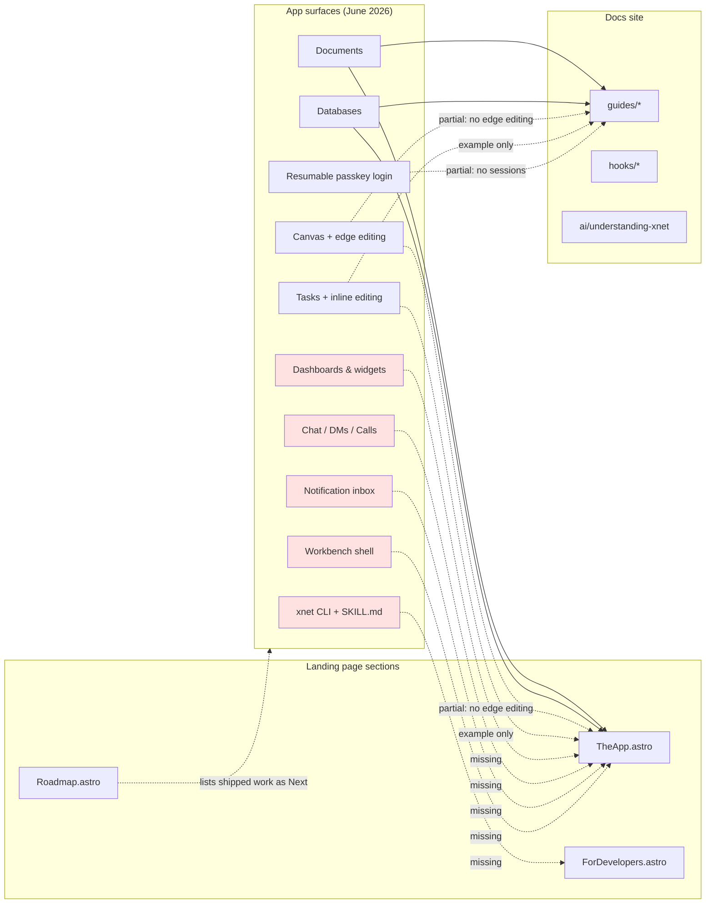
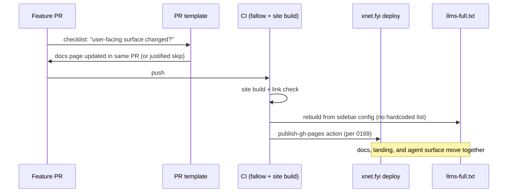
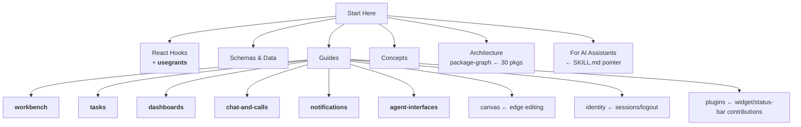

# Site And Docs Sync With Shipped Features

## Problem Statement

The marketing site and documentation at `site/` (deployed to https://xnet.fyi) were last
meaningfully updated on **2026-03-01** (`754289b5 docs(site): align landing and docs with
current APIs`). Since then, fifteen feature PRs (#37–#51, mostly merged 2026-06-12) have
shipped major product surfaces: the workbench shell, dashboards with pluggable widgets,
real-time chat/presence/calls, a notification inbox, inline task editing, the `xnet` agent
CLI + SKILL.md files-first surface, canvas edge editing, and resumable passkey sessions.

None of these appear on the landing page or in the docs. The roadmap advertises shipped
features as "Next", the test/package counts are off by ~3x, and the docs sidebar has zero
pages for five entire subsystems (`@xnetjs/comms`, `@xnetjs/dashboard`, `@xnetjs/charts`,
`packages/cli`, the workbench). This exploration inventories the drift and plans the sync.

## Executive Summary

- **Landing page** (`site/src/pages/index.astro` + `site/src/components/sections/`):
  advertises 4 app tools (Documents, Databases, Canvas, Tasks) where the app now has 7+
  surfaces; the app preview is still a gradient placeholder; the roadmap lists shipped
  work ("Presence & live cursors", "Hub MVP", "Personal wiki & task manager") under
  Next/Now; hardcoded claims ("2400+ tests across 21 packages", "7-panel devtools") are
  stale (~6,600 tests, 30 packages, 9+ devtools panels).
- **Docs site** (`site/src/content/docs/docs/`, 42 pages): structurally healthy (all
  `@xnetjs/*` references validate against `packages/`), but missing guides for the
  workbench, tasks, dashboards/widgets, chat/calls, notifications, and the agent CLI;
  the canvas and identity guides predate PRs #44/#45.
- **Recommendation**: a four-phase sync — (1) truth fixes (roadmap statuses, counts),
  (2) six new docs pages sourced where possible from existing in-repo references
  (`docs/reference/WORKBENCH.md`), (3) landing-page refresh (real workbench screenshot,
  expanded tool grid, new "AI-native workspace" section), (4) guardrails so this doesn't
  recur (roadmap as data, auto-discovered `llms-full.txt`, PR-template docs checklist).

## Current State In The Repository

### The site

| Piece        | Location                                                                                                      | Notes                                                                                                                          |
| ------------ | ------------------------------------------------------------------------------------------------------------- | ------------------------------------------------------------------------------------------------------------------------------ |
| Landing page | `site/src/pages/index.astro`                                                                                  | Composes 13 section components                                                                                                 |
| Sections     | `site/src/components/sections/*.astro`                                                                        | Hero, WhatIsXNet, TheApp, ForDevelopers, UnderTheHood, Hubs, Landscape, Roadmap, TheVision, Community, GetStarted, Nav, Footer |
| Compare page | `site/src/pages/compare.astro`                                                                                | 25+ frameworks/protocols/apps tables                                                                                           |
| Docs         | `site/src/content/docs/docs/**/*.mdx`                                                                         | 42 pages; sidebar defined in `site/astro.config.mjs:59-148`                                                                    |
| AI surface   | `site/public/llms.txt`, `site/public/llms-full.txt`                                                           | Built by `site/scripts/build-llms-full.ts` — **hardcoded list of 37 pages**                                                    |
| Deploys      | `.github/workflows/deploy-pr-preview.yml`, `deploy-branch-preview.yml`, `docs/reference/pages-deployments.md` | Hardened in PR #49 (exploration 0169)                                                                                          |

Git history of `site/` shows the staleness directly: the only commits after 2026-03-05
are a maintenance-workflow chore (`56f5948b`, 2026-06-03). Docs content last changed
2026-03-04 (`2496e519`, the `@xnetjs` scope migration).

### What shipped since the last site update

| PR                                                                                        | Feature                                                | New surfaces / packages                                                                                                                                                                       |
| ----------------------------------------------------------------------------------------- | ------------------------------------------------------ | --------------------------------------------------------------------------------------------------------------------------------------------------------------------------------------------- |
| [#37](https://github.com/crs48/xNet/pull/37)                                              | Dashboard builder with pluggable widgets (0162)        | `packages/dashboard`, `packages/charts`, `/dashboard/$dashboardId` route, widget editor, SES/iframe sandbox tiers                                                                             |
| [#38](https://github.com/crs48/xNet/pull/38)                                              | Token-efficient agent interfaces (0161)                | `packages/cli` (`xnet checkout/status/commit/search/query/db/run/daemon/skill`), SKILL.md (~500 tokens), files-first checkout, slim MCP (5 core tools), measured **0.111x legacy token cost** |
| [#39](https://github.com/crs48/xNet/pull/39)                                              | Minimal workbench shell (0166)                         | `apps/web/src/workbench/` — rail/panels/tabs/status bar, cmdk palette, zen mode, monochrome token ramp in `packages/ui`; `docs/reference/WORKBENCH.md`                                        |
| [#41](https://github.com/crs48/xNet/pull/41)                                              | Canvas pinch-to-zoom                                   | gesture support in CanvasV3                                                                                                                                                                   |
| [#43](https://github.com/crs48/xNet/pull/43)                                              | Document-first page UI                                 | full-bleed editor, title-as-first-line, context panel sections                                                                                                                                |
| [#44](https://github.com/crs48/xNet/pull/44)                                              | Canvas editing UX                                      | edge select/edit, drag-to-connect, inline node text editing                                                                                                                                   |
| [#45](https://github.com/crs48/xNet/pull/45)                                              | Resumable passkey sessions + logout                    | `packages/identity/src/passkey/session.ts`, 7-day TTL, Settings → Account                                                                                                                     |
| [#46](https://github.com/crs48/xNet/pull/46)                                              | Inline task editing + sidebar tasks mini-dashboard     | `TaskDetailForm` in `packages/ui`, `/tasks?task=` deep links, field-authority model (`docs/specs/PAGE_TASK_RECONCILIATION.md`)                                                                |
| [#47](https://github.com/crs48/xNet/pull/47)                                              | Chat, presence, calls, notification center (0167/0168) | `packages/comms` (RoomManager, ChatService, Notifier, CallManager), `apps/web/src/comms/`, `/channel/$channelId`, Inbox tray, hub call-signaling actions                                      |
| [#48](https://github.com/crs48/xNet/pull/48)/[#50](https://github.com/crs48/xNet/pull/50) | Railway hub deploy fixes                               | demo hub actually deployable                                                                                                                                                                  |
| [#49](https://github.com/crs48/xNet/pull/49)                                              | Pages deploy hardening (0169)                          | per-PR/branch previews, publish action                                                                                                                                                        |
| [#51](https://github.com/crs48/xNet/pull/51)                                              | Devtools workspace theme                               | devtools matches monochrome workbench tokens                                                                                                                                                  |

The web app's real route map (`apps/web/src/routes/`) is now: `/` (home), `/doc/$docId`,
`/db/$dbId`, `/canvas/$canvasId`, `/tasks`, `/dashboard/$dashboardId`,
`/channel/$channelId`, `/view/$viewId`, `/data`, `/settings`, `/share`, `/social-import`,
`/stories`. The landing page describes four of these.

### Drift map



### Landing page drift detail

1. **`TheApp.astro:1-160`** — four tools (Documents, Databases, Canvas, Tasks). Missing:
   Dashboards, Chat & Calls, Notifications, and the workbench frame they all live in.
   The "app preview" (lines 49-83) is a macOS window with a **gradient placeholder** —
   the workbench is now visually distinctive (monochrome, rail + tabs + panels) and
   screenshot-worthy.
2. **`Roadmap.astro:1-174`** — statuses are wrong in both directions:
   - _Now_ items that shipped: "Personal wiki & task manager" (PR #46), "Plugin system
     & custom views" (PR #37 `WidgetContribution`, PR #39 `StatusBarContribution`).
   - _Next_ items that shipped: "Presence & live cursors" (PR #47), "Hub MVP — backup,
     relay, key registry" (`packages/hub` deploys to Railway; PRs #48/#50).
   - _Built_ claims stale: "2400+ tests across 21 packages" — PR #47 reports **6,598
     tests across 491 files**, and `ls packages` counts **30 packages**.
3. **`Community.astro:20,48`** — same stale test count; "7-panel devtools suite" vs the
   9 panels + AuthZ documented in `site/src/content/docs/docs/guides/devtools.mdx`.
4. **`ForDevelopers.astro`** — hooks story still accurate, but the strongest new
   differentiator is absent: agents get a files-first checkout + ~500-token SKILL.md
   measured at **0.111x the token cost** of a legacy MCP surface (PR #38). No other
   local-first framework markets this.
5. **`Hubs.astro`** — fine as-is, but can now truthfully add call signaling and
   notification relay (PR #47 hub actions) and the working Railway template.

### Docs site drift detail

Missing pages (no mention anywhere, confirmed by grep):

| Topic                                                          | Shipped in | Closest existing page                                                               |
| -------------------------------------------------------------- | ---------- | ----------------------------------------------------------------------------------- |
| Workbench shell (tabs, panels, palette, zen)                   | PR #39     | none — `docs/reference/WORKBENCH.md` exists in-repo only                            |
| Tasks guide (surfaces, field authority, deep links)            | PR #46     | `quickstart.mdx` TaskSchema example                                                 |
| Dashboards & widgets (contract, sandbox tiers, charts)         | PR #37     | one line in `guides/editor.mdx:69` (database embeds)                                |
| Chat, presence & calls (`@xnetjs/comms`)                       | PR #47     | presence-only coverage in `hooks/usenode.mdx`, `guides/collaboration.mdx`           |
| Notifications & inbox (Notifier rules, watermarks, DND)        | PR #47     | a single "push notifications" line in `guides/plugins.mdx`                          |
| Agent interfaces (`xnet` CLI, SKILL.md, files-first, slim MCP) | PR #38     | MCP-server line in `guides/plugins.mdx:31`; `ai/understanding-xnet.mdx` predates it |

Outdated pages:

- `guides/canvas.mdx` — has pinch-zoom (line 55) and resize handles, but nothing on
  edge selection/editing, drag-to-connect, or inline node text editing (PR #44).
- `guides/identity.mdx` — documents `PasskeyStorage` but not resumable sessions, the
  7-day TTL, or logout (PR #45).
- `hooks/overview.mdx` — maps five hooks including `useGrants`, but there is no
  `hooks/usegrants.mdx` page (sidebar at `site/astro.config.mjs:66-75` confirms).
- `guides/plugins.mdx` — missing `WidgetContribution` and `StatusBarContribution`.
- `architecture/package-graph.mdx` — describes 11 packages; `packages/` now holds 30
  (notably `comms`, `dashboard`, `charts`, `cli`, `query`, `views`, `ui`, `sdk`).
- `ai/understanding-xnet.mdx` — still a good mental model, but should point agents at
  the SKILL.md/files-first surface, which is now the recommended integration path.
- `site/scripts/build-llms-full.ts` — hardcodes its 37-page list, so every new page
  must be added by hand or it silently drops out of `llms-full.txt`.

## External Research

- **llms.txt adoption** — per the
  [State of llms.txt 2026](https://presenc.ai/research/state-of-llms-txt-2026) and the
  [ALLMO 2026 report](https://allmo.ai/articles/llms-txt), adoption sits around 10% of
  surveyed domains but >844k sites ship one, including Stripe, Cloudflare, Vercel, and
  Anthropic; developer-docs sites see the most practical value (IDE agents, RAG, coding
  assistants). Guidance: keep `llms-full.txt` under ~200K tokens for one-shot ingestion
  ([Codersera guide](https://codersera.com/blog/llms-txt-complete-guide-2026/)). xNet
  already ships both files — the gap is freshness, not existence. For a project whose
  headline feature is _token-efficient agent interfaces_, a stale `llms-full.txt` is an
  own-goal.
- **Docs drift prevention** — the consistent recommendation
  ([Docsie on documentation drift](https://www.docsie.io/blog/glossary/documentation-drift/),
  [DeepDocs docs-as-code guide](https://deepdocs.dev/docs-as-code/),
  [Docuwiz on preventing API docs drift](https://blog.docuwiz.io/p/docs-as-code-how-to-prevent-api-documentation))
  is: docs change in the same PR as the feature, enforced by a PR-template checklist
  item plus CI checks (broken links, build success, schema/docs diff). xNet already
  keeps docs in-repo (docs-as-code); what's missing is the per-PR forcing function.
- **Diátaxis** — the docs already roughly follow the
  [Diátaxis](https://diataxis.fr/) split (quickstart=tutorial, guides=how-to,
  concepts/architecture=explanation, hooks/schemas=reference). New pages should slot
  into that taxonomy rather than invent new top-level groups: workbench/tasks/comms are
  _guides_, the agent CLI is a _guide + reference_, the widget contract is _reference_.
- **Peer landing pages** (Anytype, Jazz, DXOS — already named in `Landscape.astro`)
  lead with real product screenshots and motion, not placeholders. A real workbench
  screenshot is table stakes; the monochrome shell is distinctive enough to carry it.

## Key Findings

1. **The drift is one-directional and recent.** Everything on the site was true in
   March; the site simply froze while the app sprinted. No corrections needed — only
   additions and status promotions.
2. **The docs skeleton is solid.** All 201 package/API cross-references validate
   against `packages/`; the Diátaxis-ish IA has obvious slots for the six missing
   pages. This is an additive job, not a restructure.
3. **The roadmap is the highest-leverage single fix.** It's the section a skeptical
   visitor reads to gauge momentum, and it currently _understates_ progress — shipped
   flagship work ("Presence & live cursors", "Hub MVP") is listed as future.
4. **The agent surface is an unmarketed differentiator.** PR #38's measured 0.111x
   token cost, SKILL.md, and the `xnet` CLI are exactly what the 2026 llms.txt/agent
   ecosystem is converging on, and neither the landing page nor the docs mention them.
5. **Two single-sourcing seams already exist**: `docs/reference/WORKBENCH.md` (in-repo
   reference the workbench guide can be distilled from) and the hardcoded page list in
   `build-llms-full.ts` (which should derive from the content collection instead).
6. **The numbers problem will recur.** Any hardcoded "N tests / M packages" claim goes
   stale in weeks. Either round way down and future-proof the phrasing ("6,000+ tests",
   "30 packages") or compute at build time.

## Options And Tradeoffs

### How to sync

| Option                          | Description                                                                 | Pros                                                                   | Cons                                                                                                |
| ------------------------------- | --------------------------------------------------------------------------- | ---------------------------------------------------------------------- | --------------------------------------------------------------------------------------------------- |
| **A. Big-bang PR**              | One PR rewrites landing + docs + guardrails                                 | Single review; coherent voice                                          | Large diff; screenshot work blocks text fixes; high conflict risk with active repo                  |
| **B. Phased PRs** (recommended) | (1) truth fixes → (2) new docs pages → (3) landing refresh → (4) guardrails | Truth fixes land same-day; each PR reviewable; screenshots don't block | Four PRs of overhead                                                                                |
| **C. Generate-from-source**     | Derive site docs from in-repo refs (`docs/reference/*.md`) via build step   | Zero future drift for covered pages                                    | Build complexity; in-repo refs are contributor-voiced, not user-voiced; only covers 1-2 pages today |

### Landing page app preview

| Option                                                     | Pros                                                                                        | Cons                                                               |
| ---------------------------------------------------------- | ------------------------------------------------------------------------------------------- | ------------------------------------------------------------------ |
| Keep gradient placeholder                                  | Zero effort                                                                                 | Reads as vaporware next to Anytype/Jazz                            |
| **Static workbench screenshot (light+dark)** (recommended) | Honest, cheap, the monochrome shell photographs well; e2e infra can capture it reproducibly | Goes stale on visual redesigns (acceptable: re-shoot per redesign) |
| Animated demo / video                                      | Highest conversion                                                                          | Production cost; large asset; stales fastest                       |

### Roadmap maintenance

| Option                                                                 | Pros                                                                         | Cons                                                     |
| ---------------------------------------------------------------------- | ---------------------------------------------------------------------------- | -------------------------------------------------------- |
| Keep hardcoded JSX                                                     | No change                                                                    | Proven to go stale                                       |
| **`roadmap.ts` data module rendered by `Roadmap.astro`** (recommended) | One obvious file to edit; enables a "last updated" stamp; same static output | Small refactor                                           |
| Derive from exploration checkboxes (`NNNN_[x]_*.md`)                   | Fully automatic                                                              | Explorations ≠ marketing milestones; titles too internal |

### llms-full.txt freshness

| Option                                                             | Pros                                                      | Cons                                                   |
| ------------------------------------------------------------------ | --------------------------------------------------------- | ------------------------------------------------------ |
| Keep hardcoded list                                                | Explicit ordering                                         | Silently drops new pages (already would have missed 6) |
| **Derive from sidebar config in `astro.config.mjs`** (recommended) | Sidebar is already the curated order; one source of truth | Needs a small parser or shared module                  |
| Glob the content dir                                               | Simplest                                                  | Loses curated ordering; includes drafts                |

## Recommendation

Adopt **Option B (phased)** with the recommended sub-options:

- **Phase 1 — Truth fixes (same day, no design work).** Roadmap status promotions,
  number updates phrased durably ("6,000+ tests", "30 packages", "9-panel devtools"),
  Community "what's working" list refresh. Pure text edits to `Roadmap.astro`,
  `Community.astro`, `TheApp.astro` platform notes.
- **Phase 2 — Six new docs pages**, slotted into the existing sidebar groups:
  `guides/workbench.mdx` (distilled from `docs/reference/WORKBENCH.md`),
  `guides/tasks.mdx`, `guides/dashboards.mdx`, `guides/chat-and-calls.mdx`,
  `guides/notifications.mdx`, `guides/agent-interfaces.mdx`. Plus surgical updates to
  `guides/canvas.mdx`, `guides/identity.mdx`, `guides/plugins.mdx`,
  `architecture/package-graph.mdx`, `ai/understanding-xnet.mdx`, and either add
  `hooks/usegrants.mdx` or trim it from `hooks/overview.mdx`.
- **Phase 3 — Landing refresh.** Real workbench screenshots in `TheApp.astro` (light +
  dark via the existing theme toggle), tool grid expanded to 7 (add Dashboards,
  Chat & Calls, Notifications), and a new **"Built for agents"** section (or a
  `ForDevelopers` subsection) marketing the SKILL.md / `xnet` CLI / 0.111x measurement.
- **Phase 4 — Guardrails.** `roadmap.ts` data module; `build-llms-full.ts` derives its
  page list from the sidebar; PR-template checklist item ("Does this change a
  user-facing surface? Update site docs or state why not"); docs-staleness check in the
  fallow maintenance workflow (warn when `site/` is >N weeks older than the last
  feature PR).



Proposed docs IA after Phase 2 (new pages bolded):



## Example Code

`build-llms-full.ts` deriving its page list from the sidebar instead of a hardcoded
array — extract the sidebar to a shared module both files import:

```ts
// site/src/sidebar.ts — single source of truth for docs order
export const sidebar = [
  { label: 'Start Here', items: ['docs/introduction', 'docs/quickstart', 'docs/core-concepts'] },
  {
    label: 'React Hooks',
    items: [
      /* ... */
    ]
  }
  // ...
] as const

export const orderedDocSlugs = sidebar.flatMap((group) =>
  group.items.filter((i): i is string => typeof i === 'string')
)
```

```ts
// site/astro.config.mjs
import { sidebar } from './src/sidebar'
// starlight({ sidebar, ... })

// site/scripts/build-llms-full.ts
import { orderedDocSlugs } from '../src/sidebar'
// iterate orderedDocSlugs instead of the hardcoded SECTION_ORDER list;
// fail the build if a content file exists that is in neither the sidebar
// nor an explicit EXCLUDED list — new pages can no longer silently vanish.
```

`Roadmap.astro` consuming a data module:

```ts
// site/src/data/roadmap.ts
export type RoadmapPhase = { label: 'Built' | 'Now' | 'Next' | 'Then' | 'Vision'; items: string[] }
export const updated = '2026-06-12'
export const phases: RoadmapPhase[] = [
  {
    label: 'Built',
    items: [
      'Workbench shell — tabs, panels, command palette, zen mode',
      'Dashboards with pluggable, sandboxed widgets + charts',
      'Real-time chat, presence, and WebRTC calls',
      'Notification inbox with mentions and triage',
      'Agent surface: xnet CLI, SKILL.md, files-first checkout (0.11x tokens)'
      /* ...promoted items... */
    ]
  },
  { label: 'Now', items: ['Mobile app (Expo)', 'Sharing & invite flows' /* ... */] }
  // ...
]
```

## Risks And Open Questions

- **Screenshot pipeline.** A reproducible workbench screenshot needs seeded demo data
  and the test-bypass identity (the recipe exists in the e2e infra, per the canvas and
  passkey PR verifications). Decide whether to commit static PNGs or generate in CI —
  recommend committing static images first; CI generation is a follow-up.
- **What counts as "Built" for marketing?** The comms stack defers SFU calls, E2EE
  phases, and push delivery (PR #47's deferred list). Roadmap copy should say
  "chat, presence & P2P calls" without overclaiming E2EE for chat specifically —
  the security-claims wording needs a careful pass against `UnderTheHood.astro`.
- **Mobile claim.** `TheApp.astro` says Expo is "coming soon" and the roadmap has it
  under Next; `apps/expo` exists. Verify its real state before promoting or demoting.
- **npm install snippet.** Hero advertises `pnpm add @xnetjs/react @xnetjs/data`;
  confirm published versions on npm match current APIs before pushing more traffic at
  the quickstart (memory notes an npm new-package blocker in CD).
- **Compare page** (`site/src/pages/compare.astro`) was out of scope here; its 25+
  rows likely contain stale competitor facts. Worth a separate pass.
- **Token budget for `llms-full.txt`.** Adding six pages keeps it well under the ~200K
  token guidance, but the build should log token-ish size so growth is visible.

## Implementation Checklist

### Phase 1 — Truth fixes (landing page text only)

- [x] `Roadmap.astro`: promote to **Built** — workbench shell, dashboards & widgets,
      chat/presence/calls, notification inbox, task manager with inline editing,
      Hub (backup/relay/search on Railway), agent CLI + SKILL.md
- [x] `Roadmap.astro`: rewrite **Now/Next** from the real deferred lists (mobile/Expo,
      sharing & invite flows, push delivery, SFU calls, E2EE chat phases)
- [x] Update counts durably: "6,000+ tests", "30 packages", "10-panel devtools" in
      `Roadmap.astro:19`, `Community.astro:20,48` (devtools count corrected to 10:
      9 core panels + AuthZ per `guides/devtools.mdx`)
- [x] `Community.astro`: refresh "What's working now" (workbench, dashboards, comms,
      inbox, agent CLI)
- [x] Sanity-check security wording in `UnderTheHood.astro` against shipped reality
      (claims hold; aligned the Mobile platform card to "coming soon")

### Phase 2 — Docs pages

- [x] `guides/workbench.mdx` — distilled from `docs/reference/WORKBENCH.md` (tabs,
      panels, palette, zen, keyboard map)
- [x] `guides/tasks.mdx` — surfaces, quick-add with @mention, field authority
      (page-hosted vs node-owned), `/tasks?task=` deep links
- [x] `guides/dashboards.mdx` — widget contract, built-ins, charts, sandbox tiers,
      user widgets
- [x] `guides/chat-and-calls.mdx` — channels/DMs/voice rooms, RoomManager presence,
      mesh call limits (4 video / 8 audio), hub signaling
- [x] `guides/notifications.mdx` — Notifier rules, watermarks + mention acks, badges,
      DND, triage
- [x] `guides/agent-interfaces.mdx` — files-first checkout, `xnet` CLI verbs,
      SKILL.md, slim MCP, the 0.111x benchmark
- [x] Update `guides/canvas.mdx` (edge editing, drag-to-connect, inline text),
      `guides/identity.mdx` (resumable sessions, TTL, logout), `guides/plugins.mdx`
      (WidgetContribution, StatusBarContribution, contribution count 9 → 11)
- [x] Update `architecture/package-graph.mdx` for the 30-package reality (graph +
      details for ui/query/views/comms/dashboard/charts/cli/hub; fixed a second
      stale devtools panel list; web app no longer described as a feature subset)
- [x] Resolve `useGrants`: `hooks/overview.mdx` actually had no `useGrants` row
      (the audit overstated); added a `useCan`/`useGrants` supporting-hooks row
      linking to the authorization guide, which documents both
- [x] Update `ai/understanding-xnet.mdx` to point agents at SKILL.md / files-first
- [x] Add all new pages to the sidebar (`site/src/sidebar.mjs` — new "The App"
      group; llms-full.txt order follows automatically) and to the hand-curated
      `public/llms.txt` index

### Phase 3 — Landing refresh

- [ ] Capture light + dark workbench screenshots (seeded demo data, test-bypass
      identity); replace the gradient placeholder in `TheApp.astro:49-83`
- [ ] Expand `TheApp.astro` tool grid: + Dashboards, + Chat & Calls, + Notifications
- [ ] Add "Built for agents" section (SKILL.md, `xnet` CLI, 0.111x tokens, slim MCP)
      and link it from `ForDevelopers.astro`
- [ ] `Hubs.astro`: add call signaling + notification relay to the feature list
- [x] Verify the Hero npm-install snippet against published npm packages
      (`@xnetjs/react` and `@xnetjs/data` both published at 0.0.2)

### Phase 4 — Guardrails

- [x] Extract sidebar to `site/src/sidebar.mjs`; make `build-llms-full.ts` consume it
      and fail on unlisted content files (`.mjs` so the untranspiled Astro config can
      import it; surfaced a latent bug — guides/authorization and guides/versioning
      were missing from the old hardcoded order)
- [x] Move roadmap content to `site/src/data/roadmap.ts` with an `updated` stamp
- [ ] Add PR-template checklist item: user-facing change ⇒ docs/site updated or skip
      justified
- [ ] Add a staleness warning to the fallow maintenance workflow when `site/` lags
      feature merges by more than ~4 weeks

## Validation Checklist

- [ ] `pnpm --dir site build` succeeds; no broken internal links (Starlight link check)
- [ ] `llms-full.txt` contains all six new pages and stays under ~200K tokens
- [ ] Every roadmap "Built" item maps to a merged PR; every "Now/Next" item maps to a
      real deferred-work list — spot-check against PRs #37–#51
- [ ] No remaining hardcoded test/package counts that contradict
      `ls packages | wc -l` and the current test suite
- [ ] Screenshots render correctly in light and dark themes on the deployed preview
      (per-PR Pages preview from 0169)
- [ ] `ai/understanding-xnet.mdx` guidance matches what `xnet skill` actually prints
- [ ] Grep the docs for the six feature keywords (workbench, dashboard, chat, inbox,
      agent CLI, session resume) — each resolves to a real page
- [ ] Compare-page pass scheduled or explicitly deferred

## References

- Merged PRs: [#37](https://github.com/crs48/xNet/pull/37), [#38](https://github.com/crs48/xNet/pull/38), [#39](https://github.com/crs48/xNet/pull/39), [#41](https://github.com/crs48/xNet/pull/41), [#43](https://github.com/crs48/xNet/pull/43), [#44](https://github.com/crs48/xNet/pull/44), [#45](https://github.com/crs48/xNet/pull/45), [#46](https://github.com/crs48/xNet/pull/46), [#47](https://github.com/crs48/xNet/pull/47), [#48](https://github.com/crs48/xNet/pull/48), [#49](https://github.com/crs48/xNet/pull/49), [#50](https://github.com/crs48/xNet/pull/50), [#51](https://github.com/crs48/xNet/pull/51)
- Explorations: 0161 (agent interfaces), 0162 (dashboards), 0166 (workbench), 0167/0168 (comms & notifications), 0169 (pages previews)
- In-repo references: `docs/reference/WORKBENCH.md`, `docs/reference/pages-deployments.md`, `docs/specs/PAGE_TASK_RECONCILIATION.md`
- [State of llms.txt 2026 — Presenc AI](https://presenc.ai/research/state-of-llms-txt-2026)
- [llms.txt Explained (May 2026) — Codersera](https://codersera.com/blog/llms-txt-complete-guide-2026/)
- [LLMs.txt for AI Search Report 2026 — ALLMO](https://allmo.ai/articles/llms-txt)
- [Documentation Drift — Docsie](https://www.docsie.io/blog/glossary/documentation-drift/)
- [Docs-as-Code Implementation Guide — DeepDocs](https://deepdocs.dev/docs-as-code/)
- [Preventing API Documentation Drift — Docuwiz](https://blog.docuwiz.io/p/docs-as-code-how-to-prevent-api-documentation)
- [Diátaxis framework](https://diataxis.fr/)
