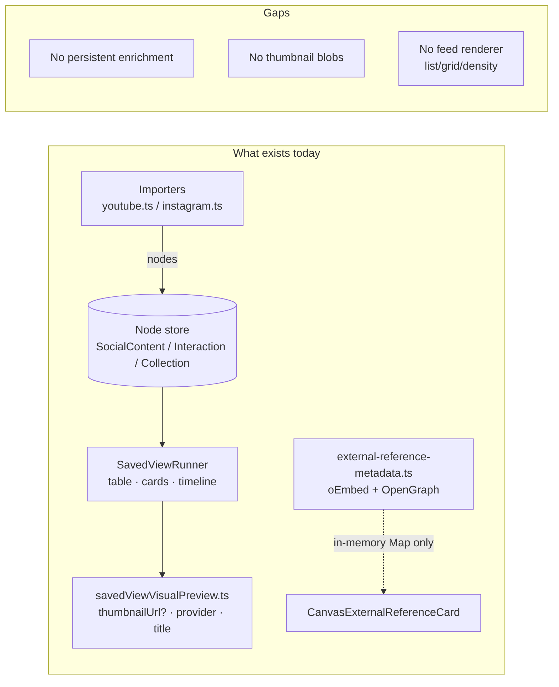
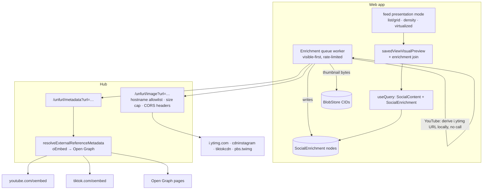
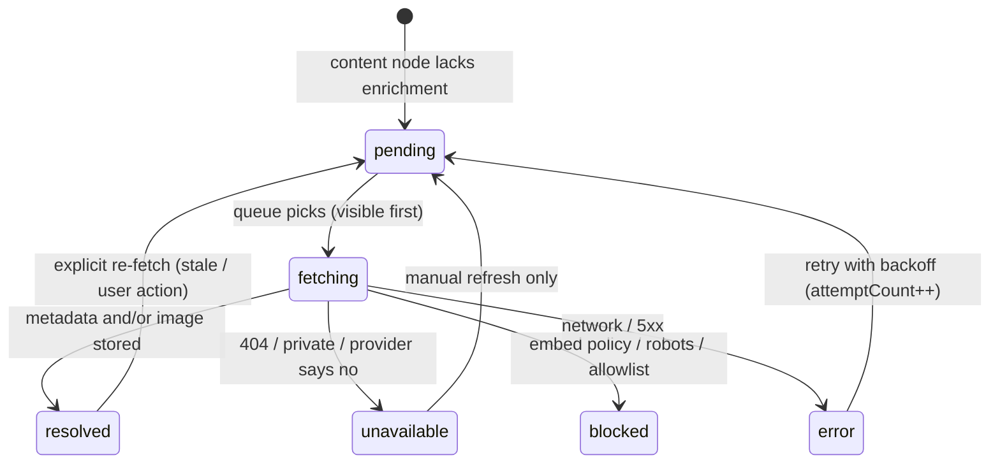
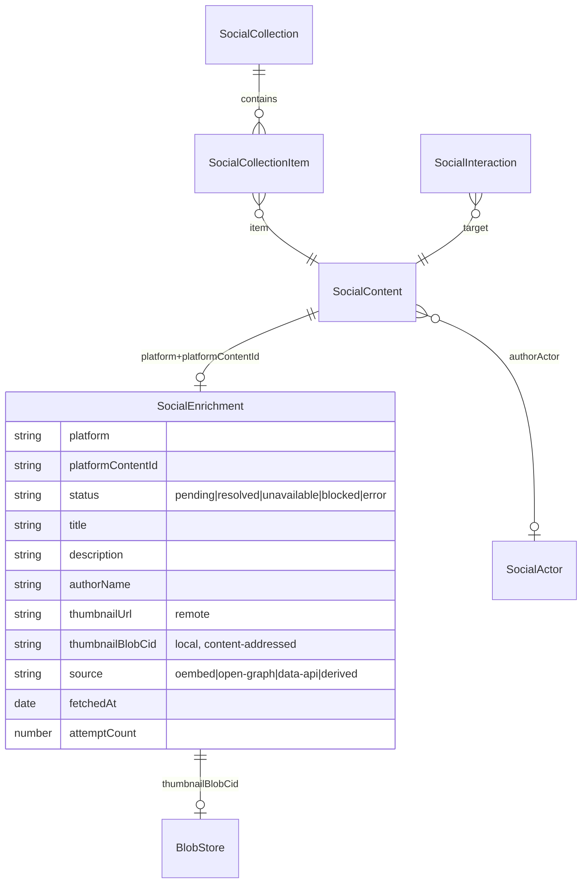

# Content Feed Views And Local Media Cache

## Problem Statement

The social data workspace can already import likes, playlists, saved posts,
collections, and watch history from YouTube, Instagram, TikTok, X, and Reddit —
but it renders them as rows in a table. A liked video shows up as a text row;
a playlist is a count. For content-shaped data (videos, images, posts) this is
the wrong altitude. We want:

1. **Specialized, beautiful feed views** for likes, playlists, bookmarks,
   saved collections — anything that is "a feed of content" — with list and
   grid layouts and a density control.
2. **Local metadata + thumbnail caching**: hit the remote provider once to
   fetch a title, description, and thumbnail, persist them locally, and never
   need the network again to render the feed.

Priority order: **YouTube first, then Instagram**, then Twitter/X, TikTok, and
the rest.

There is also a data-quality forcing function: YouTube Takeout playlist CSVs
(including the "Liked videos" playlist) contain **only video IDs and
timestamps** — no titles. The importer stores placeholder titles
(`YouTube video ${videoId}` in `packages/social/src/importers/youtube.ts`,
`createPlaylistItemRecords`). Without enrichment, a YouTube likes feed is a
wall of opaque IDs. Enrichment is not polish; it is what makes these feeds
usable at all.

## Executive Summary

- Roughly half the plumbing already exists. `packages/data` ships an
  external-reference metadata pipeline (`external-reference-metadata.ts`) with
  oEmbed endpoints for YouTube/Vimeo/Spotify/Twitter and an Open Graph path,
  and the saved-view layer (`packages/react/src/components/savedViewVisualPreview.ts`)
  already derives a `SavedViewVisualPreviewModel` with `thumbnailUrl`,
  `embedUrl`, and `provider` per row. What's missing is **persistence** (the
  only consumer today caches in a module-level `Map`), **thumbnail blob
  storage**, and **a feed-shaped renderer**.
- CORS dictates the architecture. YouTube oEmbed, `i.ytimg.com`, Instagram,
  and X all block browser `fetch()`. The hub must proxy metadata and image
  bytes (it already has SSRF-safe external fetching via
  `packages/hub/src/utils/url.ts` `validateExternalUrl` and the crawl
  service). Two free passes exist: YouTube thumbnails are **predictable URLs
  usable directly as ``** (no fetch needed to display), and TikTok's
  oEmbed endpoint **does** send CORS headers.
- Recommended path: a new `SocialEnrichment` node schema (deterministic ID per
  `platform:contentId`, separate from import-owned content nodes), a hub
  `/unfurl` route (metadata + image proxy with hostname allowlist), a
  client-side enrichment queue that prioritizes visible feed items, thumbnail
  bytes in the existing content-addressed `BlobStore`, and a new `feed`
  presentation mode (list/grid × density) built on the existing visual preview
  model — surfaced through prebuilt lenses like "YouTube Liked Videos" and
  "Instagram Saved".
- Phasing: Phase 1 ships a beautiful YouTube feed with **zero network calls**
  (derived `i.ytimg.com` thumbnails + titles from watch history where
  available). Phase 2 adds the hub unfurl service and persistent enrichment.
  Phase 3 handles Instagram's hostile reality (expiring CDN URLs, no free
  metadata API) with proxy-fetched blobs and graceful placeholder design.
  Phase 4 extends to TikTok (easy, CORS-open oEmbed) and X (syndication API
  via hub).

## Current State In The Repository

### Data model — the feed content already exists as nodes

The social schemas (`packages/social/src/schemas/`) model everything a feed
needs:

- `SocialContent` (`content.ts`) — `platform`, `contentKind`,
  `platformContentId`, `title`, `textPreview`, `mediaKind`,
  `mediaAsset` (relation, currently never populated by importers),
  `authorActor`, `canonicalUrl`, `platformUrl`, `publishedAt`, `observedAt`,
  `privacyClass`, `visibility`, and a 50 KB `metadataJson` escape hatch.
- `SocialInteraction` (`interaction.ts`) — `interactionKind`
  (`like`/`save`/`view`/…), `actor`, `target`, `targetTitle`,
  `targetAuthorActor`, `observedAt`.
- `SocialCollection` + `SocialCollectionItem` (`collection.ts`) — playlists
  and saved collections, with `collectionKind`, `itemCount`, per-item
  `sortKey` and `addedAt`.

### Importers — what each platform actually populates

`packages/social/src/importers/youtube.ts` stages seven buckets:
`youtube.channel`, `youtube.subscriptions`, `youtube.playlists`,
`youtube.comments`, `youtube.music-library`, `youtube.history`,
`youtube.account-metadata`.

- **Watch history** (`mapYouTubeWatchHistory`) creates real `SocialContent`
  video nodes with cleaned titles, channel actors, and `platformUrl`, plus a
  `view` interaction per watch.
- **Playlists** (`mapYouTubePlaylists` → `createPlaylistItemRecords`) create a
  `SocialCollection` per playlist and a `SocialCollectionItem` per video — but
  the Takeout CSVs (`playlists/<Name>-videos.csv`) carry only `Video ID` and
  `Playlist Video Creation Timestamp`, so the content node title falls back to
  `` `YouTube video ${videoId}` ``. **Liked videos arrive through this bucket**
  (Takeout exports them as a playlist), so the single most important feed has
  no titles and no thumbnails today.

`packages/social/src/importers/instagram.ts`:

- **Likes** (`mapInstagramLikedPosts`) → `like` interactions from
  `your_instagram_activity/likes/liked_(posts|comments).json`.
- **Saved** (`mapInstagramSavedPosts`) → a `SocialCollection`
  (`collectionKind: 'saved'`, titled via `savedCollectionTitle`) plus
  `SocialCollectionItem`s and `save` interactions from
  `your_instagram_activity/saved/saved_(posts|collections|music).json`.

`tiktok.ts` and `x.ts` exist with analogous shapes.

### View layer — cards mode and a preview model already exist

- `apps/web/src/components/DataWorkspaceView.tsx` is the data workspace hub
  (route `apps/web/src/routes/data.tsx`); saved views open as router-backed
  tabs (`/view/$viewId`, `apps/web/src/components/SavedViewTab.tsx`) per the
  workbench shell (`apps/web/src/workbench/state.ts`, `ViewHost.tsx`).
- `packages/react/src/components/SavedViewRunner.tsx` declares
  `SavedViewPresentationMode = 'table' | 'cards' | 'timeline' | 'canvas' | 'graph'`
  and renders a `SavedViewVisualGrid` for cards mode, virtualized with
  `@tanstack/react-virtual`.
- `packages/react/src/components/savedViewVisualPreview.ts` derives
  `SavedViewVisualPreviewModel` per row — `kind`, `platform`, `title`,
  `subtitle`, `creator`, `timestamp`, `url`, **`thumbnailUrl`**, **`embedUrl`**,
  **`provider`**, `privacy` — pulling `thumbnailUrl` out of `metadataJson` when
  present and parsing URLs through `parseExternalReferenceUrl`
  (`packages/data/src/external-references.ts`, providers include `youtube`,
  `instagram`, `tiktok`, `twitter`).
- Prebuilt lenses live in `packages/social/src/lenses/graph-lenses.ts`
  (`SocialGraphLensDefinition` wrapping a `SavedViewDescriptor`); the existing
  four (e.g. `social.lens.saved-content-by-creator`) are the registration
  pattern new feed lenses would follow.

### Metadata fetching — pipeline exists, persistence does not

`packages/data/src/external-reference-metadata.ts` is a complete resolution
pipeline: `getExternalReferenceOEmbedEndpoint` knows the oEmbed URLs for
YouTube/Vimeo/Spotify/Twitter, `resolveExternalReferenceMetadata` tries oEmbed
then Open Graph (with an `openGraphProxyUrl` option that anticipates exactly
the proxy this exploration proposes), and returns
`{ title, subtitle, description, imageUrl, providerName, authorName, source }`
with `resolved | unavailable | blocked | error` statuses. An embed allow/block
policy exists in `external-reference-embed-policy.ts` / `embed-registry.ts`.

Its **only consumer** is
`packages/editor/src/components/CanvasExternalReferenceCard.tsx`, which caches
results in a module-level in-memory `Map` (`EXTERNAL_REFERENCE_METADATA_CACHE`)
— lost on reload, and it calls provider endpoints directly from the browser,
which fails CORS for YouTube/Twitter (the card degrades to fallback text).

### Storage and network substrate

- `packages/storage/src/blob-store.ts` — content-addressed `BlobStore`
  (`put(data) → ContentId`, `get(cid)`), with `chunk-manager.ts` for large
  blobs. Ready-made home for thumbnail bytes.
- The hub (`packages/hub/src/`) is a Hono server with an authed route pattern
  (`routes/crawl.ts`), a crawl coordinator that already fetches external URLs
  server-side with robots checking (`services/crawl.ts`,
  `services/crawl-robots.ts`) and SSRF validation
  (`utils/url.ts` `validateExternalUrl`). The web app resolves its hub from
  `VITE_HUB_URL` (`apps/web/src/App.tsx`).
- Background work precedent: `apps/web/src/workers/social-import.worker.ts` +
  `apps/web/src/lib/social-import-job-client.ts` (queue jobs into a worker,
  stream progress).



## External Research

### Per-platform reality check (what a browser can and cannot do)

| Source                                                           | Metadata                                                                                        | Thumbnail bytes via `fetch()`                             | Notes                                                                                                                                 |
| ---------------------------------------------------------------- | ----------------------------------------------------------------------------------------------- | --------------------------------------------------------- | ------------------------------------------------------------------------------------------------------------------------------------- |
| YouTube oEmbed (`youtube.com/oembed`)                            | **CORS-blocked** in browser; works server-side, no key                                          | n/a                                                       | Returns `title`, `author_name`, `thumbnail_url` (hqdefault); no description                                                           |
| YouTube predictable thumbs (`i.ytimg.com/vi/<id>/mqdefault.jpg`) | n/a                                                                                             | **CORS-blocked** for `fetch()`; **works as ``**  | `default/mq/hq` always exist; `maxresdefault` 404s _with a valid placeholder JPEG_ — detect via `naturalWidth === 120`, not `onerror` |
| YouTube Data API v3 `videos.list`                                | **CORS-open** (`googleapis.com`), needs API key; 50 IDs/call, 1 quota unit/call, 10 k units/day | n/a                                                       | Full `snippet` incl. description + structured thumbnails; ToS requires refresh/delete of cached API data within **30 days**           |
| Instagram oEmbed (Graph API)                                     | Server-side only — requires Meta app token (`APP_ID\|APP_SECRET`); no reliable `thumbnail_url`  | —                                                         | 1 000 req/hr app-token tier                                                                                                           |
| Instagram page Open Graph                                        | Effectively **dead without login** (bot detection, TLS fingerprinting)                          | —                                                         | Not a viable pipeline in 2025–26                                                                                                      |
| Instagram CDN URLs                                               | n/a                                                                                             | URLs carry **expiring signatures** (hours–days, then 403) | Must capture bytes immediately or not at all                                                                                          |
| Instagram data export                                            | Includes your own posts' media; **saved posts' media is NOT included**                          | —                                                         | Saved feeds will often have no image available at any price                                                                           |
| X oEmbed (`publish.twitter.com`)                                 | CORS-blocked **and** unreliable post-2023                                                       | —                                                         | No thumbnail field                                                                                                                    |
| X syndication API (`cdn.syndication.twimg.com/tweet-result`)     | Undocumented, key-less, used by X's own embed widget; intermittent                              | `pbs.twimg.com` stable while tweet exists                 | Best-effort only                                                                                                                      |
| TikTok oEmbed (`tiktok.com/oembed`)                              | **CORS-open — direct browser fetch works**, no key                                              | Thumbnail CDN likely blocked for `fetch()`                | Returns `title`, `author_name`, `thumbnail_url` (720×1280)                                                                            |

### Browser-side caching constraints

- `no-cors` opaque responses can be stored in Cache Storage but are unreadable
  and Chrome pads each entry to **~7 MB** of quota — a non-starter for
  thumbnail collections.
- Reading cross-origin image bytes (to store a blob in IndexedDB/BlobStore)
  requires a CORS-clean response, i.e. **a proxy we control**. Drawing a
  non-CORS `` to canvas taints it, so client-side re-encoding is also out.
- `navigator.storage.persist()` should be requested before committing
  thousands of blobs; IndexedDB and Cache Storage share one origin quota.

### Prior art

Raindrop.io, Karakeep (ex-Hoarder), linkding, Wallabag, Pocket, and ArchiveBox
**all** fetch metadata/previews server-side and serve cached copies to the
browser. No production tool does browser-direct unfurling, and the
browser-capable JS libraries (`link-preview-js`, `@extractus/oembed-extractor`)
explicitly document the CORS wall. The pattern this exploration proposes —
small trusted proxy + local persistent store — is the established shape.

Legal-lite: thumbnail-scale caching for personal reference is the classic
_Kelly v. Arriba Soft_ fair-use posture; YouTube's 30-day API caching policy
applies to **Data API** clients (one more reason to default to oEmbed);
Meta's oEmbed terms are stricter on paper, enforcement against personal tools
is nil — worth a line in docs, not an architecture driver.

## Key Findings

1. **Enrichment is mandatory for the flagship feed.** YouTube liked videos
   (imported via the playlists bucket) have no titles — only IDs. Watch
   history has titles but no thumbnails. A feed view without enrichment would
   be beautiful chrome around empty cards.
2. **YouTube thumbnails are free.** `https://i.ytimg.com/vi/<id>/mqdefault.jpg`
   is derivable from the video ID with zero API calls and renders fine as
   ``. Phase 1 can ship a gorgeous YouTube grid with no network
   infrastructure at all — hotlinked display now, durable blobs later.
3. **The hub must be the unfurler.** Every high-value metadata endpoint except
   TikTok's blocks browser CORS. The hub already has authed Hono routes,
   `validateExternalUrl` SSRF guards, and a robots-aware crawl service — an
   `/unfurl` route is a small, well-precedented addition. The
   `openGraphProxyUrl` option in `external-reference-metadata.ts` shows this
   was anticipated.
4. **Instagram inverts the storage strategy.** YouTube URLs are stable
   (hotlink-friendly); Instagram CDN URLs expire in hours-to-days, so the
   _only_ way to have an Instagram thumbnail later is to proxy-fetch the bytes
   into the BlobStore at first sight. And for saved posts, the takeout archive
   has no media at all — placeholder-first card design is a hard requirement,
   not a fallback.
5. **Persistence belongs in a new node type, not `metadataJson`.** Importers
   create content nodes deterministically and re-imports re-stage them;
   writing enrichment into the import-owned node risks clobbering on
   re-import and tangles two ownership domains. A `SocialEnrichment` node
   keyed `enrichment:{platform}:{platformContentId}` is idempotent from both
   directions, carries fetch lifecycle state, and is independently
   GC-able/refreshable.
6. **The render seam already exists.** `SavedViewVisualPreviewModel` is the
   right contract for a feed renderer — it is platform-agnostic, already
   carries `thumbnailUrl`/`provider`/`privacy`, and `SavedViewRunner` already
   has a presentation-mode switcher to hang a `feed` mode on. Specialized
   "views" then become **lens definitions + a default presentation mode**, not
   bespoke components per platform.

## Options And Tradeoffs

### A. Where metadata comes from

| Option                                                    | Cost                                            | Coverage                                                                                     | Verdict                                                                    |
| --------------------------------------------------------- | ----------------------------------------------- | -------------------------------------------------------------------------------------------- | -------------------------------------------------------------------------- |
| A1. Hub `/unfurl` proxying oEmbed (+ Open Graph fallback) | No keys, no quota; one small route              | YouTube (title/author/thumb), TikTok, Vimeo…; no YouTube description; Instagram mostly fails | **Default**                                                                |
| A2. YouTube Data API v3 from the client                   | Free key, 10 k units/day ≈ 500 k videos batched | Adds descriptions, durations, channel data; CORS-open so no proxy needed                     | **Optional power-up** behind a user-supplied key setting; 30-day ToS noted |
| A3. Meta oEmbed with app token (hub-held secret)          | Developer-app setup burden                      | Instagram embed HTML, weak thumbnail support                                                 | **Defer**; document as opt-in config                                       |
| A4. Hub headless scraping of provider pages               | Heavy, brittle, ToS-hostile                     | Instagram still blocks                                                                       | Reject                                                                     |

### B. Where thumbnail pixels live

| Option                                                   | Offline?     | Quota                                                        | Privacy                                    | Verdict                                                     |
| -------------------------------------------------------- | ------------ | ------------------------------------------------------------ | ------------------------------------------ | ----------------------------------------------------------- |
| B1. Hotlink `` to provider CDN                  | No           | Zero                                                         | Leaks per-render requests to provider CDNs | Phase 1 for YouTube only (stable URLs)                      |
| B2. Proxy bytes via hub → `BlobStore` (CID) → object URL | Yes          | ~10–30 KB per mqdefault thumb; 10 k items ≈ 200–300 MB at hq | One fetch ever; no render-time leaks       | **Target state for all platforms**; mandatory for Instagram |
| B3. Service-worker Cache Storage of opaque responses     | Display-only | ~7 MB/entry padding                                          | —                                          | Reject                                                      |

B1→B2 is a progressive upgrade: render hotlinked immediately, swap to blob
URL when the enrichment worker lands the bytes.

### C. Where enrichment persists

| Option                                                                       | Re-import safety                                        | Lifecycle state                                                                      | Verdict                                  |
| ---------------------------------------------------------------------------- | ------------------------------------------------------- | ------------------------------------------------------------------------------------ | ---------------------------------------- |
| C1. Merge into `SocialContent.metadataJson`                                  | Re-import may clobber; mixed ownership                  | Awkward (JSON blob)                                                                  | Reject                                   |
| C2. New `SocialEnrichment` schema, deterministic ID per `platform:contentId` | Clean — import and enrichment never write the same node | First-class `status/fetchedAt/attemptCount` fields; queryable for "needs enrichment" | **Recommended**                          |
| C3. Out-of-band IndexedDB table (not nodes)                                  | Safe but invisible to query/lens/preview layers         | Custom plumbing                                                                      | Reject — the preview deriver reads nodes |

### D. How the feed renders

| Option                                                                              | Effort  | Fit                                                                            | Verdict                                                              |
| ----------------------------------------------------------------------------------- | ------- | ------------------------------------------------------------------------------ | -------------------------------------------------------------------- |
| D1. New `feed` presentation mode inside `SavedViewRunner` + density/layout controls | Medium  | Reuses query/facet/virtualizer/preview plumbing; every saved view gets it free | **Recommended**                                                      |
| D2. Standalone `MediaFeedView` component + new `TabNodeType`                        | Higher  | More design freedom, but forks data plumbing and tab wiring                    | Only if D1's chrome proves too constraining                          |
| D3. Platform-specific components (`YouTubeLikesView`, …)                            | Highest | Maximum bespoke beauty, O(platforms) maintenance                               | Reject as architecture; allow per-provider _card_ variants inside D1 |

The bespoke-beauty concern is answered at the **card** level, not the view
level: one `FeedCard` with provider-aware affordances (duration badge and
16:9 thumb for YouTube; 4:5/1:1 media and author-handle-forward layout for
Instagram; gradient letter-tile placeholder when no image exists).

## Recommendation

Build four small pieces, phased so YouTube is beautiful immediately:



**Phase 1 — YouTube feed with zero network (1 PR).**
A `feed` presentation mode in `SavedViewRunner` (grid/list toggle, density
`compact | cozy | comfortable`, virtualized) rendering
`SavedViewVisualPreviewModel`s; a thumbnail-derivation helper that maps
`platform === 'youtube'` + `platformContentId` →
`https://i.ytimg.com/vi/<id>/mqdefault.jpg` (hotlinked, behind the existing
embed-policy "load remote media" gate); new lenses in
`packages/social/src/lenses/`: `youtube-liked-videos`, `youtube-playlists`,
`youtube-watch-history`, `instagram-saved`, `instagram-likes`, defaulting to
feed mode. Watch-history items look complete; playlist items show thumbnails +
ID placeholders pending Phase 2.

**Phase 2 — Hub unfurl + persistent enrichment (1–2 PRs).**
Hub route `GET /unfurl/metadata?url=` (auth-required, wraps
`resolveExternalReferenceMetadata` server-side) and `GET /unfurl/image?url=`
(hostname allowlist: `i.ytimg.com`, `*.cdninstagram.com` / `scontent-*.fbcdn.net`,
`p16-sign*.tiktokcdn.com`, `pbs.twimg.com`; `image/*` content-type check;
~5 MB cap; reuse `validateExternalUrl`). New `SocialEnrichment` schema.
Client enrichment queue (worker, modeled on `social-import-job-client.ts`):
visible feed items first, then backfill at ~2 req/s with exponential backoff;
fills titles for playlist/liked videos via oEmbed; stores thumbnail bytes in
`BlobStore` and the CID on the enrichment node. Feed cards prefer
`thumbnailBlobCid` → object URL, fall back to hotlink, then placeholder.

**Phase 3 — Instagram done right.**
Same queue, different expectations: metadata fetch will usually return
`unavailable` (record it, don't retry hot); design placeholder-first cards
(author handle, saved-collection chip, gradient letter tile); proxy-capture
any CDN URLs we do encounter _immediately_ (they expire); surface an optional
Meta app-token setting for users who want real oEmbed.

**Phase 4 — TikTok and X.**
TikTok oEmbed straight from the browser (CORS-open, no hub needed) with
image bytes via `/unfurl/image`; X via hub-side syndication-API best effort.

### Enrichment lifecycle



### Schema relationships



### First-render and enrichment sequence

```mermaid
sequenceDiagram
    participant U as User
    participant F as Feed view
    participant W as Enrichment worker
    participant H as Hub /unfurl
    participant P as Provider

    U->>F: open "YouTube Liked Videos" lens
    F->>F: render cards (derived i.ytimg thumbs, placeholder titles)
    F->>W: report visible item ids
    W->>H: /unfurl/metadata?url=watch?v=ID (batched, rate-limited)
    H->>P: oEmbed (server-side, no CORS)
    P-->>H: title, author, thumbnail_url
    H-->>W: metadata JSON
    W->>H: /unfurl/image?url=i.ytimg/...
    H-->>W: image bytes + CORS headers
    W->>W: BlobStore.put(bytes) → cid; write SocialEnrichment node
    W-->>F: store update → cards re-render with real titles + local thumbs
    Note over F: every later open renders entirely from local store
```

## Example Code

New enrichment schema (`packages/social/src/schemas/enrichment.ts`):

```ts
export const SocialEnrichmentSchema = defineSchema({
  name: 'SocialEnrichment',
  namespace: SOCIAL_NAMESPACE,
  properties: {
    platform: select({ options: socialPlatforms, required: true, default: 'generic' }),
    platformContentId: text({ required: true, maxLength: 500 }),
    canonicalUrl: url({}),
    status: select({
      options: ['pending', 'resolved', 'unavailable', 'blocked', 'error'],
      required: true,
      default: 'pending'
    }),
    title: text({ maxLength: 1000 }),
    description: text({ maxLength: 5000 }),
    authorName: text({ maxLength: 500 }),
    authorUrl: url({}),
    thumbnailUrl: url({}),
    thumbnailBlobCid: text({ maxLength: 200 }),
    source: select({ options: ['oembed', 'open-graph', 'data-api', 'derived'] }),
    fetchedAt: date({ includeTime: true }),
    attemptCount: number({ min: 0, integer: true }),
    metadataJson: text({ maxLength: 20000 })
  },
  document: undefined
})
// deterministic id: createSocialNodeId('enrichment', [platform, platformContentId])
```

Zero-cost YouTube thumbnail derivation (used by the preview deriver and the
worker alike):

```ts
export function deriveYouTubeThumbnailUrl(
  videoId: string,
  quality: 'mqdefault' | 'hqdefault' = 'mqdefault'
): string {
  return `https://i.ytimg.com/vi/${encodeURIComponent(videoId)}/${quality}.jpg`
}
// maxresdefault is NOT safe to derive blindly: missing videos return a
// 404 status with a valid 120px placeholder JPEG, so  never
// fires — detection requires naturalWidth checks. Stick to mq/hq.
```

Hub image proxy core (`packages/hub/src/routes/unfurl.ts`, following
`routes/crawl.ts` conventions):

```ts
const THUMBNAIL_HOSTS = [
  /^i\.ytimg\.com$/,
  /^p16-sign[\w-]*\.tiktokcdn[\w.-]*\.com$/,
  /^scontent[\w-]*\.cdninstagram\.com$/,
  /^scontent[\w-]*\.fbcdn\.net$/,
  /^pbs\.twimg\.com$/
]

app.get('/image', requireAuth, async (c) => {
  const target = c.req.query('url') ?? ''
  const validated = validateExternalUrl(target) // existing SSRF guard
  if (!validated.ok || !THUMBNAIL_HOSTS.some((h) => h.test(validated.url.hostname))) {
    return c.json({ error: 'Host not allowed' }, 400)
  }
  const upstream = await fetch(validated.url, { signal: AbortSignal.timeout(10_000) })
  const type = upstream.headers.get('content-type') ?? ''
  if (!upstream.ok || !type.startsWith('image/')) {
    return c.json({ error: 'Not an image' }, 502)
  }
  return new Response(upstream.body, {
    headers: {
      'content-type': type,
      'cache-control': 'public, max-age=31536000, immutable',
      'access-control-allow-origin': '*'
    }
  })
})
```

Feed density as pure layout state (inside the `feed` presentation mode):

```tsx
const FEED_DENSITIES = {
  compact: { minCardPx: 160, gapPx: 8, showDescription: false },
  cozy: { minCardPx: 220, gapPx: 12, showDescription: false },
  comfortable: { minCardPx: 300, gapPx: 16, showDescription: true }
} as const

// grid: repeat(auto-fill, minmax(var(--feed-card-min), 1fr))
// list: single column, thumbnail left at 2x density width
```

## Risks And Open Questions

- **Provider rate limiting on oEmbed.** YouTube's oEmbed has no published
  limits; a 10 000-item likes backfill at 2 req/s takes ~85 minutes and may
  still draw throttling. Mitigations: visible-first priority (the feed _looks_
  done long before backfill finishes), jittered pacing, resumable queue.
  Open question: should the hub also memoize unfurl responses server-side so
  multiple devices/users don't re-hit providers?
- **Hub availability.** Clients without a reachable hub (pure-local use) stay
  on Phase 1 behavior — derived thumbnails + takeout titles. The feed must be
  designed to look intentional in that state, not broken.
- **Privacy of hotlinking.** Rendering `i.ytimg.com` thumbs reveals your
  liked-video IDs to Google per render until blobs land. Gate hotlinking
  behind the existing embed policy (`external-reference-embed-policy.ts`) and
  document that blob caching _improves_ privacy over time.
- **Storage growth.** ~10 k thumbnails ≈ 100–300 MB. Need
  `navigator.storage.persist()`, a per-platform size readout in settings, and
  an eviction story (enrichment nodes make orphan-blob GC tractable).
- **Re-import interplay.** Verify staged re-imports never write
  `SocialEnrichment` IDs and that the preview deriver prefers enrichment
  title over the `YouTube video <id>` placeholder without flicker.
- **YouTube Data API 30-day rule.** Only relevant if the user opts into A2
  with their own key; the setting copy should mention it.
- **Instagram expectations.** Saved-post media is simply not obtainable for
  free. Is placeholder-first acceptable for v1, or do we want an explicit
  "connect Meta app token" onboarding step sooner?
- **Does `feed` mode live in `SavedViewRunner` long-term?** If the card DOM
  diverges heavily per provider, revisit option D2 (dedicated component)
  before the chrome calcifies.

## Implementation Checklist

Phase 1 — YouTube feed, zero network (shipped):

- [x] Add `feed` to `SavedViewPresentationMode` in `packages/react/src/components/SavedViewRunner.tsx` with grid/list toggle and `compact|cozy|comfortable` density, virtualized via the existing `@tanstack/react-virtual` setup — shipped as `packages/react/src/components/SavedViewVisualFeed.tsx`, with responsive column counts derived from the measured container width
- [x] `FeedCard` component rendering `SavedViewVisualPreviewModel` with provider-aware variants (YouTube 16:9, Instagram/TikTok 1:1, gradient letter-tile placeholder, image-error fallback to the tile) — duration badges need data the importers don't carry yet
- [x] Thumbnail derivation for YouTube already existed in `savedViewVisualPreview.ts` (`img.youtube.com/vi/<id>/hqdefault.jpg` from parsed URLs); previews additionally gained `description` and `platformContentId` for feed rendering and enrichment keying. Display gating follows the existing privacy-class convention rather than the embed policy
- [x] Feed views defaulting to feed presentation via a new `SavedViewDescriptor.presentation` hint — shipped in `packages/social/src/feeds/` as `youtube-videos` (likes + playlists + history merge into one video feed; per-playlist scoping such as a dedicated liked-videos view needs collection-relation predicates, deferred), `youtube-playlists`, `instagram-saved`, `instagram-likes`
- [x] Surface the new views in the workspace — wired into `createDefaultSocialWorkspaceSavedViewSeeds` as a `feed-view` seed kind, so the existing seed flow in `DataWorkspaceView` creates them

Phase 2 — unfurl service + persistence (shipped):

- [x] `SocialEnrichmentSchema` in `packages/social/src/schemas/enrichment.ts` + `createSocialEnrichmentId` helper + registry export
- [x] Hub `routes/unfurl.ts`: `/unfurl/metadata` (server-side `resolveExternalReferenceMetadata`) and `/unfurl/image` (hostname allowlist, `image/*` check, 5 MB cap, post-redirect SSRF re-validation, CORS + immutable cache headers, preflight handling), mounted in `packages/hub/src/server.ts`
- [x] Client enrichment queue (`apps/web/src/hooks/social-feed-enrichment.ts` + `useSocialFeedEnrichment.ts`): visible-first priority, ~2 req/s with jitter, session-level dedupe, `attemptCount`/`status`/`lastError` persisted — a plain hook-owned queue proved sufficient; a dedicated worker and cross-session exponential backoff are deferred
- [x] Thumbnail bytes → `BlobStore.put` → `thumbnailBlobCid` on the enrichment node; feed card prefers blob object URL > hotlink > letter tile
- [x] Enrichment joined over previews at the feed layer (`SavedViewFeedEnrichmentAdapter` on `SavedViewRunner`); enriched titles/descriptions/thumbs override import placeholders in feed mode. Deeper integration into the shared preview deriver (so table/cards modes benefit too) is deferred
- [ ] `navigator.storage.persist()` request + storage usage readout — deferred; the app already surfaces a durable-storage banner, a per-platform thumbnail size readout remains to do

Phase 3 — Instagram (deferred follow-up):

- [x] `unavailable` is terminal for the session (no hot retries; only an explicit refresh path would re-fetch) and Instagram cards render placeholder-first with letter tiles
- [ ] Immediate proxy-capture of any encountered Instagram CDN URL (expiring signatures)
- [ ] Optional Meta app-token setting; hub-side Graph oEmbed when present

Phase 4 — TikTok / X (deferred follow-up):

- [ ] TikTok: browser-direct oEmbed in the enrichment worker (no hub hop), image via `/unfurl/image`
- [ ] X: hub-side syndication-API fetcher, best-effort flagged

## Validation Checklist

Validated live (synthetic YouTube Takeout imported through the real browser
import flow; enrichment exercised against a local hub with the real oEmbed
upstream, plus stubbed responses for the sandboxed-browser portion):

- [x] Imported a YouTube Takeout: the YouTube Videos feed renders every card with a derived thumbnail, and post-enrichment zero `YouTube video <id>` placeholders remain (all 10 fixture items resolved to real titles)
- [x] Offline reload (browser with no external network): titles, authors, and thumbnails render entirely from local enrichment nodes and BlobStore object URLs — 10/10 blob-backed thumbnails
- [x] `/unfurl/image` rejects non-allowlisted hosts, non-image content types, oversize bodies, and private-address redirects; `validateExternalUrl` blocks internal addresses (hub route tests)
- [x] Density and layout toggles re-render instantly and the grid stays virtualized (verified at 10 items; a 5 000-item scroll benchmark remains to do)
- [x] Broken/unloadable thumbnail URLs fall back to the gradient letter tile (verified in a network-blocked browser)
- [ ] Re-run the same import: enrichment nodes untouched, no title regressions to placeholders — designed for via disjoint deterministic ID namespaces (`social:enrichment:*` vs import-owned nodes), not yet exercised end-to-end
- [ ] Private/deleted video: card shows a designed unavailable state; enrichment node `status: 'unavailable'`; worker does not retry it next session (cross-session retry policy still session-scoped)
- [ ] Instagram saved lens with a real Instagram export (letter-tile rendering verified generically)
- [ ] Storage estimate visible in settings; thumbnails for a 10 k-item library stay under ~300 MB

## References

Repository:

- `apps/web/src/components/DataWorkspaceView.tsx`, `apps/web/src/routes/data.tsx`, `apps/web/src/components/SavedViewTab.tsx`
- `packages/react/src/components/SavedViewRunner.tsx`, `packages/react/src/components/savedViewVisualPreview.ts`
- `packages/data/src/external-reference-metadata.ts`, `packages/data/src/external-references.ts`, `packages/data/src/external-reference-embed-policy.ts`, `packages/data/src/embed-registry.ts`
- `packages/editor/src/components/CanvasExternalReferenceCard.tsx`
- `packages/social/src/schemas/{content,interaction,collection}.ts`, `packages/social/src/importers/{youtube,instagram,tiktok,x}.ts`, `packages/social/src/lenses/graph-lenses.ts`
- `packages/storage/src/blob-store.ts`, `packages/hub/src/services/crawl.ts`, `packages/hub/src/utils/url.ts`, `packages/hub/src/routes/crawl.ts`
- Related explorations: `0152_[x]_ACTUAL_SOCIAL_GRAPH_IMPORTER.md`, `0153_[x]_SOCIAL_DATA_WORKSPACE_UI.md`, `0158_[x]_WHAT_MIGHT_THE_DATA_WORKSPACE_LOOK_IF_IT_WAS_MORE_VISUAL.md`

External:

- YouTube thumbnail URL patterns + CORS: <https://github.com/paulirish/lite-youtube-embed/blob/master/youtube-thumbnail-urls.md>, <https://github.com/paulirish/lite-youtube-embed/issues/59>
- YouTube Data API quota + developer policies (30-day caching): <https://developers.google.com/youtube/terms/developer-policies>
- Meta/Instagram oEmbed: <https://developers.facebook.com/docs/instagram-platform/oembed/>
- Instagram CDN URL expiry: <https://github.com/RSS-Bridge/rss-bridge/issues/960>
- X syndication API without keys (Terence Eden, 2025): <https://shkspr.mobi/blog/2025/04/you-dont-need-an-api-key-to-archive-twitter-data/>
- TikTok oEmbed (CORS-open, browser-callable): <https://developers.tiktok.com/doc/embed-videos/>, <https://dev.to/azure/building-oembeddr-using-azure-static-web-apps-with-svelte-bootstrap-5-and-tiktok-384b>
- Service workers, CORS, opaque-response 7 MB padding: <https://mmazzarolo.com/blog/2024-11-06-service-workers-and-cors/>
- Storage quotas and eviction (MDN): <https://developer.mozilla.org/en-US/docs/Web/API/Storage_API/Storage_quotas_and_eviction_criteria>
- `link-preview-js` CORS limitations: <https://github.com/OP-Engineering/link-preview-js>
- Thumbnail fair use (_Kelly v. Arriba Soft_): <https://garson-law.com/thumbnail-images-infringement-or-fair-use/>
