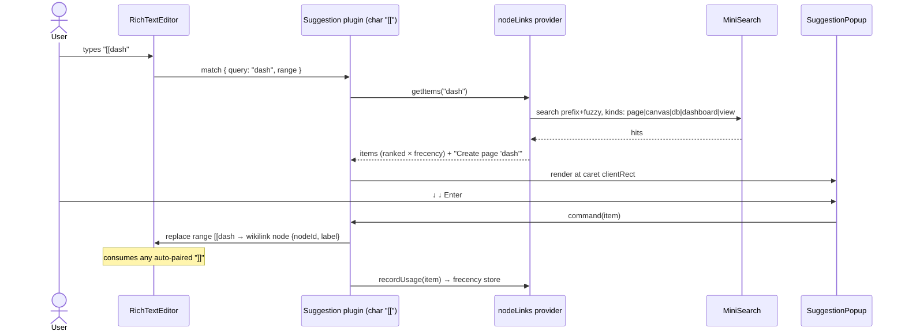
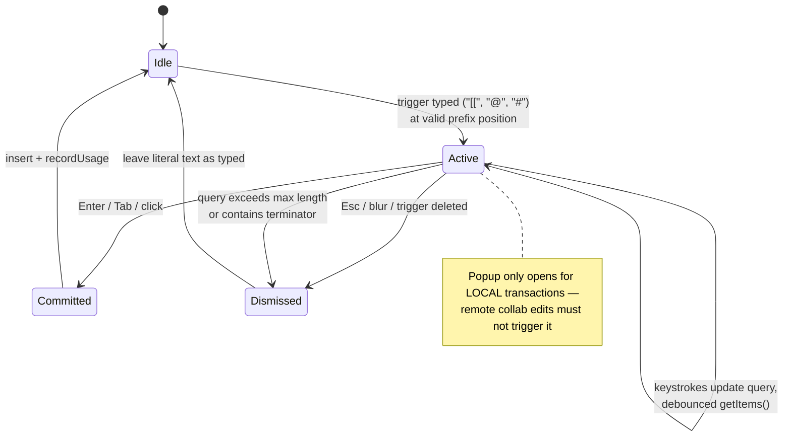

# Universal Typeahead And Autocomplete

## Problem Statement

Typing `[[` in a page should suggest other pages, canvases, databases, and
dashboards. Typing `@` should suggest workspace members (profile name +
avatar, falling back to DID). Typing `#` should suggest hashtags. Today only
fragments of this exist: the rich text editor has `@`-mention and `/`-command
typeahead, but `[[` wikilinks require typing the exact title blind, hashtags
don't exist at all, and every other text surface (chat composer, comments,
database cells, canvas inline text) either has a bespoke one-off picker or
nothing.

We want one extensible typeahead system: pluggable _providers_ (node links,
people, tags, …) that work across every text surface (TipTap documents, plain
textareas, inputs), inserting durable links — not just text — to the
referenced node, user, channel, or tag.

## Executive Summary

The repo is closer to this than it looks. The editor already ships
`@tiptap/suggestion` (powering `TaskMentionExtension` and `SlashCommand`), and
the suggestion utility's `char` option accepts multi-character strings — so a
`[[`-triggered wikilink suggester is a configuration exercise, not an engine
build. The plain-text surfaces already share a canonical reference grammar
(`[[nodeId]]`, `@did`/`@username`, `#commentId` in
`packages/data/src/schema/schemas/commentReferences.ts`), so a typeahead that
_commits that grammar_ gets rendering and extraction for free.

The recommended architecture splits three concerns, following the pattern that
GitHub's `text-expander-element` and CodeMirror's autocomplete both converged
on:

1. **Provider registry** (shared): trigger string → `getItems(query)` →
   `commit(item)` descriptors for node links, people, tags, channels, emoji.
2. **Surface adapters** (thin, per input type): a TipTap
   `Suggestion`-plugin factory for rich documents; a caret-tracking hook for
   `<textarea>`/`<input>` surfaces.
3. **Shared popup** (one component): ARIA combobox listbox, keyboard
   navigation, sectioned results, anchored to the caret.

Ranking blends MiniSearch prefix+fuzzy matching (already in
`packages/query/src/search/`) with a small frecency store, Slack
quick-switcher style.

Roll out in phases: **pages first** (wikilink suggest, people mentions,
hashtags), then **extract the shared engine** and upgrade the chat composer,
then **sweep the long tail** (cells, comments, canvas text).

## Current State In The Repository

### The rich text editor (pages) — strong foundation

- `packages/editor/src/components/RichTextEditor.tsx` — TipTap 3.15.x over
  Yjs (`@tiptap/y-tiptap`), markdown serialization via `@tiptap/markdown`.
- `packages/editor/src/extensions/task-metadata/TaskMentionExtension.ts` —
  a working `@tiptap/suggestion` integration: `char: '@'` (line 127), items
  from a `getSuggestions()` callback, popup rendered with `ReactRenderer` +
  `tippy.js`, committed as an inline node with `{ id, label, subtitle, color }`
  attrs. Menu UI: `packages/editor/src/components/TaskMentionMenu.tsx`.
- `packages/editor/src/extensions/slash-command/index.ts` — second
  `@tiptap/suggestion` consumer (`/` trigger), menu UI in
  `packages/editor/src/components/SlashMenu/index.tsx` with arrow/enter/escape
  handling. Proof that multiple suggestion plugins coexist in one editor.
- `packages/editor/src/extensions.ts` — the `Wikilink` extension
  (lines 21–170): an _input rule_ (`/\[\[([^\]]+)\]\]$/`, line 41) that
  converts already-typed `[[title]]` into a link. **No typeahead**, and it
  derives the target as a title slug (`default/${title.toLowerCase()...}`)
  rather than a real node id — a mismatch with the node-id-based reference
  grammar used everywhere else.
- `@tiptap/suggestion@^3.15.3` and `tippy.js@^6.3.7` are already dependencies
  (`packages/editor/package.json`). The official `@tiptap/extension-mention`
  is _not_ used; mentions are a custom node (more control, fine).

### Plain-text surfaces — bespoke or bare

- **Chat composer** (`apps/web/src/comms/ChannelChat.tsx`): plain
  `<textarea>` with a hand-rolled mention picker; the logic lives in
  `apps/web/src/comms/mention-composer.ts` (`mentionQueryAt`,
  `pickerOptionsFor`, `applyMentionPick`, max 6 results, prefix-then-substring
  filter). Candidates come from `mergeMentionables()` in
  `apps/web/src/comms/comms-utils.ts:97` (profiles + workspace peers + self).
  Works, but `@`-only, list renders above the textarea (not caret-anchored),
  and none of it is reusable elsewhere.
- **Database cells** (`packages/views/src/properties/text.tsx`, `email.tsx`,
  `url.tsx`, …): plain `<input>` elements, no autocomplete. `select.tsx` /
  `multiSelect.tsx` have dropdown pickers but not type-to-filter-as-you-type
  in a free text context.
- **Canvas inline text** (`packages/canvas/src/nodes/*`): plain inputs, no
  autocomplete.
- **Comments**: references are parsed _post-hoc_ by
  `packages/data/src/schema/schemas/commentReferences.ts` — no input-time
  assist.

### The canonical reference grammar (load-bearing)

`commentReferences.ts` already defines the plain-text wire format:

| Syntax                       | Regex                           | Meaning                                           |
| ---------------------------- | ------------------------------- | ------------------------------------------------- |
| `@did:key:z…` or `@username` | `MENTION`                       | user mention                                      |
| `[[nodeId]]`                 | `/\[\[([a-zA-Z0-9_-]{21})\]\]/` | node reference (21-char nanoid, **id not title**) |
| `#commentId`                 | `/#([a-zA-Z0-9_-]{21})(?!…)/`   | comment reference                                 |

`extractReferences()` / `convertRefsToLinks()` already turn these into links.
Any plain-text typeahead should **commit this grammar** so existing rendering
and notification pipelines (PR #47's mention inbox) just work. Two gaps:

1. `[[nodeId]]` has no display-label slot — raw ids are unreadable in the
   composer. We need a `[[nodeId|Label]]` variant (grammar + renderer change).
2. `#` is already claimed by comment references. Free-form hashtags
   (`#design`) won't collide in practice — the comment regex requires
   _exactly_ 21 nanoid chars with a boundary — but the typeahead must not
   suggest hashtags in a way that emits a bare 21-char tag string.

### Search, data model, UI primitives

- **Search**: `packages/query/src/search/index.ts` wraps `minisearch@7.1.2`
  — prefix matching, fuzzy 0.2, title boosted 2×, `add/update/remove/search`.
  Pages are upserted on edit (see PR #43 work). Ready to back a node-link
  provider; may want a lighter title-only index for typeahead latency.
- **People**: `packages/data/src/schema/schemas/profile.ts` — profile node
  per DID (`displayName`, `avatar`, status); workspace roster comes from
  presence/peers (PR #47). `mergeMentionables()` already does the merge.
- **Linkable node kinds & routes** (`apps/web/src/routes/`): `doc.$docId`,
  `db.$dbId`, `canvas.$canvasId`, `dashboard.$dashboardId`, `view.$viewId`,
  `channel.$channelId`. **No profile route** — `@`-mention links need either a
  `/profile/$did` route or a person popover.
- **Tags**: no hashtag model exists. Closest precedent:
  `packages/data/src/schema/schemas/database-select-option.ts` — options as
  first-class nodes so concurrent creation merges cleanly. Same pattern fits
  workspace-level tags.
- **Popup primitives**: `packages/ui/src/primitives/Popover.tsx` and
  `Menu.tsx` (Base UI), `Command.tsx` (cmdk). The editor uses tippy. A
  caret-anchored suggestion popup is its own animal (virtual anchor at the
  caret rect), but should reuse the popover _styling_ tokens.

## External Research

- **`@tiptap/suggestion` supports multi-char triggers.** `char` is a string
  interpolated into the match regex via `escapeForRegEx` — `char: '[['` works
  out of the box, and `findSuggestionMatch` can be overridden for custom
  termination (e.g. stop the query at `]]` or `|`). TipTap v3's Mention even
  accepts a `suggestions: [{char:'@'},{char:'#'}]` array (each with its own
  `pluginKey`).
- **Wiki-link UX prior art** (Obsidian/Notion/Roam/Logseq): fuzzy match over
  titles _and aliases_; the raw query always appears as a "create page" row
  when no exact match exists. Obsidian creates lazily (link first, page on
  first visit), Notion eagerly ("+ New page" menu row). `[[page|alias]]` is
  the standard alias syntax; typing `|` while the popup is open switches to
  alias entry. Known footgun: auto-paired `]]` plus completion can
  double-insert brackets — the commit must _consume_ any trailing `]]`.
- **Plain-textarea libraries**: tribute.js and textcomplete are
  stale/dormant; `rich-textarea` is the one actively maintained React option.
  The durable pieces are the _techniques_: `textarea-caret-position`'s
  mirror-div trick for caret pixel coordinates (tiny, vendorable) +
  Floating UI **virtual elements** for anchoring. Building a small hook on
  those beats adopting a dated library.
- **Architecture prior art**: GitHub's `text-expander-element` (one element,
  `keys="@ # :"`, pluggable menus per key, paired with `@github/combobox-nav`
  for ARIA keys) and CodeMirror's `@codemirror/autocomplete` (registered
  completion _sources_ merged by one engine) both separate trigger detection
  from providers from popup — exactly the split recommended here.
- **A11y**: WAI-ARIA combobox pattern — input keeps DOM focus,
  `role="combobox"` + `aria-expanded` + `aria-controls`; popup is a
  `listbox` of `option`s tracked via `aria-activedescendant`; Down/Up move,
  Enter accepts, Esc dismisses. Tab-to-accept is conventional in editors even
  though APG reserves Tab.
- **Ranking**: MiniSearch `search(q, { prefix: true, fuzzy: 0.2 })` for
  recall; blend with frecency à la Slack's quick switcher (bucketed
  recency points: 100 < 4h, 80 < 1d, 60 < 3d, 40 < 1w, 20 < 1mo, summed over
  recent hits, normalized against match score).

## Key Findings

1. **The editor engine already exists.** Two `@tiptap/suggestion` consumers
   ship today. Wikilink typeahead = a third suggestion config with
   `char: '[['` + a node-link provider. No new editor machinery needed.
2. **The wire format already exists** for plain-text surfaces — commit
   `commentReferences.ts` grammar and rendering/notifications follow. The
   grammar needs one extension (`[[id|label]]`) to be human-readable.
3. **The current Wikilink extension commits the wrong identifier** (title
   slug, not node id). Typeahead is the natural moment to fix this:
   committing a real node id makes links survive renames.
4. **The chat mention picker is the prototype to generalize, then delete.**
   `mention-composer.ts` does trigger detection, filtering, and commit for
   one trigger on one surface — the same three seams the shared engine needs.
5. **`#` needs disambiguation by result sections, not by trigger.** Comment
   refs (machine-generated 21-char ids), hashtags (human words), and possibly
   channels can all live under `#` if the popup shows grouped sections
   ("Tags", "Channels") and commits unambiguous text.
6. **Hashtags need a small data model** — workspace-scoped tag nodes
   (following the `database-select-option.ts` first-class-node precedent),
   created lazily on first commit, so concurrent creation merges and tags are
   queryable/backlinkable.
7. **People links have nowhere to go.** There's no `/profile/$did` route;
   mention commit needs one (or a popover-only treatment in v1).

## Options And Tradeoffs

### A. TipTap everywhere

Replace chat composer, cells, comment inputs with minimal TipTap instances so
one suggestion system serves all surfaces.

- ✅ Single engine; rich inline chips everywhere.
- ❌ Heavy: TipTap in every table cell is a real perf/footprint cost
  (the 0163 hot-path work fought for cell render budgets); chat would carry
  ProseMirror for a one-line composer; mobile/canvas surfaces complicate
  further.
- ❌ Migration risk on stable surfaces (chat shipped in PR #47).

### B. One custom engine everywhere (ignore @tiptap/suggestion)

Build a from-scratch overlay engine driving both contenteditable and textarea.

- ✅ Maximal uniformity.
- ❌ Re-implements caret/range tracking inside ProseMirror that
  `@tiptap/suggestion` already does correctly (undo, IME, collab edge cases).
  Highest cost, lowest leverage.

### C. Hybrid: shared providers + popup, thin per-surface adapters ✅ recommended

Keep `@tiptap/suggestion` as the editor adapter; add a small
`useTextareaTypeahead` adapter for plain inputs; both feed the same provider
registry and render the same popup component.

- ✅ Builds on what ships today; each adapter is thin and replaceable.
- ✅ Providers written once: node links, people, tags, channels, emoji.
- ✅ Plain surfaces commit the existing reference grammar — no render changes.
- ❌ Two adapters to keep behaviorally aligned (mitigate with a shared
  keyboard/selection state machine and shared tests).

### Textarea adapter build-vs-buy

| Option                                                    | Verdict                                                                       |
| --------------------------------------------------------- | ----------------------------------------------------------------------------- |
| tribute.js / textcomplete                                 | Stale (2023–2025 last activity); imperative DOM APIs fight React              |
| rich-textarea                                             | Maintained, but swaps the textarea component itself — invasive for chat/cells |
| **Build: `textarea-caret` + Floating UI virtual element** | ~150 LoC hook, full control, matches Base UI popover styling — **chosen**     |

### Where do hashtags live?

| Option                                                 | Verdict                                                                     |
| ------------------------------------------------------ | --------------------------------------------------------------------------- |
| Plain text marks, indexed post-hoc                     | Cheapest, but no rename, no color, no backlinks, dedupe by string only      |
| Reuse `database-select-option` rows                    | Wrong scope — tags are workspace-level, not per-database-field              |
| **Workspace `tag` nodes, lazily created on first use** | First-class: queryable, colorable, backlinked, CRDT-merge-safe — **chosen** |

## Recommendation

Adopt **Option C**, shipped in four phases. Phase 1 delivers the user-visible
win (pages) using only existing editor machinery; Phase 2 pays the
extraction cost once the shapes are proven.

```mermaid
flowchart TB
    subgraph Surfaces
        PV[PageView / RichTextEditor<br/>TipTap]
        CC[ChannelChat composer<br/>textarea]
        CM[Comment composer<br/>textarea]
        DC[DB text cells<br/>input]
        CN[Canvas inline text]
    end

    subgraph Adapters
        TA[createSuggestionExtension<br/>@tiptap/suggestion factory]
        XA[useTextareaTypeahead<br/>caret rect + grammar commit]
    end

    subgraph Engine["packages/typeahead (Phase 2)"]
        REG[Provider registry]
        POP[SuggestionPopup<br/>ARIA combobox + sections]
        RANK[Ranker<br/>MiniSearch match × frecency]
    end

    subgraph Providers
        NL["nodeLinks ([[)<br/>pages·canvases·dbs·dashboards·views"]
        PPL["people (@)<br/>profiles + peers"]
        TAG["tags (#)<br/>tag nodes, lazy create"]
        CHN["channels (#)<br/>section under #"]
        EMO["emoji (:)<br/>stretch"]
    end

    PV --> TA --> REG
    CC & CM & DC & CN --> XA --> REG
    REG --> RANK --> POP
    REG --> NL & PPL & TAG & CHN & EMO
    NL --> MS[(MiniSearch index)]
    PPL --> ROSTER[(profiles + presence)]
    TAG --> NODES[(tag nodes)]
```

### The provider contract

One interface serves both adapters. Items are _typed commits_: each surface
decides how to materialize them (inline node vs grammar text).



### Suggestion session state (shared by both adapters)



### Trigger inventory (initial + future)

| Trigger           | Provider(s)                                                      | Commit (editor)                          | Commit (plain text)                 |
| ----------------- | ---------------------------------------------------------------- | ---------------------------------------- | ----------------------------------- |
| `[[`              | pages, canvases, databases, dashboards, views; "Create page" row | wikilink node `{nodeId, label}`          | `[[nodeId\|Label]]`                 |
| `@`               | profiles + workspace peers (name → username → DID; avatar)       | mention node `{did, label}`              | `@username` or `@did:key:…`         |
| `#`               | tags (lazy-create) + channels section                            | tag node `{tagId, label}` / channel link | `#tagname` / `[[channelId\|#name]]` |
| `/`               | block commands (exists)                                          | —                                        | n/a                                 |
| `:` (stretch)     | emoji shortcodes                                                 | unicode char                             | unicode char                        |
| `@date` (stretch) | natural dates ("today", "next fri")                              | date chip                                | ISO text                            |

## Example Code

### Provider interface (`packages/typeahead/src/types.ts`)

```ts
export interface TypeaheadItem {
  id: string
  kind:
    | 'page'
    | 'canvas'
    | 'database'
    | 'dashboard'
    | 'view'
    | 'person'
    | 'tag'
    | 'channel'
    | 'create-action'
  label: string
  sublabel?: string // username, DID, parent workspace
  icon?: string // node icon or avatar URL
  section?: string // popup grouping, e.g. 'Tags' | 'Channels'
  score: number
}

export interface TypeaheadProvider {
  id: string
  trigger: string // '[[', '@', '#'
  allowSpacesInQuery?: boolean
  getItems(query: string, ctx: TypeaheadContext): Promise<TypeaheadItem[]>
  /** Side effects on commit, e.g. lazily create the tag/page node.
   *  Returns the final referent (id may differ for create-actions). */
  commit(item: TypeaheadItem, ctx: TypeaheadContext): Promise<CommitRef>
}

export interface CommitRef {
  id: string // nodeId | did | tagId
  label: string
}
```

### Editor adapter: wikilink suggestion (`packages/editor`)

```ts
// Multi-char trigger is supported: Suggestion escapes `char` into its regex.
export const WikilinkSuggestion = Extension.create({
  name: 'wikilinkSuggestion',
  addProseMirrorPlugins() {
    return [
      Suggestion({
        editor: this.editor,
        pluginKey: new PluginKey('wikilinkSuggestion'),
        char: '[[',
        allowSpaces: true,
        items: ({ query }) => nodeLinksProvider.getItems(query, ctx),
        command: ({ editor, range, props }) => {
          // extend range over any auto-paired ']]' so we never double-close
          const after = editor.state.doc.textBetween(
            range.to,
            Math.min(range.to + 2, editor.state.doc.content.size)
          )
          const to = after === ']]' ? range.to + 2 : range.to
          editor
            .chain()
            .focus()
            .insertContentAt(
              { from: range.from, to },
              {
                type: 'wikilink',
                attrs: { nodeId: props.id, label: props.label }
              }
            )
            .run()
        },
        render: createPopupRenderer(SuggestionPopup) // tippy/floating-ui
      })
    ]
  }
})
```

### Textarea adapter sketch (`packages/typeahead`)

```ts
export function useTextareaTypeahead(
  ref: RefObject<HTMLTextAreaElement>,
  providers: TypeaheadProvider[]
) {
  // 1. on input/selectionchange: scan text before caret for the longest
  //    matching trigger whose query has no terminator (generalizes
  //    mentionQueryAt() from apps/web/src/comms/mention-composer.ts)
  // 2. caret rect via textarea-caret mirror-div → Floating UI virtual element
  // 3. ↓/↑/Enter/Tab/Esc handled on the textarea (combobox pattern,
  //    aria-activedescendant into the listbox popup)
  // 4. on commit: provider.commit() → splice canonical grammar text
  //    (`[[id|label]]`, `@username`, `#tag`) at the trigger range
  return { popupProps, inputProps, active }
}
```

## Risks And Open Questions

- **`#` overload.** Comment refs (`#<21-char id>`) are machine-emitted and
  the regex requires an exact-length boundary, so human hashtags rarely
  collide — but a hashtag that _is_ 21 nanoid-safe chars would parse as a
  comment ref. Options: require tags render as `#name` only after resolving
  against tag nodes; or migrate comment refs to a distinct sigil later.
- **Grammar change ripples.** Adding `[[id|label]]` touches
  `commentReferences.ts` regexes, `convertRefsToLinks()`, notification
  extraction, and any tests pinned to the old grammar. Keep `[[id]]`
  parsing backward-compatible.
- **Wikilink identifier migration.** Existing documents contain slug-based
  wikilinks (`default/<title-slug>`). New links commit node ids; old links
  must keep resolving (dual-path in the click handler) or get a one-time
  migration.
- **Collab safety.** Suggestion popups must only open from local
  transactions; verify `@tiptap/suggestion`'s behavior under Yjs remote ops
  and guard `allow` if needed.
- **Auto-pair interaction.** The Wikilink _input rule_ and the suggestion
  plugin both watch `[[…]]`; commit must consume trailing `]]` and the input
  rule must not double-fire on suggestion-committed content.
- **Markdown round-trip.** Wikilink/mention/tag nodes need
  `@tiptap/markdown` serializers so export doesn't drop them.
- **Frecency store scope.** Client-side store must respect the
  `VITE_STORAGE_SCOPE` prefix invariant (PR #49) like every other local
  store.
- **Profile destination.** Does `@`-mention click navigate (needs
  `/profile/$did` route) or open a hover-card popover? v1 can ship
  popover-only.
- **Mobile/canvas.** Caret-rect tricks differ in Expo; canvas inline text may
  defer to Phase 3+ after the textarea adapter exists.
- **Perf.** Per-keystroke MiniSearch over title-only fields should be fine
  (<few-thousand nodes), but debounce 80–120ms and cap result sets; consider
  a dedicated title index if the full-content index gets hot.

## Implementation Checklist

### Phase 1 — Pages (TipTap only, no new packages)

- [x] `WikilinkSuggestion` extension in `packages/editor` (`char: '[['`,
      allowSpaces, consume trailing `]]`), with the popup lifecycle extracted
      into a shared `createSuggestionPopupRender` used by slash / mention /
      hashtag / wikilink menus
- [x] Wikilink mark carries explicit targets (`href` = node id or
      `xnet://<type>/<id>`, `title` = label) with `[[target|label]]` markdown
      round-trip; legacy slug links keep parsing and serializing as
      `[[title]]`
- [x] Node-links provider in `apps/web` (`useLinkTargets`): bounded
      recency-ordered queries over page / database / canvas / dashboard /
      savedview (the GlobalSearch pattern — MiniSearch deferred), workbench
      recents floated first, kind icons, "Create page" row (eager create)
- [x] People mentions commit `{ did, label, avatar }`: PageView now feeds
      `buildPersonMentionSuggestions` (durable profiles ∪ live presence,
      self first) instead of presence-only suggestions
- [x] `tag` node schema + `HashtagExtension` with `#` suggestion and lazy
      creation — already shipped by 0169 (PR #53); nothing to add here
- [x] Markdown serializers for wikilink (`[[target|label]]`) and pill
      degradation for mention (`@label`) and hashtag (`#name`) nodes
- [x] Alias entry: `|` inside an open `[[` session switches to alias text

### Phase 2 — Shared engine + chat

- [x] Shared suggestion popup for editor surfaces: the tippy lifecycle
      behind the slash / mention / hashtag / wikilink menus is one
      `createSuggestionPopupRender` factory in `packages/editor`
- [x] Chat composer `[[` node links: `link-composer.ts` joins the
      mention/hashtag composer modules (the same pure trigger-module
      pattern — the de-facto shared engine for plain-text surfaces, per
      0168/0169); `ChatMessage` gains a structured `links` relation
      (composer-declared, never parsed from body), and link chips under
      each message navigate to the node
- [x] `ChannelChat` offers all three triggers (`@`, `#`, `[[`);
      Enter-to-send defers to whichever picker is open
- [ ] `packages/typeahead` with a caret-anchored combobox popup, MiniSearch
      ranking and a frecency store — deferred: the composer-module pattern
      already gives plain-text surfaces trigger detection + structured
      commits, and workbench recents supply the recency signal; revisit if
      a caret-anchored popup becomes worth the mirror-div machinery
- [ ] `[[nodeId|Label]]` reference grammar — superseded for chat by the
      structured `links` relation (0168 invariant); revisit alongside the
      comment composer if comments keep the parsed-grammar path

### Phase 3 — Long tail surfaces

- [x] Comment composer typeahead: shared `MentionTextArea` in
      `packages/ui` (reuses the MentionTextInput state machine) inserts
      DID-form mentions — the form `useComments` already extracts into
      structured mentions; wired into the CommentPopover reply box, the
      page new-comment overlay, and the database cell comment composer
      (sidebar + bubble-edit textareas deferred)
- [ ] DB text cells (`packages/views/src/properties/text.tsx`) — deferred:
      free-text property values have no link/mention rendering story yet,
      so a picker would commit syntax nothing displays
- [ ] Canvas inline text — deferred with the same rationale (and Expo
      caret APIs differ)
- [ ] `/profile/$did` route or person hover-card — deferred; mentions
      render through the existing comment/notification pipelines
- [x] Channels are linkable: named channels join the `[[` typeahead kinds
      (pages and chat both), keeping `#` reserved for tags per the 0169
      invariant

### Phase 4 — Polish & extras (deferred follow-ups)

- [ ] Emoji `:shortcode:` provider
- [ ] Date provider (`@today`, `@next friday`) — evaluate demand first
- [ ] Frecency tuning + telemetry on accept-rate / dismiss-rate (today:
      workbench-recents ordering only)
- [ ] Full a11y audit against APG combobox (LinkTargetMenu ships
      listbox/option roles + aria-selected; aria-activedescendant wiring
      on the editor element remains)
- [ ] Shared adapter conformance tests (same fixtures run against both
      adapters)

## Validation Checklist

- [x] In a page: `[[lin` filters to the matching database; Enter inserts a
      wikilink whose href is `xnet://database/<id>`; verified live in the
      dev app (the link is id-based, so renames don't break it)
- [x] `[[My Fresh Page 0170|the fresh one` → "Create page" row → a real
      page node was created with the typed title, the alias became the
      link text, and clicking navigated to `/doc/<new-id>` (verified live)
- [x] Commit consumes a manually typed trailing `]]`
      (`endAfterClosingBrackets` unit tests; the editor has no bracket
      auto-pairing)
- [x] In a page: `@` shows durable profiles ∪ presence with self first
      ("You"); verified live under a restored session (found and fixed the
      `identity?.did` pitfall); mention pills keep feeding the 0168 inbox
      pipeline unchanged
- [x] `#` tag suggestion + lazy creation — shipped by 0169; unchanged here
- [x] In chat: `@`, `#`, `[[` all compose; link picks declare a structured
      `links` relation and render as navigating chips (composer/service
      unit tests); old messages without `links` render unchanged
- [x] Keyboard: ↓/↑ wrap, Enter and Tab accept, Esc dismisses
      (LinkTargetMenu unit tests + live check)
- [ ] Collab: remote typing must not open local popups — @tiptap/suggestion
      keys off the local selection so remote transactions shouldn't match,
      but this still wants a two-client smoke test
- [ ] A11y: listbox/option/aria-selected ship on LinkTargetMenu;
      aria-activedescendant + SR announcement audit deferred (Phase 4)
- [x] Perf: providers are bounded queries (limit 200/kind) filtered with
      prefix/substring matching, capped at 8 rows; no editor hot-path
      changes (0163 budgets untouched; perf suite green in CI run)
- [x] Markdown export round-trips wikilinks as `[[target|label]]` and
      degrades mention/tag pills to `@label`/`#name` text
      (markdown-io tests)

## References

- Repo: `packages/editor/src/extensions/task-metadata/TaskMentionExtension.ts`,
  `packages/editor/src/extensions.ts` (Wikilink),
  `packages/editor/src/extensions/slash-command/index.ts`,
  `apps/web/src/comms/mention-composer.ts`, `apps/web/src/comms/comms-utils.ts`,
  `packages/data/src/schema/schemas/commentReferences.ts`,
  `packages/data/src/schema/schemas/database-select-option.ts`,
  `packages/query/src/search/index.ts`, `packages/ui/src/primitives/Popover.tsx`
- Related explorations: `0167_[x]_REALTIME_CHAT_PRESENCE_AND_CALLS.md`,
  `0168_[x]_NOTIFICATION_CENTER_AND_MENTIONS.md` (mention inbox),
  `0163_[x]_QUERY_AND_MUTATION_HOT_PATH_PERFORMANCE.md` (render budgets)
- TipTap Suggestion utility: https://tiptap.dev/docs/editor/api/utilities/suggestion
- Suggestion multi-char trigger source (escapeForRegEx on `char`):
  https://github.com/ueberdosis/tiptap/blob/main/packages/suggestion/src/findSuggestionMatch.ts
- Mention with multiple triggers (v3 `suggestions` array):
  https://tiptap.dev/docs/editor/extensions/nodes/mention,
  https://github.com/ueberdosis/tiptap/pull/6300
- GitHub text-expander-element (trigger-registry prior art):
  https://github.com/github/text-expander-element ·
  combobox-nav: https://github.com/github/combobox-nav
- CodeMirror autocomplete (completion-source registry):
  https://codemirror.net/docs/ref/#autocomplete
- Obsidian links & alias UX: https://help.obsidian.md/links ·
  bracket double-insert footgun:
  https://forum.obsidian.md/t/autopaired-close-brackets-are-not-overwritten-after-using-tab-to-autocomplete-a-notes-name/62660
- Slack quick switcher frecency:
  https://slack.engineering/a-faster-smarter-quick-switcher/
- Caret-anchored popups: https://floating-ui.com/docs/virtual-elements ·
  https://github.com/component/textarea-caret-position
- WAI-ARIA combobox pattern:
  https://www.w3.org/WAI/ARIA/apg/patterns/combobox/
- MiniSearch API: https://lucaong.github.io/minisearch/classes/MiniSearch.MiniSearch.html
- fzy scoring algorithm: https://github.com/jhawthorn/fzy/blob/master/ALGORITHM.md
- rich-textarea (maintained React textarea typeahead):
  https://github.com/inokawa/rich-textarea
