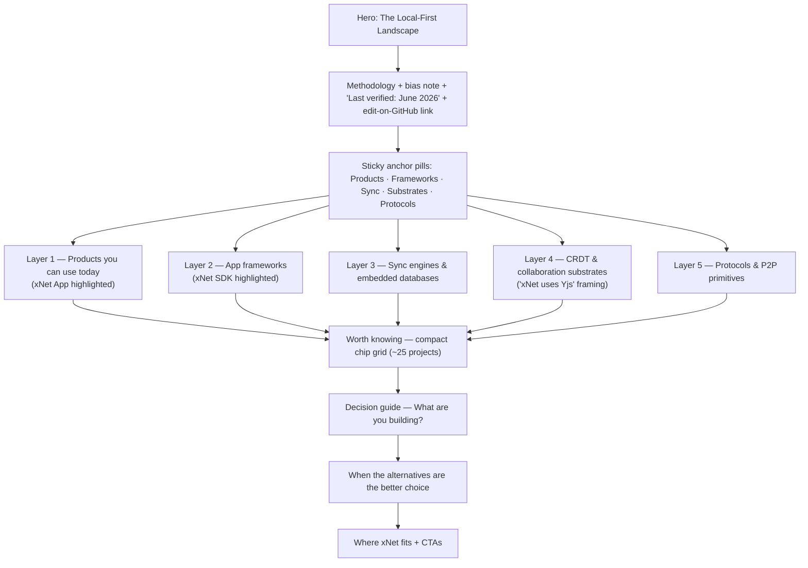
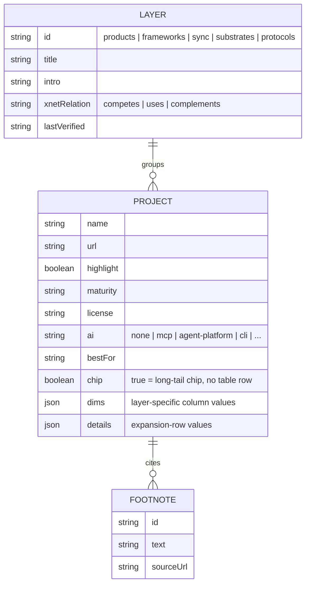
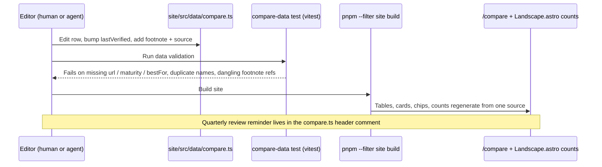
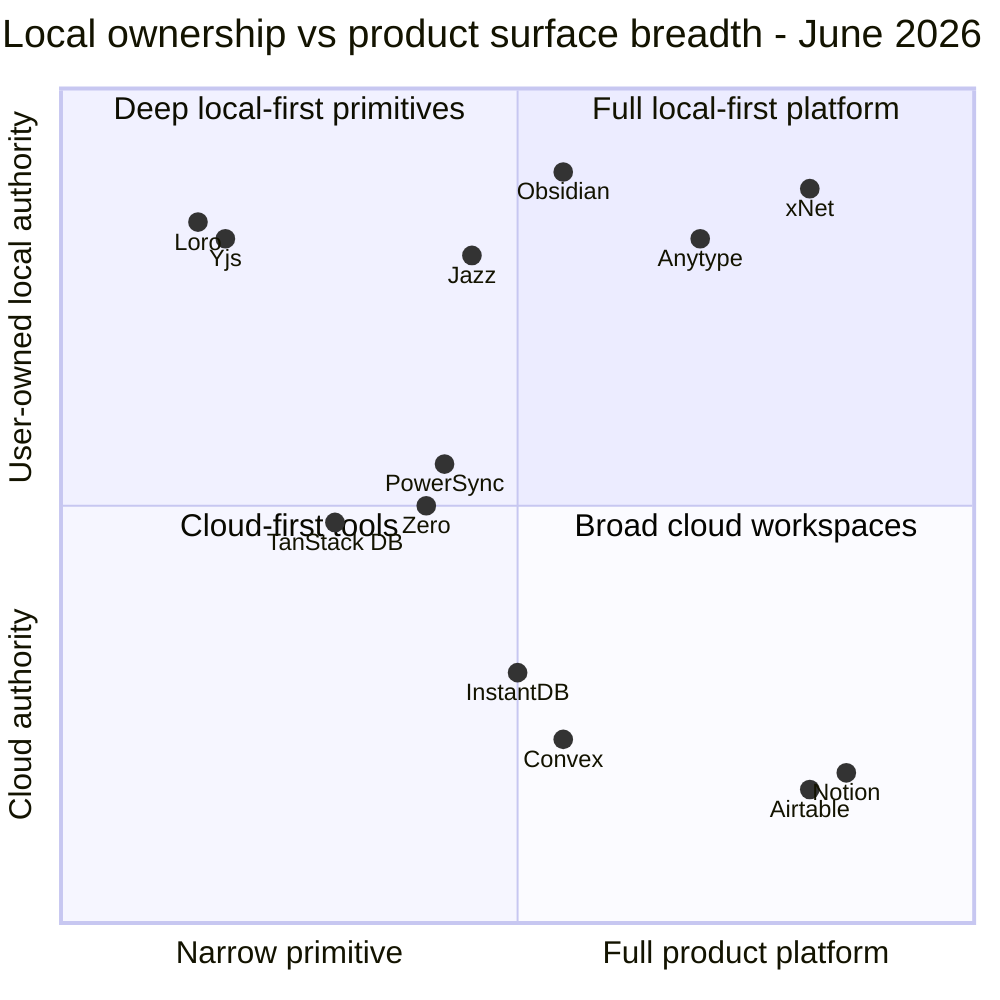
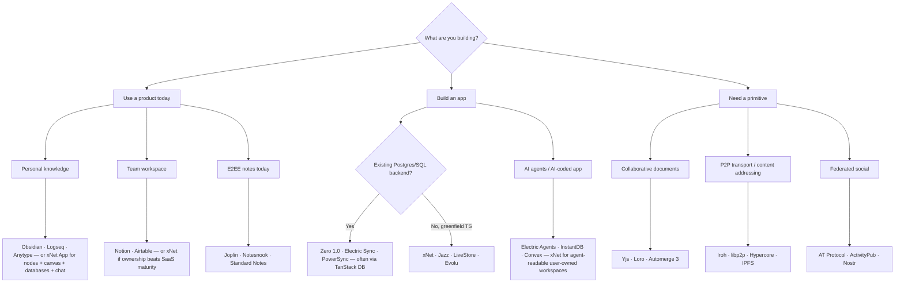

# Compare Page Redesign And Landscape Refresh

**Date:** 2026-06-12
**Scope:** `site/src/pages/compare.astro`, new `site/src/data/compare.ts`, `site/src/components/sections/Landscape.astro`
**Status:** Exploration
**Supersedes/extends:** `docs/explorations/0124_[_]_COMPARE_PAGE_COMPLETENESS_AND_LOCAL_FIRST_LANDSCAPE_EXPANSION.md`
**Outcome:** Rebuild `/compare` as a five-layer, data-driven landscape page with semantic badge cells, mobile card rendering, a decision guide, and an honesty block — and fix the factual drift that has accumulated since the page was written (Zero 1.0, Electric's agent pivot, Replicache maintenance mode, Jazz's CRDT misattribution, Convex self-hosting, Notion offline mode).

## Problem Statement

Exploration 0124 (May 2026) audited `/compare` for completeness and recommended a layered restructure plus ~30 missing projects. None of it was implemented: `git log --follow site/src/pages/compare.astro` shows only the original creation commit (`b43c875b`) and one copy-alignment pass (`754289b5`). The page is still the same three wide tables with inline data.

Thirteen months of landscape movement have turned 0124's "incompleteness" problem into an _incorrectness_ problem. Several rows on the live page are now factually wrong, which is worse for credibility than missing rows. Meanwhile the page's UX problems remain untouched: three 13/7/12-column horizontal-scroll tables that mix CRDT libraries with SaaS products, plain-text cells, no mobile story, no methodology note, and no trust apparatus.

This exploration answers three questions:

1. What is stale or wrong on the page today, and what is the June 2026 state of every listed project?
2. Which projects are still missing, including entrants that postdate 0124 (TanStack DB, Loro, Turso, Graft, SQLite-Sync, GoatDB, Verdant, Basic.tech)?
3. How should the page be redesigned — structure, components, data model, interactivity budget — given this site's conventions (static Astro, zero islands, Tailwind tokens, `roadmap.ts` data-module precedent)?

## Executive Summary

- **Fix facts first.** The current page misattributes Jazz's CRDT engine ("Automerge-based" — Jazz uses its own CoJSON CRDTs), says Convex is "Cloud only" (self-hostable under FSL since Feb 2025), shows Notion with no offline (shipped Aug 2025), shows Obsidian databases as "via plugins" (Bases is core since 1.9), and predates Zero 1.0 (June 2026), ElectricSQL's rebrand to `electric.ax` ("the agent platform built on sync"), and Holepunch's move to `pears.com`. The xNet row also overclaims: `platforms: 'Electron + Web + Expo'` while `site/src/data/roadmap.ts` lists "Mobile app (Expo)" under **Next**.
- **Restructure into five layers**, following ElectricSQL's alternatives-page model and 0124's taxonomy: Products → App frameworks → Sync engines & embedded databases → CRDT & collaboration substrates → Protocols & P2P primitives. xNet rows appear in the first two; layers 3–5 are framed as "what xNet uses or complements," not competitors.
- **Move data out of the page** into `site/src/data/compare.ts` (the `roadmap.ts` precedent), one typed entry per project with layer, maturity, license, AI/agents posture, footnotes, and a `lastVerified` date. All tables, mobile cards, summary counts, and chips render from it — PostHog's single-source pattern.
- **Adopt three UI patterns** from prior art: caniuse-style semantic badge cells (Yes/Partial/No as icon + text + footnote, never color-only), dual rendering (real `<table>` at `sm:`+, transposed per-project cards below — build-time duplication, zero JS), and a compact "worth knowing" chip grid for the long tail so main tables stay at 8–12 rows.
- **Add the credibility blocks** 0124 asked for, now with concrete prior art: a methodology/bias note (RxDB's "everything is opinionated"), per-section "Last verified: June 2026" stamps (PowerSync's dated posts), an "edit this data on GitHub" link, a decision guide, and a "when the alternatives are the better choice" section (SQLite's `whentouse.html` pattern).
- **Add an AI/agents dimension.** It is now a primary axis of differentiation in this space (Electric Agents, InstantDB's "backend for AI-coded apps", Convex MCP server, LiveStore 0.4's MCP support) and xNet has a real story (`xnet` CLI, SKILL.md, files-first checkout — already marketed in `BuiltForAgents.astro`).
- **Phase it**: a same-day fact hotfix (Phase 0), the data-module + layered redesign (Phase 1), decision guide + honesty + long tail (Phase 2), and optional per-competitor spoke pages for SEO (Phase 3).

## Current State In The Repository

### Page anatomy

`site/src/pages/compare.astro` (715 lines):

| Lines   | Content                                                                                                                 |
| ------- | ----------------------------------------------------------------------------------------------------------------------- |
| 8–169   | `infraProjects` (8 rows) + `infraColumns` (13 columns)                                                                  |
| 173–304 | `protocolProjects` (10 rows) + `protocolColumns` (7 columns)                                                            |
| 308–477 | `productivityApps` (9 rows) + `productivityColumns` (12 columns)                                                        |
| 489–514 | Hero + three count cards (counts derived from array lengths)                                                            |
| 516–658 | Three near-identical table blocks: sticky first column, backdrop blur, indigo highlight row, boolean → Yes/No rendering |
| 660–710 | "Where xNet Fits" callout with four advice cards + CTAs                                                                 |

One footnote exists (line 566, Convex licensing). There is no methodology note, no dates, no per-cell sourcing, and no mobile rendering besides `overflow-x-auto`.

### Site conventions the redesign must respect

- **Zero islands.** No `client:` directives anywhere; the only scripts are scroll animation + copy buttons in `site/src/layouts/Base.astro`, theme toggle in `site/src/components/ui/ThemeToggle.astro`, and platform detection in `site/src/pages/download.astro`. Any interactivity on `/compare` should be plain `<script>` or zero-JS (anchors, `<details>`).
- **Tokens.** Tailwind maps `surface`, `border`, `code-bg` to CSS vars defined in `Base.astro`; dark mode is class-based; accents are indigo (brand), emerald (positive), amber (warning), with purple/pink/cyan for feature color-coding.
- **Reusable UI.** `site/src/components/ui/Badge.astro` (default/success/warning pills) and `SectionHeader.astro` (gradient heading) already exist.
- **Data-module precedent.** `site/src/data/roadmap.ts` exports typed content consumed by `sections/Roadmap.astro`, with a header comment encoding its maintenance contract ("every Built item must map to a merged PR"). `compare.ts` should copy this pattern, including the contract comment.
- **Build.** `pnpm --filter site build` runs `build:llms` (validates docs MDX against `site/src/sidebar.mjs`) then `astro build`. `compare.astro` is a page, not docs content, so it does not participate in sidebar validation — no llms-build risk.
- **Inbound link.** `site/src/components/sections/Landscape.astro` on the landing page links to `/compare` with copy promising "25+ frameworks"; that copy must be updated alongside the redesign.

### Factual drift on the live page (June 2026 audit)

| Row              | Current claim                           | Reality (verified June 2026)                                                                                     | Severity                                      |
| ---------------- | --------------------------------------- | ---------------------------------------------------------------------------------------------------------------- | --------------------------------------------- |
| Jazz             | `crdt: 'Automerge-based'`               | Jazz is built on its own CoJSON CRDTs, not Automerge; also now in **v2 alpha** with a new API                    | High — factual error about a named competitor |
| Convex           | `selfHosted: 'Cloud only'`              | Backend open for self-hosting since Feb 2025 under FSL-Apache-2.0 (Docker; Postgres/MySQL/SQLite)                | High                                          |
| Zero             | URL `zerosync.dev`, no status           | **Zero 1.0 — first stable release, June 2026**; canonical URL `zero.rocicorp.dev`                                | High                                          |
| ElectricSQL      | `electric-sql.com`, sync-engine framing | Rebranded to `electric.ax`, "the agent platform built on sync" (Electric Agents, Durable Streams, Electric Sync) | Medium                                        |
| Notion           | `offline: 'Partial (cache)'`            | Shipped per-page offline mode Aug 2025 (with limits) — "Partial" is still fair but the parenthetical is stale    | Low                                           |
| Obsidian         | `databases: 'Via plugins'`              | Bases (notes-as-database) is a core plugin since 1.9, expanded through 1.13 (May 2026)                           | Medium                                        |
| Hypercore / Pear | URL `holepunch.to`                      | Now `pears.com`; project active, Tether-backed                                                                   | Low                                           |
| AT Protocol      | `status: 'Production (30M+ users)'`     | User count unverified this cycle; avoid hard numbers without a source                                            | Low                                           |
| xNet             | `platforms: 'Electron + Web + Expo'`    | `roadmap.ts` lists "Mobile app (Expo)" under **Next** — overclaim                                                | High — it's our own row                       |
| xNet             | `selfHosted: 'No server needed'`        | Accurate but underspecified; 0124 already flagged: should read "P2P; optional Hub for backup, relay, search"     | Medium                                        |
| xNet App         | No chat/calls/inbox/dashboards columns  | Roadmap "Built" now includes chat, presence, P2P calls, notification inbox, dashboards, tasks — page undersells  | Medium                                        |

The xNet platform overclaim and the Jazz misattribution are the two most damaging: one reads as dishonest about ourselves, the other as careless about a peer.

## External Research

Research was conducted with live web verification (June 12, 2026). Full per-project source list in References. Items that could not be confirmed against an official source are marked UNVERIFIED in the data tables and should carry footnotes if published.

### Status changes since 0124

| Project     | June 2026 status                                                                                                                                             |
| ----------- | ------------------------------------------------------------------------------------------------------------------------------------------------------------ |
| Zero        | **1.0 stable** (announced June 2026 after ~50 releases); Apache-2.0; Rocicorp points fully-decentralized use cases to Jazz                                   |
| Replicache  | **Maintenance mode** — open-sourced, free, no new features; users directed to Zero                                                                           |
| ElectricSQL | Repositioned as agent platform (`electric.ax`): Electric Agents, Durable Streams (hosted Jan 2026), Electric Sync (Apache-2.0), deep TanStack DB partnership |
| Triplit     | Alive but low velocity — 1.0 (Mar 2025), AGPL-3.0, unfunded; latest release Jul 2025                                                                         |
| Jazz        | Skipped 1.0 → **v2 alpha** ("local-first relational database": partial table sync, durable streams, files); MIT                                              |
| LiveStore   | **v0.4.0** (June 2026): Cloudflare DO adapter, S2 sync backend, **MCP server support**; Apache-2.0, pre-1.0                                                  |
| Fireproof   | Active; pivoted to vibe-coding/AI positioning ("fits in the context window"); launched Vibes DIY                                                             |
| Evolu       | Active; E2EE SQLite-WASM + self-hostable relay; MIT                                                                                                          |
| DXOS        | Active; Composer explicitly **not production-ready**; now framed around AI-driven workflows                                                                  |
| Convex      | Self-hostable since Feb 2025 (FSL-Apache-2.0); AI Agent component + official MCP server                                                                      |
| InstantDB   | Independent (YC seed; no acquisition); repositioned "the best backend for AI-coded apps"; hosted MCP server; Apache-2.0                                      |
| PowerSync   | Service 1.22 (June 2026); experimental Convex replication source; TanStack DB collection; FSL-1.1 service / Apache-2.0 SDKs                                  |
| Iroh        | 1.0.0-rc published; final 1.0 UNVERIFIED                                                                                                                     |
| Automerge   | **3.0** (July 2025): ~10x memory reduction — long-history docs now viable                                                                                    |
| Notion      | Offline mode shipped Aug 2025 (per-page opt-in, limits)                                                                                                      |
| Obsidian    | Bases core plugin (1.9 → 1.13, May 2026) — much stronger Notion-alternative posture                                                                          |
| Logseq      | DB version in beta, RTC sync alpha; project formally split file-based vs DB (May 2026)                                                                       |
| Anytype     | Major Feb 2026 desktop release; prototyping local AI agents using objects as agent memory                                                                    |
| AFFiNE      | 0.26.x; 0.25 was a major AI/multimodal release; MIT (CE)                                                                                                     |
| AppFlowy    | 0.12.x (May 2026); AI meeting notes; AGPL                                                                                                                    |
| Fission     | **Shut down April 2024** — UCAN spec work continues community-stewarded. Directly relevant: xNet's identity story leans on UCAN; worth a footnote            |
| Ditto       | $82M Series B (Mar 2025) — largest raise in the space                                                                                                        |

### New entrants 0124 did not cover

| Project                     | Layer                           | One-liner                                                                                                         | Maturity (mid-2026)        | License                         |
| --------------------------- | ------------------------------- | ----------------------------------------------------------------------------------------------------------------- | -------------------------- | ------------------------------- |
| **TanStack DB**             | Client store / sync abstraction | Differential-dataflow live queries over pluggable sync collections; Electric and PowerSync both market through it | Beta (0.6, Mar 2026)       | MIT                             |
| **Loro**                    | CRDT library                    | High-performance Rust CRDT (rich text, movable trees, time travel) with JS/Swift/Python bindings                  | Mature (1.13.x)            | MIT                             |
| **Turso**                   | Embedded DB + sync cloud        | Rust rewrite of SQLite with embedded replicas and offline writes; official MCP server                             | Production cloud           | MIT core + proprietary cloud    |
| **Graft**                   | Sync/storage engine             | Page-based lazy partial replication; SQLite VFS (`libgraft`); successor to SQLSync                                | Pre-1.0, active            | OSS (exact UNVERIFIED)          |
| **SQLite-Sync**             | Embedded-DB sync extension      | CRDT extension for plain SQLite tables; markets agent-memory sync                                                 | 1.0.x, production-marketed | Elastic 2.0                     |
| **Dexie Cloud**             | Embedded DB + sync cloud        | Commercial sync for Dexie.js/IndexedDB; Server 3.0 (Mar 2026)                                                     | Production                 | Apache-2.0 lib / proprietary    |
| **Verdant**                 | App framework                   | Solo-maintained IndexedDB local-first framework; server relay, explicitly not P2P                                 | Stable                     | MIT                             |
| **GoatDB**                  | Embedded DB                     | Git-like (signed commits, 3-way merge) P2P document DB "for apps and agents"                                      | Pre-1.0 (0.5.x)            | MIT                             |
| **Basic.tech**              | PDS platform                    | Per-user personal data stores + local-first app platform; closest philosophical neighbor to xNet                  | Beta                       | UNVERIFIED                      |
| **Y-Sweet**                 | Yjs sync server                 | S3-backed Rust Yjs server (Jamsocket); quiet since Sep 2025                                                       | Stable                     | MIT                             |
| **Liveblocks**              | Cloud realtime infra            | Presence/comments/multiplayer SaaS; 3.0 repositioned around AI Copilots (agents as participants)                  | Production                 | Proprietary                     |
| **PartyServer / CF Agents** | Cloud realtime baseline         | PartyKit's successor on Cloudflare Durable Objects; Agents SDK gives each agent a DO + SQLite                     | Production                 | OSS libs / proprietary platform |
| **tldraw sync**             | Canvas SDK + sync               | Infinite-canvas SDK with multiplayer backend; SDK 4.0 moved to paid production license                            | Production                 | Custom commercial               |

Productivity apps newly worth acknowledging: **Tana** (API + official MCP server, $25M raised), **Reflect** (E2EE notes, MCP server Mar 2026), **Bear** (local SQLite + CloudKit E2EE), **Capacities** (active, object-based), **Heptabase**, plus legacy baselines (Roam in decline, Evernote/OneNote as recognition anchors).

### The AI/agents axis

This is the largest narrative shift since 0124 and deserves a first-class column:

- **Identity-level pivots:** ElectricSQL ("the agent platform built on sync"), InstantDB ("the best backend for AI-coded apps", hosted MCP), Fireproof ("fits in the context window", Vibes DIY), GoatDB ("for apps and agents").
- **Shipping MCP/agent features:** Convex (Agent component, MCP server, MCP gateway), LiveStore (MCP in 0.4), Turso (official MCP), Liveblocks (AI Copilots), Cloudflare Agents SDK, SQLite-Sync (agent memory), Tana/Reflect/Anytype on the product side.
- **Deliberately silent:** Zero (no AI marketing at all), PowerSync (minimal), Jazz, Triplit, Evolu, Verdant.

xNet's agent surface (the `xnet` CLI, SKILL.md, files-first checkout — see `site/src/components/sections/BuiltForAgents.astro` and roadmap "Built") is genuinely competitive here and currently invisible on `/compare`.

### UI/UX prior art

| Source                                       | Pattern worth stealing                                                                                                                               |
| -------------------------------------------- | ---------------------------------------------------------------------------------------------------------------------------------------------------- |
| ElectricSQL alternatives page                | **Layer separation as the organizing principle** — sections by functional layer, neutral tone, pointers to community directories                     |
| PostHog feature matrix + handbook            | **Single source of truth** for comparison data; every table generated from it; honest scoring as a credibility strategy                              |
| caniuse / MDN compat tables                  | **Semantic badge cells**: Yes/Partial/No as color + icon + text, numbered footnotes pinned to specific cells                                         |
| RxDB alternatives hub + vs-pages             | **Hub-and-spoke SEO**: one hub, dozens of per-competitor pages, explicit bias disclosure banner                                                      |
| PowerSync vs-posts                           | Publish + update dates, top-of-page correction banners when things change                                                                            |
| SQLite `whentouse.html`, RxDB downsides page | **"When not to use us"** as a dedicated honest section                                                                                               |
| CNCF landscape / lofi.so / jamstack.org      | Card directories with objective metrics (stars, last commit) instead of editorial adjectives; PR-editable open data                                  |
| Superlinked vector-DB comparison             | The JS-maximal endpoint (sortable/pinnable matrix) — steal ideas (per-cell comments), not the implementation                                         |
| Smashing Magazine responsive tables, NN/g    | **Dual rendering** (table ≥ sm, transposed cards below); scroll wrapper needs `tabindex="0"` + `role="region"` + `aria-labelledby`; never color-only |

SEO finding: dedicated "X vs Y" / "X alternatives" pages outperform a single mega-page (RxDB is the proof case in this exact niche; PostHog is the mature model). The hub should stay, but spoke pages generated from the same data file are the long-term SEO play.

## Key Findings

1. **The page's biggest liability is now accuracy, not coverage.** Zero 1.0, Replicache maintenance, Convex self-host, Jazz CoJSON, and the xNet Expo overclaim are all checkable in seconds by the audience this page targets.
2. **0124's taxonomy survives contact with 2026** — but needs a fifth distinction: sync engines/embedded DBs (Zero, Electric Sync, PowerSync, Turso) vs CRDT/collab substrates (Yjs, Automerge, Loro, Liveblocks) are different buyer questions ("sync my existing DB" vs "build collaborative state").
3. **AI/agents is now a load-bearing comparison dimension**, and xNet has a real differentiator to show (CLI + SKILL.md + files-first agent surface).
4. **The site's conventions make the redesign cheap**: `roadmap.ts` is the exact data-module precedent; `Badge.astro` is the badge primitive; zero-island policy pushes toward static dual-rendering and `<details>` rather than JS grids — which prior art says is the right call anyway.
5. **Trust apparatus is free credibility**: a methodology note, per-section `lastVerified`, footnotes, an "edit on GitHub" link, and a "when not to use xNet" block are all low-effort, high-trust, and almost nobody in this space does all of them.
6. **Main tables must shrink, not grow.** 0124's lists plus the 2026 entrants total ~55 projects. The answer is curation: 8–12 rows per layer table with 6–7 curated columns, expandable details per row, and a chip grid for the long tail.

## Options And Tradeoffs

### Option A — Fact patch only

Fix the stale/wrong cells in place, add the most-missed rows (RxDB, TinyBase, PowerSync, Yjs, Logseq, Joplin) to the existing three tables, add a methodology sentence.

- **Effort:** ~half a day. **Risk:** near zero.
- **Outcome:** Credible facts, but tables get _wider-feeling_ (more rows × same 12–13 columns), mobile remains broken, layer-mixing worsens (RxDB next to Convex next to xNet), and no AI dimension. 0124 already rejected this as the end state.

### Option B — Layered, data-driven redesign (recommended)

Five layer sections, `compare.ts` data module, curated columns + badge cells + footnotes, dual table/card rendering, chips for long tail, decision guide, honesty block, trust block. Zero islands; optional ~20 lines of vanilla JS only if tabs are wanted (anchor pills need none).

- **Effort:** 2–4 days including data verification.
- **Outcome:** Fixes accuracy, mobile, layer-mixing, credibility, and positioning in one pass. Sets up Option C for free.
- **Risk:** Curation arguments (who makes the main table); page length grows (mitigated by chips + details).

### Option C — Interactive directory + spoke pages

JS-filterable card directory (CNCF-style), build-time GitHub stars, per-competitor `/compare/xnet-vs-*` pages from the same data via Astro content collections.

- **Effort:** 1–2 weeks. **Outcome:** Best SEO and best maintenance optics, but the filter UI breaks the site's zero-island simplicity for marginal reader value at ~55 projects, and spoke pages are only worth it once the hub data is stable.
- **Verdict:** Don't build the filter grid. Spoke pages are a worthwhile **Phase 3** once Phase 1/2 data has settled.

### Comparison

| Dimension          | A: Patch | B: Redesign                        | C: Directory + spokes   |
| ------------------ | -------- | ---------------------------------- | ----------------------- |
| Factual accuracy   | ✅       | ✅                                 | ✅                      |
| Mobile readability | ❌       | ✅                                 | ✅                      |
| Layer correctness  | ❌       | ✅                                 | ✅                      |
| AI dimension       | ❌       | ✅                                 | ✅                      |
| Credibility blocks | partial  | ✅                                 | ✅                      |
| SEO upside         | none     | modest                             | high                    |
| Maintenance burden | grows    | drops (single source + validation) | drops further           |
| JS budget          | 0        | 0 (optionally ~20 lines)           | islands or heavy script |
| Effort             | 0.5 d    | 2–4 d                              | +1–2 w                  |

## Recommendation

Ship **Option B in three phases, with a Phase 0 hotfix that can land today**, and keep Option C's spoke pages as a Phase 3 follow-up.

### Proposed page architecture



Each layer section = `SectionHeader` + one-paragraph "how to read this layer" + dual-rendered comparison (table ≥ `sm`, cards below) + footnotes. Anchor pills are plain `#fragment` links — zero JS, and they double as a table of contents on mobile.

### Layer taxonomy and rosters

```mermaid
flowchart LR
    subgraph L1["Products"]
        direction TB
        P1["xNet App ★"]
        P2["Notion · Airtable (cloud baselines)"]
        P3["Obsidian · Anytype · Logseq"]
        P4["AppFlowy · AFFiNE · Joplin"]
    end
    subgraph L2["App frameworks"]
        direction TB
        F1["xNet SDK ★"]
        F2["Jazz · Triplit · LiveStore · DXOS"]
        F3["Evolu · RxDB · TinyBase · Fireproof"]
        F4["Convex · InstantDB (cloud baselines)"]
    end
    subgraph L3["Sync engines & embedded DBs"]
        direction TB
        S1["Zero · Electric Sync · PowerSync"]
        S2["TanStack DB · Turso · Ditto"]
        S3["Replicache (maintenance)"]
    end
    subgraph L4["CRDT & collab substrates"]
        direction TB
        C1["Yjs (xNet uses) · Automerge · Loro"]
        C2["Y-Sweet · Liveblocks · Fluid"]
    end
    subgraph L5["Protocols & P2P primitives"]
        direction TB
        N1["AT Proto · Nostr · ActivityPub · Matrix"]
        N2["Iroh · Hypercore/Pear · libp2p · IPFS"]
        N3["Willow · p2panda · Holochain · Solid"]
    end
    L1 -->|"built with"| L2 -->|"sync via"| L3 -->|"merge via"| L4 -->|"transport/identity via"| L5
```



Main-table rosters (8–12 rows each; everything else → chips):

| Layer                       | Main table                                                                                     | Chips (long tail)                                                                                                                 |
| --------------------------- | ---------------------------------------------------------------------------------------------- | --------------------------------------------------------------------------------------------------------------------------------- |
| Products                    | xNet App ★, Notion, Airtable, Obsidian, Anytype, Logseq, AppFlowy, AFFiNE, Joplin              | Linear, Coda, Notesnook, Standard Notes, Outline, Capacities, Heptabase, Tana, Reflect, Bear, Craft, Roam, Twos, Evernote/OneNote |
| App frameworks              | xNet ★, Jazz, Triplit, LiveStore, DXOS, Evolu, RxDB, TinyBase, Fireproof, Convex, InstantDB    | Verdant, GoatDB, Basic.tech, WatermelonDB, PouchDB                                                                                |
| Sync engines & embedded DBs | Zero, Electric Sync, PowerSync, TanStack DB, Turso, Ditto, Replicache                          | SQLite-Sync, Dexie Cloud, Graft, CR-SQLite, PartyServer/CF Agents                                                                 |
| CRDT & collab substrates    | Yjs, Automerge, Loro, Y-Sweet, Liveblocks, Fluid Framework                                     | tldraw sync, Excalidraw, Collabs                                                                                                  |
| Protocols & P2P primitives  | AT Protocol, Nostr, ActivityPub, Matrix, Hypercore/Pear, Iroh, libp2p, IPFS, Willow, Holochain | p2panda, Solid, Earthstar, OrbitDB, Scuttlebutt, GunDB, Ceramic, Farcaster                                                        |

Notes on placement: Convex and InstantDB stay in the frameworks table as labeled **cloud baselines** (their hooks-first DX is what framework buyers actually weigh them against); Anytype appears once, in Products, with a footnote that it ships its own protocol; xNet does **not** get a row in layers 3–5 — instead each of those sections opens with one sentence on what xNet uses there (Yjs in L4; WebRTC, DID:key + UCAN in L5, with the community-stewarded-UCAN footnote).

### Curated columns per layer

Keep ≤ 7 visible columns; push the rest into a per-row `<details>` expansion ("More: schema, hooks, platforms, encryption…").

| Layer          | Visible columns                                                                         | In details expansion                                                                       |
| -------------- | --------------------------------------------------------------------------------------- | ------------------------------------------------------------------------------------------ |
| Products       | Maturity, Local-first, Offline, Collab & comms, Open source, AI/agents, Pricing         | Rich text, databases, canvas, plugins, data ownership, platforms, self-host, import/export |
| App frameworks | Maturity, License, Sync topology, Conflict model, Identity/auth, AI/agents, Best for    | Schema, React hooks, type safety, platforms, self-host detail, encryption                  |
| Sync engines   | Maturity, License, Source of truth, Offline writes, Conflict model, AI/agents, Best for | Platforms/SDKs, hosting options, pricing model                                             |
| Substrates     | Kind (lib/server/SaaS), Maturity, License, Data types, Network story, Best for          | Bindings, persistence options, ecosystem                                                   |
| Protocols      | Scope, Data model, Sync, Identity, Status, Best for                                     | Language, governance, notable deployments                                                  |

"Collab & comms" is new and earned: xNet App now ships real-time chat, presence, P2P calls, and a notification inbox (roadmap "Built") — a dimension where Notion/Obsidian/Logseq genuinely differ.

### Cell semantics

Adopt caniuse-style ternary badges rendered by a small `CompareCell.astro`:

- ✓ **Yes** (emerald), ◐ **Partial** (amber), ✗ **No** (gray) — always icon + text, never color alone.
- Strings stay strings ("FSL-1.1 service", "v2 alpha").
- Footnote refs render as superscript links to a per-section footnote list (`Partial¹` → "1. Per-page opt-in, 50-row database limit").
- Maturity uses the existing `Badge.astro` variants: emerald = production, amber = beta/alpha/pre-release, gray = maintenance/legacy.

### Data model



### Maintenance loop



### Updated positioning chart (for the page or the doc only)



### Decision guide (2026 edition)



### When the alternatives are the better choice (page block)

| Need                                           | Better fit today                           |
| ---------------------------------------------- | ------------------------------------------ |
| Mature SaaS workspace with enterprise support  | Notion, Airtable, Linear                   |
| Incremental sync onto an existing Postgres app | Zero, Electric Sync, PowerSync             |
| Agent infrastructure at cloud scale            | Electric Agents, Cloudflare Agents, Convex |
| Offline mesh across BLE/LAN in production      | Ditto                                      |
| Just a rich-text CRDT                          | Yjs, Loro, Automerge                       |
| E2EE standalone notes, today, on every device  | Joplin, Notesnook, Standard Notes          |
| Federated social protocol                      | AT Protocol, ActivityPub, Nostr            |

### xNet row accuracy fixes (apply in every phase)

- `maturity: 'pre-release'` everywhere xNet appears; never imply parity with production rows.
- `platforms: 'Electron + Web (mobile in development)'` — matches roadmap "Next".
- `selfHosted: 'P2P; optional Hub for backup, relay, search'` — replaces "No server needed".
- `ai: 'xnet CLI + SKILL.md + files-first agent checkout'` — the genuine differentiator, currently absent.
- Products row gains chat/presence/calls + notification inbox + dashboards under "Collab & comms".
- Footnote UCAN as community-stewarded post-Fission; footnote plugin claims to distinguish first-party plugins from untrusted third-party isolation.

## Example Code

`site/src/data/compare.ts` (following the `roadmap.ts` contract-comment pattern):

```typescript
/**
 * Comparison data for /compare (and Landscape.astro counts).
 *
 * Single source of truth: every table, mobile card, chip, and count on
 * /compare renders from these arrays. When a project ships a status
 * change, edit its row, bump `lastVerified` on its layer, and keep the
 * footnote's sourceUrl pointing at the announcement. Review quarterly.
 * Never state a competitor fact without a sourceUrl. xNet rows must
 * match site/src/data/roadmap.ts — shipped means "Built" there.
 */

export type Maturity = 'production' | 'beta' | 'alpha' | 'pre-release' | 'maintenance'

export type Ternary = 'yes' | 'partial' | 'no'

export interface Footnote {
  id: string
  text: string
  sourceUrl: string
}

export interface CompareProject {
  name: string
  url: string
  highlight?: boolean
  chip?: boolean // long-tail: render as chip, not table row
  maturity: Maturity
  license: string
  ai: string // 'none' | 'MCP server' | 'agent platform' | 'CLI + SKILL.md' ...
  bestFor: string
  dims: Record<string, string | Ternary> // visible columns, per layer
  details?: Record<string, string> // <details> expansion
  footnotes?: string[] // Footnote ids referenced by this row
}

export interface CompareLayer {
  id: 'products' | 'frameworks' | 'sync' | 'substrates' | 'protocols'
  title: string
  intro: string
  xnetRelation: 'competes' | 'uses' | 'complements'
  lastVerified: string // 'June 2026'
  columns: { key: string; label: string }[]
  projects: CompareProject[]
  footnotes: Footnote[]
}

export const updated = 'June 2026'
export const layers: CompareLayer[] = [
  /* ... */
]
```

`CompareCell.astro` sketch:

```astro
---
interface Props {
  value: string
  footnote?: string
}
const { value, footnote } = Astro.props
const ternary = { yes: '✓ Yes', partial: '◐ Partial', no: '✗ No' }[value]
const tone = {
  yes: 'text-emerald-400',
  partial: 'text-amber-400',
  no: 'text-gray-600',
}[value]
---

<span class={tone ?? 'text-gray-500 dark:text-gray-400'}>
  {ternary ?? value}{
    footnote && (
      <a href={`#fn-${footnote}`} class="align-super text-[10px] text-indigo-400">
        {footnote}
      </a>
    )
  }
</span>
```

Dual rendering (per layer section, zero JS — duplication is free at build time):

```astro
<!-- Desktop: real table with a11y-correct scroll region -->
<div
  class="hidden sm:block overflow-x-auto rounded-xl border border-border"
  role="region"
  aria-labelledby={`${layer.id}-caption`}
  tabindex="0"
>
  <table class="w-full text-sm">
    <caption id={`${layer.id}-caption`} class="sr-only">{layer.title}</caption>
    <!-- thead with scope="col", sticky first column th with scope="row" -->
  </table>
</div>

<!-- Mobile: one card per project, key dims as label/value rows -->
<div class="sm:hidden space-y-3">
  {layer.projects.filter(p => !p.chip).map(p => (
    <details class={`rounded-xl border border-border p-4 ${p.highlight ? 'bg-indigo-500/[0.04]' : ''}`}>
      <summary class="font-medium">{p.name} <Badge variant={...}>{p.maturity}</Badge></summary>
      <dl class="mt-3 grid grid-cols-[auto_1fr] gap-x-4 gap-y-1 text-sm">
        {layer.columns.map(col => (<><dt>{col.label}</dt><dd><CompareCell value={p.dims[col.key]} /></dd></>))}
      </dl>
    </details>
  ))}
</div>
```

## Risks And Open Questions

- **Curation disputes.** Who makes a main table vs a chip is editorial. Mitigation: the methodology note states the rule ("main tables hold the projects a developer is most likely to shortlist in 2026; chips acknowledge the rest"), and chips link out, so nobody is erased.
- **Data rot.** This space moves fast (Zero went 0.26 → 1.0 in months; Electric changed domains). Mitigation: `lastVerified` per layer, source URL per footnote, validation test, quarterly review note in the file header. The data module makes a future "agent refreshes compare.ts and opens a PR" loop tractable.
- **Competitor-claim liability.** Stating "maintenance mode" or "low velocity" about a named company needs a source link; UNVERIFIED items from research (Iroh 1.0 final, Anytype/AppFlowy license wording, Basic.tech license) must be re-verified or softened before publishing.
- **Page weight/DOM size.** Dual rendering roughly doubles comparison DOM. Static HTML, no hydration — acceptable, but keep chips as plain links and avoid per-chip cards.
- **Accessibility regressions.** The current page lacks captions, `scope` attrs, and focusable scroll regions; the redesign must add them, and `<details>`-based mobile cards must keep summary text meaningful.
- **Open: tabs vs stacked sections.** Recommendation is stacked sections + sticky anchor pills (zero JS). If the page feels too long after Phase 1, add ~20 lines of vanilla JS tabs — decide on real content, not speculation.
- **Open: build-time GitHub stars/last-commit metrics** (CNCF pattern). Deferred — adds a network dependency to builds; revisit in Phase 3.
- **Open: spoke-page URL scheme** (`/compare/xnet-vs-jazz` vs `/alternatives/jazz`). Decide in Phase 3 alongside content-collection wiring.
- **Open: should `/compare` data feed `llms-full.txt`?** Agents reading the site might benefit; currently only docs MDX is aggregated. Low cost to add later since data will be typed TS.

## Implementation Checklist

### Phase 0 — Fact hotfix (same day, current page structure)

- [ ] Fix Jazz row: CoJSON CRDTs (not Automerge), status v2 alpha.
- [ ] Fix Convex row: self-hostable (FSL-Apache-2.0) — update footnote on line 566 too.
- [ ] Update Zero row: 1.0 stable, URL `zero.rocicorp.dev`.
- [ ] Update ElectricSQL row: URL `electric.ax`, note agent-platform repositioning.
- [ ] Update Hypercore/Pear URL to `pears.com`; soften AT Protocol user count.
- [ ] Update Notion offline and Obsidian Bases cells.
- [ ] Fix xNet rows: `platforms` (mobile in development), `selfHosted` ("P2P; optional Hub for backup, relay, search"), add pre-release qualifier.

### Phase 1 — Data module + layered redesign

- [ ] Create `site/src/data/compare.ts` with the typed model above, contract header comment, and all Phase-0-corrected rows migrated.
- [ ] Verify or soften every UNVERIFIED fact (Iroh 1.0, Anytype/AppFlowy licenses, Graft license, Basic.tech) with a source link.
- [ ] Add new framework/sync rows: RxDB, TinyBase, Fireproof, Evolu, InstantDB; Zero, Electric Sync, PowerSync, TanStack DB, Turso, Ditto, Replicache (maintenance badge).
- [ ] Add substrate layer: Yjs, Automerge 3, Loro, Y-Sweet, Liveblocks, Fluid — with "xNet uses Yjs" framing sentence.
- [ ] Add protocol rows: IPFS, libp2p, ActivityPub, Matrix; move Solid/p2panda to chips if the table exceeds 12 rows.
- [ ] Add product rows: Logseq, Joplin; move Linear/Coda to chips.
- [ ] Add `ai` field for every row; add the AI/agents column to products, frameworks, and sync tables (xNet: CLI + SKILL.md + files-first checkout).
- [ ] Build `CompareCell.astro` (ternary badges + footnote superscripts) and reuse `Badge.astro` for maturity.
- [ ] Rebuild `compare.astro` as five layer sections rendering from `compare.ts`: dual table/card rendering, per-section footnote lists, sticky anchor pills, summary counts derived per layer.
- [ ] Add a11y: `<caption>`, `scope` attributes, `role="region"` + `tabindex="0"` + `aria-labelledby` on scroll wrappers, icon+text (never color-only) cells.
- [ ] Add trust block: methodology/bias note, per-section "Last verified", "edit this data on GitHub" link to `compare.ts`.
- [ ] Add a vitest data-validation test (every row: url, maturity, license, bestFor; unique names; no dangling footnote refs; every footnote has sourceUrl).
- [ ] Update `Landscape.astro` link copy ("25+ frameworks" → derived count) and the page `<title>`/meta description.

### Phase 2 — Guidance and honesty

- [ ] Add the "Worth knowing" chip grid (~25 long-tail projects, `chip: true` rows).
- [ ] Add the decision-guide section (cards or simplified diagram adapted from the flowchart above).
- [ ] Add "When the alternatives are the better choice" block.
- [ ] Add xNet caveat footnotes: pre-release maturity, UCAN community stewardship, plugin trust model, encryption scope (local-at-rest vs transport vs E2EE).
- [ ] Update the products table with "Collab & comms" column reflecting shipped chat/presence/calls/inbox.
- [ ] Mark `0124_[_]` and this doc `[x]` once shipped (`docs(exploration): check off compare page redesign`).

### Phase 3 — Optional follow-ups (separate exploration not required)

- [ ] Spoke pages (`xNet vs Jazz`, `xNet vs Anytype`, "Notion alternatives") generated from `compare.ts` via an Astro content collection; cross-link hub ↔ spokes.
- [ ] Consider build-time GitHub metrics (stars, last release) per row.
- [ ] Consider feeding compare data into `llms-full.txt` for agent readers.

## Validation Checklist

- [ ] A local-first developer finds Zero (1.0), TanStack DB, RxDB, TinyBase, PowerSync, Yjs, Automerge, and Loro represented or chip-acknowledged.
- [ ] No factually wrong cell remains from the Phase-0 audit table (spot-check Jazz, Convex, Zero, Notion, Obsidian, Electric).
- [ ] Every competitor status claim ("maintenance", "alpha", "low velocity") has a footnote with a source URL.
- [ ] xNet rows match `roadmap.ts`: nothing claimed beyond "Built"; mobile marked in development; Hub wording used; pre-release badge visible.
- [ ] The AI/agents column renders for products, frameworks, and sync layers, and xNet's agent surface is present.
- [ ] On a 375px viewport, every layer renders as cards with no horizontal scroll; on desktop, tables scroll with visible affordance and are keyboard-focusable.
- [ ] VoiceOver/NVDA can navigate at least one table (caption announced, row/column headers correct).
- [ ] Dark and light mode both pass contrast inspection for badge colors (emerald/amber/gray on surface).
- [ ] All external links use `target="_blank" rel="noopener noreferrer"`.
- [ ] The data-validation test fails when a row is missing `url`/`maturity`/`bestFor` or references an undefined footnote (verify by mutation).
- [ ] `pnpm --filter site build` succeeds; `/compare` and the landing `Landscape.astro` counts agree.
- [ ] A fairness read-through: no dismissive language; every layer's intro states whether xNet competes, uses, or complements.

## References

Internal:

- Current page: `site/src/pages/compare.astro` (rows at lines 8–153, 173–294, 308–462; tables at 516–658)
- Prior exploration: `docs/explorations/0124_[_]_COMPARE_PAGE_COMPLETENESS_AND_LOCAL_FIRST_LANDSCAPE_EXPANSION.md`
- Data-module precedent: `site/src/data/roadmap.ts`; consuming section `site/src/components/sections/Roadmap.astro`
- UI primitives: `site/src/components/ui/Badge.astro`, `site/src/components/ui/SectionHeader.astro`
- Inbound link to update: `site/src/components/sections/Landscape.astro`
- Agent-surface marketing to mirror in the AI column: `site/src/components/sections/BuiltForAgents.astro`

Landscape (verified June 12, 2026):

- Zero 1.0: <https://www.infoq.com/news/2026/06/zero-version-1/>, <https://zero.rocicorp.dev>
- Replicache maintenance: <https://replicache.dev/>
- Electric agent platform: <https://electric.ax/>, Durable Streams: <https://electric-sql.com/blog/2026/01/22/announcing-hosted-durable-streams>
- TanStack DB 0.6: <https://tanstack.com/blog/tanstack-db-0.6-app-ready-with-persistence-and-includes>
- Jazz v2: <https://jazz.tools/> · LiveStore 0.4: <https://github.com/livestorejs/livestore/releases>
- Convex open source/self-host: <https://news.convex.dev/convex-goes-open-source/>, MCP: <https://docs.convex.dev/ai/convex-mcp-server>
- InstantDB AI positioning: <https://www.instantdb.com/docs/using-llms>
- PowerSync licensing/changelog: <https://www.powersync.com/legal/licensing-terms>, <https://releases.powersync.com/>
- Turso offline writes: <https://turso.tech/blog/introducing-offline-writes-for-turso>
- Loro: <https://loro.dev/> · Automerge 3: <https://automerge.org/blog/automerge-3/> · Y-Sweet: <https://github.com/jamsocket/y-sweet>
- Graft: <https://github.com/orbitinghail/graft> · SQLite-Sync: <https://github.com/sqliteai/sqlite-sync> · GoatDB: <https://goatdb.dev/> · Verdant: <https://github.com/a-type/verdant> · Basic: <https://basic.tech/>
- Liveblocks AI Copilots: <https://liveblocks.io/> · PartyKit → Cloudflare: <https://blog.partykit.io/posts/partykit-is-joining-cloudflare/> · Cloudflare Agents: <https://github.com/cloudflare/agents>
- tldraw SDK 4.0 licensing: <https://tldraw.dev/blog/tldraw-sdk-4-0>
- Ditto Series B: <https://techcrunch.com/2025/03/12/ditto-lands-82m-to-synchronize-data-from-the-edge-to-the-cloud/>
- Fission farewell (UCAN stewardship): <https://fission.codes/blog/farewell-from-fission/>
- Notion offline: <https://www.notion.com/releases/2025-08-19> · Obsidian Bases: <https://obsidian.md/changelog/> · Logseq DB beta: <https://discuss.logseq.com/t/whats-new-with-logseq-db-may-16th-2026/35020>
- Anytype Feb 2026: <https://blog.anytype.io/february-community-update-2026/> · AFFiNE: <https://github.com/toeverything/affine/releases> · AppFlowy: <https://github.com/AppFlowy-IO/appflowy/releases>
- Tana API/MCP: <https://tana.inc/articles/tana-api-mcp-voice-ai-workflows> · Iroh 1.0 roadmap: <https://www.iroh.computer/blog/road-to-1-0>
- Directories: <https://lofi.so/>, <https://www.localfirst.fm/landscape>

UI/UX prior art:

- ElectricSQL alternatives (layer model): <https://electric-sql.com/docs/reference/alternatives>
- RxDB alternatives hub + bias note: <https://rxdb.info/alternatives.html>; honest downsides page: <https://rxdb.info/downsides-of-offline-first.html>
- PostHog feature matrix + single-source handbook: <https://posthog.com/feature-matrix>, <https://posthog.com/handbook/engineering/posthog-com/product-comparisons>
- PowerSync dated vs-post: <https://powersync.com/blog/electricsql-electric-next-vs-powersync>
- Supabase vs Firebase: <https://supabase.com/alternatives/supabase-vs-firebase>
- caniuse badge cells/footnotes: <https://caniuse.com/> · Superlinked matrix: <https://superlinked.com/vector-db-comparison>
- CNCF landscape: <https://landscape.cncf.io> · jamstack generators: <https://jamstack.org/generators/>
- SQLite "when to use": <https://sqlite.org/whentouse.html>
- Responsive/accessible tables: <https://www.smashingmagazine.com/2022/12/accessible-front-end-patterns-responsive-tables-part1/> (and part 2), <https://css-tricks.com/accessible-simple-responsive-tables/>, <https://www.nngroup.com/articles/mobile-tables/>
- Thoughtworks Radar methodology: <https://www.thoughtworks.com/radar/faq>
