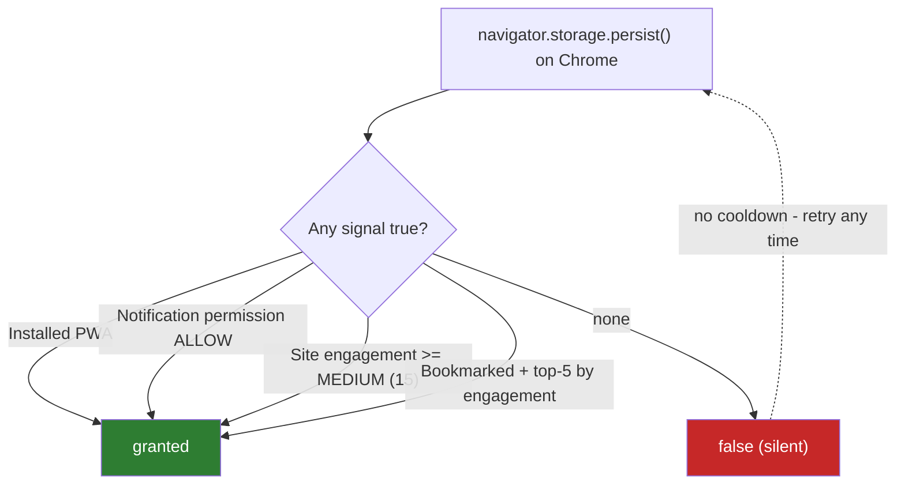
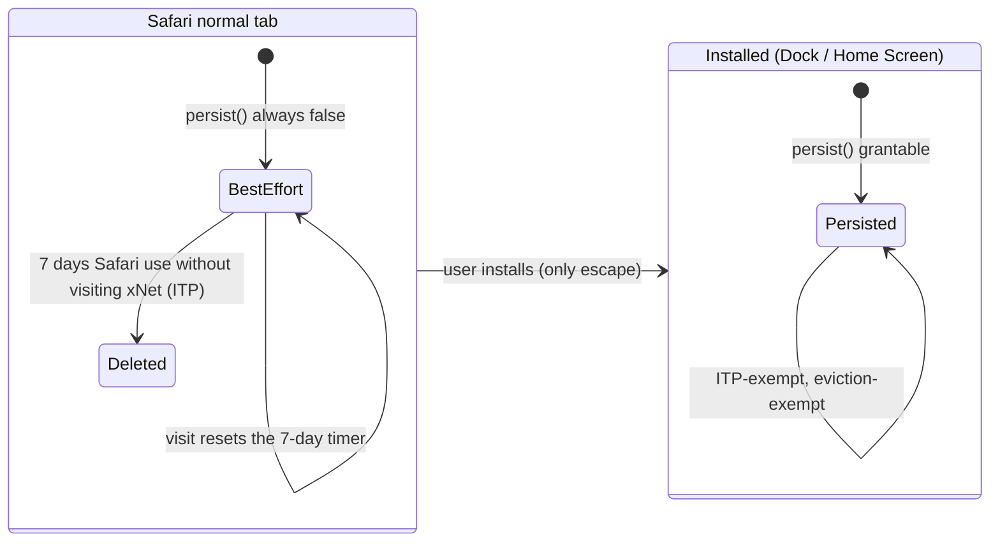
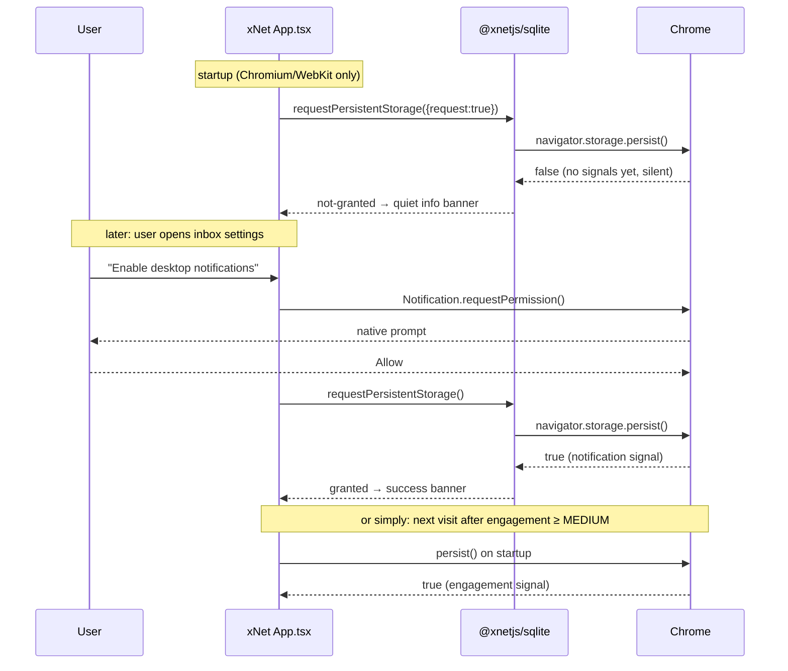

# Durable Storage Without App Install

## Problem Statement

On `https://xnet.fyi/app/` in Chrome, xNet shows **"Browser declined durable storage"** and the **Retry durable storage** button keeps failing. Firefox works (it shows a real permission prompt the user can accept). Safari only works after installing the site to the Dock/Home Screen. The product requirement driving this exploration:

> A user on a plain HTTPS website should be able to enable durable storage without installing the app on their device.

Explorations [0154](0154_[_]_SQLITE_OPFS_DURABLE_STORAGE_BROWSER_CONSISTENCY.md) and [0155](0155_[_]_GIVEN_THE_LAST_EXPLORATION_DOES_IT_MAKE_SENSE_TO_FALLBACK_TO_INDEXEDDB_IF_OPFS_PERSIST_FAILS_EXPLORE_TRADEOFFS_AND_COMPLEXITY.md) established that browsers decide `navigator.storage.persist()` by heuristics and that switching storage backends does not help. This exploration goes one level deeper: what are the **specific, current (2025–2026) grant heuristics** in Chrome and Safari, which **levers xNet can actually pull from a normal HTTPS tab**, and what the durable-storage UX should claim.

## Executive Summary

- ✅ **Chrome denial is never sticky.** Chrome re-evaluates `persist()` fresh on every call, with no cooldown and no "spent request." The current banner copy ("Browsers do not expose an override after they decline this request") is misleading for Chrome — retrying later genuinely works once signals change.
- ✅ **Chrome's four grant signals are concrete:** installed PWA, **notification permission granted**, site-engagement score ≥ MEDIUM (15 of 100 points; a site can accrue up to 15/day), or bookmarked (only while among the user's top-5 engaged bookmarks). Any one suffices. There is no prompt, no `chrome://settings` toggle, and no flag a user can flip.
- ✅ **The strongest no-install lever for Chrome is notification permission.** xNet already has a notification inbox (0167/0168) with no OS-level delivery. A contextual "enable desktop notifications" opt-in is a legitimate feature whose grant flips `persist()` to `true` immediately.
- ✅ **The cheapest lever is silent auto-retry.** `persist()` shows no prompt in Chrome or Safari, so xNet can re-request on every startup (gated off for Firefox, which prompts). Returning users cross the engagement threshold within days and silently flip to granted.
- ⚠️ **Safari is the hard case, and `persist()` is not even the real problem there.** Safari's only documented grant heuristic is "opened as a Home Screen Web App," and — per open WebKit bug #209563 — even a _granted_ persist does **not** exempt data from ITP's 7-day script-writable-storage deletion. Only Home Screen/Dock install does. In-tab Safari durability is capped by ITP no matter what the API returns.
- ⚠️ **The requirement as stated is not fully satisfiable.** No web API forces durable storage on an arbitrary HTTPS site in Chrome or Safari; that is deliberate browser policy. What _is_ achievable: make the grant near-automatic for returning Chrome users, make the Safari story honest (install or sync), and make real durability come from hub sync/export rather than a browser flag.

## Current State In The Repository

### Persistence support layer

- [packages/sqlite/src/browser-support.ts:203](../../packages/sqlite/src/browser-support.ts) — `checkPersistentStorage()` calls `requestPersistentStorage({ request: false })`: startup never requests, only reads `navigator.storage.persisted()`.
- [packages/sqlite/src/browser-support.ts:210](../../packages/sqlite/src/browser-support.ts) — `requestPersistentStorage()` calls `navigator.storage.persist()` and maps the result into `PersistentStorageStatus` (`granted` / `not-granted` / `unsupported` / `error`).
- [packages/sqlite/src/browser-support.ts:177](../../packages/sqlite/src/browser-support.ts) — `getPersistenceMessage()` produces the banner copy, including "This browser declined durable storage for now…".

### Web app wiring

- [apps/web/src/App.tsx:494](../../apps/web/src/App.tsx) — startup runs `checkPersistentStorage()` once and stores the status on app state. Nothing re-checks later in the session.
- [apps/web/src/App.tsx:648](../../apps/web/src/App.tsx) — `handleRequestPersistentStorage()` backs the banner's **Enable/Retry durable storage** button (a user gesture, so Firefox's prompt works).
- [apps/web/src/App.tsx:151](../../apps/web/src/App.tsx) — `getStorageRecoveryItems()` emits per-browser recovery tips. The Chromium copy says "Browsers do not expose an override after they decline this request," which conflates "no settings UI" (true) with "retry is futile" (false on Chrome).
- [apps/web/src/App.tsx:207](../../apps/web/src/App.tsx) — `useWebInstallPrompt()` captures `beforeinstallprompt` and powers the **Install app** secondary action; after an accepted install it re-runs `checkPersistentStorage()` (read-only — see findings; it should _request_).
- [apps/web/vite.config.ts:41](../../apps/web/vite.config.ts) — `VitePWA` with manifest (`display: standalone`, scope/start_url from `VITE_BASE_PATH`) and a Workbox service worker, so the app is installable on Chrome and Safari.

### Notifications: in-app only

- [packages/comms/src/notify/notifier.ts](../../packages/comms/src/notify/notifier.ts) and `inbox.ts` implement the notification inbox from 0167/0168 entirely in-app. **Nothing in the repo ever calls `Notification.requestPermission()`** — confirmed by grep across `apps/web` and `packages`. This means xNet currently leaves Chrome's strongest no-install persistence signal unused, while already having the product feature (an inbox) that would justify it.

### Origin context

The production app lives at `https://xnet.fyi/app/`. Chrome's site-engagement score and notification permission are **origin-scoped** (`https://xnet.fyi`), so engagement on the docs site at the root contributes to the same score the app benefits from.

## External Research

### Chrome / Chromium

| Question                                   | Answer                                                                                                                                                                            | Source                                                                                                                                         |
| ------------------------------------------ | --------------------------------------------------------------------------------------------------------------------------------------------------------------------------------- | ---------------------------------------------------------------------------------------------------------------------------------------------- |
| Prompt?                                    | Never. Silent grant/deny.                                                                                                                                                         | [web.dev/articles/persistent-storage](https://web.dev/articles/persistent-storage)                                                             |
| Grant signals                              | Installed PWA; notification permission `ALLOW`; site engagement ≥ MEDIUM (15/100, max accrual 15/day); bookmarked while in top-5 bookmarks by engagement                          | Chromium `important_sites_util.cc`, `site_engagement_score.cc`                                                                                 |
| Denial sticky?                             | No. Re-evaluated fresh every call; no cooldown, no embargo                                                                                                                        | web.dev, MDN `StorageManager.persist()`                                                                                                        |
| User override?                             | None. No site-settings toggle, no flag                                                                                                                                            | [blog.desgrange.net (Oct 2025)](https://blog.desgrange.net/post/2025/10/06/how-persistent-storage-permission-chrome.html)                      |
| Permissions API                            | `navigator.permissions.query({name:'persistent-storage'})` is free; returns only `granted` or `prompt` (never `denied`)                                                           | [chromestatus.com/feature/4770049554382848](https://chromestatus.com/feature/4770049554382848)                                                 |
| Eviction without persist                   | LRU per-origin wipe, only under storage pressure (~80% disk full). Rare in practice. "Clear browsing data" deletes regardless of persist                                          | [MDN: Storage quotas and eviction criteria](https://developer.mozilla.org/en-US/docs/Web/API/Storage_API/Storage_quotas_and_eviction_criteria) |
| Notification lever still valid in 2025/26? | Yes, but Chrome began auto-revoking notification permission for low-engagement, high-volume sites (Oct 2025) — the lever is real but should be backed by genuine notification use | [blog.chromium.org (Oct 2025)](https://blog.chromium.org/2025/10/automatic-notification-permission.html)                                       |

One cautionary data point: a 2025 write-up ([desgrange.net](https://blog.desgrange.net/post/2025/10/06/how-persistent-storage-permission-chrome.html)) reported bookmarking and even installing did not flip the grant in their low-engagement test profile. Thresholds are not contractual; treat signals as probabilistic and stack them.

### Safari / WebKit

| Question                          | Answer                                                                                                                                                                                              | Source                                                                                                                                                                       |
| --------------------------------- | --------------------------------------------------------------------------------------------------------------------------------------------------------------------------------------------------- | ---------------------------------------------------------------------------------------------------------------------------------------------------------------------------- |
| `persist()` support               | Since Safari 15.2; "fully supported" in 17.0. No prompt ever                                                                                                                                        | [webkit.org/blog/14403](https://webkit.org/blog/14403/updates-to-storage-policy/)                                                                                            |
| Grant heuristic                   | Only documented signal: "whether the website is opened as a Home Screen Web App" (Dock app on macOS counts)                                                                                         | webkit.org/blog/14403                                                                                                                                                        |
| ITP 7-day cap                     | All script-writable storage (IndexedDB, localStorage, service-worker caches; OPFS is script-writable and presumed included) is deleted after 7 days of Safari use without interacting with the site | [webkit.org/blog/10218](https://webkit.org/blog/10218/full-third-party-cookie-blocking-and-more/), [webkit.org/tracking-prevention](https://webkit.org/tracking-prevention/) |
| Does `persist()` exempt from ITP? | **No.** Open WebKit bug confirms persisted data is still deleted by ITP                                                                                                                             | [bugs.webkit.org #209563](https://bugs.webkit.org/show_bug.cgi?id=209563)                                                                                                    |
| Does install exempt from ITP?     | **Yes.** "The first-party domain of home screen web applications is exempt from ITP's 7-day cap." Dock apps on macOS have the same exemption                                                        | webkit.org/tracking-prevention                                                                                                                                               |
| Quota                             | Up to 60% of disk per origin in Safari 17+ (1 GB OPFS cap removed); same quota installed or not. No OPFS in private browsing                                                                        | webkit.org/blog/14403                                                                                                                                                        |

### Firefox

Firefox 55+ shows a real doorhanger ("Allow this site to store data in persistent storage?") with a remember-this-decision checkbox (fixed to actually persist in Firefox 145). The permission is user-manageable via Page Info → Permissions. This matches the user's observation that Firefox "just works." Firefox for Android does not implement `persist()`.

### Spec position (WHATWG Storage Standard)

The spec explicitly permits UAs to grant/deny `persist()` by heuristic without UI. Best-effort buckets are evicted LRU under storage pressure; persistent buckets must never be auto-evicted (the UA must ask the user). Safari's ITP deletion is a privacy mechanism layered _on top of_ the storage spec — which is why it can delete even "persistent" data. The Storage Buckets API (Chrome 122+, Chromium-only) adds per-bucket persistence hints but goes through the same permission gate; it is not a bypass.

## Key Findings

### 1. The four Chrome signals, and which xNet can pull without install



From a plain HTTPS tab, xNet can influence three of the four:

| Signal                  | xNet lever                                                                                                        | Cost                              | Reliability                                           |
| ----------------------- | ----------------------------------------------------------------------------------------------------------------- | --------------------------------- | ----------------------------------------------------- |
| Notification permission | Contextual desktop-notifications opt-in (real feature: inbox 0167/0168)                                           | One native prompt, user-initiated | High, immediate                                       |
| Site engagement         | Silent `persist()` auto-retry every startup; engagement accrues with normal use (MEDIUM ≈ 1–2 days of active use) | Zero — no prompt in Chrome/Safari | High for returning users, zero for first-visit        |
| Bookmark                | Copy suggestion only (cannot detect or trigger)                                                                   | Zero                              | Low/unverifiable                                      |
| Installed PWA           | Existing Install app button                                                                                       | User action                       | High but explicitly out of scope for this requirement |

### 2. The current code burns its best free lever

Startup deliberately calls `checkPersistentStorage()` (read-only) to avoid "spending" a request — but on Chrome **there is nothing to spend**: no prompt, no sticky denial, fresh evaluation every call. The conservative startup check is only needed for Firefox (where `persist()` would throw a modal at page load — an anti-pattern web.dev warns about). Gating by browser family lets Chromium/WebKit auto-request on every load, which converts returning Chrome users to granted with zero UX, while Firefox keeps the gesture-gated prompt.

### 3. On Safari, retry is futile and persist is not the point



Two consequences for the banner:

- Telling Safari users to "retry" in a tab sells false hope; the only documented grant signal is the install context.
- Even if WebKit someday grants `persist()` in-tab, bug #209563 shows ITP deletes persisted data anyway. The honest Safari message is: _use xNet at least weekly, keep sync/export on, or install for full protection_.

### 4. The risk model differs per browser, but the banner doesn't

Chrome best-effort data is evicted only under genuine disk pressure (LRU, ~80% disk full) — rare; the screenshot's "21 MB used of 10 GB available" origin is at negligible eviction risk today. Safari best-effort data has a _date-certain_ deletion trigger (7 days of non-use). One warning banner with identical severity for both overstates Chrome risk and understates Safari risk.

### 5. The post-install re-check is read-only — a near-miss bug

`handleInstallApp()` ([App.tsx:672](../../apps/web/src/App.tsx)) re-runs `checkPersistentStorage()` after an accepted install. Installing makes the grant _available_, but Chrome doesn't flip `persisted()` to true on its own — the app must call `persist()` again. The post-install path should call `requestPersistentStorage()` (request mode), ideally after the user opens the installed window.

## Options And Tradeoffs

### Option A: Silent auto-request on startup for Chromium and WebKit

Call `persist()` (not just `persisted()`) on every load when `browserFamily !== 'firefox'`. No prompt is possible; denial is costless; returning users flip silently once engagement crosses MEDIUM.

- ✅ Zero UX cost, no permission dialogs, converts most returning Chrome users automatically.
- ✅ Also helps Safari installed-app users (developer reports suggest WebKit wants `persist()` re-requested per launch).
- ⚠️ Does nothing for a first-time Chrome visitor with a fresh profile — there is no signal yet to satisfy.

### Option B: Desktop-notifications opt-in (the legitimate Chrome lever)

Ship OS-level notification delivery for the existing inbox (0167/0168 deferred this). A contextual in-app pre-prompt ("Get notified about mentions and DMs") followed by `Notification.requestPermission()` on a click; on grant, immediately re-call `persist()`.

- ✅ Immediate, deterministic grant on Chrome once notifications are allowed.
- ✅ It is a real feature users asked for (notification center exists; OS delivery is the natural next step) — not a dark pattern.
- ⚠️ Must be contextual and user-initiated; Chrome auto-revokes notification permission on low-engagement sites that spam, which would also remove the importance signal.
- ⚠️ No effect on Safari in-tab (Web Push on Safari ≥16.4 requires... install for Home Screen apps on iOS; macOS Safari allows web push in-tab but it does not feed WebKit's persist heuristic).

### Option C: Reframe the UX — per-browser truth instead of one warning

Tailor the banner: Chrome gets "durability pending — xNet retries automatically as you use it" (info tone, auto-resolving); Safari gets "Safari deletes inactive sites' data after 7 days — sync, weekly use, or install protect you" (warning tone, install CTA); Firefox keeps the prompt flow. Remove the claim that declines can't be retried.

- ✅ Honest, reduces alarm where risk is low, raises it where risk is real.
- ✅ Cheap: copy + tone changes in `getStorageBanner`/`getStorageRecoveryItems`/`getPersistenceMessage`.
- ⚠️ Doesn't change grant rates by itself.

### Option D: Durability via sync/export rather than browser flag

Double down on 0154's tier model: hub sync and snapshot export make browser eviction survivable, so `persist()` becomes belt-and-suspenders.

- ✅ The only approach that covers Safari in-tab, private browsing, "Clear browsing data," and lost devices.
- ⚠️ Bigger scope; already partially tracked by 0154's checklist; not a substitute for fixing the misleading banner.

### Option E: Do nothing / keep install-first guidance

- ✅ No work.
- ❌ Keeps a misleading "no override" message, a futile retry button on Safari, and leaves Chrome's free levers unused. Rejected.

## Recommendation

Stack A + B + C (they are independent and complementary), keep D as the standing durability story:

1. **Auto-request on startup for Chromium/WebKit** (Option A) — one-line policy change at the `checkPersistentStorage()` call site plus a `browserFamily` parameter; keep Firefox read-only at startup.
2. **Ship OS notification delivery with a contextual opt-in** (Option B), and chain a `persist()` re-request onto the grant. This is the only lever that can flip a low-engagement Chrome profile _today_ without install.
3. **Fix the messaging** (Option C): per-browser copy, correct the "no override" line for Chrome (retry _does_ re-evaluate), tell Safari users the truth about the 7-day cap, and switch the Chrome banner to a quieter informational tone while not granted.
4. **Post-install path requests instead of checks** (fixes Finding 5).
5. Optionally watch `navigator.permissions.query({ name: 'persistent-storage' })` with its `change` event to update the banner live when a grant lands mid-session.



What this does **not** achieve — and nothing can: a guaranteed grant for a first-visit Chrome user, or any in-tab Safari grant. Those are browser policy, not bugs in xNet. The combination above makes Chrome grants near-automatic for anyone who actually uses xNet, and makes the Safari limitation honest and actionable.

## Example Code

Browser-aware startup request in [App.tsx](../../apps/web/src/App.tsx):

```ts
// Chrome/Safari never prompt for persist() and a denial is re-evaluated
// fresh on each call, so requesting at startup is free. Firefox shows a
// modal prompt, so it stays read-only until the user clicks the banner.
const storageStatus =
  browserFamily === 'firefox' ? await checkPersistentStorage() : await requestPersistentStorage()
```

Notification opt-in chaining into persistence (new, e.g. `apps/web/src/comms/notification-permission.ts`):

```ts
export async function enableDesktopNotifications(): Promise<PersistentStorageStatus | null> {
  if (typeof Notification === 'undefined') return null
  const permission = await Notification.requestPermission() // must run in a user gesture
  if (permission !== 'granted') return null
  // Granted notifications are an "important site" signal in Chromium —
  // re-request persistence immediately so the banner resolves this session.
  return requestPersistentStorage()
}
```

Live grant detection without spending anything:

```ts
const status = await navigator.permissions.query({ name: 'persistent-storage' as PermissionName })
status.addEventListener('change', () => {
  if (status.state === 'granted') void refreshStorageBanner()
})
```

## Risks And Open Questions

- **Chrome heuristics are not contractual.** The desgrange.net test saw install/bookmark fail to flip the grant on a fresh profile; thresholds live in Chromium source and can change. Mitigation: stack signals, keep the silent retry, surface state in diagnostics.
- **Notification auto-revocation (Chrome, Oct 2025).** If xNet sends no real notifications, Chrome may revoke the permission on low-engagement profiles, removing the signal. Mitigation: only offer the opt-in alongside actual OS delivery of inbox items.
- **OPFS under ITP is presumed, not documented.** WebKit's "all script-writable storage" almost certainly includes OPFS, but no source states it explicitly. Worth validating empirically (leave a Safari tab unvisited 8+ days).
- **EU iOS wrinkle.** Apple briefly removed Home Screen web app support in the EU (iOS 17.4 beta, early 2024) before reversing course; EU behavior deserves a validation pass rather than an assumption.
- **Does granted notification permission persist as a signal?** If a user later revokes notifications, an already-granted persistent-storage state is believed to remain (grants are not retroactively withdrawn), but this is unverified.
- **Firefox prompt fatigue.** Pre-145 Firefox sometimes forgot the decision; modern Firefox remembers. No action needed beyond keeping the request gesture-gated.

## Implementation Checklist

- [x] `packages/sqlite/src/browser-support.ts`: accept a `silentRequestSafe` (or `browserFamily`) hint so callers can express "request at startup is free here"; keep API backward-compatible. _(Shipped as exported `isSilentPersistRequestSafe()` + `watchPersistentStoragePermission()` helpers.)_
- [ ] `apps/web/src/App.tsx`: startup calls `requestPersistentStorage()` for Chromium/WebKit, `checkPersistentStorage()` for Firefox/unknown.
- [ ] `apps/web/src/App.tsx` `handleInstallApp()`: after accepted install, call `requestPersistentStorage()` (request mode) instead of the read-only check.
- [ ] Add `navigator.permissions.query({name:'persistent-storage'})` + `change` listener to refresh banner state mid-session (feature-detected; Chromium-only is fine).
- [ ] Update `getPersistenceMessage()` and `getStorageRecoveryItems()`:
  - [ ] Chromium: drop "Browsers do not expose an override…"; say xNet retries automatically as the site is used, and that enabling notifications or installing flips it immediately.
  - [ ] Safari: state the 7-day inactive-site deletion explicitly; present install as protection from cleanup, not as a persist-retry trick; remove the implication that in-tab retry can succeed.
  - [ ] Tone: Chromium not-granted → `info`; Safari not-granted → `warning`.
- [ ] Ship OS notification delivery for inbox items (deferred from 0167/0168): contextual pre-prompt UI, `Notification.requestPermission()` on gesture, deliver via existing `Notifier` subscription.
- [ ] Chain `requestPersistentStorage()` after a notification-permission grant.
- [ ] Record persist-state transitions (granted/denied/error + which lever) in the storage diagnostics surface proposed in 0154.
- [ ] Docs site: update any storage/durability page to the per-browser truth table.

## Validation Checklist

- [ ] Fresh Chrome profile on `https://xnet.fyi/app/`: startup auto-request returns `false` silently; no prompt appears; banner is informational.
- [ ] Same profile after granting notifications via the opt-in: `persist()` returns `true` in the same session; banner flips to success without reload.
- [ ] Same profile, no notifications, 2–3 days of normal use: a later startup auto-request returns `true` (engagement signal).
- [ ] Chrome: install via the Install app button, confirm post-install `requestPersistentStorage()` returns `true`.
- [ ] Firefox: startup does NOT prompt; banner button triggers the doorhanger; Allow + remember persists across restarts (Firefox ≥145).
- [ ] Safari tab: banner shows the 7-day warning and install guidance; retry button absent or clearly explains it cannot succeed in-tab.
- [ ] Safari Dock/Home Screen app: `persist()` granted; status survives relaunch.
- [ ] Empirical ITP probe: Safari tab profile left 8+ days without visiting xNet (while using Safari elsewhere) — document whether OPFS data survives.
- [ ] `navigator.permissions.query` change listener updates the banner when grant lands mid-session (Chrome).

## References

- web.dev — Persistent storage: <https://web.dev/articles/persistent-storage>
- Chromium `important_sites_util.cc` (grant signals): <https://chromium.googlesource.com/chromium/src/+/91.0.4472.164/chrome/browser/engagement/important_sites_util.cc>
- Chromium `site_engagement_score.cc` (MEDIUM=15, max 15/day): <https://chromium.googlesource.com/chromium/src/+/3afa26135e229/chrome/browser/engagement/site_engagement_score.cc>
- Chromium Site Engagement design doc: <https://www.chromium.org/developers/design-documents/site-engagement/>
- How to ask for persistent storage permission in Chrome (Oct 2025 field test): <https://blog.desgrange.net/post/2025/10/06/how-persistent-storage-permission-chrome.html>
- Chrome auto-revocation of notification permission (Oct 2025): <https://blog.chromium.org/2025/10/automatic-notification-permission.html>
- MDN — Storage quotas and eviction criteria: <https://developer.mozilla.org/en-US/docs/Web/API/Storage_API/Storage_quotas_and_eviction_criteria>
- WebKit — Updates to Storage Policy (Safari 17): <https://webkit.org/blog/14403/updates-to-storage-policy/>
- WebKit — Full Third-Party Cookie Blocking and More (7-day cap): <https://webkit.org/blog/10218/full-third-party-cookie-blocking-and-more/>
- WebKit — Tracking Prevention (install exemption): <https://webkit.org/tracking-prevention/>
- WebKit bug #209563 — persist() vs ITP deletion (open): <https://bugs.webkit.org/show_bug.cgi?id=209563>
- Apple Developer Forums — PWA data persistence beyond 7 days: <https://developer.apple.com/forums/thread/710157>
- WHATWG Storage Standard: <https://storage.spec.whatwg.org/>
- Storage Buckets API (Chrome 122+): <https://developer.chrome.com/docs/web-platform/storage-buckets>
- Dexie StorageManager guidance: <https://dexie.org/docs/StorageManager>
- Firefox bugzilla #1309123 (persist prompt, Fx55), #1988313 (remember decision, Fx145)
- Prior explorations: [0154](0154_[_]_SQLITE_OPFS_DURABLE_STORAGE_BROWSER_CONSISTENCY.md), [0155](0155_[_]_GIVEN_THE_LAST_EXPLORATION_DOES_IT_MAKE_SENSE_TO_FALLBACK_TO_INDEXEDDB_IF_OPFS_PERSIST_FAILS_EXPLORE_TRADEOFFS_AND_COMPLEXITY.md), [0016](0016_[x]_PERSISTENCE_ARCHITECTURE.md)
