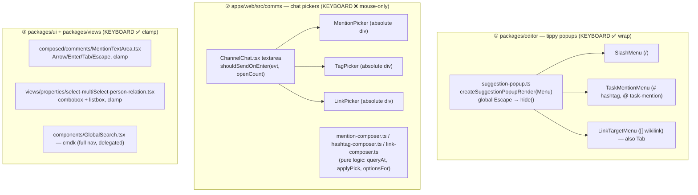
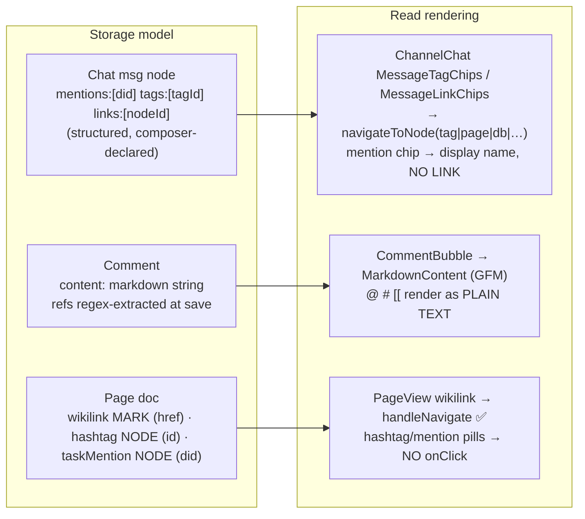
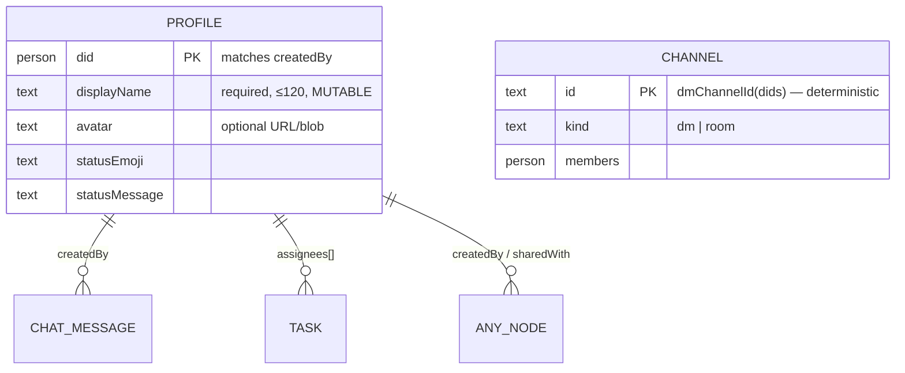
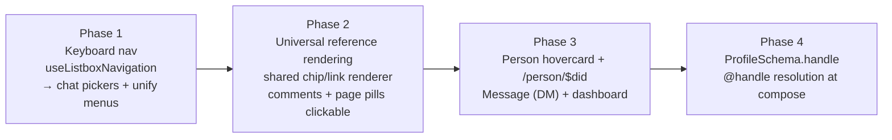

# Keyboard-Navigable Autocomplete And Mention Linking

**Date:** 2026-06-12
**Scope:** the three typeahead architectures (`packages/editor` tippy popups,
`apps/web/src/comms` chat pickers, `packages/ui` comment mention textarea), the
read-side renderers for `@mention` / `#hashtag` / `[[wikilink]]`, and the
identity/profile data layer (`packages/data` `profile.ts`, `comms/hooks.ts`).
**Status:** Exploration
**Builds on:** `0170_[x]_UNIVERSAL_TYPEAHEAD_AUTOCOMPLETE.md`,
`0171_[x]_AUTOMATIC_LINK_ENRICHMENT.md`,
`0169_[x]_CONTENT_ORGANIZATION_FOLDERS_TAGS_AND_CHANNELS.md`

## Problem Statement

Two everyday interactions are unfinished, and they bookend the same lifecycle of
a mention/tag/link — composing it, and reading it back.

1. **Compose: the autocomplete menu is mouse-only in the surface people use most.**
   When the chat composer pops a mention / hashtag / link suggestion list, the
   keyboard does nothing — you cannot arrow down to the item you want and press
   Enter/Tab to commit it. You have to lift your hands off the keyboard and
   click. The editor's slash/`#`/`[[` menus _do_ support arrows, but even those
   disagree with each other (wrap-around vs. clamp, Tab handled in one menu and
   not the next), and none of them is screen-reader-navigable
   (`aria-activedescendant` is absent everywhere).

2. **Read: mentions/tags/links only become real links in _some_ surfaces.** In a
   chat message, a `#hashtag` is a clickable chip that opens the tag page, a
   `[[wikilink]]` chip opens the target node — but an `@mention` chip resolves a
   display name and then **links nowhere** (there is no person route). In a
   **comment**, none of the three are clickable at all — they render as plain
   markdown text. The same token means different things depending on where it
   was typed.

3. **Where does an `@mention` even go?** Unlike a tag (→ tag page) or a wikilink
   (→ the document), a person mention has no obvious single destination. It
   could open a profile, a DM, or a per-person dashboard ("everything Alice
   created, everything she's assigned, your DM history with her"). We need to
   pick a click target — and probably more than one (popover + expand).

4. **The username problem.** Mentions are stored as DIDs (stable, decentralized,
   ugly: `did:key:z6Mk…`). Humans want to type `@alice`, not a DID. We have no
   username/handle layer across the decentralized service tier, so "mention by
   username" has no resolver today. This is the same problem AT Protocol, Matrix,
   Nostr, and ActivityPub each had to solve.

This exploration maps what exists, surveys how the rest of the industry solved
each piece, and recommends a path that unifies the three typeahead
implementations behind one keyboard contract and makes every entity reference a
real link in every surface — without breaking the structured-reference
invariants established in 0169–0171.

## Executive Summary

- **There are three independent typeahead implementations and they don't agree.**
  (1) `packages/editor` tippy popups (slash, `#`, `[[`, task-mention) — _have_
  keyboard nav with **wrap-around**, share `createSuggestionPopupRender`. (2)
  `apps/web/src/comms` chat composer pickers (mention/tag/link) — **mouse-only,
  zero keyboard nav**. (3) `packages/ui` `MentionTextArea` (comments) and the
  `packages/views` property pickers — _have_ keyboard nav with **clamp** (no
  wrap), and only some handle Tab/Escape. The chat composer is the worst offender
  and the highest-traffic surface.

- **The fix is a single shared headless list-navigation contract, not four
  copies.** The editor menus already implement a clean `{items, command}` +
  `ref.onKeyDown` contract via `createSuggestionPopupRender(Menu)`
  (`packages/editor/src/extensions/suggestion-popup.ts`). Hoist its navigation
  logic into a framework-agnostic `useListboxNavigation` hook (or a
  `packages/typeahead` primitive — the 0170 doc already deferred this package)
  and wire all four surfaces to it. Standardize on: **arrows wrap**, **Enter and
  Tab commit**, **Escape dismisses**, **Space never commits** (so multi-word
  display names remain typeable), guard Enter with **`event.isComposing`** for
  IME, and add **`role="listbox"`/`role="option"`/`aria-activedescendant`** with
  scroll-into-view.

- **Make entity references render as real links everywhere, by extending the
  chat model, not the comment model.** Chat already does this right: mentions,
  tags, and links are _structured, composer-declared id arrays_ on the message
  node, and chips resolve display/title at read time (the 0169/0171 invariant:
  _entity references are structured data; only self-describing tokens like URLs
  are render-time decoration_). Comments currently regex-extract `@`/`#`/`[[`
  from markdown text and render them as plain text — `convertRefsToLinks` in
  `commentReferences.ts` even builds `/user/${did}` and `/node/${id}` hrefs that
  **point at routes that don't exist**. Close the gap by giving every read
  surface a shared renderer that turns structured references into chips/links.

- **`@mention` should open a person _hovercard_ on click, with a profile route
  behind it.** This is the Slack/GitHub pattern and it resolves the "DM vs.
  profile vs. dashboard" indecision: the popover _is_ the fast path (avatar,
  status, **Message** → `ensureDmChannel`, **Open profile**), and "Open profile"
  navigates to a new `/person/$did` route that is exactly the per-person
  dashboard the prompt imagined (created items, assigned tasks, shared
  channels/DMs). `ensureDmChannel(store, dids)` already exists in
  `packages/comms/src/chat/chat-service.ts`; the route addition is the
  five-file `TabNodeType` dance documented in 0169.

- **Solve usernames the way every decentralized network did: stable id at
  compose time, display name at read time.** Add an optional, workspace-unique
  `handle` to `ProfileSchema`. Typeahead resolves `@alice` → DID at pick time;
  **the stored mention is always the DID** (matching AT Proto facets, Matrix
  `m.mentions`, Nostr `nprofile`, ActivityPub `Mention.href`). Renaming a handle
  never breaks an old mention because the reference is the DID. Global/
  cross-workspace handle uniqueness stays deferred — DID remains the source of
  truth.

## Current State In The Repository

### The three typeahead architectures



The keyboard matrix, as it actually exists today:

| Surface                    | File                                                    | ↑/↓   | Enter | Tab    | Esc        | Space | wrap?    | `aria-activedescendant`   |
| -------------------------- | ------------------------------------------------------- | ----- | ----- | ------ | ---------- | ----- | -------- | ------------------------- |
| Slash `/`                  | `packages/editor/src/components/SlashMenu/index.tsx`    | ✅    | ✅    | ✗      | ✅(global) | ✗     | **wrap** | ✗                         |
| Hashtag `#` / task `@`     | `packages/editor/src/components/TaskMentionMenu.tsx`    | ✅    | ✅    | ✗      | ✅(global) | ✗     | **wrap** | ✗                         |
| Wikilink `[[`              | `packages/editor/src/components/LinkTargetMenu.tsx`     | ✅    | ✅    | **✅** | ✅(global) | ✗     | **wrap** | ✗                         |
| **Chat mention**           | `apps/web/src/comms/ChannelChat.tsx` (MentionPicker)    | **✗** | **✗** | ✗      | ✗          | ✗     | —        | ✗                         |
| **Chat tag**               | `ChannelChat.tsx` (TagPicker)                           | **✗** | **✗** | ✗      | ✗          | ✗     | —        | ✗                         |
| **Chat link**              | `ChannelChat.tsx` (LinkPicker)                          | **✗** | **✗** | ✗      | ✗          | ✗     | —        | ✗                         |
| Comment mention            | `packages/ui/src/composed/comments/MentionTextArea.tsx` | ✅    | ✅    | ✅     | ✅         | ✗     | clamp    | ✗                         |
| Select / person / relation | `packages/views/src/properties/*.tsx`                   | ✅    | ✅    | ✗      | ✅         | ✗     | clamp    | partial (`aria-controls`) |
| Global search              | `apps/web/src/components/GlobalSearch.tsx`              | ✅    | ✅    | ✗      | ✅         | ✗     | (cmdk)   | (cmdk)                    |

Three takeaways: the **chat composer is entirely mouse-driven**; the rest split
between **wrap (editor)** and **clamp (comments/properties)**; **Tab commits in
exactly two places** (wikilink menu, comment mention) and nowhere else; and
**no surface sets `aria-activedescendant`** (slash/wikilink set
`role="listbox"`+`role="option"`+`aria-selected`; the hashtag menu sets none).

### Why the chat composer can't be keyboard-driven today

`ChannelChat.tsx` routes the textarea's Enter key through a pure helper:

```ts
// apps/web/src/comms/hashtag-composer.ts
export function shouldSendOnEnter(
  event: { key: string; shiftKey: boolean },
  openSuggestionCount: number
): boolean {
  return event.key === 'Enter' && !event.shiftKey && openSuggestionCount === 0
}
```

So Enter is _already_ suppressed while a picker is open — the wiring anticipated
keyboard nav. But the three picker components (`MentionPicker`, `TagPicker`,
`LinkPicker`, ~lines 201–288) only bind `onMouseDown` (prevent blur) and
`onClick` (select). There is no `selectedIndex`, no arrow handling, and no
Escape — so with a picker open, Enter is swallowed and _nothing_ happens. The
pure logic that a keyboard handler would need already exists and is unit-clean:
`mentionQueryAt` / `applyMentionPick` / `pickerOptionsFor`
(`mention-composer.ts`), and the parallel `hashtag-`/`link-composer.ts`.

### How references are stored and rendered, per surface



| Token          | Chat                                      | Comment         | Page doc                   | Where a click _should_ go     |
| -------------- | ----------------------------------------- | --------------- | -------------------------- | ----------------------------- |
| `@mention`     | chip, **resolves name but links nowhere** | plain text      | pill, **no onClick**       | person hovercard → profile/DM |
| `#hashtag`     | chip → `/tag/$tagId` ✅                   | plain text      | pill, **no onClick**       | `/tag/$tagId`                 |
| `[[wikilink]]` | chip → `navigateToNode` ✅                | plain text      | link → `handleNavigate` ✅ | the target node               |
| bare URL       | `LinkifiedText` ✅ (0171)                 | GFM autolink ✅ | TipTap autolink ✅         | the URL                       |

The gaps are concrete:

- **`commentReferences.ts` already builds hrefs to routes that don't exist.**
  `convertRefsToLinks` defaults to `userLink: /user/${m.did}` and
  `nodeLink: /node/${n.nodeId}` — but `navigation.ts` defines no `/user`, no
  `/person`, no `/node` route. The extraction is done; the destinations are
  vapor.
- **Page hashtag/mention pills are inert.** The wikilink mark wires an
  `onNavigate` ProseMirror plugin (`extensions.ts`), but `HashtagExtension` and
  `TaskMentionExtension` render a styled `<span>` with no click handling.
- **Comments don't render structured chips at all** — they re-parse markdown via
  `react-markdown`+`remark-gfm` (`MarkdownContent.tsx`), so `@`/`#`/`[[` are
  literal text. This is the inverse of the 0171 decision (where URLs are
  _correctly_ render-time), because mentions/tags are _entities_, not
  self-describing tokens.

### Identity / profile data layer (what a person link can resolve)



- `ProfileSchema` (`packages/data/src/schema/schemas/profile.ts`): `did`,
  `displayName`, `avatar`, `statusEmoji`, `statusMessage`. **No `handle`/
  `username` field.** `displayName` is mutable and **not unique**.
- Resolution: `useProfiles()` (`comms/hooks.ts`) queries `ProfileSchema`, dedupes
  by DID (newest wins); `displayName(did, profiles)` (`comms-utils.ts`) falls
  back to `did.slice(8,14)+'…'` when no profile exists.
- DM creation already exists: `ensureDmChannel(store, dids)`
  (`packages/comms/src/chat/chat-service.ts`) → deterministic `dmChannelId`,
  creates a `kind:'dm'` channel if absent, returns `{ channelId, created }`.
- Navigation: `navigateToNode(navigate, nodeType, nodeId)` (`navigation.ts`)
  dispatches per `TabNodeType` to `/doc`, `/db`, `/canvas`, `/dashboard`,
  `/view`, `/channel`, `/tag`, `/tasks`, `/data`. Adding `/person/$did` is the
  documented five-file change (per 0169 memory): `state.ts` `TabNodeType`,
  `tabs.ts` `TAB_VIEWS` + `ROUTE_PREFIXES`, `navigation.ts`, `ViewHost.tsx`, a
  route file. (`grep savedview` finds all five.)

## External Research

### WAI-ARIA editable-combobox keyboard contract (the spec to copy)

The [APG editable-combobox-with-list-autocomplete pattern](https://www.w3.org/WAI/ARIA/apg/patterns/combobox/examples/combobox-autocomplete-list/)
is the canonical contract for an inline autocomplete where focus stays in the
input:

- Input is `role="combobox"` + `aria-autocomplete="list"`; popup is
  `role="listbox"`; items are `role="option"`.
- **DOM focus never leaves the input.** The visually-active option is conveyed by
  `aria-activedescendant` on the combobox pointing at the active option's `id`.
- **Browsers do not auto-scroll** an `aria-activedescendant` target — JS must
  `scrollIntoView({block:'nearest'})` on every active-index change. The APG calls
  this out as mandatory for magnification users.
- ↑/↓ navigate (wrap-around is _spec-optional_); **Enter** sets the value and
  closes; **Escape** closes (and, if already closed, clears the input).

### What real products commit a mention with

| Product | Enter | Tab  | Space | Notes                                                                             |
| ------- | ----- | ---- | ----- | --------------------------------------------------------------------------------- |
| Slack   | ✅    | —    | ✗     | Space stays in query so "John S" filters to "John Smith"                          |
| Discord | ✅    | ✅   | ✗     | Tab and Enter both commit                                                         |
| GitHub  | ✅    | ✅\* | ✗     | `github/combobox-nav`; `tabInsertsSuggestions` default true (flags a11y tradeoff) |
| Notion  | ✅    | ✅   | ✗     |                                                                                   |
| Linear  | ✅    | —    | ✗     | widened popover for long titles                                                   |

The consensus: **Enter always commits; Tab usually commits; Space never commits**
(so multi-word names like "Van Morrison" remain typeable). Twitter/X is the lone
Space-commits exception because @handles are single-word — which is _not_ our
case, since we resolve display names.

**IME gotcha (the one bug everyone hits):** with a CJK IME mid-composition,
pressing Enter to confirm the IME selection must _not_ commit the mention. Guard
with `event.isComposing` (`event.nativeEvent.isComposing` in React) — confirmed
breakages: [Mantine #5934](https://github.com/mantinedev/mantine/issues/5934),
[GitLab UI ef57dec](https://gitlab.com/gitlab-org/gitlab-ui/-/commit/ef57dece9dac129dc2cd77d23d2be5ac7e5d072e).

### How decentralized networks resolve `@handle` → identity

Every federated protocol converged on the same shape: **resolve a mutable
human-readable name to an immutable id at compose time; store the id; render the
name at read time.**

| Protocol           | Stable id (stored) | Human name (resolved)                | Where the id lives in the object                          |
| ------------------ | ------------------ | ------------------------------------ | --------------------------------------------------------- |
| AT Proto / Bluesky | `did:plc:…`        | `alice.bsky.social` (DNS/well-known) | richtext **facet** `#mention.did` over a byte range       |
| Matrix             | `@alice:server`    | display name                         | top-level `m.mentions.user_ids[]` (MSC3952, shipped v1.7) |
| Nostr              | pubkey (hex)       | kind-0 `display_name`                | `nostr:nprofile1…` URI in content + `["p", pubkey]` tag   |
| ActivityPub        | actor URI (HTTPS)  | `@alice@domain` (WebFinger)          | `tag[]` `Mention.href` (+ `name` for display)             |

The lesson for xNet: **we already do this for chat** (structured `mentions:[did]`
is morally identical to a Matrix `m.mentions` / Bluesky facet). The missing piece
is only the _handle_ half — the `alice.bsky.social` ↔ `did:plc` mapping —
which AT Proto implements as DNS, Matrix as the localpart, ActivityPub as
WebFinger. A per-workspace `handle` field is the minimum viable version of that.

### Mention click-target UX (resolving "DM vs. profile vs. dashboard")

| Product | Hover                                | Click                                                                      |
| ------- | ------------------------------------ | -------------------------------------------------------------------------- |
| Slack   | hover card                           | right-side **profile panel** with **Message**/Huddle/Call (no page nav)    |
| Discord | —                                    | **mini profile modal** → secondary "View Full Profile"                     |
| GitHub  | **hovercard** (avatar, bio, context) | navigates to full **profile page** (no DM — GitHub has none)               |
| Notion  | —                                    | in-app **people profile** (top collaborators, teamspaces, recent activity) |
| Linear  | —                                    | in-workspace **profile**                                                   |

Stated rationale across all of them: a **popover preserves reading context** —
you can DM or open a call without losing your place in the thread. Notion's
"people profile" (recent activity + what they touched) is essentially the
per-person dashboard the prompt described.

### Libraries for caret-anchored textarea popups (chat composer needs this)

The editor menus get caret rects free from ProseMirror/tippy. The chat composer
and comment textarea anchor an absolute div instead. If we want a true
caret-anchored popup (not bottom-of-textarea), the established tool is
[`textarea-caret-position`](https://github.com/component/textarea-caret-position)
(`getCaretCoordinates(el, selectionStart)` via a mirror div; handles internal
scroll; textarea/input only, no `contenteditable`). Higher-level options:
[`react-mentions`](https://github.com/signavio/react-mentions) (overlay model,
stale — last publish ~3y), [`Tribute.js`](https://github.com/zurb/tribute)
(zero-dep, Enter/Tab commit, `spaceSelectsMatch` off by default),
[`downshift useCombobox`](https://www.downshift-js.com/use-combobox/) (headless,
ARIA 1.2, wrap-around — but controlling `inputValue` causes a documented cursor
jump). The 0170 doc already deferred a `packages/typeahead` +
caret-anchored-textarea primitive; this is where it lands.

## Key Findings

1. **The pure logic for chat keyboard nav already exists** (`*-composer.ts`):
   only the _view_ layer (selectedIndex + key handler) is missing. This is a
   small, contained fix with outsized UX payoff.
2. **The editor already has the contract we want to standardize on**
   (`createSuggestionPopupRender(Menu)`, `{items, command}` + `ref.onKeyDown`,
   wrap-around). Don't invent a new one — hoist this.
3. **Chat already implements the correct storage model** for references
   (structured id arrays). The work on the read side is to _propagate that model_
   to comments/pages, not to re-parse text.
4. **`@mention` is the only token without a destination**, and the codebase has
   already half-built it (`convertRefsToLinks` → `/user/${did}`) against a route
   that doesn't exist. A `/person/$did` route + hovercard closes both the "links
   nowhere" gap and the "what's the right flow" question.
5. **`ensureDmChannel` already exists**, so "click a mention → instant DM" is a
   wiring task, not a new subsystem.
6. **Usernames are a solved pattern** (store DID, resolve handle). A
   `ProfileSchema.handle` field + compose-time resolution is the 80/20; global
   uniqueness across the decentralized layer is a genuinely hard, deferrable
   problem.
7. **`Space` must not commit** anywhere, or multi-word display-name search breaks
   — this is a deliberate constraint, not an oversight to "fix."

## Options And Tradeoffs

### A. Keyboard navigation: how much to unify

| Option                                        | What                                                                                                                   | Pros                                                                                      | Cons                                                                                                                 |
| --------------------------------------------- | ---------------------------------------------------------------------------------------------------------------------- | ----------------------------------------------------------------------------------------- | -------------------------------------------------------------------------------------------------------------------- |
| **A1. Per-surface patches**                   | Add arrow/Enter handling to chat pickers only, leave others as-is                                                      | Smallest diff; fixes the loudest complaint                                                | Perpetuates wrap-vs-clamp drift; fourth copy of nav logic; fallow duplication risk (0170)                            |
| **A2. Shared `useListboxNavigation` hook** ✅ | One headless hook (selectedIndex, wrap, Enter/Tab/Esc, isComposing, activedescendant id) consumed by all four surfaces | One contract; a11y for free; kills the menus' divergence; matches editor's existing shape | Touches all surfaces; must preserve each surface's commit semantics                                                  |
| **A3. Adopt downshift `useCombobox`**         | Replace bespoke menus with the library                                                                                 | Battle-tested ARIA                                                                        | Cursor-jump pitfall in controlled inputs; heavy for the editor (ProseMirror already owns the input); migration churn |

A2 wins: it's the editor's contract generalized, so the editor barely changes and
the other three surfaces converge onto it.

### B. Where comment/page references get their "linkness"

| Option                                                            | What                                                                                                                | Pros                                                             | Cons                                                                                                                                 |
| ----------------------------------------------------------------- | ------------------------------------------------------------------------------------------------------------------- | ---------------------------------------------------------------- | ------------------------------------------------------------------------------------------------------------------------------------ |
| **B1. Render-time regex linkify** (mirror 0171's `LinkifiedText`) | Parse `@`/`#`/`[[` out of text at render                                                                            | No schema change                                                 | **Violates the 0169 invariant** — entities become guessable-from-text; breaks on rename; can't distinguish a literal "#1" from a tag |
| **B2. Structured refs + shared chip renderer** ✅                 | Comments/pages carry structured ref arrays (like chat); one `<EntityChip>`/`<ReferenceText>` renderer resolves them | Rename-safe; consistent with chat; one renderer for all surfaces | Comments need a structured field (or keep extracting at save, but render from the structured result, not the raw text)               |

B2 is the only option consistent with 0169/0171. Note comments _already_ extract
structured `mentions` at save (`normalizeMentions`) — the renderer just has to
consume that instead of re-parsing the body, and the same approach extends to
tags/wikilinks.

### C. `@mention` click target

| Option                                                | Pros                                                                                                                         | Cons                                                                            |
| ----------------------------------------------------- | ---------------------------------------------------------------------------------------------------------------------------- | ------------------------------------------------------------------------------- |
| **C1. Straight to DM**                                | Fastest "talk to this person"                                                                                                | Hijacks the click; no way to just _look_ at who they are; jarring tab switch    |
| **C2. Straight to profile route**                     | Discoverable; shareable URL                                                                                                  | Loses reading context; overkill for "who is this?"                              |
| **C3. Hovercard popover, profile route behind it** ✅ | Preserves context (Slack/GitHub); popover offers **Message**(DM)+**Open profile**; "Open profile" → `/person/$did` dashboard | Two things to build — but the route is reusable and the popover is the 80% path |

C3 directly answers the prompt's own uncertainty ("DM window? profile?
dashboard?") by **not choosing** — the popover surfaces the quick actions, the
route is the deep dashboard.

### D. Usernames over the decentralized layer

| Option                                                         | Pros                                                                                                          | Cons                                                                                               |
| -------------------------------------------------------------- | ------------------------------------------------------------------------------------------------------------- | -------------------------------------------------------------------------------------------------- |
| **D1. DID-only (status quo)**                                  | Nothing to build; always unique                                                                               | Nobody can type a mention from memory; ugly                                                        |
| **D2. Per-workspace `handle` on Profile** ✅                   | Typeable `@alice`; unique within a workspace; matches AT Proto/Matrix shape; **stored mention stays the DID** | Not globally unique; two workspaces can both have `@alice` (fine — resolution is workspace-scoped) |
| **D3. Global decentralized naming** (DNS/`did:web`/well-known) | True portable handles                                                                                         | Hard, slow, out of scope; AT Proto needed DNS infra to do it                                       |

D2 is the pragmatic middle. Crucially it changes **nothing** about storage: the
mention is still a DID; `handle` is just a resolver input at compose time and a
display option at read time.

## Recommendation

Ship in four phases, smallest-blast-radius first.



1. **Phase 1 — Keyboard parity (highest value, lowest risk).** Extract
   `useListboxNavigation` from the editor menus' shared logic. Wire it into the
   three `ChannelChat` pickers and `MentionTextArea`; refactor the editor menus
   to consume it so wrap/Tab/Escape behavior is identical everywhere. Standard:
   arrows wrap, **Enter+Tab commit, Escape dismiss, Space never commits**,
   `isComposing` guard, `aria-activedescendant` + `scrollIntoView`.

2. **Phase 2 — References are links everywhere.** Add a shared
   `<ReferenceText>`/`<EntityChip>` renderer in `packages/ui` that resolves
   structured `{mentions, tags, links}` to chips (`@name`, `#tag` →
   `/tag/$tagId`, `[[title]]` → `navigateToNode`). Use it in `CommentBubble`
   (consume the already-extracted structured `mentions`; extend extraction to
   tags/wikilinks) and make `HashtagExtension`/`TaskMentionExtension` pills
   clickable in `PageView`. Delete the dead `/user`/`/node` defaults in
   `convertRefsToLinks` once the real targets land.

3. **Phase 3 — Person hovercard + profile route.** Build `<PersonHovercard>`
   (avatar, displayName, status, **Message** → `ensureDmChannel` → navigate to
   `/channel/$id`, **Open profile**). Add the `/person/$did` route (the five-file
   `TabNodeType` change) rendering a per-person dashboard from existing bounded
   queries: created nodes (`createdBy === did`), assigned tasks
   (`assignees includes did`), shared channels/DMs, recent activity. `@mention`
   chips open the hovercard; "Open profile" opens the route.

4. **Phase 4 — Handles.** Add optional `handle` to `ProfileSchema`
   (workspace-unique, validated slug). Typeahead matches `handle` _and_
   `displayName`; **the committed mention is always the DID**. Render can show
   `@handle` when present, else `displayName`. Defer global uniqueness.

Phases 1 and 2 are independently shippable and deliver most of the felt
improvement; 3 and 4 are the "profiles" longer-term arc the prompt flagged.

## Example Code

### `useListboxNavigation` — one contract for every picker

```ts
// packages/typeahead/src/useListboxNavigation.ts  (new leaf package, per 0170 defer)
import { useCallback, useEffect, useRef, useState } from 'react'

export interface ListboxNav {
  activeIndex: number
  setActiveIndex: (i: number) => void
  /** Spread onto each option for aria + scroll-into-view. */
  optionId: (i: number) => string
  /** Call from the input/textarea/PM keydown. Returns true if it consumed the key. */
  onKeyDown: (e: KeyboardEvent | React.KeyboardEvent) => boolean
}

export function useListboxNavigation(opts: {
  count: number
  isOpen: boolean
  onCommit: (index: number) => void
  onDismiss?: () => void
  idPrefix: string
}): ListboxNav {
  const { count, isOpen, onCommit, onDismiss, idPrefix } = opts
  const [activeIndex, setActiveIndex] = useState(0)
  const listRef = useRef<HTMLElement | null>(null)

  // Reset highlight whenever the option set changes.
  useEffect(() => setActiveIndex(0), [count, isOpen])

  // APG: aria-activedescendant targets are NOT auto-scrolled.
  useEffect(() => {
    if (!isOpen) return
    document.getElementById(`${idPrefix}-opt-${activeIndex}`)?.scrollIntoView({ block: 'nearest' })
  }, [activeIndex, isOpen, idPrefix])

  const onKeyDown = useCallback(
    (e: KeyboardEvent | React.KeyboardEvent): boolean => {
      if (!isOpen || count === 0) return false
      // IME guard — Enter mid-composition confirms the IME, not the mention.
      const composing = 'isComposing' in e ? e.isComposing : (e as any).nativeEvent?.isComposing
      switch (e.key) {
        case 'ArrowDown':
          e.preventDefault()
          setActiveIndex((i) => (i + 1) % count) // wrap
          return true
        case 'ArrowUp':
          e.preventDefault()
          setActiveIndex((i) => (i - 1 + count) % count) // wrap
          return true
        case 'Enter':
        case 'Tab':
          if (composing) return false
          e.preventDefault()
          onCommit(activeIndex)
          return true
        case 'Escape':
          e.preventDefault()
          onDismiss?.()
          return true
        // NB: Space is intentionally NOT handled — multi-word names must type.
        default:
          return false
      }
    },
    [isOpen, count, activeIndex, onCommit, onDismiss]
  )

  return {
    activeIndex,
    setActiveIndex,
    optionId: (i) => `${idPrefix}-opt-${i}`,
    onKeyDown
  }
}
```

### Wiring it into the chat composer (the priority fix)

```tsx
// apps/web/src/comms/ChannelChat.tsx — sketch
const openCount = pickerOptions.length + tagOptions.length + linkOptions.length
const nav = useListboxNavigation({
  count: openCount,
  isOpen: openCount > 0,
  idPrefix: 'chat-suggest',
  onCommit: (i) => applyActivePick(i), // routes to applyMentionPick / applyHashtagPick / applyLinkPick
  onDismiss: () => closeAllPickers(),
})

<textarea
  role="combobox"
  aria-expanded={openCount > 0}
  aria-controls="chat-suggest-listbox"
  aria-activedescendant={openCount > 0 ? nav.optionId(nav.activeIndex) : undefined}
  onKeyDown={(e) => {
    if (nav.onKeyDown(e)) return                 // picker consumed it
    if (shouldSendOnEnter(e, openCount)) {        // unchanged: only sends when no picker
      e.preventDefault()
      void send()
    }
  }}
/>
// each option: <button id={nav.optionId(i)} role="option" aria-selected={i === nav.activeIndex} ... />
```

### Person mention chip → hovercard → DM / profile

```tsx
// packages/ui/src/composed/PersonHovercard.tsx — sketch
function PersonMentionChip({ did }: { did: string }) {
  const profile = useProfile(did)
  return (
    <Hovercard
      trigger={<button className="mention-chip">@{profile.handle ?? profile.displayName}</button>}
    >
      <Avatar did={did} /> <strong>{profile.displayName}</strong>
      {profile.statusMessage && (
        <p>
          {profile.statusEmoji} {profile.statusMessage}
        </p>
      )}
      <button
        onClick={async () => {
          const { channelId } = await ensureDmChannel(store, [myDid, did])
          navigateToNode(navigate, 'channel', channelId) // instant DM
        }}
      >
        Message
      </button>
      <button onClick={() => navigateToNode(navigate, 'person', did)}>Open profile</button>
    </Hovercard>
  )
}
```

### `ProfileSchema.handle` (additive, no version bump — per 0169 invariant)

```ts
// packages/data/src/schema/schemas/profile.ts
handle: { type: 'text', optional: true, maxLength: 32 }, // workspace-unique slug; DID stays the stored ref
```

## Risks And Open Questions

- **IME / Enter-to-send collision in chat.** With a picker open _and_ an IME
  composing, key routing must check `isComposing` before _either_ committing the
  mention or sending the message. The `useListboxNavigation` guard covers the
  picker; verify `send()` is also gated.
- **Tab in the chat composer.** Tab currently moves focus out of the textarea
  (expected). Hijacking Tab-to-commit (Discord/GitHub style) is an a11y
  tradeoff GitHub explicitly flags. Recommend Tab commits **only while a picker
  is open**, and falls back to normal focus traversal otherwise — confirm this
  feels right.
- **`fallow` duplication gate.** Four near-identical menu components is exactly
  what the dead-code/duplication gate caught in 0170. Consolidating onto one hook
  _reduces_ duplication, but the migration must land atomically or risk a gate
  trip mid-refactor.
- **Comment reference model.** Comments extract `mentions` at save but not tags/
  wikilinks. Extending extraction must stay render-safe (don't re-parse the body
  at read time) — decide whether to store structured tag/link arrays on the
  comment or resolve from the extracted set.
- **Handle uniqueness scope.** Per-workspace uniqueness is enforceable; global is
  not without a naming authority. Two workspaces with `@alice` is acceptable, but
  cross-workspace mentions (federation) will need DID display fallback. Don't
  promise global handles.
- **`/person/$did` for a DID with no profile.** The dashboard must render from a
  bare DID (no `ProfileSchema` row) using the `did.slice` fallback — a person can
  be mentioned before they've ever set a display name.
- **Stale dead routes.** `convertRefsToLinks`'s `/user`/`/node` defaults should be
  removed or repointed in the same PR that adds the real routes, or they become
  another layer of vapor links.
- **Space-to-commit expectations.** Some users coming from Twitter expect Space to
  finish a mention. We deliberately don't — surface this in a tooltip/help if it
  generates confusion.

## Implementation Checklist

**Phase 1 — Keyboard navigation**

- [x] Create `useListboxNavigation` (chose `packages/ui/src/hooks` over a new
      package — `@xnetjs/editor` already depends on `@xnetjs/ui`): wrap,
      Enter+Tab commit, Escape (opt-in), `isComposing` guard,
      `aria-activedescendant` id + scroll-into-view. Unit-tested (9 cases).
- [x] Refactor `SlashMenu`, `TaskMentionMenu`, `LinkTargetMenu` to consume the
      hook via `useImperativeHandle` (behavior identical; removed bespoke
      modulo logic — all 15 editor menu tests still green).
- [x] Wire the hook into `ChannelChat` `MentionPicker`/`TagPicker`/`LinkPicker`
      (one nav drives the exclusive active picker); route `onKeyDown` before
      `shouldSendOnEnter`; add `role`/`aria` attrs + Escape-to-dismiss; guard
      the send path against IME composition.
- [x] Wire the hook into `MentionTextArea` (replaced clamp with wrap; gained
      `aria-activedescendant`).
- [ ] _Deferred:_ property pickers (`select`/`multiSelect`/`person`/`relation`)
      already have working keyboard nav; rewiring them risks regressing their
      create-and-pick / backspace-to-clear combobox semantics for low UX gain.

**Phase 2 — Universal reference rendering**

- [ ] Add `<ReferenceText>` / `<EntityChip>` to `packages/ui` resolving
      structured `{mentions, tags, links}` → chips with correct nav targets.
- [ ] Render it in `CommentBubble` from the already-extracted structured
      `mentions`; extend comment extraction to tags + wikilinks.
- [ ] Make `HashtagExtension` and `TaskMentionExtension` pills clickable in
      `PageView` (hashtag → `/tag/$tagId`; mention → hovercard).
- [ ] Remove/repoint the dead `/user`/`/node` hrefs in
      `commentReferences.ts` `convertRefsToLinks`.

**Phase 3 — Person hovercard + profile route**

- [ ] Build `<PersonHovercard>` (avatar/name/status + **Message** via
      `ensureDmChannel` + **Open profile**).
- [ ] Add `/person/$did` route (the five-file `TabNodeType` change: `state.ts`,
      `tabs.ts` TAB_VIEWS+ROUTE_PREFIXES, `navigation.ts`, `ViewHost.tsx`, route
      file).
- [ ] Build the person dashboard (created nodes, assigned tasks, shared
      channels/DMs, recent activity) from bounded queries; render from a bare
      DID when no profile exists.
- [ ] Point `@mention` chips at the hovercard; "Open profile" → the route.

**Phase 4 — Handles**

- [ ] Add optional `handle` to `ProfileSchema` (no version bump; additive).
- [ ] Enforce workspace-unique handle on profile edit; validate slug format.
- [ ] Typeahead matches `handle` + `displayName`; **commit DID only**.
- [ ] Render `@handle` when present, else `displayName`, else DID fallback.

## Validation Checklist

- [ ] In chat, opening a mention/tag/link picker and pressing ↑/↓ moves the
      highlight (with wrap); Enter **and** Tab commit the highlighted item;
      Escape dismisses; Space types a space and keeps filtering.
- [ ] With a picker open, Enter does **not** send the message; with no picker
      open, Enter sends (Shift+Enter newlines) — `shouldSendOnEnter` unchanged.
- [ ] CJK IME: composing + Enter confirms the IME and does **not** commit a
      mention or send the message.
- [ ] Screen reader announces the active option (`aria-activedescendant`
      present); arrowing past the visible list scrolls it into view.
- [ ] All four picker surfaces share identical key behavior (no wrap-vs-clamp,
      no Tab-in-one-not-another drift).
- [ ] A `#hashtag` in a **comment** is clickable → `/tag/$tagId`; a
      `[[wikilink]]` in a comment → the target node; an `@mention` in a comment
      opens the person hovercard.
- [ ] Page-doc hashtag and mention pills are clickable.
- [ ] Clicking an `@mention` shows a hovercard; **Message** lands in a DM
      channel (`ensureDmChannel`); **Open profile** opens `/person/$did`.
- [ ] `/person/$did` renders a dashboard for a DID **with no profile row**
      (fallback display name) without crashing.
- [ ] Renaming a profile's `handle`/`displayName` updates every rendered
      mention (because the stored ref is the DID) and breaks no existing mention.
- [ ] `pnpm --filter @xnetjs/ui build` and the fallow gate pass (no new
      duplication / dead-code findings from the menu consolidation).

## References

- WAI-ARIA APG — [Editable Combobox With List Autocomplete](https://www.w3.org/WAI/ARIA/apg/patterns/combobox/examples/combobox-autocomplete-list/) · [Combobox pattern](https://www.w3.org/WAI/ARIA/apg/patterns/combobox/)
- [`github/combobox-nav`](https://github.com/github/combobox-nav) — GitHub's ARIA-1.2 mention nav (Enter commits, configurable Tab)
- [CSS-Tricks — building an @mention autocomplete](https://css-tricks.com/so-you-want-to-build-an-mention-autocomplete-feature/) (why Space ≠ commit)
- IME/Enter bug: [Mantine #5934](https://github.com/mantinedev/mantine/issues/5934) · [GitLab UI ef57dec](https://gitlab.com/gitlab-org/gitlab-ui/-/commit/ef57dece9dac129dc2cd77d23d2be5ac7e5d072e)
- AT Proto — [richtext facets](https://docs.bsky.app/docs/advanced-guides/post-richtext) · [facet.json](https://github.com/bluesky-social/atproto/blob/main/lexicons/app/bsky/richtext/facet.json) · [handle spec](https://atproto.com/specs/handle) · [resolving identities](https://docs.bsky.app/docs/advanced-guides/resolving-identities)
- Matrix — [MSC3952 intentional mentions](https://github.com/matrix-org/matrix-spec-proposals/blob/main/proposals/3952-intentional-mentions.md) · [v1.7 release](https://matrix.org/blog/2023/05/25/matrix-v-1-7-release/)
- Nostr — [NIP-27](https://github.com/nostr-protocol/nips/blob/master/27.md) · [NIP-19](https://github.com/nostr-protocol/nips/blob/master/19.md) · [NIP-21](https://nips.nostr.com/21)
- ActivityPub — [Mastodon AP spec](https://docs.joinmastodon.org/spec/activitypub/) · [WebFinger](https://docs.joinmastodon.org/spec/webfinger/)
- Click-target UX — [GitHub hovercards](https://github.blog/2018-03-22-user-hovercards/) · [GitHub hovercard keyboard nav (2024)](https://github.blog/changelog/2024-07-29-keyboard-navigation-improvements-for-hovercards/) · [Notion people profiles](https://www.notion.com/help/people-profiles)
- Libraries — [`textarea-caret-position`](https://github.com/component/textarea-caret-position) · [`react-mentions`](https://github.com/signavio/react-mentions) · [`Tribute.js`](https://github.com/zurb/tribute) · [downshift `useCombobox`](https://www.downshift-js.com/use-combobox/) · [`cmdk`](https://github.com/pacocoursey/cmdk)
- Prior explorations — `0170_[x]_UNIVERSAL_TYPEAHEAD_AUTOCOMPLETE.md`, `0171_[x]_AUTOMATIC_LINK_ENRICHMENT.md`, `0169_[x]_CONTENT_ORGANIZATION_FOLDERS_TAGS_AND_CHANNELS.md`
