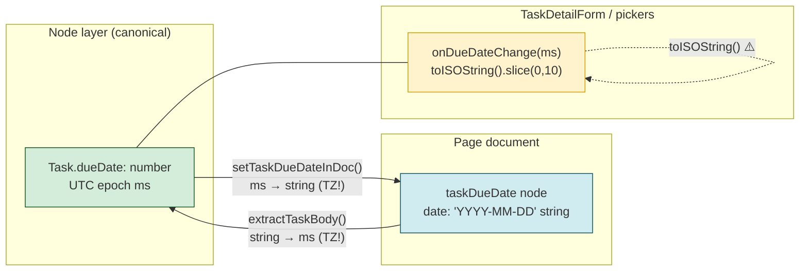
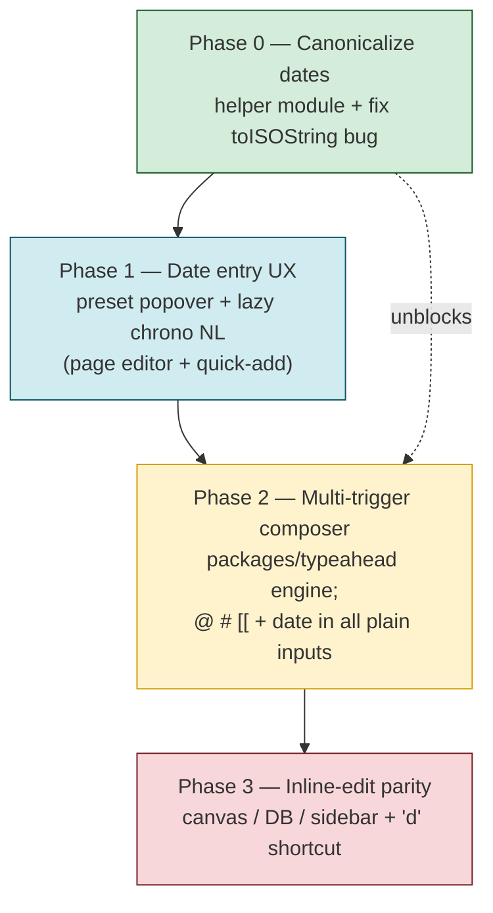
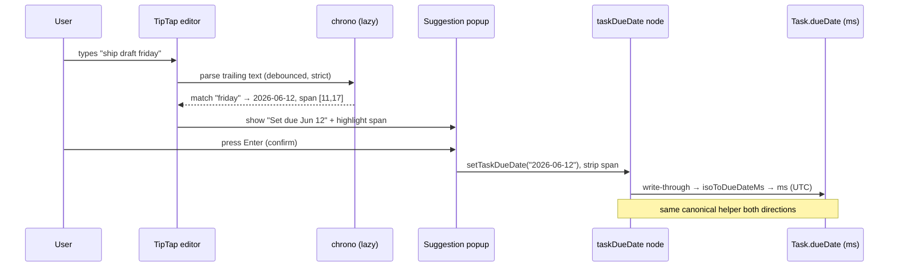
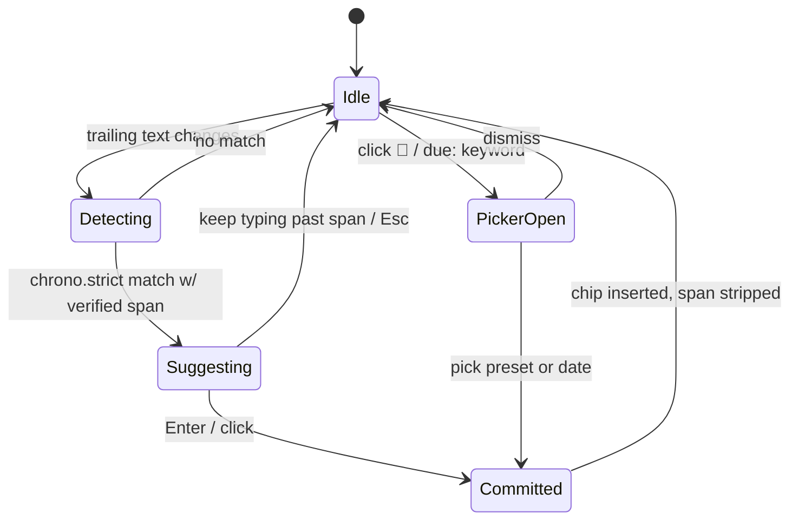

# Task Due Dates And Rich Inline Editing Everywhere

## Problem Statement

We want due dates to be a first-class, low-friction part of every task —
added as easily as you assign someone by typing `@`. The same request bundles
a broader goal: **all** of the task-editing affordances (`@`-mention to assign,
`#`-hashtag to categorize, `[[`-wikilink to reference, and now due dates) should
work the same way on **every** task surface — the page checklist, the Tasks
list/board, the canvas card, the sidebar mini-dashboard, and database cells —
and every one of those surfaces should support inline editing.

The user articulated three sub-goals for dates specifically:

1. A **quick, easy** way to add a due date — possibly **symbolic** (type a sigil
   like `(` and it becomes a date) and/or a **little UI** (a date-picker popup).
2. A **canonical way of handling dates through text** that we can convert
   reliably (so "type the date" works, but with help).
3. It must work **across all task surfaces** and support **inline editing**.

## Executive Summary

The surprising headline: **most of the infrastructure already exists.** The
`Task` schema already has a `dueDate` field ([task.ts:63](../../packages/data/src/schema/schemas/task.ts)),
the page editor already has an inline `taskDueDate` chip
([TaskDueDateExtension.ts](../../packages/editor/src/extensions/task-metadata/TaskDueDateExtension.ts)),
the `TaskDetailForm` already renders a due-date popover
([TaskDetailForm.tsx:241](../../packages/ui/src/composed/tasks/TaskDetailForm.tsx)),
and the page editor already supports `@`/`#`/`[[` typeahead via shared TipTap
suggestion extensions ([suggestion-popup.ts](../../packages/editor/src/extensions/suggestion-popup.ts)).

The work is therefore **not** "build due dates from scratch." It is three
focused gaps:

1. **A canonical date representation.** Today there are *two* incompatible
   encodings — the schema field stores **UTC epoch milliseconds** (`number`),
   while the inline editor node stores a **`YYYY-MM-DD` string**. The
   conversion between them crosses a timezone boundary using
   `new Date(ms).toISOString()`, which is the textbook off-by-one all-day-date
   bug. We must pick one canonical all-day, timezone-safe format and reconcile
   the two through a single shared utility.

2. **Quick text entry for dates.** There is no fast way to *type* a date today —
   you open a picker. We should add natural-language parsing (Todoist-style:
   parse-on-type, confirm-to-commit) plus an upgraded picker popover with
   presets. The user's "symbolic" idea (`(`) is viable but collision-prone in
   prose; natural language plus a low-collision trigger is the better default.

3. **Typeahead + inline-edit parity on the plain-input surfaces.** The page
   editor (TipTap) has the full `@`/`#`/`[[` set. But the *quick-add* and
   *inline title* inputs use `MentionTextInput`, which supports **only `@`**
   ([MentionTextInput.tsx](../../packages/ui/src/composed/tasks/MentionTextInput.tsx)).
   To honor "autocomplete must work in tasks everywhere," we lift that single-
   trigger input into a multi-trigger composer (or adopt the unified textarea
   typeahead engine deferred from exploration 0170).

**Recommendation:** a four-phase plan — (0) canonicalize dates and fix the
timezone bug, (1) ship the date-entry UX (NL parse + preset popover) in the
page editor and quick-add, (2) lift `MentionTextInput` into a multi-trigger
composer so `@`/`#`/`[[`/date work in every plain-input surface, (3) close
inline-edit parity on canvas/DB/sidebar and add a `d` keyboard shortcut.

## Current State In The Repository

### The task model already has `dueDate`

[`packages/data/src/schema/schemas/task.ts`](../../packages/data/src/schema/schemas/task.ts)
defines the canonical `Task` node. The field has existed since the 0161 task
primitive shipped:

```ts
// task.ts:62-63
/** Due date */
dueDate: date({}),
```

Crucially, the `date()` property builder returns a **number**:

```ts
// packages/data/src/schema/properties/date.ts:27
export function date(options: DateOptions = {}): PropertyBuilder<number> { … }
```

So at the **node layer**, a due date is a UTC epoch-millisecond integer.

### But the inline editor node stores a string

The page editor represents an inline due date as a TipTap atom node,
`taskDueDate`, whose `date` attribute is a `YYYY-MM-DD` **string**
([`TaskDueDateExtension.ts`](../../packages/editor/src/extensions/task-metadata/TaskDueDateExtension.ts)):

```ts
// TaskDueDateExtension.ts:8-23 — string-only normalization
function normalizeDateString(value: string): string | null {
  if (!/^\d{4}-\d{2}-\d{2}$/.test(value)) return null
  // …validates real calendar day, returns the YYYY-MM-DD string
}

// commands: setTaskDueDate(date: string), clearTaskDueDate()
// renders: <time data-task-due-date datetime="YYYY-MM-DD" class="task-due-date">
```

`write-through.ts` and the page-task extractor speak the **same string**
dialect ([`page-tasks/index.ts:130-133`](../../packages/editor/src/extensions/page-tasks/index.ts)):

```ts
if (child.type.name === 'taskDueDate') {
  const nextDueDate = toStringValue(child.attrs.date)   // "YYYY-MM-DD"
  if (nextDueDate) dueDate = nextDueDate
}
```

### The detail form works in milliseconds — and has a timezone bug

[`TaskDetailForm.tsx`](../../packages/ui/src/composed/tasks/TaskDetailForm.tsx)
edits the node field, so it works in `number` ms — and converts to the
`<input type="date">` value via `toISOString()`:

```ts
// TaskDetailForm.tsx:47, 75-77
onDueDateChange?: (taskId: string, dueDate: number | null) => void

function toDateInputValue(dueDate: number | null | undefined): string {
  if (dueDate == null) return ''
  return new Date(dueDate).toISOString().slice(0, 10)   // ⚠️ UTC conversion
}
```

`new Date(ms).toISOString()` renders the **UTC** calendar day. If `ms` was ever
produced from a *local* `new Date(y, m, d)` (as `TaskDueDateExtension`'s
`normalizeDateString` does at line 12), users west of UTC can see the date
render one day early. This is exactly the all-day-date pitfall the external
research flagged, and it is **already latent** in the codebase wherever the
two representations meet.



### Typeahead exists in the editor, but not in plain task inputs

The page editor has a shared suggestion architecture
([`suggestion-popup.ts`](../../packages/editor/src/extensions/suggestion-popup.ts))
that powers `@` mentions
([`TaskMentionExtension.ts`](../../packages/editor/src/extensions/task-metadata/TaskMentionExtension.ts)),
`#` hashtags
([`hashtag/HashtagExtension.ts`](../../packages/editor/src/extensions/hashtag/HashtagExtension.ts)),
and `[[` wikilinks (exploration 0170). The popup factory header explicitly
lists all four triggers as first-class consumers.

The **plain-input** surfaces are the gap. `MentionTextInput`
([`MentionTextInput.tsx`](../../packages/ui/src/composed/tasks/MentionTextInput.tsx))
is the input used for task quick-add and inline title editing, and it is
**single-trigger**:

```ts
// MentionTextInput.tsx:1-8 (doc comment)
// Typing `@` opens a people menu; selecting an entry strips the token
// from the text and reports the DID via `onMention`.
```

Its `findActiveMention` only scans for `@` (line 40-50). There is no `#`,
no `[[`, and no date affordance. It is consumed by:

- `apps/web/src/components/TasksView.tsx` — Tasks-surface quick-add
- `packages/ui/src/composed/tasks/TaskDetailForm.tsx` — inline title editing
- `packages/ui/src/composed/comments/MentionTextArea.tsx` — sibling for comments

So the "make autocomplete work in tasks everywhere" requirement maps almost
entirely onto **upgrading `MentionTextInput`** (and its `MentionTextArea`
sibling) from one trigger to many.

### Surface inventory

| Surface | Component | Title editing | `@` | `#` | `[[` | Due date UI |
|---|---|---|---|---|---|---|
| Page checklist | `page-tasks` ext (TipTap) | inline | ✅ | ✅ | ✅ | inline chip ✅ |
| Tasks list/board | `views/src/tasks/*`, `TasksView.tsx` | quick-add + `TaskDetailForm` | `@` only | ❌ | ❌ | popover ✅ |
| Canvas card | `canvas/src/nodes/task-node.tsx` | opens form | via form | via form | ❌ | via form ✅ |
| Sidebar mini | `workbench/views/TasksPanel.tsx` | via form | `@` only | ❌ | ❌ | via form ✅ |
| Database cell | `views/src/properties/task.tsx` | draft input | ❌ | ❌ | ❌ | via form ✅ |
| Comments | `MentionTextArea.tsx` | n/a | `@` only | ❌ | ❌ | n/a |

The pattern is clear: **the page editor is feature-complete; every other
surface inherits whichever subset `MentionTextInput`/`TaskDetailForm` exposes.**
Unify those two and the parity problem largely disappears.

### No date library is installed

`grep` across every `package.json` finds **no** `chrono-node`, `date-fns`,
`dayjs`, `luxon`, `react-day-picker`, `react-datepicker`, or `rrule`. All date
work today is native `Intl.DateTimeFormat` + `Date` math, and the picker UI is
a native `<input type="date">` ([TaskDetailForm.tsx:257](../../packages/ui/src/composed/tasks/TaskDetailForm.tsx)).
Any natural-language parsing is net-new dependency surface — relevant to the
bundle-budget discipline established in 0171 (phone parsing was lazy-loaded out
of the entry chunk).

### Related prior explorations

- **0161 — Tasks as a portable cross-surface primitive** (shipped). Established
  one canonical `Task` node projected onto many surfaces; added `dueDate`,
  status categories, and the `TaskDetailForm`. Due dates were modeled but the
  *entry UX* was left thin.
- **0169 — Content organization (folders/tags/channels)** (shipped). Tags are
  **by-id** references, never parsed from text; `#` pills resolve to `Tag`
  node ids. Task `tags` relation already exists; the gap is only wiring `#`
  into non-page composers.
- **0170 — Universal typeahead & autocomplete** (shipped). Built the shared
  TipTap suggestion popup and the `@`/`#`/`[[` providers; **deferred** a
  unified `packages/typeahead` textarea engine for plain inputs (chat,
  comments, cells) to a later phase. That deferred engine is precisely what the
  plain task inputs need.
- **0171 — Automatic link enrichment** (shipped). Render-time linkify with a
  scheme allowlist and **lazy-loaded** heavy detectors (phones) — the
  precedent for how to add `chrono-node` without bloating the entry bundle.

## External Research

### How other apps do quick due-date entry

| App | Mechanism | Notes |
|---|---|---|
| **Todoist** | NLP inside the task name; matched span **highlighted**, click-to-reject; commit on save | The gold standard. Toggle in settings. Recurrence grammar (`every monday`, `every! 3 days`). |
| **TickTick** | "Smart Recognition" NLP, **Quick-Add only** (not in edit view) | Restricting NLP to quick-add limits false positives. Option to strip parsed text from the title. |
| **Things 3** | NLP in Quick Entry + title field | EN/DE/FR/IT/ES/RU/ZH/JA. |
| **Linear** | Calendar picker via `Shift+D` / `Cmd+K` → "Set Due Date"; no NLP | Color-coded chip: red overdue, orange ≤7d, grey beyond. |
| **Notion** | `@` then a date phrase (`@tomorrow`, `@next wed`) inserts a date chip; `@remind …` for reminders | Inline date is a first-class block object. |
| **Asana** | `Tab+D` opens picker; typed weekday abbreviations; no general NLP | |
| **GitHub Projects** | Typed `YYYY-MM-DD` or calendar; filter `date:2022-07-01` | No NLP, no defaults. |
| **Obsidian Tasks** | Emoji sigils: `📅 2026-06-12` (due), `⏳` scheduled, `🛫` start, `🔁` recur | Symbol-as-trigger; field order significant. |
| **Logseq / org-mode** | `DEADLINE: <2026-06-15 Mon>`, `SCHEDULED:` via `/` menu | Warning offsets `-3d`. |
| **todo.txt / TaskPaper** | `due:2026-06-12` / `@due(2026-06-12)` key:value | Position-free, zero-padded ISO. |

**Takeaways for us:**

- The two dominant patterns are **NLP-in-the-title** (Todoist/Things) and
  **sigil-triggered chip** (Notion's `@date`, Obsidian's `📅`). They are not
  mutually exclusive — Notion does both (a chip object *plus* NL phrases inside
  the picker).
- The **highlight-and-confirm** interaction (parse optimistically, require an
  affirmative click/Enter to commit) is the proven antidote to false positives.
- Restricting NLP to **quick-add** (TickTick) is a cheap way to cap false-
  positive blast radius if we want to ship conservatively.

### Natural-language parsing libraries

- **chrono-node** is the de-facto standard (~2.25M weekly downloads, actively
  maintained, v2.9.x in 2026). `chrono.parse(text)` returns results with the
  matched **index/text span** (so we can highlight), plus `chrono.strict`
  (unambiguous only) vs `chrono.casual` ("this weekend", "tonight"). It does
  **not** parse recurrence and exposes no numeric confidence score. Default EN
  parser resolves ambiguous numerics as **MM/DD** (US); locale parsers exist
  (`fr`, `ja`, `nl`, `ru`, …). It is not tiny, so **lazy-load** it.
- Alternatives are weaker: `Sugar.js` is large and less maintained;
  `compromise-dates` is niche (v3.7.1, ~11 dependents); `date-fns`/`Luxon`
  parse **format strings**, not natural language.

### Date-picker components

- **react-day-picker** v10 (`@daypicker/react`, Feb 2026) — ~6M downloads/week,
  zero-dependency, near-headless, the foundation of shadcn's calendar. Lowest-
  friction choice.
- **react-aria-components** DatePicker/Calendar — best-in-class a11y + i18n
  (all Unicode calendars), fully unstyled, heavier and more setup; pulls
  `@internationalized/date`.
- **Radix UI has no DatePicker primitive** (still, as of 2026).
- Given the repo already ships a working native `<input type="date">` and an
  in-house `DatePicker.tsx`, the lightest path is to **enhance what exists**
  with presets rather than add a 6MB-download dependency on day one.

### The timezone trap (confirms the repo bug)

`new Date('2026-06-12')` is parsed as **UTC midnight** per ECMAScript; rendered
in a negative-offset zone it shows June 11. The fix the whole industry
converges on: **store all-day dates as a date-only `YYYY-MM-DD` string** (or a
fixed-noon-UTC epoch) and **never** round-trip a date-only value through
local-time `Date` constructors or `toISOString()`. Todoist treats a date-only
due date as "due end of local day," which also avoids flagging "due today" as
overdue at 00:01.

## Key Findings

1. **Due dates are 80% built.** Field, inline chip, detail-form popover, list/
   board rendering, and urgency formatting (`formatDueDate` → `{label, urgency}`
   with `overdue|today|upcoming|none`) all exist.
2. **There are two date encodings and the bridge is buggy.** `number` ms (node)
   vs `YYYY-MM-DD` string (doc), bridged with timezone-unsafe conversions. This
   is the single most important thing to fix and it is a prerequisite for any
   new entry UX — otherwise we add more call sites to a broken contract.
3. **Typeahead parity is one component away.** The page editor has everything;
   the plain inputs (`MentionTextInput`/`MentionTextArea`) have only `@`. The
   0170-deferred unified textarea engine is the intended home for the rest.
4. **The "symbolic" idea works but `(` is risky.** Parentheses appear constantly
   in prose ("(see below)"). A dedicated low-collision trigger and/or NL
   detection is safer; we can still offer a sigil for power users.
5. **No date lib yet** — adding `chrono-node` is justified but must be
   lazy-loaded (0171 precedent).

## Options And Tradeoffs

### A. Canonical date representation

| Option | Description | Pros | Cons |
|---|---|---|---|
| **A1. Keep `number` ms = "UTC midnight of the day"** | Define the invariant that `dueDate` ms is always `Date.UTC(y,m,d)`; all conversions go through one helper module that uses UTC exclusively | No schema migration; node field stays `number`; fixes the bug by *convention + helpers* | Easy to violate the invariant later; ms *looks* like a timestamp so future code may add times |
| **A2. Migrate field to `YYYY-MM-DD` string** | Change the schema to store a date-only string (matches the inline node + ISO + filters) | Self-describing; impossible to mis-zone; aligns node and doc encodings; trivial sort/compare | Schema change + data migration; `date()` property is typed `number`, so needs a `dateOnly()`/string variant |
| **A3. Full timestamp with optional time** | Support due *times*, store real epoch ms + a `hasTime` flag | Future-proofs reminders/calendar | Scope creep; most tasks are all-day; reintroduces all the TZ complexity we want to avoid |

**Recommendation: A1 now, with a clearly-named helper module, and treat A2 as a
follow-up if/when a schema migration is cheap.** A1 fixes the live bug with the
least churn and centralizes every conversion in one place:

```ts
// one canonical module, used by schema field, inline node, and pickers
dueDateMsToIso(ms): "YYYY-MM-DD"      // UTC-based, never local
isoToDueDateMs("YYYY-MM-DD"): ms       // Date.UTC(...)
formatDueDate(ms, now): { label, urgency }   // already exists; audit for UTC
```

### B. Quick text entry for dates

| Option | Description | Pros | Cons |
|---|---|---|---|
| **B1. NL parse in the title (Todoist-style)** | Run `chrono.strict` on trailing text; show a "Set due …" suggestion in the existing popup; commit on Enter; highlight the matched span | Fastest; no sigil to learn; matches best-in-class apps | New dep (lazy-load); false positives need the confirm gate |
| **B2. Sigil trigger** | A dedicated char opens the date popup (user floated `(`) | Explicit; reuses the `@`/`#`/`[[` muscle memory | `(` collides with prose; needs a *good* sigil; still want NL inside the popup |
| **B3. Picker popover only** | Calendar + presets (Today/Tomorrow/Next week/Weekend), no parsing | Zero false positives; no new parser dep | Slower; "type the date" not honored |
| **B4. Hybrid (recommended)** | NL detection **inside** a popup that also has presets + calendar; popup opened by a `📅` button **and** a low-collision sigil; NL suggestion also surfaces inline in the title with confirm-to-commit | Covers fast typists *and* mouse users; one popup component reused everywhere | Most build effort |

**On the sigil:** if we add one, avoid `(`. Better candidates that don't clash
with the existing `@`/`#`/`[[`/`/` set and are rare in prose: a leading
**`!`** (cf. Todoist priority), **`~`**, or a typed keyword like **`due:`**
(todo.txt-compatible, discoverable, self-documenting). Recommendation: **no new
single-char sigil by default** — lean on NL detection + a calendar button, and
optionally support the `due:` keyword for keyboard users. Power-user sigil can
follow if requested.

### C. Typeahead parity across plain inputs

| Option | Description | Pros | Cons |
|---|---|---|---|
| **C1. Extend `MentionTextInput` in place** | Add `#`, `[[`, and date detection to the existing `findActiveMention` state machine | Smallest diff; keeps current call sites | Grows a bespoke parser per trigger; duplicates page-editor logic |
| **C2. Build the 0170-deferred `packages/typeahead` engine** | A `useTextareaTypeahead` hook with pluggable providers (people, tags, link targets, dates), caret-anchored popup; `MentionTextInput`/`MentionTextArea` become thin adapters | One engine for chat, comments, cells, **and** tasks; providers shared with the editor; future surfaces are free | Larger up-front build; touches comments/chat |
| **C3. Replace plain inputs with a tiny TipTap instance** | Reuse the editor extensions directly in a single-line editor | Maximum reuse of `@`/`#`/`[[`/date nodes | Heavy for a one-line input; styling/UX friction; overkill for quick-add |

**Recommendation: C2**, scoped. It is the architecture 0170 already chose and
deferred; tasks are the forcing function to build it. Keep the public props of
`MentionTextInput` stable so existing call sites don't churn.

### D. Picker component

Stay lightweight: **enhance the existing `DatePicker.tsx`/native input with
presets** rather than add `react-day-picker` on day one. Revisit a richer
calendar dependency only if design wants range selection or non-Gregorian
calendars.

## Recommendation

Ship in four phases. Each is independently valuable and the early phases
de-risk the later ones.



**Phase 0 — Canonicalize (foundation).** Create one date-conversion module
(`dueDateMsToIso`/`isoToDueDateMs`/audit `formatDueDate`), all UTC-based.
Replace `toDateInputValue`'s `toISOString()` and the `extractTaskBody` /
`setTaskDueDateInDoc` bridges so the node↔doc round-trip is timezone-stable.
Add a test that proves a date set in UTC-8 renders the same calendar day.

**Phase 1 — Date entry UX.** Build one `DueDatePopover` (presets: Today /
Tomorrow / This weekend / Next week / pick a date; plus a text field that runs
**lazy-loaded `chrono.strict`**). Wire it to: the page editor's `taskDueDate`
chip (open on click; add an inline "Set due …" suggestion when a date phrase is
detected, confirm-to-commit, highlight the span), and the Tasks quick-add. Keep
NL **opt-out**-able (settings flag, mirroring Todoist) and conservative
(`strict`, span-verified) to avoid false positives.

**Phase 2 — Multi-trigger composer.** Build the `packages/typeahead` engine
0170 deferred. Providers: people (assign), tags (`#`), link targets (`[[`), and
date (the same `DueDatePopover`/NL path). Refactor `MentionTextInput` and
`MentionTextArea` to be thin adapters over it, preserving their current props.
Now every plain-input task surface gets the full set.

**Phase 3 — Inline-edit parity + keyboard.** Ensure canvas cards, DB task
cells, and the sidebar mini-dashboard all open the same `TaskDetailForm`/
composer for inline editing, and add a `d` shortcut on the Tasks surface
(`s`/`p`/`a` already exist) that opens `DueDatePopover` for the focused row.

### Sequence: typing a date in the page editor (Phase 1)



### State: the date-entry interaction (false-positive safe)



## Example Code

### Phase 0 — one canonical, timezone-safe conversion module

```ts
// packages/ui/src/composed/tasks/due-date.ts  (new)
// Canonical contract: Task.dueDate (number) is ALWAYS UTC-midnight of the
// intended calendar day. Never construct it from a local Date.

const ISO_DAY = /^\d{4}-\d{2}-\d{2}$/

/** "YYYY-MM-DD" → UTC-midnight epoch ms (or null). */
export function isoToDueDateMs(iso: string): number | null {
  if (!ISO_DAY.test(iso)) return null
  const [y, m, d] = iso.split('-').map(Number)
  const ms = Date.UTC(y, m - 1, d)
  // round-trip guard rejects 2026-02-31 etc.
  return dueDateMsToIso(ms) === iso ? ms : null
}

/** UTC-midnight epoch ms → "YYYY-MM-DD". Uses UTC getters, never toISOString
 *  on a locally-built Date and never local getFullYear/Month/Date. */
export function dueDateMsToIso(ms: number): string {
  const d = new Date(ms)
  const y = d.getUTCFullYear()
  const m = String(d.getUTCMonth() + 1).padStart(2, '0')
  const day = String(d.getUTCDate()).padStart(2, '0')
  return `${y}-${m}-${day}`
}
```

Then `TaskDetailForm.toDateInputValue` becomes a one-liner over
`dueDateMsToIso`, and the page write-through / extractor use the same pair —
killing the divergence.

### Phase 1 — lazy NL parse with span verification (false-positive safe)

```ts
// packages/ui/src/composed/tasks/parse-due-date.ts (new)
// chrono is heavy → import on demand (0171 lazy-load precedent).
export async function detectDueDate(
  text: string
): Promise<{ iso: string; start: number; end: number } | null> {
  const { strict } = await import('chrono-node')
  const [match] = strict.parse(text, new Date(), { forwardDate: true })
  if (!match) return null
  // Only accept if the matched span is at/near the caret tail — avoids
  // "version 2.0" / "2/3 of items" style false positives mid-title.
  const iso = isoFromComponents(match.start)        // y/m/d only, all-day
  if (!iso) return null
  return { iso, start: match.index, end: match.index + match.text.length }
}
```

UI rule (mirrors Todoist): **never auto-commit** — surface the parse as a
suggestion the user confirms; clicking the highlighted span or typing past it
dismisses it.

### Phase 2 — provider-based multi-trigger composer (props stay stable)

```ts
// packages/typeahead/src/use-textarea-typeahead.ts (new, 0170-deferred engine)
type Provider = {
  trigger: '@' | '#' | '[[' | 'due:'   // due: keyword path; chip path is inline
  query: (q: string) => Promise<Suggestion[]>
  commit: (s: Suggestion, ctx: CommitCtx) => void   // strip token, fire callback
}
// MentionTextInput becomes a thin adapter: same props (value/onChange/onMention),
// plus optional onTag / onLink / onDueDate — existing call sites keep working.
```

## Risks And Open Questions

- **Timezone correctness is the whole ballgame.** If Phase 0 is sloppy we ship
  a more visible version of the existing off-by-one. Needs an explicit
  cross-timezone test (set in UTC-8, assert render in UTC+0).
- **`date()` property is typed `number`.** A1 keeps it; if we ever want A2
  (string), we need a `dateOnly()` property variant + migration. Decide now
  whether to reserve that name.
- **Bundle budget.** `chrono-node` must be lazy-loaded and must not enter the
  Tasks-surface or page-editor entry chunk. Verify with a bundle check (0171
  established the discipline).
- **False positives.** Even `strict` + span verification will occasionally
  misfire. Ship the **opt-out** toggle and consider TickTick's "quick-add only"
  restriction as a conservative default if QA finds it noisy.
- **Locale / DD-MM vs MM-DD.** chrono defaults to US MM/DD for ambiguous
  numerics. Do we localize the parser per workspace, or require unambiguous
  phrasing? Open question; recommend localizing later, requiring phrase/ISO now.
- **Recurrence is out of scope.** chrono doesn't parse it; "every friday" would
  need `rrule` + a recurrence model on `Task`. Explicitly defer.
- **Field authority (PR #46).** Hosted (page) tasks delegate title/assignee/due
  ownership to the host doc when the editor is present. The new entry paths must
  respect that gate — writing through the doc when hosted, the node otherwise.
- **`(` as a sigil.** The user floated it; we're recommending against it for
  collision reasons. Confirm they're OK with NL + button + optional `due:`
  instead of a parenthesis trigger.

## Implementation Checklist

**Phase 0 — Canonicalize dates**
- [ ] Add `packages/ui/src/composed/tasks/due-date.ts` with
      `isoToDueDateMs` / `dueDateMsToIso` (UTC-only, round-trip guarded).
- [ ] Replace `TaskDetailForm.toDateInputValue`'s `toISOString()` with
      `dueDateMsToIso`.
- [ ] Route `extractTaskBody` (string→ms) and `setTaskDueDateInDoc` (ms→string)
      through the shared helpers.
- [ ] Audit `formatDueDate` (`types.ts`) for any local-time day math; make it
      UTC-consistent.
- [ ] Add a cross-timezone unit test (TZ=America/Los_Angeles) proving a due
      date renders on the same calendar day it was set.

**Phase 1 — Date entry UX**
- [ ] Build `DueDatePopover` (presets Today/Tomorrow/Weekend/Next week + date
      field + calendar), reusing existing `DatePicker.tsx`.
- [ ] Add `parse-due-date.ts` with **lazy** `chrono.strict` + span verification.
- [ ] Wire NL suggestion into the page editor's `taskDueDate` flow
      (detect → suggest → confirm-to-commit → strip span → write-through).
- [ ] Wire `DueDatePopover` + NL into Tasks quick-add (`TasksView`).
- [ ] Add a per-user "Detect due dates in text" opt-out setting.
- [ ] Verify `chrono-node` is in a lazy chunk, not the entry bundle.

**Phase 2 — Multi-trigger composer**
- [ ] Scaffold `packages/typeahead` with `useTextareaTypeahead` + provider
      contract (people / tags / link-targets / date).
- [ ] Refactor `MentionTextInput` into an adapter over the engine; keep props
      backward-compatible; add optional `onTag`/`onLink`/`onDueDate`.
- [ ] Refactor `MentionTextArea` (comments) onto the same engine.
- [ ] Reuse the editor's tag and link-target providers (no logic fork).
- [ ] Update `TasksView` quick-add + `TaskDetailForm` title to pass the new
      providers.

**Phase 3 — Inline-edit parity + keyboard**
- [ ] Ensure canvas task card, DB task cell, and sidebar mini open the same
      `TaskDetailForm`/composer for inline editing.
- [ ] Add `d` keyboard shortcut on the Tasks surface to open `DueDatePopover`
      for the focused row (alongside existing `s`/`p`/`a`/`x`).
- [ ] Confirm field-authority gating is honored on every new write path.

## Validation Checklist

- [ ] Setting a due date in `TZ=America/Los_Angeles` shows the **same** day in
      `TZ=UTC` (no off-by-one) across page chip, list, board, and form.
- [ ] Typing "ship it friday" in the page editor and in quick-add both surface a
      "Set due …" suggestion; Enter commits and strips the phrase; the chip and
      the node `dueDate` agree.
- [ ] False-positive guard: "review v2.0 plan" and "split 2/3 of items" do **not**
      auto-set a due date.
- [ ] `@`, `#`, and `[[` all autocomplete in: page checklist, Tasks quick-add,
      inline title, sidebar mini, and DB cell (parity with the page editor).
- [ ] `#tag` and `[[link]]` in a task title resolve to **ids** (tag/node), not
      text, and survive a rename (0169 invariant).
- [ ] Hosted (page) task edits write through the host doc; standalone task edits
      write the node — both reconcile to the same `dueDate`.
- [ ] `chrono-node` does not appear in the Tasks/editor entry bundle
      (lazy-loaded only).
- [ ] Overdue styling triggers at the correct local-day boundary (a task due
      "today" is not overdue at 00:01).
- [ ] Disabling "Detect due dates in text" stops NL suggestions but leaves the
      picker working.

## References

**Repository**
- [`packages/data/src/schema/schemas/task.ts`](../../packages/data/src/schema/schemas/task.ts) — `dueDate: date({})` (l.63), task model
- [`packages/data/src/schema/properties/date.ts`](../../packages/data/src/schema/properties/date.ts) — `date()` returns `PropertyBuilder<number>` (l.27)
- [`packages/editor/src/extensions/task-metadata/TaskDueDateExtension.ts`](../../packages/editor/src/extensions/task-metadata/TaskDueDateExtension.ts) — inline `taskDueDate` node (YYYY-MM-DD string)
- [`packages/editor/src/extensions/page-tasks/index.ts`](../../packages/editor/src/extensions/page-tasks/index.ts) — `extractTaskBody` due-date extraction (l.130)
- [`packages/editor/src/extensions/page-tasks/write-through.ts`](../../packages/editor/src/extensions/page-tasks/write-through.ts) — `setTaskDueDateInDoc` (l.133)
- [`packages/ui/src/composed/tasks/TaskDetailForm.tsx`](../../packages/ui/src/composed/tasks/TaskDetailForm.tsx) — due-date popover; `toDateInputValue` TZ bug (l.75)
- [`packages/ui/src/composed/tasks/MentionTextInput.tsx`](../../packages/ui/src/composed/tasks/MentionTextInput.tsx) — single-trigger `@` input
- [`packages/ui/src/composed/comments/MentionTextArea.tsx`](../../packages/ui/src/composed/comments/MentionTextArea.tsx) — sibling textarea
- [`packages/editor/src/extensions/suggestion-popup.ts`](../../packages/editor/src/extensions/suggestion-popup.ts) — shared `@`/`#`/`[[` popup factory
- [`packages/ui/src/components/DatePicker.tsx`](../../packages/ui/src/components/DatePicker.tsx) — existing calendar component

**Prior explorations**
- `docs/explorations/0161_[x]_LINEAR_STYLE_TASKS_AS_A_PORTABLE_CROSS_SURFACE_PRIMITIVE.md`
- `docs/explorations/0169_[x]_CONTENT_ORGANIZATION_FOLDERS_TAGS_AND_CHANNELS.md`
- `docs/explorations/0170_[x]_UNIVERSAL_TYPEAHEAD_AUTOCOMPLETE.md`
- `docs/explorations/0171_[x]_AUTOMATIC_LINK_ENRICHMENT.md`

**External**
- Todoist — [smart date recognition](https://www.todoist.com/help/articles/turn-smart-date-recognition-on-or-off-63WfIr), [dates & time](https://www.todoist.com/help/articles/introduction-to-dates-and-time-q7VobO)
- TickTick — [Smart Recognition](https://help.ticktick.com/articles/7081924556310446080)
- Things 3 — [natural language input](https://culturedcode.com/things/support/articles/9780167/)
- Linear — [due dates](https://linear.app/docs/due-dates)
- Notion — [mentions & reminders](https://www.notion.com/help/comments-mentions-and-reminders)
- Obsidian Tasks — [task formats](https://publish.obsidian.md/tasks/Reference/Task+Formats/About+Task+Formats)
- chrono-node — [GitHub](https://github.com/wanasit/chrono)
- react-day-picker — [daypicker.dev](https://daypicker.dev/), [v10 upgrade](https://daypicker.dev/upgrading)
- react-aria DatePicker — [react-aria.adobe.com/DatePicker](https://react-aria.adobe.com/DatePicker)
- Timezone pitfalls — [MDN: Date](https://developer.mozilla.org/en-US/docs/Web/JavaScript/Reference/Global_Objects/Date), [avoiding TZ bugs](https://dev.to/kcsujeet/how-to-handle-date-and-time-correctly-to-avoid-timezone-bugs-4o03)
