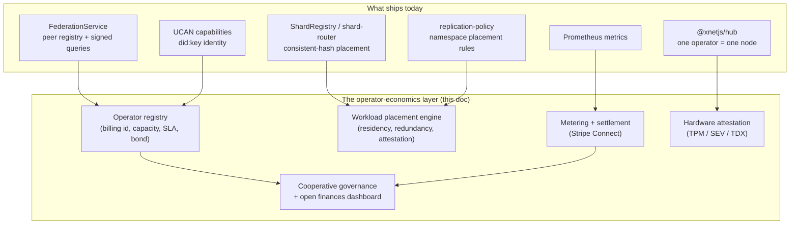
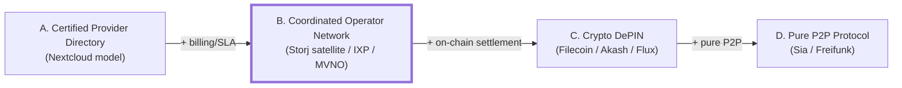
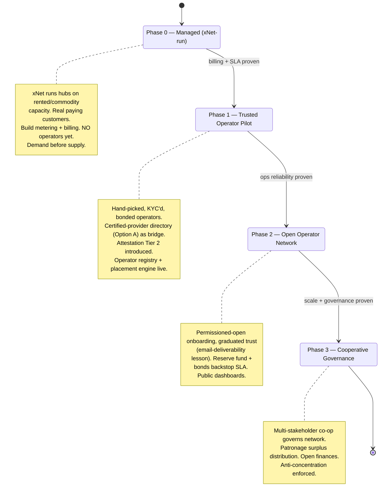
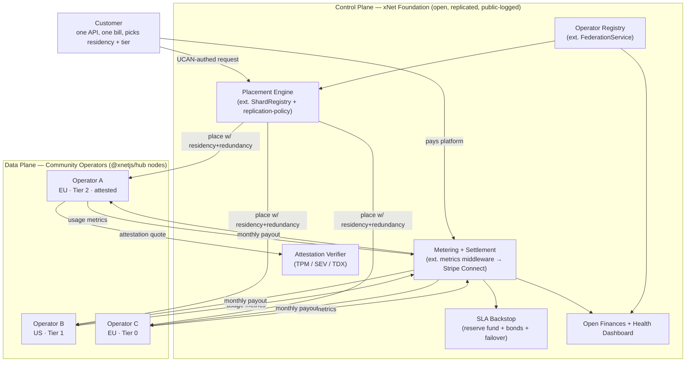

# Community-Owned Decentralized Cloud Infrastructure

> **Status:** Exploration
> **Date:** 2026-06-12
> **Author:** Claude
> **Tags:** infrastructure, cloud, federation, hubs, operator-economics, DePIN,
> cooperative, open-hardware, open-finances, SLA, GDPR, erasure-coding,
> data-residency, white-label, community-ownership

## Problem Statement

If xNet ever enters the **cloud infrastructure business**, what should it build?

The instinct is *not* to build hyperscale data centers. The instinct is the opposite: a
**federated fleet of smaller, community-run, community-owned deployments** — granular,
auditable, open-source, open-hardware, open-finances — that nonetheless **presents as a
white-labeled service that "just works"** like AWS or GCP.

The hard part is the tension between two goals that usually pull apart:

- **Decentralized / community-owned / auditable.** Many independent operators, transparent
  finances, open hardware, no single corporate gatekeeper, community governance.
- **Simple / cheap / reliable / secure.** One API, one bill, predictable SLAs, strong
  isolation, data residency guarantees — the things that make a cloud *usable*.

This exploration asks: **how far toward decentralization can we push before reliability,
cost, complexity, and legal liability become prohibitive — and where exactly is the line
that keeps the product simple while keeping ownership genuinely communal?**

It is deliberately broader than the three adjacent docs on *hub-hosting economics*
(`0132`, `0144`, `0147`). Those ask "why would anyone pay to run an xNet hub?" This one
asks "what does it look like for xNet to be **the cloud** — an operator network selling
compute, storage, and bandwidth — built on the federation primitives we already shipped?"

## Executive Summary

The research is unusually clear, and it points away from the crypto-DePIN playbook and
toward a 30-year-old, boringly-successful model: the **Internet Exchange Point cooperative**
(DE-CIX, AMS-IX) crossed with **Storj's satellite-as-trust-anchor** architecture and the
**MVNO** (mobile virtual network operator) legal structure.

The single most important finding: **in every federated network that actually works, the
coordination layer is centralized (or highly replicated) — and that layer is the product.**
Storj's satellite, Cloudflare's control plane, Tailscale's coordination server, the IXP's
switching fabric. Decentralization lives at the **data/compute plane**, never the control
plane. xNet already has most of this control plane built (`packages/hub` federation,
sharding, UCAN, metrics) — what's missing is the **operator economics layer** on top.

Recommended shape:

1. **Don't decentralize the control plane.** Run it as an open-source, auditable,
   public-logged service operated by an xNet foundation/cooperative. Replicate it; publish
   its books; let anyone read its logs and self-host a mirror — but keep it *coherent*.
2. **Decentralize the data/compute plane** across community operators, with reliability
   manufactured by **erasure coding + geographic placement + redundant scheduling**, not by
   trusting any individual node.
3. **Reliability = MVNO structure.** xNet (the platform entity) signs SLAs *to* customers
   and SLAs *from* operators, and **backstops the gap** with redundancy + a reserve fund +
   performance bonds. The customer never depends on one community node.
4. **Money = Stripe Connect, not a token.** Customers pay the platform; the platform meters
   usage from each node and pays operators monthly. Tokens add volatility, gaming, and
   regulatory drag for zero benefit at our scale.
5. **Trust = hardware attestation tier.** Sensitive workloads run only on operators with
   TPM + AMD SEV / Intel TDX confidential-compute attestation. Community ownership does not
   require trusting your neighbor's root account.
6. **Governance = multi-stakeholder cooperative + open finances.** Operators, customers, and
   the foundation each have a voice; a public dashboard shows revenue-by-operator,
   expenses-by-category, uptime, and capacity — the "open accounting" the prompt asks for.
7. **Sequence demand before supply.** Filecoin's lesson: 4 EiB of capacity with no customers
   is a museum. Start by reselling/managed-hosting real workloads, fold community operators
   in alongside paying demand.

The good news for xNet specifically: this is mostly an **economics + governance + scheduling**
build on top of already-shipped federation code, not a from-scratch protocol. The federation
peer registry becomes an **operator registry**; the shard placement engine becomes a
**workload placement engine**; the Prometheus metrics become a **metering pipeline**; UCAN
capabilities express **"who may host what"**; the replication policy enforces **data
residency**.

## Current State In The Repository

xNet already ships a production-grade *control plane* for a federated network. The cloud
business is largely a matter of adding an operator-economics layer above it.

### The hub: a single deployable node today

`packages/hub/` is a Hono HTTP + WebSocket server that one operator runs as a container.
It already bundles nearly every primitive a "cloud node" needs:

- **Server + config** — [`packages/hub/src/server.ts`](../../packages/hub/src/server.ts),
  [`packages/hub/src/config.ts`](../../packages/hub/src/config.ts),
  [`packages/hub/src/types.ts`](../../packages/hub/src/types.ts). `HubConfig` already carries
  `defaultQuota`, `maxBlobSize`, `maxConnections`, rate limits, and **runtime metadata
  (`platform`, `region`)** — the seeds of a capacity/placement descriptor. It detects
  Railway / Fly.io / local deployment.
- **Deployment** — [`packages/hub/Dockerfile`](../../packages/hub/Dockerfile) (multi-stage,
  Node 22 Alpine, `/data` volume) and [`railway.toml`](../../railway.toml). One command
  brings up a node: `npx xnet-hub start --port 4444 --data /data`. A live demo node runs at
  `hub.xnet.fyi`.
- **Identity & authorization** — [`packages/hub/src/auth/ucan.ts`](../../packages/hub/src/auth/ucan.ts)
  and [`packages/hub/src/auth/capabilities.ts`](../../packages/hub/src/auth/capabilities.ts)
  define `HubAction` (`hub/connect`, `hub/relay`, `hub/backup`, `hub/query`, `hub/admin`, …)
  with wildcard resource matching. [`packages/identity/`](../../packages/identity/) gives every
  user *and hub* a `did:key` identity and UCAN delegation. **This is already a capability
  language for "who may host / relay / store what."**
- **Storage** — [`packages/hub/src/storage/interface.ts`](../../packages/hub/src/storage/interface.ts)
  (SQLite + memory backends), blobs with `ownerDid`, FTS5 search, grant index, share links.
  [`packages/storage/`](../../packages/storage/) abstracts blob backends (filesystem, OPFS,
  S3-like).
- **Metering substrate** — [`packages/hub/src/middleware/metrics.ts`](../../packages/hub/src/middleware/metrics.ts)
  already emits Prometheus counters/gauges/histograms: WS connections, messages, sync docs,
  backup uploads, query duration, rate-limit rejections. This is the raw material for
  per-operator billing.

### Federation: hubs already talk to each other

[`packages/hub/src/services/federation.ts`](../../packages/hub/src/services/federation.ts) is
a `FederationService` with a **peer registry** (`FederationPeerRecord`: `hubDid`, `url`,
`schemas`, `trustLevel`, `maxLatencyMs`, `rateLimit`, `healthy`, `lastSuccessAt`,
`registeredBy`), signed cross-hub queries, parallel fan-out, dedup by CID, and reciprocal
rank fusion. [`federation-health.ts`](../../packages/hub/src/services/federation-health.ts)
polls peer health. Routes live in
[`packages/hub/src/routes/federation.ts`](../../packages/hub/src/routes/federation.ts)
(`/federation/query`, `/federation/status`, `/federation/register`, with `openRegistration`
and UCAN-gated `federation/register`).

**The operator registry we need is this peer registry with billing identity, capacity, and
SLA fields bolted on.**

### Sharding: a placement engine in embryo

xNet already distributes *index* data across hosts by consistent hashing:

- [`index-shards.ts`](../../packages/hub/src/services/index-shards.ts) — `ShardRegistry`:
  256-bucket hash space, `shardId = hash(term) % totalShards`, each shard has a
  `primaryHub`/`replicaHub`, BLAKE3 term hashing.
- [`shard-router.ts`](../../packages/hub/src/services/shard-router.ts) — routes a query to
  assigned hosts, fans out to primary then replica on failure, dedups, sorts by BM25.
- [`shard-rebalancer.ts`](../../packages/hub/src/services/shard-rebalancer.ts) — registry-only
  service; `registerHost()`, assignment management; **rebalancing is a scaffold** (noted as
  incomplete in `0011` and the roadmap).
- `ShardConfig`: `totalShards` (64), `replicationFactor` (2), `registryUrl`, `isRegistry`.

This is *exactly* the consistent-hash + replica + registry pattern a workload placement
engine needs — currently specialized to search indexes, generalizable to "place blob/db/
container X on operators Y and Z."

### Replication policy: data-residency routing already exists

[`packages/sync/src/replication-policy.ts`](../../packages/sync/src/replication-policy.ts)
defines `SyncFederationConfig` with `hubs` (id/url/priority/kinds), **`namespacePolicies`**
(namespace → include/exclude hubIds, `minHubs`, `maxHubs`), `defaultSystemHubIds`,
`defaultUserHubIds`, and a `ReplicationPlanDestination`/`ReplicationPlanDiagnostic`. This is a
policy-driven placement planner — the natural home for **"EU-only" / "this operator only" /
"≥3 replicas across ≥2 regions"** constraints.

### Network, abuse, telemetry: the trust & safety substrate

- [`packages/network/src/security/`](../../packages/network/src/security/) — connection
  tracking/gating, token-bucket + sync rate limiting, **peer scoring (reputation)**,
  auto-blocking, ACLs, security event log. A reputation system already exists at the P2P layer.
- [`packages/abuse/`](../../packages/abuse/) — `hub-policy-offer.ts`, `decision.ts`,
  `appeals.ts`, `community-notes.ts`, `cloud-classifier.ts`, `public-write-budget.ts`,
  `usage-events.ts`. Abuse classification, appeals, and **community notes** — the makings of
  an AUP-enforcement + community-moderation pipeline.
- [`packages/telemetry/`](../../packages/telemetry/) — privacy-preserving, k-anonymity,
  scrubbing, tiered consent. Good hygiene for any "open metrics" dashboard.

### Vision & adjacent explorations

- [`docs/VISION.md`](../../docs/VISION.md) frames xNet as "infrastructure for a new internet,"
  explicitly mentions federated queries across organizations and a community-contributable
  global index. [`docs/ROADMAP.md`](../../docs/ROADMAP.md) (Mar–Sep 2026) names Phase 3
  "multi-hub federation integration" and concedes "federation exists in pieces, but not yet a
  complete multi-hub operator story."
- **Prior explorations to build on (not duplicate):**
  - `0011_[x]_SERVER_INFRASTRUCTURE` — the hub itself (implemented).
  - `0132_[_]_ECONOMIC_MODELS_FOR_HOSTING_FEDERATED_HUBS` — home/community/backbone hub tiers,
    a "menu" of economic models. *Closest neighbor; this doc supplies the operator-fleet and
    legal/SLA architecture it gestures at.*
  - `0144_[_]_POTENTIAL_MONETIZATION_ROUTES_ALIGNED_WITH_OPEN_FEDERATION` — sustainability
    without becoming a gatekeeper.
  - `0147_[_]_FUTURE_PAID_HUB_HOSTING` — the SaaS *product* shape for paid hubs.
  - `0148_[_]_HOSTED_HUBS_DEEP_AI_INTEGRATION` — hosted hubs + foundation models.
  - `0113_[_]_OTHER_INTERNET_INFRASTRUCTURE_ROLES_FOR_XNET`,
    `0114_[_]_DECENTRALIZED_ALTERNATIVES_FOR_NON_XNET_INTERNET_LAYERS`,
    `0115_[_]_…_GLOBAL_WEB_SEARCH`, `0063_[_]_COMMUNITY_TOOLS`,
    `0141_[_]_GLOBAL_BUSINESSES_AND_MARKETS`.



## External Research

Full prior-art survey synthesized below; the lessons are remarkably consistent across crypto
DePIN, community networks, federated software, and managed-OSS businesses.

### Decentralized physical infrastructure (DePIN)

| Project | Model | Key lesson |
|---|---|---|
| **Filecoin** | On-chain storage deals, Proof-of-Spacetime, FIL collateral + slashing. ~4–5 EiB, ~3,000 SPs. | Token bootstrapping assembles hardware fast, but most capacity holds *garbage data* — **supply without demand**. Top-10 SPs hold ~40% of power; 2022 China ban cut ~30–40% of network. |
| **Storj** | **Satellite (Storj Labs) = trust anchor**: auth, billing, metadata, audit, erasure orchestration. Community nodes store shards. 80-piece RS, need ~29 to reconstruct. Pays operators $1.50/TB stored + $7/TB egress in **USD**. Reputation: audit + uptime score, suspension <60%, 9-month trust ramp. **Zero data-loss events in 7+ years.** | The **satellite-as-coordinator is the architecture, not a compromise**. Pay in fiat. Erasure coding gives real durability. |
| **Sia / Skynet** | Pure P2P renter-host contracts, on-chain proofs, *no* central coordinator. | Skynet portal shut down Nov 2023 — **without an "easy layer," a pure protocol has no product**. Separate protocol from the commercial coordination layer; allow many entities to run it. |
| **Arweave** | Pay-once permanent storage via a 200-year endowment; Proof of Access. | The pay-once/archival model is a genuine innovation, but it's **write-once**, not compute-backed. |
| **Akash** | Cosmos reverse-auction compute, USDC escrow, **no SLA, no provider slashing**. ~100–200 providers. 60–80% cheaper than AWS. | "Cheap, no SLA" works for interruptible batch/AI, **cannot be the reliability foundation for a white-label cloud**. |
| **Flux** | FluxOS orchestration over ~15,000 nodes; **tiered FLUX staking enforces hardware minimums** (Cumulus/Nimbus/Stratus); apps run in triplicate. | Tiered staking with hardware minimums is a clean quality lever — **copy that, but don't tie all economics to a volatile token**. |
| **Render / io.net** | Vertical GPU marketplaces (rendering, then AI inference). | Start with a **specific fault-tolerant workload** to create demand. io.net's inflated "1M GPUs" stat → **rigorous node verification must precede scale marketing**. |
| **Helium** | Hardware miners earn HNT for LoRaWAN coverage via Proof-of-Coverage. | **Cautionary tale.** 30–50% of hotspots gamed the system; gaming scales with token price; deployed nodes ≠ demand; mid-flight L1→Solana migration broke trust. |

### Community / cooperative infrastructure (non-crypto)

- **Guifi.net** (37,000+ nodes, Catalonia) — foundation legal entity + "Economic Compensation
  System"; **both a commons and a commercial ISP platform**. Lesson: a legal foundation that can
  sign contracts and receive municipal/EU money is essential; a **two-tier model** (volunteer
  commons + commercial layer) serves both audiences.
- **NYC Mesh** (501c3, ~1,400 nodes), **Freifunk** (~400 communities, ~40,000 nodes, zero
  revenue/zero SLA) — pure-commons models sustain free WiFi but offer **no path to paid SLAs**.
  A commercial layer must sit above the commons.
- **Electric cooperative broadband** (~300 US co-ops, Firefly, CoServ; USDA ReConnect funding)
  and **UTOPIA Fiber** (Utah municipal open-access) — **existing co-ops with physical rights and
  bond/grant access have a structural advantage** in deploying physical infrastructure.
- **IXPs — DE-CIX (>14 Tbps, 99.999% fabric SLA), AMS-IX (member-owned cooperative), LINX** —
  **the cleanest prior art.** Platform entity runs the fabric and sets standards; members
  interconnect to a quality minimum; **no bilateral member SLAs, only member-to-platform**;
  governance is a member cooperative. 30 years, no token, no VC.
- **Legal structures:** multi-stakeholder cooperative (operators + customers + funders, à la
  Mondragon), platform cooperative, L3C, B-Corp, foundation-owned LLC, **Open Collective fiscal
  hosting** for transparent treasuries.

### Federated software infrastructure

- **Fediverse (Mastodon/ActivityPub)** — works at the protocol level, but **donation-funded
  operator economics are broken**: admins burn out, instances vanish, users get stranded. Needs a
  built-in revenue mechanism, not voluntary donations.
- **Matrix homeservers** — the **"federation tax"**: joining a big federated room replicates its
  full history onto your small server (hundreds of GB). Element/EMS (~€6/user/mo) proves a
  commercial SLA layer over an open protocol works at enterprise scale (NHS, German govt).
- **Email** — 50-year-old open federation that **practically centralized** at Gmail/Outlook/iCloud
  because of **reputation barriers, deliverability complexity, and abuse-fighting cost**. New
  operators face a trust-bootstrapping wall → need a **vouching / graduated-trust** mechanism.
- **Nostr relays** — no built-in payment → **free = spam-flooded, paid-per-relay = fragmented**.
  Payment must be platform-level and automatic.
- **Tailscale / headscale** — central coordination server distributes keys/routes; traffic flows
  P2P. **headscale proves the coordination layer can be open-source/self-hostable.** This is the
  right model for the control plane.
- **Remote attestation** — TPM 2.0, AMD SEV, Intel TDX (confidential computing), reproducible
  builds (Nix/Guix), RATS/Keylime. **The only way to trust a community-operated node without
  trusting its operator.**

### Managed-OSS / edge business models

- **Open core done right (GitLab) vs. rug-pulls (HashiCorp→BSL/OpenTofu, Elastic→SSPL/OpenSearch,
  Mongo→SSPL).** AGPL on community-hosted code prevents strip-mining without forking, while
  keeping self-hosting genuine.
- **Foundation owns OSS + commercial hosting (Ghost, ~$10M ARR; Plausible AGPL, ~$2M ARR
  bootstrapped)** — cleanest "no shareholder enshittification" structure; hosting revenue funds
  development; self-hosting stays free.
- **Supabase / Cloudron** — hosted value = *operations* (setup, backups, monitoring, support), not
  feature-gating. **Discourse's "discourage self-hosting" builds resentment — avoid.**
- **Nextcloud's certified-provider directory** — federate hosting by **brand certification without
  a payment clearinghouse**; preserves operator independence but loses seamless billing/SLA.
- **Edge POP models — Fly.io** (anycast + Firecracker, regional isolation; the closest commercial
  analog to a community cloud, and a reminder the **routing/orchestration layer is the hard
  engineering**), **Cloudflare Workers / Deno Deploy** (V8 isolates, not containers — why edge can
  be cheap). Lesson for xNet: target **stateful long-running services**, not stateless edge
  functions where hyperscalers win on isolate density.

### Economics, legal, reliability

- **Settlement:** Storj (satellite is authoritative meter), Akash (on-chain escrow), telco
  95th-percentile billing, and — recommended — **Stripe Connect** (platform collects, KYCs
  operators, files 1099s, disburses). For a non-crypto cloud, Stripe Connect is the rail.
- **SLA structure = MVNO.** Mint/Visible buy wholesale carrier capacity and resell with their own
  SLA; the MVNO is the customer's counterparty and absorbs the gap. Operators post **performance
  bonds**; platform holds a **reserve fund**; redundancy + failover backstops node failure.
- **Liability:** GDPR controller (customer) → processor (platform) → **sub-processor (operator)**;
  Art. 28 DPAs flow down; operators must sit in adequate jurisdictions or under SCCs. **DMCA safe
  harbor (§512) requires a single designated agent = the platform**, not each operator. Data
  residency enforced at placement time with per-node jurisdiction metadata + customer-selectable
  zones + audit logs.
- **Open finances:** Open Collective (all transactions public), Wikimedia 990s, Mondragon
  open-book, DAO treasuries. xNet can get the transparency benefit with a **public dashboard**
  (revenue-by-operator, expenses-by-category, uptime, capacity) without blockchain.
- **KYC:** US platform must respect OFAC; Stripe Connect enforces operator KYC. AUP + a community
  process to revoke operator licenses.
- **Reliability math:** Reed-Solomon (80, k≈29) gives ~**10⁻⁵⁰ data-loss probability even at 95%
  per-node uptime**; durability is *not* the hard problem — **reconstruction latency for live
  workloads** is. Hot data → full replicas nearby; cold → wide RS fan-out; databases →
  Raft/Paxos across 3 AZs. **IPFS pinning problem**: content-addressing alone doesn't persist
  data; economic incentive to retain is required.
- **Slashing/reputation:** Akash (none) → unreliable; Filecoin/Storj (real stakes) → reliable.
  Ethereum's **correlation penalty** (small for lone failures, large for correlated/coordinated
  ones) is the right graduated model — but **the meter itself must be trustworthy** (a buggy
  monitor could unjustly slash).
- **Concentration is universal:** Filecoin top-10 ≈ 40%; Lido ≈ 29% of staked ETH; matrix.org ≈
  45% of accounts. **Node count hides capacity concentration.** Counter with per-operator revenue
  caps, routing that favors small operators, and geographic/organizational diversity requirements.

## Key Findings

1. **The control plane is the product; keep it coherent and open, not decentralized.** Every
   working federated network has a centralized/replicated coordinator. xNet's hub federation
   *is* that coordinator. Make it auditable and self-hostable (headscale-style), publish its
   logs and books — but don't shard the brain.
2. **xNet has ~70% of the control plane already.** Operator registry ≈ federation peer registry;
   placement engine ≈ shard registry + replication policy; metering ≈ Prometheus metrics;
   "who may host" ≈ UCAN capabilities. The missing 30% is **economics, SLA/legal, attestation,
   and governance** — not protocol.
3. **Reliability is manufactured by redundancy, not trust.** RS coding + geographic placement +
   redundant scheduling + automatic failover means 90–95% community nodes deliver enterprise
   durability. The customer is never coupled to one node.
4. **MVNO is the legal spine.** Platform is the single counterparty both ways; operators are
   sub-processors under flow-down DPAs; the platform is the lone DMCA agent. This is what lets a
   community network make AWS-grade promises.
5. **No token.** Stripe Connect for money; performance bonds + reserve fund for skin-in-the-game;
   a public dashboard for transparency. Tokens import volatility, gaming (Helium), and regulatory
   load for no benefit at our scale.
6. **Attestation, not faith.** TPM + SEV/TDX lets customers trust community nodes are running
   unmodified xNet software. Tier workloads by attestation level.
7. **Demand before supply, and start by reselling.** Phase 0 is xNet running managed hosting on
   commodity/rented capacity with real paying customers; community operators are folded in
   *alongside* demand, never ahead of it.
8. **Design against concentration from day one.** Per-operator revenue caps, small-operator
   routing bias, and diversity floors — otherwise "1,000 nodes" hides "50 nodes do 80%."

## Options And Tradeoffs

Four archetypes, ordered by how much they decentralize the **control plane** (the axis that
trades away reliability):



### Option A — Certified Provider Directory

xNet certifies independent hosting companies, publishes a directory, lends brand trust; each
operator bills customers directly. (Nextcloud's provider program.)

- **Pros:** Trivial to launch; zero platform liability; operators fully independent; very
  "community-owned."
- **Cons:** **No seamless billing, no unified SLA, no cross-node redundancy.** The customer
  picks one operator and lives with its uptime. Not a "white-label cloud that just works."
- **Verdict:** A good *Phase 1 bridge* and a permanent low-tier option, but not the product the
  prompt describes.

### Option B — Coordinated Operator Network (recommended)

xNet runs the open, auditable control plane (registry, placement, metering, billing, SLA
backstop); community operators run data/compute nodes; reliability via RS + redundancy +
failover; money via Stripe Connect; governance via cooperative + open finances. (Storj
satellite × IXP cooperative × MVNO.)

- **Pros:** **Looks like AWS to the customer** (one API, one bill, real SLA) while being
  community-owned, auditable, open-hardware/finances at the data plane. Maps directly onto
  shipped federation/sharding code. No token.
- **Cons:** xNet carries real legal liability (GDPR processor, DMCA agent) and must engineer the
  hard parts (placement, metering, failover, attestation). The control plane is a centralization
  point — mitigated by openness/replication, not eliminated.
- **Verdict:** **The balance point the prompt is looking for.**

### Option C — Crypto DePIN

On-chain registry, token incentives, staking/slashing, smart-contract escrow. (Filecoin/Akash/
Flux.)

- **Pros:** Permissionless operator onboarding; trust-minimized payment; capital bootstrapping.
- **Cons:** **Every failure mode in the research** — supply without demand (Filecoin), gaming
  (Helium), token volatility wrecking operator economics, no enterprise SLA (Akash), regulatory/
  sanctions/KYC complexity, and a worse UX. "Open finances" via a public dashboard achieves the
  transparency without the chain.
- **Verdict:** Reject as the core. Borrow *mechanisms* (tiered staking → bonds; correlation
  penalty → graduated SLA credits) without the token or chain.

### Option D — Pure P2P Protocol

No coordinator; renter-host contracts negotiated directly. (Sia, Freifunk.)

- **Pros:** Maximally decentralized; no platform liability.
- **Cons:** **No product.** Sia/Skynet died when the easy layer ran out of money; Freifunk has no
  SLA or revenue. Cannot make reliability promises.
- **Verdict:** Reject for a commercial cloud; keep self-hosting (`@xnetjs/hub` standalone) as the
  always-available escape hatch so the network is never a lock-in.

### The decentralization dial — where the line sits

| Layer | Centralize | Decentralize | Why |
|---|---|---|---|
| Identity | — | ✅ `did:key`, self-sovereign | Already shipped; no registry needed |
| **Control plane** (registry, placement, billing, SLA) | ✅ **open + replicated + public-logged** | — | Reliability & legal liability demand coherence (Storj/IXP/Tailscale) |
| Metering/accounting | ✅ authoritative meter | partially auditable | Billing needs strong consistency; publish the books |
| **Data plane** (blobs, DBs, compute) | — | ✅ community operators | Where ownership & cost wins live; RS makes it reliable |
| Governance | — | ✅ multi-stakeholder cooperative | "Community-owned" is realized here, not in the control software |
| Finances | — | ✅ public dashboard / open books | The "open accounting" the prompt wants |

The insight: **decentralize ownership, governance, finances, and the data plane; keep the
control plane coherent but open.** That is how you get auditable + community-owned *and*
simple + reliable at the same time.

## Recommendation

Build **Option B — a Coordinated Operator Network** — and stage it so demand always leads
supply. Concretely:

1. **Legal/governance: a foundation-owned cooperative.** An xNet Foundation owns the OSS and the
   control-plane service; an **xNet Cooperative** (multi-stakeholder: operator-members,
   customer-members, the foundation) governs the operator network, sets the AUP, and distributes
   surplus to operators by patronage (capacity × uptime × utilization), credit-union style.
   Publish 990-equivalent financials. Community-hosted server code is **AGPL** to prevent
   strip-mining; client/SDK stays MIT as today.
2. **Architecture: control plane in `@xnetjs/hub`, data plane on operators.** Extend the
   federation peer registry into an **operator registry** and the shard registry into a general
   **workload placement engine** governed by `replication-policy`. New `HubAction`s
   (`host/compute`, `host/store`, `host/egress`) express what an operator is authorized and
   bonded to do.
3. **Reliability: RS + geographic placement + MVNO backstop.** Three storage classes (hot
   replicas / cold RS / Raft DB); customer-selectable **data-residency zones** enforced at
   placement; platform-to-customer SLA backed by redundancy, a reserve fund, and operator
   performance bonds.
4. **Money: Stripe Connect, no token.** Platform collects, meters each node from the existing
   metrics pipeline, KYCs operators via Connect, disburses monthly, files tax forms.
5. **Trust: attestation tiers.** Tier 0 (best-effort, public/cache data), Tier 1 (reputable
   operator, standard data), **Tier 2 (TPM + SEV/TDX attested, sensitive/EU-personal data)**.
   Customers pick a minimum tier; placement honors it.
6. **Anti-concentration: caps + diversity floors + small-operator routing bias** from launch.
7. **Transparency: a public Open-Finances + Network-Health dashboard** (revenue-by-operator,
   expenses-by-category, uptime, capacity, residency map) as a first-class product surface, not
   an afterthought.

### Phased rollout



### How the pieces fit



## Example Code

Illustrative TypeScript showing how the operator-economics layer extends *existing* seams. These
are sketches for the doc, not final APIs.

### 1. Operator registry — the federation peer record, grown up

```typescript
// Extends FederationPeerRecord in packages/hub/src/storage/interface.ts
// and the FederationService peer registry in services/federation.ts.
export interface OperatorRecord {
  // --- already present on FederationPeerRecord ---
  hubDid: DID                       // did:key identity, also the payee identity
  url: string
  healthy: boolean
  lastSuccessAt: number
  registeredBy: DID

  // --- new: billing & legal ---
  stripeConnectedAccountId: string  // KYC'd via Stripe Connect
  bond: { amountUsd: number; postedAt: number } // performance bond
  dpaSignedAt: number               // Art. 28 sub-processor agreement on file
  aupAcceptedAt: number

  // --- new: capacity & placement ---
  jurisdiction: string              // ISO country; drives residency placement
  region: string                    // from HubConfig.runtime.region
  capacity: { cpuMillis: number; memMib: number; storageGib: number; egressGibMonth: number }
  available: { cpuMillis: number; memMib: number; storageGib: number }

  // --- new: trust ---
  attestation: AttestationTier      // 0 | 1 | 2
  reputation: number                // 0..100, reuses network/security PeerScorer style
  // --- new: anti-concentration accounting ---
  trailing30dRevenueShare: number   // capped at MAX_OPERATOR_SHARE
}

export type AttestationTier = 0 | 1 | 2 // 0 best-effort · 1 reputable · 2 TPM+SEV/TDX attested
```

### 2. Workload placement — residency + redundancy + attestation, over the shard registry

```typescript
// Generalizes ShardRegistry.getShardsForQuery (services/index-shards.ts)
// and ReplicationPlanDestination (packages/sync/src/replication-policy.ts).
export interface PlacementRequest {
  workload: 'blob' | 'database' | 'compute'
  sizeHint: { storageGib?: number; cpuMillis?: number; memMib?: number }
  residency: { allowedJurisdictions: string[] }   // e.g. EU adequacy set
  minAttestation: AttestationTier
  redundancy: { replicas: number; minRegions: number; scheme: 'replica' | 'reed-solomon' | 'raft' }
}

export function planPlacement(req: PlacementRequest, ops: OperatorRecord[]): OperatorRecord[] {
  const eligible = ops.filter(o =>
    o.healthy &&
    o.attestation >= req.minAttestation &&
    req.residency.allowedJurisdictions.includes(o.jurisdiction) &&
    hasCapacity(o, req.sizeHint) &&
    o.trailing30dRevenueShare < MAX_OPERATOR_SHARE)        // anti-concentration
  // bias toward smaller/under-utilized operators, then enforce region diversity
  const ranked = eligible.sort(bySmallOperatorBias)
  return pickAcrossRegions(ranked, req.redundancy.replicas, req.redundancy.minRegions)
}
```

### 3. "Who may host what" — a UCAN capability, using the shipped auth model

```typescript
// New HubActions alongside hub/relay, hub/backup … in auth/capabilities.ts.
// The cooperative delegates a bounded hosting capability to a bonded operator.
const hostingGrant = await createUCAN({
  issuer: cooperativeIdentity,      // the platform/cooperative DID
  audience: operatorRecord.hubDid,  // the operator
  capabilities: [
    { can: 'host/store',   with: 'residency:EU' },
    { can: 'host/compute', with: `tier:${operatorRecord.attestation}` },
    { can: 'host/egress',  with: 'budget:5TB/month' },
  ],
  expiration: nextBondReviewDate,
})
// Operator presents this to the placement engine; placement verifies via verifyHubCapability().
```

### 4. Metering → settlement, from the existing Prometheus counters

```typescript
// The hub already counts bytes/requests in middleware/metrics.ts. The platform pulls
// per-operator meters and settles monthly through Stripe Connect. The meter is the
// authoritative source of truth (Storj satellite lesson) — and is itself published.
async function settleMonth(operator: OperatorRecord, usage: MeteredUsage) {
  const gross =
    usage.storageGibHours * RATE.storage +
    usage.cpuMillisHours  * RATE.cpu +
    usage.egressGib       * RATE.egress
  const slaCredits = computeSlaCredits(operator)   // graduated, correlation-aware
  const payout = Math.max(0, gross - slaCredits)
  await stripe.transfers.create({
    amount: usdToCents(payout),
    destination: operator.stripeConnectedAccountId,
    metadata: { period: usage.period, hubDid: operator.hubDid },
  })
  await openFinances.publish({ operator: operator.hubDid, gross, slaCredits, payout, usage })
}
```

## Risks And Open Questions

- **The control plane is a single point of failure and a centralization critique magnet.**
  Mitigation: open-source it, replicate it, publish its logs/books, let anyone run a read mirror
  (headscale precedent). Open question: how multi-party can the *authoritative meter* become
  before billing consistency suffers? (Likely: one writer, many auditable replicas.)
- **Legal liability is real and non-trivial.** xNet becomes a GDPR processor and DMCA agent the
  day a customer stores third-party data. Needs counsel before Phase 1; the cooperative/foundation
  must actually exist as a legal entity with insurance and a reserve fund.
- **The meter must be trustworthy** (Ethereum mass-slashing risk analog). A buggy monitor could
  unjustly deny operator payment or trigger SLA credits. Needs reconciliation, operator-visible
  meter data, and a dispute process.
- **Demand risk dominates** (Filecoin). If Phase 0 managed hosting doesn't find paying customers,
  the operator network is premature. Gate Phase 1 on real revenue, not capacity.
- **Concentration creep.** Even with caps, capital-advantaged operators dominate (Filecoin top-10,
  Lido). Open question: are revenue caps + routing bias enough, or do we need hard org/geo
  diversity floors and active recruitment of small operators?
- **Attestation excludes the cheapest hardware** and the most "community" (Raspberry Pi / old
  laptop) operators from Tier 2. Tiering is the answer, but it means the most sensitive workloads
  can't run on the most grassroots nodes — a values tension worth naming.
- **"Open hardware" is aspirational at the server tier.** TPM/SEV/TDX are proprietary silicon.
  Genuinely open hardware (OpenTitan, RISC-V) attestation is immature. Open question: how much
  "open hardware" can we actually promise vs. "open *software* + audited commodity hardware"?
- **Egress economics.** Bandwidth is where clouds make margin and where community operators on
  residential links get crushed (and may violate ISP ToS). Needs explicit egress budgeting and
  possibly IXP/transit partnerships.
- **Scope vs. existing docs.** This must stay complementary to `0132`/`0144`/`0147`, not fork the
  economic model. Open question: do we merge the operator-fleet model *into* `0132`, or keep this
  as the infrastructure-architecture companion it is now?
- **Self-hosting must remain a real escape hatch** (Sia lesson) so the network is never lock-in —
  `@xnetjs/hub` standalone must always work without the cooperative.

## Implementation Checklist

Phase 0 — Managed (prove demand + billing):
- [ ] Stand up xNet-run managed hubs on rented capacity with real paying customers (extends the
      `hub.xnet.fyi` demo into a paid tier; see `0147`).
- [ ] Build the metering pipeline: aggregate per-tenant usage from
      [`metrics.ts`](../../packages/hub/src/middleware/metrics.ts) into billable units
      (storage-GiB-hours, CPU-millis-hours, egress-GiB).
- [ ] Integrate Stripe billing for customers; define the rate card.
- [ ] Ship a v1 Open-Finances dashboard (even single-operator) to set the transparency norm.

Phase 1 — Trusted operator pilot:
- [ ] Extend `FederationPeerRecord` → `OperatorRecord` (billing, capacity, jurisdiction, bond,
      attestation, reputation) in
      [`storage/interface.ts`](../../packages/hub/src/storage/interface.ts) + `FederationService`.
- [ ] Add `host/store`, `host/compute`, `host/egress` to
      [`auth/capabilities.ts`](../../packages/hub/src/auth/capabilities.ts); issue bounded hosting
      UCANs from a cooperative identity.
- [ ] Generalize [`index-shards.ts`](../../packages/hub/src/services/index-shards.ts) +
      [`shard-router.ts`](../../packages/hub/src/services/shard-router.ts) into a
      workload `PlacementEngine`; drive residency/redundancy from
      [`replication-policy.ts`](../../packages/sync/src/replication-policy.ts).
- [ ] **Finish the shard rebalancer** (scaffold today) — required for operator
      add/remove/rebalance.
- [ ] Stripe Connect onboarding + KYC for operators; performance-bond intake; Art. 28 DPA +
      AUP e-sign flow.
- [ ] Attestation verifier service (TPM quote + AMD SEV / Intel TDX); reproducible-build hashing
      of the hub image; Tier 0/1/2 labeling on `OperatorRecord`.
- [ ] Reserve fund + SLA-credit engine (graduated, correlation-aware) in the settlement path.
- [ ] Certified-provider directory page (Option A bridge) as the public face of the pilot.

Phase 2 — Open network:
- [ ] Graduated-trust onboarding (new-operator traffic ramp, email-deliverability lesson;
      reuse [`network/src/security`](../../packages/network/src/security/) `PeerScorer`).
- [ ] Anti-concentration: `MAX_OPERATOR_SHARE` cap, small-operator routing bias, geo/org
      diversity floors in the placement engine.
- [ ] Residency-zone product surface (customer selects "EU only", etc.); audit-log proof for
      GDPR Art. 5(2).
- [ ] Automatic failover + RS reconstruction paths for the three storage classes; chaos-test node
      loss.
- [ ] Single DMCA designated agent + central abuse intake routing to operators via
      [`packages/abuse`](../../packages/abuse/) (appeals, community notes).
- [ ] Public Network-Health dashboard (uptime, capacity, residency map, concentration metrics).

Phase 3 — Cooperative governance:
- [ ] Incorporate the multi-stakeholder cooperative; operator/customer/foundation member classes.
- [ ] Patronage surplus distribution (capacity × uptime × utilization), credit-union model.
- [ ] Full open-books financials (990-equivalent) published on schedule.
- [ ] Operator governance votes on protocol/policy changes; relicense community-hosted server
      code to AGPL.

## Validation Checklist

- [ ] **Demand-first proven:** Phase 1 begins only after Phase 0 managed hosting has paying
      customers and reconciled bills (no capacity-ahead-of-demand).
- [ ] **Durability:** a documented chaos test shows zero data loss when ⌈(n−k)⌉ operators in an RS
      group are killed simultaneously; DB workloads survive a single-AZ operator loss via Raft.
- [ ] **Residency enforced:** an "EU-only" customer's data is provably never placed on a non-EU
      operator (placement test + audit-log assertion).
- [ ] **SLA backstop works:** a simulated operator outage triggers failover within the SLA window
      and auto-issues the correct customer credit from the reserve fund.
- [ ] **Metering accuracy:** independent recomputation of a month's per-operator usage matches the
      authoritative meter within tolerance; an operator can audit their own meter data.
- [ ] **Attestation gating:** a node failing its TPM/SEV/TDX quote is denied Tier-2 placements.
- [ ] **Anti-concentration holds:** no single operator exceeds `MAX_OPERATOR_SHARE` of trailing
      revenue, and no single jurisdiction/org exceeds the diversity floor, over a full quarter.
- [ ] **Transparency live:** the Open-Finances dashboard reconciles to Stripe payouts and to the
      cooperative's filed financials.
- [ ] **Self-host escape hatch intact:** a standalone `@xnetjs/hub` runs with zero dependency on
      the cooperative control plane (no lock-in).
- [ ] **Legal posture confirmed:** counsel-reviewed processor/sub-processor DPAs, registered DMCA
      agent, OFAC screening on operator payouts.

## References

### Repository
- Hub server & config — [`packages/hub/src/server.ts`](../../packages/hub/src/server.ts),
  [`config.ts`](../../packages/hub/src/config.ts), [`types.ts`](../../packages/hub/src/types.ts)
- Federation — [`services/federation.ts`](../../packages/hub/src/services/federation.ts),
  [`routes/federation.ts`](../../packages/hub/src/routes/federation.ts),
  [`services/federation-health.ts`](../../packages/hub/src/services/federation-health.ts)
- Sharding/placement — [`services/index-shards.ts`](../../packages/hub/src/services/index-shards.ts),
  [`shard-router.ts`](../../packages/hub/src/services/shard-router.ts),
  [`shard-rebalancer.ts`](../../packages/hub/src/services/shard-rebalancer.ts),
  [`routes/shards.ts`](../../packages/hub/src/routes/shards.ts)
- Auth/identity — [`auth/ucan.ts`](../../packages/hub/src/auth/ucan.ts),
  [`auth/capabilities.ts`](../../packages/hub/src/auth/capabilities.ts),
  [`packages/identity/`](../../packages/identity/)
- Metering/storage — [`middleware/metrics.ts`](../../packages/hub/src/middleware/metrics.ts),
  [`storage/interface.ts`](../../packages/hub/src/storage/interface.ts),
  [`packages/storage/`](../../packages/storage/)
- Residency/replication — [`packages/sync/src/replication-policy.ts`](../../packages/sync/src/replication-policy.ts)
- Trust & safety — [`packages/network/src/security/`](../../packages/network/src/security/),
  [`packages/abuse/`](../../packages/abuse/), [`packages/telemetry/`](../../packages/telemetry/)
- Deployment — [`packages/hub/Dockerfile`](../../packages/hub/Dockerfile),
  [`railway.toml`](../../railway.toml)
- Vision/roadmap — [`docs/VISION.md`](../../docs/VISION.md), [`docs/ROADMAP.md`](../../docs/ROADMAP.md)
- Adjacent explorations — `0011_[x]_SERVER_INFRASTRUCTURE`,
  `0132_[_]_ECONOMIC_MODELS_FOR_HOSTING_FEDERATED_HUBS`,
  `0144_[_]_POTENTIAL_MONETIZATION_ROUTES_ALIGNED_WITH_OPEN_FEDERATION`,
  `0147_[_]_FUTURE_PAID_HUB_HOSTING`, `0148_[_]_HOSTED_HUBS_DEEP_AI_INTEGRATION`,
  `0113_[_]_OTHER_INTERNET_INFRASTRUCTURE_ROLES_FOR_XNET`,
  `0115_[_]_ARCHITECTING_FULLY_DECENTRALIZED_GLOBAL_WEB_SEARCH`

### External prior art
- **DePIN storage/compute:** Filecoin (filecoin.io, Proof-of-Spacetime, slashing),
  Storj (storj.io — satellite + Reed-Solomon + USD operator pay), Sia/Skynet (sia.tech — portal
  shutdown 2023), Arweave (arweave.org — pay-once endowment), Akash (akash.network — reverse
  auction, no SLA), Flux (runonflux.io — tiered staking), Render (rendernetwork.com), io.net,
  Helium (helium.com — Proof-of-Coverage gaming).
- **Community/cooperative infra:** Guifi.net, NYC Mesh, Freifunk, Webarchitects.coop, May First
  (mayfirst.org), UTOPIA Fiber, electric-coop broadband (USDA ReConnect); IXPs — DE-CIX, AMS-IX
  (member cooperative), LINX.
- **Federated software:** Mastodon/ActivityPub (operator economics), Matrix/Element (EMS, the
  "federation tax"), Email/SMTP (deliverability centralization), Nostr relays, Tailscale/headscale
  (open-source coordination server).
- **Managed-OSS & edge:** GitLab (open core), HashiCorp→OpenTofu / Elastic→OpenSearch (rug-pulls),
  Ghost & Plausible (foundation/bootstrapped), Supabase, Cloudron, Nextcloud provider program,
  Fly.io (anycast + Firecracker), Cloudflare Workers / Deno Deploy (V8 isolates).
- **Economics/legal/reliability:** Stripe Connect (marketplace payouts + KYC), MVNO wholesale
  model, GDPR Art. 28 (processor/sub-processor DPAs) & Chapter V (SCCs), DMCA §512 safe harbor,
  Open Collective / Wikimedia 990 / Mondragon open books, Reed-Solomon durability math,
  Tahoe-LAFS, IPFS pinning problem, Ethereum correlation-penalty slashing.
