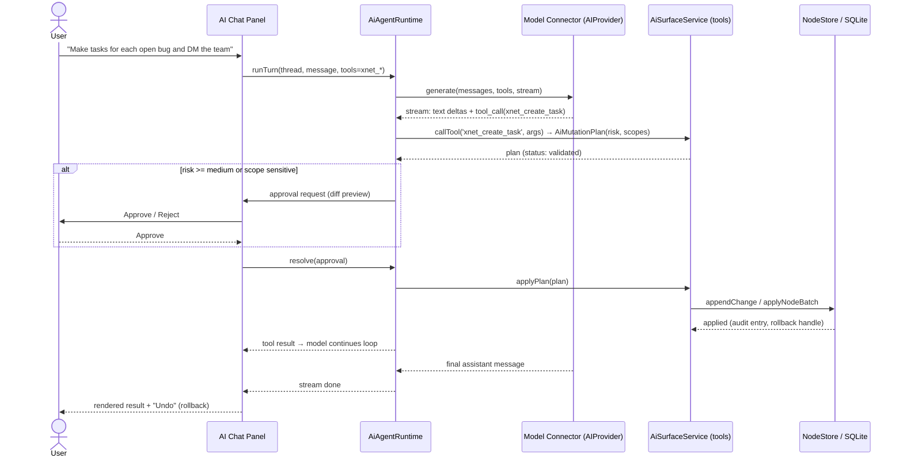

# Bring-Your-Own-Model AI Chat Panel (Local-First, No Hosted Model)

## Problem Statement

We want a first-class **AI chat panel** inside the xNet web app where a user
can converse with an agent that *drives their workspace*: create and edit
tasks, write and edit documents, edit databases, send chat messages, organize
content — "like OpenClaw, but with a real data model and guardrails."

The hard constraint is economic and architectural, not UX:

- The web app is a **static bundle hosted on GitHub Pages** (`/app/`, hash
  router, no backend). The only server is the **xNet hub**, a relay/sync
  service on a free Railway deployment that we explicitly do **not** want to
  turn into a paid LLM proxy.
- We do **not** want to host a model or pay per token. We want to demo the
  full agentic experience for **free**, which means leveraging compute the
  user *already pays for or already runs*:
  - a **local model** (Ollama / LM Studio / llama.cpp) on their machine,
  - their existing **Claude Code / Codex / ChatGPT subscription**,
  - or a model that runs **inside the browser tab** itself.

The web app is the primary target (best demo reach), but Electron and mobile
are acknowledged as easier hosts because they can ship/launch a local model or
shell out to a terminal without the browser sandbox in the way.

The question: **can we build a controllable, guard-railed, workspace-driving AI
chat panel that runs on GitHub Pages and borrows the user's own LLM
infrastructure — and if the pure-web path is too constrained, what is the right
fallback (Electron, mobile, local bridge)?**

## Executive Summary

The good news, established by reading the repo: **the "brain" is already
largely built.** xNet already has a provider abstraction (Anthropic, OpenAI,
OpenAI-compatible, **Ollama**, a routing layer, plus presets for OpenRouter /
LM Studio / vLLM / LiteLLM), an **MCP tool surface with a mutation-plan
guardrail** (risk levels, required scopes, validate → apply → audit →
rollback), an **agent runtime** with threads/turns/approvals/background-jobs,
an in-browser **vector/hybrid search** stack for context packing, a
**files-first projection** of the workspace plus a `SKILL.md`, and a comms chat
UI we can reuse for the surface. See [Current State](#current-state-in-the-repository).

What's actually missing is narrower than it first appears:

1. **Last-mile model transport** from a sandboxed HTTPS browser tab to *some*
   model, and
2. **The chat-panel UI** itself, wired to the existing runtime + tools.

The research finding that shapes everything: **there is no single transport
that works everywhere.** A static HTTPS page reaching `http://localhost:11434`
works in Chrome (with a new permission prompt) and Firefox, but is **blocked
outright in Safari** (mixed-content, unresolved WebKit bug). In-tab models
(WebLLM/WebGPU) run anywhere WebGPU is supported (now including Safari 26) but
are small and weak at tool-calling. Riding a Claude/Codex *subscription* from a
browser is only possible through a **local bridge daemon** that spawns the
official CLI — which means an install, and is the natural home of the Electron
app.

**Recommendation:** build a **capability-tiered "Bring Your Own Model"
connector** that probes what's available and degrades gracefully, layered on
the existing `AIProvider` router and `AiAgentRuntime`. Ship the web demo with
(a) **auto-detected localhost Ollama/LM Studio** (free, best quality for power
users) and (b) **BYO cloud key** (works everywhere, most capable, user pays
their own metered key) first, add (c) **in-tab WebLLM** for the zero-install
"it runs with nothing installed" wow-moment, and make the **subscription
bridge** the Electron flagship. Tool-calling fidelity — not raw chat — is the
gate that decides which tiers can do full agentic edits vs. propose-then-apply.

## Current State In The Repository

xNet has invested heavily in agent infrastructure across explorations
[0160 (XNET as an AI OS)](0160_[_]_XNET_AS_AN_AI_OPERATING_SYSTEM.md),
[0161 (token-efficient agent interfaces)](0161_[x]_TOKEN_EFFICIENT_AGENT_INTERFACES.md),
and [0165 (AI OS landscape)](0165_[_]_AI_OPERATING_SYSTEMS_LANDSCAPE.md). The
pieces a chat panel needs already exist:

### Provider abstraction (the model-agnostic seam)

[`packages/plugins/src/ai/providers.ts`](packages/plugins/src/ai/providers.ts)
defines a common `AIProvider` interface and concrete providers:

- `AnthropicProvider` (`https://api.anthropic.com/v1/messages`)
- `OpenAIProvider` / `OpenAICompatibleProvider` (`/v1/chat/completions`)
- `OllamaProvider` (`http://localhost:11434/api/generate`)
- `AIProviderRouter` — routes by capability (`AIPrivacyLevel = 'local' |
  'cloud' | 'proxy'`, `AIModelQuality = 'local' | 'balanced' | 'strong'`,
  cost model, `complexity`, `preferredProvider`)
- Presets for `openrouter`, `ollama`, `lmstudio` (`:1234`), `vllm` (`:8000`),
  `litellm` (`:4000`)
- `isOllamaAvailable(baseUrl)` and `listOllamaModels(baseUrl)` — probe helpers
  that hit `/api/tags`, exactly what a connector-detection step needs.

The type system already models `tools`, `responseSchema`, streaming
(`AIStreamChunk` with `text | tool_call | usage | done`), `AIToolCall`, and
usage/cost. **This is the seam a BYO-Model connector plugs into** — a new
in-tab provider just implements `AIProvider`.

### Agent runtime (threads, approvals, guardrails)

[`packages/plugins/src/ai/runtime.ts`](packages/plugins/src/ai/runtime.ts)
exposes `AiAgentRuntime` / `createAiAgentRuntime` with threads, turns,
**approval requests** (`AiAgentApproval`, `AiAgentApprovalStatus`), background
jobs, telemetry, and an orchestrator mode. This is the controllable-agent loop
the user described ("more controllable than OpenClaw").

### Tool surface + mutation-plan guardrail

- [`packages/plugins/src/ai-surface/service.ts`](packages/plugins/src/ai-surface/service.ts)
  — `AiSurfaceService` with `getTools()`, `callTool(name, args)`, context
  packs, page-markdown read/plan/apply, database describe/query, canvas tools,
  audit log, rollback.
- [`packages/plugins/src/ai-surface/types.ts`](packages/plugins/src/ai-surface/types.ts)
  — the guardrail data model: `AiMutationPlan` carries `risk`
  (`low|medium|high|critical`), `requiredScopes`, `validation`, and a
  `status` lifecycle (`proposed → validated → applied | rejected`).
  `AiChangeSet` targets a kind (`page | database | databaseRows | canvas |
  node | …`) at a `baseRevision`, with explicit `AiOperation`s.
- [`packages/plugins/src/services/mcp-server.ts`](packages/plugins/src/services/mcp-server.ts)
  — an MCP server. Core (always-loaded) tools:
  `MCP_CORE_TOOL_NAMES = [xnet_search, xnet_read_page_markdown,
  xnet_plan_page_patch, xnet_apply_page_markdown, xnet_database_query]`; plus
  `xnet_create`, `xnet_update`, `xnet_delete`, `xnet_query`, `xnet_get`,
  `xnet_schemas`. Non-core tools set `defer_loading` (advanced tool use).

The plan → validate → apply → audit → rollback flow is **exactly the "extra
guardrails" the user wants** — it is the difference between this and an
unconstrained OpenClaw.

### Files-first projection + SKILL.md (the "invert the host" path)

[`packages/plugins/src/services/ai-workspace-exporter.ts`](packages/plugins/src/services/ai-workspace-exporter.ts)
projects the workspace to a `vault/` of Markdown pages (YAML frontmatter
carries `xnet.id`/`xnet.revision`), database `*.schema.json` + `rows.jsonl`,
canvases, and a `.xnet/` manifest + pending/applied/conflicts mutation
lifecycle. A watcher (`fs.watch`, 250ms debounce) turns edits into mutation
plans. [`packages/plugins/src/ai-surface/skill.ts`](packages/plugins/src/ai-surface/skill.ts)
emits a `SKILL.md` documenting the vault layout and the
grep → search → checkout → query → commit workflow. **This is precisely what an
external agent host (the user's own Claude Code) would drive** — no in-app
model required.

### Local HTTP API and retrieval

- [`packages/plugins/src/services/local-api.ts`](packages/plugins/src/services/local-api.ts)
  — a REST surface (default `localhost:31415`) over the node store
  (get/list/query/create/update/delete/subscribe). Already a localhost
  endpoint; relevant to the bridge pattern.
- [`packages/vectors/src/`](packages/vectors/src/) — in-browser embeddings
  (Xenova `all-MiniLM-L6-v2`, 384-dim), HNSW index, and `HybridSearch` (RRF of
  semantic + keyword). Lets the agent build bounded **context packs** instead
  of shipping the whole workspace into a small context window.

### Web app shell, comms UI, hub, storage

- **Hosting:** [`apps/web/vite.config.ts`](apps/web/vite.config.ts) +
  [`.github/workflows/deploy-site.yml`](.github/workflows/deploy-site.yml) —
  static build to GitHub Pages at `/app/`, hash router, PWA, SQLite-WASM
  cached in workbox. **No server-side backend.**
- **Panel registration:**
  [`apps/web/src/workbench/PanelViewHost.tsx`](apps/web/src/workbench/PanelViewHost.tsx)
  — `registerPanelView('left'|'right'|'bottom', { id, title, component })`. A
  new AI chat panel is a plain React FC registered here (shell from
  [0166](0166_[x]_MINIMAL_WORKBENCH_SHELL_REDESIGN.md)).
- **Comms to reuse:** [`apps/web/src/comms/ChannelChat.tsx`](apps/web/src/comms/ChannelChat.tsx),
  composer (`mention-composer.ts`, `hashtag-composer.ts`, `link-composer.ts`),
  and hooks (`useChannelMessages`, etc.). Messages are signed nodes
  ([`packages/comms/src/chat/chat-service.ts`](packages/comms/src/chat/chat-service.ts));
  [0167](0167_[x]_REALTIME_CHAT_PRESENCE_AND_CALLS.md) /
  [0168](0168_[x]_NOTIFICATION_CENTER_AND_MENTIONS.md) shipped the chat
  surface. There is **no token-streaming pattern** yet — messages are created
  whole — so the AI panel needs a streaming-message component (deltas into a
  growing assistant bubble).
- **Hub:** [`packages/hub/`](packages/hub/) + [`railway.toml`](railway.toml) —
  WebSocket relay for Yjs/node-sync, awareness/presence, backups, files,
  schema registry, federation. **Relay-only; not LLM-aware**, and we don't
  want to make it one.
- **Storage:** SQLite-WASM over OPFS ([`packages/sqlite/`](packages/sqlite/),
  [`packages/storage/`](packages/storage/)); writes land via
  `NodeStore.appendChange` / `applyNodeBatch` and the `useMutate` hooks.

### What's missing

| Missing piece | Why it matters |
| --- | --- |
| **Model transport from a browser tab** | The router has providers, but a static HTTPS tab can't freely reach localhost (Safari) or ride a subscription. This is the core gap. |
| **Chat-panel UI** with token streaming | No streaming-assistant component exists; comms messages are whole-node. |
| **First-class write tools** (`create_task`, `create_page`, `edit_page`, `db_upsert_rows`, `send_message`) | Today writes route through page-markdown apply; an agent wants direct, schema-described actions. |
| **A connector that picks a tier** and guides setup (CORS/LNA, key entry, model download) | The friction lives here. |

## External Research

(Full sources in [References](#references). Browser/version facts are current
as of mid-2026; the subscription-ToS situation is fast-moving and flagged as
**verify-before-relying**.)

### Can a GitHub-Pages HTTPS tab reach a local model?

- **Mixed content + loopback.** The W3C Secure Contexts spec treats
  `127.0.0.0/8`, `::1`, and `localhost` as "potentially trustworthy."
  **Chrome and Firefox** therefore exempt loopback from mixed-content blocking
  — an `https://user.github.io/app/` page *can* `fetch('http://localhost:…')`.
  **Safari does not** make this exception; the request is blocked as mixed
  content (open WebKit bug since 2017, unresolved). Safari is the spoiler for
  any localhost-LLM path.
- **Chrome Local Network Access (LNA).** Chrome 142 (Oct 2025) replaced the
  earlier Private Network Access preflight model with a **one-time user
  permission prompt** ("Look for and connect to any device on your local
  network") when a public origin first hits a loopback/private address. No
  server-side header is required; a new `fetch(…, { targetAddressSpace:
  'local' })` option lets the app declare intent (and exempts mixed content).
  Net: on Chrome the localhost call works *after* the user clicks Allow.
- **Local-server CORS.** None of these servers allow `https://user.github.io`
  out of the box:
  - **Ollama** — blocked unless `OLLAMA_ORIGINS` includes the origin (or `*`).
    Must be set as a service env var (`launchctl setenv` / systemd unit), then
    restart. **High friction** for non-technical users.
  - **LM Studio** — a **CORS toggle in the Local Server UI** (`:1234`). No
    terminal. Friendlier.
  - **llama.cpp `llama-server`** — `--cors-origin "https://user.github.io"` at
    launch. Technical users only.

### In-tab models (zero install, runs in the page)

- **WebLLM** (`@mlc-ai/web-llm`) — runs LLMs via **WebGPU** entirely in the
  tab, **OpenAI-compatible API**, models downloaded from HF and cached (Cache
  API). Representative sizes/VRAM: Llama-3.2-1B q4 ≈ 0.9 GB, Llama-3.2-3B q4 ≈
  2.3 GB, Phi-3.5-mini ≈ 3.7 GB; throughput ~40–70 tok/s on an M3-class
  machine. **Function calling is still "WIP."** First-run downloads hundreds of
  MB to several GB.
- **Transformers.js** — great for embeddings/classification/Whisper in-tab;
  full instruction-following LLMs are feasible only at ~0.5–2B and are slow on
  the WASM backend (WebGPU helps a lot).
- **WebGPU support (2026):** Chrome/Edge (since 113), Firefox (Windows 141+,
  Apple-Silicon macOS 145), **Safari 26** (macOS Tahoe / iOS 26). ~90 %+
  desktop, ~70 %+ mobile. Crucially, WebLLM is the **one path that works on
  Safari** and offline.

### Chrome built-in AI (Gemini Nano / Prompt API)

- Global `LanguageModel` API (`availability()`, `create()`, `prompt()`,
  `promptStreaming()`); structured output via `responseConstraint`. **Chrome
  only** (Origin Trial for web pages; stable in extensions). **No tool calling
  yet.** Hardware-gated (≈22 GB free disk, >4 GB VRAM, 16 GB RAM); model
  downloads separately so `availability()` often returns `downloadable`.
  Useful as a *bonus* zero-key tier on capable Chrome, not a foundation.

### Leveraging a subscription (Claude Code / Codex)

- **Claude Agent SDK = headless `claude -p`.** Non-interactive, `--output-format
  stream-json`, `--input-format stream-json` (bidirectional piping),
  `--allowedTools`, `--json-schema`, `--continue/--resume`. Subscription auth
  via `claude setup-token` (long-lived OAuth for CI/scripts). **No built-in
  network server — stdio pipes only**, so a browser cannot talk to it directly;
  a local bridge process must spawn it.
- **`claude mcp serve`** exposes Claude Code's built-in tools over **stdio MCP
  only** (no HTTP/SSE; [issue #17949] open). But Claude Code is also an **MCP
  *client*** that connects to stdio/SSE/HTTP MCP servers — so the clean
  inversion is: **xNet exposes a local MCP server (its existing tool surface),
  and the user's Claude Code connects to it** and drives the workspace.
- **Codex** — `codex exec` (headless) and an experimental `codex app-server`
  that can listen on `ws://127.0.0.1:PORT` (JSON-RPC: threads, turns,
  approvals, MCP). A browser *can* reach that WebSocket, unlike `claude mcp
  serve`.
- **ToS posture (verify before relying).** Reports indicate Anthropic moved to
  **prohibit using subscription OAuth tokens inside third-party apps** and to
  meter programmatic/Agent-SDK use against a separate credit pool. The
  **architecturally safe pattern** that sidesteps token rules is to **spawn the
  official CLI** (which holds and uses its own auth) rather than extract
  tokens — e.g. open-source `claude-code-proxy` exposes an OpenAI-compatible
  endpoint by spawning `claude --print`. Ollama (v0.14+) even speaks the
  Anthropic Messages API, so `claude` can be pointed at a fully local model.

## Key Findings

1. **The brain exists; the gap is last-mile transport + a UI.** We are not
   building an agent framework from scratch — we are connecting an existing one
   to a model and rendering a chat surface.
2. **No universal browser transport.** Safari blocks localhost; Chrome adds an
   LNA prompt; in-tab WebLLM works everywhere WebGPU does but is small and weak
   at tools; Gemini Nano is Chrome-only and tool-less. **Therefore the connector
   must be tiered and self-detecting**, not a single integration.
3. **Tool-calling fidelity is the real gate.** "Create my tasks and edit my
   docs" needs reliable function calling. Mid-size local models (Llama-3.x 8B,
   Qwen) and cloud models do it well; 1–3B in-tab models and Gemini Nano do
   not. Weak tiers must fall back to **JSON-mode "propose, then human applies."**
4. **Guardrails are already designed for "controllable OpenClaw."** Mutation
   plans (risk/scopes/validation), approvals, audit, and rollback are the
   safety rails the user asked for — reuse them, don't reinvent.
5. **Riding a subscription requires a local install.** Browsers cannot talk to
   `claude -p`; only a local bridge daemon (or Codex's experimental ws server)
   can. This is the **Electron flagship**, not the GitHub-Pages demo — and
   Electron also erases the CORS/LNA/Safari problems entirely.
6. **The cheapest high-quality path may be to invert the host.** Point the
   user's *existing* Claude Code at xNet's files-first vault / local MCP server.
   Near-zero build, no in-app model, full agentic quality — for power users who
   already run Claude Code.

## Options And Tradeoffs

A model "connector" is anything that satisfies the existing `AIProvider`
contract (chat + optional tool calls + streaming). The candidates:

```mermaid
flowchart TD
    Start([User opens AI Chat panel]) --> Probe{Connector probe}
    Probe -->|WebGPU present| WebLLM[A. In-tab WebLLM<br/>WebGPU, no install]
    Probe -->|"localhost:11434 / :1234 reachable"| Local[B. Local server<br/>Ollama / LM Studio]
    Probe -->|"window.LanguageModel ready"| Nano[C. Chrome Prompt API<br/>Gemini Nano]
    Probe -->|user pasted key| Cloud[D. BYO cloud key<br/>Anthropic / OpenAI / OpenRouter]
    Probe -->|"bridge daemon on localhost"| Bridge[E. Local bridge<br/>drives claude -p / codex sub]
    Probe -->|"Claude Code points at us"| Invert[F. External host<br/>files-first / local MCP]

    WebLLM --> Cap{Tool calling<br/>reliable?}
    Local --> Cap
    Nano --> Cap
    Cloud --> Cap
    Bridge --> Cap
    Cap -->|yes| Agentic[Full agentic loop:<br/>model calls xnet_* tools]
    Cap -->|no/weak| Propose[Propose-only:<br/>JSON mutation plan → human applies]
    Agentic --> Guard[Mutation-plan guardrail:<br/>risk · scopes · approval · audit · rollback]
    Propose --> Guard
    Invert -.drives tools directly.-> Guard
```



### A. In-tab WebLLM (WebGPU)

- **How:** bundle `@mlc-ai/web-llm`, implement an `AIProvider` over its
  OpenAI-compatible engine; model downloaded + cached on first use.
- **Install/UX:** *zero install*; first run downloads ~0.9–3.7 GB. The
  "it just works with nothing installed" demo moment.
- **Browsers:** anywhere WebGPU runs — **including Safari 26 and offline**.
- **Cost:** free; user's GPU.
- **Agentic capability:** **weak** — function calling is WIP; treat as
  propose-only / JSON-mode for writes, or chat/Q&A + retrieval.
- **Verdict:** the unique zero-install, Safari-safe, offline tier. Ship it for
  reach, but don't expect reliable autonomous edits.

### B. Local server — Ollama / LM Studio / llama.cpp via `localhost` fetch

- **How:** reuse the existing `OllamaProvider` / `OpenAICompatibleProvider` and
  `isOllamaAvailable()` probe; auto-detect `:11434` / `:1234`.
- **Install/UX:** user installs Ollama/LM Studio and **must enable CORS**
  (`OLLAMA_ORIGINS` env — high friction; or LM Studio's UI toggle — low
  friction), plus a **one-time Chrome LNA Allow** prompt.
- **Browsers:** Chrome ✅ (after LNA), Firefox ✅, **Safari ✅✗ blocked**.
- **Cost:** free; user's hardware. Best **quality-for-free** (can run 8B–70B).
- **Agentic capability:** **good** with mid-size models — real tool calling.
- **Verdict:** best free path for power users; gate behind detection + a setup
  helper that explains CORS/LNA. Recommend LM Studio as the "easy" option in
  docs because of its UI CORS toggle.

### C. Chrome Prompt API (Gemini Nano)

- **How:** feature-detect `window.LanguageModel`; thin `AIProvider` wrapper.
- **Install/UX:** zero key, but Origin-Trial token for web pages and heavy
  hardware gate; model auto-downloads.
- **Browsers:** Chrome only.
- **Agentic capability:** **none yet** (no tool calling) — chat/summarize only.
- **Verdict:** a *bonus* zero-key tier on capable Chrome for chat/RAG, not a
  foundation. Cheap to add once the connector abstraction exists.

### D. BYO cloud API key (Anthropic / OpenAI / OpenRouter)

- **How:** the existing cloud providers; key stored locally (IndexedDB,
  per-`VITE_STORAGE_SCOPE`), never sent to the hub.
- **Install/UX:** paste a key. **Works on every browser, including Safari**,
  with no localhost/CORS/LNA issues (these are public HTTPS APIs).
- **Cost:** **user pays their own metered key** — *we* still pay nothing.
- **Agentic capability:** **best** — frontier tool calling.
- **Verdict:** the **always-works, most-capable fallback.** It's not "free for
  the user," but it costs the operator nothing and is the reliability anchor of
  the tier stack. (OpenRouter lets one key reach many models.)

### E. Local bridge daemon → `claude -p` / `codex` (subscription)

- **How:** a tiny local daemon (shipped by Electron, or an optional installable
  for web users) listens on `localhost`, speaks an OpenAI/Anthropic-compatible
  HTTP/WebSocket API to the browser, and **spawns the official CLI**
  (`claude -p --output-format stream-json`, or talks to `codex app-server`'s
  ws). Auth lives in the CLI; we never touch tokens.
- **Install/UX:** install the daemon (or use Electron). Browser still needs
  CORS allow + Chrome LNA; **Safari still blocked** for the browser→daemon hop
  (Electron sidesteps it).
- **Cost:** rides the user's **existing subscription** — the holy grail of "use
  what you already pay for." **ToS caveat:** spawn the CLI, never extract OAuth
  tokens; verify current subscription-automation terms.
- **Agentic capability:** **best** — it *is* Claude Code / Codex, with their
  full agent loop.
- **Verdict:** the flagship for Electron/desktop. Powerful but install-bound and
  ToS-sensitive; not the GitHub-Pages default.

### F. Invert the host — external Claude Code drives xNet (files-first / local MCP)

- **How:** the user runs their own Claude Code; xNet exposes either the
  **files-first vault** (already built — `ai-workspace-exporter` + `SKILL.md`)
  or a **local MCP server** that Claude Code connects to as a client. The agent
  loop runs *outside* xNet; xNet just offers tools/data and renders results.
- **Install/UX:** user already has Claude Code; point it at the vault/MCP.
- **Cost:** subscription they already pay for; operator pays nothing.
- **Agentic capability:** **best**, and **near-zero build for us.**
- **Verdict:** ship-this-week leverage for power users; complements (not
  replaces) the in-app panel. The in-app panel is the broad-reach demo; this is
  the power-user superpower.

### Cross-cutting: Electron and mobile change the math

The browser sandbox (mixed content, CORS, LNA, Safari) is the source of most
friction in A–E. **Electron** (`apps/electron`) and **Expo** (`apps/expo`) can:
talk to `localhost`/spawn processes freely (no CORS/LNA/Safari), bundle or
launch a local model, and run the bridge daemon in-process. The same connector
abstraction applies; the desktop/mobile builds simply *enable more tiers
reliably.* This validates the user's instinct that Electron/mobile are "easier."

| Tier | Install | Safari | Chrome LNA | Operator cost | User cost | Tool calling | Offline |
| --- | --- | --- | --- | --- | --- | --- | --- |
| A WebLLM | none | ✅ | n/a | $0 | $0 | weak | ✅ |
| B Local server | model app + CORS | ❌ | prompt | $0 | $0 | good | ✅ |
| C Gemini Nano | none (OT token) | ❌ | n/a | $0 | $0 | none | ✅ |
| D BYO cloud key | paste key | ✅ | n/a | $0 | metered | best | ❌ |
| E Bridge → sub | daemon/Electron | ❌(Electron✅) | prompt | $0 | subscription | best | ❌ |
| F External host | has Claude Code | ✅(its own) | n/a | $0 | subscription | best | ❌ |

## Recommendation

Build a **tiered Bring-Your-Own-Model connector** on top of the existing
`AIProvider` router and `AiAgentRuntime`, render a streaming **AI Chat panel**
via `registerPanelView`, and route every write through the existing
**mutation-plan guardrail** with approval gating. Phase it:

**Phase 1 — Web demo that works for free today.**
Ship two connectors first because they require no new model integration:
- **B. Local server auto-detect** (Ollama/LM Studio) — reuse `OllamaProvider`,
  `isOllamaAvailable`, presets; add a setup helper UI that detects CORS/LNA
  failure and shows copy-paste fix instructions (recommend LM Studio for its UI
  CORS toggle).
- **D. BYO cloud key** — the always-works, Safari-safe, most-capable anchor.
Wire the chat panel to `AiAgentRuntime`; expose the core MCP tools
(`xnet_search/read/query` + `xnet_create/update/delete`) as the agent's tool
set; gate writes on `AiAgentApproval`. This alone delivers "chat with AI that
manages your data" on GitHub Pages.

**Phase 2 — Zero-install wow + first-class write tools.**
- **A. In-tab WebLLM** connector for the "runs with nothing installed /
  offline / Safari" demo. Because tool calling is weak, route its writes
  through a **propose-only JSON mutation-plan flow** (model emits a plan; human
  clicks Apply) — which the guardrail already models.
- Add **first-class agent tools** so the agent isn't forced through
  page-markdown: `xnet_create_task`, `xnet_create_page`, `xnet_edit_page`,
  `xnet_db_upsert_rows`, `xnet_send_message` — all behind the
  plan/validate/apply/approval pipeline.
- **C. Gemini Nano** as a cheap bonus chat tier on capable Chrome.

**Phase 3 — Electron flagship + external-host superpower.**
- **E. Bridge daemon** in the Electron app that drives the user's Claude
  Code/Codex *subscription* via the official CLI (`stream-json`), exposing the
  full agent loop with no per-token cost. Mobile (Expo): on-device small model
  or BYO-key.
- **F.** Ship the **files-first / local-MCP** integration so existing Claude
  Code users can drive xNet immediately — likely the *earliest* thing we can
  ship, in parallel with Phase 1, since the projection already exists.

**Decision rule baked into the connector:** detect tiers, prefer the most
capable available (E/F > D > B > A/C), and **downgrade write behavior to
propose-only when the active model's tool calling is unreliable.**



## Example Code

> Illustrative, not drop-in. Shows where each piece plugs into existing code.

### 1. The connector contract (extends the existing `AIProvider`)

```ts
// packages/plugins/src/ai/connectors/types.ts
import type { AIProvider } from '../providers'

export type ConnectorTier = 'webllm' | 'local-server' | 'prompt-api'
  | 'cloud-key' | 'bridge' | 'external-host'

export interface ModelConnector {
  tier: ConnectorTier
  label: string
  /** Cheap, side-effect-free check: is this tier usable right now? */
  detect(): Promise<{ available: boolean; reason?: string; setupHint?: string }>
  /** Build an AIProvider once chosen (may trigger model download). */
  create(opts?: { model?: string }): Promise<AIProvider>
  /** Does the active model reliably do function calling? Gates write mode. */
  toolCalling: 'reliable' | 'weak' | 'none'
}
```

### 2. Detection probe (reuses existing helpers)

```ts
// packages/plugins/src/ai/connectors/detect.ts
import { isOllamaAvailable } from '../providers'

export async function detectConnectors(): Promise<ConnectorTier[]> {
  const tiers: ConnectorTier[] = []
  // A. in-tab WebGPU
  if ('gpu' in navigator) tiers.push('webllm')
  // B. localhost model (Chrome/Firefox only; Safari will throw — caught here)
  try {
    if (await isOllamaAvailable('http://localhost:11434')) tiers.push('local-server')
  } catch { /* mixed-content (Safari) or LNA-denied (Chrome) */ }
  // C. Chrome Prompt API
  if ('LanguageModel' in self) tiers.push('prompt-api')
  // D. cloud key present in local settings
  if (await hasStoredApiKey()) tiers.push('cloud-key')
  // E. local bridge daemon
  try {
    const r = await fetch('http://127.0.0.1:31416/health', { mode: 'cors' })
    if (r.ok) tiers.push('bridge')
  } catch { /* no daemon */ }
  return tiers
}
```

### 3. In-tab WebLLM adapter (new `AIProvider`)

```ts
// packages/plugins/src/ai/connectors/webllm-provider.ts
import { CreateMLCEngine, type MLCEngine } from '@mlc-ai/web-llm'
import type { AIProvider, AIGenerateRequest, AIStreamChunk } from '../providers'

export class WebLLMProvider implements AIProvider {
  readonly name = 'webllm'
  private constructor(private engine: MLCEngine, private model: string) {}

  static async create(model = 'Llama-3.2-3B-Instruct-q4f16_1-MLC', onProgress?: (p: number) => void) {
    const engine = await CreateMLCEngine(model, { initProgressCallback: r => onProgress?.(r.progress) })
    return new WebLLMProvider(engine, model)
  }

  async generate(prompt: string) {
    const r = await this.engine.chat.completions.create({ messages: [{ role: 'user', content: prompt }] })
    return r.choices[0]?.message.content ?? ''
  }

  async *stream(req: AIGenerateRequest): AsyncIterable<AIStreamChunk> {
    const s = await this.engine.chat.completions.create({ messages: req.messages as never, stream: true })
    for await (const chunk of s) {
      const text = chunk.choices[0]?.delta?.content
      if (text) yield { type: 'text', text, provider: this.name, model: this.model }
    }
    yield { type: 'done', provider: this.name, model: this.model }
  }
  getCapabilities() {
    return { tools: false, structuredOutputs: true, streaming: true,
      contextWindow: 4096, local: true, privacy: 'local' as const, quality: 'local' as const }
  }
}
```

### 4. Minimal local bridge daemon (Phase 3 / Electron) — spawns the official CLI

```ts
// tools/xnet-llm-bridge/server.ts  (runs on the user's machine; ships with Electron)
import { createServer } from 'node:http'
import { spawn } from 'node:child_process'

const ALLOW = new Set(['https://<user>.github.io', 'http://localhost:5173', 'app://-'])

createServer((req, res) => {
  const origin = req.headers.origin ?? ''
  if (ALLOW.has(origin)) res.setHeader('Access-Control-Allow-Origin', origin) // never '*'
  res.setHeader('Access-Control-Allow-Private-Network', 'true')               // Chrome PNA/LNA
  if (req.method === 'OPTIONS') return res.writeHead(204).end()
  if (req.url === '/health') return res.writeHead(200).end('ok')

  // Drive the user's *subscription* via the official CLI — auth stays in `claude`.
  let body = ''
  req.on('data', d => (body += d))
  req.on('end', () => {
    const { prompt } = JSON.parse(body)
    const cli = spawn('claude', ['-p', prompt, '--output-format', 'stream-json', '--allowedTools', 'mcp__xnet'])
    res.writeHead(200, { 'content-type': 'application/x-ndjson' })
    cli.stdout.pipe(res) // newline-delimited JSON events → browser
  })
}).listen(31416, '127.0.0.1')
```

### 5. Register the chat panel

```tsx
// apps/web/src/ai-chat/register.ts
import { registerPanelView } from '../workbench/PanelViewHost'
import { AiChatPanel } from './AiChatPanel'
registerPanelView('right', { id: 'ai-chat', title: 'AI', component: AiChatPanel })
```

## Risks And Open Questions

- **Safari blocks localhost.** Tiers B and E (browser→daemon) are dead in web
  Safari. Mitigation: WebLLM (A) and BYO-key (D) cover Safari; Electron erases
  the issue entirely. **Open:** is Safari reach important enough to prioritize
  WebLLM in Phase 1 rather than Phase 2?
- **CORS/LNA setup friction (Ollama).** `OLLAMA_ORIGINS` as a service env var
  is a real drop-off point. Mitigation: detect the failure mode, show
  OS-specific copy-paste fixes, recommend LM Studio's UI toggle, or push users
  to Electron. **Open:** is an "xNet local model" one-click installer worth it?
- **Subscription ToS volatility.** The rules around automating Claude/Codex
  subscriptions are changing. **Never extract OAuth tokens**; always spawn the
  official CLI so auth stays in the vendor's binary; default the product to
  BYO-key/local; surface subscription tiers as opt-in with a clear notice.
  **Open:** confirm current Anthropic/OpenAI terms at build time.
- **Weak tool calling on small/in-tab models.** Autonomous edits will be
  unreliable below ~7–8B and on Gemini Nano. Mitigation: capability-gate write
  mode to **propose-only** for weak tiers (model emits a JSON mutation plan;
  human applies). **Open:** is a constrained-decoding / JSON-schema fallback
  good enough for create-task on a 3B model?
- **Prompt injection & destructive agency.** An agent that edits docs/DBs and
  sends messages is a powerful attack surface (e.g. injected instructions in a
  page the agent reads). Mitigation: lean on the existing **risk/scopes +
  approval + audit + rollback**; require explicit approval for outward-facing
  actions (sending messages, sharing) and `high|critical` risk; sandbox writes
  via the mutation-plan pipeline; never auto-apply destructive ops.
- **Bridge daemon is itself an attack surface.** Any web page could try to call
  `localhost:31416`. Mitigation: strict **Origin allowlist** (never `*`), a
  one-time pairing token between app and daemon, loopback-only bind, and
  per-action approval still enforced in-app.
- **WebLLM first-download UX.** Multi-GB download + VRAM needs; weak on mobile.
  Mitigation: clear progress UI, small-model default (1–3B), make it opt-in.
- **Streaming UI is new.** Comms messages are whole-node; the AI panel needs a
  delta-streaming assistant bubble distinct from the chat-message node model.
  **Open:** do AI conversations persist as first-class nodes (so they sync and
  are searchable) or stay panel-local?
- **Context window vs. workspace size.** Small models can't hold the workspace.
  Mitigation: the existing `vectors` `HybridSearch` + `createContextPack` to
  retrieve only what's relevant.

## Implementation Checklist

- [x] Define `ModelConnector` + `detectConnectors()` in
      `packages/plugins/src/ai/connectors/` (reusing `isOllamaAvailable`,
      provider presets). — shipped: `types.ts`/`detect.ts` + 10 tests;
      `writeModeFor()` encodes the propose-only downgrade rule.
- [ ] Build the **AI Chat panel** (`apps/web/src/ai-chat/`) with a
      token-streaming assistant bubble; register via `registerPanelView('right', …)`.
- [ ] Wire the panel to `AiAgentRuntime` (threads/turns) and expose core MCP
      tools (`xnet_search/read/query/create/update/delete`) as the agent tool set.
- [ ] Phase 1 connectors: **local-server auto-detect** (Ollama/LM Studio) +
      **BYO cloud key** (key stored locally, never sent to hub).
- [ ] Connector **setup helper**: detect CORS/LNA failure, show OS-specific
      `OLLAMA_ORIGINS` / LM Studio toggle / Chrome "Allow" guidance.
- [ ] Enforce writes through the **mutation-plan guardrail** with
      `AiAgentApproval` gating; show a diff preview + "Undo" (rollback handle).
- [ ] Phase 2: **WebLLM** connector (`@mlc-ai/web-llm`) with progress UI and a
      small default model; **propose-only** write mode for `toolCalling !==
      'reliable'`.
- [ ] Phase 2: first-class agent tools — `xnet_create_task`,
      `xnet_create_page`, `xnet_edit_page`, `xnet_db_upsert_rows`,
      `xnet_send_message` — behind the plan/validate/apply pipeline.
- [ ] Phase 2: **Gemini Nano** (`window.LanguageModel`) bonus chat tier on Chrome.
- [ ] Phase 3: **bridge daemon** (`tools/xnet-llm-bridge/`) spawning `claude -p
      --output-format stream-json`; Origin allowlist + pairing token; bundle
      with Electron (`apps/electron`).
- [x] Phase 3 / parallel: ship **files-first / local-MCP** integration so an
      existing Claude Code can drive xNet (the projection + `SKILL.md` exist;
      add the MCP-server transport / `xnet mcp` entry point). — shipped:
      `xnet mcp serve` (stdio + hardened HTTP), see 0175.
- [ ] Decide AI-conversation persistence model (panel-local vs. synced nodes).
- [x] Docs: a "Connect a model" page covering each tier and its setup. —
      shipped: [`docs/guides/connect-a-model.md`](../guides/connect-a-model.md).

## Validation Checklist

- [ ] **BYO-key on Safari**: chat + a `create_task` round-trip works with a
      pasted Anthropic/OpenAI key (proves the always-works anchor).
- [ ] **Local Ollama on Chrome**: with `OLLAMA_ORIGINS` set and LNA allowed,
      detection succeeds and an 8B model performs a real tool call that creates
      a task; the setup helper correctly diagnoses the failure when CORS is
      *not* set.
- [ ] **WebLLM zero-install**: with nothing installed, a small model loads,
      streams a reply, and produces a valid **propose-only** mutation plan the
      user can apply; verify offline and on Safari 26.
- [ ] **Guardrail**: a `high`/`critical` or outward-facing action (send
      message, share) blocks on approval; reject leaves the workspace
      unchanged; apply creates an audit entry and a working **rollback**.
- [ ] **Multi-step agentic loop**: "make a task per open bug and post a
      summary" executes several tool calls with per-write approval and a final
      summary, with no operator-side token spend.
- [ ] **Bridge daemon (Electron)**: drives `claude -p` on the user's
      subscription; rejects requests from a non-allowlisted Origin; survives the
      Chrome LNA prompt in the web build.
- [ ] **External host (F)**: a real Claude Code instance connects to xNet's
      local MCP server / vault and creates + edits content that appears live in
      the app.
- [ ] **Context packing**: on a large workspace, the agent uses
      `HybridSearch`/context packs rather than dumping the workspace, staying
      within a small model's context window.
- [ ] **No operator cost**: confirm end-to-end demo flows incur **zero** spend
      on the hub / GitHub Pages and never route model traffic through the hub.

## References

### Repository

- [`packages/plugins/src/ai/providers.ts`](packages/plugins/src/ai/providers.ts) — `AIProvider`, Ollama/OpenAI-compatible providers, router, `isOllamaAvailable`
- [`packages/plugins/src/ai/runtime.ts`](packages/plugins/src/ai/runtime.ts) — `AiAgentRuntime`, approvals, background jobs
- [`packages/plugins/src/ai-surface/service.ts`](packages/plugins/src/ai-surface/service.ts) — `AiSurfaceService.getTools/callTool`
- [`packages/plugins/src/ai-surface/types.ts`](packages/plugins/src/ai-surface/types.ts) — `AiMutationPlan` guardrail model
- [`packages/plugins/src/services/mcp-server.ts`](packages/plugins/src/services/mcp-server.ts) — MCP tools (`MCP_CORE_TOOL_NAMES`, `xnet_create/update/delete`)
- [`packages/plugins/src/services/ai-workspace-exporter.ts`](packages/plugins/src/services/ai-workspace-exporter.ts) — files-first vault projection
- [`packages/plugins/src/ai-surface/skill.ts`](packages/plugins/src/ai-surface/skill.ts) — `SKILL.md` generator
- [`packages/plugins/src/services/local-api.ts`](packages/plugins/src/services/local-api.ts) — localhost REST API (`:31415`)
- [`packages/vectors/src/`](packages/vectors/src/) — embeddings + `HybridSearch`
- [`apps/web/src/workbench/PanelViewHost.tsx`](apps/web/src/workbench/PanelViewHost.tsx) — `registerPanelView`
- [`apps/web/src/comms/ChannelChat.tsx`](apps/web/src/comms/ChannelChat.tsx) / [`packages/comms/src/chat/chat-service.ts`](packages/comms/src/chat/chat-service.ts) — chat surface to reuse
- [`packages/hub/`](packages/hub/) + [`railway.toml`](railway.toml) — relay-only hub
- Related: [0160](0160_[_]_XNET_AS_AN_AI_OPERATING_SYSTEM.md), [0161](0161_[x]_TOKEN_EFFICIENT_AGENT_INTERFACES.md), [0165](0165_[_]_AI_OPERATING_SYSTEMS_LANDSCAPE.md), [0166](0166_[x]_MINIMAL_WORKBENCH_SHELL_REDESIGN.md), [0167](0167_[x]_REALTIME_CHAT_PRESENCE_AND_CALLS.md)

### Browser transport & in-tab models

- W3C Secure Contexts (loopback "potentially trustworthy"): https://w3c.github.io/webappsec-secure-contexts/
- MDN Mixed Content (loopback exemption): https://developer.mozilla.org/en-US/docs/Web/Security/Defenses/Mixed_content
- Chrome Local Network Access (Chrome 142): https://developer.chrome.com/blog/local-network-access
- Safari localhost mixed-content bug: https://bugs.webkit.org/show_bug.cgi?id=171934
- WebLLM: https://github.com/mlc-ai/web-llm
- Transformers.js: https://github.com/huggingface/transformers.js
- WebGPU implementation status: https://github.com/gpuweb/gpuweb/wiki/Implementation-Status
- Chrome Prompt API (Gemini Nano): https://developer.chrome.com/docs/ai/prompt-api

### Local servers

- Ollama CORS/`OLLAMA_ORIGINS`: https://docs.ollama.com/faq
- Ollama Anthropic-API compatibility: https://docs.ollama.com/integrations/claude-code
- llama.cpp `--cors-origin`: https://github.com/ggml-org/llama.cpp/pull/5781

### Subscriptions & bridges

- Claude Code headless (`-p`, stream-json): https://code.claude.com/docs/en/headless
- Claude Code authentication (`setup-token`): https://code.claude.com/docs/en/authentication
- Claude Code MCP (client/`mcp serve`): https://code.claude.com/docs/en/mcp
- `claude mcp serve` HTTP/SSE request (issue #17949): https://github.com/anthropics/claude-code/issues/17949
- Codex app-server (ws://127.0.0.1): https://developers.openai.com/codex/app-server
- Codex auth: https://developers.openai.com/codex/auth
- `claude-code-proxy` (OpenAI-compatible, spawns `claude --print`): https://github.com/meaning-systems/claude-code-proxy
