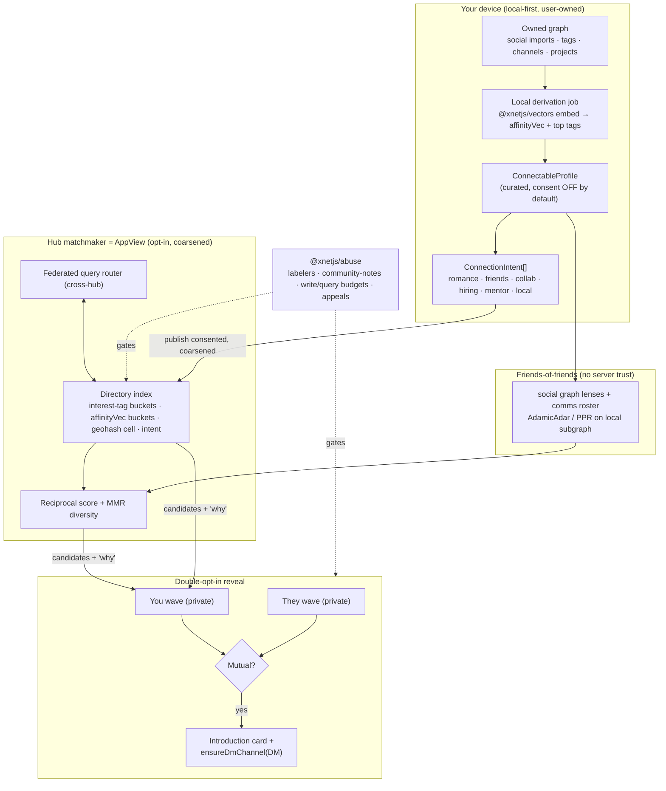
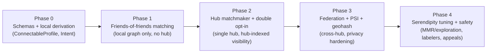
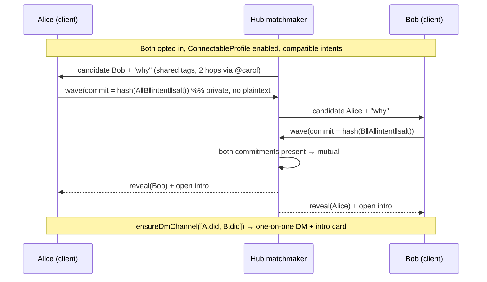

# Generalized People Matching And Connection

> **Status:** Exploration
> **Date:** 2026-06-13
> **Author:** Claude
> **Tags:** people-matching, dating, friend-finding, professional-networking,
> reciprocal-recommendation, federation, discovery, privacy, PSI, double-opt-in,
> serendipity, weak-ties, social-graph, embeddings, hubs, trust-and-safety

## Problem Statement

Most networks make you choose a lane. Tinder is for romance, LinkedIn for jobs,
Reddit for affinity groups, Discord for hanging out, Twitter for the public
performance of self. Each forces you to author a _new_ lossy profile — a bio, a
headline, a few photos — and each, to get value, demands that you **post in
public and engage with strangers' posts** before anyone interesting finds you.

For a shy, one-on-one person that barrier is the whole problem. Some of the best
relationships start as a single thread of overlap — you both care intensely
about the same obscure thing — and become a personal, private, one-on-one
friendship. But to _get_ there on today's platforms you must first broadcast.

This exploration asks: **what would a single, generalized "people-connecting"
primitive look like on xNet** — one that covers romance, friendship,
collaborators-for-a-project, hiring/job-seeking, mentorship, and local-meetup as
_facets of the same mechanism_ — and does it in a **decentralized, federated,
local-first** way that turns xNet's biggest asset (it already holds a rich,
user-owned graph of who you are) into serendipitous, intimate, _low-performance_
introductions?

The thesis worth testing: **xNet should not make you write a dating profile. It
already knows your interests** — your imported social history, the topics you
tag, the projects you run, the channels you sit in, the things you read and
listen to. The product is a consent-gated, reciprocal, double-opt-in _matchmaker_
that derives an honest affinity profile from data you already own, finds the
specific people you'd actually want to meet (including friends-of-friends and
people in adjacent communities), and opens a warm one-on-one channel — **without
asking you to post a single thing in public.**

## Executive Summary

The research is unusually convergent on one architectural law and one product
insight.

**The architectural law — discovery is the index, and the index must be
coherent.** Every decentralized social system that actually works (ATProto,
Nostr, Farcaster, Scuttlebutt, Mastodon) keeps its _data_ distributed but its
_discovery_ concentrated: ATProto's AppView, Farcaster's Hub aggregator,
Nostr's de-facto aggregator relays. The fully-P2P friend-of-friend systems (SSB)
get strong privacy but suffer a fatal cold-start and a tiny discovery radius.
**xNet already has the right shape for this:** the hub is its AppView, the
federated query router (`packages/query/src/federation/router.ts`) is the
missing seam, and `visibilityOptions` already includes a `hub-indexed` tier
(`packages/social/src/schemas/constants.ts:37-42`). Discovery should live in an
**opt-in, consent-gated, federated hub directory** — never a global central
index, never pure gossip.

**The product insight — derive the profile, don't demand it; gate every
contact behind double opt-in.** The reciprocal-recommender literature (RECON,
Xia et al. 2015) shows behavioral/derived signal beats stated preferences, and
that _mutual_ predicted interest (harmonic mean of both directions) is the right
objective. The dating-app post-mortems (Tinder's abandoned ELO, Bumble's
women-first friction, Hinge's Gale-Shapley "Most Compatible") all say the same
thing: ranking by global desirability is both unethical and worse; **structural
constraints on who can initiate contact** matter more than the ranker. xNet's
differentiator is that it can build the match profile _from the graph it already
holds_ and **explain** every introduction ("you overlap deeply on Rust +
worker-runtimes + ambient music, and you're two hops apart via @alice").

**Recommended shape (one primitive, four layers):**

1. **`ConnectableProfile` + `ConnectionIntent`** — an opt-in, intent-scoped
   projection of your owned graph into a curated affinity vector + interest-tag
   set + optional coarse geohash. One person, many intents (`romance`,
   `friends`, `collab:<project>`, `hiring`, `seeking-work`, `mentor`, `local`).
   This is the _only_ new user-facing concept; it generalizes dating →
   LinkedIn → Lunchclub → Meetup into one model.
2. **Local-first derivation** — a local job embeds your interests with the
   existing `@xnetjs/vectors` model (`all-MiniLM-L6-v2`, HNSW) over data you
   already own (social imports, tags, channels, projects). Nothing is shared
   until you review and toggle it on. **Consent is off by default.**
3. **Hub matchmaker (the AppView)** — a federated directory that indexes only
   _consented, coarsened_ signals and runs **reciprocal scoring + graph
   proximity + MMR diversity injection** (for serendipity / weak ties).
   Friends-of-friends are computed locally from existing social graph lenses;
   the hub only adds reach beyond your network.
4. **Double-opt-in reveal** — nobody can message you cold. Each side privately
   "waves"; only on **mutual** interest does an introduction card + DM channel
   open (reusing `ensureDmChannel` / `dmChannelId`). Mutual-interest and
   mutual-friend checks use **private set intersection (PSI)** so the hub never
   learns your full preference or friend list. Safety rides on the existing
   `@xnetjs/abuse` labeler/community-notes/write-budget stack.

This is buildable on seams that already exist. The gaps are concrete: a profile
has no `bio/interests/skills/location`, there is no intent or reveal schema, the
federated router is a stub, and there is no discovery UI. None of them require
new infrastructure — only new schemas and one hub service.

## Current State In The Repository

xNet already ships ~80% of the substrate. The feature is mostly _assembly_, not
greenfield.

### What a "person" is today — two actor models

| Concept            | Schema                                                                         | What it holds                                                                                  | Gap for matching                                             |
| ------------------ | ------------------------------------------------------------------------------ | ---------------------------------------------------------------------------------------------- | ------------------------------------------------------------ |
| **Native self**    | `ProfileSchema` ([profile.ts:17](packages/data/src/schema/schemas/profile.ts)) | `did`, `displayName`, `handle` (0172), `avatar`, `statusEmoji`, `statusMessage`                | No bio, interests, skills, location, intents                 |
| **Imported actor** | `SocialActorSchema` ([actor.ts:16](packages/social/src/schemas/actor.ts))      | `platform`, `actorKind`, `handle`, `displayName`, `privacyClass`, `visibility`, `metadataJson` | Describes _other_ people you've imported; rich but not "you" |

`ProfileSchema` is deliberately minimal — "the human layer on top" of an opaque
DID, with "at most one canonical Profile per DID per workspace". The DID is the
stable identity (`did:key:z6Mk…`, [identity/src/did.ts](packages/identity/src/did.ts));
the handle is a compose-time resolver, not the source of truth. **A
`ConnectableProfile` is the natural third node: a self-authored, intent-scoped,
discoverable projection that points back at your DID.**

### The graph you already own (the differentiator)

The `@xnetjs/social` package imports and indexes a startlingly rich personal
graph from Twitter/X, Reddit, YouTube, Spotify, TikTok, Instagram, OpenAI,
Claude and more ([constants.ts:7-21](packages/social/src/schemas/constants.ts)):

- `SocialActorSchema`, `SocialContentSchema`, `SocialInteractionSchema`
  (follows/likes/saves/mentions), `SocialCollectionSchema` (lists, playlists,
  inferred clusters), `SocialConversationSchema`, `SocialEnrichmentSchema`
  ([enrichment.ts](packages/social/src/schemas/enrichment.ts) — fetched titles,
  descriptions, thumbnails for your saved content).
- **Graph lenses** that already traverse the social graph
  ([graph-lenses.ts](packages/social/src/lenses/graph-lenses.ts)):
  `people-i-follow`, `saved-content-by-creator`, `conversation-references`,
  `ai-citations`, summarized by an atlas ([atlas.ts](packages/social/src/lenses/atlas.ts)).
- **Feeds + enrichment pipeline** ([social/src/feeds](packages/social/src/feeds)),
  folders/tags/hashtag-channels (exploration 0169), and `TagSchema`
  ([tag.ts](packages/data/src/schema/schemas/tag.ts)) as a flat, workspace-wide
  interest vocabulary already attached to Pages, Channels, Tasks, Projects.

This is the "so much information about you" the prompt names. **No other dating
or networking product gets to start from a user-owned, multi-platform interest
graph.** The matching profile can be _derived and explained_, not authored.

### Semantic matching is already in the box

`@xnetjs/vectors` ships a full local pipeline ([vectors/src/index.ts](packages/vectors/src/index.ts)):
`loadEmbeddingModel()` (`Xenova/all-MiniLM-L6-v2`, 384-dim,
[embedding.ts](packages/vectors/src/embedding.ts)), an HNSW index
([hnsw.ts](packages/vectors/src/hnsw.ts)), `SemanticSearch`
([search.ts](packages/vectors/src/search.ts)), `HybridSearch` combining vector +
keyword via reciprocal rank fusion ([hybrid.ts](packages/vectors/src/hybrid.ts)),
and `cosineSimilarity()`. **Profiles can be embedded entirely on-device** — the
affinity vector never has to be computed by a server.

### Discovery, federation, comms, identity, safety

- **Hub = AppView.** `@xnetjs/hub` already instantiates `FederationService`,
  `DiscoveryService`, `ShardRegistry/Router`, `QueryService`, and FTS5 search
  ([hub/src/server.ts](packages/hub/src/server.ts)). A "people directory" is a
  new service alongside these, not a new server.
- **Federated query router is a typed stub.** `createFederatedQueryRouter`
  returns local-only and `routeToRemote` throws "not implemented"
  ([federation/router.ts:36-43](packages/query/src/federation/router.ts)). This
  is _the_ seam to extend for cross-hub people search.
- **Comms is the one-on-one primitive.** `dmChannelId(dids)` derives a
  deterministic channel from sorted DIDs and `ensureDmChannel` opens it without
  duplicate races ([comms/src/chat/dm.ts](packages/comms/src/chat/dm.ts)); the
  app already has one-click DM in `PersonView` and `PersonHovercard`, a
  `/person/$did` route, presence, and a notification inbox (0167/0168).
- **Identity + consent.** DID:key, UCAN sharing/grants
  ([identity/src/sharing](packages/identity/src/sharing)), and share-via-URL
  (0169) give us delegated, revocable, audience-scoped visibility.
- **Trust & safety already exists.** `@xnetjs/abuse` is a full ATProto-Ozone-
  class stack: `labeler-trust`, `community-notes`, `policy-blocks`,
  `classifier-cascade` (local + cloud), `content-fingerprint`,
  `public-write-budget`, `query-cost-budget`, `appeals`, `hub-policy-offer`
  ([packages/abuse/src](packages/abuse/src)). Double-opt-in + write budgets +
  labelers is most of a decentralized-matching safety model already.

### The honest gap list


## External Research

(Full report with citations in **References**; condensed here to the load-bearing
findings.)

### 1. The discovery-centralization law

ATProto keeps data in user-owned PDS repos but **discovery lives in the AppView**
— a PostgreSQL index over the whole firehose; running an alternative AppView
needs Bluesky-scale ops. Nostr's "outbox model" (NIP-65) is the theoretical fix
but it re-centralized onto ~10–15 aggregator relays. Farcaster puts identity
on-chain (Optimism) but discovery still needs a Hub that has the full dataset.
SSB's hop-limited gossip gives real privacy and a **fatal** cold-start. The
lesson, verbatim from the research: _"A decentralized system with centralized
defaults is a centralized system — just with extra latency."_ **For matching,
plan for a coherent (but federated, replaceable, consent-gated) index from day
one.** ATProto's **Feed Generators** are the most directly applicable primitive:
small services that subscribe to a filtered firehose and emit a ranked queue —
exactly a "matchmaker for community X".

### 2. Dating mechanics and their failure modes

- **Tinder's ELO/desirability score** ranked people globally; abandoned because
  it was gameable, stratifying, and _unilateral_ (measures who wants you, not
  mutual fit). Don't build a global desirability rank.
- **Hinge "Most Compatible"** uses **Gale-Shapley stable matching** over
  _predicted mutual_ attraction and weights effortful comments above likes —
  optimizing for relationship outcomes, not engagement.
- **Bumble** shows that **structural friction on who can initiate** (women
  message first) does more for safety/quality than any ranker.
- **OkCupid** match % is reciprocal by construction (your answers × your
  importance weights, geometric mean of both directions) but has a brutal
  cold-start (you must answer many questions first).
- **Marketplace pathologies** (Bruch & Newman, _Science Advances_ 2018):
  desirability is steeply hierarchical, everyone "reaches up", a power-law of
  attention concentrates on a few profiles. **Reciprocal objectives and
  diversity injection mitigate this; global ranking amplifies it.**

### 3. Cold-start & affinity bootstrapping

Strongest bootstraps: **interest-taxonomy onboarding** (Reddit's thousands of
subreddits; Letterboxd/Goodreads taste ratings), **explicit goals**
(Lunchclub's AI 1:1 professional matchmaking + post-meeting feedback flywheel;
85% satisfaction), **social-graph seeding** (Coffee Meets Bagel's friends-of-
friends — claims +40% successful connections from mutual friends), and
**activity-based** matching (Polywork: match on what you _do_, not your title).
**xNet's imported graph is a pre-built taste + activity signal — it sidesteps
the worst of cold-start.**

### 4. Matching algorithms

- **Reciprocal recommenders (RRS):** maximize `P(A likes B) × P(B likes A)`;
  use **harmonic mean** so a 90/10 split scores below a 50/50 (RECON, Pizzato
  2010; Xia et al. 2015 — CF beats content-based once behavior exists).
- **Content-based** (SBERT/MiniLM cosine over bios/interests) solves _content_
  cold-start — embed a new profile instantly. xNet has this locally.
- **Graph link-prediction:** Common Neighbors, **Adamic-Adar** (down-weights
  popular common neighbors), Jaccard, **Personalized PageRank** (multi-hop, runs
  on the _local_ subgraph — no global index needed → perfect for friend-of-
  friend).
- **Gale-Shapley** for stable assignment inside a bounded community/cohort.
- **Layer them:** content-based for cold-start → reciprocal harmonic scoring →
  graph proximity boost → MMR diversity for serendipity.

### 5. Privacy-preserving matching

- **PSI (private set intersection):** "what do we have in common without
  revealing the rest" — OPRF-based PSI scales (Signal uses it); PIR-PSI (Chase
  & Miao, PETS 2018) scales to hundreds of millions. Use for **mutual interest
  tags** and **mutual friends**.
- **Double-opt-in reveal:** commit-then-reveal; neither side is exposed before
  the other responds. The cryptographic form of Tinder's core mechanic.
- **k-anonymity** for discovery (your geohash cell / interest query is
  indistinguishable among ≥k users); Signal's lesson is that at scale **TEEs
  (SGX) often stand in for pure-MPC** PSI — an option if a hub does server-side
  matching.

### 6. Serendipity & weak ties

Granovetter's _Strength of Weak Ties_ (1973) and its causal confirmation
(Rajkumar et al., _Science_ 2022, on LinkedIn) show **bridging weak ties carry
the most novel value** — the acquaintance who connects two clusters, not the
close friend inside one. Pure similarity matching rebuilds echo chambers
(Pariser's filter bubble). Fixes: **MMR re-ranking**, **Thompson sampling /
UCB** for exploration, and the heuristic _"overlapping core interest + different
community"_ — enough common ground to connect, enough difference to surprise.

### 7. Trust & safety (harder when decentralized)

No central authority to ban, trivial new identities → **Sybil resistance**
matters. Tools: proof-of-personhood (biometric/World ID — controversial; social
vouching — Proof of Humanity; cost-based — Farcaster on-chain reg),
**web-of-trust propagation** (SybilGuard/SybilLimit exploit the narrow cut to a
Sybil region; Nostr NIP-85 trust scores; EigenTrust / personalized PageRank),
**shared blocklists** (Fediseer, ATProto Ozone labelers — _which xNet's `abuse`
package already mirrors_), and **double opt-in as the non-negotiable first-
contact barrier**. Age/consent via **verifiable credentials + ZK age proofs**.

### 8. Geography

**Geohash prefix matching** (5 chars ≈ 5 km cell) + **k-anonymous dummy cells**
(GLPS) + **PSI on geohash prefixes** gives "nearby" without exact location.
Beware the **walk-test triangulation** attack → rate-limit proximity queries.
Meetup's lesson: **interest × location beats either alone** ("Rust devs in
Chicago" is tractable; "Rust devs anywhere" or "people near me" are not).
Nextdoor's verified-address model maps to a **VC asserting a coarse geohash**.

## Key Findings

1. **xNet is unusually well-suited to this** precisely because the hard part of
   every other product — getting honest, rich signal about a person — is already
   solved by the social-import graph + local embeddings. The match profile is a
   _projection_, not a questionnaire.
2. **One primitive covers the whole range.** Romance, friendship, collaborators,
   hiring, mentorship, and local meetups differ only by **intent + audience +
   in-person-ness**, not by mechanism. Build `ConnectionIntent`, not six apps.
3. **Discovery must be a coherent, opt-in, federated hub index.** Pure P2P
   gossip can serve friends-of-friends locally but cannot serve "find your
   affinity group in the wild". The hub is xNet's AppView; the federated router
   is the seam.
4. **Double opt-in is the safety keystone**, and it directly serves the shy,
   one-on-one user: **no public posting, no cold messages, no performance** —
   you privately wave, and only mutual interest opens a private channel.
5. **Explainable, derived matches are the moat.** "Why you're being introduced"
   cards (shared interests + graph path + provenance) are more honest and more
   serendipitous than a Tinder bio or a LinkedIn headline — and they let a shy
   person open with something real instead of a cold "hey".
6. **Serendipity must be engineered**, not assumed. Default to MMR/exploration
   so the system surfaces bridging weak ties, not just your nearest twins.
7. **Consent is off by default and per-intent.** Being "connectable for project
   collaborators" must not expose you as "connectable for romance". Visibility
   already has the right tiers (`private/friends/public/hub-indexed`).
8. **Safety infra largely exists.** `@xnetjs/abuse` (labelers, community notes,
   write/query budgets, fingerprinting, appeals) + UCAN grants + double opt-in
   is a credible decentralized-matching trust model on day one.

## Options And Tradeoffs

### A. Where does discovery live?

| Option                                                 | How                                                                                           | Pros                                                                                                   | Cons                                                                                    | Verdict                                       |
| ------------------------------------------------------ | --------------------------------------------------------------------------------------------- | ------------------------------------------------------------------------------------------------------ | --------------------------------------------------------------------------------------- | --------------------------------------------- |
| **A1. Pure P2P / friend-of-friend gossip** (SSB-style) | Traverse local social-graph lenses + comms roster; libp2p DHT rendezvous on interest topics   | Max privacy; no central index; serendipity within network                                              | Fatal cold-start; radius = your existing graph; can't "find affinity group in the wild" | **Use for the friends-of-friends layer only** |
| **A2. Hub matchmaker = AppView** (ATProto-style)       | Opt-in publish coarsened `ConnectableProfile` to a hub directory; hubs federate match queries | Real discovery beyond your network; replaceable/forkable; consent-gated; reuses hub + federation seams | The index is a (federated) concentration point; needs an operator                       | **Recommended primary**                       |
| **A3. Global central index**                           | One xNet-run directory of everyone                                                            | Best recall, simplest matching                                                                         | Against xNet ethos; honeypot; single gatekeeper                                         | **Reject**                                    |

Recommended: **A1 + A2 hybrid.** Local graph answers "people near me in the
graph" with zero server trust; the hub adds reach. A hub is also the natural
**local community** boundary (the prompt's "plug into a local community"), and
**hashtag-channels** (0169) are the natural **affinity group** ("find your group
in the wild").

### B. How is the match profile built?

| Option                                      | How                                                                                                                                                       | Pros                                                                            | Cons                                                                               | Verdict                 |
| ------------------------------------------- | --------------------------------------------------------------------------------------------------------------------------------------------------------- | ------------------------------------------------------------------------------- | ---------------------------------------------------------------------------------- | ----------------------- |
| **B1. Manual profile**                      | User writes bio/interests (Tinder/LinkedIn)                                                                                                               | Simple; explicit consent                                                        | Low signal; performative; cold-start; the barrier we're trying to remove           | Support as fallback     |
| **B2. Derived affinity vector**             | Local job embeds your owned graph (social imports + tags + channels + projects) → vector + top-K interest tags; **user reviews & curates** before sharing | High signal; honest; explainable; near-zero authoring effort; **the xNet moat** | Must nail consent + editability; risk of surfacing things you didn't mean to share | **Recommended**         |
| **B3. Behavioral CF over hub interactions** | Learn from who waves at whom across the network                                                                                                           | Strongest once at scale (Xia et al.)                                            | Needs scale; central observation of behavior; privacy cost                         | **Defer** to post-scale |

Recommended: **B2 primary, B1 fallback, B3 later.** The derivation is local; the
user curates; consent is explicit and per-intent.

### C. Matching algorithm

Layered, computed mostly client-side over a candidate set the hub returns:

```
score(me, you | intent) =
      w_c · cosine(affinityVec_me, affinityVec_you)         // content / cold-start
    + w_r · reciprocal(harmonic(P(I→you), P(you→I)))        // mutual fit
    + w_g · graphProximity(me, you)   // AdamicAdar / PPR over local social graph
    + w_x · explorationBonus(uncertainty)                    // Thompson / UCB
  then MMR-rerank for intra-list diversity (serendipity / weak ties)
```

Reciprocal terms use the **harmonic mean** (penalizes asymmetry); graph
proximity runs on the **local** subgraph (no global index); MMR + exploration
inject **bridging weak ties** so the feed isn't an echo chamber.

### D. Contact gating (safety)

| Option                                              | Pros                                        | Cons                                 | Verdict                   |
| --------------------------------------------------- | ------------------------------------------- | ------------------------------------ | ------------------------- |
| Open DM (anyone messages anyone)                    | Frictionless                                | Harassment; the cold-message problem | **Reject**                |
| **Double opt-in wave → mutual reveal**              | No cold contact; serves shy users; standard | Slightly slower to first contact     | **Required**              |
| Double opt-in **+ PSI** for mutual interest/friends | Hub never sees full preference/friend lists | More crypto complexity               | **Recommended (phase 2)** |

### E. Geography

Optional **coarse geohash cell** on `ConnectableProfile`; intents flagged
`in-person` require proximity (PSI on geohash prefix + k-anonymous cells),
`remote` intents ignore it. Rate-limit proximity queries (walk-test defense).

## Recommendation

Build **one primitive — the Connectable Profile + Connection Intent — surfaced
through a consent-gated, federated hub matchmaker, with every introduction gated
by a double-opt-in reveal and explained by shared interests + graph path.**



### Why this fits xNet specifically

- It **monetizes the data you already own** as connection, not ads.
- It is **decentralized where it can be** (data + friends-of-friends + curation
  local; index federated and forkable) and **coherent where it must be**
  (discovery), exactly per the research.
- It **removes the posting barrier** the prompt cares about: a shy, one-on-one
  person opts into a derived profile, receives a few explained candidates, waves
  privately, and only ever talks one-on-one after mutual interest. No feed, no
  audience, no performance.
- It **reuses almost everything**: profile, social graph, vectors, hub services,
  comms, identity/grants, abuse. The net-new is ~3 schemas + 1 hub service + 1
  UI surface + (phase 2) PSI.

### Phasing



Phase 1 is shippable **with zero new infrastructure** — it matches you against
people already reachable in your owned social/comms graph and explains why. That
alone is a differentiated friend-finder and a safe place to validate the UX
before any hub indexing exists.

## Example Code

### New schemas (`packages/social/src/schemas/connect.ts`)

```typescript
import type { InferNode } from '@xnetjs/data'
import { checkbox, defineSchema, number, person, relation, select, text } from '@xnetjs/data'
import { SOCIAL_NAMESPACE, visibilityOptions } from './constants'

/** What kind of connection you're open to. One person → many intents. */
export const connectionIntentKinds = [
  { id: 'romance', name: 'Romance' },
  { id: 'friends', name: 'Friendship' },
  { id: 'collab', name: 'Project collaborators' },
  { id: 'hiring', name: 'Hiring' },
  { id: 'seeking-work', name: 'Seeking work' },
  { id: 'mentor', name: 'Mentorship' },
  { id: 'local', name: 'Local meetup' }
] as const

export const intentReach = [
  { id: 'friends-of-friends', name: 'Friends of friends' },
  { id: 'hub', name: 'This community (hub)' },
  { id: 'public', name: 'Open / federated' }
] as const

/**
 * An opt-in, intent-scoped projection of your owned graph into something
 * discoverable. The DID stays the source of truth; this is the matchable layer.
 * Consent is OFF until `enabled` is set and `visibility` is raised past private.
 */
export const ConnectableProfileSchema = defineSchema({
  name: 'ConnectableProfile',
  namespace: SOCIAL_NAMESPACE,
  properties: {
    did: person({ required: true }),
    headline: text({ maxLength: 140 }),
    /** Free-form, user-curated — seeded by derivation but always editable. */
    about: text({ maxLength: 2000 }),
    /** Top-K interest tags (TagSchema relations) derived from your graph. */
    interests: relation({ multiple: true }),
    /** 384-dim affinity vector (base64) computed locally via @xnetjs/vectors. */
    affinityVector: text({ maxLength: 4000 }),
    /** Coarse geohash cell (5 chars ≈ 5km); only used by `in-person` intents. */
    geohashCell: text({ maxLength: 12 }),
    enabled: checkbox({ default: false }),
    visibility: select({ options: visibilityOptions, required: true, default: 'private' }),
    /** Provenance: which sources fed the derivation, for the 'why' card + audit. */
    derivedFromJson: text({ maxLength: 8000 })
  },
  document: undefined
})

export const ConnectionIntentSchema = defineSchema({
  name: 'ConnectionIntent',
  namespace: SOCIAL_NAMESPACE,
  properties: {
    profile: relation({ required: true }), // → ConnectableProfile
    kind: select({ options: connectionIntentKinds, required: true }),
    reach: select({ options: intentReach, required: true, default: 'friends-of-friends' }),
    inPerson: checkbox({ default: false }),
    note: text({ maxLength: 280 }), // "looking for a co-founder for a worker-runtime idea"
    active: checkbox({ default: true })
  },
  document: undefined
})

/**
 * A private "wave". Stored locally + (for reach beyond your graph) as a
 * commitment at the hub. Reveal only happens when BOTH sides have waved within
 * compatible intents — see matchReveal().
 */
export const ConnectionWaveSchema = defineSchema({
  name: 'ConnectionWave',
  namespace: SOCIAL_NAMESPACE,
  properties: {
    fromDid: person({ required: true }),
    toDid: person({ required: true }),
    intentKind: select({ options: connectionIntentKinds, required: true }),
    /** hash(fromDid || toDid || intent || salt) — commitment, not plaintext. */
    commitment: text({ required: true, maxLength: 128 }),
    revealed: checkbox({ default: false })
  },
  document: undefined
})

export type ConnectableProfile = InferNode<(typeof ConnectableProfileSchema)['_properties']>
export type ConnectionIntent = InferNode<(typeof ConnectionIntentSchema)['_properties']>
export type ConnectionWave = InferNode<(typeof ConnectionWaveSchema)['_properties']>
```

### Local derivation (on-device, nothing shared)

```typescript
import { SemanticSearch, cosineSimilarity } from '@xnetjs/vectors'

/**
 * Build an affinity profile from data you already own. Runs on-device; the
 * output is a DRAFT the user reviews before `enabled` is ever flipped on.
 */
export async function deriveAffinity(store: NodeStore, did: DID) {
  // 1. Gather owned signal: imported social actors/content/interactions,
  //    your tags, the channels you're in, your projects.
  const tags = await topInterestTags(store, did) // ranked TagSchema
  const saved = await savedContentTitles(store, did) // SocialEnrichment titles
  const projects = await projectBriefs(store, did)

  // 2. Synthesize an honest "interest text" and embed it locally.
  const interestText = [tags.map((t) => t.name).join(', '), ...saved, ...projects].join('\n')
  const search = new SemanticSearch({ modelName: 'Xenova/all-MiniLM-L6-v2' })
  const affinityVector = await search.embed(interestText) // 384-dim, on-device

  return {
    headline: '', // user fills
    interests: tags.slice(0, 12),
    affinityVector: encodeVec(affinityVector),
    derivedFrom: { tags: tags.length, saved: saved.length, projects: projects.length }
  }
}

/** Reciprocal compatibility — harmonic mean penalizes one-sided interest. */
export function reciprocalScore(aToB: number, bToA: number): number {
  if (aToB <= 0 || bToA <= 0) return 0
  return (2 * aToB * bToA) / (aToB + bToA)
}
```

### Double-opt-in reveal flow



```typescript
import { ensureDmChannel } from '@xnetjs/comms'

/** Called by the hub when both waves are present (or P2P for friends-of-friends). */
export async function matchReveal(store, a: DID, b: DID, intent: string) {
  const channel = await ensureDmChannel(store, [a, b]) // deterministic dmChannelId
  await postIntroCard(store, channel.id, {
    intent,
    sharedInterests: await mutualInterestTags(a, b), // PSI in phase 3
    graphPath: await shortestSocialPath(a, b), // "2 hops via @carol"
    opener: 'You both go deep on worker-runtimes and ambient music.'
  })
  return channel
}
```

### Extending the federated router (the stubbed seam)

```typescript
// packages/query/src/federation/router.ts — fill in the TODO at line 36
async findSources(query: Query): Promise<DataSource[]> {
  const sources: DataSource[] = [{ type: 'local', id: 'local', estimatedLatency: 0 }]
  if (query.kind === 'people-match') {
    for (const peerHub of await this.directoryPeers()) {
      sources.push({ type: 'hub', id: peerHub.id, estimatedLatency: peerHub.rtt })
    }
  }
  return sources
}
```

### React surface

```tsx
function DiscoverPeople({ intent }: { intent: ConnectionIntentKind }) {
  const { candidates } = useMatchmaker(intent) // local graph + hub, merged
  const { wave } = useConnect()
  return candidates.map((c) => (
    <MatchCard key={c.did} profile={c.profile} why={c.why /* shared tags + path */}>
      <button onClick={() => wave(c.did, intent)}>Wave 👋</button>
    </MatchCard>
  ))
}
```

## Risks And Open Questions

- **Consent leakage / context collapse.** The derivation must never surface a
  romance signal into a hiring context, or expose private imports. Mitigation:
  consent off by default, per-intent visibility, an explicit review step, and a
  `derivedFromJson` provenance trail the user can audit and prune.
- **The index is still a concentration point.** Even opt-in and coarsened, a hub
  directory is a juicy target. Mitigation: store only buckets (tag sets, vector
  buckets, geohash cells), not raw vectors/preferences; PSI for the sensitive
  intersections; make the index forkable/replaceable (ATProto's unmet promise —
  we should actually deliver multi-operator directories).
- **Sybil / catfishing.** DID:key is free to mint. Mitigation: hub membership +
  `@xnetjs/abuse` write-budgets as soft proof-of-personhood, web-of-trust
  vouching, optional VC attestations (phone/ID/age), labeler trust scores.
- **Cold-start at the network level.** A new hub has nobody. Mitigation: Phase 1
  works purely on your _existing_ owned graph (friends-of-friends) — value
  before any directory exists; seed hubs around existing channels/communities.
- **Romance-specific harms** (harassment, safety, minors). Double opt-in is
  necessary but not sufficient. Open question: do we ship romance intent at all
  in v1, or start with the lower-risk professional/collaboration/friendship
  intents and add romance only once safety (age VC, reporting, blocklists) is
  proven? **Recommendation: defer `romance` to a later, safety-gated phase.**
- **Embedding quality.** `all-MiniLM-L6-v2` (384-dim) is small; is it enough to
  separate "likes jazz" from "studies jazz history professionally"? Open
  question: do we need a larger/optional model or fine-tuning on match outcomes?
- **Federation trust.** Cross-hub matching means trusting another operator's
  index and moderation. Mitigation: `hub-policy-offer` + labeler-trust to decide
  which directories to federate with; user controls their `reach`.
- **Walk-test location triangulation.** Repeated proximity queries can localize
  someone. Mitigation: rate-limit, k-anonymous cells, commitment to querier
  location.
- **Gamification creep.** The moment this gets swipe streaks and notifications it
  becomes the thing we're reacting against. Open question: how do we measure
  _connection quality_ (Lunchclub-style post-intro feedback) instead of
  engagement, and bake that into ranking?

## Implementation Checklist

### Phase 0 — Schemas + local derivation

- [x] Add `ConnectableProfileSchema`, `ConnectionIntentSchema`,
      `ConnectionWaveSchema` in `packages/social/src/schemas/connect.ts`; export
      from `schemas/index.ts`.
- [x] Add `connectionIntentKinds`, `intentReach` to `schemas/constants.ts`.
- [x] Implement `deriveAffinity()` over social imports + tags + channels +
      projects using `@xnetjs/vectors`; output a reviewable draft.
- [x] Add `reciprocalScore()` (harmonic mean) and `encodeVec/decodeVec` helpers.
- [x] Profile editor UI: review/curate derived interests, set headline/about,
      toggle `enabled`, pick per-intent `visibility` + `reach`.

### Phase 1 — Friends-of-friends matching (no hub)

- [x] New graph lens / traversal: candidates from `people-i-follow` + comms
      roster + grant graph, scored by Adamic-Adar / personalized PageRank on the
      local subgraph.
- [x] Local match scorer: `w_c·cosine + w_g·graphProximity` + MMR re-rank.
- [x] "Why you matched" card: shared interest tags + shortest social path.
- [x] `/discover` route + `MatchCard` + `useMatchmaker` (local-only) +
      `useConnect().wave`.
- [x] Wire `matchReveal()` → `ensureDmChannel` + intro card on mutual wave.

### Phase 2 — Hub matchmaker + double opt-in

- [ ] Hub `DirectoryService` alongside `DiscoveryService`: index coarsened
      `ConnectableProfile` (tag buckets, vector buckets, geohash, intent) for
      `hub-indexed` visibility only.
- [ ] Opt-in publish pipeline (consent-gated) from client → hub directory.
- [x] Reciprocal scoring + MMR + exploration bonus on the hub candidate set.
- [ ] Server-side double-opt-in: store commitments, reveal only on mutual.
- [ ] Rate limits + write budgets via `@xnetjs/abuse` `public-write-budget`.

### Phase 3 — Federation + PSI + geohash

- [x] Implement `findSources`/`routeToRemote` in
      `packages/query/src/federation/router.ts` for `people-match` queries.
- [x] Cross-hub candidate merge + dedupe; `reach` controls federation scope.
- [x] PSI for mutual interest tags and mutual friends (OPRF-based).
- [x] Geohash proximity for `in-person` intents (k-anonymous cells, query rate
      limit).

### Phase 4 — Serendipity + safety

- [ ] Thompson sampling / UCB exploration; tune MMR λ for weak-tie bridging.
- [ ] Labeler + community-notes integration; shared blocklists; appeals.
- [ ] Post-intro feedback loop (Lunchclub-style) feeding ranking quality.
- [ ] Optional VC attestations (phone/ID/age); ZK age proof for any romance
      intent; revisit whether/when to ship `romance`.

## Validation Checklist

- [ ] A user with imported social data gets a _useful, honest_ derived profile
      they recognize as themselves — with **zero** free-text authoring required.
- [x] Nothing is discoverable until the user explicitly enables an intent and
      raises visibility; flipping it off removes them from all indexes.
- [x] Phase 1 surfaces real friends-of-friends with a correct "why" (shared
      tags + accurate hop path) using only the local graph (no network calls).
- [x] No one can DM you without a **mutual** wave; a single-sided wave reveals
      nothing to either party.
- [x] Per-intent isolation holds: a `collab` listing never exposes a `romance`
      signal, verified by test.
- [ ] Hub directory stores only coarsened buckets — an audit of the index shows
      no raw affinity vectors or full preference/friend lists.
- [x] Cross-hub query returns candidates from a second hub and respects `reach`.
- [x] PSI mutual-interest test: hub log shows no plaintext interest sets;
      intersection result matches a local ground-truth computation.
- [x] Diversity check: the candidate feed includes bridging weak ties (different
      community, overlapping interest), not only nearest-neighbor twins.
- [ ] Safety: a write-budget-throttled spammer cannot mass-wave; a labeler-
      flagged actor is filtered from candidate sets; reveals respect blocklists.
- [x] `pnpm test`, `pnpm typecheck`, `pnpm lint` green across `social`, `query`,
      `hub`, `comms`, `vectors`, and the web app.

## References

### xNet code seams

- `packages/data/src/schema/schemas/profile.ts` — `ProfileSchema` (native self)
- `packages/social/src/schemas/actor.ts` — `SocialActorSchema` (imported actors)
- `packages/social/src/schemas/constants.ts` — platforms, `visibilityOptions`
  (incl. `hub-indexed`), `actorKinds`
- `packages/social/src/schemas/enrichment.ts` — fetched content metadata
- `packages/social/src/lenses/graph-lenses.ts`, `atlas.ts` — social graph lenses
- `packages/vectors/src/{index,embedding,search,hybrid,hnsw}.ts` — local
  embeddings, HNSW, semantic + hybrid search
- `packages/query/src/federation/router.ts` — stubbed federated query router
- `packages/hub/src/server.ts` — `FederationService`, `DiscoveryService`,
  `ShardRegistry/Router`, FTS5
- `packages/comms/src/chat/dm.ts` — `dmChannelId`, `ensureDmChannel`
- `packages/identity/src/{did.ts,sharing/}` — DID:key, UCAN grants
- `packages/abuse/src/*` — labelers, community-notes, write/query budgets,
  fingerprinting, appeals (the Ozone analog)
- Prior explorations: 0167/0168 (chat/inbox), 0169 (folders/tags/channels,
  share-via-url), 0170 (feeds, typeahead), 0172 (handles, mention linking)

### Decentralized social prior art

- [AT Protocol docs](https://docs.bsky.app/docs/advanced-guides/atproto) ·
  [ATProto 2024 roadmap](https://atproto.com/blog/2024-protocol-roadmap) ·
  [Stackable moderation](https://bsky.social/about/blog/03-12-2024-stackable-moderation) ·
  [Ozone](https://github.com/bluesky-social/ozone)
- [Nostr](https://en.wikipedia.org/wiki/Nostr) ·
  [Nostr is centralizing by design](https://leonacosta.medium.com/nostr-is-centralizing-by-design-da67b8f53966) ·
  [NIP-101 trust](https://github.com/papiche/NIP-101)
- [Farcaster explained](https://decrypt.co/resources/farcaster-explained-the-blockchain-powered-decentralized-social-media-protocol)
- [Scuttlebutt protocol guide](https://ssbc.github.io/scuttlebutt-protocol-guide/) ·
  [An off-grid social network — Staltz](https://staltz.com/an-off-grid-social-network.html)
- [Progress on ATProto values — Newbold](https://bnewbold.net/2024/atproto_progress/)

### Dating / matching mechanics & algorithms

- [Reciprocal Recommendation for Online Dating — Xia et al. 2015 (arXiv:1501.06247)](https://arxiv.org/pdf/1501.06247)
- [Photos Are All You Need for Reciprocal Recommendation (arXiv:2108.11714)](https://arxiv.org/pdf/2108.11714)
- [Recommending People to People — UMUAI 2013](https://dl.acm.org/doi/10.1007/s11257-012-9125-0)
- [Community-Based Recommendation for Cold-Start in Reciprocal Dating — Springer 2018](https://link.springer.com/chapter/10.1007/978-3-319-78196-9_10)
- [The Link Prediction Problem for Social Networks — Liben-Nowell & Kleinberg](https://www.cs.cornell.edu/home/kleinber/link-pred.pdf)
- [How dating app algorithms work — DataField](https://datafield.dev/blog/dating-app-algorithms.html) ·
  [Hinge / Gizmodo](https://gizmodo.com/hinge-dating-app-algorithm-1850744140) ·
  [OkCupid math — AMS](https://blogs.ams.org/mathgradblog/2016/06/08/okcupid-math-online-dating/)
- [Lunchclub how it works](https://canvasbusinessmodel.com/blogs/how-it-works/lunchclub-how-it-works)

### Privacy-preserving matching

- [Signal: the difficulty of private contact discovery](https://signal.org/blog/contact-discovery/)
- [PIR-PSI: scaling private contact discovery — Chase & Miao, PETS 2018](https://eprint.iacr.org/2018/579.pdf)
- [Privacy-preserving multi-party search via HE — IACR 2024](https://eprint.iacr.org/2024/1800.pdf)

### Serendipity, weak ties, trust & geography

- [The Strength of Weak Ties — Granovetter 1973](https://snap.stanford.edu/class/cs224w-readings/granovetter73weakties.pdf)
- [A causal test of the strength of weak ties — Rajkumar et al., Science 2022](https://www.science.org/doi/10.1126/science.abl4476)
- [Sybil resistance in PoP protocols (arXiv:2008.05300)](https://arxiv.org/pdf/2008.05300)
- [Understanding community-level blocklists in decentralized social media (arXiv:2506.05522)](https://arxiv.org/pdf/2506.05522)
- [GLPS: geohash-based location privacy — PMC](https://pmc.ncbi.nlm.nih.gov/articles/PMC10743103/)
