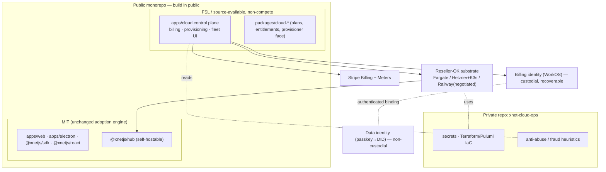
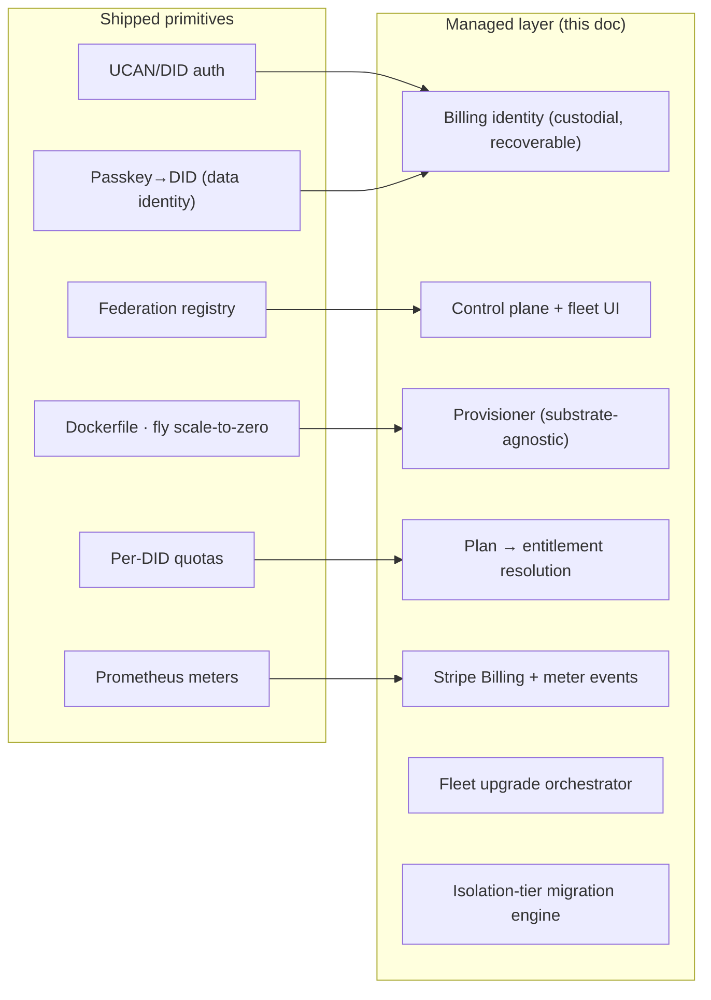
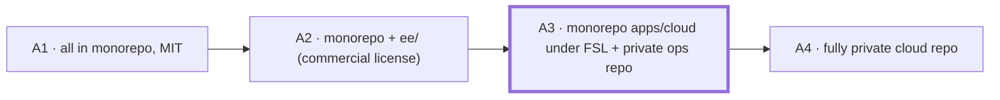
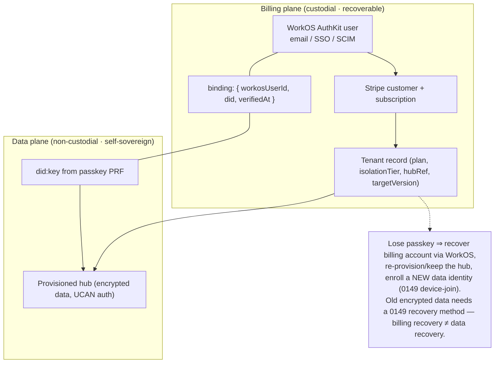
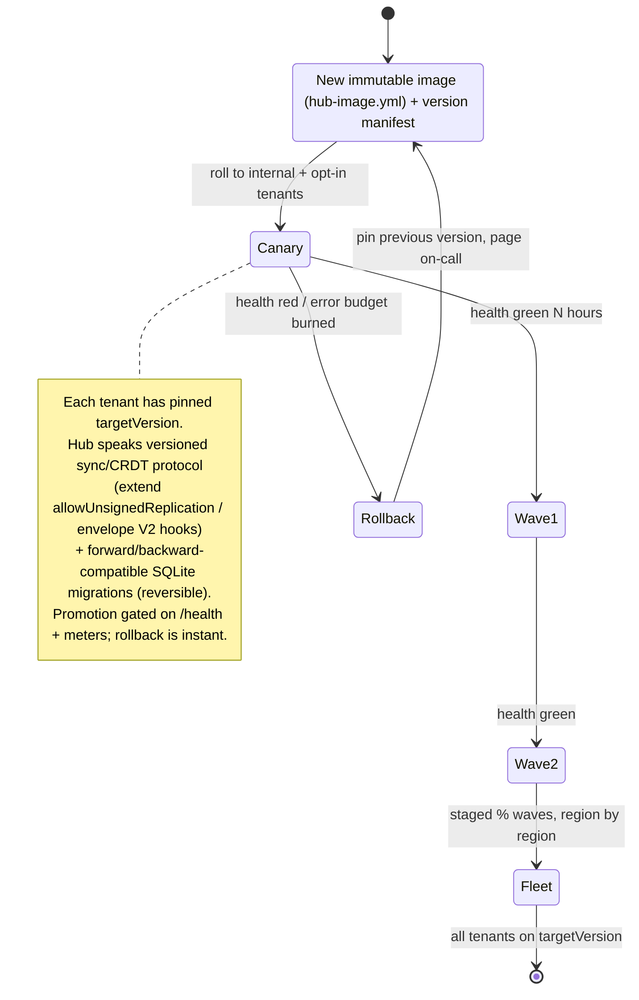
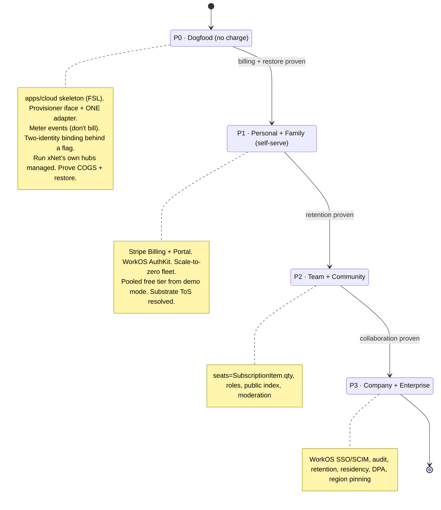

# Managed Hosting As Open Core In The Public Monorepo

> **Status:** Exploration
> **Date:** 2026-06-13
> **Author:** Claude
> **Tags:** hosting, managed-cloud, open-core, build-in-public, monorepo, licensing,
> stripe, billing, workos, identity, account-recovery, railway, fly, fargate,
> multi-tenant, isolation, provisioning, fleet-upgrades, versioning, saas

## Problem Statement

xNet already lets anyone self-host a hub: a one-click [Railway template](https://railway.app/template/xnet-hub),
a [`Dockerfile`](../../packages/hub/Dockerfile), a [`fly.toml`](../../packages/hub/fly.toml),
a [`systemd` unit](../../packages/hub/systemd/xnet-hub.service), and a live demo node at
`hub.xnet.fyi`. The question this exploration asks is narrower and more operational than the
existing hosting docs:

> If we turn that into a **paid, managed** hosting service — you click a button, pay us through
> Stripe, and we provision/operate/upgrade an isolated hub for you on infrastructure we pay for
> and mark up — **should the code for that service live inside the public open-source monorepo,
> built in public?** And if so, where exactly does it sit, what license governs it, how do we
> handle identity and account recovery, and how do we run the fleet cheaply, privately, and with
> automatic backwards-compatible upgrades?

The prompt bundles seven concrete sub-questions:

1. **Build-in-public placement.** What are the trade-offs of putting the commercial control plane
   (billing, provisioning, the management UI) in the same public repo as the MIT-licensed core?
2. **Managed Railway + Stripe.** A UI on top of what self-hosters do today: we pay the Railway bill,
   bill the customer via Stripe with a margin. Is that even allowed?
3. **Identity: ours vs. a standard provider.** Keep using xNet's own passkey/DID identity, or adopt
   something like **WorkOS** for the paid account so we get enterprise primitives (SSO/SCIM) *and*
   real account recovery — so even if the cryptographic identity breaks, you can still recover your
   **paid account**.
4. **Plan tiers and rollout.** personal → family → community → company → enterprise. How do these
   roll out, and how does upgrading work?
5. **Easy capacity upgrades.** Bump storage or concurrent users without pain, while we keep our
   **Railway bill as small as possible**.
6. **Isolation.** Genuinely private hosting — isolate each customer's hub from every other
   customer's hub.
7. **Automatic, backwards-compatible upgrades.** As we ship changes, hubs upgrade themselves while
   preserving compatibility and data — versioning baked in.

This is deliberately the *packaging and operations* companion to three existing explorations, not a
re-run of them:

- [`0147_FUTURE_PAID_HUB_HOSTING`](./0147_[_]_FUTURE_PAID_HUB_HOSTING.md) — the **product/pricing**
  shape (tiers, ARR model, GTM). We reuse its tier ladder rather than re-deriving it.
- [`0149_IDENTITY_AND_ACCOUNT_RECOVERY`](./0149_[_]_IDENTITY_AND_ACCOUNT_RECOVERY.md) — the
  **data-plane account/device ledger**. We layer a *billing identity* on top of it.
- [`0173_COMMUNITY_OWNED_DECENTRALIZED_CLOUD_INFRASTRUCTURE`](./0173_[_]_COMMUNITY_OWNED_DECENTRALIZED_CLOUD_INFRASTRUCTURE.md)
  — the **far-future operator network** (Storj/IXP/MVNO). This doc is the *near-term, we-run-it-all*
  managed service that comes first and funds that future.

## Executive Summary

**Yes, build it in public — but draw three boundaries, not one.** The monorepo should hold the
control plane *as source*, while a small private surface holds the things that are dangerous or
useless to publish (secrets, production IaC, anti-abuse heuristics). Concretely:

1. **Placement & license.** Keep the client/SDK/hub **MIT** (unchanged — it's the adoption engine).
   Add an `apps/cloud/` control plane and `packages/cloud-*` libraries to the monorepo under a
   **source-available, non-compete license (FSL-1.1 / "Fair Source")** — the model Sentry uses
   (`getsentry/sentry` public under FSL, `getsentry/getsentry` private). Keep a **private
   `xnet-cloud-ops` repo** for secrets, Terraform/Pulumi, and fraud rules. This gets the trust,
   recruiting, and auditability benefits of building in public without publishing your enterprise
   roadmap or a revenue-theft attack surface. The cautionary tale is fresh: **Cal.com closed its
   source-available `ee/` in April 2026**, citing AI-assisted vulnerability discovery on public
   code — so be deliberate about what is *source-available* vs *truly private*.

2. **Two identities, deliberately split.** Keep xNet's **self-sovereign passkey→DID** as the
   **data identity** (non-custodial; lose the keys and the *encrypted data* may be unrecoverable, by
   design — that's the privacy guarantee). Add a **custodial, recoverable billing identity** (email
   / SSO via **WorkOS AuthKit**) that owns the *subscription and the provisioned hub*. The link is a
   single authenticated binding record. This is exactly the prompt's instinct: **even if the
   cryptographic identity has problems, you can still recover your paid account, your hub, and your
   plan.** Prior art is everywhere — Proton account vs. encryption keys, Signal PIN vs. message
   keys, Apple ID vs. FileVault recovery key, Web3Auth's social-login-backed non-custodial keys.

3. **Stripe Billing, not Connect.** You are the sole seller reselling your *own* managed product, so
   **Stripe Connect is unnecessary**. Use Stripe **Billing** (a Product per tier, monthly+annual
   Prices, per-seat `SubscriptionItem` quantities) plus **Billing Meters** for storage/seat/egress
   overage. Use the **Customer Portal** for the easy 80% and **custom API flows** for metered or
   multi-item changes (the Portal can't do those).

4. **The Railway reselling landmine.** **Railway's Acceptable Use Policy explicitly prohibits
   "reselling compute resources," and Fly.io's ToS §1.4 bars using the service "for the benefit of a
   third party."** The plan as literally described ("manage the Railway fees and bill you") is a ToS
   violation on both. Two clean ways out: **(a)** sign an enterprise/partner agreement with Railway
   that permits it; or **(b)** run the managed fleet on a **reseller-permitted substrate** —
   **AWS Fargate** (ISV/SaaS is the intended use) or **Hetzner + K3s/Nomad** (cheapest at scale).
   Frame the product correctly either way: you sell *a managed xNet hub*, whose COGS happens to be
   infra — you are not reselling raw compute. Keep self-host-on-Railway as the always-free escape
   hatch.

5. **Isolation as a tier ladder, costed by scale-to-zero.** Map plans to isolation strength:
   **pooled multi-tenant** (free/demo) → **dedicated container that sleeps when idle**
   (personal/family/team) → **dedicated project/VPC** (community/company) → **region-pinned dedicated
   + DPA** (enterprise). The bill stays small because most hubs are idle and **scale-to-zero** is
   first-class on Fly (your `fly.toml` already sets `auto_stop_machines = "suspend"`,
   `min_machines_running = 0`) and Fargate (pay per task-second). Idle cost per sleeping tenant is
   **~$0.05–0.50/mo**, against $6–49/mo revenue.

6. **Upgrades: immutable image + per-tenant pinned version + staged rollout.** Bake versioning into
   the hub: publish an immutable image (already done via `hub-image.yml`), record a per-tenant
   `targetVersion`, roll out in **canary → waves**, gate each promotion on health, support **instant
   rollback**, and keep the sync/CRDT protocol and SQLite schema **backward- and forward-compatible**
   with versioned migrations. "Automatic upgrades you never notice" is an orchestration + protocol-
   versioning problem, and xNet already has the protocol-version hooks (`allowUnsignedReplication`,
   envelope V2 verifiers) to build on.

The happy news: the managed service is **~70% an assembly job** over shipped primitives. The hub
already enforces per-DID quotas ([`backup.ts`](../../packages/hub/src/services/backup.ts)),
detects its platform ([`config.ts`](../../packages/hub/src/config.ts)), exposes Prometheus meters
([`metrics.ts`](../../packages/hub/src/middleware/metrics.ts)), serves `/.well-known/*`
([`share-interstitial.ts`](../../packages/hub/src/routes/share-interstitial.ts)), and has a
federation peer registry ready to become a fleet registry. The missing 30% is a control plane, a
billing identity, a provisioner, and an upgrade orchestrator.



## Current State In The Repository

xNet ships a production-grade *self-hostable* hub. The managed business is mostly a control-plane,
billing-identity, and orchestration layer above it.

### The hub is already a clean, deployable, quota-aware unit

- **Server & config.** [`packages/hub/src/server.ts`](../../packages/hub/src/server.ts),
  [`config.ts`](../../packages/hub/src/config.ts),
  [`types.ts`](../../packages/hub/src/types.ts). `HubConfig` already carries `defaultQuota`
  (1 GB), `maxBlobSize` (50 MB), `maxConnections` (1000), rate limits, and
  `runtime: { platform: 'railway' | 'fly' | 'local', region }` auto-detected from env. **These are
  the seeds of a per-plan entitlement descriptor.**
- **Demo tier already exists.** `DEMO_DEFAULTS` (10 MB quota, 50 docs, 2 MB blob, 24h inactivity
  eviction) in [`types.ts`](../../packages/hub/src/types.ts) + the eviction service
  ([`eviction.ts`](../../packages/hub/src/services/eviction.ts)) are a working **free/pooled tier**.
- **Per-tenant quota enforcement is real.** [`backup.ts`](../../packages/hub/src/services/backup.ts)
  enforces `maxQuotaBytes` against `storage.listBlobs(ownerDid)` and exposes
  `getUsage(ownerDid) → { used, limit, count }` (`backup.ts:86`). [`files.ts`](../../packages/hub/src/services/files.ts)
  caps file/upload size. **Quotas are config-driven today; they need to become plan-driven.**
- **Metering substrate.** [`middleware/metrics.ts`](../../packages/hub/src/middleware/metrics.ts)
  already emits Prometheus counters/gauges for WS connections, sync docs, backup bytes, query
  duration. This is the raw feed for Stripe meter events.
- **Deployment artifacts.** [`Dockerfile`](../../packages/hub/Dockerfile) (multi-stage, Node 22
  Alpine, `/data` volume), [`railway.toml`](../../railway.toml),
  [`fly.toml`](../../packages/hub/fly.toml) — and crucially **`fly.toml` already configures
  scale-to-zero**: `auto_stop_machines = "suspend"`, `auto_start_machines = true`,
  `min_machines_running = 0`. The cost model for a managed fleet is *already partly proven*.
- **Image publishing.** [`.github/workflows/hub-image.yml`](../../.github/workflows/hub-image.yml)
  and [`hub-release.yml`](../../.github/workflows/hub-release.yml) build/publish the hub image —
  the artifact a fleet upgrader would roll out.
- **A `/.well-known/` home already exists.** [`share-interstitial.ts`](../../packages/hub/src/routes/share-interstitial.ts)
  serves `/.well-known/apple-app-site-association` and `/.well-known/assetlinks.json`. A signed
  **`/.well-known/xnet-hub.json` offer** (proposed in 0147) drops in next to them.

### Identity already has the non-custodial half

[`packages/identity/`](../../packages/identity/) derives a `did:key` from a WebAuthn **passkey PRF**
([`passkey/`](../../packages/identity/src/passkey/)), with `seed-recovery.ts` (mnemonic + social
recovery) and `key-bundle.ts`. The hub authenticates **UCAN sessions keyed by DID**
([`auth/ucan.ts`](../../packages/hub/src/auth/ucan.ts), `auth/capabilities.ts`). This is the
**data identity** — self-sovereign and, by design, *not* something a vendor can recover for you.
0149 already concluded a `did:key` "is too low-level to be the account" and proposed an account/
device ledger; this doc adds the orthogonal **billing identity** that ledger does not provide.

### The federation registry is a fleet registry in embryo

[`services/federation.ts`](../../packages/hub/src/services/federation.ts) maintains a
`FederationPeerRecord` registry (hubDid, url, health, trust) with health polling
([`federation-health.ts`](../../packages/hub/src/services/federation-health.ts)). A managed fleet
needs the same shape plus `tenantId`, `plan`, `targetVersion`, `isolationTier`, and `substrateRef`.

### Licensing & repo conventions today

- **License: MIT** ([`LICENSE`](../../LICENSE), © 2026 Chris Smothers). Root `package.json` is
  `private: true`; packages publish to npm as `@xnetjs/*` (e.g. `@xnetjs/react`).
- **Monorepo:** pnpm workspaces + Turborepo + Changesets; `apps/{web,electron,expo}`,
  `packages/*`, `site/`, `docs/`. Adding `apps/cloud` + `packages/cloud-*` is idiomatic.
- There is **no commercial seam today** — a repo-wide grep for `stripe|billing|tenant|workos|
  entitlement|subscription|control.plane` returns only unrelated hits (a `dashboard/variables.ts`,
  presence "rooms", etc.). This is greenfield.

### The gap (what "managed" actually adds)



## External Research

(Three deep web surveys; full citations in [References](#references).)

### Open-core placement & licensing — where commercial code lives

| Project | Public-repo layout | License boundary | Cloud/billing code |
|---|---|---|---|
| **PostHog** | single repo, top-level `ee/` | MIT root + proprietary `ee/LICENSE`; FOSS mirror `posthog-foss` strips `ee/` | **private** infra/billing |
| **GitLab** | single repo, top-level `ee/` | MIT (CE) + GitLab EE License in `ee/` | **private** GitLab.com SaaS layer |
| **Cal.com** | was `packages/features/ee/` (AGPL core + CCL) | **closed the EE source in April 2026** (AI-assisted vuln discovery on public code); launched MIT `cal.diy` community edition | now invite-only private |
| **Sentry** | **two repos**: public `getsentry/sentry` (**FSL-1.1-Apache**) + private `getsentry/getsentry` | FSL converts to Apache after 2 yrs; SDKs Apache | **private** repo holds billing/provisioning/abuse |
| **Supabase** | open monorepo incl. Studio dashboard UI | Apache-2.0 | **private** billing + Postgres provisioning |
| **Plausible / Ghost** | full app open (AGPL / MIT) | hosting *is* the only moat | **private** Paddle/Stripe + provisioning |

Lessons: (1) **Almost nobody publishes billing orchestration, production IaC, anti-abuse rules, or
provisioning internals** — even radically-open companies (Ghost, Plausible) keep those private.
(2) The **`ee/`-in-public** pattern (PostHog/GitLab) maximizes contributor reach but **publishes your
enterprise roadmap and, per Cal.com, a growing AI-assisted vuln surface**. (3) The **two-repo /
FSL** pattern (Sentry) is the cleanest "source-available core + truly-private operations" split.
(4) **Licensing rug-pulls reliably spawn forks** (HashiCorp→OpenTofu, Redis→Valkey,
Elastic→OpenSearch; Elastic later *returned* to AGPL) — so **don't start MIT-permissive on code you
later need to close.** Choose the boundary up front and **take a CLA from day one** if any tier is
non-permissive.

**Build-in-public upside:** bottom-up developer discovery (PostHog grew ~97% word-of-mouth pre-sales),
enterprise trust ("code don't lie" — security teams can audit before granting access), recruiting,
community contributions. **Downside:** competitors can fork/accelerate, public billing/provisioning
code is a high-value attack target, ironclad secrets discipline is mandatory (GitGuardian: secrets in
public repos stay exposed ~600 days on average), free-code-implies-free-support burden, CLA overhead.

### Infrastructure substrate — the reselling landmine

- **Railway**: excellent GraphQL provisioning API (`projectCreate` → `serviceCreate` →
  `volumeCreate` → `serviceInstanceDeployV2` → `projectDelete`), per-project network isolation,
  "App Sleeping" scale-to-zero, webhooks. Pricing ≈ **$20/vCPU-mo, $10/GB-RAM-mo, $0.15/GB-vol-mo,
  $0.05/GB egress**. **BUT the Acceptable Use Policy explicitly prohibits "reselling compute
  resources."** No public partner/reseller program.
- **Fly.io**: best-in-class Machines API + **scale-to-zero** (`suspend` resumes sub-second; only
  rootfs storage billed when idle → **~$0.05/mo per sleeping tenant**). **BUT ToS §1.4 bars use
  "for the benefit of a third party" / sublicensing.**
- **AWS Fargate**: ECS/SDK provisioning, VPC-grade isolation, pay-per-task-second scale-to-zero,
  ~$0.04/vCPU-hr + $0.004/GB-RAM-hr, Spot up to −70%. **Reselling/SaaS is the intended model.**
  Cold start ~30–90 s (mitigate with a warm router or one always-on task/region). High ops effort.
- **Hetzner + K3s/Nomad**: cheapest at scale (~$3.60/node/mo shared-CPU; bin-pack 20–50 idle
  tenants → **$0.07–0.50/tenant/mo**), reselling permitted, `vcluster`/namespace isolation. You own
  all the orchestration.
- Also-rans: **Koyeb** (Firecracker microVM isolation, scale-to-zero, good API — verify ToS),
  **Northflank** (cheap per-vCPU — verify ToS), **Render** (no scale-to-zero on paid → bad for idle
  fleets).

### Billing — Stripe, and why not Connect

- **Connect is for marketplaces/payouts to third parties.** You're the sole seller reselling your own
  managed product → **plain Stripe Billing**. (Stripe's own docs: "if you don't extend Stripe
  products/processing to your merchants, you don't need Connect.")
- **Model:** one **Product per tier**, monthly + annual **Prices**; per-seat via `SubscriptionItem.quantity`
  (auto-proration); storage/egress overage via **Billing Meters** (`billing/meters` +
  `billing/meter_events`, aggregation `sum`/`max`). Margin lives in *your* published per-unit rate,
  not your infra bill.
- **Self-serve:** **Customer Portal** handles plan-switch / payment-method / cancel — but **can't
  handle metered items or multi-item subscriptions**, so build **custom upgrade flows** via
  `POST /v1/subscriptions/{id}` with `create_preview` to show exact proration first.
- **Runaway-cost guard:** Stripe has no spend cap → enforce hard caps in *your* provisioner (throttle/
  pause a tenant's resources) and only bill what actually ran.

### Identity — the two-identity split

The prompt's instinct ("recover your *paid* account even if the cryptographic identity has issues")
is a recognized pattern: **a custodial, recoverable account that owns the subscription, bound to a
non-custodial key that owns the encrypted data.** Prior art:

| Product | Custodial / recoverable | Non-custodial / lose-it-it's-gone |
|---|---|---|
| Proton | Proton Account (SRP, email recovery) | content keys (zero-access; password→keys Proton never sees) |
| Signal | phone number + PIN/SVR (profile, contacts) | on-device message keys |
| Apple | Apple ID | FileVault recovery key (macOS 26 escrows to iCloud Keychain) |
| Web3Auth | social login | Shamir-split non-custodial wallet key |

**WorkOS** is the strongest *enterprise-ready* fit for the custodial layer: **AuthKit** (email,
magic link, social, passkeys, MFA, recovery, organizations) is **free to 1M MAU**; **SSO (SAML/OIDC)**
and **Directory Sync (SCIM)** are per-connection add-ons (~$125 each → **~$250/mo per enterprise
customer needing both**) with a self-service **Admin Portal** so the customer's IT admin configures
their own SSO. **Clerk** is cheaper for SSO+SCIM (~$75, SCIM bundled) with better consumer DX;
**Ory/FusionAuth** self-host if compliance demands it. The decisive question is *how many enterprise
SSO/SCIM customers in the first 12–24 months* — until then AuthKit-equivalent is effectively free.

## Key Findings

1. **Build in public, but with a three-zone boundary, not a binary.** MIT core (adoption) ·
   FSL/source-available control plane (trust + auditability) · truly-private ops (secrets, IaC,
   abuse). Sentry's `sentry`+`getsentry` split is the reference; Cal.com's April-2026 EE closure is
   the warning.
2. **The managed service is ~70% assembly.** Quotas, meters, DID/UCAN auth, federation registry,
   Dockerfile, and *already-configured* Fly scale-to-zero exist. The new 30% is control plane +
   billing identity + provisioner + upgrade orchestrator.
3. **The Railway plan as stated violates Railway's AUP (and Fly's ToS).** "Manage the Railway fees
   and bill you" = reselling compute. Negotiate an enterprise agreement **or** move the managed fleet
   to a reseller-permitted substrate (Fargate / Hetzner). Either way, **frame it as selling a managed
   xNet hub, not reselling raw compute**, and keep self-host-on-Railway as the free escape hatch.
4. **Two identities cleanly answer recovery.** A custodial billing identity that owns the
   subscription + provisioned hub, bound to the non-custodial data DID, means **losing your keys
   costs you old encrypted data but never your paid account or your hub.** This is the single most
   important architectural decision in the prompt.
5. **Stripe Billing (not Connect); Portal for the easy 80%, custom flows for metered/multi-item.**
6. **Isolation is a tier ladder, and the bill stays small because hubs are idle.** Scale-to-zero
   (~$0.05–0.50/mo idle) makes "private isolated hosting" affordable: pooled → sleeping-dedicated →
   dedicated-project/VPC → region-pinned-enterprise.
7. **"Automatic upgrades" = immutable image + per-tenant pinned version + staged rollout + protocol/
   schema compatibility + rollback.** Bake version negotiation into the hub now; xNet already has the
   sync-compatibility hooks to extend.
8. **Capacity upgrades are entitlement changes first, migrations second.** Most "more storage / more
   users" is a plan flag the hub reads live; only crossing an *isolation-tier* boundary
   (pooled→dedicated, shared→region-pinned) requires a data move — make that a first-class wizard.

## Options And Tradeoffs

### A. Where does the commercial code live?



- **A1 — everything MIT in the repo.** Maximal openness/trust; **but** anyone can stand up an
  identical managed competitor using your billing/provisioning code, and you publish your fraud
  surface. *Reject for the control plane; fine for hub/SDK.*
- **A2 — `ee/` commercial dir (PostHog/GitLab).** Source-available, single workflow, easy upsell
  story; **but** publishes the enterprise roadmap and (Cal.com) a growing AI-vuln surface, and needs
  a CLA. *Viable.*
- **A3 — `apps/cloud` under FSL + private `xnet-cloud-ops` (recommended).** Sentry's model. The
  control plane is *readable and auditable* (trust, recruiting, self-host-the-control-plane
  possible) but **non-compete-licensed** and converts to Apache after 2 years; secrets/IaC/abuse stay
  private. Best balance of build-in-public and defensibility.
- **A4 — fully private cloud.** Safest commercially; **but** forfeits the build-in-public goal the
  prompt explicitly wants. *Reject as the default.*

### B. Identity for the paid account

| Option | Recovery | Enterprise (SSO/SCIM) | Local-first fit | Verdict |
|---|---|---|---|---|
| **Own primitives only** (passkey/DID + 0149 ledger) | hard for non-technical users; lose keys → lose account | must build SAML/SCIM yourself | perfect | insufficient alone for a *paid* account |
| **WorkOS/Clerk only as the account** | excellent | excellent (WorkOS Admin Portal) | poor — custodial email account isn't your data identity | wrong as the *data* root |
| **Two identities, bound (recommended)** | **billing account always recoverable; data may not be (by design)** | WorkOS SSO/SCIM on the billing side | keeps data self-sovereign | **the answer to the prompt** |

### C. Infrastructure substrate

| Substrate | Provisioning API | Isolation | Scale-to-zero (idle $/tenant) | Reselling allowed | Ops effort |
|---|---|---|---|---|---|
| Railway | GraphQL (great) | project-level | yes, caveated (~$1–5) | **No (AUP)** — unless negotiated | low |
| Fly.io | Machines REST (great) | app (org-shared net) | best-in-class (~$0.05) | **No (ToS §1.4)** | low–med |
| **AWS Fargate** | ECS/SDK (mature) | VPC-grade | per-task-second (~$0 + storage) | **Yes (ISV/SaaS)** | high |
| **Hetzner + K3s** | Hetzner REST + K8s | namespace / vcluster | with effort (~$0.07–0.50) | **Yes** | very high |
| Koyeb / Northflank | REST/Terraform | microVM / container | yes / unclear | verify ToS | low–med |

Recommended: a **substrate-agnostic `Provisioner` interface** so the product isn't hostage to one
vendor — start managed on a reseller-permitted substrate (or negotiated Railway), keep the door open
to Hetzner economics at scale.

### D. Tenant isolation strength (pool ↔ silo)

- **Pool** (shared hub, app-level tenant scoping): cheapest, weakest isolation — **free/demo only**.
- **Bridge** (shared project, per-tenant service/container): medium.
- **Silo** (dedicated project/VPC per tenant): strongest, costliest — **community/company/enterprise**.

The product decision: **plan selects isolation tier**; price covers the tier's floor cost; upgrades
that cross a tier boundary trigger a migration.

## Recommendation

Build **xNet Cloud** as a control plane **in the public monorepo under FSL**, on a **substrate-
agnostic provisioner**, with a **two-identity** model and **Stripe Billing**, staged so demand leads
supply (consistent with 0147's sequencing).

### Repo & license layout

```
xNet/ (public monorepo)
  apps/web, apps/electron, apps/expo        # MIT (unchanged)
  packages/{core,sync,data,identity,...}    # MIT (unchanged)
  packages/hub/                             # MIT — self-host stays first-class & free
  apps/cloud/                               # NEW — FSL-1.1-Apache-2.0 (source-available, non-compete)
      control-plane API + management UI
  packages/cloud-plans/                     # NEW — FSL: plan/entitlement/offer types (shared w/ hub)
  packages/cloud-provisioner/               # NEW — FSL: Provisioner interface + adapters
xnet-cloud-ops/ (PRIVATE repo)
  terraform/ · secrets refs · abuse-rules/ · runbooks/
```

- Hub reads entitlements from `@xnetjs/cloud-plans` but **never depends on the control plane** — a
  self-hosted hub runs with zero cloud coupling (anti-lock-in invariant, mirrors 0173).
- Add a **CLA** before the first external PR to `apps/cloud`. Run **Gitleaks over full history** in CI
  for the whole monorepo from day one.

### Two-identity architecture



The binding record is the crown jewel: require **both** a live WorkOS session **and** a fresh
cryptographic challenge from the DID to create or re-bind it, and write every change to an audit log.
Never use the WorkOS user id as an encryption key or domain — the planes stay strictly separate.

### Provisioning flow

```mermaid
sequenceDiagram
    participant U as User
    participant App as xNet app
    participant CP as Cloud control plane (apps/cloud)
    participant WO as WorkOS
    participant St as Stripe
    participant Pr as Provisioner
    participant Inf as Substrate (Fargate/Hetzner/Railway*)
    participant Hub as Hub instance

    U->>App: "Keep this workspace safe — upgrade"
    App->>WO: sign in / create billing account (email or SSO)
    App->>St: Checkout (pick plan, monthly/annual)
    St-->>CP: webhook checkout.completed
    CP->>CP: create Tenant{plan, isolationTier}; bind WorkOS user ↔ DID
    CP->>Pr: provision(tenantId, plan)
    Pr->>Inf: create isolated service + volume, set env (HUB_PLAN, quota, region)
    Inf->>Hub: boot (image @ targetVersion)
    Hub-->>CP: health OK, publishes /.well-known/xnet-hub.json (signed)
    CP-->>App: hubUrl + entitlements
    App->>Hub: UCAN-authed sync/backup
    Hub-->>CP: usage meters → Stripe meter_events
```

### Plan ladder → isolation → substrate (reuse 0147 pricing)

| Plan | Isolation tier | Concurrency / storage levers | Substrate placement | Idle cost |
|---|---|---|---|---|
| **Free / Demo** | pooled multi-tenant | 10 MB, eviction (exists today) | shared pool service | ~$0 |
| **Personal** ($6–8) | dedicated, sleeps when idle | 25 GB, unlimited devices | scale-to-zero container | ~$0.05–0.50 |
| **Family** ($15–19) | dedicated, sleeps | 250 GB pool, 5 identities | scale-to-zero container | ~$0.10–0.80 |
| **Team** ($10–12/seat) | dedicated, warm | seats=`SubscriptionItem.qty`, 100 GB + overage | always-warm small | $5–15 |
| **Community** ($49–299) | dedicated project | public index, moderation | dedicated project/VPC | $15–60 |
| **Company / Business** ($20–30/seat) | dedicated project + SSO/SCIM | seats, audit, retention | dedicated project/VPC | $30–150 |
| **Enterprise** (custom) | region-pinned dedicated + DPA | residency, private federation, SLA | isolated VPC / pinned region | custom |

"Upgrade storage / concurrent users" within a tier = **change an entitlement flag the hub reads
live** (and bump the Stripe `SubscriptionItem`). Only **crossing an isolation boundary** (pooled→
dedicated, shared→region-pinned) runs the migration engine: snapshot encrypted blobs + SQLite, stand
up the new silo at `targetVersion`, cut over, verify, retire the old — the same machinery as the
0147 "move between hubs" wizard.

### Automatic, backwards-compatible upgrades



Versioning rules to bake in **now**, while the surface is small:

- **Image is immutable and content-addressed**; tenants reference a `targetVersion`, never `latest`.
- **Protocol compatibility window:** a hub at version *N* must interop with clients/peers at *N−1*
  and *N+1* (negotiated capability flags; reuse the existing `sync.compatibility` /
  `verifyV2Envelope` seams in [`types.ts`](../../packages/hub/src/types.ts)).
- **Schema migrations are reversible and additive-first** (expand/contract, never destructive in one
  step), gated behind a version check on boot.
- **Health-gated, staged rollout** with an error budget; **instant rollback** to the pinned previous
  version; **per-tenant maintenance windows** for enterprise.

### Phasing



## Example Code

Illustrative TypeScript sketches showing how the managed layer extends *existing* seams. Not final
APIs.

### 1. Plan → entitlements the hub reads live (extends `HubConfig`)

```typescript
// packages/cloud-plans/src/plans.ts  (FSL)
export type IsolationTier = 'pooled' | 'dedicated-sleep' | 'dedicated-warm' | 'dedicated-project' | 'region-pinned'
export type PlanId = 'demo' | 'personal' | 'family' | 'team' | 'community' | 'company' | 'enterprise'

export interface PlanEntitlements {
  plan: PlanId
  isolation: IsolationTier
  quotaBytes: number            // → HubConfig.defaultQuota / backup.ts maxQuotaBytes
  maxBlobBytes: number          // → HubConfig.maxBlobSize
  maxConnections: number        // → HubConfig.maxConnections (concurrency lever)
  seats?: number                // billed via Stripe SubscriptionItem.quantity
  residency?: string            // enterprise region pin
  sla: 'none' | 'best-effort' | '99.9' | 'custom'
}

// The hub resolves entitlements at boot from an env-injected, signed token —
// NOT a runtime call to the control plane (self-host stays decoupled).
export function entitlementsFromEnv(env: NodeJS.ProcessEnv): PlanEntitlements { /* ... */ }
```

### 2. Substrate-agnostic provisioner (so we're not hostage to Railway's AUP)

```typescript
// packages/cloud-provisioner/src/provisioner.ts  (FSL)
export interface ProvisionSpec {
  tenantId: string
  entitlements: PlanEntitlements
  targetVersion: string         // immutable image tag, never "latest"
  env: Record<string, string>   // HUB_PLAN token, region, quota, etc.
}
export interface HubHandle { hubUrl: string; substrateRef: string; region: string }

export interface Provisioner {
  provision(spec: ProvisionSpec): Promise<HubHandle>
  upgrade(ref: string, targetVersion: string): Promise<void>   // staged rollout calls this
  setEnv(ref: string, env: Record<string, string>): Promise<void> // live entitlement bumps
  sleep(ref: string): Promise<void>                            // scale-to-zero when idle
  destroy(ref: string): Promise<void>
}

// Adapters implement the same interface — pick by ToS + economics:
export class FargateProvisioner implements Provisioner { /* ECS RunTask, reselling-OK */ }
export class HetznerK3sProvisioner implements Provisioner { /* vcluster, cheapest at scale */ }
export class RailwayProvisioner implements Provisioner { /* GraphQL — ONLY under a negotiated agreement */ }
```

### 3. The two-identity binding (the recovery answer)

```typescript
// apps/cloud — billing identity owns the subscription; data DID owns the data.
interface TenantBinding {
  tenantId: string
  workosUserId: string          // custodial, recoverable (email/SSO)
  did: `did:key:${string}`      // non-custodial data identity (0149)
  stripeCustomerId: string
  verifiedAt: number            // required BOTH: live WorkOS session + DID challenge
}

// Recovery: prove the billing account (WorkOS) → keep tenant + hub →
// enroll a NEW device/data identity via 0149 device-join → re-bind.
// Old encrypted data still needs a 0149 recovery method; billing recovery ≠ data recovery.
async function recoverPaidAccount(workosUserId: string): Promise<{ tenant: Tenant; hubUrl: string }> {
  const tenant = await tenants.findByWorkosUser(workosUserId)   // survives lost keys
  await provisioner.setEnv(tenant.substrateRef, { HUB_REBIND: 'pending' })
  return { tenant, hubUrl: tenant.hubUrl }
}
```

### 4. Usage → Stripe meter events (from the existing Prometheus feed)

```typescript
// apps/cloud — meter, don't guess. Storj's lesson: the meter is authoritative.
async function reportUsage(tenant: Tenant, usage: { storageGiBHours: number; egressGiB: number }) {
  // No Stripe Connect: we're the sole seller. Plain Billing Meters.
  await stripe.billing.meterEvents.create({
    event_name: 'hub_storage_gib_hours',
    payload: { stripe_customer_id: tenant.stripeCustomerId, value: String(usage.storageGiBHours) },
  })
  await stripe.billing.meterEvents.create({
    event_name: 'hub_egress_gib',
    payload: { stripe_customer_id: tenant.stripeCustomerId, value: String(usage.egressGiB) },
  })
}
```

## Risks And Open Questions

- **Railway/Fly reselling prohibition (headline).** The literal plan violates both AUPs. *Resolve
  before launch:* negotiate a written Railway agreement, or run the managed fleet on Fargate/Hetzner
  and reserve Railway/Fly for the **free self-host** path. Open question: does a per-customer
  dedicated xNet hub count as "reselling compute" or "running our SaaS on their cloud"? Get it in
  writing; don't infer.
- **License rug-pull perception.** xNet is MIT today. *Adding* an FSL `apps/cloud` is fine (new code,
  new license); **relicensing existing MIT packages would trigger a fork.** Keep core MIT forever;
  only new commercial code is FSL. Decide before the first external `apps/cloud` PR (CLA timing).
- **Public-code attack surface.** Cal.com closed its EE source over AI-assisted vuln discovery.
  Billing/provisioning bugs = revenue theft or tenant takeover. Keep the *highest-risk* logic
  (payment reconciliation, fraud, provisioning credentials) in `xnet-cloud-ops`, not `apps/cloud`.
- **Billing-identity hijack of the DID binding.** If an attacker takes a billing account and rebinds
  the DID, they redirect provisioning. *Mitigation:* dual-proof rebind (WorkOS session **and** DID
  challenge), audit log, step-up auth, cool-down + notification on rebind.
- **Upgrade breaks data.** A bad migration on thousands of tenants is catastrophic. *Mitigation:*
  reversible/expand-contract migrations, canary + error budget, instant rollback, per-tenant
  encrypted snapshot before any schema-changing upgrade. Open question: how wide must the protocol
  compatibility window be (N±1? N±2?) given offline-first clients that reconnect weeks later?
- **COGS runaway on heavy/abusive tenants.** Stripe can't cap spend. *Mitigation:* hard caps in the
  provisioner, velocity alerts, media/egress limits on cheap tiers (0147's margin lesson).
- **Pooled-tier isolation.** The free tier shares a process; a tenant-scoping bug leaks data.
  *Mitigation:* keep only demo/ephemeral data pooled; everything paid is at least
  `dedicated-sleep`.
- **WorkOS cost vs. Clerk.** ~$250/mo per SSO+SCIM enterprise customer. Fine once enterprise revenue
  exists; until then AuthKit is free. Open question: start on Clerk for cost/DX and adopt WorkOS when
  the Admin-Portal self-service pays for itself, or commit to WorkOS now to avoid a migration?
- **Relationship to 0173.** This managed service is the centralized Phase-0/Phase-1 that 0173's
  decentralized operator network grows out of. Keep the `Provisioner` interface and fleet registry
  shaped so today's "xNet runs every hub" can become tomorrow's "community operators run hubs."

## Implementation Checklist

**P0 — Dogfood (no charge):**
- [ ] Create `apps/cloud` (control-plane API + minimal fleet UI) and `packages/cloud-plans`,
      `packages/cloud-provisioner` under **FSL-1.1-Apache-2.0**; add a CLA + Gitleaks-on-history CI.
- [ ] Define `PlanEntitlements` + `IsolationTier`; teach the hub to read entitlements from a signed
      env token (extend [`config.ts`](../../packages/hub/src/config.ts) /
      [`types.ts`](../../packages/hub/src/types.ts)) without coupling to the control plane.
- [ ] Make [`backup.ts`](../../packages/hub/src/services/backup.ts) /
      [`files.ts`](../../packages/hub/src/services/files.ts) quotas **plan-driven** (not just config).
- [ ] Implement the `Provisioner` interface + **one** adapter on a reseller-permitted substrate
      (Fargate or Hetzner+K3s).
- [ ] Aggregate [`metrics.ts`](../../packages/hub/src/middleware/metrics.ts) into per-tenant billable
      units; emit **Stripe meter events** but **do not bill**.
- [ ] Stand up xNet's own hubs *through* the control plane; measure real COGS; test restore.

**P1 — Personal + Family (self-serve):**
- [ ] **Resolve substrate ToS** (negotiated Railway agreement, or Fargate/Hetzner as the managed
      fleet; Railway/Fly remain the free self-host path).
- [ ] Stripe **Billing** (Product/tier, monthly+annual Prices) + **Customer Portal**; custom
      proration-preview flow for metered/multi-item changes.
- [ ] **WorkOS AuthKit** billing identity; implement the **dual-proof DID binding** + audit log +
      `recoverPaidAccount`.
- [ ] Scale-to-zero fleet (Fly `suspend` already configured; Fargate per-task; idle alerts).
- [ ] Promote demo mode into the **pooled free tier**; signed `/.well-known/xnet-hub.json` offer next
      to [`share-interstitial.ts`](../../packages/hub/src/routes/share-interstitial.ts) routes.

**P2 — Team + Community:**
- [ ] Per-seat billing via `SubscriptionItem.quantity`; roles/invites; community public index +
      moderation surfaces.
- [ ] **Isolation-tier migration engine** (snapshot → stand-up silo → cut over → verify → retire),
      reusing the 0147 "move between hubs" wizard.

**P3 — Company + Enterprise:**
- [ ] WorkOS **SSO (SAML/OIDC) + Directory Sync (SCIM)** + Admin Portal; audit export; retention;
      data residency / region-pinned provisioning; DPA; private federation.

**Cross-cutting — Upgrades & versioning (start in P0):**
- [ ] Per-tenant `targetVersion` referencing immutable images from
      [`hub-image.yml`](../../.github/workflows/hub-image.yml); never `latest`.
- [ ] Versioned protocol negotiation (extend `sync.compatibility` / `verifyV2Envelope` in
      [`types.ts`](../../packages/hub/src/types.ts)); reversible expand/contract schema migrations.
- [ ] Health-gated **canary → waves** rollout with error budget + **instant rollback**; per-tenant
      pre-upgrade encrypted snapshot; enterprise maintenance windows.

## Validation Checklist

- [ ] **Self-host stays decoupled:** a standalone `@xnetjs/hub` boots with zero control-plane
      dependency (no managed lock-in).
- [ ] **Paid-account recovery works without data recovery:** a user who destroys their passkey
      recovers their billing account + hub via WorkOS, enrolls a new data identity, and the
      separation (old encrypted data needs a 0149 recovery method) is clearly surfaced in UX.
- [ ] **Binding is dual-proofed:** rebinding the DID requires both a live WorkOS session and a DID
      challenge; every rebind is audit-logged and notified.
- [ ] **Substrate compliance:** a written record shows the managed fleet runs on a reselling-permitted
      substrate or under a Railway/Fly agreement.
- [ ] **Isolation holds:** a tenant on `dedicated-*` is provably unreachable from another tenant's hub
      (network + auth test); pooled tier carries only ephemeral demo data.
- [ ] **Bill stays small:** idle tenants sleep; measured idle COGS per personal tenant ≤ $0.50/mo;
      personal gross margin ≥ 75% (0147 target).
- [ ] **Entitlement bumps are live:** raising storage/concurrency changes hub behavior without a
      migration; only isolation-boundary crossings trigger the migration engine, with zero data loss.
- [ ] **Upgrades are safe:** a chaos test shows a bad version is auto-rolled-back within the error
      budget; an N−1 offline client reconnects and syncs against an N hub; a schema migration is
      reversed cleanly.
- [ ] **Billing correctness:** metered usage reconciles to Stripe meter events; upgrade/downgrade
      proration matches the `create_preview` shown to the user; no Connect dependency.
- [ ] **Secrets hygiene:** Gitleaks over full history is clean; no production secret ever lands in the
      public monorepo.

## References

### Repository
- Hub server/config/types — [`server.ts`](../../packages/hub/src/server.ts),
  [`config.ts`](../../packages/hub/src/config.ts), [`types.ts`](../../packages/hub/src/types.ts)
- Quotas/metering — [`backup.ts`](../../packages/hub/src/services/backup.ts),
  [`files.ts`](../../packages/hub/src/services/files.ts),
  [`middleware/metrics.ts`](../../packages/hub/src/middleware/metrics.ts),
  [`eviction.ts`](../../packages/hub/src/services/eviction.ts)
- Auth/identity — [`auth/ucan.ts`](../../packages/hub/src/auth/ucan.ts),
  [`auth/capabilities.ts`](../../packages/hub/src/auth/capabilities.ts),
  [`packages/identity/`](../../packages/identity/) (passkey, `seed-recovery.ts`, `key-bundle.ts`)
- Fleet seam — [`services/federation.ts`](../../packages/hub/src/services/federation.ts),
  [`federation-health.ts`](../../packages/hub/src/services/federation-health.ts)
- `.well-known` precedent — [`routes/share-interstitial.ts`](../../packages/hub/src/routes/share-interstitial.ts)
- Deployment — [`Dockerfile`](../../packages/hub/Dockerfile), [`railway.toml`](../../railway.toml),
  [`fly.toml`](../../packages/hub/fly.toml) (scale-to-zero), [`systemd/xnet-hub.service`](../../packages/hub/systemd/xnet-hub.service),
  [`hub-image.yml`](../../.github/workflows/hub-image.yml), [`hub-release.yml`](../../.github/workflows/hub-release.yml)
- License/conventions — [`LICENSE`](../../LICENSE) (MIT), [`AGENTS.md`](../../AGENTS.md), [`README.md`](../../README.md)
- Adjacent explorations — [`0147_FUTURE_PAID_HUB_HOSTING`](./0147_[_]_FUTURE_PAID_HUB_HOSTING.md),
  [`0149_IDENTITY_AND_ACCOUNT_RECOVERY`](./0149_[_]_IDENTITY_AND_ACCOUNT_RECOVERY.md),
  [`0173_COMMUNITY_OWNED_DECENTRALIZED_CLOUD_INFRASTRUCTURE`](./0173_[_]_COMMUNITY_OWNED_DECENTRALIZED_CLOUD_INFRASTRUCTURE.md),
  `0132_ECONOMIC_MODELS_FOR_HOSTING_FEDERATED_HUBS`, `0144_POTENTIAL_MONETIZATION_ROUTES`

### Open-core placement & licensing
- PostHog `ee/` + FOSS mirror — https://github.com/PostHog/posthog/blob/master/ee/LICENSE ·
  https://posthog.com/newsletter/open-source-benefits
- GitLab EE guidelines — https://docs.gitlab.com/development/ee_features/
- Cal.com EE→closed (Apr 2026) — https://cal.com/blog/calcom-v6-4 ·
  https://alternativeto.net/news/2026/4/cal-com-is-going-closed-source-with-a-major-shift-in-its-license-strategy/
- Sentry FSL + `getsentry/getsentry` private — https://blog.sentry.io/introducing-the-functional-source-license-freedom-without-free-riding/ ·
  https://fsl.software/
- Supabase architecture — https://supabase.com/docs/guides/getting-started/architecture
- Plausible AGPL rationale — https://plausible.io/blog/open-source-licenses · Ghost(Pro) — https://ghost.org/pricing/
- BSL→OpenTofu / SSPL critique — https://www.hashicorp.com/blog/hashicorp-adopts-business-source-license ·
  https://thenewstack.io/the-case-against-the-server-side-public-license-sspl/
- Secrets in public repos — https://blog.gitguardian.com/the-state-of-secrets-sprawl-2024-pr/

### Infrastructure substrate
- Railway API — https://docs.railway.com/reference/public-api · pricing — https://docs.railway.com/reference/pricing ·
  **Acceptable Use ("reselling compute resources" prohibited)** — https://railway.com/legal/acceptable-use ·
  App Sleeping — https://docs.railway.com/reference/app-sleeping
- Fly.io Machines API — https://fly.io/docs/machines/api/machines-resource/ · autostop — https://fly.io/docs/launch/autostop-autostart/ ·
  **ToS §1.4 (no third-party benefit)** — https://fly.io/legal/terms-of-service/
- AWS Fargate pricing — https://aws.amazon.com/fargate/pricing/
- Hetzner Cloud — https://www.hetzner.com/cloud · Koyeb — https://www.koyeb.com/pricing · Northflank — https://northflank.com/pricing · Render free/sleep — https://render.com/docs/free

### Billing & identity
- Stripe Billing Meters — https://docs.stripe.com/billing/subscriptions/usage-based/advanced/about ·
  prorations — https://docs.stripe.com/billing/subscriptions/prorations ·
  Customer Portal — https://docs.stripe.com/billing/subscriptions/customer-portal ·
  **Connect "you probably don't need it"** — https://docs.stripe.com/connect/saas
- WorkOS pricing — https://workos.com/pricing · orgs/users — https://workos.com/docs/user-management/users-organizations ·
  vs Auth0/Clerk — https://workos.com/blog/workos-vs-auth0-vs-clerk-the-best-auth-platform-for-b2b-saas-in-2026
- Clerk pricing — https://clerk.com/pricing · Ory — https://www.ory.com/pricing · FusionAuth — https://fusionauth.io/pricing
- Two-identity prior art — Proton: https://proton.me/blog/data-recovery-end-to-end-encryption ·
  Signal PIN/SVR: https://support.signal.org/hc/en-us/articles/360007059792-Signal-PIN ·
  Apple FileVault: https://support.apple.com/guide/security/managing-filevault-sec8447f5049/web
