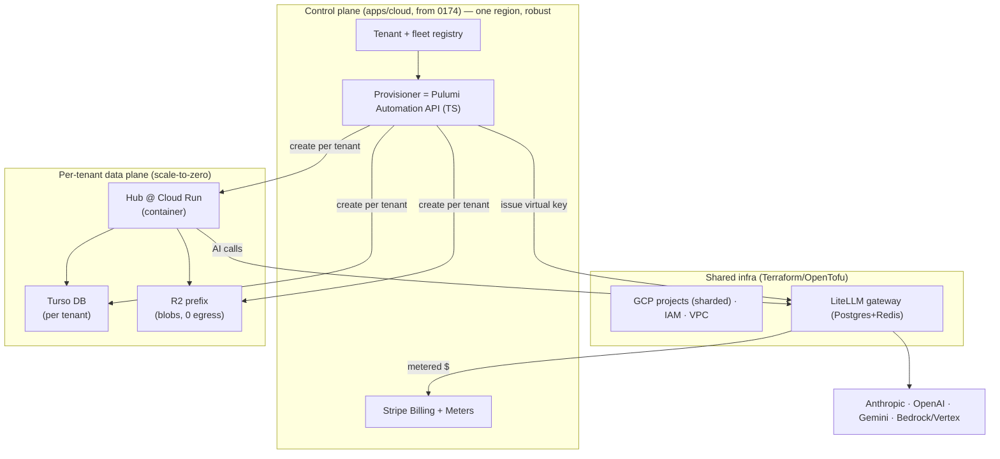
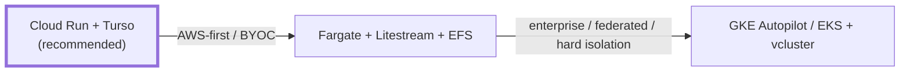
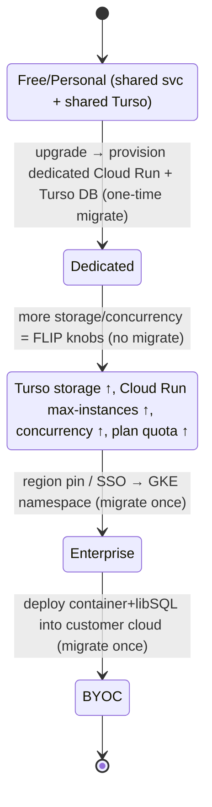
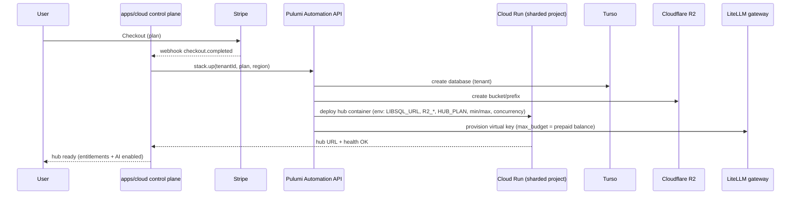

# Where And How To Deploy The Managed Hub Fleet (And The AI Gateway)

> **Status:** Exploration
> **Date:** 2026-06-13
> **Author:** Claude
> **Tags:** deployment, infrastructure, cloud-run, fargate, gke, turso, libsql,
> litestream, cloudflare-r2, pulumi, terraform, crossplane, scale-to-zero, cost,
> multi-tenant, byoc, federation, ai-gateway, litellm, bedrock, vertex, stripe-meters,
> managed-keys, byok, claude-agent-sdk, mcp

## Problem Statement

[`0174`](./0174_[_]_MANAGED_HOSTING_AS_OPEN_CORE_IN_THE_PUBLIC_MONOREPO.md) decided *what* the
managed service is (open-core control plane in the monorepo), *who* you are to it (custodial billing
identity bound to the non-custodial data DID), and *how you charge* (Stripe Billing + Meters). It
deliberately left a `Provisioner` interface abstract and flagged one open question loudly: **Railway
and Fly both prohibit reselling compute, so where does the managed fleet actually run?**

This exploration answers the deployment question end-to-end:

1. **AWS, GCP, or cross-platform?** Where do we run a fleet of potentially thousands of small,
   mostly-idle, isolated per-customer hubs? Is Terraform the answer, or something that spans clouds?
2. **Easy to develop / maintain / support, yet robust and future-proof.** A small team must be able
   to operate this without a platform org, while it grows from a $1/mo personal hub to enterprise
   dedicated/region-pinned to federated/BYOC without a rewrite.
3. **Cost engineering for the long tail.** Tiny free/personal users must cost us almost nothing at
   rest, then grow smoothly — more storage, more capacity, more concurrency, more features — as their
   needs expand. We want the smallest possible infra bill.
4. **Managed AI integration.** Eventually the hub itself connects directly to AI model APIs, with the
   models *plugged in automatically* and *billed through us* (Stripe) with a margin — so a user gets
   agentic help (the kind they'd get from Claude Code / Codex on a desktop) from their always-online
   hub, without running anything locally. Where does that gateway run, who holds the keys, and how do
   we keep a server-side agent safe against the user's own data?

The hard architectural fact that drives everything: **the hub today writes to a local
`better-sqlite3` file plus local blob/file directories on a persistent volume**
([`packages/hub/src/storage/sqlite.ts:628`](../../packages/hub/src/storage/sqlite.ts)). Local SQLite
on an attached disk is in direct tension with scale-to-zero compute. Resolving that tension is the
whole game for cost.

## Executive Summary

**Lead with GCP Cloud Run + Turso (libSQL) + Cloudflare R2, provisioned by Pulumi Automation API,
and keep it cross-platform by construction.** Concretely:

1. **Compute: GCP Cloud Run as the default substrate.** True scale-to-zero, per-100ms billing,
   500 ms–2 s cold starts, zero node/volume management — the easiest robust thing to operate. A tiny
   idle personal hub costs **~$0.006/mo** of compute. The one sharp edge is a **hard cap of 1,000
   Cloud Run services per project per region** (not raise-able), so dedicated-per-tenant services
   **shard across projects** — which the control plane automates. Cloud Run / Fargate / GKE all
   *permit* SaaS resale, so this also **closes 0174's Railway/Fly reselling landmine**.

2. **Data: Turso / libSQL, one database per tenant.** This is the keystone decision. It dissolves
   the SQLite-vs-scale-to-zero tension: each tenant gets an isolated libSQL database that scales to
   zero on its own (no attached volume, no Litestream sidecar, no NFS), and **`@libsql/client`
   embedded replicas keep the familiar local-SQLite read path** the hub already depends on. Free tier
   = 500 DBs; **$4.99/mo = unlimited DBs**. Blobs move off local disk to **Cloudflare R2** whose
   **zero egress** removes the single biggest long-tail cost trap (S3/GCS charge ~$0.09/GB out).

3. **IaC: shared infra in Terraform/OpenTofu, per-tenant resources via Pulumi Automation API.**
   Terraform-workspace-per-tenant is a documented anti-pattern (state explosion, slow, blast radius).
   Use IaC for the shared control plane; use a **programmatic provisioner embedded in the Node/TS
   control plane** (Pulumi Automation API — same language as the monorepo) to create each tenant's
   Cloud Run service + Turso DB + R2 prefix + LiteLLM key. This *is* 0174's `Provisioner` interface,
   made concrete.

4. **Cross-platform without a rewrite.** Portability comes from three choices, not from a
   lowest-common-denominator abstraction: a **plain containerized hub** (runs on Cloud Run, Fargate,
   GKE, or a customer VPC), the **libSQL client** (the same code points at `file:`, `libsql://`, or a
   self-hosted libSQL server), and **Pulumi modules parameterized by provider**. This keeps the
   growth path open: Tier 0 pooled → Tier 1 dedicated Cloud Run → Tier 2 enterprise GKE/region-pinned
   → **Tier 3 BYOC** (data plane in the customer's own AWS/GCP account, control plane connects — the
   ClickHouse/Confluent/Databricks pattern). The AWS-native fallback for AWS-first/BYOC customers is
   **Fargate + Litestream + EFS + S3**.

5. **Cost = scale-to-zero + pooled free tier + in-place capacity knobs.** Free/personal tenants live
   in a **shared** Cloud Run service over **shared Turso** (≈ $0/tenant). Paid tenants get dedicated
   services that sleep when idle. "Grow from small to large" is mostly **entitlement flips** (Cloud
   Run `min/max instances` and `concurrency`, Turso storage, plan quota the hub already enforces) —
   no migration until a tenant crosses an isolation-tier boundary, exactly the model 0174 defined.

6. **AI: a managed gateway (LiteLLM) beside the hub; managed keys + Stripe Meters; the agent runs
   server-side, sandboxed.** xNet already ships an `AIProviderRouter` (Anthropic/OpenAI/OpenRouter/
   LiteLLM/Ollama) with per-call cost tracking
   ([`packages/plugins/src/ai/providers.ts`](../../packages/plugins/src/ai/providers.ts)), an
   `ai-surface`, an MCP server, and a persistent agent runtime — so this is a *gateway + billing +
   safety* job, not a from-scratch build. Run **LiteLLM self-hosted** as the multi-tenant gateway:
   one **virtual key per hub** with a hard `max_budget` (the runaway-cost stop), provider keys held by
   us (managed-keys, BYOK on enterprise), fallback routing, Bedrock/Vertex as IAM-native upstreams.
   Meter marked-up dollars into **Stripe Billing Meters**, gated by a **prepaid credit ledger**. The
   always-on hub runs the **Claude Agent SDK** with an `allowed_tools` allow-list, `PreToolUse`
   audit/permission hooks, per-tenant MCP isolation, context spotlighting, and per-session token caps
   — the defense-in-depth required when an agent reads the user's own data. The *product/pricing/
   safety* of this is already designed in
   [`0148`](./0148_[_]_HOSTED_HUBS_DEEP_AI_INTEGRATION_WITH_PAID_FOUNDATION_MODELS.md); this doc adds
   *where it runs and who holds the keys*.



## Current State In The Repository

### The hub is a stateful, local-SQLite container today

- **Storage is local files.** [`packages/hub/src/storage/index.ts:34`](../../packages/hub/src/storage/index.ts)
  builds a `HubStorage`; the SQLite backend
  ([`storage/sqlite.ts:628`](../../packages/hub/src/storage/sqlite.ts)) does
  `new Database(join(dataDir, 'hub.db'))` via **`better-sqlite3`** (synchronous, native add-on) and
  `mkdirSync(join(dataDir, 'blobs'))` / `'files'` for blobs. The Dockerfile even
  `npm rebuild better-sqlite3` ([`Dockerfile:73`](../../packages/hub/Dockerfile)). **This is the
  thing that must change** for clean scale-to-zero per tenant.
- **But storage is abstracted.** [`packages/storage/`](../../packages/storage/) exposes a
  `StorageAdapter` with `MemoryAdapter` / `SQLiteStorageAdapter`, a `BlobStore`, and a `ChunkManager`
  — so the blob path can target object storage and the DB path can target libSQL behind the existing
  seam rather than a rewrite of call sites.
- **Scale-to-zero is already configured on Fly.** [`packages/hub/fly.toml`](../../packages/hub/fly.toml)
  sets `auto_stop_machines = "suspend"`, `min_machines_running = 0` — the *operational intent* is
  already there; we just need a substrate where we're allowed to resell and where the data survives
  sleep cheaply.
- **Platform detection exists.** [`config.ts`](../../packages/hub/src/config.ts) already branches on
  `railway` / `fly` / `local` and reads `RAILWAY_VOLUME_MOUNT_PATH`. Add `cloud-run` / `fargate` and
  a `LIBSQL_URL` / `R2_*` env contract.

### The AI surface is mostly built (the gateway is the gap)

- **Provider router with cost tracking.**
  [`packages/plugins/src/ai/providers.ts`](../../packages/plugins/src/ai/providers.ts) ships
  `AnthropicProvider`, `OpenAICompatibleProvider` (OpenAI/OpenRouter/LiteLLM/vLLM/LM Studio),
  `OllamaProvider`, and an `AIProviderRouter` that selects by `risk`/`quality`, streams tool calls,
  and **accumulates `AIProviderUsage` incl. `estimatedCostUsd`** (`providers.ts:911`). The `litellm`
  and `openrouter` provider presets already exist (`providers.ts:937`, `:985`).
- **Agent + MCP surface.** Per [`0148`](./0148_[_]_HOSTED_HUBS_DEEP_AI_INTEGRATION_WITH_PAID_FOUNDATION_MODELS.md):
  `packages/plugins/src/ai-surface/*` (typed mutation plans, audit, rollback), `services/local-api.ts`
  (`/ai/*` routes), `services/mcp-server.ts` (MCP), `ai/runtime.ts` (persistent threads, approvals,
  usage events). The application-level *AI safety contract* exists; the missing piece is the **hosted
  gateway**: provider secrets, per-tenant budgets, routing/fallback, metered billing, kill-switch.
- **0148 already designed the AI product/pricing/safety** (credits, mutation-plan review, margin
  multipliers, rogue-AI mitigations). This doc must not re-derive it — it adds the **deployment and
  key-custody** layer underneath.

### What 0174 left abstract that this doc makes concrete

| 0174 abstraction | This doc's concrete answer |
|---|---|
| `Provisioner` interface | Pulumi Automation API (TS) in `apps/cloud`; Cloud Run + Turso + R2 + LiteLLM-key per tenant |
| "reseller-permitted substrate" (open Q) | **GCP Cloud Run** primary; Fargate/GKE alternates — all permit SaaS resale |
| Isolation tier ladder | mapped to compute+data+IaC per tier (pooled → BYOC) below |
| "entitlement flag the hub reads live" | Cloud Run min/max-instances + concurrency, Turso storage, plan quota |
| Stripe Meters | extended to **AI token markup** via per-call meter events |

## External Research

(Two deep surveys; full citations in [References](#references).)

### The scale-to-zero ⟷ SQLite tension, and how to dissolve it

| Substrate | Scale-to-zero | Cold start | Per-tenant SQLite state | Idle $/tenant | Resale OK | Ops |
|---|---|---|---|---|---|---|
| **GCP Cloud Run** | yes, native | 0.5–2 s | needs external state (GCS-FUSE ✗ for SQLite; NFS works but costs at rest) | **~$0.006** | yes | very low |
| AWS App Runner | **no** (≥1 always on) | n/a | EFS ✗ | ~$5/mo always | yes | low |
| AWS ECS Fargate | via stop/start | 30–90 s | EFS/EBS volume + Litestream | ~$1.35 (2 h/day) | yes | medium |
| GKE Autopilot / EKS | KEDA | 30–60 s | PVC; vcluster for hard isolation | + $72/mo/cluster | yes | high |

The blocker on Cloud Run is that its ephemeral FS loses data, **GCS-FUSE doesn't honor SQLite's
`flock`/`mmap`**, and NFS/Filestore bills at rest. The clean fix is to **stop keeping per-tenant state
on the compute node at all**:

- **Turso / libSQL (recommended).** Database-per-tenant, **scale-to-zero by design** (pay storage +
  row I/O, not compute-seconds), **embedded replicas** so the hub still reads a local SQLite file
  at memory speed while writes sync to the primary. Free: 500 DBs / 9 GB / 1B reads; **Developer
  $4.99/mo: unlimited DBs**; overage $0.75/GB. Proven at millions of DBs (Adaptive.ai). Migration
  cost: swap `better-sqlite3` for `@libsql/client` (writes become async to the primary).
- **Litestream** (if staying on Fargate/EBS): streams the WAL to S3; restore-on-boot 5–30 s; single
  writer only (fine for one-hub-per-tenant). **LiteFS is explicitly *not* recommended with
  scale-to-zero** (lease races → data-loss risk).
- **Cloudflare D1** (Workers/V8 only — a Node rewrite) and **Neon** (serverless Postgres — abandons
  SQLite) are viable but higher-switching-cost alternatives.
- **Blobs → Cloudflare R2**: S3-compatible, **$0 egress** (vs S3/GCS ~$0.08–0.09/GB out — at 10k
  tenants × 10 GB/mo that's ~$9k/mo saved), 10 GB free.

### IaC: shared-vs-per-tenant is the real decision

- **Terraform-workspace-per-tenant is an anti-pattern** at thousands of tenants: state-file
  explosion, 30–60 s plan/apply per tenant, large blast radius, per-run CI cost.
- **Recommended split:** Terraform/OpenTofu for **shared** infra (projects, IAM, VPC, GKE, the
  LiteLLM deployment); **Pulumi Automation API** embedded in the control plane for **per-tenant**
  resources — it's a *library* you call (`stack.up()`) from TS with real loops/conditionals, built
  for "thousands of single-tenant instances." **Crossplane** (K8s-native, CRDs reconcile cloud
  resources) is the middle path once you're on GKE/EKS for enterprise tiers.

### Growth path: private → enterprise → federated → BYOC

The architecture stays one design across tiers if you keep the hub a **boring container**, the data
layer a **libSQL client** (`file:` self-host / `libsql://` managed / self-hosted libSQL server), and
provisioning **Pulumi modules parameterized by cloud provider**. Enterprise data residency = Turso
group / GKE namespace in a chosen region; **BYOC** = deploy the same container + libSQL into the
customer's own AWS/GCP account, data plane in their VPC, control plane connects via cross-account IAM
(ClickHouse/Confluent/Databricks BYOC pattern). Federation is **protocol-addressable HTTPS**, so it's
independent of any tenant's data-layer choice.

### Managed AI gateway + billing + agent safety

- **Gateway: LiteLLM (self-hosted, MIT).** 4-level tenancy (org→team→user→**virtual key**), per-key
  `max_budget` + `tpm/rpm` limits (the **hard runaway-cost stop**), 100+ providers, fallback chains,
  AES-encrypted provider keys in Postgres, Redis for distributed limits. **One virtual key per hub**,
  budget synced to the customer's prepaid balance. Alternatives: **OpenRouter** (hosted, key-
  provisioning API + spend limits, 5.5% top-up fee, no self-host/observability depth), **Portkey**
  (managed, open-core gateway), **Cloudflare AI Gateway** (caching/analytics only — not per-tenant
  budgets), **Helicone** (observability). **Bedrock / Vertex** as IAM-native upstreams *behind*
  LiteLLM (no static keys, unified cloud billing, residency).
- **Billing: Stripe Billing Meters.** Compute marked-up dollars in *your* backend (versioned model-
  price table × markup, e.g. 25–40%), emit `billing.meterEvents` with `value` in dollars. **Stripe
  has no native spend gate** → the **prepaid credit ledger + LiteLLM `max_budget` is the hard stop**;
  auto-top-up when low. (Stripe shipped "AI Token Billing" preview in 2026 that maintains the model-
  price table for you.) Connect still not needed (sole seller).
- **Managed keys vs BYOK.** Default **managed keys** (we hold provider keys in a secrets manager,
  mark up, bill) for personal/team; **BYOK** on enterprise (customer key, we charge a platform fee,
  meets HIPAA/SOC2 custody needs). The whole industry (Copilot, Cursor, Windsurf, v0) moved off
  "unlimited AI" to **credits + overage/hard-stop** because one agentic session can burn $1–15 of
  tokens — so never bundle unlimited agent runs into a flat plan.
- **Server-side agent safety.** Use the **Claude Agent SDK** in the hub with: an explicit
  `allowed_tools` allow-list (read-only by default), **`PreToolUse` hooks** that audit + block out-of-
  tenant access, **context spotlighting** (wrap untrusted document content so the model won't obey
  embedded instructions), **per-tenant isolated MCP servers**, output scanning for secrets/PII, and a
  **per-session token cap / circuit breaker**. Indirect prompt injection (malicious text inside the
  user's own data) is the primary threat for an agent with data access — defense is the tool allow-
  list + hooks, not prompt wording.

## Key Findings

1. **The data layer, not the compute layer, is the pivotal choice.** Pick Turso/libSQL and Cloud Run
   becomes trivial; keep local `better-sqlite3` and you're forced onto Fargate+EFS+Litestream with
   30–90 s cold starts. The migration `better-sqlite3 → @libsql/client` is the highest-leverage
   engineering task in this whole plan.
2. **GCP Cloud Run is the easiest robust substrate** for a mostly-idle fleet — except the immovable
   **1,000-services/project/region** cap forces **project sharding** for dedicated tenants (the
   control plane handles it). App Runner is out (no scale-to-zero); Fargate/GKE are the alternates.
3. **Resale is permitted on Cloud Run/Fargate/GKE**, resolving 0174's blocker. Keep Railway/Fly only
   as the *free self-host* path.
4. **Cross-platform is achieved by construction** (container + libSQL client + Pulumi-by-provider),
   not by a leaky abstraction layer — and that same construction is what makes BYOC/federation
   possible later without a rewrite.
5. **IaC must split**: Terraform for shared, **Pulumi Automation API for per-tenant**. Never
   Terraform-per-tenant.
6. **R2's zero egress** is the difference between healthy and ruinous margins on any media-bearing
   tenant.
7. **"Grow from small to large" is mostly entitlement flips, not migrations** — Cloud Run
   min/max-instances + concurrency, Turso storage, and the plan quota the hub already enforces. Only
   crossing an isolation boundary moves data (0174's migration engine).
8. **The AI gateway is a deployment + key-custody + safety problem, not a model problem.** xNet's
   router/agent/MCP surface already exists; LiteLLM (virtual key + budget) + Stripe Meters + Claude
   Agent SDK sandboxing is the assembly.

## Options And Tradeoffs

### A. Primary compute substrate



- **Cloud Run + Turso (recommended).** Easiest to operate, cheapest at idle, native scale-to-zero.
  Cost: project sharding past 1,000 dedicated tenants; libSQL migration.
- **Fargate + Litestream + EFS.** The AWS-native path; needed when enterprise/BYOC mandates AWS.
  Cost: 30–90 s cold starts, EFS/volume lifecycle, Litestream sidecar.
- **GKE/EKS + vcluster.** Strongest isolation, best for enterprise/BYOC/federated; highest ops and a
  per-cluster floor (~$72/mo). Use it *at the top tier*, not for the long tail.

### B. Per-tenant data durability

| Option | Scale-to-zero | Code change from `better-sqlite3` | Verdict |
|---|---|---|---|
| **Turso / libSQL** | native, per-DB | swap to `@libsql/client` (async writes) | **recommended** |
| Litestream + EFS/EBS | via stop/start | minimal (keep better-sqlite3) | AWS-native fallback |
| Cloudflare D1 | native | **Workers rewrite** | reject (Node hub) |
| Neon (Postgres) | native | **SQL/driver rewrite** | only if Postgres is independently wanted |

### C. IaC / provisioning

- **Terraform/OpenTofu only** → anti-pattern per tenant. *Reject for per-tenant.*
- **Pulumi Automation API (recommended)** → per-tenant in TS, shares the monorepo language; pairs with
  Terraform for shared infra.
- **Crossplane** → adopt when already on K8s for enterprise tiers.

### D. AI gateway

- **LiteLLM self-hosted (recommended)** → per-tenant virtual key + hard budget, self-host, 100+
  providers; you run Postgres+Redis.
- **OpenRouter** → fastest v1 (key-provisioning API + spend limits) but no self-host / shallow
  observability / margin only via your Stripe layer.
- **Portkey / Bedrock / Vertex** → managed gateway / IAM-native upstreams behind LiteLLM.

### E. Managed keys vs BYOK

- **Managed keys (default, personal/team):** natural markup, simple onboarding, you carry cost risk
  + key-vault blast radius.
- **BYOK (enterprise):** no token markup (platform fee instead), meets regulated key-custody, more
  onboarding friction.

## Recommendation

Build **xNet Cloud** on **GCP Cloud Run + Turso (libSQL) + Cloudflare R2**, provisioned by **Pulumi
Automation API** inside `apps/cloud` (0174), with **shared infra in Terraform/OpenTofu**, an
**AWS Fargate + Litestream** adapter for AWS-first/BYOC, and **GKE + vcluster** reserved for the
enterprise/federated tier. Run a **self-hosted LiteLLM** AI gateway with managed keys, **Stripe
Meters** for marked-up token billing gated by a prepaid credit ledger, and the **Claude Agent SDK**
(sandboxed) for server-side agents in the hub.

### Tier → compute → data → isolation → cost

| Tier | Compute | Data | Blobs | Isolation | Idle cost |
|---|---|---|---|---|---|
| **Free / Personal** | shared Cloud Run svc (tenant-routed) | shared Turso (free 500 DBs) | shared R2 prefix | app-level | ~$0 |
| **Family / Team** | dedicated Cloud Run, `min=0` sleep | dedicated Turso DB | R2 prefix | service + DB | ~$0.006–$1 |
| **Company** | dedicated Cloud Run `min=1` (no cold start) | Turso DB (region) | R2 bucket | service + SSO/SCIM | warm small |
| **Enterprise** | GKE namespace / region-pinned | Turso group / Neon in region | bucket in region | namespace/VPC + DPA | dedicated |
| **BYOC / Federated** | customer's cloud (container) | self-hosted libSQL in their VPC | their bucket | their account | n/a (theirs) |

### Capacity growth = entitlement flips (no migration until a tier boundary)



The hub already enforces `defaultQuota` per DID ([`backup.ts`](../../packages/hub/src/services/backup.ts));
"more storage / more users" raises that quota + the Cloud Run `maxInstances`/`concurrency` + the Turso
DB size — all **live config the running hub reads**, billed as a Stripe `SubscriptionItem` change.
Only **pooled→dedicated**, **→region-pinned**, and **→BYOC** actually move bytes.

### Provisioning sequence



### Managed AI request path (billed through us, safe by construction)

```mermaid
sequenceDiagram
    participant U as User
    participant Hub as Hub (Claude Agent SDK)
    participant Led as Credit ledger
    participant GW as LiteLLM (virtual key + budget)
    participant M as Model (Anthropic/Bedrock/...)
    participant St as Stripe Meters

    U->>Hub: "summarize my project / do X"
    Hub->>Hub: allowed_tools allow-list + PreToolUse hooks + spotlight untrusted content
    Hub->>Led: reserve credits (estimate)
    alt insufficient credits
      Led-->>Hub: deny → prompt top-up
    else ok
      Hub->>GW: model call (virtual key)
      GW->>M: route (+ fallback); enforce max_budget / TPM
      M-->>GW: completion + token usage
      GW-->>Hub: result + usage
      Hub->>Led: settle (provider cost × markup)
      Hub->>St: billing.meterEvents (value = marked-up $)
      Hub-->>U: result (output scanned for secrets/PII)
    end
```

### Phasing

```mermaid
stateDiagram-v2
    [*] --> P0
    P0: P0 · Pick data layer
    note right of P0
      Migrate hub storage to @libsql/client (Turso) behind StorageAdapter.
      Move blobs to R2 via BlobStore. Keep better-sqlite3 path for self-host.
      Prove cold-start + restore on Cloud Run.
    end note
    P0 --> P1: hub runs stateless on Cloud Run
    P1: P1 · Provision automation
    note right of P1 : Pulumi Automation API in apps/cloud; Terraform shared infra; pooled free tier + dedicated paid; project sharding
    P1 --> P2: fleet self-provisions
    P2: P2 · Managed AI gateway
    note right of P2 : LiteLLM + virtual keys + Stripe Meters + credit ledger; Agent SDK sandbox; managed keys
    P2 --> P3: AI billed + safe
    P3: P3 · Enterprise + BYOC + federated
    note right of P3 : GKE/vcluster, region pinning, BYOC Pulumi module, BYOK, DPA
    P3 --> [*]
```



## Example Code

### 1. `Provisioner` adapter via Pulumi Automation API (concretizes 0174's interface)

```typescript
// packages/cloud-provisioner/src/adapters/gcp-turso.ts  (FSL)
import { LocalWorkspace } from '@pulumi/pulumi/automation'

export class CloudRunTursoProvisioner implements Provisioner {
  async provision(spec: ProvisionSpec): Promise<HubHandle> {
    const projectId = pickShardedProject(spec.tenantId)        // < 1000 svc/project/region
    const stack = await LocalWorkspace.createOrSelectStack({
      stackName: spec.tenantId,
      projectName: 'xnet-hub',
      program: async () => {
        const db = await turso.createDatabase(spec.tenantId)   // per-tenant libSQL
        const bucketPrefix = `t/${spec.tenantId}`              // shared R2, per-tenant prefix
        const svc = new gcp.cloudrunv2.Service(spec.tenantId, {
          project: projectId,
          template: {
            scaling: { minInstanceCount: spec.entitlements.warm ? 1 : 0,
                       maxInstanceCount: spec.entitlements.maxConnections / 250 },
            containers: [{
              image: `registry/xnet-hub:${spec.targetVersion}`,  // immutable, from 0174
              envs: [
                { name: 'LIBSQL_URL', value: db.url },
                { name: 'LIBSQL_TOKEN', value: db.token },
                { name: 'R2_PREFIX', value: bucketPrefix },
                { name: 'HUB_PLAN', value: signEntitlements(spec.entitlements) },
              ],
            }],
          },
        })
        return { hubUrl: svc.uri }
      },
    })
    const res = await stack.up()
    return { hubUrl: res.outputs.hubUrl.value, substrateRef: `${projectId}/${spec.tenantId}`, region: spec.region }
  }
  // upgrade()/setEnv()/sleep()/destroy() → stack.up() with new args / serviceDelete / min=0
}
```

### 2. libSQL behind the existing `HubStorage` seam (the keystone migration)

```typescript
// packages/hub/src/storage/libsql.ts  — adapter alongside sqlite.ts
import { createClient } from '@libsql/client'

export const createLibsqlStorage = (cfg: { url: string; authToken?: string; syncUrl?: string }): HubStorage => {
  // Embedded replica: local file synced from the Turso primary → reads stay local-fast,
  // writes go to the primary. Same HubStorage interface the rest of the hub already uses.
  const db = createClient({ url: 'file:local.db', syncUrl: cfg.url, authToken: cfg.authToken })
  // ...implement HubStorage over db (blobs → R2 via BlobStore instead of local dirs)
}
// createStorage() picks libsql when LIBSQL_URL is set, else better-sqlite3 (self-host default).
```

### 3. Per-call AI markup → Stripe meter (extends the shipped router's usage)

```typescript
// apps/cloud — provider cost (from AIProviderUsage.estimatedCostUsd) × markup → meter event
async function meterAiUsage(tenant: Tenant, usage: AIUsage, markup = 1.35) {
  const marked = (usage.estimatedCostUsd ?? 0) * markup
  await creditLedger.settle(tenant.id, marked)               // hard-stop ledger is the real gate
  await stripe.billing.meterEvents.create({
    event_name: 'ai_usage_usd',
    payload: { stripe_customer_id: tenant.stripeCustomerId, value: marked.toFixed(8) },
  })
}
// LiteLLM virtual key max_budget = prepaid balance → provider-side runaway stop.
```

### 4. Sandboxed server-side agent (Claude Agent SDK)

```typescript
import { query } from '@anthropic-ai/claude-agent-sdk'
// Read-only by default; PreToolUse hook audits + blocks out-of-tenant access; untrusted
// hub content is spotlight-wrapped before it enters context; per-session token cap enforced.
const result = query({
  prompt,
  options: {
    allowedTools: ['Read', 'Grep', 'xnet_search', 'xnet_context_pack'], // NOT Write/Bash by default
    hooks: { PreToolUse: [auditAndScopeToTenant(tenant.id)] },
    mcpServers: { hub: perTenantMcpServer(tenant.id) },               // isolated per tenant
    maxTokens: tenant.entitlements.agentSessionTokenCap,
  },
})
```

## Risks And Open Questions

- **The libSQL migration is real work and a correctness risk.** `better-sqlite3` is synchronous;
  libSQL writes are async to the primary. Behaviors that assume synchronous commit (and the
  `npm rebuild better-sqlite3` Docker step) must be audited. *Mitigation:* keep the better-sqlite3
  adapter for self-host; gate libSQL behind `LIBSQL_URL`; differential-test both adapters against the
  hub test suite. Open question: do any hot paths (sync relay, FTS) tolerate write latency to a
  remote primary, or do they need the embedded-replica local-write mode?
- **Cloud Run's 1,000-services/project/region cap** forces project sharding and a project-allocation
  scheme in the provisioner; cross-project quota/billing/observability adds complexity. Open question:
  at what tenant count do we pre-create project shards vs. lazily?
- **Vendor concentration.** Cloud Run + Turso + R2 + Stripe + LiteLLM is convenient but multi-vendor;
  each is a dependency and a ToS surface. *Mitigation:* the container+libSQL+Pulumi portability story
  is the hedge — but verify Turso's durability/SLA and have the Fargate+Litestream adapter real, not
  theoretical, before betting the fleet.
- **Cold start vs. cost on the cheapest tier.** `min=0` means a 0.5–2 s (Cloud Run) or 5–30 s
  (Litestream restore) first-request delay. *Mitigation:* pooled free tier is warm (shared); paid
  tiers can buy `min=1`. Open question: is a libSQL embedded-replica cold sync fast enough on wake?
- **AI key-vault blast radius (managed keys).** One breach exposes fleet-wide provider capacity.
  *Mitigation:* secrets manager, per-tier provider keys, rotation, per-tenant LiteLLM budgets cap
  damage; BYOK for the regulated.
- **Agent prompt-injection against the user's own data** is the headline AI risk (malicious text in a
  synced doc telling the agent to exfiltrate). *Mitigation:* tool allow-list + `PreToolUse` tenant
  scoping + spotlighting + output scanning + per-session caps — never rely on prompt wording. Defer
  write-capable autonomous agents until this is hardened (0148's mutation-plan/approval model).
- **AI margin erosion.** Provider prices move; flat "unlimited AI" is a trap (one agent run = $1–15).
  *Mitigation:* prepaid credits + markup floor + model-price-table versioning (or Stripe AI Token
  Billing); hard stop at $0, per the whole industry's 2026 convergence.
- **BYOC support burden.** Customer-cloud deployments multiply environments. *Mitigation:* one Pulumi
  module, cross-account IAM, control-plane-can't-see-data invariant; gate BYOC to enterprise pricing.
- **Self-host must stay first-class** (0174 invariant): the better-sqlite3 + local-blob path must keep
  working with zero cloud dependency, so the managed data-layer swap is additive, not a replacement.

## Implementation Checklist

**P0 — Data layer (unblocks everything):**
- [ ] Add `createLibsqlStorage` (`@libsql/client`, embedded replica) behind `createStorage`
      ([`storage/index.ts`](../../packages/hub/src/storage/index.ts)); keep `better-sqlite3` for self-host.
- [ ] Route blobs/files through `BlobStore` ([`packages/storage/`](../../packages/storage/)) to an
      **R2** (S3-compatible) backend instead of local `blobs/`/`files/` dirs.
- [ ] Add `cloud-run` / `fargate` platform detection + `LIBSQL_URL` / `R2_*` env contract in
      [`config.ts`](../../packages/hub/src/config.ts).
- [ ] Differential-test both storage adapters; verify cold-start + first-query latency on Cloud Run.

**P1 — Provisioning & fleet:**
- [ ] Implement `CloudRunTursoProvisioner` via **Pulumi Automation API** in
      `packages/cloud-provisioner` (0174); add a `FargateLitestreamProvisioner` adapter for AWS/BYOC.
- [ ] Terraform/OpenTofu for shared infra (GCP project shards, IAM, VPC, LiteLLM, R2 buckets).
- [ ] Project-shard allocator (< 1000 Cloud Run services/project/region) in the control plane.
- [ ] Pooled free tier (shared Cloud Run + shared Turso) from demo mode; dedicated paid tier path.
- [ ] Wire entitlement flips → Cloud Run `min/max`/`concurrency` + Turso storage + hub quota (live).

**P2 — Managed AI gateway:**
- [ ] Deploy **LiteLLM** (Postgres+Redis); provider keys in a secrets manager (managed-keys).
- [ ] Provision one **virtual key per hub** at signup; sync `max_budget` to the prepaid credit ledger.
- [ ] Meter marked-up dollars to **Stripe Billing Meters**; prepaid ledger as hard stop + auto-top-up;
      versioned model-price table.
- [ ] Run the hub agent on the **Claude Agent SDK** with `allowed_tools`, `PreToolUse` tenant-scoping
      hooks, per-tenant MCP isolation, context spotlighting, output scanning, per-session token cap.
- [ ] Bedrock/Vertex as IAM-native upstreams behind LiteLLM for AWS/GCP-native + residency.

**P3 — Enterprise / BYOC / federated:**
- [ ] GKE Autopilot + **vcluster** for hard-isolation/region-pinned enterprise tenants.
- [ ] **BYOC** Pulumi module (deploy container + self-hosted libSQL into customer cloud; cross-account
      IAM; control-plane-can't-read-data invariant); **BYOK** AI keys; DPA / residency.
- [ ] Confirm hub-to-hub federation is HTTPS-addressable regardless of tenant data layer.

## Validation Checklist

- [ ] **Idle cost proven:** a dedicated personal tenant at rest costs ≤ ~$0.05/mo (compute + Turso +
      R2) measured on real bills.
- [ ] **Scale-to-zero round-trips:** an idle hub wakes, syncs its libSQL embedded replica, and serves
      a correct first request within an acceptable cold-start budget.
- [ ] **Data layer parity:** the hub test suite passes on both `better-sqlite3` and libSQL adapters;
      no write-latency-induced regressions in sync/FTS.
- [ ] **Self-host intact:** a standalone hub runs with local SQLite + local blobs, zero cloud
      dependency.
- [ ] **Provisioning is programmatic:** a new tenant's Cloud Run service + Turso DB + R2 prefix +
      LiteLLM key are created/destroyed by one control-plane call; no Terraform-per-tenant.
- [ ] **Project sharding works:** crossing 1,000 services rolls to a new project shard transparently.
- [ ] **Capacity flips don't migrate:** raising storage/concurrency changes the live hub without
      moving data; only tier-boundary crossings run the migration engine with zero loss.
- [ ] **R2 egress is $0** on a media-heavy tenant vs. a modeled S3 bill.
- [ ] **AI hard stop:** a tenant at $0 credits is blocked at the gateway (LiteLLM `max_budget`) before
      any provider spend; auto-top-up restores access.
- [ ] **AI billing reconciles:** marked-up Stripe meter revenue minus provider invoice = expected
      margin for a sample month.
- [ ] **Agent safety:** a prompt-injection fixture embedded in a tenant's document cannot make the
      agent call a disallowed tool or read another tenant's data; outputs are secret/PII-scanned.
- [ ] **BYOC isolation:** a BYOC tenant's data never leaves their cloud account; the control plane
      operates without read access to it.

## References

### Repository
- Hub storage — [`storage/index.ts`](../../packages/hub/src/storage/index.ts),
  [`storage/sqlite.ts`](../../packages/hub/src/storage/sqlite.ts) (`better-sqlite3`),
  [`packages/storage/`](../../packages/storage/) (`StorageAdapter`, `BlobStore`, `ChunkManager`)
- Config/platform — [`config.ts`](../../packages/hub/src/config.ts),
  [`types.ts`](../../packages/hub/src/types.ts), [`fly.toml`](../../packages/hub/fly.toml) (scale-to-zero),
  [`Dockerfile`](../../packages/hub/Dockerfile)
- Quotas — [`services/backup.ts`](../../packages/hub/src/services/backup.ts)
- AI surface — [`plugins/src/ai/providers.ts`](../../packages/plugins/src/ai/providers.ts)
  (`AIProviderRouter`, `estimatedCostUsd`), `plugins/src/ai/runtime.ts`,
  `plugins/src/ai-surface/*`, `plugins/src/services/local-api.ts`,
  [`plugins/src/services/mcp-server.ts`](../../packages/plugins/src/services/mcp-server.ts)
- Companion explorations — [`0174_MANAGED_HOSTING_AS_OPEN_CORE`](./0174_[_]_MANAGED_HOSTING_AS_OPEN_CORE_IN_THE_PUBLIC_MONOREPO.md),
  [`0148_HOSTED_HUBS_DEEP_AI_INTEGRATION`](./0148_[_]_HOSTED_HUBS_DEEP_AI_INTEGRATION_WITH_PAID_FOUNDATION_MODELS.md),
  [`0149_IDENTITY_AND_ACCOUNT_RECOVERY`](./0149_[_]_IDENTITY_AND_ACCOUNT_RECOVERY.md),
  [`0173_COMMUNITY_OWNED_DECENTRALIZED_CLOUD_INFRASTRUCTURE`](./0173_[_]_COMMUNITY_OWNED_DECENTRALIZED_CLOUD_INFRASTRUCTURE.md)

### Compute & data
- Cloud Run pricing — https://cloud.google.com/run/pricing · quotas (1,000 svc/project) — https://docs.cloud.google.com/run/quotas ·
  GCS volume mounts — https://docs.cloud.google.com/run/docs/configuring/services/cloud-storage-volume-mounts
- AWS Fargate pricing — https://aws.amazon.com/fargate/pricing/ · App Runner — https://aws.amazon.com/apprunner/pricing/ ·
  Fargate+EFS GA — https://aws.amazon.com/about-aws/whats-new/2020/04/amazon-ecs-fargate-support-amazon-efs-filesystems-generally-available · Fargate+EBS — https://aws.amazon.com/about-aws/whats-new/2024/01/amazon-ecs-fargate-integrate-ebs
- GKE pricing — https://cloud.google.com/kubernetes-engine/pricing · vcluster — https://github.com/loft-sh/vcluster
- Turso pricing — https://turso.tech/pricing · multi-tenancy — https://turso.tech/multi-tenancy ·
  Litestream — https://litestream.io/ · LiteFS (scale-to-zero warning) — https://fly.io/docs/litefs/ ·
  Neon — https://neon.com/pricing · D1 — https://developers.cloudflare.com/d1/platform/pricing/ ·
  R2 (zero egress) — https://developers.cloudflare.com/r2/pricing/

### IaC & BYOC
- Pulumi Automation API — https://www.pulumi.com/docs/iac/concepts/automation-api/ ·
  Terraform multi-tenant anti-patterns — https://oneuptime.com/blog/post/2026-02-23-how-to-handle-terraform-anti-patterns-and-how-to-fix-them/view ·
  Crossplane multi-tenant — https://docs.crossplane.io/v1.20/guides/multi-tenant/ ·
  ClickHouse BYOC — https://clickhouse.com/blog/announcing-general-availability-of-clickhouse-bring-your-own-cloud-on-aws

### AI gateway, billing, agent safety
- LiteLLM multi-tenant — https://docs.litellm.ai/docs/proxy/multi_tenant_architecture · budgets/keys — https://docs.litellm.ai/docs/proxy/users ·
  OpenRouter provisioning keys — https://openrouter.ai/docs/features/provisioning-api-keys ·
  Cloudflare AI Gateway — https://developers.cloudflare.com/ai-gateway/reference/pricing/ · Portkey — https://portkey.ai/docs/product/ai-gateway · Helicone — https://docs.helicone.ai/guides/cookbooks/cost-tracking
- AWS Bedrock pricing — https://aws.amazon.com/bedrock/pricing/ · GCP Vertex AI — https://www.cloudzero.com/blog/google-vertex-ai-pricing/
- Stripe Billing Meters — https://docs.stripe.com/api/billing/meter · meter events — https://docs.stripe.com/api/billing/meter-event ·
  Stripe AI Token Billing — https://www.pymnts.com/news/artificial-intelligence/2026/stripe-introduces-billing-tools-to-meter-and-charge-ai-usage/
- Claude Agent SDK — https://code.claude.com/docs/en/agent-sdk/overview · prompt-injection defense — https://www.getmaxim.ai/articles/prompt-injection-defense-for-production-ai-agents-a-complete-2026-guide/ ·
  MCP security — https://labs.cloudsecurityalliance.org/research/csa-research-note-mcp-security-crisis-20260504-csa-styled/ ·
  BYOK vs managed keys — https://www.lockllm.com/blog/BYOK-vs-managed-keys
- AI pricing convergence — GitHub Copilot credits — https://tokenmix.ai/blog/github-copilot-ai-credits-billing-2026 · flat-rate-AI-is-dead — https://wilico.co.jp/en/blog/end-of-flat-rate-ai-github-copilot-llm-billing-shift
