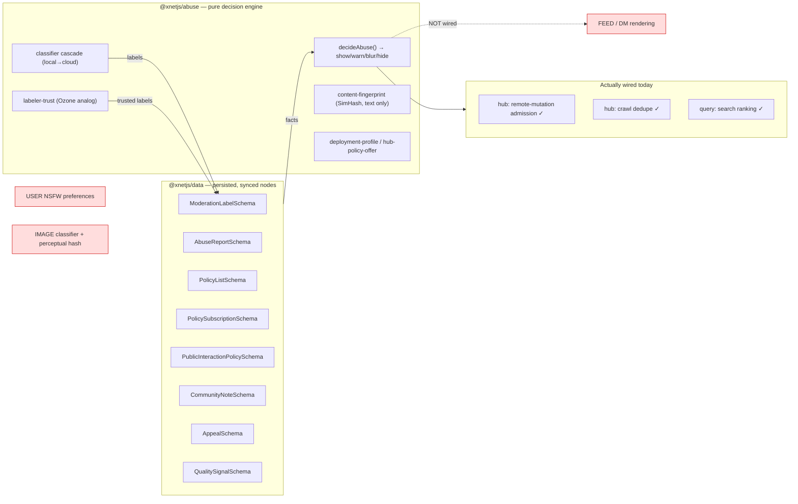
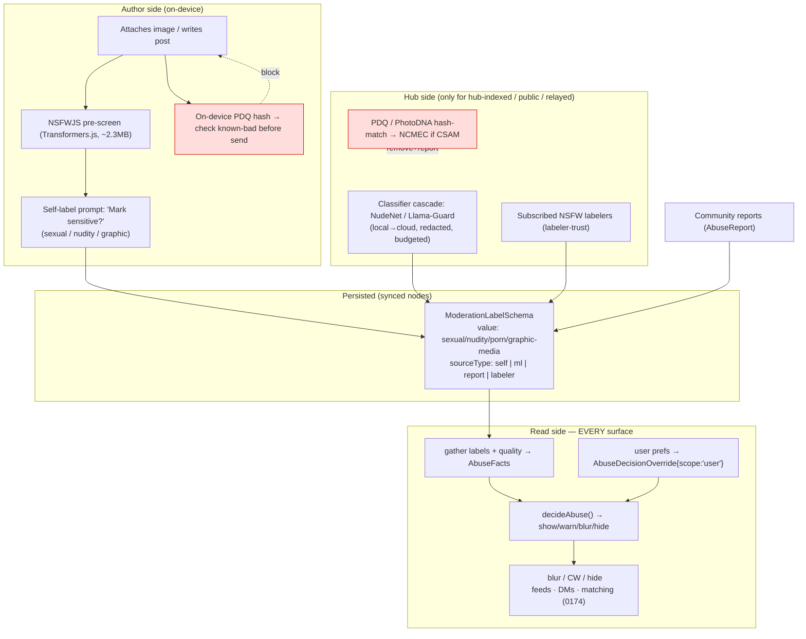
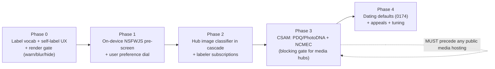
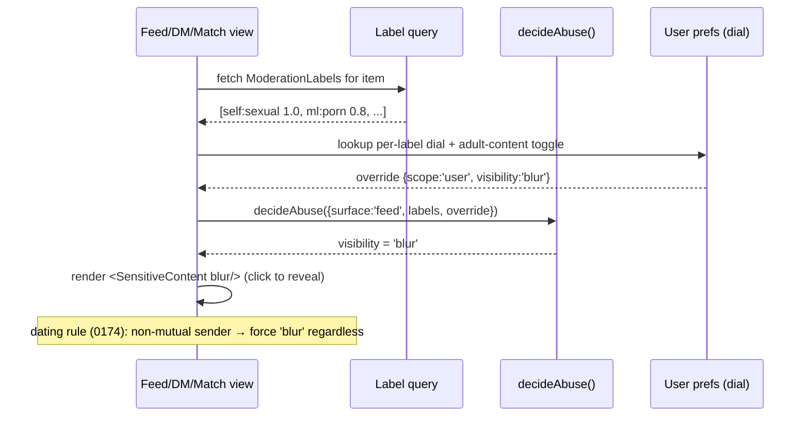
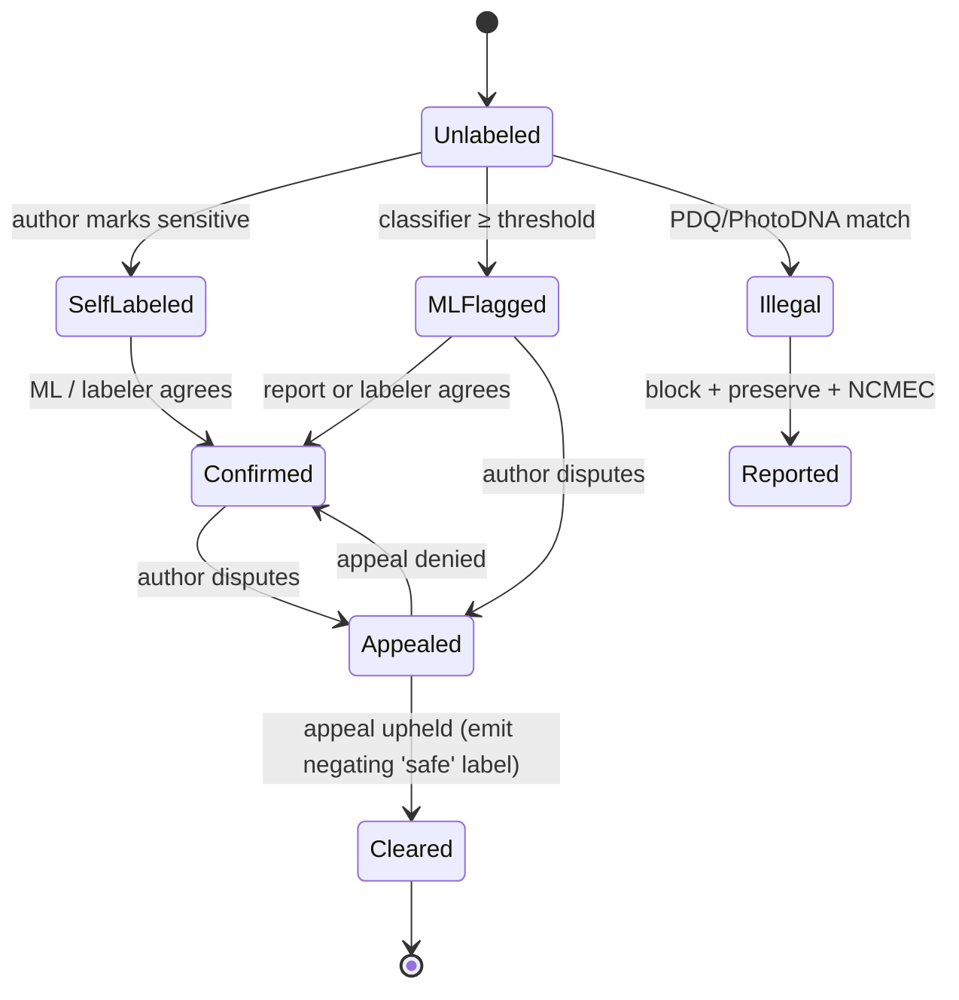

# NSFW Content Moderation And Feed Filtering

> **Status:** Exploration
> **Date:** 2026-06-13
> **Author:** Claude
> **Tags:** moderation, nsfw, sensitive-content, labeling, classifiers, on-device-ml,
> nsfwjs, perceptual-hashing, pdq, csam, atproto-labelers, content-warning, blur,
> feed-filtering, self-labeling, dating-safety, federation, privacy
> **Follows:** 0174 (Generalized People Matching And Connection)

## Problem Statement

The previous exploration (0174) proposed a generalized people-matching layer on
xNet — dating, friends, collaborators, hiring — with private one-on-one
introductions. The moment you let strangers connect and exchange media, you
inherit the oldest problem in social software: **a lot of people share
not-safe-for-work content, and a lot of people don't want to see it.** In dating
especially, unsolicited explicit images are routine and unwelcome.

The user's ask is precise and worth quoting: *"what sort of automations can be
provided to help moderate for that sort of content across the entire platform,
so that people can more readily filter that content out of their feeds if they
so desire."*

Two words carry the design: **automations** (classify and label NSFW content
without a human in the loop for every item) and **if they so desire** (the user
chooses their own filter level — this is a personal dial, not a platform-wide ban).

This is genuinely hard on a **decentralized, local-first, federated** platform:

- There is no central server that sees all content and can scan it.
- Images may live only on a user's device or flow peer-to-peer.
- A federated network is legally exposed to **CSAM** the instant it hosts or
  relays user images — a non-negotiable, separate problem from "NSFW filtering".
- Heavy-handed automated hiding produces false positives (art, breastfeeding,
  medical, body-positive content) that are themselves a harm.

The question this doc answers: **what automated classification + labeling +
user-controlled filtering should xNet build, on the moderation stack it already
has, so that NSFW content is reliably labeled and every user can dial it from
"show everything" to "hide it all" — while keeping classification private,
defaults safe, and the platform legally compliant?**

## Executive Summary

The surprising finding: **xNet has already built ~70% of the hard part and wired
~10% of it.** The `@xnetjs/abuse` package is a complete, ATProto-Ozone-class
moderation *decision engine*, and `packages/data/src/schema/schemas/moderation.ts`
is a complete *persisted label store*. The decision engine's visibility model is
**literally `'show' | 'warn' | 'blur' | 'hide'`**
([abuse/src/types.ts:20](packages/abuse/src/types.ts)) — exactly the dial the
user wants — and it already supports a **per-user override**
(`AbuseDecisionOverride { scope: 'user' }`,
[types.ts:105-113](packages/abuse/src/types.ts)). The engine is wired into
**hub write-admission and crawl** but **not into feed rendering, has no image
classifier, no NSFW label vocabulary, no user preferences UI, and no blur
component.** The work is mostly *assembly + three new capabilities*, not a new
subsystem.

The research is equally clear on the shape:

1. **Self-labeling is the cheapest, highest-precision signal** — author-declared
   "this is sensitive" beats any classifier. Make it a first-class, low-friction
   prompt and treat unlabeled-then-reported as a penalty.
2. **On-device image classification keeps the local-first promise.** NSFWJS
   (MobileNet v2, ~2.3 MB, ~93%) runs in the browser via TensorFlow.js /
   Transformers.js (`@xenova/transformers` is *already a dependency* of
   `@xnetjs/vectors`). It pre-screens an image **before upload**, powers a
   self-label prompt, and powers the *viewer's own* filter — never silently
   reports the user.
3. **The hub is the heavier classifier and the legal line.** Content that goes
   `hub-indexed`/public gets NudeNet/Llama-Guard-class classification through the
   existing **local→cloud classifier cascade** (redaction + budget already
   built, [classifier-cascade.ts](packages/abuse/src/classifier-cascade.ts)).
4. **CSAM is a separate, mandatory, hash-based pipeline.** PDQ (Meta, open
   source) + PhotoDNA, NCMEC CyberTipline registration — this is *not* "NSFW
   filtering", it is legal compliance every hub operator must do. `content-
   fingerprint.ts` does text SimHash today; it needs an **image perceptual
   hash**.
5. **Federation composes via labelers.** `labeler-trust.ts` already implements
   subscribe-to-a-labeler with trust levels and confidence thresholds — the
   ATProto/Ozone model. Users subscribe to NSFW labelers; hubs advertise policy
   via `hub-policy-offer.ts`.
6. **Give users a dial, with safe defaults.** Per-label `show/warn/blur/hide`
   (Bluesky's model), an adult-content master toggle gated on age, blur-then-
   click-to-reveal. Default: **blur** `sexual`/`nudity`, **hide** `porn` until
   age-confirmed opt-in. **Warn/blur is always safer than hide** for uncertain
   ML calls.

**Recommended path:** define a sensitivity label vocabulary aligned to ATProto;
add on-device image pre-screen + self-label prompt; plug an image classifier into
the existing cascade for hub content; add the **PDQ/CSAM hash pipeline** as a
hard requirement; persist labels as `ModerationLabelSchema` nodes; **wire
`decideAbuse` into feed/DM rendering** (the missing 90%); and ship a per-label
user-preference dial that drives the already-supported `user` override. The
dating-specific rule from 0174: **blur unsolicited media from non-mutual matches
by default.**

## Current State In The Repository

### Two moderation layers already exist — one persisted, one in-memory



**Persisted store** ([data/src/schema/schemas/moderation.ts](packages/data/src/schema/schemas/moderation.ts)):
`AbuseReportSchema` (341), `ModerationLabelSchema` (374 — `target`, `value`,
`sourceDID`, `sourceType`, `confidence`, `sourceWeight`, `expiresAt`, `negates`,
`policyList`), `PolicyListSchema` (406), `PolicySubscriptionSchema` (439),
`PublicInteractionPolicySchema` (460 — `defaultVisibility` ∈
`visible/collapsed/quarantined/hidden`, line 300-311), `CommunityNoteSchema`,
`NoteRatingSchema`, `QualitySignalSchema`, `ContentProvenanceSchema`,
`AppealSchema`, `ReviewTaskSchema`. **The label/policy data model is done.**

### The decision engine is exactly the dial the user asked for

[`abuse/src/types.ts`](packages/abuse/src/types.ts):

```typescript
export type AbuseVisibility = 'show' | 'warn' | 'blur' | 'hide'   // line 20
export type AbuseReach      = 'normal' | 'demote' | 'exclude'      // line 21
export type AbuseSurface    = ... | 'feed' | ...                   // line 13 — 'feed' is a first-class surface

export type AbuseDecisionOverride = Partial<Pick<AbuseDecision,    // lines 107-113
  'visibility' | 'reach' | 'includeInSearch' | ...>> & {
  scope?: 'user' | 'workspace' | 'reviewer'      // ← the personal-filter lever already exists
}
```

`decideAbuse()` ([decision.ts](packages/abuse/src/decision.ts)) combines
**weighted labels** (`weightedLabelScore = Σ confidence × sourceWeight`) against
policy thresholds (`abuseLabelHideThreshold`, `abuseLabelWarnThreshold`) and emits
a `visibility`. `applySafeOverride` already layers the `user` override on top.
**To filter NSFW we add NSFW label values + a user override; the machinery is
built.** Today the abuse-label set is security-oriented
(`malware/scam/spam/impersonation/harassment`) with warning labels
(`slop/inaccurate/unsupported/stale/synthetic`) — **there is no
`sexual/nudity/porn/graphic-media` vocabulary yet.**

### Classification cascade: local-first, budgeted, redacting — but text + keyword only

[`classifier-cascade.ts`](packages/abuse/src/classifier-cascade.ts):
`classifyWithModerationCascade` runs **local adapters in parallel**, then
`decideCloudReviewRoute` escalates to a cloud classifier only on risk
(`local-label-risk`/`local-quality-risk`) and only within budget. The cloud path
([cloud-classifier.ts](packages/abuse/src/cloud-classifier.ts)) has privacy modes
`disabled | metadata-only | redacted-content | raw-content`, PII redaction, and
per-day micro-USD budgets. **But the only local classifier is
`createKeywordLocalClassifier` (text keyword rules) — there is no image
classifier and no ML text classifier.**

### Federated labelers, fingerprinting, policy — present

- **Labelers** ([labeler-trust.ts](packages/abuse/src/labeler-trust.ts)):
  `LabelerTrustSetting` with levels `blocked/observe/review/trusted`, weights,
  `minConfidence`, `allowedLabels`; `evaluateLabelerTrust`,
  `createTrustedLabelFromSetting`, subscription limits, and **report escalation**
  (a trusted reporter's report becomes a trusted label). This is the Ozone
  subscription model.
- **Fingerprint** ([content-fingerprint.ts](packages/abuse/src/content-fingerprint.ts)):
  BLAKE3 + 64-bit SimHash + shingle Jaccard for near-dupe detection. **Text
  only — no image perceptual hash.**
- **Policy/deployment** ([deployment-profile.ts](packages/abuse/src/deployment-profile.ts),
  [hub-policy-offer.ts](packages/abuse/src/hub-policy-offer.ts)):
  `createSmallSelfHostedAbuseProfile` (local-only, no cloud) vs
  `createPublicSearchHubAbuseProfile` (hybrid, cloud-on-index), and a signed
  `hub.policy-service-offer` advertising moderation services + appeal channels.

### Search-side filtering works; feed-side does not

[`query/src/search/moderation.ts`](packages/query/src/search/moderation.ts):
`summarizeSearchModeration` hides `DEFAULT_HIDDEN_LABELS` and demotes
`DEFAULT_DEMOTED_LABELS` from **search**. There is **no equivalent for feeds, the
content-feed views (0170), DMs, or the matching surface (0174).**

### Wiring status (the honest part)

| Surface | Uses `@xnetjs/abuse`? |
| --- | --- |
| Hub remote-mutation admission | ✅ `decideRemoteMutation` |
| Hub crawl dedupe | ✅ `assessDuplicateContent` |
| Network peer auto-block | ✅ |
| Search ranking | ✅ (query/search/moderation) |
| **Feeds / content-feed-views (0170)** | ❌ **not imported** |
| **DMs / comms rendering** | ❌ |
| **Matching surface (0174)** | ❌ (doesn't exist yet) |
| **Settings / user preferences** | ❌ no moderation/safety section |
| **`@xnetjs/ui` blur / content-warning component** | ❌ none |

On-device ML is *feasible today*: `@xenova/transformers` already ships in
`@xnetjs/vectors` ([vectors/src/embedding.ts](packages/vectors/src/embedding.ts))
— the same runtime that loads `all-MiniLM-L6-v2` can load an ONNX image
classifier in the browser.

## External Research

(Full report with sources in **References**; load-bearing findings condensed.)

### On-device / in-browser image classification

| Model | Runs | Size | Classes | Notes |
| --- | --- | --- | --- | --- |
| **NSFWJS** (MobileNet v2) | Browser (TF.js) | ~2.3 MB | drawing/hentai/neutral/porn/sexy | ~93%; the de-facto browser standard; known FPs (skin, swimwear) |
| **NudeNet v3** (ONNX) | Browser (onnxruntime-web) or hub | ~6 MB | body-part **detection** → granular | precise nudity vs explicit vs genitalia |
| **Falconsai/nsfw_image_detection** | Hub / WebGPU | ViT, ~80 MB | normal/sexy/porn/hentai | higher accuracy, heavier |
| **CLIP zero-shot** | Hub / WebGPU | large | arbitrary prompts | flexible, slow, needs WebGPU in-browser |
| Cloud (AWS Rekognition / GCV SafeSearch / Azure Content Safety) | 3rd-party server | — | rich taxonomies | **against local-first**; sends images out |

Browser recommendation from the research: **NSFWJS MobileNet v2 (~2.3 MB) for
on-device pre-screen** (50–200 ms with WebGL), **NudeNet v3 for granular labels**
(in-browser via onnxruntime-web or hub-side). Avoid ViT/CLIP in-browser until
WebGPU is universal (not in Safari as of 2025).

### Text sexual-content classification

OpenAI Moderation API (`sexual`, **`sexual/minors`**, etc.), Perspective API
(`SEXUALLY_EXPLICIT`), **Llama Guard 3 8B** (self-hostable via Ollama/llama.cpp,
~4.5 GB Q4), Detoxify, or **Claude/GPT-4o-mini as classifier** (~5000 texts/$1).
On-device: `Xenova/toxic-bert`-class DistilBERT (~65 MB) in Transformers.js.

### Perceptual hashing & CSAM (the legal non-negotiable)

- **PhotoDNA** (Microsoft) and **PDQ** (Meta, *open source* via ThreatExchange)
  match *known* illegal images by robust hash — **zero-FP for known content**,
  fundamentally different from ML classification (which finds *novel* content).
  **You need both.**
- **CSAM is a legal obligation, not a feature.** US operators must report to the
  **NCMEC CyberTipline**; hosting/relaying user images triggers it. Federated
  networks face this acutely (every hub operator inherits it). The research is
  blunt: register with NCMEC before launch, hash-match all hub-hosted media,
  disclose scanning in ToS.
- **Decentralized CSAM handling** is unsolved-hard: no central scanner, E2E
  content can't be server-scanned. Mitigations: on-device hash-match before
  send, hub-side hash-match on anything relayed/indexed, shared hash lists.

### Decentralized labeling models

- **ATProto / Ozone:** labels attach to an AT-URI; **self-labels** (author) +
  **third-party labelers** (subscribable); Bluesky lexicon values
  `porn / sexual / nudity / graphic-media`, plus global `!hide` / `!warn`. Users
  subscribe to labelers; preferences stored in the user's own repo
  (`app.bsky.actor.defs#contentLabelPref`). **This is the model to copy** — it is
  precisely `labeler-trust.ts`.
- **Mastodon:** content-warning convention + `sensitive` media flag + server
  denylists (IFTAS / The Bad Space). Self-label culture is strong.
- **Nostr:** **NIP-36** (`content-warning` tag), NIP-56 (reporting), NIP-32
  (labeling). Self-label-first.
- **Matrix:** matrix-content-scanner for media.

Assessment: **self-label + subscribable third-party labelers + per-user
preferences** is the best fit for "let users filter if they desire" — and it maps
1:1 onto schemas xNet already has.

### User-controlled filtering UX (Bluesky's dial)

Adult-content master toggle, **age-gated** (self-declared 18+, default OFF).
Per-label dial:

| Label | Default | Options |
| --- | --- | --- |
| `porn` | Hide | Hide / Warn / Show |
| `sexual` | Warn | Hide / Warn / Show |
| `nudity` | Show | Hide / Warn / Show |
| `graphic-media` | Warn | Hide / Warn / Show |

Plus muted words, the **blur-then-click-to-reveal** pattern, and a moderation
event log. The principle: **a dial, not a binary**, with safe defaults.

### Thresholds, false positives, human-in-the-loop

Recommended signal weights: **self-label 0.50, ML 0.30, community report 0.15,
labeler 0.05**. **Warn/blur is always safer than hide** for uncertain ML.
False-positive cost is real (art, medical, breastfeeding) → appeals with a fast
SLA; xNet's `appeals.ts` already emits a negating `safe` label.

### Privacy of moderation itself

On-device classification keeps images local (the local-first promise) but can't
catch what it can't see; hub-side scanning sees public/relayed content but not
E2E DMs. The **Apple CSAM 2021 backlash** is the cautionary tale: do **not**
silently scan private content and report users. xNet's stance should be: on-
device classification serves **the user's own filter + a self-label prompt**, not
surveillance; hub-side ML/hash applies only to content the user chose to make
`hub-indexed`/public; CSAM hash-match is disclosed and legally mandated.

## Key Findings

1. **The dial already exists in code.** `show/warn/blur/hide` + a `user`-scoped
   override is the entire UX the prompt asks for, minus a label vocabulary and a
   settings screen.
2. **The persisted schema layer is complete.** `ModerationLabelSchema` et al.
   need *no* new structure — only new label *values*.
3. **The missing 90% is rendering.** Nothing on the read path
   (feeds/DMs/matching) consults `decideAbuse`. That single integration is the
   highest-leverage work.
4. **Three genuinely new capabilities:** an **image classifier**, an **image
   perceptual hash**, and a **CSAM/PDQ pipeline**. The first two slot into
   existing interfaces; the third is a standalone legal requirement.
5. **Self-labeling is the cheapest win and the best signal** — and it doubles as
   the politest UX (the sender declares; the receiver filters).
6. **On-device-first satisfies local-first.** The browser runtime to do it is
   already shipped (`@xenova/transformers`).
7. **Federation is a solved pattern here** — labeler subscriptions + hub policy
   offers already exist; NSFW is just new label values flowing through them.
8. **Safe defaults + a dial beat platform bans.** The user explicitly wants
   *"filter if they so desire"* — per-user preference, not platform removal
   (except illegal content, which is removed for everyone).
9. **Dating context needs one extra default (from 0174):** blur unsolicited
   media from non-mutual matches, regardless of label, until trust is established.

## Options And Tradeoffs

### A. Where does classification run?

| Option | Pros | Cons | Verdict |
| --- | --- | --- | --- |
| **A1. On-device only** (NSFWJS/Transformers.js) | Images never leave device; pure local-first; powers self-label + viewer filter | Can't see others' unlabeled content you receive until you fetch+classify locally; weaker models | **Yes — for self-label + receiver-side filter** |
| **A2. Hub-side classify** (NudeNet/Llama-Guard via cascade) | Stronger models; labels shared with all viewers; needed for public/federated reach | Hub sees content (only the content user made public/indexed); compute cost | **Yes — for `hub-indexed`/public content** |
| **A3. Cloud vision API** (AWS/GCV/Azure) | Best accuracy, no infra | Sends user images to a 3rd party; against ethos; cost | **Only as opt-in cloud adapter behind redaction/budget** |

**Recommended: A1 + A2 hybrid.** On-device pre-screen + self-label at author
time and as the viewer's private filter; hub classification on anything that goes
public/indexed; A3 only as a pluggable, budgeted, consented cloud adapter (the
cascade already supports exactly this).

### B. Who decides a piece of content is NSFW?

| Signal | Weight | Pros | Cons |
| --- | --- | --- | --- |
| **Author self-label** | 0.50 | Cheapest, highest precision, polite | Needs incentive; bad actors omit it |
| **Automated ML** (on-device + hub) | 0.30 | Scales; catches omissions | False positives; novel content |
| **Community reports** | 0.15 | Catches what ML misses | Gameable; brigading |
| **Subscribed labelers** | 0.05–trusted | Federated, user-chosen | Trust calibration |

These map onto `weightedLabelScore` directly (each becomes an `AbuseLabel` with a
`sourceWeight`). **Combine, don't pick one.** Penalize *unlabeled-then-reported*
content via the sender's `public-write-budget` / peer score.

### C. What does the filter do by default?

| Approach | Pros | Cons | Verdict |
| --- | --- | --- | --- |
| **Hide all NSFW for everyone** | Simplest, safest-looking | Paternalistic; the prompt explicitly wants user choice; kills legitimate adult use | **Reject** |
| **Show everything, opt-in to filter** | Maximally permissive | Unwanted explicit content hits people by default — the exact complaint | **Reject** |
| **Safe defaults + per-label dial** (blur sexual/nudity, hide porn until 18+ opt-in) | Matches the ask; Bluesky-proven; warn/blur forgiving of FPs | More UI; age gate needed | **Recommended** |

### D. CSAM handling

Not optional, not a dial. **Hash-match (PDQ + PhotoDNA) on all hub-hosted/relayed
media; on-device hash-match before send; NCMEC reporting; block + preserve +
report, never just "hide".** This is orthogonal to the NSFW filter and must ship
with any media-handling hub.

## Recommendation

Build a **sensitivity-labeling pipeline that feeds the existing decision engine,
render the engine's verdict on every read surface, and expose a per-label user
dial** — with on-device-first classification, self-labeling as the primary
signal, and a mandatory separate CSAM hash pipeline.



### Why this fits xNet

- **Local-first preserved:** classification runs on-device for the author and the
  viewer; the hub only ever sees what a user chose to publish.
- **Reuses the engine:** the dial (`show/warn/blur/hide`), the per-user override,
  the persisted labels, the cascade, the labeler-trust model, the appeals
  negation — all already exist. Net-new is image ML, image hashing, the CSAM
  pipeline, the render gate, and the settings dial.
- **Federation-native:** labels are synced nodes; labelers are subscribable; hubs
  advertise policy. A user on hub A can subscribe to a labeler run by community B.
- **Honors the prompt:** *automated* (classifiers label without per-item humans)
  and *if they so desire* (per-user dial, safe defaults, not a platform ban).

### Phasing



**Phase 0 ships value with zero ML:** a self-label prompt + the render gate means
authors can mark content sensitive and viewers see it blurred — a complete,
useful feature built only on schemas and a UI component. Phase 3 (CSAM) is
sequenced as a **hard gate before any hub hosts public user media**, even though
it's "later" in feature terms.

## Example Code

### Sensitivity label vocabulary (ATProto-aligned)

```typescript
// packages/abuse/src/sensitivity.ts (new)
/** Aligned to the Bluesky moderation lexicon so labelers interoperate. */
export const sensitivityLabels = [
  { id: 'sexual', name: 'Sexually suggestive', defaultVisibility: 'warn' },
  { id: 'nudity', name: 'Non-sexual nudity', defaultVisibility: 'show' },
  { id: 'porn', name: 'Explicit / pornographic', defaultVisibility: 'hide' },
  { id: 'graphic-media', name: 'Graphic / violent', defaultVisibility: 'warn' }
] as const
export type SensitivityLabel = (typeof sensitivityLabels)[number]['id']

export const SENSITIVITY_LABEL_VALUES = sensitivityLabels.map((l) => l.id)
/** Source provenance → weight (research: self 0.5 / ml 0.3 / report 0.15 / labeler 0.05). */
export const SENSITIVITY_SOURCE_WEIGHT = {
  self: 0.5, ml: 0.3, report: 0.15, labeler: 0.05
} as const
```

### On-device image pre-screen (reuses the vectors runtime)

```typescript
// packages/abuse/src/local-image-classifier.ts (new)
import type { LocalClassifierAdapter } from './local-classifier'

/**
 * Browser/WASM NSFW pre-screen via Transformers.js (already a dep of
 * @xnetjs/vectors). Runs on the AUTHOR'S device before upload and on the
 * VIEWER'S device as a private filter. Images never leave the machine here.
 */
export function createNsfwImageClassifier(): LocalClassifierAdapter {
  return {
    id: 'local.image.nsfwjs',
    version: '1.0.0',
    model: 'Xenova/nsfw-image-detection', // ONNX, ~ small; lazy-loaded
    supports: (input) => input.metadata?.mediaKind?.startsWith('image/') ?? false,
    async classify(input) {
      const { pipeline } = await import('@xenova/transformers')
      const clf = await pipeline('image-classification', this.model)
      const out = await clf(input.metadata!.blobUrl!) // [{label,score}, ...]
      const labels = out
        .filter((o) => o.label !== 'normal' && o.score >= 0.5)
        .map((o) => ({
          value: mapToSensitivity(o.label),     // porn/sexy → porn/sexual
          sourceWeight: 0.3, confidence: o.score
        }))
      return { labels, quality: emptyQuality(), classifierId: this.id }
    }
  }
}
```

### Persist a self-label, then gate rendering with the existing engine

```typescript
import { decideAbuse, isVisible } from '@xnetjs/abuse'

/** Author marks their own content — the cheapest, highest-precision signal. */
async function selfLabel(store, contentId: DID, value: SensitivityLabel) {
  await store.create(ModerationLabelSchema, {
    target: contentId, value, sourceType: 'self',
    sourceDID: me.did, confidence: 1, sourceWeight: 0.5
  })
}

/** Render-side gate — the missing 90%. Called for every feed/DM/match item. */
function resolveVisibility(item, labels, userPrefs): AbuseVisibility {
  const decision = decideAbuse({
    surface: 'feed',
    labels: labels.map(toAbuseLabel),
    policy: { abuseLabelHideThreshold: 1.0, abuseLabelWarnThreshold: 0.3 },
    // the personal dial → already-supported user override:
    override: userPrefs.overrideFor(labels)   // {scope:'user', visibility:'hide'|'blur'|'show'}
  })
  return decision.visibility
}
```

```tsx
// packages/ui — the missing blur/CW component
function SensitiveContent({ visibility, labels, children }) {
  const [revealed, setRevealed] = useState(false)
  if (visibility === 'hide') return null
  if (visibility === 'show' || revealed) return children
  return (
    <button className="sensitive-veil" onClick={() => setRevealed(true)}>
      <Blur />
      <span>{labelText(labels)} — tap to reveal</span>   {/* warn = banner, blur = blurred */}
    </button>
  )
}
```

### Feed-render gating flow



### Content sensitivity lifecycle



## Risks And Open Questions

- **False positives harm real people** (art, breastfeeding, medical, plus-size
  bodies, queer content). Mitigation: prefer **warn/blur over hide** for ML-only
  signals; require multiple signals before `hide`; fast appeals via the existing
  negation mechanism; never auto-hide self-labeled-as-safe content from a trusted
  author.
- **CSAM is a legal minefield for a federated network.** Every hub operator that
  hosts/relays media inherits NCMEC obligations. Open question: do we **require**
  PDQ hash-matching + NCMEC registration as a condition of the hub hosting public
  media (enforced via `hub-policy-offer`), and refuse to federate media with hubs
  that don't attest to it? **Recommendation: yes.** This must be settled before
  any public media feature.
- **On-device scanning ↔ Apple-2021 backlash.** We must be explicit and
  load-bearing: on-device classification powers *the user's own filter and a
  self-label suggestion only*; it never reports the author. Server-side scanning
  applies only to content the user published. Document this prominently.
- **E2E DMs can't be hub-scanned.** Then NSFW filtering in private DMs is
  **on-device only** (viewer-side blur via local classifier) + the dating default
  (blur non-mutual media). CSAM in E2E is genuinely unsolved without client-side
  scanning, which we are declining — be honest about the limit.
- **Model size vs. mobile.** NSFWJS ~2.3 MB is fine; NudeNet ~6 MB borderline in
  a constrained tab; ViT/CLIP need WebGPU (no Safari). Open question: ship the
  heavier model only on desktop/hub, MobileNet on mobile.
- **Age verification is hard and privacy-sensitive.** Self-declared DOB
  (Bluesky's current state) is weak but privacy-preserving; VC/ZK age proofs
  (0174 §7) are the durable answer. Open question: what's the minimum bar for the
  adult-content toggle at launch?
- **Adversarial evasion** (cropping, filters, adversarial perturbations defeat ML
  and PDQ). Layered signals + community reports + self-label incentives are the
  only durable answer; no classifier is a fortress.
- **Labeler trust calibration / over-blocking.** A malicious or sloppy labeler
  could over-label. The `labeler-trust` weights + `minConfidence` + `observe`
  tier exist; open question is good defaults and a UI to see *why* something was
  filtered (the moderation event log).

## Implementation Checklist

### Phase 0 — Vocabulary + self-label + render gate (no ML)
- [x] Add `sensitivity.ts` (label vocab, source weights) to `@xnetjs/abuse`;
      export the values.
- [ ] Add NSFW label values to `DEFAULT_*` sets and feed/search policy so
      `decideAbuse`/`summarizeSearchModeration` recognize them.
- [ ] Self-label UX: a "Mark sensitive (sexual / nudity / graphic)" control in
      the composer/editor and on uploaded media; persist `ModerationLabelSchema`
      with `sourceType:'self'`.
- [ ] Build `<SensitiveContent>` blur/content-warning/hide component in
      `@xnetjs/ui` (blur-then-click-to-reveal).
- [ ] **Wire the render gate**: feed (0170 content-feed-views), DMs (comms), and
      the future matching surface call `decideAbuse` and render via
      `<SensitiveContent>`. (Highest-leverage task.)

### Phase 1 — On-device classification + user dial
- [x] `createNsfwImageClassifier` (Transformers.js, lazy-loaded ONNX) as a
      `LocalClassifierAdapter`; register in the local cascade.
- [ ] On-device **pre-screen before upload** → suggest self-label; **viewer-side
      filter** for unlabeled incoming media.
- [ ] Add a **Content & Safety** settings section: per-label dial
      (`show/warn/blur/hide`) + adult-content master toggle (age-gated) + muted
      words; persist as a synced preference node.
- [ ] Map preferences → `AbuseDecisionOverride{scope:'user'}` in the render gate.

### Phase 2 — Hub classification + federated labelers
- [ ] Hub image classifier adapter (NudeNet v3 ONNX / Llama-Guard) plugged into
      `classifyWithModerationCascade` for `hub-indexed`/public/crawl surfaces.
- [ ] Emit `ModerationLabelSchema` with `sourceType:'ml'` from hub classification.
- [ ] Labeler subscription UI on top of `labeler-trust` (subscribe, trust level,
      allowed labels); surface a moderation event log ("filtered because…").
- [ ] Hub advertises NSFW moderation in `hub-policy-offer`.

### Phase 3 — CSAM hash pipeline (gating requirement for media hubs)
- [x] Add an **image perceptual hash (PDQ)** to `content-fingerprint.ts`
      (currently text-only).
- [ ] Hub: PDQ/PhotoDNA match on all hosted/relayed/indexed media; on match →
      block + preserve + **NCMEC CyberTipline** report; never merely "hide".
- [ ] On-device PDQ check before send.
- [ ] `hub-policy-offer` attests NCMEC registration; refuse media federation with
      non-attesting hubs. Document operator obligations + ToS disclosure.

### Phase 4 — Dating defaults + appeals + tuning
- [ ] Matching/DM rule (0174): **blur unsolicited media from non-mutual matches**
      by default, independent of label.
- [ ] Appeals UX on `appeals.ts` (negating `safe` label) with a fast SLA.
- [ ] Threshold/weight tuning + a "why was this filtered?" explainer
      (`explainDecision`).

## Validation Checklist

- [ ] An author can mark a post/image sensitive in one tap; viewers see it
      blurred with a click-to-reveal, no ML required.
- [ ] On-device pre-screen flags an obvious explicit test image **without the
      image leaving the browser** (verified: no network request with image bytes).
- [ ] A user who sets "hide porn / blur sexual" sees exactly that across feed,
      DMs, and matching; flipping the adult-content toggle off hides all NSFW.
- [ ] Defaults verified: fresh user has `porn`=hide (until 18+ opt-in),
      `sexual`/`nudity` blurred/shown per the table.
- [ ] A self-labeled-safe post from a trusted author is **not** auto-hidden by a
      single low-confidence ML flag (warn/blur, not hide).
- [ ] An appeal emits a negating `safe` label and the content reappears per
      `activeLabels` negation.
- [ ] Hub classification emits `sourceType:'ml'` labels only for
      `hub-indexed`/public content; private/local content is never hub-scanned
      (audit the hub logs).
- [ ] A subscribed NSFW labeler's labels apply at the user's chosen trust weight;
      unsubscribing removes their effect.
- [ ] **CSAM:** a known-bad PDQ test hash (synthetic/benign stand-in) is matched,
      blocked before hosting, and routed to the report path — never just hidden.
- [ ] Dating rule: media from a non-mutual match is blurred by default even when
      unlabeled.
- [ ] `pnpm test`, `pnpm typecheck`, `pnpm lint` green across `abuse`, `data`,
      `query`, `social`, `comms`, `ui`, and the web app.

## References

### xNet code seams
- `packages/abuse/src/types.ts` — `AbuseVisibility` (show/warn/blur/hide, :20),
  `AbuseDecisionOverride` user scope (:107-113), `AbuseLabel` (:51-60),
  `AbuseSurface` incl. `feed` (:13)
- `packages/abuse/src/decision.ts` — `decideAbuse`, `weightedLabelScore`,
  `activeLabels`, `applySafeOverride`, `isVisible`
- `packages/abuse/src/{classifier-cascade,local-classifier,cloud-classifier}.ts`
  — local→cloud cascade, privacy modes, budgets
- `packages/abuse/src/labeler-trust.ts` — subscribe/trust/report-escalation
  (Ozone analog)
- `packages/abuse/src/content-fingerprint.ts` — SimHash/shingles (text only —
  needs image PDQ)
- `packages/abuse/src/{community-notes,appeals,policy-blocks,deployment-profile,hub-policy-offer}.ts`
- `packages/data/src/schema/schemas/moderation.ts` — `ModerationLabelSchema`
  (:374), `PublicInteractionPolicySchema` (:460), `AbuseReportSchema`,
  `PolicyList/Subscription`, `CommunityNote`, `Appeal`, `ReviewTask`
- `packages/query/src/search/moderation.ts` — `summarizeSearchModeration`
  (search-side filtering precedent for feeds)
- `packages/vectors/src/embedding.ts` — `@xenova/transformers` runtime (reuse for
  on-device image ML)
- `packages/social/src/schemas/content.ts`, `packages/social/src/feeds` — feed
  surfaces to gate; exploration **0174** (matching), **0170** (content-feed-views)

### On-device & ML classification
- [NSFWJS (infinitered)](https://github.com/infinitered/nsfwjs) ·
  [GantMan nsfw_model](https://github.com/GantMan/nsfw_model)
- [Yahoo open_nsfw](https://github.com/yahoo/open_nsfw) ·
  [opennsfw2 (bhky)](https://github.com/bhky/opennsfw2)
- [NudeNet (notAI-tech)](https://github.com/notAI-tech/NudeNet)
- [Falconsai/nsfw_image_detection (HF)](https://huggingface.co/Falconsai/nsfw_image_detection)
- [Transformers.js (Xenova)](https://github.com/xenova/transformers.js) ·
  [onnxruntime-web](https://www.npmjs.com/package/onnxruntime-web)
- [LAION CLIP-based NSFW detector](https://github.com/LAION-AI/CLIP-based-NSFW-Detector)
- [OpenAI Moderation API](https://platform.openai.com/docs/guides/moderation) ·
  [Perspective API](https://perspectiveapi.com/) ·
  [Detoxify](https://github.com/unitaryai/detoxify) ·
  [Llama Guard](https://ai.meta.com/research/publications/llama-guard-llm-based-input-output-safeguard-for-human-ai-conversations/)

### Perceptual hashing & CSAM
- [PDQ / ThreatExchange (Meta)](https://github.com/facebook/ThreatExchange/tree/main/pdq) ·
  [Microsoft PhotoDNA](https://www.microsoft.com/en-us/photodna)
- [NCMEC CyberTipline](https://report.cybertip.org/) ·
  [Apple CSAM client-side scanning backlash (EFF)](https://www.eff.org/deeplinks/2021/08/apples-plan-think-different-about-encryption-opens-backdoor-your-private-life)

### Decentralized labeling & filtering UX
- [Bluesky stackable moderation](https://bsky.social/about/blog/03-12-2024-stackable-moderation) ·
  [Ozone](https://github.com/bluesky-social/ozone) ·
  [Bluesky moderation architecture](https://docs.bsky.app/blog/blueskys-moderation-architecture)
- [Mastodon content warnings / sensitive media](https://docs.joinmastodon.org/user/posting/#cw) ·
  [IFTAS](https://about.iftas.org/)
- [Nostr NIP-36 (sensitive content)](https://github.com/nostr-protocol/nips/blob/master/36.md) ·
  [NIP-32 (labeling)](https://github.com/nostr-protocol/nips/blob/master/32.md) ·
  [NIP-56 (reporting)](https://github.com/nostr-protocol/nips/blob/master/56.md)
- [Matrix Content Scanner](https://github.com/element-hq/matrix-content-scanner-python)
